# Vulkan 核心概念

我们本章的目标是实现一个简单的程序，该程序在屏幕上显示一个着色三角形，三角形的顶点和属性直接来自着色器。在实现渲染此三角形的代码的过程中，我们将涵盖 Vulkan 的大多数基本对象，这些对象是您创建一个非常简单的应用程序所需的。尽管这个最小示例所需的代码量很大，但其中大部分可以重用并调整用于其他应用程序。到本章结束时，您将了解如何启动与驱动程序的通信，如何创建和管理基本 Vulkan 对象，以及如何向 GPU 发出渲染命令。

在本章中，在简要介绍 Vulkan API 之后，我们将涵盖以下配方：

+   调用 API 函数

+   了解 Vulkan 对象

+   使用 Volk 加载 Vulkan 函数和扩展

+   正确使用 Vulkan 扩展

+   使用验证层进行错误检查

+   列出可用的实例层

+   列出可用的实例扩展

+   初始化 Vulkan 实例

+   创建一个表面

+   列出 Vulkan 物理设备

+   缓存队列家族属性

+   列出物理设备扩展

+   预留队列家族

+   创建 Vulkan 逻辑设备

+   获取队列对象句柄

+   创建命令池

+   分配、记录和提交命令

+   重复使用命令缓冲区

+   创建渲染通道

+   创建帧缓冲区

+   创建图像视图

+   Vulkan 图形管线

+   将着色器编译为 SPIR-V

+   动态状态

+   创建图形管线

+   Swapchain

+   理解 swapchain 中的同步——栅栏和信号量

+   填充用于呈现的提交信息

+   展示图像

+   绘制三角形

# 技术要求

要成功运行本章及后续章节中的代码，您的系统必须满足以下要求：

一台配备支持 Vulkan 1.3 的 GPU 的 Windows 计算机。我们建议使用至少拥有 16 GB RAM 和现代显卡的机器。各种章节的代码已在 GTX 1080、GTX 1060、RTX 3050 和 RTX 4060 上进行了测试。请注意，*第七章*“光线追踪和混合渲染”，需要 RTX 3050/4060 系列显卡，因为它演示了光线追踪的使用。

要开始，请按照以下步骤操作：

1.  下载并安装 Vulkan SDK 1.3.268：访问 LunarG 网站 [`sdk.lunarg.com/sdk/download/1.3.268.0/windows/VulkanSDK-1.3.268.0-Installer.exe`](https://sdk.lunarg.com/sdk/download/1.3.268.0/windows/VulkanSDK-1.3.268.0-Installer.exe)，并下载 Vulkan SDK 1.3.268 安装程序。运行安装程序以完成安装过程。

1.  安装 Python 3.12：从官方 Python 网站下载 Python 3.12 的最新版本，并按照提供的安装说明进行安装。

1.  克隆仓库：确保你的计算机上已安装 Git。如果没有，请从 [`git-scm.com/downloads`](https://git-scm.com/downloads) 下载并安装 Git。安装 Git 后，打开命令提示符或终端，并执行 git clone [`github.com/PacktPublishing/The-Modern-Vulkan-Cookbook`](https://github.com/PacktPublishing/The-Modern-Vulkan-Cookbook) 以克隆仓库。

1.  在 Visual Studio 2022 中打开项目：启动 Visual Studio 2022。导航到 **文件** | **打开** | **文件夹** 并选择你克隆的仓库所在的文件夹。此操作将项目加载到 Visual Studio 中。

1.  构建项目：在 Visual Studio 中，你可以选择为调试或发布构建项目。出于学习和修改代码的目的，建议使用 **调试** 构建配置。这允许你逐步执行代码并理解其执行流程。如果要简单地运行可执行文件，可以使用 **发布** 构建配置。

项目结构旨在方便导航和理解每章提供的代码示例。以下是如何定位和使用代码的详细指南：

项目组织成几个关键目录，每个目录都服务于特定的目的：

+   `source/chapterX`: 此目录包含每章的主要源代码。将 X 替换为你正在工作的章节编号。例如，本章的源代码位于 `source/chapter1`。

+   `source/vulkancore`: 此目录专门用于存放与 Vulkan 相关的代码和组件。它包括工具、包装器以及其他在整个项目中使用的 Vulkan 相关功能。

+   `source/enginecore`: 此目录包含多个章节共享的核心引擎组件。这些组件提供基础功能，在项目的各个部分被重复使用。

通过启动 `Chapter01_Traingle.exe` 可执行文件来运行本章的配方。

# 了解 Vulkan API

Vulkan API 由 Khronos Group 于 2016 年推出，是一个低开销、跨平台的计算 API，是 OpenGL 及其变体（WebGL 和 OpenGL ES）的后继者。实际上，在正式命名为 Vulkan 之前，Vulkan 被称为 **下一代 OpenGL**（或 **glNext**）。OpenGL 自 1992 年以来一直存在，并且一直是每个人学习（并且至今仍在学习）的事实上的入门级图形 API。与它的简单性相结合，OpenGL 即使在今天也非常普遍。

那么，Vulkan 与 OpenGL 有何不同？它始于其复杂性。Vulkan 的目的是为应用程序作者提供对图形硬件的更多控制，以便他们可以实施满足其需求的解决方案。应用程序可以实现尽可能简单或尽可能复杂的解决方案。在实践中，这意味着应用程序现在负责控制硬件，这使得它更加复杂。另一方面，驱动程序变得简单。例如，如果一个应用程序非常关注资源管理，它可以实现自己的资源管理算法，而不依赖于驱动程序的实现。

简而言之，由于 Vulkan 的底层特性，与 OpenGL 相比，它对 GPU 的控制更加精细。它赋予应用程序处理传统上由图形驱动程序管理的任务的能力，例如启动应用程序与硬件之间的通信。然而，这种增加的控制也带来了额外的复杂性。Vulkan 抽象了 GPU 特定实现的大部分内容，使得相同的代码可以在广泛的 GPU 上运行。虽然可以使用特定于设备的扩展来最大化特定 GPU 的计算潜力，但这些不是必需的，而是优化性能的可选选择。在桌面和移动环境中，由于可能性众多，管理这种复杂性以充分利用 GPU 可能具有挑战性。

# 调用 API 函数

由于 Vulkan 提供了众多旋钮来控制硬件可以做的每一件小事，因此 Vulkan 通常比 OpenGL 更冗长。由于渲染过程的每个方面现在都暴露给应用程序，因此需要与图形驱动程序（请注意，图形驱动程序仍然存在；它只是比以前简单）通信的信息更多。

Vulkan API 使用的最显著模式是结构体作为参数。它用于创建和分配对象、查询其功能和信息、描述布局以及更多。在这个模式中，您不需要将创建对象所需的所有可能值作为函数的参数传递，而是将所有这些信息放入由 Vulkan SDK 提供的结构体中，然后将该结构体作为参数传递给函数。

在这个菜谱中，您将学习如何调用 Vulkan 函数以及如何检查它们的返回值。

## 准备工作

在 Vulkan 中创建对象需要您填充一个特殊结构体的实例（每个要创建的对象都有一个），并将其传递给创建函数，该函数接收一个指向变量的指针，该变量将在返回时存储对象的句柄。API 中的大多数函数返回一个结果，可以用来检测错误，通常这是一个非常好的主意，以便尽快捕获错误。

## 如何操作...

这个菜谱将展示如何通过调用`vkCreateSampler`函数创建一个 Vulkan 采样器（`VkSampler`），以及如何创建一个宏，可以用来检查 Vulkan 函数调用的返回值，而无需重复相同的代码。

1.  以下代码演示了如何创建一个`VkSampler`采样器，这是一个 Vulkan 对象，它决定了在着色器中如何采样纹理。

1.  在调用创建采样器的`vkCreateSampler`函数之前，你需要填充一个名为`VkSamplerCreateInfo`的结构，其中包含你希望新采样器拥有的所有参数。

    在示例中，我们正在设置其缩小和放大过滤器类型，纹理坐标在采样纹理之前的处理方式，以及 Vulkan 允许在此类型对象中控制的其它一切：

    ```cpp
    VkDevice device;
    const VkSamplerCreateInfo samplerInfo = {
          .sType = VK_STRUCTURE_TYPE_SAMPLER_CREATE_INFO,
          .magFilter = VK_FILTER_LINEAR,
          .minFilter = VK_FILTER_LINEAR,
          .addressModeU = VK_SAMPLER_ADDRESS_MODE_REPEAT,
          .addressModeV = VK_SAMPLER_ADDRESS_MODE_REPEAT,
          .addressModeW = VK_SAMPLER_ADDRESS_MODE_REPEAT,
          .mipLodBias = 0,
          .anisotropyEnable = VK_FALSE,
          .minLod = 0,
          .maxLod = maxLod,
      };
    VkSampler sampler = VK_NULL_HANDLE;
    const VkResult result = vkCreateSampler(device, &samplerInfo, nullptr, &sampler);
    assert(result == VK_SUCCESS);
    VkStructureType declared by the Vulkan SDK. If you use the wrong value for sType, you won’t get a compilation error, and maybe not even a runtime error. Maybe not even an error at all! Well, at least not while running it on your development machine. As soon as someone else tries your code on their device, then it could crash. Luckily, there is a mechanism that helps us detect this kind of mistake at runtime. It’s called the Validation Layer, and we’re going to talk more about it in this chapter.
    ```

    关于列表的最后一件事是，在 Vulkan 中创建对象时，对象的句柄不是从函数返回，而是存储在传递给函数的指针中。在我们的前一个例子中，新采样器的句柄将被存储在变量`sampler`（`vkCreateSampler`函数的最后一个参数）中。这就是为什么我们要将局部变量的地址传递给函数的原因。

    原因是 API 中的大多数函数返回一个表示操作是否成功的结果。在大多数情况下，将返回值（类型为`VkResult`）与`VK_SUCCESS`进行比较就足够了（并在屏幕上显示消息或终止），但在少数情况下，结果可能并不代表不可恢复的错误，而是一种在我们继续之前需要纠正的情况。

1.  这种模式非常常见，以至于我们使用了一个简单的实用宏来检查返回值。如果结果不是`VK_SUCCESS`，它会打印一条消息，包括字符串化的错误代码，并断言。查看一下：

    ```cpp
    #define VK_CHECK(func)                                \
      {                                                   \
        const VkResult result = func;                     \
        if (result != VK_SUCCESS) {                       \
          std::cerr << "Error calling function " << #func \
                    << " at " << __FILE__ << ":"          \
                    << __LINE__ << ". Result is "         \
                    << string_VkResult(result)            \
                    << std::endl;                         \
          assert(false);                                  \
        }                                                 \
      }
    ```

Vulkan 对象几乎总是以相同的方式创建：通过在结构中提供它们的属性，调用一个`create`函数，并提供一个指针来存储新创建对象的句柄。大多数函数返回一个`VkResult`值，可以用来检查函数是否成功。

# 学习关于 Vulkan 对象

Vulkan API 非常广泛，很多时候比 OpenGL（以任何你想测量的方式）都要大。尽管如此，只有少数非常重要的对象对于编写许多类型的应用程序是必要的。如本章开头所述，Vulkan API 是为了应对最苛刻的应用程序而设计的，那些需要控制硬件的每一个细节以提取最大性能的应用程序。但大多数应用程序不需要所有那种灵活性，只需要*基础*即可。

在这个菜谱中，你将了解 Vulkan 对象是什么以及它们是如何相互关联的。

## 准备工作

Vulkan 中的对象是不透明的句柄，它们的类型以字母`Vk`开头。一个 Vulkan 实例称为`VkInstance`，一个 Vulkan 设备称为`VkDevice`，依此类推。一些对象需要其他对象的实例来创建或从其分配。这种依赖关系创建了一个隐式的逻辑顺序，即对象创建的顺序。一个代表系统上 GPU 的 Vulkan 物理设备`VkPhysicalDevice`，只有在已经存在一个 Vulkan 实例`VkInstance`的情况下才能创建。下一节将展示一个可能有助于理解 Vulkan 功能和*何时*可以创建对象的图。

## 如何做到这一点...

*图 1.1*是我们认为在 Vulkan 中最重要对象的总结；我们在这本书中涵盖的对象，以及将满足大多数图形应用程序的对象。它们也是简单但灵活程序的最基本要求。

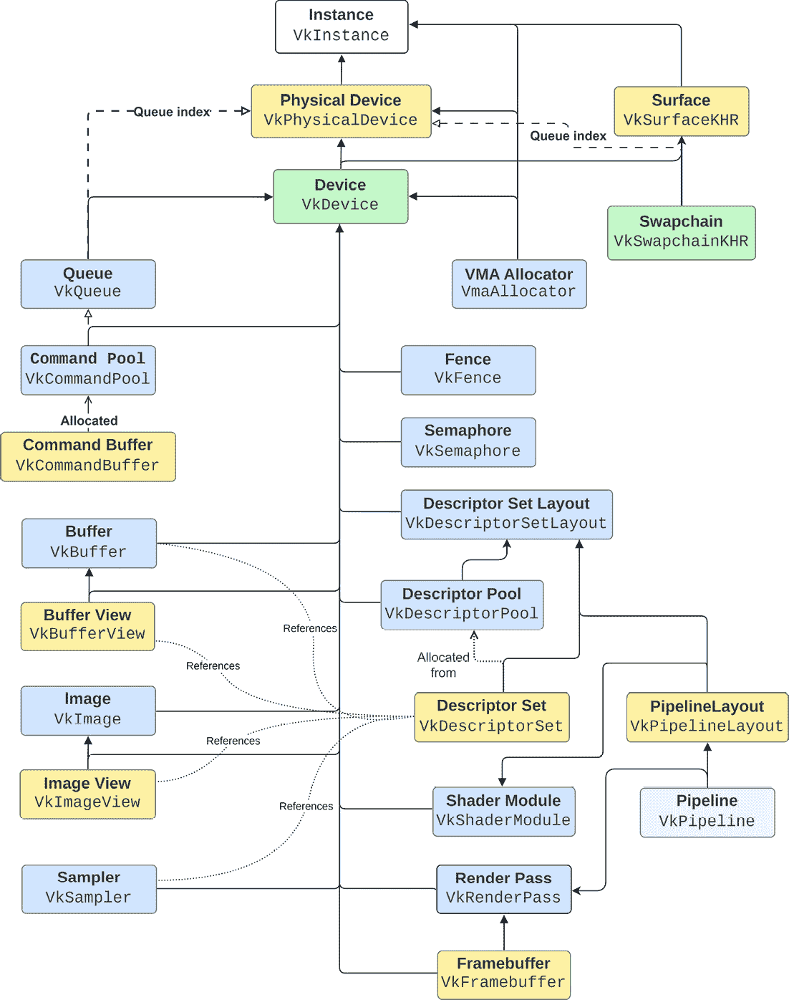

图 1.1 – Vulkan 中的对象依赖关系

1.  在前面的图中，每个节点都是一个 Vulkan 对象，其名称位于上半部分，其 Vulkan 类型位于下半部分。该图还编码了对象之间的依赖关系，显式和隐式。连接对象的箭头表示对象需要创建的内容（除了它们的参数，这些参数没有在图中表示）。

1.  实线箭头是显式依赖关系：一个对象需要引用离开其节点的所有由箭头指向的对象。例如，一个设备需要引用物理设备才能创建；缓冲区视图需要引用缓冲区和设备。虚线箭头表示隐式依赖关系：队列对象需要一个对设备的引用，但它不需要显式地引用物理设备，只需要一个队列索引到一个队列族，这个索引是从物理设备获得的。它不需要物理设备，但它需要由物理设备提供的东西。

1.  带有末端开放箭头的实线表示从其他对象分配的对象，通常是这些类型对象的池。命令缓冲区不是创建的；它是从命令池（反过来，在某个时候需要创建）分配的。

1.  此图对初学者很有用，因为它有助于可视化那些并不完全明显的多个依赖关系。描述符集就是那些对象之一：要获得一个描述符集，你需要一个描述符集布局的引用。它们不是由应用程序创建的；它们是从描述符池中分配的。最后，描述符集引用缓冲区、图像视图和采样器。它们不是必需的，这就是为什么图中那种类型的关联表示一个可选引用。我们将在*第二章**，使用现代 Vulkan*中更多地讨论描述符集。

在本章的剩余部分和下一章中，我们将按照通常实现它们的顺序介绍图中所有对象的创建。这意味着从顶部开始，即 Vulkan 实例，然后向下移动，满足图中表示的依赖关系。

# 使用 Volk 加载 Vulkan 函数和扩展

Volk 是由阿列克谢·卡波卢金（Arseny Kapoulkine）创建的开源库，它为加载 Vulkan 函数提供了简单的跨平台支持。该库提供了一些关键特性，其中最重要的包括自动加载 Vulkan 的函数指针并提供跨平台支持。

在本食谱中，您将学习如何使用 Volk 加载 Vulkan 函数及其扩展。

## 准备工作

从 [`github.com/zeux/volk`](https://github.com/zeux/volk) 下载 Volk，并将 `volk.c` 添加到您的项目中，在包含 `volk.h` 之前，启用您平台的预处理器定义，例如 `VK_USE_PLATFORM_WIN32_KHR`、`VK_USE_PLATFORM_XLIB_KHR`、`VK_USE_PLATFORM_MACOS_MVK` 等。

## 如何操作…

Volk 自动加载 Vulkan 的函数指针，因此您不需要手动处理加载它们的细节以及检查可用的扩展。如果您在您的应用程序中使用 Volk，请不要链接到 Vulkan 库的静态版本（例如 Windows 上的 `VKstatic.1.lib`）或直接加载共享库（例如 Windows 上的 `vulkan-1.dll`）。Volk 会为您完成这些操作。

1.  在使用任何其他 Vulkan 函数之前，在应用程序启动过程中调用 `volkInitialize()`。

1.  在创建 Vulkan 实例之后调用 `volkLoadInstance`。它用通过 `vkGetInstanceProcAddr` 获取的函数替换全局函数指针。

1.  在创建 Vulkan 逻辑设备之后调用 `volkLoadDevice`。它用通过 `vkGetDeviceProcAddr` 获取的函数替换全局函数指针。

# 正确使用 Vulkan 扩展

Vulkan 严重依赖于扩展。扩展是 *Vulkan 规范* 的一部分，它们除了核心 API 之外还提供，但并不保证在特定版本的 API 中存在。它们可能是实验性的，或者是供应商和卡特定的，并且不能保证在编译时或运行时都存在。官方扩展已在 Khronos Group 注册，并成为规范的一部分，因此您可以在那里找到它们的文档。

扩展可能被引入到 *Vulkan 规范* 版本，并在较新版本中提升为核心功能集。或者根本不提升！例如，将渲染结果呈现到表面（如 GUI 上的窗口）的功能，即使在 Vulkan 1.3（本书撰写时的最新版本）中仍然是一个扩展。如果您对此好奇，这里有一个链接，即 `VK_KHR_surface` 设备扩展：[`registry.khronos.org/vulkan/specs/1.3-extensions/man/html/VK_KHR_surface.html`](https://registry.khronos.org/vulkan/specs/1.3-extensions/man/html/VK_KHR_surface.html)。

*图 1.2* 提供了该过程的概述：

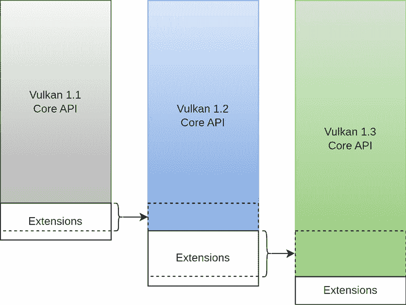

图 1.2 – Vulkan 扩展

例如，Vulkan 版本 1.1 包含其核心功能——该版本中存在的函数和类型——以及扩展。其中一些、所有或没有任何这些扩展可能被提升到 Vulkan 1.2 的核心功能集中。一些可能被认为已过时并被删除。当规范更新到 1.3 版本时，发生同样的情况：其中一些、所有或没有任何这些扩展可能从 1.2 版本提升到新版本，一些可能被过时。

在这个菜谱中，我们将展示在编译时和运行时处理扩展的正确方法。

## 准备工作

Vulkan 有两种类型的扩展：实例级和设备级扩展。在使用扩展之前，您需要检查它在编译时是否可用，并且只有当扩展可用时才添加使用该扩展的代码。一般来说，您不需要在运行时检查扩展。您还需要通过提供扩展的名称作为字符串来请求实例或设备启用扩展。

## 如何做到这一点...

除了在编译时存在扩展之外，您还需要在正确的级别（实例或设备）上启用它，并在运行时使用它之前检查它是否已启用。

1.  检查特定扩展在编译时和运行时是否可用的模式如下：

    ```cpp
    bool isEnabledForDevice(VkDevice device,
                            const std::string &extName) {
      // std::unordered_map<std::string> deviceExtensions;
      return deviceExtensions.contains(extName);
    }
      VkDevice device;  // Valid Vulkan Device
    #if defined(VK_KHR_win32_surface)
      // VK_KHR_WIN32_SURFACE_EXTENSION_NAME is defined as the string
      // "VK_KHR_win32_surface"
      if (isEnabledForDevice(device, VK_KHR_WIN32_SURFACE_EXTENSION_NAME)) {
        // VkWin32SurfaceCreateInfoKHR struct is available, as well as the
        // vkCreateWin32SurfaceKHR() function
        VkWin32SurfaceCreateInfoKHR surfaceInfo;
      }
    #endif
    ```

1.  除了新的功能和类型之外，Vulkan SDK 为每个扩展提供了宏。这些宏可以用来检查它们是否存在，它们的名称和版本。在先前的列表中，定义了一个 `VK_KHR_win32_surface` 宏，并将其设置为 `1`，如果扩展可用。`VK_KHR_WIN32_SURFACE_EXTENSION_NAME` 宏定义了一个 `const char *` 作为扩展的名称（在这种情况下，它是 `VK_KHR_win32_surface`），以及一个 `VK_KHR_WIN32_SURFACE_SPEC_VERSION` 宏，它被定义为整数，指定了其版本号。

1.  在创建 `VkWin32SurfaceCreateInfoKHR` 实例之前，我们检查 `VK_KHR_win32_surface` 设备扩展是否存在并已启用。代码由 `+#if+` 指令保护，如果扩展存在，我们继续检查它在运行时是否已启用，使用 `VK_KHR_WIN32_SURFACE_EXTENSION_NAME` 宏。

如果你在编写跨平台代码，这个检查尤为重要。虽然可能很明显某些扩展应该可用，但它们可能不是你计划支持的 所有平台或显卡上都有。

# 使用验证层进行错误检查

在高性能、低开销 API 的精神下，Vulkan 默认不执行错误检查。这样做可能会造成性能损失，这可能对某些应用程序来说是无法接受的。另一方面，由于 Vulkan 的复杂性，应用程序很容易出错。

为了帮助应用程序作者检测错误，Vulkan 提供了层，这些层可以在开发期间启用，并在以后禁用以进行发布。这种组合不是强制性的，因为开发者不需要启用错误检测层进行测试，也不需要禁用它们以进行发布，尽管这是最常见的情况。

在这个菜谱中，我们将介绍 Vulkan 层是什么以及它们的消息是如何呈现的，并提供有关如何了解更多关于这些消息含义的技巧。

## 准备工作

层由 Vulkan SDK 提供，所以如果你在使用 Vulkan，那么你默认也有权访问层。

## 如何做…

层是 Vulkan 函数的实现，可以在调用链中插入，拦截进入 API 的入口点。这些实现可以执行错误检查、性能测量，甚至检测可能的优化。

Vulkan SDK 提供了一些**即插即用**（**PnP**）的层。你需要做的唯一工作就是找到哪些层存在，并启用它们以用于 Vulkan 实例。之后，在运行时，层应该在你开始调用 Vulkan 函数时立即开始执行它们的工作。

1.  SDK 中可用的最重要的层是验证层。这个层将验证所有 Vulkan 函数调用及其参数。它还维护一个内部状态——这是 Vulkan 所不具备的——以确保你的应用程序没有缺少同步步骤或使用错误的图像布局。

1.  例如，以下消息显示了验证层显示的真实消息。尽管有些晦涩难懂，但这个消息非常有用：它首先显示错误 ID（`VUID-VkSamplerCreateInfo-sType-sType`），你可以用它在网上搜索；它还显示了与错误关联的设备；最后，它显示了消息 ID 和文本，告诉我们在这个例子中，我们用来创建采样器（`VkSamplerCreateInfo`）的结构需要其`sType`成员等于`VK_STRUCTURE_TYPE_SAMPLER_CREATE_INFO`：

    ```cpp
    VUID-VkSamplerCreateInfo-sType-sType(ERROR / SPEC): msgNum: -129708450 - Validation Error: [ VUID-VkSamplerCreateInfo-sType-sType ] Object 0: handle = 0x1fbd501b6e0, name = Device, type = VK_OBJECT_TYPE_DEVICE; | MessageID = 0xf844ce5e | vkCreateSampler: parameter pCreateInfo->sType must be VK_STRUCTURE_TYPE_SAMPLER_CREATE_INFO. The Vulkan spec states: sType must be VK_STRUCTURE_TYPE_SAMPLER_CREATE_INFO (https://vulkan.lunarg.com/doc/view/1.3.236.0/windows/1.3-extensions/vkspec.html#VUID-VkSamplerCreateInfo-sType-sType)
        Objects: 1
            [0] 0x1fbd501b6e0, type: 3, name: Device
    ```

即使是最有经验的图形程序员也会遇到验证层错误。习惯于它们的外观以及如何弄清楚它们的含义是编写无验证层错误的 Vulkan 应用程序的第一步。

# 列出可用的实例层

启用实例层就像将其名称作为`const char *`提供给实例创建函数一样简单。不幸的是，并非所有层在所有实现中都存在，在尝试启用它们之前，我们需要检查可用的层。

在这个菜谱中，您将学习如何枚举可用实例层，以及如何将它们转换为字符串，以便更容易管理。

## 准备工作

本节中展示的代码片段是`Context`类的一部分。它封装了大多数初始化和对象创建函数。

## 如何操作…

检查可用扩展很容易做到：

1.  首先，您需要使用`vkEnumerateInstanceLayerProperties`函数查询扩展的数量，创建一个足够大的`VkLayerProperties`数组来存储所有扩展，并通过再次调用同一函数来请求它们的数据，如下所示：

    ```cpp
    uint32_t instanceLayerCount{0};
    VK_CHECK(vkEnumerateInstanceLayerProperties(
        &instanceLayerCount, nullptr));
    std::vector<VkLayerProperties> layers(
        instanceLayerCount);
    VK_CHECK(vkEnumerateInstanceLayerProperties(
        &instanceLayerCount, layers.data()));
    ```

    第二次调用`vkEnumerateInstanceLayerProperties`将所有可用层存储在`layers`向量中，然后可以用于查询、诊断等。

1.  拥有这些信息后，始终验证您试图启用的层是否可用是个好主意。由于实例创建函数接受以`const char *`格式表示的层名，我们需要将扩展名转换为字符串：

    ```cpp
    std::vector<std::string> availableLayers;
    std::transform(
        layers.begin(), layers.end(),
        std::back_inserter(availableLayers),
        [](const VkLayerProperties& properties) {
          return properties.layerName;
        });
    ```

1.  最后，需要根据可用的层对请求的层进行过滤。使用两个字符串向量，一个用于可用层，一个用于请求层，我们可以使用以下实用函数来执行过滤：

    ```cpp
    std::unordered_set<std::string> filterExtensions(
        std::vector<std::string> availableExtensions,
        std::vector<std::string> requestedExtensions) {
      std::sort(availableExtensions.begin(),
                availableExtensions.end());
      std::sort(requestedExtensions.begin(),
                requestedExtensions.end());
      std::vector<std::string> result;
      std::set_intersection(
          availableExtensions.begin(),
          availableExtensions.end(),
          requestedExtensions.begin(),
          requestedExtensions.end(),
          std::back_inserter(result));
      return std::unordered_set<std::string>(
          result.begin(), result.end());
    }
    ```

这个函数非常方便，因为实例层、实例和设备扩展都通过它们的名称作为`const char*`来引用。这个函数可以应用于过滤 Vulkan 中所需的所有层和扩展。

# 列举可用实例扩展

对请求的层与可用的层进行过滤的过程应该重复应用于实例扩展。

在这个菜谱中，您将学习如何获取可用实例扩展，如何将它们存储为字符串，以及如何将它们转换为字符指针，以便可以将它们传递给 Vulkan API。

## 准备工作

这个过程与之前描述的过程非常相似，也包括一个实用函数来执行可用层和请求层的交集。

## 如何操作…

获取扩展列表与获取可用层一样简单。

1.  首先，调用`vkEnumerateInstanceExtensionProperties`两次，一次确定有多少扩展可用，然后再次调用以获取扩展：

    ```cpp
    uint32_t extensionsCount{0};
    vkEnumerateInstanceExtensionProperties(
        nullptr, &extensionsCount, nullptr);
    std::vector<VkExtensionProperties>
        extensionProperties(extensionsCount);
    vkEnumerateInstanceExtensionProperties(
        nullptr, &extensionsCount,
        extensionProperties.data());
    std::vector<std::string> availableExtensions;
    std::transform(
        extensionProperties.begin(),
        extensionProperties.end(),
        std::back_inserter(availableExtensions),
        [](const VkExtensionProperties& properties) {
          return properties.extensionName;
        });
    ```

1.  最后，我们可以使用之前步骤中的可用层和扩展列表来过滤请求的层和扩展。注意，我们正在请求验证层，并使用条件预处理器块保护所有扩展：

    ```cpp
    const std::vector<std::string>
        requestedInstanceLayers = {
            "VK_LAYER_KHRONOS_validation"};
    const std::vector<std::string>
        requestedInstanceExtensions = {
    #if defined(VK_KHR_win32_surface)
          VK_KHR_WIN32_SURFACE_EXTENSION_NAME,
    #endif
    #if defined(VK_EXT_debug_utils),
          VK_EXT_DEBUG_UTILS_EXTENSION_NAME,
    #endif
    #if defined(VK_KHR_surface)
          VK_KHR_SURFACE_EXTENSION_NAME,
    #endif
        };
    const auto enabledInstanceLayers =
        filterExtensions(availableLayers,
                          requestedInstanceLayers);
    const auto enabledInstanceExtensions =
        filterExtensions(availableExtensions,
                          requestedInstanceExtensions);
    ```

1.  要将字符串向量传递给 API，我们需要将它们转换为 `const char*` 向量，因为 API 只接受 `const char*` 参数。我们还需要对实例层的向量执行相同的转换（这里为了简洁省略）：

    ```cpp
    std::vector<const char*> instanceExtensions(
        enabledInstanceExtensions.size());
    std::transform(enabledInstanceExtensions.begin(),
                    enabledInstanceExtensions.end(),
                    instanceExtensions.begin(),
                    std::mem_fn(&std::string::c_str));
    ```

重要提示

`instanceExtensions` 向量不能比 `enabledInstanceExtensions` 向量存在时间更长。因为 `instanceExtensions` 包含指向 `enabledInstanceExtensions` 中字符串的指针，一旦后者被销毁，`instanceExtensions` 中的所有指针都将悬空。

# 初始化 Vulkan 实例

要开始使用 Vulkan，我们需要创建一个 Vulkan 实例。可以将 Vulkan 实例视为初始化 Vulkan 库的一种方式。要创建一个实例，你需要提供一组所需和可选信息，例如应用程序名称、引擎名称、版本以及所需层和扩展的列表。

在这个菜谱中，你将学习如何创建 Vulkan 实例。

## 准备工作

创建用于创建实例的 `VkApplicationInfo` 结构体需要应用程序版本和 Vulkan API 版本。前者可以使用 `VK_MAKE_VERSION` 宏创建，而后者可以作为 SDK 中可用的预处理器定义之一提供。

## 如何操作...

拥有所有这些，我们只需要创建一个 Vulkan 实例：

1.  首先创建 `VkApplicationInfo` 结构体的实例：

    ```cpp
    const VkApplicationInfo applicationInfo_ = {
        .sType = VK_STRUCTURE_TYPE_APPLICATION_INFO,
        .pApplicationName = "Essential Graphics With Vulkan",
        .applicationVersion = VK_MAKE_VERSION(1, 0, 0),
        .apiVersion = VK_API_VERSION_1_3,
    };
    ```

1.  你还需要一个包含所需实例层和扩展的 `VkInstanceCreateInfo` 结构体实例。然后，调用 `vkCreateInstance`：

    ```cpp
    const VkInstanceCreateInfo instanceInfo = {
        .sType =
            VK_STRUCTURE_TYPE_INSTANCE_CREATE_INFO,
        .pApplicationInfo = &applicationInfo_,
        .enabledLayerCount = static_cast<uint32_t>(
            requestedLayers.size()),
        .ppEnabledLayerNames = requestedLayers.data(),
        .enabledExtensionCount = static_cast<uint32_t>(
            instanceExtensions.size()),
        .ppEnabledExtensionNames =  instanceExtensions.data(),
    };
    VkInstance instance_{VK_NULL_HANDLE};
    VK_CHECK(vkCreateInstance(&instanceInfo, nullptr,
                              &instance_));
    ```

一旦创建了 Vulkan 实例，你应该安全地存储它，因为在你应用程序退出之前需要销毁它。

# 创建表面

正如 OpenGL 一样，将最终渲染输出呈现到屏幕上需要窗口系统的支持，并且依赖于平台。因此，Vulkan 核心 API 不包含将最终图像渲染到屏幕上的函数。这些函数和类型是扩展。对于这个菜谱，我们将使用 `VK_KHR_surface` 和 `VK_KHR_swapchain` 扩展。在这里，我们只涵盖 Windows 的情况，并使用 `VK_KHR_win32_surface` 扩展。

在这个菜谱中，你将学习如何创建一个用于呈现渲染最终输出的表面。

## 准备工作

将图像渲染到屏幕上的过程的第一步是创建一个 `VkSurfaceKHR` 对象。由于在从物理设备预留队列时需要此对象，因此此步骤是在创建实例之后、枚举物理设备之前以及创建设备之前完成的，因为设备需要有关我们将使用哪些队列家族的信息。

## 如何操作...

创建 `VkSurfaceKHR` 对象很简单，但需要窗口系统的支持。

1.  在 Windows 上，你需要可执行文件的实例句柄（`HINSTANCE`）和用于显示图像的窗口句柄（`HWND`）。我们使用 GLFW，因此可以通过 `glfwGetWin32Window(GLFWwindow*)` 获取 `VkWin32SurfaceCreateInfoKHR` 结构体所使用的窗口。`VkSurfaceKHR` 对象的句柄存储在 `Context::surface_` 中：

    ```cpp
    const auto window = glfwGetWin32Window(glfwWindow);
    #if defined(VK_USE_PLATFORM_WIN32_KHR) && \
        defined(VK_KHR_win32_surface)
        if (enabledInstanceExtensions_.contains(
                VK_KHR_WIN32_SURFACE_EXTENSION_NAME)) {
          if (window != nullptr) {
            const VkWin32SurfaceCreateInfoKHR ci = {
                .sType =
                    VK_STRUCTURE_TYPE_WIN32_SURFACE_CREATE_INFO_KHR,
                .hinstance = GetModuleHandle(NULL),
                .hwnd = (HWND)window,
            };
            VK_CHECK(vkCreateWin32SurfaceKHR(
                instance_, &ci, nullptr, &surface_));
          }
        }
    #endif
    ```

表面创建在不同平台之间略有不同，但过程非常相似。

# 枚举 Vulkan 物理设备

在我们能够创建 Vulkan 设备之前，我们需要选择一个合适的物理设备，因为一个系统可能拥有多个支持 Vulkan 的 GPU，而我们希望选择一个符合我们应用程序所需功能的 GPU。为此，我们需要枚举系统上所有可用的物理设备。这可以通过调用 `vkEnumeratePhysicalDevices` 函数来实现，该函数返回系统上支持 Vulkan API 的所有物理设备的列表。一旦我们有了物理设备的列表，我们可以使用 `vkGetPhysicalDeviceProperties` 和 `vkGetPhysicalDeviceFeatures` 函数来检查它们的属性和功能，以确定它们是否具有所需的功能。最后，我们可以选择最合适的物理设备，并通过 `vkCreateDevice` 函数使用它来创建逻辑设备。

在本食谱中，你将学习如何枚举系统中所有具有 Vulkan 功能的设备，以便你可以选择最适合你需求的设备。

## 准备工作

在我们的代码中，我们使用一个名为 `VulkanCore::PhysicalDevice` 的类封装物理设备，该类检索物理设备的属性并将它们存储以供以后使用。

此外，如果你想在拥有多个支持 Vulkan 的设备上使用更好的启发式方法来选择一个物理设备，请确保查看 `Context::choosePhysicalDevice()` 方法。

## 如何做到这一点...

枚举物理设备使用的是 API 中通用的模式，这要求我们首先请求可用项的数量，然后获取并将它们存储到一个向量中：

1.  `vkEnumeratePhysicalDevices` 被调用两次，第一次是为了查询有多少对象可用，第二次是为了获取 `VkPhysicalDevice` 对象的句柄：

    ```cpp
    std::vector<PhysicalDevice>
    Context::enumeratePhysicalDevices(
        const std::vector<std::string>&
            requestedExtensions) const {
      uint32_t deviceCount{0};
      VK_CHECK(vkEnumeratePhysicalDevices(
          instance_, &deviceCount, nullptr));
      ASSERT(deviceCount > 0,
              "No Vulkan devices found");
      std::vector<VkPhysicalDevice> devices(
          deviceCount);
      VK_CHECK(vkEnumeratePhysicalDevices(
          instance_, &deviceCount, devices.data()));
      std::vector<PhysicalDevice> physicalDevices;
      for (const auto device : devices) {
        physicalDevices.emplace_back(PhysicalDevice(
            device, surface_, requestedExtensions,
            printEnumerations_));
      }
      return physicalDevices;
    }
    ```

此方法返回一个 `PhysicalDevice` 对象的向量。在代码中，此列表被传递给 `Context::choosePhysicalDevice()` 辅助方法，该方法可以根据请求的扩展和其他可能需要的 GPU 功能来选择一个合适的物理设备。为了简化，我们始终从列表中选择第一个物理设备。

# 缓存队列家族的属性

在 Vulkan 中，一个物理设备可以有一个或多个队列家族，其中每个队列家族代表一组具有某些属性（如功能或用途）的命令队列。*图 1**.3* 描述了一个虚构的家族集合及其队列：

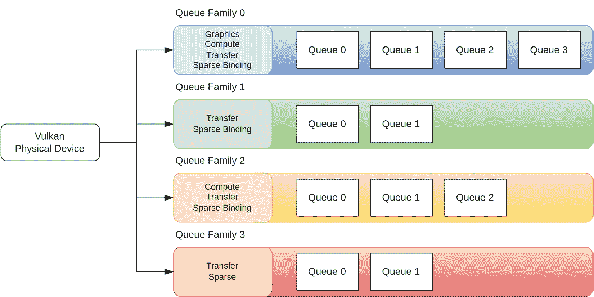

图 1.3 – 队列家族及其队列

每个队列家族支持一组特定的操作和命令，这些操作和命令可以并行执行。例如，可能有一个图形队列家族、一个计算队列家族和一个传输队列家族，每个家族针对不同类型的操作进行了优化。

在这个菜谱中，你将学习如何检索队列家族的属性以及它们在代码存储库中的存储位置。

## 准备工作

在本书提供的存储库中，队列家族及其属性由`VulkanCore::PhysicalDevice`类存储和管理。

## 如何操作…

每个队列家族都有自己的属性集，例如队列数量、它可以执行的操作类型以及队列的优先级。当创建逻辑设备时，我们必须指定我们想要使用的队列家族以及每种类型的队列数量。

1.  要查询可用的队列家族及其属性，请使用`vkGetPhysicalDeviceQueueFamilyProperties`函数：

    ```cpp
    uint32_t queueFamilyCount{0};
    vkGetPhysicalDeviceQueueFamilyProperties(
        physicalDevice_, &queueFamilyCount, nullptr);
    queueFamilyProperties_.resize(queueFamilyCount);
    vkGetPhysicalDeviceQueueFamilyProperties(
        physicalDevice_, &queueFamilyCount,
        queueFamilyProperties_.data());
    ```

家族的属性存储在`std::vector<VkQueueFamilyProperties>` `PhysicalDevice::queueFamilyProperties_`中。

# 枚举物理设备扩展

物理设备扩展必须由应用程序显式启用，并且可能仅在特定的物理设备或设备驱动程序上可用。检查所需扩展的可用性以及优雅地处理不支持扩展的情况非常重要。

在这个菜谱中，你将学习如何枚举所有物理设备扩展以及如何将它们转换为字符串以便以后使用。

## 准备工作

物理设备扩展的枚举由`VulkanCore::PhysicalDevice`类管理。

## 如何操作…

获取物理设备的所有物理设备扩展很简单。在这里，我们还提供了将它们作为字符串存储的代码，以便更容易处理。

1.  枚举所有物理设备扩展是通过使用`vkEnumerateDeviceExtensionProperties`函数完成的。结果是`VkExtensionProperties`结构体的数组。此结构体包含有关扩展名称、版本以及扩展用途的简要描述：

    ```cpp
    uint32_t propertyCount{0};
    VK_CHECK(vkEnumerateDeviceExtensionProperties(
        physicalDevice_, nullptr, &propertyCount,
        nullptr));
    std::vector<VkExtensionProperties> properties(
        propertyCount);
    VK_CHECK(vkEnumerateDeviceExtensionProperties(
        physicalDevice_, nullptr, &propertyCount,
        properties.data()));
    ```

1.  将扩展的名称转换为`std::string`：

    ```cpp
    std::transform(
        properties.begin(), properties.end(),
        std::back_inserter(extensions_),
        [](const VkExtensionProperties& property) {
          return std::string(property.extensionName);
        });
    ```

1.  此数组经过处理，最终我们只得到扩展名称的字符串。进一步处理使用我们的`filterExtensions`实用函数将请求的扩展与可用的扩展进行筛选，并将它们存储在`std::unordered_set<std::string>` `PhysicalDevice::enabledExtensions_`中：

    ```cpp
    enabledExtensions_ = util::filterExtensions(
        extensions_, requestedExtensions);
    ```

总结来说，掌握物理设备扩展的枚举是 Vulkan 的一个重要方面。它确保了设备能力的最佳利用。

# 预留队列家族

在 Vulkan 中，队列家族是一组一个或多个共享共同属性（例如它们可以执行的操作类型）的队列。当创建 Vulkan 设备时，我们必须指定我们想要使用的队列家族以及每个家族需要多少个队列。

对于渲染和展示，我们通常需要一个至少包含一个图形队列家族，该家族负责执行图形命令。此外，我们可能需要一个计算队列家族来执行计算工作负载，以及一个传输队列家族来处理数据传输。

在这个菜谱中，你将学习如何根据队列的特性找到队列家族，以及如何选择一个支持展示的队列家族，这可以用于在屏幕上展示最终的渲染输出。

## 准备工作

在仓库中，预留队列被 `VulkanCore::PhysicalDevice` 类封装。

## 如何操作…

在创建 Vulkan 设备之前，一个必要的额外步骤是收集我们想要使用的队列家族的索引。为此，我们在 `PhysicalDevice` 类中创建了一个 `reserveQueues()` 方法来处理这个过程，它接受我们想要预留的队列类型作为参数。它还接受一个指向 Vulkan 表面（`VkSurfaceKHR`）的句柄，我们将在以后使用它来验证队列是否支持展示，这是在屏幕上显示最终渲染所必需的。

1.  我们遍历存储在 `queueFamilyProperties_` 中的队列家族属性，如果其类型已被请求，则存储队列家族的索引：

    ```cpp
    uint32_t graphicsFamilyIndex{UINT32_MAX};
    uint32_t presentationFamilyIndex{UINT32_MAX};
    for (uint32_t queueFamilyIndex = 0;
          queueFamilyIndex <
              queueFamilyProperties_.size() &&
          requestedQueueTypes != 0;
          ++queueFamilyIndex) {
      if (graphicsFamilyIndex == UINT32_MAX &&
          (queueFamilyProperties_[queueFamilyIndex]
                .queueFlags &
            VK_QUEUE_GRAPHICS_BIT)) {
        graphicsFamilyIndex = queueFamilyIndex;
      }
    ```

1.  要检测一个队列家族是否支持展示，我们使用 `vkGetPhysicalDeviceSurfaceSupportKHR` 函数，该函数由预处理宏保护：

    ```cpp
    #if defined(VK_KHR_surface)
      if (enabledInstanceExtensions_.contains(
              VK_KHR_SURFACE_EXTENSION_NAME)) {
        if (presentationFamilyIndex == UINT32_MAX &&
            surface != VK_NULL_HANDLE) {
          VkBool32 supportsPresent{VK_FALSE};
          vkGetPhysicalDeviceSurfaceSupportKHR(
              physicalDevice_, queueFamilyIndex,
              surface, &supportsPresent);
          if (supportsPresent == VK_TRUE) {
            presentationFamilyIndex = queueFamilyIndex;
          }
        }
      }
    #endif
    }
    ```

其他类型队列家族的索引可以通过类似的方式获得。

# 创建 Vulkan 逻辑设备

Vulkan 设备是物理 GPU 的逻辑表示。它是一个与所选物理设备（系统中的现有 GPU）相关联的对象，用于执行所有图形和计算操作。设备还通过队列提供对物理 GPU 功能的访问。队列用于向 GPU 提交命令，例如绘制调用或内存传输。设备还提供对其他 Vulkan 对象的访问，例如管线、缓冲区和图像。

在这个菜谱中，你将学习如何创建一个 Vulkan 逻辑设备。

## 准备工作

这个菜谱中的代码作为 `VulkanCore::Context` 类的一部分在仓库中可用。`Context` 类代表一个 Vulkan 逻辑设备。

## 如何操作…

要创建一个 Vulkan 设备，我们需要提供一个物理设备和我们想要使用的队列家族的索引。使用这些信息，我们可以创建一个 `VkDeviceQueueCreateInfo` 结构体的向量，这决定了我们想要从每个家族中使用的队列数量及其相应的优先级。

1.  创建设备的最常见的用例是每个家族使用一个队列，并将其优先级设置为 `1`：

    ```cpp
    auto physicalDevice_ = enumeratePhysicalDevices(
        requestedExtensions)[0];
    // Retrieves a vector of (queue family indices and
    // their number)
    const vector<uint32_t> familyIndices =
        physicalDevice_.reservedFamilies();
    std::vector<VkDeviceQueueCreateInfo>
        queueCreateInfos;
    float priority{1.0f};
    for (const auto& queueFamilyIndex :
          familyIndices) {
      queueCreateInfos.emplace_back(
          VkDeviceQueueCreateInfo{
              .sType =
                  VK_STRUCTURE_TYPE_DEVICE_QUEUE_CREATE_INFO,
              .queueFamilyIndex = queueFamilyIndex,
              .queueCount = 1,
              .pQueuePriorities = &priority,
          });
      ++index;
    }
    ```

1.  请求的设备扩展列表被转换为 `const char*`，与可用的扩展进行过滤，并添加到 `VkDeviceCreateInfo` 结构中，包括我们想要使用的队列家族的索引和想要启用的层：

    ```cpp
    std::vector<const char*> deviceExtensions(
        physicalDevice_.enabledExtensions().size());
    std::transform(
        physicalDevice_.enabledExtensions().begin(),
        physicalDevice_.enabledExtensions().end(),
        deviceExtensions.begin(),
        std::mem_fn(&std::string::c_str));
    const VkDeviceCreateInfo dci = {
        .sType = VK_STRUCTURE_TYPE_DEVICE_CREATE_INFO,
        .queueCreateInfoCount = static_cast<uint32_t>(
            queueCreateInfos.size()),
        .pQueueCreateInfos = queueCreateInfos.data(),
        .enabledLayerCount = static_cast<uint32_t>(
            requestedLayers.size()),
        .ppEnabledLayerNames = requestedLayers.data(),
        .enabledExtensionCount = static_cast<uint32_t>(
            deviceExtensions.size()),
        .ppEnabledExtensionNames =
            deviceExtensions.data(),
    };
    VK_CHECK(vkCreateDevice(
        physicalDevice_.vkPhysicalDevice(), &dci,
        nullptr, &device_));
    ```

Vulkan 设备是你需要的最重要的对象之一，因为它几乎需要创建所有其他 Vulkan 对象。

# 获取队列对象句柄

一旦创建了逻辑设备，我们需要获取队列的句柄。这是通过`vkGetDeviceQueue`函数实现的。这个句柄将用于将命令缓冲区提交到 GPU 进行处理。

在本配方中，你将学习如何获取 Vulkan 队列的句柄。

## 准备工作

在存储库中，所有队列都是通过`VulkanCore::Context`类检索和存储的。该类为每种类型的队列维护一个列表：图形、计算、传输和稀疏，以及一个用于演示的特殊队列。

## 如何做…

要获取队列的句柄，只需使用队列家族索引和队列索引调用`vkGetDeviceQueue`函数：

```cpp
VkQueue queue{VK_NULL_HANDLE};
uint32_t queueFamilyIndex; // valid queue family
vkGetDeviceQueue(device, queueFamilyIndex, 0, &queue);
```

仅知道哪些队列家族可用是不够的。一旦我们确定了哪些队列可用以及我们需要的队列，我们将使用本配方中介绍的 API 从家族中请求一个队列的句柄。

# 创建命令池

**命令缓冲区**提供了记录图形和计算命令的能力，而命令队列允许将这些缓冲区提交到硬件。记录在命令缓冲区中的命令随后将由 GPU 执行。

每个队列都与一个特定的队列家族相关联，这定义了队列的能力。例如，一个队列家族可能只支持图形操作，或者它可能同时支持图形和计算操作。可以使用`vkGetPhysicalDeviceQueueFamilyProperties`函数检索家族的数量及其能力，该函数在*缓存队列家族属性*配方中进行了讨论。一个队列家族可能包含一个或多个队列。

命令缓冲区是 GPU 实际执行的命令的容器。要记录命令，你需要分配一个命令缓冲区，然后使用`vkCmd*`函数系列将命令记录到其中。一旦命令被记录，命令缓冲区就可以提交到命令队列以执行。

命令缓冲区是从命令池中分配的，该命令池又是由设备和特定的队列家族创建的。

在本配方中，你将学习如何创建命令池。

## 准备工作

命令池以及分配和提交命令缓冲区的管理由`VulkanCore::CommandQueueManager`类负责。

## 如何做…

创建命令池非常简单。你只需要队列家族索引和一个创建标志。对于我们的目的，`VK_COMMAND_POOL_CREATE_RESET_COMMAND_BUFFER_BIT` 标志就足够了。

要创建命令池，请使用`vkCreateCommandPool`函数。`VK_COMMAND_POOL_CREATE_RESET_COMMAND_BUFFER_BIT`标志意味着从这个池中分配的每个命令缓冲区都可以单独或隐式地通过调用`vkCmdBeginCommandBuffer`来重置：

```cpp
uint32_t queueFamilyIndex; // Valid queue family index
const VkCommandPoolCreateInfo commandPoolInfo = {
    .sType = VK_STRUCTURE_TYPE_COMMAND_POOL_CREATE_INFO,
    .flags =
      VK_COMMAND_POOL_CREATE_RESET_COMMAND_BUFFER_BIT,
    .queueFamilyIndex = queueFamilyIndex,
};
VkCommandPool commandPool{VK_NULL_HANDLE};
VK_CHECK(
    vkCreateCommandPool(device, &commandPoolInfo,
                        nullptr, &commandPool));
```

使用命令池对象，你可以开始为记录命令分配命令缓冲区。

# 分配、记录和提交命令

命令缓冲区是通过使用 `vkAllocateCommandBuffers` 函数从命令池中分配的。在将命令记录到缓冲区并准备提交给 `vkEndCommandBuffer` 之前，必须使用 `vkBeginCommandBuffer` 函数初始化命令缓冲区。命令在那些函数调用之间记录，并且只有在命令缓冲区通过 `vkQueueSubmit` 提交到设备后才会执行。

在这个菜谱中，你将学习如何分配命令缓冲区，如何在命令缓冲区中记录命令，以及如何提交它们以在 GPU 上执行。

## 准备工作

命令缓冲区是从 `VulkanCore::CommandQueueManager` 类中分配的，并使用相同的类提交。`VulkanCore::CommandQueueManager` 提供了基本功能来维护一组用于处理的命令缓冲区。

## 如何操作…

命令缓冲区的生命周期始于从命令池中分配它。一旦开始，就可以将命令记录到其中。在提交之前，需要明确地通知它们记录已结束。然后可以提交它们以执行：

1.  要分配命令缓冲区，你调用 `vkAllocateCommandBuffers`，传入命令池、你想要分配的缓冲区数量以及指向一个指定命令缓冲区属性的结构的指针：

    ```cpp
    const VkCommandBufferAllocateInfo commandBufferInfo = {
            .sType =
                VK_STRUCTURE_TYPE_COMMAND_BUFFER_ALLOCATE_INFO,
            .commandPool = commandPool_,
            .level = VK_COMMAND_BUFFER_LEVEL_PRIMARY,
            .commandBufferCount = 1,
        };
        VkCommandBuffer cmdBuffer{VK_NULL_HANDLE};
        VK_CHECK(vkAllocateCommandBuffers(
            device, &commandBufferInfo, &cmdBuffer));
    ```

1.  在成功分配命令缓冲区后，可以开始记录 Vulkan 命令。记录过程通过调用 `vkBeginCommandBuffer` 函数启动，该函数的参数包括命令缓冲区和指向一个定义记录属性的结构的指针。一旦记录完成，就调用 `vkEndCommandBuffer` 函数来最终化这个过程：

    ```cpp
    const VkCommandBufferBeginInfo info = {
          .sType = VK_STRUCTURE_TYPE_COMMAND_BUFFER_BEGIN_INFO,
          .flags = VK_COMMAND_BUFFER_USAGE_ONE_TIME_SUBMIT_BIT,
    };
    VK_CHECK(vkBeginCommandBuffer(cmdBuffer, &info));
    ```

    这里有一些可以在 Vulkan 命令缓冲区中记录的常用命令的示例：

    +   `vkCmdBindPipeline`：将管道绑定到命令缓冲区。此命令设置后续绘制调用的当前管道状态。

    +   `vkCmdBindDescriptorSets`：将描述符集绑定到命令缓冲区。描述符集持有可以由着色器使用的缓冲区和图像资源的引用。

    +   `vkCmdBindVertexBuffers`：将顶点缓冲区绑定到命令缓冲区。顶点缓冲区包含网格的顶点数据。

    +   `vkCmdDraw`：执行绘制调用，处理顶点并将生成的像素进行光栅化。

    +   `vkCmdDispatch`：执行计算着色器。

    +   `vkCmdCopyBuffer`：将数据从一个缓冲区复制到另一个缓冲区。

    +   `vkCmdCopyImage`：将数据从一个图像复制到另一个图像。

1.  一旦完成命令的记录，你必须调用 `vkEndCommandBuffer`：

    ```cpp
    VK_CHECK(vkEndCommandBuffer(cmdBuffer));
    ```

1.  一旦命令缓冲区被记录，它仍然存在于你的应用程序中，需要提交给 GPU 进行处理。这是通过 `vkQueueSubmit` 函数完成的：

    ```cpp
    VkDevice device;  // Valid Vulkan Device
    VkQueue queue;  // Valid Vulkan Queue
    VkFence fence{VK_NULL_HANDLE};
    const VkFenceCreateInfo fenceInfo = {
        .sType = VK_STRUCTURE_TYPE_FENCE_CREATE_INFO,
        .flags = VK_FENCE_CREATE_SIGNALED_BIT,
    };
    VK_CHECK(vkCreateFence(device, &fenceInfo, nullptr,
                            &fence));
    const VkSubmitInfo submitInfo = {
        .sType = VK_STRUCTURE_TYPE_SUBMIT_INFO,
        .commandBufferCount = 1,
        .pCommandBuffers = cmdBuffer,
    };
    VK_CHECK(
        vkQueueSubmit(queue, 1, submitInfo, fence));
    ```

在前面的代码中，栅栏是一个特定的 Vulkan 对象，它促进了 GPU 和 CPU 之间的同步。`vkQueueSubmit` 函数是一个异步操作，不会阻塞应用程序。因此，一旦提交了一个命令缓冲区，我们只能通过检查栅栏的状态（例如使用 `vkGetFenceStatus` 或 `vkWaitForFences` 函数）来确定它是否已被处理。请参阅 *理解 swapchain 中的同步 – 栅栏和信号量* 食谱，了解如何使用栅栏来同步您的应用程序和提交给 GPU 的命令的执行。

# 重复使用命令缓冲区

命令缓冲区可以记录一次并多次提交。它们也可以使用一次，在下次使用前重置，或者只是记录、提交然后丢弃。

在本食谱中，你将学习如何在不创建应用程序和 GPU 之间的竞态条件的情况下重复使用命令缓冲区。

## 准备工作

在 `VulkanCore::CommandQueueManager` 中提供的代码不同步命令缓冲区，但提供了帮助您同步的函数，例如 `goToNextCmdBuffer`、`waitUntilSubmitIsComplete` 和 `waitUntilAllSubmitsAreComplete`。

## 如何操作...

使用命令缓冲区可以通过两种方式实现：

1.  创建一个命令缓冲区并无限期地重复使用它。在这种情况下，一旦命令缓冲区被提交，就必须等待它被处理，然后才能开始记录新的命令。确保缓冲区已完成的 一种方式是检查与其关联的栅栏状态。如果栅栏要被重复使用，还需要重置其状态：

    ```cpp
    VkDevice device; // Valid Vulkan Device
    VK_CHECK(vkWaitForFences(device, 1, &fences, true,
                             UINT32_MAX));
    VK_CHECK(vkResetFences(device, 1, &fences));
    ```

    *图 1**.4* 展示了在 GPU 上提交处理后的命令缓冲区被立即重复使用的场景。如果没有任何形式的同步，重复使用命令缓冲区将导致竞态条件，因为它可能仍在 GPU 中处理：

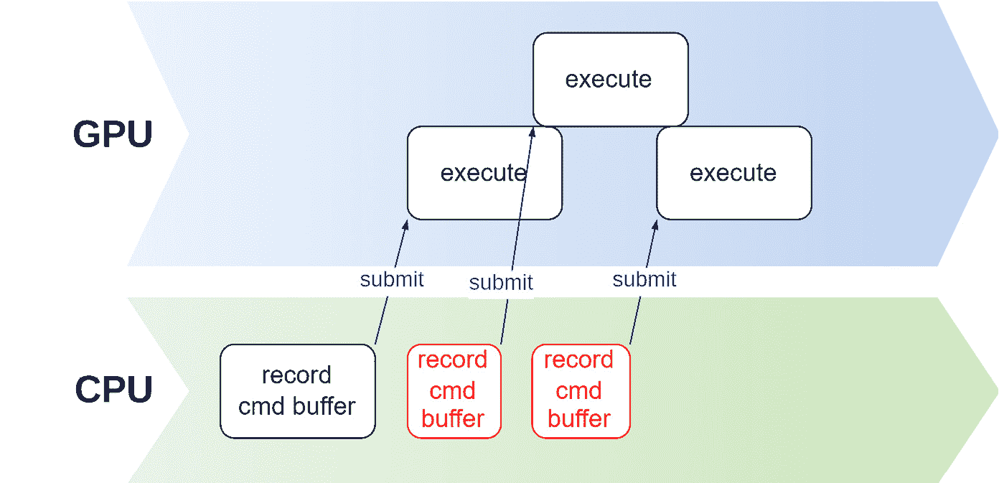

图 1.4 – 不使用栅栏记录和提交命令缓冲区

通过使用栅栏，如图 *图 1**.5* 所示，在重复使用命令缓冲区之前检查与命令缓冲区关联的栅栏状态，可以防止竞态条件。如果栅栏已被触发，则不需要等待，但如果在重复使用命令缓冲区之前栅栏尚未被触发，则应用程序必须在继续之前等待它被触发：

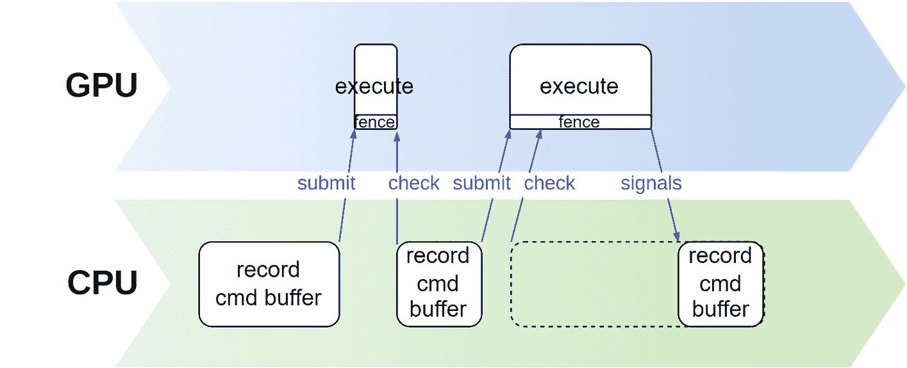

图 1.5 – 使用栅栏记录和提交命令缓冲区

1.  按需分配命令缓冲区。这是一种最简单的方法。每次你需要记录和提交命令时，只需从池中分配一个新的命令缓冲区，记录命令，提交它，然后忘记它。在这种情况下，你需要在创建命令池时传递`VK_COMMAND_POOL_CREATE_TRANSIENT_BIT`标志。如果你需要跟踪该缓冲区中命令使用的资源的状态，你可能仍然需要一个与该缓冲区关联的栅栏。

限制你的应用程序使用的命令缓冲区数量是一种良好的实践，这有助于减少程序所需的内存量。

# 创建渲染通道

渲染通道对象代表一系列读取和写入图像的渲染操作。它是一个高级抽象，有助于 GPU 优化渲染过程。在 Vulkan 中，附加物是用于渲染通道期间作为目标的图像的引用。附加物可以是颜色附加物（用于存储颜色信息）或深度或模板附加物（用于存储深度/模板信息）。*图 1.6*展示了渲染通道对象包含的概述：

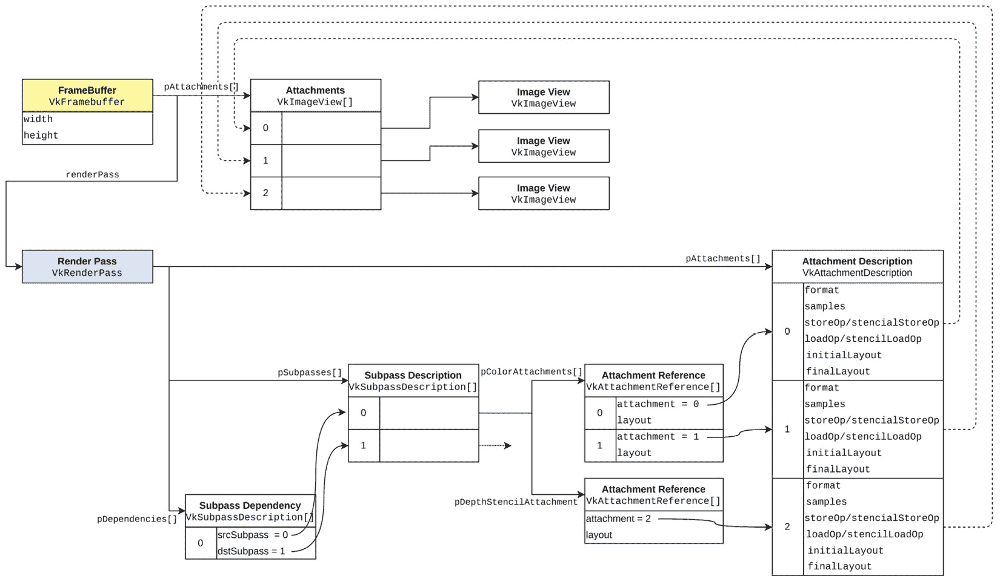

图 1.6 – 渲染通道和帧缓冲区组成

在 Vulkan 中创建渲染通道时，`VkAttachmentDescription`结构用于定义每个附加物的属性。`initialLayout`和`finalLayout`字段在优化渲染通道执行期间附加物使用和布局转换方面起着至关重要的作用。通过正确设置初始和最终布局，你可以避免使用额外的管道屏障来转换图像布局，因为这些转换将由渲染通道执行自动管理。例如，如果你有一个初始布局为`VK_IMAGE_LAYOUT_UNDEFINED`的颜色附加物，并且应该在渲染通道结束时转换为`VK_IMAGE_LAYOUT_PRESENT_SRC_KHR`布局，你可以相应地设置`initialLayout`和`finalLayout`字段。这消除了显式管道屏障处理转换的需要，因为渲染通道将自动在其执行过程中执行布局转换。

子通道是渲染通道的一部分，它执行特定的渲染操作。每个子通道都会加载附件，读取和/或写入，并在子通道结束时存储。加载和存储操作定义了在加载时附件的内容是否应该被加载、清除或无需关注（这意味着驱动器/硬件可以自由选择要做什么——或不要做什么），以及当存储在通道结束时是否应该存储或无需关注。它们对性能有重大影响，尤其是在移动 GPU 上。对于移动 GPU，最小化加载/存储操作的数量可以导致显著的性能提升。在可能的情况下，使用`VK_ATTACHMENT_LOAD_OP_DONT_CARE`和`VK_ATTACHMENT_STORE_OP_DONT_CARE`，我们可以避免不必要的内存带宽使用，这在移动设备上是一个常见的瓶颈。

子通道依赖关系描述了子通道应该执行的顺序以及它们之间所需的同步。在移动 GPU 上，使用多个子通道可以通过保持中间数据在片上内存（基于瓦片的渲染）中，从而帮助减少内存带宽使用。这避免了从主内存中写入和读取数据的需求，这在功耗和性能方面可能是昂贵的。

Vulkan 还支持渲染通道兼容性，允许为某个渲染通道创建的帧缓冲区与另一个兼容的渲染通道一起使用，从而提高资源利用率和性能。兼容性要求匹配附件数量、格式、加载/存储操作、样本数量和兼容布局；然而，子通道结构可以不同。

在本食谱中，你将学习如何创建渲染通道。

## 准备工作

创建渲染通道并不复杂，但需要一系列信息，如果封装在其自己的类中，则更容易管理。这样，类的析构函数可以在适当的时候处理对象的销毁，而无需我们添加代码来处理其销毁。 

在本书提供的代码中，渲染通道由`VulkanCore::RenderPass`类封装。

## 如何操作…

创建渲染通道需要一个列表，其中包含在该通道中将使用的所有附件，以及它们的加载和存储操作以及每个附件期望的最终布局。渲染通道必须与某种类型的管道（图形、计算等）相关联，因此构造函数还接受一个类型为`VkPipelineBindPoint`的值。

以下代码示例显示了`VulkanCore::RenderPass`类的一个构造函数。请注意，我们尚未介绍 Vulkan 图像（在代码中封装在`Texture`类中）。我们将在*第二章**，*使用现代 Vulkan*，*的*创建图像（**纹理）*食谱中更详细地讨论图像。

1.  构造函数会遍历所有将在渲染通道中使用的附件，并为每个附件创建一个`VkAttachmentDescription`结构体。这个结构体包含了从附件本身提取的基本信息（例如格式和初始布局），同时也记录了在加载和存储每个附件时应该做什么。在遍历渲染通道中使用的所有附件时，我们创建了另外两个辅助变量：一个包含颜色附件索引的列表（`colorAttachmentReferences`）和一个存储深度/模板附件索引的变量（`depthStencilAttachmentReference`），因为渲染通道只支持一个深度/模板附件：

    ```cpp
    RenderPass::RenderPass(
        const Context& context,
        const std::vector<std::shared_ptr<Texture>>
            attachments,
        const std::vector<VkAttachmentLoadOp>& loadOp,
        const std::vector<VkAttachmentStoreOp>& storeOp,
        const std::vector<VkImageLayout>& layout,
        VkPipelineBindPoint bindPoint,
        const std::string& name)
        : device_{context.device()} {
      ASSERT(attachments.size() == loadOp.size() &&
                 attachments.size() == storeOp.size() &&
                 attachments.size() == layout.size(),
             "The sizes of the attachments and their load "
             "and store operations and final layouts "
             "must match");
      std::vector<VkAttachmentDescription>
          attachmentDescriptors;
      std::vector<VkAttachmentReference>
          colorAttachmentReferences;
      std::optional<VkAttachmentReference>
          depthStencilAttachmentReference;
    ```

1.  对于每个附件，创建一个`VkAttachmentDescription`结构体并将其追加到`attachmentDescriptors`向量中：

    ```cpp
      for (uint32_t index = 0; index < attachments.size();
           ++index) {
        attachmentDescriptors.emplace_back(
            VkAttachmentDescription{
                .format = attachments[index]->vkFormat(),
                .samples = VK_SAMPLE_COUNT_1_BIT,
                .loadOp =
                    attachments[index]->isStencil()
                        ? VK_ATTACHMENT_LOAD_OP_DONT_CARE
                        : loadOp[index],
                .storeOp =
                    attachments[index]->isStencil()
                        ? VK_ATTACHMENT_STORE_OP_DONT_CARE
                        : storeOp[index],
                .stencilLoadOp =
                    attachments[index]->isStencil()
                        ? loadOp[index]
                        : VK_ATTACHMENT_LOAD_OP_DONT_CARE,
                .stencilStoreOp =
                    attachments[index]->isStencil()
                        ? storeOp[index]
                        : VK_ATTACHMENT_STORE_OP_DONT_CARE,
                .initialLayout =
                    attachments[index]->vkLayout(),
                .finalLayout = layout[index],
            });
    ```

1.  如果附件是深度或模板纹理，为它创建一个`VkAttachmentReference`结构体并将其存储在`depthStencilAttachmentReference`辅助变量中。否则，附件是一个颜色附件，我们创建并存储一个`VkAttachmentReference`结构体到`colorAttachmentReferences`向量中：

    ```cpp
        if (attachments[index]->isStencil() ||
            attachments[index]->isDepth()) {
          depthStencilAttachmentReference =
              VkAttachmentReference{
                  .attachment = index,
                  .layout =
                      VK_IMAGE_LAYOUT_DEPTH_STENCIL_ATTACHMENT_OPTIMAL,
              };
        } else {
          colorAttachmentReferences.emplace_back(
              VkAttachmentReference{
                  .attachment = index,
                  .layout =
                      VK_IMAGE_LAYOUT_COLOR_ATTACHMENT_OPTIMAL,
              });
        }
      }
    ```

1.  `RenderPass`类只创建一个子通道，该子通道存储颜色附件引用和深度/模板附件引用：

    ```cpp
      const VkSubpassDescription spd = {
          .pipelineBindPoint =
              VK_PIPELINE_BIND_POINT_GRAPHICS,
          .colorAttachmentCount = static_cast<uint32_t>(
              colorAttachmentReferences.size()),
          .pColorAttachments =
              colorAttachmentReferences.data(),
          .pDepthStencilAttachment =
              depthStencilAttachmentReference.has_value()
                  ? &depthStencilAttachmentReference
                         .value()
                  : nullptr,
      };
    ```

1.  我们使用的唯一子通道依赖于一个外部子通道（因为只有一个子通道，它必须依赖于外部的一个）：

    ```cpp
      const VkSubpassDependency subpassDependency = {
          .srcSubpass = VK_SUBPASS_EXTERNAL,
          .srcStageMask =
              VK_PIPELINE_STAGE_COLOR_ATTACHMENT_OUTPUT_BIT |
              VK_PIPELINE_STAGE_EARLY_FRAGMENT_TESTS_BIT,
          .dstStageMask =
              VK_PIPELINE_STAGE_COLOR_ATTACHMENT_OUTPUT_BIT |
              VK_PIPELINE_STAGE_EARLY_FRAGMENT_TESTS_BIT,
          .dstAccessMask =
              VK_ACCESS_COLOR_ATTACHMENT_WRITE_BIT |
              VK_ACCESS_DEPTH_STENCIL_ATTACHMENT_WRITE_BIT,
      };
    ```

1.  最后，所有这些信息都存储在类型为`VkRenderPassCreateInfo`的结构体中，该结构体与设备一起传递，以使用`vkCreateRenderPass`创建渲染通道。句柄存储在`RenderPass::renderPass_`成员变量中：

    ```cpp
      const VkRenderPassCreateInfo rpci = {
          .sType =
              VK_STRUCTURE_TYPE_RENDER_PASS_CREATE_INFO,
          .attachmentCount = static_cast<uint32_t>(
              attachmentDescriptors.size()),
          .pAttachments = attachmentDescriptors.data(),
          .subpassCount = 1,
          .pSubpasses = &spd,
          .dependencyCount = 1,
          .pDependencies = &subpassDependency,
      };
      VK_CHECK(vkCreateRenderPass(device_, &rpci, nullptr,
                                  &renderPass_));
      context.setVkObjectname(renderPass_,
                              VK_OBJECT_TYPE_RENDER_PASS,
                              "Render pass: " + name);
    }
    ```

1.  销毁渲染通道发生在析构函数中，通过调用`vkDestroyRenderPass`函数：

    ```cpp
    RenderPass::~RenderPass() {
      vkDestroyRenderPass(device_, renderPass_, nullptr);
    }
    ```

渲染通道存储有关如何处理附件（加载、清除、存储）的信息，并描述子通道依赖关系。它们还描述了哪些附件是解析附件（参见*第六章**，抗锯齿技术*中的“启用和使用 Vulkan 的 MSAA”配方，了解更多关于解析附件及其在 Vulkan 中如何用于实现 MSAA 的信息）。

# 创建帧缓冲区

虽然渲染通道对象包含了关于每个附件及其初始和最终布局应该做什么的信息，但帧缓冲区包含实际用于渲染通道的附件的引用，这些引用以`VkImageViews`的形式提供。

在这个配方中，你将学习如何创建帧缓冲区对象。

## 准备工作

在存储库中，Vulkan 帧缓冲区被`VulkanCore::Framebuffer`类封装。

## 如何操作…

帧缓冲区引用附件（它回答了“我们将为这个渲染通道使用哪些附件？”的问题）。

1.  这些引用是图像视图，并以列表的形式传递，包括渲染通道的句柄，到`vkCreateFramebuffer`帧缓冲区创建函数：

    ```cpp
    uint32_t width, height; // Width and height of attachments
    VkDevice device; // Valid Vulkan Device
    std::vector<VkImageView> imageViews; // Valid Image Views
    const VkFramebufferCreateInfo framebufferInfo = {
        .sType = VK_STRUCTURE_TYPE_FRAMEBUFFER_CREATE_INFO,
        .renderPass = renderPass,
        .attachmentCount =
            static_cast<uint32_t>(attachments.size()),
        .pAttachments = imageViews.data(),
        .width = attachments[0]->vkExtents().width,
        .height = attachments[0]->vkExtents().height,
        .layers = 1,
    };
    VK_CHECK(
        vkCreateFramebuffer(device_, &framebufferInfo,
                            nullptr, &framebuffer_));
    ```

创建帧缓冲区很简单，如果你使用动态渲染，它们就不再是严格必要的了。

# 创建图像视图

在 Vulkan 中，图像视图是一种指定 GPU 如何解释和访问图像的方式。它提供了对图像内存的视图，并定义了其格式、尺寸和数据布局。

可以将图像视图视为一个窗口，它描述了如何访问图像的内存。它允许以多种方式使用图像，例如作为渲染命令的源或目标，或作为着色器中的纹理。

图像视图通过指定它们将要关联的图像以及一组定义图像格式、纵横比和范围的参数来创建。一旦创建，图像视图就可以绑定到管线或着色器，用于渲染或其他操作。它们由 `VkImage` 类型表示。

在这个菜谱中，你将学习如何创建图像视图。

## 准备工作

在存储库中，图像视图由 `VulkanCore::Texture` 类存储，没有专门的包装器。

## 如何操作…

在创建图像视图之前，你需要一个指向 Vulkan 图像对象的句柄：

1.  创建图像视图很简单；你只需要一个指向 Vulkan 图像对象（`VkImage`）的句柄以及一些参数，这些参数决定了如何访问底层的图像：

    ```cpp
    VkImage image; // Valid VkImage
    const VkImageAspectFlags aspectMask =
        isDepth() ? VK_IMAGE_ASPECT_DEPTH_BIT
                  : VK_IMAGE_ASPECT_COLOR_BIT;
    const VkImageViewCreateInfo imageViewInfo = {
        .sType = VK_STRUCTURE_TYPE_IMAGE_VIEW_CREATE_INFO,
        .image = image_,
        .viewType = viewType,
        .format = format,
        .components =
            {
                .r = VK_COMPONENT_SWIZZLE_IDENTITY,
                .g = VK_COMPONENT_SWIZZLE_IDENTITY,
                .b = VK_COMPONENT_SWIZZLE_IDENTITY,
                .a = VK_COMPONENT_SWIZZLE_IDENTITY,
            },
        .subresourceRange = {
            .aspectMask = aspectMask,
            .baseMipLevel = 0,
            .levelCount = numMipLevels,
            .baseArrayLayer = 0,
            .layerCount = layers,
        }};
    VK_CHECK(vkCreateImageView(context_.device(),
                                &imageViewInfo, nullptr,
                                &imageView_));
    ```

图像视图可以跨越整个图像（mip 级别和层）、仅一个元素（mip 级别或层），甚至只是图像的一部分。

# Vulkan 图形管线

图形管线是 Vulkan 应用程序中渲染图形的关键概念。管线由一系列阶段组成，每个阶段都有特定的目的，它将原始数据转换成屏幕上完全渲染的图像。虽然管线的一些阶段比较明显，例如视口或光栅化，但其他阶段如着色器阶段、顶点输入和动态状态则不那么明显，但同样重要。在接下来的菜谱中，我们将探讨一些不太明显的管线阶段，并解释它们在渲染过程中的重要性。*图 1.7* 展示了创建图形管线所需填充的所有结构及其属性：

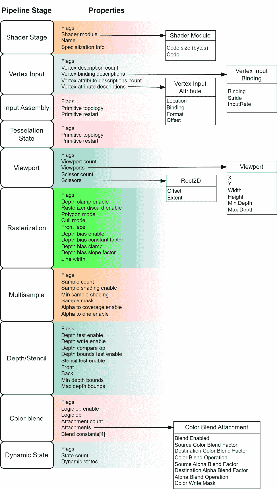

图 1.7 – Vulkan 图形管线

在这个菜谱中，你将了解 Vulkan 中管线的一些更多知识和它们最重要的特性。

## 如何操作…

这里是 Vulkan 中管线最重要的特性：

1.  在 Vulkan 中，图形管线主要是不可变对象，这意味着一旦创建，除非在特定情况下，否则不能修改。这就是为什么如果你希望重用管线来绘制不同的形状，需要创建一个新的具有不同拓扑的管线。然而，某些管线属性可以在运行时动态更改，例如视口和裁剪矩形，这些被称为动态状态。

1.  本书不会涵盖的一个重要的管线阶段例外是顶点输入状态。尽管创建它并不完全直接，但我们不会在这里讨论它，因为我们专门使用**可编程顶点提取**（**PVP**）方法在顶点着色器阶段访问索引和顶点。有关 PVP 的更多信息，请参阅*第二章**，使用现代 Vulkan*中的*实现可编程顶点提取和多绘制间接*配方。

1.  类似地，管线布局，是图形管线的一个属性（而不是一个阶段），是一个数据结构，概述了着色器预期使用的资源的布局，包括它们的位置、数量和类型，以及与推送常量相关的详细信息。由于本章没有向着色器提供任何资源，因此管线布局使用默认值初始化。描述符集和推送常量将在*第二章**，使用现代 Vulkan*中介绍。

# 将着色器编译成 SPIR-V

与 OpenGL 不同，OpenGL 通常在运行时将着色器从高级语言编译成二进制格式，而 Vulkan 只支持一种称为 SPIR-V 的中间表示形式。SPIR-V 是一种跨平台的低级中间表示形式，可以从各种着色语言生成。

在这个配方中，你将学习如何使用`glslang`库将 GLSL 编译成 SPIR-V。

## 准备工作

在这个配方中，我们使用一个第三方库，该库在运行时将 GLSL 代码编译成 SPIR-V，称为`glslang`。可以从[`github.com/KhronosGroup/glslang.git`](https://github.com/KhronosGroup/glslang.git)下载。

在我们的代码中，我们提供了`VulkanCore::ShaderModule`类，它封装了着色器。它提供了`ShaderModule::glslToSpirv`方法（及其重载），可以将着色器源代码从 GLSL 编译成 SPIR-V。

## 如何做到这一点...

这里展示的步骤是`ShaderModule::glslToSpirv()`方法的一部分。以下是它是如何工作的：

1.  `glslang`库需要通过调用`glslang::InitializeProcess()`进行一次初始化，因此其初始化被一个静态布尔变量保护：

    ```cpp
    std::vector<char> ShaderModule::glslToSpirv(
        const std::vector<char>& data,
        EShLanguage shaderStage,
        const std::string& shaderDir,
        const char* entryPoint) {
      static bool glslangInitialized = false;
      if (!glslangInitialized) {
        glslang::InitializeProcess();
        glslangInitialized = true;
      }
    ```

1.  `TShader`对象由一个函数实例化，用于包含着色器和生成 SPIR-V 字节码所必需的各种其他参数。这些参数包括输入客户端和 GLSL 版本，以及着色器的入口点：

    ```cpp
      glslang::TShader tshader(shaderStage);
      const char* glslCStr = data.data();
      tshader.setStrings(&glslCStr, 1);
      glslang::EshTargetClientVersion clientVersion =
          glslang::EShTargetVulkan_1_3;
      glslang::EShTargetLanguageVersion langVersion =
          glslang::EShTargetSpv_1_3;
      tshader.setEnvInput(glslang::EShSourceGlsl,
                          shaderStage,
                          glslang::EShClientVulkan, 460);
      tshader.setEnvClient(glslang::EShClientVulkan,
                           clientVersion);
      tshader.setEnvTarget(glslang::EShTargetSpv,
                           langVersion);
      tshader.setEntryPoint(entryPoint);
      tshader.setSourceEntryPoint(entryPoint);
    ```

1.  之后，我们收集系统中对着色器通常可用的资源约束，例如最大纹理数量或顶点属性数量，并建立编译器应呈现的消息。最后，我们将着色器编译成 SPIR-V 并验证结果：

    ```cpp
      const TBuiltInResource* resources =
          GetDefaultResources();
      const EShMessages messages =
          static_cast<EShMessages>(
              EShMsgDefault | EShMsgSpvRules |
              EShMsgVulkanRules | EShMsgDebugInfo |
              EShMsgReadHlsl);
      CustomIncluder includer(shaderDir);
      std::string preprocessedGLSL;
      if (!tshader.preprocess(
              resources, 460, ENoProfile, false, false,
              messages, &preprocessedGLSL, includer)) {
        std::cout << "Preprocessing failed for shader: "
                  << std::endl;
        printShader(data);
        std::cout << std::endl;
        std::cout << tshader.getInfoLog() << std::endl;
        std::cout << tshader.getInfoDebugLog()
                  << std::endl;
        ASSERT(false, "includes are forbidden");
        return std::vector<char>();
      }
    ```

1.  在最后一个阶段，为调试和发布构建都建立了链接选项。在调试构建中，启用了常规的调试信息，同时禁用了优化和调试信息剥离。相反，在发布构建中，启用了优化器，这可能会导致未使用着色器变量的移除，包括结构体成员。然而，由于结构体大小的不一致可能会导致如果不对 C++代码应用相同的优化，则会出现问题，因此在发布构建中优化也被禁用：

    ```cpp
      glslang::SpvOptions options;
    #ifdef _DEBUG
      tshader.setDebugInfo(true);
      options.generateDebugInfo = true;
      options.disableOptimizer = true;
      options.optimizeSize = false;
      options.stripDebugInfo = false;
      options.emitNonSemanticShaderDebugSource = true;
    #else
      options.disableOptimizer = true;  // Special care!
      options.optimizeSize = true;
      options.stripDebugInfo = true;
    #endif
      glslang::TProgram program;
      program.addShader(&tshader);
      if (!program.link(messages)) {
        std::cout << "Parsing failed for shader "
                  << std::endl;
        std::cout << program.getInfoLog() << std::endl;
        std::cout << program.getInfoDebugLog()
                  << std::endl;
        ASSERT(false, "link failed");
      }
      std::vector<uint32_t> spirvData;
      spv::SpvBuildLogger spvLogger;
      glslang::GlslangToSpv(
           program.getIntermediate(shaderStage), spirvData,
          &spvLogger, &options);
      std::vector<char> byteCode;
      byteCode.resize(spirvData.size() *
                      (sizeof(uint32_t) / sizeof(char)));
      std::memcpy(byteCode.data(), spirvData.data(),
                  byteCode.size());
      return byteCode;
    }
    ```

对于真正高性能的应用程序，着色器不是在运行时从 GLSL 编译的。它们是在构建时编译的，并在应用程序启动时从磁盘加载 SPIR-V 格式。

# 动态状态

虽然**管道状态对象**（**PSOs**）包括不可变状态，如着色器程序和顶点输入绑定，但管道状态的一些属性可以在绘制时使用动态状态对象动态更改。这个特性提供了更大的灵活性，并可以最小化重新创建管道的必要性。动态状态对象可以用来更改属性，如视口和剪裁矩形、线宽、混合常数和模板参考值。然而，并非所有管道属性都可以动态更改，使用动态状态可能会产生轻微的性能开销。

在不使用动态状态的情况下，应用程序有一些可用的替代方案：

1.  在应用程序启动时创建管道。如果你知道需要哪些管道，它们可以在更高的启动成本下预先创建。

1.  利用管道缓存。图形驱动程序具有内置的管道缓存机制，可以自动为你生成缓存。

一些参数，如视口、线宽和深度偏移，可以动态修改。虽然一些动态状态包含在 Vulkan 1.0 中，但其他一些作为扩展添加或包含在 Vulkan 1.3 中。如果一个参数被标记为动态（使用适当的结构），则在管道创建期间忽略其值。

在这道菜谱中，你将了解动态状态，它允许在创建管道后动态设置一些管道参数。

## 准备工作

动态状态是通过使用`VkPipelineDynamicStateCreateInfo`结构体创建的。这个结构体的一个实例被填充了你希望设置为动态的状态，随后被插入到管道的创建过程中，我们将在下一道菜谱中介绍。

## 如何做到这一点...

要允许参数动态设置，我们需要创建一个`VkPipelineDynamicStateCreateInfo`结构体的实例。

1.  下面的代码片段展示了如何启用视口参数的动态状态：

    ```cpp
    const std::array<VkDynamicState, 1> dynamicStates = {
        VK_DYNAMIC_STATE_VIEWPORT,
    };
    const VkPipelineDynamicStateCreateInfo dynamicState = {
        .sType =
          VK_STRUCTURE_TYPE_PIPELINE_DYNAMIC_STATE_CREATE_INFO,
        .dynamicStateCount =
            static_cast<uint32_t>(dynamicStates.size()),
        .pDynamicStates = dynamicStates.data(),
    };
    dynamicStates array contains only the VK_DYNAMIC_STATE_VIEWPORT value, but it may contain a much larger set of values from VkDynamicState.
    ```

之前创建的实例将在下一个菜谱中使用。

# 创建图形管线

一旦收集并实例化了所有必需的状态和管线属性，在 Vulkan 中创建图形管线就是一个简单的过程。这涉及到填充`VkGraphicsPipelineCreateInfo`结构并调用`vkCreateGraphicsPipelines`。

在这个菜谱中，你将学习如何在 Vulkan 中创建图形管线对象。

## 准备工作

如需更多信息，请参阅存储库中`VulkanCore::Pipeline`类的构造函数。

## 如何操作…

填充由`VkGraphicsPipelineCreateInfo`引用的结构并不复杂，但是一项繁琐的任务。

1.  一旦所有状态的所有结构都已实例化，我们只需要创建一个`VkGraphicsPipelineCreateInfo`实例并调用`vkCreateGraphicsPipelines`：

    ```cpp
    const VkGraphicsPipelineCreateInfo pipelineInfo = {
        .sType=VK_STRUCTURE_TYPE_GRAPHICS_PIPELINE_CREATE_INFO,
        .stageCount = uint32_t(shaderStages.size()),
        .pStages = shaderStages.data(),
        .pVertexInputState = &vinfo,
        .pInputAssemblyState = &inputAssembly,
        .pViewportState = &viewportState,
        .pRasterizationState = &rasterizer,
        .pMultisampleState = &multisampling,
        .pDepthStencilState = &depthStencilState, // Optional
        .pColorBlendState = &colorBlending,
        .pDynamicState = &dynamicState,
        .layout = layout,
        .renderPass = renderPass,
        .basePipelineHandle = VK_NULL_HANDLE, // Optional
        .basePipelineIndex = -1,  // Optional
    };
    VkPipeline gfxPipeline = VK_NULL_HANDLE;
    VK_CHECK(vkCreateGraphicsPipelines(
        device_, VK_NULL_HANDLE, 1, &pipelineInfo,
        nullptr, &gfxPipeline));
    ```

创建图形管线是一个昂贵的操作。避免创建管线惩罚的一种方法是在应用程序下次运行时缓存并重用它们。

# Swapchain

Vulkan 中的 swapchain 模仿了 OpenGL 中的双缓冲和三缓冲功能，但应用在管理 swapchain 缓冲区方面有更明确的作用。这种方法提供了更好的控制，可以配置、同步和呈现图像。

Vulkan swapchain 是与表面（`VkSurfaceKHR`）相关联的图像集合，用于在窗口中显示渲染输出。尽管它是 Vulkan API 的关键部分，但用于创建和管理 swapchain 的函数和类型是`VK_KHR_swapchain`扩展的一部分。

swapchain 对象中的图像数量必须在构造时确定，但必须介于设备提供的最小（`minImageCount`）和最大（`maxImageCount`）可能值之间。这些值可以从 Vulkan 物理设备的`VkSurfaceCapabilitiesKHR`结构中检索。

Swapchain 图像（`VkImage`）由 swapchain 对象创建和拥有，因此它们的内存不由应用程序提供或分配。图像视图（`VkImageView`）不是由 swapchain 对象创建的，因此必须单独创建。

在这个菜谱中，你将学习如何创建、管理和销毁 swapchain 图像。

## 准备工作

代码中由`VulkanCore::Swapchain`类管理 swapchain。

## 如何操作…

swapchain 扩展提供了一组用于创建、管理和销毁 swapchain 的函数和类型。一些关键函数和类型包括以下内容：

1.  `vkCreateSwapchainKHR`：此函数用于创建 swapchain。你需要提供一个包含有关表面、图像数量、格式、尺寸、使用标志和其他 swapchain 属性的`VkSwapchainCreateInfoKHR`结构。

1.  `vkGetSwapchainImagesKHR`: 在创建交换链之后，此函数用于检索交换链中图像的句柄。然后，您可以创建用于渲染和展示的图像视图和帧缓冲区。

1.  `vkAcquireNextImageKHR`: 此函数用于从交换链中获取一个可用的图像进行渲染。它还需要提供一个信号量或栅栏来指示图像何时准备好进行渲染。

1.  `vkQueuePresentKHR`: 一旦渲染完成，此函数用于将交换链图像提交到显示设备进行展示。

1.  `vkDestroySwapchainKHR`: 此函数负责销毁交换链并清理与其相关的资源。

# 理解交换链中的同步——栅栏和信号量

应用程序和 GPU 进程是并行运行的；除非另有说明，否则命令缓冲区和它们的命令也在 GPU 上并行运行。为了在 CPU 和 GPU 之间以及 GPU 中处理的命令缓冲区之间强制执行顺序，Vulkan 提供了两种机制：**栅栏**和**信号量**。栅栏用于在 GPU 和 CPU 之间同步工作，而信号量用于同步在 GPU 上执行的工作负载。

在这个菜谱中，您将了解栅栏和信号量：为什么它们是必要的，如何使用（以及何时使用），以及如何使用信号量与交换链一起使用。

## 准备工作

信号量的示例可以在`VulkanCore::Swapchain`类中找到，而栅栏的示例可以在`VulkanCore::CommandQueueManager`类中找到。

## 如何做到这一点…

栅栏和信号量有不同的用途。让我们探索这些元素中的每一个，以及如何使用信号量与交换链一起使用。

1.  *图 1**.8* 展示了一个在 CPU 上运行的应用程序如何提交命令到 GPU，并在提交后立即继续其工作（无需同步）。这可能是预期的，但如果您希望在 GPU 上的命令处理完成后再继续，可以使用栅栏来指示 GPU 上的工作已完成。一旦 GPU 上的命令处理完成，栅栏被触发，应用程序可以继续：

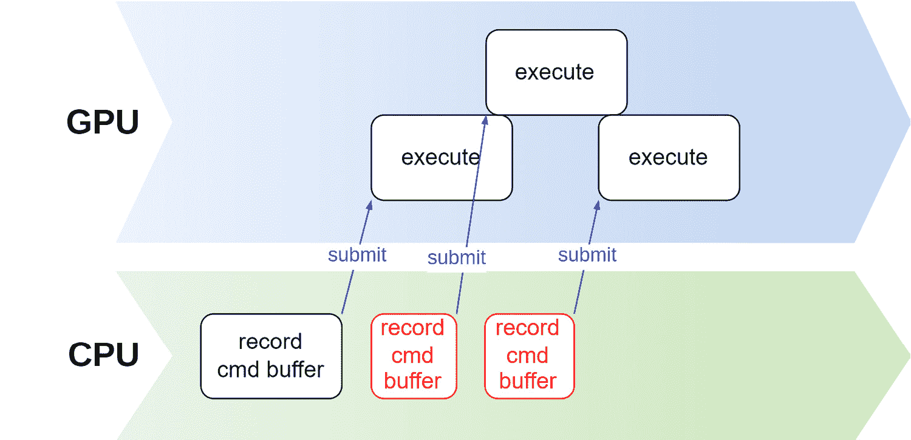

图 1.8 – 在设备上无同步的命令缓冲区记录和执行

1.  信号量以类似的方式工作，但用于 GPU 上运行的命令或作业之间。*图 1**.10* 说明了使用信号量来同步 GPU 上正在处理的命令。应用程序负责在提交缓冲区进行处理之前创建信号量，并在命令缓冲区和信号量之间添加依赖关系。一旦 GPU 上处理了一个任务，信号量被触发，下一个任务可以继续。这强制命令之间有一个顺序：

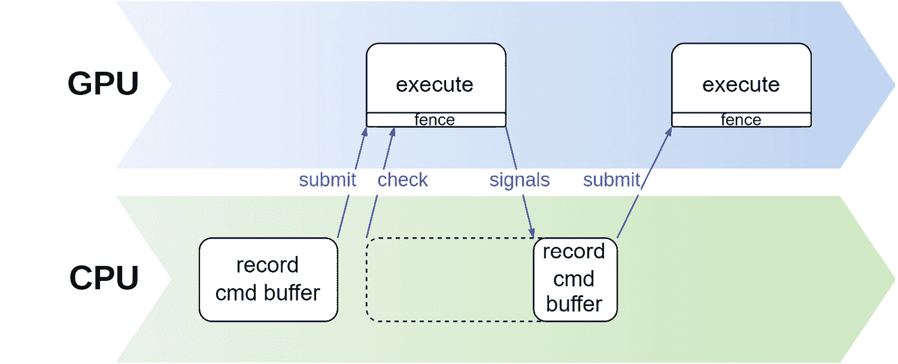

图 1.9 – 栅栏

获取图像、渲染和展示的过程都是异步的，需要同步。在这个菜谱中，我们将使用两个信号量进行同步：`imageAvailable` 和 `imageRendered`。*图 1**.10* 说明了信号量如何影响设备上命令的执行：

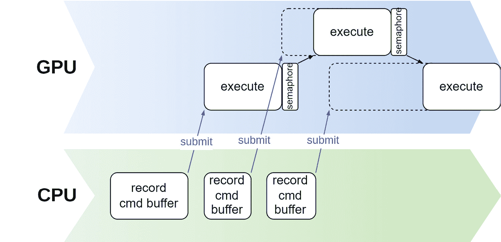

图 1.10 – 信号量

当获取到的图像可用时，`imageAvailable_` 会发出信号，提示将要渲染到图像中的命令队列开始处理。一旦命令缓冲区完成，它将发出另一个信号量，即 `imageRendered`，这反过来又允许开始展示该图像。*图 1**.11* 展示了如何使用两个信号量实现同步：

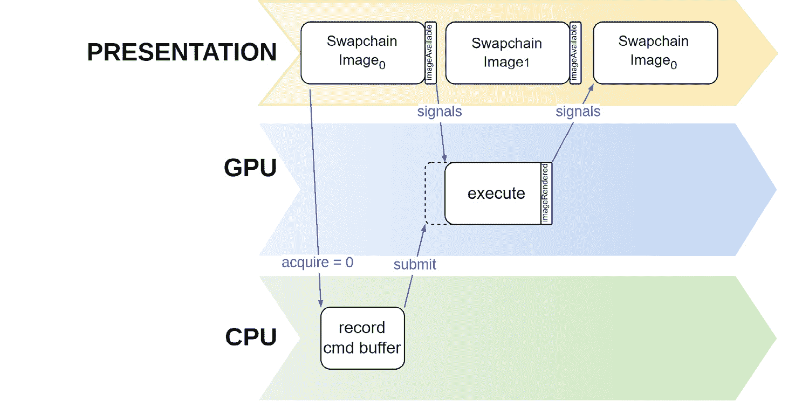

图 1.11 – 交换链的同步

栅栏和信号量并不难理解，但在 Vulkan 中它们对于同步至关重要。在继续之前，请确保您理解它们是如何被使用的。

# 填充展示的提交信息

提交命令缓冲区需要一个 `VkSubmitInfo` 结构的实例，这允许指定用于等待（以开始处理）和信号（一旦命令缓冲区执行完成）的信号量。这些信号量是可选的，通常不需要。但当提交命令缓冲区以在屏幕上展示图像时，这些信号量允许 Vulkan 将缓冲区的执行与显示引擎同步。

在这个菜谱中，您将学习如何在记录后提交命令缓冲区以供 GPU 处理。

## 准备工作

仓库中的 `VulkanCore::Swapchain` 类提供了一个实用函数来为您填充 `VkSubmitInfo` 结构，因为用于与显示引擎同步执行的分发信号量存储在交换链中。如果结构中不需要信号量，则 `waitForImageAvailable` 和 `signalImagePresented` 参数应设置为 `false`。

## 如何做到这一点...

用于提交需要与显示引擎同步的命令缓冲区的同步信息由 `VkSubmitInfo` 结构的实例提供，并包含用于设备中同步的信号量的引用。它还包含将要提交的命令缓冲区。

1.  栅栏与命令缓冲区相关联，并不是用于同步交换链的特定栅栏：

    ```cpp
    const VkSubmitInfo submitInfo = {
        .sType = VK_STRUCTURE_TYPE_SUBMIT_INFO,
        .waitSemaphoreCount = 1,
        .pWaitSemaphores = &imageAvailable,
        .pWaitDstStageMask = submitStageMask,
        .commandBufferCount = 1,
        .pCommandBuffers = buffer,
        .signalSemaphoreCount = 1,
        .pSignalSemaphores = &imagePresented,
    };
    VK_CHECK(vkQueueSubmit(queue_, 1, &submitInfo, fence));
    ```

一旦提交了用于处理的命令缓冲区，驱动程序和 GPU 就会执行其中记录的命令。唯一知道命令缓冲区是否已处理完成的方法是检查提供给 `vkQueueSubmit` 的栅栏。

# 展示图像

在 Vulkan 中将图像展示到屏幕上不是自动的。您需要调用 `vkQueuePresentKHR` 函数以及 `VkPresentInfoKHR` 结构的实例。

在这个菜谱中，你将学习如何在图像渲染完成后将其排队以供展示。

## 准备工作

我们代码中的展示是通过`VulkanCore::Swapchain::present()`方法完成的。

## 如何实现...

通过调用`vkQueuePresentKHR`请求展示获取的图像。

这次，我们需要提供`imageRendered`信号量，它表示渲染过程何时完成对图像的使用：

```cpp
const VkPresentInfoKHR presentInfo{
    .sType = VK_STRUCTURE_TYPE_PRESENT_INFO_KHR,
    .waitSemaphoreCount = 1,
    .pWaitSemaphores = &imageRendered_,
    .swapchainCount = 1,
    .pSwapchains = &swapchain_,
    .pImageIndices = &imageIndex_,
};
VK_CHECK(vkQueuePresentKHR(presentQueue_, &presentInfo));
```

一旦调用`VkQueuePresentKHR`，图像不会立即展示。这个调用仅仅设置了同步机制，以便 Vulkan 知道何时可以将图像发送进行显示。

# 绘制三角形

现在我们已经了解了所有基本 Vulkan 对象及其工作原理，我们最终可以创建一个小型示例应用程序，在屏幕上显示静态着色三角形。

在这个菜谱中，我们将展示一个完整的示例，该示例在屏幕上绘制静态三角形。顶点数据和属性在顶点着色器中静态提供。

## 准备工作

这个菜谱中的代码可以在存储库中的`source/chapter1/main.cpp`找到。顶点和片段着色器位于`source/chapter1/resources/shaders`目录下的`triangle.vert`和`triangle.frag`文件中。

## 如何实现...

这里展示的代码是存储库中代码的完整版本。

1.  对于这个菜谱，我们将使用两个着色器：`triangle.vert`和`triangle.frag`。顶点着色器不接受任何输入，因为它所需的所有数据都定义在着色器本身中，作为两个数组：一个用于顶点数据（`positions`）和一个用于颜色数据（`colors`）。

    两套数据都直接以原始形式发送到输出，没有任何转换，因为它们已经处于各自输出空间中（位置数据为屏幕空间，颜色数据为输出颜色空间）。位置通过内置的`gl_VertexIndex`变量输出，而颜色则写入位置`0`的`outColor`变量：

    ```cpp
    #version 460
    layout(location = 0) out vec4 outColor;
    vec2 positions[3] = vec2[](
        vec2(0.0, -0.5),
        vec2(0.5, 0.5),
        vec2(-0.5, 0.5)
    );
    vec3 colors[3] = vec3[](
        vec3(1.0, 0.0, 0.0),
        vec3(0.0, 1.0, 0.0),
        vec3(0.0, 0.0, 1.0)
    );
    void main() {
       gl_Position = vec4(positions[gl_VertexIndex], 0.0, 1.0);
       outColor = vec4(colors[gl_VertexIndex], 1.0);
    }
    ```

1.  片段着色器接受来自顶点阶段的颜色数据，并通过位置`0`的`outColor`变量直接将其输出为片段颜色：

    ```cpp
    #version 460
    layout(location = 0) in vec4 inColor;
    layout(location = 0) out vec4 outColor;
    void main() {
        outColor = inColor;
    }
    ```

    我们只需要一个渲染通道，它将渲染结果输出到只有一个附件的帧缓冲区，即颜色附件 0。颜色附件的加载操作是*清除*，因为我们将在渲染时清除它，而存储操作是*存储*，因为我们希望输出被记录到附件中。输出将直接进入交换链，因此获取的交换链图像是颜色附件 0。由于每个渲染通道直接输出到交换链图像，并且帧缓冲区与附件相关联且不可变，我们需要帧缓冲区的数量与交换链图像的数量相匹配。每个帧缓冲区将与一个交换链图像相关联，作为颜色附件 0。着色器不需要访问外部缓冲区，如顶点和索引或纹理。

1.  第一步是初始化一个窗口并创建一个上下文，我们将使用此书中的默认功能。有关更多详细信息，请参阅存储库中的 `VulkanCore::VulkanFeatureChain` 类。该上下文封装了实例以及物理和逻辑设备，并使用一些有用的扩展、一个图形队列和默认功能进行初始化：

    ```cpp
    int main(int argc, char** argv) {
      initWindow(&window_);
      // Create Context
      VulkanCore::VulkanFeatureChain featureChain;
      VulkanCore::Context::createDefaultFeatureChain(
          featureChain);
      VulkanCore::Context context(
          (void*)glfwGetWin32Window(window_),
          {},  // layers
          {
              VK_KHR_WIN32_SURFACE_EXTENSION_NAME,
              VK_KHR_SURFACE_EXTENSION_NAME,
              VK_KHR_GET_PHYSICAL_DEVICE_PROPERTIES_2_EXTENSION_NAME,
          },  // instance extensions
          {VK_KHR_SWAPCHAIN_EXTENSION_NAME},  // device
                                              // extensions
          VK_QUEUE_GRAPHICS_BIT,  // request a graphics
                                  // queue only
          featureChain, true);
    ```

1.  交换链使用一个常见的格式和颜色空间以及物理设备的扩展进行初始化。在这个例子中，我们使用 **先进先出** (**FIFO**) 展示模式，因为它默认支持的唯一模式：

    ```cpp
      // Create Swapchain
      const VkExtent2D extents = context.physicalDevice()
                                     .surfaceCapabilities()
                                     .minImageExtent;
      context.createSwapchain(
          VK_FORMAT_B8G8R8A8_UNORM,
          VK_COLORSPACE_SRGB_NONLINEAR_KHR,
          VK_PRESENT_MODE_FIFO_KHR, extents);
      const VkRect2D renderArea = {
          .offset = {.x = 0, .y = 0}, .extent = extents};
    ```

1.  两个着色器都是从存储库中的资源初始化的，以及一个帧缓冲区向量。帧缓冲区的数量与交换链图像的数量相匹配，因为我们稍后需要为每个获取的图像使用一个帧缓冲区：

    ```cpp
      // Create Shader Modules
      const auto shadersPath =
          std::filesystem::current_path() /
          "resources/shaders";
      const auto vertexShaderPath =
          shadersPath / "triangle.vert";
      const auto fragShaderPath =
          shadersPath / "triangle.frag";
      const auto vertexShader = context.createShaderModule(
          vertexShaderPath.string(),
          VK_SHADER_STAGE_VERTEX_BIT);
      const auto fragShader = context.createShaderModule(
          fragShaderPath.string(),
          VK_SHADER_STAGE_FRAGMENT_BIT);
      // Create Framebuffers
      std::vector<std::shared_ptr<VulkanCore::Framebuffer>>
          swapchain_framebuffers(
              context.swapchain()->numberImages());
    ```

1.  我们只需要一个渲染通道和一个子通道。渲染通道不关联任何资源。它只指定每个帧缓冲区颜色附件的加载和存储操作以及子通道的使用。因此，我们不需要多个渲染通道，就像帧缓冲区那样。一个就足够了，并且它被用于所有交换链图像。颜色附件 0，即交换链图像的最终布局是 `VK_IMAGE_LAYOUT_PRESENT_SRC_KHR`，因为它将被展示：

    ```cpp
      // Create Render Pass
      std::shared_ptr<VulkanCore::RenderPass> renderPass =
          context.createRenderPass(
              {context.swapchain()->texture(0)},
              {VK_ATTACHMENT_LOAD_OP_CLEAR},
              {VK_ATTACHMENT_STORE_OP_STORE},
              {VK_IMAGE_LAYOUT_PRESENT_SRC_KHR},
              VK_PIPELINE_BIND_POINT_GRAPHICS);
    ```

    最后，我们创建一个包含大多数默认参数的管道。除了之前编译的两个着色器之外，我们将视口设置为输出的大小并禁用深度测试。然后我们创建一个命令队列管理器实例来管理命令缓冲区和它们的栅栏：

    ```cpp
      // Create Graphics Pipeline
      auto pipeline = context.createGraphicsPipeline(
          VulkanCore::Pipeline::GraphicsPipelineDescriptor{
              .vertexShader_ = vertexShader,
              .fragmentShader_ = fragShader,
              .viewport = context.swapchain()->extent(),
              .depthTestEnable = false,
          },
          renderPass->vkRenderPass());
      // Create Command Queue Manager
      auto commandMgr = context.createGraphicsCommandQueue(
          context.swapchain()->numberImages(),
          context.swapchain()->numberImages());
      // FPS Counter
      EngineCore::FPSCounter fps(glfwGetTime());
    ```

1.  主渲染循环执行，直到 `GLFW` 窗口关闭。在每次迭代中，我们首先获取一个交换链图像及其索引。如果此交换链图像的帧缓冲区尚不存在，我们创建一个。然后我们获取一个用于渲染的命令缓冲区：

    ```cpp
      // Main Render Loop
      while (!glfwWindowShouldClose(window_)) {
        fps.update(glfwGetTime());
        const auto texture =
            context.swapchain()->acquireImage();
        const auto swapchainImageIndex =
            context.swapchain()->currentImageIndex();
        // Create the framebuffer the first time we get
        // here, once for each swapchain image
        if (swapchain_framebuffers[swapchainImageIndex] ==
            nullptr) {
          swapchain_framebuffers[swapchainImageIndex] =
              context.createFramebuffer(
                  renderPass->vkRenderPass(), {texture},
                  nullptr, nullptr);
        }
        auto commandBuffer =
            commandMgr.getCmdBufferToBegin();
    ```

1.  在开始渲染之前，我们通过提供一个清除颜色（黑色）和渲染通道以及帧缓冲区句柄来开始渲染通道。然后我们将管道绑定到当前命令缓冲区，我们就可以开始渲染了：

    ```cpp
        // Begin Render Pass
        constexpr VkClearValue clearColor{0.0f, 0.0f, 0.0f,
                                          0.0f};
        const VkRenderPassBeginInfo renderpassInfo = {
            .sType =
                VK_STRUCTURE_TYPE_RENDER_PASS_BEGIN_INFO,
            .renderPass = renderPass->vkRenderPass(),
            .framebuffer =
                swapchain_framebuffers[swapchainImageIndex]
                    ->vkFramebuffer(),
            .renderArea = renderArea,
            .clearValueCount = 1,
            .pClearValues = &clearColor,
        };
        vkCmdBeginRenderPass(commandBuffer,
                             &renderpassInfo,
                             VK_SUBPASS_CONTENTS_INLINE);
        pipeline->bind(commandBuffer);
    ```

1.  最后，我们使用三个顶点和实例发出绘制调用。此调用将调用顶点着色器三次（每个顶点一次），在着色器中实例化 `gl_VertexIndex` 变量到 0、1 和 2。我们使用此变量在着色器本身中索引位置和颜色数组。然后我们提交命令缓冲区并展示交换链图像：

    ```cpp
        vkCmdDraw(commandBuffer, 3, 1, 0, 0);
        vkCmdEndRenderPass(commandBuffer);
        commandMgr.endCmdBuffer(commandBuffer);
        constexpr VkPipelineStageFlags flags =
            VK_PIPELINE_STAGE_COLOR_ATTACHMENT_OUTPUT_BIT;
        const auto submitInfo =
            context.swapchain()->createSubmitInfo(
                &commandBuffer, &flags);
        commandMgr.submit(&submitInfo);
        commandMgr.goToNextCmdBuffer();
        // Present render output to the screen
        context.swapchain()->present();
        glfwPollEvents();
        // Increment frame number
        fps.incFrame();
      }
    ```

1.  在渲染循环结束后，在退出程序之前，我们等待所有队列完成处理，然后以它们创建的相反顺序销毁所有 Vulkan 对象：

    ```cpp
      commandMgr.waitUntilAllSubmitsAreComplete();
      glfwDestroyWindow(window_);
      glfwTerminate();
      return 0;
    }
    ```

    此菜谱的结果应类似于 *图 1**.12*：

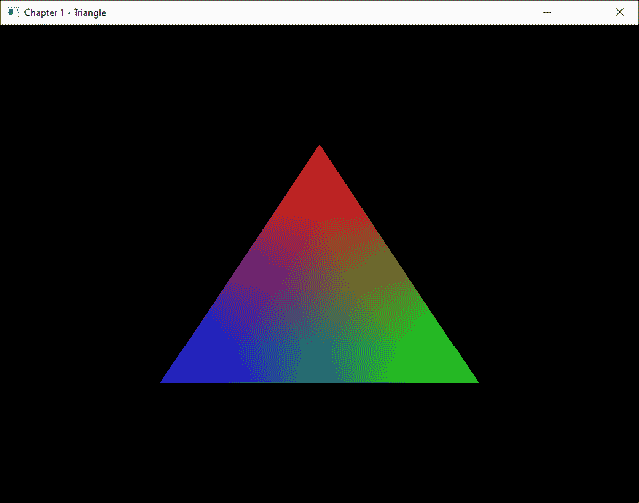

图 1.12 – 菜谱结果

Vulkan 语言较为冗长，正如之前提到的，它提供了许多自定义图形应用程序的方法。一个简单的例子就需要大约 1,000 行代码！但无需恐慌。其中大部分代码可以重用（并且将被重用）来解释本书中剩余部分的所有技术和食谱。
