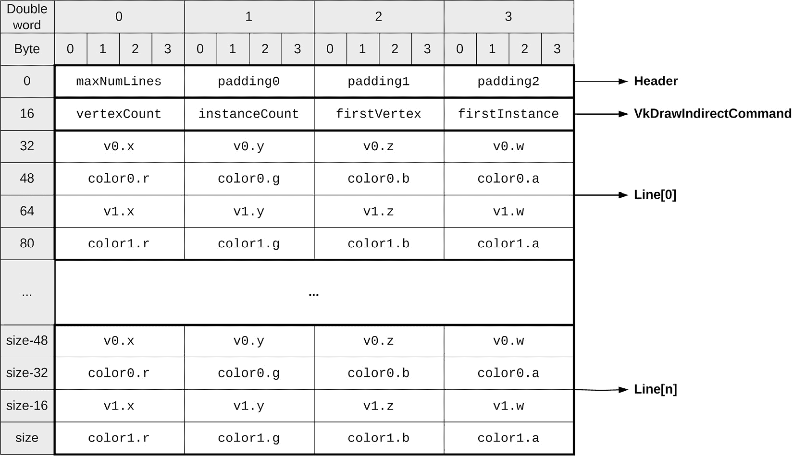
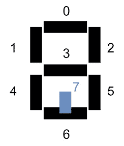
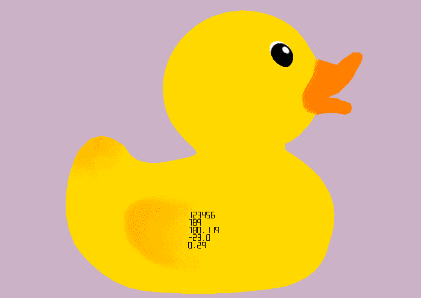
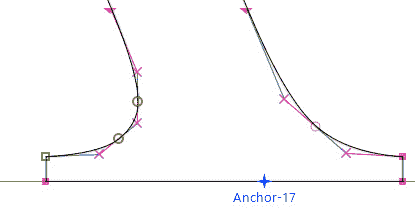
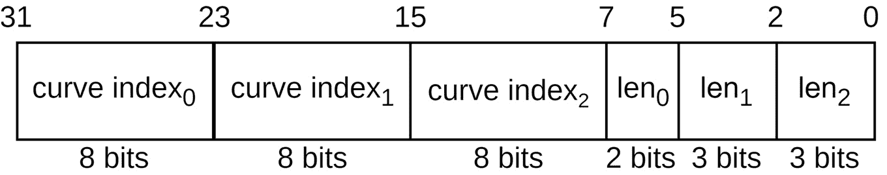
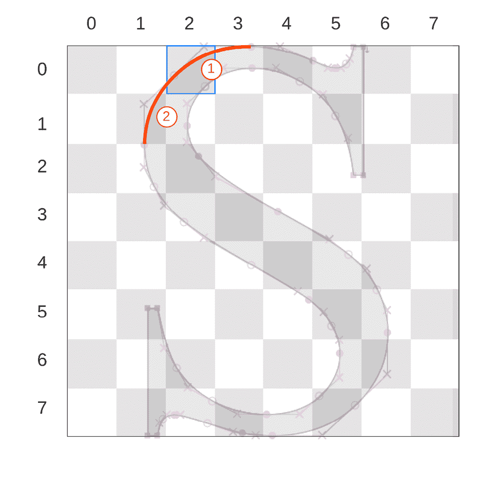
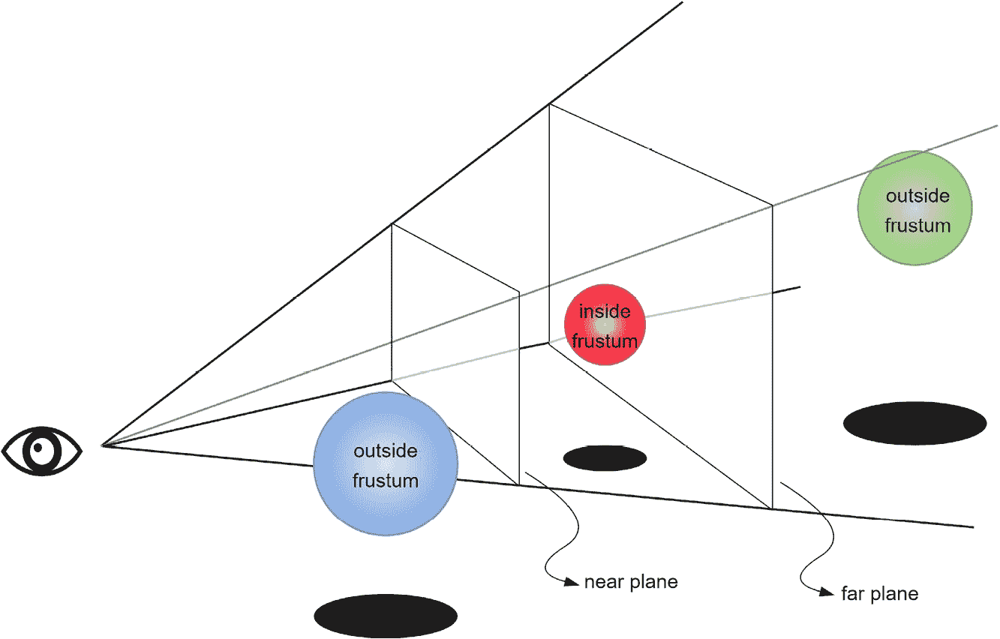
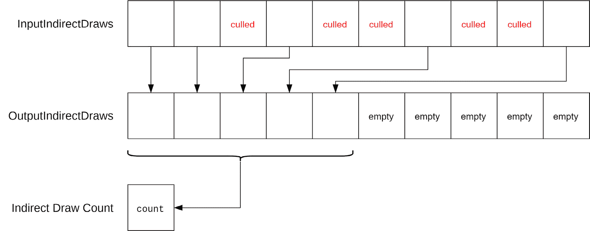

# 3

# 实现 GPU 驱动渲染

在本章中，我们将深入探讨专门用于 GPU 渲染的几何操作细节。传统方法在许多场景中严重依赖 CPU 执行各种任务，这可能会成为瓶颈。我们的目标是解放您的渲染技术，摆脱此类限制。我们的目标是让 GPU 处于驾驶员的位置，通过利用其并行处理能力来确保高效的处理。我们将揭示从传统 CPU 空间直接从着色器（如顶点或片段着色器）生成和绘制线条的技术。这不仅提高了效率，还开辟了新的创意领域。更进一步，我们将演示如何将这种新颖的线绘制功能扩展到从着色器显示数字。这种能力为实时显示和反馈铺平了道路，无需在 GPU 和 CPU 之间切换。然后，我们将目光转向一个更复杂的话题——在 GPU 上渲染文本。通过采用**符号距离场**（**SDF**）方法，我们将指导您在 GPU 上实现更平滑、更通用的文本渲染。

最后，我们将解决渲染中的经典挑战之一：视锥剔除。**视锥剔除**涉及避免渲染位于摄像机**视野**（**FOV**）之外的对象。**视锥**指的是通过摄像机可见的空间体积。**剔除**意味着丢弃或忽略位于此视锥之外的对象，因此它们不会被处理用于渲染。与传统方法不同，我们将向您展示如何直接使用计算着色器在 GPU 上实现此功能，确保位于摄像机视野之外的对象不会消耗宝贵的 GPU 资源。到本章结束时，您将全面掌握 GPU 驱动渲染，使您能够充分利用 GPU 的能力，并简化您的渲染任务。

在本章中，我们将涵盖以下配方：

+   实现由 GPU 驱动的线渲染

+   将线绘制技术扩展到从着色器渲染文本值

+   使用 SDF 绘制文本

+   使用计算着色器进行视锥剔除

# 技术要求

对于本章，您需要确保已安装 VS 2022 以及 Vulkan SDK。对 C++ 编程语言的基本熟悉程度以及对 OpenGL 或任何其他图形 API 的理解将很有帮助。请重新查看 *技术要求* 部分的 *第一章**，Vulkan 核心概念*，以获取有关设置和构建本章可执行文件的详细信息。本章包含多个配方，可以使用以下可执行文件启动：

1.  `Chapter03_GPU_Lines.exe`

1.  `Chapter03_GPU_Text.exe`

1.  `Chapter03_GPU_Text_SDF.exe`

1.  `Chapter03_GPU_Culling.exe`

# 实现由 GPU 驱动的线渲染

在这个菜谱中，你将学习一种技术，它允许直接从着色器（如顶点或片段着色器）绘制线条。在许多图形应用程序中，当人们希望直接且高效地使用着色器的固有功能（尤其是顶点或片段着色器）来绘制线条时，会面临挑战。为了解决这个问题，我们的菜谱深入研究了针对这一特定目的量身定制的专业技术。我们将展示一个与各种管线和渲染通道无缝集成的菜谱。通过我们的方法，数据（无论是顶点还是颜色）被存储在设备缓冲区中，确保了流程的流畅。此过程的最终结果是，在后续的通道中利用这些累积的数据，然后巧妙地将这些线条渲染到帧缓冲区中。最终，你将拥有一种强大且高效的方法，可以直接使用着色器绘制线条。

## 准备工作

在深入菜谱之前，你应该确保已经安装了 VS 2022，并且能够按照*第一章**，Vulkan* *核心概念*中提供的步骤构建存储库。

你应该能够从 VS 2022 中启动名为`Chapter03_GPU_Lines.exe`的可执行文件。

本菜谱中涵盖的代码可以在存储库中找到，位于`chapter3/mainGPULines.cpp`和`chapter3/resources/shaders`目录下的`gpuLines.frag`、`gpuLines.vert`、`gpuLinesDraw.frag`和`gpuLinesDraw.vert`文件中。

## 如何做到这一点...

在本节中，我们将指导你通过直接从着色器绘制线条并将其集成到最终渲染帧中的完整过程，使用 GPU 驱动的技术。通过利用专用设备缓冲区和精心安排的渲染通道，这项技术允许实时视觉反馈和流畅的图形过程。在本指南结束时，你将拥有一个强大的机制，可以高效地从 GPU 直接渲染线条，同时 CPU 的参与度最小化。

这个想法依赖于拥有一个设备缓冲区，它作为线条和用于渲染这些线条的间接绘制结构的参数的存储库。在所有渲染通道完成后，将执行一个额外的渲染通道来绘制缓冲区中的线条。以下是执行此操作的步骤：

1.  第一步是创建一个缓冲区，它不仅包含线条数据，还包含用于确定缓冲区中可以容纳多少线条以及其他用于最终间接绘制调用的参数的元数据。以下代码片段定义了 C++中的缓冲区结构，其中`GPULineBuffer`是用于存储/绘制线条的缓冲区结构：

    ```cpp
    constexpr uint32_t kNumLines = 65'536;
    struct Line {
      glm::vec4 v0_;
      glm::vec4 color0_;
      glm::vec4 v1_;
      glm::vec4 color1_;
    };
    struct Header {
      uint32_t maxNumlines_;
      uint32_t padding0 = 0u;
      uint32_t padding1 = 0u;
      uint32_t padding2 = 0u;
      VkDrawIndirectCommand cmd_;
    };
    struct GPULineBuffer {
      Header header_;
      Line lines_[kNumLines];
    };
    ```

    此结构定义了我们用来存储 GPU 生成的行的设备缓冲区，并且可以存储多达 65,536 行，以及`Header`部分中的数据。

    *图 3**.1*显示了 GPU 看到的缓冲区布局：



图 3.1 – GPU 行缓冲区结构

此缓冲区是用以下使用位创建的：

+   `VK_BUFFER_USAGE_INDIRECT_BUFFER_BIT`

+   `VK_BUFFER_USAGE_STORAGE_BUFFER_BIT`

+   `VK_BUFFER_USAGE_TRANSFER_DST_BIT`

此缓冲区应可供所有您希望从中绘制/生成线条的渲染通道使用：

```cpp
std::shared_ptr<VulkanCore::Buffer> gpuLineBuffer;
gpuLineBuffer = context.createBuffer(
    kGPULinesBufferSize,
    VK_BUFFER_USAGE_INDIRECT_BUFFER_BIT |
        VK_BUFFER_USAGE_STORAGE_BUFFER_BIT |
        VK_BUFFER_USAGE_TRANSFER_DST_BIT,
    static_cast<VmaMemoryUsage>(
        VK_MEMORY_PROPERTY_DEVICE_LOCAL_BIT));
```

1.  提供的代码片段使用 Vulkan API 初始化了一个 `gpuLineBuffer` 缓冲区。这个缓冲区是通过 `context.createBuffer` 方法创建的，它被赋予了一个指定的尺寸（`kGPULinesBufferSize`），并用于多个目的，包括间接绘制命令、着色器数据存储以及作为缓冲区到缓冲区复制操作的目的地。此外，缓冲区的内存被设置为位于 GPU 上，确保快速访问：

    ```cpp
    struct Line {
      vec3 v0;
      vec4 c0;
      vec3 v1;
      vec4 c1;
    };
    struct VkDrawIndirectCommand {
      uint vertexCount;
      uint instanceCount;
      uint firstVertex;
      uint firstInstance;
    };
    layout(set = 4, binding = 0) buffer GPULinesBuffer
    {
      uint size;
      uint row;
      uint pad1;
      uint pad2;
      VkDrawIndirectCommand cmd;
      Line lines[];
    } lineBuffer;
    void addLine(vec3 v0, vec3 v1, vec4 c0, vec4 c1) {
      const uint idx =
          atomicAdd(lineBuffer.cmd.instanceCount, 1);
      if (idx >= lineBuffer.size) {
        atomicMin(lineBuffer.cmd.instanceCount,
                  lineBuffer.size);
        return;
      }
      lineBuffer.lines[idx].v0 = v0;
      lineBuffer.lines[idx].v1 = v1;
      lineBuffer.lines[idx].c0 = c0;
      lineBuffer.lines[idx].c1 = c1;
    }
    ```

    函数首先通过 `atomicAdd` 获取已存储在缓冲区中的线条数量，以检查存储线条信息的下一个可用索引。如果函数返回的索引大于缓冲区中可以容纳的最大线条数，则函数提前返回，并且是一个无操作。否则，线条数据将被存储在缓冲区中。

1.  由于需要使用之前通道的数据，因此线条的渲染是在所有其他通道处理完成后通过额外的渲染通道完成的。渲染线条的顶点着色器代码如下片段所示：

    ```cpp
    #version 460
    #extension GL_EXT_nonuniform_qualifier : require
    struct Line {
      vec3 v0;
      vec4 c0;
      vec3 v1;
      vec4 c1;
    };
    struct VkDrawIndirectCommand {
      uint vertexCount;
      uint instanceCount;
      uint firstVertex;
      uint firstInstance;
    };
    layout(set = 1, binding = 0) readonly buffer
    GPULinesBuffer {
      Line lines[];
    } lineBuffer;
    layout (location = 0) out vec4 outColor;
    void main() {
      if (gl_VertexIndex == 0) {
        vec3 vertex =
            lineBuffer.lines[gl_InstanceIndex].v0;
        gl_Position = vec4(vertex, 1.0).xyww;
        outColor =
            lineBuffer.lines[gl_InstanceIndex].c0;
      } else {
        vec3 vertex =
            lineBuffer.lines[gl_InstanceIndex].v1;
        gl_Position = vec4(vertex, 1.0).xyww;
        outColor =
            lineBuffer.lines[gl_InstanceIndex].c1;
      }
    }
    ```

    在前面的代码中，引入了两个结构体：`Line` 和 `VkDrawIndirectCommand`。`Line` 结构体表示一个彩色线段，由两个 3D 端点（`v0` 和 `v1`）及其相应的颜色（`c0` 和 `c1`）定义。`VkDrawIndirectCommand` 结构体表示一个用于间接绘制的 Vulkan 命令。着色器还建立了一个包含 `Line` 结构体数组的 `GPULinesBuffer` 缓冲区。在主函数中，根据 `gl_VertexIndex` 的值，着色器选择线实例的起始或结束点，并将相应的颜色分配给 `outColor`。此外，请注意，在这个着色器中，我们只定义了 `GPULinesBuffer` 结构体，而没有定义头部结构体。这是因为对于绘制线条，我们在偏移量处绑定缓冲区，从而绕过了在着色器中定义 `Header` 段的需要。

    片段着色器仅输出通过顶点着色器提供的颜色：

    ```cpp
    #version 460
    layout(location = 0) in vec4 inColor;
    layout(location = 0) out vec4 outColor;
    void main() {
      outColor = inColor;
    }
    ```

    在渲染线条之前，我们需要确保之前的步骤已经完成缓冲区的写入，因此我们发出一个缓冲区屏障：

    ```cpp
    const VkBufferMemoryBarrier bufferBarrier = {
        .sType =
            VK_STRUCTURE_TYPE_BUFFER_MEMORY_BARRIER,
        .srcAccessMask = VK_ACCESS_SHADER_WRITE_BIT,
        .dstAccessMask =
            VK_ACCESS_INDIRECT_COMMAND_READ_BIT,
        .srcQueueFamilyIndex =
            VK_QUEUE_FAMILY_IGNORED,
        .dstQueueFamilyIndex =
            VK_QUEUE_FAMILY_IGNORED,
        .buffer = gpuLineBuffer->vkBuffer(),
        .offset = 0,
        .size = VK_WHOLE_SIZE,
    };
    vkCmdPipelineBarrier(
        commandBuffer,
        VK_PIPELINE_STAGE_FRAGMENT_SHADER_BIT,
        VK_PIPELINE_STAGE_DRAW_INDIRECT_BIT, 0, 0,
        nullptr, 1, &bufferBarrier, 0, nullptr);
    ```

    之后，我们发出一个间接绘制命令，其参数直接来自缓冲区本身。我们巧妙地将之前通道中存储在缓冲区中的线条数量存储在 `VkDrawIndirectCommand:: instanceCount` 中：

    ```cpp
    vkCmdDrawIndirect(commandBuffer,
                      gpuLineBuffer->vkBuffer(),
                      sizeof(uint32_t) * 4, 1,
                      sizeof(VkDrawIndirectCommand));
    ```

1.  最后一步是清除缓冲区，这是清除缓冲区中线条数量的必要步骤（`VkDrawIndirectCommand:: instanceCount`）。在清除缓冲区之前，我们必须确保 GPU 已经完成了线条的绘制，我们可以通过发出另一个缓冲区屏障来验证这一点：

    ```cpp
    const VkBufferMemoryBarrier bufferBarrierClear = {
        .sType =
            VK_STRUCTURE_TYPE_BUFFER_MEMORY_BARRIER,
        .srcAccessMask =
            VK_ACCESS_INDIRECT_COMMAND_READ_BIT,
        .dstAccessMask = VK_ACCESS_TRANSFER_WRITE_BIT,
        .srcQueueFamilyIndex =
            VK_QUEUE_FAMILY_IGNORED,
        .dstQueueFamilyIndex =
            VK_QUEUE_FAMILY_IGNORED,
        .buffer = gpuLineBuffer->vkBuffer(),
        .offset = 0,
        .size = VK_WHOLE_SIZE,
    };
    // Reset the number of lines in the buffer
    vkCmdFillBuffer(commandBuffer,
                    gpuLineBuffer->vkBuffer(),
                    sizeof(uint32_t) * 5,
                    sizeof(uint32_t), 0);
    ```

在本食谱中，我们介绍了一种从着色器中直接渲染线条的强大技术。这种方法的应用范围广泛，并为更高级的图形输出奠定了基础，将您在 Vulkan GPU 编程领域的技能提升到一个更高的水平。

# 将线绘制技术扩展到从着色器渲染文本值

在我们之前的探索基础上继续，我们开发了直接从着色器中绘制线条的能力，我们的下一个挑战是进一步细化这一能力，以方便渲染文本值。从上一食谱中建立的基础概念中汲取灵感，我们旨在实施一种方法，允许将数值转换为线段，就像数字 LCD 显示器一样。通过这样做，我们不仅赋予了裸数值以生命力，使其更加视觉化和可解释，而且我们还利用了着色器的强大功能和效率来创建这些表示。完成之后，您将配备一套强大的工具集，使您能够从着色器中渲染清晰、可缩放且视觉上吸引人的文本数据。

## 准备工作

在深入到食谱之前，您应该确保已经安装了 VS 2022，并且能够按照*第一章**，Vulkan* *核心概念.*中提供的步骤构建仓库。

您应该能够从 VS 2022 中启动名为`Chapter03_GPU_Text.exe`的可执行文件。

由于这个食谱高度基于之前的食谱，我们建议首先阅读关于 GPU 线绘制的上一食谱。本食谱中涵盖的代码可以在仓库中找到，位于`chapter3/mainGPUText.cpp`和`chapter3/resources/shaders`目录下，包括`gpuText.frag`、`gpuText.vert`、`gpuTextDraw.frag`和`gpuTexDraw.vert`文件。

## 如何操作…

策略是将数字分解为段（类似于 LCD 段显示器）并通过为每个数字绘制线条来打印值。上一食谱涵盖了如何存储和绘制线条；本食谱在此基础上打印数字。由于在本食谱中我们需要绘制数字，因此我们需要解析数字并将它们分解为线条：

1.  首先，我们需要使用一种策略来仅用线条表示数字。我们选择实现一个简单的 7 段方法，可以用来显示从 0 到 9 的所有数字以及负号。我们还添加了一个额外的段来表示小数分隔符。*图 3**.2*显示了七个段以及小数分隔符和它们在着色器代码中使用的索引：



图 3.2 – 用于表示从 0 到 9 的所有数字以及小数分隔符和负号的段

1.  除了上一食谱中定义的结构之外，我们将替换`GPULinesBuffer`缓冲区的`pad0`成员，以便它存储行号：

    ```cpp
    layout(set = 4, binding = 0) buffer GPULinesBuffer
    {
      uint size;
      uint row;
      uint pad1;
      uint pad2;
      VkDrawIndirectCommand cmd;
      Line lines[];
    } lineBuffer;
    ```

1.  我们还需要 *图 3**.2* 中显示的段落的定义，作为两个向量：

    ```cpp
    vec2 v[] = {vec2(-0.5f,  1.0f), vec2(0.5f,  1.f),
                vec2(-0.5f,  0.0f), vec2(0.5f,  0.f),
                vec2(-0.5f, -1.0f), vec2(0.5f, -1.f),
               vec2( 0.0f, -0.8f), vec2(0.0f, -1.f) };
    uvec2 i[] = {uvec2(0, 1), uvec2(2, 3), uvec2(4, 5), uvec2(0, 2), uvec2(1, 3), uvec2(2, 4), uvec2(3, 5), uvec2(6, 7)};
    ```

    数组 `v` 代表 *图 3**.2* 中显示的所有顶点的坐标，在 *x* 方向上归一化到范围 `[-0.5, 0.5]`，在 *y* 方向上归一化到范围 `[-1.0, 1.0]`。数组 `i` 描述所有段及其顶点。例如，数组的第一个元素描述了图中的段 0，从顶点 0 (`-0.5`, `1.0`) 到顶点 1 (`0.5`, `1.0`)。

1.  `printSegment` 函数将一个段（给定其索引、缩放和转换）添加到存储线的 GPU 缓冲区中：

    ```cpp
    void printSegment(int segment, vec2 pos, vec2 scale) {
      uint idx = i[segment].x;
      uint idy = i[segment].y;
      vec3 v0 = vec3(v[idx] * scale + pos, 1.0);
      vec3 v1 = vec3(v[idy] * scale + pos, 1.0);
      addLine(v0, v1, vec4(0,0,0,1), vec4(0,0,0,1));
    }
    ```

    此函数调用之前提出的 `addLine` 函数来记录缓冲区中线的最终顶点和颜色。

1.  `printDigit` 函数在特定的行和列上打印一个数字的所有段，这些行和列作为参数传入：

    ```cpp
    void printDigit(int digit, uint linenum,
                    uint column) {
      const float charWidthPixel = 10;
      const float charHeightPixels = 10;
      const float horSpacePixels = 5;
      const float verSpacePixels = 5;
      const float charWidthNDC =
          charWidthPixels / screenWidth;
      const float charHeightNDC =
          charHeightPixels / screenHeight;
      const float horSpaceNDC =
          horSpacePixels / screenWidth;
      const float verSpaceNDC =
          verSpacePixels / screenHeight;
      const float colx =
          (column + 1) *
          (charWidthNDC + horSpaceNDC);
      const float coly =
          (linenum + 1) *
          (charHeightNDC + 3 * verSpaceNDC);
    ```

    最初，它计算 `switch` 语句中字符的宽度和高度以决定要打印哪个数字。为了简洁起见，以下片段仅显示了如何打印数字 0 和 1、小数分隔符和负号：

    ```cpp
      const vec2 pos(colx, coly);
      const vec2 scale(charWidthNDC, -charHeightNDC);
      switch (digit) {
      case 0:
        printSegment(0, pos, scale);
        printSegment(3, pos, scale);
        printSegment(4, pos, scale);
        printSegment(5, pos, scale);
        printSegment(6, pos, scale);
        printSegment(2, pos, scale);
        break;
      case 1:
        printSegment(4, pos, scale);
        printSegment(6, pos, scale);
        break;
      case 10: // decimal separator
        printSegment(7, pos, scale);
        break;
      case 11: // minus sign
        printSegment(1, pos, scale);
        break;
      }
    }
    ```

    之前的代码使用 switch-case 结构来识别基于传入的数字或符号应激活哪些段。例如，数字 `0` 需要多个段来描绘其圆形形状。因此，当数字是 `0` 时，会进行多个 `printSegment` 调用来渲染 `0` 数字所需的每个段。同样，`1` 使用其侧面的两个段形成。除了数字之外，该函数还有描绘小数分隔符和负号的条款，它们通过独特的段排列来区分。

1.  `printNumber` 函数旨在在指定的行上显示一个整数，从给定的列开始。执行后，它提供最后一个打印的数字之后的下一个可用列。如果整数是零，它简单地打印 `'0'`。对于非零整数，该函数有效地计算数字的位数，并迭代地打印每个数字，相应地推进列：

    ```cpp
    uint printNumber(highp int value,
                     uint linenum, uint column) {
      if (value == 0) {
        printDigit(0, linenum, column);
        return column + 1;
      }
      int counter = 0;
      int copy = value;
      int tens = 1;
      while (copy > 0) {
        counter++;
        copy = copy / 10;
        tens *= 10;
      }
      tens /= 10;
      for (int i = counter; i > 0; --i) {
        int digit = int(value / tens);
        printDigit(digit, linenum, column);
        value = value - (digit * tens);
        tens /= 10;
        column++;
      }
      return column;
    }
    ```

    此函数解析整数参数，并逐个打印每个数字，同时增加 `column` 索引。

1.  最后，`parse` 函数解析一个浮点数，并以一定的小数位数打印它：

    ```cpp
    void parse(float val, uint decimals) {
      int d = int(log(val));
      int base = int(pow(10, d));
      const float tens = pow(10, decimals);
      const uint line = atomicAdd(lineBuffer.row, 1);
      uint column = 0;
      // Minus sign
      if (val < 0) {
        printDigit(11, line, column);
        column++;
      }
      // Prints only positive values
      val = abs(val);
      // Integer part
      const int intPart = int(val);
      column = printNumber(intPart, line, column);
      // Decimal
      if (decimals > 0) {
        // Dot
        printDigit(10, line, column);
        column++;
        const int decimal =
            int(val * tens - intPart * tens);
        printNumber(decimal, line, column);
      }
    }
    ```

    该函数将浮点数分成两部分，整数部分和小数部分，并分别打印它们。如果数字是负数，它打印负号。

1.  下一步是在渲染文本行后清除缓冲区。在先前的配方中，我们清除了缓冲区中的行数。这里，我们还需要清除行号：

    ```cpp
    vkCmdFillBuffer(commandBuffer,
                    gpuLineBuffer->vkBuffer(),
                    sizeof(uint32_t),
                    sizeof(uint32_t), 0);
    ```

1.  最后一步是使用 `parse` 函数。只需从包含这些函数的任何着色器中调用它。每次调用 `parse` 都会在新的一行上打印值。*图 3**.3* 展示了在顶点着色器中使用以下代码打印一些值的结果：

    ```cpp
    if (gl_VertexIndex == 0) {
      parse(123456, 0);
      parse(789, 0);
      parse(780.12, 3);
      parse(-23, 1);
      parse(0.3, 2);
    }
    ```

    以下截图显示了我们可以如何使用这种技术进行调试或显示文本：



图 3.3 – 从顶点着色器打印值的输出

在这个配方中，我们深入探讨了使用线段表示数值的复杂过程，这让人联想到 LCD 显示器。通过将数字分解为其各个段，并利用我们从着色器中获得的基础线绘制方法，我们为您提供了一种创新的技术来可视化数字。最终结果是数字与图形的无缝集成，其清晰度让人联想到数字段显示器，丰富了整体视觉体验。

# 使用 SDF 绘制文本

在这个配方中，我们解决了渲染清晰且可缩放的文本的挑战，无论其大小如何。通过利用 SDF 的原则，我们将传统的文本渲染转化为一个更流畅的过程，确保清晰度和锐度。结果是美丽渲染的文本，无论您是近距离放大还是从远处观看，都保持清晰易读。

SDFs 提供了一种表示表面的方法。SDF 基本上是一个函数，对于空间中的每一个点，它返回到该形状表面的最短距离。SDFs 可用于各种用例，例如体积渲染或对形状执行膨胀、腐蚀和其他形态学操作。

传统上，文本使用位图字体进行渲染。可以使用 2D 画布来渲染文本，然后将其作为纹理绘制到 3D 上下文中的四边形。然而，这种方法创建的位图是分辨率相关的，需要由 CPU 生成并上传到设备。每个字体样式，如粗体、斜体等，也需要由 CPU 处理，这导致计算和传输每种渲染所需样式的纹理时产生额外的开销。

使用 SDF 渲染文本是一种现代方法，它使用每个字符的距离场。这些是网格，其中每个值代表每个像素到字符最近边的距离。SDFs 通过提供分辨率无关的缩放以及使用 GPU 来完成大部分工作，从而帮助避免之前提到的问题。如粗体、轮廓等样式只需更改着色器即可。

字体中的每个字母（字形）由直线和贝塞尔曲线的组合描述。*图 3.4*中展示了字形的一个示例，它显示了字形的衬线细节：



图 3.4 – 字形定义的细节：圆圈、三角形和正方形代表每个段（曲线或直线）的起点和终点

传统的 SDF 算法为网格中每个像素到符号边界的距离进行编码，将此信息存储在纹理中，并将其上传到 CPU。本食谱中提出的算法实现了一种不同的方法，其中像素到最近曲线的距离是在 GPU 上计算的。为此，字体中的每个符号都在 CPU 上与固定大小为 8 x 8 单元的网格进行预处理。这种预处理检测与每个单元格相交的曲线，并将信息存储在 32 位整数中，如图 *图 3**.5* 所示：



图 3.5 – 单元编码存储了与单元格相交的三个单独曲线的初始索引以及每个循环的长度

每个单元格包含最多三个与之相交的循环的信息，通过存储每个循环的初始索引及其长度来实现。例如，单元格（2, 0）中显示的符号与两条曲线相交，曲线 1 和曲线 2。该单元格编码的信息将包含曲线 1 的索引和长度为 2。其他索引保持为 0，因为该单元格不与任何其他曲线相交。

以下图表展示了如何使用符号表示字母 *S*：



图 3.6 – 表示 S 符号的曲线；单元格（2, 0）与两条曲线相交：曲线 1 和曲线 2

顶点着色器将矩形的每个角单元格索引传递给片段着色器，片段着色器接收单元格的插值坐标，使用它来检索要检查的曲线循环及其长度信息，并计算三个循环中每个曲线的最小距离，选择最小距离。

然后，这些信息被用来计算当前片段的不透明度，以及字体边缘的颜色和锐度。

在本食谱中，我们使用第三方库来捕获符号的定义，并将该信息存储在着色器友好的格式中。该库由 Dávid Kocsis 编写，可以在以下位置找到：[`github.com/kocsis1david/font-demo`](https://github.com/kocsis1david/font-demo)。

## 准备工作

在深入本食谱之前，您应该确保已安装 VS 2022，并且能够按照 *第一章**，Vulkan* *核心概念* 中提供的步骤构建存储库。

您应该能够从 VS 2022 中启动名为 `Chapter03_GPU_Text_SDF.exe` 的可执行文件。

在本食谱中涵盖的代码的完整示例可以在存储库中找到，在 `chapter3/mainGPUTextSDF.cpp`、`chapter3/FontManager.hpp`、`chapter3/FontManager.cpp` 和 `chapter3/resources/shaders` 中，在 `font.frag` 和 `font.vert` 文件中。

## 如何操作…

在设备上使用 SDF 渲染文本的步骤如下：

1.  初始任务涉及通过`FreeType`库加载字体文件。这一步至关重要，因为这是我们获取每个字符的位图数据的地方。位图数据本质上代表字体中字符的基本设计，描述其独特的形状和外观。一旦我们有了这些数据，接下来的目标就是将位图数据转换为轮廓数据。轮廓数据捕捉位图形状的本质，将其分解为诸如点、单元格和针对每个字符的特定边界框等组件。这些组件本质上决定了字符如何在屏幕或显示器上渲染。为了实现从`FreeType`复杂的位图数据到更结构化的轮廓数据的转换，我们使用了`fd_outline_convert`函数。每个字符的数据被组合成一个包含点和单元格的单一流，作为*顶点缓冲区*上传到 GPU：

    ```cpp
    FontManager fontManager;
    const auto &glyphData = fontManager.loadFont(
        (fontsFolder / "times.ttf").string());
    std::vector<GlyphInfo> glyhInfoData;
    std::vector<uint32_t> cellsData;
    std::vector<glm::vec2> pointsData;
    uint32_t pointOffset = 0;
    uint32_t cellOffset = 0;
    for (const auto &glyph : glyphData) {
      glyhInfoData.push_back(
          {glyph.bbox,
           glm::uvec4(pointOffset, cellOffset,
                      glyph.cellX,
                      glyph.cellY)});
      cellsData.insert(cellsData.end(),
                       glyph.cellData.begin(),
                       glyph.cellData.end());
      pointsData.insert(pointsData.end(),
                        glyph.points.begin(),
                        glyph.points.end());
      pointOffset += glyph.points.size();
      cellOffset += glyph.cellData.size();
    }
    ```

    代码深入处理字体渲染，处理位图，位图是字体表示的骨架。这里的主要元素之一是点数据。这个关键部分捕捉了构成每个位图贝塞尔曲线的每个点。目前，我们的主要关注点是 uppercase 字母。但通过观察代码的结构，很明显，如果我们愿意，可以轻松地将其扩展以包含其他字符。与点数据并行，我们还处理单元格数据。在渲染阶段，特别是在片段着色器中，它具有特殊的作用。正是这些数据帮助我们在给定单元格相交的曲线上导航，确保每个位图在屏幕上被准确和精确地描绘。总的来说，通过将点和单元格数据与片段着色器的功能相结合，我们能够有效地渲染字体的视觉复杂性。

1.  接下来，我们构建一个包含每个位图边界矩形的缓冲区。这个缓冲区作为顶点缓冲区，我们绘制与显示字符串中字符数量相等的实例：

    ```cpp
    std::string textToDisplay = "GPUSDFTEXTDEMO";
    std::vector<CharInstance>
        charsData(textToDisplay.length());
    int startX =
        context.swapchain()->extent().width / 6.0f;
    int startY =
        context.swapchain()->extent().height / 2.0f;
    const float scale = 0.09f;
    for (int i = 0; i < textToDisplay.length();
         ++i) {
      int glpyIndex = textToDisplay[i] - 'A';
      charsData[i].glyphIndex = glpyIndex;
      charsData[i].sharpness = scale;
      charsData[i].bbox.x =
          (startX +
           glyphData[glpyIndex].bbox.x * scale) /
              (context.swapchain()
                   ->extent()
                   .width /
               2.0) -
          1.0;
      charsData[i].bbox.y =
          (startY -
           glyphData[glpyIndex].bbox.y * scale) /
              (context.swapchain()
                   ->extent()
                   .height /
               2.0) -
          1.0;
      charsData[i].bbox.z =
          (startX +
           glyphData[glpyIndex].bbox.z * scale) /
              (context.swapchain()
                   ->extent()
                   .width /
               2.0) -
          1.0;
      charsData[i].bbox.w =
          (startY -
           glyphData[glpyIndex].bbox.w * scale) /
              (context.swapchain()
                   ->extent()
                   .height /
               2.0) -
          1.0;
      startX += glyphData[glpyIndex]
                    .horizontalAdvance *
                scale;
    }
    "GPUSDFTEXTDEMO" onscreen. Here, textToDisplay holds the desired text, and charsData is primed to store individual character details. The starting position, calculated from the screen dimensions, suggests a slightly offset start from the left and a vertical centering of the text. A scaling factor shrinks the characters, likely aiding design or screen fit. As we progress character by character, a mapping correlates each letter to its respective data in glyphData. The bounding box coordinates for every character are meticulously scaled and normalized to ensure their optimal display on screen. To sidestep overlap, the horizontal placement (startX) gets an update for each character, relying on its width and the scaling factor. In sum, this snippet efficiently prepares the specifics for a neatly rendered, scaled, and centered display of "GPUSDFTEXTDEMO" on the screen.
    ```

1.  在接下来的步骤中，我们将点、单元格数据、位图数据和字符串作为单独的缓冲区传输到 GPU。随后，我们执行一个`vkCmdDraw`命令：

    ```cpp
    // 4 vertex (Quad) and x (charData) instances
    vkCmdDraw(commandBuffer, 4, charsData.size(), 0, 0);
    ```

1.  顶点着色器需要访问一个包含位图数据（`GlyphInfo`）的数组，这些数据打包到`glyph_buffer`缓冲区中。其他输入包括来自*顶点缓冲区*的`in_rect`、`in_glyph_index`和`in_sharpness`：

    ```cpp
    #version 460
    // Stores glyph information
    struct GlyphInfo {
      vec4 bbox; // Bounding box of the glyph
      // cell_info.x: point offset
      // cell_info.x: cell offset
      // cell_info.x: cell count in x
      // cell_info.x: cell count in y
      uvec4 cell_info;
    };
    // Storage buffer object for glyphs
    layout(set = 0, binding = 0) buffer GlyphBuffer {
      GlyphInfo glyphs[];
    } glyph_buffer;
    layout(location = 0) in vec4 in_rect;
    layout(location = 1) in uint in_glyph_index;
    layout(location = 2) in float in_sharpness;
    layout(location = 0) out vec2 out_glyph_pos;
    layout(location = 1) out uvec4 out_cell_info;
    layout(location = 2) out float out_sharpness;
    layout(location = 3) out vec2 out_cell_coord;
    void main() {
      // Get the glyph information
      GlyphInfo gi = glyph_buffer.glyphs[in_glyph_index];
      // Corners of the rectangle
      vec2 pos[4] = vec2[](
          vec2(in_rect.x, in_rect.y), // Bottom-left
          vec2(in_rect.z, in_rect.y), // Bottom-right
          vec2(in_rect.x, in_rect.w), // Top-left
          vec2(in_rect.z, in_rect.w) // Top-right
      );
      // Corners of the glyph
      vec2 glyph_pos[4] = vec2[](
          vec2(gi.bbox.x, gi.bbox.y), // Bottom-left
          vec2(gi.bbox.z, gi.bbox.y), // Bottom-right
          vec2(gi.bbox.x, gi.bbox.w), // Top-left
          vec2(gi.bbox.z, gi.bbox.w) // Top-right
      );
      // Cell coordinates
      vec2 cell_coord[4] = vec2[](
          vec2(0, 0), // Bottom-left
          vec2(gi.cell_info.z, 0), // Bottom-right
          vec2(0, gi.cell_info.w), // Top-left
          vec2(gi.cell_info.z,
               gi.cell_info.w) // Top-right
      );
      gl_Position = vec4(pos[gl_VertexIndex], 0.0, 1.0);
      out_glyph_pos = glyph_pos[gl_VertexIndex];
      out_cell_info = gi.cell_info;
      out_sharpness = in_sharpness;
      out_cell_coord = cell_coord[gl_VertexIndex];
    }
    ```

    上述顶点着色器是为图元渲染定制的。着色器与一个名为`GlyphInfo`的结构一起工作，该结构封装了有关每个图元的信息，包括其边界框和与图元的单元格定位相关的细节。在`main`函数中，着色器使用输入索引获取特定图元的数据。随后，它确定输入矩形的角和相应图元的边界框的位置，并计算图元的单元格坐标。使用`gl_VertexIndex`，它指示当前正在处理的矩形的哪个顶点，着色器设置该顶点的位置并将必要的值分配给输出变量。这些预处理信息被片段着色器利用，以产生图元的最终视觉表示。

1.  接下来是使用片段着色器计算文本的图元颜色的步骤：

    +   计算给定片段/像素的单元格索引。

    +   根据单元格索引从单元格缓冲区获取单元格。

    +   从图元的边界框计算单元格的 SDF。基于距离，计算一个 alpha 值：

        ```cpp
        // Main function of the fragment shader
        void main() {
          // Calculate the cell index
          uvec2 c = min(uvec2(in_cell_coord),
                        in_cell_info.zw - 1);
          uint cell_index = in_cell_info.y +
                            in_cell_info.z * c.y + c.x;
          // Get the cell
          uint cell = cell_buffer.cells[cell_index];
          // Calculate the signed distance from the
          // glyph position to the cell
          float v = cell_signed_dist(
              in_cell_info.x, cell, in_glyph_pos);
          // Calculate the alpha value
          float alpha = clamp(v * in_sharpness + 0.5,
                              0.0, 1.0);
          out_color = vec4(1.0, 1.0, 1.0, alpha);
        }
        ```

    菜单的结果可以在*图 3.7*中看到：


图 3.7 – 菜单的输出

在这个菜谱中，我们展示了使用 GPU 辅助渲染文本时 SDF 的应用。

## 参见

Inigo Quilez 在一个优秀的视频中演示了如何使用 SDF 创建形状：

https://www.youtube.com/watch?v=8--5LwHRhjk

有多个库可以生成 SDF 纹理 – 例如，[`libgdx.com/wiki/tools/hiero`](https://libgdx.com/wiki/tools/hiero) 和 https://github.com/Chlumsky/msdfgen.

# 使用计算着色器进行视锥剔除

在这个菜谱中，我们将展示如何使用 GPU 和计算着色器进行视锥剔除。

在实时渲染的世界中，高效的渲染是实现流畅性能和高质量视觉的关键。优化渲染最广泛使用的技术之一是视锥剔除。视锥剔除是一个通过忽略或*剔除*摄像机视野（视锥）内不可见对象的过程，以提高渲染速度。以下图表展示了这一过程：



图 3.8 – 视锥剔除通过忽略摄像机视图（视锥）外的对象来工作

视锥剔除通过测试场景中的每个对象是否位于摄像机的视锥体内来工作。如果一个对象完全位于视锥体之外，它将被剔除；也就是说，它不会被绘制。这可以显著减少需要绘制的原语数量。传统上，剔除是在 CPU 上完成的，但这意味着每次摄像机移动时都需要进行。我们通过使用计算着色器来展示剔除，从而消除了每次视图变化时都需要从 CPU 上传数据到 GPU 的需求。计算着色器不一定需要与渲染相关，可以处理数据结构并执行排序、物理模拟等操作，在我们的案例中，是视锥剔除。

## 准备工作

在深入到食谱之前，您应该确保已安装 VS 2022，并且能够按照*第一章**，*Vulkan 核心概念*中提供的步骤构建存储库。

您应该能够从 VS 2022 中启动名为`Chapter03_GPU_Culling.exe`的可执行文件。

此食谱基于*第二章**，*使用现代 Vulkan*中的*实现可编程顶点拉取和多绘制间接*食谱。本食谱中涵盖的代码可以在存储库中找到，位于`chapter3/mainCullingCompute.cpp`、`chapter3/CullingComputePass.cpp`和`chapter3/resources/shaders`目录下的`gpuculling.comp`、`indirectdraw.frag`和`indirectdraw.vert`文件中。

## 如何操作…

我们将基于*第二章**，*使用现代 Vulkan*中实现的 Multi-Draw Indirect 食谱进行构建。在那个食谱中，我们展示了`vkCmdDrawIndexedIndirect`的使用。在这个食谱中，我们将使用一个从设备缓冲区派生其参数数量的命令，`vkCmdDrawIndexedIndirectCount`。这个 Vulkan API 允许您指定一个包含绘制计数的 GPU 缓冲区，而不是由 CPU 提供。

此食谱的技术依赖于三个缓冲区：前两个分别包含间接绘制参数的结构，分别是`InputIndirectDraws`和`OutputIndirectDraws`；第三个包含要渲染的网格数量。第一个缓冲区包含场景中所有网格的参数。第二个缓冲区由计算着色器填充：未被剔除的网格将它们的间接参数原子地从`InputIndirectDraws`缓冲区复制到`OutputIndirectDraws`；被剔除的网格则没有它们的参数被复制：



图 3.9 – 顶部缓冲区：所有网格参数；底部缓冲区：未剔除的网格设置以进行渲染

此外，计算着色器还需要关于每个网格的边界框和它们的中心，以及视锥的六个平面的信息。有了这些信息，计算过程可以剔除（或不禁除）每个网格。在过程结束时，`OutputIndirectDraws`缓冲区只包含将要绘制的网格的参数，并由间接绘制命令使用。

接下来是分解成步骤的配方，以及来自`mainCullingCompute.cpp`的片段。它提供了一个高级视图，说明了如何使用 Vulkan 中的计算着色器联合使用剔除和绘制过程来执行视锥剔除。计算着色器负责确定哪些网格应该被绘制，然后图形管线负责绘制这些网格。

1.  使用场景信息和场景缓冲区初始化剔除过程：

    ```cpp
    cullingPass.init(&context, &camera,
                     *bistro.get(), buffers[3]);
    cullingPass.upload(commandMgr);
    ```

    第一步包括初始化*图 3*.*9*中显示的两个缓冲区，并将它们上传到设备。这些细节被`CullingComputePass`类封装。

1.  计算过程也被`CullingComputePass`类封装：

    ```cpp
    auto commandBuffer = commandMgr.getCmdBufferToBegin();
    cullingPass.cull(commandBuffer, index);
    ```

    我们将更详细地讨论接下来展示的剔除方法。

1.  为了防止计算过程和渲染过程之间的竞争条件，我们为剔除间接绘制和绘制计数缓冲区添加了一个屏障。这是必要的，因为后续的绘制命令依赖于剔除过程的结果：

    ```cpp
    cullingPass.addBarrierForCulledBuffers(
        commandBuffer,
        VK_PIPELINE_STAGE_DRAW_INDIRECT_BIT,
        context.physicalDevice()
            .graphicsFamilyIndex()
            .value(),
        context.physicalDevice()
            .graphicsFamilyIndex()
            .value());
    ```

1.  绘制调用使用`vkCmdDrawIndexedIndirectCount`命令进行记录：

    ```cpp
    vkCmdDrawIndexedIndirectCount(
        commandBuffer,
        cullingPass.culledIndirectDrawBuffer()
            ->vkBuffer(),
        0,
        cullingPass
            .culledIndirectDrawCountBuffer()
            ->vkBuffer(),
        0, numMeshes,
        sizeof(
            EngineCore::
                IndirectDrawCommandAndMeshData));
    ```

在掌握了剔除过程代码的基本要素之后，让我们深入探讨其工作机制。

## 它是如何工作的...

`CullingComputePass::cull`方法负责更新视锥数据，绑定计算管线，更新推送常量，并调用`vkCmdDispatch`。`vkCmdDispatch`将计算工作调度到 GPU。计算工作被分成更小的单元，每个单元被称为工作组。`(pushConst.drawCount / 256) + 1, 1, 1)`参数分别指定在*x*、*y*和*z*维度上调度的工作组数量：

```cpp
void CullingComputePass::cull(
    VkCommandBuffer cmd, int frameIndex) {
  GPUCullingPassPushConstants pushConst{
      .drawCount =
          uint32_t(meshesBBoxData_.size()),
  };
  // Compute and store the six planes of the frustum
  for (int i = 0;
       auto &plane :
       camera_->calculateFrustumPlanes()) {
    frustum_.frustumPlanes[i] = plane;
    ++i;
  }
  // Upload the data to the device
  camFrustumBuffer_->buffer()
      ->copyDataToBuffer(&frustum_,
                         sizeof(ViewBuffer));
  // Bind the compute pipeline, update push constants
  pipeline_->bind(cmd);
  pipeline_->updatePushConstant(
      cmd, VK_SHADER_STAGE_COMPUTE_BIT,
      sizeof(GPUCullingPassPushConstants),
      &pushConst);
  // Bind descriptor sets
  pipeline_->bindDescriptorSets(
      cmd,
      {
          {.set = MESH_BBOX_SET,
           .bindIdx = 0},
          {.set = INPUT_INDIRECT_BUFFER_SET,
           .bindIdx = 0},
          {.set = OUTPUT_INDIRECT_BUFFER_SET,
           .bindIdx = 0},
          {.set =
               OUTPUT_INDIRECT_COUNT_BUFFER_SET,
           .bindIdx = 0},
          {.set = CAMERA_FRUSTUM_SET,
           .bindIdx = uint32_t(frameIndex)},
      });
  // Update descriptor sets
  pipeline_->updateDescriptorSets();
  // Dispatch the compute pass
  vkCmdDispatch(
      cmd, (pushConst.drawCount / 256) + 1, 1, 1);
}
```

`CullingComputePass::addBarrierForCulledBuffers`方法添加了一个管线屏障，确保在读取结果之前剔除操作已经完成。该屏障被设置为在着色器写入（剔除操作）完成之前阻止间接命令读取访问（这将在绘制调用中使用）：

```cpp
void CullingComputePass::
    addBarrierForCulledBuffers(
        VkCommandBuffer cmd,
        VkPipelineStageFlags dstStage,
        uint32_t computeFamilyIndex,
        uint32_t graphicsFamilyIndex) {
  std::array<VkBufferMemoryBarrier, 2> barriers{
      VkBufferMemoryBarrier{
          .sType =
              VK_STRUCTURE_TYPE_BUFFER_MEMORY_BARRIER,
          .srcAccessMask =
              VK_ACCESS_SHADER_WRITE_BIT,
          .dstAccessMask =
              VK_ACCESS_INDIRECT_COMMAND_READ_BIT,
          .srcQueueFamilyIndex =
              computeFamilyIndex,
          .dstQueueFamilyIndex =
              graphicsFamilyIndex,
          .buffer = outputIndirectDrawBuffer_
                        ->vkBuffer(),
          .size = outputIndirectDrawBuffer_
                      ->size(),
      },
      VkBufferMemoryBarrier{
          .sType =
              VK_STRUCTURE_TYPE_BUFFER_MEMORY_BARRIER,
          .srcAccessMask =
              VK_ACCESS_SHADER_WRITE_BIT,
          .dstAccessMask =
              VK_ACCESS_INDIRECT_COMMAND_READ_BIT,
          .srcQueueFamilyIndex =
              computeFamilyIndex,
          .dstQueueFamilyIndex =
              graphicsFamilyIndex,
          .buffer =
              outputIndirectDrawCountBuffer_
                  ->vkBuffer(),
          .size =
              outputIndirectDrawCountBuffer_
                  ->size(),
      },
  };
  vkCmdPipelineBarrier(
      cmd,
      VK_PIPELINE_STAGE_COMPUTE_SHADER_BIT,
      dstStage, 0, 0, nullptr,
      (uint32_t)barriers.size(),
      barriers.data(), 0, nullptr);
}
```

在计算着色器中，我们需要一个函数来判断一个边界框是否完全位于视锥之外，通过比较其范围和中心点与视锥的六个平面：

```cpp
void cullMesh(uint id) {
  MeshBboxData meshBBoxData = meshBboxDatas[id];
  bool isVisible = true;
  for (int i = 0; i < 6 && isVisible; i++) {
    vec3 planeNormal =
        viewData.frustumPlanes[i].xyz;
    float distFromPlane = dot(
        meshBBoxData.centerPos.xyz, planeNormal);
    float absDiff = dot(abs(planeNormal),
                        meshBBoxData.extents.xyz);
    if (distFromPlane + absDiff +
            viewData.frustumPlanes[i].w < 0.0) {
      isVisible = false;
    }
  }
  if (isVisible) {
    uint index = atomicAdd(outDrawCount.count, 1);
    outputIndirectDraws[index] = inputIndirectDraws[id];
  }
}
```

如果网格被剔除，函数会提前返回。否则，它会原子性地增加`IndirectDrawCount`缓冲区中可见网格的数量，并使用缓冲区中先前的网格数量作为目标索引，从输入缓冲区复制间接绘制参数到输出缓冲区。

主函数唯一剩下的工作就是调用`cullMesh`：

```cpp
layout(local_size_x = 256, local_size_y = 1,
       local_size_z = 1) in;
void main() {
  uint currentThreadId = gl_GlobalInvocationID.x;
  if (currentThreadId == 0) {
    atomicExchange(outDrawCount.count, 0);
  }
  barrier();
  if (currentThreadId < cullData.count) {
    cullMesh(currentThreadId);
  }
}
```

通过这个配方，我们利用了 GPU 的强大功能，有效地过滤掉非必要对象，优化了我们的渲染工作流程。通过实施这种方法，您将实现更响应和资源高效的可视化，这对于复杂的 3D 场景尤为重要。
