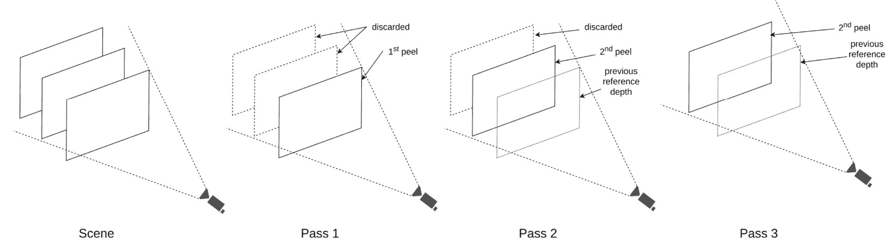
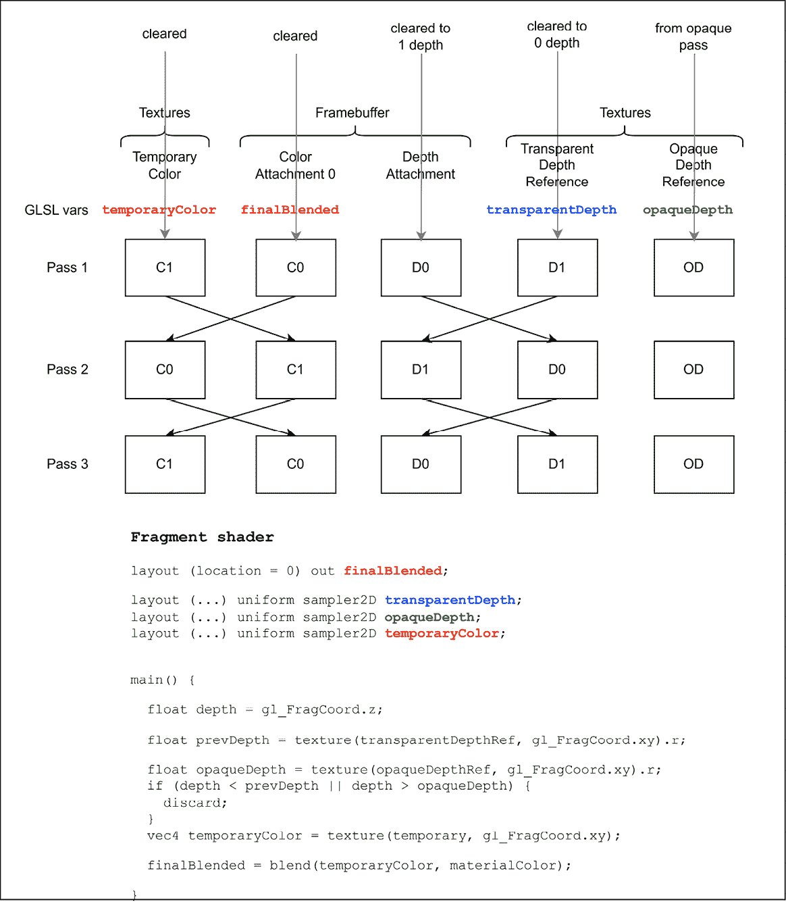

# 第五章：解密无序透明度

渲染透明物体并不总是容易。虽然不透明物体可以按任何顺序渲染，但透明物体需要根据它们相对于摄像机的距离从远到近进行渲染，这意味着在执行实际渲染之前需要额外的排序步骤。这种深度排序确保了更远的物体首先被混合到帧缓冲区中，然后是较近的物体，从而允许准确组合透明层。

排序可能会变得计算密集且容易出错，尤其是在处理复杂场景、相交物体或实时渲染场景时。此外，排序无法解决循环重叠的问题，其中多个物体以这种方式相互穿透，以至于没有任何单个深度排序顺序可以准确地表示它们的视觉外观。

无序透明度技术试图通过以不依赖于对象处理顺序的方式累积透明度信息来解决这些问题。本章深入探讨了渲染透明对象的复杂性和挑战，这项任务需要精确和细致的执行。与可以按任何顺序渲染的不透明物体不同，透明物体需要根据它们相对于摄像机的深度进行渲染，从最远到最近。这涉及到一个额外的排序步骤，虽然确保了透明层的准确组合，但可能会变得计算密集且容易出错。

在本章中，我们将涵盖以下主要主题：

+   实现深度剥离

+   实现双重深度剥离

+   实现链表无序透明度

+   实现加权无序透明度

# 技术要求

对于本章，你需要确保你已经安装了 VS 2022 以及 Vulkan SDK。对 C++编程语言的基本熟悉程度以及对 OpenGL 或任何其他图形 API 的理解将很有用。请回顾*第一章**Chapter 1**，*Vulkan 核心概念*，在*技术要求*部分中有关设置和构建本章可执行文件的具体细节。本章的所有配方都封装在一个单独的可执行文件中，可以使用`Chapter05_Transparency.exe`可执行文件启动。

# 实现深度剥离

**深度剥离**技术由 Cass Everitt 在 2001 年提出，作为渲染半透明几何形状的解决方案，无需从后向前排序几何形状。该技术包括多次渲染场景（遍历）。在每次遍历中，仅渲染离相机最近的片段，并收集其深度以供下一次遍历使用。在每次遍历中（除了第一次遍历），丢弃比前一次迭代中收集的深度遍历中的片段更近的片段。这个过程将场景*剥离*成连续的层，从前面到后面。在过程结束时，所有层都混合成一张最终图像，然后再次与背景混合。

## 准备工作

在*技术要求*中提到的仓库中，深度剥离算法是通过`DepthPeeling`类实现的，该类位于`source/enginecore/passes/DepthPeeling.hpp`和`cpp`文件中。在本教程中，您将学习如何在渲染过程中剥离或逐步移除透明物体的层。这项技术通过从最远到最近逐个处理每一层，确保了准确的渲染，从而提高了具有复杂重叠透明度的场景的整体视觉质量。

该算法包括反复渲染场景，在每个遍历结束时存储深度图。离相机最近的片段与上一个遍历（或第一个遍历的空帧缓冲区）混合。如果当前遍历片段的深度小于上一个遍历的深度，则丢弃当前遍历片段的深度，如图*图 5.1*所示：



图 5.1 –具有 3 个平面的深度剥离算法

在前面的章节中，我们已经提供了对这个技术的基础理解。接下来，我们将深入探讨，通过详细的、分步的过程指导您如何使用 Vulkan 实际实现这项技术。

## 如何操作…

该算法使用两组深度图和两组颜色附件来在遍历之间执行乒乓操作。在一次遍历期间获得的深度图用作下一次遍历的参考深度图，而第二个深度图则用作深度附件。对于两个颜色附件也做同样处理：一个用于存储当前遍历的混合效果，而另一个用作参考，由前一个遍历生成。接下来的步骤将指导您了解这些操作的执行过程。借助下面提供的详细图表，您将能够可视化并更好地理解该算法的复杂工作原理。

*图 5.2*有效地说明了所描述的过程，有助于您理解和应用这项复杂的技术：



图 5.2 –深度剥离算法

现在我们将逐步讲解如何执行这个配方。

1.  算法通过`DepthPeeling::draw`方法执行，它首先清除深度图 1 和两个颜色附件：

    ```cpp
    void DepthPeeling::draw(
        VkCommandBuffer commandBuffer, int index,
        const std::vector<
            std::shared_ptr<VulkanCore::Buffer>>
            &buffers,
        uint32_t numMeshes) {
      {
        // Clear Depth 1
        vkCmdClearDepthStencilImage(
            commandBuffer,
            depthTextures_[1]->vkImage(),
            VK_IMAGE_LAYOUT_TRANSFER_DST_OPTIMAL,
            &clearDepth, 1, &range);
      }
      {
        // Clear color attachments
        vkCmdClearColorImage(
            commandBuffer,
            colorTextures_[0]->vkImage(),
            VK_IMAGE_LAYOUT_TRANSFER_DST_OPTIMAL,
            &clearColor, 1, &range);
        vkCmdClearColorImage(
            commandBuffer,
            colorTextures_[1]->vkImage(),
            VK_IMAGE_LAYOUT_TRANSFER_DST_OPTIMAL,
            &clearColor, 1, &range);
      }
    ```

1.  颜色和深度附件都从索引为 0 的颜色和深度附件开始：

    ```cpp
      VulkanCore::DynamicRendering::
          AttachmentDescription colorAttachmentDesc{
              .imageView =
                  colorTextures_[0]->vkImageView(),
              .imageLayout =
                  VK_IMAGE_LAYOUT_COLOR_ATTACHMENT_OPTIMAL,
              .attachmentLoadOp =
                  VK_ATTACHMENT_LOAD_OP_LOAD,
              .attachmentStoreOp =
                  VK_ATTACHMENT_STORE_OP_STORE,
              .clearValue = clearValues[0],
          };
      VulkanCore::DynamicRendering::
          AttachmentDescription depthAttachmentDesc{
              .imageView =
                  depthTextures_[0]->vkImageView(),
              .imageLayout =
                  VK_IMAGE_LAYOUT_DEPTH_STENCIL_ATTACHMENT_OPTIMAL,
              .attachmentLoadOp =
                  VK_ATTACHMENT_LOAD_OP_CLEAR,
              .attachmentStoreOp =
                  VK_ATTACHMENT_STORE_OP_STORE,
              .clearValue = clearValues[1],
          };
    ```

1.  算法重复多次，次数等于通道数。必须注意将每个附件转换为正确的布局，遵守乒乓机制：在之前用作颜色附件的纹理需要转换为将被着色器读取的纹理，反之亦然：

    ```cpp
      for (uint32_t currentPeel = 0;
           currentPeel < numPeels_; ++currentPeel) {
        colorTextures_[currentPeel % 2]
            ->transitionImageLayout(
                commandBuffer,
                VK_IMAGE_LAYOUT_COLOR_ATTACHMENT_OPTIMAL);
        colorTextures_[(currentPeel + 1) % 2]
            ->transitionImageLayout(
                commandBuffer,
                VK_IMAGE_LAYOUT_SHADER_READ_ONLY_OPTIMAL);
        depthTextures_[currentPeel % 2]
            ->transitionImageLayout(
                commandBuffer,
                VK_IMAGE_LAYOUT_DEPTH_STENCIL_ATTACHMENT_OPTIMAL);
        depthTextures_[(currentPeel + 1) % 2]
            ->transitionImageLayout(
                commandBuffer,
                VK_IMAGE_LAYOUT_SHADER_READ_ONLY_OPTIMAL);
        colorAttachmentDesc.imageView =
            colorTextures_[currentPeel % 2]
                ->vkImageView();
        depthAttachmentDesc.imageView =
            depthTextures_[currentPeel % 2]
                ->vkImageView();
    ```

1.  然后我们开始渲染通道，发出绘制调用，并结束通道：

    ```cpp
        VulkanCore::DynamicRendering::beginRenderingCmd(
            commandBuffer,
            colorTextures_[currentPeel % 2]
                ->vkImage(),
            0,
            {{0, 0},
             {colorTextures_[currentPeel % 2]
                  ->vkExtents()
                  .width,
              colorTextures_[currentPeel % 2]
                  ->vkExtents()
                  .height}},
            1, 0, {colorAttachmentDesc},
            &depthAttachmentDesc, nullptr,
            colorTextures_[currentPeel % 2]
                ->vkLayout(),
            VK_IMAGE_LAYOUT_COLOR_ATTACHMENT_OPTIMAL);
        vkCmdSetViewport(commandBuffer, 0, 1,
                         &viewport_);
        vkCmdSetScissor(commandBuffer, 0, 1,
                        &scissor_);
        pipeline_->bind(commandBuffer);
        ... // Perform the draw call
        VulkanCore::DynamicRendering::endRenderingCmd(
            commandBuffer,
            colorTextures_[currentPeel % 2]
                ->vkImage(),
            VK_IMAGE_LAYOUT_UNDEFINED,
            VK_IMAGE_LAYOUT_UNDEFINED);
    ```

1.  通过渲染通道，图像被转换为正确的布局，因此我们只需要将当前通道的结果复制到下一个通道中将用作颜色附件的另一个纹理中：

    ```cpp
        vkCmdBlitImage(
            commandBuffer,
            colorTextures_[currentPeel % 2]
                ->vkImage(),
            VK_IMAGE_LAYOUT_TRANSFER_SRC_OPTIMAL,
            colorTextures_[(currentPeel + 1) % 2]
                ->vkImage(),
            VK_IMAGE_LAYOUT_TRANSFER_DST_OPTIMAL, 1,
            &region, VK_FILTER_NEAREST);
    ```

1.  顶点片段对于深度剥离来说并不特殊，但片段着色器必须丢弃比之前通道中收集的片段更靠近摄像机的片段。片段着色器还执行当前附件的混合：

    ```cpp
    #version 460
    layout(set = 1,
           binding = 0) uniform ObjectProperties {
      vec4 color;
      mat4 model;
    }objectProperties;
    layout(set = 2,
           binding = 0) uniform sampler2D depth;
    layout(set = 2, binding = 2) uniform sampler2D
        temporaryColor;
    layout(location = 0) out vec4 outColor;
    void main() {
      float fragDepth = gl_FragCoord.z;
      float peelDepth =
          texture(depth, gl_FragCoord.xy /
                             textureSize(depth, 0))
              .r;
      if (fragDepth <= peelDepth) {
        discard;
      }
      vec4 tmpColor =
          texture(temporaryColor,
                  gl_FragCoord.xy /
                      textureSize(temporaryColor, 0));
      vec3 mulTmpColor = tmpColor.xyz * tmpColor.a;
      vec3 mulObjProp = objectProperties.color.xyz *
                        (1.0 - tmpColor.a);
      outColor = vec4(
          tmpColor.a * (objectProperties.color.a *
                        objectProperties.color.rgb) +
              tmpColor.rgb,
          (1 - objectProperties.color.a) *
              tmpColor.a);
    }
    ```

    混合方程是一个特殊的方程，用于前后合成，如路易斯·巴沃伊和凯文·迈尔斯在 2008 年发表的*使用双深度剥离的独立顺序透明度*论文中所述。混合方程如下：

    C dst = A dst(A src C src)+ C dst

    A dst = (1 − A src) A dst

在下面的配方中，我们将探讨如何增强深度剥离技术，使其更高效。

# 实现双深度剥离

深度剥离算法的主要缺点之一是它需要多次传递，每次传递可能包括对整个场景进行光栅化。**双深度剥离**算法通过同时剥离两层来扩展原始的深度剥离算法，几乎有效地将传递次数减半。在本配方中，我们将专注于实现双深度剥离算法。我们将解决深度剥离算法的一个关键限制，即其需要多次传递，可能涉及对整个场景进行光栅化。您将了解双深度剥离算法如何通过同时剥离两层来改进原始算法，从而可能将传递次数减少近一半。这一见解将使您能够以更高的效率和速度处理复杂场景。

## 准备工作

在存储库中，深度剥离算法由`DualDepthPeeling`类实现，位于`source/enginecore/passes/DualDepthPeeling.hpp`和`cpp`文件中。

在开始之前，我们需要将`VkPhysicalDeviceFeatures::independentBlend`属性设置为 true。此属性允许我们为与图形管道关联的每个附件使用不同的混合方程。

在每个通道上，使用具有两个组件 R 和 G（在代码中我们使用`VK_FORMAT_R32G32_SFLOAT`格式）的深度图，同时存储前剥离和后剥离。与图一起使用的混合方程式是`VK_BLEND_OP_MAX`。当存储当前片段的深度时，我们将其编码为`vec2(-depth, depth)`。R 组件存储前剥离的负深度，而 G 组件存储后剥离的实际深度。`Max`混合方程式确保我们只存储最近的前剥离，通过取负值来实现。后剥离始终保证是最远的，因为它们以正深度存储。

前剥离与修改后的混合方程式混合：

C dst = A dst(A src C src)+ C dst

A dst = (1 − A src) A dst

当后剥离与常规的从后向前混合方程式混合时

C dst = A src C src + (1 − A src) C dst

在概述了准备步骤之后，你现在可以深入到双深度剥离算法的实现中。在下一节中，我们将引导你逐步执行此算法，使用上面讨论的见解和技术。

## 如何做到这一点...

Vulkan 中的算法包括使用 2 个颜色附件，一个用于前剥离，一个用于后剥离。它还使用 2 个具有相同格式的深度缓冲区。一个用于偶数通道，另一个用于奇数通道。

1.  我们首先指定每个附件的混合操作：

    ```cpp
    const VkPipelineColorBlendAttachmentState
        depthBlendState = {
        .blendEnable = true,
        .srcColorBlendFactor =
            VK_BLEND_FACTOR_SRC_ALPHA,
        .dstColorBlendFactor =
            VK_BLEND_FACTOR_ONE_MINUS_SRC_ALPHA,
        .colorBlendOp = VK_BLEND_OP_MAX,
        .srcAlphaBlendFactor =
            VK_BLEND_FACTOR_SRC_ALPHA,
        .dstAlphaBlendFactor =
            VK_BLEND_FACTOR_DST_ALPHA,
        .alphaBlendOp = VK_BLEND_OP_MAX,
        .colorWriteMask =
            VK_COLOR_COMPONENT_R_BIT |
            VK_COLOR_COMPONENT_G_BIT |
            VK_COLOR_COMPONENT_B_BIT |
            VK_COLOR_COMPONENT_A_BIT,
    };
    const VkPipelineColorBlendAttachmentState
        frontBlendState = {
        // front color attachment
        .blendEnable = true,
        .srcColorBlendFactor =
            VK_BLEND_FACTOR_DST_ALPHA,
        .dstColorBlendFactor =
            VK_BLEND_FACTOR_ONE,
        .colorBlendOp = VK_BLEND_OP_ADD,
        .srcAlphaBlendFactor =
            VK_BLEND_FACTOR_ZERO,
        .dstAlphaBlendFactor =
            VK_BLEND_FACTOR_ONE_MINUS_SRC_ALPHA,
        .alphaBlendOp = VK_BLEND_OP_ADD,
        .colorWriteMask =
            VK_COLOR_COMPONENT_R_BIT |
            VK_COLOR_COMPONENT_G_BIT |
            VK_COLOR_COMPONENT_B_BIT |
            VK_COLOR_COMPONENT_A_BIT,
    };
    const VkPipelineColorBlendAttachmentState
        backBlendState = {
        // back color attachment
        .blendEnable = true,
        .srcColorBlendFactor =
            VK_BLEND_FACTOR_SRC_ALPHA,
        .dstColorBlendFactor =
            VK_BLEND_FACTOR_ONE_MINUS_SRC_ALPHA,
        .colorBlendOp = VK_BLEND_OP_ADD,
        .srcAlphaBlendFactor =
            VK_BLEND_FACTOR_ZERO,
        .dstAlphaBlendFactor =
            VK_BLEND_FACTOR_ONE_MINUS_SRC_ALPHA,
        .alphaBlendOp = VK_BLEND_OP_ADD,
        .colorWriteMask =
            VK_COLOR_COMPONENT_R_BIT |
            VK_COLOR_COMPONENT_G_BIT |
            VK_COLOR_COMPONENT_B_BIT |
            VK_COLOR_COMPONENT_A_BIT,
    };
    ```

    这些`VkPipelineColorBlendAttachmentState`结构实例在创建图形管线时添加到`VkPipelineColorBlendStateCreateInfo`结构中，并且按照在帧缓冲区中设置附件的顺序提供。

1.  由`DualDepthPeeling::draw`方法实现的算法首先清除深度缓冲区和颜色附件：

    ```cpp
    void DualDepthPeeling::draw(
        VkCommandBuffer commandBuffer, int index,
        const std::vector<
            std::shared_ptr<VulkanCore::Buffer>>
            &buffers,
        uint32_t numMeshes) {
      // Clear Depth 0
      {
        vkCmdClearColorImage(
            commandBuffer,
            depthMinMaxTextures_[0]->vkImage(),
            VK_IMAGE_LAYOUT_TRANSFER_DST_OPTIMAL,
            &clearColor, 1, &range);
      }
      // Clear Depth 1
      {
        vkCmdClearColorImage(
            commandBuffer,
            depthMinMaxTextures_[1]->vkImage(),
            VK_IMAGE_LAYOUT_TRANSFER_DST_OPTIMAL,
            &clearColor, 1, &range);
      }
      // Clear color attachments
      {
        for (uint32_t i = 0;
             i < colorTextures_.size(); ++i) {
          vkCmdClearColorImage(
              commandBuffer,
              colorTextures_[i]->vkImage(),
              VK_IMAGE_LAYOUT_TRANSFER_DST_OPTIMAL,
              &clearColor, 1, &range);
        }
      }
    ```

1.  然后将深度纹理转换为第一个通道：

    ```cpp
      depthMinMaxTextures_[0]->transitionImageLayout(
          commandBuffer,
          VK_IMAGE_LAYOUT_COLOR_ATTACHMENT_OPTIMAL);
      depthMinMaxTextures_[1]->transitionImageLayout(
          commandBuffer,
          VK_IMAGE_LAYOUT_SHADER_READ_ONLY_OPTIMAL);
    ```

1.  前后纹理都被绑定为附件，并在每个通道中加载和存储。一个深度纹理也被绑定为一个附件，并在每个通道后清除到`(-99,999; 99,999)`并存储。另一个深度纹理被绑定为一个供片段着色器读取的纹理：

    ```cpp
      VulkanCore::DynamicRendering::AttachmentDescription
          colorAttachmentDesc_Front{
              .imageView = colorTextures_[0]
                               ->vkImageView(),
              .imageLayout =
                  VK_IMAGE_LAYOUT_COLOR_ATTACHMENT_OPTIMAL,
              .attachmentLoadOp =
                  VK_ATTACHMENT_LOAD_OP_LOAD,
              .attachmentStoreOp =
                  VK_ATTACHMENT_STORE_OP_STORE,
          };
      VulkanCore::DynamicRendering::AttachmentDescription
          colorAttachmentDesc_Back{
              .imageView = colorTextures_[1]
                               ->vkImageView(),
              .imageLayout =
                  VK_IMAGE_LAYOUT_COLOR_ATTACHMENT_OPTIMAL,
              .attachmentLoadOp =
                  VK_ATTACHMENT_LOAD_OP_LOAD,
              .attachmentStoreOp =
                  VK_ATTACHMENT_STORE_OP_STORE,
          };
      const VkClearValue clearDepthMinMax = {
          .color = {-99999.0f, -99999.0f, 0.0f,
                    0.0f},
      };
      VulkanCore::DynamicRendering::AttachmentDescription
          depthMinMaxAttachmentDesc{
              .imageView =
                  depthMinMaxTextures_[0]
                      ->vkImageView(),
              .imageLayout =
                  VK_IMAGE_LAYOUT_COLOR_ATTACHMENT_OPTIMAL,
              .attachmentLoadOp =
                  VK_ATTACHMENT_LOAD_OP_CLEAR,
              .attachmentStoreOp =
                  VK_ATTACHMENT_STORE_OP_STORE,
              .clearValue = clearDepthMinMax,
          };
    ```

1.  对于每个通道，我们首先将颜色和深度附件转换为正确的布局：

    ```cpp
      for (uint32_t currentPeel = 0;
           currentPeel < numPeels_;
           ++currentPeel) {
        const uint32_t readIdx = currentPeel % 2;
        colorTextures_[0]->transitionImageLayout(
            commandBuffer,
            VK_IMAGE_LAYOUT_COLOR_ATTACHMENT_OPTIMAL);
        colorTextures_[1]->transitionImageLayout(
            commandBuffer,
            VK_IMAGE_LAYOUT_SHADER_READ_ONLY_OPTIMAL);
        depthMinMaxTextures_[currentPeel % 2]
            ->transitionImageLayout(
                commandBuffer,
                VK_IMAGE_LAYOUT_COLOR_ATTACHMENT_OPTIMAL);
        depthMinMaxTextures_[(currentPeel + 1) %
                             2]
            ->transitionImageLayout(
                commandBuffer,
                VK_IMAGE_LAYOUT_SHADER_READ_ONLY_OPTIMAL);
        depthMinMaxAttachmentDesc.imageView =
            depthMinMaxTextures_[readIdx]
                ->vkImageView();
    ```

1.  使用动态渲染为渲染通道提供附件，渲染场景，并完成通道：

    ```cpp
        VulkanCore::DynamicRendering::
            beginRenderingCmd(
                commandBuffer,
                colorTextures_[0]->vkImage(), 0,
                {{0, 0},
                 {colorTextures_[0]
                      ->vkExtents()
                      .width,
                  colorTextures_[0]
                      ->vkExtents()
                      .height}},
                1, 0,
                {depthMinMaxAttachmentDesc,
                 colorAttachmentDesc_Front,
                 colorAttachmentDesc_Back},
                &depthAttachmentDesc, nullptr,
                colorTextures_[0]->vkLayout(),
                VK_IMAGE_LAYOUT_COLOR_ATTACHMENT_OPTIMAL);
        vkCmdSetViewport(commandBuffer, 0, 1,
                         &viewport_);
        vkCmdSetScissor(commandBuffer, 0, 1,
                        &scissor_);
        pipeline_->bind(commandBuffer);
        // Draw geometry
        VulkanCore::DynamicRendering::
            endRenderingCmd(
                commandBuffer,
                colorTextures_[0]->vkImage(),
                VK_IMAGE_LAYOUT_UNDEFINED,
                VK_IMAGE_LAYOUT_UNDEFINED);
      }
    ```

1.  一旦所有通道都完成，最后一步是混合最后一个前剥离和后剥离。前剥离作为颜色附件和着色器的纹理提供，而后颜色仅作为着色器读取的纹理提供。

    ```cpp
      {
        VulkanCore::DynamicRendering::
            beginRenderingCmd(...);
        vkCmdSetViewport(commandBuffer, 0, 1,
                         &viewport_);
        vkCmdSetScissor(commandBuffer, 0, 1,
                        &scissor_);
        pipelineFinal_->bind(commandBuffer);
        vkCmdDraw(commandBuffer, 4, 1, 0, 0);
        VulkanCore::DynamicRendering::
            endRenderingCmd(...);
      }
    }
    ```

    最后一个通道包括绘制一个与视口大小相同的矩形，仅用于混合两个剥离层

1.  主要的双深度剥离片段着色器读取前一个传递输出的片段深度值，对其进行解码，并决定是否丢弃该片段：

    ```cpp
    #version 460
    const float MAX_DEPTH = 99999.0;
    void main() {
      float fragDepth = gl_FragCoord.z;
      vec2 lastDepth =
          texture(depth,
                  gl_FragCoord.xy /
                      textureSize(depth, 0)).rg;
      depthMinMax.rg = vec2(-MAX_DEPTH);
      frontColorOut = vec4(0.0f);
      backColorOut = vec4(0.0f);
      float nearestDepth = -lastDepth.x;
      float furthestDepth = lastDepth.y;
      float alphaMultiplier = 1.0 - lastFrontColor.a;
      if (fragDepth < nearestDepth ||
          fragDepth > furthestDepth) {
        return;
      }
      if (fragDepth > nearestDepth &&
          fragDepth < furthestDepth) {
        depthMinMax = vec2(-fragDepth, fragDepth);
        return;
      }
      vec4 color = objectProperties.color;
      if (fragDepth == nearestDepth) {
        frontColorOut = vec4(
            color.rgb * color.a, color.a);
      } else {
        backColorOut = color;
      }
    }
    ```

1.  最后的传递，其中前表面和后表面的剥离被混合，使用一个简单的片段着色器：

    ```cpp
    #version 460
    layout(set = 0, binding = 0)
        uniform sampler2D front;
    layout(set = 0, binding = 1)
        uniform sampler2D back;
    layout(location = 0) in vec2
        fragTexCoord;
    layout(location = 0) out vec4 outColor;
    void main() {
      const vec4 frontColor =
          texture(front, fragTexCoord);
      const vec4 backColor =
          texture(back, fragTexCoord);
      outColor =
          vec4(((backColor)*frontColor.a +
                frontColor)
                   .rgb,
               (1.0 - backColor.a) *
                   frontColor.a);
    }
    ```

在深入研究双深度剥离算法的复杂性之后，我们将现在将注意力转向下一道菜谱中的另一种高级技术。

# 实现链表无序透明度

**无序透明度**使用每个像素的链表来处理透明度，它利用数据结构，特别是链表，来存储每个像素的片段。链表的每个节点包含有关片段颜色和深度值的信息，节点以遵循片段到达顺序的方式连接，从而使得排序变得不必要。

这种方法有效地消除了过度绘制和与深度排序相关的伪影。通过关注每个片段的深度值，这种方法提供了更准确、视觉上更令人愉悦的透明物体表示。在本菜谱中，我们将深入了解实现链表无序透明度（**OIT**）技术的详细过程。您将了解这种技术如何利用每个像素的链表来有效地管理透明度，消除过度绘制和深度排序伪影的问题。

## 准备工作

在存储库中，链表算法是通过位于 `source/enginecore/passes/` 的 `OitLinkedListPass.hpp` 和 `cpp` 文件中的 `OitLinkedListPass` 类实现的。相应的着色器是 `source/enginecore/resources/shaders/OitLinkedListBuildPass.frag` 和 `source/enginecore/resources/shaders/OITLinkedListCompositePass.frag`

算法首先为每个像素初始化一个空列表，并在场景渲染过程中，按照它们被处理的顺序将节点添加到列表中。这是在两个渲染阶段中完成的。在第一个传递，也称为构建传递，每个片段的深度、颜色和下一个节点指针被写入缓冲区。第二个传递，也称为解析或合成传递，为每个像素从前到后遍历列表，并根据深度值混合颜色，从而得到最终的像素颜色。

## 如何做到这一点...

要实现每个像素的链表，我们需要维护各种缓冲区。

1.  `OitLinkedListPass::init` 方法负责初始化各种资源。它建立了构建传递和合成传递管道。此外，它为构建传递管道安排必要的资源。下面的代码片段突出了初始化阶段配置的一些关键资源。

    1.  `atomicCounterBuffer_`：此缓冲区创建用于存储原子计数器。计数器用于在链表缓冲区中为存储新片段分配槽位。

    1.  `linkedListBuffer_`：这是主要的缓冲区，它存储了每个像素的片段链表。每个像素可以有多个片段，每个片段都作为链表中的一个 `Node` 表示。这个缓冲区的大小由交换链的范围（其宽度和高度）、每个像素的槽位数和 Node 结构的大小决定。

    1.  `linkedListHeadPtrTexture_`：这个缓冲区存储了每个像素的链表的头指针。头指针指向链表中的第一个 Node。因为这个缓冲区需要存储交换链中每个像素的指针，所以它被创建为一个二维纹理（图像）。格式 `VK_FORMAT_R32_UINT` 表示纹理中的每个元素都是一个 32 位无符号整数，这对于表示指针是合适的。

    ```cpp
    atomicCounterBuffer_ = context->createBuffer(
        sizeof(AtomicCounter), ...);
    auto bufferSize = width * height *
                      slotsPerPixel *
                      sizeof(Node);
    linkedListBuffer_ = context_->createBuffer(
        bufferSize, ...);
    linkedListHeadPtrTexture_ =
        context->createTexture(...);
    ```

1.  算法的实际魔法发生在 `draw` 函数期间。作为第一步，我们使用 `vkCmdClearColorImage` 函数将 `linkedListHeadPtrTexture_` 中的像素设置为零，并使用 `vkCmdFillBuffer` 函数将 `linkedListBuffer_` 和 `atomicCounterBuffer_` 填充为零，只是为了在我们开始写入之前将一切重置为空状态。

    ```cpp
    vkCmdClearColorImage(
        commandBuffer,
        linkedListHeadPtrTexture_
            ->vkImage(),
        VK_IMAGE_LAYOUT_GENERAL,
        &clearColor, 1, &auxClearRanges);
    vkCmdFillBuffer(
        commandBuffer,
        linkedListBuffer_->vkBuffer(), 0,
        VK_WHOLE_SIZE, 0);
    vkCmdFillBuffer(
        commandBuffer,
        atomicCounterBuffer_->vkBuffer(), 0,
        VK_WHOLE_SIZE, 0);
    ```

1.  下一步是设置正确的内存屏障。这些屏障确保在着色器开始从或向缓冲区读取或写入之前，所有清除操作都已完成。第一个屏障是一个内存屏障：

    ```cpp
    const VkPipelineStageFlags
        srcStageFlags =
            VK_PIPELINE_STAGE_TRANSFER_BIT;
    const VkPipelineStageFlags dstStageFlags =
        VK_PIPELINE_STAGE_FRAGMENT_SHADER_BIT;
    {
      const VkMemoryBarrier barrier = {
          .sType =
              VK_STRUCTURE_TYPE_MEMORY_BARRIER,
          .srcAccessMask =
              VK_ACCESS_TRANSFER_WRITE_BIT,
          .dstAccessMask =
              VK_ACCESS_SHADER_READ_BIT |
              VK_ACCESS_SHADER_WRITE_BIT,
      };
      vkCmdPipelineBarrier(
          commandBuffer, srcStageFlags,
          dstStageFlags,
          0,
          1, &barrier,
          0, VK_NULL_HANDLE,
          0, VK_NULL_HANDLE);
    ```

1.  另外两个屏障是缓冲区屏障，一个用于链表缓冲区，一个用于原子计数器缓冲区：

    ```cpp
      const VkBufferMemoryBarrier bufferBarriers[2] = {
          {
              .sType =
                  VK_STRUCTURE_TYPE_BUFFER_MEMORY_BARRIER,
              .srcAccessMask =
                  VK_ACCESS_TRANSFER_WRITE_BIT,
              .dstAccessMask =
                  VK_ACCESS_SHADER_READ_BIT |
                  VK_ACCESS_SHADER_WRITE_BIT,
              .buffer = linkedListBuffer_->vkBuffer(),
              .size = linkedListBuffer_->size(),
          },
          {
              .sType =
                  VK_STRUCTURE_TYPE_BUFFER_MEMORY_BARRIER,
              .srcAccessMask =
                  VK_ACCESS_TRANSFER_WRITE_BIT,
              .dstAccessMask =
                  VK_ACCESS_SHADER_READ_BIT |
                  VK_ACCESS_SHADER_WRITE_BIT,
              .buffer = atomicCounterBuffer_->vkBuffer(),
              .size = atomicCounterBuffer_->size(),
          },
      };
      vkCmdPipelineBarrier(
          commandBuffer, srcStageFlags,
          dstStageFlags, 0, 0, nullptr, 2,
          &bufferBarriers[0], 0, nullptr);
    }
    ```

1.  在下一步中，绑定描述符集，更新，并将顶点和索引缓冲区绑定到管线。然后对每个网格发出索引绘制命令。

    ```cpp
    pipeline_->bind(commandBuffer);
    for (uint32_t meshIdx = 0;
         meshIdx < numMeshes; ++meshIdx) {
      // ...
      vkCmdDrawIndexed(commandBuffer,
                       vertexCount, 1, 0, 0,
                       0);
    }
    ```

1.  顶点片段并不特殊，但片段着色器必须维护一个与头指针一起的链表。以下是我们对 `OitLinkedListBuildPass.frag` 的代码分解，它负责链表 OIT 算法的构建传递：

    1.  我们首先定义一个 Node 结构体，它代表用于处理透明度的链表中的一个节点。它包含颜色和前一个节点的索引。之后，我们声明了几个统一和缓冲区变量，用于对象属性、一个原子计数器、一个节点链表和一个头指针图像。

    ```cpp
    struct Node {
      vec4 color;
      uint previousIndex;
      float depth;
      uint padding1; // add 4 byte padding
                     // for alignment
      uint padding2; // add 4 byte padding
                     // for alignment
    };
    layout(set = 1, binding = 0) uniform
        ObjectProperties {
      vec4 color;
      mat4 model;
    }
    objectProperties;
    layout(set = 2, binding = 0) buffer
        AtomicCounter {
      uint counter;
    };
    layout(set = 2,
           binding = 1) buffer LinkedList {
      Node transparencyList[];
    }
    transparencyLinkedList;
    layout(set = 2, binding = 2,
           r32ui) uniform coherent uimage2D
        headPointers;
    ```

    1.  主函数对原子计数器执行原子加操作，为每个片段获取一个唯一的索引。在计算图像大小并确保新的节点索引不超过链表的最大大小时，它执行原子交换操作以将新节点插入链表的开始位置。最后，它设置链表中新节点的属性。

    ```cpp
    void main() {
      // Set the output color to transparent
      outputColor = vec4(0.0);
      // Atomic operation to get unique
      // index for each fragment, don't
      // return 0 since that will be used as
      // ll terminator
      uint newNodeIndex =
          atomicAdd(counter, 1) + 1;
      ivec2 size = imageSize(headPointers);
      // max size of linked list * width *
      // height
      if (newNodeIndex >
          (10 * size.x * size.y) - 1) {
        return;
      }
      // Atomic operation to insert the new
      // node at the beginning of the linked
      // list
      uint oldHeadIndex =
          imageAtomicExchange(
              headPointers,
              ivec2(gl_FragCoord.xy),
              newNodeIndex);
      transparencyLinkedList
          .transparencyList[newNodeIndex]
          .previousIndex = oldHeadIndex;
      transparencyLinkedList
          .transparencyList[newNodeIndex]
          .color = objectProperties.color;
      transparencyLinkedList
          .transparencyList[newNodeIndex]
          .depth = gl_FragCoord.z;
      transparencyLinkedList
          .transparencyList[newNodeIndex]
          .padding1 = 0;
      transparencyLinkedList
          .transparencyList[newNodeIndex]
          .padding2 = 0;
    }
    ```

1.  接下来和最后一步是绘制一个全屏四边形。在执行全屏四边形传递之前，我们设置内存和缓冲区屏障以确保 `linkedListBuffer_` 和 `linkedListHeadPtrTexture_` 的同步，因为这些资源在合成传递期间被使用。

1.  最后，复合通行片段着色器首先获取当前像素的链表头。该列表存储在缓冲区中，每个像素对应于影响该像素的所有片段链表中的第一个节点。创建一个数组来临时存储用于排序的节点。然后我们遍历链表，检索每个节点并将其存储在临时数组中。这个过程一直持续到达到列表的末尾（由`nodeIndex`为 0 表示）或者已经检索了 20 个节点：

    ```cpp
    void main() {
      outputColor = vec4(0.0);
      // Get the head of the linked list for
      // the current pixel
      uint nodeIndex = imageLoad(headPointers,
                    ivec2(gl_FragCoord.xy)).x;
      // Create a temporary array to store
      // the nodes for sorting
      Node nodes[20]; // Assuming a maximum
                      // of 20 overlapping
                      // fragments
      int numNodes = 0;
      // Iterate over the linked list
      while (nodeIndex != 0 &&
             numNodes < 20) {
        nodes[numNodes] = transparencyLinkedList.transparencyList[nodeIndex];
        nodeIndex = nodes[numNodes].previousIndex;
        numNodes++;
      }
    ```

1.  使用简单的冒泡排序算法根据节点的深度值按降序对数组中的节点进行排序。这确保了离相机最近的节点最后被混合：

    ```cpp
      for (int i = 0; i < numNodes; i++) {
        for (int j = i + 1; j < numNodes; j++) {
          if (nodes[j].depth > nodes[i].depth) {
            Node temp = nodes[i];
            nodes[i] = nodes[j];
            nodes[j] = temp;
          }
        }
      }
    ```

1.  最后，使用混合函数从后向前混合每个节点的颜色：

    ```cpp
      // Blend the colors from back to front
      for (int i = 0; i < numNodes; i++) {
        outputColor = mix(outputColor, nodes[i].color,
                nodes[i].color.a);
      }
    }
    ```

此算法给出了非常好的结果，如果你重视正确性，它是一个极好的选择。它比下一道菜谱中介绍的要慢一些，但它是我们在本章讨论的所有不同算法中最直观的算法。

## 还有更多…

我们想指出一种额外的技术，称为**尾部混合**，它可以有效地与上述技术结合。我们方法的一个局限性是每个像素可以容纳的片段的最大数量，这通常由场景预期的深度复杂性和可用的内存决定。在具有许多重叠透明物体的复杂场景中，像素的片段数可能会超过这个限制。这时尾部混合就派上用场了。当一个链表达到其容量时，任何额外的片段都会直接与列表中最后一个节点（也称为*尾部*）的颜色混合，因此得名*尾部混合*。尾部混合的好处是它能够处理具有极高深度复杂性的场景，而无需扩展链表的最大长度，从而节省内存。然而，一个潜在的缺点是它可能产生不太精确的结果，因为混合是顺序相关的，并且与列表中其他片段无关的尾部片段被混合。

## 参见

请参阅以下链接：

+   探索和扩展 OIT 算法的连续性：[`cwyman.org/papers/hpg16_oitContinuum.pdf`](http://cwyman.org/papers/hpg16_oitContinuum.pdf)

# 实现加权顺序无关透明度

**加权顺序无关透明度**（**WOIT**）通过使用加权平均的概念来处理透明度，而不是使用像链表或深度剥离这样的数据结构或层。

此方法不需要排序或链表或多个传递，从而减少了与这些操作相关的开销。最终颜色是通过将颜色缓冲区与权重缓冲区归一化来计算的，这提供了颜色及其权重的汇总视图。尽管在复杂场景中可能不如按像素链表精确，但 WOIT 为处理具有较低深度复杂性的场景中的透明度提供了一个性能高效的解决方案。在本食谱中，您将了解 WOIT 技术。我们将探讨这种方法如何使用加权平均值来处理透明度，避免使用链表或多个传递等数据结构，从而减少相关的开销。

## 准备工作

在存储库中，WOIT 算法由 `OitWeightedPass` 类实现，位于源代码 `/enginecore/passes/` `OitWeightedPass.hpp` 和 `cpp` 文件中。相应的着色器是 `source/enginecore/resources/shaders/OitWeighted.frag` 和 `source/enginecore/resources/shaders/OITWeightedComposite.frag`

WOIT 算法首先为每个像素初始化两个空缓冲区，一个用于累积颜色，另一个用于累积权重。随着场景的渲染，算法处理每个透明片段，并在单个渲染传递中更新这些缓冲区。在此传递期间，每个片段的颜色乘以其 alpha 值（权重）并添加到颜色缓冲区，而 alpha 值本身则添加到权重缓冲区。这个过程对所有片段持续进行，根据它们的透明度累积和混合它们的贡献。一旦处理完所有片段，就会执行一个最终的复合步骤，其中颜色缓冲区中累积的颜色除以权重缓冲区中的总权重。这产生了最终的像素颜色，根据它们的权重提供了一个所有透明片段的复合视图。

## 如何实现它...

以下步骤提供了使用 Vulkan API 实现 WOIT 技术的指南。

1.  `OitWeightedPass::init` 方法负责初始化各种资源。它建立了累积传递和复合传递管道。此外，它为累积传递管道安排必要的资源。

    `colorTexture_` 使用 `VK_FORMAT_R16G16B16A16_SFLOAT` 格式。这种格式表示 4 个通道（R、G、B、A）的 16 位浮点数，为颜色表示提供了高精度。对于颜色缓冲区来说，具有高精度格式很重要，因为在累积传递期间，来自各个片段的颜色会相加：

    ```cpp
    colorTexture_ =
          context->createTexture(VK_IMAGE_TYPE_2D, VK_FORMAT_R16G16B16A16_SFLOAT ...
    ```

1.  `alphaTexture`_ 使用 `VK_FORMAT_R16_SFLOAT` 格式，这是一个单一的 16 位浮点数。这足够了，因为我们只存储 alpha（不透明度）值：

    ```cpp
    alphaTexture_ =
          context->createTexture(VK_IMAGE_TYPE_2D, VK_FORMAT_R16_SFLOAT ...
    ```

1.  由于 WOIT 依赖于混合，因此正确设置混合附件非常重要。下面的管道描述符 `gpDesc` 是使用两个 `VkPipelineColorBlendAttachmentState` 结构创建的，每个附件一个。对于第一个混合附件（对应于颜色纹理），源和目的地的混合因子都设置为 `VK_BLEND_FACTOR_ONE`，混合操作为 `VK_BLEND_OP_ADD`。这有效地实现了加法混合，其中新片段的颜色被添加到颜色缓冲区中现有的颜色。

    ```cpp
    const VulkanCore::Pipeline::
      GraphicsPipelineDescriptor gpDesc = {
        .blendAttachmentStates_ = {
          VkPipelineColorBlendAttachmentState{
            .blendEnable = VK_TRUE,
            .srcColorBlendFactor =
              VK_BLEND_FACTOR_ONE,
            .dstColorBlendFactor =
              VK_BLEND_FACTOR_ONE,
            .colorBlendOp = VK_BLEND_OP_ADD,
            .srcAlphaBlendFactor =
              VK_BLEND_FACTOR_ONE,
            .dstAlphaBlendFactor =
              VK_BLEND_FACTOR_ONE,
            .alphaBlendOp = VK_BLEND_OP_ADD,
            .colorWriteMask =
              VK_COLOR_COMPONENT_R_BIT |
              VK_COLOR_COMPONENT_G_BIT |
              VK_COLOR_COMPONENT_B_BIT |
              VK_COLOR_COMPONENT_A_BIT,
          },
    ```

1.  对于第二个混合附件（对应于 alpha 纹理），源 alpha 混合因子为 `VK_BLEND_FACTOR_ZERO`，目的 alpha 混合因子为 `VK_BLEND_FACTOR_ONE_MINUS_SRC_COLOR`。这种配置确保新片段的 alpha（或权重）在 alpha 缓冲区中累积：

    ```cpp
             VkPipelineColorBlendAttachmentState{
              .blendEnable = VK_TRUE,
              .srcColorBlendFactor =
                VK_BLEND_FACTOR_ZERO,
              .dstColorBlendFactor =
                VK_BLEND_FACTOR_ONE_MINUS_SRC_COLOR,
              .colorBlendOp = VK_BLEND_OP_ADD,
              .srcAlphaBlendFactor =
                VK_BLEND_FACTOR_ZERO,
              .dstAlphaBlendFactor =
                VK_BLEND_FACTOR_ONE_MINUS_SRC_ALPHA,
              .alphaBlendOp = VK_BLEND_OP_ADD,
              .colorWriteMask =
                VK_COLOR_COMPONENT_R_BIT |
                VK_COLOR_COMPONENT_G_BIT |
                VK_COLOR_COMPONENT_B_BIT |
                VK_COLOR_COMPONENT_A_BIT,
            },
          },
    };
    ```

1.  接下来，我们需要初始化合成管道。这可以作为一个 Vulkan 子通道实现，但为了简单起见，我们将其保留为单独的通道。合成管道使用 `VK_BLEND_FACTOR_ONE_MINUS_SRC_ALPHA` 作为 `srcColorBlendFactor` 和 `VK_BLEND_FACTOR_SRC_ALPHA` 作为 `dstColorBlendFactor` 创建。

    这种配置会导致传入片段的颜色和 alpha 值与帧缓冲区中当前的颜色和 alpha 值混合，传入片段的 alpha 值控制传入颜色覆盖现有颜色的程度。

1.  绘制函数是实际渲染发生的地方，其实现简单，使用 `vkCmdDrawIndexed` 来绘制多个网格。下面我们展示在此步骤中使用的片段着色器。在这个片段着色器中，视图空间的深度被缩放以提供深度权重；距离较近的片段被分配更大的权重。然后，计算最大颜色分量乘以 alpha 的值，以使鲜艳的像素具有更大的权重。计算出的颜色权重确保不超过 1.0，并与 alpha 值比较以取最大值。然后计算深度权重，并将其限制在特定范围内。最终的权重是颜色和深度权重的乘积。然后，颜色通过其 alpha 值进行预乘，以防止混合过程中的过度饱和。这个着色器输出加权颜色和片段的原始 alpha 值。

    ```cpp
    void main() {
      const float scaledDepth =
          -(inViewSpaceDepth * 3.0) / 200;
      float maxColorComponent =
          max(max(objectProperties.color.r,
                  objectProperties.color.g),
              objectProperties.color.b);
      float weightedColor =
          maxColorComponent *
          objectProperties.color.a;
      float weightedColorAlpha =
          max(min(1.0, weightedColor),
              objectProperties.color.a);
      float depthWeight =
          0.03 /
          (1e-5 + pow(scaledDepth, 4.0));
      depthWeight =
          clamp(depthWeight, 0.01, 4000);
      const float weight =
          weightedColorAlpha * depthWeight;
      outputColor =
          vec4(objectProperties.color.rgb *
                   objectProperties.color.a,
               objectProperties.color.a) *
          weight;
      outputAlpha =
          objectProperties.color.a;
    }
    ```

1.  最后一步是使用合成管道绘制全屏四边形，它从两个纹理（`colorData` 和 `alphaData`）中读取当前片段累积的颜色和 alpha 值。累积颜色（`accumulateColor`）是前一步中每个片段的颜色、alpha 和权重的乘积之和。alpha 值（alpha）是片段的原始 alpha 值。在输出颜色（`outColor`）中，累积颜色的 RGB 分量被除以累积 alpha 值以归一化，最小限制为 0.0001 以防止除以零。这是因为累积颜色在前一步中已经通过 alpha 值（和权重）进行了预乘。

    ```cpp
    void main() {
      vec4 accumulateColor =
          texture(colorData, fragTexCoord);
      float alpha =
          texture(alphaData, fragTexCoord)
              .r;
      outColor = vec4(
          accumulateColor.rgb /
              max(accumulateColor.a, .0001),
          alpha);
    }
    ```

这种技术比在“实现链表顺序无关透明度”菜谱中提到的链表技术更快，但它有其缺点，例如权重函数，如果设计不当或测试不足，可能会向结果添加伪影。

## 更多内容...

在本章中，我们探讨了处理透明度的各种技术。下表突出了每种方法的优缺点：

| **技术** | **内存** | **性能** | **物理正确性** |
| --- | --- | --- | --- |
| 链表 OIT | 高，取决于场景复杂性和维护的链表大小 | 中等速度，只需要两次遍历 | 高精度，处理复杂重叠几何形状非常好 |
| 双深度剥离 OIT | 中等，需要存储两个深度缓冲区 | 较慢，因为它需要多次遍历 | 中等精度，难以处理高度复杂的场景。 |
| WOIT | 低，只需存储每个片段的权重和颜色。 | 快速，因为只需要单次遍历 | 低精度，需要仔细管理权重，这可能会依赖于场景。 |

表 5.1 – 各种技术的比较

我们希望表 5.1 能帮助你根据你的用例决定使用哪种技术。

## 参见

请参阅以下链接以获取有关 WOIT 的更多详细信息：

+   WOIT: https://jcgt.org/published/0002/02/09/
