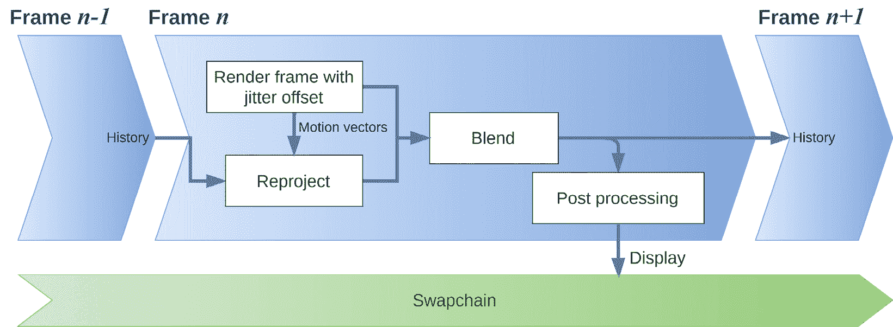

# 第六章：抗锯齿技术

抗锯齿可以通过多种方式实现，最常见的是通常由图形 API 提供的方式。在本章中，我们首先探讨如何启用和使用 Vulkan 提供的抗锯齿，然后介绍许多更适合其他需要更好抗锯齿或需要不同算法的其他用例的技术，例如时间抗锯齿。在本章中，我们将引导您了解各种抗锯齿技术，从启用和使用 Vulkan 提供的技术开始，探索针对不同用例的更高级和更合适的方法。目标是让您具备选择和实现最适合您特定需求的最合适的抗锯齿技术的知识和技能，从而提高您渲染图形的视觉效果。

在本章中，我们将介绍以下配方：

+   启用和使用 Vulkan 的 MSAA

+   应用 FXAA

+   利用 TAA

+   应用 DLSS

# 技术要求

对于本章，您需要确保已安装 VS 2022 以及 Vulkan SDK。对 C++ 编程语言的基本熟悉程度以及对 OpenGL 或任何其他图形 API 的理解将很有用。请重新查看 *技术要求* 部分的 *第一章**，Vulkan 核心概念*，以获取有关设置和构建本章可执行文件的详细信息。本章包含多个配方，可以使用以下可执行文件启动：

1.  `Chapter06_MSAA.exe`

1.  `Chapter06_FXAA.exe`

1.  `Chapter06_TAA.exe`

1.  `Chapter06_DLSS.exe`

# 启用和使用 Vulkan 的 MSAA

MSAA 是一种用于减少可能出现在曲线线和斜边上的锯齿边缘的抗锯齿技术。以下是它的工作概述：

1.  **多个样本**：与常规渲染中只采样一次像素不同，MSAA 在每个像素内进行多次采样。例如，4 x MSAA 需要 4 个样本，而 8 x MSAA 需要 8 个样本。片段着色器为每个样本运行，并将它们的输出存储在 *步骤 3* 中进行处理。

1.  **边缘检测**：MSAA 只对几何形状边缘的像素进行多采样。与超采样等技术相比，它更高效，后者在更高分辨率下对整个图像进行采样。

1.  **合并样本**：一旦采样完成，它们将被平均（或解析）为像素的单色值。如果一些样本在对象内部，而一些样本在外部，则最终像素颜色将是一个混合色，从而创建更平滑的过渡，并减少锯齿边缘的出现。

在这个配方中，我们将描述您需要采取的步骤来在 Vulkan 中启用 MSAA，因为它由 API 提供。

## 准备工作

在 Vulkan 中启用 MSAA 需要修改源代码中的多个位置。以下是实现 MSAA 的高级步骤：

1.  首先，你需要确保系统支持 MSAA。此外，你还需要确定每像素支持的样本数最大值。

1.  纹理需要创建为支持相应数量的样本。

1.  需要创建额外的纹理，作为合并样本后的输出（也称为解决附件）。

1.  渲染通道需要指定每个附件的样本数，并提供关于解决附件的额外信息。

1.  最后，帧缓冲区需要引用解决附件。

使用 MSAA 进行渲染涉及样本数大于 1 的图像。然而，这些多样本图像不能直接使用`VK_IMAGE_LAYOUT_PRESENT_SRC_KHR`进行展示。`VK_IMAGE_LAYOUT_PRESENT_SRC_KHR`布局是为准备展示的单样本图像设计的，每个像素有一个颜色值。这就是为什么需要一个*解决*操作来将多样本图像转换为单样本图像。最终的抗锯齿输出，适合展示，需要写入另一个具有`VK_SAMPLE_COUNT_1_BIT`样本数的图像。这意味着每个样本数大于 1 的颜色附件都需要一个具有`VK_SAMPLE_COUNT_1_BIT`样本数的关联附件。这些附加的附件，称为解决附件，用于存储最终的抗锯齿输出。在解决操作期间，多样本的值被合并并写入到*解决*附件中，创建出可以展示的最终单样本图像。

## 如何实现...

在 Vulkan 中启用 MSAA 并不困难，但需要在代码的多个部分进行更改。以下是如何一步步实现的指南：

1.  在下面的代码块中，我们处理`VkPhysicalDeviceProperties`对象，特别是关注`framebufferColorSampleCounts`和`framebufferDepthSampleCounts`属性。这些属性帮助我们确定每像素支持的颜色和深度样本数的最大值。这种能力取决于硬件，因此在使用之前必须先进行检查。最大支持值如下：

    ```cpp
    VkPhysicalDeviceProperties::limits::framebufferColorSampleCounts
    VkPhysicalDeviceProperties::limits::framebufferDepthSampleCounts
    ```

1.  最大样本数以`VkSampleCountFlagBits`类型的位字段提供，标志包括`VK_SAMPLE_COUNT_1_BIT`、`VK_SAMPLE_COUNT_2_BIT`、`VK_SAMPLE_COUNT_4_BIT`等，直到`VK_SAMPLE_COUNT_64_BIT`。

1.  在图像创建过程中，必须指定纹理支持的样本数。这是通过设置`VkImageCreateInfo`结构体的`samples`成员来完成的，该成员的类型为`VkSampleCountFlagBits`，例如以下内容：

    ```cpp
    VkImageCreateInfo newTexture = {
      ...
      .samples = VK_SAMPLE_COUNT_8_BIT,
    };
    ```

1.  在创建渲染通道时，附件描述必须通过设置`VkAttachmentDescription::samples`字段来指示样本数：

    ```cpp
    VkAttachmentDescription attachment = {
      ...
      .samples = VK_SAMPLE_COUNT_8_BIT,
    };
    ```

1.  需要将 `VkAttachmentDescription` 结构的实例添加到渲染通道附件列表 `VkSubpassDescription::pColorAttachments` 中，对于渲染通道中的每个解决附件。解决附件必须将其样本字段设置为 `VK_SAMPLE_COUNT_1_BIT`，因为多采样图像的分辨率导致每个像素只有一个样本。这是因为来自多采样图像的多个样本被解析为该像素的一个最终颜色值。以下是如何创建和配置此类 `VkAttachmentDescription` 实例的方法：

    ```cpp
    VkAttachmentDescription resolveAttachment = {
      ...
      .samples = VK_SAMPLE_COUNT_1_BIT,
    }
    ```

1.  必须创建 `VkAttachmentReference` 结构的实例来引用此解决附件：

    ```cpp
    VkAttachmentReference resolveAttachmentRef{
      .attachment = <index of resolve texture in the attachmentDescriptor vector>,
      .layout =
          VK_IMAGE_LAYOUT_COLOR_ATTACHMENT_OPTIMAL,
    }
    ```

    `VkAttachmentReference::attachment` 字段是一个整数，它指向 `VkRenderPassCreateInfo::pAttachments` 数组中相应索引的解决附件。

1.  最后，描述解决附件的附件引用列表被添加到 `VkSubpassDescription::pResolveAttachments` 字段中。

    *图 6.1* 展示了每个组件的设置方式以及它们如何由渲染通道和子通道描述结构引用。深度/模板附件必须具有与颜色附件相同的样本计数，并且解决附件的数量必须等于颜色附件的数量。


图 6.1 – 渲染通道配置

在前面的图中，我们展示了纹理采样计数配置及其由渲染通道和子通道描述结构引用的方式。这种配置对于在 Vulkan 中启用 MSAA 至关重要。

# 应用 FXAA

FXAA 是一种屏幕空间抗锯齿技术，它可以作为一个额外的全屏后处理通道实现。FXAA 通过识别图像中的边缘并对其进行平滑处理来减少锯齿的出现。由于不需要从场景中获取任何额外的信息，FXAA 可以轻松地集成到现有代码中。它还因为只处理最终渲染图像的像素及其一些邻居而非常快速。在本食谱中，你将了解 FXAA 技术。你将理解它作为屏幕空间抗锯齿方法的功能，如何通过后处理通道应用它，以及为什么它是一个有益的工具，因为它易于集成且速度快。请注意，FXAA 通常在伽玛校正或任何 sRGB 转换之前应用。这是因为 FXAA 在线性 RGB 数据上工作得最好。如果你在伽玛校正或 sRGB 转换后应用 FXAA，可能会导致边缘检测错误，从而降低抗锯齿效果。

## 准备工作

FXAA 算法通过 `FXAAPass` 类在我们的仓库中实现，该类位于 `source/enginecore/passes/FXAA.cpp` 和 `FXAA.hpp` 文件中。该通道使用的着色器位于 `source/enginecore/resources/shaders/fxaa.frag`。

## 如何操作...

算法可以完全在片段着色器中实现，该着色器使用最终渲染图像作为输入。着色器还需要视口大小，这可以作为推送常量提供：

1.  着色器在输入和输出方面都很简单，只需要一个输入纹理和视口大小来处理：

    ```cpp
    #version 460
    layout(push_constant) uniform Viewport {
      uvec2 size;
    }
    ViewportSize;
    layout(set = 0, binding = 0) uniform sampler2D
        inputTexture;
    layout(location = 0) out vec4 outColor;
    ```

1.  FXAA 算法作用于像素的亮度，因此我们需要一个函数将 RGB 值转换为亮度：

    ```cpp
    float rgb2luma(vec3 rgb) {
      return dot(rgb, vec3(0.299, 0.587, 0.114));
    }
    ```

1.  这里有一些用于边缘检测部分的常量：

    ```cpp
    const float EDGE_THRESHOLD_MIN = (1.0 / 16.0);
    const float EDGE_THRESHOLD_MAX = (1.0 / 8.0);
    const float PIXEL_BLEND_LIMIT_TO_REDUCE_BLURRING =
        (3.0 / 4.0);
    const float MIN_PIXEL_ALIASING_REQUIRED =
        (1.0 / 8.0);
    const float NUM_LOOP_FOR_EDGE_DETECTION = 1;
    ```

1.  为了简化代码，我们将使用一个数组来存储相邻像素的亮度和 RGB 值。我们还将使用常量来帮助引用向量元素，而不仅仅是整数：

    ```cpp
    const int Center      = 0;
    const int Top         = 1;
    const int Bottom      = 2;
    const int Left        = 3;
    const int Right       = 4;
    const int TopRight    = 5;
    const int BottomRight = 6;
    const int TopLeft     = 7;
    const int BottomLeft  = 8;
    vec2 offsets[] = {
        vec2( 0, 0), vec2( 0, -1), vec2( 0,  1),
        vec2(-1, 0), vec2( 1,  0), vec2( 1, -1),
        vec2( 1, 1), vec2(-1, -1), vec2(-1,  1)};
    ```

1.  算法封装在 `applyFXAA` 函数中，该函数接受像素屏幕坐标、要处理的渲染图像以及视口大小：

    ```cpp
    vec4 applyFXAA(vec2 screenCoord,
                   sampler2D inputTexture,
                   uvec2 viewportSize) {
    ```

1.  第一步是计算所有八个相邻像素的亮度和 RGB 值，以及最低和最高亮度的范围。如果值低于某个阈值，则不执行抗锯齿。**阈值**用于确定像素是否在边缘上；其值表示像素与其邻居之间必须存在的最小亮度差异，以便该像素被视为边缘的一部分：

    ```cpp
      const vec2 viewportSizeInverse = vec2(
          1.0 / viewportSize.x, 1.0 / viewportSize.y);
      const vec2 texCoord =
          screenCoord * viewportSizeInverse;
      float minLuma = 100000000;
      float maxLuma = 0;
      float lumas[9];
      vec3 rgb[9];
      vec3 rgbSum = vec3(0, 0, 0);
      for (int i = 0; i < 9; ++i) {
        rgb[i] =
            texture(inputTexture,
                    texCoord +
                        offsets[i] *
                            viewportSizeInverse)
                .rgb;
        rgbSum += rgb[i];
        lumas[i] = rgb2luma(rgb[i]);
        if (i < 5) {
          minLuma = min(lumas[i], minLuma);
          maxLuma = max(lumas[i], maxLuma);
        }
      }
      const float rangeLuma = maxLuma - minLuma;
      if (rangeLuma <
          max(EDGE_THRESHOLD_MIN,
              EDGE_THRESHOLD_MAX * maxLuma)) {
        return vec4(rgb[Center], 1.0);
      }
    ```

1.  所有相邻像素的平均亮度和中心像素之间的差异告诉我们是否需要执行抗锯齿算法以及所需的混合量。它还将混合量限制在 0 和 `PIXEL_BLEND_LIMIT_TO_REDUCE_BLURRING` 之间，以减少模糊：

    ```cpp
      const float lumaTopBottom =
          lumas[Top] + lumas[Bottom];
      const float lumaLeftRight =
          lumas[Left] + lumas[Right];
      const float lumaTopCorners =
          lumas[TopLeft] + lumas[TopRight];
      const float lumaBottomCorners =
          lumas[BottomLeft] + lumas[BottomRight];
      const float lumaLeftCorners =
          lumas[TopLeft] + lumas[BottomLeft];
      const float lumaRightCorners =
          lumas[TopRight] + lumas[BottomRight];
      const float lumaTBLR =
          lumaTopBottom + lumaLeftRight;
      const float averageLumaTBLR = (lumaTBLR) / 4.0;
      const float lumaSubRange =
          abs(averageLumaTBLR - lumas[Center]);
      float pixelblendAmount =
          max(0.0, (lumaSubRange / rangeLuma) -
                       MIN_PIXEL_ALIASING_REQUIRED);
      pixelblendAmount = min(
          PIXEL_BLEND_LIMIT_TO_REDUCE_BLURRING,
          pixelblendAmount *
              (1.0 /
               (1.0 - MIN_PIXEL_ALIASING_REQUIRED)));
    ```

1.  下一步是确定边缘是否比水平方向更垂直，并使用 `findEndPointPosition` 函数初始化用于找到边缘端点的变量：

    ```cpp
      const vec3 averageRGBNeighbor =
          rgbSum * (1.0 / 9.0);
      const float verticalEdgeRow1 =
          abs(-2.0 * lumas[Top] + lumaTopCorners);
      const float verticalEdgeRow2 =
          abs(-2.0 * lumas[Center] + lumaLeftRight);
      const float verticalEdgeRow3 = abs(
          -2.0 * lumas[Bottom] + lumaBottomCorners);
      const float verticalEdge =
          (verticalEdgeRow1 + verticalEdgeRow2 * 2.0 +
           verticalEdgeRow3) /
          12.0;
      const float horizontalEdgeCol1 =
          abs(-2.0 * lumas[Left] + lumaLeftCorners);
      const float horizontalEdgeCol2 =
          abs(-2.0 * lumas[Center] + lumaTopBottom);
      const float horizontalEdgeCol3 =
          abs(-2.0 * lumas[Right] + lumaRightCorners);
      const float horizontalEdge =
          (horizontalEdgeCol1 +
           horizontalEdgeCol2 * 2.0 +
           horizontalEdgeCol3) /
          12.0;
      const bool isHorizontal =
          horizontalEdge >= verticalEdge;
      const float luma1 =
          isHorizontal ? lumas[Top] : lumas[Left];
      const float luma2 =
          isHorizontal ? lumas[Bottom] : lumas[Right];
      const bool is1Steepest =
          abs(lumas[Center] - luma1) >=
          abs(lumas[Center] - luma2);
      float stepLength =
          isHorizontal ? -screenCoordToTextureCoord.y
                       : -screenCoordToTextureCoord.x;
      float lumaHighContrastPixel;
      if (is1Steepest) {
        lumaHighContrastPixel = luma1;
      } else {
        lumaHighContrastPixel = luma2;
        // Also reverse the direction:
        stepLength = -stepLength;
      }
      vec2 outPosToFetchTexelForEdgeAntiAliasing;
      vec3 rgbEdgeAntiAliasingPixel = rgb[Center];
    ```

1.  `findEndPointPosition` 函数在认为需要抗锯齿时返回 `1`，否则返回 `0`。它还会返回将要与正在抗锯齿的像素混合的纹理像素的坐标。我们将在 *步骤 11* 中研究 `findEndPointPosition` 函数：

    ```cpp
      const float res = findEndPointPosition(
          inputTexture, texCoord,
          lumas[Center], lumaHighContrastPixel,
          stepLength, screenCoordToTextureCoord,
          isHorizontal,
          outPosToFetchTexelForEdgeAntiAliasing);
    ```

1.  如果返回值是 `1.0`，我们将通过将原始像素的颜色与 `outPosToFetchTexelForEdgeAntiAliasing` 坐标处的纹理像素的颜色混合来执行抗锯齿。要使用的混合因子（`pixelblendAmount`）已在 *步骤 7* 中计算：

    ```cpp
      if (res == 1.0) {
        rgbEdgeAntiAliasingPixel =
            texture(
                inputTexture,
                outPosToFetchTexelForEdgeAntiAliasing)
                .rgb;
      }
      return vec4(mix(rgbEdgeAntiAliasingPixel,
                      averageRGBNeighbor,
                      pixelblendAmount),
                  1.0);
    }
    ```

1.  `findEndPointPosition` 函数执行一项重要任务——它遍历图像以寻找边缘端点，从正在处理的中心像素向两个方向移动。为了完成这项任务，它需要一些信息。首先，它需要正在处理的纹理，即函数将遍历的图像。接下来，它需要正在处理的像素的坐标，这作为函数遍历的起点。函数还需要知道像素的亮度，或亮度。此外，它必须了解最高对比度像素的亮度，这是一个基于正在检查的边缘是更水平还是更垂直而确定的元素。另一条关键信息是步长，它，就像最高对比度像素的亮度一样，也取决于边缘的角度。函数需要纹理坐标中一个像素的长度，以便准确遍历图像。最后，它需要一个标志，指示边缘是更水平还是更垂直，以正确理解边缘的方向。如果它认为需要进行抗锯齿处理，则返回 `1`，否则返回 `0`。它还返回包含用于抗锯齿的 RGB 值的像素坐标：

    ```cpp
    float findEndPointPosition(
        sampler2D inputTexture,
        vec2 textureCoordMiddle, float lumaMiddle,
        float lumaHighContrastPixel, float stepLength,
        vec2 screenCoordToTextureCoord,
        bool isHorizontal,
        out vec2
            outPosToFetchTexelForEdgeAntiAliasing) {
    ```

1.  根据边缘是否水平，该函数初始化高对比度像素的方向和位置：

    ```cpp
      vec2 textureCoordOfHighContrastPixel =
          textureCoordMiddle;
      // Direction of the edge
      vec2 edgeDir;
      if (isHorizontal) {
        textureCoordOfHighContrastPixel.y =
            textureCoordMiddle.y + stepLength;
        textureCoordOfHighContrastPixel.x =
            textureCoordMiddle.x;
        edgeDir.x = screenCoordToTextureCoord.x;
        edgeDir.y = 0.0;
      } else {
        textureCoordOfHighContrastPixel.x =
            textureCoordMiddle.x + stepLength;
        textureCoordOfHighContrastPixel.y =
            textureCoordMiddle.y;
        edgeDir.y = screenCoordToTextureCoord.y;
        edgeDir.x = 0.0;
      }
    ```

1.  在我们开始寻找边缘端点之前，我们需要设置一些在循环中使用的变量：

    ```cpp
      // Prepare for the search loop:
      float lumaHighContrastPixelNegDir;
      float lumaHighContrastPixelPosDir;
      float lumaMiddlePixelNegDir;
      float lumaMiddlePixelPosDir;
      bool doneGoingThroughNegDir = false;
      bool doneGoingThroughPosDir = false;
      vec2 posHighContrastNegDir =
          textureCoordOfHighContrastPixel - edgeDir;
      vec2 posHighContrastPosDir =
          textureCoordOfHighContrastPixel + edgeDir;
      vec2 posMiddleNegDir =
          textureCoordMiddle - edgeDir;
      vec2 posMiddlePosDir =
          textureCoordMiddle + edgeDir;
    ```

1.  循环最多迭代 `NUM_LOOP_FOR_EDGE_DETECTION` 次。它通过检查从中间像素的正负方向上的亮度差异来寻找边缘。当同一方向上连续两个点的亮度差异超过阈值时，就会检测到边缘（我们将在 *步骤 20* 中查看 `processDirection` 函数）：

    ```cpp
        for (int i = 0; i < NUM_LOOP_FOR_EDGE_DETECTION;
           ++i) {
        // Negative direction processing
        if (!doneGoingThroughNegDir) {
          processDirection(doneGoingThroughNegDir,
                           posHighContrastNegDir,
                           posMiddleNegDir, -edgeDir,
                           lumaHighContrastPixel,
                           lumaMiddle);
        }
        // Positive direction processing
        if (!doneGoingThroughPosDir) {
          processDirection(doneGoingThroughPosDir,
                           posHighContrastPosDir,
                           posMiddlePosDir, edgeDir,
                           lumaHighContrastPixel,
                           lumaMiddle);
        }
        // If both directions are done, exit the loop
        if (doneGoingThroughNegDir &&
            doneGoingThroughPosDir) {
          break;
        }
      }
    ```

1.  函数现在计算从中间像素到检测到的边缘端点的距离，包括负方向和正方向：

    ```cpp
      float dstNeg;
      float dstPos;
      if (isHorizontal) {
        dstNeg =
            textureCoordMiddle.x - posMiddleNegDir.x;
        dstPos =
            posMiddlePosDir.x - textureCoordMiddle.x;
      } else {
        dstNeg =
            textureCoordMiddle.y - posMiddleNegDir.y;
        dstPos =
            posMiddlePosDir.y - textureCoordMiddle.y;
      }
    ```

1.  它还检查哪个端点更接近中间像素：

    ```cpp
      bool isMiddlePixelCloserToNeg = dstNeg < dstPos;
      float dst = min(dstNeg, dstPos);
      float lumaEndPointOfPixelCloserToMiddle =
          isMiddlePixelCloserToNeg
              ? lumaMiddlePixelNegDir
              : lumaMiddlePixelPosDir;
    ```

1.  根据接近中间像素的端点和中间像素本身的亮度差异，认为需要进行抗锯齿处理：

    ```cpp
      bool edgeAARequired =
          abs(lumaEndPointOfPixelCloserToMiddle -
              lumaHighContrastPixel) <
          abs(lumaEndPointOfPixelCloserToMiddle -
              lumaMiddle);
    ```

1.  使用到边缘端点的距离，以下代码片段计算所需的抗锯齿像素偏移量：

    ```cpp
      float negInverseEndPointsLength =
          -1.0 / (dstNeg + dstPos);
      float pixelOffset =
          dst * negInverseEndPointsLength + 0.5;
      outPosToFetchTexelForEdgeAntiAliasing =
          textureCoordMiddle;
      if (isHorizontal) {
        outPosToFetchTexelForEdgeAntiAliasing.y +=
            pixelOffset * stepLength;
      } else {
        outPosToFetchTexelForEdgeAntiAliasing.x +=
            pixelOffset * stepLength;
      }
    ```

1.  如果需要边缘抗锯齿，则函数返回 `1.0`，否则返回 `0.0`：

    ```cpp
      return edgeAARequired ? 1.0 : 0.0;
    }
    ```

1.  `processDirection` 检查一定方向（由 `edgeIncrement` 给出）中像素的亮度值，以检查高对比度或边缘。它将继续检查该方向上的位置，直到满足一定的对比度条件。一旦满足条件，它将设置 `doneGoingThroughDir` 标志为 `true`，表示它已在该方向上完成处理：

    ```cpp
    void processDirection(inout bool doneGoingThroughDir,
                          inout vec2 posHighContrast,
                          inout vec2 posMiddle,
                          float edgeIncrement,
                          float lumaHighContrastPixel,
                          float lumaMiddle) {
      float lumaHighContrastPixelDir = rgb2luma(
          texture(inputTexture, posHighContrast).rgb);
      float lumaMiddlePixelDir = rgb2luma(
          texture(inputTexture, posMiddle).rgb);
      doneGoingThroughDir =
          abs(lumaHighContrastPixelDir -
              lumaHighContrastPixel) >
              abs(lumaHighContrastPixelDir -
                  lumaMiddle) ||
          abs(lumaMiddlePixelDir - lumaMiddle) >
              abs(lumaMiddlePixelDir -
                  lumaHighContrastPixel);
      // Update position for next iteration if not
      // done
      if (!doneGoingThroughDir) {
        posHighContrast += edgeIncrement;
        posMiddle += edgeIncrement;
      }
    }
    ```

1.  片段代码调用 `applyFXAA`，该函数从着色器返回新的输出颜色：

    ```cpp
    void main() {
      outColor =
          applyFXAA(gl_FragCoord.xy, inputTexture,
                    ViewportSize.size);
    }
    ```

就这样——应用 FXAA 的配方就完成了，FXAA 是一种强大的工具，可以平滑掉图形中的锯齿。随着我们结束这个话题，请记住，FXAA 的美丽之处不仅在于其增强视觉输出的能力，还在于其灵活性和易于集成到现有系统中的便利性。

# 利用 TAA

与之前讨论的抗走样方法不同，这些方法只考虑空间信息，而 TAA 基于时间信息——也就是说，它利用当前帧和前一帧来平滑这些走样伪影。走样伪影发生的原因是样本不足；TAA 通过在帧序列上采样数据来解决此问题，显著减轻了单个帧的压力。

基本思想是应用子像素抖动——也就是说，为每个新帧稍微移动相机的投影矩阵。这导致每个帧的视角略有不同，比静态视角提供了更多关于场景的信息。在渲染期间采样纹理时，由于抖动，产生的颜色值可能会有所不同。这为每个帧创建了一个不同的走样模式，随着时间的积累，平均出来并减少了场景中可见的走样。这在上面的截图*图 6.2*中得到了演示。


图 6.2 – 时间抗走样概述

这里概述的概念在静态场景中表现非常出色。然而，在物体或相机处于运动状态的情况下，连续帧可能会表现出显著差异。这可能导致视觉伪影，移动物体似乎留下了一系列它们的*幽灵*，形成了所谓的**拖影**效果。

为了消除拖影，我们使用通常所说的**速度缓冲区**，并且使用运动矢量来捕捉场景中的运动。对于每个像素，计算一个运动矢量，表示像素相对于前一帧移动了多少。结果是存储这些运动矢量的速度缓冲区。然后使用速度缓冲区将先前渲染的帧重新投影到当前帧上。这意味着对于每个像素，使用运动矢量查找前一帧中相应像素的颜色。然后将这种颜色与像素的当前颜色混合，从而在时间上平滑颜色。

*图 6.3*展示了 TAA 算法的高级概述：



图 6.3 – TAA 帧概述

在这个菜谱中，你将学习如何实现 TAA，这是一种高级技术，可以显著减少闪烁并提供更平滑的视觉效果。你将了解 TAA 的复杂性以及如何巧妙地将其集成到代码中，为你的图形渲染工具箱添加另一个强大的工具。

## 准备工作

在仓库中，TAA 算法是通过位于`source/enginecore/passes/TAAComputePass.hpp`和`cpp`文件的`TAAComputePass`类实现的。着色器使用计算着色器实现，位于`source/enginecore/resources/shaders/taaresolve.comp`和`source/enginecore/resources/shaders/taahistorycopyandsharpen.comp`。可以通过运行`Chapter06_TAA`可执行文件来启动 TAA 示例。

*图 6**.4*展示了 TAA 算法的流程：


图 6.4 – 在延迟渲染器中的 TAA 算法

TAA（时间抗锯齿）被实现为一个两步的计算着色器：

1.  第一步是 TAA 解析着色器，它接受`ColorTexture`、`DepthTexture`、`HistoryTexture`和`VelocityTexture`作为输入，并将结果写入一个中间图像。在给定的示例中，速度、颜色和深度纹理是从`Gbuffer`传递中产生的；然而，从概念上讲，这些也可以在正向渲染中产生。

1.  第二步是运行一个计算着色器，该着色器负责以下操作：

    1.  将之前产生的中间纹理结果复制到历史纹理中。

    1.  精炼这些中间结果时，我们不需要生成额外的纹理来存储精炼后的结果，相反，我们可以利用 TAA 解析着色器中提供的`ColorTexture`。这正是最终将被显示的`ColorTexture`。TAA 的一个已知缺点是可能会在图像中造成轻微的模糊。为了减轻这一点，在 TAA 之后应用了一个锐化过滤器。这个锐化阶段旨在增强图像的边缘和复杂细节，从而恢复在 TAA 解析过程中可能受损的一些锐度。

## 如何做到这一点...

要实现 TAA，我们首先需要构建一个抖动矩阵。这个矩阵将在渲染过程中与**模型-视图-投影**（**MVP**）矩阵协同使用。此外，我们还需要颜色、深度和速度缓冲区。方便的是，这些缓冲区已经作为 G 缓冲区管道的一部分生成，我们在*第四章*“探索光照、着色和阴影技术”的*实现 G 缓冲区以进行延迟渲染*配方中实现了：

1.  `TAAComputePass::init`方法负责初始化各种资源。它建立了两个管道 – 一个用于解析到输出颜色，另一个用于将输出颜色传输到历史纹理并增强输出颜色的锐度。

1.  大部分工作发生在`TAAComputePass::doAA`函数中。这个函数简单地操作解析计算管道，然后是处理复制历史纹理和增强输出颜色锐度的管道。我们如下突出显示了`doAA`函数的关键组件，省略了不那么关键的部分以避免冗长：

    ```cpp
    void TAAComputePass::doAA(VkCommandBuffer cmd,
                              int frameIndex,
                              int isCamMoving) {
      pipeline_->bind(cmd);
      outColorTexture_->transitionImageLayout(
          cmd, VK_IMAGE_LAYOUT_GENERAL);
      historyTexture_->transitionImageLayout(
          cmd, VK_IMAGE_LAYOUT_GENERAL);
      vkCmdDispatch(…);
      VkImageMemoryBarrier barriers[2] = {
          {
            …
      };
      vkCmdPipelineBarrier(
          cmd, VK_PIPELINE_STAGE_COMPUTE_SHADER_BIT,
          VK_PIPELINE_STAGE_COMPUTE_SHADER_BIT, 0, 0,
          nullptr, 0, nullptr, 2, barriers);
      colorTexture_->transitionImageLayout(
          cmd, VK_IMAGE_LAYOUT_GENERAL);
      sharpenPipeline_->bind(cmd);
      vkCmdDispatch(…);
      colorTexture_->transitionImageLayout(
          cmd,
          VK_IMAGE_LAYOUT_SHADER_READ_ONLY_OPTIMAL);
      outColorTexture_->transitionImageLayout(
          cmd,
          VK_IMAGE_LAYOUT_SHADER_READ_ONLY_OPTIMAL);
    }
    ```

1.  实际的魔法发生在两个计算着色器中；特别是，解算着色器是最重要的。解算着色器在`taaresolve.comp`中实现。让我们看看着色器是如何工作的。

1.  首先，我们将扩展一些辅助函数。`catmullRomTextureFiltering`通过使用 Catmull-Rom 插值混合帧之间的像素颜色，以平滑时间上的锯齿。Catmull-Rom 插值是一种三次插值，它比线性插值提供了更平滑的外观。该函数使用 Catmull-Rom 权重（`w0, w1, w2, w3`）来计算中心（`w12`）和中心偏移（`offset12`）的权重。然后，函数计算三个新的纹理位置（`texPos0`, `texPos3`, 和 `texPos12`）并将这些位置调整以匹配纹理分辨率。然后，函数使用这些权重和纹理位置通过访问特定位置的历史缓冲区纹理，将检索到的颜色乘以相应的权重，并将它们相加来计算结果像素颜色。

    `varianceClampColor`函数在抗锯齿 TAA 中用于处理由于颜色数据的时序重投影而产生的鬼影和模糊问题。该函数通过根据其周围像素的颜色方差限制给定像素的颜色值来工作。它遍历当前像素周围的 3x3 邻域。对于每个相邻像素，函数检索其颜色数据（`neighColor`）并基于当前像素的欧几里得距离计算一个权重（`w`）。这个权重被设计为给予更接近像素更多的最终颜色结果的影响。

    `calculateBlendFactor`函数负责根据像素的速度和亮度进行计算，以确定像素的混合因子。首先，在两个层面上计算像素的移动，即整体运动和微小的子像素运动，分别得到`subpixelMotion`和`dynamicBlendFactor`的值。然后，为了调整像素的亮度或亮度，确定当前颜色与前一帧颜色之间的差异。整个过程增强了像素随时间移动和颜色变化的逼真度，当物体或相机移动时，显著提高了整体图像质量。`catmullRomTextureFiltering`和`varianceClampColor`的实现非常详细；我们建议查看`taaresolve.comp`以获取实现细节。

1.  接下来，我们展示`main`函数；这个函数通过减少由于相机或场景中物体的快速移动而产生的闪烁和鬼影伪影，有助于生成更平滑、更稳定的图像。以下子步骤将向您介绍其实施的具体细节：

    1.  计算当前像素周围的最近深度和相应的速度：

    ```cpp
    void main() {
      vec2 velocity;
      const float closestDepth =
          closestVelocityAndDepth(velocity);
    ```

    1.  使用计算出的速度将当前像素位置重投影到上一帧的位置：

    ```cpp
      vec2 reprojectedUV = uv - velocity;
    ```

    1.  使用重投影位置的历史缓冲区计算`velocityLerp`。注意使用`taaConstData.isFirstFrame`，这有助于确定我们是否正在处理序列的第一帧。如果是第一帧，则`velocityLerp`简单地初始化为`0.0f`。在摄像机切换或传送（即从一个视角突然切换到另一个视角）的上下文中，第一帧假设也适用。每当这些事件发生时，场景从一个帧到另一个帧会急剧变化。在这种情况下，将切换或传送后的帧视为第一帧是有益的。这是因为由于场景内容的大幅变化，前一帧的数据不再是当前帧的好参考：

    ```cpp
      float velocityLerp =
          (taaConstData.isFirstFrame != 0)
              ? texture(inHistoryBuffer,
                        reprojectedUV)
                    .w
              : 0.0f;
    ```

    1.  加载当前帧颜色（`colorIn`）并使用`catmullRomTextureFiltering`计算`colorHistory`：

    ```cpp
      vec3 colorIn = getColorData(
          ivec2(gl_GlobalInvocationID.xy));
      vec3 colorHistory = catmullRomTextureFiltering(
          reprojectedUV, vec2(workSize));
    ```

    1.  定义两个常量，`boxSizeWhenMoving`和`boxSizeWhenStationary`。我们根据摄像机是否移动来确定`boxSize`的值，并根据`velocityLerp`在静止和移动值之间进行插值：

    ```cpp
      const float boxSizeWhenMoving = 2000.0f;
      const float boxSizeWhenStationary = 100.0f;
      float boxSize =
          (taaConstData.isCameraMoving == 0)
              ? boxSizeWhenStationary
              : mix(boxSizeWhenStationary,
                    boxSizeWhenMoving, velocityLerp);
      boxSize = mix(
          0.5f, boxSize,
          noGeometry ? 0.0f
                     : smoothstep(0.02f, 0.0f,
                                  length(velocity)));
    ```

    1.  然后，使用`varianceClampColor`函数对历史颜色（`colorHistory`）进行夹紧，以确保颜色基于周围像素的方差在某个范围内：

    ```cpp
      vec3 clampHistory =
          varianceClampColor(colorHistory, boxSize);
    ```

    1.  计算决定当前颜色和历史颜色应使用多少以获得最终颜色的`blendFactor`：

    ```cpp
      float blendFactor = calculateBlendFactor(
          closestDepth, velocity, noGeometry,
          workSize, colorIn, clampHistory,
          velocityLerp);
    ```

    1.  根据`blendFactor`将最终颜色（`colorResolve`）计算为夹紧的历史颜色和当前颜色的混合，并将`velocityLerp`存储在`alpha`通道中：

    ```cpp
      vec3 colorResolve =
          mix(clampHistory, colorIn, blendFactor);
      imageStore(outColorImage,
                 ivec2(gl_GlobalInvocationID.xy),
                 vec4(colorResolve, velocityLerp));
    }
    ```

1.  接下来，我们将展示`taahistorycopyandsharpen.comp`的工作原理；这个着色器负责将数据复制到历史纹理中，以及锐化由第 5 步（`taaresolve.comp`）产生的结果。主要函数如下所示，代码很简单——它首先将`incolor`（即前一步骤 5 产生的图像）复制到历史纹理中。然后调用`sharpen`方法。该方法首先从中心及其四个直接相邻的位置（顶部、左侧、右侧和底部）加载像素颜色。然后使用非锐化掩膜技术，该技术涉及从原始图像中减去模糊或*非锐化*版本的图像，以创建表示图像细节的掩膜。该函数将此掩膜应用于增强原始图像，使其看起来更锐利。`sharpen`方法产生的最终颜色存储在`outColorImage`中，最终复制到 swapchain 图像中。为了简洁起见，我们在此不详细说明`sharpen`函数。然而，您可以在`taahistorycopyandsharpen.comp`文件中查看其实现：

    ```cpp
    void main() {
      vec4 incolor = imageLoad(inColorImage, ivec2(gl_GlobalInvocationID.xy));
      imageStore(outHistory, ivec2(gl_GlobalInvocationID.xy), incolor);
      vec3 color = sharpen();
      imageStore(outColorImage, ivec2(gl_GlobalInvocationID.xy), vec4(color, 1.0f));
    }
    ```

    尽管 TAA 应用广泛且具有许多优点，但它并非没有缺点：

    +   当物体运动在屏幕上揭露新的区域时，这些区域要么在历史缓冲区中不存在，要么被运动矢量不准确地描绘。此外，相机旋转和反向平移可能导致屏幕边缘出现大量未被揭露的区域。

    +   拥有亚像素尺寸的特征，如电线，可能被连续帧错过，导致它们在后续帧的运动矢量中缺失。透明表面可以生成像素，其中不透明物体的运动矢量与所描绘物体的整体运动不一致。最后，阴影和反射不会遵循它们所遮蔽的表面的运动矢量方向。

当 TAA（时间抗锯齿）不正常工作时，它要么导致鬼影（由整合错误值引起的模糊效果），要么暴露原始的锯齿，导致边缘参差不齐、闪烁和噪声。

参考资料也

为了进一步阅读和深入了解 TAA，请考虑探索以下资源。这些参考资料将为你提供更详细的信息、实际应用和最新进展的见解：

+   [`research.nvidia.com/publication/2019-03_improving-temporal-antialiasing-adaptive-ray-tracing`](https://research.nvidia.com/publication/2019-03_improving-temporal-antialiasing-adaptive-ray-tracing)

+   [`community.arm.com/arm-community-blogs/b/graphics-gaming-and-vr-blog/posts/temporal-anti-aliasing`](https://community.arm.com/arm-community-blogs/b/graphics-gaming-and-vr-blog/posts/temporal-anti-aliasing)

# 应用 DLSS

DLSS 是由 NVIDIA 为他们的 RTX 系列显卡开发的一种由 AI 驱动的技术。DLSS 利用机器学习和 AI 的力量，通过实时智能提升低分辨率图像的分辨率，从而以更少的计算能力生成高质量的、高分辨率的图像。我们还可以使用 DLSS 在较低的基线分辨率下渲染帧，然后使用 AI 将图像提升到更高的分辨率。

注意，要使用 DLSS，你必须拥有 NVIDIA RTX 系列的显卡。

在这个菜谱中，你将学习如何应用 DLSS，这是一种用于实时增强渲染帧分辨率的创新技术。你将了解 DLSS 如何利用机器学习和 AI 智能地提升低分辨率图像，从而以更少的计算能力实现更高质量的图像。

## 准备工作

在仓库中，DLSS 是通过位于`source/enginecore/DLSS.hpp`和`cpp`文件中的`DLSS`类实现的。可以通过运行`chapter06_DLSS`可执行文件来启动 DLSS 示例。

DLSS 还需要颜色、深度和速度纹理，这些纹理与 TAA 算法所使用的纹理相同。

## 如何做到这一点...

DLSS 的集成步骤如下：

1.  首先，我们需要查询 DLSS 所需的设备和实例扩展；这些扩展需要在初始化 Vulkan 之前启用。NVIDIA 的 DLSS SDK 提供了`NVSDK_NGX_VULKAN_RequiredExtensions`，需要用它来查询扩展。以下代码块展示了一个可以附加 DLSS 所需扩展的静态函数；这需要在初始化 Vulkan 设备之前调用：

    ```cpp
    void DLSS::requiredExtensions(std::vector<std::string>& instanceExtensions,
                                  std::vector<std::string>& deviceExtensions) {
      unsigned int instanceExtCount;
      const char** instanceExt;
      unsigned int deviceExtCount;
      const char** deviceExt;
      auto result = NVSDK_NGX_VULKAN_RequiredExtensions(
          &instanceExtCount, &instanceExt, &deviceExtCount, &deviceExt);
      for (int i = 0; i < instanceExtCount; ++i) {
        if (std::find(instanceExtensions.begin(), instanceExtensions.end(),
                      instanceExt[i]) == instanceExtensions.end()) {
          instanceExtensions.push_back(instanceExt[i]);
        }
      }
      for (int i = 0; i < deviceExtCount; ++i) {
        if (std::find(deviceExtensions.begin(), deviceExtensions.end(),
                      deviceExt[i]) == deviceExtensions.end()) {
          deviceExtensions.push_back(deviceExt[i]);
          if (deviceExtensions.back() ==
              "VK_EXT_buffer_device_address") {  // we are using 1.3, this extension
                                                 // has been promoted
            deviceExtensions.pop_back();
          }
        }
      }
    }
    ```

1.  接下来，我们将探讨`DLSS init`方法。此方法负责初始化 NVSDK 提供的 DLSS 功能。它接受视口的当前宽度和高度、一个放大因子以及一个指向`CommandQueueManager`对象的引用。函数首先设置放大因子，然后根据当前视口大小和期望的质量级别确定 DLSS 的最佳设置。然后，根据特定的标志配置 DLSS 功能，如运动矢量分辨率、帧锐化等。最后，它创建 DLSS 功能并将命令提交到 Vulkan 命令缓冲区：

    ```cpp
    void DLSS::init(int currentWidth, int currentHeight, float upScaleFactor, VulkanCore::CommandQueueManager& commandQueueManager) {
      NVSDK_NGX_Result result = NGX_DLSS_GET_OPTIMAL_SETTINGS(paramsDLSS_, currentWidth, currentHeight, dlssQuality, &optimalRenderWidth, &optimalRenderHeight, &minRenderWidth, &minRenderHeight, &maxRenderWidth, &maxRenderHeight, &recommendedSharpness);
      int dlssCreateFeatureFlags = NVSDK_NGX_DLSS_Feature_Flags_None;
      dlssCreateFeatureFlags |= NVSDK_NGX_DLSS_Feature_Flags_MVLowRes;
      dlssCreateFeatureFlags |= NVSDK_NGX_DLSS_Feature_Flags_DoSharpening;
      NVSDK_NGX_DLSS_Create_Params dlssCreateParams{
          .Feature =
              {
                  .InWidth = unsigned int(currentWidth),
                  .InHeight = unsigned int(currentHeight),
                  .InTargetWidth = unsigned int(currentWidth * upScaleFactor),
                  .InTargetHeight = unsigned int(currentHeight * upScaleFactor),
                  .InPerfQualityValue = NVSDK_NGX_PerfQuality_Value_MaxQuality,
              },
          .InFeatureCreateFlags = dlssCreateFeatureFlags,
      };
      auto commmandBuffer = commandQueueManager.getCmdBufferToBegin();
      constexpr unsigned int creationNodeMask = 1;
      constexpr unsigned int visibilityNodeMask = 1;
      NVSDK_NGX_Result createDlssResult = NGX_VULKAN_CREATE_DLSS_EXT(commmandBuffer, creationNodeMask, visibilityNodeMask, &dlssFeatureHandle_, paramsDLSS_, &dlssCreateParams);
      ASSERT(createDlssResult == NVSDK_NGX_Result_Success, "Failed to create NVSDK NGX DLSS feature");
      commandQueueManager.endCmdBuffer(commmandBuffer);
      VkSubmitInfo submitInfo{
          .sType = VK_STRUCTURE_TYPE_SUBMIT_INFO,
          .commandBufferCount = 1,
          .pCommandBuffers = &commmandBuffer,
      };
      commandQueueManager.submit(&submitInfo);
      commandQueueManager.waitUntilSubmitIsComplete();
    }
    ```

1.  下一步是调用 DLSS 的`render`方法，该方法负责将 DLSS 应用于提供的输入纹理以增强图像质量。它接受一个 Vulkan 命令缓冲区和几个纹理对象作为输入——颜色、深度、运动矢量和输出颜色纹理，以及一个用于相机抖动的 2D 向量。首先，我们使用`NVSDK_NGX_Create_ImageView_Resource_VK`函数为每个输入纹理创建资源；之后，我们将输出颜色纹理的布局转换为`VK_IMAGE_LAYOUT_GENERAL`以准备写入。接下来，此函数设置 DLSS 评估的参数，包括输入颜色和输出资源、锐度级别、深度资源、运动矢量资源和相机抖动偏移。最后一部分是调用`NGX_VULKAN_EVALUATE_DLSS_EXT`将 DLSS 应用于图像，根据提供的参数增强图像质量：

    ```cpp
    void DLSS::render(VkCommandBuffer commandBuffer, VulkanCore::Texture& inColorTexture, VulkanCore::Texture& inDepthTexture, VulkanCore::Texture& inMotionVectorTexture, VulkanCore::Texture& outColorTexture, glm::vec2 cameraJitter) {
      NVSDK_NGX_Resource_VK inColorResource = NVSDK_NGX_Create_ImageView_Resource_VK(
              inColorTexture.vkImageView(), inColorTexture.vkImage(),
              {VK_IMAGE_ASPECT_COLOR_BIT, 0, 1, 0, 1}, VK_FORMAT_UNDEFINED,
              inColorTexture.vkExtents().width, inColorTexture.vkExtents().height,
              true);
      NVSDK_NGX_Resource_VK outColorResource = NVSDK_NGX_Create_ImageView_Resource_VK(…);
      NVSDK_NGX_Resource_VK depthResource = NVSDK_NGX_Create_ImageView_Resource_VK(…);
      NVSDK_NGX_Resource_VK motionVectorResource = NVSDK_NGX_Create_ImageView_Resource_VK(…);
      outColorTexture.transitionImageLayout(commandBuffer, VK_IMAGE_LAYOUT_GENERAL);
      NVSDK_NGX_VK_DLSS_Eval_Params evalParams = {
          .Feature =
              {
                  .pInColor = &inColorResource,
                  .pInOutput = &outColorResource,
                  .InSharpness = 1.0,
              },
          .pInDepth = &depthResource,
          .pInMotionVectors = &motionVectorResource,
          .InJitterOffsetX = cameraJitter.x,
          .InJitterOffsetY = cameraJitter.y,
          .InRenderSubrectDimensions =
              {
                  .Width =
                      static_cast<unsigned int>(inColorTexture.vkExtents().width),
                  .Height =
                      static_cast<unsigned int>(inColorTexture.vkExtents().height),
              },
          .InReset = 0,
          .InMVScaleX = -1.0f * inColorResource.Resource.ImageViewInfo.Width,
          .InMVScaleY = -1.0f * inColorResource.Resource.ImageViewInfo.Height,
          .pInExposureTexture = nullptr,
      };
      NVSDK_NGX_Result result = NGX_VULKAN_EVALUATE_DLSS_EXT(commandBuffer, dlssFeatureHandle_, paramsDLSS_, &evalParams);
      ASSERT(result == NVSDK_NGX_Result_Success, "Failed to evaluate DLSS feature");
      if (result != NVSDK_NGX_Result_Success) {
        auto store = GetNGXResultAsString(result);
      }
    }
    ```

在下一节中，我们将提供一些有价值的链接，以供进一步阅读和深入了解该主题。

## 参见

对于更深入的知识和关于 DLSS 的实际见解，以下资源将非常有价值：

+   [NVIDIA/DLSS 的 DLSS 编程指南](https://github.com/NVIDIA/DLSS/blob/main/doc/DLSS_Programming_Guide_Release.pdf)

在本章中，我们首先介绍了 Vulkan 的 MSAA。这是一种用于对抗高对比度边缘空间走样（常在渲染图像中表现为锯齿或阶梯状线条）的方法。我们讨论了在 Vulkan 中启用 MSAA 的过程，这涉及到在管道创建期间配置多采样状态并分配一个单独的多采样图像。我们还介绍了 MSAA 是如何通过平均多个采样点的颜色来减少锯齿状外观，并为边缘提供更平滑、更自然的外观。

然后，我们讨论了 FXAA 技术。这是一种屏幕空间后处理方法，意味着它直接作用于最终图像。它的主要优势是速度和简单性，在性能和质量之间提供了一个良好的权衡。FXAA 通过寻找高对比度像素并将它们与周围环境混合来平滑边缘。尽管是一种近似，但 FXAA 通常可以在感知图像质量上提供显著的提升，尤其是在具有许多高对比度边缘的场景中。

我们讨论的第三种技术是 TAA。这种方法利用了时间重投影的概念，即它利用前一帧的信息来最小化当前帧中的锯齿伪影。我们介绍了 TAA 是如何通过在多个帧上累积样本并应用过滤器来减少时间锯齿效应（如爬行和闪烁）来工作的。当正确实现时，TAA 可以在具有高运动和细节水平的场景中提供优于纯粹空间技术的结果。

最后，我们探讨了 DLSS 这一前沿技术。DLSS 是由 NVIDIA 开发的专有技术，它利用人工智能进行工作，通过训练一个深度学习模型来预测从低分辨率输入生成的高分辨率图像。训练好的模型随后用于实时提升图像分辨率。我们还讨论了 DLSS 如何在显著提升性能的同时，保持或甚至提高视觉保真度。

本章全面概述了各种抗锯齿技术，每种技术都有其优势和适用场景。通过理解这些方法，你可以根据 Vulkan 应用程序的具体需求，做出明智的选择，决定采用哪种技术。
