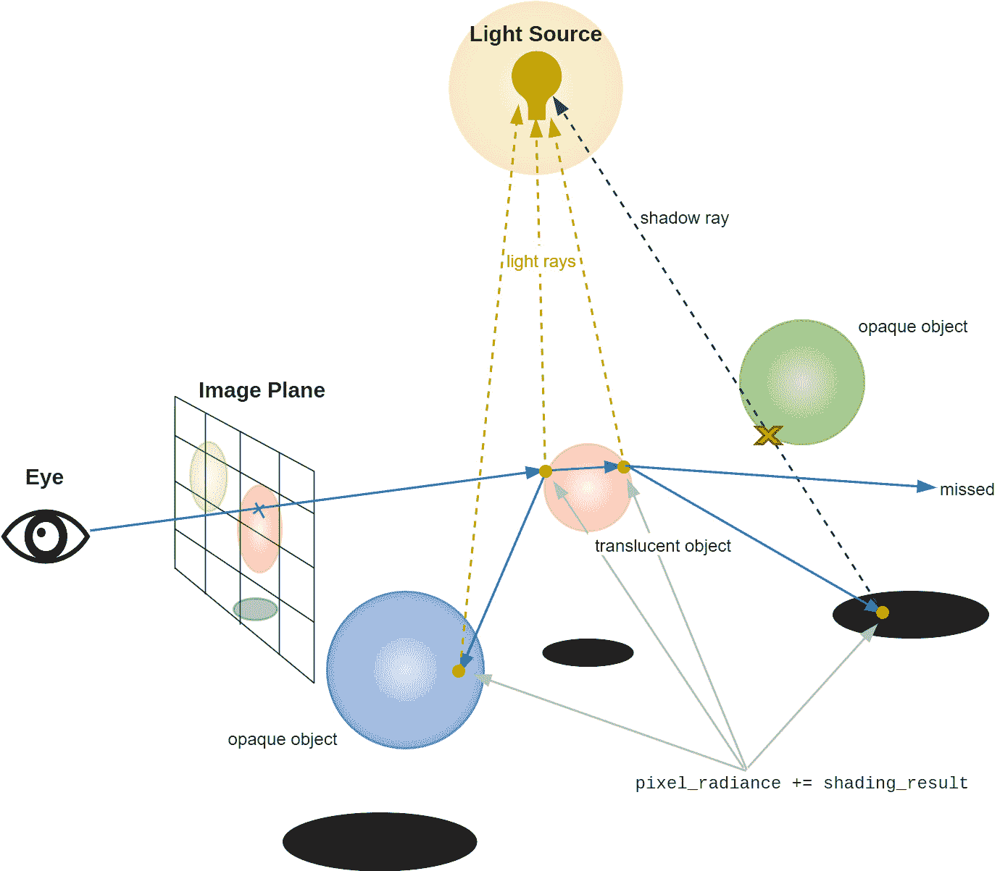
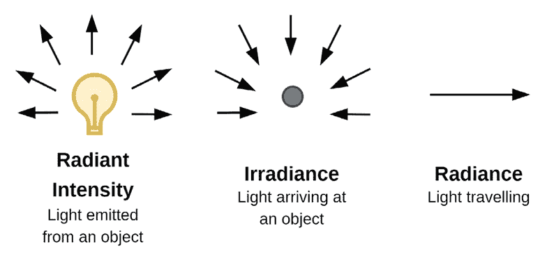
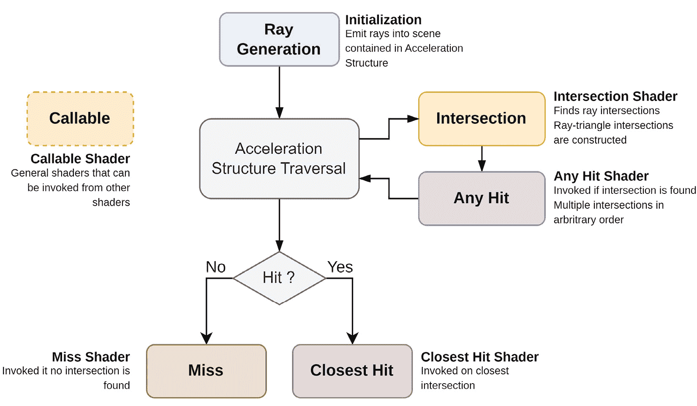

# 第七章：光线追踪与混合渲染

在本章中，我们将探索**光线追踪**和**混合渲染**这个迷人的世界。简单来说，光线追踪是计算机图形学中用于模拟光线与物体交互的一种特殊技术。这导致生成的图像如此逼真，以至于它们可能被误认为是现实。然而，纯光线追踪计算密集，需要大量的硬件资源，这使得它在当前一代硬件上的实时应用变得不可行。另一方面，还有混合渲染，它是传统光栅化技术与光线追踪真实感的结合。这种混合提供了良好的性能和惊人的视觉效果。本章将向您展示如何使用 Vulkan 实现这些技术。我们将向您展示如何设置光线追踪管线，并指导您如何将混合渲染集成到您的作品中。到本章结束时，您将更深入地了解这些高级技术是如何工作的。更重要的是，您将学习如何在您自己的项目中使用它们。

本章的第一部分专注于开发一个基于 GPU 的光线追踪器。我们将详细阐述如何有效地开发这个基于 GPU 的光线追踪器，包括涉及的步骤以及每个功能如何贡献于最终逼真的图像。本章的第二部分将围绕光线追踪器产生的阴影与光栅化延迟渲染的集成展开。我们将深入探讨如何将来自光线追踪器的阴影与延迟渲染的光栅化技术相结合，这种技术通常被称为混合渲染。

在本章中，我们将涵盖以下食谱：

+   实现 GPU 光线追踪器

+   实现混合渲染器

# 技术要求

对于本章，您需要确保已安装 Visual Studio 2022 以及 Vulkan SDK。对 C++编程语言的基本熟悉程度以及对光线追踪概念的理解将很有用。请回顾*第一章**，Vulkan 核心概念*，以获取有关设置和构建存储库中代码的详细信息。我们还假设您现在已经熟悉了 Vulkan API 以及前几章中介绍的各种概念。本章有多个食谱，可以使用以下可执行文件启动：

1.  `Chapter07_RayTracer.exe`

1.  `Chapter07_HybridRenderer.exe`

本章的代码文件可以在以下位置找到：[`github.com/PacktPublishing/The-Modern-Vulkan-Cookbook`](https://github.com/PacktPublishing/The-Modern-Vulkan-Cookbook)。

# 实现 GPU 光线追踪器

光线追踪是一种渲染技术，它通过模拟光线的物理行为来生成高度逼真的图形。光线追踪通过追踪从图像传感器中的像素到其来源的光线路径来实现。每条光线都可以与场景中的物体相互作用，产生反射、折射或吸收等多种效果。这使得在复杂的 3D 场景中创建逼真的阴影、反射和光扩散效果成为可能。在之前的章节中，特别是在*第四章*“探索光照、着色和阴影技术”中，我们探讨了**光栅化**。它采取了一种更直接的方法，将构成场景的 3D 多边形直接转换为 2D 图像。它本质上根据其颜色和纹理填充每个多边形的像素。另一方面，光线追踪模拟从摄像机到场景的光线路径，考虑到这些光线如何与场景中的物体相互作用。

在我们深入探讨如何在 Vulkan 中实现光线追踪的具体细节之前，了解光线追踪的工作原理以及一些基本概念是有益的，例如**双向反射分布函数**（**BRDF**）、辐射度和辐照度。这些概念在确定光线如何与场景中的表面相互作用以及随后影响最终渲染图像方面起着至关重要的作用。

为了简化理解，让我们根据*图 7.1*中的描述，分解光线追踪算法的流程：



图 7.1 – 光线追踪算法

在下一节中，我们将概述光线追踪算法的基本原理：

1.  对于屏幕上的每个像素，从视点或“眼睛”向场景投射一条光线。这是光线追踪的初始步骤，为后续计算奠定了基础。

1.  算法随后计算光线与场景中物体之间的交点。它识别出被光线击中的最近物体，以及物体几何上的确切击中点。

1.  一旦确定了交点，就在击中点进行着色。在此点计算的颜色和光照信息被添加到像素的辐射度值中，这有助于确定渲染图像中像素的最终颜色。

1.  光线不会在第一次击中时停止。由于反射或折射等现象，它可以继续传播。由反射或折射产生的光线被分配一个通量值，这代表光的剩余能量。

1.  递归过程可能会无限期地进行，这在计算上是非常昂贵的。为了处理这个问题，使用了诸如**俄罗斯轮盘赌**之类的技术。在俄罗斯轮盘赌中，递归基于射线的剩余能量以概率终止。如果射线的能量低于某个特定阈值，它有被提前终止的一定几率，这有助于控制算法的计算成本。

1.  现在我们已经了解了光线追踪算法的工作原理，深入探讨**辐射度学**的原则是有益的。辐射度学是物理学的一个分支，它量化了光的行为，提供了一系列方法和单位来描述和测量场景中光的不同方面。理解辐射度学的基本概念包括辐射强度、辐照度和辐射亮度。以下图表（*图 7.2*）可以帮助你记住这些概念：



图 7.2 – 辐射度学基础

+   **辐射强度**：这是单位立体角内发出的光或辐射通量的功率的度量，通常以**每立体角瓦特**（**W/sr**）来衡量。立体角类似于角度测量中的弧度，用于量化三维空间中的立体角。在光线追踪的背景下，它是在计算辐射强度时作为一个关键单位，捕捉光在模拟环境中的表面上的传播情况。它是方向性的，意味着它取决于观察光的方向。

+   **辐照度**：辐照度衡量的是单位面积上入射到表面上的辐射通量的功率，通常以**每平方米瓦特**（**W/m²**）来衡量。在光线追踪的背景下，辐照度用于计算击中表面的光能量量，然后用于阴影计算。它在确定场景中物体亮度方面起着关键作用。

+   **辐射亮度**：辐射亮度指的是从特定区域发出的光或通过它的光量，考虑到观察光的方向或视角。它用于描述从场景中的特定点通过特定方向到达相机的光量。它以**每平方米每立体角瓦特**（**W/m²/sr**）来衡量。辐射亮度是光线追踪中的一个关键概念，因为它整合了方向性和位置信息，有助于生成准确的着色和光照效果。

作为下一步，我们将学习一下在光线追踪中使用的**渲染方程**。该方程本质上描述了从某一点沿特定方向发出的光等于该点在该方向发出的光加上该点在该方向反射的光。反射光是对所有入射光方向进行积分，其中每个入射方向都由 BRDF 和入射光与表面法线之间角度的余弦值加权。以下链接提供了一个关于渲染方程的简化解释：[`twitter.com/KostasAAA/status/1379918353553371139/photo/1`](https://twitter.com/KostasAAA/status/1379918353553371139/photo/1)。

+   L_o(x, ω_o)是从点 x 发出的总辐射量（光），L_s(x, ω_o)是从点 x 在方向ω_o 发出的光。这个项通常只在光源处不为零。

+   项∫_Ω_ 表示在点 x 上方的整个半球Ω上的积分。

+   f_r(x, ω_i → ω_o)是点 x 处的 BRDF，它定义了当光从方向ω_i 入射时，从 x 反射的光量。

+   L_i(x, ω_i)是点*p*从方向ω_i 入射的光。

+   ω_i ∙ n 是ω_i 与点 x 的法线之间的角度的余弦值。这解释了光线以较小的角度到达时，会在更大的面积上扩散的事实。dω_i 是围绕方向ω_i 的一小部分立体角。

## 蒙特卡洛方法

接下来，我们将讨论**蒙特卡洛方法**，这是一种统计技术，通过进行重复的随机抽样，允许对复杂问题进行数值求解。假设你想计算由函数 f(x) = x²在 x = 0 和 x = 1 之间描述的曲线下的面积。从数学上讲，你会使用积分来解决这个问题。然而，想象一下，如果函数非常复杂或有很多变量，以至于你不能轻易地使用标准微积分技术来积分它。这就是蒙特卡洛方法发挥作用的地方。我们不是试图精确计算积分，而是可以通过随机抽样来估计它。在光线追踪的情况下，渲染方程，它模拟了光与表面的相互作用，非常复杂，特别是因为它涉及到对所有可能的入射光方向的积分。这就是为什么使用蒙特卡洛的原因。我们不是试图计算积分的确切值，而是可以通过随机抽样入射光的方向，对每个样本求积分，然后平均结果来近似它。这个过程重复多次，以获得更准确的估计。

我们在渲染方程中简要地提到了 BRDF；它告诉我们光是如何从表面反射的。当光击中一个表面时，它不会仅仅以一个方向反射回来，而是会向许多方向散射。BRDF 为我们提供了一种预测这种行为的途径。它考虑了两个方向：光来的方向，以及光击中表面后去的方向。

想象阳光照在表面上的情景。BRDF（双向反射分布函数）帮助我们确定从太阳反射到该表面的光有多少，以及它以什么方向传播。这对于计算我们在渲染图像中看到的颜色和亮度非常重要。这就是吞吐量或贡献概念发挥作用的地方。它就像一个衡量光在从表面反射时保留或损失多少光能的指标。把它看作是光反射的效率。我们需要将其包含在我们的计算中，以获得准确的结果。

**概率密度函数**（PDF）是一种统计工具，帮助我们处理这些计算中的随机性。当光击中表面时，它可以以许多不同的方向反射，PDF 帮助我们确定每个可能方向的可能性。

**重要性采样**是光线追踪中的一种技术，我们选择在 BRDF 高的方向发送更多的光线，在 BRDF 低的方向发送较少的光线。这有助于我们用更少的光线获得更准确的结果，这可能在计算上更便宜。然而，由于我们在某些方向上发送了更多的光线，在另一些方向上发送了较少的光线，我们正在使采样偏向这些方向。我们将我们的 BRDF 结果除以 PDF 以获得我们的结果。我们之所以将 BRDF 除以 PDF，本质上是为了纠正当我们使用重要性采样来选择下一个追踪光线的方向时引入的偏差。

在光线追踪中，每条光线都携带自己的能量。每次它反射时，我们都将其携带的能量乘以 BRDF 加到图像的整体亮度上。

在 Vulkan 中，光线追踪是通过一系列不同的着色器阶段实现的。在这个菜谱中，我们将引导您通过使用 Vulkan 实现 GPU 光线追踪的过程，提供一步一步的说明，说明如何设置光线追踪过程中涉及的每个着色器阶段。到这个菜谱结束时，您将能够创建自己的光线追踪器，通过准确模拟光的行为来生成高度逼真的图形。

着色器阶段包括以下内容：

+   **光线生成着色器**：这是光线追踪过程的起点

+   **交点着色器**：这个着色器计算光线如何与场景的几何体相交

+   **丢失和命中着色器**：这些定义了光线击中或错过物体时的行为

通过理解和实现这些阶段，您将朝着创建视觉上令人惊叹和逼真的图形迈出重要的一步。

## 准备工作

Vulkan 中的光线追踪管线由六个阶段组成：射线生成、交点、任何命中、最近命中、丢失和可调用。*图 7.3*显示了这些阶段及其在管线中的总体布局。Vulkan 光线追踪的另一个关键组件是**加速结构**。这种结构在高效处理光线追踪中涉及的大量几何数据方面至关重要。加速结构的作用是以一种允许快速光线追踪计算的方式组织数据。**边界体积层次结构**（**BVH**）是一组几何对象上的算法树结构。所有几何对象都被封装在边界体积中，形成树的叶节点。然后，这些节点被配对、边界和连接，形成一个父节点。这个过程一直向上进行，直到只剩下一个边界体积：树的根。这种结构允许光线追踪算法有效地丢弃许多射线无法相交的对象，从而显著加快了过程。

加速结构分为两个级别：**底部级别加速结构**（**BLASs**）和**顶部级别加速结构**（**TLASs**）：

+   **BLAS（边界体积层次结构）**：BLAS 负责存储场景中单个物体的几何数据。每个物体可以有一个或多个与它关联的 BLAS，每个 BLAS 可以包含一个或多个几何原语，如三角形或其他 BLAS 的实例。BLAS 负责确定射线如何与它们包含的几何相交，因此它是光线追踪过程的基本部分。

+   **TLAS（顶级加速结构）**：另一方面，TLAS 不包含几何数据。相反，它包含 BLAS（边界体积层次结构）的实例。每个实例定义了一个变换（如平移、旋转或缩放）以及应用该变换的 BLAS。在光线追踪时，系统从 TLAS 开始，逐步向下到适当的 BLAS。TLAS 本质上充当一个目录，根据射线的路径引导系统到达正确的 BLAS。



图 7.3 – 光线追踪管线及其阶段

着色器阶段如下：

1.  `traceRayExt` 函数。这些射线最终将与场景中的物体交互，以创建最终的渲染图像。

1.  **加速结构遍历**：加速结构是优化光线追踪过程的关键组件。它作为一个场景管理树，类似于 BVH（边界体积层次结构）。其主要用途是加速场景中射线与物体之间的碰撞检测。这部分管线是固定的，意味着 Vulkan 已经实现了其背后的逻辑。

1.  **交点阶段**：当射线穿越 BVH 时，它们可能会调用交点着色器。此着色器在处理自定义类型时特别有用，但在使用默认三角形网格原语时不是必需的。这是因为 Vulkan 已经集成了这些默认原语所需的逻辑，从而绕过了交点着色器的需求。

1.  **任何命中阶段**：此阶段处理在交点阶段找到的交点事件；在发生交点的情况下，调用任何命中着色器。任何命中着色器确定光线和材质交点发生后采取的后续步骤，例如是否放弃交点等。根据具体要求，交点点可以被丢弃，此时认为没有发生交点。然后此过程返回到 BLAS 遍历。

1.  **最近命中阶段**：此着色器负责处理当前距离射线原点最近且尚未被任何命中阶段丢弃的交点。这通常涉及应用光照和材质计算以渲染像素的最终颜色。

1.  **丢失阶段**：丢失阶段确定在射线没有击中任何东西的情况下如何处理光线。这可能涉及分配默认颜色、环境颜色等。

1.  **可调用阶段**：此阶段可以从任何其他阶段（从它们的着色器代码）调用。

在存储库中，光线追踪代码封装在 `RayTracer` 类中。

## 如何实现...

作为第一步，我们将查看需要在主机端执行代码；大部分实现都在 `RayTracer` 类内部：

1.  在使用 Vulkan 设置光线追踪的第一步是验证我们的物理设备（GPU）是否支持光线追踪功能。此验证通过将 `VkPhysicalDeviceRayTracingPipelineFeaturesKHR` 和 `VkPhysicalDeviceAccelerationStructureFeaturesKHR` 添加到检查支持的物理特性列表中来实现。此特性检查操作在 `PhysicalDevice` 类中实现。在这里，这些特定特性被添加到 `VkPhysicalDeviceFeatures2` 结构的链中，作为查询一组特性支持的机制。此类还提供了 `isRayTracingSupported` 函数，该函数在 Vulkan 设备创建过程中用于激活光线追踪所需的功能。在 `Context` 类中，我们引入了针对 `VkPhysicalDeviceAccelerationStructureFeaturesKHR` 和 `VkPhysicalDeviceRayTracingPipelineFeaturesKHR` 的特定特性。然而，只有当演示应用程序启用了光线追踪并且物理设备确认支持这些特性时，这些特性才会被激活。请注意，如果您的 GPU 不支持 Vulkan 光线追踪，则演示应用程序将无法运行。

1.  接下来，我们为将要由光线追踪管线使用的每个着色器创建着色器模块：

    ```cpp
    auto rayGenShader = context_->createShaderModule(
      (resourcesFolder / "raytrace_raygen.rgen")
        .string(),
      VK_SHADER_STAGE_RAYGEN_BIT_KHR,
      "RayTracer RayGen Shader");
    auto rayMissShader = context_->createShaderModule(
      (resourcesFolder / "raytrace_miss.rmiss")
        .string(),
      VK_SHADER_STAGE_MISS_BIT_KHR,
      "RayTracer Miss Shader");
    auto rayMissShadowShader =
      context_->createShaderModule(
        (resourcesFolder / "raytrace_shadow.rmiss")
          .string(),
        VK_SHADER_STAGE_MISS_BIT_KHR,
        "RayTracer Miss Shadow Shader");
    auto rayClosestHitShader =
      context_->createShaderModule(
        (resourcesFolder /
         "raytrace_closesthit.rchit")
          .string(),
        VK_SHADER_STAGE_CLOSEST_HIT_BIT_KHR,
        "RayTracer Closest hit Shader");
    ```

1.  接下来，我们通过调用 `Pipeline::createRayTracingPipeline()` 创建一个光线追踪管线。为了便于创建光线追踪管线，我们添加了一个辅助结构，称为 `Pipeline::RayTracingPipelineDescriptor`，它存储了描述符集及其绑定（就像在图形和计算管线描述符中一样），以及创建光线追踪管线所需的所有着色器。必须将此结构的实例传递给 `VulkanCore::Pipeline` 类的构造函数：

    ```cpp
    struct RayTracingPipelineDescriptor {
      std::vector<SetDescriptor> sets_;
      std::weak_ptr<ShaderModule> rayGenShader_;
      std::vector<std::weak_ptr<ShaderModule>>
        rayMissShaders_;
      std::vector<std::weak_ptr<ShaderModule>>
        rayClosestHitShaders_;
      std::vector<VkPushConstantRange> pushConstants_;
    };
    ```

    在 Vulkan 中实现光线追踪管线需要一系列着色器组结构。而不是持有着色器列表，每个 `VkRayTracingShaderGroupCreateInfoKHR` 结构：

    ```cpp
    typedef struct VkRayTracingShaderGroupCreateInfoKHR {
      VkStructureType sType;
      const void *pNext;
      VkRayTracingShaderGroupTypeKHR type;
      uint32_t generalShader;
      uint32_t closestHitShader;
      uint32_t anyHitShader;
      uint32_t intersectionShader;
      const void *pShaderGroupCaptureReplayHandle;
    } VkRayTracingShaderGroupCreateInfoKHR;
    ```

    该结构包含用于指定管线中仅四个不同阶段的着色器（`generalShader`，`closestHitShader`，`anyHitShader` 和 `intersectionShader`）。这是因为丢失阶段和可调用阶段的着色器索引由 `generalShader` 字段提供。需要注意的是，这些字段的功能取决于结构中 `type` 成员的值。

1.  为了简洁起见，这里只展示了创建一个着色器阶段和一个着色器组的过程。其他与管线描述符一起传递的着色器模块被分组到它们自己的着色器组中。在提供的代码片段中，我们展示了为光线生成着色器构建特定着色器组的过程。理解这一点至关重要，即 Vulkan 光线追踪中使用的每种类型的着色器都需要其自己的单独着色器组。这是必要的，因为 Vulkan 光线追踪管线的设计允许不同类型的着色器独立操作，每个在光线追踪过程中执行独特任务。通过将每种类型的着色器结构化在其自己的着色器组中，我们确保相应的任务独立且高效地执行，有助于 GPU 的并行计算能力。请参阅 `Pipeline::createrayTracingPipeline()` 中的代码以获取更多详细信息：

    ```cpp
    std::vector<VkPipelineShaderStageCreateInfo>
      shaderStages;
    std::vector<VkRayTracingShaderGroupCreateInfoKHR>
      shaderGroups;
    const VkPipelineShaderStageCreateInfo
      rayGenShaderInfo{
        .sType =
          VK_STRUCTURE_TYPE_PIPELINE_SHADER_STAGE_CREATE_INFO,
        .stage = rayGenShader->vkShaderStageFlags(),
        .module = rayGenShader->vkShaderModule(),
        .pName = rayGenShader->entryPoint().c_str(),
      };
    shaderStages.push_back(rayGenShaderInfo);
    const VkRayTracingShaderGroupCreateInfoKHR
      shaderGroup{
        .sType =
          VK_STRUCTURE_TYPE_RAY_TRACING_SHADER_GROUP_CREATE_INFO_KHR,
        .type =
          VK_RAY_TRACING_SHADER_GROUP_TYPE_GENERAL_KHR,
        .generalShader =
          static_cast<uint32_t>(shaderStages.size()) -
          1,
        .closestHitShader = VK_SHADER_UNUSED_KHR,
        .anyHitShader = VK_SHADER_UNUSED_KHR,
        .intersectionShader = VK_SHADER_UNUSED_KHR,
      };
    shaderGroups.push_back(shaderGroup);
    ```

1.  最后，这是创建光线追踪管线的方法：

    ```cpp
    VkRayTracingPipelineCreateInfoKHR rayTracingPipelineInfo{
          .sType = VK_STRUCTURE_TYPE_RAY_TRACING_PIPELINE_CREATE_INFO_KHR,
          .stageCount = static_cast<uint32_t>(shaderStages.size()),
          .pStages = shaderStages.data(),
          .groupCount = static_cast<uint32_t>(shaderGroups.size()),
          .pGroups = shaderGroups.data(),
          .maxPipelineRayRecursionDepth = 10,
          .layout = vkPipelineLayout_,
      };
      VK_CHECK(vkCreateRayTracingPipelinesKHR(context_->device(), VK_NULL_HANDLE,
                                              VK_NULL_HANDLE, 1, &rayTracingPipelineInfo,
                                              nullptr, &vkPipeline_));
    ```

1.  下一步是创建描述 SBT 在内存中位置和结构的 `VkStridedDeviceAddressRegionKHR` 结构：

    ```cpp
    struct SBT {
      std::shared_ptr<VulkanCore::Buffer> buffer;
      VkStridedDeviceAddressRegionKHR sbtAddress;
    };
    ```

1.  `createShaderBindingTable()` 函数是创建 SBT 的地方。该函数首先定义了几个变量来存储应用程序中各种类型着色器的大小和数量。在代码中，`handleSize` 和 `handleSizeAligned` 代表 SBT 中单个着色器组句柄的大小，后者确保正确的内存对齐：

    ```cpp
    void EngineCore::RayTracer::
      createShaderBindingTable() {
      const uint32_t handleSize =
        context_->physicalDevice()
          .rayTracingProperties()
          .shaderGroupHandleSize;
      const uint32_t handleSizeAligned =
        alignedSize(context_->physicalDevice()
                      .rayTracingProperties()
                      .shaderGroupHandleSize,
                    context_->physicalDevice()
                      .rayTracingProperties()
                      .shaderGroupHandleAlignment);
    ```

    `numRayGenShaders`, `numRayMissShaders`, 和 `numRayClosestHitShaders` 代表在管线中使用每种类型着色器的数量。接下来，我们计算 SBT（Shader Binding Table，着色器绑定表）的总大小，并创建一个 `shaderHandleStorage` 向量来存储着色器句柄：

    ```cpp
    const uint32_t numRayGenShaders = 1;
    const uint32_t numRayMissShaders =
      2; // 1 for miss and 1 for shadow
    const uint32_t numRayClosestHitShaders = 1;
    const uint32_t numShaderGroups =
      numRayGenShaders + numRayMissShaders +
      numRayClosestHitShaders;
    const uint32_t groupCount =
      static_cast<uint32_t>(numShaderGroups);
    const uint32_t sbtSize =
      groupCount * handleSizeAligned;
    ```

1.  然后调用 `vkGetRayTracingShaderGroupHandlesKHR` Vulkan 函数以检索着色器组句柄。这些句柄是管道中着色器组的唯一标识符。之后，我们为每种着色器类型创建单独的缓冲区（调用 `copyDataToBuffer` 方法将相关的着色器句柄从 `shaderHandleStorage` 复制到缓冲区。我们建议查看 `createShaderBindingTable` 函数：

    ```cpp
    std::vector<uint8_t> shaderHandleStorage(sbtSize);
    VK_CHECK(vkGetRayTracingShaderGroupHandlesKHR(
      context_->device(), pipeline_->vkPipeline(), 0,
      groupCount, sbtSize,
      shaderHandleStorage.data()));
    ```

1.  每个缓冲区和相应的 `VkStridedDeviceAddressRegionKHR` 都需要被填充。在这里，我们只展示如何填充光线生成。其他组遵循类似的模式：

    ```cpp
    raygenSBT_.buffer = context_->createBuffer(
      context_->physicalDevice()
          .rayTracingProperties()
          .shaderGroupHandleSize *
        numRayGenShaders,
      VK_BUFFER_USAGE_SHADER_BINDING_TABLE_BIT_KHR |
        VK_BUFFER_USAGE_SHADER_DEVICE_ADDRESS_BIT,
      VMA_MEMORY_USAGE_CPU_ONLY, "RayGen SBT Buffer");
    raygenSBT_.sbtAddress.deviceAddress =
      raygenSBT_.buffer->vkDeviceAddress();
    raygenSBT_.sbtAddress.size =
      handleSizeAligned * numRayGenShaders;
    raygenSBT_.sbtAddress.stride = handleSizeAligned;
    raygenSBT_.buffer->copyDataToBuffer(
      shaderHandleStorage.data(),
      handleSize *numRayGenShaders);
    ```

1.  接下来，我们需要加载环境贴图及其加速结构。`RayTracer::loadEnvMap()` 方法执行环境贴图的加载和加速结构的创建。它加载 `context_->createTexture()`。然后调用 `createEnvironmentAccel()`，该函数负责为环境贴图的重要性采样创建加速数据结构。此函数计算一个 `EnvAccel` 结构体的向量，每个贴素一个。这些数据被上传到一个仅设备的缓冲区。

1.  接下来，我们使用 `RayTracer::initBottomLevelAccelStruct()` 和 `RayTracer::initTopLevelAccelStruct()` 方法创建 TLAS 和 BLAS。

    在以下步骤中，你将学习如何使用 Vulkan 设置 BLAS：

    1.  `VK_GEOMETRY_TYPE_TRIANGLES_KHR`) 使用来自模型缓冲区的顶点和索引：

    ```cpp
    VkAccelerationStructureGeometryKHR
      accelerationStructureGeometry{
        .sType =
          VK_STRUCTURE_TYPE_ACCELERATION_STRUCTURE_GEOMETRY_KHR,
        .geometryType = VK_GEOMETRY_TYPE_TRIANGLES_KHR,
        .geometry = {
            .triangles = {
                .sType =
                  VK_STRUCTURE_TYPE_ACCELERATION_STRUCTURE_GEOMETRY_TRIANGLES_DATA_KHR,
                .vertexFormat =
                  VK_FORMAT_R32G32B32_SFLOAT,
                .vertexData = vertexBufferDeviceAddress,
                .vertexStride =
                  sizeof(EngineCore::Vertex),
                .maxVertex = numVertices,
                .indexType = VK_INDEX_TYPE_UINT32,
                .indexData = indexBufferDeviceAddress,
              },
          },
      };
    ```

    1.  `vkGetAccelerationStructureBuildSizesKHR` 函数调用返回分配加速结构和构建刮擦缓冲区所需的大小信息。`bLAS_[meshIdx].buffer` 缓冲区作为 `vkGetAccelerationStructureBuildSizesKHR` 函数调用的直接结果被填充：

    ```cpp
    VkAccelerationStructureBuildSizesInfoKHR
      accelerationStructureBuildSizesInfo{
        .sType =
          VK_STRUCTURE_TYPE_ACCELERATION_STRUCTURE_BUILD_SIZES_INFO_KHR,
      };
    vkGetAccelerationStructureBuildSizesKHR(
      context_->device(),
      VK_ACCELERATION_STRUCTURE_BUILD_TYPE_DEVICE_KHR,
      &accelerationStructureBuildGeometryInfo,
      &numTriangles,
      &accelerationStructureBuildSizesInfo);
    ```

    1.  `bLAS_[meshIdx].buffer`，用于存储 BLAS 结构。然后我们创建一个 `VkAccelerationStructureCreateInfoKHR` 类型的结构体，向其中提供刚刚创建的缓冲区、其大小，并指定它是一个 BLAS。接下来，我们调用 `vkCreateAccelerationStructureKHR` 创建实际的加速结构，并将句柄存储在 `bLAS_[meshIdx].handle` 中。我们创建了一个名为 `tempBuffer` 的临时缓冲区来存储构建加速结构时所需的临时数据。在 Vulkan 中构建加速结构时，构建过程通常需要一些临时空间来执行其计算。这个临时空间也被称为刮擦缓冲区。然后我们填充一个 `VkAccelerationStructureBuildGeometryInfoKHR` 结构体，其中包含加速结构构建的详细信息，包括加速结构的句柄、几何形状和 `tempBuffer` 的设备地址。接下来，我们创建一个 `VkAccelerationStructureBuildRangeInfoKHR` 结构体来指定构建中使用的几何形状的范围。`vkCmdBuildAccelerationStructuresKHR` 函数将构建加速结构的命令记录到命令缓冲区：

    ```cpp
    // Creating buffer to hold the acceleration structure
    bLAS_[meshIdx].buffer = context_->createBuffer(...);
    // Creating acceleration structure
    VkAccelerationStructureCreateInfoKHR accelerationStructureCreateInfo{
        .sType = VK_STRUCTURE_TYPE_ACCELERATION_STRUCTURE_CREATE_INFO_KHR,
        .buffer = bLAS_[meshIdx].buffer->vkBuffer(),
        .size = accelerationStructureBuildSizesInfo.accelerationStructureSize,
        .type = VK_ACCELERATION_STRUCTURE_TYPE_BOTTOM_LEVEL_KHR};
    VK_CHECK(vkCreateAccelerationStructureKHR(context_->device(),
                                              &accelerationStructureCreateInfo, nullptr,
                                              &bLAS_[meshIdx].handle));
    // Creating temporary buffer
    auto tempBuffer = context_->createBuffer(...);
    // Setting up geometry and build range info for acceleration structure
    VkAccelerationStructureBuildGeometryInfoKHR accelerationBuildGeometryInfo{
        .sType = VK_STRUCTURE_TYPE_ACCELERATION_STRUCTURE_BUILD_GEOMETRY_INFO_KHR,
        .dstAccelerationStructure = bLAS_[meshIdx].handle,
        .scratchData = {.deviceAddress = tempBuffer->vkDeviceAddress()}};
    VkAccelerationStructureBuildRangeInfoKHR accelerationStructureBuildRangeInfo{
        .primitiveCount = numTriangles};
    // Building acceleration structure
    const auto commandBuffer = commandQueueMgr.getCmdBufferToBegin();
    vkCmdBuildAccelerationStructuresKHR(
        commandBuffer, 1, &accelerationBuildGeometryInfo,
        &accelerationStructureBuildRangeInfo);
    ```

1.  在以下步骤中，你将学习如何在 Vulkan 中设置 TLAS：

    1.  **创建加速结构实例**：以下循环创建实例，每个实例都引用一个 BLAS。实例包含有关变换矩阵、掩码、标志以及它引用的 BLAS 的设备地址的信息：

    ```cpp
    for (int meshIdx = 0; meshIdx < model->meshes.size();
         ++meshIdx) {
      VkAccelerationStructureInstanceKHR instance{};
      ...
      instance.accelerationStructureReference =
        bLAS_[meshIdx].buffer->vkDeviceAddress();
      accelarationInstances_.push_back(instance);
    }
    ```

    1.  `VK_GEOMETRY_TYPE_INSTANCES_KHR`):

    ```cpp
    VkAccelerationStructureGeometryKHR
      accelerationStructureGeometry{
      .sType = VK_STRUCTURE_TYPE_ACCELERATION_STRUCTURE_GEOMETRY_KHR,
      .geometryType = VK_GEOMETRY_TYPE_INSTANCES_KHR,
      .geometry = {
        .instances = {
          .sType = VK_STRUCTURE_TYPE_ACCELERATION_STRUCTURE_GEOMETRY_INSTANCES_DATA_KHR,
          .data = instanceDataDeviceAddress,
        },
      },
      .flags = VK_GEOMETRY_OPAQUE_BIT_KHR,
    };
    ```

    1.  `vkGetAccelerationStructureBuildSizesKHR` 函数调用返回分配加速结构体和构建临时缓冲区所需的大小信息：

    ```cpp
    VkAccelerationStructureBuildSizesInfoKHR
      accelerationStructureBuildSizesInfo{
        .sType =
          VK_STRUCTURE_TYPE_ACCELERATION_STRUCTURE_BUILD_SIZES_INFO_KHR,
      };
    vkGetAccelerationStructureBuildSizesKHR(
      context_->device(),
      VK_ACCELERATION_STRUCTURE_BUILD_TYPE_DEVICE_KHR,
      &accelerationStructureBuildGeometryInfo,
      &primitiveCount,
      &accelerationStructureBuildSizesInfo);
    ```

    1.  在类型字段中设置 `VK_ACCELERATION_STRUCTURE_TYPE_TOP_LEVEL_KHR`，因为我们正在构建 TLAS。最后一步是在命令缓冲区上记录 `vkCmdBuildAccelerationStructuresKHR` 命令，该命令在命令缓冲区提交时执行：

    ```cpp
    VkAccelerationStructureCreateInfoKHR
      accelerationStructureCreateInfo{
        .sType =
          VK_STRUCTURE_TYPE_ACCELERATION_STRUCTURE_CREATE_INFO_KHR,
        .buffer = tLAS_.buffer->vkBuffer(),
        .size = accelerationStructureBuildSizesInfo
                  .accelerationStructureSize,
        .type =
          VK_ACCELERATION_STRUCTURE_TYPE_TOP_LEVEL_KHR,
      };
    VK_CHECK(vkCreateAccelerationStructureKHR(
      context_->device(),
      &accelerationStructureCreateInfo, nullptr,
      &tLAS_.handle));
    vkCmdBuildAccelerationStructuresKHR(
      commandBuffer, 1, &accelerationBuildGeometryInfo,
      accelerationBuildStructureRangeInfos.data());
    ```

1.  我们还创建了一个 `RayTraced` 存储图像（在 `initRayTracedStorageImages` 中封装），并在初始化期间通过在管线中调用 `bindResource` 绑定资源。

1.  要执行光线追踪器，我们需要调用 `RayTracer::execute()`，该函数负责复制相机数据、绑定管线并调用 `vkCmdTraceRaysKHR`。这个 Vulkan 函数启动 `RayGen` 着色器。

现在我们已经了解了主机端的步骤，现在是时候了解设备端代码了。光线追踪的设备端代码是通过使用几个着色器实现的，包括 `raytrace_raygen.rgen`、`raytrace_miss.rmiss`、`raytrace_closesthit.rchit` 和 `raytrace_shadow.rmiss`：

1.  该过程从通过 `vkCmdTraceRaysKHR` 调用 `raytrace_raygen.rgen` 着色器开始。在下面的着色器代码块中，通过为每个像素样本生成具有唯一随机种子的光线，启动光线追踪过程。这些光线，由它们的起点和方向定义，在循环中追踪到场景中，直到达到最大反弹次数或满足有效载荷中的退出条件。有效载荷携带诸如起点、方向和反弹索引等基本信息。一旦使用所有样本的平均值计算出像素的最终颜色，它就被存储在输出图像中。如果应用了时间累积，着色器将检索并添加来自前一帧的颜色。时间累积在光线追踪中很有用，因为它有助于减少噪声并提高图像质量。在多帧上累积或平均颜色样本实际上增加了每个像素追踪的光线数量，而无需在单个帧中追踪额外光线：

    ```cpp
    void main() {
      // Ray Generation
      // tea refers to Tiny Encryption Algorithm, used to generate a unique and reproducible seed for each task and frame.
      uint seed =
        tea(gl_LaunchIDEXT.y * gl_LaunchIDEXT.x +
              gl_LaunchIDEXT.x,
            camProps.frameId);
      vec3 finalOutColor = vec3(0);
      vec2 pixelCenter = vec2(gl_LaunchIDEXT.xy) +
                         vec2(0.5) +
                         vec2(rand(seed), rand(seed));
      vec4 target =
        camProps.projInverse *
        vec4(pixelCenter / vec2(gl_LaunchSizeEXT.xy) *
                 2.0 -
               1.0,
             1, 1);
      vec4 direction =
        camProps.viewInverse *
        vec4(normalize(target.xyz / target.w), 0);
      // Initial Payload Setup
      rayPayload.currentBounceIndex = 0;
      rayPayload.exit = false;
      rayPayload.origin =
        (camProps.viewInverse * vec4(0, 0, 0, 1)).xyz;
      rayPayload.direction = direction.xyz;
      // Ray Tracing Loop
      for (int j = 0; j < MAX_BOUNCES; ++j) {
        rayPayload.currentBounceIndex = j;
      // Traces a ray using a culling mask of 0xff to include all potential intersections.
        traceRayEXT(topLevelAccelStruct,
                    gl_RayFlagsOpaqueEXT, 0xff, 0, 0, 0,
                    rayPayload.origin.xyz, 0.001,
                    rayPayload.direction.xyz, 10000.0, 0);
        if (rayPayload.exit)
          break;
      }
      // Final Color Calculation and Image Store
      finalOutColor += rayPayload.radiance / MAX_SAMPLES;
      imageStore(outputImage, ivec2(gl_LaunchIDEXT.xy),
                 vec4(linear2sRGB(finalOutColor), 0.0));
    }
    ```

1.  `raytrace_miss.rmiss`着色器相当简单：如果光线没有与任何对象相交，则会调用它。在这种情况下，着色器从环境图中采样，根据光线与环境之间的交互点确定颜色。`envMapColor`函数接受一个 3D 方向向量作为输入，对其进行归一化，并将其转换为球坐标（theta 和 phi）。然后，它将这些坐标映射到一个 2D 平面（UV）上，并从环境图纹理中检索相应的颜色。以下代码块简单地调用`envMapColor`函数来获取当前光线负载的辐射度：

    ```cpp
    void main() {
      rayPayload.radiance =
        envMapColor(gl_WorldRayDirectionEXT);
      rayPayload.exit = true;
    }
    ```

1.  `raytrace_closesthit.rchit`着色器是大多数魔法发生的地方，包括着色计算和确定光线后续方向的计算：

    1.  该过程的初始阶段涉及提取被光线击中的网格的顶点和材质数据。这是通过利用`gl_InstanceID`和`gl_PrimitiveID`变量实现的，这些变量由交点着色器填充相关数据。击中着色器还提供了对`hitAttributeEXT vec2 attribs`的访问。在三角形的情况下，这些属性代表交点的重心坐标。重心坐标是一种坐标系统，用于指定点在三角形内的位置。它们在计算机图形学中特别有用，因为它们允许在三角形之间轻松插值。通过使用这些坐标，我们可以插值顶点的位置，以确定光线在三角形内接触的确切交点。请参考`raytrace_closesthit.rchit`中的代码，了解我们如何使用重心坐标来获取世界空间位置。

    1.  下一步是调用`envSample()`函数。这个函数是光线追踪过程中的关键部分，负责使用重要性采样对 HDR 环境图进行采样。环境图表示为一个 2D 纹理（经纬度格式），包含周围环境的照明数据。函数首先在环境图中均匀选择一个 texel 索引。它获取该 texel 的采样数据，包括 texel 发出的辐射度与环境图平均值的比率、texel 别名以及该 texel 及其别名的分布函数值。然后，函数根据随机变量和强度比率决定是直接选择 texel 还是选择其别名。它计算所选 texel 的 2D 整数坐标，并均匀采样像素所截取的立体角。函数将采样的 UV 坐标转换为球坐标中的方向，然后将该方向转换为笛卡尔坐标中的光方向向量。这个光方向向量随后与 texel 的 PDF 一起返回：

    ```cpp
    vec3 envLightColor = vec3(0);
    vec4 dirPdf =
      envSample(envLightColor, rayPayload.seed);
    vec3 lightDir = dirPdf.xyz;
    float lightPdf = dirPdf.w
    ```

    1.  阴影光线在光线追踪过程中起着至关重要的作用。它们通过确定场景中哪些部分处于阴影中，从而帮助创建逼真的光照效果，增加了渲染图像的深度和真实感。下一步是从交点向光源追踪一个阴影光线，以检查是否有遮挡物体。这是确定一个点是否处于阴影中的关键步骤。使用`layout(location = 1) rayPayloadEXT bool inshadow`声明了`inshadow`变量。当在光线追踪着色器中追踪光线时，它会携带一个有效载荷。这个有效载荷可以用来存储需要在光线追踪管道的不同阶段之间传递的信息，例如从最近击中着色器到光线生成着色器。`inshadow`变量是一个布尔值，用于存储特定点是否处于阴影中的信息。当从交点向光源追踪的阴影光线被另一个物体遮挡时，这个变量将被设置为 true，表示该点处于阴影中。请注意，在`traceRayEXT`函数中，第 6 个参数设置为`1`。这个值作为一个索引，用于指定应该调用哪个丢失着色器。在这种情况下，它指的是在`raytrace_shadow.miss`中找到的丢失着色器：

    ```cpp
    inshadow = true;
    const int layoutLocation = 1;
    // Trace the shadow ray
    traceRayEXT(topLevelAccelStruct, rayFlags, cullMask,
                0, 0, 1, worldPosition, rayMinDist,
                lightDir, rayMaxDist, layoutLocation);
    ```

下一步负责使用`PbrEval`函数进行光照计算。它使用材料属性（如基础颜色、镜面颜色、粗糙度和金属因素），`rayPayload.radiance`是光线从它遇到的所有光源中累积的颜色或光贡献。`rayPayload.throughput`是衡量有多少光线通过某一路径而没有被吸收或散射的量。本质上，它是光线路径剩余能量的度量。有关 PBR 理论的详细信息，请访问[`learnopengl.com/PBR/Theory`](https://learnopengl.com/PBR/Theory)：

```cpp
if (!inshadow) {
  float pdf;
  // returns diffuse & specular both
  vec3 F =
    PbrEval(eta, metallic, roughness, baseColor.rgb,
            specularColor, -rayPayload.direction, N,
            lightDir, pdf);
  float cosTheta = abs(dot(lightDir, N));
  float misWeight =
    max(0.0, powerHeuristic(lightPdf, pdf));
  if (misWeight > 0.0) {
    directLightColor += misWeight * F * cosTheta *
                        envLightColor /
                        (lightPdf + EPS);
  }
}
rayPayload.radiance +=
  directLightColor * rayPayload.throughput;
```

1.  最后的部分是确定下一个光线方向以及下一个光线的透射率（剩余能量）。这个过程首先通过使用`PbrSample`函数来采样下一个光线的方向（`bsdfDirNextRay`），该函数利用材料属性和当前光线的方向来生成这个方向。我们计算`cosTheta`，这是表面法线与下一个光线方向之间的角度的余弦值。这个值用于计算新的透射率，因为反射的光量与这个角度的余弦值成正比（`bsdfDirNextRay`，并且原点略微偏离当前位置以避免自相交。请注意，`PBREval`用于在特定方向上评估 BRDF，而`PBRSample`用于生成新的方向并在该方向上评估 BRDF：

```cpp
Vec3 F = PbrSample(baseColor.rgb, specularColor, eta,
                   materialIOR, metallic, roughness,
                   T, B, -rayPayload.direction,
                   ffnormal, bsdfDirNextRay,
                   bsdfpdfNextRay, rayPayload.seed);
float cosTheta = abs(dot(N, bsdfDirNextRay));
rayPayload.throughput *=
  F * cosTheta / (bsdfpdfNextRay);
// Russian roulette
float rrPcont =
  min(max3(rayPayload.throughput) * eta * eta + 0.001,
      0.95);
rayPayload.throughput /= rrPcont;
// update new ray direction & position
rayPayload.direction = bsdfDirNextRay;
rayPayload.origin = offsetRay(
  worldPosition, dot(bsdfDirNextRay, worldNormal) > 0
                   ? worldNormal
                   : -worldNormal);
```

这就结束了如何在 Vulkan 中实现一个简单的基于 GPU 的光线追踪器的各个部分的介绍。

## 参考内容

我们建议阅读*《一周之内学习光线追踪》*系列书籍：

+   [`github.com/RayTracing/raytracing.github.io`](https://github.com/RayTracing/raytracing.github.io)

Adam Celarek 和 Bernhard Kerbl 的 YouTube 频道包含大量关于光照和光线追踪的信息：

+   [`www.youtube.com/playlist?list=PLmIqTlJ6KsE2yXzeq02hqCDpOdtj6n6A9`](https://www.youtube.com/playlist?list=PLmIqTlJ6KsE2yXzeq02hqCDpOdtj6n6A9)

# 实现混合渲染

在这个菜谱中，我们将探讨光栅化（特别是延迟渲染）与光线追踪阴影的集成。

在*第四章**，探索光照、着色和阴影技术*中，我们实现了延迟渲染，并融合了如阴影映射、屏幕空间 AO 和屏幕空间反射等技术。这些技术使我们能够生成多个纹理，然后在光照过程中进行合成。在本菜谱中，你将深入了解如何使用光线追踪生成阴影纹理，这将有助于克服与屏幕空间阴影映射等技术相关联的挑战。屏幕空间阴影映射依赖于渲染图像中可用的信息。它无法完全访问整个 3D 场景几何形状。这种限制可能导致不准确性和伪影。屏幕空间阴影映射容易受到走样问题的影响，尤其是在屏幕空间纹理的边缘和边界处。光线追踪方法没有这些问题，因为它在完整场景上工作。

## 准备工作

在代码仓库中，混合渲染功能是通过`RayTracedShadowPass`和`LightingPassHybridRenderer`类实现的。

该过程从执行`Gbuffer`阶段开始，根据*第四章**，探索光照、着色和阴影技术*中讨论的概念生成 G-buffer 纹理。随后，`RayTracedShadowPass`被启动，采用前述章节中概述的光线追踪阶段。然而，在这个阶段，光线追踪被特别用于生成阴影纹理。最后一步是使用`LightingPassHybridRenderer`组合 G-buffer 和光线追踪阴影纹理的信息，最终生成用于显示的最终图像。

光线追踪着色器的设备端代码如下：

```cpp
 raytrace_raygen_shadow_hybrid.rgen, raytrace_miss_shadow_hybrid.rmiss, raytrace_closesthit_shadow_hybrid.rchit
```

合成部分的设备端代码如下：

```cpp
 hybridRenderer_lighting_composite.frag.
```

现在我们已经了解了代码结构，我们将在下一节中探讨如何实现它。

## 如何做到这一点...

代码的主机端部分位于`RayTracedShadowPass`，其设置与之前菜谱中描述的非常相似。我们将重点关注设备端代码，以了解我们如何生成阴影：

1.  与往常一样，我们通过声明着色器将使用的输入和统一变量来开始着色器。`layout(location = 0) rayPayloadEXT float visibilityRayPayload;` 这一行定义了将由光线追踪操作返回的有效载荷。声明的其他统一变量用于加速结构、输出图像以及法线和位置 G-buffers 的纹理：

    ```cpp
    layout(location = 0) rayPayloadEXT
      float visibilityRayPayload;
    layout(set = 0, binding = 0) uniform
      accelerationStructureEXT topLevelAccelStruct;
    layout(set = 0, binding = 1,
           rgba8) uniform image2D outputImage;
    layout(set = 1,
           binding = 0) uniform sampler2D gbufferNormal;
    layout(set = 1,
           binding = 1) uniform sampler2D gbufferPosition;
    ```

1.  `main` 函数是实际计算发生的地方。它首先计算当前像素（或发射点）的像素中心和 UV 坐标。然后，它使用 UV 坐标从 G-buffers 中获取法线和世界位置。`rayOrigin` 通过沿法线方向稍微偏移世界位置来计算。这是为了防止**自相交**，即射线可能错误地与其发射的表面相交：

    ```cpp
    const vec2 pixelCenter =
      vec2(gl_LaunchIDEXT.xy) + vec2(0.5);
    const vec2 inUV =
      pixelCenter / vec2(gl_LaunchSizeEXT.xy);
    vec3 normal =
      normalize(texture(gbufferNormal, inUV).xyz);
    vec3 worldPosition =
      texture(gbufferPosition, inUV).xyz;
    vec3 rayOrigin = worldPosition + normal * 0.1f;
    ```

1.  着色器向光源上的随机点发射多个阴影射线。循环运行多次样本，为每个样本在光源上生成一个随机点，然后计算到该点的方向。调用 `traceRayEXT` 函数从 `rayOrigin` 向光源追踪射线。如果射线在到达光源之前击中任何东西，有效载荷将为 `0`，表示光源被遮挡。如果射线到达光源而没有击中任何东西，有效载荷将为 `1`，表示光源可见。每个样本的可见性累积在 `visible` 变量中。累积的可见性，通过 `visible` 变量表示，然后存储在最终图像的相应位置：

    ```cpp
    for (int i = 0; i < numSamples; i++) {
      vec3 randomPointOnLight =
        lightData.lightPos.xyz +
        (rand3(seed) - 0.5) * lightSize;
      vec3 directionToLight =
        normalize(randomPointOnLight - worldPosition);
      // Start the raytrace
      traceRayEXT(topLevelAccelStruct, rayFlags, 0xFF, 0,
                  0, 0, rayOrigin.xyz, tMin,
                  directionToLight.xyz, tMax, 0);
      visible += visibilityRayPayload;
    }
    visible /= float(numSamples);
    ```

1.  `raytrace_miss_shadow_hybrid.rmiss` 和 `raytrace_closesthit_shadow_hybrid.rchit` 非常直接；如果发生错过，它们将 `visibilityRayPayload` 设置为 `1.0`，如果击中某个东西，则设置为 `0.0`。

1.  最后一步是合成步骤。这与我们在 *第四章* 中讨论的照明过程相同，即《探索照明、着色和阴影技术》*，唯一的区别是现在我们使用的是通过光线追踪创建的阴影纹理。

在本章中，我们探讨了 Vulkan 中的光线追踪和混合渲染的世界。我们深入研究了这些高级图形技术，了解了它们如何能够在渲染图像中提供前所未有的真实感水平。我们学习了光线追踪算法的工作原理，追踪光线路径以在 3D 场景中创建高度详细且物理上准确的反射和阴影。通过混合渲染，我们揭示了将传统光栅化与光线追踪相结合的过程，以实现性能和视觉保真度之间的平衡。这种结合允许在不需要最高精度的情况下利用光栅化的高速，同时使用光线追踪来处理光栅化难以处理的复杂光相互作用。我们探讨了 Vulkan 对这两种技术的强大支持，利用其高效的性能和显式控制硬件资源的能力。
