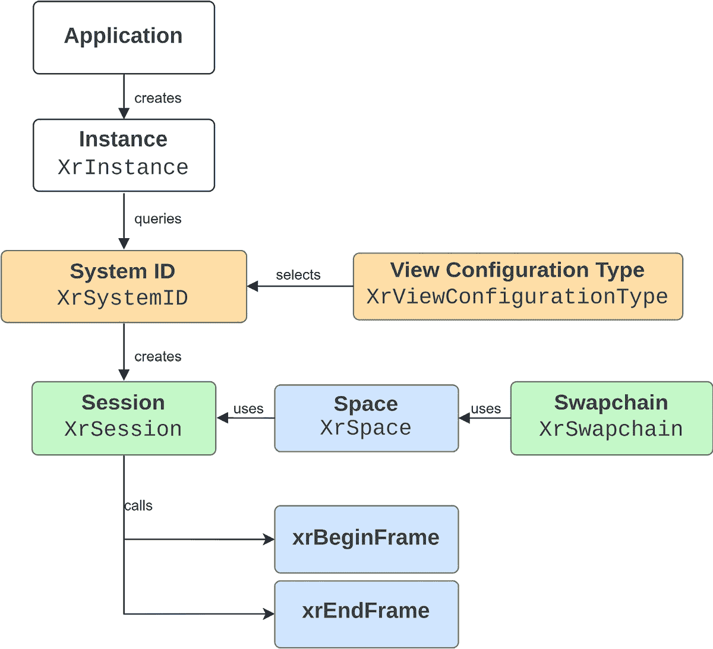
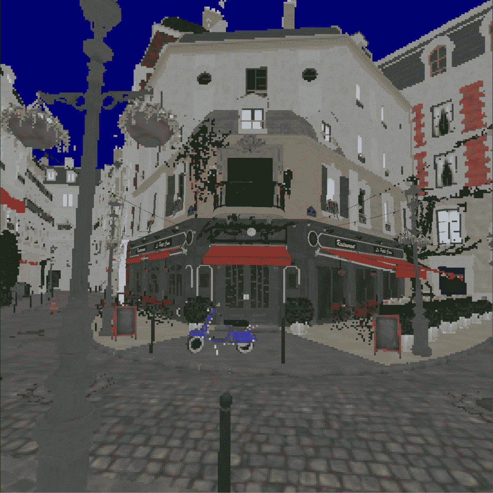

# 8

# 使用 OpenXR 实现扩展现实

与 Vulkan 在图形领域的用途类似，OpenXR 是**扩展现实**（**XR**）世界的一个组成部分，是一个作为实现 XR 应用的强大工具的 API。本章提供了 OpenXR 的概述以及如何与 Vulkan 结合使用。我们从 OpenXR 的基本介绍开始，解释其在 XR 应用中的作用和重要性，然后介绍可能用于改进您的 XR 应用的食谱，例如**单次多视图**渲染，这是一种优化立体场景渲染的技术。本章进一步扩展到注视点渲染的领域，这是一种通过以不同分辨率渲染屏幕的不同部分来显著提高**每秒帧数**（**FPS**）的方法。我们深入探讨了使用 Vulkan 扩展的**片段着色率**功能实现此技术的实现，为您提供了其实际应用的理解。最后，我们探讨了**半精度浮点数**的使用，这是在**头戴式显示器**（**HMDs**）上节省内存空间的实用工具。到本章结束时，您将了解这些概念，并具备在 XR 项目中有效应用这些技能的能力。

在本章中，我们将涵盖以下食谱：

+   开始使用 OpenXR

+   如何实现单次多视图渲染

+   使用片段密度图实现静态注视点渲染

+   在您的应用中从 OpenXR 检索注视点信息

+   使用高通的片段密度图偏移扩展实现动态注视点渲染

+   使用半精度浮点数减少内存负载

# 技术要求

对于本章，您需要安装 Android Studio，并且还需要 Meta Quest 2 或 Meta Quest Pro 来运行存储库中提供的**虚拟现实**（**VR**）示例应用。请按照以下步骤安装构建、安装和运行应用程序所需的工具：

+   从[`developer.android.com/studio/releases`](https://developer.android.com/studio/releases)下载并安装 Android Studio Hedgehog 版本。

+   我们还建议安装 Meta Quest 开发者中心，从[`developer.oculus.com/downloads/package/oculus-developer-hub-win`](https://developer.oculus.com/downloads/package/oculus-developer-hub-win)。此工具提供了一些有助于 XR 应用开发的特性。

+   请按照以下链接中概述的步骤操作，以确保您的设备已准备好进行开发——也就是说，您可以调试、部署和测试 VR 应用：[`developer.oculus.com/documentation/native/android/mobile-device-setup/`](https://developer.oculus.com/documentation/native/android/mobile-device-setup/).

要启动项目，只需启动 Android Studio 并打开位于`source/chapter8`目录中的本章`project`文件夹。

# 开始使用 OpenXR

在我们深入探讨我们的应用程序代码结构之前，让我们讨论一些重要的 OpenXR 概念：

+   `XrInstance`：这是 OpenXR 应用程序的起点。它表示应用程序与 OpenXR 运行时的连接。它是您创建的第一个对象，也是您最后销毁的对象。

+   `XrSystemId`：在创建实例后，应用程序查询系统 ID，它代表一个特定的设备或设备组，例如 VR 头盔。

+   `XrViewConfigurationType`：这用于选择应用程序将用于显示图像的视图配置。不同的配置可以表示不同的显示设置，例如单视图、立体视图等。

+   `XrSession`：一旦设置了实例并确定了系统 ID 和视图配置，就会创建一个会话。会话表示应用程序与设备之间的交互。会话管理设备的生命周期、渲染参数和输入数据。

+   `XrSpace`：Spaces 代表 XR 环境中的坐标系。它们用于在 3D 空间中定位对象。

+   `XrSwapchain`：swapchain 是一组用于缓冲显示图像的纹理。在会话建立后，swapchain 被创建来处理渲染。

+   `xrBeginFrame` 和 `xrEndFrame`：这些是用于开始和结束帧渲染的函数。`xrBeginFrame` 函数表示渲染帧的开始，而 `xrEndFrame` 函数表示帧的结束。它们在渲染循环中的每一帧都会被调用。

    *图 8.1* 展示了如何使用 OpenXR 的基本概念：



图 8.1 – OpenXR 对象交互图

在这个菜谱中，我们将了解主要的 OpenXR 初始化事件，以及我们需要使用哪些函数来渲染帧并在设备上显示它们。该菜谱还将涵盖 OpenXR 代码在存储库中的处理方式。

## 准备工作

创建一个 OpenXR 应用程序的第一步是设置一个 `XrInstance`。这个实例是您的应用程序与 OpenXR 运行时之间的主要连接。要创建一个 `XrInstance`，您需要调用 `xrCreateInstance` 函数。在这样做之前，您需要决定您的应用程序需要哪些扩展。至少，您的应用程序需要启用一个图形绑定扩展，该扩展指定了将要使用的图形 API。您还可以使用 `xrEnumerateInstanceExtensionProperties` 来枚举平台支持的所有扩展。此外，在调用 `xrCreateInstance` 之前，您还需要填充 `XrApplicationInfo` 结构。这个结构包含有关您的应用程序的基本详细信息，例如应用程序的名称、引擎名称和版本信息。

在设置好这些细节之后，你可以调用`xrCreateInstance`，它将在成功创建后返回一个实例句柄。在创建`XrInstance`之后，下一步涉及查询`SystemId`并选择一个`XrViewConfigurationView`。`SystemId`代表一个特定的 XR 设备或一组设备，如 VR 头戴式设备，可以使用`xrGetSystem`函数检索。另一方面，`XrViewConfigurationView`允许你选择应用程序用于显示图像的视图配置。这可以从单眼到立体配置不等，具体取决于你的设备类型。在本章的食谱中，我们将通过指定`XR_VIEW_CONFIGURATION_TYPE_PRIMARY_STEREO`来使用立体视图。

下一步是创建一个`XrSession`实例。`XrSession`代表你的应用程序与 XR 设备之间的活跃交互。它处理渲染参数、输入数据以及应用程序与设备交互的整体生命周期。要创建一个`XrSession`，我们需要在`XrSessionCreateInfo`中填写图形绑定信息。由于我们使用 Vulkan，我们将使用`XrGraphicsBindingVulkanKHR`结构指定图形绑定。

在 XR 平台上跟踪空间关系非常重要。`XrSpace`类的一个实例代表 XR 系统正在跟踪的东西。为了与跟踪对象交互，我们将使用`XrSpace`句柄。有几个空间被称为参考空间，可以通过会话和枚举来访问。OpenXR 中有三种类型的参考空间：

+   `XR_REFERENCE_SPACE_TYPE_LOCAL`：坐着或静态空间

+   `XR_REFERENCE_SPACE_TYPE_VIEW`：头部锁定空间

+   `XR_REFERENCE_SPACE_TYPE_STAGE`：由环境包围的区域，用户可以在其中移动

要从这些枚举中获取`XrSpace`，你将使用`xrCreateReferenceSpace`。另一种你可以创建的空间是`xrCreateActionSpace`，当你需要从一个姿态动作创建空间时使用。例如，我们用它来创建注视位置和方向的`XrSpace`。`xrLocateSpace`是一个 API，用于确定相对于其他空间的位置转换。

要渲染图形，我们需要创建一个 swapchain，就像在 Vulkan 中一样。要创建一个 swapchain，你需要调用`xrCreateSwapchain`。接下来，我们将使用`xrEnumerateSwapchainImages`来获取多个`XrSwapchainImageVulkanKHR`实例，这些实例持有对`vkImage`的引用。

在 OpenXR 中，一个关键概念是层。想象一下，层是虚拟或增强现实体验中最终渲染场景的独立部分或元素。OpenXR 不是呈现一个平坦的单图像视图，而是通过独立渲染每个层并将它们组合成最终图像来创建一个多维视角。最常用的层是`XrCompositionLayerProjection`。这个层负责渲染主场景。为了创建类似于 VR 体验的深度和沉浸感，这个层结合了多个视图——每个 VR 头戴式设备中的一个眼睛的视图。这种安排产生了一个立体 3D 效果。但`XrCompositionLayerProjection`并不是唯一工作的层。OpenXR 还使用了诸如`XrCompositionLayerQuad`、`XrCompositionLayerCubeKHR`和`XrCompositionLayerEquirectKHR`之类的层。这些中的每一个都在增强最终图像的渲染中扮演着独特的角色。

现在我们将转向渲染循环；应用程序的渲染循环由三个主要函数组成：

1.  `xrWaitFrame`会阻塞，直到 OpenXR 运行时确定开始下一帧是正确的时间。这包括基于用户头部姿态的计算和渲染。

1.  `xrBeginFrame`由应用程序调用，以标记给定帧的渲染开始。

1.  `xrEndFrame`提交帧以进行显示。

下一个部分是获取和释放 swapchain 图像：`xrAcquireSwapchainImage`提供了当前 swapchain 图像的索引，但它并不授予您写入图像的权限。要写入 swapchain 图像，您需要调用`xrWaitSwapchainImage`。`xrReleaseSwapchainImage`在`xrEndFrame`之前调用，在渲染完成之前。`xrEndFrame`将使用最近释放的 swapchain 图像来显示到设备上。

最后一个重要的调用是`xrPollEvents`，它用于从事件队列中检索事件。OpenXR 中的事件代表各种类型的发生，例如会话状态的变化、用户的输入或环境的变化。例如，当用户戴上或取下他们的头戴式设备、按下控制器上的按钮或跟踪系统失去或重新获得对跟踪对象的视线时，可能会生成一个事件。它通常每帧调用一次。

在仓库中，OpenXR 的代码封装在`OXR::Context`和`OXR::OXRSwapchain`类中。

## 如何做到这一点...

仓库中的`OXR::Context`类管理了大多数 OpenXR 调用和状态。在这个菜谱中，我们将向您展示这些函数的详细信息以及如何使用它们来初始化仓库中的 OpenXR 示例应用：

1.  `OXR::Context::initializeExtensions` 方法查找 OpenXR 运行时中可用的扩展，并过滤掉不受支持的请求扩展。一旦获取到可用的扩展，它将遍历请求的扩展，消除任何不可用的扩展。这导致了一个同时请求和受支持的扩展列表：

    ```cpp
    void Context::initializeExtensions() {
       uint32_t numExtensions = 0;
      xrEnumerateInstanceExtensionProperties(
        nullptr, 0, &numExtensions, nullptr);
      availableExtensions_.resize(
        numExtensions,
        {XR_TYPE_EXTENSION_PROPERTIES});
      xrEnumerateInstanceExtensionProperties(
        nullptr, numExtensions, &numExtensions,
        availableExtensions_.data());
      requestedExtensions_.erase(
        std::remove_if(
          requestedExtensions_.begin(),
          requestedExtensions_.end(),
          this {
            return std::none_of(
              availableExtensions_.begin(),
              availableExtensions_.end(),
              ext {
                return strcmp(props.extensionName,
                              ext) == 0;
              });
          }),
        requestedExtensions_.end());
    }
    ```

1.  `Context::createInstance()` 方法负责使用基本应用程序信息和扩展详细信息创建一个 OpenXR 实例：

    ```cpp
    bool Context::createInstance() {
      const XrApplicationInfo appInfo = {
        .applicationName = "OpenXR Example",
        .applicationVersion = 0,
        .engineName = "OpenXR Example",
        .engineVersion = 0,
        .apiVersion = XR_CURRENT_API_VERSION,
      };
      const XrInstanceCreateInfo instanceCreateInfo =
        {
          .type = XR_TYPE_INSTANCE_CREATE_INFO,
          .createFlags = 0,
          .applicationInfo = appInfo,
          .enabledApiLayerCount = 0,
          .enabledApiLayerNames = nullptr,
          .enabledExtensionCount =
            static_cast<uint32_t>(
              requestedExtensions_.size()),
          .enabledExtensionNames =
            requestedExtensions_.data(),
        };
      XR_CHECK(xrCreateInstance(&instanceCreateInfo,
                                &instance_));
      XR_CHECK(xrGetInstanceProperties(
        instance_, &instanceProps_));
    }
    ```

1.  `Context::systemInfo` 方法检索并存储头戴式显示器的 OpenXR 系统属性。它获取系统 ID 及其属性，包括系统名称、供应商 ID、图形属性、跟踪属性和视线支持：

    ```cpp
    void Context::systemInfo() {
      const XrSystemGetInfo systemGetInfo = {
        .type = XR_TYPE_SYSTEM_GET_INFO,
        .formFactor =
          XR_FORM_FACTOR_HEAD_MOUNTED_DISPLAY,
      };
      XR_CHECK(xrGetSystem(instance_, &systemGetInfo,
                           &systemId_));
      XR_CHECK(xrGetSystemProperties(
        instance_, systemId_, &systemProps_));
    }
    ```

1.  `Context::enumerateViewConfigurations` 函数枚举系统支持的所有视图配置，然后选择并存储与预定义支持的配置匹配的配置属性。如果所选配置支持所需数量的视口，它将存储配置属性和视图配置视图。

1.  `Context::initGraphics` 函数旨在初始化 Vulkan 的图形需求。它通过获取关键组件，如 Vulkan 实例和设备扩展来实现这一点。`xrGetVulkanInstanceExtensionsKHR` 和 `xrGetVulkanDeviceExtensionsKHR` 是 OpenXR API 中使用的函数，分别用于检索特定 OpenXR 运行时所需的 Vulkan 实例和设备扩展的名称：

    ```cpp
    void Context::initGraphics() {
      uint32_t bufferSize = 0;
      pfnGetVulkanInstanceExtensionsKHR(
        instance_, systemId_, 0, &bufferSize, NULL);
      requiredVkInstanceExtensionsBuffer_.resize(
        bufferSize);
      pfnGetVulkanInstanceExtensionsKHR(
        instance_, systemId_, bufferSize, &bufferSize,
        requiredVkInstanceExtensionsBuffer_.data());
      pfnGetVulkanDeviceExtensionsKHR(
        instance_, systemId_, 0, &bufferSize, NULL);
      requiredVkDeviceExtensionsBuffer_.resize(
        bufferSize);
      pfnGetVulkanDeviceExtensionsKHR(
        instance_, systemId_, bufferSize, &bufferSize,
        requiredVkDeviceExtensionsBuffer_.data());
    }
    ```

1.  `Context::initializeSession` 函数创建一个新的 OpenXR 会话。它首先创建一个 `XrGraphicsBindingVulkanKHR` 对象，该对象用于将 Vulkan 绑定到 XR 会话。该对象包含 Vulkan 实例、物理设备和设备，以及队列家族索引。这些信息允许 OpenXR 运行时与 Vulkan API 交互。然后，创建一个 `XrSessionCreateInfo` 对象，用于指定创建新会话的参数。该对象的属性填充了要创建的会话的性质、图形绑定和系统 ID。最后，调用 `xrCreateSession` 函数来创建会话：

    ```cpp
    bool Context::initializeSession(
      VkInstance vkInstance,
      VkPhysicalDevice vkPhysDevice,
      VkDevice vkDevice, uint32_t queueFamilyIndex) {
      // Bind Vulkan to XR session
      const XrGraphicsBindingVulkanKHR
        graphicsBinding = {
          XR_TYPE_GRAPHICS_BINDING_VULKAN_KHR,
          NULL,
          vkInstance,
          vkPhysDevice,
          vkDevice,
          queueFamilyIndex,
          0,
        };
      const XrSessionCreateInfo sessionCreateInfo = {
        .type = XR_TYPE_SESSION_CREATE_INFO,
        .next = &graphicsBinding,
        .createFlags = 0,
        .systemId = systemId_,
      };
      XR_CHECK(xrCreateSession(
        instance_, &sessionCreateInfo, &session_));
      return true;
    }
    ```

1.  `Context::enumerateReferenceSpaces` 函数检索当前 OpenXR 会话可用的参考空间类型。它调用 `xrEnumerateReferenceSpaces` 以填充一个包含 `XrReferenceSpaceType` 结构的向量，这些结构表示可用的参考空间类型。最后，它检查 `XR_REFERENCE_SPACE_TYPE_STAGE` 类型是否可用，并将此信息存储在 `stageSpaceSupported_` 变量中。`XR_REFERENCE_SPACE_TYPE_STAGE` 类型代表一种站立式体验，用户有少量空间可以移动。

1.  `Context::createSwapchains` 函数负责创建渲染所需的 swapchain。根据 `useSinglePassStereo_` 的值，它要么创建一个将用于两个视图的单一 swapchain（在单次通行立体渲染的情况下），要么为每个视图创建单独的 swapchain。对于每个 swapchain，它创建一个新的 `OXRSwapchain` 实例。`OXRSwapchain` 构造函数使用 Vulkan 上下文、OpenXR 会话、swapchain 视口和每个 swapchain 的视图数进行调用。我们调用 `initialize` 函数来初始化 `OXRSwapchain` 实例。`OXRSwapchain` 类中的 `initialize` 函数通过调用 `xrCreateSwapchain` 函数为 OpenXR 会话设置颜色和深度 swapchain。一旦创建了 `XrSwapchain`，我们在 `OXRSwapchain` 中调用 `enumerateSwapchainImages`，它负责创建一个 `XrSwapchainImageVulkanKHR` 向量：

    ```cpp
    void Context::createSwapchains(
      VulkanCore::Context &ctx) {
      const uint32_t numSwapchainProviders =
        useSinglePassStereo_ ? 1 : kNumViews;
      const uint32_t numViewsPerSwapchain =
        useSinglePassStereo_ ? kNumViews : 1;
      swapchains_.reserve(numSwapchainProviders);
      for (uint32_t i = 0; i < numSwapchainProviders;
           i++) {
        swapchains_.emplace_back(
          std::make_unique<OXRSwapchain>(
            ctx, session_, viewports_[i],
            numViewsPerSwapchain));
        swapchains_.back()->initialize();
      }
    }
    ```

1.  `OXRSwapchain` 还提供了诸如 `getSurfaceTexture` 和 `releaseSwapchainImages` 等功能。`getSurfaceTexture` 通过调用 `xrAcquireSwapchainImage` 和 `xrWaitSwapchainImage` 来获取 swapchain。

1.  在开始渲染之前，`OXR::Context::beginFrame` 首先通过调用 `xrWaitFrame` 与显示进行帧提交同步，该函数返回一个 `XrFrameState` 结构。帧状态指定了当运行时预测帧将被显示时的预测显示时间。该函数还调用 `xrBeginFrame`，必须在渲染开始之前调用，并检索一些其他重要信息，例如头部和视图姿态，并计算视图和相机变换：

    ```cpp
    XrFrameState Context::beginFrame() {
      const XrFrameWaitInfo waitFrameInfo = {
        XR_TYPE_FRAME_WAIT_INFO};
      XrFrameState frameState = {XR_TYPE_FRAME_STATE};
      XR_CHECK(xrWaitFrame(session_, &waitFrameInfo,
                           &frameState));
      XrFrameBeginInfo beginFrameInfo = {
        XR_TYPE_FRAME_BEGIN_INFO};
      XR_CHECK(
        xrBeginFrame(session_, &beginFrameInfo));
      XrSpaceLocation loc = {
        loc.type = XR_TYPE_SPACE_LOCATION};
      XR_CHECK(xrLocateSpace(
        headSpace_, stageSpace_,
        frameState.predictedDisplayTime, &loc));
      XrPosef headPose = loc.pose;
      XrViewState viewState = {XR_TYPE_VIEW_STATE};
      const XrViewLocateInfo projectionInfo = {
        .type = XR_TYPE_VIEW_LOCATE_INFO,
        .viewConfigurationType =
          viewConfigProps_.viewConfigurationType,
        .displayTime =
          frameState.predictedDisplayTime,
        .space = headSpace_,
      };
      uint32_t numViews = views_.size();
      views_[0].type = XR_TYPE_VIEW;
      views_[1].type = XR_TYPE_VIEW;
      XR_CHECK(xrLocateViews(
        session_, &projectionInfo, &viewState,
        views_.size(), &numViews, views_.data()));
    }
    ```

1.  一旦渲染完成，应用程序必须调用 `OXR::endFrame` 方法，该方法反过来调用 `xrEndFrame`。`XrFrameEndInfo` 结构指定了正在呈现的层类型（及其标志）及其关联的空间（及其姿态、视场角度和可能深度信息），以及图像（们）应该如何与底层层混合。请注意，为了简洁起见，这里只显示了代码的关键部分。为了全面理解，请参阅原始源代码中的完整代码：

    ```cpp
    void Context::endFrame(XrFrameState frameState) {
      const XrFrameEndInfo endFrameInfo = {
        .type = XR_TYPE_FRAME_END_INFO,
        .displayTime =
          frameState.predictedDisplayTime,
        .environmentBlendMode =
          XR_ENVIRONMENT_BLEND_MODE_OPAQUE,
        .layerCount = 1,
        .layers = layers,
      };
      XR_CHECK(xrEndFrame(session_, &endFrameInfo));
    }
    ```

1.  `android_main` 函数位于 `OXR::Context` 类之外，它是原生 Android 活动的入口点。它初始化 OpenXR (`oxrContext`) 和 Vulkan (`vkContext`) 上下文，并设置它们所需的扩展和功能。创建实例后，它建立会话并为渲染创建 swapchain。还创建了顶点和片段着色器的着色器模块。然后该函数进入一个循环，处理 OpenXR 事件，开始帧，执行渲染操作，并结束帧。这个循环会一直持续到应用程序被请求销毁。请注意，为了简洁，这里省略了大量的细节。鼓励您查看存储库中的实际代码以获得全面的理解：

    ```cpp
    void android_main(struct android_app *pApp) {
      OXR::Context oxrContext(pApp);
      oxrContext.initializeExtensions();
      oxrContext.createInstance();
      VulkanCore::Context vkContext(
        VkApplicationInfo{});
      vkContext.createVkDevice(
        oxrContext.findVkGraphicsDevice(
          vkContext.instance()),
        oxrContext.vkDeviceExtensions(),
        VK_QUEUE_GRAPHICS_BIT);
      oxrContext.initializeSession(
        vkContext.instance(),
        vkContext.physicalDevice().vkPhysicalDevice(),
        vkContext.device(),
        vkContext.physicalDevice()
          .graphicsFamilyIndex()
          .value());
      oxrContext.createSwapchains(vkContext);
      auto commandMgr =
        vkContext.createGraphicsCommandQueue(3, 3);
      do {
        auto frameState = oxrContext.beginFrame();
        if (frameState.shouldRender == XR_FALSE) {
          oxrContext.endFrame(frameState);
          continue;
        }
        auto commandBuffer =
          commandMgr.getCmdBufferToBegin();
        vkCmdDrawIndexedIndirect(
          commandBuffer, buffers[3]->vkBuffer(), 0,
          numMeshes,
          sizeof(EngineCore::
                   IndirectDrawCommandAndMeshData));
        commandMgr.submit(
          &vkContext.swapchain()->createSubmitInfo(
            &commandBuffer,
            &VK_PIPELINE_STAGE_COLOR_ATTACHMENT_OUTPUT_BIT,
            false, false));
        commandMgr.goToNextCmdBuffer();
        oxrContext.swapchain(0)
          ->releaseSwapchainImages();
        oxrContext.endFrame(frameState);
      } while (!pApp->destroyRequested);
    }
    ```

此配方涉及一系列步骤，从初始化 OpenXR 和 Vulkan 上下文到进入游戏事件循环以处理 OpenXR 事件和渲染。这个过程很复杂，涉及启用特定功能、处理图形命令和管理帧。本指南已提供简化的概述，我们强烈建议您查看存储库中的完整代码以获得全面理解。

## 相关内容

如需更多详细信息，请参阅 Khronos 的 OpenXR 指南：

+   [`www.khronos.org/files/openxr-10-reference-guide.pdf`](https://www.khronos.org/files/openxr-10-reference-guide.pdf)

# 如何实现单遍历多视图渲染

XR 设备必须为每个帧至少渲染两次场景，为每只眼睛生成一个图像。单遍历多视图渲染是一种技术，通过允许在单个遍历中渲染多个视图来提高 XR 应用程序的性能。这实际上通过一个绘制调用实现了从双眼视角渲染场景。

在此配方中，我们将介绍如何在 Vulkan 中启用多视图渲染功能，以及如何使用它在一个渲染遍历中渲染双眼的场景。

## 准备工作

在 Vulkan 的上下文中，`VK_STRUCTURE_TYPE_PHYSICAL_DEVICE_MULTIVIEW_FEATURES`扩展指定是否在单个渲染遍历中支持多个视图。一旦启用该功能，您可以为您的渲染遍历指定多个视口和裁剪矩形。然后图形管线将在单个遍历中从不同的视角渲染场景，从而减少重复操作的需求。

除了启用 Vulkan 扩展外，您还需要在着色器代码中启用`GL_EXT_multiview`扩展。`GL_EXT_multiview`是一个 GLSL 扩展，允许在单个遍历中渲染多个视图。`GL_EXT_multiview`引入了一个新的内置变量`gl_ViewIndex`，可以在您的着色器中使用，以确定正在渲染哪个视图。它包含正在处理的当前视图的索引，并且可以根据视图索引调整您的绘制（例如，索引`0`可能代表左眼，而索引`1`可能代表右眼）。

我们还需要使用 `VkPhysicalDeviceMultiviewFeatures` 来查询硬件是否支持多视图。此外，在创建渲染通道时，我们需要指定我们将使用多个视图。这是通过将 `VkRenderPassMultiviewCreateInfo` 结构体的一个实例添加到 `VkRenderPassCreateInfo` 结构体的 `pNext` 链中实现的。另一个重要部分是，交换链图像需要具有多个层（在我们的例子中，是两个——每个眼睛一个），渲染的结果将发送到附件的不同层。你可能认为我们可以渲染相同的场景两次（一个用于左眼，一个用于右眼），但这意味着我们需要构建一个命令缓冲区，将所有几何和纹理发送两次。这个扩展帮助我们只发送一次数据，并且只有着色器被触发两次（对于每个视图 ID）。这两个执行之间的唯一区别是摄像机的统一数据。

为了支持多视图，需要在代码库的各个区域进行代码更改。在这种情况下，我们需要更改 `Texture`、`RenderPass`、`Context` 类和着色器文件。

## 如何实现...

在以下步骤中，我们将详细介绍如何实现这个菜谱：

1.  将 `VulkanCore::Texture` 扩展以支持使用 `VK_IMAGE_VIEW_TYPE_2D_ARRAY` 创建的 `vkImageView`；如果我们有同一纹理中的多个层，这是必要的。

1.  在 `VulkanCore::RenderPass` 中添加对多视图的支持；这是通过将 `VkRenderPassMultiviewCreateInfo` 连接到 `VkRenderPassCreateInfo` 来实现的。

1.  在 `VulkanCore::Context` 中添加支持以启用多视图扩展；这通过一个名为 `enableMultiView` 的函数实现，该函数简单地启用 `VkPhysicalDeviceMultiviewFeatures`，如果物理设备支持它的话。

1.  现在顶点着色器传递了两个 `Context::mvp(index)`，这样我们就可以查询左右眼的 MVP。

1.  我们还引入了一个名为 `kUseSinglePassStereo` 的常量，可以用来控制我们是否想要使用单通道。

由于代码分布在各个文件中，我们强烈建议深入研究存储库，以全面审查实现。特别是位于 `source/chapter8/app/src/main/cpp/main.cpp` 的文件应引起你的特别注意。

# 使用片段密度图实现静态注视点渲染

**注视点渲染**是一种前沿的图形渲染技术，它利用了人眼自然倾向于聚焦于场景特定区域的特点，通过将更高细节和分辨率分配给中央的注视点视觉，并逐渐减少对周边视觉的分配，从而优化计算资源。这模仿了人眼感知细节的方式，在图形渲染中提供了显著的性能提升，同时不牺牲视觉质量。

在这个菜谱中，我们将看到如何通过使用 **片段密度图**（**FDM**）扩展来实现固定注视点渲染。

## 准备工作

Vulkan 中的 FDM 设备扩展（`VK_EXT_fragment_density`）允许应用程序通过一个纹理来指定渲染目标不同区域使用不同细节级别，该纹理编码了片段着色器将对该区域调用多少次。FDM 可以在每一帧中修改，以适应用户的视线方向。此配方仅适用于提供视线检测的 HMD，如 Meta 的 Quest Pro。此处提供的配方适用于单次传递立体渲染方法。

## 如何操作...

在创建和使用 FDM 及其 FDM 偏移扩展之前，我们需要启用这些扩展：

1.  在启用功能之前，有必要检查物理设备是否支持它。这样做需要将一个`VkPhysicalDeviceFragmentDensityMapFeaturesEXT`结构实例添加到传递给`vkGetPhysicalDeviceFeatures2`函数的`VkPhysicalDeviceFeatures2`的`pNext`链中。

    `VkPhysicalDeviceFragmentDensityMapFeaturesEXT::fragmentDensityMap`指定设备是否支持 FDM 扩展。

1.  该扩展具有需要查询以正确使用的属性。为此，还需要将一个`VkPhysicalDeviceFragmentDensityMapPropertiesEXT`结构实例添加到`VkPhysicalDeviceProperties2`的`pNext`链中，并使用`vkGetPhysicalDeviceProperties2`查询这些属性。我们将在*步骤 4*中使用这些属性。

1.  FDM 扩展是设备扩展，其名称需要在创建`VkDevice`对象时传递：`"VK_EXT_fragment_density_map"`（或定义，`VK_EXT_FRAGMENT_DENSITY_MAP_EXTENSION_NAME`）。

1.  FDM 的大小不会按一对一的比例映射到帧缓冲区。地图中的一个 texel 会影响渲染目标的一个*区域*。这个区域的大小可以从`VkPhysicalDeviceFragmentDensityMapPropertiesEXT`中查询，从`minFragmentDensityTexelSize`和`maxFragmentDensityTexelSize`属性中获取。

    在我们的配方中，我们将创建一个 FDM，其 texel 映射到至少为渲染目标 32 x 32 的区域，由`minFragmentDensityTexelSize`限制：

    ```cpp
    const glm::vec2 mapSize = glm::vec2(
        std::ceilf(
            oxrContext.swapchain(0)
                ->viewport()
                .recommendedImageRectWidth /
            std::max(
                32u,
                vkContext.physicalDevice()
                    .fragmentDensityMapProperties()
                    .minFragmentDensityTexelSize.width)),
        std::ceilf(
            oxrContext.swapchain(0)
                ->viewport()
                .recommendedImageRectHeight /
            std::max(
                32u,
                vkContext.physicalDevice()
                    .fragmentDensityMapProperties()
                    .minFragmentDensityTexelSize.height)));
    ```

1.  FDM 是一种具有一些特殊使用标志的常规纹理：

    ```cpp
    std::shared_ptr<VulkanCore::Texture> =
        std::make_shared<VulkanCore::Texture>(
            vkContext, VK_IMAGE_TYPE_2D,
            VK_FORMAT_R8G8_UNORM,
            static_cast<VkImageCreateFlags>(0),
            VK_IMAGE_USAGE_FRAGMENT_DENSITY_MAP_BIT_EXT,
            VkExtent3D{static_cast<uint32_t>(mapSize.x),
                       static_cast<uint32_t>(mapSize.y),
                       1},
            1, 2, VK_MEMORY_PROPERTY_DEVICE_LOCAL_BIT,
            false, VK_SAMPLE_COUNT_1_BIT,
            "fragment density map", true,
            VK_IMAGE_TILING_LINEAR);
    ```

1.  纹理的格式是`VK_FORMAT_R8G8_UNORM`。地图中存储的每个像素指定了用于渲染目标该区域的片段密度，其中`255`表示密度应该是最高的（或默认值：每个渲染目标的像素一个片段；`128`为半密度，依此类推）。在我们的配方中，我们的地图初始化为`128`（半密度），然后操作以使中心区域具有半径等于`2`个 texel 的全密度：

    ```cpp
    std::vector<uint8_t> fdmData(mapSize.x *mapSize.y * 2,
                                 255);
    constexpr uint16_t high_res_radius = 8;
    const glm::vec2 center = mapSize / 2.f;
    for (uint32_t x = 0; x < mapSize.x; ++x) {
      for (uint32_t y = 0; y < mapSize.y; ++y) {
        const float length =
            glm::length(glm::vec2(x, y) - center);
        if (length < high_res_radius) {
          const uint32_t index =
              (y * mapSize.x * 2) + x * 2;
          fdmData[index] = 255;     // full density
          fdmData[index + 1] = 255; // full density
    ```

    注意，图像有两个层，每个眼睛一个。数据被上传到设备两次，一次用于图像的每一层。

1.  一旦地图的每一层数据都已上传，纹理的布局需要过渡到特殊布局，`VK_IMAGE_LAYOUT_FRAGMENT_DENSITY_MAP_OPTIMAL_EXT`。

1.  FDM（Fragment Density Map）需要在`VkAttachmentDescription`结构中由渲染通道指定和引用，就像渲染通道中使用的任何其他附件一样：

    ```cpp
    const auto fdmAttachDesc = VkAttachmentDescription{
        .format = VK_FORMAT_R8G8_UNORM,
        .samples = VK_SAMPLE_COUNT_1_BIT,
        .loadOp = VK_ATTACHMENT_LOAD_OP_DONT_CARE,
        .storeOp = VK_ATTACHMENT_STORE_OP_DONT_CARE,
        .initialLayout =
            VK_IMAGE_LAYOUT_FRAGMENT_DENSITY_MAP_OPTIMAL_EXT,
        .finalLayout =
            VK_IMAGE_LAYOUT_FRAGMENT_DENSITY_MAP_OPTIMAL_EXT,
    };
    ```

1.  FDM 不能出现在`VkSubpassDescription::pColorAttachments`或`VkSubpassDescription::pDepthStencilAttachment`数组中的颜色或深度模板附件中。相反，它必须在特殊`VkRenderPassFragmentDensityMapCreateInfoEXT`结构的一个实例中引用：

    ```cpp
    const VkRenderPassFragmentDensityMapCreateInfoEXT
        fdmAttachmentci = {
            .sType =
                VK_STRUCTURE_TYPE_RENDER_PASS_FRAGMENT_DENSITY_MAP_CREATE_INFO_EXT,
            .fragmentDensityMapAttachment =
                {
                    .attachment =
                        fragmentDensityAttachmentReference,
                    .layout =
                        VK_IMAGE_LAYOUT_FRAGMENT_DENSITY_MAP_OPTIMAL_EXT,
                },
    };
    refers to the *index* of the VkAttachmentDescription structure that mentions the FDM in the attachment description array passed to VkRenderPassCreateInfo::pAttachments.
    ```

故障预防通知

此结构在`VkRenderPassCreateInfo:: pAttachments`数组中的顺序必须与传递给`VkFramebufferCreateInfo::pAttachments`的`VkImage`数组中的索引相匹配。

1.  `VkRenderPassFragmentDensityMapCreateInfoEXT`结构的实例需要添加到`VkRenderPassCreateInfo`结构的`pNext`链属性中：

    ```cpp
    const VkRenderPassCreateInfo rpci = {
        .sType = VK_STRUCTURE_TYPE_RENDER_PASS_CREATE_INFO,
        .pNext = &fdmAttachmentci,
        ...
    };
    ```

1.  FDM 的图像视图也必须是帧缓冲区的一部分。其图像视图必须添加到`VkFramebufferCreateInfo::pAttachments`数组中，并且该数组中的索引必须与传递给渲染通道创建的`VkAttachmentDescription`结构中的索引相匹配。

这标志着我们关于静态注视点渲染指南的结束。在接下来的章节中，我们将扩展我们的探索，进入动态注视点渲染的领域。

## 参见

如需更多信息，请查看以下链接中的扩展信息：

+   https://registry.khronos.org/vulkan/specs/1.3-extensions/man/html/VK_EXT_fragment_density_map.html

+   https://registry.khronos.org/vulkan/specs/1.3-extensions/man/html/VK_QCOM_fragment_density_map_offset.html.

# 在您的应用程序中从 OpenXR 检索视线信息

虚拟现实领域已经发展到一定程度，一些 HMD（头戴式显示器）现在配备了跟踪用户视线的能力。这个功能可以识别用户正在看的方向，可以用于各种任务，增强 VR 体验的交互性和沉浸感。在本食谱中，我们将指导您在应用程序中启用和检索从 OpenXR 获取的视线数据。此外，我们还将说明如何计算焦点区域——用户正在查看的特定区域——在用于显示的渲染目标上的像素坐标。

## 准备工作

对于本食谱，您需要一个支持眼动功能的眼镜，例如 Meta 的 Quest Pro。您还需要允许应用程序跟踪用户的眼睛，这可以通过大多数设备上的**设置**菜单实现。

此外，了解如何在 OpenXR 中支持和使用空间和动作（参见“*开始使用* *OpenXR*”食谱）。

本食谱由 Meta 的 Quest Pro 设备编写和测试，因此这里显示的一些代码是特定于该平台的。您的实现可能需要一些小的调整才能在您的设备上工作。

## 如何操作…

添加视线支持需要允许设备跟踪用户的眼睛。这需要执行以下步骤：

1.  在您的应用程序中使用眼动追踪功能之前，您需要通过将以下行添加到您的应用程序的`AndroidManifest.xml`文件中请求权限：

    ```cpp
    <uses-permission android:name="com.oculus.permission.EYE_TRACKING" />
    <uses-permission android:name="oculus.software.eye_tracking" />
    <uses-feature android:name="oculus.software.eye_tracking"/>
    ```

1.  使用以下方式授予您的应用程序跟踪用户眼球的权限：

    ```cpp
    adb shell pm grant com.example.openxrsample and you might need to change it to your app’s name.
    ```

1.  在创建 OpenXR 实例时启用 OpenXR 扩展，通过将`XR_EXT_EYE_GAZE_INTERACTION_EXTENSION_NAME`添加到`XrInstanceCreateInfo::enableExtensionNames`数组中：

    ```cpp
    const XrApplicationInfo appInfo = {
        .applicationName = "OpenXR Example",
        .applicationVersion = 0,
        .engineName = "OpenXR Example",
        .engineVersion = 0,
        .apiVersion = XR_CURRENT_API_VERSION,
    };
    std::vector<const char *> requestedExtensions = {
        XR_KHR_VULKAN_ENABLE_EXTENSION_NAME,
       XR_FB_SWAPCHAIN_UPDATE_STATE_VULKAN_EXTENSION_NAME,
        XR_EXT_EYE_GAZE_INTERACTION_EXTENSION_NAME,
    };
    const XrInstanceCreateInfo instanceCreateInfo = {
        .type = XR_TYPE_INSTANCE_CREATE_INFO,
        .createFlags = 0,
        .applicationInfo = appInfo,
        .enabledApiLayerCount = 0,
        .enabledApiLayerNames = nullptr,
        .enabledExtensionCount = static_cast<uint32_t>(
            requestedExtensions_.size()),
        .enabledExtensionNames =
            requestedExtensions_.data(),
    };
    XR_CHECK(xrCreateInstance(&instanceCreateInfo,
                              &instance_));
    ```

1.  我们首先向`OXR:Context`类添加几个成员变量：

    ```cpp
    XrActionSet eyegazeActionSet_ = XR_NULL_HANDLE;
    XrAction eyeGazeAction_ = XR_NULL_HANDLE;
    XrSpace gazeActionSpace_ = XR_NULL_HANDLE;
    XrSpace localReferenceSpace_ = XR_NULL_HANDLE;
    ```

1.  在 OpenXR 中，眼动追踪被视为输入动作，因此我们创建一个动作集来存储眼动追踪动作（`OXR::Context::eyegazeActionSet_`）：

    ```cpp
    const XrActionSetCreateInfo actionSetInfo{
        .type = XR_TYPE_ACTION_SET_CREATE_INFO,
        .actionSetName = "gameplay",
        .localizedActionSetName = "Eye Gaze Action Set",
        .priority = 0,
    };
    XR_CHECK(xrCreateActionSet(instance_, &actionSetInfo,
                               &eyegazeActionSet_));
    ```

1.  然后我们创建一个表示眼球注视输入的动作：

    ```cpp
    const XrActionCreateInfo actionInfo{
        .type = XR_TYPE_ACTION_CREATE_INFO,
        .actionName = "user_intent",
        .actionType = XR_ACTION_TYPE_POSE_INPUT,
        .localizedActionName = "Eye Gaze Action",
    };
    XR_CHECK(xrCreateAction(eyegazeActionSet_, &actionInfo,
                            &eyegazeAction_));
    ```

1.  我们需要路径来识别输入动作及其姿态：

    ```cpp
    XrPath eyeGazeInteractionProfilePath;
    XR_CHECK(xrStringToPath(
        instance_,
        "/interaction_profiles/ext/eye_gaze_interaction",
        &eyeGazeInteractionProfilePath));
    XrPath gazePosePath;
    XR_CHECK(xrStringToPath(
        instance_, "/user/eyes_ext/input/gaze_ext/pose",
        &gazePosePath));
    ```

1.  需要使用`XrActionSuggestedBinding`结构的实例将动作及其姿态绑定在一起：

    ```cpp
    const XrActionSuggestedBinding bindings{
        .action = eyegazeAction_,
        .binding = gazePosePath,
    };
    const XrInteractionProfileSuggestedBinding
        suggestedBindings{
            .type =
                XR_TYPE_INTERACTION_PROFILE_SUGGESTED_BINDING,
            .interactionProfile =
                eyeGazeInteractionProfilePath,
            .countSuggestedBindings = 1,
            .suggestedBindings = &bindings,
        };
    XR_CHECK(xrSuggestInteractionProfileBindings(
        instance_, &suggestedBindings));
    ```

1.  行动需要附加到会话上才能工作，这可以通过调用`xrAttachSessionActionSets`并传入存储眼球注视动作的动作集来完成：

    ```cpp
    const XrSessionActionSetsAttachInfo attachInfo{
        .type = XR_TYPE_SESSION_ACTION_SETS_ATTACH_INFO,
        .countActionSets = 1,
        .actionSets = &eyegazeActionSet_,
    };
    XR_CHECK(xrAttachSessionActionSets(session_,
                                       &attachInfo));
    ```

1.  我们还需要为眼球注视动作创建一个动作空间，以在姿态动作的自然参考框架内定义新空间原点的位置和方向：

    ```cpp
    const XrActionSpaceCreateInfo createActionSpaceInfo{
        .type = XR_TYPE_ACTION_SPACE_CREATE_INFO,
        .action = eyegazeAction_,
        .poseInActionSpace = poseIdentity_,
    };
    XR_CHECK(xrCreateActionSpace(session_,
                                 &createActionSpaceInfo,
                                 &gazeActionSpace_));
    ```

1.  最后的初始化步骤是创建一个局部参考空间，我们将使用它来基于眼球注视的位置和方向。参考空间的类型是`XR_REFERENCE_SPACE_TYPE_VIEW`，因为眼球注视锁定在眼球或头戴式设备的定位和方向上。`eyePoseIdentity`变量初始化为身份方向，高度为`1.8`米：

    ```cpp
    const XrPosef eyePoseIdentity = {
      .orientation = {.x = 0,
                      .y = 0,
                      .z = 0,
                      .w = 1.f},
      .position = {0, 1.8f, 0},
    };
    const XrReferenceSpaceCreateInfo
        createReferenceSpaceInfo{
            .type = XR_TYPE_REFERENCE_SPACE_CREATE_INFO,
            .referenceSpaceType =
                XR_REFERENCE_SPACE_TYPE_VIEW,
            .poseInReferenceSpace = eyePoseIdentity,
        };
    XR_CHECK(xrCreateReferenceSpace(
        session_, &createReferenceSpaceInfo,
        &localReferenceSpace_));
    ```

1.  在`OXR::Context::beginFrame`方法中，我们更新眼球注视动作的当前状态，但仅当应用程序的当前状态是`focused`时。然后我们可以使用`xrGetActionStatePose`获取动作的状态姿态：

    ```cpp
    if (currentState_ == XR_SESSION_STATE_FOCUSED) {
      XrActiveActionSet activeActionSet{
          .actionSet = eyegazeActionSet_,
          .subactionPath = XR_NULL_PATH,
      };
      const XrActionsSyncInfo syncInfo{
          .type = XR_TYPE_ACTIONS_SYNC_INFO,
          .countActiveActionSets = 1,
          .activeActionSets = &activeActionSet,
      };
      XR_CHECK(xrSyncActions(session_, &syncInfo));
      XrActionStatePose actionStatePose{
          XR_TYPE_ACTION_STATE_POSE};
      const XrActionStateGetInfo getActionStateInfo{
          .type = XR_TYPE_ACTION_STATE_GET_INFO,
          .action = eyegazeAction_,
      };
      XR_CHECK(xrGetActionStatePose(session_,
                                    &getActionStateInfo,
                                    &actionStatePose));
    ```

1.  如果`actionStatePose`是`active`，这意味着我们可以继续在`localReferenceSpace`中定位动作，在查询帧状态之前预测的时间：

    ```cpp
      if (actionStatePose.isActive)
        XrEyeGazeSampleTimeEXT eyeGazeSampleTime{
            XR_TYPE_EYE_GAZE_SAMPLE_TIME_EXT};
        XrSpaceLocation gazeLocation{
            XR_TYPE_SPACE_LOCATION, &eyeGazeSampleTime};
        XR_CHECK(xrLocateSpace(
            gazeActionSpace_, localReferenceSpace_,
            frameState.predictedDisplayTime,
            &gazeLocation));
    ```

1.  如果注视的方向和位置都有效，我们可以使用它们来计算用户在设备上展示的图像中注视的像素坐标：

    ```cpp
        const bool orientationValid =
            gazeLocation.locationFlags &
            XR_SPACE_LOCATION_ORIENTATION_VALID_BIT;
        const bool positionValid =
            gazeLocation.locationFlags &
            XR_SPACE_LOCATION_POSITION_VALID_BIT;
        if (orientationValid && positionValid) {
          eyeGazePositionScreen_[0] =
            screenCoordinatesFromEyeGazePose(gazeLocation,
                                             0, 0);
          eyeGazePositionScreen_[1] =
            screenCoordinatesFromEyeGazePose(gazeLocation,
                                             1, 0);
        }
    ```

1.  计算用户注视点的屏幕坐标很简单。以下函数执行所有数学运算，将`XrPosef`结构（眼球注视位置）转换为屏幕上的坐标。它使用 swapchain 的尺寸将 OpenXR 中的规范视图方向（指向*-Z*方向）转换为屏幕空间：

    ```cpp
    glm::vec3
    Context::screenCoordinatesFromEyeGazePose(
      XrSpaceLocation gazeLocation, int eye,
      float offset) {
      XrVector3f canonicalViewDirection{0, 0, -1.f};
      // Reset the position. We won't need it
      gazeLocation.pose.position = {0, 0, 0};
      XrVector3f transformedViewDirection;
      XrPosef_TransformVector3f(
        &transformedViewDirection, &gazeLocation.pose,
        &canonicalViewDirection);
      XrMatrix4x4f proj;
      XrMatrix4x4f_CreateProjectionFov(
        &proj, GRAPHICS_OPENGL, views_[eye].fov,
        near_, far_);
      const XrVector4f tanAngle = {
        -transformedViewDirection.x /
          transformedViewDirection.z,
        -transformedViewDirection.y /
          transformedViewDirection.z,
        -1.f, 0};
      const auto width = swapchain(0)
                           ->viewport()
                           .recommendedImageRectWidth;
      const auto height =
        swapchain(0)
          ->viewport()
          .recommendedImageRectHeight;
      XrMatrix4x4f scalem;
      XrMatrix4x4f_CreateScale(&scalem, 0.5f, 0.5f,
                               1.f);
      XrMatrix4x4f biasm;
      XrMatrix4x4f_CreateTranslation(&biasm, 0.5f,
                                     0.5f, 0);
      XrMatrix4x4f rectscalem;
      XrMatrix4x4f_CreateScale(&rectscalem, width,
                               height, 1.f);
      XrMatrix4x4f rectbiasm;
      XrMatrix4x4f_CreateTranslation(&rectbiasm, 0, 0,
                                     0);
      XrMatrix4x4f rectfromclipm;
      XrMatrix4x4f_Multiply(&rectfromclipm,
                            &rectbiasm, &rectscalem);
      XrMatrix4x4f_Multiply(&rectfromclipm,
                            &rectfromclipm, &biasm);
      XrMatrix4x4f_Multiply(&rectfromclipm,
                            &rectfromclipm, &scalem);
      XrMatrix4x4f rectfromeyem;
      XrMatrix4x4f_Multiply(&rectfromeyem,
                            &rectfromclipm, &proj);
      rectfromeyem.m[11] = -1.f;
      XrVector4f texCoords;
      XrMatrix4x4f_TransformVector4f(
        &texCoords, &rectfromeyem, &tanAngle);
      return glm::vec3(texCoords.x,
                       height - texCoords.y - offset,
                       texCoords.y);
    }
    ```

    函数使用在`xr_linear.h`中定义的辅助类型和函数。投影矩阵在函数中计算，而不是在类级别缓存，以便在应用程序运行时可以修改它。

存储库中的示例应用程序显示了一个褪色的圆形光标，半径约为 10 像素，如果设备支持眼动追踪，以帮助您了解眼球注视在最终输出中的行为。

# 使用高通的片段密度图偏移扩展实现动态注视点渲染

在 *使用片段密度图实现静态注视点渲染* 的配方中，我们讨论了如何使用一个指定渲染目标区域片段密度的图来渲染比每个像素一个片段更低的密度的片段。尽管很有用，但静态图的适用性有限，因为用户在环顾四周检查设备上显示的场景时，他们的注视点会发生变化。根据用户的输入重新计算和修改每帧的图，可能会造成计算成本高昂，并给 CPU 带来额外的工作负担，使得使用 FDM 获得的效果变得微不足道。

另一个选项是将偏移应用于静态 FDM，并让 GPU 执行将密度从图转换为渲染场景的繁重工作。多亏了高通的 FDM 偏移设备扩展，这是可能的。

在这个配方中，我们将向你展示如何使用这个扩展根据用户的注视方向动态转换 FDM。

## 准备工作

对于这个配方，你需要一个支持眼动追踪功能的 HMD，例如 Meta 的 Quest Pro。这个配方是由 Meta 的 Quest Pro 设备编写和测试的，因此这里显示的一些代码是特定于该平台的。这个配方假设你已经使用片段密度图实现了静态注视点渲染。如果没有，你可能需要参考我们之前关于该主题的指南，以了解基础知识。

## 如何操作…

此扩展通过在渲染时间内在渲染循环中对 FDM 应用偏移来简化应用程序代码：

1.  在应用偏移到 FDM 的渲染通道中使用的所有附件都必须使用带有 `VK_IMAGE_CREATE_FRAGMENT_DENSITY_MAP_OFFSET_BIT_QCOM` 标志创建。由于我们直接渲染到交换链图像，因此需要使用该标志创建交换链图像。交换链图像是由 OpenXR 创建的。幸运的是，Meta 设备提供了在创建交换链图像时使用额外 Vulkan 标志的能力。为此，创建一个 `XrVulkanSwapchainCreateInfoMETA` 结构体的实例，并将之前提到的标志添加到其 `additionalCreateFlags` 属性中：

    ```cpp
    const XrVulkanSwapchainCreateInfoMETA
      vulkanImageAdditionalFlags{
        .type =
          XR_TYPE_VULKAN_SWAPCHAIN_CREATE_INFO_META,
        .next = nullptr,
        .additionalCreateFlags =
          VK_IMAGE_CREATE_SUBSAMPLED_BIT_EXT |
          VK_IMAGE_CREATE_FRAGMENT_DENSITY_MAP_OFFSET_BIT_QCOM,
      };
    Const XrSwapchainCreateInfo swapChainCreateInfo = {
      .type = XR_TYPE_SWAPCHAIN_CREATE_INFO,
      .next = &vulkanImageAdditionalFlags,
      ...
    };
    ```

    `XrVulkanSwapchainCreateInfoMETA` 结构体的实例必须添加到 `XrSwapchainCreateInfo` 结构体的 `pNext` 链中。

1.  在启用 FDM 偏移功能之前，有必要检查物理设备是否支持它。这样做需要将 `VkPhysicalDeviceFragmentDensityMapOffsetFeaturesQCOM` 结构体的实例追加到传递给 `vkGetPhysicalDeviceFeatures2` 函数的 `VkPhysicalDeviceFeatures2` 的 `pNext` 链中。

    `VkPhysicalDeviceFragmentDensityMapOffsetFeaturesQCOM::fragmentDensityMapOffset` 指定了是否支持 FDM 偏移扩展。

1.  该扩展具有需要查询以正确使用的属性。为此，还需要将`VkPhysicalDeviceFragmentDensityMapOffsetPropertiesQCOM`结构实例添加到`VkPhysicalDeviceProperties2`的`pNext`链中，并使用`vkGetPhysicalDeviceProperties2`查询这些属性。我们将在以后使用它们。

1.  FDM 偏移扩展是一个设备扩展，其名称需要在创建`VkDevice`对象时传递：`"VK_QCOM_fragment_density_map_offset"`（或`VK_QCOM_FRAGMENT_DENSITY_MAP_OFFSET_EXTENSION_NAME`）。

1.  FDM 纹理需要使用`VK_IMAGE_CREATE_FRAGMENT_DENSITY_MAP_OFFSET_BIT_QCOM`创建标志来创建。

1.  偏移量通过创建`VkSubpassFragmentDensityMapOffsetEndInfoQCOM`结构实例并将其添加到`VkSubpassEndInfo`结构的`pNext`链中应用于 FDM。注意，在这种情况下，您需要调用`vkCmdEndRenderPass2`。`vkCmdEndRenderPass`是不可扩展的（我们将在下一步中看到如何计算偏移量）：

    ```cpp
    const std::array<VkOffset2D, 2> offsets = {
      leftEyeOffset,
      rightEyeOffset,
    };
    const VkSubpassFragmentDensityMapOffsetEndInfoQCOM
      offsetInfo = {
        .sType =
          VK_STRUCTURE_TYPE_SUBPASS_FRAGMENT_DENSITY_MAP_OFFSET_END_INFO_QCOM,
        .fragmentDensityOffsetCount =
          offsets.size(), // 1 for each
                          // layer/multiview view
        .pFragmentDensityOffsets =
          offsets
            .data(), // aligned to
                     // fragmentDensityOffsetGranularity
    };
    const VkSubpassEndInfo subpassEndInfo = {
      .sType = VK_STRUCTURE_TYPE_SUBPASS_END_INFO,
      .pNext = &offsetInfo,
    };
    vkCmdEndRenderPass2KHR(commandBuffer,
                           &subpassEndInfo);
    ```

1.  `eyeGazeScreenPosLeft`和`eyeGazeScreenPosRight`偏移量可以使用之前的配方计算，即从 OpenXR 中检索您的应用中的眼动信息。在存储库中提供的示例应用中，它们可以通过`OXR::Context::eyeGazeScreenPos(int eye)`函数从上下文中检索：

    ```cpp
    const glm::vec2 swapchainImageCenter =
      glm::vec2(oxrContext.swapchain(0)
                    ->viewport()
                    .recommendedImageRectWidth /
                  2.f,
                oxrContext.swapchain(0)
                    ->viewport()
                    .recommendedImageRectHeight /
                  2.f);
    const glm::vec2 offsetInPixelsLeft =
      glm::vec2(eyeGazeScreenPosLeft) -
      swapchainImageCenter;
    const glm::vec2 offsetInPixelsRight =
      glm::vec2(eyeGazeScreenPosRight) -
      swapchainImageCenter;
    const glm::vec2 fdmOffsetGranularity = glm::vec2(
      vkContext.physicalDevice()
        .fragmentDensityMapOffsetProperties()
        .fragmentDensityOffsetGranularity.width,
      vkContext.physicalDevice()
        .fragmentDensityMapOffsetProperties()
        .fragmentDensityOffsetGranularity.height);
    const VkOffset2D leftEyeOffset{
      offsetInPixelsLeft.x,
      offsetInPixelsLeft.y,
    };
    const VkOffset2D rightEyeOffset{
      offsetInPixelsRight.x,
      offsetInPixelsRight.y,
    };
    ```

    这个扩展功能强大，因为它允许使用静态 FDM 来实现动态视野，而不需要额外增加 CPU 负载来每帧重新计算映射。*图 8.2*显示了在 Quest Pro 上使用 FDM 加上高通的 FDM 偏移扩展渲染餐厅场景的结果。白色圆圈是用于帮助可视化眼动方向的光标。



图 8.2 – 在 Quest Pro 上应用 FDM 渲染的餐厅场景

这就结束了我们对动态视野渲染的配方介绍。在下一个配方中，我们将学习如何减少内存负载，因为 VR 设备具有有限的 GPU 内存。

# 使用半精度浮点数来减少内存负载

**半浮点数**，也称为**半精度浮点数**，是一种占用 16 位的二进制浮点格式。它在特定应用中扮演着关键角色，尤其是在 VR 设备和低性能硬件中。半精度浮点数具有较小的内存占用和更少的带宽需求，这可以显著提高这类设备的性能和效率。它们非常适合那些不需要全单精度浮点数精度的场景，例如在图形中存储像素值、在机器学习模型中进行大量但简单的计算以及在 3D 图形中的某些计算。使用 16 位不仅提高了吞吐量，还减少了寄存器使用，这是 GPU 性能的关键决定因素。可以同时运行的着色器数量直接取决于可用的寄存器数量，因此其有效使用至关重要。在这个菜谱中，我们展示了如何在 Vulkan 中使用半浮点数，以及我们如何通过将顶点数据存储在 16 位浮点数而不是 32 位浮点数中来减少内存消耗。

## 准备工作

要在应用程序中实现半浮点数，你需要了解一些 Vulkan 和 GLSL 功能。Vulkan 通过启用`storageBuffer16BitAccess`和`shaderFloat16`功能支持半浮点数。`storageBuffer16BitAccess`功能允许你使用 16 位格式进行存储缓冲区，这可以节省内存和带宽。`shaderFloat16`功能允许你在着色器中使用 16 位浮点类型，这可以通过减少需要处理的数据量来提高性能。

在 GLSL 方面，你需要启用`GL_EXT_shader_explicit_arithmetic_types_float16`和`GL_EXT_shader_16bit_storage`扩展。`GL_EXT_shader_explicit_arithmetic_types_float16`扩展允许你在着色器中直接使用半精度浮点数进行算术运算。同时，`GL_EXT_shader_16bit_storage`扩展允许你在着色器存储块和接口块中存储半精度浮点数。

通过利用这些 Vulkan 和 GLSL 功能，你可以在应用程序中有效地集成半浮点数，优化性能，尤其是在低性能设备上。

## 如何操作...

按照以下步骤有效地实现 16 位浮点数，首先激活特定功能，然后修改着色器代码：

1.  初始阶段，我们必须激活两个特定的功能：`storageBuffer16BitAccess`（位于`VkPhysicalDeviceVulkan11Features`中）和`shaderFloat16`（位于`VkPhysicalDeviceVulkan12Features`中）。为了便于实现这一点，我们在`VulkanCore::Context`类中集成了一个函数：

    ```cpp
    void Context::enable16bitFloatFeature() {
      enable11Features_.storageBuffer16BitAccess = VK_TRUE;
      enable12Features_.shaderFloat16 = VK_TRUE;
    }
    ```

1.  接下来，我们更改着色器代码并向其中添加 GLSL 扩展。这是在`app/src/main/assets/shaders/Common.glsl`文件中完成的。我们还更改了该文件中的顶点结构，使用`float16_t`代替`float`。此外，我们还使用`glm::packHalf1x16`在加载 GLB 资源时将 32 位浮点数转换为 16 位：

    ```cpp
    #extension GL_EXT_shader_explicit_arithmetic_types_float16 : require
    #extension GL_EXT_shader_16bit_storage : require
    struct Vertex {
      float16_t posX;
      float16_t posY;
      float16_t posZ;
      float16_t normalX;
      float16_t normalY;
      float16_t normalZ;
      float16_t tangentX;
      float16_t tangentY;
      float16_t tangentZ;
      float16_t tangentW;
      float16_t uvX;
      float16_t uvY;
      float16_t uvX2;
      float16_t uvY2;
      int material;
    };
    ```

总结来说，实现 16 位浮点数在 GPU 性能上提供了显著的提升，尤其是在 VR 和其他低性能设备的环境中。通过在 Vulkan 中激活必要的特性，并在我们的 GLSL 着色器中进行适当的调整，我们可以利用 16 位浮点数带来的好处。这是一个相对直接的过程，涉及到启用特定特性、调整着色器代码以及修改数据结构以适应半精度格式。

在本章中，你开始了在 OpenXR 世界中的旅程。你首先掌握了基础知识，然后迅速过渡到掌握高级技术。你学习了如何实现单次多视图渲染以及如何利用片段密度图进行静态注视点渲染。你还获得了获取应用中注视点信息的能力。进一步地，你揭开了使用高通的片段密度图偏移扩展实现动态注视点渲染的秘密。最后，你发现了使用半精度浮点数在应用中显著减少内存负载的强大功能。
