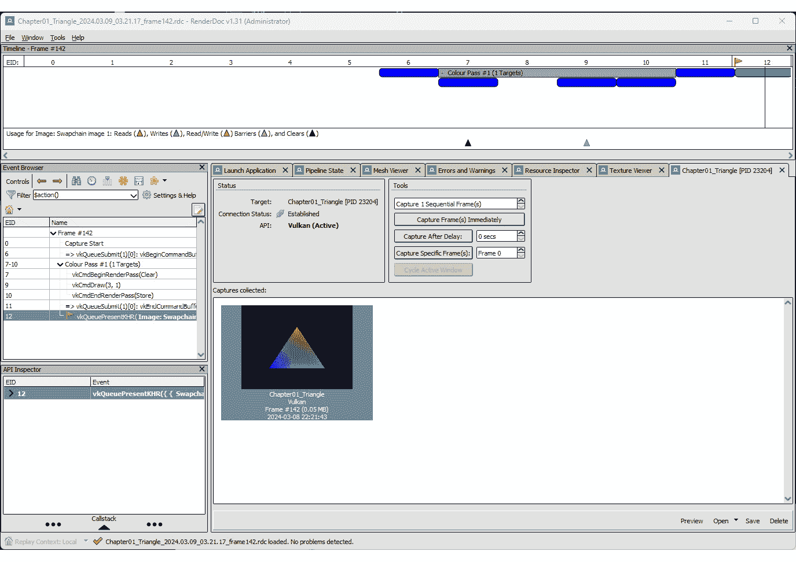
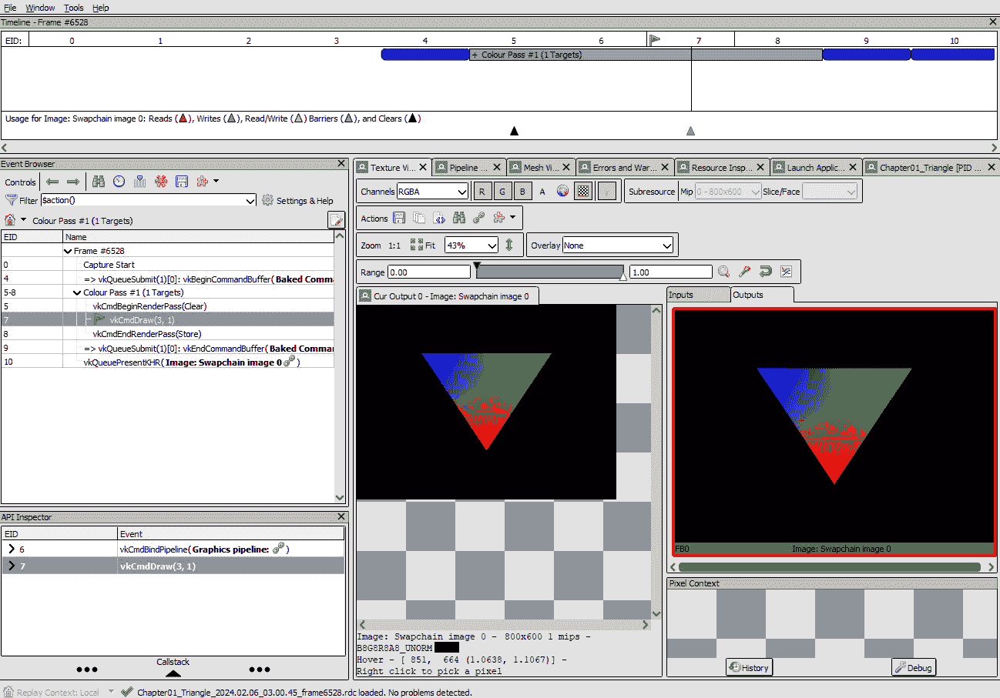
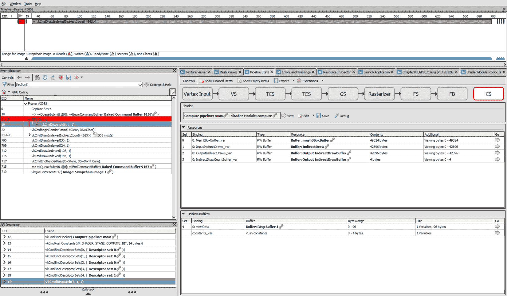
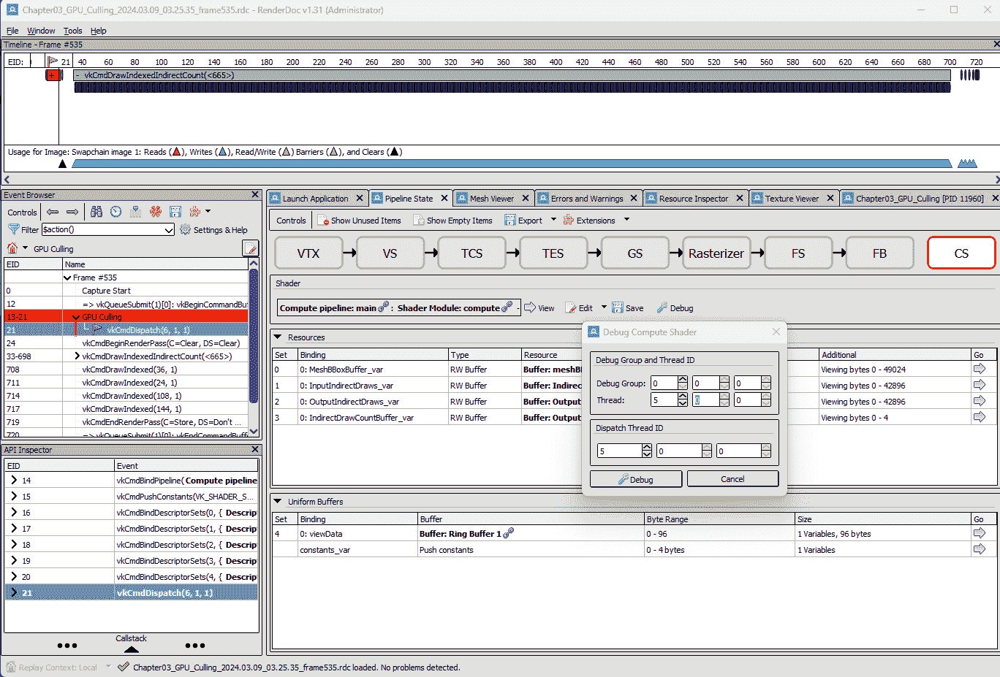
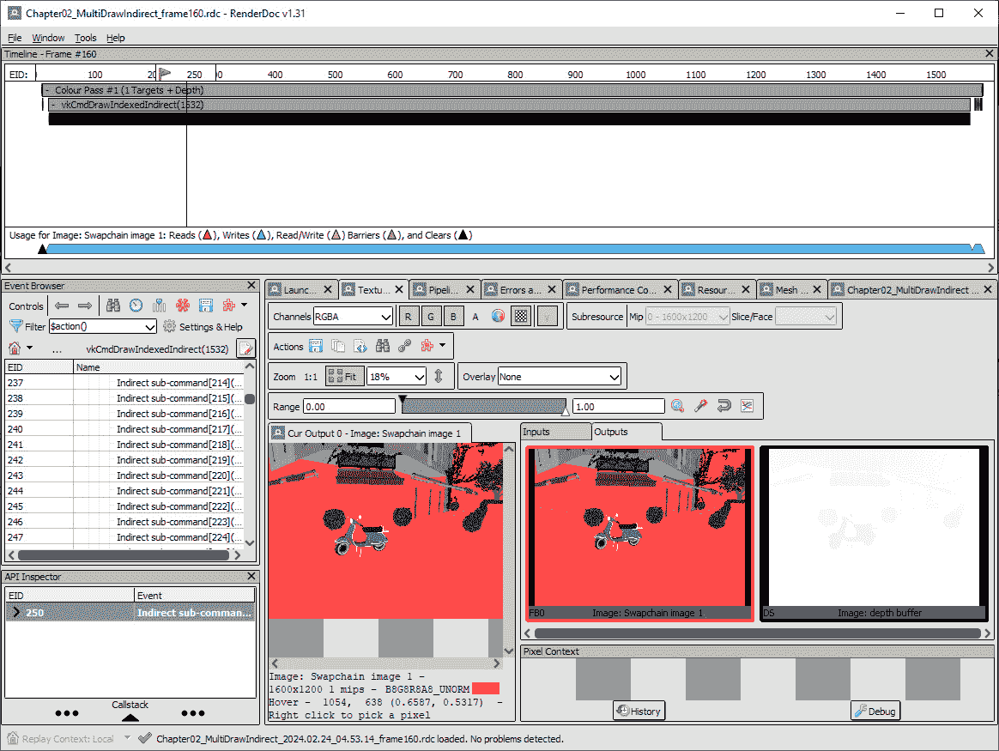
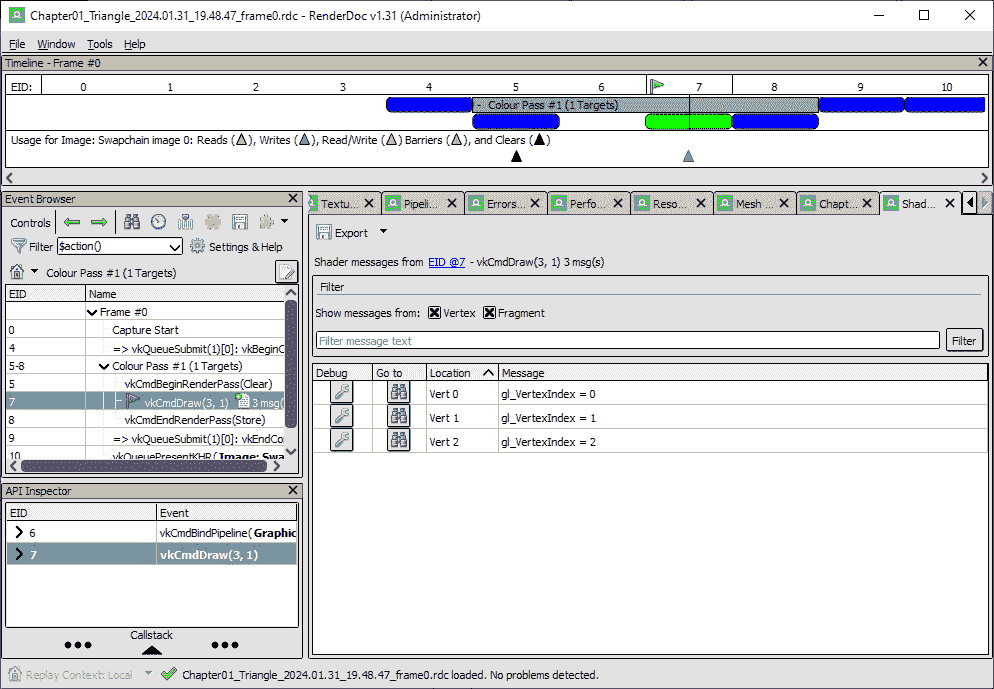
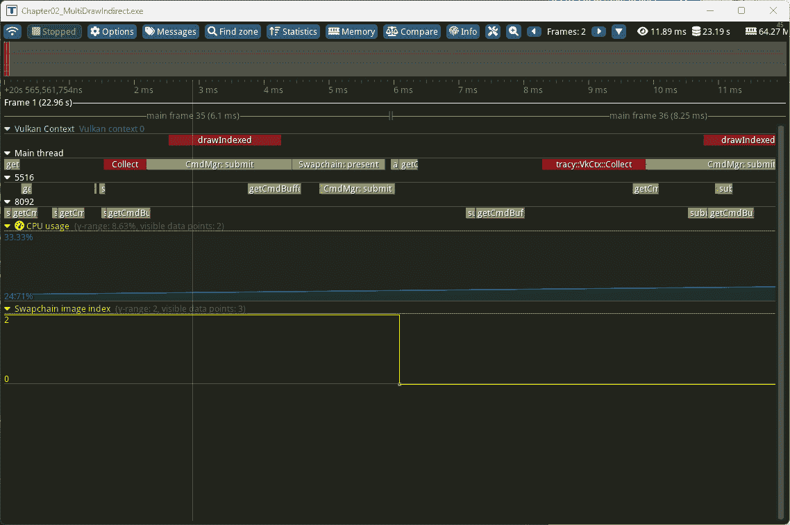

# 9

# 调试和性能测量技术

调试失败和逆向工程实现，以及测量系统一旦编写完成后的性能，与编写新代码一样重要。Vulkan 是一个庞大而复杂的 API，而且比以往任何时候都更需要知道如何调试它。在本章中，我们将探讨几个关于如何调试和检查你的实现的方法。我们还将演示如何在屏幕上显示图像后如何测量你的实现性能。毕竟，图形编程的全部内容都是从硬件中提取最后一滴性能，而 Vulkan 就是为了帮助你做到这一点而设计的。

在本章中，我们将涵盖以下主要主题：

+   帧调试

+   为方便调试命名 Vulkan 对象

+   在 Vulkan 中从着色器打印值

+   截获验证层消息

+   从着色器检索调试信息

+   使用时间戳查询在 Vulkan 中测量性能

# 技术要求

对于这一章，你需要确保你已经安装了 VS 2022 以及 Vulkan SDK。请查阅**第一章***技术要求*部分下的**Vulkan 核心概念**，以获取设置细节。此外，你还需要 RenderDoc 和 Tracy 来编写这一章。下载和安装这些工具的步骤将在本章相应的菜谱中提供。

# 帧调试

捕获和回放帧对于调试图形应用程序非常重要。与实时捕获不同，实时捕获是在应用程序运行时捕获并显示结果，而捕获意味着记录发送到 GPU 的所有命令及其数据。这包括所有绘制调用、着色器、纹理、缓冲区以及其他用于渲染帧的资源。回放帧意味着再次执行这些记录的命令。帧回放是调试的一个强大功能，因为它允许开发者逐步仔细检查渲染过程，并确切地看到每个阶段发生的情况。如果出现错误或图形故障，帧回放可以帮助确定错误发生的确切位置和原因。有多种帧调试工具，如 RenderDoc、PIX、NVIDIA 的 Nsight Graphics 和 AMD Radeon GPU Profiler。

在这个菜谱中，我们将重点关注如何使用**RenderDoc**，因为它开源、跨平台，并且几乎在所有 GPU 上都能工作。

## 准备工作

作为第一步，你需要从[`renderdoc.org/builds`](https://renderdoc.org/builds)下载 RenderDoc。

RenderDoc 的 UI 包含以下主要组件：

+   **时间线**：通常位于 RenderDoc 用户界面的顶部行。时间线提供了您捕获的帧中发生的所有 API 调用（事件）的图形表示。它使用颜色编码来指示不同类型的事件（如绘制调用或计算调度），这使得您能够轻松地获得帧中发生情况的总体概述。您可以在时间线中选择任何事件，在 UI 左侧的**事件浏览器**和 UI 右侧的各个选项卡中查看更多详细信息。

+   **事件浏览器**：位于 UI 的左侧，**事件浏览器**提供了您帧中所有事件的详细、分层视图。它显示了 API 调用的顺序，并允许您轻松地浏览它们。当您在**事件浏览器**中选择一个事件时，RenderDoc 将在时间线中突出显示相应的事件，并更新 UI 右侧的选项卡，以显示与该事件相关的信息。

    +   **选项卡**（**纹理查看器**、**网格查看器**、**管线状态**等）：这些选项卡位于 UI 的右侧，并提供有关当前选中事件的详细信息。每个选项卡都专注于渲染过程中的不同方面：

    +   **纹理查看器**：此选项卡允许您查看您的帧中使用的所有纹理。您可以检查每个纹理的属性，可视化其内容，并查看它们在您的着色器中的使用方式。

    +   **网格查看器**：此选项卡提供了对由绘制调用使用的顶点和索引缓冲区的视觉和数值视图。您可以检查原始缓冲区数据，查看生成的几何形状，并查看顶点如何通过您的顶点着色器进行变换。

    +   **管线状态**：此选项卡显示了所选事件的 GPU 管线完整状态。您可以看到所有已绑定资源（如缓冲区和纹理），检查正在使用的着色器，并查看各个管线阶段的配置。

    *图 9**.1*显示了带有打开用于检查的捕获帧的 RenderDoc 主 UI 元素。



图 9.1 – RenderDoc 主屏幕

在下一节中，我们将演示如何使用来自*第一章*，*Vulkan 核心概念*和*第三章*，*实现* *GPU 驱动渲染*的执行文件使用 RenderDoc。

## 如何做到这一点…

使用 RenderDoc 捕获帧（或多个帧）可以通过编程方式或交互方式完成，使用用户界面。以下步骤将解释如何使用 RenderDoc 的用户界面从您的应用程序中捕获帧：

1.  作为第一步，你可以在**启动应用程序**标签中选择要启动的应用程序。一旦应用程序启动，点击**立即捕获帧(s**)。这将捕获应用程序的当前帧，我们可以检查它。一旦捕获了帧，双击它将打开它以进行检查。你还可以将帧保存到磁盘上以供以后打开。

1.  在捕获之后，我们可以在 `vkCmdDraw` (EID 7) 中选择绘制调用。一旦选择，你将在**纹理查看器**标签中看到此绘制调用所使用的所有输入和输出纹理，如图 *图 9.2* 所示。

1.  当你对探索网格数据感兴趣时，**网格查看器**标签是你的首选工具。此功能提供了对输入和输出顶点数据的全面视图，有助于更深入地理解你的网格结构。假设有一个特定的顶点让你感到困扰，或者你只是想更好地理解其行为。为了实现这一点，你需要选择相关的顶点。然后右键单击将显示一个名为**调试此顶点**的选项。选择此选项将带你到渲染你的网格所使用的顶点着色器。请注意，着色器的源代码只有在 SPIR-V 生成时带有调试符号才会可用。



图 9.2 – RenderDoc 纹理查看器

1.  **管线状态**标签是 RenderDoc UI 中的关键组件。它提供了对图形管线中各个阶段及其状态的广泛视图，作为分析调试渲染过程的有力工具。在顶点着色器阶段，你可以检查应用于每个顶点的操作。这包括将顶点定位在正确的 3D 空间中的变换，以及确定顶点颜色或纹理坐标的计算。你还可以选择**视图着色器**来检查在此绘制调用期间使用的着色器源代码。继续到片段着色器阶段，**管线状态**标签允许你仔细检查每个片段（潜在的像素）是如何处理的。这包括基于光照、纹理和/或其它因素确定其最终颜色的操作。调试此阶段可以帮助你解决与颜色计算、纹理映射等问题相关的问题。

1.  要调试特定的片段，你需要在**纹理查看器**中选择一个像素。你可以通过点击你感兴趣的像素来完成此操作。此像素的值代表该特定像素的片段着色器的输出。选择像素后，你可以调试生成它的片段着色器。为此，在**像素上下文**窗口中右键单击像素并选择显示的**调试**按钮。这将打开一个新的**着色器查看器**标签，在那里你可以逐行执行着色器代码。对于每一行，你可以检查变量的值并查看它们在着色器执行过程中的变化。

计算着色器阶段用于在 GPU 上执行通用计算。在这里，您可以检查和调试与渲染无关的操作，例如物理模拟或剔除。在下一步中，我们将演示如何使用来自*第三章*，*实现 GPU 驱动渲染*，*使用计算着色器进行视锥剔除*食谱的可执行文件。

1.  要了解如何调试计算着色器，我们首先需要从 RenderDoc 启动`Chapter03_GPU_Culling.exe`。一旦应用程序启动，我们将进行捕获。接下来，导航到`vkCmdDispatch`调用。在**事件浏览器**中选择此调用将在**管道状态**选项卡中显示此调用使用的相关管道，如图*图 9*.3*所示：



图 9.3 – 在 RenderDoc 中看到的计算着色器

1.  当涉及到剔除时，我们启动与网格数量相同的线程。然后，在 GPU 上，我们简单地丢弃任何不在视锥体内的网格。假设我们感兴趣的是了解为什么网格编号 5 在视锥体之外。为了调试这个问题，点击**调试**按钮并在**调试计算着色器**窗口中指定线程 ID。此窗口允许您指定全局线程 ID 或线程组和局部线程 ID。在我们的情况下，要调试网格编号 5，您需要在全局 X 维度中输入 5（在**调度线程 ID**部分）。一旦您点击**调试**按钮，将启动一个包含着色器源代码的新窗口。在这里，您可以检查和调试计算着色器，使您能够了解为什么特定的网格被丢弃。这个过程如图*图 9*.4*所示：



图 9.4 – 在 RenderDoc 中调试计算着色器

这个食谱是对*一个*帧调试工具的简要介绍。请注意，其他工具也存在并且以不同的方式运行。

## 参见

为了全面了解如何使用 RenderDoc，我们强烈建议观看以下视频教程。这些教程将为您提供详细的见解：

+   [`youtu.be/7eznPe3TyAY`](https://youtu.be/7eznPe3TyAY)

+   [`youtu.be/EMFG5wmng-M`](https://youtu.be/EMFG5wmng-M)

+   [`renderdoc.org/docs/getting_started/quick_start.html`](https://renderdoc.org/docs/getting_started/quick_start.html)

# 为 Vulkan 对象命名以方便调试

使用 Vulkan 意味着您需要创建和管理许多 Vulkan 对象。默认情况下，这些对象通过其句柄，一个数字 ID 来标识。虽然数字 ID 从应用程序的角度来看很容易维护，但对人类来说没有意义。考虑以下由验证层提供的错误消息：

```cpp
VUID-VkImageViewCreateInfo-imageViewType-04974 ] Object 0: handle = 0xcb3ee80000000007, type = VK_OBJECT_TYPE_IMAGE; | MessageID = 0xc120e150 | vkCreateImageView(): Using pCreateInfo->viewType VK_IMAGE_VIEW_TYPE_2D and the subresourceRange.layerCount VK_REMAINING_ARRAY_LAYERS=(2) and must 1 (try looking into VK_IMAGE_VIEW_TYPE_*_ARRAY). The Vulkan spec states: If viewType is VK_IMAGE_VIEW_TYPE_1D, VK_IMAGE_VIEW_TYPE_2D, or VK_IMAGE_VIEW_TYPE_3D; and subresourceRange.layerCount is VK_REMAINING_ARRAY_LAYERS, then the remaining number of layers must be 1
```

前面的信息很有用，但找到创建错误层数量的图像很困难。

如果我们给这个图像起一个名字，验证层消息将变为以下内容：

```cpp
VUID-VkImageViewCreateInfo-imageViewType-04974 ] Object 0: handle = 0xcb3ee80000000007, name = Image: Swapchain image 0, type = VK_OBJECT_TYPE_IMAGE; | MessageID = 0xc120e150 | vkCreateImageView(): Using pCreateInfo->viewType VK_IMAGE_VIEW_TYPE_2D and the subresourceRange.layerCount VK_REMAINING_ARRAY_LAYERS=(2) and must 1 (try looking into VK_IMAGE_VIEW_TYPE_*_ARRAY). The Vulkan spec states: If viewType is VK_IMAGE_VIEW_TYPE_1D, VK_IMAGE_VIEW_TYPE_2D, or VK_IMAGE_VIEW_TYPE_3D; and subresourceRange.layerCount is VK_REMAINING_ARRAY_LAYERS, then the remaining number of layers must be 1
```

注意，对象的名称现在已成为错误消息的一部分。这使得知道在代码中查找错误位置并修复错误变得容易得多。

在这个菜谱中，你将学习如何使用 Vulkan 扩展为所有 Vulkan 对象赋予可读的或有意义的名称。

## 准备工作

要能够为 Vulkan 对象分配名称，你首先需要启用`VK_EXT_debug_utils`实例扩展。在创建 Vulkan 实例时，需要提供该扩展的名称，可以是字符串`VK_EXT_debug_utils`或使用`VK_EXT_DEBUG_UTILS_EXTENSION_NAME`宏。以下代码片段初始化了一个启用了调试工具的 Vulkan 实例：

```cpp
VkInstance instance_ = VK_NULL_HANDLE;
std::vector<const char *> instanceExtensions = {
  VK_EXT_DEBUG_UTILS_EXTENSION_NAME};
const VkInstanceCreateInfo instanceInfo = {
  .sType = VK_STRUCTURE_TYPE_INSTANCE_CREATE_INFO,
  ...
  .enabledExtensionCount = static_cast<uint32_t>(
    instanceExtensions.size()),
  .ppEnabledExtensionNames =
    instanceExtensions.data(),
};
VK_CHECK(vkCreateInstance(&instanceInfo, nullptr,
                          &instance_));
```

现在你已经准备好开始给你的 Vulkan 对象命名了。让我们在下一节中看看如何操作。

## 如何操作...

一旦启用扩展，命名对象的步骤如下：

1.  一旦启用扩展，你可以通过调用`vkSetDebugUtilsObjectNameEXT`函数，为给定句柄的任何 Vulkan 对象添加名称：

    ```cpp
    VkDevice device_; // Valid Vulkan device
    VkObjectType type = VK_OBJECT_TYPE_UNKNOWN;
    std::string name; // human readable name
    const VkDebugUtilsObjectNameInfoEXT
      objectNameInfo = {
        .sType =
          VK_STRUCTURE_TYPE_DEBUG_UTILS_OBJECT_NAME_INFO_EXT,
        .objectType = type,
        .objectHandle =
          reinterpret_cast<uint64_t>(handle),
        .pObjectName = name.c_str(),
    };
    VK_CHECK(vkSetDebugUtilsObjectNameEXT(
      device_, &objectNameInfo));
    ```

    对象类型（`type`）是`VkObject`枚举的值之一，必须与对象的类型匹配（例如，对于 Vulkan 图像，为`VK_OBJECT_TYPE_IMAGE`）。句柄是对象的句柄，需要将其转换为类型`uint64_t`。

1.  此函数仅在扩展也可用时才可用，因此请确保在`#ifdef`块中保护它，并检查是否已为实例启用了扩展。

    在仓库中，`VulkanCore::Context:: setVkObjectname` 方法将这个函数封装在一个模板类中，并为你进行类型转换。此外，值得一提的是，名称不仅显示在验证错误消息中，它们还出现在帧捕获和调试工具中。



图 9.5 - RenderDoc 中对象名称的显示示例

*图 9.5* 展示了在 RenderDoc 中对象名称的显示方式。在截图上，其中一个 swapchain 图像被命名为**Image: Swapchain image 1**。深度缓冲区被命名为**Image:** **depth buffer**。

# 在 Vulkan 中从着色器打印值

作为图形程序员，我们所有人都必须同意，调试着色器是我们工作中最令人沮丧的方面之一。尽管一些帧捕获软件提供了着色器调试功能，但仍然可能很难找到你想要调试的确切像素，或者你可能需要关于一组像素的另一条信息，而不仅仅是逐个检查它们。

幸运的是，Vulkan 提供了一种直接从着色器打印值的方法。信息可以直接在 RenderDoc 上检查，例如，或从验证错误消息中检索（有关如何操作的更多详细信息，请参阅*从着色器检索调试信息*菜谱）。

在这个菜谱中，你将学习如何使用类似于`printf`的简单函数从你的着色器代码中打印值。

## 准备工作

要利用从着色器中打印值的功能，启用`VK_KHR_shader_non_semantic_info`设备扩展是先决条件。这可以通过在创建 Vulkan 设备时将`VK_KHR_shader_non_semantic_info`字符串或`VK_KHR_SHADER_NON_SEMANTIC_INFO_EXTENSION_NAME`宏添加到`VkDeviceCreateInfo`结构中来实现。这个过程在以下代码片段中得到了演示：

```cpp
VkPhysicalDevice physicalDevice; // Valid Vulkan
                                 // Physical Device
const std::vector<const char *> deviceExtensions =
  {VK_KHR_SHADER_NON_SEMANTIC_INFO_EXTENSION_NAME};
const VkDeviceCreateInfo dci = {
  .sType = VK_STRUCTURE_TYPE_DEVICE_CREATE_INFO,
  ...
  .enabledExtensionCount = static_cast<uint32_t>(
    deviceExtensions.size()),
  .ppEnabledExtensionNames = deviceExtensions.data(),
};
VK_CHECK(vkCreateDevice(physicalDevice_, &dci,
  nullptr, &device_));
```

现在扩展已经启用，让我们看看直接从着色器中打印值的步骤。

## 如何操作...

一旦扩展被启用，你还需要将一个 GLSL 扩展添加到你的着色器中：

1.  在你的着色器代码中启用`GL_EXT_debug_printf`扩展：

    ```cpp
    #version 460
    debugPrintfEXT in your shader code whenever you would like to print values. In the following code snippet, we are printing the value of gl_VertexIndex:

    ```

    debugPrintfEXT("gl_VertexIndex = %i", gl_VertexIndex);

    ```cpp

    ```

1.  该函数还提供了向量值的指定符。以下是一个打印`vec3`变量所有分量的调用示例：

    ```cpp
    vec3 position;
    debugPrintfEXT("%2.3v3f", position);
    ```

    前面的函数调用以浮点数形式打印`position`的`x`、`y`和`z`分量，保留 3 位小数。

这是*第一章*，*Vulkan 核心概念*中使用的顶点着色器的简略版本，增加了`debugPrintfEXT`调用以打印`gl_VertexIndex`值：

```cpp
#version 460
#extension GL_EXT_debug_printf: enable
layout(location = 0) out vec4 outColor;
vec2 positions[3] = vec2[]( ... );
vec3 colors[3] = vec3[]( ... );
void main() {
    gl_Position = vec4(positions[gl_VertexIndex], 0.0, 1.0);
    debugPrintfEXT(«gl_VertexIndex = %i», gl_VertexIndex);
    outColor = vec4(colors[gl_VertexIndex], 1.0);
}
```

*图 9.6*展示了如何在 RenderDoc 中检查打印的值：



图 9.6 – RenderDoc 中可见的 debugPrintfEXT 值

# 截获验证层消息

在某些情况下，验证错误如此之多，以至于无法知道问题的原因。因此，当检测到错误时立即中断程序的执行将是非常理想的，尤其是在调试应用程序时。调试实用工具扩展（`VK_EXT_debug_utils`）允许你在检测到错误时安装一个回调函数。

在这个菜谱中，你将学习如何安装一个调试回调来截获验证层发出的错误消息，并使你的调试会话更加高效。

## 准备工作

要能够在错误发生时设置回调，你需要启用`VK_EXT_debug_utils`扩展。请参考*命名 Vulkan 对象以简化调试*菜谱中的*准备工作*部分，了解如何在创建 Vulkan 实例时启用此扩展。

## 如何操作...

在安装和使用回调之前，你需要定义一个。之后，一旦扩展被启用并且创建了一个 Vulkan 实例对象，你需要使用特殊的 Vulkan 函数来安装回调：

1.  定义一个具有以下签名的回调函数：

    ```cpp
    typedef VkBool32(
      VKAPI_PTR
         PFN_vkDebugUtilsMessengerCallbackEXT)(
      VkDebugUtilsMessageSeverityFlagBitsEXT
        messageSeverity,
      VkDebugUtilsMessageTypeFlagsEXT messageTypes,
      const VkDebugUtilsMessengerCallbackDataEXT
         pCallbackData,
      void *pUserData);
    ```

1.  这是存储库中提供的用作回调的函数：

    ```cpp
    VkBool32 VKAPI_PTR debugMessengerCallback(
      VkDebugUtilsMessageSeverityFlagBitsEXT
        messageSeverity,
      VkDebugUtilsMessageTypeFlagsEXT messageTypes,
      const VkDebugUtilsMessengerCallbackDataEXT
         pCallbackData,
      void *pUserData) {
      if (
        messageSeverity &
        (VK_DEBUG_UTILS_MESSAGE_SEVERITY_ERROR_BIT_EXT)) {
        LOGE("debugMessengerCallback : MessageCode "
             "is %s & Message is %s",
             pCallbackData->pMessageIdName,
             pCallbackData->pMessage);
    #if defined(_WIN32)
        __debugbreak();
    #else
        raise(SIGTRAP);
    #endif
      } else if (
        messageSeverity &
        (VK_DEBUG_UTILS_MESSAGE_SEVERITY_ERROR_BIT_EXT)) {
        LOGW("debugMessengerCallback : MessageCode "
             "is %s & Message is %s",
             pCallbackData->pMessageIdName,
             pCallbackData->pMessage);
      } else {
        LOGI("debugMessengerCallback : MessageCode "
             "is %s & Message is %s",
             pCallbackData->pMessageIdName,
             pCallbackData->pMessage);
      }
      return VK_FALSE;
    }
    ```

    您的回调可以根据消息的类型（一般消息、验证消息、性能消息）或其严重性（详细、信息、警告或错误）来决定如何处理消息。`pCallbackData`参数（类型为`VkDebugUtilsMessengerCallbackDataEXT`）提供了大量您可以使用的信息，而`pUserData`参数可能包含您自己的数据，该数据在安装回调时提供。

1.  通过创建`VkDebugUtilsMessengerCreateInfoEXT`结构体的实例，在您拥有有效的 Vulkan 实例后安装回调：

    ```cpp
    VkInstance instance; // Valid Vulkan Instance
    VkDebugUtilsMessengerEXT messenger =
      VK_NULL_HANDLE;
    const VkDebugUtilsMessengerCreateInfoEXT messengerInfo = {
      .sType =
        VK_STRUCTURE_TYPE_DEBUG_UTILS_MESSENGER_CREATE_INFO_EXT,
      .flags = 0,
      .messageSeverity =
        VK_DEBUG_UTILS_MESSAGE_SEVERITY_VERBOSE_BIT_EXT |
        VK_DEBUG_UTILS_MESSAGE_SEVERITY_INFO_BIT_EXT |
        VK_DEBUG_UTILS_MESSAGE_SEVERITY_WARNING_BIT_EXT |
        VK_DEBUG_UTILS_MESSAGE_SEVERITY_ERROR_BIT_EXT,
      .messageType =
        VK_DEBUG_UTILS_MESSAGE_TYPE_GENERAL_BIT_EXT |
        VK_DEBUG_UTILS_MESSAGE_TYPE_VALIDATION_BIT_EXT,
      .pfnUserCallback = &debugMessengerCallback,
      .pUserData = nullptr,
    };
    VK_CHECK(vkCreateDebugUtilsMessengerEXT(
      instance, &messengerInfo, nullptr, &messenger));
    ```

1.  确保在完成您的 Vulkan 实例后销毁信使。这是必要的，因为在 Vulkan 中，任何创建的资源在不再需要时都需要显式销毁，以避免内存泄漏并释放系统资源：

    ```cpp
    vkDestroyDebugUtilsMessengerEXT(instance_,
                                    messenger_,
                                    nullptr);
    ```

调试回调非常有用，应该始终使用。确保尽快拥有一个，并了解如何使用它。

# 从着色器中检索调试信息

图形编程中最困难的任务之一是编写测试。无论是烟雾测试、集成测试、端到端测试还是单元测试，您如何确保您引擎的输出确实是您所期望的？除了简单的测试外，类似于截图的测试类型容易遇到几个问题。一个特别困难的问题是测试着色器代码——因为您通常无法访问硬件，测试着色器代码非常痛苦。

幸运的是，Vulkan 有一个机制，允许您通过`debugPrintfEXT`函数直接从验证层捕获着色器输出的值。这个机制并不新颖，可以通过`Vulkan SDK 1.3.275`启用，`VK_EXT_layer_settings`实例扩展允许您直接从您的应用程序中启用此机制，而无需手动编辑任何其他配置。

在这个菜谱中，您将学习如何启用此功能并从着色器中检索`debugPrintfEXT`调用的输出。

## 准备工作

对于这个菜谱，您需要`Vulkan SDK 版本 1.3.275`。尽管存储库中的所有代码都已使用`SDK 版本 1.3.265`进行测试，但`VK_EXT_layer_settings`扩展仅在`SDK 1.3.275`中可用。

## 如何操作...

启用此功能很容易，只需几个步骤。让我们来看看它们：

1.  `VK_EXT_layer_settings`扩展为您提供了更改单个层设置的方法。每个设置都必须使用`VKLayerSettingEXT`结构体的实例设置，该结构体定义如下：

    ```cpp
    typedef struct VkLayerSettingEXT {
      const char *pLayerName;
      const char *pSettingName;
      VkLayerSettingTypeEXT type;
      uint32_t valueCount;
      const void *pValues;
    } VkLayerSettingEXT;
    ```

1.  要启用允许您接收着色器输出的功能，您需要启用`VK_LAYER_KHRONOS_validation`层的几个设置。让我们首先创建一个包含层名称的常量，我们将为此更改设置：

    ```cpp
    const std::string layer_name =
      "VK_LAYER_KHRONOS_validation";
    ```

1.  现在我们创建数组来存储我们将使用的设置值：

    ```cpp
    const std::array<const char *, 1>
      setting_debug_action = {"VK_DBG_LAYER_ACTION_BREAK"};
    const std::array<const char *, 1>
      setting_gpu_based_action = {
        "GPU_BASED_DEBUG_PRINTF"};
    const std::array<VkBool32, 1>
      setting_printf_to_stdout = {VK_TRUE};
    ```

    将`debug_action`设置更改为`VK_DBG_LAYER_ACTION_BREAK`，以便每当从`debugPrintfEXT`收到新值时，都会调用回调。将`validate_gpu_based`设置设置为接收`debugPrintEXT`值（`GPU_BASED_DEBUG_PRINTF`）和`printf_to_stdout`设置（设置为`VK_FALSE`）指定我们不想将这些值发送到`stdout`；我们希望在回调中接收它们。

1.  我们为每个想要更改的设置创建一个`VkLayerSettingEXT`结构的实例。在这里，我们正在更改`layer_name`层的以下设置：`debug_action`、`validate_gpu_based`和`printf_to_stdout`：

    ```cpp
    const array<VkLayerSettingEXT, 3> settings = {
      VkLayerSettingEXT{
        .pLayerName = layer_name.c_str(),
        .pSettingName = "debug_action",
        .type = VK_LAYER_SETTING_TYPE_STRING_EXT,
        .valueCount = 1,
        .pValues = setting_debug_action.data(),
      },
      VkLayerSettingEXT{
        .pLayerName = layer_name.c_str(),
        .pSettingName = "validate_gpu_based",
        .type = VK_LAYER_SETTING_TYPE_STRING_EXT,
        .valueCount = 1,
        .pValues = setting_gpu_based_action.data(),
      },
      VkLayerSettingEXT{
        .pLayerName = layer_name.c_str(),
        .pSettingName = "printf_to_stdout",
        .type = VK_LAYER_SETTING_TYPE_BOOL32_EXT,
        .valueCount = 1,
        .pValues = setting_printf_to_stdout.data(),
      },
    };
    ```

1.  然后将这些设置添加到`VkLayerSettingsCreateInfoEXT`结构的实例中：

    ```cpp
    const VkLayerSettingsCreateInfoEXT
      layer_settings_ci = {
        .sType =
          VK_STRUCTURE_TYPE_LAYER_SETTINGS_CREATE_INFO_EXT,
        .pNext = nullptr,
        .settingCount =
          static_cast<uint32_t>(settings.size()),
        .pSettings = settings.data(),
    };
    ```

1.  最后，我们将此实例添加到创建 Vulkan 实例时使用的`VkInstanceCreateInfo`结构的`pNext`链中：

    ```cpp
    const VkInstanceCreateInfo instanceInfo = {
      .sType = VK_STRUCTURE_TYPE_INSTANCE_CREATE_INFO,
      .pNext = &layer_settings_ci,
      ...
    };
    VK_CHECK(vkCreateInstance(&instanceInfo, nullptr,
                              &instance_));
    ```

当*第一章*“Vulkan 核心概念”启用时，回调接收到的消息大致如下：

```cpp
Validation Information: [ WARNING-DEBUG-PRINTF ] | MessageID = 0x76589099 | vkQueueSubmit():  gl_VertexIndex = 1
```

可以启用详细输出，在这种情况下，前面的消息将看起来像这样：

```cpp
Validation Information: [ WARNING-DEBUG-PRINTF ] Object 0: handle = 0x26e6bf17bd0, type = VK_OBJECT_TYPE_QUEUE; | MessageID = 0x76589099 | vkQueueSubmit():  Command buffer (Command buffer:  0)(0x26e6c6613b0). Draw Index 0\. Pipeline (Graphics pipeline: )(0x26e78d000d0). Shader Module (Shader Module: )(0x26e73b68450). Shader Instruction Index = 92.  gl_VertexIndex = 1 Debug shader printf message generated at line 21.
21:     outColor = vec4(colors[gl_VertexIndex], 1.0);
```

希望这个功能能帮助你编写测试，测试那些以前甚至无法测试的代码的隐蔽角落。

# 使用时间戳查询在 Vulkan 中测量性能

交叉平台方式以最小侵入性测量 CPU 和 GPU 工作负载的性能是非常宝贵的。**Tracy 分析器**允许你这样做，并且使用起来非常简单，全部都在一个小型的 C++库中。

在这个菜谱中，你将学习如何将 Tracy 分析器集成到你的应用程序中，并对其进行调试以收集 GPU 性能信息。

## 准备工作

首件事是下载 Tracy 从[`github.com/wolfpld/tracy`](https://github.com/wolfpld/tracy)，并将其包含到你的项目中。你还应该下载 Tracy 客户端/服务器以收集和检查数据。

## 如何操作...

使用 Tracy 对代码进行调试以方便使用只需要几个步骤。为了能够收集关于 GPU 性能的数据，你需要一个 Tracy/Vulkan 上下文以及一个用于校准时间戳的专用命令缓冲区。之后，对代码进行调试就变得简单直接：

1.  首先，将 Tracy 头文件包含到你的应用程序中：

    ```cpp
    #include <tracy/Tracy.hpp>
    #include <tracy/TracyVulkan.hpp>
    ```

1.  第二，你需要一个 Tracy/Vulkan 上下文，可以使用 Tracy 库提供的宏来创建。有两种选择：一种创建带有校准时间戳的上下文，另一种创建不带校准时间戳的上下文。Vulkan 提供了关联不同时间域操作发生时间的方法。没有校准，Tracy 只能猜测设备上的操作相对于在 CPU 上发生的操作发生的时间。以下是如何初始化更适合你需求的上下文的方法：

    ```cpp
    VkPhysicalDevice physicalDevice;
    VkDevice device;
    int graphicsQueueIndex;
    VkCommandBuffer commandBuffer;
    #if defined(VK_EXT_calibrated_timestamps)
    TracyVkCtx tracyCtx_ = TracyVkContextCalibrated(
      physicalDevice, device, graphicsQueueIndex,
      commandBuffer,
      vkGetPhysicalDeviceCalibrateableTimeDomainsKHR,
      vkGetCalibratedTimestampsKHR);
    #else
    TracyVkCtx tracyCtx_ = TracyVkContext(
      physicalDevice, device, graphicsQueueIndex,
      commandBuffer);
    #endif
    ```

    这里使用的命令缓冲区是专用的，它不应该与其他任何操作共享。

1.  收集 GPU 信息现在变得容易。你所要做的就是使用 Tracy 提供的宏之一，例如以下内容：

    ```cpp
    TracyVkZone(tracyCtx_, commandBuffer, "Model upload");
    ```

    注意，在这个宏中使用的 `commandBuffer` 变量是你希望从其中捕获数据的命令缓冲区，即正在记录的命令缓冲区。这个命令缓冲区与在构建 Tracy 上下文时提供的命令缓冲区不同。

    这个宏应该在你想仪器化你的 GPU 执行时添加。例如，你可能想在发出绘制调用（如 `vkCmdDraw`）的作用域中添加这个宏。这样你将获得关于该命令在 GPU 上处理的详细信息。在仓库中，你可以找到这个宏的使用示例。

1.  Tracy 还提供了允许你使用颜色或名称标识区域的宏，例如 `TracyVkNamedZone`、`TracyVkNamedZoneC` 等。

    有时，你需要告诉 Tracy 通过调用 `TracyVkCollect` 来收集命令缓冲区的时间戳。这个宏可以在帧的末尾调用：

    ```cpp
    TracyVkCollect(tracyCtx_, commandBuffer);
    ```

1.  在退出渲染循环并在关闭应用程序之前，你需要通过调用 `TracyVkDestroy` 来销毁 Tracy 上下文：

    ```cpp
    TracyVkDestroy(tracyCtx_);
    ```

1.  最后一步是在定义了 `TRACY_ENABLE` 的情况下构建你的项目。如果你使用 CMake，可以在生成项目构建文件时添加以下参数：

    ```cpp
    -DTRACY_ENABLE=1
    ```

    现在你必须做的就是编译你的代码并运行它。确保在开始之前启动 Tracy 客户端并建立连接。Tracy 客户端将自动检测你的应用程序并在启动时开始收集数据。

    如果你使用 Tracy 仪器化你的代码以收集 CPU 数据，你可以使用例如 `ZoneScoped`、`ZoneScopedC` 等宏来实现，收集后你将看到并排的结果。*图 9.7* 展示了从 *第二章*，*使用现代 Vulkan* 中捕获的一个可执行文件的结果。注意截图中的 CPU 和 GPU 区域。

    

图 9.7 – Tracy 分析器捕获，GPU 和 CPU 信息并排显示

Tracy 是一个非常易于使用的库，它提供了关于你的应用程序的无价信息。它提供了纳秒级分辨率，以及 CPU 和 GPU 性能跟踪，并且是跨平台的。如果你在代码库中还没有其他性能测量库或设施，Tracy 可以让你迅速开始使用。
