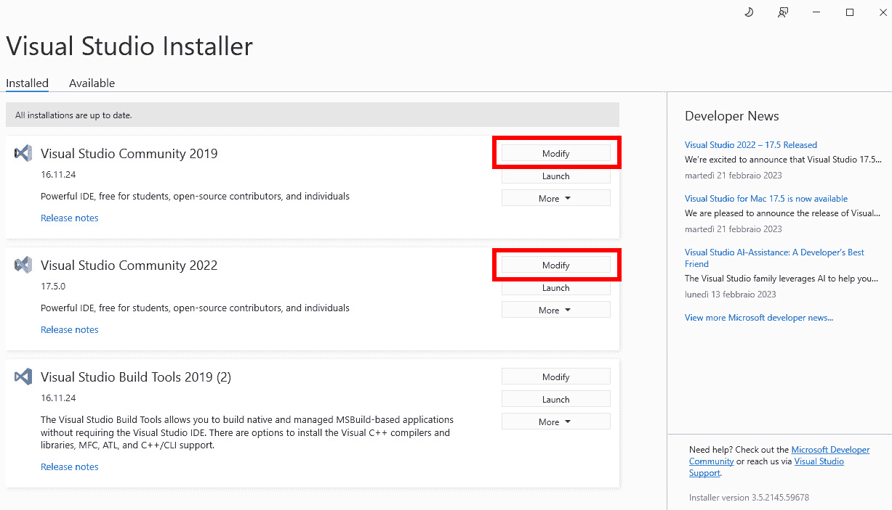
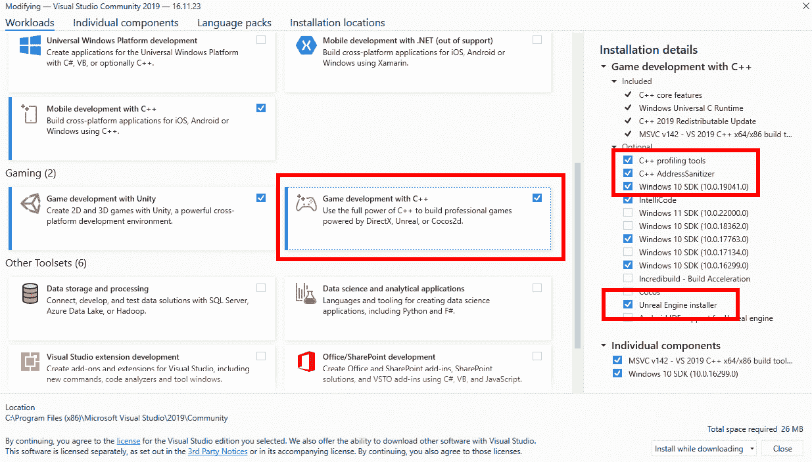
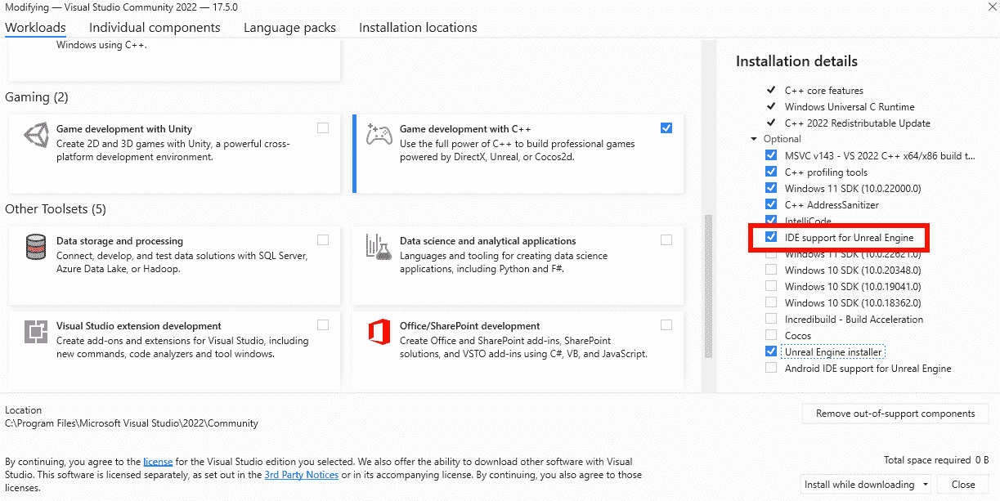
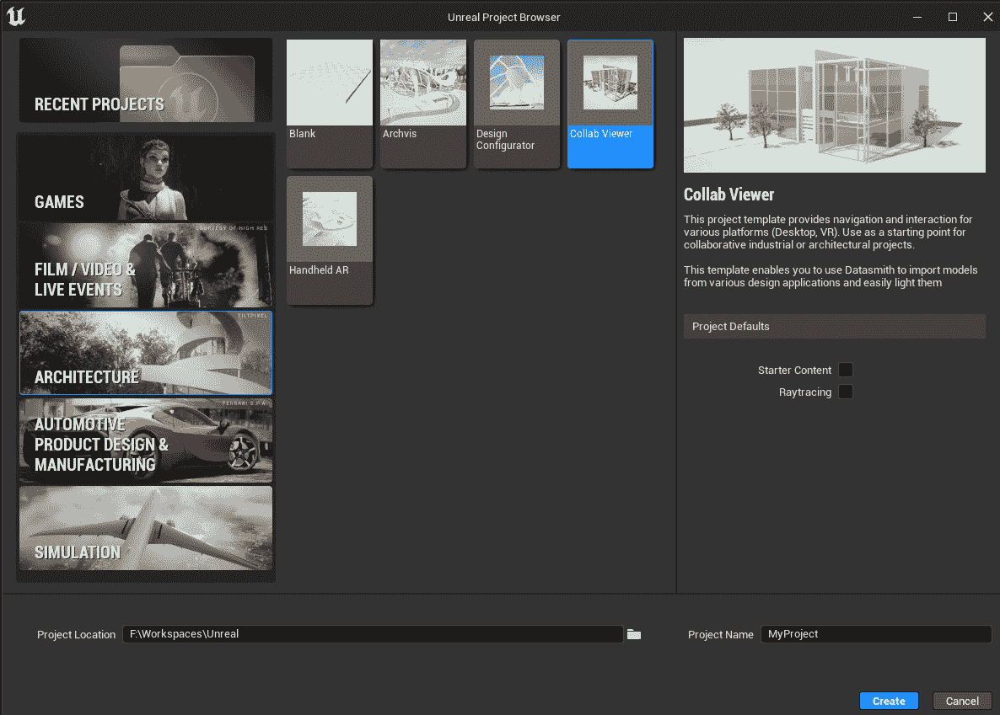
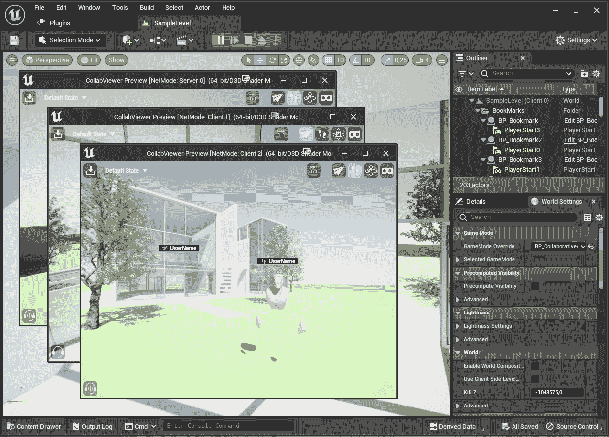

# 开始多人游戏开发

欢迎来到 Unreal Engine 多人游戏开发的奇妙世界！我非常激动您选择了我和我的书作为您在这个有时令人畏惧的技术领域的指南；我保证我会尽我所能使这次旅程尽可能轻松和有趣。

在本书中，您将学习如何从头开始创建 Unreal Engine 多人游戏，处理客户端/服务器逻辑，管理 AI 对手，测试和配置网络，并利用可用的云服务。到结束时，您将精通创建网络视频游戏，并对许多陷阱以及如何避免它们有深入的了解。

在本章中，您将了解多人游戏是什么，其起源以及今天可用的不同类型的多人游戏。此外，您还将探索用于多人游戏的技术如何在游戏之外的应用场景中得到应用。

在本章中，我将讨论以下主题：

+   介绍多人游戏

+   理解多人游戏类别

+   探索游戏玩法变化

+   多人技术仅仅是针对游戏吗？

# 技术要求

如您所知，Unreal Engine 编辑器在硬件要求方面可能非常严格，但请不要害怕。幸运的是，这本书更侧重于游戏编程，而不是实时视觉效果。

在这里，让我们看看硬件和软件要求，以及您在跟随本书时需要具备的一些先决知识。

## 先决知识

在您开始之前，我有责任提醒您，这本书是为那些已经对 Unreal Engine 开发有一定了解的人准备的。因此，您应该已经熟悉以下主题：

+   Epic Games 启动器和 Unreal Engine 编辑器

+   Blueprint 类和 Blueprint 编程

+   使用您选择的 IDE 进行 C++编程

+   对使用 Unreal Engine 的 C++编程有基本的理解。

## 硬件要求

以下是在撰写本书时 Epic Games 官方推荐的一些基本要求；如果您至少拥有以下硬件，您应该在整个章节中保证有一个良好的体验：

+   **Windows 操作系统**:

    +   **操作系统**: Windows 10 64 位版本 1909 修订版.1350 或更高版本，或版本 2004 和 20H2 修订版.789 或更高版本

    +   **处理器**: 四核 Intel 或 AMD，2.5 GHz 或更快

    +   **内存**: 8 GB RAM

    +   **显卡**: 兼容 DirectX 11 或 12 的图形卡

+   **Linux**:

    +   **操作系统**: Ubuntu 22.04

    +   **处理器**: 四核 Intel 或 AMD，2.5 GHz 或更快

    +   **内存**: 32 GB RAM

    +   **显卡**: NVIDIA GeForce 960 GTX 或更高版本，并安装最新的 NVIDIA 二进制驱动程序

    +   **显存**: 8 GB 或更多

+   **macOS**:

    +   **操作系统**: 最新 macOS Ventura

    +   **处理器**: 四核 Intel，2.5 GHz 或更快

    +   **内存**: 8 GB RAM

    +   **显卡**: 兼容 Metal 1.2 的图形卡

在我编写这本书的时候，我使用的以下硬件：

+   **桌面**：

    +   **操作系统**：Windows 10 64 位版本

    +   **处理器**：Intel Core i9 9900K @3.60GHz

    +   **内存**：64 GB RAM

    +   **显卡**：NVIDIA GeForce RTX 3090ti

+   **笔记本电脑**：

    +   **操作系统**：Windows 10 64 位版本

    +   **处理器**：Intel Core i7 9750H @ 2.60GHz

    +   **内存**：16 GB RAM

    +   **显卡**：NVIDIA GeForce RTX 2070

## 软件要求

本书假设您已经在计算机上安装并完全启用了 Epic Games Launcher 和 Unreal Engine 5。

注意

在本书编写时，Unreal Engine 的最新版本是 5.1.1，但您将能够跟随任何比 5.1.1 更新的版本。

此外，您还需要一个支持 C++ 和 Unreal Engine 的 IDE。如果您有一些过去的经验，那么您可能已经安装了 Visual Studio 2019/2022 或 JetBrains Rider；如果没有，您需要在 *第四章* 开始之前安装其中之一，*设置您的第一个* *多人游戏环境*。

注意

本书假设您已经安装了 Visual Studio 2019 或 2022 并完全可用；然而，使用 JetBrains Rider 也是完全可以接受的。

### 设置 Visual Studio 以进行 Unreal Engine 开发

安装 Visual Studio 后，您还需要以下额外组件才能使其与 Unreal Engine 正确工作：

+   **C++ 性能分析工具**

+   **C++ AddressSanitizer**

+   **Windows 10 SDK**

+   **Unreal Engine 安装程序**

要包含这些工具，请按照以下步骤操作：

1.  打开 **Visual Studio 安装程序**。

1.  从您的 Visual Studio 安装中选择 **修改**，选择您将要使用的版本，如图 *图 1*.1* 所示：

图 1.1 – Visual Studio 安装程序

1.  当 **修改** 模态窗口打开时，在顶部栏中，确保您处于 **工作负载** 部分。

1.  然后，通过点击复选标记激活 **使用 C++ 进行游戏开发** 选项。

1.  接下来，如果它已关闭，请从右侧边栏打开 **安装详情** | **使用 C++ 进行游戏开发** | **可选**。

1.  选择 **C++ 性能分析工具**、**C++ AddressSanitizer**、可用的最新 **Windows 10 SDK** 版本和 **Unreal Engine 安装程序**，如图 *图 1*.2* 所示。

图. 1.2 – 激活了 Unreal Engine 安装程序的 Visual Studio

1.  点击 **下载时安装** 按钮（或 **全部下载，然后安装** 按钮）以开始安装过程。

下载和安装过程完成后，您将准备好使用 Unreal Engine 开发自己的 C++ 游戏。

### Unreal Engine 的 IDE 支持

微软最近为 Visual Studio 2022 引入了一个名为 *IDE Support for Unreal Engine* 的新 Unreal Engine 集成扩展。此工具在 Unreal Engine 类、函数和属性之上添加了一些新功能，例如 Blueprint 引用、Blueprint 资产和 CodeLens 提示。

要包含此工具，请按照以下步骤操作：

1.  如果已关闭，请打开**工作负载**部分。

1.  通过点击复选标记激活**使用 C++进行游戏开发**选项。

1.  如果它已关闭，请从右侧边栏打开**安装详情** | **使用 C++进行游戏开发** | **可选**。

1.  选择**虚幻引擎的 IDE 支持**，如图*图 1.3*所示。

图 1.3 – 安装 IDE 支持

1.  现在安装此工具。

现在您的 IDE 已经正确配置，是时候了解多人游戏从何而来。在下一节中，您将了解一些视频游戏的历史。

# 引入多人游戏

**多人游戏**可能是当今最受欢迎的娱乐形式之一。这些类型的游戏为什么在多年里变得如此受欢迎和吸引人，有几个原因。

首先，与其他人一起玩增加了竞争（或合作）的元素，这可以非常激励人心且有趣。无论是像超逼真的*反恐精英：全球攻势*([`www.counter-strike.net/`](https://www.counter-strike.net/))这样的游戏，还是像*橡皮筋大盗*([`www.rubberbandits.game/`](https://www.rubberbandits.game/))这样的疯狂设定，在虚拟环境中游玩都有一种神奇的魅力，使得游戏既令人兴奋又愉快。

有其他人一起玩也意味着引入了许多创造性的问题解决机会，以及来自不同背景和国家的许多人之间的许多社交互动机会，否则他们可能永远不会有交集！

但这一切是如何开始的？

在 20 世纪 70 年代初，伊利诺伊大学和控制数据公司开发的**PLATO 分时系统**使多个地点的学生能够访问在线课程。在 PLATO IV 推出后不久，学生们开始利用新引入的图形功能来创建多人视频游戏。到 70 年代末，PLATO 推出了不同类型的游戏，从地下城探险到太空战斗再到坦克战斗。

然而，多人游戏直到 90 年代中期才真正兴起：在这个时候，互联网接入变得广泛可用，玩家们终于可以连接到世界各地的彼此。

流行的*Doom*被认为是第一款在线游戏，因为它允许同时最多四名玩家，并具有一种死亡竞赛模式，你可以为此竞争分数。

几十年来，技术得到了极大的改进，我们现在能够在全球范围内一起在令人惊叹的沉浸式虚拟世界中游玩，而且（希望！）没有任何延迟或连接问题：难怪这么多人被这些类型的体验所吸引！

此外，玩家们在游戏过程中还发展出了创造性的沟通方式，例如使用 Skype 和 Discord 等在线服务，这些服务提供了更加沉浸式的体验。

随着实时流媒体平台如 Twitch 和 YouTube 的出现，多人游戏的新阶段已经开始。玩家可以在玩游戏的同时进行直播，让数百万人享受他们的体验。

## 成为视频游戏中的网络程序员

如果你正在阅读这本书，那么你很可能会想要了解网络的基本原理，并将你即将拥有的强大知识应用于多人视频游戏编程，以创造下一个大热门。作为一名多人程序员，你将能够为他人创造有趣和互动的游戏：这将是一次非常有益的经历！

但请注意——网络视频游戏编程可能相当具有挑战性，工作时间长，压力可能很大。在追求这种职业之前，了解这一点非常重要。

为了避免这些类型的陷阱，了解网络的工作原理至关重要，以便让玩家拥有愉快且无瑕疵的体验。

理解多人游戏也意味着理解如何解决计算机问题并在它们出现时处理它们。

请放心……它们迟早会出现！

在下一节中，你将了解主要的多人游戏类型，以及将它们区分开来的特点。

# 理解多人游戏类别

可供选择的游戏类别非常丰富，从第一人称射击到角色扮演；通常，一款游戏会融合多种类型，为玩家提供他们所寻找的精确内容。在这里，你可以找到目前最流行的游戏类型的非详尽列表，从多人角度描述它们。

## 第一人称射击游戏

**第一人称射击**（**FPS**）游戏可能是市场上最激动人心和沉浸式的视频游戏之一，正如其名所示，它涉及从第一人称视角使用各种类型的武器进行游戏。

玩家将通过角色的机制，如跑步、躲避、瞄准、射击（以及经常需要重新装填武器！）来体验虚拟世界；这意味着你需要有快速的反射能力，否则你很快就会出局！

多人 FPS 游戏提供了多种游戏模式，可以以合作战役的形式进行，例如*夺旗*或死亡竞赛。

可用的多人 FPS 游戏不计其数，但*Apex Legends*（[`www.ea.com/games/apex-legends`](https://www.ea.com/games/apex-legends)）和*使命召唤*（[`www.callofduty.com/`](https://www.callofduty.com/)）是这种流行类型的良好例子。

## 第三人称射击游戏

**第三人称射击**（**TPS**）游戏与 FPS 游戏非常相似，但玩家可以从第三人称视角进行对战。虽然 FPS 游戏往往更专注于射击对手和完成目标，但 TPS 游戏为玩家提供了更广阔的周围世界视角，使它们成为更注重策略的用户的好选择。

在 FPS（第一人称射击）和 TPS（第三人称射击）游戏中，最受欢迎的功能之一是能够更改你角色的皮肤，允许创建独特的头像，使其在人群中脱颖而出。

*《堡垒之夜》*（[`www.fortnite.com/`](https://www.fortnite.com/)) 由 Epic Games（Unreal 的开发者）开发，是世界上最受欢迎的 TPS 游戏之一，每天都有数百万玩家在世界各地玩这款游戏。

## 实时策略

**实时策略**（RTS）游戏将竞争和策略元素结合在多人体验中。通常，玩家必须建立一支军队，并在网上与其他玩家互动，这通常涉及管理资源、与其他人结盟（同时试图智胜他们！），当然，当明显只剩下一个玩家能站到最后时，显然必须攻击他们！

有史以来最成功和最受欢迎的 RTS 游戏之一是 *《星际争霸》*（[`starcraft.com/`](https://starcraft.com/))，玩家控制一个种族，必须与其他种族战斗以争夺权力和统治权。

## 大型多人在线角色扮演游戏

在**大型多人在线角色扮演游戏**（MMORPG）中，经典的角色扮演游戏通过网络功能得到了增强，允许成千上万的（甚至数百万）玩家实时互动。

MMORPG（大型多人在线角色扮演游戏）中最令人兴奋的事情之一就是故事情节的持续变化，因为玩家们会通过自己的行动来影响它；他们在寻找下一个冒险的同时，会购买装备、磨练技能，并形成联盟。

*《魔兽世界》*（[`worldofwarcraft.blizzard.com/`](https://worldofwarcraft.blizzard.com/)) 无疑是这一类型中最受欢迎且运行时间最长的游戏之一。

## 多用户地下城

**多用户地下城**（MUD）游戏可以被认为是 MMORPG 的先驱，它们是基于文本的冒险游戏，每个玩家在虚拟世界中扮演一个冒险者的角色。MUD 通常包括角色扮演、策略和砍杀游戏的元素。

虽然它们可能看起来有点过时，但由于它们活跃的社区，MUD（多用户地下城）仍然被广泛地玩，玩家们在这些社区中经过多年的相处形成了牢固的关系。

有时，MUD 是由一群虚构体裁的粉丝群体创建的，例如 *DiscWorldMUD*（[`discworld.starturtle.net/`](https://discworld.starturtle.net/))，这是一款基于特里·普拉切特创作的 *DiscWorld* 系列的游戏。

## 多人在线战斗竞技场

**多人在线战斗竞技场**（MOBA）游戏是一种策略子类型，其中两个团队相互竞争：每个玩家控制一个角色，试图击败对方团队，通常是通过摧毁敌方基地。竞技场是预定义的，让团队能够提前制定策略。

MOBAs 通常还具备由**非玩家角色**（NPC）小兵组成的**人工智能**（AI）控制，这些小兵将帮助角色实现他们的目标。

最受欢迎的 MOBA 游戏之一是*英雄联盟*([`www.leagueoflegends.com/`](https://www.leagueoflegends.com/))，自 2009 年以来一直存在，并且仍然是全球玩家的最爱。

注意

我在这里提供的游戏示例显然是由数十（如果不是数百）人开发的，显然，创建这类游戏超出了本书的范围。此外，一些类型——如 MMORPG——是制作起来最复杂和最具雄心的视频游戏之一。考虑到这一点，在尝试创建复杂的多人游戏之前，你应该谨慎行事——首先，确保你拥有处理其广泛范围所需的必要技能和信心。

现在我们已经了解了可用的不同多人游戏类型，在下一节中，你将发现这些类型可以通过创意添加来增强，从而完全改变它们被玩的方式。

# 审查游戏玩法变体

考虑到所有上述选项，玩家选择哪种多人游戏类型纯粹是个人喜好问题。然而，作为一名开发者，你需要了解不同类型的游戏玩法和技术，以确保你的项目能够正常运行。在本节中，我将介绍一些应用于常规游戏玩法的变体。

## 非对称游戏

在**非对称多人游戏中**，两个或更多玩家团队在游戏玩法中竞争，每个团队的机制都不同。这些游戏通常要求玩家根据他们选择的阵营来制定策略。

最好的例子之一是*Among Us*([`www.innersloth.com/games/among-us/`](https://www.innersloth.com/games/among-us/))，这是一款设定在太空船上的游戏，其中一些玩家扮演冒充者，他们的目标是让所有其他船员在他们的真实身份揭露之前因某些“意外”事故而死亡。

## 捉迷藏游戏玩法

有些游戏旨在开放式，让玩家有相当大的自由探索世界，并比其他更线性的冒险实现更多目标。

在多人游戏中，这导致了某些**捉迷藏**变体，玩家试图避免彼此（或主线故事），无论游戏是否官方支持他们。

这种类型变体的一个例子是*秘密邻居*([`www.secretneighbor.com/`](https://www.secretneighbor.com/))，这是一款多人社交游戏，一群冒险的孩子试图潜入神秘邻居的家中，以揭露他可能囚禁儿童的证据。

## 异步游戏玩法

**异步多人游戏**将允许玩家在不需同时连接的情况下相互互动。这些游戏通常轮流进行，每个玩家将移动一步，然后等待对手完成下一步。

而且是的...在线国际象棋是一种异步游戏！

现在你已经对主要的网络游戏类型有了深入的理解，你可能想知道游戏引擎的多玩家技术是否仅限于游戏。在下一节中，我将提供一些例子来证明相反的情况。

# 多玩家技术仅仅是针对游戏吗？

如你所读到的，多玩家网络是创建沉浸式和娱乐性游戏的一个极其强大的工具。然而，你可能想知道这项技术是否仅限于游戏。

简短的回答是否定的。

在如 Unreal Engine 等游戏引擎中可用的网络技术可以是一个极其有用的工具，而不仅仅局限于游戏。实时远程协作可以极大地提高生产力，并且可以应用于几乎任何类型的项目，从教育目的到建筑，直至电影制作。

## 电影制作

随着虚拟**制作**（**VP**）的出现，多玩家技术在电影制作中变得越来越重要。

VP 是一种工作流程，它将**计算机生成图像**（**CGI**）、动作捕捉以及真实和虚拟资产结合在一个实时可视化中。VP 使内容创作者（通常是电影制作人）能够更高效、成本效益更高地进行制作。

在 VP 管道中使用多玩家技术的最佳例子之一是**虚拟侦察**，这是一个在不出自己工作室的情况下探索和评估潜在拍摄地点的过程。这通常是通过**增强现实**（**AR**）和**虚拟现实**（**VR**）的混合使用来实现的。

在流媒体服务 Disney+的《曼达洛人》系列中，可以看到使用 Unreal Engine 在 VP 中的良好例子。

## 建筑

Unreal Engine 可以用于建筑，以创建建筑项目的实时交互式可视化。这些模拟可以在提供在线协作能力的多玩家网络系统中运行，使建筑师之间能够进行实时协作。在设计过程中，建筑师可以在网络系统中使用**建筑信息模型**（**BIM**）技术来访问相同的模型并同时进行更改，从而更加协作和高效。

具有多用户功能的实时渲染软件帮助设计师和建筑师与**建筑、工程和施工**（**AEC**）生命周期中的利益相关者保持联系，从而实现更快、更好的沟通。

*Reflect* ([`unity.com/products/unity-reflect`](https://unity.com/products/unity-reflect))，由 Unity Technologies 开发的服务，是一个很好的例子，它让用户能够通过 3D 渲染、VR 和 AR 的混合体验虚拟环境。

## 教育

Unreal Engine 的多玩家功能可以成为教育者和学生的一个惊人的工具，提供沉浸式和交互式的学习体验。任何对游戏引擎有一定实际知识的教师都可以创建一个虚拟教室，让学生能够实时互动。

最近，像*Fortnite*及其*Fortnite Creative*版本([`www.fortnite.com/creative`](https://www.fortnite.com/creative))这样的游戏被许多学校用作教育工具，让学生发展解决问题的技能，并以有趣的方式吸引他们。

## Unreal 的 Collab Viewer 模板

Unreal Engine 编辑器有几个非常优秀的模板，可以立即应用于网络协作环境：**Collab Viewer for Architecture**和**Collab Viewer for Automotive, Product Design** **和 Manufacturing**。

在*图 1.4*中，你可以看到已选择并准备生成的**Collab Viewer for Architecture**：

图 1.4 – 在 Unreal 编辑器中选择的 Collab Viewer 模板

这些项目模板为协作工业和建筑项目提供了一个惊人的起点；一切都已经设置好了（甚至有一个登录面板来访问应用程序），所以你只需要添加自己的环境并导出应用程序。

作为一名教师，我经常使用这些 Unreal Engine 模板作为创建多人教育体验（如虚拟博物馆或展示学生项目）的快捷方式。

*图 1.5*展示了在单台机器上模拟三个用户的应用情况（别担心，我们很快就会回到这个话题！）。

图 1.5 – Collab Viewer 在行动中

了解如何使用 Collab Viewer 及其许多功能（VoIP、实时注释、VR 模式等）超出了本书的范围，但如果你对这个主题感兴趣，Epic Games 在 Unreal Engine 文档中有一个详尽的章节：[`docs.unrealengine.com/5.1/en-US/collab-viewer-templates-in-unreal-engine/`](https://docs.unrealengine.com/5.1/en-US/collab-viewer-templates-in-unreal-engine/)。

# 摘要

在本章中，你已经了解了多人游戏的主要类别以及为什么在当今时代对网络有一个坚实的理解如此重要。更重要的是，你还简要概述了一些实际例子，这些例子扩展了传统上仅被视为游戏领域的概念。

在下一章中，我将指导你了解网络的基本原理。虽然你将遇到大量的信息（这可能看起来有些理论化），但请放心，当你进展到*第三章*，*使用项目原型测试多人游戏系统*时，一切都会变得清晰，在那里你将开始创建你的第一个多人原型。
