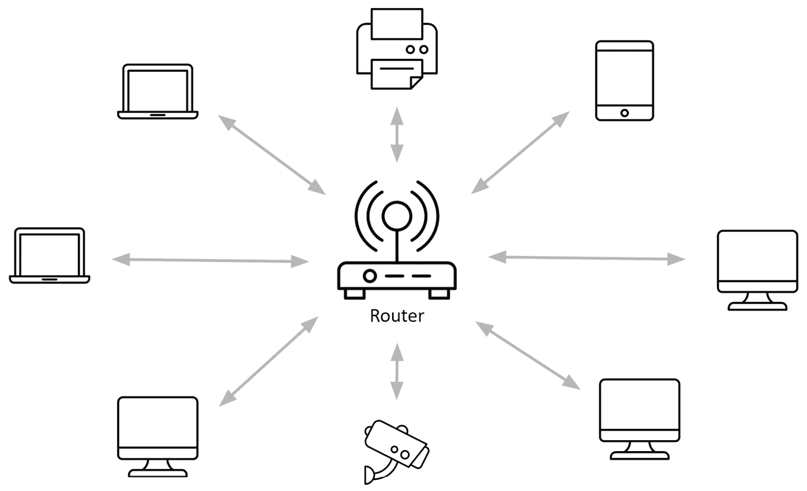
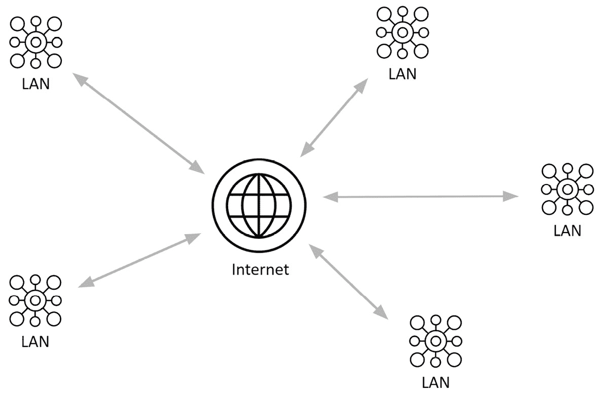
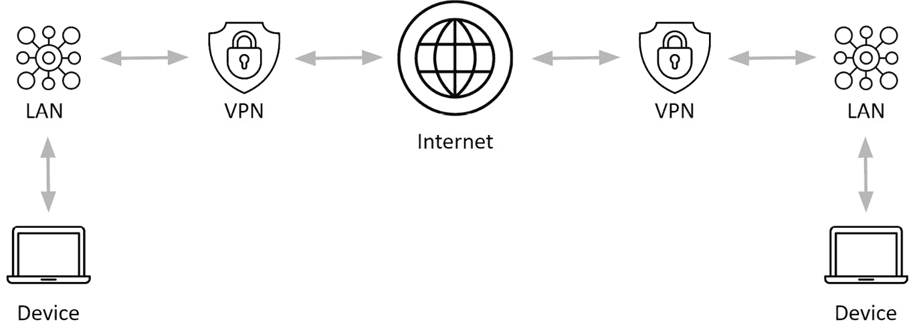
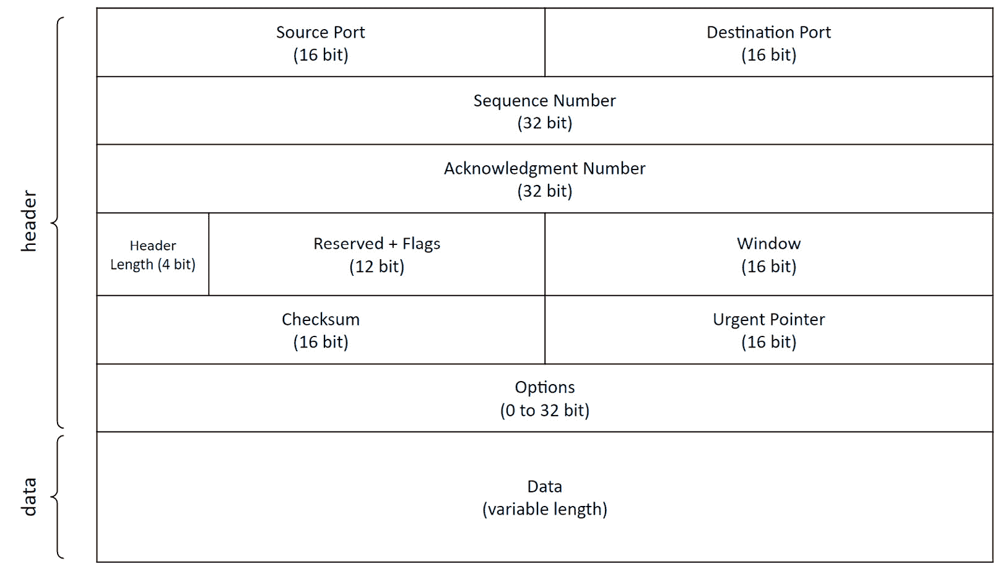
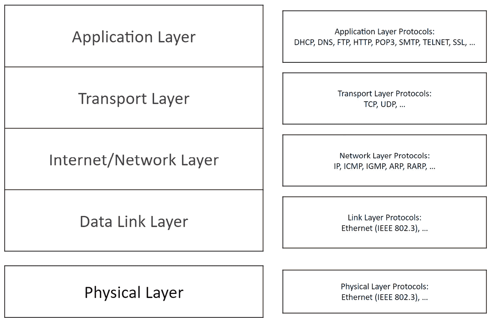
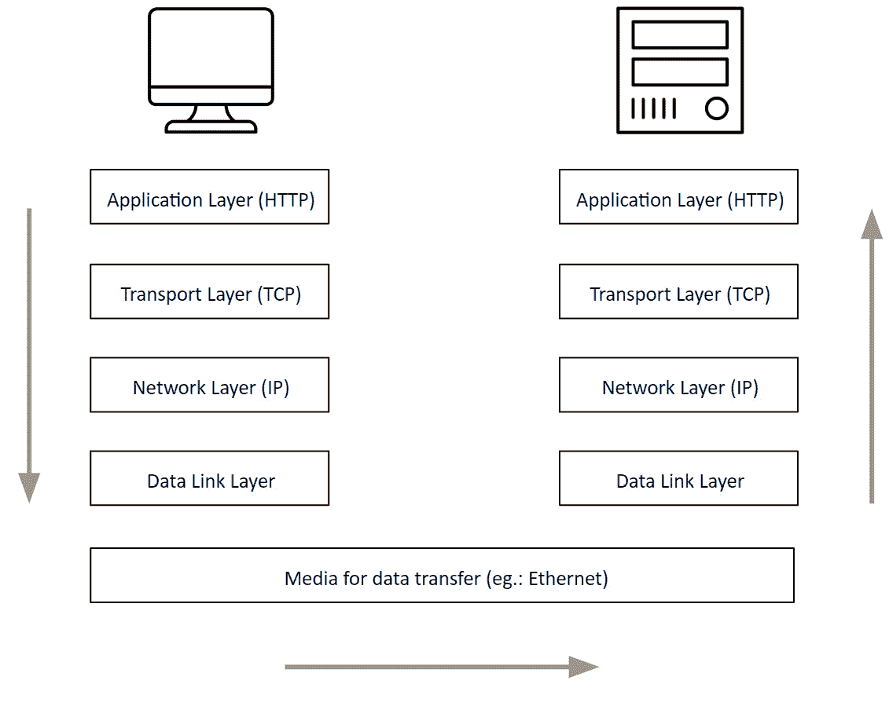

# 2

# 理解网络基础知识

拥有强大的网络知识是任何成功多玩家游戏开发的基础，因为它提供了对构成网络的不同组件如何工作的基本理解。网络可以分为三个主要领域：逻辑架构、协议和标准，以及物理基础设施。

由于对网络游戏感兴趣的任何人至少都应该对这些概念有一些基本了解，本章的主要目标是向您介绍这些组件以及在多玩家应用程序开发过程中可能出现的重大问题。到本章结束时，您还将了解虚幻引擎多玩家框架的组织方式，以便为下一步：创建您的第一个多玩家游戏原型做好准备。

因此，在本章中，我们将涵盖以下主题：

+   什么是计算机网络？

+   介绍网络协议

+   理解网络问题

+   介绍虚幻引擎的多玩家系统

# 技术要求

本章没有技术要求需要遵循。

# 什么是计算机网络？

我们生活在一个通过计算机、智能手机、智能家居和各种不同设备不断相互沟通的世界。计算机网络是现代技术的支柱。

大多数人可能甚至不关心设备通信及其工作方式；最重要的是……它确实工作。但“网络”究竟是什么意思？而且，最重要的是，作为多玩家游戏开发者，我们需要了解网络系统哪些内容？

**计算机网络**涉及两个或更多（大多数情况下，更多！）设备，这些设备通过连接在一起，共同目标是尽可能快、尽可能可靠地共享数据和资源。

网络可以使用电缆（有线）或无线电波（无线）进行通信，可以覆盖一个封闭区域或更大规模。尽管所有这些技术都拥有相同的目的，但它们的结构和能力将存在显著差异。

一旦设备在物理上连接，它们必须建立一个“合同”以便安全通信；没有这样的合同，数据可能会发送给错误的人，从而将重要信息置于风险之中。

合同建立后，每个设备都可以使用一个“数字信封”向另一个设备发送数据，该信封可以识别发送者和接收者。这确保了数据只被预期的接收者接收。

在网络上传输数据可能非常复杂，尤其是在处理大文件时（想想一个带有 150 MB 3D 模型附件的电子邮件，你可能就会明白这个意思了！）因此，数据必须由发送方“分割”成小块，一旦到达目的地，接收方将重新打包，以便使用。

这将我们引向最后一个阶段：信息丢失。尽管技术不断进步，但在我们这个不完美的世界中，数据丢失仍然是一种可能性。数据在传输过程中可能会被损坏或丢失；因此，采取措施确保数据安全并防止此类损失是非常重要的。

如果事情听起来很困难，那是因为它们确实如此！但不要害怕，这正是我开始学习这类技术时的感受；随着你通过这本书的内容，你会发现许多主题已经被 UE 多人游戏系统处理，让你有更多机会探索更高级的主题。

在下一节中，你将了解网络或一组网络是如何从结构和操作角度进行组织的。

# 计算机网络类型

正如你所知，计算机网络通过共享信息的方式为多个设备提供了相互通信的途径。以下是一些著名的例子：

+   发送电子邮件

+   流媒体视频

+   ...猜猜看？在线玩游戏！

但这些设备是如何连接的呢？有几种不同类型的计算机网络可供选择，它们具有不同的功能和目的；根据你的需求（以及你的预算！），你必须找到一个既能提供可靠性又能提供信任的解决方案。

## 局域网

**局域网**（**LAN**）可能是最常见的计算机网络类型。局域网通常由一个电信网络组成，该网络连接着位于近距离的设备（通常不超过 1 公里）。这类网络通常利用以太网电缆在短距离内提供的快速连接。

局域网可以分为两种类型：

+   客户/服务器局域网，其中多个设备（即客户端）连接到一个中央计算机（即服务器）

+   对等局域网，其中每个设备平等地共享网络功能

*图 2**.1* 展示了一个典型的通过 Wi-Fi 或以太网电缆连接的小型局域网。

图 2.1 – 局域网设置

与**广域网**（**WAN**）相比，局域网的主要优势是维护水平较低和实施成本较低。此外，由于局域网限制在相对较小的距离和有限数量的连接设备内，它确保了更高的安全性。

局域网的一些良好应用实例包括学术校园（有时称为**校园网**）、医院或拥有多个部门的办公室。

当设备之间的连接仅通过无线方式进行时，局域网可以成为**无线局域网**（**WLAN**），它通常用于家庭或公共场所（例如图书馆、机场和咖啡馆）等地方，在这些地方设备必须无需物理电缆即可连接。

## 广域网

局域网（LAN）和广域网（WAN）的主要区别在于，广域网覆盖的面积要大得多，本质上是由连接在一起的多个局域网组成的集合。

对于局域网（LAN）来说，广域网（WAN）可以如下所示：

+   客户/服务器广域网，其中多个设备连接到一台中央计算机

+   一种对等广域网，其中每个设备在网络功能中承担平等的责任

由于在长距离传输中通常会有速度损失，广域网（WAN）通常比局域网（LAN）慢。然而，广域网的主要优势在于其可以被公营：一个很好的例子是互联网，其中没有任何实体拥有完全的所有权。

*图 2**.2* 展示了通过广域网连接在一起的几个局域网：

图 2.2 – 一个广域网配置

**城域网**（**MAN**）是一种较小的广域网，通常由城市、地区或政府管理；它通常包括一个高速骨干网络，该网络连接多个局域网。例如，它可能连接属于同一学术机构的多个校园（这正是我现在教学的地方的工作方式！）。

## 虚拟专用网络

*图 2**.3* 展示了一个示例，其中连接到局域网的设备通过 VPN 与另一台设备在互联网上进行通信。

图 2.3 – VPN 示例

在本节中，您已经了解了计算机网络的基本原理。您已经探讨了计算机网络是如何构建和组织的。在下一节中，您将更深入地研究这些主题，以了解设备如何通过规则和协议进行通信，以及这些规则如何保证交换数据的可靠性和准确性。

# 介绍网络协议

为了管理两个或更多计算机之间的通信，我们需要一些规则来规定数据如何发送和接收，以及为确保可靠性需要采取的安全措施。这些规则被称为**协议**。

简单来说，协议就像一门国际通用语言：每个人都需要知道相同的词汇才能相互沟通。更具体地说，**网络协议**是一套指令，它规定了如何**格式化**、**传输**和**接收**数据，以便同一网络中的设备能够相互交互。

但在通过网络传输数据之前，它应该被仔细打包和结构化，以便接收者能够识别并重新组装它。

## 分组交换

**分组交换**是指将数据以小部分（或**数据包**）的形式发送到网络的方法。这个过程涉及将数据分成小段，并添加关于数据包内容、来源和目的地的额外信息。这个额外信息称为**报头**，通常放在每个数据包的前面。在某些情况下，数据包的末尾也可能包含额外的信息，称为**尾部**。

这些数据包随后通过网络发送，并在目的地重新组装。在途中，它们被中间节点处理，这些节点可以存储传入数据并将其转发到下一个更接近最终接收者的节点。

使用分组交换的一些优点包括带宽效率高和可靠性高，因为接收者可以检测到丢失的数据包。另一个优点是由于相对较低的实施成本，具有成本效益。

例如，*图 2.4*显示了由其报头和数据部分组成的**传输控制协议**（**TCP**）数据包：

+   报头由一系列比特块组成，每个块都有其特定的含义（例如，*报头长度*指示报头数据偏移，以便指定实际数据在序列中的起始位置）

+   数据可以有不同的长度，并包含数据包中包含的实际内容

图 2.4 – 一个 TCP 数据包

规定数据如何打包和通过网络传输的协议集合现在被称为**互联网协议套件**或**TCP/IP 套件**。

## TCP/IP 套件

TCP/IP 套件由不同的逻辑层，或**层**组成，它们一个叠一个。这些包括以下内容：

+   应用层

+   传输层

+   网络层

+   数据链路层

*图 2.5*显示了 TCP/IP 套件中的层以及一些最常用的协议，还包括我们将在本节后面讨论的物理层：

图 2.5 – TCP/IP 层

每一层都在支持其上层需求方面发挥着重要作用。例如，这可能涉及从上层接收数据块，根据当前层的协议处理它，然后将它发送到下层。

现在我们来逐一查看这些层。

### 应用层

**应用层**为网络中不同机器上运行的应用程序之间的通信提供了接口。它位于 TCP/IP 套件的最高层，并允许通过使用协议（如**文件传输协议**（**FTP**）和**超文本传输协议**（**HTTP**））共享数据，这些协议用于将文件上传到互联网并在您喜欢的浏览器上下载网页。

### 传输层

**传输层**负责提供可靠的数据交付和流量控制，并提供允许应用程序在网络中安全通信的服务。

虽然 TCP 因其可靠性而被广泛使用，但在某些情况下，其他协议因其速度而被优先考虑，例如**用户数据协议**（**UDP**），它不会保证数据包的交付，但因为它不需要建立和维护连接的开销，所以会更快。

此层通常负责检测问题和验证数据完整性；一种方式是通过**校验和**，即用于检查数据错误的数字和字母序列。

### 网络层

**网络层**（或更通用地，TCP/IP 套件中的**网络层**）负责提供在不同网络之间路由数据的方法，并确保数据包正确交付。此层还提供各种服务，如寻址、路由、拥塞控制和流量控制。

网络层负责提供一种逻辑寻址系统，该系统允许主机易于替换，将主机组组织成子网，并使远程子网能够相互通信。

用于实现这些功能的最常见协议是**互联网协议版本 4**（**IPv4**），它是一个 32 位地址，用于标识网络上的设备。最新的版本是**互联网协议版本 6**（**IPv6**），它基于 128 位地址，旨在取代 IPv4，因为 IPv4 的可用地址正在耗尽。

### 数据链路层

**数据链路层**负责在物理连接的主机之间提供通信方法。这意味着该层必须提供一种方法，使源主机能够打包信息并通过物理层传输。

*图 2.6* 展示了两个设备（客户端和服务器）之间典型的通信流程以及数据通过不同层传递的情况：

图 2.6 – 客户端与服务器之间的通信

### 物理层

在所有上述层之下是**物理层**，它负责在物理介质（如电缆、光纤、Wi-Fi 连接或甚至蓝牙通信）上发送原始数据（比特）。

此层定义了信号的发送和接收方式，以及如何将这些信号调制和解调为可用的数字信息。

尽管我们在这里讨论了物理层，但它实际上并不包含在 TCP/IP 套件中，这就是为什么它在*图 2.5*中显示的其他层中稍微分离的原因。

现在你已经了解了数据是如何打包的以及 TCP/IP 套件的组织方式，你将在下一节学习网络中可能发生的主要问题和陷阱。

# 理解网络问题

在涉及大量数据并在物理媒体中移动的情况下，遇到严重问题的风险是相当大的。因此，了解这些潜在问题以及如何最好地避免它们或限制其影响是很重要的。

## 安全

处理计算机网络时首先要考虑的问题是**安全**。如果没有适当的网络安全协议，恶意人员可能获得访问敏感信息的权限。

在应用内购买您角色的最新皮肤或您的 Steam 账户登录凭证被盗，这绝对不是您想经历的事情！

## 数据包丢失

**数据包丢失**发生在从一个设备发送到另一个设备的数据包丢失或损坏时，这是一个可能导致任何网络出现重大中断的主要问题。这种中断可能导致通信缓慢甚至完全中断，从而给玩家带来负面的游戏体验。

例如，考虑一下，如果您对试图向您跳来的狂暴对手的完美射击在网络中丢失：那时您会遇到很大的麻烦！

## 延迟

计算机网络中的**延迟**表示数据包从一个指定点传输到其目的地所需的时间，通常以毫秒为单位。这可能是由于各种因素造成的，例如缓慢的互联网连接、过时的硬件或拥挤的网络。

在多人游戏中，应尽可能降低延迟，因为它会对您所玩游戏的性能产生重大影响。例如，在一个需要快速反应的第一人称射击游戏中，如果您的角色因为连接缓慢而被击败，这可能会破坏所有的乐趣！

注意

虽然本书没有讨论安全和数据丢失问题，但您将在本书的**第四部分**中了解延迟以及如何处理它。然而，如果您对深入探讨网络安全和数据丢失主题感兴趣，Packt 提供了大量关于该主题的书籍。

现在您已经对通过网络管理数据时的主要问题有了基本的了解，是时候进入 Unreal Engine 并了解该软件如何处理网络了。

# 介绍 Unreal Engine 多玩家系统

正如我们在前面的章节中已经看到的，在网络化系统中，考虑发送什么数据以及如何发送数据是至关重要的，因为这可以极大地影响游戏的性能和整体体验。

Unreal Engine 拥有一个强大的网络框架，该框架被用于世界上一些最受欢迎的在线游戏中。本节提供了关于驱动 Unreal Engine 多玩家框架的概念概述，以及它们在多人游戏中的使用。

## 网络模式和服务器类型

在虚幻引擎中，计算机与多人会话的关系被称为**网络模式**。虚幻游戏可以设置为以下网络模式之一：

+   **客户端**：在此模式下，计算机将充当客户端，连接到网络多人会话中的服务器。

+   **独立模式**：此模式严格用于非联网游戏（单人游戏或本地多人游戏），并且不会接受来自远程客户端的任何连接。

+   **专用服务器**：在此模式下，计算机将作为服务器托管网络多人会话，并接受来自远程客户端的连接。作为专用服务器，一切都将优化以实现持久和安全的托管，因此将忽略任何以玩家为导向的功能，例如图形、音频或输入。

+   **监听服务器**：在此模式下，计算机将作为服务器运行，接受远程客户端，同时也接受本地玩家。这意味着它将牺牲一些性能，但允许计算机同时作为服务器和客户端。这种模式可以被视为客户端和专用服务器模式的组合，允许你在作为客户端参与游戏的同时，同时托管网络。

注意

监听服务器因其设置简单和能够提供局域网中的休闲和竞技多人游戏而受到欢迎。由于托管会话的玩家将直接在服务器上玩游戏，他们通常会比其他玩家有优势。然而，由于服务器也作为客户端运行，因此它们不适合高度竞技的游戏或涉及大量数据的游戏。此外，允许客户端托管游戏并让其他客户端加入游玩的监听服务器，为网络上的所有客户端创造了潜在的安全漏洞。这是因为托管网络的客户端可能会进行恶意行为，例如作弊或给自己带来不公平的优势。

## 复制系统

在 UE 中，服务器和客户端之间复制游戏状态信息的过程称为**复制**。复制系统允许高级抽象和低级定制，使得管理在创建面向多个用户同时使用的虚幻引擎项目时可能出现的任何场景变得更加简单。

如果在 Actor 上启用了复制，则运行在不同机器上的游戏的所有实例都将同步。另一方面，如果禁用了复制，Actor 将只在其被创建的机器上更新其功能。

在多人游戏开发过程中，你可能需要复制的最常见元素可能包括创建/销毁、移动、变量和组件。

然而，还有一些元素不应该复制，因为它们将在客户端单独运行，例如骨骼和静态网格、材质、粒子系统和声音发射器。通常，服务器不需要了解这些元素的性质（即，纯粹的美学性质）。

## 网络角色

在多人在线游戏中，了解每个 Actor 由哪个设备控制非常重要。这由 Actor 自身的网络角色决定。

拥有**授权**Actor 角色的设备是控制 Actor 状态的设备，它负责实时向其他玩家复制关于 Actor 的信息。

位于非授权远程机器上的相同 Actor 的副本定义为**远程代理**，并将接收来自授权者的所有复制信息。

在 UE 中，权威通常由服务器持有，这意味着信息通常是*从*服务器*到*客户端的。这种模型被称为**服务器授权**。

## Pawn 和 PlayerControllers

如你所知，在 UE 中，Pawn（或更常见的是角色）可以由 PlayerController 拥有。这在多人游戏中也是如此，为每个连接的玩家创建一个 PlayerController。

在游戏过程中，任何被分配给特定 Pawn 的 Actor 会自动与该 Pawn 的所有者客户端关联。例如，一个 Pawn 可能拥有一个如步枪或剑 Actor 这样的物品，而这个物品将由拥有 Pawn 的相同连接持有。

## 相关性和优先级

为了确定在多人游戏中复制 Actor 是否有益，会考虑**相关性**。被认为不相关的 Actor 将在复制过程中被排除。这种方法用于减少通过网络发送的数据量，从而提高数据复制的效率。

当带宽有限时，在复制数据时首先选择最重要的 Actor。每个 Actor 都有一个分配的**优先级**值，用于确定复制的顺序。

## 远程过程调用

在多人会话期间，可以通过**远程过程调用**（**RPC**）复制一个函数。RPC 可以从连接到网络的任何机器调用，但它们的实现将在网络会话的一部分特定机器上完成。

RPC 可以从服务器、客户端或多个客户端（**多播**）发送。RPC 要么保证到达目的地（**可靠**），要么不保证（**不可靠**）。

在本节中，我提供了一些关于 UE 多人系统的关键定义。这里的信息可能看起来相当密集，事情可能看起来有点令人不知所措。但不要害怕——你刚刚完成了第二章，整本书都可供你学习所有内容！

# 概述

在本章中，你学习了计算机网络的基本概念和参与成功网络通信的关键参与者。此外，你被介绍了互联网协议以及构成 TCP/IP 套件的层级，以及网络连接过程中可能出现的重大问题。最后，你了解了虚幻引擎的多玩家系统和框架提供的关键功能。

在下一章中，你将通过构建一个多人游戏的原型并在你的电脑上测试其功能来开始使用 UE 获得实际经验。

# 致谢

本章中的图表是在 Flaticon 的 *Made Lineal* 图标（[`www.flaticon.com/`](https://www.flaticon.com/)）的帮助下创建的。
