# 使用项目原型测试多人系统

现在你已经了解了网络的工作原理以及计算机如何远程通信，是时候测试 Unreal Engine 网络框架的一些基本功能了。了解 UE 环境中不同元素如何交互的最好方法是通过使用可用的项目模板并启用其多人功能。

本章的主要目标是作为对 UE 主要多人框架功能和如何在单个设备（如您的电脑）上测试它们的温和介绍。到结束时，你将创建你的第一个多人原型，并准备好进行下一步，即从头开始创建一个完整工作的网络游戏。

因此，在接下来的几节中，我将向您介绍以下主题：

+   创建多人游戏原型

+   在本地测试多人游戏

+   在网络上更新属性

+   在网络上执行函数

# 技术要求

对于这个第一个原型，你只需要安装 UE 5。对于本章，你不需要用 C++编程，因为原型将是蓝图。

为了让事情更有趣，我将使用集成插件中的 Quixel Megascans 的一些资源，但这不是强制性的。

完成的项目可以在本书的 GitHub 项目模板中找到，在*第三章*部分：[`github.com/PacktPublishing/Multiplayer-Game-Development-with-Unreal-Engine-5`](https://github.com/PacktPublishing/Multiplayer-Game-Development-with-Unreal-Engine-5)。

注意

从本章开始，我将交替使用“蓝图”和“蓝图类”这两个术语。如果需要区分，我将使用适当的术语，例如“动画蓝图”。

# 创建多人游戏原型

对于这个项目，游戏玩法将不是主要焦点；我希望你专注于多人框架的核心组件。因此，游戏将非常简单，并遵循以下基本规则：

+   每个玩家应该控制他们的角色

+   服务器将在随机位置生成物品拾取

+   玩家将捕获拾取并获得分数

+   游戏将无限进行

使用预制的项目，如模板，是您获得 UE 主要多人功能实战经验的好机会，而无需花费时间从头创建项目。在这里，你将使用**俯视角**模板创建自己的多人游戏原型。

## 从模板设置项目

当你准备好时，从 Epic Games Launcher 启动 UE 5。然后，按照以下步骤操作：

1.  从可用的模板中选择**游戏** | **俯视角**。

1.  将项目设置为**蓝图**。

1.  为您的项目命名（例如，`TopDown_Multiplayer`）。

1.  将其他设置保留为默认值。

1.  点击**创建**按钮。

*图 3**.1*显示了项目的完成设置：

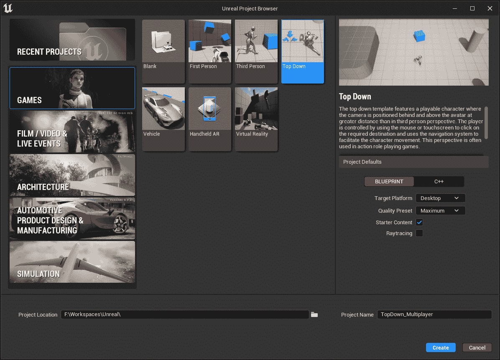

图 3.1 – 项目设置

一旦创建项目，你就可以导入一些内容了。

## 添加 Quixel Megascans

在这个项目中，我想为我的拾取使用一些疯狂的东西：我将从 Quixel Megascans 库中选择一些水果和蔬菜（[`quixel.com/megascans`](https://quixel.com/megascans)）！

**Quixel Megascans** 是一个包含高分辨率 3D 扫描的免费库：它与 UE 完全集成；你只需使用你的 Epic Games 账户。要从 UE 访问模型，你需要使用 Quixel Bridge，这是一个已安装在 Unreal Engine 编辑器中的插件。

要将一些 Megascans 添加到项目中，只需这样做：

1.  通过点击 **快速添加到项目** | **Quixel Bridge** 打开 Quixel Bridge。

1.  在 **3D 资产** 部分中，寻找一些水果或蔬菜——或者任何能激发你想象力的东西！

1.  点击 **下载** 按钮下载资产并将它们添加到你的项目中。

*图 3**.2* 展示了在下载阶段，Quixel Bridge 中的一些我选定的模型：

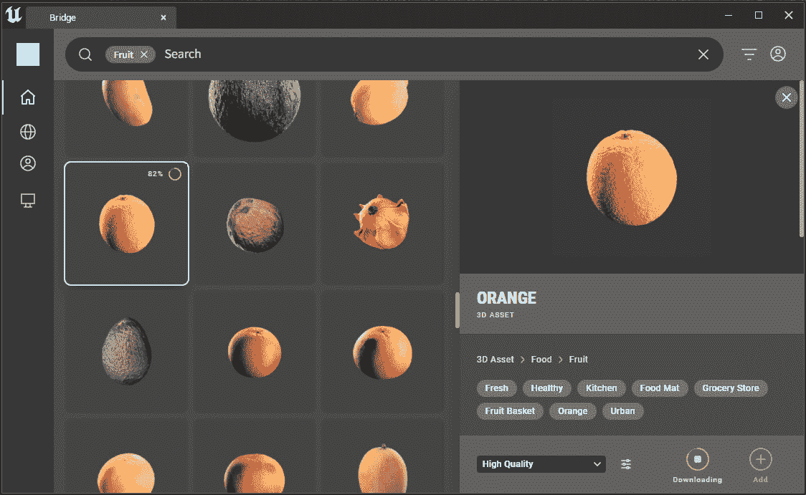

图 3.2 – Quixel Bridge

一旦你获得了你的资产，它们可能大小不一。然而，你需要调整它们的大小以创建一个视觉上吸引人且功能性的拾取。为此，请按照以下步骤操作：

1.  从主菜单中，通过选择 `内容` | `角色` | `人体模型` | `网格` 文件夹创建一个空关卡。

1.  将你的模型放在参考旁边。

1.  将它们调整到大约是参考大小的三分之一。

*图 3**.3* 展示了调整大小后的模型：

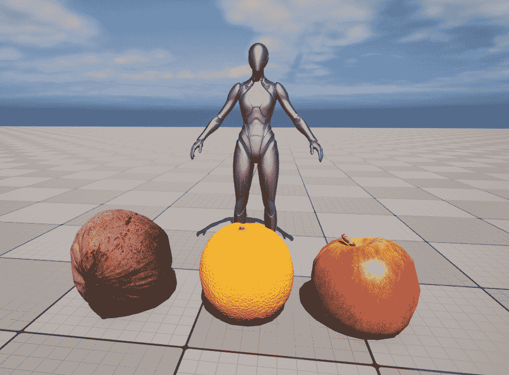

图 3.3 – 调整大小的模型

由于拾取将从一个共同的蓝图父级创建，最好的做法是将模型的比例设置为 1，这可以通过 UE 中的 **模型工具** 实现。通过在 **主工具栏** 区域的 **模式选择** 下拉菜单中选择它来打开 **模型工具** 面板，如图 *图 3**.4* 所示：

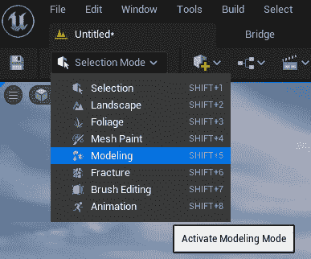

图 3.4 – 激活模型工具面板

一旦启用 **模型工具** 面板，为每个模型执行以下步骤：

1.  选择模型。

1.  选择 **变换** | **BakeRS** 以激活 **旋转和缩放** 烘焙工具。

1.  在工具底部的 **新资产位置** 下拉菜单中，选择 **AutoGen** **文件夹（全局）**。

1.  点击蓝色 **接受** 按钮以开始烘焙过程。

*图 3**.5* 展示了 BakeRS 工具已打开并准备好处理模型：

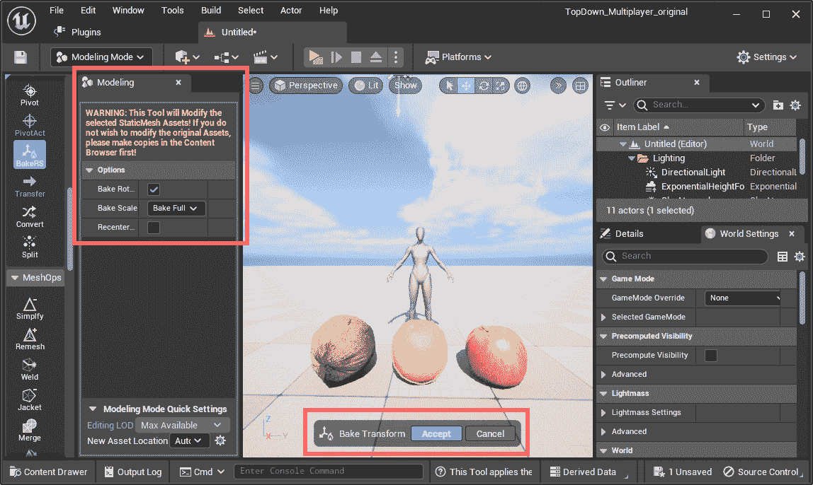

图 3.5 – BakeRS 工具

在这个过程结束时，所有三个模型将具有相同的大小，但每个都缩放到 1 的值。

你必须做的最后一件事是为每个模型生成碰撞：

1.  打开项目中的每个静态网格。

1.  打开**碰撞**下拉菜单。

1.  选择**添加 26DOP 简化碰撞**以向网格添加碰撞区域。

1.  保存修改后的资产以应用更改。

这个场景可以安全关闭，因为你不会再使用它。打开`内容` | `TopDown` | `Maps`文件夹。通过这样做，你的资产将准备好在游戏中作为拾取物品使用。

下一步将是修改玩家控制器，以便你可以处理 Pawn 的移动。

## 修改玩家控制器

模板中的玩家控制器已经可以正常工作，但为了使游戏更有趣（毕竟这是一个多人游戏！），你需要做一些小的调整。

目前，角色移动是通过在地图上的一个点上单击来控制的。然而，我们希望玩家能够通过按住鼠标按钮并在关卡周围移动来移动他们的角色。

按照以下步骤修改玩家控制器蓝图：

1.  导航到**内容** | **TopDown** | **蓝图**，并打开**BP_TopDownController**蓝图。

1.  然后，通过单击**事件****图**选项卡打开事件图。

1.  删除**设置目的地输入 – 触摸**组，因为你不会使用它。

1.  在**设置目的地输入 – 游戏手柄和鼠标**组中，删除连接到**已取消**和**完成**执行引脚的所有节点。

1.  将**Ongoing**执行引脚连接到与**Triggered**执行引脚相同的**Branch**节点。

修改后的图应如下所示：

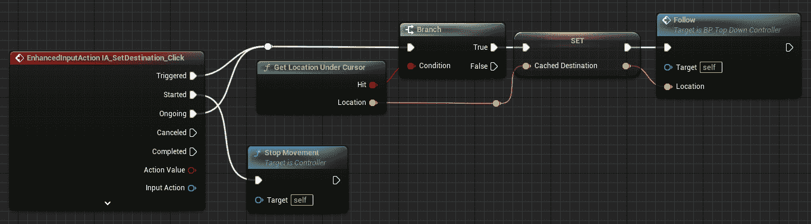

图 3.6 – 玩家控制器修改后的图

现在玩家控制器已经被修改，如果你尝试以当前状态玩游戏，你应该能够在按住左鼠标按钮时移动你的角色。这是在玩独立游戏时预期的正常行为。

在下一节中，你将学习如何设置 UE，使其在计算机上模拟一个多人游戏会话。

# 本地测试多人游戏

测试多人游戏可能会遇到问题，因为它需要在多个设备上提供游戏。幸运的是，UE 允许你在单个计算机上模拟这种场景，这使得开发者创建和测试多人游戏变得更加容易。在本节中，你将学习如何将你的编辑器用作服务器并在本地启动其他游戏实例。

## 作为监听服务器玩游戏

是时候开始测试游戏在多人环境中的工作了。你将通过使用 UE 的**网络****模式**功能来完成这项工作：

1.  通过单击**播放**按钮旁边的汉堡按钮打开**更改播放模式和播放设置**菜单，如图**3.7**所示：

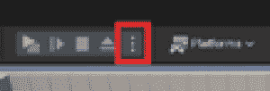

图 3.7 – 汉堡按钮

1.  在`3`。

1.  然后，选择**Net Mode** | **Play As Listen Server**，如图**3.8**所示：

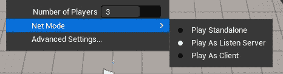

图 3.8 – 网络模式设置

注意

当你在编辑器中以 **监听服务器** 方式测试游戏时，编辑器充当服务器和客户端。根据所选玩家的数量，将打开额外的实例进行测试。作为旁注，以 **新编辑器窗口（PIE）** 模式启动游戏将指定一个屏幕作为服务器，其他屏幕作为客户端。这种区别可以通过检查启动窗口的标题栏来识别。

现在，你可以点击 **播放** 按钮，之后编辑器将为每个额外的玩家打开一个窗口，如图 *图 3*.9* 所示：

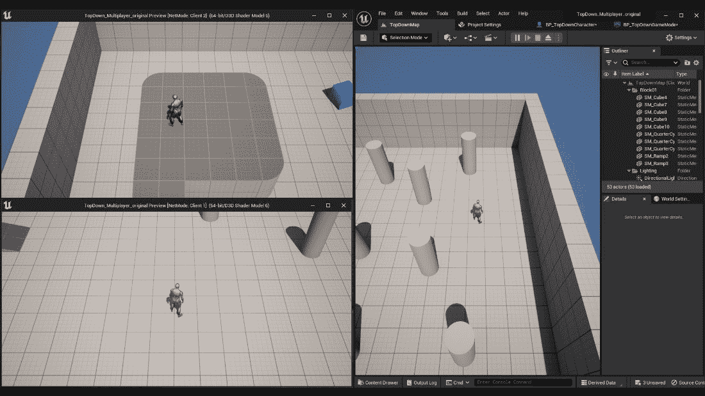

图 3.9 – 以监听服务器方式测试游戏

将焦点放在每个窗口上，你可以玩每个独立的角色。

注意

如果你在播放模式下检查 **大纲** 窗口，你会注意到有三个 **BP_TopDownCharacter** 实例（每个玩家一个），但只有一个 **BP_TopDownController** – 这是你为本地玩家需要的那个。

## 通过网络更新

在这一点上，你可能想知道在没有做任何与网络相关的事情的情况下，如何在不同客户端之间同步角色。

答案是 **复制**，我在上一章中解释了它，并在本原型中演示了它：角色演员是启用了复制的，因此在游戏过程中，它们的一些属性，如 **位置** 和 **旋转**，将在客户端之间更新。

要查看一个演员是否复制，请执行以下操作：

1.  通过访问 **内容** | **自顶向下** | **蓝图** 来打开 **BP_TopDownCharacter** 蓝图。

1.  通过点击 **类默认** 选项卡来打开 **详情** 面板。

1.  找到 **复制** 类别，并注意 **复制** 属性已被选中。此外，注意 **复制移动** 已被选中，如图 *图 3*.10* 所示：

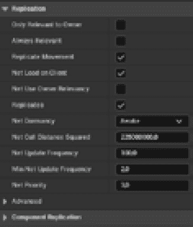

图 3.10 – 复制类别

激活 **复制** 属性的最好部分之一是属性将在网络上自动更新：你不需要做任何事情。稍后，你将学习如何通过网络调用执行函数。

## 添加额外的角色生成点

如你所注意到的，三个玩家被生成在彼此旁边：这是因为我们在关卡中有一个单独的玩家开始演员。

为了解决问题，你将添加更多的生成点：

1.  添加几个 **玩家开始** 对象，数量最多为你要测试的玩家数量 – 你可以通过点击 **快速添加到项目** 按钮，然后选择 **基本** | **玩家开始** 来完成此操作。

1.  将它们放置在地图上的任何你认为适合你游戏的位置。在 *图 3*.11* 中，你可以看到我为三个生成点所做的选择：

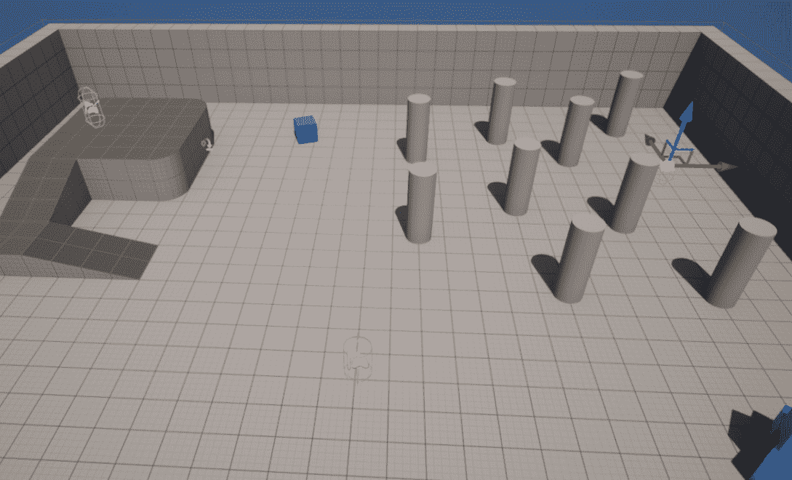

图 3.11 – 添加更多生成点

如果你此时测试你的游戏，你会注意到玩家现在会在**Player Start**位置随机生成，但有时，两个或更多角色仍然会出现在同一个生成点上。这可以通过检查已经被占用的位置并在新玩家加入会话时从选择中排除它们来轻松解决。为此，请按照以下步骤操作：

1.  通过转到**Content** | **Topdown** | **Blueprints**打开**BP_TopDownGameMode**蓝图。

1.  然后，打开事件图。

1.  在**我的蓝图** | **函数**中，通过点击**覆盖**选项为**ChoosePlayerStart**函数添加一个覆盖。

1.  添加一个**获取所有类别的演员**节点，并将其输入执行引脚连接到**Choose Player Start**节点的执行引脚。然后，将**演员类别**下拉属性设置为**Player Start**。

1.  添加一个**For Each Loop**节点来遍历你在上一个节点中找到的所有**Out Actor**属性。

1.  将**Loop Body**执行引脚连接到一个**分支**节点。

1.  从循环的**Array Element**引脚点击并拖动以获取一个**Player Start Tag**节点，并将其输出引脚连接到一个不等于（**!=**）节点。将此节点的比较值设置为**Used**。将此检查的结果连接到**Branch**节点的**Condition**引脚。

1.  将**Branch**节点的**True**执行引脚连接到一个值为**Used**的**Set Player Start** **Tag**节点。**目标**引脚应连接到循环的**Array Element**区域。

1.  将**Set**节点的输出执行引脚连接到图的**返回节点**。

1.  **Return Node**的**Return Value**引脚应设置为循环的**Array Element**属性。

生成的蓝图如*图 3.12*所示：

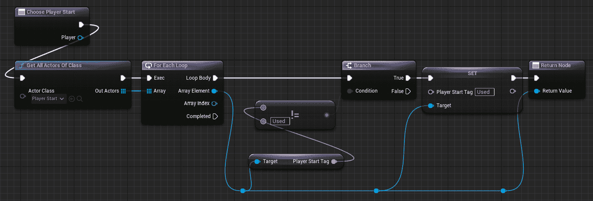

图 3.12 – 游戏模式图

此图的作用是遍历关卡中的所有**Player Start**对象，并寻找一个尚未标记为**Used**（即尚未被占用）的对象。一旦找到一个合适的候选对象，它就会被标记为**Used**，其值将被返回，准备好用作角色的生成点。

运行游戏 – 每个角色现在应该会在独特的位置生成。有了这个，你的玩家现在可以与关卡进行交互了！

试试玩并测试你的游戏：确保一切按预期运行，并且玩家在所有客户端上正确同步。

在下一节中，你将学习如何通过添加一些拾取物并将分数分配给角色来更新多个客户端的属性。

# 在网络上更新属性

现在，是时候添加一些游戏玩法并在运行时正确同步元素了。在接下来的几个小节中，你将致力于以下功能：

+   创建拾取物蓝图

+   添加拾取物变体

+   为角色添加一个点计数器

现在让我们添加这些功能。

## 创建拾取蓝图

我们将要创建的第一个东西是一个可拾取的项目，它将通过发送消息授予拾取它的角色的点数。

要创建此类通信，您需要创建一个接口：

1.  在您的`Blueprint`文件夹中，右键单击并选择**蓝图** | **蓝图接口**。

1.  将接口命名为`PointsAdder`。

1.  打开**蓝图接口**。

1.  将默认函数重命名为`AddPoints`。

1.  添加一个**整数**类型的`Value`。

您刚刚创建的接口应该与*图 3.13*中显示的相同：

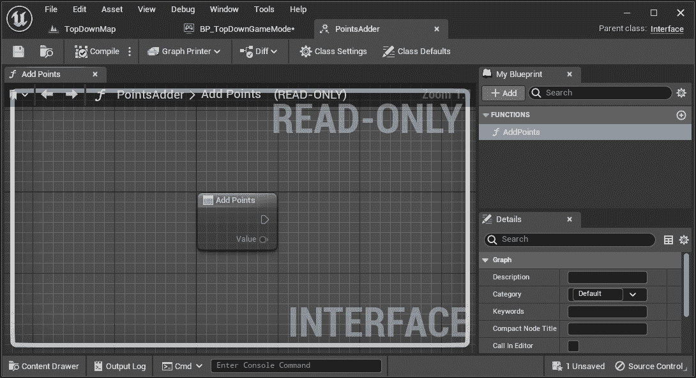

图 3.13 – PointsAdder 接口与 AddPoints 声明

一旦界面准备就绪，您需要创建一个将使用它的拾取蓝图：

1.  在您的`Blueprints`文件夹中，添加一个继承自`BP_BasePickup`的蓝图类。

1.  打开蓝图。然后，选择**类默认值**选项卡，并将你选择的网格添加到**静态网格**字段中。

1.  在**物理**部分，启用**模拟物理**属性，并检查**启用重力**属性是否已启用。

1.  将**SphereCollision**组件添加到蓝图组件层次结构中。

1.  将组件命名为`Trigger`，并确保**生成重叠事件**属性已被启用。

1.  将**SphereCollision**组件的**球体半径**属性设置为比您将要使用的静态网格稍大的值（例如，**50**）。

现在，您需要将一些代码逻辑添加到蓝图。首先，让我们为拾取角色添加一个点值：

1.  打开事件图。

1.  添加一个`Points`类型的变量。

1.  通过单击变量类型旁边的眼睛按钮将其设置为**实例可编辑**。

1.  编译后，将变量的**默认值**设置为**1**。

蓝图视口应该看起来与*图 3.14*中显示的相同：

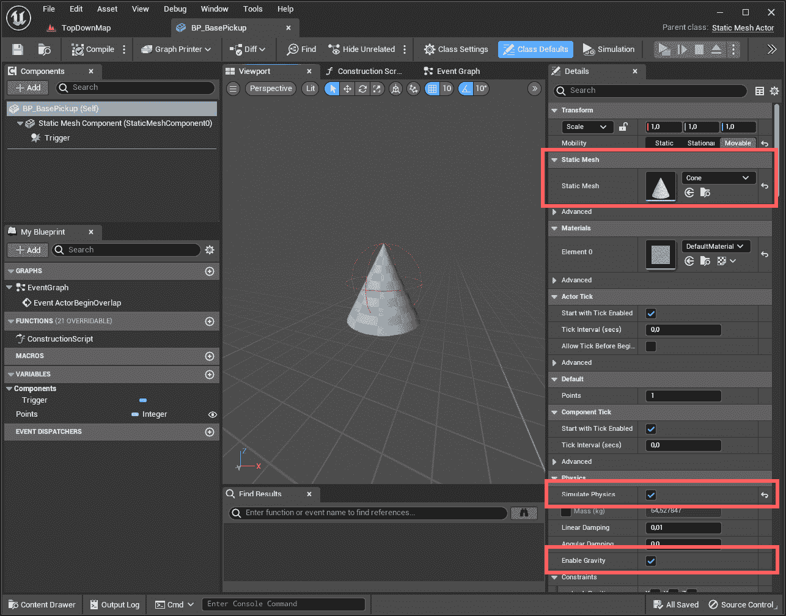

图 3.14 – 拾取视口

现在是时候为蓝图设置重叠事件行为：

1.  删除**Event BeginPlay**和**Event Tick**节点，因为您不会使用它们。

1.  添加一个**Cast To Character**节点，并将其输入执行引脚连接到**Event ActorBeginOverlap**的输出引脚，以检查演员是否为所需的类型（即，角色）。

1.  如果检查成功，则添加一个**AddPoints (消息)**节点：这是您之前在接口中声明的函数。

1.  将**As Character**引脚连接到函数节点的**目标**引脚。

1.  在图中添加一个**获取点**节点，并将引脚连接到**添加点**函数节点的**Value**引脚。

1.  最后，将**添加点**节点的输出执行引脚连接到**销毁演员**节点，以便在拾取后删除拾取物。

最终的图应该类似于*图 3.15*所示：

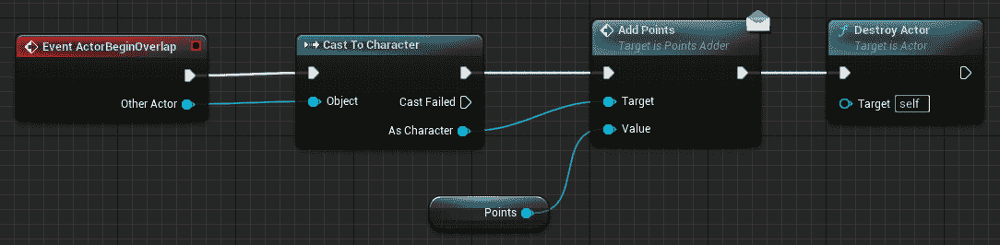

图 3.15 – 拾取事件图

这个图所做的是相当直接的：每当一个演员与拾取重叠时，拾取将通过接口发送一个**AddPoints**消息，然后销毁自己。如果重叠的演员没有实现接口，消息将简单地丢失，不会引发任何错误。

现在，是时候采取这个过程中最关键的一步：启用复制。为此，请执行以下操作：

1.  在**组件**选项卡中，选择**BP_BasePickup (self)**元素。

1.  然后，在**细节**面板中，查找**复制**类别并启用**Replicates**属性。

现在你有一个基础拾取，你可以创建变体，准备在游戏中使用。

## 添加拾取变体

为拾取蓝图创建一个变体相当简单：

1.  在内容浏览器中右键单击你的**BP_BasePickup**项目。

1.  选择**创建子蓝图类**，给你的新拾取命名，并打开它。

1.  打开**类默认值**选项卡。然后，将网格分配给**静态网格**字段（在我的例子中，是一个水果 Megascan）。

1.  根据图 3.16 所示，为**Points**属性分配一个你选择的值：

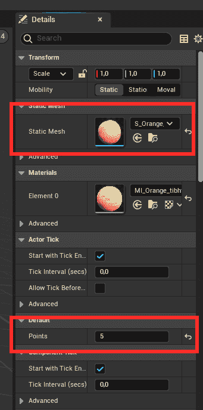

图 3.16 – 橙色拾取的设置

为你的每个拾取重复这些步骤，你就可以准备出发了！

在你为蓝图角色实现**AddPoints**接口之前，你可以自由地添加一些全新的拾取并作为监听服务器多人游戏测试游戏。

注意

如果你的拾取在客户端似乎有不同的旋转，这意味着你可能没有启用复制。请确保你的蓝图中的**Replicates**和**Replicate Movement**字段被勾选！

## 为角色添加点数计数器

现在你已经知道了如何在网络上复制演员，是时候学习如何复制单个变量以及如何在运行时拦截更改了。

你将通过跟踪每个玩家获得的成绩，并在游戏演员旁边显示它们来实现这一点。按照以下步骤操作：

1.  打开`蓝图`项目文件夹。

1.  添加一个**整数**类型的**Points**变量。

1.  在**点数**属性的**细节**面板中，查找**复制**字段，并从下拉菜单中选择**RepNotify**。

你会注意到，一旦选择了**RepNotify**字段，就会在你的蓝图上添加一个名为**OnRep_Points**的函数 – 这个函数将在每次由权威演员更新变量时在客户端被调用。

注意

**RepNotify**和**Replicated**值之间的区别在于，在第二种情况下，变量将在网络上更新，而无需执行任何通知函数。还应注意的是，**OnRep_XXX**函数在每个客户端由服务器调用，而不会在服务器本身上执行。

您现在将向角色添加一个文本组件，以显示他们在比赛中获得的分数：

1.  添加一个`PointsLabel`。

1.  将组件放置在您认为合适的位置。我选择了这些**变换**值：**位置 (-120, 0, -80)**和**旋转 (0, 90, 180)**。

1.  根据您的意愿增强组件的特性。我选择了*图 3.17*中显示的设置：

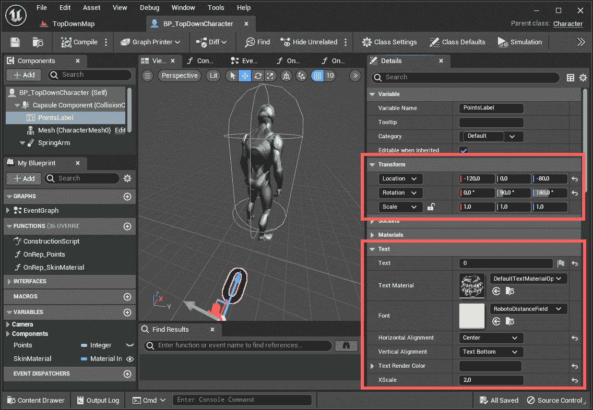

图 3.17 – PointsLabel 组件

现在是时候让拾取物与角色进行通信了。我们将通过实现我们之前定义的接口来完成此操作：

1.  在**BP_TopDownCharacter**打开的情况下，选择**类** **设置**标签页。

1.  在**详细信息**面板中，单击**实现接口**字段上的**添加**下拉按钮并选择**PointsAdded**接口。

1.  将名为**AddPoints**的新函数添加到**MyBlueprint**标签页的**接口**部分。右键单击函数名称并选择**实现事件** – 这将在事件图中添加相应的节点并选择它。

1.  将**Points**变量拖入事件图，并选择**设置**选项。

1.  再次拖动**Points**变量，这次选择**获取**选项。

1.  使用**添加**（**+**）节点将事件的输出**值**引脚添加到**获取点**节点。

1.  将**事件**节点的执行引脚连接到**设置**节点。

1.  将**添加**节点的结果引脚连接到设置节点的**Points**引脚。

注意

您会注意到，您添加到图中的**设置**和**获取**节点现在在右上角都有一个图标。此外，**设置**节点上还装饰有表示**带有通知**的文本：这意味着**Points**变量是通过带有函数通知进行复制的。

*图 3.18*显示了**AddPoints**事件的最终图：

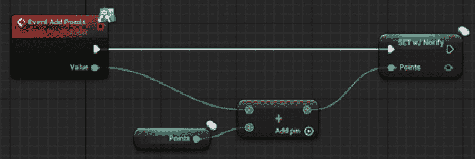

图 3.18 – 添加点事件

我们最后需要做的是实现通知函数，以便我们可以更新显示给角色的分数：

1.  双击**OnRep_Points**函数以打开它。

1.  从事件图中的**PointsLabel**组件拖动一个**获取**节点。

1.  从其输出引脚添加一个**设置文本**节点，并将其输入执行引脚连接到**On Rep** **Points**节点的输出执行引脚。

1.  从事件图中的**Points**变量拖动一个**获取**节点，并将其引脚连接到**设置文本**节点的**值**引脚。Unreal 将自动添加一个**转换为文本**转换节点。

最终的图应该与图 *3.19* 中描述的非常相似：

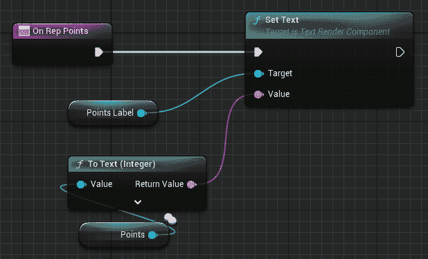

图 3.19 – On Rep Points 图

现在，如果你测试游戏，你应该能看到每当玩家在关卡中获得拾取物时，所有客户端都会更新。

通过这样，你已经了解了在多人游戏会话期间对象是如何更新的。具体来说，你获得了关于演员是如何复制的以及如何通过复制通知检测变量变化的见解。在下一节中，你将通过添加拾取物的生成区域并对你的人物进行一些美学改进来增强你的原型，以便它们可以轻松识别。你将通过在网络上调用函数来实现这一点。

# 在网络上执行函数

在本节中，你将学习如何正确地在网络上调用函数，以及“权限”一词对 UE 多人游戏系统真正意味着什么。特别是，你将了解在函数被调用时，哪个实体应该执行函数：客户端或服务器。

## 生成演员

是时候在运行时开始添加拾取物了。你将通过向关卡中添加一个生成区域蓝图来实现这一点。

此蓝图应该能够做到以下几点：

+   每次生成东西时都选择一个随机位置

+   在预定义的时间间隔内随机生成拾取物

+   并且显然...在网络上的行为要正确！

让我们开始吧。

### 选择一个随机的生成位置

让我们从创建蓝图并设置其参数开始：

1.  创建一个新的演员蓝图，并将其命名为 `BP_Spawner`。

1.  添加一个 `SpawnArea`，并通过将其拖放到默认的 **Scene Root** 组件上，使其成为 **Scene Root** 组件。

1.  添加一个 `SpawnableObjects`，使其成为 **Instance Editable**。

一旦编译并保存了蓝图，打开其事件图。然后，执行以下操作：

1.  创建一个名为 `Spawn` 的函数并打开它。

1.  将函数的执行节点连接到 **SpawnActor from** **Class** 节点。

1.  为 **SpawnableObjects** 变量添加一个 **Get** 节点，并将其输出引脚连接到 **Random Array** **Item** 节点。

1.  将 **Random Node** 的输出 **Actor Class Reference** 引脚连接到 **Spawn** 节点的 **Class** 引脚。

要为生成的物品获取位置，我们将从 **Box** **Collision** 组件内部获取一个随机位置：

1.  右键单击 **SpawnActor** 节点的 **Spawn Transform** 引脚，并选择 **Split** **Struct Pin**。

1.  将 **SpawnArea** 组件拖入函数图，并将其引脚连接到 **Get Scaled Box** **Extent** 节点。

1.  添加一个 **Get Actor Location** 节点，并将其输出引脚连接到 **Random Point in Bounding** **Box** 节点。

1.  将 **Get Scaled Box Extent** 节点的输出引脚连接到 **Random Point in Bounding** **Box** 中的一个 **Half Size** 引脚。

1.  将 **Random Point in Bounding Box** 节点的 **Return Value** 引脚连接到 **SpawnActor** 的 **Spawn Transform Location** 引脚。

最终的图示可以在*图 3.20*中看到：

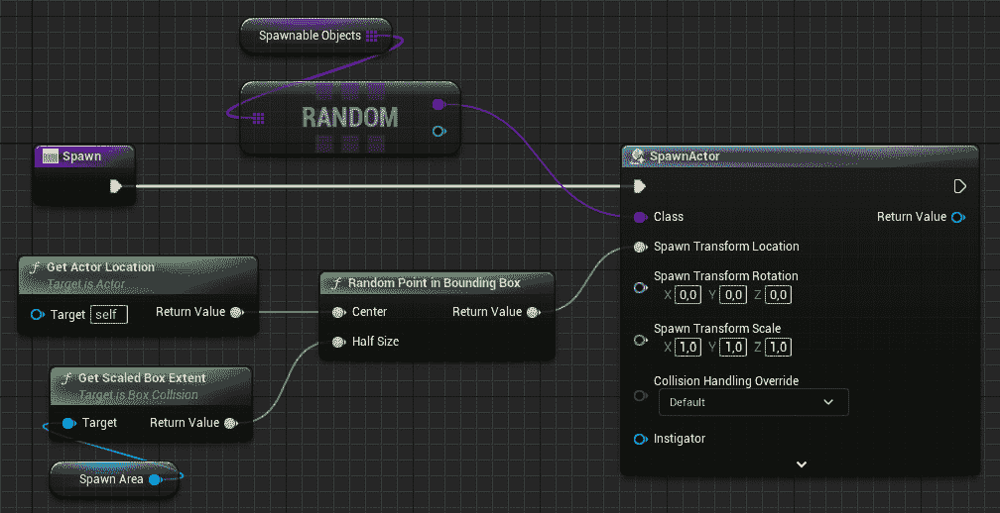

图 3.20 – **生成函数**图

**生成**函数从给定元素列表中选择一个随机的蓝图类，并在定义区域内随机位置生成其实例。

### 在预定间隔随机生成拾取器

你现在将要添加一个计时器，以预定间隔生成拾取器：

1.  打开蓝图的事件图部分并删除**Actor BeginOverlap**和**Tick**事件。

1.  添加一个**通过事件设置计时器**节点，并将其输入执行引脚连接到**BeginPlay**事件的输出引脚。

1.  将**时间**值设置为**1**并勾选**循环**框。

1.  连接`OnTimer`。

1.  将自定义事件的执行引脚连接到**生成**函数。

你刚才所做的一切可能看起来非常直接且正确，但实际上是错误的...或者至少，它遗漏了一些东西：代码在每个客户端上的行为将不同。请稍等片刻，让我们测试一下这种错误行为：

1.  删除你之前可能添加到游戏关卡中的所有拾取器。

1.  将**BP_Spawner**实例添加到关卡中。

1.  将实例放置在大约场景中心，并更改**生成区域**组件的**Box Extent**值，以便盒子将覆盖整个游戏区域；如果你使用的是默认场景，则类似于**（1300，1600，32）**应该就足够了。

1.  将**生成区域**组件放置在地面上方 – 拾取器应该从上方掉落并落到地面上。

1.  将你创建的所有拾取器添加到**可生成** **对象**数组中。

1.  运行多人模拟。

你会注意到客户端之间的事物看起来完全不同步：特别是，UE 实例（即服务器）将在每个间隔生成一个拾取器，而额外的客户端将生成两个。

我们做错了什么？简单来说，目前每个客户端中的每个生成器都在生成物品，但只有服务器（拥有权限的那个）在网络上生成物品。这意味着服务器每次只会得到一个拾取器，但客户端会得到两个：一个由服务器生成，另一个由客户端自己创建，而服务器对此一无所知。

### 使用演员权限正确生成拾取器

为了修复生成问题，我们只需告诉生成器只有在它们有权限这样做时才生成拾取器（即，它是服务器）：

1.  在**BeginPlay**事件的执行引脚和**通过事件设置计时器** **by Event**之间添加一个**Switch Has Authority**节点。

1.  将**权限**执行引脚连接到**计时器**节点的输入引脚。

修正后的图示在*图 3.21*中：

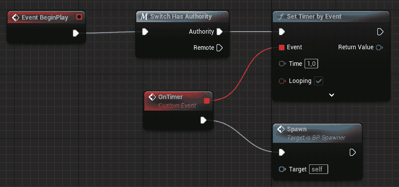

图 3.21 – 生成计时器图

当你现在测试游戏时，它应该表现正确：相同的对象应该在每个客户端实例中同时生成。

原型几乎完成了，但我希望你在创建一个最后的网络功能：为你的角色创建一个个性化皮肤。

## 角色皮肤化

使用两个或更多相同角色的游戏可能会很快变得非常混乱。对于原型，最佳选项是快速创建一些彩色材料，并在角色被生成时立即分配给它们。我们将在网络环境中这样做。

让我们先创建一些材料实例：

1.  在内容浏览器中，导航到 **Content** | **Characters** | **Mannequins** | **Materials** | **Instances** | **Manny**。

1.  将 **MI_Manny_01** 重复几次，以等于你在 **Play as a Listen Server** 部分设置的连接数（即，**3**）。

1.  使用你自己的首选约定命名新材料；我使用了 `MI_Manny_01_[ColorName]`。

1.  打开每个新实例，并将 **Tint** 属性更改为你喜欢的颜色。

1.  保存所有材料实例并关闭它们。

现在，让我们打开角色蓝图并添加另一个复制的变量：

1.  打开 **BP_TopDownCharacter**。

1.  添加一个名为 **SkinMaterial** 的新变量，其类型为 **Material Interface Object Reference**，并使其 **Instance Editable**。

1.  将 **Replication** 字段的下拉菜单设置为 **RepNotify**。这将创建一个名为 **OnRep_SkinMaterial** 的函数。

接下来，打开 **OnRep_SkinMaterial** 函数以添加皮肤更改逻辑。然后，执行以下操作：

1.  从事件图中拖动 **Mesh** 参考到 **Components** 面板。

1.  拖动一个用于 **SkinMaterial** 变量的 **Get** 节点。

1.  将函数执行插针连接到 **Set Material** 节点。

1.  将 **Mesh** 参考连接到 **Target** 插针。

1.  将 **SkinMaterial** 参考连接到 **Material** 插针。

该函数的图示见 *图 3.22*：

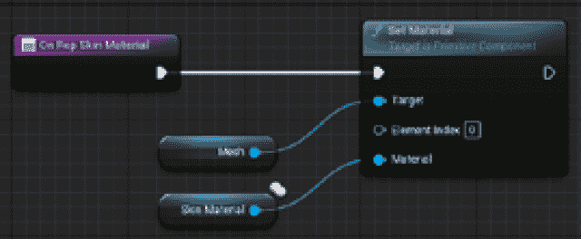

图 3.22 – 复制的 SkinMaterial 变量的函数

1.  每当 **SkinMaterial** 变量更改时，**OnRep_SkinMaterial** 将负责将其分配给角色的第一个材料。

现在，你需要更改每个角色在添加到关卡后的材料：

1.  在 `Blueprints` 文件夹中，打开 **BP_TopDownGameMode**。

1.  添加一个 `SkinMaterials`。

1.  一旦编译了蓝图，将之前创建的所有材料添加到 **Details** 面板中的 **Default Value** 字段。

1.  添加一个 `SkinCount` 变量；这个变量将用作选择皮肤的索引计数器。

你可能已经注意到我们没有复制 **SkinCount** 变量；在这种情况下，我们不需要这样做，因为这个变量只存在于服务器上，并且用于在游戏角色被生成时立即处理角色的皮肤。了解何时以及复制哪些变量是一个我将在 *第六章*，*通过网络复制属性* 中讨论的主题。

接下来，你必须获取已使用皮肤的计数。然后，每次创建新的连接时，你将分配下一个可用的皮肤给角色。为了实现这一点，你将使用一个名为*OnRestartPlayer*的事件，该事件在每次玩家重新启动时执行（包括第一次生成时）：

1.  在事件图中添加一个**Event OnRestartPlayer**节点。

1.  从**New Player**连接一个**Get Controlled Pawn**节点。

1.  将其输出的引脚连接到**BP_TopDownCharacter**节点。

1.  将事件执行引脚连接到**Cast**节点。

1.  将输出的**As BP Top Down Character**连接到一个**Set Skin Material**节点（注意添加的**w/Notify**标签，以指示值更改时的通知调用）。

1.  将转换节点的成功执行引脚连接到**Set Skin Material**节点。

1.  为**SkinMaterials**数组添加一个**Get**节点，并为**SkinCount**变量添加一个**Get**节点。

1.  将输出的**Skin Materials**引脚连接到**Get (a copy)**节点。

1.  将**Skin Count**引脚连接到**Get**索引。

1.  将**Get**节点的输出引脚连接到**Set Skin Material**节点的**Skin Material**引脚。

1.  最后，将**Set Skin Material**的输出执行引脚连接到一个**Increment (++)**节点。**Skin Count x**变量应该增加；这将跟踪数组中选定的皮肤。

*图 3*.23 描述了游戏模式图：

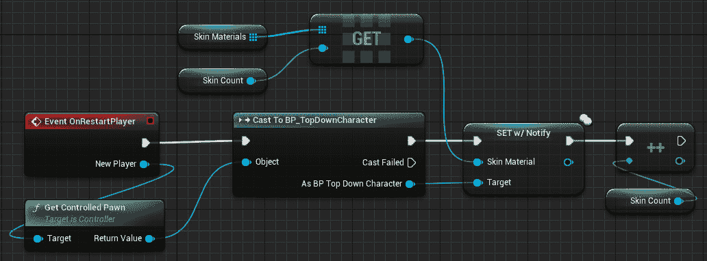

图 3.23 – 游戏模式图

现在原型已经创建，是时候测试（并玩）它了！

## 测试游戏

以监听服务器运行游戏 – 每个角色应该在其网络中同步其彩色皮肤，并且每个玩家的得分应该正确显示在角色本身上。*图 3*.24 显示了游戏原型的实际运行情况：

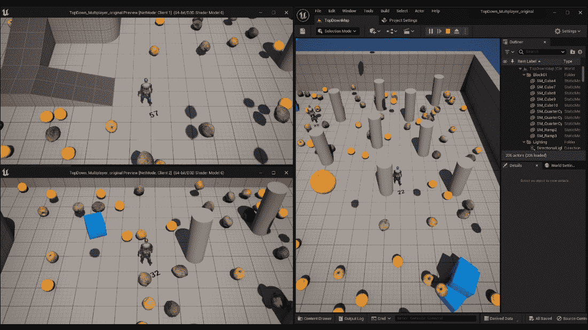

图 3.24 – 测试游戏原型

因此，你最终测试了你的多人游戏原型：玩家可以四处奔跑并拾取下落的物品，准备获得分数。虽然看起来很有趣，但这只是多人游戏开发的开始！

# 概述

在本章中，你创建了你的第一个多人游戏的原型，并了解了如何在网络上同步 Actors 和变量。此外，你开始通过 UE 系统测试原型，该系统并发模拟多个连接，所有这些通过使用 Blueprints 实现。

然而，向前推进，你将过渡到使用 C++编程语言，这可能看起来有点令人畏惧，但我向你保证，我会努力使这种转变尽可能轻松！

是时候让你的原型走向它的命运了...我们还有更重要的事情要做！在下一章中，你将从头开始创建一个游戏。你将使用 C++来开发它，并利用这种开发方式的所有优势。

# 第二部分：虚幻引擎中的网络和多人游戏

在本书的第二部分，你将为使用虚幻引擎的完整多人项目打下基础。从那里，你将深入研究虚幻引擎游戏框架的基本功能，以及它们如何在多人环境中实现。

本部分包括以下章节：

+   *第四章*，*设置您的第一个多人环境*

+   *第五章*，*在多人环境中管理演员*

+   *第六章*，*在网络中复制属性* *O**ver the Network*

+   *第七章*，*使用远程过程调用 (RPCs)*
