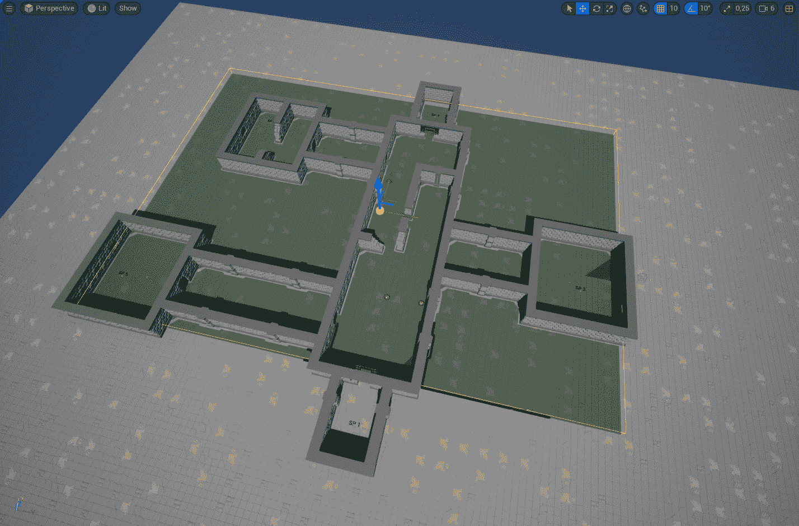
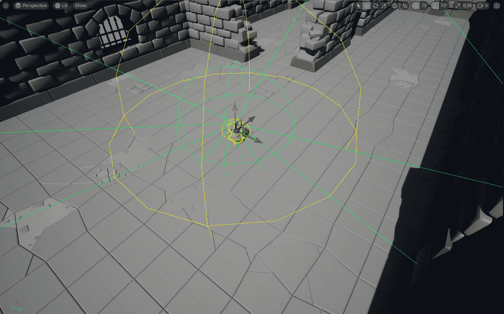
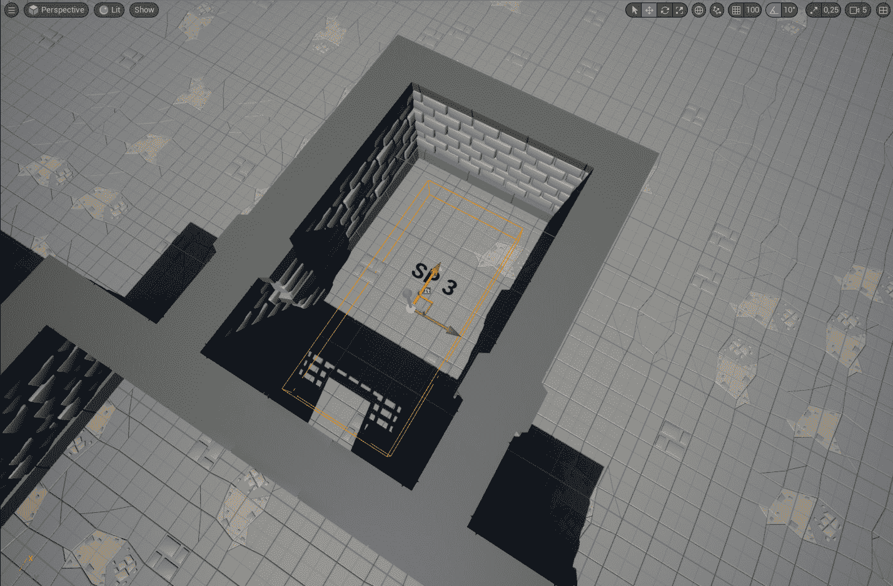
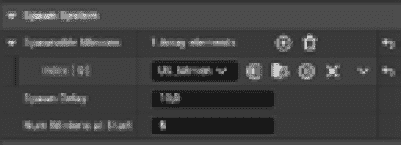
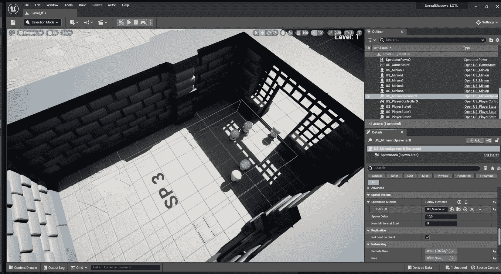

# 将人工智能引入多人游戏环境

**人工智能**（**AI**）系统通过提供不可预测和吸引人的动态挑战，为玩家提供令人兴奋和独特的游戏体验。这允许开发者创建具有逼真行为的沉浸式世界，来自**非玩家****角色**（**NPC**）。

在本章中，我将向您介绍虚幻引擎中人工智能的基础知识，但由于这是一本关于多人游戏的书籍，我将不会深入探讨系统的细节——相反，你将迈出创建对手的第一步，这将使你的游戏从网络角度完全可玩。

到本章结束时，你将创建一个敌人演员，它在关卡中四处游荡，一旦检测到玩家角色就会积极追击。这将成为你在游戏中创建更多样化和引人入胜的敌人的起点。

因此，在本章中，我将向您介绍以下主题：

+   设置人工智能系统

+   创建人工智能对手

+   向关卡添加对手

# 技术要求

要跟随本章中介绍的主题，你应该已经完成了前面的章节，并理解了它们的内容。

此外，如果你希望从本书的配套仓库开始编写代码，你可以下载本书配套项目仓库中提供的`.zip`项目文件：

[`github.com/PacktPublishing/Multiplayer-Game-Development-with-Unreal-Engine-5`](https://github.com/PacktPublishing/Multiplayer-Game-Development-with-Unreal-Engine-5)

您可以通过点击`Unreal Shadows –` `Chapter 07``End`链接下载与上一章结尾相符的最新文件。

# 设置人工智能系统

在虚幻引擎中制作人工智能对手可能是一项相当困难的任务。幸运的是，这本书专注于提升你的多人游戏技巧，而不是陷入人工智能的所有细节，所以我将不会深入探讨虚幻引擎的人工智能系统。然而，如果你想使你的游戏有趣，了解如何创建一个值得尊敬的人工智能对手肯定有帮助。

为了让人工智能角色在关卡中移动，你需要定义哪些区域是允许的，哪些是不允许的（例如，你肯定需要给角色一个安全的地方，对手不敢踏入）。一旦我们完成了这个，在接下来的步骤中，我们将创建这些区域，以便人工智能系统可以管理小兵的行走路径。一旦我们完成了这个，我们就会朝着创建令人惊叹的、无意识的、行走的亡灵迈出坚实的步伐。

要使一切正常工作，首先，我们需要给我们的小兵对手一些可以行走的地方。正如你可能已经知道的，虚幻引擎使用**导航系统**让 AI 演员使用路径查找算法在关卡中导航。

导航系统将您级别中的碰撞几何形状生成一个**导航网格**，然后将其分割成部分（即多边形几何形状），这些部分用于创建一个图。这个图是**代理**（如 AI 角色）用来导航到其目的地的东西。每个部分都会被赋予一个成本，然后代理使用这个成本来计算最有效的路径（成本最低的路径）。这就像为您的游戏角色提供了一个智能 GPS！

注意

如果您想了解更多关于虚幻引擎导航系统及其内部工作原理的信息，您可以访问以下链接的官方 Epic Games 文档：[`docs.unrealengine.com/5.1/en-US/navigation-system-in-unreal-engine/`](https://docs.unrealengine.com/5.1/en-US/navigation-system-in-unreal-engine/).

要将导航网格添加到级别中，您需要执行以下步骤：

1.  打开您迄今为止一直在工作的游戏级别，并从**快速添加到项目**按钮中选择**NavMeshBoundsVolume**。这将向级别添加**NavMeshBoundsVolume**组件和一个**RecastNavMesh** Actor。

1.  在**大纲**中，选择**NavMeshBoundsVolume**，并启用**缩放**工具，将其大小调整为覆盖您想要的级别部分——避免玩家角色的出生区域，因为您希望他们有一个安全的地方休息或必要时逃离。

1.  按下键盘上的*P*键以显示新创建的导航网格，它应该看起来类似于*图 8**.1*中描述的：



图 8.1 – 导航网格区域

绿色区域（即导航网格）表示 AI 角色可以行走的地方。您会注意到墙壁和门会在该网格中形成“洞”，因此 AI 将无法进入。不用担心您地牢外的部分——没有开放的门将它们连接起来，所以小兵无法到达那里。

在本节中，您简要介绍了虚幻引擎导航系统，并为即将创建的 AI 对手设置了一个可导航的区域。鉴于您急切地想要开始编码，让我们启动您的编程 IDE 并一起编写一些代码！是时候召唤一些亡灵小兵，让他们在地牢中四处走动了。

# 创建 AI 对手

在本节中，您将开始为您的英雄的敌人创建一个类，包括基本的巡逻和攻击能力。当然，他们可能不是最聪明的人，但嘿，他们是巫妖王的亡灵小兵——并不以他们的智慧著称，对吧？

我们将首先扩展 Character 类，如您可能已经知道的，它可以由`AIController`控制，允许在游戏过程中进行独立操作。

在这一点上，我们希望小兵具有以下功能：

+   在该层周围进行随机巡逻移动

+   一个感知系统，将允许它看到和听到玩家的角色

+   一旦检测到玩家，就有能力去寻找它

在接下来的章节中，我们将通过添加更多功能（如健康和可召唤的物品，当 AI 被击败时）来进一步扩展 Character 类，但到目前为止，我们只会关注移动和感知系统。

## 添加导航模块

为了让代理能够通过导航网格导航，首先的事情是向你的项目中添加相应的模块。

要做到这一点，回到你的编程 IDE 并打开你的项目构建文件——名为 `UnrealShadows_LOTL.Build.cs` 的文件（或者如果你选择了不同的项目名称，则类似）。找到以下代码行：

```cpp
PublicDependencyModuleNames.AddRange(new string[] { "Core", "CoreUObject", "Engine", "InputCore", "EnhancedInput" });
```

通过添加 `NavigationSystem` 声明来更改它，如下所示：

```cpp
PublicDependencyModuleNames.AddRange(new string[] { "Core", "CoreUObject", "Engine", "InputCore", "EnhancedInput", "NavigationSystem" });
```

更新了项目设置后，我们可以开始着手处理 minion AI，通过创建一个专门的类。

## 创建 minion 类

是时候创建 AI minion 类了，因此创建一个从 `Character` 派生的新的类，并将其命名为 `US_Minion`。一旦类创建完成，打开 `US_Minion.h` 头文件，在 `private` 部分，添加以下代码：

```cpp
UPROPERTY(VisibleAnywhere, BlueprintReadOnly, Category = "Minion Perception", meta = (AllowPrivateAccess = "true"))
TObjectPtr<class UPawnSensingComponent> PawnSense;
UPROPERTY(VisibleAnywhere, BlueprintReadOnly, Category = "Minion Perception", meta = (AllowPrivateAccess = "true"))
TObjectPtr<class USphereComponent> Collision;
UPROPERTY()
FVector PatrolLocation;
```

`Collision` 属性将用作 AI 抓取角色的触发器，而 `PatrolLocation` 将用于告诉 AI 如果没有追捕角色，它应该去哪里。

`PawnSense` 属性是 `PawnSensingComponent` 的声明，这是一个 AI 角色可以用来观察和听到关卡周围棋子的组件（即玩家角色）。这个组件使用起来相当简单，并且易于配置，让你在游戏过程中可以调整对手的“愚蠢”程度。你将在初始化它的一两分钟后得到关于它的更多信息。

现在是时候在 `public` 部分添加一些属性了。只需添加以下代码：

```cpp
UPROPERTY(EditDefaultsOnly, BlueprintReadOnly, Category="Minion AI")
float PatrolSpeed = 150.0f;
UPROPERTY(EditDefaultsOnly, BlueprintReadOnly, Category="Minion AI")
float ChaseSpeed = 350.0f;
UPROPERTY(EditDefaultsOnly, BlueprintReadOnly, Category="Minion AI")
float PatrolRadius = 50000.0f;
```

我们定义了两个移动速度属性：`PatrolSpeed` 将在 minion 无目的地四处走动时使用，而 `ChaseSpeed` 将在 minion 寻找角色时使用，以便让它成为 Lichlord 军队的新棋子！`PatrolRadius` 属性将用于在关卡中为 minion 找到新的检查位置。

在属性之后，你将声明 AI 对手正确行为所需的公共方法。仍然在 `public` 部分，添加以下代码块来声明它们：

```cpp
UFUNCTION(BlueprintCallable, Category="Minion AI")
void SetNextPatrolLocation();
UFUNCTION(BlueprintCallable, Category="Minion AI")
void Chase(APawn* Pawn);
virtual void PostInitializeComponents() override;
FORCEINLINE UPawnSensingComponent* GetPawnSense() const { return PawnSense; }
FORCEINLINE USphereComponent* GetCollision() const { return Collision; }
```

`SetNextPatrolLocation()` 和 `Chase()` 方法将被用来让 AI 角色在场景中移动，寻找新的位置或寻找玩家角色。`PostInitializeComponent()` 覆盖将用于注册角色事件。最后，我们声明了已添加的字符组件的常用获取器。

在头文件声明中的最后一步是添加此角色的事件处理器：

```cpp
UFUNCTION()
void OnPawnDetected(APawn* Pawn);
UFUNCTION()
void OnBeginOverlap(AActor* OverlappedActor, AActor* OtherActor);
```

第一个将管理 minion 逻辑，一旦它通过感官检测到棋子，而第二个将用于检查是否有玩家角色被捕获。

标头已经声明完毕——请注意，目前我们并没有考虑小兵的听觉能力；这是我们将在下一章中实现的内容，当我们的盗贼英雄开始制造一些噪音时！

## 实现小兵的行为

你已经声明了所有你的函数和属性，现在是时候通过实现一些 AI 小兵的行为来充分利用它们了。让我们确保一切运行顺利，并让这个项目启动起来！

打开`US_Minion.cpp`文件，并在顶部添加以下`include`语句：

```cpp
#include "AIController.h"
#include "NavigationSystem.h"
#include "US_Character.h"
#include "Components/CapsuleComponent.h"
#include "GameFramework/CharacterMovementComponent.h"
#include "Perception/PawnSensingComponent.h"
#include "Blueprint/AIBlueprintHelperLibrary.h"
#include "Components/SphereComponent.h"
```

如同往常，这些代码行将声明我们将从现在开始使用的类。在你完成这些之后，现在是时候实现构造函数了，通过添加所需组件并初始化所有属性。 

### 声明构造函数

一旦`include`语句被正确声明，你可以开始定位`AUS_Minion()`构造函数，并插入角色初始化代码。在括号内，紧接在`PrimaryActorTick.bCanEverTick`声明之后，添加以下代码：

```cpp
bUseControllerRotationPitch = false;
bUseControllerRotationYaw = false;
bUseControllerRotationRoll = false;
AutoPossessAI = EAutoPossessAI::PlacedInWorldOrSpawned;
AIControllerClass = AAIController::StaticClass();
PawnSense = CreateDefaultSubobject<UPawnSensingComponent>(TEXT("PawnSense"));
PawnSense->SensingInterval = .8f;
PawnSense->SetPeripheralVisionAngle(45.f);
PawnSense->SightRadius = 1500.f;
PawnSense->HearingThreshold = 400.f;
PawnSense->LOSHearingThreshold = 800.f;
Collision = CreateDefaultSubobject<USphereComponent>(TEXT("Collision"));
Collision->SetSphereRadius(100);
Collision->SetupAttachment(RootComponent);
GetCapsuleComponent()->InitCapsuleSize(60.f, 96.0f);
GetCapsuleComponent()->SetGenerateOverlapEvents(true);
GetMesh()->SetRelativeLocation(FVector(0.f, 0.f, -91.f));
static ConstructorHelpers::FObjectFinder<USkeletalMesh> SkeletalMeshAsset(TEXT("/Game/KayKit/Skeletons/skeleton_minion"));
if (SkeletalMeshAsset.Succeeded())
{
 GetMesh()->SetSkeletalMesh(SkeletalMeshAsset.Object);
}
GetCharacterMovement()->bOrientRotationToMovement = true;
GetCharacterMovement()->RotationRate = FRotator(0.0f, 500.0f, 0.0f);
GetCharacterMovement()->MaxWalkSpeed = 200.f;
GetCharacterMovement()->MinAnalogWalkSpeed = 20.f;
GetCharacterMovement()->BrakingDecelerationWalking = 2000.f;
```

你将熟悉从盗贼角色创建中大部分的代码，但你将看到一些明显的添加。首先，我们正在设置`AutoPossessAI`属性，这让我们可以定义游戏系统是否会在关卡中占用 AI 角色一次——我们希望它在运行时生成时以及当游戏开始时已经在关卡中时都能完全控制，所以我们选择了`PlacedInWorldOrSpawned`的值。

然后，我们通过设置`AIControllerClass`属性来定义将用于 AI 系统的控制器；在这种情况下，我们只是使用基础的`AAIController`类，但你显然可以添加更多功能来自定义实现。

最后一个值得注意的是`PawnSense`组件的创建——正如你所见，我们正在初始化将使小兵在一定距离内看到和听到的属性。你应该注意`SensingInterval`的初始化，这将让我们调整两次感知之间经过的时间。这将决定一个非常反应灵敏的角色（即，较低的值）或一个非常愚蠢的角色（即，较高的值）。

### 初始化小兵

现在是时候在角色被添加到游戏中时初始化角色了。正如你所知，这通常是通过`BeginPlay()`方法完成的。所以，在`Super::BeginPlay()`声明之后，添加以下内容：

```cpp
SetNextPatrolLocation();
```

这个调用将简单地启动巡逻行为。然后，通过向文件中添加以下代码来实现`PostInitializeComponents()`：

```cpp
void AUS_Minion::PostInitializeComponents()
{
 Super::PostInitializeComponents();
if(GetLocalRole() != ROLE_Authority) return;
 OnActorBeginOverlap.AddDynamic(this, &AUS_Minion::OnBeginOverlap);
 GetPawnSense()->OnSeePawn.AddDynamic(this, &AUS_Minion::OnPawnDetected);
}
```

如你所见，我们正在使用两个委托来响应 Actor 重叠，用于检查我们是否到达了玩家角色，以及处理 Pawn 感知以检查我们是否可以看到玩家角色。注意，它们仅在对象的角色为权威角色（即，该方法是在服务器上执行的）时才初始化。

下一步是实现这两个代理函数，以管理上述事件。

### 处理代理函数

无论小兵检测到棋子，它都会立即检查它是否是一个角色，如果结果是成功的，它就会开始追逐它。让我们在源文件中添加处理代理的方法：

```cpp
void AUS_Minion::OnPawnDetected(APawn* Pawn)
{
 if (!Pawn->IsA<AUS_Character>()) return;
 GEngine->AddOnScreenDebugMessage(-1, 5.f, FColor::Red, TEXT("Character detected!"));
 if (GetCharacterMovement()->MaxWalkSpeed != ChaseSpeed)
 {
  Chase(Pawn);
 }
}
```

这里的代码相当简单——我们只是添加了一条调试信息，表明检测到了一个角色。

我们需要处理的第二个代理是重叠，因此添加以下方法实现：

```cpp
void AUS_Minion::OnBeginOverlap(AActor* OverlappedActor, AActor* OtherActor)
{
 if (!OtherActor->IsA<AUS_Character>()) return;
 GEngine->AddOnScreenDebugMessage(-1, 5.f, FColor::Yellow, TEXT("Character captured!"));
}
```

如您所见，我们再次检查是否找到了一个角色，然后简单地显示一个调试信息——看起来我们的英雄离小兵太近了，现在他们已经被套上了绳索，加入了巫妖王的亡灵军队！稍后，您将实现一个重生系统，让玩家能够用全新的角色重新开始游戏。

下一步将是 AI 在导航网格中的实际移动，包括巡逻和追逐行为。

### 实现追逐和巡逻行为

现在是时候开始实现你的 AI 角色的运动控制了——具体来说，你将实现`SetNextPatrolLocation()`函数，该函数将为小兵找到一个新的可到达点，以及`Chase()`函数，该函数将小兵派往一个“寻找并摧毁”任务，目标是角色。为此，请将以下代码添加到文件中：

```cpp
void AUS_Minion::SetNextPatrolLocation()
{
 if(GetLocalRole() != ROLE_Authority) return;
 GetCharacterMovement()->MaxWalkSpeed = PatrolSpeed;
 const auto LocationFound = UNavigationSystemV1::K2_GetRandomReachablePointInRadius(
     this, GetActorLocation(), PatrolLocation, PatrolRadius);
 if(LocationFound)
 {
  UAIBlueprintHelperLibrary::SimpleMoveToLocation(GetController(), PatrolLocation);
 }
}
void AUS_Minion::Chase(APawn* Pawn)
{
 if(GetLocalRole() != ROLE_Authority) return;
 GetCharacterMovement()->MaxWalkSpeed = ChaseSpeed;
 UAIBlueprintHelperLibrary::SimpleMoveToActor(GetController(), Pawn);
 DrawDebugSphere(GetWorld(), Pawn->GetActorLocation(), 25.f, 12, FColor::Red, true, 10.f, 0, 2.f);
}
```

第一个函数将角色速度设置为巡逻值，并使用`UNavigationSystemV1::K2_GetRandomReachablePointInRadius()`方法在导航网格中找到一个可到达的点。然后，AI 被简单地命令到达那个位置。

第二个函数做类似的事情，但目标点将是角色——毕竟，它肩负着从巫妖王那里获取尽可能多的即将成为亡灵的英雄的任务！

### 实现 Tick()事件

为了使巡逻系统完全运行，你需要实现最后一件事情，即检查 AI 角色是否已到达目的地；在这种情况下，它只需在导航网格中找到另一个点。由于我们需要持续检查 AI 和目标点之间的距离，编写代码的最佳位置是在`Tick()`事件中。让我们找到这个方法，并在`Super::Tick(DeltaTime)`调用之后，添加以下代码：

```cpp
if(GetLocalRole() != ROLE_Authority) return;
if(GetMovementComponent()->GetMaxSpeed() == ChaseSpeed) return;
if((GetActorLocation() - PatrolLocation).Size() < 500.f)
{
 SetNextPatrolLocation();
}
```

如您所见，第一行检查角色是否在巡逻（即最大速度不应等于追逐速度）。然后，我们检查我们是否足够接近巡逻位置（大约半米），以便寻找另一个可到达的点。

### 测试 AI 对手

现在敌人 AI 已经创建，你可以在游戏级别中测试它。为此，打开 Unreal Engine 编辑器，从内容浏览器中拖动`US_Minion`类的一个实例（位于`C++ Classes` | `UnrealShadows_LOTL`文件夹）到级别中。你应该看到类似于*图 8**.2*的类似内容：



图 8.2 – 级别中的 AI 对手

围绕角色的工具代表`PawnSense`组件——它的视线和听觉能力。视线区域由一个绿色圆锥体表示，显示了 AI 可以看到的宽度和距离。听觉感知由两个球体表示——一个黄色的球体表示如果没有障碍物阻挡，AI 可以听到多远的声音，一个青色的球体表示即使声音在障碍物后面生成，AI 也能感知多远的声音，例如墙壁。

进入游戏模式，对手应该开始在级别和导航网格中四处游荡。每当玩家角色进入小兵的视线范围内（即，绿色圆锥体），敌人就会做出反应，并以更高的速度开始追逐玩家。

一旦角色到达，你会注意到小兵会停止移动——它的任务已经完成，它可以休息了！

作为额外的练习，你可能想要添加一个计时器来检查 AI 是否停留得太久；如果是这样，它将通过寻找一个新的可到达位置来重新启动其巡逻系统。

因此，在本节中，你已经创建了你的 AI 对手，准备好在地下城中四处游荡，寻找下一个受害者。你已经创建了一个简单但有效的巡逻系统，并为 AI 添加了感知能力，以便在玩家不够隐秘时拦截他们。

在下一节中，你将创建一个生成系统，以便在游戏进行过程中添加小兵，并为玩家制造更多的挑战。

# 向级别添加对手

现在你已经为你的盗贼英雄找到了对手，是时候让系统在运行时生成一大群它们了。你将通过实现与*第三章*中使用的类似生成系统——这次，你将在 C++中创建生成器。

我们在这里想要实现的是一个具有以下功能的 Actor：

+   在游戏开始时生成几个小兵。

+   在预定义的间隔生成新的小兵。

+   在选定的区域内生成小兵。

+   每次生成时随机选择一个小兵类型。目前我们只有一个小兵类型，但在接下来的章节中，我们将添加更多变体。

让我们开始吧。

## 创建一个生成器类

首先创建一个从 Actor 扩展的 C++类，命名为`US_MinionSpawner`。创建后，打开`.h`文件，在`private`部分添加以下声明：

```cpp
UPROPERTY(VisibleAnywhere, BlueprintReadOnly, Category = "Spawn System", meta = (AllowPrivateAccess = "true"))
TObjectPtr<class UBoxComponent> SpawnArea;
UPROPERTY()
FTimerHandle SpawnTimerHandle;
```

你应该已经熟悉了来自 *第三章* 的第一个声明，*使用项目原型测试多人游戏系统* – 我们正在声明一个将用于随机生成随从位置的区域。第二个声明将用于存储生成器使用的计时器处理程序引用，以在预定间隔生成新的随从。

现在，我们将声明一些属性，使这个类在关卡中可定制。在 `public` 部分添加以下属性声明：

```cpp
UPROPERTY(EditAnywhere, BlueprintReadOnly, Category="Spawn System")
TArray<TSubclassOf<class AUS_Minion>> SpawnableMinions;
UPROPERTY(EditAnywhere, BlueprintReadOnly, Category="Spawn System")
float SpawnDelay = 10.0f;
UPROPERTY(EditAnywhere, BlueprintReadOnly, Category="Spawn System")
int32 NumMinionsAtStart = 5;
```

第一个属性将公开一个包含所有可生成随从类型的数组。如前所述，目前我们只有一个类型，但稍后我们会添加更多。其他两个属性是自解释的，让我们能够定义生成时间和游戏开始时应该在关卡中存在的随从数量。

最后一步是在头文件的保护部分添加一个 `Spawn()` 方法：

```cpp
UFUNCTION()
void Spawn();
```

现在头文件已经完成。现在，让我们切换到 `.cpp` 文件并实现一些代码逻辑。

实现生成器逻辑

是时候实现生成器的功能了。为了做到这一点，打开 `.cpp` 文件，找到构造函数，并在文件顶部添加所需的包含项：

```cpp
#include "US_Minion.h"
#include "Components/BoxComponent.h"
```

然后，添加以下代码片段：

```cpp
SpawnArea = CreateDefaultSubobject<UBoxComponent>(TEXT("Spawn Area"));
SpawnArea->SetupAttachment(RootComponent);
SpawnArea->SetBoxExtent(FVector(1000.0f, 1000.0f, 100.0f));
```

你已经非常熟悉创建组件，所以让我们直接进入 `BeginPlay()` 方法，并在 `Super::BeginPlay()` 声明之后添加这段代码：

```cpp
if(SpawnableMinions.IsEmpty()) return;
if(GetLocalRole() != ROLE_Authority) return;
for (int32 i = 0; i < NumMinionsAtStart; i++)
{
 Spawn();
}
GetWorldTimerManager().SetTimer(SpawnTimerHandle, this, &AUS_MinionSpawner::Spawn, SpawnDelay, true, SpawnDelay);
```

首先，我们检查至少有一个可生成的随从类型 – 如果数组为空，就没有必要继续执行代码。然后，我们检查角色是否有生成东西的权限；像往常一样，我们希望服务器完全控制正在发生的事情。

之后，我们通过循环调用 `Spawn()` 函数，以创建一个敌人的起始池。最后一步是创建一个计时器，该计时器将在 `SpawnDelay` 值定义的间隔内调用 `Spawn()` 函数。

要使生成器完全功能，最后一步是添加 `Spawn()` 函数的实现。让我们把它添加到文件的末尾：

```cpp
void AUS_MinionSpawner::Spawn()
{
 FActorSpawnParameters SpawnParams;
 SpawnParams.SpawnCollisionHandlingOverride =
 ESpawnActorCollisionHandlingMethod::AdjustIfPossibleButDont SpawnIfColliding;
 auto Minion =
  SpawnableMinions[FMath::RandRange(0, SpawnableMinions.Num() - 1)];
 const auto Rotation =
  FRotator(0.0f, FMath::RandRange(0.0f, 360.0f), 0.0f);
 const auto Location =
  SpawnArea->GetComponentLocation() +
   FVector(
    FMath::RandRange(-SpawnArea->GetScaledBoxExtent().X,SpawnArea->GetScaledBoxExtent().X),
    FMath::RandRange(-SpawnArea->GetScaledBoxExtent().Y, SpawnArea->GetScaledBoxExtent().Y),
    0.0f);
 GetWorld()->SpawnActor<AUS_Minion>(Minion, Location, Rotation, SpawnParams);
}
```

虽然看起来可能很复杂，但这段代码相当简单，你在这本书的开头已经做过类似的事情（还记得掉落的水果吗？）。我们只是从数组中随机选择一个随从类型，检索生成区域中的随机位置，然后在该位置生成随从。唯一值得提的是 `SpawnCollisionHandlingOverride`，它被设置为生成角色，避免与关卡中的其他对象发生碰撞。

作为额外的练习，你可以在单个生成器对象生成的随从数量上设置一个限制。这将避免你的关卡过于拥挤，让你的玩家无法玩游戏！

生成器角色已经准备好了，所以现在是时候编译你的项目并进行一些适当的测试。

## 测试生成器

现在是时候探索虚幻引擎编辑器的辉煌，召唤那些顽皮的亡灵小兵，让它们在整个关卡中嬉戏！找到`US_MinionSpawner`类（位于`C++ Classes` | `UnrealShadows_LOTL`文件夹中），并将其拖入您的关卡以创建其实例。

接下来，将演员放置在合适的位置，并调整**盒尺寸**参数以设置小兵所在的好位置。在我的情况下，我选择将生成器放置在标记为**SP3**的房间中，**盒尺寸**属性设置为**（900，400，100）**，正如您在*图 8.3*中看到的那样：



图 8.3 – 出生区域

然后，在演员仍然被选中时，执行以下操作：

1.  在**详细信息**面板中找到**出生系统**类别。

1.  向**可生成小兵**数组添加一个元素，将其标记为**Index[0]**。从相应的下拉菜单中选择**US_Minion**。

1.  调整**出生延迟**和**起始最小兵数量**以满足您的需求；在我的情况下，我保留了默认值，正如您在*图 8.4*中看到的那样：



图 8.4 – 出生设置

您显然有自由添加尽可能多的生成器演员，以平衡您的游戏级别。

一旦您进入游戏模式，请注意，亡灵小兵将出现在您的眼前，它们在所有客户端上的复制和同步是对 Lichlord 神秘力量的证明！实际上，这是对虚幻引擎复制系统力量的证明，但您不希望让您的玩家知道这个秘密。让他们保持黑暗，让他们惊叹于您游戏性能的无缝魔法。

*图 8.5*显示了您测试生成器时的外观，但更简单、更不诗意：



图 8.5 – 生成器在行动中

在本节中，您创建了一个完全可定制的出生系统，该系统可用于并调整您游戏中任何级别的游戏。现在是时候总结一下，继续这个充满冒险的多人游戏的新篇章了。

# 摘要

在本章中，您了解了多人游戏中 AI 的基础。首先，您获得了一些关于如何创建导航系统以使 AI 能够在关卡中独立移动的信息。之后，您创建了一个基础小兵，它将在关卡中巡逻寻找玩家角色，一旦找到它们，就会将其行为改为更具侵略性的姿态。最后一步，您在地下城周围添加了出生点，以便用有价值的对手填充区域。

从本章中最重要的收获是，凭借你之前获得的知识，所有内容在网络中都是正确同步的。我承诺过，从一开始学习将会在未来带来巨大的优势！而且请相信我，投入努力并真正掌握基础知识，现在正通过你的项目得到回报！

在下一章中，我们将继续探索为你的英雄实现有价值的对手的一些可能性——我们将给它赋予听觉和健康系统，以便使其更具吸引力，至少是可击败的。
