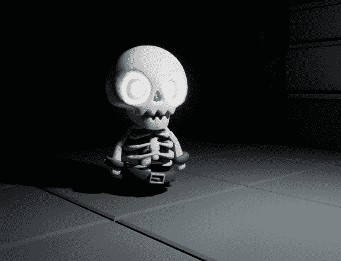

# 第九章：扩展 AI 行为

在多人游戏中增强敌人角色的行为是让游戏更具挑战性和趣味性的好方法。它还可以帮助创造更沉浸式的体验，因为敌人变得更聪明、更快、更强。通过引入新的能力或改变现有的能力，你可以让你的游戏在市场上与其他类似标题脱颖而出。

在本章中，你将学习如何为你的随从的 AI 行为添加改进——这涉及到在你的英雄角色的潜行能力和不死随从感知系统之间建立某种形式的沟通。此外，你还将学习如何让你的对手相互沟通和合作，以便让你的盗贼难以对付。

你还将为 AI 对手实现一个健康系统，让你的角色攻击，并对他们造成伤害。最后，你将为随从创建一些变化，使它们更不可预测、更有趣。

到本章结束时，你将提高你在多人游戏中管理 AI 角色的理解。此外，你将深入了解如何在网络环境中确保有效的沟通。

在本章中，我将引导你通过以下部分：

+   使 AI 对手更具挑战性

+   实现警报系统

+   为 AI 添加健康值

+   为角色添加武器系统

+   创建 AI 变化

# 技术要求

要跟随本章中介绍的主题，你应该已经完成了前面的章节，并理解了它们的内容。

此外，如果你希望从本书的配套仓库开始编写代码，你可以下载本书配套项目仓库提供的`.zip`项目文件：[`github.com/PacktPublishing/Multiplayer-Game-Development-with-Unreal-Engine-5`](https://github.com/PacktPublishing/Multiplayer-Game-Development-with-Unreal-Engine-5)。

你可以通过点击`Unreal Shadows –` `Chapter 08``End`链接下载与上一章结尾相符的最新文件。

# 使 AI 对手更具挑战性

到目前为止，你的不死随从已经装备了（或多或少）敏锐的视觉，使其能够窥视地牢的深渊，搜寻毫无戒备的猎物。然而，即使是最狡猾的小偷在悄无声息地穿过阴影时也可能意外地撞上障碍。狡猾的巫妖王对此了如指掌，并赐予了他的仆从敏锐的听觉，以至于连针掉落的声音都逃不过他们的耳朵！

在本节中，你将基于玩家角色移动实现一个基于噪音的系统。你将添加的游戏逻辑基于以下要求：

+   盗贼角色在冲刺时会发出噪音

+   噪音水平将基于角色统计数据

+   AI 随从在听到噪音时会做出反应

因此，打开你的 IDE，因为现在是时候给你的英雄添加一个新的组件功能了！

## 制造一些噪音

为了让您的盗贼角色在冲刺时发出噪音，您将添加一个新的组件——一个**pawn 噪音发射器**。这个组件不会产生实际的声音或噪音，但它会发出一个信号，可以被您附加到小兵角色上的 pawn 感知组件截获。

为了声明这个组件，打开`US_Character.h`头文件，并在`private`部分添加以下代码：

```cpp
UPROPERTY(VisibleAnywhere, BlueprintReadOnly, Category = "Stealth", meta = (AllowPrivateAccess = "true"))
TObjectPtr<UPawnNoiseEmitterComponent> NoiseEmitter;
```

现在组件已经声明，是时候初始化它了。打开`US_Character.cpp`文件，并在文件顶部添加必要的`include`声明：

```cpp
#include "Components/PawnNoiseEmitterComponent.h"
```

然后，找到构造函数，并在`FollowCamera`初始化之后，添加这两行代码：

```cpp
NoiseEmitter = CreateDefaultSubobject<UPawnNoiseEmitterComponent>(TEXT("NoiseEmitter"));
NoiseEmitter->NoiseLifetime = 0.01f;
```

在组件创建后，我们只需将其生命周期初始化为一个非常低的值（即`0.01`）——这个值表示在新噪音发射覆盖之前的应经过的时间。由于我们使用`Tick()`事件来发射噪音，而这个事件每帧都会执行，所以我们不需要一个高值。

现在，查找`Tick()`函数，并在其括号关闭之前，添加以下代码：

```cpp
if (GetCharacterMovement()->MaxWalkSpeed == GetCharacterStats()->SprintSpeed)
{
 auto Noise = 1.f;
 if(GetCharacterStats() && GetCharacterStats()->StealthMultiplier)
 {
  Noise = Noise / GetCharacterStats()->StealthMultiplier;
 }
 NoiseEmitter->MakeNoise(this, Noise, GetActorLocation());
}
```

在前面的代码中，我们验证了角色是否在冲刺，并且只有当结果为肯定时才继续进行。然后，我们根据`StealthMultiplier`角色的统一值来计算噪音。如您在*第六章*中记得的，*在网络中复制属性*，这个值是在角色统计数据表中声明的，并且随着角色的等级提升而增长。这意味着乘数越高，角色产生的噪音就越低。噪音评估后，通过`NoiseEmitter`组件使用`MakeNoise()`方法发射。

现在我们的人物已经学会了在冲刺时制造噪音的技能，是时候给我们的不死小兵装备一些敏锐的听力才能并将它们投入行动了！

## 启用听觉感知

小兵角色已经通过 pawn 感知组件具有了听到噪音的能力，但目前这个能力尚未使用。您需要打开`US_Minion.h`头文件，并在`protected`部分添加以下声明：

```cpp
UFUNCTION()
void OnHearNoise(APawn* PawnInstigator, const FVector& Location, float Volume);
```

如您所见，这是一个简单的回调声明，它将被用来处理任何噪音的监听。

接下来，在`public`部分添加以下方法声明：

```cpp
UFUNCTION(BlueprintCallable, Category="Minion AI")
void GoToLocation(const FVector& Location);
```

这是一个简单的实用函数，我们将用它将小兵发送到噪音的源头。

现在，打开`US_Minion.cpp`文件，查找`PostInitializeComponents()`的实现。在括号关闭之前，添加听觉事件的委托绑定代码：

```cpp
GetPawnSense()->OnHearNoise.AddDynamic(this, &AUS_Minion::OnHearNoise);
```

现在，通过添加以下代码来实现`OnHearNoise()`函数：

```cpp
void AUS_Minion::OnHearNoise(APawn* PawnInstigator, const FVector& Location, float Volume)
{
 GEngine->AddOnScreenDebugMessage(-1, 5.f, FColor::Green, TEXT("Noise detected!"));
 GoToLocation(Location);
 UAIBlueprintHelperLibrary::SimpleMoveToLocation(GetController(), PatrolLocation);
}
```

一旦检测到噪音，我们就将矮人送到噪音产生的位置。正如你所见，我们没有检查噪音制造者是否是我们的盗贼角色 - Lichlord 命令他的矮人细致入微地调查任何和所有的可听到的干扰，不留任何角落未被探索！

最后，添加 `GoToLocation()` 函数的实现：

```cpp
void AUS_Minion::GoToLocation(const FVector& Location)
{
 PatrolLocation = Location;
 UAIBlueprintHelperLibrary::SimpleMoveToLocation(GetController(), PatrolLocation);
}
```

在这里，我们只是设置 `PatrolLocation` 并将矮人送到那里（这并不复杂，但非常实用，你将在本章后面的部分看到）。

现在矮人已经准备好了，所以编译你的项目并开始测试。

## 测试听觉感知

为了测试全新的听觉感知功能，开始一个游戏会话，在矮人周围走动，注意不要进入他们的视野锥。除非角色开始冲刺，否则矮人不会注意到这个角色。在那个时刻，你应该会收到一个调试信息，矮人将开始追逐盗贼。*图 9**.1* 展示了一个场景，其中角色不小心跑到了一对骷髅矮人后面，随后被他们的听觉感知发现。


图 9.1 – 角色已被发现

在本节中，你为矮人角色添加了一个新的感官；这将使游戏对玩家更具战术性 - 像明天没有明天一样在地下城中四处奔跑将不再是可行的解决方案！

在接下来的部分，你将为一个消息系统铺路，这个系统能够让最不起眼的矮人在发现新鲜猎物时发出动员令。哦，你以为英雄主义都是一帆风顺的吗？啊，人的思维是多么容易出错（Lichlord 笑着说）。

# 实现警报系统

在本节中，你将工作于一个系统，允许 AI 角色在检测到玩家角色时向其同伴矮人发出警报。乍一看，你可能认为警报附近 AI 对手的代码逻辑可以直接在矮人类中实现 - 这只是发送消息的问题，对吧？但事情远不止如此，亲爱的读者。看起来 Lichlord 对通信的雄心比你预想的要大。别担心，他已经命令你使用一个直到此刻才被忽视的游戏框架类 - 游戏模式。

如你从 *第四章* 中所记得的，*设置您的第一个多人游戏环境*，**游戏模式**是一个管理游戏规则和设置的类 - 这包括与关卡中的 AI 演员通信的任务。在地下城警报新入侵者肯定是我们想在这个类中拥有的功能。

## 声明游戏模式函数

如同往常，你需要在类头文件中声明所需的函数 - 在这种情况下，你需要一个名为 `AlertMinions()` 的函数。打开 `US_GameMode.h` 头文件，并在 `public` 部分声明它：

```cpp
UFUNCTION(BlueprintCallable, Category = "Minions")
void AlertMinions(class AActor* AlertInstigator, const FVector& Location, float Radius);
```

虽然这个函数可能看起来很简单，但它将提供有价值的信息，例如哪个小兵检测到了某些东西，调查的位置，以及其他小兵应该被警报的距离。

现在，打开`US_GameMode.cpp`文件，并在代码的顶部添加以下`include`声明：

```cpp
#include "US_Minion.h"
#include "Kismet/GameplayStatics.h"
```

正如你所知道的那样，这些声明是正确实现你在类中编写的代码所必需的。一旦你添加了这些行，你就可以添加以下方法实现：

```cpp
void AUS_GameMode::AlertMinions(AActor* AlertInstigator, const FVector& Location, const float Radius)
{
 TArray<AActor*> Minions;
 UGameplayStatics::GetAllActorsOfClass(GetWorld(), AUS_Minion::StaticClass(), Minions);
 for (const auto Minion : Minions)
 {
  if(AlertInstigator == Minion) continue;
  if (const auto Distance = FVector::Distance(AlertInstigator ->GetActorLocation(), Minion->GetActorLocation()); Distance < Radius)
  {
   if (const auto MinionCharacter = Cast<AUS_Minion>(Minion))
   {
    MinionCharacter->GoToLocation(Location);
   }
  }
 }
}
```

代码通过`GetActorsOfClass()`在关卡中查找所有扩展`AUS_Minion`的类，并将它们存储在数组中。之后，它遍历这个数组，计算每个小兵与警报小兵之间的距离。如果距离在范围内（即`Radius`属性），AI 将被命令前往该位置并通过`GoToLocation()`函数进行调查。

游戏模式的警报行为已经实现；这意味着一旦侦测到入侵者，小兵就可以请求援助。

## 让 AI 发送警报消息

从 AI 角色发送消息是一个相当直接的任务，因为只要它在服务器上，游戏模式就可以从游戏中的任何演员访问——正如你可能已经知道的，这是由虚幻引擎游戏框架提供的酷炫功能。所以，让我们打开`US_Minion.h`文件，并在`private`部分声明即将发送的消息的警报半径：

```cpp
UPROPERTY(EditDefaultsOnly, BlueprintReadOnly, Category = "Minion AI", meta = (AllowPrivateAccess = "true"))
float AlertRadius = 6000.0f;
```

使用可配置的半径范围将有助于创建不同类型的小兵——你想要一个超级警觉、刺耳的哨兵吗？将其设置为非常高的值！或者选择一个黏糊糊、自私的 AI，只为 Lichlord 的恩惠和亡灵晋升而存在，将其设置为零——这样，其他小兵都不会被警报，哨兵（希望）在到达玩家角色时会被其主人抚摸一下头。选择权在你！

要实现这个功能，打开`US_Minion.cpp`文件，并在文件的非常开头添加以下`include`：

```cpp
#include "US_GameMode.h"
```

然后，定位到`Chase()`方法。在其闭合括号之前，添加以下代码：

```cpp
if(const auto GameMode = Cast<AUS_GameMode>(GetWorld()->GetAuthGameMode()))
{
 GameMode->AlertMinions(this, Pawn->GetActorLocation(), AlertRadius);
}
```

如你所见，一旦检索到游戏模式，我们只需发送带有适当参数的警报消息。现在是时候编译项目并进行一些测试了。

### 测试警报实现

开始一个新的游戏会话，一旦小兵的数量足够多，让你的角色被其中之一侦测到。一旦警报，所有附近的小兵将开始调查该区域，对玩家构成严重威胁，因为越来越多的 AI 角色发现了他们，可能导致潜在的连锁反应。

*图 9.2*显示了这种情况之一——玩家不够隐秘，AI 对手已经开始检测角色并相互警报。


图 9.2 – 警报系统正在运行

在本节中，你为你的 AI 对手实现了一个消息系统，并学习了拥有集中管理游戏逻辑的力量的重要性。

在下一节中，你将使用游戏框架伤害系统让玩家击败敌人。你真的相信我会让可怜的盗贼英雄在没有帮助的情况下在巫妖领主的手中腐烂吗？好吧，再想想，亲爱的读者！

# 为 AI 添加健康值

在这个项目部分，你将为小兵 AI 添加一个健康系统，使其在游戏过程中可以被击败。你还将添加一个生成系统，以便当对手被击败时，玩家将获得应得的奖励。

要实现这些功能，我们需要打开迷你兵类并开始编写代码——打开`US_Minion.h`头文件，并在`private`部分添加以下两个声明：

```cpp
UPROPERTY(EditDefaultsOnly, BlueprintReadOnly, Category="Health", meta = (AllowPrivateAccess = "true"))
float Health = 5.f;
UPROPERTY(EditDefaultsOnly, BlueprintReadOnly, Category="Pickup", meta = (AllowPrivateAccess = "true"))
TSubclassOf<class AUS_BasePickup> SpawnedPickup;
```

第一个用于跟踪敌人的健康值，而第二个将包含在击败小兵后将生成的物品拾取物的类。两者都可以在子蓝图类（多亏了`EditDefaultsOnly`属性指定符）中进行修改，因此你可以构建自己版本的迷你兵。

现在，定位到`protected`部分，并添加伤害处理声明：

```cpp
UFUNCTION()
void OnDamage(AActor* DamagedActor, float Damage, const UDamageType* DamageType, AController* InstigatedBy, AActor* DamageCauser);
```

现在标题已经完成，是时候打开`US_Minion.cpp`文件并实现健康系统了。像往常一样，首先在文件顶部添加所需的`include`声明：

```cpp
#include "US_BasePickup.h"
```

接下来，声明当角色被击败时将生成的基类拾取物；你将使用在*第六章*中创建的拾取物硬币，*在网络中复制属性* *O**ver the Network*。定位到构造函数，并在闭合括号之前添加以下代码：

```cpp
static ConstructorHelpers::FClassFinder<AUS_BasePickup> SpawnedPickupAsset(TEXT("/Game/Blueprints/BP_GoldCoinPickup"));
if (SpawnedPickupAsset.Succeeded())
{
 SpawnedPickup = SpawnedPickupAsset.Class;
}
```

这段代码逻辑应该很熟悉，因为我们从项目库中获取一个蓝图资产并将其分配给`SpawnedPickup`引用。

然后，我们需要实现伤害处理逻辑。定位到`PostInitializeComponents()`方法，并添加以下代码行：

```cpp
OnTakeAnyDamage.AddDynamic(this, &AUS_Minion::OnDamage);
```

在这里，我们只是将`OnDamage`处理程序绑定到`OnTakeAnyDamage`委托。作为最后一步，我们需要实现`OnDamage()`方法，因此将以下代码添加到你的类中：

```cpp
void AUS_Minion::OnDamage(AActor* DamagedActor, float Damage, const UDamageType* DamageType, AController* InstigatedBy,
 AActor* DamageCauser)
{
 Health -= Damage;
 if(Health > 0) return;
 if(SpawnedPickup)
 {
  GetWorld()->SpawnActor<AUS_BasePickup>(SpawnedPickup, GetActorLocation(), GetActorRotation());
 }
 Destroy();
}
```

这个函数的作用是从`Health`属性中减去`Damage`值；如果小兵的生命值达到零，它将立即生成奖励（即拾取物），然后它会自我销毁。

在本节中，你通过添加`Health`属性并跟踪其值（在受到伤害时）为 AI 对手创建了一个简单的健康系统，当小兵被击败时，它会生成一枚硬币或类似的奖励，供最近的（或最快的）角色拾取！

不幸的是，对于你的玩家来说，这个不幸的盗贼英雄团伙目前装备不足，无法在险恶的地下领域中派遣巫妖领主的仆从！别担心，我们将在下一节中通过为他们增添丰富的武器库来帮助他们。

# 将武器系统添加到角色中

您心爱的角色自从您开始实现它以来就一直渴望一个武器系统。在本节中，我们将最终满足它的愿望，并赋予它使用（不那么）强大的破坏工具的能力。让我们通过装备一个惊人的武器来使我们的角色变得更强大、更可怕！

由于我们的角色英雄是一个狡猾的小偷，他更喜欢避免与更强壮、装甲更厚的对手进行直接战斗，因此我们将专注于投掷匕首系统。

为了避免在 `US_Character` 类中添加杂乱的代码，你将实现一个新的组件来处理武器逻辑——这意味着你将专注于以下功能：

+   将要添加到角色中的一个组件，用于处理玩家输入和匕首生成逻辑

+   将在运行时投掷并造成敌人对手伤害的匕首武器

作为第一步，我们将创建在游戏过程中攻击时由角色生成的武器投射物。

## 创建匕首投射物

首先要做的事情是创建一个投射物类，它将作为可投掷的匕首。为此，在 Unreal 编辑器中，创建一个新的 C++类，该类将扩展 `Actor`，并将其命名为 `US_BaseWeaponProjectile`。一旦创建，打开 `US_BaseWeaponProjectile.h` 文件，在 `private` 部分，添加以下组件声明：

```cpp
UPROPERTY(VisibleAnywhere, BlueprintReadOnly, Category="Components", meta = (AllowPrivateAccess = "true"))
TObjectPtr<class USphereComponent> SphereCollision;
UPROPERTY(VisibleAnywhere, BlueprintReadOnly, Category="Components", meta = (AllowPrivateAccess = "true"))
TObjectPtr<UStaticMeshComponent> Mesh;
UPROPERTY(VisibleAnywhere, BlueprintReadOnly, Category = "Components", meta = (AllowPrivateAccess = "true"))
TObjectPtr<class UProjectileMovementComponent> ProjectileMovement;
```

如您所见，我们将添加一个碰撞区域以在游戏过程中检查击中，一个用于匕首模型的静态网格，以及投射逻辑，使匕首在被投掷后移动。

仍然在 `private` 部分，添加 `Damage` 属性，其基本值为 `1`：

```cpp
UPROPERTY(EditDefaultsOnly, BlueprintReadOnly, Category="Weapon", meta = (AllowPrivateAccess = "true"))
float Damage = 1.f;
```

然后，在 `public` 部分，添加组件的常规获取方法：

```cpp
FORCEINLINE USphereComponent* GetSphereCollision() const { return SphereCollision; }
FORCEINLINE UStaticMeshComponent* GetMesh() const { return Mesh; }
FORCEINLINE UProjectileMovementComponent* GetProjectileMovement() const { return ProjectileMovement; }
```

最后，我们需要添加一个处理武器与目标接触时的处理程序。将以下代码添加到 `protected` 部分：

```cpp
UFUNCTION()
void OnHit(UPrimitiveComponent* HitComponent, AActor* OtherActor, UPrimitiveComponent* OtherComp, FVector NormalImpulse,
 const FHitResult& Hit);
```

头文件已经准备好了，所以我们需要实现逻辑——打开 `US_BaseWeaponProjectile.cpp` 文件，并在其顶部添加必要的 `include` 声明：

```cpp
#include "US_Character.h"
#include "US_CharacterStats.h"
#include "Components/SphereComponent.h"
#include "Engine/DamageEvents.h"
#include "GameFramework/ProjectileMovementComponent.h"
```

然后，找到构造函数并添加以下代码：

```cpp
SphereCollision = CreateDefaultSubobject<USphereComponent>("Collision");
SphereCollision->SetGenerateOverlapEvents(true);
SphereCollision->SetSphereRadius(10.0f);
SphereCollision->BodyInstance.SetCollisionProfileName("BlockAll");
SphereCollision->OnComponentHit.AddDynamic(this, &AUS_BaseWeaponProjectile::OnHit);
RootComponent = SphereCollision;
Mesh = CreateDefaultSubobject<UStaticMeshComponent>("Mesh");
Mesh->SetupAttachment(RootComponent);
Mesh->SetCollisionEnabled(ECollisionEnabled::PhysicsOnly);
Mesh->SetRelativeLocation(FVector(-40.f, 0.f, 0.f));
Mesh->SetRelativeRotation(FRotator(-90.f, 0.f, 0.f));
static ConstructorHelpers::FObjectFinder<UStaticMesh> StaticMesh(TEXT("/Game/KayKit/DungeonElements/dagger_common"));
if (StaticMesh.Succeeded())
{
 GetMesh()->SetStaticMesh(StaticMesh.Object);
}
ProjectileMovement = CreateDefaultSubobject<UProjectileMovement Component>("ProjectileMovement");
ProjectileMovement->UpdatedComponent = SphereCollision;
ProjectileMovement->ProjectileGravityScale = 0;
ProjectileMovement->InitialSpeed = 3000;
ProjectileMovement->MaxSpeed = 3000;
ProjectileMovement->bRotationFollowsVelocity = true;
ProjectileMovement->bShouldBounce = false;
bReplicates = true;
```

这段代码逻辑虽然较长，但易于理解——我们只是创建和初始化必要的组件：

`SphereCollision` 包含一些你应该熟悉的基本值：

+   `Mesh` 设置为匕首模型，并旋转定位以与整体 Actor 对齐

+   `ProjectileMovement` 禁用了重力，并具有使 Actor 快速移动并模拟真实匕首的速度

有一点需要说明的是，我们通过 `AddDynamic` 辅助宏将 `OnHit()` 方法绑定到 `OnComponentHit` 代理。此外，注意代码的最后一行激活了武器的复制功能——始终记住，默认情况下 Actors 不会被复制！

现在，添加 `OnHit()` 实现方法：

```cpp
void AUS_BaseWeaponProjectile::OnHit(UPrimitiveComponent* HitComponent, AActor* OtherActor,
 UPrimitiveComponent* OtherComp, FVector NormalImpulse, const FHitResult& Hit)
{
 auto ComputedDamage = Damage;
 if (const auto Character = Cast<AUS_Character>(GetInstigator()))
 {
  ComputedDamage *= Character->GetCharacterStats()->DamageMultiplier;
 }
 if (OtherActor && OtherActor != this)
 {
  const FDamageEvent Event(UDamageType::StaticClass());
  OtherActor->TakeDamage(ComputedDamage, Event, GetInstigatorController(), this);
 }
 Destroy();
}
```

代码可以分为三个主要部分：

+   在第一部分，我们从`Damage`基本值开始计算伤害。如果肇事者（即生成投射物的角色）是`US_Character`，我们将从统计数据中获取其伤害乘数并更新引起的伤害。这意味着角色的等级越高，伤害就越高。

注意

想要回顾一下如何管理角色统计数据，请回顾*第六章*，*在网络中复制属性* *O**ver* *the Network*。

+   代码的第二部分验证发射的投射物是否击中了演员。如果是，它将造成相应的伤害量。

+   最后的部分只是销毁投射物 – 它的任务已经完成，这意味着它应该从游戏中移除。

当投射物已经设置好并准备就绪时，是时候实现一些生成逻辑，以便你的盗贼英雄能够释放这把闪亮新武器的全部力量。

## 实现武器组件

让我们先创建一个将添加新功能的类。如您从*第四章*，*设置您的第一个多人环境*中可能记得，一个组件将允许你实现可重用的功能，并可以附加到任何演员或另一个组件。在这种情况下，我们将实现一个武器系统，具有`Transform`属性） – 这将允许你将组件放置在角色内部某个位置，并作为投掷投射物的生成点。

让我们先创建这个类。为此，创建一个新的类，从场景组件扩展而来，并将其命名为`US_WeaponProjectileComponent`。一旦创建过程完成，打开`US_WeaponProjectileComponent.h`，在`private`部分，添加以下声明：

```cpp
UPROPERTY(EditDefaultsOnly, BlueprintReadOnly, Category="Projectile", meta = (AllowPrivateAccess = "true"))
TSubclassOf<class AUS_BaseWeaponProjectile> ProjectileClass;
UPROPERTY(EditAnywhere, BlueprintReadOnly, Category="Input", meta=(AllowPrivateAccess = "true"))
class UInputMappingContext* WeaponMappingContext;
UPROPERTY(EditAnywhere, BlueprintReadOnly, Category="Input", meta=(AllowPrivateAccess = "true"))
class UInputAction* ThrowAction;
```

如您所见，我们声明了投射物类（即我们之前创建的投射物，或其子类）。然后，我们声明了必要的元素，这将使我们能够利用增强的输入系统。由于我们不希望向主要角色添加依赖项，我们将使用与*第五章*，*在多人环境中管理演员*中使用的不同映射上下文 – 这将使我们能够实现灵活的战斗系统，并添加我们想要的任何功能，而不会给主要角色类添加杂乱。想象一下，看着你的狡猾盗贼英雄悄悄穿过阴影，静静地从背后刺杀那个令人恐惧的巫妖领主最令人憎恨的走狗！混乱和恶作剧的可能性将是无穷无尽的！

好吧，让我们停止做梦，回到编码上来。在`public`部分，添加一个用于投射物类的 setter，这将允许你更改生成的匕首投射物：

```cpp
UFUNCTION(BlueprintCallable, Category = "Projectile")
void SetProjectileClass(TSubclassOf<class AUS_BaseWeaponProjectile> NewProjectileClass);
```

这个函数与扔东西无关，但如果你想在你的游戏中添加武器拾取功能，以提高角色的战斗技能，它将非常有用。

最后，在`protected`部分，声明`Throw()`动作及其对应的服务器调用：

```cpp
void Throw();
UFUNCTION(Server, Reliable)
void Throw_Server();
```

这段代码将使我们能够在游戏过程中从服务器生成投掷匕首 – 总是记住，在生成复制的 Actor 时，服务器应该处于指挥地位。

现在头文件已经完成，打开`US_WeaponProjectileComponent.cpp`文件以开始实现其功能。像往常一样，找到文件顶部，并添加我们将使用的类的`include`声明：

```cpp
#include "EnhancedInputComponent.h"
#include "EnhancedInputSubsystems.h"
#include "US_BaseWeaponProjectile.h"
#include "US_Character.h"
```

然后，在构造函数中，添加以下单行代码：

```cpp
ProjectileClass = AUS_BaseWeaponProjectile::StaticClass();
```

在这里，我们只需声明当抛掷动作被触发时将生成的基礎投射物；显然，如果你需要不同的武器，你可以在派生蓝图类中更改它。

现在，定位`BeginPlay()`方法，并在`Super::BeginPlay()`声明之后添加以下代码：

```cpp
const ACharacter* Character = Cast<ACharacter>(GetOwner());
if(!Character) return;
if (const APlayerController* PlayerController = Cast<APlayerController>(Character->GetController()))
{
 if (UEnhancedInputLocalPlayerSubsystem* Subsystem = ULocalPlayer::GetSubsystem<UEnhancedInputLocalPlayerSubsystem>(PlayerController->GetLocalPlayer()))
 {
  Subsystem->AddMappingContext(WeaponMappingContext, 1);
 }
 if (UEnhancedInputComponent* EnhancedInputComponent = Cast<UEnhancedInputComponent>(PlayerController->InputComponent))
 {
  EnhancedInputComponent->BindAction(ThrowAction, ETriggerEvent::Triggered, this, &UUS_WeaponProjectileComponent::Throw);
 }
}
```

在前面的代码中，我们检查组件所有者是我们的`US_Character`类，以便获取其控制器并初始化映射上下文及其动作。请注意，这个初始化是在`BeginPlay()`函数内完成的，这意味着这些步骤只会执行一次 – 也就是说，当游戏开始时 – 以确保存在一个 Actor 所有者和相应的控制器。

现在，通过添加以下方法实现来实施投掷逻辑：

```cpp
void UUS_WeaponProjectileComponent::Throw()
{
 Throw_Server();
}
void UUS_WeaponProjectileComponent:: Throw_Server_Implementation()
{
 if (ProjectileClass)
 {
  const auto Character = Cast<AUS_Character>(GetOwner());
  const auto ProjectileSpawnLocation = GetComponentLocation();
  const auto ProjectileSpawnRotation = GetComponentRotation();
  auto ProjectileSpawnParams = FActorSpawnParameters();
  ProjectileSpawnParams.Owner = GetOwner();
  ProjectileSpawnParams.Instigator = Character;
  GetWorld()->SpawnActor<AUS_BaseWeaponProjectile>(ProjectileClass, ProjectileSpawnLocation, ProjectileSpawnRotation, ProjectileSpawnParams);
 }
}
```

如你所见，`Throw()`方法只是调用服务器端实现，从组件位置生成投射物。你已经熟悉了生成动作（你还记得小兵生成器吗？），但这次有一个重要的事情要注意 – 我们使用`FActorSpawnParameters`结构来设置投射物的所有者和，最重要的是，发起者（即生成对象的 Actor）。这个属性被投射物用来检索角色统计数据和处理伤害乘数，这是我们之前章节中实现的代码逻辑。

最后，添加一个设置器方法，让你可以更改角色生成的武器：

```cpp
void UUS_WeaponProjectileComponent::SetProjectileClass(TSubclassOf<AUS_BaseWeaponProjectile> NewProjectileClass)
{
 ProjectileClass = NewProjectileClass;
}
```

组件现在已经被正确设置 – 你只需将其实例附加到盗贼角色上，使其完全可用。

## 将武器投射物组件附加到角色上

现在你已经创建了一个武器组件，是时候将其添加到角色上了。打开`US_Character.h`头文件，并在`private`部分添加组件声明：

```cpp
UPROPERTY(VisibleAnywhere, BlueprintReadOnly, Category = "Weapon", meta = (AllowPrivateAccess = "true"))
TObjectPtr<class UUS_WeaponProjectileComponent> Weapon;
```

然后，像往常一样，在`public`部分添加相应的获取器实用方法：

```cpp
FORCEINLINE UUS_WeaponProjectileComponent* GetWeapon() const { return Weapon; }
```

然后，打开`US_Character.cpp`源文件，并在文件顶部包含组件类声明：

```cpp
#include "US_WeaponProjectileComponent.h"
```

现在，定位构造函数，并在噪声发射器创建和初始化之后添加以下代码：

```cpp
Weapon = CreateDefaultSubobject<UUS_WeaponProjectileComponent>(TEXT("Weapon"));
Weapon->SetupAttachment(RootComponent);
Weapon->SetRelativeLocation(FVector(120.f, 70.f, 0.f));
```

如您所见，在创建组件后，我们将其附加到角色的根组件上，并将其定位在相对位置，设置为 `(120, 70, 0)`。如果您想让您的角色为左撇子，只需为 `X` 坐标使用负值（即，`-120.f`）即可。

虽然难以相信，但将武器组件附加到角色的代码已经完成；代码逻辑已经在组件本身中处理，所以您可以坐下来放松，让一切像一台运转良好的机器一样各就各位！

现在，您现在可以切换回虚幻编辑器并编译您的项目 – 完成后，您可以打开 `WeaponProjectile` 组件，将 **弹道类** 设置为默认值，如图 *图 9**.3* 所示：


图 9.3 – 附加到角色演员的 WeaponProjectile 组件

将 `WeaponProjectile` 组件附加到角色后，最后要做的就是为玩家输入创建映射上下文，并为抛出逻辑创建输入动作。

## 添加武器输入系统

在本节的最后部分，您将定义映射上下文和抛出交互的输入动作。这您已经很熟悉了，因为您之前在 *第五章*，*在多人环境中管理演员* 中创建了类似的资产。

所以，无需多言，让我们打开内容浏览器并导航到 **内容** | **输入** 文件夹。我们将按照以下步骤创建抛出动作资产。

### 设置抛出交互的输入映射上下文

要创建抛出交互的动作资产，请按照以下步骤操作：

1.  在内容浏览器中右键单击并选择 `IA_Throw`。

1.  双击资产以打开它，然后从 **值类型** 下拉菜单中选择 **数字（bool）**。

1.  确认 **消耗输入** 复选框已被勾选。

抛出动作资产的最终结果如图 *图 9**.4* 所示：


图 9.4 – 抛出动作设置

现在动作已经设置好了，让我们为武器交互创建一个映射上下文。

### 设置武器交互的输入映射上下文

要创建武器上下文映射，请按照以下步骤操作：

1.  在内容浏览器中右键单击并选择 `IMC_Weapons`。双击资产以打开它。

1.  通过点击 **映射** 字段旁边的 **+** 图标添加一个新的映射上下文。

1.  从将添加的下拉菜单中选择 **IA_Throw** 以将此动作添加到映射上下文。

1.  在下拉菜单旁边的 **+** 图标上单击两次以添加此动作的两个其他控制绑定（其中一个已默认设置）。在每个新字段旁边的下拉菜单中，使用以下属性：

    +   第一个绑定应设置为 **左 Ctrl** 来自 **键盘** 类别

    +   第二个绑定应该设置为**游戏手柄面键右侧**，来自**游戏手柄**类别

    +   第三个绑定应该设置为**鼠标左键**，来自**鼠标**类别

武器映射上下文的最终结果应该像 *图 9**.5* 中所示的那样：


图 9.5 – 武器映射上下文设置

现在资产已经准备好了，是时候将它们添加到角色上了：

1.  打开 **BP_Character** 蓝图，选择 **Weapon** 组件，并在 **Details** 面板中找到 **Input** 类别。

1.  在 **Weapon Mapping Context** 字段中，分配 **IMC_Weapons** 资产。

1.  在 **Throw Action** 字段中，分配 **IA_Throw** 资产。

一旦设置了这些属性，你的 **Input** 类别应该看起来像 *图 9**.6* 中所示的那样：


图 9.6 – 更新的输入类别

现在输入设置已经得到适当的更新，是时候进行一些测试以检查一切是否正常工作。

## 测试武器系统

是时候向巫妖领的奴仆展示谁是老板，并在他们的地下巢穴中造成一些混乱了！让我们通过开始一个游戏会话来让他们尝尝我们英雄的瞄准技巧。

在游戏过程中，你的角色应该能够在使用投掷动作时随时生成匕首 – 例如，通过点击左鼠标按钮。匕首应该在其击中任何东西时销毁自己，并对 AI 奴隶造成伤害。

当一个奴仆的生命值降到零时，它应该从游戏中移除，并在关卡中生成一个硬币。收集足够的硬币将使你的角色升级，因此，当角色击中任何敌人时，角色本身将造成额外的伤害。

*图 9**.7* 展示了角色在游戏过程中投掷匕首：


图 9.7 – 匕首攻击动作

在本节中，你通过将一个新组件附加到你的角色和一个可以在游戏中生成并通过网络正确复制的投射体 Actor 来实现武器系统。

在接下来的章节中，你将引入一些 AI 对手的多样化变体，目的是增强游戏的多样性和整体可玩性。

# 创建 AI 变体

现在我们已经将 AI 对手全部设置好并准备好进行一些史诗般的战斗，让我们为 AI 奴隶添加更多变体，使游戏更加有趣和吸引人。如果一个项目已经得到了良好的规划，改变 AI 的行为 – 即使是像我们在本章中创建的基本 AI – 通常只是调整一些设置的问题！

在本节中，你将创建一个新的 AI 对手，从基本的 `US_Minion` 类开始，然后你将调整其属性以赋予它不同的行为。

## 创建 AI 哨兵

当看到无脑的小兵在地下城 cluelessly 漫游时，可能会引起一两声笑声，但这绝对不足以满足巫妖王的狡猾计划。他想要确保他的领地每个角落都安全并有良好的守卫。这意味着你需要制作一些具有敏锐感官和更具领地性的不死生物监视者。

首先，我们创建一个蓝图类，继承自基本的小兵。打开内容浏览器，完成以下步骤：

1.  在 `Blueprints` 文件夹中，右键单击并选择 **蓝图类**。

1.  从弹出的窗口中，从 **所有** **类** 部分选择 **US_Minion**。

1.  将新创建的蓝图命名为 `BP_MinionSentinel`，然后双击它以打开。

1.  在 `6000,0`

1.  设置 `60,0`

1.  设置 `20,0`

1.  设置 `1000,0`

1.  本类别的最终设置如图 *9.8* 所示：


图 9.8 – 监视者小兵 AI 设置

1.  然后，在 `600,0`

1.  设置 `1000,0`

1.  设置 `2500,0`

1.  设置 `60,0`

本类别的最终设置如图 *9**.9* 所示：


图 9.9 – 监视者 AI 设置

使用这些设置，你将创建一个将在大约小区域内巡逻的小兵，频繁改变方向，移动非常缓慢。它的感官将非常敏锐，其警报半径将大于普通小兵。当发现入侵者时，监视者会减速，呼叫帮助，让更具有侵略性的同类来处理追逐。它不是战斗型，但仍然在寻找任何可疑活动！

1.  作为最后的点缀，你可以通过将网格 **Materials** 列表中的 **Element 5** 改为 **M_Base_Emissive** 材质资产，为这个注视黑暗的不死生物角色添加一对发光的眼睛，如图 *9**.10* 所示：


图 9.10 – 材质设置

监视者的最终结果（添加了一些戏剧性的闪电效果）可以在 *图 9**.11* 中看到：



图 9.11 – 场景中添加的监视者

如您所见，您只需对 **详情** 面板进行一些调整，就创建了一个新的 AI。让我们再创建一个，一个更具侵略性的不死生物小兵。

## 创建 AI 小型 Boss

实际上，你可以使用之前小节中有效的方法来创建一个新的 AI，它将以完全不同的方式处理英雄入侵者。这就像在食谱中发挥创意，制作出既新颖又出乎意料（但仍然危险地美味）的东西！

打开内容浏览器并完成以下步骤：

1.  在 `Blueprints` 文件夹中，右键单击并选择 **蓝图类**。

1.  从弹出的窗口中，从 **所有** **类** 部分选择 **US_Minion**。

1.  将新创建的蓝图命名为 `BP_MinionMiniboss`，然后双击它以打开。

1.  在 `100,0`

1.  设置 `100,0`

1.  设置 `400,0`

1.  设置 `50000,0`

1.  该类别的最终设置如图 *图 9.12* 所示：


图 9.12 – 小型 Boss 随从 AI 设置

1.  然后，在 `200,0`

1.  设置 `400,0`

1.  设置 `200,0`

1.  设置 `20,0`

该类别的最终设置如图 *图 9.13* 所示：


图 9.13 – 小型 Boss AI 设置

这个 AI 对手在巡逻时被设置为非常单调的行为（感知低，移动速度慢等），但一旦被警告，它就会变得非常快。

此外，小型 Boss 开始看起来有点单调，所以 Lichlord 决定给它一个字面上的装甲改造。为此，请按照以下步骤操作：

1.  选择 **网格** 组件，并将 **骨骼网格资产** 属性更改为 **skeleton_warrior** 资产。

1.  将 **网格** 缩放比例更改为 **1.2** 以使其更大。

1.  将 **健康** 属性设置为 **20** 以使其更具抗伤害性。

这个敌人即将从“一般”变成威胁，英雄入侵者最好小心！与基础随从相比，小型 Boss 的最终结果如图 *图 9.14* 所示：


图 9.14 – 小型 Boss 随从

它的美丽之处在于你可以对你的敌人对手进行非常具有创造性的设定，并测试出各种不同的行为和战术。如果有什么东西对你不起作用，别担心！只需删除它，然后在短短几分钟内用新的东西重新开始。

作为 AI 的一个额外亮点，为什么不使用我们在本章早期添加的拾取出生系统来为游戏增添趣味？根据被打败的随从的稀有程度或危险程度，你可以让它孵化不同类型的硬币！

一旦你的不死军准备好，你就可以回到你的敌人出生器，并将蓝图添加到系统中——我们将在下一小节中这样做。

## 更新随从出生器

如你所猜，添加你全新的随从种类只需将它们的蓝图放入出生器中。为此，选择你之前添加到关卡中的出生器，并在 **详细信息** 面板中找到 **可出生随从** 数组属性，在 **出生系统** 类别中——列表中应该已经有一个项目，**US_Minion**。

添加你想要的任何物品，选择你需要用于特定出生区域的随从。*图 9.15* 显示了我在关卡主出生区域中的设置：


图 9.15 – 出生区域设置

如您所见，我选择了五个元素，每次调用`Spawn()`方法时，每个元素有 20%的机会被添加到关卡中。由于基本小兵利用了这三个元素，因此它以 60%的概率出现为对手，而哨兵和迷你 Boss 只有 20%的概率生成。

一旦您对设置满意，您就可以测试游戏。*图 9.16*显示了游戏开始时我的生成器正在运行：


图 9.16 – 游戏开始时的生成器

在本节的最后，您为基本小兵创建了一些变体；通过改变它们的一些基本属性，您改变了它们在游戏中的行为方式，使您的关卡更具吸引力和多样性。

# 摘要

在本章中，您积极努力改善关卡内敌人 AI 的行为。重点是开发新的功能，使游戏体验对玩家来说更具吸引力和挑战性。您实际上改善了 Lichlord 小兵的听觉，使它们在发现那些可怜的盗贼英雄时更加警觉和敏锐。

反过来，您还为小兵实现了健康系统，并为玩家的装备库添加了一些相当锋利（字面意思！）的工具，他们可以使用这些工具击败那些讨厌的敌人！最后，您还创建了一些敌人变体，使地牢对玩家来说不再无聊，更具吸引力。

如您在此处所构建的所示，如果您提前规划，提高游戏玩法可以变得轻而易举！通过花时间仔细制定策略并实施正确的功能，您可以使游戏玩法对玩家更具吸引力和沉浸感，同时也能实现您期望的结果。

在下一章中，我们将通过添加动画和需要解救的囚犯来改善游戏的整体外观和感觉。此外，我将为您提供一些如何将您的游戏提升到下一个层次的技巧，但让我们明确一点——我不会为您编写所有代码！我相信您有能力创造出一些惊人的东西，我迫不及待地想看看您能想出什么！
