# 10

# 提升玩家体验

提高视频游戏的最佳方式之一是为它添加良好的外观和感觉。一款外观出色的游戏将创造一个沉浸式的体验，吸引玩家并使他们想要不断回来玩。

因此，对于开发者来说，专注于调整视觉和音频反馈，直到一切看起来都恰到好处非常重要！这可能需要一些时间，但确保这些最后的细节正确无误将确保您的视频游戏拥有令人惊叹的外观和感觉——这是玩家们短时间内不会忘记的！

考虑到这一点，下一章将专注于改进某些方面，例如使用不同的动画组合并在网络上同步它们，或者添加**非玩家角色**（NPCs）进行交互——这些是主角渴望已久的特性。

此外，您将为玩家提供一个战斗的理由：勇敢地营救一些被囚禁的同志！

最后，我将分享一些额外的想法，以帮助您完成您的多人游戏。这本书可能没有足够的页面来涵盖每一个细节，但这不应该阻止您的创造力和想象力翱翔！

到本章结束时，您将拥有一个光滑且健壮的多人游戏原型，并且将准备好开始下一阶段——学习如何优化它。

在本章中，我将引导您通过以下部分：

+   为角色动画

+   添加 NPC 演员

+   进一步改进游戏

# 技术要求

要跟随本章介绍的主题，您应该已经完成了前面的章节，并理解了它们的内容。

此外，如果您希望从本书的配套仓库开始编写代码，您可以下载提供的`.zip`项目文件：

[`github.com/PacktPublishing/Multiplayer-Game-Development-with-Unreal-Engine-5`](https://github.com/PacktPublishing/Multiplayer-Game-Development-with-Unreal-Engine-5)

您可以通过点击`Unreal Shadows – 第九章 结束`链接下载与上一章结尾一致的最新文件。

# 为角色动画

到目前为止，您的英雄一直在探索地牢，寻找隐藏的宝藏，同时避开敌人，但还有一些东西缺失，才能真正让它栩栩如生——一个合适的动画系统。

在本节中，我将引导您创建简单的动画，这些动画将在您项目的网络环境中工作。这涉及到创建专门为动画系统设计的蓝图，并建立它们与您的角色类的连接——您将创建所需的动画资源，然后添加所需的代码以确保一切正常工作。

## 创建动画资源

在虚幻引擎中动画角色涉及创建**动画蓝图**来处理角色动作和移动的逻辑。本书并不优先考虑这个主题 – 实际上，这通常不是游戏程序员的主要关注点！然而，对内部工作原理有一些基本了解将有助于丰富你的游戏开发工具箱。

要为玩家角色创建一个简单但功能齐全的动画系统，我们需要三个资源：

+   用于控制从空闲到行走再到跑步，以及相反方向移动过渡的资源

+   用于播放投掷动画的资源

+   一个蓝图来控制上述两个资源

要开始，我们首先需要一个文件夹来存放所有资源。因此，打开虚幻编辑器，在`Animations`中。一旦创建，你就可以添加第一个资源。

### 创建运动混合空间

在虚幻引擎中，**混合空间**是一个特殊资源，允许根据两个输入值来混合动画。它允许通过将多个动画绘制到一维或二维图表上来混合多个动画。动画师和游戏开发者经常使用混合空间来创建游戏中角色不同动画之间的平滑和逼真的过渡。

在我们的案例中，我们需要混合三个动画 – 空闲、行走和冲刺动画 – 这些动画将根据角色的速度进行管理。

要创建这个混合空间，完成以下步骤：

1.  在`Animations`文件夹内，右键点击并选择**动画 | 混合空间**。然后，从弹出的**选择骨架**窗口中，选择**rogue_Skeleton**，如*图 10.1*所示：

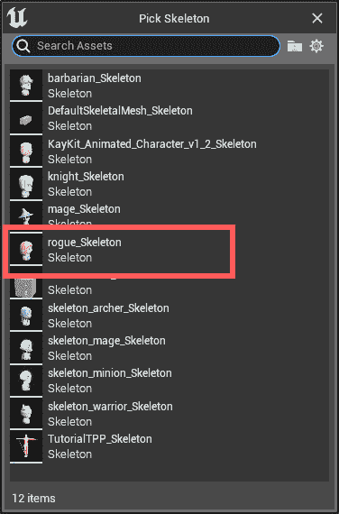

图 10.1 – 创建混合空间

1.  将新创建的资源命名为`BS_WalkRun`，双击它以打开**混合空间** **编辑器**窗口。

1.  在`Speed`

1.  设置`500`

1.  保持**垂直轴**部分不变（即，设置为**无**），因为我们不会使用它。

我们在这里所做的初始化动画混合的主要设置值，暴露了将被我们稍后添加的控制蓝图使用的**Speed**属性。

现在，你将添加将被混合在一起的动画资源。

1.  在**资源浏览器**中找到**rogue_Idle**动画，并将其拖拽到编辑器中心的图中。这将创建一个在图坐标系统中的点。

1.  选择点并设置其`0`和其`0`。

你应该得到一个看起来像*图 10.2*中描述的图表：


图 10.2 – 空闲动画设置

现在，我们将向图表中添加两个更多资源 – 一个用于行走动画，另一个用于跑步动画。

1.  拖动`45`及其`0`。

1.  再次，拖动`100`及其`0`。

1.  拖动`500`及其`0`。

完整的混合空间资源可以在*图 10.3*中看到：

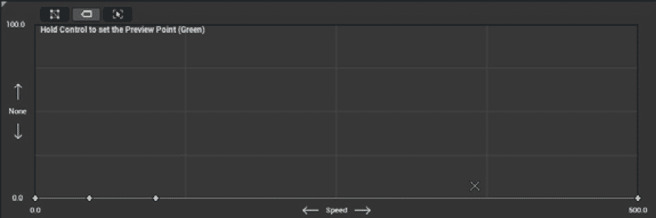

图 10.3 – 完整混合空间

要测试角色上的动画混合，您可以简单地按住*Ctrl*键并将鼠标悬停在您想要检查的图表区域上 – 您将看到角色开始行走和移动循环，动画资产无缝混合。混合空间已完成，因此我们现在可以开始创建处理投掷动画的资产。

### 创建投掷动画蒙太奇

**动画蒙太奇**是一种资产类型，它允许从蓝图组合多个动画并选择性地播放。动画蒙太奇通常用于创建复杂的动画序列，如攻击组合、场景和其它交互式游戏元素。在我们的项目中，我们将使用它来播放由控制蓝图播放的单次投掷动画。

要创建动画蒙太奇，请完成以下步骤：

1.  在`Animations`文件夹中，右键单击并选择**Animation | Animation Montage**。然后，从弹出的**选择骨架**窗口中，选择**rogue_Skeleton**。

1.  将新创建的资产命名为`AM_Throw`并双击它以打开**动画蒙太奇****编辑器**窗口。

1.  从**资产浏览器**中，将**rogue_Throw**资产 – 在**DefaultGroup.DefaultSlot**行 – 拖动到编辑器中心的时序线上。

动画蒙太奇的最终结果如图*图 10**.4*所示：

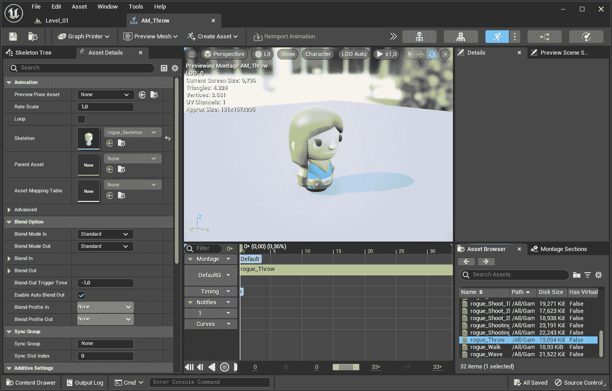

图 10.4 – 投掷动画蒙太奇

此蒙太奇和之前的**混合空间**资产将由一个专门的蓝图控制，我们将在下一步骤中将它添加到项目中。

### 创建角色动画蓝图

**动画蓝图**是一种专门类型的蓝图，用于创建和控制游戏中 Actors 的复杂动画行为。它定义了动画应该如何处理和混合，以及动画输入应该如何映射。

在我们的案例中，我们需要控制混合空间**速度**参数，以便在需要时让角色行走和奔跑，并在角色攻击时启动投掷动画蒙太奇。

要创建动画蓝图，请完成以下步骤：

1.  在`Animations`文件夹中，右键单击并选择**Animation | Animation Blueprint**。然后，从弹出的**创建动画蓝图**窗口中，选择**rogue_Skeleton**，如图*图 10**.5*所示：

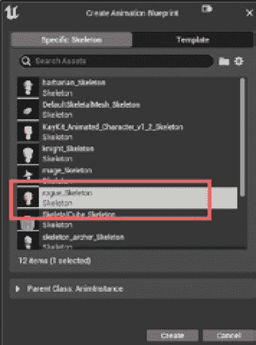

图 10.5 – 动画蓝图创建

1.  将新创建的资产命名为`AB_Character`并双击它以打开编辑器窗口。

如果您还不熟悉动画蓝图，您会注意到它与常规蓝图类有一些相似之处，例如**我的蓝图**和**事件图**选项卡。如果尚未选择，请打开**事件图**以开始一些可视化脚本代码，然后继续以下步骤。

1.  添加一个**事件蓝图初始化** **动画**节点。

1.  点击并拖动**Try Get Pawn Owner**（它将已经存在于图表中）的**返回值**输出引脚，并添加一个**Cast To** **US_Character**节点。

1.  将事件执行引脚连接到 cast 节点输入执行引脚。

1.  从**Character**。

1.  从**Set Character**节点的输出引脚点击并拖动，添加一个**Character Movement**获取节点。

1.  从这个获取节点的输出引脚点击并拖动，选择`Movement Component`，并将自动添加到图表中的**Set Movement Component**节点连接到**Set** **Character**节点的执行引脚。

最终图表如图*图 10.6*所示：

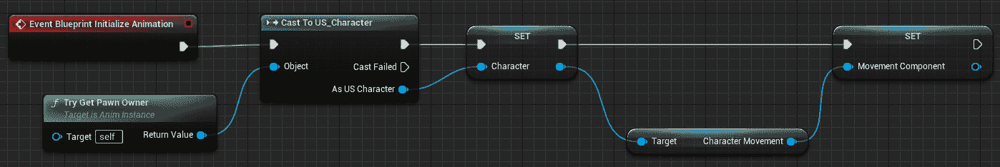

图 10.6 – 事件蓝图初始化动画图表

这段视觉脚本在蓝图初始化时执行，并基本上设置你在游戏过程中需要的变量。

现在，定位图表中已经存在的**事件蓝图更新**动画节点。

1.  从**变量**部分拖动一个获取节点用于**Character**属性。右键单击它并选择**转换为验证获取**选项；这将把节点转换成一个可执行的节点，该节点将检查**Character**变量是否有效。

1.  将**事件蓝图更新动画**执行引脚连接到**Get Validated** **Character**节点的输入执行引脚。

1.  在**CharacterSpeed**中。将一个**Set**节点用于此变量拖入图表。

1.  从**变量**部分拖动一个**Get**节点用于**Movement Component**变量。

1.  从**Movement Component**节点的输出引脚点击并拖动，创建一个**Get Velocity**属性节点。

1.  从**Get Velocity**节点的输出引脚点击并拖动，创建一个**Vector Length** **XY**节点。

1.  将**Vector Length XY**节点的输出引脚连接到**Set Character** **Speed**节点的输入引脚。

图表的最终结果如图*图 10.7*所示：

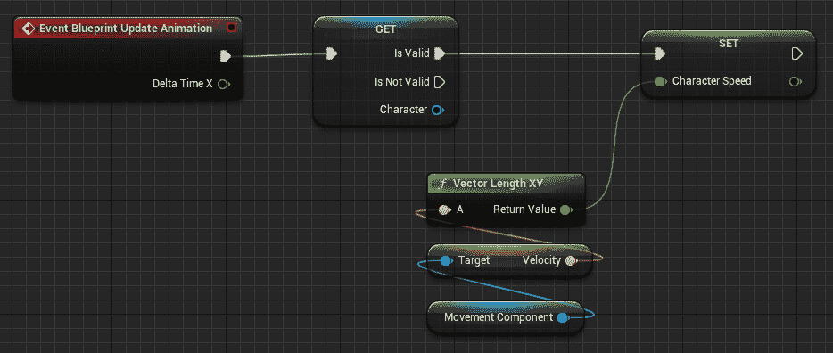

图 10.7 – 事件蓝图更新图表

这段视觉脚本代码基本上跟踪角色的速度大小并将其存储在**Character Speed**变量中，该变量将在以下步骤中用于混合移动动画。

接下来，选择编辑器的**AnimGraph**选项卡，它将显示一个单独的**输出姿态**节点——这个节点代表角色的最终动画姿态。我们现在需要告诉图表如何动画化角色。

1.  从**变量**部分将**Character Speed**属性拖动以创建一个获取节点。

1.  从**Character Speed**输出引脚点击并拖动，创建一个**Blendspace Player ‘****BS_WalkRun’**节点。

1.  点击并拖动 **Blendspace Player ‘BS_WalkRun’** 节点的输出引脚，创建一个 **Slot ‘Default Slot’** 节点——我们将从 C++ 代码中使用此节点来执行投掷动画蒙太奇。

1.  将 **Slot ‘Default Slot’** 的输出引脚连接到 **Output** **Pose** 节点的输入引脚。

动画图最终结果如图 *图 10.8* 所示：

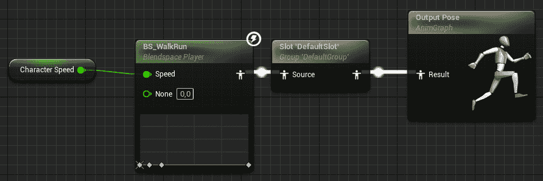

图 10.8 – 动画图

通过这一最终步骤，动画蓝图就完成了；现在，你只需要将其连接到角色蓝图，使其工作。

## 将动画系统添加到角色中

要将动画系统添加到角色中，你只需在蓝图类中声明动画蓝图。要这样做，打开 **BP_Character** 蓝图并选择 **Mesh** 属性。然后，在 **Details** 面板中，找到 **Anim Class** 属性。从其旁边的下拉菜单中选择 **AB_Character**，如图 *图 10.9* 所示：

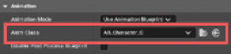

图 10.9 – 分配给蓝图类的动画蓝图

如果你现在测试游戏，你应该看到角色开始动画循环，并在行走和跑步时对玩家输入做出反应。然而，跑步动画会奇怪地跳跃和出现错误——这是因为这些动画没有被复制，只是检查角色速度来更新。

从技术角度来看，速度值（即 `MaxWalkSpeed`）只是存储在角色的服务器实例中，但客户端将有自己的 `MaxWalkSpeed` 值。如果你只是移动一个 Actor，这可能是可以接受的，因为服务器会不断更新 Actor 位置，但基于速度的骨骼网格组件动画则完全是另一回事。事实上，动画系统正在使用本地值（即客户端的值），系统将不断在服务器和客户端数据之间发生冲突，导致动画损坏。

正因如此，我们需要将我们在 *第七章**，使用远程过程调用 (RPCs)* 中实现的开始和停止冲刺逻辑从服务器移动到客户端，并将相应的调用作为多播调用，这样所有客户端都会意识到这个变化。

要这样做，打开 `US_Character.h` 头文件，并添加以下客户端声明：

```cpp
UFUNCTION(NetMulticast, Reliable)
void SprintStart_Client();
UFUNCTION(NetMulticast, Reliable)
void SprintEnd_Client();
```

如你所见，我们使用了 `NetMulticast` 指定符，以便让所有客户端都知道角色已经开始冲刺。此外，这个调用需要是一个 `Reliable` 的调用，这样你就可以保证将所有数据发送给接收者，而不会有任何数据包丢失。

注意

如需了解 RPCs 和 `NetMulticast` 指定符的复习，请参阅 *第七章**，使用远程过程调用 (RPCs)*。

现在，打开`US_Character.cpp`文件并定位到`SprintStart_Server_Implementation()`和`SprintEnd_Server_Implementation()`。你需要将这两个方法的所有内容移动到相应的客户端调用中。为此，删除所有内容（即括号内的代码），并在`SprintStart_Server_Implementation()`中添加客户端调用：

```cpp
SprintStart_Client();
```

对于`SprintEnd_Server_Implementation()`方法，添加以下内容：

```cpp
SprintEnd_Client();
```

之后，将之前移除的代码移动到客户端实现中：

```cpp
void AUS_Character::SprintStart_Client_Implementation()
{
 if (GetCharacterStats())
 {
  GetCharacterMovement()->MaxWalkSpeed = GetCharacterStats()->SprintSpeed;
 }
}
void AUS_Character::SprintEnd_Client_Implementation()
{
 if (GetCharacterStats())
 {
  GetCharacterMovement()->MaxWalkSpeed = GetCharacterStats()->WalkSpeed;
 }
}
```

总体行为将如下：

+   由玩家控制的客户端接收移动输入并将此数据发送到服务器

+   服务器处理这个输入并向所有客户端发送更新请求

+   所有客户端相应地更新`MaxWalkSpeed`值

一旦编译了项目，尝试测试游戏——我们的角色现在可以像专业人士一样移动和冲刺，你将看到他们的动画在所有荣耀中闪耀！

为了额外练习，尝试对随从角色进行工作并实现相同的动画逻辑。这就是召唤一帮骨头成为一个完整的、重新激活的随从的真实含义，谁知道呢？巫妖王可能会因为你的出色工作而给你带来一些惊喜！

## 添加投掷动画

目前缺少的是投掷动画，在这种情况下，网络同步是我们真正想要的——游戏中所有连接的玩家都需要在角色在地下城投掷匕首时看到角色动画，并且这个动画应该对所有客户端同时播放。

首先要确保武器投射物组件能够正确复制。为此，打开`US_Character.cpp`文件。然后，在构造函数中找到`Weapon`组件初始化，并添加以下代码行：

```cpp
Weapon->SetIsReplicated(true);
```

接下来，打开`US_WeaponProjectileComponent.h`文件，并在`private`部分添加以下动画蒙太奇引用：

```cpp
UPROPERTY(EditDefaultsOnly, BlueprintReadOnly, Category="Projectile", meta=(AllowPrivateAccess = "true"))
UAnimMontage* ThrowAnimation;
```

之后，在`protected`部分添加以下声明：

```cpp
UFUNCTION(NetMulticast, Unreliable)
void Throw_Client();
```

这是将在客户端执行的投掷方法。注意，我们使用具有`Unreliable`属性指定符的 RPC 多播到所有客户端——尽管我们希望这个动画在网络中同步，但这只是一个美学上的附加功能，因此我们可以承受在网络中丢失数据。其他客户端不会看到动画，但匕首仍然会被生成。

完成头文件声明后，打开`US_WeaponProjectileComponent.cpp`文件并添加客户端投掷方法：

```cpp
void UUS_WeaponProjectileComponent::Throw_Client_Implementation()
{
 const auto Character = Cast<AUS_Character>(GetOwner());
 if (ThrowAnimation != nullptr)
 {
  if (const auto AnimInstance = Character->GetMesh()->GetAnimInstance(); AnimInstance != nullptr)
  {
   AnimInstance->Montage_Play(ThrowAnimation, 1.f);
  }
 }
}
```

如你所见，代码将获取此组件的所有者，如果它是`US_Character`类型，将播放动画蒙太奇。

此方法将从其服务器端对应方法 `Throw_Server_Implementation()` 中调用，因此找到该方法。我们本可以直接执行方法调用，但我们需要给生成逻辑添加一点延迟，因为投掷动画需要一些时间才能完成，提前生成匕首会给玩家带来不美观的视觉反馈。为此，删除函数中的所有内容，并用以下代码替换：

```cpp
if (ProjectileClass)
{
 Throw_Client();
 FTimerHandle TimerHandle;
 GetWorld()->GetTimerManager().SetTimer(TimerHandle, [&]()
 {
  const auto Character = Cast<AUS_Character>(GetOwner());
  const auto ProjectileSpawnLocation = GetComponentLocation();
  const auto ProjectileSpawnRotation = GetComponentRotation();
  auto ProjectileSpawnParams = FActorSpawnParameters();
  ProjectileSpawnParams.Owner = GetOwner();
  ProjectileSpawnParams.Instigator = Character;
  GetWorld()->SpawnActor<AUS_BaseWeaponProjectile>(ProjectileClass, ProjectileSpawnLocation, ProjectileSpawnRotation, ProjectileSpawnParams);
 }, .4f, false);
}
```

在这里，我们只是将生成逻辑移动到计时器句柄中，以在调用客户端投掷逻辑的同时延迟生成过程，以便立即开始动画。

注意

Unreal Engine 提供了比简单延迟方法调用更高级的动画同步方法，例如 **Animation Notifies** ([`docs.unrealengine.com/5.1/en-US/animation-notifies-in-unreal-engine/`](https://docs.unrealengine.com/5.1/en-US/animation-notifies-in-unreal-engine/))。然而，为了本书的目的，延迟方法是满足我们需求的一个快速且实用的解决方案。

作为最后一步，打开 **BP_Character** Blueprint，选择 **Weapon** 组件，在 **Details** 面板中查找 **Throw Animation** 属性，并分配你已创建的 **AM_Throw** 蒙太奇。

你现在可以测试游戏，角色应该能够投掷匕首，并且与投掷动画正确同步。

在本节中，你刚刚涉足神秘的动画领域（尽管你还没有准备好与巫妖领主战斗），并创造了一个基本的动画系统，网络玩家会欣赏。在下一节中，你将使一些友好角色复活，并通过为玩家提供可以解救的人来为你的游戏增添更多乐趣。

# 添加 NPC 角色演员

在地下漫步，躲避或刺杀僵尸可能会很有趣，但我们不要忘记国王为我们支付的丰厚报酬。我们手头有一个救援任务——在骑士们被变成不死生物之前，从巫妖领主的地下城中解放他们。是时候开始认真工作了，我的无畏的开发者！

在本节中，你将创建一个 Actor Blueprint，它将作为你心爱的盗贼需要解救的囚犯（为了获得更多的经验值）。为了实现这样的系统，你将充分利用在 *第七章** 使用远程过程调用 (RPCs)* 中实现的 `Interactable` 接口。

## 创建 NPC 角色

你将要创建的 NPC 是一个简单的、可复制的演员，当玩家与之交互时，它会欢呼，并授予一些经验值。我们需要做的第一件事是播放空闲和欢呼动画的动画蒙太奇。为此，完成以下步骤：

1.  在 `Animations` 文件夹中添加一个新的 `AM_KnightIdle`。

1.  将 **knight_Idle** 动画添加到 montage 的 **DefaultGroup.DefaultSlot** 部分。

1.  添加另一个 `AM_KnightCheer`。

1.  将**knight_cheer**动画添加到蒙太奇中。

在这两个动画资产准备就绪后，您可以开始创建囚犯蓝图。打开`Blueprints`文件夹并完成以下步骤。

1.  基于的`BP_KnightPrisoner`创建一个新的蓝图。双击它以打开它。

1.  在**组件**面板中，添加一个**骨骼** **网格**组件。

1.  在**详细信息**面板中，选中**复制**属性以在网络中复制演员。

1.  创建一个`EarnedXp`。将其设置为`20`。选中**实例可编辑**属性以使变量公开。

1.  创建一个`MontageIdle`。将其**默认值**设置为**AM_KnightIdle**。选中**实例** **可编辑**属性。

1.  创建另一个`MontageCheer`。将其默认值设置为**AM_KnightCheer**。选中**实例** **可编辑**属性。

在这些基本设置可用的情况下，您可以从**开始播放**事件开始添加一些视觉脚本到事件图，以使演员完全功能化。您将从**开始播放**事件开始，以启动空闲动画。为此，完成以下步骤：

1.  在图中添加一个**事件开始播放**节点。

1.  从**组件**面板，将**骨骼** **网格**组件的引用拖入图中。

1.  从**变量**面板，拖动一个用于**MontageIdle**变量的获取节点。

1.  从**事件开始播放**执行引脚，创建一个**播放** **动画**节点。

1.  将**骨骼网格**引脚连接到**播放** **动画**节点的**目标**引脚。

1.  将**Montage Idle**引脚连接到**播放** **动画**节点的**新动画播放**引脚。

1.  选中**播放** **动画**节点的**循环**属性。

该图部分的最终结果如图*图 10**.10*所示：

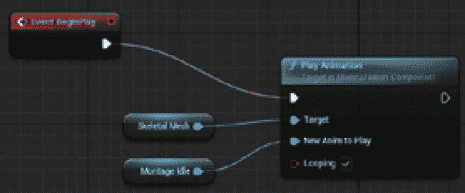

图 10.10 – 事件开始播放图

然后，创建一个自定义事件，当玩家角色救出囚犯时，将启动欢呼动画。为了在所有客户端上启动动画，此事件需要作为**多播**事件执行。为此，完成以下步骤：

1.  右键单击图，创建一个`CharacterCheer`。选择事件后，在**详细信息**面板中找到**复制**属性，并从下拉菜单中选择**多播**，保留**可靠**复选框未勾选，如图*图 10**.11*所示：

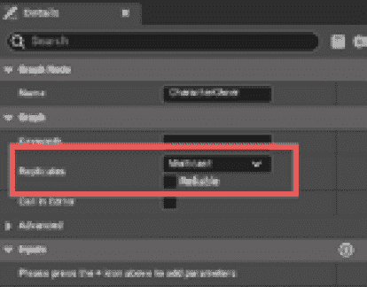

图 10.11 – 自定义事件复制

1.  从**组件**面板，将**骨骼** **网格**组件的引用拖入图中。

1.  从**变量**面板中，拖动一个用于**MontageCheer**变量的获取节点。

1.  从**事件开始播放**执行引脚，创建一个**播放** **动画**节点。

1.  将**骨骼网格**引脚连接到**播放** **动画**节点的**目标**引脚。

1.  将**Montage Idle**引脚连接到**播放** **动画**节点的**新动画播放**引脚。

1.  选中**播放** **动画**节点的**循环**属性。

图表这一部分的最终结果如图 *图 10.12* 所示：

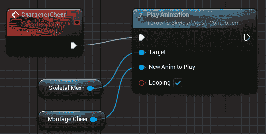

图 10.12 – CharacterCheer 自定义事件

使演员正常工作的最后一步是通过实现 `US_Interactable` 接口使其与玩家角色可交互。为此，完成以下步骤：

1.  打开 **类设置** 面板并定位到 **接口** 类别。

1.  在 **实现接口** 中添加 **US_Interactable** 接口。

1.  在 **我的蓝图** 面板中，定位到 **接口** 类别，右键单击 **Interact** 方法，选择 **实现事件**。将在事件图中添加一个 **Event Interact** 节点。

1.  从事件 **Character Instigator** 引脚点击并拖动以添加一个 **PlayerState** 节点，并将其 **Target** 引脚连接到 **Event Interact** 节点的 **Character Instigator** 引脚。

1.  从 **PlayerState** 节点的输出引脚点击并拖动，创建一个 **Cast To US_PlayerState** 节点。将其执行输入引脚连接到 **Event Interact** 节点的输出执行引脚。

1.  从 cast 节点的 **As US PlayerState** 点击并拖动，创建一个 **Add Xp** 节点。将其执行输入引脚连接到 cast 节点的 **Success** 执行引脚。

1.  从 **变量** 面板拖动一个 **EarnedXp** 变量的获取节点。将其输出引脚连接到 **Add Xp** 节点的 **Value** 引脚。

1.  从 **Add Xp** 节点的输出引脚点击并拖动，创建一个 **Character Cheer** 节点以完成图表，如图 *图 10.13* 所示：

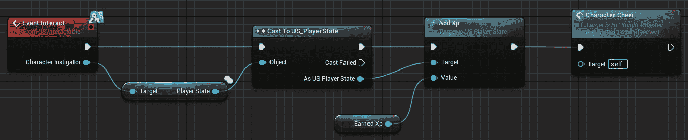

图 10.13 – 交互图

你可能已经注意到我们之前没有使用任何权限检查；这是因为我们知道这个事件只会在服务器上调用。

蓝图现在已完成，因此是时候进行一些测试了。

## 测试 NPC 演员行为

要测试蓝图，可以将其实例拖入关卡并开始游戏会话。盗贼角色应该能够到达 NPC，如果我们使用交互按钮，动画应该显示他们在欢呼。解放 NPC 角色的英雄将获得应得的丰富经验点作为奖励。是时候升级并成为更伟大的英雄了！

*图 10.14* 显示了 NPC 演员被盗贼英雄解放后的最终结果：

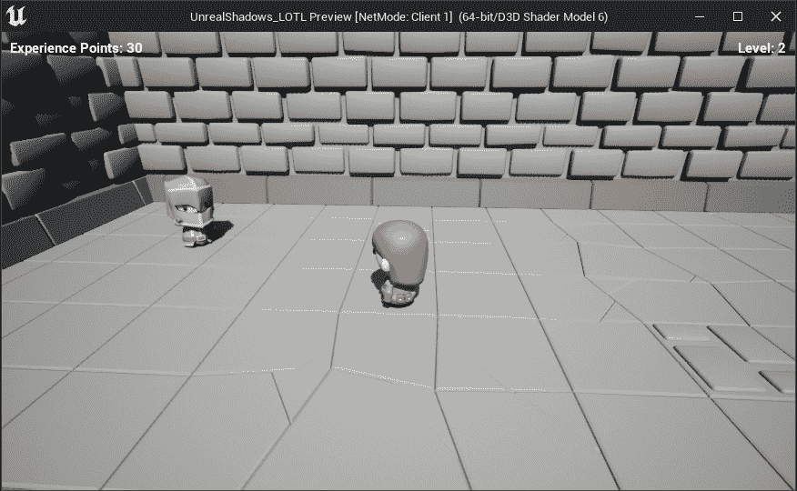

图 10.14 – 游戏过程中被解放的演员

好吧，看来我们现在又有一个新囚犯可以玩弄了！但为什么只满足于一个呢？当我们能够有多种变化时，为什么不发挥创意，给我们的囚犯一些新鲜的外观，以保持事情的新鲜感呢？通过创建子蓝图并更改演员的骨骼网格组件和动画蒙太奇，你将能够充分利用项目中可用的野蛮人和法师模型。你甚至可以创建一个游侠囚犯的变化版本——谁说我们不能稍微偏离剧本呢？国王可能付钱给我们来营救他的骑士和战士，但嘿，盗贼公会里一个或两个熟练的英雄从未伤害过任何人！

恭喜你——你已经完成了这个冒险的一部分。现在，是时候让你的想象力自由驰骋，添加你自己的游戏逻辑了！在下一节中，我不会教你任何新的技术，但我会提供一些新想法来增强游戏玩法，使其更加刺激。

# 进一步改进游戏

现在你已经对虚幻引擎的多玩家系统有了扎实的了解，是时候释放你的创造力，让你的想法变为现实，让你的游戏真正独特和个性化了。在本节中，我将给你一些提示，告诉你如何让你的项目更加生动，但不要犹豫，加入你自己的创意，让它独一无二。

## 让我们制造一些噪音！

目前，小兵的听觉感知仅用于检测角色是否在奔跑。为什么不调整系统，让游戏中的其他元素也能警告巫妖领主的小兵呢？

不幸的是，`PawnNoiseEmitterComponent` 只能在，嗯... 基础单位上使用，所以你不能将它附加到其他演员上（它根本不会起作用）；然而，在*第九章**，扩展 AI 行为*中，你构建了一个强大的系统，用于通过游戏模式来警告敌人小兵。由于游戏模式可以被关卡中的任何演员访问，你可以利用`AlertMinions()`函数并发送在激活时请求帮助的消息。

使用这种方法最好的方式之一是通过陷阱——每当玩家角色踏入这样的装置时，周围的所有小兵都会被警告。这类游戏功能的例子包括以下内容：

+   *吱吱作响的门*：每当角色打开一扇门时，它都会发出吱吱或吱吱声，这会警告巫妖领主的仆人有关入侵者。

+   *陷阱*：一些地牢区域比其他区域更受保护——设置一些能够召集所有附近敌人的机械装置。毕竟，这只是一个创建碰撞区域并在游戏模式中调用方法的问题！

+   *魔法物品*：创建一些玩家可以与之交互的魔法神器。巫妖领主是个狡猾的家伙：他施了一个警报咒语，将不幸的盗贼英雄注定走向不可避免的命运。每当角色试图使用那个诱人的物品时，就会向附近的小兵发送警报。想想看！你甚至可以使用我们在项目开始时创建的漂浮书籍。

## 我需要一把钥匙！

在地牢中开门可能是一种有趣的游戏，但当你遇到一扇锁着的门时，事情会变得更加有趣。为什么不试试看，看看还有哪些惊喜在等待着你？

在*第七章*《使用远程过程调用（RPCs）》中，你创建了`US_Interactable`接口，并使用了`Interact()`方法。然而，该接口还公开了`CanInteract()`方法，可以用来检查 Actor 是否可以交互。

一扇门可能实现了一个系统，只有当玩家角色有钥匙时，`CanInteract()`方法才会返回`true`——这意味着创建一个钥匙拾取物品，并添加`US_Character`系统来跟踪他们是否有一把或多把钥匙可以使用。这些锁着的门可以用来将 NPC 锁在一些地牢的牢房中，并且只有找到相应的钥匙才能被释放。

当心巫妖领主！他的囚犯被锁得比最深最严密的牢房里的商人钱袋还要紧！

## 提升你的武器库，我的英雄！

虽然有一把尖锐的匕首可以投掷给你的敌人很酷，但有一把魔法匕首会造成更多伤害，或者甚至一击击败敌人，那就更好了。你可以实现一个拾取蓝图，充分利用你在`US_WeaponProjectileComponent`类中实现的`SetProjectileClass()`函数。

拾取物品后，角色将获得一个增强伤害的`US_BaseWeaponProjectile`类变体。你甚至可以考虑让击败的敌人掉落武器拾取物而不是金币！

作为一项附加功能，你甚至可以考虑创建一些投掷的石头，当它们击中地面时会发送警报信息——只需记住为投射物启用重力。拥有可以投掷并发出噪音以警告小兵并将他们从玩家角色附近引开的物品，将为游戏增加一些新的游戏逻辑，从而提高整体游戏体验。

准备迎接一个狡猾的转折，并运用你的机智来迷惑巫妖领主的盲目仆人！以你的头脑，谁还需要力量？

## 你不是机枪

目前，玩家在游戏过程中可以投掷无限数量的匕首。虽然这最初可能很有趣，但最终会破坏游戏的平衡，并导致随着时间的推移游戏体验变得单调。

为了使事情更有趣（并且有利于巫妖领主的阴暗计划），限制玩家一次只能使用一把投掷匕首。一旦角色投掷了武器，除非匕首被找回，否则角色将无法再次投掷。

实现这个功能相当简单——一旦角色投掷了投射物，将`ProjectileClass`武器组件设置为`null`值，这样角色就无法再生成任何对象。在击中某个物体后，投掷的武器会在自我销毁之前生成一个匕首拾取（见前一小节）。这将迫使角色走到掉落的武器那里并捡起它，以便再次攻击。

作为一项替代功能，你可以给你的角色有限数量的刀子，并在玩家尝试投掷刀子时使用计数变量来检查角色是否有可用的刀子。

有人说地牢生活就像在公园散步一样轻松，显然他们从未在装备简单（而且是单一！）武器的情况下遭遇过一群不死怪物。

## 没有时间可以浪费

目前，你的角色可以平静地四处走动，并从容不迫地营救囚犯。为什么不添加一个时间计数器来增加一些趣味呢？巫妖领主正在举办一场盛大的庆祝活动，意图将国王的骑士变成他不死之军的忠实成员！你的英雄必须赶紧行动，以免为时已晚！

你可以利用`US_GameMode`类创建一个时间管理器，一旦第一个玩家进入地牢就会启动——如果玩家不能从地牢中释放所有被俘者，他们将非常不幸，游戏将彻底失败。看来这个任务似乎是一切或一无所有！

## 遍地都是表格！

随着你的项目进展，跟踪所有敌人和武器的变化将变得越来越困难。为了减轻痛苦，你可以使用在*第六章**，跨网络复制属性*中引入的结构和数据表系统，为投掷武器和 AI 对手创建专用结构。

让你的创意自由发挥，根据你最喜欢的统计数据提出大量令人惊叹的蓝图选项——准备好让你的英雄冒险家在你的游戏中踏上充满惊喜的惊险旅程吧！

## 需要一些帮助？

如你所注意到的，一旦你熟悉了你的游戏，潜在的结果将是无限的。你可以添加任何新的游戏逻辑并测试，直到你满意为止。

在我的这一边，我将致力于为游戏开发令人兴奋的新功能，并将它们存储在我的 GitHub 仓库中。随时查看，看看我提出了哪些疯狂的想法！仓库链接是[`github.com/marcosecchi/unrealshadows-ltol`](https://github.com/marcosecchi/unrealshadows-ltol)。

如果你有一个巧妙的想法，请随时联系我并告诉我——如果时间允许，我会尝试实现它并将其上传到仓库，以便让这个项目不断成长！

# 摘要

在这一章中，你微调了游戏玩法逻辑并添加了最后的修饰。你从为角色移动和攻击添加一些漂亮的动画开始，提升了游戏的整体吸引力。

此外，你为玩家创造了一个可以营救的角色：一个可以被互动的囚犯 Actor，这将授予盗贼英雄一些应得的经验值。

最后但同样重要的是，我分享了一些新鲜的想法，让你的游戏体验提升到新的层次。通过融入这些想法，你可以使游戏真正成为你自己的独特之作。所以，发挥创意，享受乐趣！

准备进入下一章节，你将深入调试和测试一个网络游戏。这将提升你的开发技能到新的水平，这对于你想要成为一名顶尖的多玩家程序员来说是必要的！
