# 调试多玩家游戏

调试应用程序是编程的一般关键方面，尤其是在处理多玩家游戏编程时这一点尤其正确。调试过程帮助开发者识别和解决在运行网络应用程序或游戏时可能出现的任何问题。通过理解网络调试的基本知识，程序员可以确保他们的游戏在所有平台上都能平稳高效地运行。

当涉及到使用虚幻引擎调试网络时，有几种工具可以帮助程序员使这个过程更容易。这个过程的第一步是在您的项目设置中设置日志记录，以便您可以在游戏的生命周期开发或测试阶段跟踪发生的错误。

此外，开发一个模拟的多玩家环境可以是一种非常有效的方法来复制现实生活中的场景，同时评估您系统的操作效率。

此外，像网络分析器这样的工具将提供对关键指标（如连接速度和延迟）的详细洞察，从而能够识别潜在问题和需要改进的区域。

随着您在本章中的进展，您将获得对优化技术的全面理解，这将使您能够微调您项目的性能并确保无缝的多玩家游戏体验。此外，您将学习如何有效地隔离和解决可能破坏整体游戏体验的任何现有问题。

因此，在本章中，我将引导您了解以下部分：

+   介绍网络调试

+   模拟网络环境

+   使用网络分析器

+   提高性能和带宽利用率

# 技术要求

要跟进本章介绍的主题，您应该已经完成了前面的章节，并理解了它们的内容。

此外，如果您希望从本书的配套仓库开始编写代码，您可以下载本书配套项目仓库中提供的`.zip`项目文件：[`github.com/PacktPublishing/Multiplayer-Game-Development-with-Unreal-Engine-5`](https://github.com/PacktPublishing/Multiplayer-Game-Development-with-Unreal-Engine-5)。

您可以通过点击`Unreal Shadows –` *第十章*`结束`链接下载与上一章结尾同步的文件。

# 介绍网络调试

网络测试和调试是任何从事多人游戏工作的专业人士必备的技能。这需要深入理解网络协议和技术，以及快速识别和诊断问题的能力。此外，它还涉及在用户的设备上解决客户端问题，以及在游戏服务器上解决服务器端问题。通过掌握这项技能，你可以确保游戏对所有玩家来说运行顺畅，延迟最小。

当你开始开发网络游戏时，考虑以下障碍是至关重要的，这些障碍与为你的观众创造无缝和引人入胜的多人游戏体验相关，而不是单人游戏：

+   你需要调试多个运行的项目实例

+   网络通信由于其本质可能不可靠和不稳定，不同的客户端可能会有不同的问题

+   客户端与服务器的工作方式不同

虚幻引擎配备了专门为调试网络应用程序设计的各种工具和工作流程。通过遵循本章提供的指南，你将获得如何有效利用这些工具的宝贵见解，以及学习解决你可能遇到的任何常见网络问题的专家技巧和最佳实践。

在我深入探讨虚幻引擎的调试工具如何操作之前，了解游戏调试的基本知识是至关重要的。

## 解释游戏调试

调试的过程涉及测试项目的每个部分，以确保一切按预期工作，并识别任何可以改进的领域——这将确保玩家在玩游戏时获得最佳性能和稳定性。调试还包括在不同平台和设备（例如，移动平台、桌面或 VR 设备）上检查代码功能，在部署前对构建进行自动化测试等。

最后，良好的调试实践将帮助你发现那些可能被忽视的细节，如果这些问题没有及早解决，它们可能会在开发过程中引起严重问题！

在前几章中，你使用了虚幻引擎提供的许多调试工具——可能最常用的是`GEngine->AddOnScreenDebugMessage()`命令，它增加了在屏幕上显示消息的功能。

一些其他调试工具纯粹是视觉上的——例如，`DrawDebugSphere()`，你在*第七章*中使用了它，*使用远程过程调用（RPC）*，以显示玩家可以与之交互的 Actors 的位置。

如果你熟悉像 Microsoft Visual Studio、JetBrains Rider 或其他任何编程 IDE 这样的工具，你可能会知道使用**断点**的重要性——代码中可以暂时停止执行的点，以便你可以检查程序的数据和状态。

调试多人游戏 – 由于其非常专业的性质 – 需要一些额外的工具来检查幕后发生的事情。在接下来的子章节中，我将向你介绍一些这些工具，以帮助你提高你的多人编程技能。

## 介绍多人游戏选项

自从 *第三章*，*使用项目原型测试多人游戏系统*，你已经使用了测试多人环境最常用的工具，通过选择**监听服务器网络模式**并选择要模拟的玩家数量。这些设置只是可以在项目设置中调整的**多人游戏选项**类别的一部分。要查看完整选项范围，从主菜单，执行以下操作：

1.  选择**窗口** | **编辑器首选项**选项，找到**级别编辑器** | **播放**设置。

1.  查找**多人游戏选项**类别，如图 *图 11.1* 所示：

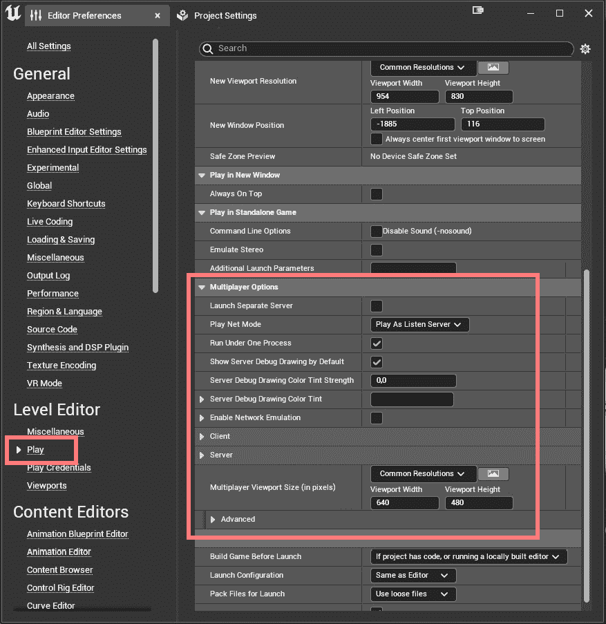

图 11.1 – 多人游戏选项类别

这个类别提供了大量自定义和调试游戏选项 – 你已经使用了**Play Net Mode**和**Play Number of Clients**（位于**客户端**子类别中），即使你从 Unreal 编辑器的其他部分（即主工具栏）设置了这些值。但还有更多！

例如，你可以找到**多人视图大小（以像素为单位）**选项，并从**常见分辨率**下拉菜单中选择客户端显示分辨率。这将让你测试游戏在目标设备上运行时的外观和感觉。*图 11.2* 显示了游戏在 **720x1280 Razer** **手机**设备上运行后的外观：

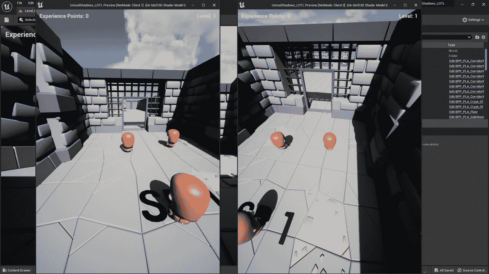

图 11.2 – 智能手机显示模拟

嘿，我知道我们的项目最初并不是为了在智能手机上玩而设计的，但你还是明白了，对吧？

在本章的后面部分，我将演示**多人游戏选项**部分的一些附加功能 – 例如，流量模拟设置 – 这些功能将在你的项目调试阶段提高你的熟练度。

## 在网络环境中登录

如你所知，在 Unreal Engine – 或任何编程环境 – **日志记录**可以用于调试和跟踪运行时代码的流程。日志记录在软件开发中是一种广泛使用的实践，多人游戏开发也不例外。Unreal Engine 提供了广泛的日志类别，其中一些是专门针对网络设计的。

**输出日志**窗口记录了所有消息，可以通过点击 Unreal Engine 底部的专用按钮打开，如图 *图 11.3* 所示：


图 11.3 – 输出日志激活按钮

此外，所有日志消息都保存在你的项目文件夹中的 `.log` 文件中（即 `[你的` `项目文件夹]/Saved/Logs/`）。

每条日志消息都被分类，并且可以被过滤——例如，*图 11.4* 展示了我在编辑器中将游戏视口大小调整后的日志窗口：

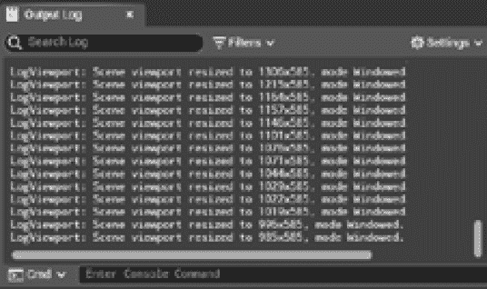

图 11.4 – 日志窗口打开

在网络调试过程中，你将最常使用的分类是 **LogNet**，它包括大多数网络日志。

注意

要查看网络环境中所有可用日志分类的详尽列表，请查看官方文档：[`docs.unrealengine.com/5.1/en-US/logging-for-networked-games-in-unreal-engine/`](https://docs.unrealengine.com/5.1/en-US/logging-for-networked-games-in-unreal-engine/)。

## 过滤 LogNet 分类

现在你对网络日志系统有了基本了解，你可以尝试玩游戏并检查 **输出日志** 窗口，看看底层发生了什么。为此，请按照以下步骤操作：

1.  在虚幻引擎中打开你的项目，并点击编辑器底部的 **输出日志** 按钮。可选地，你可以点击 **停靠在布局** 按钮将窗口停靠在编辑器内部，使其不可折叠。

1.  一旦日志窗口打开，找到 **过滤器** 按钮，点击它以打开所有过滤器。你会注意到 LogNet 分类没有显示。要启用它，你需要开始一个游戏会话——一旦进入播放模式，你会注意到该分类是可见的。

1.  从 **过滤器** 列表中，点击 **分类** 部分，取消选择 **显示所有** 选项以取消选择所有分类，然后找到 **LogNet** 分类以启用它，如图 *图 11.5* 所示：

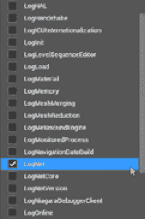

图 11.5 – 日志分类过滤器

一旦你只启用了 **LogNet** 分类，你将得到一个过滤后的日志列表，如图 *图 11.6* 所示。6*：

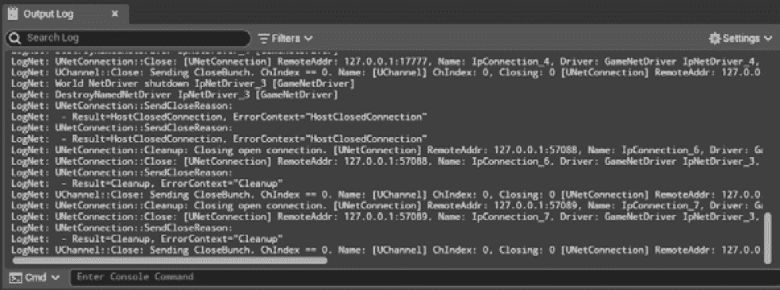

图 11.6 – LogNet 输出

如你所见，这里有很多事情在进行中，这取决于你的游戏会话。

作为额外的练习，花些时间阅读日志消息。一开始你可能不太理解，但随着时间的推移，这种与虚幻引擎的交流将变得熟悉。

在下一小节中，你将学习如何创建日志分类，这样你就可以轻松跟踪应用程序内部发生的事情。

## 创建自定义日志分类

通常情况下，当你陷入项目的漩涡中时，你会倾向于使用日志消息而不太在意它们的分类。当然，这种错误在长期来看是需要付出代价的。为你的日志创建自定义分类很简单，而且没有不去做的好理由。

要定义一个自定义类别，你需要在头文件中使用`DECLARE_LOG_CATEGORY_EXTERN`宏，并在相应的源文件中引入`DEFINE_LOG_CATEGORY`宏。此外，类别名称必须以`Log`前缀命名 – 例如，`LogMyApp`。作为一个例子，在接下来的几个步骤中，你将创建一个名为`LogUnrealShadows`的自定义日志类别，你可以在项目的任何地方使用它。

因此，打开你的编程 IDE 并创建一个名为`US_CustomLogs`的新空类 – 你不需要 Unreal 类，只需要一个普通的 C++类。

然后，打开`US_CustomLogs.h`文件，删除类声明，因为你不会使用它。之后，添加以下代码行：

```cpp
DECLARE_LOG_CATEGORY_EXTERN(LogUnrealShadows, Display, All);
```

此宏将`LogUnrealShadows`声明为项目中的一个新日志类别。此类别的详细程度设置为`Display`；这意味着消息将被打印到控制台和日志文件 – 如果你只需要将消息打印到日志文件而不是控制台，你可以使用`Log`值代替。

现在，打开`US_CustomLogs.cpp`文件，通过添加以下代码行来定义日志类别：

```cpp
DEFINE_LOG_CATEGORY(LogUnrealShadows);
```

此宏将允许你在项目的任何位置使用`LogUnrealShadows`类别。一旦进入播放模式，你将能够从**输出日志**过滤器中选择`LogUnrealShadows`类别，如图*图 11.7*所示。7*：


图 11.7 – `LogUnrealShadows`类别

现在类别已经定义，你可以用它来在游戏中添加日志 – 要这样做，你可以使用`UE_LOG()`宏。例如，打开`US_GameMode.cpp`文件并添加所需的`include`声明：

```cpp
#include "US_CustomLogs.h"
```

然后，要在`AlertMinions()`函数类中记录警报消息，你必须添加以下代码行：

```cpp
UE_LOG(LogUnrealShadows, Display, TEXT("Alerting Minions"));
```

*图 11.8*显示了在检测到角色后**输出日志**面板中显示的上述消息：


图 11.8 – 输出日志面板中的自定义消息

本节向你介绍了在 Unreal Engine 中可用的关键调试工具，并解释了如何有效地利用它们。在下一节中，你将了解到如何在个人计算机上模拟网络环境，这将为你在执行过程中可能出现的重大问题提供测试项目的能力。

# 模拟网络环境

创建一个多人网络环境的副本可以是一种有效地模拟真实世界场景并测试系统性能的方法。通过利用 Unreal 的能力，你将能够在单台机器上测试多个连接，并提供一个真实感十足的经验，这将让你在游戏上线后对游戏行为有一个准确的了解。

**网络仿真**是一个重要的功能，可以帮助您模拟服务器和客户端的延迟和数据包丢失。这在识别和解决网络问题方面尤为重要。Unreal 编辑器、命令行控制台和配置文件都提供了可配置的网络仿真设置，以确保它可以精确地满足您的需求。

## 启用网络仿真

网络仿真可以从**编辑器首选项**窗口中的**级别编辑器** | **播放**部分启用。要启用此工具，找到**多人选项**类别并勾选**启用网络仿真**选项，如图*图 11.9*所示：

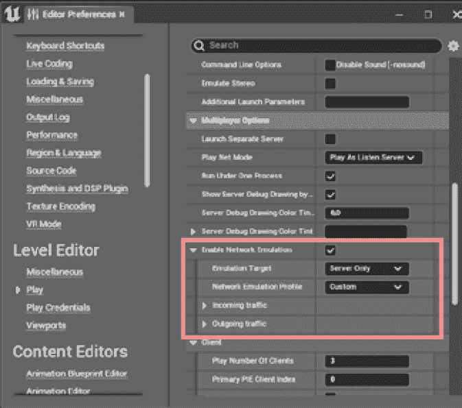

图 11.9 – 启用网络仿真

选择此选项将启用一组选项，您可以在多人游戏中测试不同的场景。首先，您可以通过**仿真目标**属性选择要仿真的目标 – 此处有三个选项：

+   **仅服务器**：此选项将仅模拟网络中的服务器行为

+   **仅客户端**：此选项将仅模拟网络中的客户端行为

+   **所有人**：此选项将在网络上模拟客户端和服务器的行为

其次，您有权访问**网络仿真配置文件**，这将允许您为网络游戏选择不同的场景 – 此处有三个选项：

+   **平均**：此选项将模拟常规多人游戏

+   **差**：此选项将创建一个最坏的情况，在网络游戏中会有很大的时间延迟和大量数据包丢失

+   **自定义**：此选项将允许您使用自己的值自定义仿真体验

如前所述的配置文件将为**传入流量**和**传出流量**的客户端或服务器（或两者）的值初始化一组值，具体取决于**仿真目标**的选择。*图 11.10*显示了选择自定义选项时的扩展配置文件选项：

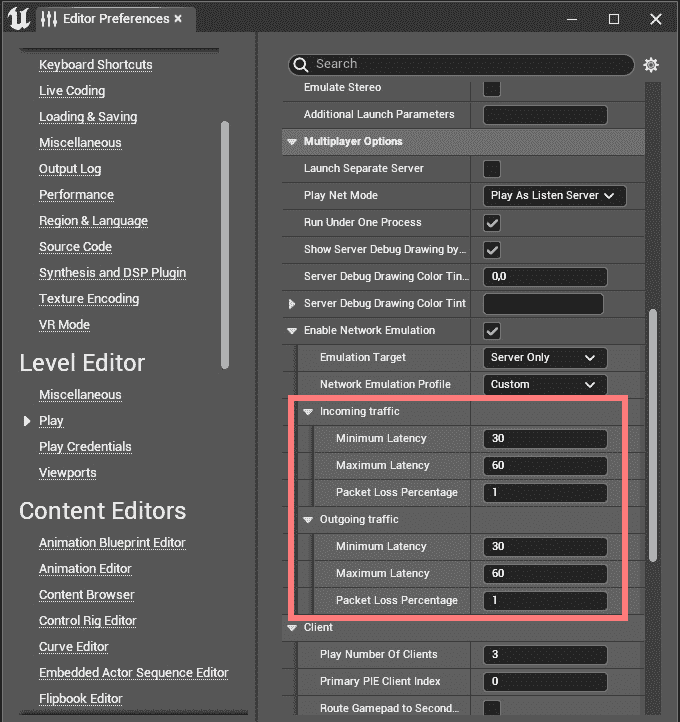

图 11.10 - 扩展的仿真配置文件

在下一小节中，我将向您展示**多人选项**类别中此部分的大多数设置的含义。

### 解释传入流量选项

激活**传入流量**选项将在游戏时间内的数据包接收过程中引入延迟或丢失。您可以修改以下属性：

+   **最小延迟**：这表示以毫秒为单位的最小时间延迟

+   **最大延迟**：这表示以毫秒为单位的最大时间延迟

+   **数据包丢失百分比**：这表示数据包在接收前丢失的概率

例如，典型的坏情况（即，接收流量）将具有大约 100 到 200 毫秒的延迟和大约 5%的接收数据丢失概率。要创建类似的场景，您的设置可能具有以下值：

+   `100` 毫秒

+   `200` 毫秒

+   `5`%

### 解释**出站流量**选项

同样，激活**出站流量**选项将在游戏过程中发送数据包时引入延迟或丢失。您可以修改以下属性：

+   **最小延迟**：这表示以毫秒为单位的最低时间延迟

+   **最大延迟**：这表示以毫秒为单位的最大时间延迟

+   **丢包百分比**：这表示在接收到数据包之前数据包丢失的概率

例如，您可以通过将延迟设置为大约 30 到 60 毫秒，以及数据丢失的概率约为 1%来模拟一个平均情况（即，不是最优但仍可接受的情况）。您的设置可能具有以下值：

+   `30` 毫秒

+   `60` 毫秒

+   `1`%

您现在已经了解了所有可以模拟真实网络游戏环境的方法。现在是时候将所学知识付诸实践，并用您的多人游戏尝试一下！Lichlord 有点不耐烦了，正焦急地等待着您。最好别让他等得太久，所以我们不要浪费时间！

## 使用网络仿真测试游戏

一旦您理解了上述元素，在网络上仿真测试游戏就相当直接了——选择您首选的设置并运行游戏。我们将模拟不同的网络场景进行游戏仿真，因此请打开您在前几章中工作的项目，并准备好进行一些测试。

### 在平均条件下测试游戏

在此场景中，您将测试**编辑器首选项**区域中可用的默认配置文件之一，并检查游戏的行为。为此，请按照以下步骤操作：

1.  打开**编辑器首选项**并定位到**播放**|**多人游戏**类别。

1.  打勾选择**启用网络仿真**复选框，并将**仿真目标设置为所有人**；使用此选项，我们将测试客户端和服务器网络流量。

1.  在**网络仿真配置文件**下拉菜单中，选择**平均**。设置显示在*图 11.11*。11*：

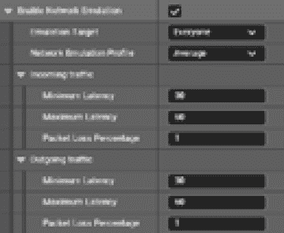

图 11.11 – 使用平均配置文件的网络仿真

设置好此配置文件后，开始一个**作为监听服务器游玩**的游戏会话并分析您的游戏。您应该看到游戏几乎流畅运行，没有延迟或同步问题。这是因为我们选择了非常低的丢包百分比（即，1%）以及服务器和客户端的延迟将在 30 到 60 毫秒的范围内。

我们这里有一个可接受的游戏场景，玩家的体验将会很顺畅。现在，让我们尝试使用一些恶劣的条件来看看游戏的表现如何。

### 在最坏条件下测试游戏

在这次第二次测试中，你将测试一个最坏的情况，其中网络将有高比例的数据包丢失，流量延迟将模拟糟糕的网络带宽。为此，请按照以下步骤操作：

1.  打开**编辑器首选项**并定位到**游戏** | **多人游戏**类别。

1.  打勾**启用网络仿真**复选框并将**仿真目标设置为所有人**；使用此选项，我们将测试客户端和服务器网络流量。

1.  从**网络仿真配置文件**下拉菜单中选择**自定义**。

1.  对于`450`。

1.  设置`550`。

1.  设置`10`。设置如图*图 11.12*所示：

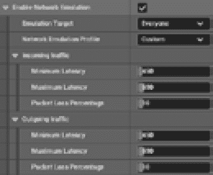

图 11.12 – 最坏情况下的网络仿真

使用此配置文件设置后，启动一个**作为监听服务器玩游戏**的游戏会话并分析你的游戏。你将体验到几乎损坏的游戏体验！同一个角色似乎在不同窗口中完全不同步，你的角色攻击也是如此。

但请注意，我说的是“几乎” – 因为服务器是权威的，我们使用可靠的 RPCs 进行最重要的操作，例如投掷匕首，从执行角度来看，游戏将完美无缺地继续进行。这意味着同一个角色的位置迟早会在所有客户端上同步，无论数据包丢失百分比如何，匕首总是会投掷。

如果你想要测试一个完全损坏的游戏，尝试设置`100`，这意味着服务器或客户端将不会接收到任何数据包。当进入游戏模式时，客户端甚至不会启动，你将得到的只是一个黑屏。但这意味着巫妖王在网络中施加了一个邪恶强大的魔法，让你的无畏盗贼团伙被困在一个神秘的泥潭中。除非国王法庭上的某个技术娴熟的巫师能够施展一个巧妙的反魔法来解开这个咒语，否则就是如此！

在本节中，你学习了如何直接从你信任的电脑中测试你的游戏在网络仿真环境中。最强大的功能之一是能够模拟数据丢失和网络延迟 – 这意味着检查玩家在任何场景下的体验，包括最坏的情况，在这种情况下，由于糟糕的网络技术，玩家将几乎完全无法体验游戏。

在下一节中，你将了解到提高游戏性能的另一个重要主题 – 如何分析网络应用程序。

# 使用网络分析器

Unreal Engine 的 **网络性能分析器**是一个功能强大的独立工具，能够分析和优化多人游戏网络的性能。性能分析会话将为您提供关于连接速度、延迟时间以及其他重要指标的详细信息，这些信息可用于识别潜在问题或改进区域。通过利用这些信息，您将能够获得最佳网络性能并实现更好的用户体验。在本节中，我将指导您了解此工具的主要功能。

如前所述，网络性能分析器是一个独立的应用程序，可以在您的 Unreal Engine 可执行文件文件夹中找到。根据您的引擎安装情况，路径可能有所不同，但通常位于 `[您的 PC]/Programs` `Files/Epic Games/UE_5.1/Engine/Binaries/DotNET/NetworkProfiler.exe`。

网络性能分析器应用程序如图 *11**.13* 所示：

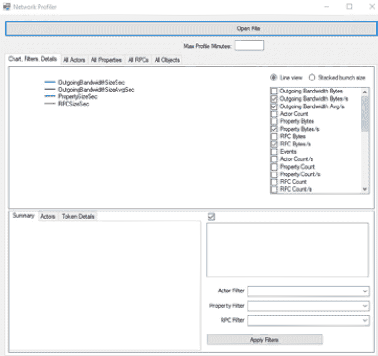

图 11.13 – 网络性能分析器应用程序

在下一节中，我将向您展示如何使用网络性能分析器记录网络会话并查看其数据。

## 记录性能分析会话

要使用网络性能分析器，您需要收集一些数据供其分析。为此，您需要与一个已启用统计跟踪的引擎版本一起工作，例如为非调试配置构建的调试器或编辑器 – 在我们的案例中，我们将直接从 Unreal Engine 编辑器使用默认的 **平均** 仿真配置文件记录数据。

要记录性能分析会话，请按照以下步骤操作：

1.  在**编辑器首选项**窗口中打开**播放** | **多人选项**类别，如前文所述。

1.  选择**启用网络仿真**并将**仿真目标**设置为**所有人**。然后，将**网络仿真配置文件**设置为**平均**。

1.  启动您的游戏并定位编辑器底部（或任何打开的 **输出日志** 窗口的底部）的**控制台命令**提示符，如图 *11**.14* 所示：


图 11.14 – 控制台命令提示符

1.  在提示符内部，输入此命令：

    ```cpp
    netprofile enable
    ```

这将启动性能记录会话，**输出日志**窗口应显示以下消息：

```cpp
LogNet: Network Profiler: ENABLED
```

1.  游戏几分钟，然后输入以下命令。这将关闭性能分析会话：

    ```cpp
    netprofile disable
    ```

1.  此命令将关闭性能分析会话，并在您的项目文件夹的以下位置保存包含所有记录数据的 `.nprof` 文件：

    ```cpp
    [Your Project folder]/Saved/Profiling
    ```

作为替代，您也可以直接使用 `netprofile` 命令，每次使用时都会切换性能分析器。

保存您的性能分析会话后，您可以使用性能分析工具打开它。

## 分析性能分析会话

在启动 Profiler 应用程序后，您可以点击`Profiling`文件夹以打开您已记录的会话。一个示例会话如图*图 11.15*所示：

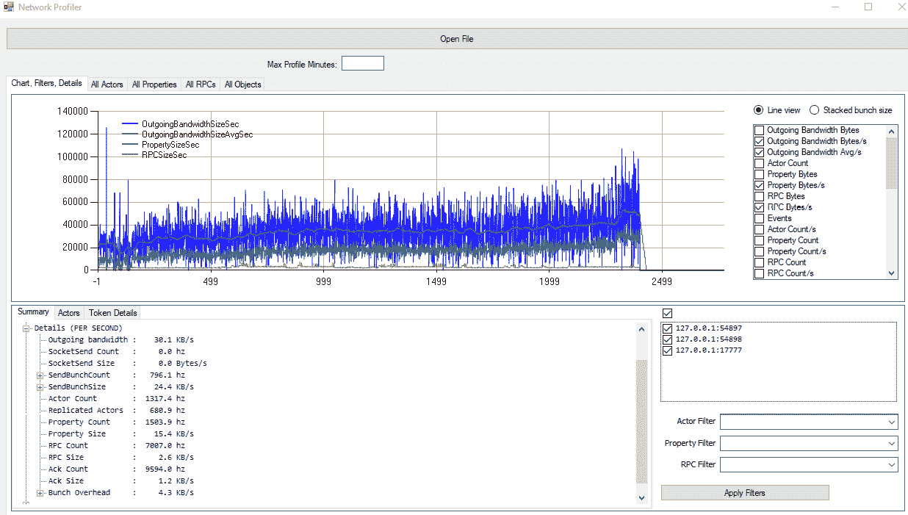

图 11.15 – 分析会话示例

您将看到很多信息，包括包含所有网络信息的图表。让我们关注右下角的部分，您将看到 IP 地址列表，如图*图 11.16*所示：


图 11.16 – 服务器和客户端 IP 地址列表

此列表表示会话期间被分析的客户和服务器 - 如您所见，在我的例子中，我有一个服务器（使用端口**17777**）和两个客户端（使用端口**54897**和**54898**）。您可以选择需要分析的客户或服务器，然后点击**应用过滤器**按钮以仅显示其分析数据。此外，您还可以启用一些下拉菜单，这将允许您过滤其他数据，例如游戏中单个演员类型。一个例子是**BP_Character**蓝图类。

一旦您选择了需要分析的客户端或服务器，您可以通过在图表数据上点击并拖动来选择代表游戏过程中一组帧的图表的一部分，如图*图 11.17*所示：

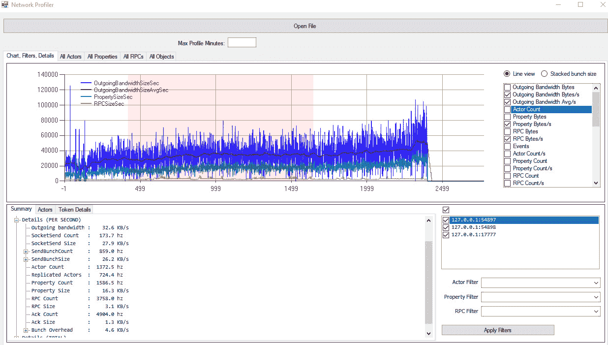

图 11.17 – 图表数据的选择部分

如果需要，您甚至可以通过点击图表来选择单个帧。*图 11.18*显示了图表中的帧选择：

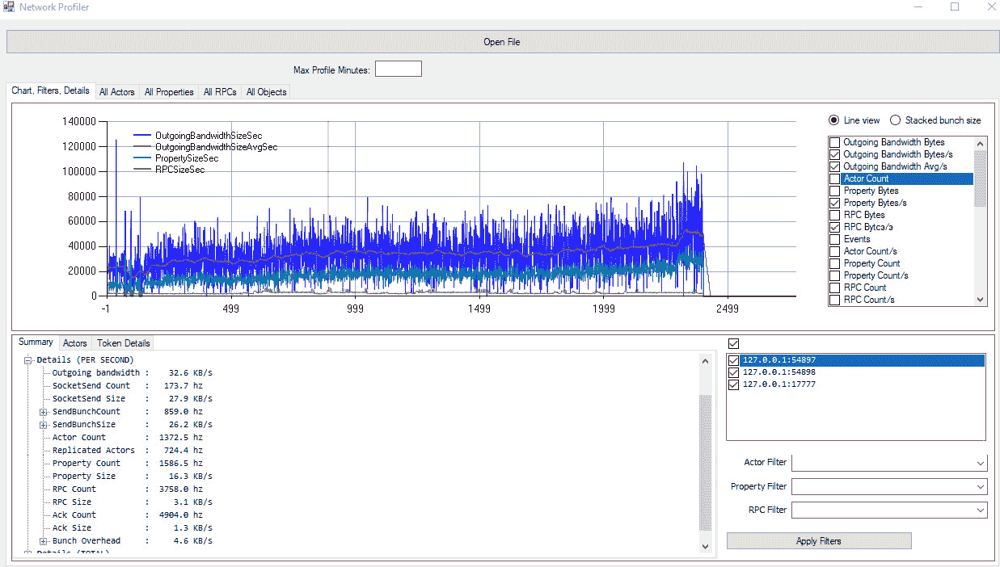

图 11.18 – 图表数据中的单个帧

现在，选择位于应用程序左下角的**演员**选项卡；您将看到在所选帧范围内复制的所有演员。我的分析记录如图*图 11.19*所示：


图 11.19 – 演员选项卡

这里最有趣的列之一是**MS**，它显示了复制一个演员所需的毫秒数。使用此值，您可以确定演员是否需要过多时间来复制，然后继续调查此问题的根本原因。

另一个需要考虑的非常重要的列是您的演员的`NetUpdateFrequency`值（即更新网络数据时将经过的时间间隔）到一个更高的值，以减少其值的更新频率。

如果您选择其中一个演员，您将获得在分析时间范围内复制的详细属性信息。例如，*图 11.20*显示了在约 1 分钟时间范围内的`BP_WoodenDoor`数据：

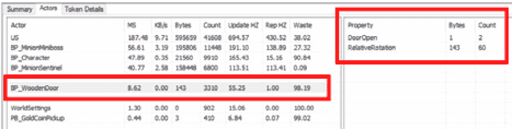

图 11.20 – BP_WoodenDoor 蓝图的性能分析数据

在游戏过程中，其中一个角色与门进行了交互，因此您可以看到 **DoorOpen** 属性被复制了两次——一次是起始值，一次是当角色打开时——以及 **RelativeRotation** 属性的 **60** 次复制——当打开动画被激活时。

这里的问题在于将 `NetUpdateFrequency` 设置为更高的值。

在积极的一面，看看 **BP_MinionMiniboss** Actor 的 **Waste** 值，如图 *11.21* 所示：

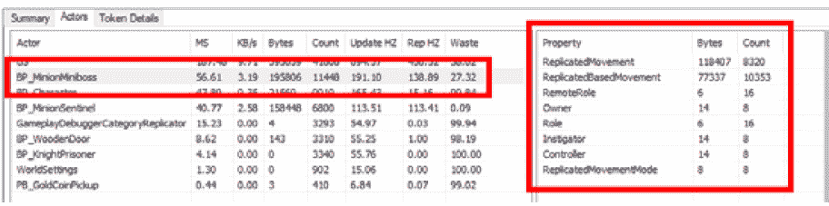

图 11.21 – BP_Miniboss 蓝图的性能分析数据

我在 1 分钟的游戏中达到了 27.32% 的良好成绩！但请注意...这并不意味着我在这个角色复制上花费了更少的资源。这表明我正在更有效地利用可用资源。

现在，打开位于应用程序顶部的 **所有 RPC** 选项卡；您将获得在所选帧范围内使用的远程过程调用的列表。*图 11.22* 显示了我迄今为止使用的示例情况：

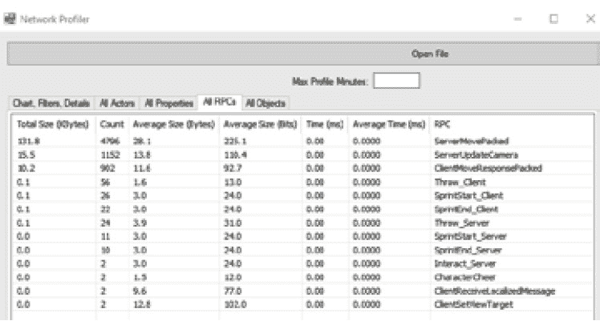

图 11.22 – RPC 性能分析窗口

如您所见，您可以分析远程调用发生的次数以及调用成本 - 这额外的信息可以帮助您优化代码并简化程序性能。

在本节中，我向您介绍了一个在多人游戏开发中最重要的工具——网络分析器。通过深入了解如何使用它，您将能够分析游戏网络性能的各个方面，例如远程调用的频率和成本，以及潜在的瓶颈。这些信息可以帮助您识别可以优化游戏性能的领域，同时为玩家提供更流畅和愉快的体验。

在下一节中，我将与您分享一些希望对提高您的多人项目有用的技巧，并帮助您避免游戏上线后可能出现的常见问题。

# 提高性能和带宽利用率

尽管虚幻引擎力求最大化复制 Actor 的效率，但通常这是一个耗时过程，可能会对性能产生负面影响。为了简化这项任务，您可以采取一些步骤来优化复制并使其更高效。在本节中，我将为您提供一些关于如何提高性能和避免可能阻止游戏高效运行的瓶颈的建议。

## 仅在必要时开启复制

在复制 Actor 时，服务器执行各种检查，例如相关性、更新频率和休眠状态等。避免在不需要此功能的 Actor 上开启复制，以避免进行这些检查。

如果你真的需要 Actor 复制，考虑对不太重要（或不太频繁更改）的 Actor 调整`NetUpdateFrequency`。此属性将设置 Actor 在网络上的最大更新频率。例如，一个背景 Actor，如 NPC，可能以非常慢的速度更新——比如说每 0.5 秒更新一次——而快速移动的敌人可能需要每 0.2 秒更新一次。

在某些情况下，你可能想实现自定义网络相关性规则（或覆盖可用变量），这有助于在运行时减少网络负载。

## 避免调用不必要的或非必要的 RPC

可以避免的 RPC 被认为是多余的 RPC，应该避免。

例如，如果你能确保非复制函数只会在服务器上运行，那么不需要在服务器 RPC 中包含特定于服务器的逻辑。

另一个例子是在客户端上的方法调用——如果你能保证客户端是本地控制的（即使用`APawn::IsLocallyControlled()`），你可以避免使用 RPC。

## 区分可靠和不可靠 RPC

如您在*第七章*中已知的，*使用远程过程调用（RPC）*，任何复制方法都可以是可靠的或不可靠的，并且默认情况下，RPC 是不可靠的。

在两种选项之间做出正确的选择可能会彻底改变你的游戏行为。为了帮助你，以下是一个关于可靠和不可靠 RPC 的优缺点的列表：

+   **可靠 RPC**：

    +   **优点**：函数将以发送时的相同顺序到达目的地

    +   **缺点**：函数将消耗更多带宽，可能导致更长的延迟

+   **不可靠 RPC**：

    +   **优点**：与可靠调用相比，函数将导致更低的带宽使用率；这使得它们成为需要频繁调用的函数的好候选者。

    +   **缺点**：函数可能无法成功到达目的地，或者 RPC 调用中可能存在缺失，尽管它们将以正确的顺序进行处理。

例如，你应该避免过于频繁地发送可靠事件，比如在`Tick()`事件上，因为引擎的可靠事件缓冲区可能会过载，从而导致相关玩家断开连接。这种调用使用不可靠函数会更安全——例如，在非关键性的外观事件上，如生成声音和视觉效果。

## 验证数据

如果你使用 C++，RPC 是唯一从客户端向服务器以及相反方向传递数据的方式，因此，在需要时验证它是好习惯。RPC 验证函数背后的概念是，如果它发现任何无效参数，它可以通知系统断开发起 RPC 调用的客户端或服务器。为了确保响应性，最好直接从客户端检索数据并在服务器端进行验证。

## 记住 GameMode 只存在于服务器上

这可能看起来是一个非常基础的话题，但您应该始终记住，GameMode 是一个非复制的 Actor，并且它只在服务器上运行。这意味着，无论您何时尝试从客户端获取它，您都会得到一个`null`值。因此，在它上面调用 RPC 纯粹是胡说八道，因为它只会在服务器上本地运行。

## 为 RPCs 使用命名约定

随着您的项目规模的增长，跟踪哪些函数是 RPCs 以及哪些不是可能会变得具有挑战性；这意味着使用良好的命名约定可能会节省时间。您可以使用我在前几章中向您展示的`_Server`和`_Client`后缀，或者您可以选择`Server_`和`Client_`前缀。如果您愿意，甚至可以区分`_Client`和`_Multicast` RPCs。

如果您与团队一起工作，这通常是一个要求。然而，即使您单独工作，您也会发现这个约定在长期来看是有用的。

如您可能已经注意到的，提高您的游戏水平是一个永无止境的旅程，它永远不会真正结束。您将始终在调整事物、分析数据和识别任何障碍。通过我提到的建议，我希望能让这个过程对您来说压力小一些！

# 摘要

在本章中，我谈到了游戏编程中的一个非常重要的话题——确保您的游戏正常运行并修复任何出现的问题。在早期章节中，我们介绍了一些在虚幻引擎中查找和修复问题的工具，但现在，我已经给了你一些更强、更有帮助的工具，您可以使用这些工具使您的游戏开发更加出色。首先，您学习了如何从**编辑器首选项**中配置**多人选项**，之后您创建了一个日志类别，以便在调试时正确设置自定义消息。然后，您被介绍如何通过测试网络问题（如数据包丢失或低带宽）在单个 PC 上模拟真实的多人环境。

接下来，我介绍了网络分析器，这是一款独立的软件，可以让您读取和分析多人会话，以帮助您找到代码中的潜在问题和瓶颈。

最后，我给了你一些如何进一步改进项目的建议。

在发布前测试和调试游戏可以帮助确保游戏运行顺畅并为玩家提供积极的体验。此外，拥有调试所需的正确工具和知识可以使过程更快、更简单，在开发过程中节省宝贵的时间和资源。了解如何调试多人游戏至关重要，因为多个玩家的参与可能会产生更复杂的技术挑战，例如同步和延迟问题。

在接下来的章节中，我们将回到我们的项目（以及 lichlord 的邪恶阴谋！）我们的目标这次是掌握管理游戏会话的艺术，以确保我们的未来热情的玩家们拥有难忘的体验。让我们确保他们能继续回来获取更多，好吗？

# 第四部分：在线部署你的游戏

在本书的最后部分，你将熟悉《虚幻引擎》多玩家系统的更复杂元素。你将从深入游戏会话管理开始，进而构建你游戏的可部署版本。最后，你将了解云服务，这些服务可以增强你的游戏对玩家的吸引力。

本部分包括以下章节：

+   *第十二章*，*管理多玩家会话*

+   *第十三章*，*会话期间处理数据*

+   *第十四章*，*部署多玩家游戏*

+   *第十五章*，*添加史诗在线服务 (EOS)*
