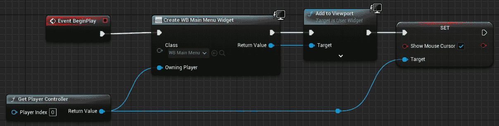
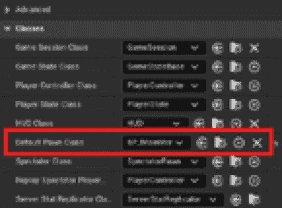
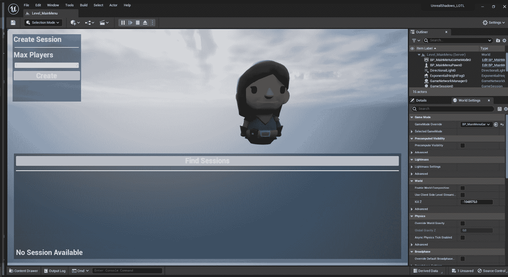
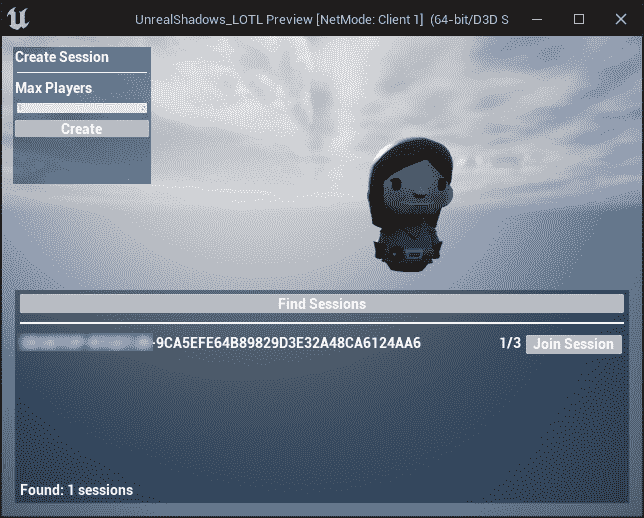
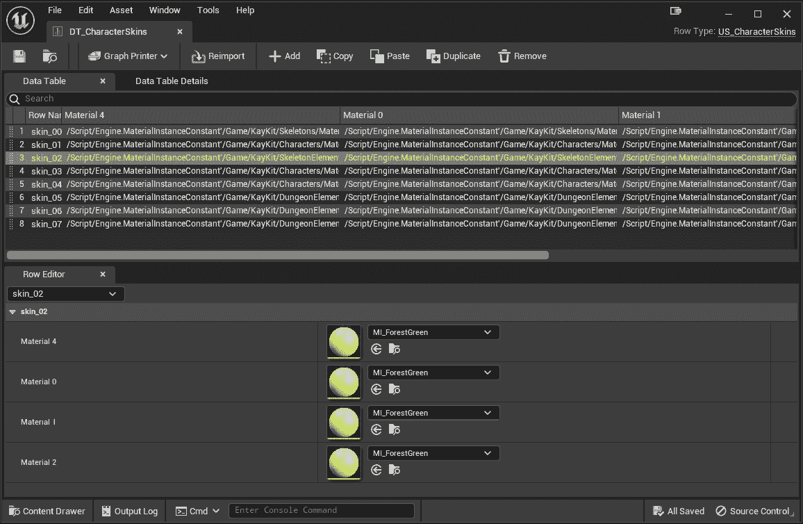
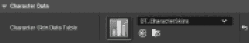
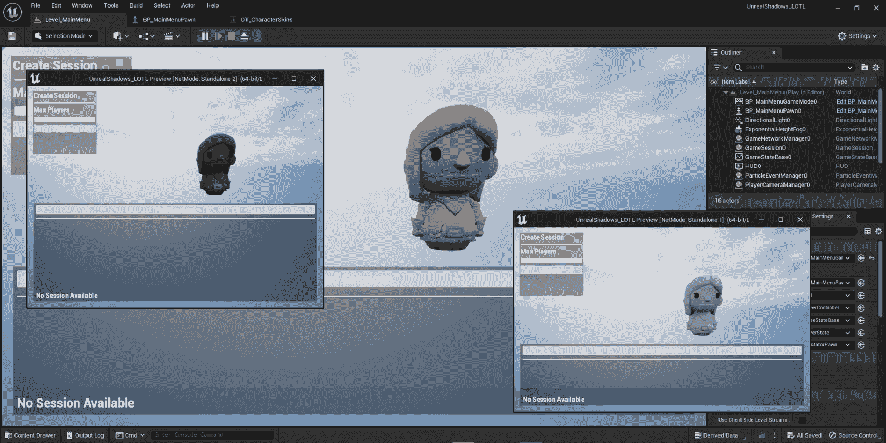
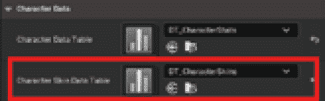
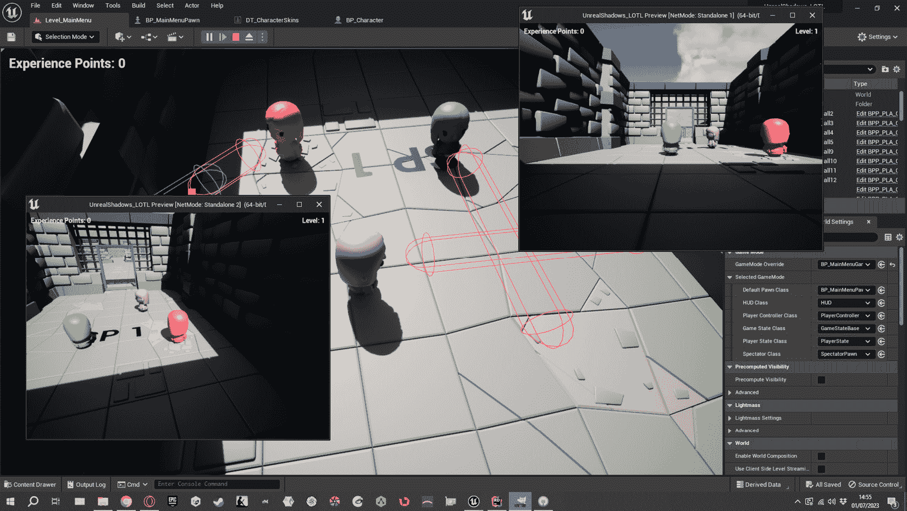

# 第十三章：会话期间处理数据

要开发多人游戏，你需要一个稳固的系统来管理层级之间的数据流。这意味着跟踪变量——如角色库存或健康——以使玩家能够及时获取所需的信息。简而言之，一个有效的多人游戏需要仔细管理数据，以确保所有玩家都能获得流畅、吸引人的体验。

在本章中，你将通过创建一个系统来完善上一章的会话系统，该系统将作为玩家的入口点。这意味着工作在一个新的层级，让玩家能够创建会话——如果他们是作为服务器开始游戏——或者在网络中寻找可用的会话——如果他们是作为客户端玩游戏。

此外，你还将学习如何通过添加皮肤变体来自定义玩家角色，以及如何将此数据从会话选择层级发送到实际游戏层级。这将使你的角色更加特别，甚至比以前更加酷炫和多彩！

到本章结束时，你将能够以计算机作为监听服务器并让其他 PC 作为客户端连接到它，并为游戏中的每个玩家提供不同的皮肤来托管本地网络游戏会话。

在本章中，我将指导你通过以下部分：

+   创建主菜单层级

+   会话期间处理数据

+   进一步改进

# 技术要求

要跟随本章介绍的主题，你应该已经完成了*第十二章*，*管理多人会话*，并理解其内容。

此外，如果你希望从本书的配套仓库开始编写代码，你可以下载本书配套项目仓库中提供的`.zip`项目文件：[`github.com/PacktPublishing/Multiplayer-Game-Development-with-Unreal-Engine-5`](https://github.com/PacktPublishing/Multiplayer-Game-Development-with-Unreal-Engine-5)。

你可以通过点击`Unreal Shadows –` *第十二章*`结束`链接来下载与上一章结尾保持一致的文件。

# 创建主菜单层级

在本节中，你将创建一个新的层级，该层级将作为创建游戏会话或加入会话的起点。你将通过添加所需的游戏框架类，如专用的 GameMode 和玩家 Pawn，利用之前创建的用户界面的强大功能和灵活性。

首先，让我们打开你的编程 IDE 并开始编写一些代码！

## 创建 Pawn

在本小节中，你将创建一个 Pawn，该 Pawn 将显示角色模型并通过其控制器激活用户界面。这个 Actor 还将被用来在玩家进入主菜单层级时显示角色模型。

因此，从 Unreal Engine 编辑器中创建一个新的从`US_MainMenuPawn`扩展的 C++类。一旦类被创建，打开`US_MainMenuPawn.h`头文件，并在`GENERATED_BODY()`宏之后添加以下代码：

```cpp
UPROPERTY(VisibleAnywhere, BlueprintReadOnly, Category = "Arrow", meta = (AllowPrivateAccess = "true"))
TObjectPtr<class UArrowComponent> Arrow;
UPROPERTY(VisibleAnywhere, BlueprintReadOnly, Category = "Camera", meta = (AllowPrivateAccess = "true"))
TObjectPtr<class UCameraComponent> Camera;
UPROPERTY(VisibleAnywhere, BlueprintReadOnly, Category = "Camera", meta = (AllowPrivateAccess = "true"))
TObjectPtr<USkeletalMeshComponent> Mesh;
```

然后，在`protected`部分添加相应的获取函数：

```cpp
FORCEINLINE UArrowComponent* GetArrow() const { return Arrow; }
FORCEINLINE UCameraComponent* GetCamera() const { return Camera; }
FORCEINLINE USkeletalMeshComponent* GetMesh() const { return Mesh; }
```

所有的前述代码都很直接，你应该已经从前面的章节中熟悉了它；我们正在声明所需的组件 – 一个箭头，一个摄像头和一个网格 – 然后我们暴露相应的获取方法。

接下来，打开`US_MainMenuPawn.cpp`文件并添加所需的`include`声明：

```cpp
#include "Camera/CameraComponent.h"
#include "Components/ArrowComponent.h"
```

然后，找到构造函数并添加以下代码：

```cpp
Arrow = CreateDefaultSubobject<UArrowComponent>(TEXT("Arrow"));
RootComponent = Arrow;
Camera = CreateDefaultSubobject<UCameraComponent>(TEXT("Camera"));
Camera->SetupAttachment(RootComponent);
Camera->SetRelativeLocation(FVector(450.f, 90.f, 160.f));
Camera->SetRelativeRotation(FRotator(-10.f, 180.f, 0.f));
Mesh = CreateDefaultSubobject<USkeletalMeshComponent>(TEXT("Mesh"));
Mesh->SetupAttachment(RootComponent);
Camera->SetRelativeLocation(FVector(0.f, -30.f, 90.f));
static ConstructorHelpers::FObjectFinder<USkeletalMesh> SkeletalMeshAsset(TEXT("/Game/KayKit/Characters/rogue"));
if (SkeletalMeshAsset.Succeeded())
{
 Mesh->SetSkeletalMesh(SkeletalMeshAsset.Object);
}
```

我们在这里没有添加任何新内容。像往常一样，我们只是为 Actor 添加了一组组件列表，包括一个实用箭头元素、网格和摄像头。

现在基本的`Pawn`类已经创建，现在是时候从它实现一个蓝图并添加之前创建的用户界面了。因此，返回到 Unreal Engine 编辑器，在`BP_MainMenuPawn`中。然后，打开蓝图，在事件图表中完成以下步骤：

1.  添加一个**获取玩家****控制器**节点。

1.  在图表中添加一个**创建小部件**节点，并将其传入的执行引脚连接到**事件****开始播放**节点的输出执行引脚。

1.  从**类**下拉菜单中选择**WB_MainMenu**类。

1.  将**拥有玩家**引脚连接到**获取玩家****控制器**节点的**返回值**。

1.  从**创建小部件**节点的输出执行引脚，点击并拖动以添加一个**添加到视口**节点。然后，将**目标**引脚连接到**创建****小部件**节点的**返回值**。

1.  从**获取玩家控制器**节点的**返回值**点击并拖动以添加**设置显示鼠标光标**。然后，勾选**显示鼠标光标**复选框并将传入的执行引脚连接到**添加到****视口**节点的输出执行引脚。

最终的图表展示在*图 13*.*1*中：



图 13.1 – BP_MainMenuPawn 蓝图中的最终图表

`BP_MainMenuPawn`蓝图已完成并准备就绪，因此我们现在可以继续工作在 GameMode 类上。

## 创建 GameMode

现在是时候创建一个将处理主菜单关卡的 GameMode 了。在`BP_MainMenuGameMode`中。

接下来，打开蓝图。然后在**详细信息**面板中，定位到**类**类别，并在**默认玩家类**下拉菜单中选择**BP_MainMenuPawn**，如图*图 13*.*2*所示：



图 13.2 – BP_MainMenuGameMode 设置

现在 GameMode 已经准备好了；我们只需要创建一个新的关卡并使用它来显示会话用户界面。

## 创建关卡

创建主菜单关卡相当直接：

1.  打开`Content` | `Maps`文件夹。

1.  从主菜单中选择 `Level_MainMenu`。

1.  打开关卡，在 **Worlds Settings** 面板中找到 **GameMode Override**。在相应的下拉菜单中，选择 **BP_MainMenuGameMode**。

1.  在 **Editor** 主菜单中，选择 **Edit** | **Project Settings**，并在新打开的窗口中找到 **Maps & Modes** 部分。然后，从 **Editor Template Map Overrides** 下拉菜单中选择 **Level_MainMenu**。

恭喜你，你已经通过了本节，并构建了游戏的开局关卡！现在，你的玩家可以像老板一样在自己的局域网中创建和托管游戏会话，或者作为客户端加入游戏。让我们通过玩游戏来测试这些功能。

## 测试会话系统

要开始测试游戏会话，打开 **Level_MainMenu** 地图，并使用以下设置进行游戏：

+   将 **Net Mode** 设置为 **Play Standalone**

+   设置 `3`

你将看到你迄今为止创建的用户界面，如图 *图 13**.3* 所示：



图 13.3 – 用户界面

从此界面，你可以创建会话，如下所示：

1.  从 **Max Players** 选择器中，将最大玩家数设置为 **3** 或更多。

1.  点击 **Create** 按钮；你将开始游戏并看到游戏关卡。

然后，要加入会话，请按照以下步骤操作：

1.  选择其他已打开的客户端之一，并点击 **Find Session** 按钮；此操作将启动服务器搜索，一段时间后，你应该能看到局域网中可用的服务器列表，以及已连接的玩家数量。*图 13**.4* 展示了一个已有玩家连接的游戏（即监听服务器），最多可容纳 3 名玩家：



图 13.4 – 会话搜索结果

1.  点击 **Join Session** 按钮以加入会话。你的角色将被传送到游戏关卡，你将能够开始游戏。

在本节中，你了解了会话管理，并学习了如何在多人游戏中创建、搜索和加入会话。

准备好，因为在接下来的章节中，你将给你的游戏增添额外的定制化元素。没错——准备好添加皮肤变体，让每个玩家的角色真正独一无二。是时候发挥创意，让你的想象力自由驰骋了！

# 会话期间处理数据

在本节中，你将学习一个新的主题：在加入会话时，从一个关卡传递数据到另一个关卡。你已经几乎拥有了执行此任务所需的所有知识——你只需要将这些知识整合起来。

我们在这里需要做的是为角色模型创建一个皮肤系统，该系统将执行以下操作：

+   从可能的变体列表中选择主菜单关卡中的随机皮肤

+   在加入会话时存储此数据

+   在加入会话后更新角色皮肤变体

在以下步骤中，您将开始处理一个直到现在都保持不活跃的类，但这个类将证明在未来的工作中非常有用。所以，准备好使用**US_GameInstance**类并看看它能做什么！

## 更新 US_GameInstance 类

您可能已经忘记了，但在本项目的开始时，您创建了**US_GameInstance**类。这个类提供了一些有趣的特性：

+   它在各个级别之间是持久的

+   它对每个客户端都是唯一的（也就是说，它不会在网络中复制）

这些特性使它成为在本地保持数据的同时在级别之间传输数据的绝佳候选者。您可以使用它来传递诸如玩家获得的经验点或他们的实际装备等信息。在我们的案例中，我们将使用它来存储一个非常简单的信息：所选皮肤的索引（我们将在本章后面实现皮肤列表）。

打开`US_GameInstance.h`头文件，在`public`部分添加以下声明：

```cpp
UPROPERTY(BlueprintReadWrite)
int32 SkinIndex;
```

虽然看起来很简单，但这正是我们需要将皮肤选择从一个级别传递到另一个级别的所有内容！

在接下来的几个步骤中，我们将创建一个数据结构来处理角色皮肤变体。

## 添加 CharacterSkins 数据

在本小节中，您将创建一个类似于您在*第六章*中创建的数据结构，*在网络中复制属性*，但这次，您将只存储用于更改角色网格颜色的材质引用。

角色模型有六个材质，如图*图 13.5*所示：


图 13.5 – 角色模型材质

对于角色定制，我们只需要其中四个——具体来说，是**元素 0**、**元素 1**和**元素 2**，它们都将改变角色的头发和衣服，以及**元素 4**，它将改变角色的皮肤。

### 创建结构

要创建包含皮肤数据的结构，打开您的编程 IDE，创建一个名为`US_CharacterSkins.h`的文件。然后，在该文件中添加以下代码：

```cpp
#pragma once
#include "CoreMinimal.h"
#include "Engine/DataTable.h"
#include "US_CharacterSkins.generated.h"
USTRUCT(BlueprintType)
struct UNREALSHADOWS_LOTL_API FUS_CharacterSkins : public FTableRowBase
{
 GENERATED_BODY()
 UPROPERTY(BlueprintReadWrite, EditAnywhere)
 UMaterialInterface *Material4;
 UPROPERTY(BlueprintReadWrite, EditAnywhere)
 UMaterialInterface *Material0;
 UPROPERTY(BlueprintReadWrite, EditAnywhere)
 UMaterialInterface *Material1;
 UPROPERTY(BlueprintReadWrite, EditAnywhere)
 UMaterialInterface *Material2;
};
```

如您所见，我们正在从`FTableRowBase`创建一个数据结构——这个结构将使我们能够创建数据表——然后我们声明了四个材质引用。顺便提一下，请记住，`UNREALSHADOWS_LOTL_API API`标识符可能会根据您的项目名称而改变。

在接下来的步骤中，您将通过生成数据表来从该结构创建实际的皮肤数据。

### 创建数据表

现在您已经创建了一个数据结构，您就可以从它创建实际的数据了。要创建您的皮肤数据表，请按照以下步骤操作：

1.  在内容浏览器中打开您的**Blueprints**文件夹，右键单击，然后选择**Miscellaneous** | **Data Table**。

1.  在**选择行结构**弹出窗口中，从下拉菜单中选择**US_CharacterSkins**。

1.  点击`DT_CharacterSkins`。

1.  双击新创建的资产以打开它。你将得到一个空的数据集；使用项目中的任何材质（或创建自定义材质！）创建你的角色皮肤行。

在开发阶段，我喜欢创建调试皮肤，这有助于我识别每个独特的角色。在这种情况下，我使用单一颜色为行集中的所有元素（即所有绿色、所有红色或所有蓝色），如图*图 13.6*所示：



图 13.6 – 皮肤数据表

一旦你对皮肤系统感到满意并且已经对其进行了实战测试，你将需要为你的盗贼角色添加一些更逼真的皮肤；这个过程将和创建一个新的包含你选择皮肤颜色的数据表并将此表设置为**Pawn**变量中的选中表一样简单。

现在你有了皮肤目录资产，你可以开始向主菜单`Pawn`类添加代码以在运行时设置其皮肤。

## 更新`US_MainMenuPawn`类

在这个部分，你将通过分配随机皮肤来增强角色的外观。每次玩家连接到主菜单级别时，他们的角色将获得一个独特的皮肤颜色组合，这些颜色来自之前创建的数据表。所以，准备好在游戏中看到更多样性吧！

如我之前提到的，你在*第六章*中处理了这个问题，*在网络中复制属性*，但正如老话所说，熟能生巧！

使用你的编程 IDE 打开`US_MainMenuPawn.h`头文件，并在隐式的`private`部分添加数据表和皮肤声明：

```cpp
UPROPERTY(EditAnywhere, BlueprintReadOnly, Category = "Character Data", meta = (AllowPrivateAccess = "true"))
class UDataTable* CharacterSkinDataTable;
struct FUS_CharacterSkins* CharacterSkin;
```

接下来，在`public`部分，添加选中角色皮肤的获取方法：

```cpp
FORCEINLINE FUS_CharacterSkins* GetCharacterSkin() const { return CharacterSkin; }
```

在`protected`部分，声明一个将处理皮肤随机化过程的函数：

```cpp
void RandomizeCharacterSkin();
```

现在，你可以打开`US_MainMenuPawn.cpp`文件以开始添加皮肤处理实现。首先，声明所需的包含：

```cpp
#include "US_CharacterSkins.h"
#include "US_GameInstance.h"
```

然后，添加`RandomizeCharacterSkin()`的实现：

```cpp
void AUS_MainMenuPawn::RandomizeCharacterSkin()
{
 if(CharacterSkinDataTable)
 {
  TArray<FUS_CharacterSkins*> CharacterSkinsRows;
  CharacterSkinDataTable->GetAllRows<FUS_CharacterSkins>(TEXT("US_Character"), CharacterSkinsRows);
  if(CharacterSkinsRows.Num() > 0)
  {
   const auto NewIndex = FMath::RandRange(0, CharacterSkinsRows.Num() - 1);
   CharacterSkin = CharacterSkinsRows [NewIndex];
   Mesh->SetMaterial(4, CharacterSkinsRows[NewIndex]->Material4);
   Mesh->SetMaterial(0, CharacterSkinsRows[NewIndex]->Material0);
   Mesh->SetMaterial(1, CharacterSkinsRows[NewIndex]->Material1);
   Mesh->SetMaterial(2, CharacterSkinsRows[NewIndex]->Material2);
   if (const auto GameInstance = Cast<UUS_GameInstance>(GetGameInstance()))
   {
    GameInstance->SkinIndex = NewIndex;
   }
  }
 }
```

如你所见，我们正在从表引用中检索所有数据行，并在确认表中至少有一个项目后，我们获取一个随机行并将 Pawn 网格材质设置为其中包含的数据。这将更新级别中显示的 Pawn。之后，我们检索游戏实例作为`UUS_GameInstance`类型并将之前随机化的索引分配给`SkinIndex`属性。

作为最后一步，我们将在游戏开始时添加随机化调用。因此，在`BeginPlay()`方法中，添加以下代码：

```cpp
if(IsLocallyControlled())
{
 RandomizeCharacterSkin();
}
```

我们现在需要从蓝图设置数据表，所以让我们切换回 Unreal Engine 编辑器。

## 更新`BP_MainMenuPawn`蓝图

现在角色`Pawn`类已经准备好了，你只需将之前创建的数据表分配给 Pawn 蓝图。要做到这一点，打开`BP_MainMenuPawn`并执行以下操作：

1.  在**详细信息**面板中，查找**角色皮肤数据****表**属性。

1.  从下拉菜单中选择**DT_CharacterSkins**，如图*图 13**.7*所示：



图 13.7 – 角色皮肤数据表属性

1.  如果您测试游戏，您将为每个角色随机分配一个皮肤，如图*图 13**.8*所示：



图 13.8 – 开始时的皮肤随机化

角色随机化已完成；为了充分利用它，我们只需从游戏关卡侧检索数据并将其分配给正在玩的角色。

## 更新 US_Character 类

在本小节中，您将从游戏实例中检索皮肤索引数据并将其设置到玩家角色。一旦您记住游戏实例在关卡之间是持久的并且不会被复制（即每个客户端都有自己的专用实例），这个过程就相当直接了。

首先，从您的编程 IDE 中打开`US_Character.h`头文件，并在隐式的`private`部分声明所需的数据表属性：

```cpp
UPROPERTY(EditAnywhere, BlueprintReadOnly, Category = "Character Data", meta = (AllowPrivateAccess = "true"))
UDataTable* CharacterSkinDataTable;
struct FUS_CharacterSkins* CharacterSkin;
```

我知道您已经熟悉之前的声明，所以不会浪费您的时间再次解释它们。

接下来，在`protected`部分，您需要添加以下声明。这些声明将处理皮肤更新：

```cpp
UPROPERTY(EditDefaultsOnly, BlueprintReadOnly, ReplicatedUsing="OnRep_SkinChanged", Category = "Skin")
int32 SkinIndex = 0;
UFUNCTION()
void OnRep_SkinChanged(int32 OldValue);
UFUNCTION(Server, Reliable)
void SetSkinIndex_Server(int32 Value);
UFUNCTION()
void UpdateCharacterSkin();
```

在`public`部分，添加以下代码：

```cpp
FORCEINLINE FUS_CharacterSkins* GetCharacterSkins() const { return CharacterSkin; }
virtual void GetLifetimeReplicatedProps(TArray<FLifetimeProperty>& OutLifetimeProps) const override;
```

如您从*第六章*，“通过网络复制属性”中可能记得的，每当您需要复制一个属性时，您可以使用`ReplicatedUsing`属性指定符来通知所有客户端属性值已更改。在这种情况下，我们将复制`SkinIndex`变量，以便所有客户端在加入会话后更新他们的角色皮肤。

此外，始终记住，为了复制一个属性，它应该在`GetLifetimeReplicatedProps()`方法中通过`DOREPLIFETIME`宏进行初始化，这就是我们声明该方法的原因。

要实现所有复制逻辑和皮肤更新，打开`US_Character.cpp`文件，并首先添加所需的`include`声明：

```cpp
#include "US_GameInstance.h"
#include "US_CharacterSkins.h"
#include "Net/UnrealNetwork.h"
```

然后，添加`GetLifetimeReplicatedProps()`方法实现以实现属性复制：

```cpp
void AUS_Character::GetLifetimeReplicatedProps(TArray<FLifetimeProperty>& OutLifetimeProps) const
{
 Super::GetLifetimeReplicatedProps(OutLifetimeProps);
 DOREPLIFETIME(AUS_Character, SkinIndex);
}
```

接下来，添加`OnRep_SkinChanged()`方法。每当`SkinIndex`值从服务器更新到客户端时，此方法将被执行：

```cpp
void AUS_Character::OnRep_SkinChanged(int32 OldValue)
{
 UpdateCharacterSkin();
}
```

然后，通过添加`SetSkinIndex_Server_Implementation()`方法从服务器端实现皮肤索引更新：

```cpp
void AUS_Character::SetSkinIndex_Server_Implementation(const int32 Value)
{
 SkinIndex = Value;
 UpdateCharacterSkin();
}
```

注意，我们是从服务器端调用`UpdateCharacerSkin()`事件；如果您使用的是监听服务器，这是强制性的，因为前一个方法只会在客户端调用，在这种情况下，服务器将不会更新皮肤。

第四种方法，`UpdateCharacterSkin()`，将负责从游戏实例检索数据并更新角色网格材质。为此，请添加以下实现：

```cpp
void AUS_Character::UpdateCharacterSkin()
{
 if(CharacterSkinDataTable)
 {
  TArray<FUS_CharacterSkins*> CharacterSkinsRows;
  CharacterSkinDataTable->GetAllRows<FUS_CharacterSkins>(TEXT("US_Character"), CharacterSkinsRows);
  if(CharacterSkinsRows.Num() > 0)
  {
   const auto Index = FMath::Clamp(SkinIndex, 0, CharacterSkinsRows.Num() - 1);
   CharacterSkin = CharacterSkinsRows[Index];
   GetMesh()->SetMaterial(4, CharacterSkin->Material4);
   GetMesh()->SetMaterial(0, CharacterSkin->Material0);
   GetMesh()->SetMaterial(1, CharacterSkin->Material1);
   GetMesh()->SetMaterial(2, CharacterSkin->Material2);
  }
 }
}
```

我们在这里所做的是几乎与主菜单 Pawn 类相同的；我们从一个皮肤数据表中获取一行，并将材质分配给角色网格。唯一的区别是我们没有将皮肤索引设置到游戏实例中，而是获取了它的复制版本。

作为最后一步，你需要在 `BeginPlay()` 方法实现的末尾添加以下代码：

```cpp
if(IsLocallyControlled())
{
 if(const auto GameInstanceCast = Cast<UUS_GameInstance>(GetWorld()->GetGameInstance()); GameInstanceCast != nullptr)
 {
  SetSkinIndex_Server(GameInstanceCast->SkinIndex);
 }
}
```

这段代码检查这个类的实例是否是本地控制的（也就是说，它是一个玩家拥有的角色），并从游戏实例中获取皮肤索引。然后，它调用 `SetSkinIndex()` 服务器函数来通知所有客户端他们应该更新这个角色的外观。

对于主菜单 Pawn 类，你现在需要更新相应的蓝图来声明皮肤数据表。

## 更新 BP_Character 蓝图

现在角色类别已经准备好了，你只需将之前创建的数据表分配给相应的蓝图。为此，请按照以下步骤操作：

1.  打开 **BP_Character**。

1.  在**详细信息**面板中，查找**角色皮肤数据****表**属性。

1.  从下拉菜单中选择**DT_CharacterSkins**，如图 *图 13.9* 所示：



图 13.9 – 角色皮肤数据表属性

如果你现在测试游戏，你将为每个角色随机分配一个皮肤，并在加入会话后保留该皮肤，如图 *图 13.10* 所示：



图 13.10 – 使用皮肤角色的游戏玩法

在本节中，你学习了如何在创建或加入会话时保留数据。你是通过将游戏实例作为某种数据桥来创建皮肤功能来做到这一点的；这将使每个角色独一无二，甚至更有吸引力，帮助你给他们一个杀手级的改造，让巫妖王都感到脚底发凉！

在接下来的章节中，我不会介绍任何新主题；相反，我将给你一些额外的想法，帮助你更好地管理你的游戏会话。

# 进一步改进

在前面的章节中，你出色地理解了如何在会话之间传递数据，使你的多人游戏更具吸引力。现在，是时候通过添加一些附加功能来使你的游戏更加出色了。在本节中，我将提供一些技巧来帮助你给你的项目增添一些兴奋感。一如既往，不要害怕加入你个人的风格，让它真正属于你。

## 离开和销毁会话

在本章和上一章中，您已经使用了四个会话命令中的三个——**创建会话**、**加入会话**和**查找会话**——但**销毁会话**命令尚未使用。使用**销毁会话**命令节点让玩家离开游戏会话。

这将在游戏关卡（而不是主菜单）中实现，因为玩家在加入会话后需要离开。为了实现这个功能，您可能想要创建一个专门的用户界面，让玩家在决定离开游戏时随时可以离开。

作为旁注，请记住，客户端和服务器在会话方面表现不同，因此您将不得不管理两种会话销毁：客户端的——这几乎是无痛的——以及在客户端/服务器主机的情况下，服务器的——这需要销毁所有客户端的会话（也就是说，所有客户端都应该离开会话，因为服务器不再起作用了）。

## 处理玩家死亡

目前，当玩家被巫妖领主的小兵捕获时，什么也不会发生——您只会看到一个屏幕信息，玩家将继续游戏。

您可以通过许多方式管理玩家的死亡，但这里有一些想法供您参考：

+   销毁玩家会话并重新加载主菜单关卡，让玩家加入新的会话。只是记住，如果被击败的玩家是服务器主机，所有其他玩家将立即被从会话中移除。

+   使用重生方法，将角色放置在可用的出生点，无需重新加入会话。

## 选择玩家皮肤

在本章中，您开发了一个随机皮肤生成器，但让玩家选择自己的皮肤不是更酷吗？您可以在主菜单级别添加一个用户界面，让玩家执行以下操作：

+   如果皮肤不符合他们的需求，请再次随机化皮肤

+   使用专用选择方法从完整集合中选择所需的皮肤

嗯，当谈到创建一个像魔法一样起作用且让竞争对手羡慕的皮肤系统时，这可能是冰山一角。谁知道呢？实现您的游戏内购买甚至可能让像堡垒之夜这样的游戏感到膝盖发软！

# 摘要

在本章中，您开发了一个在游戏会话期间从一个关卡传递到另一个关卡数据的完整功能系统。在这种情况下，您专注于玩家角色的皮肤系统，但这个特性的用例几乎是无限的。

如您所注意到的，会话处理是一个巨大的主题——它需要两章来正确解释其主要功能——在多人游戏世界中取得成功，掌握它至关重要。如果您想要乘风破浪，那么掌握这项技能是一个不容商量的主题！

在下一章中，我将引导你探索一个全新的主题：如何正确地打包你的游戏。准备好深入探索项目打包的精彩世界，以便你能在服务器和客户端两端像老板一样部署你的游戏！你准备好迎接这次冒险了吗？
