# 14

# 部署多人游戏

对于任何开发者来说，部署 Unreal 多人游戏可能是一项艰巨的任务。

在本章中，我将向您介绍包装和部署游戏的关键步骤——这是一个需要事先进行适当规划和准备的过程。这将帮助您避免大多数问题，从而在部署时成功发布。

此过程还将涉及一个关键任务——从源代码编译 Unreal Engine，然后将您的游戏打包为独立的服务器可执行文件和客户端可执行文件。

因此，在接下来的几节中，我将向您介绍以下主题：

+   真正上线

+   编译 Unreal Engine

+   设置专用服务器

# 技术要求

要跟随本章中介绍的主题，您应该已经完成了所有前面的章节，并理解了它们的内容。

虽然不是强制性的，但基本了解 Git 技术 ([`git-scm.com`](https://git-scm.com)) 将有助于本章的第二部分。

# 真正上线

到目前为止，为了处理您的项目，您一直在使用可以通过 Epic Games Launcher 访问的 Unreal Engine 官方发布版本。然而，如果您渴望提高您的多人开发技能，您必须进一步努力，以在多人开发领域熟练地脱颖而出，并成为一名熟练的多人游戏开发者。

首先，您需要知道的是，Unreal Engine 的发布版本并不是软件的“完整”版本；它们提供了几乎您在项目上所需的所有功能，但通常缺少较少见和更高级的功能。其中一个主要原因是保持 Unreal Engine 的常规版本更小、更经济。

很遗憾，这些发布版本缺乏编译多人部署项目所需的功能，这反过来意味着，如果您计划在野外发布您的游戏，那么您将很不幸。

幸运的是，有一个解决方案可用——直接从源代码编译 Unreal Engine 编辑器。完整的 Unreal Engine 源代码存储在 GitHub 上托管的一个仓库中（[`github.com/`](https://github.com/)），并且只需付出最小的努力，您就能获取它并用于您自己的需求。编译您自己的引擎版本有许多优点，包括在调试游戏时查看实际的引擎实现类（如 Actor 和 Pawn）以及进入引擎代码，以获得对发生情况的洞察。

许多个人通过识别软件漏洞并花费时间修复它们，为该引擎做出了宝贵的贡献。在撰写本章时，该引擎的贡献者人数多达 563 名开发者，如图 *14.1* 所示：

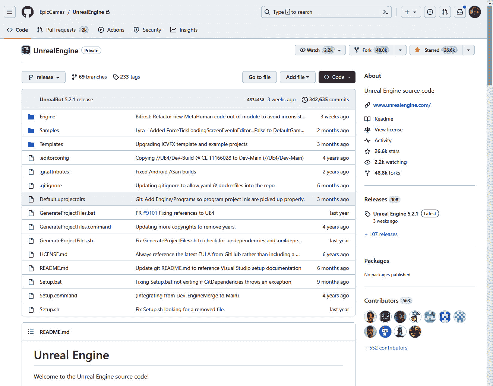

图 14.1 – Unreal Engine 的 GitHub 页面

访问引擎源代码并编译自己的可执行版本的好处之一是，您将能够将您的多人游戏编译为**专用服务器**——一种不渲染任何视觉效果的版本，且不会在客户端机器上运行。这类游戏实例通常被称为**无头**游戏版本。

使用专用服务器比使用监听服务器具有许多优势：

+   可执行文件的大小将更小

+   服务器版本将主要关注游戏逻辑和处理来自客户端的信息

+   由于托管游戏会话，没有任何客户端会比其他客户端有优势或劣势

+   您可以构建一个与客户端发布版分开的专用服务器发布版，以及从专用服务器构建的客户端发布版

+   服务器端代码逻辑可以在服务器上编译，从而隐藏可能被恶意黑客获取的重要代码，如果将其分发到客户端中

在此基础上，让我们开始这段激动人心的旅程，通过使用源代码创建我们自己的虚幻引擎编辑器可执行程序。

首件事是获取 GitHub 仓库中的实际源代码——我们将在下一节中完成这项工作。

# 编译虚幻引擎

在本节中，您将下载引擎源代码并构建它，以获得个人可执行发布版，这将允许您创建自己的专用服务器进行多人部署。

此过程分为两个主要部分：

+   从官方 Epic Games GitHub 仓库克隆项目

+   使用 Visual Studio 设置和构建源代码

如果您不熟悉 GitHub，不要担心——我将用清晰易懂的步骤引导您完成所有操作。

## 下载虚幻引擎源代码项目

在接下来的步骤中，您将从官方 Epic Games GitHub 仓库下载虚幻引擎源代码，以便将整个项目掌握在手中。您需要满足以下要求：

+   在您的计算机上安装 Git

+   拥有 GitHub 账户

+   将 GitHub 账户连接到您的 Epic Games 账户

注意

如果您已经了解 Git，那么您可能已经满足了一些或所有要求。如果是这样，请随意跳过以下步骤。

您将首先在计算机上安装 Git。

### 在您的计算机上安装 Git

**Git** 是一个免费且开源的版本控制系统。它旨在跟踪对计算机文件所做的更改，通过在执行提交时对项目文件进行“快照”来实现。此功能使开发者能够以高效、快速的方式监督和控制其代码的演变。Git 是一个出色的源代码管理工具，适用于从小型到极其大型所有规模的项目。

如前所述，您不需要精通 Git 就能获取 Unreal Engine 仓库——您只需使用其克隆功能下载引擎源代码。

在您的计算机上安装 Git，请访问官方下载页面 ([`git-scm.com/downloads`](https://git-scm.com/downloads)) 并获取最新版本。下载完成后，就像安装任何常见软件一样简单地安装它。一旦安装阶段完成，您将在您的机器上获得 Git 命令行。

注意

有些人——包括我——更喜欢使用专用客户端软件而不是使用命令行，这样可以减轻使用命令提示符的痛苦。如果您对命令行感到不舒服，您可以使用第三方客户端，其中一些在本页面上列出：[`git-scm.com/downloads/guis`](https://git-scm.com/downloads/guis)。

一旦您安装了 Git，您就可以安全地继续创建 GitHub 账户。

### 创建 GitHub 账户

**GitHub** ([`github.com/`](https://github.com/)) 是一个基于云的服务，允许软件开发者使用 Git 存储管理、跟踪和控制对代码库所做的更改。它使开发者能够从任何地方协作进行项目，并提供项目管理工具、文档、问题跟踪和持续集成和部署等功能。GitHub 在软件开发行业中得到广泛应用，并已成为许多组织和开发人员软件开发工作流程的关键部分。

要创建 GitHub 账户，您只需点击**注册**按钮，然后添加您的电子邮件后，按照您将收到的指示操作。

一旦您创建了 GitHub 账户，就是时候通过连接 GitHub 和 Epic Games 账户来访问 Epic Games 组织了。

### 将您的 GitHub 账户连接到 Epic Games 账户

Epic Games 拥有一个 GitHub 组织 ([`github.com/EpicGames`](https://github.com/EpicGames))，其中存储了公共仓库，包括 Unreal Engine 项目。访问这个组织是免费的——您只需将 Epic Games 账户连接到 GitHub 账户。以下是操作方法：

1.  访问您的 Epic Games 账户页面 ([`www.epicgames.com/account`](https://www.epicgames.com/account))。

1.  选择**应用程序和账户**页面。

1.  在**GITHUB**部分，点击如图 14.2 所示的**连接**按钮：

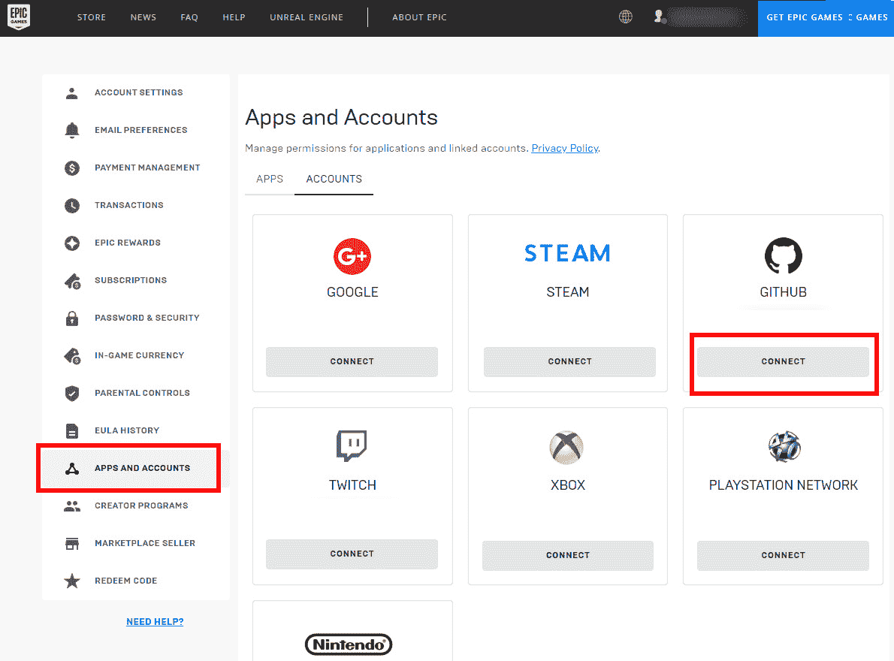

图 14.2 – 应用程序和账户部分

一旦您授权了连接操作，您将获得访问 Epic Games GitHub 组织 ([`github.com/EpicGames`](https://github.com/EpicGames)) 和 Unreal Engine 仓库 ([`github.com/EpicGames/UnrealEngine`](https://github.com/EpicGames/UnrealEngine)) 的权限。Unreal Engine 仓库包括所有 Unreal Engine 版本，它们分别组织在自己的分支中。

在 Git 中，`release`分支包含引擎的最新稳定版本。

您现在可以开始在本地机器上克隆仓库：

1.  在您的 PC 上，导航到一个空文件夹或创建一个新的文件夹。

1.  右键单击，从下拉菜单中选择**Git Bash Here**，如图*图 14.3*所示：


图 14.3 – Git Bash Here 选项

这将打开一个命令提示符，您将准备好克隆虚幻引擎项目。

1.  输入以下命令：

    ```cpp
    git clone https://github.com/EpicGames/UnrealEngine.git
    ```

您可能需要输入您的凭据；在这种情况下，请使用您的 GitHub 账户的凭据。

下载和克隆过程可能需要很长时间，具体取决于您的互联网连接。

1.  一旦过程完成，您应该在您的目录中看到一个`UnrealEngine`文件夹；这是项目源代码。在 Git 终端中，输入以下命令：

    ```cpp
    git fetch origin
    ```

此命令将检索远程仓库中所有可用的分支。

1.  作为可选步骤，如果您想使用引擎的特定版本，可以输入以下命令：

    ```cpp
    git checkout –b [version number] origin/[version number]
    ```

例如，如果您需要虚幻引擎 5.1，您将输入：

```cpp
git checkout –b 5.1 origin/5.1
```

此命令将切换到 5.1 版本分支，并使其源代码可用。

一旦过程完成，您就可以开始编译源文件了。

## 从源代码编译

一旦您从 GitHub 仓库下载了源代码，您就需要编译它，以便从中生成可执行文件。这将允许您启动编译后的虚幻引擎应用程序并利用其所有功能。

为了拥有一个完全工作的可执行文件，您需要完成以下四个主要步骤：

+   设置您的编程 IDE

+   设置项目

+   生成项目文件

+   编译源文件

让我们从检查您的编程 IDE 是否更新并准备好开始使用开始。

### 设置您的编程 IDE

由于您到目前为止一直在使用虚幻和 C++，因此您的编程 IDE 应该已经更新到最新版本，以便编译源文件，但进行双重检查是强制性的，以确保一切设置正确：

1.  打开您的 PC 上的 Visual Studio 安装程序。

1.  从您的 Visual Studio 安装中选择**修改**，如图*图 14.4*所示：

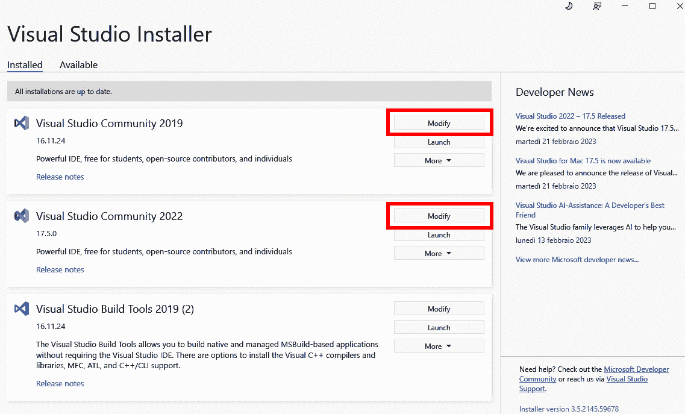

图 14.4 – Visual Studio 安装程序

1.  一旦**修改**窗口打开，选择**单个组件**选项卡，如图*图 14.5*所示：

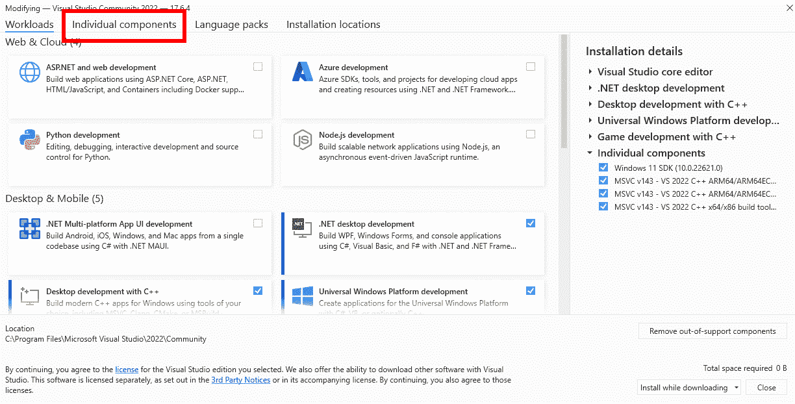

图 14.5 – 修改窗口

1.  从**单个组件**选项卡安装最新的.NET Framework 开发工具、最新的.NET Framework SDK 以及 – 虽然不是强制性的，但强烈推荐 – 所有的.NET Framework SDK 旧版本。*图 14.6*展示了我在撰写本书时的设置：

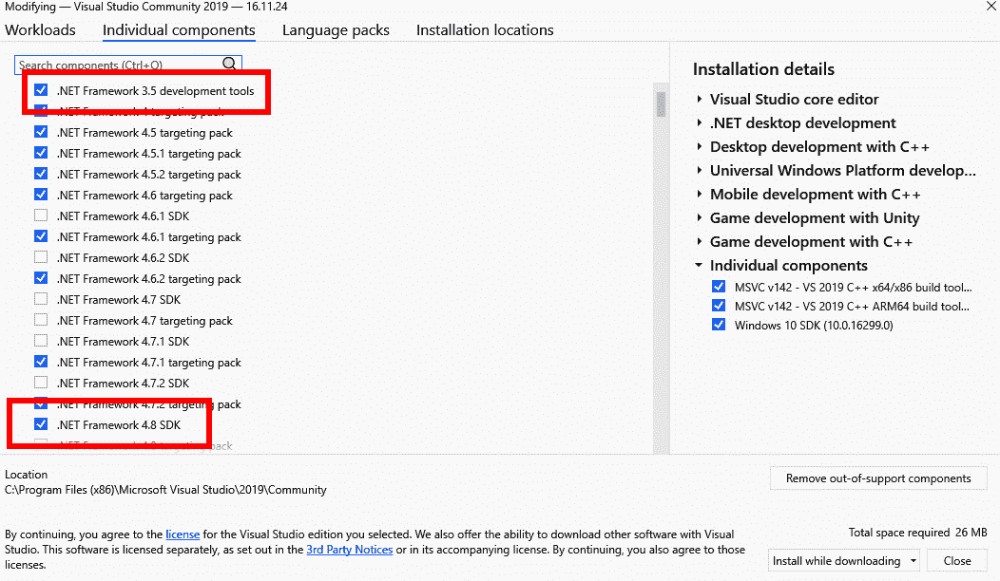

图 14.6 – 单个组件设置

安装完成后，你可以安全地关闭 Visual Studio 安装程序，并准备好设置项目。

### 设置项目

在这一步，你将下载所需的依赖文件，以便正确设置项目。这个过程相当直接，但可能需要一些时间，具体取决于你的互联网连接。只需打开从 GitHub 克隆的源文件项目文件夹，该文件夹应命名为 `Setup.bat` 文件，如图 *图 14.7* 所示：


图 14.7 – Setup.bat 文件

然后右键单击此文件并选择**以管理员身份运行**；这将打开命令提示符并运行所需的命令。

注意

对于更高级的定制级别，你可能想要预先确定目标硬件和平台。例如，你可以使用 `-exclude` 选项排除不需要的平台来运行 `Setup.bat` 命令。作为额外的好处，将下载 fewer 文件，并且在构建过程结束时，你将得到一个文件大小更小的引擎。

一旦过程完成，你将添加所需的依赖项，并准备好进行下一步。

### 生成项目文件

一旦你正确设置了项目，你就可以生成项目文件，以便在 Visual Studio 中打开项目。这个过程几乎与之前相同，但你将不得不运行另一个 `.bat` 文件。在源项目文件夹（即 `UnrealEngine` 文件夹）中，找到 `GenerateProjectFiles.bat` 文件，如图 *图 14.8* 所示：


图 14.8 – GenerateProjectFiles.bat 文件

再次，右键单击文件并选择将 `UE.sln` 文件添加到你的源文件文件夹中，如图 *图 14.9* 所示：

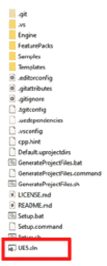

图 14.9 – .sln 文件

注意

如果你需要为项目生成命令进行更多定制，我建议参考官方文档，它提供了所有可用命令选项的详尽列表：[`docs.unrealengine.com/5.1/en-US/how-to-generate-unreal-engine-project-files-for-your-ide/`](https://docs.unrealengine.com/5.1/en-US/how-to-generate-unreal-engine-project-files-for-your-ide/).

你现在可以打开 Visual Studio 并构建 Unreal Engine。

### 编译源文件

我们现在将通过之前生成的解决方案在 Visual Studio 中编译源代码。要打开它，只需双击 `UE.sln` 文件，软件应该会打开。

注意

如果你安装了多个 Visual Studio 版本，你可能需要打开正确的版本，以便正确编译项目。这取决于你的 PC 配置和 .NET SDK 安装。

首件事是设置正确的解决方案配置。为此，在工具栏中找到**解决方案配置**下拉菜单，并将其值设置为**开发编辑器**，如图*图 14.10*所示：

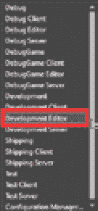

图 14.10 – 解决方案配置下拉菜单

接下来，您需要检查您将要编译的解决方案平台。在 Visual Studio 工具栏中，找到**解决方案平台**下拉菜单，并确认目标平台设置为**Win64**，如图*图 14.11*所示：

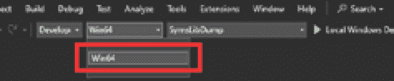

图 14.11 – 解决方案平台下拉菜单

您终于准备好开始构建过程了。为此，找到`Engine`文件夹内容。然后右键单击**UE5**并选择**构建**，如图*图 14.12*所示：

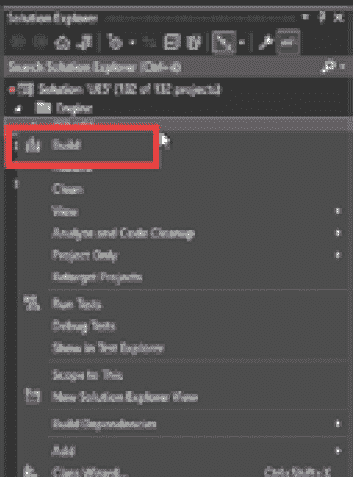

图 14.12 – 构建选项

构建过程将需要大量时间才能完成（这将进一步取决于您计算机的能力），所以您可以放松一下，喝杯咖啡休息一下。

完成过程后，您有值得庆祝的东西！您刚刚创建了自己的全新 Unreal Engine 可执行文件。`.exe`文件可以在您的源文件项目中找到，在`Engine` | `Binaries` | `Win 64`文件夹中。我的编译二进制文件如图*图 14.13*所示：

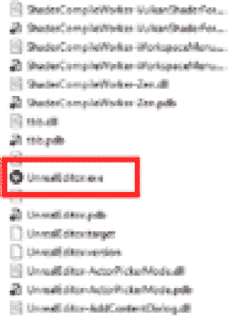

图 14.13 – Unreal Engine 编译的可执行文件

当您双击它时，Unreal Engine 将启动，您会注意到一切看起来几乎与常规 Unreal Engine 编辑器相同。然而，区别在于，在底层，您将拥有一个功能更强大的引擎，拥有更多可供使用的功能。

在本节中，您已经完成了从源代码编译 Unreal Engine 编辑器的挑战性任务 – 这是一件值得骄傲的事情！现在，为下一节中更具挑战性的任务做好准备，在那里您将为多人游戏创建一个专用服务器。

# 设置专用服务器

在本节中，您将编译一个作为专用服务器的多人项目。为了使事情简单，您将使用从官方模板生成的简单项目，但所有主题和技术都可以轻松地适应任何其他项目，包括您迄今为止一直在工作的 Unreal Shadows 项目。

为了创建一个专用服务器，您的项目必须满足这里列出的特定要求：

+   您必须使用 Unreal Engine 的源代码构建 – 就是您在前一节编译的那个

+   您的项目必须创建为 C++ 类型

+   显然，项目需要支持客户端-服务器游戏玩法

不再拖延，让我们开始创建项目。

## 创建项目

在本节中，你将从 Unreal Engine 模板开始创建一个新项目。为此，你需要做的第一件事是打开你自己的编译好的 Unreal Engine 编辑器。所以，找到可执行文件，可以使用以下路径在你的 GitHub 下载目录中找到：

`[你的项目文件夹]` | `Engine` | `Binaries` | `Win64` | `UnrealEngine.exe`

双击文件以启动 Unreal Engine 编辑器，一旦启动，就使用以下设置创建一个新项目：

+   **模板**：**游戏** | **第三人称**

+   **项目名称**：**TP_Multiplayer**

+   **项目类型**：**C++**（如果你选择**蓝图**项目，请记住，稍后当你需要编译专用服务器时，你将不得不将其转换为 C++ 项目；这将是一个非常简单的任务，因为你只需要将一个 C++ 类添加到项目中）

+   不勾选**起始内容**

我为这个项目的设置如图 14*所示。14*：

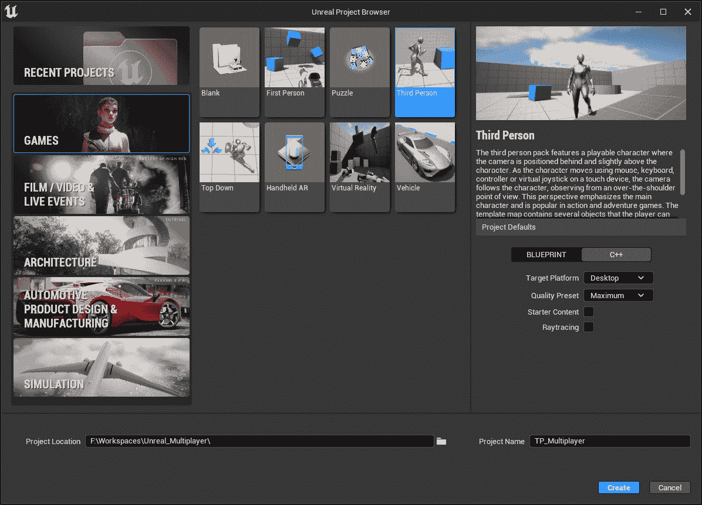

图 14.14 – 项目设置

一旦创建项目，你就可以设置和构建项目解决方案了。

## 构建项目解决方案

现在你已经创建了项目，找到项目内的 `Source` 文件夹。在这里，你可以找到两个名为 `TP_Multiplayer.Target.cs` 和 `TP_MultiplayerEditor.Target.cs` 的文件。

目标文件是用 C# 语言编写的，它们的目的是定义 Unreal Engine 构建工具将如何编译目标构建。在这种情况下，第一个将用于打包常规的可执行文件，第二个将用于 Unreal Engine 编辑器。

我们需要定义第三个，它将用于打包应用程序的服务器版本。为了做到这一点，在另外两个 `.Target.cs` 文件相同的文件夹中，创建一个第三个目标文件，并将其命名为 `TP_MultiplayerServer.Target.cs`。

一旦创建文件，使用你选择的文本编辑器打开它，并插入以下代码：

```cpp
using UnrealBuildTool;
using System.Collections.Generic;
public class TP_MultiplayerServerTarget : TargetRules
{
  public TP_MultiplayerServerTarget(TargetInfo Target) : base(Target)
  {
    Type = TargetType.Server;
    DefaultBuildSettings = BuildSettingsVersion.V2;
    ExtraModuleNames.AddRange( new string[] { "TP_Multiplayer" } );
  }
}
```

如果你不太熟悉 C# 语法，不要担心！这里没有太多要理解的——我们只是在定义一个名为 `TP_MultiplayerServerTarget` 的类，并在构造函数中定义了一些构建设置。唯一要注意的是，我们已经将构建目标类型定义为 `Server`，因为我们需要创建一个专用服务器构建。

返回到你的项目根目录，找到名为 `TP_Multiplayer.uproject` 的 Unreal Engine 项目文件。右键单击它，从下拉选项中选择**生成 Visual Studio 项目文件**，如图 14*所示。15*：

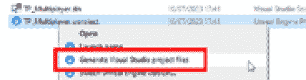

图 14.15 – 项目文件生成选项

一旦生成过程完成，你的项目将设置为编译服务器构建版本——这是你需要创建专用服务器时所需的。

您现在可以通过双击`TP_Multiplayer.sln`解决方案文件来打开 Visual Studio，以创建所需的构建。一旦您的编程 IDE 已打开，通过在主工具栏中的**解决方案配置**下拉菜单中单击并选择**开发服务器**来创建构建，如图 *图 14*.16* 所示：

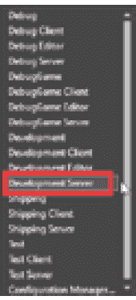

图 14.16 – 设置为开发服务器的解决方案配置

您现在可以通过在**解决方案资源管理器**窗口中右键单击**TP_Multiplayer**项并选择**构建**来构建项目。

一旦过程完成，您将成功构建开发服务器，这将允许 Unreal 构建工具识别服务器构建目标。

在返回 Unreal Engine 编辑器之前，您还必须构建开发编辑器配置，因此请按照以下步骤重复之前的步骤，通过选择以下步骤使用编辑器配置：在主工具栏中，单击**解决方案配置**下拉菜单并选择**开发编辑器**。然后在**解决方案资源管理器**窗口中右键单击**TP_Multiplayer**项并选择**构建**。

一旦构建过程完成，您可以安全地关闭 Visual Studio 并返回 Unreal Engine 以构建专用服务器。

## 构建专用服务器

在本小节中，您将从 Unreal Engine 编辑器构建项目的一个专用服务器可执行文件。您首先需要做的是创建一个新的地图，该地图将作为服务器的入口点：

1.  从主菜单中选择**文件** | **新建关卡**并创建一个新的**基本**关卡。

1.  在内容浏览器中，创建一个`Maps`文件夹并将级别保存在其中，命名为`Map_0`。

1.  在级别的**世界设置**窗口中，将**游戏模式覆盖**设置为**游戏模式基础**；这将避免使用默认的第三人称游戏模式打开此关卡。

此地图将在客户端连接到服务器时用作入口点。下一步是在开始服务器打包阶段之前更新一些项目设置。

1.  让我们从在主菜单中选择**编辑** | **项目设置**开始。然后选择**地图与模式**部分。

1.  在**默认模式** | **选定的游戏模式**类别中，展开**高级**部分。

1.  将**全局默认服务器游戏模式**下拉值设置为**BP_ThirdPersonGameMode**，如图 *图 14*.17* 所示：

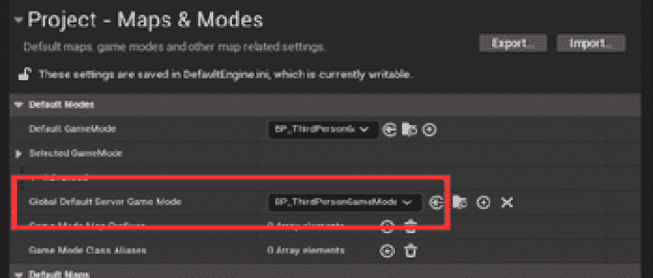

图 14.17 – 全局默认服务器游戏模式

上述设置将定义客户端连接到服务器时使用的游戏模式。

我们现在将定义游戏和服务器地图，以便设置客户端连接时使用的入口点。定位到**默认地图**类别并执行以下操作：

1.  在**游戏默认地图**下拉菜单中，选择**Map_0**。

1.  展开高级部分，并在 **服务器默认地图** 下拉菜单中选择 **ThirdPersonMap**。

**默认地图** 类别的最终结果如图 *14.18* 所示：


图 14.18 – 默认地图类别

我们已经完成了 **地图与模式** 设置。你现在需要为你的项目定义打包设置：

1.  在 **项目设置** 中，展开 **打包** | **高级** 部分。

1.  定位到 **包含在打包构建中的地图列表** 数组字段。

1.  使用 **+** 按钮添加 **Map_0.umap** 级别。

1.  再次使用 **+** 按钮添加 **ThirdPersonMap.umap** 级别。

你现在应该有一个与图 *14.19* 中所示相当类似的设置：

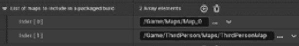

图 14.19 – 构建中要打包的地图列表

1.  作为额外步骤，请再次确认在 **项目** 类别中，**构建** 配置设置为 **开发**；这将允许我们在本章后面通过命令行连接到服务器。

1.  关闭 **项目设置** 窗口，并在 Unreal Engine 主工具栏中，点击 **平台** 按钮，选择 **Windows** | **TP_MultiplayerServer** 以设置构建目标，如图 *14.20* 所示：


图 14.20 – 构建服务器

1.  接下来，点击 **Windows** | **Package Content** 以开始打包应用程序，一旦构建完成，你将手握一个专用的服务器可执行文件！

1.  要获取客户端可执行文件，你必须重复上述步骤，使用不同的构建目标。为此，在 Unreal Engine 主工具栏中，点击 **平台** 按钮，选择 **Windows** | **TP_Multiplayer** 以设置构建目标，如图 *14.21* 所示：

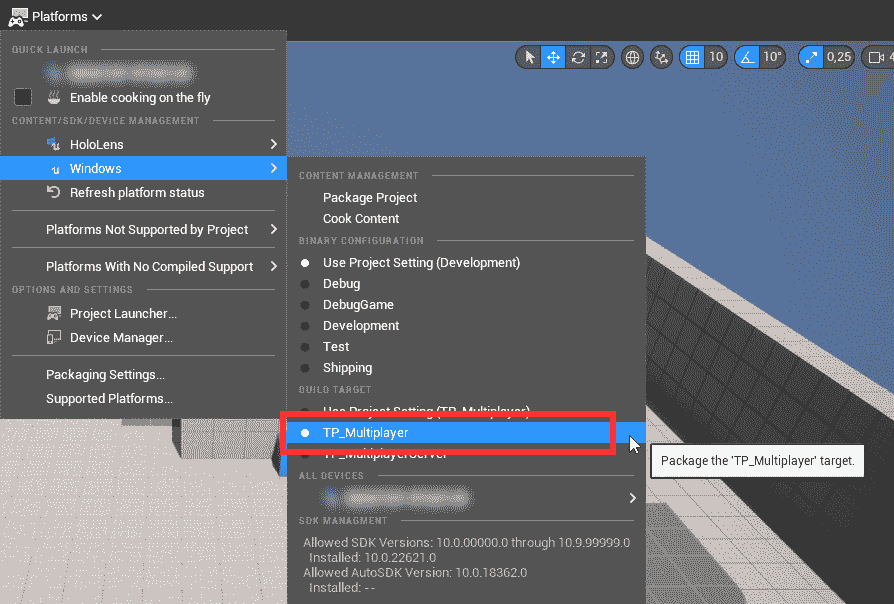

图 14.21 – 构建客户端

然后，点击 **Windows** | **Package Content** 以开始打包客户端构建。一旦完成，你也将拥有客户端可执行文件，并且你将准备好测试应用程序。

## 测试项目

现在客户端和专用服务器都已成功构建，是时候测试它们的功能了。

要在本地启动你的服务器，你只需要双击之前步骤中创建的构建可执行文件。

或者，如果你有兴趣检查服务器日志，可以采取以下步骤：

1.  打开 Windows 命令提示符。

1.  通过 `cd` 命令，导航到包含服务器可执行文件的文件夹。

1.  插入你的服务器可执行文件名称，后跟 `–log` 参数，例如：

    ```cpp
    TP_MultiplayerServer.exe -log
    ```

一旦服务器启动，它将开始监听来自客户端的连接请求。

由于我们使用了现成的、基础模板，并且我们没有实现任何会话逻辑，我们将从虚幻引擎命令行连接客户端。这显然不是你将在最终版本中使用的功能，但在开发时却非常有用。

命令行在客户可执行文件中可用，因为我们之前将这些步骤编译为开发版本的项目。

要启动客户应用程序，你只需双击可执行文件，其名称应该是`TP_Multiplayer.exe`。这将使用默认的起始地图（即，`Map_0`）打开可执行文件。

如前所述，为了连接到服务器，我们将使用控制台命令，默认情况下可以通过单引号字符（即反引号）打开。一旦控制台打开，输入以下命令：

```cpp
open 127.0.0.1
```

控制台命令打开的客户应用程序如**图 14.22**所示。22：

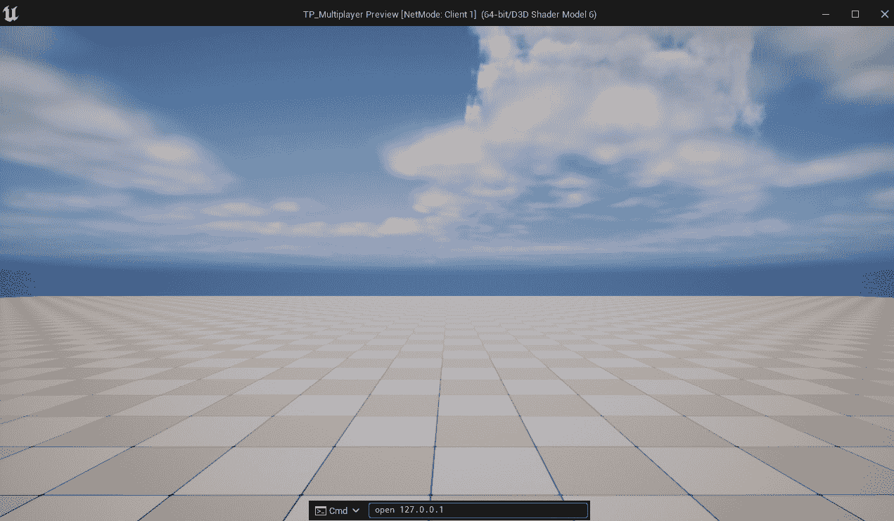

图 14.22 – 控制台命令打开的客户应用程序

注意

如果你使用的键盘不支持反引号字符（像我的一样），你可以通过打开**编辑器首选项**并查找**打开控制台命令****框**字段来轻松更改键盘快捷键。

客户端现在应该打开常规第三人称地图，你的客户端将连接到专用服务器。为了确认这一点，如果你在启动服务器时启用了`–log`选项，你应该看到一条类似于以下的消息：

```cpp
LogNet: Join Succeeded: [Client Identifier]
```

就这样 – 你终于成功创建了你的专用服务器，并将你的客户端连接到了局域网！

如果你想要一个额外的挑战，你可以尝试使用专用服务器编译 Unreal Shadows 项目。你在这个领域已经有了一些知识，所以这不应该需要太多的努力。

此外，如果你想深入了解这个主题，Epic Games 提供了一个关于如何编译 Lyra Starter Game 的完整教程（[`docs.unrealengine.com/5.1/en-US/lyra-sample-game-in-unreal-engine/`](https://docs.unrealengine.com/5.1/en-US/lyra-sample-game-in-unreal-engine/))，这是一个包含本书中涵盖的许多主题的实战项目。教程的链接是 [`docs.unrealengine.com/5.1/en-US/setting-up-dedicated-servers-in-unreal-engine/`](https://docs.unrealengine.com/5.1/en-US/setting-up-dedicated-servers-in-unreal-engine/)。

一点点的努力就能实现一切！

# 摘要

在本章中，你面临了从 GitHub 下载虚幻引擎编辑器源代码并将其编译成可执行应用程序的令人畏惧的任务。

如果你计划以多人游戏开发者为生，那么在需要为你的游戏设置专用服务器或需要自定义引擎的网络和多人设置时，构建虚幻引擎源代码是一项必备技能。

正如你所发现的，构建和打包一个专用服务器并不是一项容易的任务，它需要大量的时间和耐心——有时还需要一点运气！

在下一章——也是最后一章中，你将学习如何通过使用在线云服务，特别是 Epic Online Services，在多人游戏开发中更进一步。
