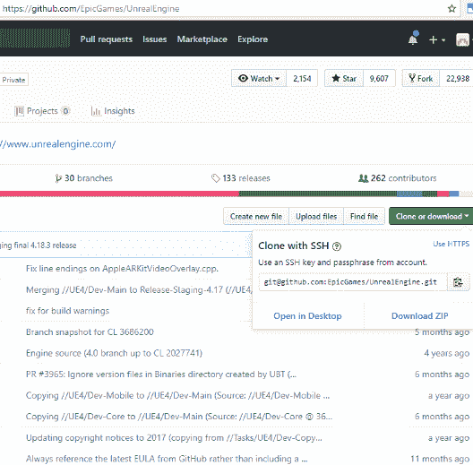
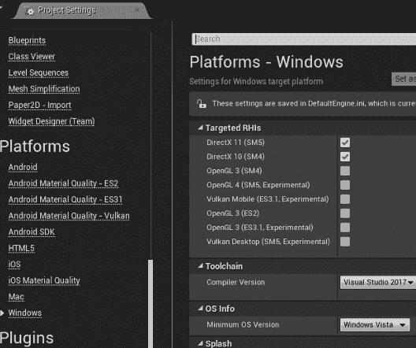

# 第一章：为第一人称射击游戏创建 C++ 项目

# 简介

欢迎来到精通 Unreal Engine 4！本书的目标是将熟悉 UE4 和 C++ 开发的个人全面提升到下一个层次。虽然一些章节将深入探讨特定系统实现和最佳实践，但其他章节可能会提供一个更广泛的视角，了解内容创作团队成员经常使用的庞大 UE4 系统。到那时，你应该有一个坚实的基础，可以就使用 UE4 技术的任何范围或平台的项目做出最佳决策，并且你将能够引导整个团队将项目进行到底。你可以在许多领域直接将这些系统应用于游戏项目，但本书的整体目标是能够从技术方向解决任何需求，为你提供一个高于单纯编写代码的人的知识基础。

在本章中，我们将启动一个基本战斗游戏项目，这样我们就有了一个基础，在前进时可以添加和开发更高级的功能。虽然其中一些是自动从 UE4 的游戏模板中管理的，但我们将通过所有必要的步骤来确保本书中引用的核心设置被添加、构建和测试，并且一些新的游戏玩法系统被实现和展示。

本章剩余部分将涵盖的主要主题如下：

+   设置和创建新的第一人称射击游戏项目

+   覆盖现有的 UE4 类

+   为它们添加和实现简单的 C++ 函数

+   快速回顾构建和运行选项

# 技术要求

对于本章，你需要以下组件：

+   Visual Studio 2015 或 2017（任何版本）

+   从源代码构建的 Unreal Engine 4.18.3 或更高版本

关于平台和安装的一些快速说明：上述组件假设你将使用 Windows 10 PC，但没有任何理由表明运行当前版本 Xcode 的 Mac 不能从本书中探索的所有相同工作中受益并执行所有相同的工作。由于展示的工作将来自 VS 并引用其一些功能，这是我们推荐的工作环境，随着我们进入章节，但这不是具体要求。样本将不时进行测试，并在后面的章节中主要在 Mac 上构建，以 iOS 为目的，但本书不会专注于 IDE 的具体细节，除了提供步骤（通常以 Visual Studio 术语）和提示。代码示例可能反映了来自 [wholeTomato.com](http://wholeTomato.com) 的 Visual Assist 工具的格式，我强烈推荐 Visual Studio 用户使用该工具，但他们的工具不会影响构建或结果。

你可以在本书所有章节中找到引用的所有源代码，请访问 [`github.com/mattedmonds404/Mastering`](https://github.com/mattedmonds404/Mastering)，其中包含每个章节中展示的工作的修订历史。

对于本章及其工作，请务必选择名为`Chapter1`的分支，位于 GitHub 网页界面上方的左侧分支下拉菜单，或者使用本章分支的直接链接[`github.com/mattedmonds404/Mastering/tree/Chapter1`](https://github.com/mattedmonds404/Mastering/tree/Chapter1)。

关于直接从 GitHub 使用项目的两个注意事项：您仍然需要从源代码本地安装引擎，以便您可以右键单击项目（`Mastering`/`Mastering.uproject`）并点击选择虚幻引擎版本，您还需要选择您的安装文件，这将也会构建适当的项目文件。在 VS 中启动`Mastering.sln`文件后，请按照以下步骤操作：

1.  在解决方案资源管理器中右键单击`Mastering`游戏项目，并选择设置为启动项目，这样当从 VS 运行时，您将直接进入该项目的编辑器。

1.  将配置设置为开发编辑器，平台设置为 Win64。

1.  可能需要在解决方案资源管理器中直接右键单击 UE4 项目并点击构建。有时，在构建游戏项目时，它可能不会获取构建引擎所需的全部依赖项，如果这些依赖项尚未单独完成。

我们将使用的是 4.19.0 版本的引擎。

# 构建 FPS C++项目

在本节中，我们将通过 Unreal 项目浏览器从头开始创建新项目的步骤。对于那些已经熟悉这些步骤的人来说，这个过程应该相对快速且直接。对于任何新加入这个设置的人来说，这可能是团队成员加入已经全面开发的项目时的典型情况，有一些必要的步骤来开始。由于我们将使用 C++ 和 Visual Studio 进行工作，我将在这里快速说明没有源代码的引擎用户：由于本书将努力不直接修改引擎源代码，因此您仍然需要构建 C++ 项目，因为本书将专注于这一点。可以不构建源代码就创建仅蓝图的项目，这在第三章，“蓝图审查和何时使用 BP 脚本”，中探讨了其优缺点，但再次强调，这并不是本书在大多数实现案例中呈现信息的方式。还值得注意的是，Epic Games 对其技术用户发现的问题或改进非常开放，如果提供适当的调试信息，他们通常会在他们的答案论坛上更迅速地回应这些提出的问题，例如[`answers.unrealengine.com`](http://answers.unrealengine.com)。此外，如果您的项目需要在 Epic Games 提供帮助之前立即修复或更改引擎代码，您需要熟悉调试和构建引擎。最后，如果您想提交 Epic Games 将要集成的更改或修复类型的拉取请求，您还希望将其绑定到他们的 GitHub 项目上。因此，我们将继续前进，就像我们在一个全新的计算机上安装引擎和项目，并具有从源代码完全重建的能力一样。

在下一节中，我们将对游戏模式和玩家进行一些修改，重新编译这些修改，并在游戏中查看结果。对于那些希望跳过的人来说，所有将要展示的工作都可以在 GitHub 仓库的`Chapter1`分支中找到，如前所述。

要启动一个全新的项目，有三个主要步骤：

1.  下载并安装 UE4 源代码并编译它。

1.  首次运行编辑器到项目浏览器并选择一个模板。

1.  构建并运行该项目。

# 安装和构建 UE4

我们的第一步是下载 UE4 源代码并构建它。这可以通过多种方式完成。如果您是第一次这样做，最简单的方法是访问他们的 GitHub 网站，在[`github.com/EpicGames/UnrealEngine`](https://github.com/EpicGames/UnrealEngine)获取引擎。

要使上面的链接正常工作，您必须登录到 GitHub，并已申请成为 Unreal 开发者。有关详细信息，请参阅[`wiki.unrealengine.com/GitHub_Setup`](https://wiki.unrealengine.com/GitHub_Setup)。

点击“克隆或下载”按钮以查看你的选项。从这里，最简单的解决方案是选择下载项目作为 ZIP 文件，并在你的硬盘上任何你喜欢的地方解压缩，如下面的截图所示：



使用 Git 网站始终是一个可行的选项。虽然我个人不是 GitHub 桌面应用程序的粉丝，但它也是在这个过程中可以探索的可能性之一。虽然我会说 SourceTree 有一些用户体验问题，但它是一个免费的应用程序，我推荐用于管理 GitHub 项目。对于那些习惯于命令行工作的人来说，有许多选项，以及一个可以打开的终端，以便在 SourceTree 中使用这些命令。目前的重要部分是安装 UE4 树，这样我们就可以开始构建了！

当下载新版本的引擎时，无论是更新还是全新安装，首先始终在主安装文件夹中运行`Setup.bat`（或在 Mac 上的`setup`命令）进行其他任何步骤之前。确保弹出窗口正在获取你使用的所有平台，确保它拉取了与同一文件夹中的`README.md`文件中描述的平台所需的文件。

一旦`Setup.bat`/`setup`命令完成，运行`GenerateProjectFiles.bat`文件，一个`UE4.sln`文件将出现在同一文件夹中。关于 UE4 生成的解决方案和 VS 2015 以及 VS 2017 的状态的快速说明：UE4 默认生成 VS 2015 项目文件。你可以指定`-2017`作为批处理文件参数。目前不需要为 2017 年构建，2015 年的项目文件在 VS 2015 和 VS 2017 中打开、构建和运行都非常完美。然而，如果你安装了这两个版本的 VS，那么默认情况下它将尝试在 VS 2015 中打开它们，这可能会非常令人烦恼。截至撰写本书时，使用任何版本的 Visual Studio 都应该提供相同的结果，这一点在这里已经得到了测试，但向前看，GitHub 上的内容将迫使你使用 VS 2017 在编辑器中构建。关于为什么以及如何设置这一点的讨论将在本章的“修改我们的游戏以 C++”部分的“覆盖角色类”部分中稍后进行。

我们需要执行的步骤来构建引擎现在非常直接：

1.  双击`.sln`文件，在 VS 中打开它。

1.  现在，在解决方案资源管理器中右键单击 UE4 项目，并选择“设置为启动项目”。

1.  选择“开发编辑器”作为配置（或“调试游戏”；关于这一点稍后会有更多说明），以及“Win64”作为平台。

1.  构建项目。这取决于你的硬件配置，可能需要一个小时。本节末尾列出了一些构建建议。

# 运行编辑器并选择模板

我们下一步是运行编辑器。通过按 *F5* 在 VS 中启动引擎。如果没有在解决方案中添加游戏或应用程序项目，这将直接带您到虚幻项目浏览器。您也可以在任何时候通过在解决方案资源管理器中右键单击 UE4 项目并直接调试或运行它来轻松完成此操作。我还建议简单地创建一个快捷方式到您的 UE4 安装文件夹的 `/Engine/Binaries/Win64/UE4Editor.exe` 文件，因为有时在编程 IDE 之外快速启动它可能有益。从项目浏览器中，按照以下步骤操作：

1.  点击新建项目选项卡，然后在其下方点击 C++ 选项卡。

1.  选择第一人称图标作为我们的类型，以创建我们的**第一人称射击**（**FPS**）基础。

1.  选择一个目标文件夹和一个项目名称，然后点击创建项目。

1.  如果您选择的项目名称不是 Mastering，请阅读以下信息框。

对于桌面/控制台、质量和起始内容的选择，可以保留它们的默认设置，但请随意将鼠标悬停在其上方并点击下拉箭头，以查看每个选项的选项以及它们的功能简要描述。起始内容实际上是一个虚幻内容包，我们将在后面的章节中手动添加它。

由于这里展示的项目在 GitHub 上设置为 Mastering，因此本书中将使用该名称来引用项目名称。虚幻的模板也使用它来创建添加到项目中的几个基本文件。例如，当提到 `MasteringCharacter.h` 时，如果您选择了另一个名称，请从模板构建的 `(您的项目名称)Character.h` 中引用。为了简单起见，建议您直接使用相同的名称。

在此阶段，UE4 将关闭项目浏览器，生成游戏的项目文件，并尝试在 VS 中打开它。自然地，在这个时候，简单地关闭仅引擎的 IDE 会话是个好主意，因为引擎项目也在项目解决方案中打开。正如您所看到的，您命名的项目现在应该是启动项目，并且应该包含几个用于 C++ 模板的源文件。

# 构建和运行游戏项目

现在，我们终于可以构建并运行我们的游戏了。构建 FPS 示例项目应该会非常快，除非你更改到另一个配置或平台，否则它不会再次需要构建任何引擎代码。一般来说，构建用于测试的 DebugGame 版本是个好主意。使用它，你将获得一些额外的运行时信息和项目代码的安全检查，但通常在测试时不会对性能产生重大影响。所以在这种情况下，我建议使用 DebugGame 编辑器，即使我们是在开发中构建的引擎。DebugGame 编辑器作为一个独立配置（DebugGame），在你的 PC 上运行，将仅在调试模式下构建游戏项目代码，但将继续使用引擎的更快运行的开发配置。例如，将配置更改为 Debug Editor，将迫使引擎完全在调试模式下构建。在调试构建中，引擎在某些区域运行得相当慢，同时维护引擎的调试和开发版本既耗时又通常不必要，除非你实际上正在直接调试引擎代码。一旦项目构建完成，只需使用*F5*运行它，就像我们之前在仅引擎解决方案会话中做的那样。这将启动编辑器，并将你的游戏作为游戏项目运行。在 UE4 中，所有开发者，包括程序员，在构建游戏或应用时都会在编辑器中进行大量的工作和测试。"在编辑器中播放"（**PIE**）是 Unreal 的强大功能之一，同样，在编辑器中工作时的游戏库的热重载也是。随着项目的复杂性增加，游戏流程可能从简单的关卡开始，热重载和 PIE 本身可能并不总是测试的有效选项，但在这个部分的我们的工作中，它完美地展示了其优势。一般来说，当你在游戏玩法系统或调试新代码时，PIE 将是你的最佳伙伴。

所以，你说，“听起来很棒！”你可以自由地尝试编辑器默认布局顶部右侧的播放按钮。立即，你会注意到你可以使用传统的 WASD FPS 键盘控制移动，发射武器（当它在关卡中的方块上击中时，会有一些物理影响），甚至可以用空格键跳跃。

在这个早期阶段，考虑你的控制方式总是一个好主意。始终建议为任何游戏类型维护可行的 PC 控制，以便任何团队在编辑器和 PIE 中工作时使用。即使游戏或应用不会使用 PC 作为其原生平台，例如使用移动或 VR 的，PIE 中测试的速度和便捷性使得维护并行 PC 控制非常有价值。实际上，如果你访问游戏项目并打开`MasteringCharacter.cpp`文件，浏览一些输入代码，你会注意到它专门支持两种转向方法，以对应控制杆或移动设备上的虚拟控制杆，以及直接轴输入，例如鼠标。此外，还有一些注释掉的代码，用于支持在触摸屏设备上的一触移动和转向，例如手机或平板电脑。在下一节中，我们将添加一个新的输入。欢迎你浏览现有的输入，看看已经为各种平台设置和绑定的是什么。只需记住，在这种情况下，通常在稍后为整个平台添加控制比在早期开始维护跨平台控制要容易得多。

# 使用 C++修改我们的游戏

在本节中，我们将探讨一些快速添加新功能和游戏玩法的方法，通过为这款 FPS 游戏添加一个新的机制：潜行。我们将通过覆盖模板中的一些现有类，并添加新的输入和一些新代码来实现这一点。在本节的结尾，我们将运行游戏，测试我们的代码是否确实按照我们的意愿执行，并看到当输入按下时角色蹲下的游戏结果。我们将按照以下步骤进行：

1.  从编辑器添加一个新的 C++类。

1.  修改此类并让它热重载回运行中的编辑器。

1.  添加一个新的输入和游戏玩法机制，并观察其效果。

# 覆盖角色类

为了方便我们未来的工作并开始一些良好的实践，我们将通过子类化提供的现有`MasteringCharacter`本地（用 C++实现）类来在此处添加一些专门的游戏代码。这可以直接在 Visual Studio 中手动完成，但 Epic Games 再次为我们提供了 Unreal 中的快捷方式，我们将从编辑器中使用。因此，让我们从打开到我们的项目，就像我们在上一节中留下的一样开始编辑器。

我们将从内容浏览器窗口开始，该窗口默认情况下通常停靠在编辑器的底部区域。如果您还没有打开，或者由于某些原因已经关闭，只需点击顶部的“窗口”并滚动到内容浏览器，然后是内容浏览器 1，它将作为一个独立窗口重新打开。我会将它停靠在编辑器中您感到舒适的位置，或者，当然，它也可以是一个独立窗口。然而，重要的是左侧的内容。就在“添加新内容”下拉菜单下方，有一个带有三条线和一个小箭头的图标。点击这个图标以打开资源面板，我发现这对于在编辑器中导航内容非常有帮助。在那里，在“内容”下，有一个名为 `FirstPersonCPP` 的文件夹，在该文件夹中有一个 `Blueprints` 文件夹。点击该文件夹，您应该在右侧面板中看到一个 `FirstPersonCharacter` 项。这是当游戏开始时我们正在扮演的角色蓝图表示，由于这个 C++ FPS 模板的方式，游戏要正常运行，必须在地图中有一个实例。这是在 C++ FPS 模板中使用的唯一蓝图之一，但让我们打开它，看看从我们的本地 C++ 代码中的 `MasteringCharacter.h/.cpp` 文件可以获取哪些内容，这些内容在这里以蓝图表示的形式出现在编辑器中。目前，它看起来就像是一系列变量，顶部有一行以 NOTE: 开头，以一个蓝色链接到“打开完整蓝图编辑器”结尾。关于蓝图及其类以及与 C++ 的交互的更深入讨论将在第三章中进行，*蓝图回顾和何时使用 BP 脚本*。现在，只需点击蓝色链接，这样我们就可以看到这些变量是如何定义我们在游戏中的角色的。模板的严格 C++ 风格几乎不使用这个蓝图；它实际上只是一系列用于模板的变量。但如果你现在点击顶部的“视图”选项卡，你就可以看到其中一些变量是如何工作的。例如，在右侧的“详细信息”选项卡中，应该有一个名为“相机”的展开菜单。在这个下面，第一个变量是 Base Turn Rate，其值为 45.0，灰色显示。在代码中，这个值用于确定我们的角色可以旋转多快，但它不能被编辑。让我们去看看为什么。

稍微切换回 Visual Studio 查看 `MasteringCharacter.h`。在类的公共部分之一，您应该看到以下行：

```cpp
/** Base turn rate, in deg/sec. Other scaling may affect final turn rate. */
UPROPERTY(VisibleAnywhere, BlueprintReadOnly, Category=Camera)
float BaseTurnRate;
```

`UPROPERTY`宏是将 C++变量绑定到蓝图类中的方法，在那里它可以被看到和/或编辑。在这种情况下，`VisibleAnywhere` `BlueprintReadOnly`宏中指定的标志是我们可以在蓝图中查看但无法编辑它的原因，而`Category=Camera`是它位于 Camera 展开菜单下的原因。变量会根据其从 C++中的驼峰命名自动在蓝图上显示，所以每个大写字母在蓝图表示中都是一个单词，例如我们的`BaseTurnRate`。在`MasteringCharacter.cpp`文件中，你可以在构造函数中看到`BaseTurnRate = 45.f`被指定，因此它的值在编辑器中显示。再次强调，所有这些都会越来越多地被使用，但我们需要对即将进行的更改进行快速概述。

我们接下来的步骤将在编辑器中创建我们的游戏构建，因此我们将再次提到同时拥有 VS 2015 和 VS 2017 可能引起的问题。如果你没有安装 VS 2015 并且只使用 VS 2017，请自由跳过本段之后的步骤。

要强制所有内容都在 Visual Studio 2017 中打开，请遵循两个步骤。首先，在 GitHub 的项目`readme.md`文件中，你会看到如何制作批处理文件的说明，或者使用相同的行通过在命令提示符中复制粘贴来生成你的 VS 2017 项目文件。此外，当编辑器生成这些文件时，如前所述，它将默认为 VS 2015，如果你安装了这两个 IDE，这可能会非常令人烦恼，因为你可能在 VS 2017 中工作，然后编辑器会进行构建并尝试在 VS 2015 中打开你的项目！你将想要转到编辑器顶部的设置选项卡，打开项目设置，然后在平台下滚动到 Windows 展开菜单，如下面的截图所示：



选择 Visual Studio 2017 作为编译器，如前一个截图所示。这应该可以一次性解决不想要的 VS 2015 项目文件问题。这是提交到 GitHub 的内容，如果你只使用 VS 2015 或不想有这种行为，只需转到相同的 Compiler Version 行，将其设置为默认或明确地设置为 2015。

因此，回到主编辑窗口，我们将通过以下步骤添加我们的新类，该类是从`MasteringCharacter`派生出来的：

1.  在顶部菜单栏中，点击文件并选择新建 C++类。

1.  在选择父类窗口中，点击右上角的 Show All Classes 框。

1.  在搜索框中，开始输入`MasteringCh`，直到它只显示 MasteringCharacter，然后点击此选项。

1.  确保 Selected Class 字段显示为 Mastering Character，然后点击下一步。

1.  将其名称从 MyMasteringCharacter 更改为 StealthCharacter，然后点击创建类。

在步骤 1 中，请注意，你也可以通过在正常内容浏览器窗口中右键单击来从弹出菜单访问“新 C++ 类”选项。此外，在步骤 2 中，随着时间的推移，你将养成立即点击显示所有类框的习惯。Epic Games 默认为新手过滤了一些有用的类，但项目增长后，你通常使用自己的自定义类比这些类多得多。

然后，编辑器应该会告诉你它正在编译新的 C++ 代码，并在底部右端通知你编译成功。关于这个热重载概念的一个重要注意事项是，如果你现在返回 Visual Studio，它将想要重新加载游戏项目解决方案。这将提示你停止调试，如果你选择是，它将关闭编辑器！我经常使用的一种技术是，根据需要将调试器附加到或从编辑器断开连接。在 VS 中，在调试菜单下是断开所有命令（我喜欢将其绑定到 *Ctrl* + *D*）。这允许编辑器继续，你可以安全地根据需要多次重新加载解决方案。一旦你想调试一些代码，只需将其重新附加到正在运行的编辑器即可。要做到这一点，回到调试并选择附加到进程（我喜欢将其绑定到 *Alt* + *D*）。点击进程的大字段，轻按 *U* 键，查找 `UE4Editor.exe`。双击此进程，你就可以立即回到调试状态。

# 在 VS 中编辑我们的类并热重载编辑器

因此，现在我们的类已经添加了 `MasteringCharacter` 作为其父类，让我们用 C++ 编辑它，并在编辑器中查看我们的更改。我建议按照上一段描述的方式断开调试器，但如果你决定这样做，停止调试并重新启动编辑器也没有问题。如果你断开了连接，请注意，你需要在解决方案资源管理器中右键单击 `Mastering` 项目，选择卸载项目，然后再次右键单击它并点击重新加载项目，以确保一切与当前状态匹配（这比关闭和重新打开 VS 快得多）。在解决方案资源管理器中，你现在可以在 Source/Mastering 下找到 `StealthCharacter.h` 和 `.cpp` 文件。打开这些文件。目前它们的内容不多，但让我们快速添加一个新变量，这样我们就可以在编辑器中稍后查看它。在 `StealthCharacter.h` 文件中 `GENERATED_BODY()` 行之后添加以下行：

```cpp
public:
        /** Modifier to our turn and pitch rate when in stealth mode */
        UPROPERTY(EditAnywhere, BlueprintReadWrite, Category = Gameplay)
        float StealthPitchYawScale = 0.5f;
```

回到 Visual Studio，我们将在之前添加的 `StealthPitchYawScale` 变量之后添加以下内容到 `StealthCharacter.h` 文件中：

```cpp
public:
        virtual void SetupPlayerInputComponent(UInputComponent* PlayerInputComponent) override;

        virtual void AddControllerPitchInput(float Val) override;
        virtual void AddControllerYawInput(float Val) override;

        void Stealth();
        void UnStealth();

protected:
        bool bIsStealthed = false;
```

在这里，我们遵循了来自 `MasteringCharacter` 的模式，你可以进一步学习，但简而言之，我们将一个新的输入绑定到两个函数（`Stealth` 和 `UnStealth`），然后覆盖基类的函数，使用偏航和俯仰输入来通过我们的比例减慢这些动作。我们将通过在 `StealthCharacter.cpp` 中添加以下代码来实现这一点：

```cpp
void AStealthCharacter::SetupPlayerInputComponent(UInputComponent* PlayerInputComponent)
{
        // Bind jump events
        PlayerInputComponent->BindAction("Stealth", IE_Pressed, this, &AStealthCharacter::Stealth);
        PlayerInputComponent->BindAction("Stealth", IE_Released, this, &AStealthCharacter::UnStealth);

        Super::SetupPlayerInputComponent(PlayerInputComponent);
}

void AStealthCharacter::AddControllerPitchInput(float Val)
{
        const float fScale = bIsStealthed ? StealthPitchYawScale : 1.0f;

        Super::AddControllerPitchInput(Val * fScale);
}

void AStealthCharacter::AddControllerYawInput(float Val)
{
        const float fScale = bIsStealthed ? StealthPitchYawScale : 1.0f;

        Super::AddControllerYawInput(Val * fScale);
}

void AStealthCharacter::Stealth()
{
        bIsStealthed = true;
        Super::Crouch();
}

void AStealthCharacter::UnStealth()
{
        bIsStealthed = false;
        Super::UnCrouch();
}
```

对于有经验的 UE4 C++程序员来说，这些内容应该都很清楚，但请注意，我们为`Stealth`和`UnStealth`重写的函数调用了我们从其间接派生的`ACharacter`类中的现有函数。这使用了现有的机制来蹲下和站起我们的角色，从而节省了我们自己制作这些功能的麻烦。你现在可以构建项目，或者添加以下输入后，这会导致编辑器重启，所以请确保你确实保存了我们所做的编辑器更改！

添加我们的新输入绑定有两种方法。最好的方法是再次在主编辑器窗口的设置选项卡中打开项目设置。从这里，滚动到展开菜单中的引擎和输入，你将在右侧看到一个绑定部分，其下是动作映射。点击动作映射右侧的小加号符号，它将在其下方显示一行新内容。我们将将其添加的`NewActionMapping`重命名为 Stealth，然后点击我们新 Stealth 行右侧的小加号符号。点击无下拉菜单并向下滚动到以下截图所示的左 Shift：


我们现在已将名为 Stealth 的操作绑定到键盘的左*Shift*键。这将向游戏的`/Config/DefaultInput.ini`文件中添加一行，并同时更新正在运行的编辑器版本。如果你要手动添加此行，直接在`[/Script/Engine.InputSettings]`之后（即，+ActionMappings=(ActionName="Stealth", Key= Left Shift)）并保存该文件，则引擎不会自动重新加载`.ini`文件，这需要重新启动编辑器以获取更改，如果你以这种方式修改它！所以，始终记得尝试从设置窗口编辑设置，如果你确实在`.ini`文件中修改了东西，始终记得重新启动任何正在运行的编辑器或 PC 上的独立游戏版本以获取这些更改。

我们需要在我们的`FirstPersonCharacter`蓝图中进行最后一次修改，以便将所有内容整合在一起，因此再次在完整的蓝图编辑器窗口中打开它。在左下角，在其组件选项卡下，是`CharacterMovement`（`继承的`）。点击它。现在右侧有许多属性，但向下滚动直到你看到导航移动展开菜单并打开它。在顶部，有移动能力展开菜单，在那里我们需要勾选`Can Crouch`复选框，使其为真。注意，靠近左上角的编译按钮从带有绿色勾选标记变为带有橙色问号。点击编译按钮以更新蓝图中的此更改，并再次按*Ctrl* + *S*保存。

现在，当运行游戏时，请注意当你按住*Shift*键时，玩家的视角会向下移动一小段距离，这是由几个其他现有的蓝图父类变量设置的，并且我们的转向和俯仰速度会通过我们的`StealthPitchYawScale`减慢。成功了！现在，你可以自由地修改俯仰和偏航比例值，即使游戏正在运行，看看我们在潜行时速度提高了多少，减慢了多少。这也是在函数中设置一些断点的好时机，并逐步了解 C++侧的工作方式，但在这个阶段，我们的机制已经到位并得到了验证。

# 摘要

在本章中，我们从可能没有引擎、没有源代码和没有项目，发展到拥有本地构建的 UE4 引擎和我们的 FPS 项目，并添加了代码和覆盖函数来添加新的游戏玩法。这是一个很好的开始，帮助我们克服了许多制作游戏的障碍，并为后续章节提供了坚实的基础。

接下来，我们将更深入地探讨控制和改进，我们将在这个章节中提到的基本内容上实现。我们还将学习如何添加更多游戏功能，包括库存和武器拾取。之后，将更深入地讨论蓝图及其为我们做什么，为什么它们如此有价值，以及它们何时可能成为问题。在本节初步工作的最后，我们将查看 UI、加载和保存，以及添加一个 AI 生物，然后在接下来的章节中快速进入几个更高级和多样化的主题！

# 问题

通过以下问题来测试你所学到的内容：

1.  从源代码构建引擎有哪些优点？

1.  UE4 的源代码在哪里可以找到？

1.  在构建任何内容之前，获取任何 UE4 更新版本后，总是需要执行哪个步骤？

1.  在 C++中声明的蓝图变量是如何暴露的？

1.  我们如何快速添加和测试我们的功能，而无需在编辑器中创建新的蓝图？

1.  为什么在开发期间使用 DebugGame 作为配置是一个好的选择？

1.  为什么要求修改`.ini`文件以添加新功能是一个不好的选择？

1.  在更改蓝图属性之前，你必须在保存之前执行什么步骤？

# 进一步阅读

[`docs.unrealengine.com/en-us/Programming/Introduction`](https://docs.unrealengine.com/en-us/Programming/Introduction)
