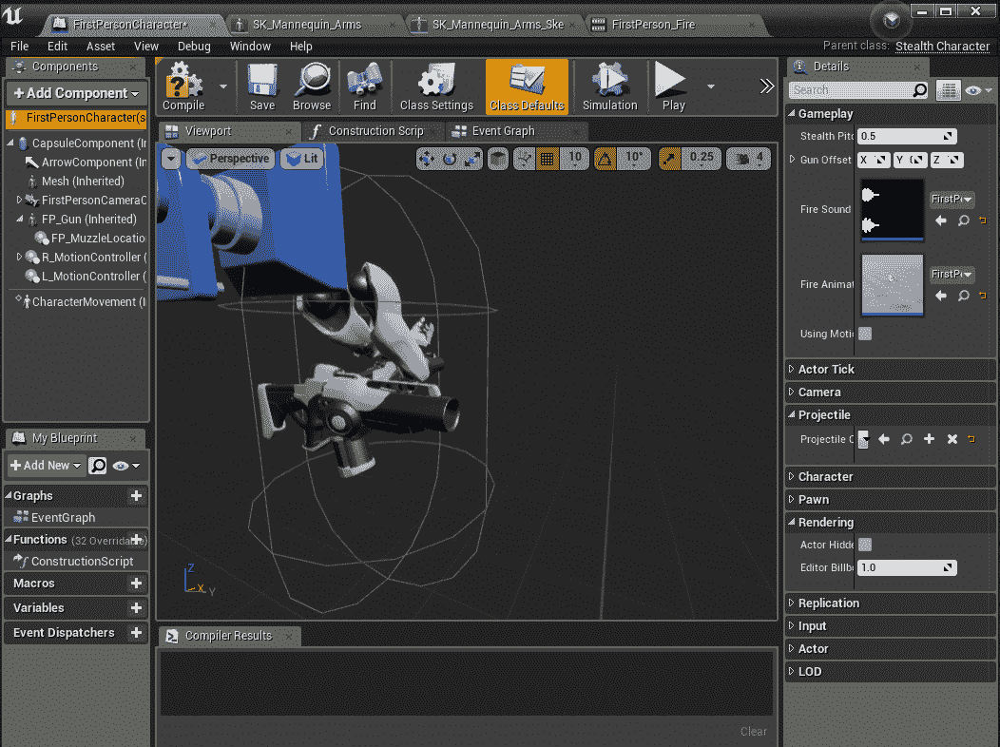
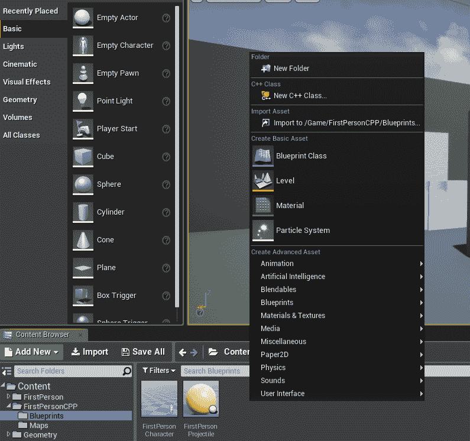
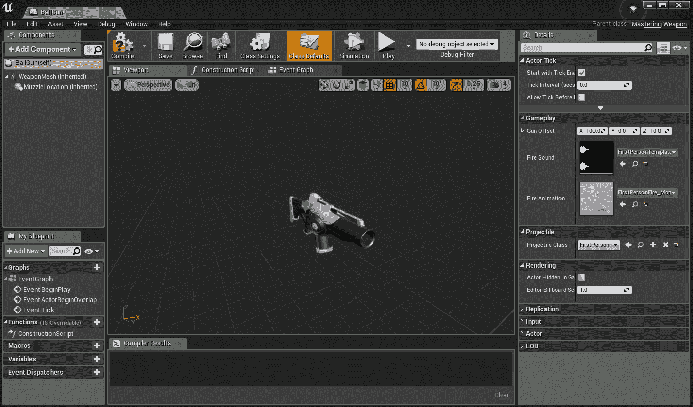
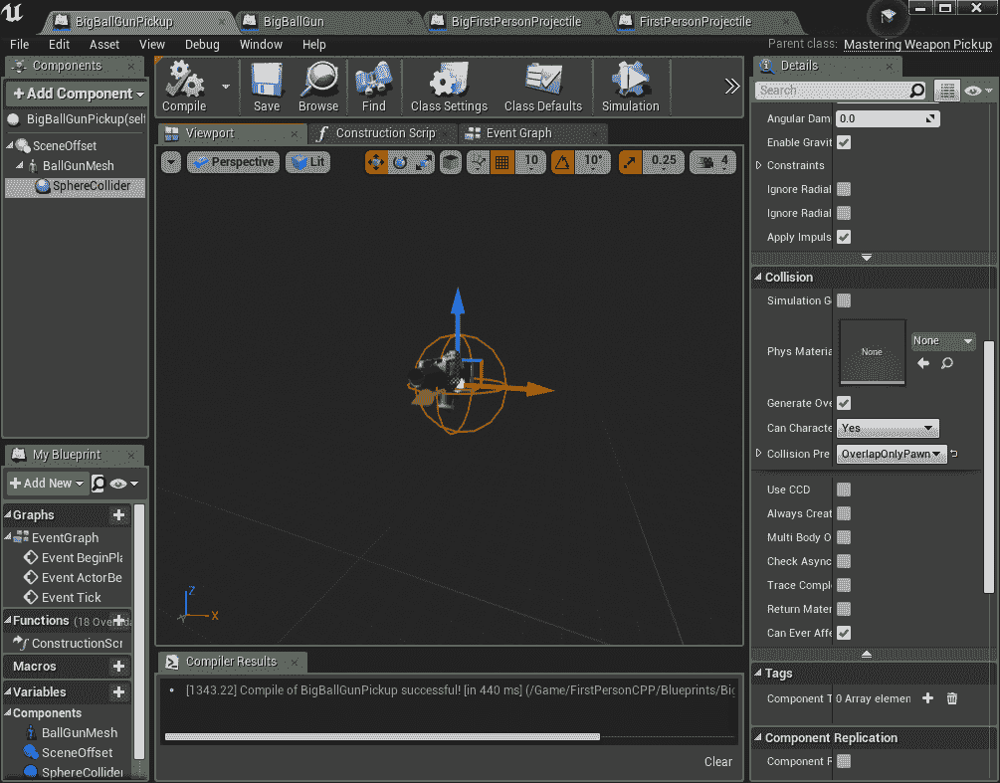

# 玩家的库存和武器

# 简介

欢迎来到我们的下一章。在这一章中，我们将基于到目前为止的 Mastering 项目，引入一个全新的系统来处理库存和更换武器。尽可能的情况下，任何硬编码的系统类型也将在此处被移除，例如从 C++中通过名称引用资产。在做出这样的改变时，通常会有一个关于为什么这对特定项目很重要的讨论。然而，到这一章结束时，我们应该能够以易于修改的方式引用所有我们的类和资产，并且拥有非常快的迭代时间，比如添加新的武器和武器拾取。我们将依次介绍以下主题：

+   添加`Weapon`类

+   C++中的武器库存

+   创建和使用`WeaponPickup`类

+   使用新的控制绑定进行自行车武器

# 技术要求

在第一章中找到的所有要求，包括其输出 Mastering 项目或处于类似开发阶段的任何项目，都是本章所必需的。

按照我们章节进度分支的主题，本章在 GitHub 上完成的工作可以在这里找到：

[`github.com/PacktPublishing/Mastering-Game-Development-with-Unreal-Engine-4-Second-Edition/tree/Chapter-2`](https://github.com/PacktPublishing/Mastering-Game-Development-with-Unreal-Engine-4-Second-Edition/tree/Chapter-2)

使用的引擎版本：4.19.0。

# 添加武器和库存类

我们本节的目标是将这两个新类添加到我们的游戏中，并将为我们玩家制作的硬编码武器模板转换为新的武器类，并添加到我们新的库存类中。我们将从运行中的编辑器开始，花点时间检查现有的武器，看看它在模板中是如何制作的，以此作为收集设计和新武器类实现所需信息的一种方式。

# 创建我们的武器类

虽然 FPS 模板为类似的项目提供了一个很好的起点，但它从多个方面来看都是非常有限的。它的目的是提供一个最最小化和无差别的实现，使我们，即开发者，能够按照所需的方向构建。作为我们改进和扩展这个游戏项目的主题，随着我们对新系统和功能的需求出现，这也是我们工作的动力。虽然模板实现的非常简单的武器演示了 FPS 武器的所有核心组件，但它并不容易修改，因此我们需要一个新的类。在一个典型的 FPS 游戏中，你经常会在一个角色之间切换多个独特的武器，所以我们将逐步实现这一点。

要首先了解现有武器的制作方式，我们需要在内容浏览器中再次打开 Content | FirstPersonCPP | Blueprints | FirstPersonCharacter，如果你正在重新打开它，请再次单击“打开完整蓝图编辑器”选项。在主窗口中，点击视口选项卡，当你点击这些其他项目时，你可以看到它们在蓝图中的当前显示或表示方式。但是，首先需要点击的是组件选项卡中的第一个可选项，即 FirstPersonCharacter(self)。这是我们当前使用的整体类，如果你从上一章的结尾继续，它目前设置为`StealthCaracter`类，当然是从我们的`MasteringCharacter`派生出来的。在组件选项卡中选择它后，你可以在右侧的详细信息选项卡中看到在游戏玩法和弹体飞出下有几个变量，我们希望将它们移动到新的武器类中：



枪偏移、射击声音、射击动画和弹体类都应该移动到我们的新类中，因为这些当然会根据不同的武器而自然变化。回顾一下组件选项卡，你还可以看到有一个 FP_Gun（继承）组件，以及其下的 FPMuzzleLocation（继承）组件。这些分别是骨骼网格组件和简单的场景组件，但它们也属于武器，而不是直接属于我们的角色。

因此，回到主编辑窗口和内容浏览器，让我们使用第一章中提到的快捷键，*为第一人称射击制作 C++项目*，然后在主窗口中右键单击以获取包含“新建 C++类”的弹出菜单，并将其添加到顶部。在这种情况下，我们希望父类简单地是 Actor，因此我们不需要点击“显示所有类”选项。选择它，然后像之前一样点击“下一步”。在这里，我们将类命名为`MasteringWeapon`，然后点击“创建类”。然后我们还会得到一个热重载。一旦完成，就回到 Visual Studio 中添加之前提到的所有变量，这些变量是我们新武器所需的。

# 转换现有枪支

打开`MasteringWeapon.h`和`.cpp`文件，让我们再次添加一些变量作为`UPROPERTY`项，我们的目标现在是在我们的武器中复制`MasteringCharacter`中当前所做的操作，然后从角色类中删除这些项。作为提醒，我们的武器需要包含以下内容：

+   枪偏移 (`FVector`)

+   射击声音 (`USoundBase`)

+   火焰动画 (`UAnimMontage`)

+   弹体类 (`TSubclassOf<class AMasteringProjectile>`)

+   武器网格 (`USkeletalMeshComponent`)

+   枪口位置 (`USceneComponent`)

在这一点上，由于我们有一些代码工作要做，并且不想频繁地热重载，我建议在准备好添加新的 `MasteringWeapon` 实例到游戏之前关闭编辑器。那么，让我们开始将这些变量添加到我们的新 `.h` 文件中。这前四个变量你可以直接从 `MasteringCharacter.h` 文件中剪切（不是复制，因为我们正在移除它们）并粘贴到在 `GENERATED_BODY()` 下的公共部分之后，同时在这里添加构造函数的声明：

```cpp
public:
        AMasteringWeapon();

        /** Gun muzzle's offset from the characters location */
        UPROPERTY(EditAnywhere, BlueprintReadWrite, Category = Gameplay)
        FVector GunOffset = FVector(100.0f, 0.0f, 10.0f);

        /** Projectile class to spawn */
        UPROPERTY(EditAnywhere, BlueprintReadWrite, Category = Projectile)
        TSubclassOf<class AMasteringProjectile> ProjectileClass;

        /** Sound to play each time we fire */
        UPROPERTY(EditAnywhere, BlueprintReadWrite, Category = Gameplay)
        class USoundBase* FireSound;

        /** AnimMontage to play each time we fire */
        UPROPERTY(EditAnywhere, BlueprintReadWrite, Category = Gameplay)
        class UAnimMontage* FireAnimation;
```

然而，请注意，`ProjectileClass'` 的 `UPROPERTY` 行已经被设置为与其他行匹配，而在 `MasteringCharacter.h` 中之前并没有这样做。现在我们只需要我们的骨骼网格和喷口位置；我们将添加以下内容：

```cpp
/** Muzzle offset */
UPROPERTY(EditAnywhere, BlueprintReadWrite, Category = Projectile)
class USceneComponent* MuzzleLocation;
```

现在，请记住，我们正在从模板的硬核 C++ 实现中移除所有这些游戏对象，以便我们可以转向一个更合理且更有帮助的混合使用蓝图。因此，由于我们的所有武器都将是这个类的实例，现在让我们先给 `GunOffset` 赋予它目前相同的默认值（这个变量现在并不很重要），通过将其在 `.h` 文件中的行更改为以下内容：

```cpp
FVector GunOffset = FVector(100.0f, 0.0f, 10.0f);
```

关于蓝图/C++ 平衡的话题将在 第三章 进行更深入的讨论，*蓝图审查和何时使用 BP 脚本*，但就目前而言，你至少可以认为类蓝图实例是数据的好容器，特别是那些在游戏设计期间将进行调整的事物，例如这里的武器属性。我们现在有了我们将在武器中使用到的所有变量，并且可以为我们的新枪添加蓝图，但到目前为止它不会做任何事情，而且，通过从我们的 `MasteringCharacter` 类中移除这些变量，当然，现在它将无法编译。因此，我们最好的做法是继续前进，使我们的代码处于更好的位置。回到 `MasteringCharacter.h`，找到并移除 `FP_Gun` 和 `FP_MuzzleLocation` 变量。然后，搜索并移除所有对这些变量以及我们从 `MasteringCharacter.cpp` 文件迁移到 `MasteringWeapon.h` 的四个变量的引用。我们还可以现在移除 `VR_Gun` 和 `VR_MuzzleLocation` 变量，因为我们将在最终解决 VR 游戏时创建一个全新的项目，所以这些目前并不重要（但你可以想象在类似的 VR 游戏中它们可能以其他方式转换）。

作为我在这里工作的小贴士，因为我知道我需要在稍后在我的武器类中复制当前在角色类中使用的相同功能，我只是注释掉了这些当前在角色中使用的部分，然后将在每个部分现在由武器处理时完全移除它们。

我们现在也可以从 `MasteringCharacter.cpp` 中移除这一行，并且我们可以确信我们将在 `MasteringWeapon.cpp` 中需要它。同样，在 `MasteringWeapon.h` `include` 之后剪切并粘贴这一行：

```cpp
#include "MasteringProjectile.h"
```

接下来，为了让我们的组件显示在我们的蓝图实例中，我们需要在`.cpp`文件中的构造函数中添加它们，就像它们在角色的构造函数中创建的那样，并且我们还需要添加一些必需的头文件，从上一行之后开始：

```cpp
#include "Runtime/Engine/Classes/Components/SkeletalMeshComponent.h"
#include "Runtime/Engine/Classes/Animation/AnimInstance.h"
#include "Kismet/GameplayStatics.h"

AMasteringWeapon::AMasteringWeapon()
{
        // Create a gun mesh component
        WeaponMesh = CreateDefaultSubobject<USkeletalMeshComponent>(TEXT("WeaponMesh"));
        WeaponMesh->SetOnlyOwnerSee(true); // only the owning player will see this mesh
        WeaponMesh->bCastDynamicShadow = false;
        WeaponMesh->CastShadow = false;
        WeaponMesh->SetupAttachment(RootComponent);

        // Our muzzle offset object
        MuzzleLocation = CreateDefaultSubobject<USceneComponent>(TEXT("MuzzleLocation"));
        MuzzleLocation->SetupAttachment(WeaponMesh);
}
```

到目前为止，如果我们以这种方式玩游戏，我们的角色将会非常糟糕，因为他们将没有武器，但因为我们需要做一些编辑器工作（添加蓝图实例和另一个新类），这是一个构建游戏并重新启动编辑器的好时机。在此阶段，如果需要检查内容是否匹配，GitHub 的`Chapter 2`分支上有一个中间提交可用。

# 创建库存并添加默认枪支

再次回到编辑器中，我们可以着手完成剩下的两个部分，以便回到我们开始时的武器功能级别，同时将功能抽象到新类中：一个基本的库存系统，以及一个实际的武器蓝图实例，就像我们从`MasteringCharacter`类中移除的那样。

首先，让我们将新的`MasteringWeapon`添加到内容浏览器中。再次在浏览器的主窗口中右键单击并选择蓝图类：



就像我们创建一个新的 C++类一样，在这里，我们需要点击底部的所有类展开，搜索并单击 MasteringWeapon，然后点击底部的选择按钮。将内容浏览器中的项目重命名为 BallGun，并在 BP 编辑器中打开它。再次，我发现在这里点击完整的蓝图编辑器来查看视口选项卡中的更改是最好的。在“组件”选项卡中，选择 WeaponMesh（继承）并在其详细信息中打开武器网格展开，向下到网格展开，在那里骨骼网格变量有一个可以点击的下拉菜单。可供选择的不多，所以在这里简单地选择`SK_FPGun`资产。回到“组件”选项卡，接下来选择 WeaponMesh 下的 MuzzleLocation（继承），在“喷嘴位置和变换”展开中，编辑相对位置向量为我们之前硬编码的相同值：`0.2`，`48.4`，`-10.6`。

现在，回到“组件”选项卡，在我们刚刚编辑的两个组件上方，再次选择基类，即顶部的 BallGun(self)。在右侧，我们有游戏玩法展开，其中包含我们的声音和动画变量。从下拉菜单中选择它们作为我们唯一可以使用的资产，即 FirstPersonTemplateWeaponFire02 和 FirstPersonFire_Montage。在“弹道”展开中，从下拉菜单中选择 FirstPersonProjectile，并为这把枪构建蓝图现在完成！点击编译按钮，然后保存：



最后，我们只需要设置这个非常基础的库存，然后我们可以回到编写武器使用的代码。再次在内容浏览器中右键单击并点击新建 C++类。我们将通过选择父类为 ActorComponent 来创建一个非常简单的`UActorComponent`，无论是在过滤组中还是在所有类中搜索中输入。对于名称，使用 MasteringInventory，点击创建类，然后我们再次重建。在`MasteringInventory.h`中，首先我们可以将此函数标记为未使用（并在`.cpp`文件中删除实现）：

```cpp
public:  
        // Called every frame
        virtual void TickComponent(float DeltaTime, ELevelTick TickType, FActorComponentTickFunction* ThisTickFunction) override;
```

我们需要添加两个变量和一些函数，就像在`BeginPlay()`之后添加的那样：

```cpp
protected:
        // Called when the game starts
        virtual void BeginPlay() override;

public:
        UPROPERTY(EditAnywhere, BlueprintReadWrite)
        TSubclassOf<class AMasteringWeapon> DefaultWeapon;

        /** Choose the best weapon we can of those available */
        void SelectBestWeapon(class AMasteringCharacter *Player);

        /** Select a weapon from inventory */
        void SelectWeapon(class AMasteringCharacter *Player, TSubclassOf<class AMasteringWeapon> Weapon);

        /** Add a weapon to the inventory list */
        void AddWeapon(TSubclassOf<class AMasteringWeapon> Weapon);

        /** Add any default weapon we may have been set with */
        void AddDefaultWeapon();

        /** Get the currently selected weapon */
        FORCEINLINE TSubclassOf<class AMasteringWeapon> GetCurrentWeapon() const { return CurrentWeapon; }

protected:
        TArray<TSubclassOf<class AMasteringWeapon> > WeaponsArray;
        TSubclassOf<class AMasteringWeapon> CurrentWeapon;
```

注意这里，我们的库存组件将只处理类类型，而不是实际的游戏角色。它们将由`MasteringCharacter`类在装备时生成。我们将在前述函数的实现被添加到`MasteringInventory.cpp`之后立即这样做，直接在`#include MasteringInventory.h`行之后：

```cpp
#include "MasteringCharacter.h"

// Sets default values for this component's properties
UMasteringInventory::UMasteringInventory()
{
        PrimaryComponentTick.bCanEverTick = true;
}

// Called when the game starts
void UMasteringInventory::BeginPlay()
{
        Super::BeginPlay();

        if (DefaultWeapon != nullptr)
        {
                AddWeapon(DefaultWeapon);
        }
}

void UMasteringInventory::SelectBestWeapon(class AMasteringCharacter *Player)
{
        for (auto WeaponIt = WeaponsArray.CreateIterator(); WeaponIt; ++WeaponIt)
        {
                //TODO: add criteria for selecting a weapon
                {
                        SelectWeapon(Player, *WeaponIt);
                        break;
                }
        }
}

void UMasteringInventory::SelectWeapon(class AMasteringCharacter *Player, TSubclassOf<class AMasteringWeapon> Weapon)
{
        Player->EquipWeapon(Weapon);
}

void UMasteringInventory::AddWeapon(TSubclassOf<class AMasteringWeapon> Weapon)
{
        WeaponsArray.AddUnique(Weapon);
}
```

在`MasteringCharacter.h`中，我们需要添加三件事。在每个以下添加中，我还在放置新行上方现有的代码行中包含了代码，这样你可以找到放置它们的位置。对于第一个，在`uint32 bUsingMotionControllers : 1`之后添加`UPROPERTY`，这个已经在`.h`文件中存在。然后，在`TouchItem`之后添加`AMasteringWeapon`指针。最后，在`GetFirstPersonCameraComponent()`之后的第三个块的末尾添加两个函数原型：

```cpp
uint32 bUsingMotionControllers : 1;

UPROPERTY(EditAnywhere, BlueprintReadWrite, Category = Gameplay)
class UMasteringInventory *Inventory;

class AMasteringWeapon* EquippedWeaponActor;

FORCEINLINE class UCameraComponent* GetFirstPersonCameraComponent() const { return FirstPersonCameraComponent; }
FORCEINLINE class UCameraComponent* GetFirstPersonCameraComponent() const { return FirstPersonCameraComponent; }

/** Equip a weapon */
void EquipWeapon(TSubclassOf<class AMasteringWeapon> Weapon);

/** Get the currently equipped weapon */
FORCEINLINE class AMasteringWeapon* GetEquippedWeapon() const { return EquippedWeaponActor; };
```

现在，在`.cpp`文件中，我们需要新的头文件：

```cpp
#include "XRMotionControllerBase.h" // for FXRMotionControllerBase::RightHandSourceId
#include "MasteringInventory.h"
#include "MasteringWeapon.h"
```

我们需要在构造函数的底部添加一行，现在我们可以删除之前注释掉的装备和射击旧枪的代码：

```cpp
Inventory = CreateDefaultSubobject<UMasteringInventory>(TEXT("Inventory"));
```

我们的`BeginPlay()`现在也非常简单：

```cpp
void AMasteringCharacter::BeginPlay()
{
        // Call the base class  
        Super::BeginPlay();

        // Equip our best weapon on startup
        if (Inventory != nullptr)
        {
                Inventory->SelectBestWeapon(this);
        }
}
```

`OnFire()`看起来也更简洁；如你所见，它非常紧凑且易于阅读：

```cpp
void AMasteringCharacter::OnFire()
{
        // try and fire a projectile
        if (GetEquippedWeapon() != nullptr)
        {
                UAnimInstance* AnimInstance = Mesh1P->GetAnimInstance();
                GetEquippedWeapon()->Fire(GetControlRotation(), AnimInstance);
        }
}
```

最后，在文件底部是装备武器的实现：

```cpp
void AMasteringCharacter::EquipWeapon(TSubclassOf<class AMasteringWeapon> Weapon)
{
        UWorld *World = GetWorld();
        if (World == nullptr)
                return;

        if (EquippedWeaponActor != nullptr)
        {
                World->DestroyActor(EquippedWeaponActor);
        }

        const FRotator SpawnRotation = GetActorRotation();
        const FVector SpawnLocation = GetActorLocation();
        FActorSpawnParameters ActorSpawnParams;
        ActorSpawnParams.SpawnCollisionHandlingOverride = ESpawnActorCollisionHandlingMethod::AlwaysSpawn;
        ActorSpawnParams.Owner = this;

        EquippedWeaponActor = Cast<AMasteringWeapon>(World->SpawnActor(Weapon, &SpawnLocation, &SpawnRotation, ActorSpawnParams));
        if (EquippedWeaponActor != nullptr)
        {
                //Attach gun mesh component to skeleton
                EquippedWeaponActor->AttachToComponent(Mesh1P, FAttachmentTransformRules(EAttachmentRule::SnapToTarget, true), TEXT("GripPoint"));
        }
}
```

注意，实际的生成位置和旋转实际上并不重要，因为我们立即将成功生成的武器附加到我们的网格上，但通常有一个合理的默认值是安全的。

到目前为止，我们回到`MasteringWeapon`文件，首先是.h 文件，我们在类底部附近添加这一行：

```cpp
public:
        /** Fire the weapon */
        void Fire(FRotator ControlRotation, class UAnimInstance* AnimInst);
```

然后在`.cpp`文件中按照如下方式实现，以完成我们之前在角色中做的所有工作：

```cpp
void AMasteringWeapon::Fire(FRotator ControlRotation, class UAnimInstance* AnimInst)
{
        // try and fire a projectile
        if (ProjectileClass != nullptr)
        {
                UWorld* const World = GetWorld();
                if (World != nullptr)
                {
                        // MuzzleOffset is in camera space, so transform it to world space before offsetting from the character location to find the final muzzle position
                        const FVector SpawnLocation = ((MuzzleLocation != nullptr) ? MuzzleLocation->GetComponentLocation() : GetActorLocation()) + ControlRotation.RotateVector(GunOffset);

                        //Set Spawn Collision Handling Override
                        FActorSpawnParameters ActorSpawnParams;
                        ActorSpawnParams.SpawnCollisionHandlingOverride = ESpawnActorCollisionHandlingMethod::AdjustIfPossibleButDontSpawnIfColliding;

                        // spawn the projectile at the muzzle
                        World->SpawnActor<AMasteringProjectile>(ProjectileClass, SpawnLocation, ControlRotation, ActorSpawnParams);
                }
        }

        // try and play the sound if specified
        if (FireSound != nullptr)
        {
                UGameplayStatics::PlaySoundAtLocation(this, FireSound, GetActorLocation());
        }

        // try and play a firing animation if specified
        if (FireAnimation != nullptr)
        {
                // Get the animation object for the arms mesh
                if (AnimInst != nullptr)
                {
                        AnimInst->Montage_Play(FireAnimation, 1.f);
                }
        }
}
```

现在，我们只剩下添加一个默认武器到我们特定玩家的库存组件中，这样我们就可以重新开始工作了。在编辑器中再次打开 FirstPersonCharacter BP。在其组件选项卡的底部现在是我们继承的 Inventory（库存）。选择它，在细节选项卡下，在游戏玩法、库存和 Mastering Inventory 展开项下，点击默认武器下拉菜单并选择 BallGun。现在，玩游戏应该看起来和之前一样，但是有一个可以接受各种新武器的系统，只需通过添加更多的 MasteringWeapon 蓝图资产并将它们添加到我们的库存中进行选择即可，这正是我们下一节要关注的内容。

这是个很好的时机，花点时间在这些新函数中设置一些断点并逐步执行，确保在调试器中一切看起来都正确。注意，如果你尝试逐步执行一些函数，它却直接跳过了它们，检查你是否在开发编辑器中构建游戏，并将其设置为 DebugGame 编辑器。通常，这些较小的函数在开发过程中会被优化掉。

# 添加一个 WeaponPickup 类

现在我们已经有一个工作状态的库存（即使是最基本的），以及一个用于创建新武器的武器类，我们还需要一个关键的部分：一种将这些新物品添加到库存中的方法。目前已经有函数准备好接收这些内容，但如何以有意义的方式将这些内容引入游戏呢？嗯，根据游戏类型和设计需求，这里有多种方法。在以下情况下，我们将坚持一种相当传统的 FPS 风格游戏，并添加一个可以在关卡设计期间或动态地添加到我们的游戏世界中的武器拾取。

# 创建一个新的 actor 类

如前所述，不同游戏在这个领域有不同的设计需求。如果你的游戏，例如，只有武器物品的槽位（许多流行的 3D 动作游戏就是这样），那么我们实际上并不需要一个库存类，也不需要一个武器拾取类。你可以通过在你的玩家类中添加几个`AMasteringWeapon`指针来节省一些麻烦，并在那个武器中重写`AAcotr 的 Tick(float DeltaSeconds)`函数，以赋予它在地面上的行为，并在它被存储和隐藏或被玩家装备时停止该行为。在这种情况下，我们有一个非常灵活和开放的系统，可以用于同时存储大量不同类型的武器。在这里添加拾取的原因是为了展示当物品在地面上的不同行为，并添加一些有助于扩展我们库存有用性的额外数据。正如许多动作 FPS 游戏一样，我们将给拾取物品一个在地面适当高度上的可见旋转，设置其碰撞设置以便玩家可以拾取它，并给我们的武器添加弹药计数和功率级别，这样我们就可以在可用时自动装备最好的物品，或者当装备的物品变得不可用时。当然，拾取物品也会引用它所代表的 MasteringWeapon，所以我们将快速构建一个新的，使用一个新的 MasteringProjectile 来区分它，因为我们目前正在处理有限的资源。

对于好奇的人来说，是的，这本书将在未来的章节中深入探讨一些来自市场的一些奇妙但免费的 UE4 资源，以解决高级视觉效果，并在我们的样本游戏中为角色提供一些多样性。然而，目前，我们只是简单地使用 FPS 模板中已有的资源，快速建立这些核心游戏概念。

在这个阶段，创建一个新的类已经相当熟悉了，所以希望我们可以稍微加快步伐。如果任何内容看起来不正确或者不符合预期，自然地，快速浏览一下之前关于创建新类的步骤，然后开始着手其功能性的开发是个好主意。因此，回到编辑器中，让我们再添加一个新的 C++类，以简单的 Actor 作为父类。我们将它命名为`MasteringWeaponPickup`，与之前我们处理过的更复杂的类相比，其实施应该会相当迅速。

我们需要决定实际拾取功能在哪里实现。在这个阶段，让我们花点时间回顾一下封装的概念。对于可能经历过 Unreal Engine 3 的读者来说，大多数人都有类似的经历，就是查看 Actor.h 和 Actor.cpp 文件，觉得自己的眼睛都要看花了。这些文件，无意中提到的，是史诗级的文件，包含成千上万行代码，为游戏中的每个演员（无论多么简单）实现了无数可能的在游戏中的行为。这些文件仍然有点大，但多亏了 Epic 在 UE3 和 UE4 之间所做的巨大努力，他们成功地将大量专用代码移动到组件和特定插件中，大大减少了此类广泛使用的类的代码量和变量数。让拾取功能工作最简单的方法就是将其直接放入我们的`MasteringCharacter`类中，并让我们的角色与拾取物碰撞来完成所有工作。然而，如果你开始为添加到中型或大型项目中的所有系统这样做，你的角色类就会发现自己处于 UE3 的 actor 文件那样的状态，新团队成员将很难弄清楚功能在哪里，并且经常需要熟悉整个庞大的类才能熟练地进行修改。如果我们把需要的功能封装到通常“拥有”那种游戏行为的物品中，那么学习项目会容易得多，修改的风险也会降低，对于团队中的新开发者来说，范围管理也会更加容易。

因此，在这种情况下，让我们早点开始这种做法，尽可能地将拾取功能放入我们的`MasteringWeaponPickup`类本身。以下是我们在头文件主体中需要的函数和变量集：

```cpp
public:  
        // Sets default values for this actor's properties
        AMasteringWeaponPickup();

protected:
        // Called when the game starts or when spawned
        virtual void BeginPlay() override;

        virtual void NotifyActorBeginOverlap(AActor* OtherActor) override;

public:       
        // Called every frame
        virtual void Tick(float DeltaTime) override;

        UPROPERTY(EditAnywhere, BlueprintReadWrite)
        TSubclassOf<class AMasteringWeapon> WeaponClass;

        /** How fast the pickup spins while on the ground, degress/second */
        UPROPERTY(EditAnywhere, BlueprintReadWrite, Category = Gameplay)
        float RotationSpeed = 30.0f;

        /** How much ammunition is provided for this weapon on pick-up */
        UPROPERTY(EditAnywhere, BlueprintReadWrite, Category = Gameplay)
        uint8 Ammunition = 10;

        /** This weapon's relative weapon power to compare it to others */
        UPROPERTY(EditAnywhere, BlueprintReadWrite, Category = Gameplay)
        uint8 WeaponPower = 1;
```

关于末尾的`uint8`项的快速说明：长期以来，已知只有这一种类型被蓝图中的公开类所支持。添加`uint16`和`uint32`类型将需要 Epic 在多个系统上做大量的工作，因此这从来不是他们功能列表中的高优先级（工作量与对开发者的好处不成比例）。在这种情况下，这没有问题，因此我们可以利用 8 位版本的优势，强制所有蓝图实例中的值始终在 0-255 之间。如果你需要一个更大的范围，你被迫使用正常大小的（但带符号的）`int`，然后检查这些蓝图的设计师是否输入了无效值的负担就落在了代码的一边。因此，本书中完成的所有工作中将贯穿的一个主题是，根据你的设计调整你的需求。这里的武器功率只是一个任意值，因此我们可以区分哪些武器比其他武器更好。根据武器的数量，这样的基本和抽象的东西可能非常适合你的游戏，或者可能应该从各种伤害和速度等因素计算得出。

作为顶级开发者，良好的沟通能力至关重要，与设计师一起讨论一个系统，并且（根据项目规模）将这些内容放入维基页面或其他文档存储源中，这是关键。一个夸张的例子是：如果我们确信我们的游戏永远不会使用超过一种武器，那么所有这些库存和武器抽象在很大程度上都是不必要的。由于我想展示我们如何使其能够扩展到大量武器，这就是我们尽早并尽可能封装地设置这些系统的动机。

那么，接下来，这里是在拾取项的`.cpp`文件中的实现：

```cpp
#include "MasteringCharacter.h"
#include "MasteringInventory.h"

// Sets default values
AMasteringWeaponPickup::AMasteringWeaponPickup()
{
   // Set this actor to call Tick() every frame.  You can turn this off to improve performance if you don't need it.
        PrimaryActorTick.bCanEverTick = true;

}

// Called when the game starts or when spawned
void AMasteringWeaponPickup::BeginPlay()
{
        Super::BeginPlay();

}

void AMasteringWeaponPickup::NotifyActorBeginOverlap(AActor* OtherActor)
{
        AMasteringCharacter *player = Cast<AMasteringCharacter>(OtherActor);

        if (player == nullptr)
        {
                return;
        }

        UMasteringInventory *Inventory = player->GetInventory();

        Inventory->AddWeapon(WeaponClass, Ammunition, WeaponPower);

        // here we automatically select the best weapon which may have changed after adding the above,
        // NOTE: this should probably be an option the player can turn on and off via UI
        Inventory->SelectBestWeapon();

        // and now that we've done our job, destroy ourselves
        Destroy();
}

// Called every frame
void AMasteringWeaponPickup::Tick(float DeltaTime)
{
        Super::Tick(DeltaTime);

        FRotator rotationAmount(0.0f, DeltaTime * RotationSpeed, 0.0f);

        AddActorLocalRotation(rotationAmount);
}
```

如您所见，这相当简单。它的大部分功能是在地面上以由`RotationSpeed`指定的速度旋转，允许玩家拾取，然后自行销毁。我们将在设置实例时讨论其碰撞过滤，但请注意，我们将 OtherActor 指针强制转换为 mastering character 类型：这当然适用于子类型（例如我们的`StealthCharacter`类），但任何其他`Pawn`类将无法进行转换，返回 null，因此（如下一行所示）我们现在可以忽略它们。

# 设置我们的蓝图

接下来，我们需要一个全新的武器。由于同样地，目前我们在艺术资产方面几乎没有什么可以利用的，所以我们将使用那些相同的艺术资产进行创造性的展示。在“BallGun”武器蓝图上右键点击并选择“Duplicate”（复制）。将复制的副本重命名为“BigBallGun”，然后重复同样的操作，复制“FirstPersonProjectile”蓝图并将其重命名为“BigFirstPersonProjectile”。我们将快速编辑这些蓝图，使它们准备好可以被添加到玩家的库存中并使用。

打开它们的完整蓝图。在投射物的组件中，选择“投射物移动”（继承），在右侧你会看到投射物飞出。将速度设置为大约是其当前值的两倍，即 6,000，以便与其它投射物相比，真正给这个投射物一些冲击力。在其“碰撞组件”（继承）下的“变换飞出”中，将其比例设置为 2。我更喜欢尽可能点击右侧的锁定图标，因为我们在这里进行的是通用缩放，所以你只需要输入一次数字，而不是在所有三个组件中输入。然后，点击其“碰撞组件”（继承）下的“StaticMesh1”组件，在这里我们进行一个小小的视觉更改：在其“静态网格材质”（飞出）下，选择下拉菜单并将其设置为 M_FPGun。这种材质的纹理显然是为枪支设置的，而不是球体，但它使我们的新子弹变成银色，真正有助于区分它，并让我们知道我们正在发射哪种枪（因为在这个阶段，枪支本身看起来是相同的）。这两个组件都设置好后，现在回到 BigBallGun 蓝图窗口，点击其类（BigBallGun(self)），在组件下。现在，在“投射物飞出”下，我们自然将其设置为我们的新 BigFirstPersonProjectile。

武器和投射物设置好后，现在我们终于可以设置我们的武器拾取了。在内容浏览器中，创建一个新的蓝图类，显示所有类，并选择我们的 MasteringWeaponPickup。将其命名为 BigBallGunPickup，双击它进行检查。点击 BigBallGunPickup(self)，在游戏玩法下，你可以随意更改这个拾取的旋转速度或弹药数量；然而，请确保至少将武器功率更改为 1 或更大，以便它可以在代码中添加的默认枪支之上“排序”。

目前应该只包含（自我）组件和一个场景组件。我们将保留场景组件，现在直接使用一些蓝图工作作为下一章进一步蓝图讨论的准备。当然，我们可以像模板至今所做的那样，在构造函数中添加我们即将使用的这些组件，但在这里在蓝图中进行定制要快得多也容易得多。但再次强调，根据您项目的需求，C++的方式可能是一个更好的选择。按照这里的方式操作不需要编写代码，但每次创建新的拾取时，都需要手动添加这些组件。

这是项目管理中专家开发者会知道如何平衡的另一个领域：团队的工作带宽与项目目标相比如何？例如，如果游戏有许多系统设计师，他们舒适地在蓝图上工作，那么简单地允许他们多次执行重复工作，在蓝图添加这些组件，而不需要编码帮助，可能是有意义的。另一方面，如果程序员自己可能需要设置这些组件，且他们的时间有限（提示：总是如此！），那么最好将这些组件添加到构造函数中，以减少制作这些拾取所需的设置时间。在承诺此类工作流程之前，始终牢记您团队的能力。

回到拾取，我已在此处重命名场景组件，以便我知道它实际上只是为了从地面创建偏移。现在单击那个场景组件（顶部组件）并单击顶部的添加组件按钮。选择骨骼网格作为类型（您可以将其重命名为 BallGunMesh）。

注意：在大型游戏中，很可能会在这里使用单独的艺术资产，因此您会在拾取上使用静态网格，这是一个简化版本，而不是手持和装备的动画角色，例如枪；但再次强调，我们使用我们拥有的。

在网格的详细信息面板中，找到网格展开项并将其设置为`SK_FPGun`。同样，将其材质设置为`M_FPGun`。这样，当放置在地面上时，它实际上不会完全平放在地面上，在其变换展开项下，将位置设置为大约 50.0 个 Z 单位，这样它就离地面半米高。现在，我们需要单击网格并为其添加一个子组件，以便整个拾取可以被，嗯，拾取！再次单击绿色的添加按钮，这次添加一个球体碰撞组件。出于良好的实践，我们只需更改其中的一件事：在其碰撞展开项下，将下拉菜单中的碰撞预设更改为 OverlapOnlyPawn：



这样做允许碰撞系统在决定是否发生碰撞（或，具体到我们的案例，重叠，这意味着物品可以穿过它）时忽略所有对象，但会接收到重叠发生的事件，"击中"事件是阻止移动的事件。这样，像我们的投射物这样的东西就不必由碰撞系统考虑，只需考虑四处走动的 NPC，这始终非常重要，尽可能限制这些交互以保持性能。最后，将我们的 BigBallGunPickup（内容浏览器中的图标）拖放到主级别编辑器窗口中，其中显示环境（箱子墙壁）并将它放在地面上。如果您喜欢，可以放置几个，这样我们就可以四处走动并拾取它们。

# 回到代码以完成

在编辑器和级别中设置好一切后，我们还需要进行一些代码更改。首先，我们在`MasteringInventory.h`中做一些更改：

```cpp
USTRUCT()
struct FWeaponProperties
{
        GENERATED_USTRUCT_BODY()

public:

        UPROPERTY()
        TSubclassOf<class AMasteringWeapon> WeaponClass;

        UPROPERTY()
        int WeaponPower;

        UPROPERTY()
        int Ammo;
};
```

我们将这个 `struct` 添加到文件的顶部，紧接在 `#include` 头部部分之后。我们将从现在开始使用这个 `struct` 在库存列表中引用武器，而不是直接引用 `MasteringWeapon` 类（但，当然，现在它是 `struct` 中的一个成员，供我们使用）。我们使用 `struct` 来跟踪与武器相关联的两个新属性：弹药和武器功率。

接下来，在 `DefaultWeapon` 变量之后，修改前三个函数（我们移除了传递玩家以选择武器的操作，并在添加武器时添加了弹药和功率）：

```cpp
   /** Choose the best weapon we can of those available */
        void SelectBestWeapon();

        /** Select a weapon from inventory */
        void SelectWeapon(TSubclassOf<class AMasteringWeapon> Weapon);

        /** Add a weapon to the inventory list */
        void AddWeapon(TSubclassOf<class AMasteringWeapon> Weapon, int AmmoCount, uint8 WeaponPower);

        /** Get the currently selected weapon */
        FORCEINLINE TSubclassOf<class AMasteringWeapon> GetCurrentWeapon() const { return CurrentWeapon; }

        /** Change a weapon's ammo count, can't go below 0 or over 999 */
        void ChangeAmmo(TSubclassOf<class AMasteringWeapon> Weapon, const int ChangeAmount);

protected:
        TArray<FWeaponProperties> WeaponsArray;
        TSubclassOf<class AMasteringWeapon> CurrentWeapon;
        int CurrentWeaponPower = -1;
        class AMasteringCharacter* MyOwner;
```

在 `MasteringInventory.cpp` 文件中，添加以下内容：

```cpp
#define UNLIMITED_AMMO -1

// Sets default values for this component's properties
UMasteringInventory::UMasteringInventory()
{
        PrimaryComponentTick.bCanEverTick = true;

        MyOwner = Cast<AMasteringCharacter>(GetOwner());
        check(GetOwner() == nullptr || MyOwner != nullptr);
}

// Called when the game starts
void UMasteringInventory::BeginPlay()
{
        Super::BeginPlay();

        if (DefaultWeapon != nullptr)
        {
                // NOTE: since we don't use a pick-up for the default weapon, we always give it a power of 0
                AddWeapon(DefaultWeapon, UNLIMITED_AMMO, 0);
        }
}
```

在顶部，紧接我们的 `#include` 部分下方，注意这里使用的 `#define`，它清楚地表明当我们看到这个定义时，一个武器具有无限弹药。这比直接使用 -1 更安全，因为新团队成员可能不理解在其他代码区域看到 -1 的神奇属性。在构造函数中，你还会注意到我们进行了一个小技巧，因为我们知道这个对象是一个组件，因此在使用时必须有一个拥有者（actor），我们将这个拥有者保存为 `MyOwner`。如果你在那里设置一个断点，你会注意到当关卡编辑器启动时，你会得到一个拥有空拥有者的实例。这是正在构建的默认对象，因此无需担心。然而，请注意 `check`。它，嗯，检查那个情况，但随后会断言是否有人试图将库存组件添加到不是 `MasteringCharacter` 的任何东西上，只是为了确保安全。这个检查非常少（每次创建库存时只进行一次），所以作为一个普通的 `check` 是可以的。下面，有一个 `checkSlow`，我将仅为了对比进行解释。这行代码保存了一个已经转换为正确类型的拥有者指针，这在我们稍后添加武器时节省了一些时间，并且我们也不必将这些函数中的 `MasteringCharacter` 指针传递来传递去，因为，再次强调，我们知道每个玩家只有一个库存，每个库存都是玩家的一部分。我们还添加了默认武器，具有无限弹药和 0 的武器功率。在此之后，我们基本上替换了旧的 `SelectBestWeapon`、`SelectWeapon` 和 `AddWeapon`，使它们现在看起来像这样：

```cpp
void UMasteringInventory::SelectWeapon(TSubclassOf<class AMasteringWeapon> Weapon)
{
        MyOwner->EquipWeapon(Weapon);
}

void UMasteringInventory::AddWeapon(TSubclassOf<class AMasteringWeapon> Weapon, int AmmoCount, uint8 WeaponPower)
{
        for (auto WeaponIt = WeaponsArray.CreateIterator(); WeaponIt; ++WeaponIt)
        {
                FWeaponProperties &currentProps = *WeaponIt;
                if (currentProps.WeaponClass == Weapon)
                {
                        checkSlow(AmmoCount >= 0);
                        currentProps.Ammo += AmmoCount;
                        return; // our work is done if we found the gun already in inventory, just update ammo
                }
        }

        FWeaponProperties weaponProps;
        weaponProps.WeaponClass = Weapon;
        weaponProps.WeaponPower = WeaponPower;
        weaponProps.Ammo = AmmoCount;

        WeaponsArray.Add(weaponProps);
}

void UMasteringInventory::ChangeAmmo(TSubclassOf<class AMasteringWeapon> Weapon, const int ChangeAmount)
{
        for (auto WeaponIt = WeaponsArray.CreateIterator(); WeaponIt; ++WeaponIt)
        {
                FWeaponProperties &currentProps = *WeaponIt;
                if (currentProps.WeaponClass == Weapon)
                {
                        if (currentProps.Ammo == UNLIMITED_AMMO) // unlimited ammo gun, we're done
                                return;

                        currentProps.Ammo = FMath::Clamp(currentProps.Ammo + ChangeAmount, 0, 999);
                        if (currentProps.Ammo == 0) // gun is now empty!
                        {
                                CurrentWeaponPower = -1; // force us to select any better weapon that does have ammo
                                SelectBestWeapon();
                        }
                        return; // our work is done if we found the gun already in inventory, just update ammo
                }
        }
}
```

注意，更改弹药使用的是非 const 迭代器和它迭代的结构的引用。这样，我们就可以直接修改数组中存在的结构中的弹药计数。始终要小心，因为它很容易简单地使用迭代器中的局部变量，进行更改，但不会像你希望的那样在数组中保存！也请注意 `checkSlow`。添加武器并不经常发生，所以它完全可以用作正常的 `check` 以提高性能。我只是把它放在那里提醒自己讨论它们。`checkSlow` 只在调试构建中使用，所以如果内容开发者使用开发构建，它们永远不会断言（如果发生，可能会让艺术家和设计师感到烦恼，因为它基本上会导致崩溃，他们对此无能为力）。所以请明智地使用它们。

在任何可能发生在实际构建中并且可能非常严重的检查情况下，始终使用 `checkf` 变体，因为这将也将你格式化到其字符串输出的任何内容输出到游戏的 .log 文件中。这样，如果一个玩家有游戏的实际版本并且遇到问题，或者发布构建崩溃，你可以查看那个日志，它可能会立即给你一个关于发生了什么的线索。

最后，继续我们的封装主题，当武器消耗弹药时（正如枪支在射击时，我们的游戏中的库存负责跟踪弹药），我们将让武器通知库存。当枪支耗尽弹药时，库存将自动尝试选择下一个最佳选项，由于我们的默认武器弹药无限，我们总是知道至少有一样东西可用。当然，这在不同类型的游戏中可能会有很大的不同，当弹药耗尽并尝试射击时会有“干火”声音，或者当弹药耗尽时从枪支切换到近战攻击。在这里，我们将添加这个参数到我们的射击函数中：

```cpp
void Fire(FRotator ControlRotation, class UAnimInstance* AnimInst, class UMasteringInventory* Inventory);
```

我们将在 `Fire` 函数的底部按照如下方式在 .cpp 中实现它：

```cpp
// reduce ammo by one
Inventory->ChangeAmmo(GetClass(), -1);
```

就这样！我们现在可以在我们的关卡中四处走动，捡起大枪，并看着它的弹丸真的让那些箱子飞起来...直到它耗尽弹药，我们回到默认枪支。

# 利用我们的库存

别担心，所有困难的部分都已经完成了！但我们仍然有一个最后的重要任务，虽然挑战性不大，那就是让这个库存更像游戏中可行的普通库存：交换武器。我们需要一个输入来循环切换它们，记住我们目前会在拾取时自动装备你当时拾取的最佳武器，目前还没有选择其他武器的办法。

# 添加控制以循环切换武器

就像之前添加潜行输入并将其绑定到左 Shift 键时一样，让我们回到编辑器的项目属性和引擎/输入/绑定飞出菜单。在这里，我们将使用 + 按钮添加两个动作映射，并将它们命名为 InventoryUp 和 InventoryDown。我喜欢将它们分别绑定到鼠标滚轮向上和向下，但您可以选择任何您喜欢的输入。我们现在有了循环的手段，只需要像我们的潜行机制一样在我们的角色中再次设置它。

# 为我们的角色添加武器交换功能

首先，我们需要在我们的库存中添加循环功能。有几种方法可以实现这一点，例如，您可以根据物品进入时的功率对数组进行排序并存储当前武器的数组条目。这样做存在一些风险，但会使武器切换非常快速且清晰。这里的实现可能有些粗糙，但并不是至关重要的。提前了解系统将被广泛使用对于长期健康发展非常重要。如果一个系统有一个非常粗糙但完全功能性的实现，并且不太可能在整个项目生命周期中被其他代码区域更改或重用，那么就让它保持原样。我们都希望始终编写完美的代码，但代码往往来自外部贡献者或经验较少的开发者。虽然坚持最佳实践始终是鼓励的，但了解何时不需要过度设计有限范围或用途的东西也很重要；只需让它工作并继续前进。游戏开发依赖于速度，而且没有问题，可以回顾在特定要求（例如“游戏将只会有最多两把武器”）下编写的代码（改为“我们现在需要为玩家提供 10 把或更多的武器！”）。尽可能地为它们所做的工作进行清理和构建。这正是许多开发者常见的经典缺陷，即没有意识到某些东西已经足够好，即使它不是完美的，或者不是我们理想中的样子。所以，有了这个巨大的免责声明，以下是本节结束时的粗糙库存循环代码：

```cpp
int UMasteringInventory::FindCurrentWeaponIndex() const
{
        int currentIndex = 0;
        for (auto WeaponIt = WeaponsArray.CreateConstIterator(); WeaponIt; ++WeaponIt, ++currentIndex)
        {
                const FWeaponProperties &currentProps = *WeaponIt;
                if (currentProps.WeaponClass == CurrentWeapon)
                        break;
        }

        checkSlow(currentIndex < WeaponsArray.Num());

        return currentIndex;
}

void UMasteringInventory::SelectNextWeapon()
{
        int currentIndex = FindCurrentWeaponIndex();

        if (currentIndex == WeaponsArray.Num() - 1) // we're at the end
        {
                SelectWeapon(WeaponsArray[0].WeaponClass);
        }
        else
        {
                SelectWeapon(WeaponsArray[currentIndex + 1].WeaponClass);
        }
}

void UMasteringInventory::SelectPreviousWeapon()
{
        int currentIndex = FindCurrentWeaponIndex();

        if (currentIndex > 0) // we're not at the start
        {
                SelectWeapon(WeaponsArray[currentIndex - 1].WeaponClass);
        }
        else
        {
                SelectWeapon(WeaponsArray[WeaponsArray.Num() - 1].WeaponClass); // select the last
        }
}
```

将功能的原型添加到您的 `.h` 文件中。然后，在 `AMasteringCharacter::SetupPlayerInputComponent` 中的所有先前输入绑定下方添加以下这些行：

```cpp
// Cycling inventory
PlayerInputComponent->BindAction("InventoryUp", IE_Pressed, this, &AMasteringCharacter::SelectNextWeapon);
PlayerInputComponent->BindAction("InventoryDown", IE_Pressed, this, &AMasteringCharacter::SelectPreviousWeapon);
```

在角色中添加以下这些函数（它们的原型靠近其他控制处理函数在头文件中）：

```cpp
void AMasteringCharacter::SelectNextWeapon()
{
        Inventory->SelectNextWeapon();
}

void AMasteringCharacter::SelectPreviousWeapon()
{
        Inventory->SelectPreviousWeapon();
}
```

如果您要测试类似的事情，它看起来部分工作然后又失败了。在代码中逐步执行，之前不重要的某一行缺失了，但看到 CurrentWeapon 总是 null，很容易在 `SelectWeapon` 中添加最后一行。保持这些调试技能始终处于良好状态总是很棒的！

```cpp
void UMasteringInventory::SelectWeapon(TSubclassOf<class AMasteringWeapon> Weapon)
{
        MyOwner->EquipWeapon(Weapon);
        CurrentWeapon = Weapon;
}
```

# 将所有内容整合在一起

现在，我们的库存和拾取都已经完成。如果你启动编辑器，你可以逐步执行循环上下代码，以确保一切正常工作。如果默认武器是我们唯一的武器，我们会重复装备它，但角色中的`EquipWeapon`函数已经处理了尝试从武器切换到相同武器类并返回顶部的操作。我们现在有一个完全功能的库存，我们可以用它来循环我们的武器，尽管只有两个，上下都可以。任务完成！

# 摘要

我们从硬编码的武器开始，通过将一些组件和输入固定到角色上。现在我们有一个系统来制作无限独特的武器类型，为它们制作一个酷炫的拾取物品，将它们添加到库存中，切换到最佳武器，跟踪弹药，当一种武器弹药耗尽时自动切换到另一种武器，并按我们的需求循环这些武器。这只是许多将在小型游戏项目中实现的游戏系统的一个例子，但它已经展示了几个设计（从编码的角度来看）以及游戏设计和它们如何结合在一起的基本原理。永远不要过度设计你不需要的东西，但始终为未来做计划，并确保你的所有需求都得到满足。我们还直接在蓝图及其编辑器上做了一些工作。在下一章中，我们将深入探讨蓝图能做什么，并更深入地了解它是如何工作的。讨论的一个主要点将是游戏如何（并且确实！）仅使用蓝图脚本而没有项目 C++代码来构建。这种方法有很多风险，但对于小型项目或与有限资源合作以展示某些内容，它可以是一个巨大的好处，而且这些好处甚至在我们这样的 C++项目中也存在，如果你知道何时使用它们的话。

# 问题

1.  我们有没有合理的办法可以在角色上交换武器，就像模板最初设置的那样？

1.  为什么要把射击功能从角色移到我们的武器类中？

1.  为什么我们只存储 actor 类，而不是 actor 本身在库存中？

1.  武器拾取类的目的是什么？为什么不用武器直接作为拾取使用？

1.  在代码中向类添加组件与在蓝图实例中添加组件相比有什么优势？

1.  `check`、`checkSlow`和`checkf`变体之间有什么区别？

1.  哪一个应该始终用于实时游戏构建以检查关键代码？

1.  为什么在它自己的函数中查找当前武器索引？

# 进一步阅读

[`docs.unrealengine.com/en-us/Programming/Assertions`](https://docs.unrealengine.com/en-us/Programming/Assertions)
