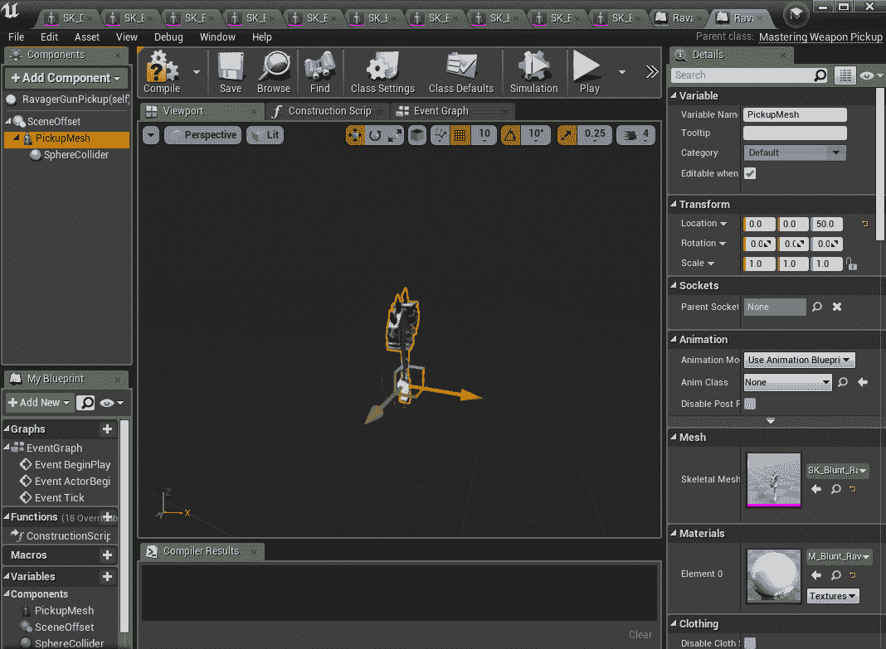
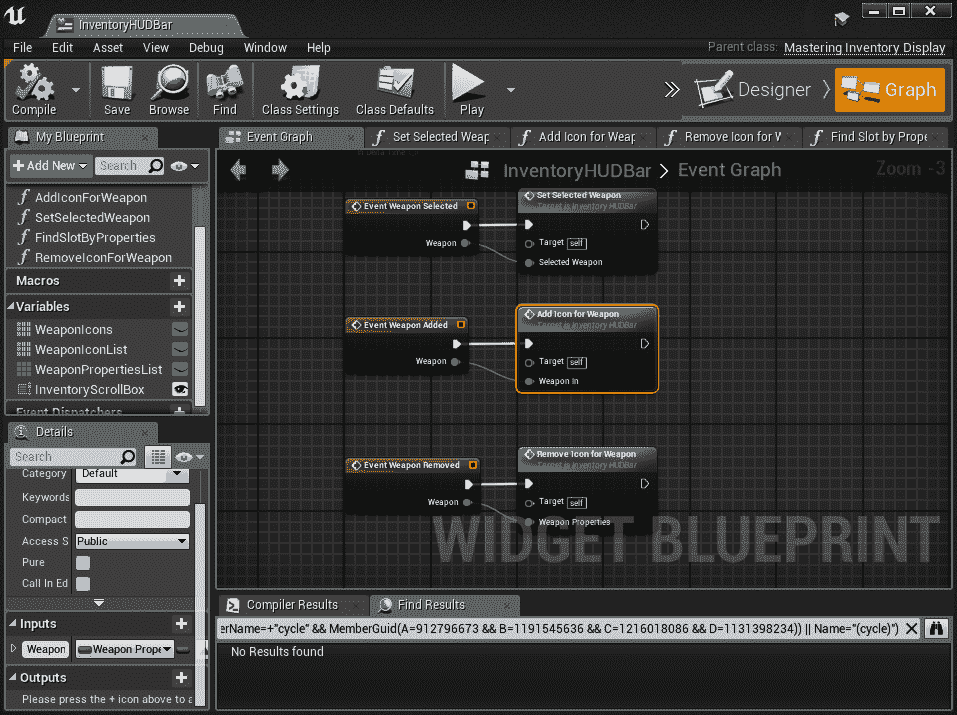
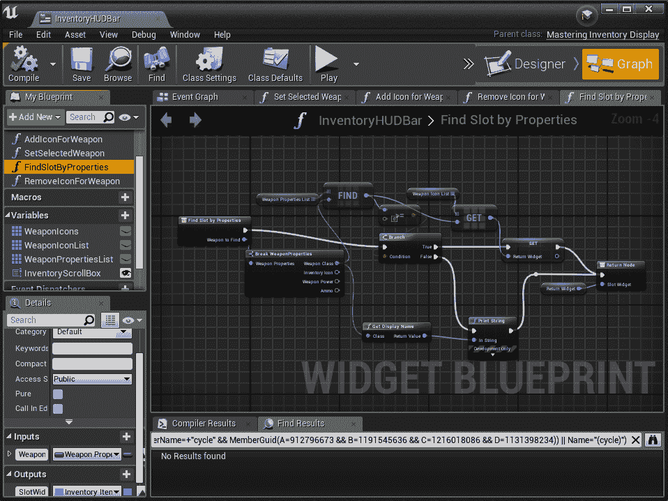
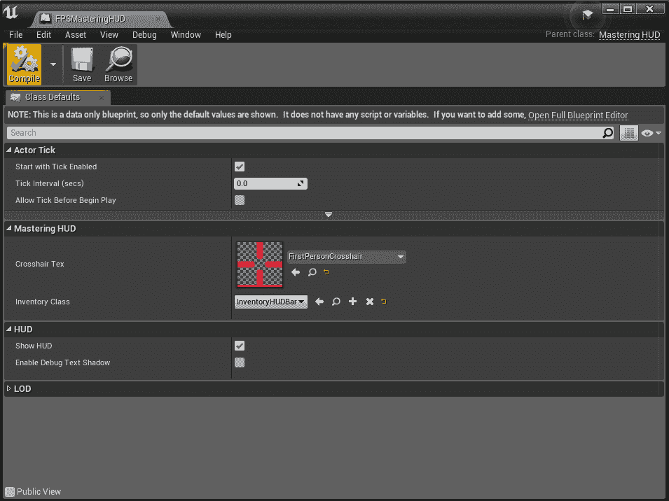
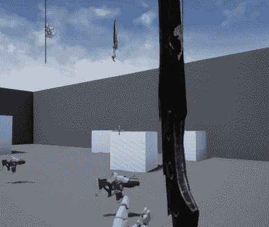
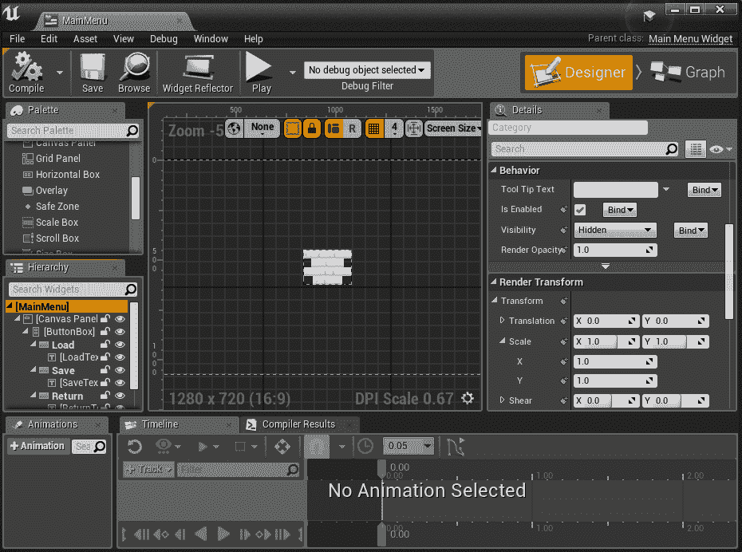
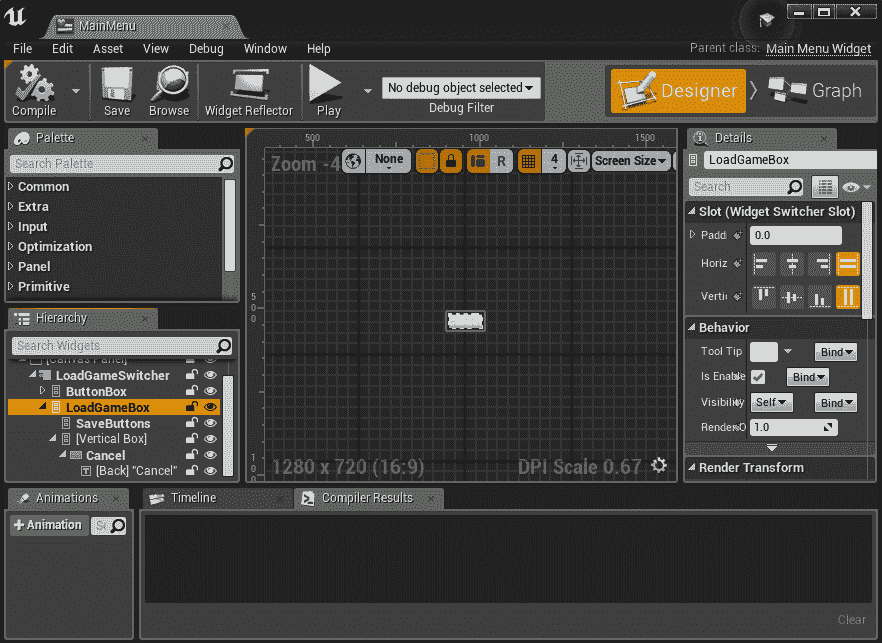
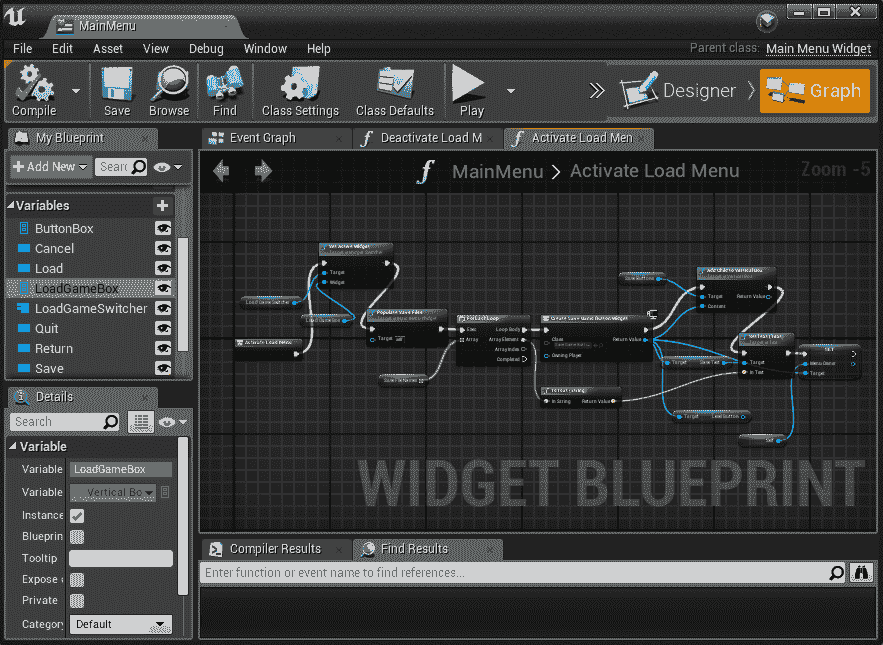
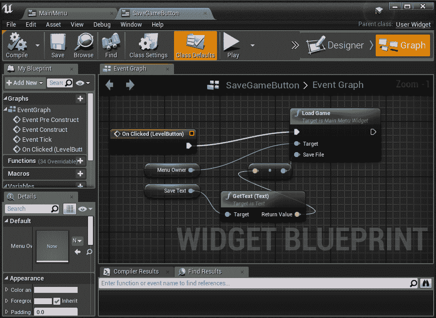

# UI 必需品、菜单、HUD 和加载/保存

# 简介

在本章中，我们将着手处理任何游戏的基本需求之一：我们的 UI，作为一个典型的例子，我们将向我们的游戏添加加载和保存游戏状态的功能。Unreal 为这两项功能提供了出色的工具，特别是 UMG 用于创建 UI，我们将在本节中探讨。当涉及到加载和保存游戏时，几乎每个游戏都以某种形式使用该系统，但没有一个是以相同的方式，其复杂性将完全由你的设计和期望的玩家体验所驱动。我们首先将使我们的库存显示在我们的 HUD 上。在下一节中，我们将讨论基于不同游戏类型的保存策略，然后我们将解决 Unreal 最困难的问题之一：在地图中保存并在游戏过程中恢复到精确点。在本章中，我们将：

+   使用自动屏幕截图级别制作库存图标

+   将图标集成到屏幕上的玩家 HUD 中

+   将库存与 HUD/UI 同步

+   从任何地方保存和加载完整游戏状态

+   构建加载和保存的 UI

# 技术要求

如同往常，建议从第三章达到的进度点开始，即*蓝图回顾和何时使用 BP 脚本*，正如 GitHub 项目中所做的那样：

[`github.com/PacktPublishing/Mastering-Game-Development-with-Unreal-Engine-4-Second-Edition/tree/Chapter-4`](https://github.com/PacktPublishing/Mastering-Game-Development-with-Unreal-Engine-4-Second-Edition/tree/Chapter-4)

虽然第三章，*蓝图回顾和何时使用 BP 脚本*的内容不是特别必需的，第二章，*玩家的库存和武器*将被大量使用和参考，因此这些类应被视为强制性，以体现这项工作的价值。

使用的引擎版本：4.19.0。

# 将 UMG 集成到我们的玩家 HUD 类中

在第二章，*玩家的库存和武器*中，我们成功为我们的玩家创建了一个库存系统，一种拾取新武器的方法，以及一个在它们之间切换的输入方案。然而，除了视觉上看到发射了哪种弹丸外，我们没有实际参考我们手中有什么。因此，现在我们将为玩家提供一个显示，让他们可以看到他们正在使用什么，作为其中的一部分，我们最终将添加一些来自免费 Unreal 市场的新的艺术资产。

# 使用屏幕截图构建库存图标

为了使这个练习更有意义，更接近现实场景，我们需要更多的艺术作品。然而，正如之前所述，这本书并不是关于生成艺术或大多数 UE4 内容的。话虽如此，作为一个试图证明可以和不可以做什么的技术开发者，并且不需要你，读者，像制作游戏那样在 Marketplace 内容或外包艺术工作室上花钱，我们将使用一些免费替代的艺术作品。所以首先要做的是打开 Epic Games Launcher。正如在第一章中首次提到的，“为第一人称射击游戏创建 C++项目”，通常最好的做法是直接创建一个指向你的 UE4 编辑器可执行文件的快捷方式。如果你忘记了，这里就是我推荐“创建一个指向你的 UE4 安装文件夹的`/Engine/Binaries/Win64/UE4Editor.exe`”的句子，或者当然你也可以手动点击它来启动它。

这将启动编辑器而没有游戏，会弹出一个你可以打开的游戏项目列表，但在右上角的 Unreal 项目浏览器中有一个 Marketplace 按钮，所以让我们去那里。在最顶部，确保你选择了 Unreal Engine，然后在左侧点击 Marketplace。在内容行顶部，你会找到一个对于想要使用酷炫内容进行原型设计或基于一些惊人的 Epic 发布资产制作游戏的团队来说可能非常有用的朋友，那就是免费标签。滚动到 Infinity Blade: Weapons 并添加到购物车（然后点击右上角的购物车结账）：


当你选择左侧 Marketplace 下面的库项目时，这些内容将会显示出来。所以现在，我们只需要将它们添加到我们的项目中，以便访问所有这些精彩内容。现在，看看这个包提供的内容，这些都是近战武器，但遗憾的是，在撰写本文时，没有免费的长距离（枪械）武器包，所以我们只能将就使用我们已有的。点击库，滚动到宝库部分，找到 Infinity Blade: Weapons 并点击添加到项目。从这里，你需要点击顶部的显示所有项目框，并选择我们的 Mastering 项目。它可能会抱怨这些资产与其它引擎版本不兼容，所以从下拉菜单中选择 4.19（或者本地引擎构建的最新版本）然后添加到项目。可能还需要下载这些资产。当然，等待这个过程完成。

现在，在编辑器中打开我们的项目，如果您打开了源代码面板，您将在内容浏览器中看到一个新文件夹，`/Content/InfinityBladeWeapons`，其中包含几个角色（请注意，其中一些是静态网格，但正如我们的原始枪和拾取物所期望的，我们将坚持使用一些角色武器）。您可以自由打开，例如，`/Content/InfinityBladeWeapons/Weapons/Blunt/Blunt_Ravager`，并打开`SK_Blunt_Ravager`骨骼网格来查看这个有趣的带刺锤子武器。我们将使用其中的一些来为我们的游戏制作一些新武器。由于我们已经在第二章中经历了这个过程，*玩家的库存和武器*，我将快速列出我在这里创建一些新物品所使用的步骤：

1.  在我们的`/Content/FirstPersonCPP/Blueprints`文件夹中，我将右键单击 BigBallGun 并复制它。

1.  我将对拾取物（BigBallGunPickup）做同样的事情。

1.  对于破坏者武器，我现在将把这些蓝图重命名为 RavagerGun（是的，我们正在用锤子制作一把枪，但再次强调，艺术只是我们目前可用的），以及 RavagerGunPickup，其他物品（如弹丸）与 BigBallGun 保持相同：

1.  在完整的 BP 编辑器中打开 RavagerGun，并选择其 WeaponMesh 组件，我现在可以将其设置为刚刚查看过的 SK_Blunt_Ravager。

1.  同样，我将 BallGunPickup 网格组件设置为使用相同的骨骼网格，并将组件重命名为 PickupMesh，这样在将来复制它们时就有了一个通用的名称：



最后，为了区分它，我在 RavagerGunPickup(self)的详细信息中将武器功率设置为 2，并在其 Mastering Weapon Pickup 下拉菜单中选择 RavagerGun。当然，您可以将武器的弹丸设置为任何您想要的，或者创建一个新的，调整其在玩家手中的位置等；但到目前为止，我们有一个可以发射斧头的武器！

将其中一个拾取物添加到关卡中并快速测试是一个很好的检查点，可以将项目添加到 GitHub。

从现在开始拉取 GitHub 项目将需要更多的时间，因为这些资产下载（比到目前为止项目的其余部分都要大！），但这种延迟只会发生在第一次拉取时。

我将重复这个过程，添加武器和拾取两次，直到此时总共有五把可以区分的武器。为了组织现在超过几个蓝图的情况，我将所有这些武器、弹丸和拾取移动到一个新的`/Content/FirstPersonCPP/Blueprints/Weapons`文件夹。我们的下一步是从这些模型中生成一些图标。有些项目会有艺术家想要手动绘制这些图标；其他游戏可能没有艺术家，使用这种技术或直接将演员绘制到渲染目标纹理中以显示这些物品。渲染目标的想法在附加阅读部分中进一步探讨，但就现在而言，让我们专注于以自动化方式从截图生成图标。

为了实现高质量 UI 使用的出色外观、alpha 掩码输出图标，我们需要按以下顺序做几件事情：

1.  创建一个新的 Camera Actor 来自动化我们的过程并获取我们的截图。实现这个相机将包括几个部分，包括我们武器演员的放置和方向、获取深度掩码截图，并将这些截图作为纹理导入到我们的演员中。

1.  创建一个新的关卡，向其中添加我们新的相机实例，并添加一个 SkyLight。

1.  将导入的纹理重新连接到我们的拾取中，以便传递给 UI。

1.  在 UMG 中创建一个图标小部件，在创建时获取武器的纹理。

1.  在 UMG 中构建一个列表并将其添加到 HUD 中。将库存类连接到列表小部件，并使其更新以反映玩家的武器选择。

对于像这样的大多数重要游戏功能，有一系列步骤，每个步骤都有不同复杂程度；但如果你能以这种方式排序，以便在实施和测试每个步骤时，就像前面的过程所设计的那样，那么从 A 到 B 并拥有你的完成系统只是时间问题。所以，让我们开始新的相机类。在编辑器中的`/Content/Blueprints`级别，我将添加一个新的 C++类，命名为 MasteringIconCamera，并从 CameraActor 派生。这个相机的全部工作就是打开武器拾取，并以一种优雅的方式将其放在它前面，然后进行截图，我们将使用这些截图作为图标。

这是一个展示使用蓝图可以节省实际时间的例子。直接在关卡中放置相机，并通过一些工作，使其视口能够截图，这是绝对可能的。如果时间允许，并且有人决心或非常熟悉这些 C++系统，这可以通过努力实现。或者，你可以在蓝图内创建一个游戏模式，创建一个新的 Pawn 蓝图，并且不需要 C++原生类。因为我们之前已经创建了蓝图类，所以我将只列出本节中采取的步骤，并且，如往常一样，如果出现问题，这个进度可以在 GitHub 上检查：

1.  在 Blueprints 文件夹中，创建一个名为 IconMaker 的文件夹，并在其中创建一个基于 Pawn 的新蓝图，命名为 IconPawn。

1.  基于 GameModeBase 创建一个游戏模式。将其命名为 IconGameMode。

1.  在游戏模式中，取消选中 Allow Tick Before Begin Play（设置为 false），将 HUD Class 设置为 None，并将 Default Pawn Class 设置为 IconPawn。

1.  在 IconPawn 中，在其 DefaultSceneRoot 下，添加一个 ChildActor 组件并将其 Child Actor Class 设置为 MasteringIconCamera。

1.  在那个子相机中，取消选中 Camera Component 的 Camera Settings 中的 Constrain Aspect Ratio（这避免了在使用自定义深度场截图时经常断言的检查）。

1.  可选地设置 FOV（出于实验目的，我将它设置为 45，因为这使一些数学计算更容易测试）。从小到大 90+ 的任何范围都行。通常，为了简化这类事情，我想要使用正交相机，但 UE4 的正交渲染在灯光方面已经存在很多问题多年了。我们将在代码中处理 FOV，如后面所示。

这就是蓝图类的内容。现在我们需要一个新的关卡来使用它们。因此，在编辑器中，请确保保存你的蓝图，然后转到文件 > 新建关卡，选择空关卡模板并将其命名为 `IconScreenshotMap`。将 Icon Pawn 拖入关卡，并在选择它的情况下，确保其位置和旋转设置为 `0`，`0`，`0`。我们还可以从 FPS 模板的示例地图中借用一个技巧，在我们的关卡 pawn 属性下，将 Auto Possess Player 设置为 Player 0。这样，当游戏开始时，它会将本地默认玩家直接放入这个 pawn，而不是从玩家生成中创建一个。另一个提示：你可以从 `FirstPersonExampleMap` 复制所有照明对象（或整个照明文件夹）并将其粘贴到这个地图中。

在任何情况下，你肯定需要天空光，可能还想像 GitHub 版本那样使用方向光，但关于改变武器外观的问题，这有点主观，因为我们在截图时可能会觉得 GitHub 版本有点太亮，使得渲染效果略显模糊；但再次强调，这很主观，并不是本章的重点。

现在我们有了关卡和照明，让我们在主编辑器标签页中修复一些 World Settings。将 GameMode Override 设置为 IconGameMode，在物理部分，我们想要勾选 Override World Gravity 复选框并将其设置为 0.0（我们不希望我们的 pawn 立即或永远掉落）。为了完整性，我添加了一个默认球枪拾取，并给大球枪拾取添加了一个缩放，以便稍后区分。所以现在我们的关卡和截图 pawn 都已设置好；我们现在需要的只是让关卡中的相机真正做些事情！

我们将从其 `BeginPlay` 函数开始，回到 C++。我们的头文件中有几个成员变量和许多我们需要自动化的函数来抓取屏幕截图：

```cpp
UCLASS()
class MASTERING_API AMasteringIconCamera : public ACameraActor
{
        GENERATED_BODY()

public:
        virtual void BeginPlay() override;

protected:

        virtual void TakeShot();
        virtual void SpawnAndPlaceNextActor();
        virtual FVector ComputeActorLocation();
        virtual void OnFinishedLoadingAssets();

        UPROPERTY(Transient)
        TArray<FSoftObjectPath> WeaponBlueprintSoftRefs;
        UPROPERTY(Transient)
        TArray<class UBlueprint*> WeaponBlueprints;

        UPROPERTY(Transient)
        class UBlueprint* CurrentWeaponBlueprint = nullptr;
        UPROPERTY(Transient)
        class AMasteringWeaponPickup* CurrentWeaponPickup = nullptr;
        UPROPERTY(Transient)
        class UCameraComponent* CameraComp;
        UPROPERTY(Transient)
        bool bInitialied = false;

        UPROPERTY(EditAnywhere, BlueprintReadWrite)
        FString WeaponsPath = "FirstPersonCPP/Blueprints/Weapons";

        UPROPERTY(EditAnywhere, BlueprintReadWrite)
        float ShotDelay = 0.4f;
        UPROPERTY(EditAnywhere, BlueprintReadWrite)
        int ScreenshotResolutionX = 256;
        UPROPERTY(EditAnywhere, BlueprintReadWrite)
        int ScreenshotResolutionY = 256;

        int CurrentWeaponIndex = 0;
};
```

为了在发布进度时保持简洁，我在这里省略了很多在专业环境中通常伴随这些内容的正常间距和注释。希望前几章中更传统和正式的例子已经提供了一些很好的总体指导原则，但如果您注意到这里缺少这些内容，那是因为我们需要覆盖的内容很多，而不是出于坏习惯。通常情况下，当有新概念时，它们将与代码一起在这里进行讨论。在这种情况下，有一个新的`UPROPERTY`标签，`Transient`。这告诉引擎这些属性永远不会与对象一起保存：它们在其生命周期内使用，可以像任何其他`UPROPERTY`一样使用，但对其更改不会使对象“变脏”而需要保存，并且内容永远不会与对象的实例进行序列化和反序列化。关于底部附近的属性简要说明：`ShotDelay`是在游戏中加载新的武器拾取并截图之间暂停的时间量。这主要是为了给游戏一些帧的时间来生成对象，然后更新它们以处于正确的 MIP 地图细节级别。我们将异步加载所有武器拾取的蓝图，但这个延迟仍然是必需的，因为即使有加载的资产，对象通常仍然以最低的 MIP 级别进入，如果我们当时截图，质量是最差的：

```cpp
void AMasteringIconCamera::BeginPlay()
{
        if (bInitialied)
        {
                return; // BeginPlay will get called multiple times at 
                level start
        }

        bInitialied = true;

        CameraComp = GetCameraComponent();

        UWorld* World = GetWorld();
        check(World != nullptr);
        APlayerController* Player = World->GetFirstPlayerController();

        Player->SetCinematicMode(true, true, true, true, true);

        Player->SetViewTarget(this);

        FString contentPath = FString("/Game/") + WeaponsPath;

        static UObjectLibrary* ObjectLibrary = nullptr;
        ObjectLibrary = UObjectLibrary::CreateLibrary(AMasteringWeaponPickup::StaticClass(), false, GIsEditor);
        ObjectLibrary->AddToRoot();
        ObjectLibrary->bHasBlueprintClasses = true;

        ObjectLibrary->LoadBlueprintAssetDataFromPath(contentPath);

        TArray<FAssetData> AssetDatas;
        ObjectLibrary->GetAssetDataList(AssetDatas);

        for (auto itr : AssetDatas)
        {
                FSoftObjectPath assetPath(itr.ObjectPath.ToString());
                WeaponBlueprintSoftRefs.Add(assetPath);
        }

        // Here we stream in the assets found that are weapon pick-ups and when done, will call the OnFinished function
        FStreamableManager& Streamable = UAssetManager::GetStreamableManager();
        Streamable.RequestAsyncLoad(WeaponBlueprintSoftRefs, FStreamableDelegate::CreateUObject(this, &AMasteringIconCamera::OnFinishedLoadingAssets));
}
```

这里有一些有趣的事情需要讨论。首先，在顶部有注释说明`BeginPlay`可以在单个对象（通常是两个）上多次调用，并且我们只需要或想要在这里执行一次操作。因此，首先，我们将玩家设置为电影模式，关闭移动和 HUD 以及我们超级基本的 pawn 不需要的其他任何东西，但在这种一般领域，这是一个好主意。我们将这个摄像头设置为视图目标并获取我们的路径，该路径默认为武器、拾取和投射物蓝图移动到的位置：`/Game/FirstPersonCPP/Blueprints/Weapons`。然而，这可以在单个图标摄像头中编辑，指向任何特定的文件夹，因为它是一个暴露的`UPROPERTY`（就像之前提到的截图分辨率和延迟一样）。接下来，使用`UObjectLibrary`类在路径中批量查找我们的拾取对象。我们快速遍历这些对象的列表，对这些对象进行软引用。这并不是严格必要的，但就像本章中的其他几个主题一样，它旨在具有指导性，并在你思考如何引用对象时开始建立良好的习惯。在 PC 上，通常你可以始终为给定级别加载所有必要的资产，并在游戏结束后才释放它们。在移动和其他平台上，内存可能非常宝贵，因此拥有在后台加载资产的工具，不停止游戏，并且在它们不再需要时通过垃圾回收确保它们被释放是很好的。一旦制作出拾取对象的列表，我们将它发送到`StreamableManager`以批量流式传输我们需要的蓝图。在这个请求中，我们使用`FStreamableDelegate`的`CreateUObject`添加一个回调给自己（这创建了一个与`UObject`绑定的回调，在大多数情况下使用`this`指针）。当所有这些蓝图都加载到内存中时，它将调用`OnFinishedLoadingAssets`，我们将在下一节中查看。

为了加快此类工作（你只需要打开一个级别，让它运行，然后退出）的测试速度，你可以在解决方案资源管理器中右键单击 Mastering 项目，并将地图名称和`-game`添加到你的命令参数行，使其看起来像这样：`"$(SolutionDir)$(ProjectName).uproject" IconScreenshotMap -game -skipcompile -debug`。这告诉 DebugGame 编辑器构建直接进入游戏，但作为一个编辑器构建。它仍然会使用未烹饪的内容。如果你构建了 DebugGame，如果你没有同时烹饪你的内容，启动时将会出现错误。

因此，一旦我们的蓝图全部加载完毕，我们需要将这些蓝图中的每一个作为演员实例化到世界中，然后进行拍摄，接着销毁该实例并移动到下一个。我们将使用计时器和 lambda 函数（这是我们第一次使用，但肯定不是最后一次）来完成这项工作。看看我们到目前为止做了什么：

```cpp
void AMasteringIconCamera::OnFinishedLoadingAssets()
{
        UWorld* World = GetWorld();

        for (auto itr = WeaponBlueprintSoftRefs.CreateIterator(); itr; 
        ++itr)
        {
                UBlueprint *BPObj = CastChecked<UBlueprint>((*itr).ResolveObject());
                WeaponBlueprints.Add(BPObj);
        }

        SpawnAndPlaceNextActor(); // this spawns our first pickup and increments CurrentWeaponIndex to 1

        static FTimerHandle ScreenShotTimer;
        World->GetTimerManager().SetTimer(ScreenShotTimer, [=] {
                        if (CurrentWeaponIndex == 0) // only way we come in at index 0 is if we're done
                        {
                                World->GetTimerManager().ClearTimer(ScreenShotTimer);
                                                                if (APlayerController* Player = UGameplayStatics::GetPlayerController(World, 0))
                                {
                                        Player->ConsoleCommand(TEXT("Exit"), true);
                                        return;
                                }
                        }

                        TakeShot();
                },
                ShotDelay, true, ShotDelay);
}
```

在这里，我们首先将我们的软引用（`FSoftObjectPath` 项的 `TArray`）转换为硬引用（在这种情况下，是一个简单的 `UPROPERTY` `TArray` 的 `UBlueprint` 指针）。如果你发现自己遇到了内存泄漏或内存不足的问题，请始终记住，UE4 中的 `UPROPERTY` 指针将被视为指向的对象的硬引用，直到你将该指针置为空（或指向另一个对象），或者拥有该指针的对象被销毁时，该对象才会被释放。你可以通过遍历 `UObject` 的 `Outer` 指针链来找出最终拥有任何其他 `UObject` 的对象，但现在是我们要强制所有这些蓝图保持在内存中，这就是为什么我们将软引用转换为硬引用的原因。之后，我们通过调用 `SpawnAndPlaceNextActor` 来安排第一个拾取物被射击，我们稍后会讨论这个函数。

对于在过去 5 年左右学习 C++ 的程序员来说，lambda 函数相当常见。对于那些早年学习 C++ 的人来说，这可能是新事物，但它们非常有用，并且得到了 UE4 许多领域的支持。我们在游戏计时器管理器的一个简单计时器中使用了它：我们将 `ShotDelay` 成员时间设置为初始延迟，以及计时器将触发的速率，因为我们将其设置为循环，只有在满足特殊条件时才会中断这个循环。`CurrentWeaponIndex` 为 0 表示我们已经完成并且没有拾取物可以捕获。停止循环（或任何活动的非循环）计时器的方法是让计时器管理器根据你设置计时器时传递的句柄清除该计时器。现在，每隔 `ShotDelay` 间隔，我们将调用 `TakeShot`，这也会在完成时安排下一次射击。

接下来要讨论的是名为 `TakeShot` 的函数，让我们来看看它：

```cpp
void AMasteringIconCamera::TakeShot()
{
        UWorld* World = GetWorld();

        check(CurrentWeaponPickup != nullptr);

        UMeshComponent* Mesh = Cast<UMeshComponent>(CurrentWeaponPickup->GetComponentByClass(UMeshComponent::StaticClass()));
        check(Mesh != nullptr);

        Mesh->bForceMipStreaming = true;

        Mesh->SetRenderCustomDepth(true);

        GScreenshotResolutionX = ScreenshotResolutionX;
        GScreenshotResolutionY = ScreenshotResolutionY;

        GetHighResScreenshotConfig().SetHDRCapture(true);
        GetHighResScreenshotConfig().bMaskEnabled = true;
        World->GetGameViewport()->Viewport->TakeHighResScreenShot();

        // this timer is here to wait just one frame (hence the tiny time) and then destroy the current actor
        // and spawn the next one: if you destroy the actor the same frame as the screenshot it may not appear
        FTimerHandle SpawnNextTimer;
        World->GetTimerManager().SetTimer(SpawnNextTimer, [this] {
                if (CurrentWeaponIndex >= WeaponBlueprints.Num())
                {
                        CurrentWeaponIndex = 0; // we have finished, this will break our timer loop on its next trigger
                }
                else
                {
                        SpawnAndPlaceNextActor();
                }
        },
        0.001f, false);
}
```

你会注意到在这些函数中，在直接调用这些项目上的函数之前，比如 Mesh 指针，都有`检查`。鉴于这个功能的自动化程度，如果内容创作者在构建合适的拾取物品时遇到麻烦，你会在任何重要的地方收到警告，但如果这是一个问题，你可能会希望以不会使编辑器崩溃的方式处理这些设置错误（连接到 Visual Studio 等的人可以始终通过设置下一个语句等方式跳过检查断言）。但再次强调，为了简洁，并且作为在简单崩溃之前警告问题的最小保障，这些`检查`至少在这里。因此，获取那个 Mesh 后，我们将其设置为适当的截图，确保我们的游戏的全局截图分辨率设置为我们的设置，设置截图的属性，并使用游戏视口进行截图。这是最容易访问的，这也是为什么我们在这里从玩家角色视角进行截图的原因。然后我们设置一个故意很短的计时器，以便在下一次帧中移动到下一个演员，或者通过重置武器索引向之前的计时器发送完成信号。正如注释中所述，如果你销毁一个演员（如`SpawnAndPlaceNextActor`所做的那样），那么在截图解析时它可能不会显示出来，但如果你等待一帧让拍摄完成，就没有问题。

现在你已经看过它几次了；让我们看看`SpawnAndPlaceNextActor`：

```cpp
void AMasteringIconCamera::SpawnAndPlaceNextActor()
{
        if (CurrentWeaponPickup != nullptr)
                CurrentWeaponPickup->Destroy();

        CurrentWeaponBlueprint = WeaponBlueprints[CurrentWeaponIndex];
        check(CurrentWeaponBlueprint != nullptr); // anything not a blueprint should never find its way into our list

        UWorld* World = GetWorld();

        FRotator Rot(0.0f);
        FVector Trans(0.0f);

        FTransform Transform(Rot, Trans);
        FActorSpawnParameters ActorSpawnParams;
        ActorSpawnParams.SpawnCollisionHandlingOverride = ESpawnActorCollisionHandlingMethod::AlwaysSpawn;
        CurrentWeaponPickup = World->SpawnActor<AMasteringWeaponPickup>(CurrentWeaponBlueprint->GeneratedClass, Transform, ActorSpawnParams);
        CurrentWeaponPickup->RotationSpeed = 0.0f; // the ones we use for screenshots we don't want spinning!
        check(CurrentWeaponPickup != nullptr);

        FVector Pos = ComputeActorLocation();
        CurrentWeaponPickup->SetActorLocation(Pos);

        CurrentWeaponIndex++;
}
```

希望这个函数更加直接，不需要太多关注。我们销毁任何当前存在的演员，获取我们索引设置为蓝图的那个演员，在世界中使用该蓝图的自定义类`GeneratedClass`创建一个，停止它旋转，修复其位置，并增加我们的索引。

那么，我们如何修复那个位置呢？通过最终使用一点基本的 3D 数学：

```cpp
FVector AMasteringIconCamera::ComputeActorLocation()
{
        check(CurrentWeaponPickup != nullptr);
        UMeshComponent* Mesh = Cast<UMeshComponent>(CurrentWeaponPickup->GetComponentByClass(UMeshComponent::StaticClass()));

        FVector InPos;
        FVector BoxExtent;
        CurrentWeaponPickup->GetActorBounds(false, InPos, BoxExtent);

        // uncomment these to view the actor bounding generated for our pick-ups
        /*FVector CurrentPosition = CurrentWeaponPickup->GetActorLocation();
  FColor fcRandom(FMath::RandRange(64, 255), FMath::RandRange(64, 255), FMath::RandRange(64, 255));
  DrawDebugLine(World, CurrentPosition, CurrentPosition + InPos, fcRandom, false, 20.0f);
  DrawDebugBox(World, CurrentPosition + InPos, 0.5f * BoxExtent, FQuat(ForceInitToZero), fcRandom, false, 20.0f);*/

        // uncomment these to view the mesh bounding imported with the 
assets
        /*FBoxSphereBounds bsMesh = Mesh->Bounds;
  DrawDebugLine(World, CurrentPosition, bsMesh.Origin, fcRandom, false, 20.0f);
  DrawDebugBox(World, bsMesh.Origin, 0.5f * bsMesh.BoxExtent, FQuat(ForceInitToZero), fcRandom, false, 20.0f);*/

        const float fX = BoxExtent.X;
        const float fY = BoxExtent.Y;
        const float fZ = BoxExtent.Z;

        if (fX > fY)
        {
                FRotator YawRot(0.0f, 90.0f, 0.0f);
                CurrentWeaponPickup->SetActorRotation(YawRot);
        }

        const float fLongestBoxSide = FMath::Max(fX, FMath::Max(fY, 
        fZ));

        // FOV is the whole frustum FOV, to make a right triangle down its middle, we use half this angle
        const float FOVhalf = 0.5f * CameraComp->FieldOfView;
        const float FOVradians = FOVhalf * PI / 180.0f;

        const float FOVtan = FMath::Tan(FOVradians);

        float XDistance = fLongestBoxSide / FOVtan;

        FVector Positioning(XDistance, 0.0f, 0.0f);

        return CurrentWeaponPickup->GetActorLocation() + Positioning - InPos;
}
```

如果你对注释掉的边界框/偏移绘制块感到好奇，可以随意启用一个或两个，看看它们会显示什么。我之所以使用它们并保留它们，是因为`SkeletalMeshActors`主要在从外部工具（如 3D Studio MAX、Maya 等）导入资产时获取边界信息，这是由艺术家设置的。由于我发现《无尽之刃》武器的一些边界设置有些奇怪，所以我使用这个方法来确保资产确实是按照这种方式制作的，并且没有数学或其他编程错误。

在这个函数中，我们获取角色的边界范围，找到它的最长维度（X、Y 或 Z），并将其推回，直到最长边刚好在我们的视锥边缘。如果发现一个武器比它长更宽，我们将较大的侧面旋转以面向我们的摄像机。在拍摄之前，确定我们的角色在 X 轴上移动多远以最好地填充/适应屏幕，这只是一个简单的三角计算。我们可以获取摄像机视锥的视野，如果我们考虑一个从上到下的视图，将视锥从中间分开成两个直角三角形，我们知道要使最长边适应，我们使用视锥角度的一半的正切值来处理一个三角形。根据定义，这个正切是相对边长与相邻边长的比值，我们通过长边来除以知道现在要将对象推多远。我们还减去边界框本身的相对位置偏移（InPos），应该有一个相当居中的位置返回。

现在运行我们的图标地图应该会在项目的 Saved 文件夹中为每个拾取生成一个截图。这是一个好的 GitHub 检查点，我们将使用这些截图来最终制作一些 UI 元素。

# 使用 UMG 在屏幕上显示库存图标

在上一节的大量代码之后，我们将回到本节主要在蓝图和编辑器中工作。一个快速的旁白：当在编辑器中移动资产时，它会在你移动的资产后面留下一个重定向器`.uasset`文件。这仅仅是指向任何寻找旧文件的东西都指向新文件。你可以运行一个 Fix-Up Redirectors 命令行工具，它会搜索你的内容文件夹中所有这些以及任何引用它们的对象，将它们正确地指向新位置，并删除重定向器。这也可以通过在内容浏览器中手动完成，通过找到 Other Filters | Show Redirectors 过滤器设置，你可以在内容浏览器中右键单击它们并选择 Fix Up 来删除它们。我在这个点上做了这件事，以保持事情整洁。

现在在 FirstPersonCPP 下，我接下来创建一个 Textures 文件夹，并在内容浏览器中点击导入按钮：浏览到截图被添加的位置（`/Saved/Screenshots/Windows`）。在这里选择生成的`.png`文件（我的情况下是五个）并将它们全部导入为纹理。当项目变得更大时，有一个命名约定来搜索蓝图是很有用的，所以对于所有这些纹理，我简单地命名为`T_`(武器名称)。当然，在 UE4 的 C++中使用`FileManager`进行一些努力，我们可以巧妙地自动重命名`.png`文件，但将它们导入游戏内容作为纹理则要复杂一些——在这里批量选择它们并手动重命名对我们来说就足够了，因为我们接下来要做的任务是绘制它们在库存 UI 中。

# 同步您的库存和 HUD

实际绘制图标并循环它们是本书的这一部分，其中不会完全展示所有实现步骤。所有的工作始终可在 GitHub 上找到，并建议查看这个 `Chapter 4` 分支提交中的每个更改，但出于讨论的目的，重点将放在后续的新概念和决策上。毕竟，这是一本精通书籍，所以期待工作节奏和复杂性的提升。首先，做一些基本的整理，因为这种复杂性确实在增加：随着项目进入更成熟的状态，源文件的数量往往会增加，因此最好尽早开始将这些文件管理到逻辑目录中。实际上，在项目层次结构中组织项目的方式有两种：按功能或按系统。按功能分组源文件类似于（在我们的当前重组中）所有 UI 小部件类，可能还有为复杂专用类型设置的子文件夹。按系统分组将类似于（如我所做的那样）所有与库存相关的事物。虽然这些可能看起来像是微不足道的决定，或者使用现代 IDE 时可能感觉将每个类留在单一的扁平层次结构中是可行的，但项目规模和开发团队规模应该驱动你的决策。重要的是要尽早做出这样的架构决策，并在整个项目中坚持这些决策，以保持团队的连贯性。

好的，接下来是更有趣的部分！我们需要在 C++ 中创建的主要新类是 `UUserWidget`，如下所示：

```cpp
UCLASS()
class MASTERING_API UMasteringInventoryDisplay : public UUserWidget
{
        GENERATED_BODY()

public:
        virtual void Init(class UMasteringInventory* Inventory);

        UFUNCTION(BlueprintImplementableEvent, Category = Inventory)
        void WeaponSelected(FWeaponProperties Weapon);

        UFUNCTION(BlueprintImplementableEvent, Category = Inventory)
        void WeaponAdded(FWeaponProperties Weapon);

        UFUNCTION(BlueprintImplementableEvent, Category = Inventory)
        void WeaponRemoved(FWeaponProperties Weapon);
};
```

现在，由于他们是这本书的新手，请注意 `BlueprintImplementableEvent` 的关键字：这些函数实际上不是在 C++ 中实现的，而是在头文件中声明的。它们的功能实际上来自于它们生成的蓝图事件。我们稍后会谈到这些，但现在让我们看看它们是如何被使用的，然后我们将追踪到它们是如何被触发的：

```cpp
void UMasteringInventoryDisplay::Init(class UMasteringInventory* Inventory)
{
        Inventory->OnSelectedWeaponChanged.AddUObject(this, &UMasteringInventoryDisplay::WeaponSelected);
        Inventory->OnWeaponAdded.AddUObject(this, &UMasteringInventoryDisplay::WeaponAdded);
        Inventory->OnWeaponRemoved.AddUObject(this, &UMasteringInventoryDisplay::WeaponRemoved);
}
```

这里发生的事情是我们正在挂钩到 `Inventory` 类中的一个事件，该事件将在事件发生时向所有监听器（我们的绑定）广播，并将武器属性传递到我们的蓝图实现中。那么，我们是如何做到这一点的呢？首先，我们将这些事件添加到我们的库存类中：

```cpp
DECLARE_EVENT_OneParam(UMasteringInventory, FSelectedWeaponChanged, FWeaponProperties);
FSelectedWeaponChanged OnSelectedWeaponChanged;

DECLARE_EVENT_OneParam(UMasteringInventory, FWeaponAdded, FWeaponProperties);
FSelectedWeaponChanged OnWeaponAdded;

DECLARE_EVENT_OneParam(UMasteringInventory, FWeaponRemoved, FWeaponProperties);
FSelectedWeaponChanged OnWeaponRemoved;
```

在 `.cpp` 文件中，经过大量的重构（以及一些我不太愿意承认的几个错误修复）后，我们会有这样的行：

```cpp
void UMasteringInventory::SelectWeapon(FWeaponProperties Weapon)
{
        OnSelectedWeaponChanged.Broadcast(Weapon);

        MyOwner->EquipWeapon(Weapon.WeaponClass);
        CurrentWeapon = Weapon.WeaponClass;
}
```

类似地，为了添加武器以及新实施的武器移除功能（这是在弹药耗尽时进行的）。

对于这样的游戏，有一个设计思路来展示玩家的库存以及知道是否可能实现诸如弹药拾取而不是武器拾取这样的功能是很重要的。当然，如果你没有弹药，你甚至可以没有武器，所以我们将其从显示中移除。当然，你也可以将其变灰或类似操作，但再次强调，在所有时候，你的设计应该驱动你的实现决策。

因此，我们现在正在通过 C++将库存更改时的事件传递给我们的库存显示对象。让我们花点时间看看这个概念在蓝图方面的样子：



这里有一些需要注意的事项，但将会简要说明：注意左侧的函数和变量。这些是仅通过+按钮添加的蓝图专用内容，以使所有这些工作。这就是为什么一些神秘的东西会保留下来，除非你前往 GitHub 查看所有实现。希望这些函数和变量的功能从命名中可以清楚地看出。随着库存物品的增加，小部件将被添加到 ScrollBox 小部件中。布局将随之而来，但重要概念是我们将跟踪武器类和图标小部件的并行数组，以便我们可以为选择和删除进行映射。这个函数展示了为什么不会直接在这里显示所有函数：



这甚至不是一个特别复杂的函数，但已经有点紧凑，无法一次性完成。注意在打印字符串节点处有一个重定向节点。它们可以通过从任何执行引脚（白色引脚）拖动来添加，然后拖动以帮助有时解决视觉脚本可能创建的意大利面式代码。希望你也熟悉输入和输出变量（在左下角可见），蓝图函数对于快速实现非常有用，并且在与 UMG 小部件一起工作时几乎是必需的。一些 UI/UX 设计师可能对实现自己的功能感到舒适，但大多数情况下，这些角色将与右上角的“设计器”标签更相关。让我们快速看一下我们将绘制的这个滚动库存小部件，目前位于屏幕顶部：


在右上角值得注意的是，ScrollBox 小部件在此情况下被标记为变量（你可以在蓝图脚本中看到它的引用），以及左侧 HorizontalBox 小部件的略微奇怪的排列，这基本上将 ScrollBox 夹在中间的 Canvas 小部件中，该 Canvas 小部件的大小是我们想要的。要正确设置所有这些，需要很多小部件设置，包括一个基于图像的小部件名为 InventoryItem，可以在 GitHub 项目中查看。寻找修改了什么以使事情按预期工作，始终只是搜索那些黄色循环箭头（如果你知道，点击会恢复值）以指示已修改的内容。

现在，为了使所有这些工作，还需要为 MasteringGameMode 和 MasteringHUD 添加蓝图，以便前者可以将后者设置为要使用的 HUD，并且主级别编辑窗口中的世界设置可以设置为使用该模式：



注意，我没有将十字准星纹理硬编码，但将此类事物暴露给蓝图意味着需要添加额外的代码来处理它们是否设置正确。

因此，最终结果是我们可以现在滚动浏览我们的武器，看到哪个被选中（因为它是我们列表中唯一的全 alpha 对象），当我们循环手中的物品时，我们的 ScrollBox 中的图标也会循环，移除任何耗尽弹药的图标！



如果你发现自己在编译小部件时遇到错误，请确保注意`Mastering.Build.cs`中的更改。这是你可以包含游戏可能需要的源模块的地方（到目前为止，我们不需要 UMG）：

```cpp
+ PublicDependencyModuleNames.AddRange(new string[] { "Core", "CoreUObject", "Engine", "InputCore", "HeadMountedDisplay", "UMG" });
```

最后一点（对于经验丰富的 GitHub 用户来说可能很熟悉）：我提交了我的更改，然后移动我的文件来重新组织它们。GitHub 将移动视为旧文件的删除和新文件的添加，因此你会丢失更改历史，但可以在与这项工作相关的两个提交中看到。

现在库存已经同步并准备就绪！

# 使用 UMG 和游戏保存槽位

UE 4.19+为我们提供了一个很好的类，可以实际保存和加载数据块，用于我们想要保存的对象。在我们的案例中，这将是我们现在可以改变其状态或位置的每个演员，目前并不多。但随着游戏的发展，如果希望在场景内保存，尽早开始这个过程也非常重要。我们最大的挑战将是我们在第三章中实现的那个类，*蓝图审查和何时使用 BP 脚本*，其中几乎全部功能都是在蓝图端实现的。创建一个同时适用于原生 C++类和蓝图解决方案将是本节的全局目标。UMG UI 将比本章上一节更轻量。

# 创建保存槽位的控件

虽然本节的大部分工作将是实际实现各种演员类的加载和保存，但我们当然需要一个界面来向玩家展示这些信息，这正是我们将要做的。接下来的步骤是一个 UMG 小部件，我们可以通过按钮来激活它。因此，回到编辑器中，我们需要一个具有一些与 C++代码交互点的控件，这样我们就可以完成大部分工作。为了简化这个过程，我们将基于`UUserWidget`创建一个新的 C++类，命名为 MainMenuWidget，并将其添加到 UI 文件夹中。然后，就像之前一样，我们创建一个新的蓝图资产，并在其设计中添加 4 个按钮，如下所示：



注意我们将它的初始可见性设置为隐藏，并在 ButtonBox 级别，锚点设置为屏幕中心，X 和 Y 对齐为 0.5。就像往常一样，请随时参考 GitHub 上的版本，以解决这里未具体讨论的所有 UMG/蓝图问题。

接下来，我们为每个按钮绑定点击事件。点击每个按钮，在其详情标签页底部会有输入事件，旁边有一个大绿色的+按钮。点击该按钮为每个按钮的`OnClicked`事件添加，你将被带到该事件处的蓝图图中，我们将添加这些函数到`Widget`类中：

```cpp
UCLASS()
class MASTERING_API UMainMenuWidget : public UUserWidget
{
        GENERATED_BODY()

public:
        UFUNCTION(BlueprintCallable)
        void LoadGame(FName SaveFile);

        UFUNCTION(BlueprintCallable)
        void SaveGame();

        UFUNCTION(BlueprintCallable)
        void Open();

        UFUNCTION(BlueprintCallable)
        void Close();
};
```

将保存事件连接到`SaveGame`函数，并将加载事件连接到`LoadGame`函数，当然。`Open`是通过输入调用的：我们需要在玩家设置中绑定一个，就像我们过去做的那样。我将它设置为*F10*，因为在许多游戏中这是常见的，但当然可以是任何键、触摸或手势。在`MasteringCharacter`中，我将这个输入绑定到一个简单的透传函数，如下所示，并调用该 HUD 上具有相同名称的函数：

```cpp
AMasteringHUD* HUD = Cast<AMasteringHUD>(CastChecked<APlayerController>(GetController())->GetHUD());

void AMasteringHUD::ToggleMainMenu()
{
        if (MainMenu != nullptr)
        {
                if (MainMenu->GetVisibility() == ESlateVisibility::Visible)
                        MainMenu->Close();
                else
                        MainMenu->Open();
        }
}
```

在`Widget`类中，`Open`和`Close`函数值得一看，但这里只列出了`Open`，因为`Close`本质上是在`Open`的基础上反向操作，将输入模式设置为`FInputModeGameOnly`：

```cpp
void UMainMenuWidget::Open()
{
        checkSlow(GetVisibility() == ESlateVisibility::Hidden); // only want to open from closed
        SetVisibility(ESlateVisibility::Visible);

        UWorld* World = GetWorld();
        if (World != nullptr)
        {
                APlayerController* playerController = World->GetFirstPlayerController();
                if (playerController)
                {
                        playerController->bShowMouseCursor = true;
                        FInputModeUIOnly InputMode;
                        playerController->SetInputMode(InputMode);
                        UGameplayStatics::SetGamePaused(this, true);
                }
        }
}
```

现在，使用*F10*，在游戏中，我们的主菜单出现，当点击返回游戏按钮时，其事件只是现在在 widget 上调用关闭，这将暂停游戏并返回鼠标控制到我们的正常玩家输入。最后一个特殊事件，标记为退出游戏的按钮，有一个简单的蓝图节点调用，用于退出游戏（并退出独立模式），使用`Execute Console Command`节点，命令为`exit`。

在项目后期，这被更改为退出游戏节点，因为当控制台命令可能不可用（发布版本、某些平台等）时，这会起作用。退出游戏节点也很不错，因为在移动平台上，它可以将您的应用程序发送到后台而不是完全结束其执行。请记住，iOS 和 Android 可以在操作系统决定需要其资源时有效地结束后台应用程序的执行；但再次强调，至少退出游戏节点在所有平台上都有效，并允许您选择尝试仅将其发送到后台。

目前菜单部分就到这里。现在我们需要实际保存我们的游戏，最终！

# 创建一个保存游戏文件

如本节顶部所述，我们的实际游戏和所有动态演员的状态是通过三个主要步骤完成的：

1.  为所有需要保存的演员添加一个接口。这涉及到对我们移动平台的几个修改，我们将尽量保持其简单性。

1.  将所有演员希望序列化的变量序列化到`FArchive`中，通过标记我们的`UPROPERTIES`。

1.  将此写入一个文件，然后我们可以从该文件反序列化所有内容。

对于非常简单的保存操作（例如玩家统计数据和当前关卡），请务必查看章节末尾的*进一步阅读*部分中的`USaveGame`文档链接。现在，让我们继续探讨相对复杂的版本。

首先，我们需要一个接口，我们将将其添加到所有我们关心的需要保存的演员中，这是我们第一次在编辑器外创建 C++类。

当从文件创建新的 C++ 项目时，通常最简单的方法是右键点击 Visual Studio 顶部的选项卡，打开包含文件夹，复制粘贴一个 `.h` 和 `.cpp` 文件到上一级文件夹，根据需要重命名它们，然后将它们复制回正确的文件夹，然后通过右键点击 `.uproject` 或使用 第一章 中提到的批处理文件样式生成项目文件，*为第一人称射击游戏创建 C++ 项目*。当然，文件的内容需要替换。

`.h` 文件的头部应该看起来像这样：

```cpp
// Fill out your copyright notice in the Description page of Project Settings.

#pragma once

#include "CoreMinimal.h"
#include "Serialization/ObjectAndNameAsStringProxyArchive.h"
#include "Inventory/MasteringInventory.h"
#include "SavedActorInterface.generated.h"

/**
 * 
 */
USTRUCT()
struct FActorSavedData
{
        GENERATED_USTRUCT_BODY()

        FString MyClass;
        FTransform MyTransform;
        FVector MyVelocity;
        FName MyName;
        TArray<uint8> MyData;

        friend FArchive& operator<<(FArchive& Ar, FActorSavedData& SavedData)
        {
                Ar << SavedData.MyClass;
                Ar << SavedData.MyTransform;
                Ar << SavedData.MyVelocity;
                Ar << SavedData.MyName;
                Ar << SavedData.MyData;
                return Ar;
        }
};

USTRUCT()
struct FInventoryItemData
{
        GENERATED_USTRUCT_BODY()

        FString WeaponClass;
        int WeaponPower;
        int Ammo;
        FString TextureClass;

        friend FArchive& operator<<(FArchive& Ar, FInventoryItemData& InvItemData)
        {
                Ar << InvItemData.WeaponClass;
                Ar << InvItemData.WeaponPower;
                Ar << InvItemData.Ammo;
                Ar << InvItemData.TextureClass;
                return Ar;
        }
};

USTRUCT()
struct FInventorySaveData
{
        GENERATED_USTRUCT_BODY()

        FString CurrentWeapon;
        int CurrentWeaponPower = -1;
        TArray<FInventoryItemData> WeaponsArray;

        friend FArchive& operator<<(FArchive& Ar, FInventorySaveData& InvData)
        {
                Ar << InvData.CurrentWeapon;
                Ar << InvData.CurrentWeaponPower;
                Ar << InvData.WeaponsArray;
                return Ar;
        }
};

USTRUCT()
struct FGameSavedData
{
        GENERATED_USTRUCT_BODY()

        FDateTime Timestamp;
        FName MapName;
        FInventorySaveData InventoryData;
        TArray<FActorSavedData> SavedActors;

        friend FArchive& operator<<(FArchive& Ar, FGameSavedData& GameData)
        {
                Ar << GameData.MapName;
                Ar << GameData.Timestamp;
                Ar << GameData.InventoryData;
                Ar << GameData.SavedActors;
                return Ar;
        }
};

struct FSaveGameArchive : public FObjectAndNameAsStringProxyArchive
{
        FSaveGameArchive(FArchive& InInnerArchive)
                : FObjectAndNameAsStringProxyArchive(InInnerArchive, true)
        {
                ArIsSaveGame = true;
        }
};

UINTERFACE(BlueprintType)
class USavedActorInterface : public UInterface
{
        GENERATED_UINTERFACE_BODY()
};

class ISavedActorInterface
{
        GENERATED_IINTERFACE_BODY()

public:
        UFUNCTION(BlueprintNativeEvent, BlueprintCallable, Category = "Load-Save")
        void ActorLoaded();
};
```

BlueprintNativeEvent 的优点在于我们可以从 C++ 中触发这些事件，但它们在蓝图中被执行。我们需要做一些新工作的类是我们的移动平台，它再次，仅存在于蓝图定义中。将接口 `BlueprintType` 化意味着我们可以轻松地将它添加到我们的平台蓝图类中。因此，前往该类，以下是我们需要执行以正确保存到存档的步骤。打开移动平台类，点击顶部主菜单栏中的“类设置”，在右侧，你会看到“实现接口”，我们可以点击“添加”并选择“保存演员接口”以在蓝图侧添加此功能。一旦我们编译了蓝图，我们就可以添加一个事件，当演员被加载时。为了正确设置它到正确的状态，我们需要在左侧的“我的蓝图”选项卡上点击其两个变量，并在它们的“详细信息”选项卡中，点击向下箭头以显示其余选项，并勾选“保存游戏”选项，对于“回家”和“起始位置”蓝图变量。现在，当我们将平台序列化到存档时，这些将被保存和加载。理想情况下，我们会“套索”选择一组节点，右键点击并选择“折叠到函数”，但我们不能在这里这样做，因为像 MoveComponentTo 这样的异步节点必须保持在事件图层。但让我们为接口的“演员加载”添加一个事件，然后复制粘贴一些移动节点，确保如果平台需要移动，它移动的方向是正确的（基于“回家”变量）。告诉平台去它已经所在的地方没有害处，所以我们将设置在“回家”设置为移动到起始位置的情况下。之前修复的 on-actor-overlap 事件也略有改进。它将移动到 Z 轴上的起始位置 + 300，而不是当前位置。这样，我们就解决了有争议的最难案例，即该组的蓝图仅类。让我们将接口添加到我们的其他类中，并给他们一个通用的保存功能以及一些特定的功能（例如我们的 `MasteringCharacter`）。

MyData 将由所有我们用 `SaveGame` 标记的 `UPROPERTY` 项组成。目前，我们真正需要添加的这些之一是玩家的库存；但由于它有类引用和直接引用纹理和类的结构体数组，我们将自定义处理库存。

直接保存类和资产引用不适用于标记了`UPROPERTIES`的情况。如果一个对象引用了在关卡加载时将被创建的另一个对象，这可能有效，或者为了安全起见，你可以在修复过程中通过名称查找放置在世界的演员。大多数时候，你将类保存为字符串，然后重新生成该对象，正如我们在这里以及我们的存货特殊情况保存中将要广泛做的那样。

如果我们有其他基本类型（例如移动平台上的蓝图变量），只需在它们的定义中添加`UPROPERTY(SaveGame)`，它们就会自动与演员数据一起序列化和反序列化。为了使存货加载和保存正常工作，我们需要一些新的结构体以及它们之间的序列化和反序列化，我们将在下一节中演示。由于它不是一个演员类，将其结构体放在与演员保存那些结构体相同的位置有点令人烦恼，但在这个复杂性的级别上，这似乎是最好的地方。所以现在，我们如何使用这个菜单、一些新的 UI 以及大量的保存和加载代码来保存我们关卡中任何时刻可能改变的所有内容，并正确加载回来？让我们现在就深入研究这个问题！

# 从我们的菜单保存和加载

保存我们的数据相对直接，但与所有加载/保存系统一样，在加载方面会稍微困难一些。这个功能几乎完全实现在`MainMenuWidget`类中，尽管我看到这个类可能会增长，可以将其移动到`SavedActorInterface`或类似的位置；但现在让我们继续进行已经完成的工作：

```cpp
UCLASS()
class MASTERING_API UMainMenuWidget : public UUserWidget
{
        GENERATED_BODY()

public:
        UFUNCTION(BlueprintCallable)
        void LoadGame(FString SaveFile);

        UFUNCTION(BlueprintCallable)
        void SaveGame();

        UFUNCTION(BlueprintCallable)
        void Open();

        UFUNCTION(BlueprintCallable)
        void Close();

        UFUNCTION(BlueprintCallable)
        void PopulateSaveFiles();

        void OnGameLoadedFixup(UWorld* World);
        static TArray<uint8> BinaryData;

protected:
        UPROPERTY(BlueprintReadOnly)
        TArray<FString> SaveFileNames;
};
```

在保存方面，这里有很多事情在进行，其中一些只是基本的文件 I/O，但其他部分可能不太直观，这里将进行讨论：

```cpp
void UMainMenuWidget::SaveGame()
{
        FGameSavedData SaveGameData;

        SaveGameData.Timestamp = FDateTime::Now();

        UWorld *World = GetWorld();
        checkSlow(World != nullptr);

        FString mapName = World->GetMapName();

        mapName.Split("_", nullptr, &mapName, ESearchCase::IgnoreCase, ESearchDir::FromEnd);

        SaveGameData.MapName = *mapName;

        TArray<AActor*> Actors;
        UGameplayStatics::GetAllActorsWithInterface(GetWorld(), USavedActorInterface::StaticClass(), Actors);

        TArray<FActorSavedData> SavedActors;
        for (auto Actor : Actors)
        {
                FActorSavedData ActorRecord;
                ActorRecord.MyName = FName(*Actor->GetName());
                ActorRecord.MyClass = Actor->GetClass()->GetPathName();
                ActorRecord.MyTransform = Actor->GetTransform();
                ActorRecord.MyVelocity = Actor->GetVelocity();

                FMemoryWriter MemoryWriter(ActorRecord.MyData, true);
                FSaveGameArchive Ar(MemoryWriter);
                AMasteringCharacter* Mast = Cast<AMasteringCharacter>(Actor);

                Actor->Serialize(Ar);

                if (Mast != nullptr)
                {
                        UMasteringInventory* Inv = Mast->GetInventory();
                        SaveGameData.InventoryData.CurrentWeapon = Inv->GetCurrentWeapon()->GetPathName();
                        SaveGameData.InventoryData.CurrentWeaponPower = Inv->GetCurrentWeaponPower();
                        for (FWeaponProperties weapon : Inv->GetWeaponsArray())
                        {
                                FInventoryItemData data;
                                data.WeaponClass = weapon.WeaponClass->GetPathName();
                                data.WeaponPower = weapon.WeaponPower;
                                data.Ammo = weapon.Ammo;
                                data.TextureClass = weapon.InventoryIcon->GetPathName();

                                SaveGameData.InventoryData.WeaponsArray.Add(data);
                        }
                }

                SavedActors.Add(ActorRecord);
        }

        FBufferArchive BinaryData;

        SaveGameData.SavedActors = SavedActors;

        BinaryData << SaveGameData;

        FString outPath = FPaths::ProjectSavedDir() + SaveGameData.Timestamp.ToString() + TEXT(".sav");

        FFileHelper::SaveArrayToFile(BinaryData, *outPath);

        BinaryData.FlushCache();
        BinaryData.Empty();

        APlayerController* playerController = World->GetFirstPlayerController();
        if (playerController)
        {
                playerController->bShowMouseCursor = false;
                FInputModeGameOnly InputMode;
                playerController->SetInputMode(InputMode);
                UGameplayStatics::SetGamePaused(this, false);
        }

        Close();
}
```

我们保存时间戳，然后使用`_`字符分割地图名称。这有点风险，因为你当然希望向关卡设计师明确指出不要将此字符添加到他们的地图名称中。在这种情况下，当我们正在玩并在 PIE 中进行测试时，它会在地图名称左侧附加一些以`_`结尾的东西，这样从末尾分割就可以得到例如`FirstPersonExampleMap`，而不包含在编辑器中玩游戏时最终出现在那里的 PIE 前缀。然后我们获取实现我们保存接口的所有演员的列表并迭代它们。然后我们总是保存相关演员的瞬态数据，同时也查看是否找到了我们的主角色以进行一些存货工作。如前所述，我们的存货保存（和加载）需要使用`FInventoryItemData`结构体，而不是直接使用`FWeaponProperties`结构体存货，因为后者直接引用了一个类和纹理（我们需要通过它们的路径/名称保存它们，以便正确序列化和然后从它们重新加载）。

我们设置所有相关信息，然后将其序列化为二进制输出并保存文件，文件名使用我们使用的时戳。当然，你也可以让用户选择名称，或者以其他方式保存，但至少在加载时可以清楚地显示这个存档是在什么时间保存的。

在我们保存后，我们将鼠标光标设置回隐藏，暂停游戏，并关闭主菜单。

在加载时，我们首先需要添加一些 UI 以允许玩家选择他们想要加载的存档（或取消）：



注意切换器 UMG 项目。这使我们基本上可以从该层次结构向下切换（当然）小部件显示的内容。我们通过主菜单蓝图中的节点设置此选项，例如当我们在这里从加载按钮的点击事件打开新的加载部分时：



我们随后调用本地函数以获取所有存档文件：

```cpp
void UMainMenuWidget::PopulateSaveFiles()
{
        FString dir = FPaths::ProjectSavedDir();
        FString fileExt = TEXT("sav");

        IFileManager::Get().FindFiles(SaveFileNames, *dir, *fileExt);
}
```

然后我们为每个项目（以主菜单作为成员）创建并添加一个按钮到加载游戏列表中。我们快速创建一个具有简单按钮和文本布局的用户界面蓝图，如下所示，它有一个任务要在点击时执行：



对于那些仔细观察的人来说，有几个点可以以不同的方式处理。我们将在本书的后面部分讨论它们。我想指出的是，我们加载（或重启）存档的地图，加载其数据，然后将其存储在静态成员变量中，该变量在地图重新加载后仍然存在，并由 HUD 的 `BeginPlay` 触发。我们将在第六章 Chapter 6，*改变关卡，流式传输和保留你的数据*中探讨如何在关卡之间切换并传递数据，所以如果你还有疑问，不要担心。此外，目前删除存档文件的唯一方法是转到你的内容文件夹，但鉴于我们在这里所做的所有工作，将删除功能添加到你的菜单中应该不会是问题。最后一点：以多种方式将一个小部件连接到另一个小部件也是可能的。在这种情况下，我只是当菜单创建时将菜单传递给按钮。使用巧妙的技术没有问题，但请记住，有时候选择最简单的解决方案可以节省时间，这对于每个游戏来说，在接近准备向公众发布时都是必需的。

好了，这就完成了！检查 GitHub，有一个带有一些更改的新关卡，但现在它只是用来证明从关卡到关卡以及再次返回的加载-保存功能。祝你在测试中玩得开心。

# 摘要

这一章将工作复杂性提升到接近精通水平的程度。经过一些热身工作后，确实到了深入研究这一层次细节并开始真正学习那些可以使游戏开发成功或失败的小技巧的时候了。这里的工作应该为多个层次的 UI 工作提供一个坚实的基础：我们制作了许多新武器，使用拾取物生成它们的截图图标，将这些图标添加回拾取物和我们的库存中，利用这个库存构建并同步武器滚动条，并为所有对象制作了菜单和整个任意保存系统，哇！与最初我们开始时的裸骨模板相比，项目终于开始更像一个真正的游戏了，但有一件事还缺失：敌人。但不用担心，我们将在下一章的结尾拥有它们。

# 问题

1.  为什么在将文件移动到新文件夹位置之前，将任何更改提交到 GitHub 很重要？

1.  创建一个在启动空关卡时不会移动或掉落的 NPC 需要哪些步骤？

1.  在 UE4 中清理重定向器的两种方法是什么，为什么有时这样做很重要？

1.  在父窗口中放置和间距其他小部件时，可以使用哪些 UMG 子部件？

1.  使用`BlueprintImplementableEvents`在 C++与 UMG 之间通信的优势是什么？

1.  在保存类变量时，哪些类型的`UPROPERTIES`绝对不能尝试序列化？

1.  在这里，为了保存和恢复这些特殊类型，使用了哪种保存属性的替代方法？

1.  使用几行代码实现匹配扩展名的文件列表构建的系统是哪个？

# 进一步阅读

使用`USaveGame`的简单保存：

[`docs.unrealengine.com/en-US/Gameplay/SaveGame/Code`](https://docs.unrealengine.com/en-US/Gameplay/SaveGame/Code)
