# 添加敌人！

# 简介

对于大多数涉及战斗的游戏，通常都存在一种或多种形式的**非玩家角色**（NPCs）。NPCs 为游戏增添了真实感和互动性，控制它们的 AI 使它们看起来可信（或不可信），因此正确地处理这一点非常重要。充分利用 UE4 的 BehaviorTree 是制作具有吸引力的敌人和朋友的游戏的重要步骤。在本章中，我们将制作一个基本的近战敌人，它将使用来自世界的信息来更新其在 BehaviorTree 中的选择，并适当地对玩家做出反应。我们还将深入调试树及其数据。我们在这里的主要目标将是：

+   将新角色和骨骼网格导入到游戏中

+   创建一个新的 AIController 类

+   构建一个基本的 Behavior Tree 大脑

+   通过 C++添加感知功能

+   将行为连接到 Animation Blueprint

# 技术要求

和往常一样，建议跟随所有前面的章节进度；然而，本章的大部分内容将作为一个独立项目工作，但有少数例外。

本章的 GitHub 分支，如往常一样，在这里：

[`github.com/PacktPublishing/Mastering-Game-Development-with-Unreal-Engine-4-Second-Edition/tree/Chapter-5`](https://github.com/PacktPublishing/Mastering-Game-Development-with-Unreal-Engine-4-Second-Edition/tree/Chapter-5)

使用的引擎版本：4.19.2。

# 创建一个 AI 控制器和一个基本的大脑

就像在上一章添加新武器一样，我们希望为我们的 AI 敌人添加一些有趣的新视觉效果，所以让我们回到市场看看有什么免费提供的。天选者项目（该项目已被取消）由 Epic 发布了大量免费资产，所以让我们导入一个或多个他们的角色，我们可以用这些角色作为我们的敌人。然后我们给他们一个控制器，在我们的关卡中生成它们，看看它们的思维是如何做出决策，最终成为玩家战斗的挑战性对手！

# 验证基础

在市场中，为了验证我们的概念，GitHub 项目将首先以与第四章开头相同的方式导入 Paragon: Countess 资产，*UI 需求 – 菜单、HUD 和加载/保存*。请注意，为了节省大约 200 MB 的约 2 GB 的高清角色下载，GitHub 中移除了 Tier 2 皮肤，但当然，您可以使用 Paragon 项目发布的许多令人惊叹的高清角色中的任何一种。一旦角色被添加到项目中，要使其在游戏中做有意义的事情，有三个主要步骤：

1.  创建一个新的`AIController`类并创建它的蓝图实例（在这里，它被称为`MeleeAIController`）。

1.  为角色添加一个 AnimationBlueprint 并将其连接到新的角色。

1.  向控制器添加一个带有一些节点的 BehaviorTree，使其开始，嗯，表现良好。

从行为树获取一些基本功能需要一些额外的基础知识，但让我们一步一步快速地通过这些，以获得游戏中的基本功能。

在创建 AI 控制器时，目前只需添加一个变量：

```cpp
public:

        UPROPERTY(EditAnywhere, BlueprintReadWrite, Category = "Targeting")
        float HearingRadius = 300.0f;
```

在 FirstPersonCPP/AI 中创建一个蓝图实例，命名为 CountessController。

在 ParagonCountess | Characters | Global 中，创建一个新的动画 | 动画蓝图类。当你这样做时，它会要求选择一个父类和一个骨架：分别使用 AnimInstance 和 S_Countess_Skeleton。一旦创建，将其命名为`ABP_Countess`，双击它以打开其编辑器。如果你点击动画图标签页，你可以看到一个简单的节点，从其输入拖动到状态机并添加一个新的节点，双击它。从入口拖动并添加一个状态。命名为 Idle，双击它，我们就完成了一个非常临时的动画蓝图，只有一个快速节点，如下所示：

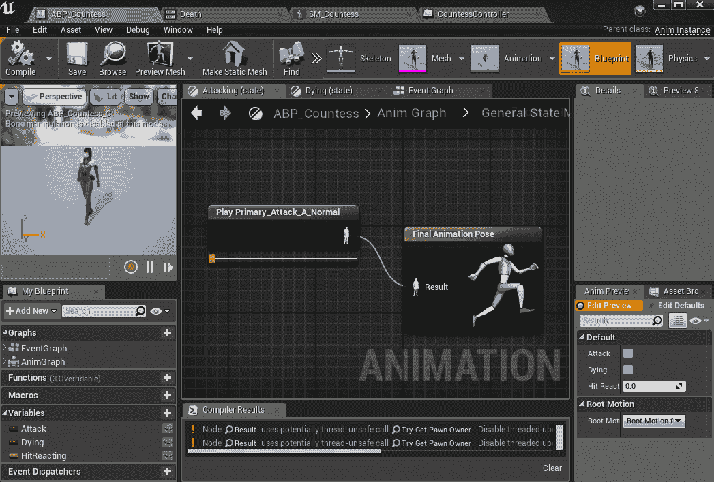

要使用和测试我们的角色，首先在 FirstPersonCPP/AI 中基于 Character 创建一个新的蓝图类，命名为`BP_Countess`。我们将将其设置如下：

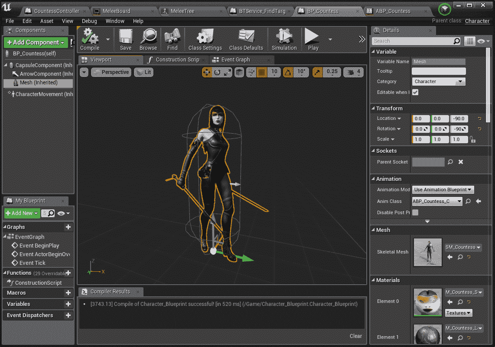

注意胶囊根组件用于碰撞目的，以及网格的位置和旋转偏移，以在游戏中使事物看起来正确地放在地面上。此外，点击顶部的（self）组件，并将 AIController 设置为 CountessController。

现在是最相关的一部分，但请注意，目前这也会处于一个非常简化的状态，因为我们只是简单地阻塞出所有我们的类和需求。如前所述，每当有可能在基本级别上使事物工作并检查到源控制作为检查点时，即使整体工作发生变化（或类甚至被删除），这也是一个好主意。这为出错时提供了一个安全的回退点，并且当你在团队中工作时，它允许轻松共享你工作的状态，所以一旦我们的基本树就绪，我们将这样做。在我们的 AI 文件夹中，右键单击，在人工智能下添加一个行为树和一个黑板。分别命名为 MeleeTree 和 MeleeBoard。打开黑板，我们将使用编辑器右上角的添加按钮添加两个键。将一个设置为对象类型，另一个设置为向量，并在编辑器的属性右侧将它们命名为 Target 和 TargetLocation。接下来，打开行为树，我们首先点击顶部附近的一个按钮以添加一个新的服务。这将为您在内容浏览器中的同一文件夹级别创建它。将其重命名为`BTService_FindTarget`并双击它。这个服务作为可以在行为树中使用的蓝图脚本的片段。这是我们目前要检查的唯一的复杂部分，构建其图看起来如下：

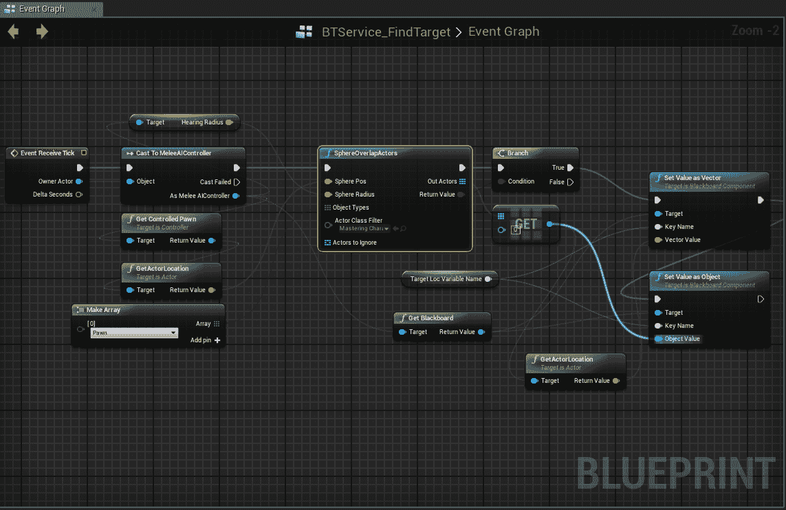

希望到现在为止，这已经很直接了：任何行为树服务的拥有者都是 AI 控制器。然后我们从那里获取我们的听觉半径，并对任何 MasteringCharacter pawn 进行球面扫描，如果我们找到了一个，我们就设置目标和目标位置变量（通过名称！）以更新到玩家位置。正如其名所示，黑板是一个可以发布来自各种外部位置的数据的地方，然后行为树可以直接内部访问。只需把它们想象成使用键/值对的变量持有者。

现在我们已经完成了这些，我们可以创建一个超级简单的行为树。首先，确认根的详细信息中的黑板设置为 MeleeBoard。接下来，在其主要编辑区域，向下拖动行为树的根并添加一个选择节点。关于选择器和顺序器的快速思考方式是，两者都执行一系列任务（当然，可以有子选择器和顺序器），但选择器从左到右运行其子节点，直到有一个成功（然后它返回控制权到树的上层）。选择器从左到右运行，直到其子节点之一失败。在这个选择器上，右键单击其节点并点击“添加服务”。当然，我们将选择我们的查找目标服务并点击它，这样我们就可以在其详细窗口的属性中直接删除随机时间间隔（设置为 `0.0`），使其每半秒运行一次。最后，从选择器拖动，选择一个任务并使用 MoveTo，在其详细窗口中设置其黑板键为 TargetLocation，并将其可接受半径设置为 100.0，这样她就不会太靠近而感到不舒服：

关于导航的说明：要生成这里行为使用的 nav-mesh，我们需要在级别中添加一个 NavMesh 体积，并使其覆盖你希望 AI 能够穿越的所有地方。从现在开始，添加这些体积（或在更详细的区域添加多个）应该是标准做法。将在 *进一步阅读* 部分添加一个关于 NavMesh 体积的快速链接。

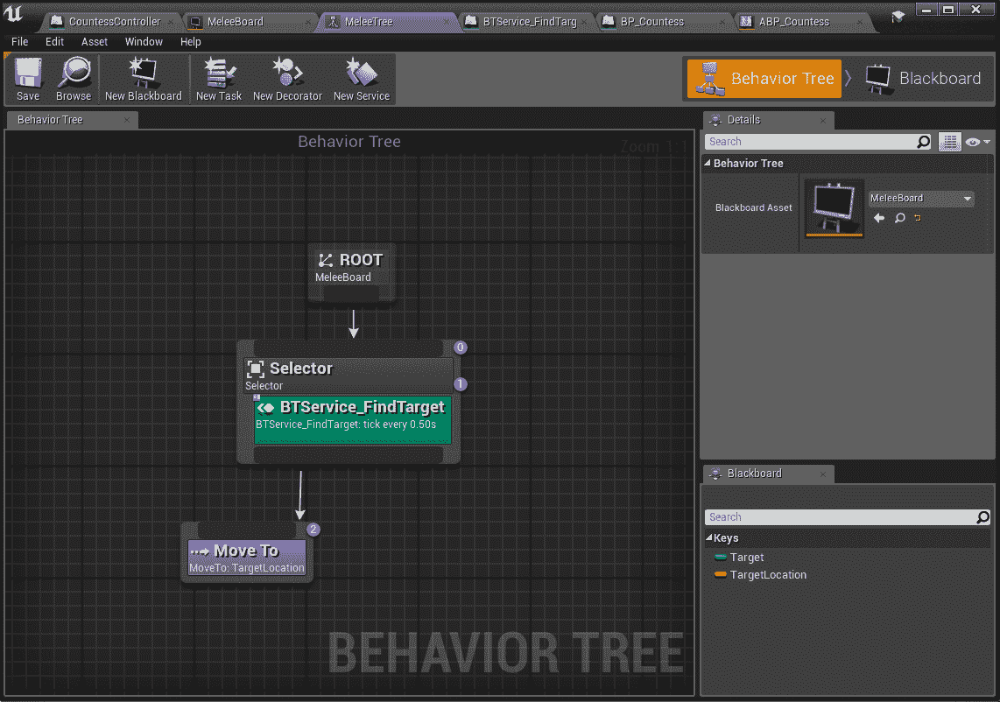

就这样！直接将 `BP_Countess` 拖动到你的等级中，无需进行适当的动画或平滑转向，她应该会跟随你在地图周围移动！我们在这个工作中已经达到了一个重要的检查点，这将在 GitHub 项目中得到体现。

# 将 C++ 决策添加到行为树中

下一个过程涉及将一些逻辑和感知从蓝图移出，进入 C++。这有几个原因可能很有价值。虽然黑板概念运行得很好，但它可能难以管理，有时甚至比典型的蓝图调试更难调试。如果一个变量突然不是你期望的值，并不总是有明显的追踪原因的方法。因此，在 C++ 中尽可能多地拥有合理的逻辑总是有帮助的。在这个例子中，我们实际上是将听觉检测和目标设置从前面的任务移到了 C++。

总是有利和不利的一面。例如，我们在这里的工作中不会真正获得新的功能，但随着复杂性的增加，我们获得了更可扩展的性能和更易于调试。如果不需要进一步的复杂性，那么最好在我们上一次停止的地方结束，并称之为一天。一个主要问题出现在同步两个层面，这是你必须做的。作为一个迭代开发的例子，我的第一个本能是使用`OnTargetChange`蓝图事件简单地设置我们的黑板变量，然后让黑板装饰者从目标对象中提取演员的位置。我记得有一次我这样做时遇到了问题：当时间播放开始时，黑板被告知开始，在同一个 tick 中，现在添加到玩家身上的球体将进行初始碰撞查询。当尝试使用边缘驱动的事件来设置目标时，它会在第一帧失败，因为没有黑板来设置变量，并且它将永远不会自行纠正，直到玩家离开听觉球体半径并重新进入。因此，这里最终实施了一个更拉动的混合解决方案，如下所示：

```cpp
public:

        AMeleeAIController(const FObjectInitializer& ObjectInitializer = FObjectInitializer::Get());

        UFUNCTION(BlueprintImplementableEvent)
        void OnTargetChange(class AMasteringCharacter* Target);

        UFUNCTION(BlueprintCallable)
        class AMasteringCharacter* GetTarget();

        virtual void BeginPlay() override;

        UPROPERTY(EditAnywhere, BlueprintReadWrite, Category = "Targeting")
        class USphereComponent* HearingSphere;

        UPROPERTY(EditAnywhere, BlueprintReadWrite, Category = "Targeting")
        float HearingRadius = 1000.0f;

protected:
    UFUNCTION()
    void OnHearingOverlap(UPrimitiveComponent* OverlappedComp, AActor* Other, UPrimitiveComponent* OtherComp, int32 OtherBodyIndex, bool bFromSweep, const FHitResult& SweepResult);

    UPROPERTY()
    AMasteringCharacter* CurrentTarget = nullptr;
AMeleeAIController::AMeleeAIController(const FObjectInitializer& ObjectInitializer)
        : Super(ObjectInitializer)
{
        HearingSphere = CreateDefaultSubobject<USphereComponent>(TEXT("HearingSphere"));
        HearingSphere->InitSphereRadius(HearingRadius);
        HearingSphere->SetCollisionObjectType(ECC_Pawn);
        HearingSphere->SetCollisionProfileName("Trigger");

        HearingSphere->OnComponentBeginOverlap.AddDynamic(this, &AMeleeAIController::OnHearingOverlap);

        bAttachToPawn = true;
}
class AMasteringCharacter* AMeleeAIController::GetTarget()
{
        return CurrentTarget;
}

void AMeleeAIController::BeginPlay()
{
        Super::BeginPlay();

        HearingSphere->AttachComponentTo(GetRootComponent(), FAttachmentTransformRules::SnapToTargetNotIncludingScale);
}

void AMeleeAIController::OnHearingOverlap(UPrimitiveComponent* OverlappedComp, AActor* Other, UPrimitiveComponent* OtherComp, int32 OtherBodyIndex, bool bFromSweep, const FHitResult& SweepResult)
{
        AMasteringCharacter *Target = Cast<AMasteringCharacter>(Other);
        if (Target != nullptr && CurrentTarget != Target)
        {
                CurrentTarget = Target;
                OnTargetChange(CurrentTarget);
        }
}
```

现在这个工作的另一个优点是我们的蓝图 FindTarget 服务简化了很多，因此我们可以每`0.1`秒（或如果需要，每帧）调用它：

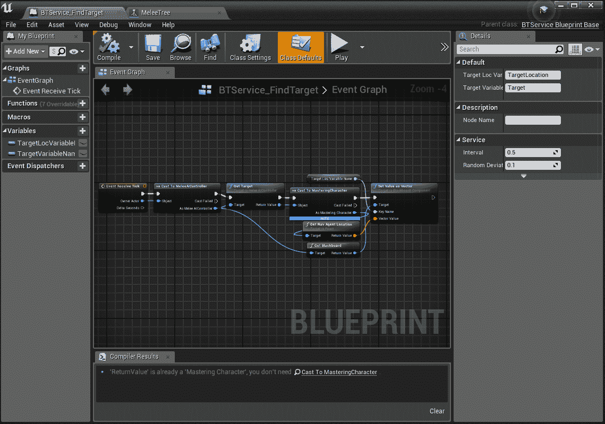

现在你可以看到这个服务只是一个中继器，它接受控制器的目标，并注意它现在也使用 Nav Agent Location，因为这对于导航来说更准确（它通常将目标位置放置在试图导航的代理所在的同一平面上，因此*足够近*的距离现在是二维而不是三维测量，这更加直观）。

虽然这只是一个相对简单的改动，但早期设定这样的先例可以在后期节省大量时间。此外，请注意，在 CountessController 蓝图更改 Hearing Radius 值不会立即改变蓝图中的听觉球体值，但当一个新实例被生成时，构造函数确实会使用这个新值来为新实例设置正确的半径。为了在默认级别进行快速测试，现有的伯爵夫人被移动到最右边，现在只有当她距离玩家 6 米时才会被警报。

# 攻击玩家

这一节听起来似乎很简单，但在设计过程中，你需要填补几个缺失的部分：

+   一个详细的动画蓝图，可以在移动和攻击时切换敌人的状态

+   敌人被伤害和击杀的能力

+   决定如何以及在哪里解决攻击成功（武器边界，即在前方敌人面前进行一帧锥形测试，也就是说，击中玩家需要有多真实？）

第二步通常涉及更多我们 UI 部分的工 作，玩家也应该能够被杀死并重生，但这些应该在所有其他课程之后才能完成，这里不会深入探讨。关于在敌人头上显示健康条等内容，请参阅章节末尾“进一步阅读”部分中关于 3D 小部件的链接。第三步对游戏复杂度相当主观：这将是一个玩家同时对抗多个敌人，还是 NPC 相互战斗，或者更多的是 1-3 个敌人一次对抗玩家的情况，给玩家带来绝对的真实感是关键？

因此，作为对 GitHub 上这次整体工作的增量检查，以下是一些需要注意的点，为我们的最终版本做好准备：伯爵夫人的动画蓝图现在设置为在移动时奔跑，她移动到攻击半径，如果被拖得太久没有达到目标，现在会回到起始位置，并且为视觉和潜行角色的极大减少听觉半径添加了新的感知模式：

```cpp
void AMeleeAIController::OnHearingOverlap(UPrimitiveComponent* OverlappedComp, AActor* Other, UPrimitiveComponent* OtherComp, int32 OtherBodyIndex, bool bFromSweep, const FHitResult& SweepResult)
{
        AStealthCharacter* StealthChar = Cast<AStealthCharacter>(Other);
        if (StealthChar != nullptr)
        {
                if (StealthChar->IsStealthed())
                {
                        return; // we let the stealthed sphere deal with these
                }
        }

        SetPotentialTarget(Other);
}

void AMeleeAIController::OnStealthHearingOverlap(UPrimitiveComponent* OverlappedComp, AActor* Other, UPrimitiveComponent* OtherComp, int32 OtherBodyIndex, bool bFromSweep, const FHitResult& SweepResult)
{
        SetPotentialTarget(Other);
}

void AMeleeAIController::OnSightOverlap(UPrimitiveComponent* OverlappedComp, AActor* Other, UPrimitiveComponent* OtherComp, int32 OtherBodyIndex, bool bFromSweep, const FHitResult& SweepResult)
{
        APawn* Owner = GetPawn();

        if (Owner == Other)
        {
                return;
        }

        FVector ToTarget = Other->GetActorLocation() - Owner->GetActorLocation();
        FVector Facing = GetPawn()->GetActorForwardVector();

        if (SightAngle > 90.0f)
        {
                UE_LOG(LogTemp, Error, TEXT("Sight Angles of 90+ degrees not supported, please use hearing for this detection!"));
                SightAngle = 90.0f;
        }

        if (FVector::DotProduct(ToTarget, Facing) < 0.0f)
        {
                return;
        }

        float DotToTarget = FVector::DotProduct(ToTarget.GetSafeNormal(), Facing.GetSafeNormal());
        float RadiansToTarget = FMath::Acos(DotToTarget);
        float AngToTarget = RadiansToTarget * 180.0f / PI;

        if (AngToTarget < SightAngle)
        {
                SetPotentialTarget(Other);
        }
}

void AMeleeAIController::SetPotentialTarget(AActor* Other)
{
        AMasteringCharacter* Target = Cast<AMasteringCharacter>(Other);
        if (Target != nullptr && CurrentTarget != Target)
        {
                CurrentTarget = Target;
                OnTargetChange(CurrentTarget);
        }
}
```

一个可能的改进是也对玩家进行视线测试。这不是一个困难的任务，但玩家可能会期望或可能会在将来没有添加它时将其视为一个错误。注意以下变化：

```cpp
void AMeleeAIController::BeginPlay()
{
        Super::BeginPlay();

        HomeLocation = GetPawn()->GetNavAgentLocation();

    HearingSphere->AttachToComponent(GetRootComponent(), FAttachmentTransformRules::SnapToTargetNotIncludingScale);
    StealthHearingSphere->AttachToComponent(GetRootComponent(), FAttachmentTransformRules::SnapToTargetNotIncludingScale);
    SightSphere->AttachToComponent(GetRootComponent(), FAttachmentTransformRules::SnapToTargetNotIncludingScale);

        OnReturnedHome();
}
```

`OnReturnedHome`将所有球体的半径设置为它们的设置变量长度，在构造函数中调用`SetReturningHome`，将它们全部减少到零。我在测试中注意到，如果在`BeginPlay`中的`Attach`调用之前让它们执行碰撞，那么在游戏的第一帧，如果你让它们执行碰撞，你会在世界原点与球体发生碰撞。这两个函数也用于一个新的行为树任务：

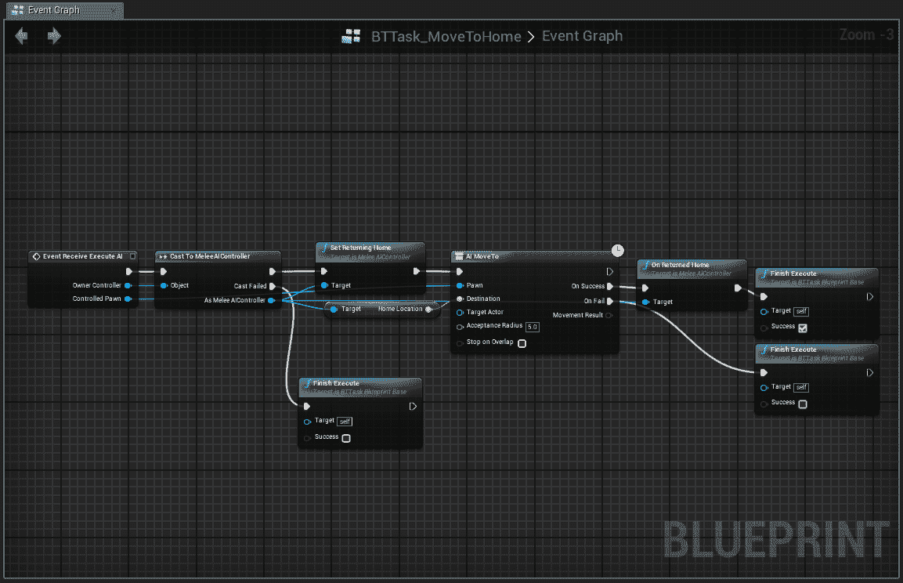

为移动到目标添加了一个非常类似的新任务，因此我们不再需要担心蓝图或更新它（并且可以完全删除旧的任务查找服务），如我们新树中内置的 5 秒 kiting 流程所示：

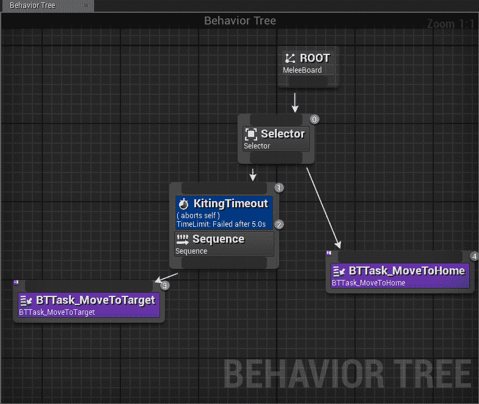

在默认地图中测试 kiting-timeout 的最简单方法就是吸引无数敌人的注意，跑到之前添加的移动平台上，并在之后保持在箱子顶部。一旦 5 秒内没有达到玩家通过（如果你小心的话，也可以通过从地图的一边跑到另一边来做这件事），你就会看到流程切换到移动到家的状态！

现在需要的最后部分是切换伯爵到攻击状态并对玩家造成伤害的方法，即使那些伤害的结果尚未处理。为了完成这个任务，我们需要在我们的动画实例中添加一个变量，并从行为树的任务中设置该变量。我们还需要一种方法来说明伯爵可以攻击，我们将在行为树中创建一个等待节点。最后需要的是快速处理伤害的方法，所以我们将向她使用的攻击动画中添加一个事件，当该事件触发时，我们检查玩家是否在她前面，如果是这样，她就会击中玩家。

将 C++类与所需状态同步的最直接方法是在控制器类中放置一个枚举，并使其具有对动画实例的引用，并在其上设置变量。这种方法有缺点，即这些更新在不同的线程上。而且，这些更新甚至不是确定的，所以你可能会有一个 C++控制器更新，动画实例更新，动画实例再次更新，然后是 C++控制器再次更新，反之亦然。所以如果你选择让 C++逻辑决定动画蓝图的状态，请注意，在想要改变和另一个认识到它之间可能会有多达 2 帧的延迟。如果你直接从动画蓝图更新那个状态，确保始终有一个更新点，通常是控制器，并且强烈建议将其作为一个队列，在帧之间同步，然后继续到下一个队列条目。

由于我们的 AI 相当简单，我们将在其蓝图上添加一个攻击布尔变量，然后我们需要一个新的行为树任务，就像之前一样，看起来是这样的：

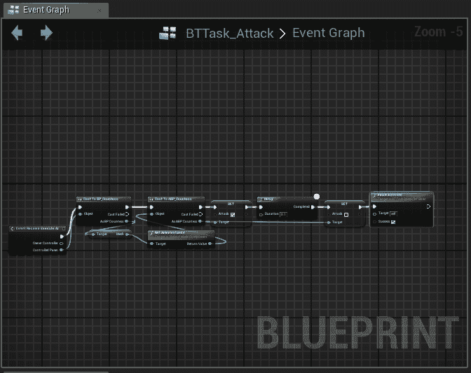

注意，它只是将我们设置为动画蓝图中的攻击状态，等待一段时间，然后清除它（这样在它完成后我们不会立即重新进入）。并且树有一个相当简单的更新，如下所示：

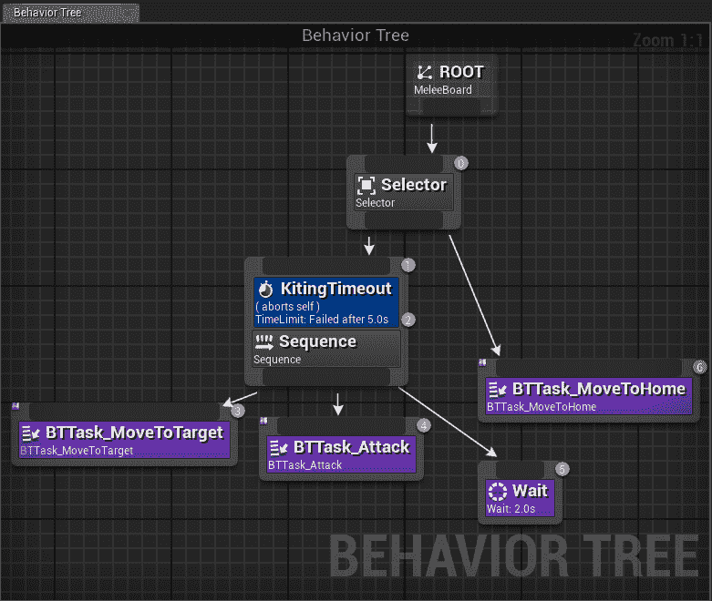

攻击后的等待时间是冷却时间，所以你会看到我们的伯爵在攻击玩家时等待那个时间，如果她在范围内，或者如果她不在范围内，她将移动到目标节点后延迟移动。

当然，动画蓝图必须反映这些，所以再次添加一个攻击布尔蓝图变量，并使转换看起来像这样（我们等待攻击动画接近结束时返回空闲状态，如果是从空闲或移动状态，当行为树设置我们的攻击变量时，我们进入攻击状态）：

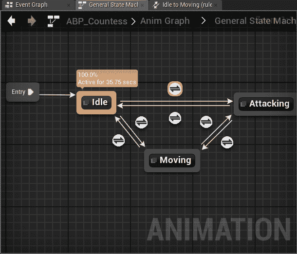

因此，AI 攻击的剩余部分只是查看我们是否击中了角色。再次强调，由于篇幅原因，玩家死亡和 UI 在此处未涵盖，但在完成这项工作后应该相当简单。我们现在需要的只是一个攻击动画的通知事件，一个处理此事件的动画蓝图事件，以及控制器上的一点点逻辑，所有这些都在蓝图上。所以，首先转到控制器并添加此蓝图函数：

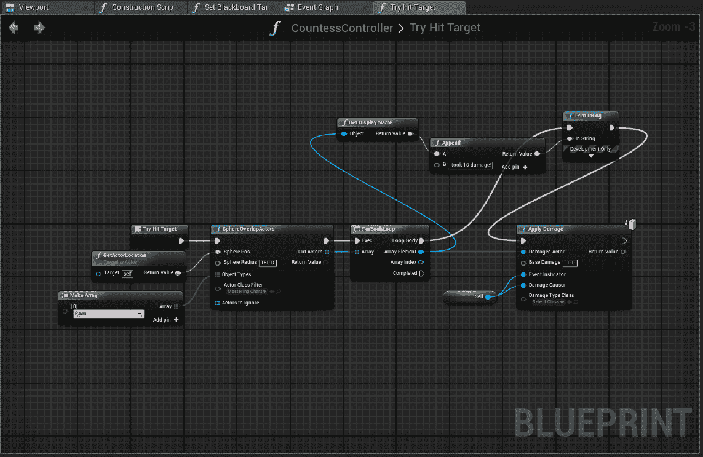

如您所见，当玩家在伯爵夫人前方 1.5 米或更近时，这将在屏幕上显示，因此被击中，以及受到多少伤害。再次强调，将此转换为游戏以杀死并重新生成玩家应该在这个阶段相当简单。接下来，转到动画（在动画蓝图中的攻击节点中设置的是`Primary_Attack_A_Normal`）并右键单击时间轴，在底部单击“添加新通知”，并命名为：

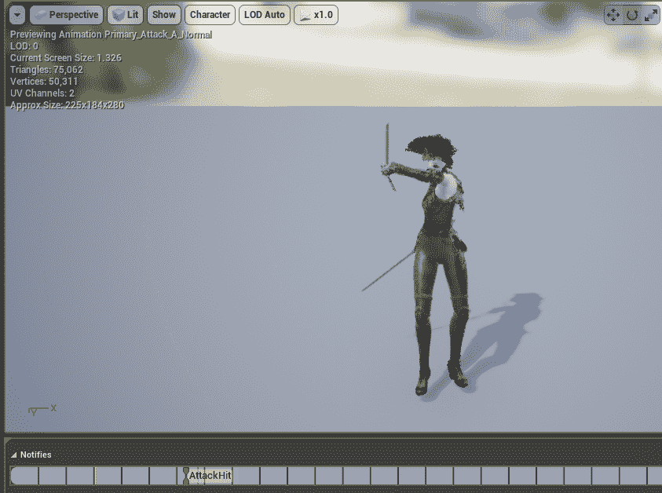

然后转到动画蓝图的事件图，右键单击以添加一个通知事件：

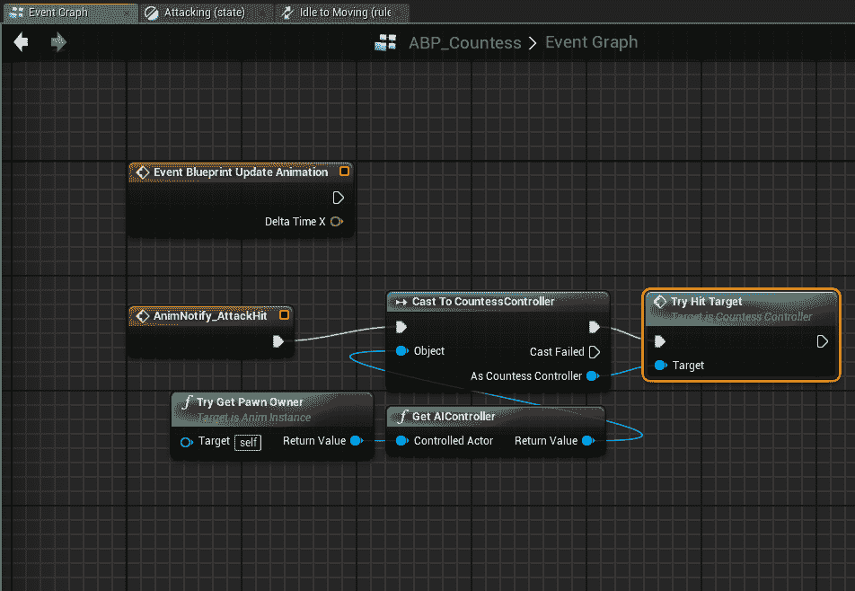

因此，我们的 AI 追逐玩家，在间隔时间内攻击，当被风筝时跑回家，并且在击中完成时传递受到的伤害。恭喜，我们有一个功能齐全的 AI 敌人（在下一段中添加一些改进）！而且，像往常一样，这些最新的更改都在 GitHub 上，所以请随意在那里详细检查所有这些更改。

# 更精致的战斗 - 生成点、击中反应和死亡

因此，我们现在有一个喜欢追逐我们的玩家并试图伤害他们的 AI，这很好。但在这个阶段，我们的玩家几乎无法与那个敌人互动。我们将通过从生成点演员生成敌人而不是直接在级别中放置它们来使事情更加专业（这样我们就可以生成多个敌人，等待它们被触发，等等），当它们被射击时让它们做出反应（这不应该打断它们的其它活动，而只是通过混合动画叠加在它们上面），当然，能够杀死它们（并且当加载/保存时反映所有这些）。

# 敌人放置的生成点

生成点是在处理大多数射击游戏时非常有用的工具。在多人游戏中，玩家在重生时使用它们，AI 通常以波或固定数量冲向前方，对玩家构成挑战。在这里，我们将快速简单地创建一个生成点，将实例放入默认级别，并测试一切是否正常。首先，在 AI 文件夹中，右键单击并创建一个新的蓝图类，这里命名为 Countess Spawner。

这里的逻辑是，当玩家重叠盒子时，我们通过使用一个简单的场景组件和一个附加的横幅（设置为仅编辑器使用并在游戏中隐藏）在想要的位置生成我们的伯爵夫人实例。然后我们有一些逻辑来生成 BP_Countess 类型，并保持已生成实例的数组，当它们死亡时更新该数组，并且只有当数组低于并发计数变量时才会生成：

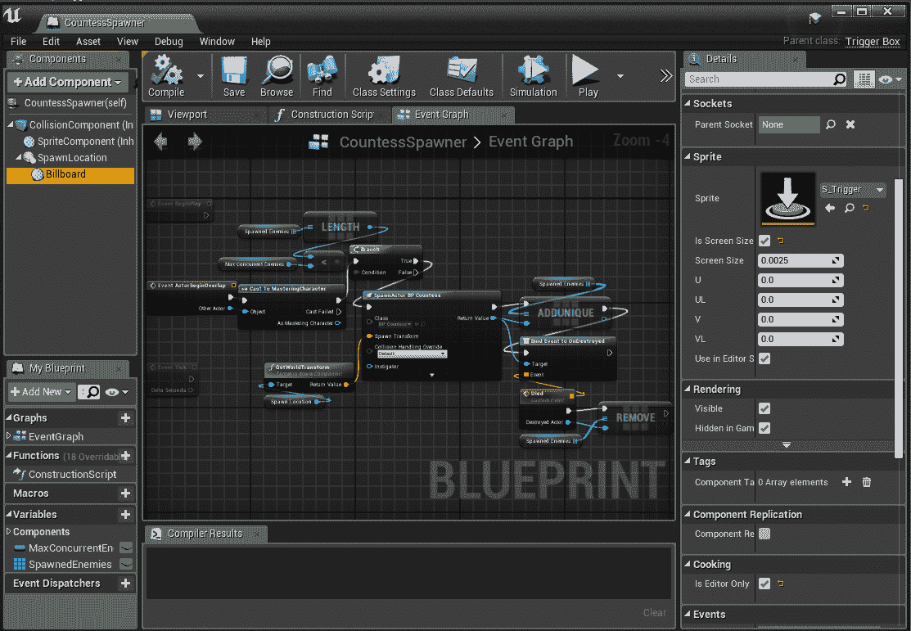

如地图所示，这个缩放版本被放置在一些盒子之间，其生成位置移动到地图的角落，以便当玩家穿过这些盒子时，在角落出现一个伯爵夫人，但最多只能有三个，直到其中一个被杀死，然后另一个被允许。注意，为了做到这一点，我们必须对我们的控制器进行一些关键更改。首先，删除`BeginPlay`函数，并用`Possess(APawn* InPawn)`替换它（保持内容不变）。

这是因为`BeginPlay`可能在拥有生成的兵卒的过程之前被调用（并且将会被调用）。同样，在`OnSightOverlap`中也添加了一个空检查，出于同样的原因（组件可能在设置拥有者兵卒之前测试击中）。接下来，在 BP_Countess 本身中，将其自动拥有属性设置为放置在世界中或已生成，以便 AI 控制器实际上可以运行。注意，还有一个特定的从类蓝图节点，类似于生成演员，但它以稍微不同的方式做事，并且由于我们的大部分工作已经由我们的控制器完成，因此自动处理是这里最好的选择。

这应该就是我们的生成点。当然，它们可以通过波生成、随机生成位置、计时器或任何对游戏有意义的逻辑和有趣的方式变得更加复杂。但重要的是，现在这可以在任何地方重用，理论上可以生成大量的有趣遭遇，涉及各种 AI。

# 击中反应和死亡

到目前为止，你可以随意射击我们的伯爵夫人，但没有任何有趣的事情发生。我们将通过修改我们的投射物的一些代码以及一些可以捆绑到近战控制器中的显著逻辑来解决这个问题。快速浏览一下，我们将向近战控制器添加一个健康参数，如下所示：

```cpp
UPROPERTY(EditAnywhere, BlueprintReadWrite, SaveGame, Category = "Health")
float Health = 100.0f;
```

然后修改投射物的击中效果，如下所示：

```cpp
void AMasteringProjectile::OnHit(UPrimitiveComponent* HitComp, AActor* OtherActor, UPrimitiveComponent* OtherComp, FVector NormalImpulse, const FHitResult& Hit)
{
        // Only add impulse and destroy projectile if we hit a physics
        if ((OtherActor != NULL) && (OtherActor != this) && (OtherComp != NULL))
        {
                AController* controller = GetInstigatorController();
                AActor* damager = GetInstigator();
                FDamageEvent DamEvt;

                OtherActor->TakeDamage(DamageAmount, DamEvt, controller, damager != nullptr ? damager : this);

                if (OtherComp->IsSimulatingPhysics())
                {
                        OtherComp->AddImpulseAtLocation(GetVelocity() * 100.0f, GetActorLocation());
                }
                else if (Cast<APawn>(OtherActor) != nullptr)
                {
                        Destroy();
                }
        }
}
```

在武器中生成投射物时，添加以下行：

```cpp
ActorSpawnParams.Instigator = Cast<APawn>(GetOwner());
```

然后为了让我们的伯爵夫人对击中做出反应并死亡，我们需要在控制器蓝图和动画蓝图中添加一些东西。首先，让我们来做控制器：

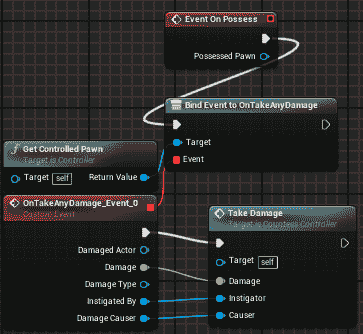

这样，当兵卒受到攻击并受到伤害时，控制器会收到通知，受到伤害函数（通过创建逻辑，然后右键单击所有这些逻辑节点并选择“折叠到函数”来创建）看起来是这样的：

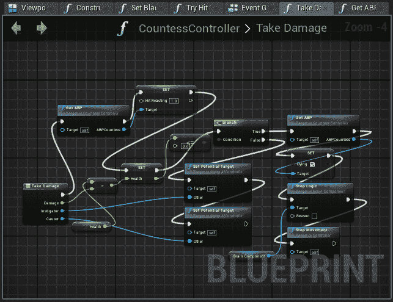

Get ABP 函数只是获取我们的受控 NPC，将其转换为 BP_Countess，获取其动画实例，并在输出（返回）节点中将它转换为 ABP_Countess。Hit Reacting（浮点数）和 Dying（布尔值）变量也直接添加到 ABP_Countess 中，并按以下方式使用：

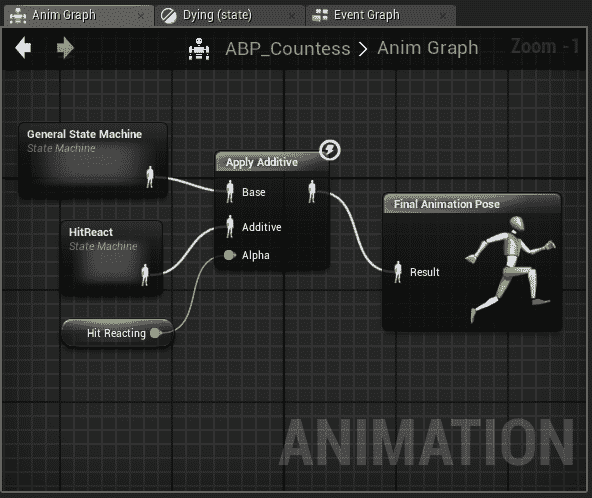

HitReact 状态机只有一个状态，它所做的只是播放伯爵夫人的击中反应（正向）动画。将 APply Additive 混合插入我们的根图中，并将此变量作为权重，将其混合进去。这是一个加性动画，所以你可以看到在这个阶段当她受到伤害时，她的头部会猛地一跳，但她的其他动画仍然正常进行，完美。在动画的末尾，添加了一个新的通知，并在事件图中为这个事件清除混合到`0.0`。

以及死亡：

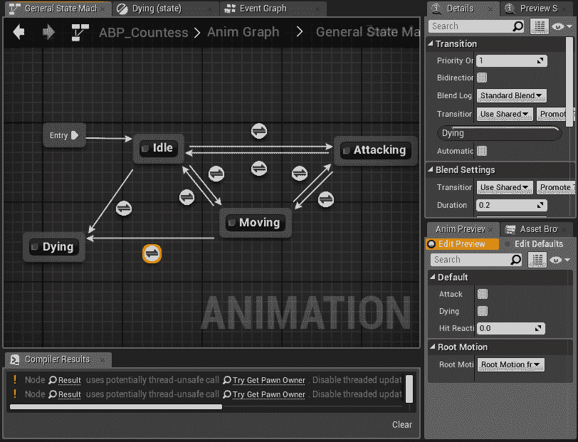

注意单向转换——一旦死亡就无法返回。这个主图节点只播放伯爵夫人的死亡动画，并在其结束时添加了另一个通知。在事件图中，当该事件被触发时，尝试获取拥有者 NPC 的行为会被销毁。现在，伯爵夫人受到伤害，做出反应，然后死亡，这是我们希望 AI 能够做到的大部分事情！

# 加载/保存说明

加载和保存 AI，在这种情况下，不是一个简单的选择。在这种情况下，我将大部分逻辑移到了生成器，所以如果它们直接放置在级别中，损坏的 AI（例如）的保存将不起作用。你可以通过在 BP_Countess 中设置演员保存接口来撤销这一点，但这样，就没有办法正确修复生成器以使其与它们生成的 AI 有链接。

作为一般规则，就像这里所做的那样，如果你能让你的 AI 从它在世界中的出生点恢复其状态，你将比试图保存它在保存时的每一个细节要好得多。当然，这可能会导致滥用（例如，一个 AI 在保存时即将发动一次非常强大的攻击，然后加载时又回到空闲状态并开始正常攻击），但随着 AI 复杂性的增加，加载/保存的复杂性可能会变得非常糟糕。如果可能的话，将 AI 放入世界并让它自己决定接下来应该做什么，就像我们在我们的生成器类中所做的那样。

我们的伯爵生成器添加了两个新的变量，一个位置数组和一个健康值数组。这些在保存时存储，并在生成器的蓝图中将它们设置为 SaveGame 变量，就像我们之前为移动平台的状态所做的那样，并在加载时重新生成和恢复。这确实需要将演员保存接口添加到生成器中（再次，就像我们对平台所做的那样），并标记这两个变量，但还需要向保存的演员接口添加一个新的本地事件：

```cpp
UFUNCTION(BlueprintNativeEvent, BlueprintCallable, Category = "Load-Save")
void ActorSaved();
```

然后，我们在保存时调用它，就像我们为加载版本所做的那样，目前是在`MainMenuWidget.cpp`的`SaveGame`函数的大约第 82 行：

```cpp
ISavedActorInterface::Execute_ActorSaved(Actor);
```

现在在伯爵生成器中，触发这些事件（在类设置中添加界面，就像之前一样），我们可以添加两个新功能，一个用于加载伯爵，一个用于保存。首先，让我们看看保存：

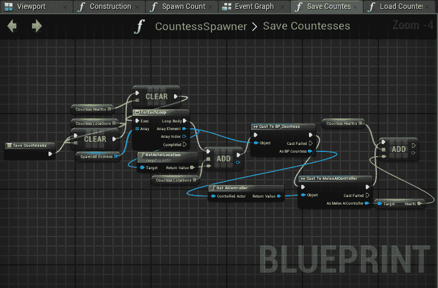

然后我们有加载事件：

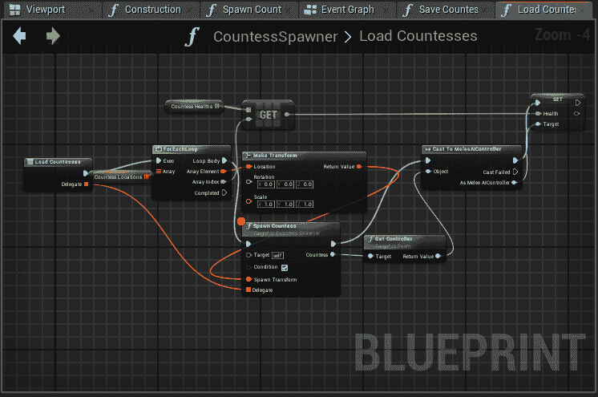

哼！我们的伯爵夫人现在在正确的位置，拥有正确的健康状态，但她们可能不在我们保存她们时 AI 的精确步骤上，但她们会很快调整。这里的一个已知问题是，如果 AI 在死亡时被保存，它需要再次受到伤害才能再次开始死亡，但通过一些特殊的工作，这也可以得到解决。但总的来说，我们现在有一个完全功能的 AI，它会追逐玩家，伤害玩家，可以受到伤害并对打击做出反应，死亡，并且可以合理地加载和保存。

# 摘要

因此，这又是一个充满许多许多变化和新内容的风暴章节。从我们之前的位置来看，我们现在有一个功能齐全、外观出色的敌人，其表现正如我们在精良的游戏中预期的那样，并且还能保存我们的进度。这是在制作严肃游戏方面的一次又一次的飞跃。在所有这些之后，有些人可能会问：Epic 有没有内置的 AI 感知系统？是的，他们确实有，你完全可以探索；但大多数情况下，需要一个自定义和可调试的版本，我们在这里已经详细地实现了。尽管如此，如果内置的感知及其事件对你的项目来说非常完美，那么确实可以考虑它们。但在制作 AI 的整体工作量中，编写自己的感知代码可能是要求较低（而且说实话更有趣！）的部分。所以，现在我们有了坚实的游戏核心，我们如何策略性地从一级跳到另一级，或者通过一个比这些测试级别有更多内容的大型世界呢？嗯，这就是下一个问题！

# 问题

1.  制作 UE4 中的适当 AI 需要哪三个主要类？

1.  黑板在 AI 逻辑中有什么作用？

1.  目标选择是如何从 C++引入我们的行为树的？

1.  行为树中序列器和选择器之间的区别是什么？

1.  行为树是如何得知它应该攻击并停止向玩家移动的？

1.  随着蓝图逻辑复杂性的增长，有什么好方法来划分逻辑的各个部分？

1.  AI 生成器为游戏设计带来了哪些优势？

1.  完美的 AI 状态加载/保存与简单的加载/保存和逻辑恢复状态之间的权衡是什么？

# 进一步阅读

导航网格信息：

[`docs.unrealengine.com/en-us/Resources/ContentExamples/NavMesh`](https://docs.unrealengine.com/en-us/Resources/ContentExamples/NavMesh)

3D 小部件：

[`docs.unrealengine.com/en-us/Engine/UMG/HowTo/InWorldWidgetInteraction`](https://docs.unrealengine.com/en-us/Engine/UMG/HowTo/InWorldWidgetInteraction)
