# 在游戏中获取音频

# 简介

音频是游戏中经常被忽视的组件，通常只有在做得不好时才会被注意到。虽然不像图形和游戏玩法那样突出，但考虑到它可能会破坏体验或增强体验，所以最好追求后者。 想想一个动作或恐怖电影，当音量被静音时，你就能感受到音频有多么重要！ 在本章中，我们将涵盖：

+   UE4 音频的基本组件

+   从动画触发音频

+   基于材质的音频（包括弹丸和玩家各种脚步声的独特冲击声）

+   环境 FX（通过音量实现的混响）

# 技术要求

本章将广泛使用第五章“添加敌人！”中添加的伯爵角色资产中的音频资源，但使用类似资产也可以跟随这些课程，无需这些特定的资源。

GitHub 章节从这里开始：

[`github.com/PacktPublishing/Mastering-Game-Development-with-Unreal-Engine-4-Second-Edition/tree/Chapter-7`](https://github.com/PacktPublishing/Mastering-Game-Development-with-Unreal-Engine-4-Second-Edition/tree/Chapter-7)

使用的引擎版本：4.19.2。

# 通过动画的基本声音和触发

正如本书的忠实读者所明显的那样，我们已经在游戏中添加了一个声音，它在这里，并且从第一章“为第一人称射击制作 C++项目”以来就一直在这里，我们的 FPS 模板（尽管在第二章“玩家的库存和武器：”中从`AMasteringCharacter`移动到了`AMasteringWeapon`）。

```cpp
// try and play the sound if specified
if (FireSound != nullptr)
{
        UGameplayStatics::PlaySoundAtLocation(this, FireSound, GetActorLocation());
}
```

这是一个播放声音最基本的方式的绝佳示例，而且是从 C++开始的，但我们将尝试在本节中拓展几个新领域，并在下一节中添加基于材质的声音。我们还将添加一个来自 Epic 的专业级别，以展示这些概念。您可以从 Epic 这里找到它（无尽之刃：冰地；我们将使用其包中的冰湾）：


它的大小（接近 2 GB）与伯爵内容的大小相似，所以如果您正在跟进 GitHub 项目，现在开始下载可能最好。

对于 GitHub 用户的一个重要提示！截至本地图上传时，项目设置为使用 GitHub LFS（大型文件系统），如果您不熟悉，您现在不仅需要从 GitHub 进行拉取，还需要执行`pull lfs content`。您会在启动时注意到如果虚幻表示地图文件格式错误的问题。关于 Git LFS 的更多信息请参考附加阅读。

# 声音、提示、通道、对话、FX 音量等！

UE4 提供了一系列基于音频的类，这些类可以从简单的`USoundBase`到复杂的分支对话和特殊应用的 FX 组合。

让我们先浏览一下主要类，以确保清楚已经存在哪些功能。如果您只是右键单击添加资产并在声音飞出菜单上悬停，您将看到如下列表：

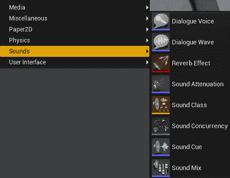

这本身可能会让人感到害怕，所以在我们开始一些更实际的例子之前，让我们快速概述每个效果及其目的。

声音波：这是游戏中声音的最基本级别。虽然它不在“声音”下拉菜单中，但这是通过导入按钮而不是“声音”将声音带入游戏的方式。您将原始声音（例如.wav 文件）导入到您的项目中，并得到一个声音波。这些可以具有各种属性，或用于制作声音提示并进一步设置属性。所有后续项目的一个总结可以像这样：所有进一步的声音设计或音频工程实际上都取决于您游戏的复杂性和需求。然而，声音波是您最基本的起点，并且对于在 UE4 中播放任何音频都是必需的。

对话声音：这些只是指定说话者类型和说话者性别。将声音视为其名称：谁在说话，他们使用什么类型的嗓音？

对话波：这些基本上是指示一个说话者应该如何与另一个说话者互动的指标，通过 DialogContext 对象定义，您可以从一个说话者添加到另一个说话者，以及添加屏幕上的口语文本和字幕覆盖（以及标记内容为成熟）。在下一节中，我们将通过我们的女伯爵在战斗中进行挑衅的演示来快速展示这一版本。对话系统非常适合两个可交互角色之间的简单对话（玩家可以是其中一个或几个），但这实际上只适用于基本的交互。如果游戏设计只需要这些，这是一个完美的选择，应该被利用。关于对话系统的更多信息可以在*进一步阅读*部分找到。

反射效果：反射效果应该由声音设计师利用，但它们的功能是向播放和听到的声音添加基于环境的效果。例如，它们可以用来在洞穴环境中产生一点回声，或者在车辆的内部，为您的声音添加专业和真实的声音效果。这些效果附加到您世界中的音频音量上，告诉环境您的声音应该如何被听到。

声音衰减：与混响效果类似，您可以定义各种衰减设置。环境声音（我们将在后面进一步讨论）可以引用这些对象之一，或者通常可以单独指定。衰减实际上是声音的衰减属性：基于听者的位置，声音如何衰减？例如，在一个有蜿蜒走廊的区域，您会希望声音衰减得更快，以反映声音传播到听者时振幅的损失。再次强调，音频工程师和声音设计师通常非常熟悉这些概念，并且可以将它们应用于产生声音的气氛效果（来自远处的令人毛骨悚然的声音可能播放得很小声，但当靠近玩家时，声音会变得很大）。

声音类别：这是根据声音的预期听感和应用方式来组织声音类型的一种不错的方法，并且它覆盖了所有其他属性。例如，声音可以被设置为忽略混响、忽略衰减（将其设置为 UISound！），或者更改其他属性，如它们的立体声（左右声道）输出，并通过其他声音类别应用于层次结构中。

声音并发：在此对象添加之前，可以通过最大计数和其他属性来限制声音，这些属性将在我们工作时找到。例如，您不会有 20 个 NPC 同时播放脚步声，即使有 20 个 NPC 同时行走，您也会将其限制为 6 个。声音并发对象基于声音的播放者提供更精细的控制。例如，对于前面的例子，您可能希望播放特定类型敌人的所有攻击声音，但只想在任意时刻听到来自另一种类型敌人的有限集。与许多之前的描述一样，这是音频设计师可以使用的伟大工具，但它仅在游戏或游戏区域中真正需要，在这些区域中，声音可能会对玩家造成压倒性影响，并且某些声音应该具有明确的优先级。这些可以像其他属性一样指定给声音波对象。

声音提示：这些有点像播放声音的蓝图。您可以将效果和局部修改器组合到输出中。想象一下，这些就像实际的声音输入（枪声、对话片段等）并详细指定它应该如何组合成最终输出。许多这些选项在此阶段可能看起来有很多重叠，但请考虑它们作为*修改任何声音的方式*，而这一项则是*我们修改特定声音的方式*。声音提示通常很简单，只是将输入直接输出，当然，这个输出本身仍然可以通过全局环境效果设置（或者，再次强调，只为这个声音设置）进行修改。

音频混音：音频混音可以相互推送和弹出，并可以叠加使用，但控制更全局的设置，例如音高、均衡器（从高频到低频的过滤）以及如何将音量应用于例如 5.1 声道中的中心通道或其他高级混音选项。

# 从动画触发声音

在游戏中，最常见的使用情况是在播放动画时触发音频。我们将为我们的女伯爵 NPC 设置几个此类事件，在下一节中，为我们的玩家设置基于材料的脚步声（尽管我们的玩家角色模型没有脚！）。要开始，让我们打开我们的 ABP_Countess 动画蓝图，再次查看她的攻击状态：

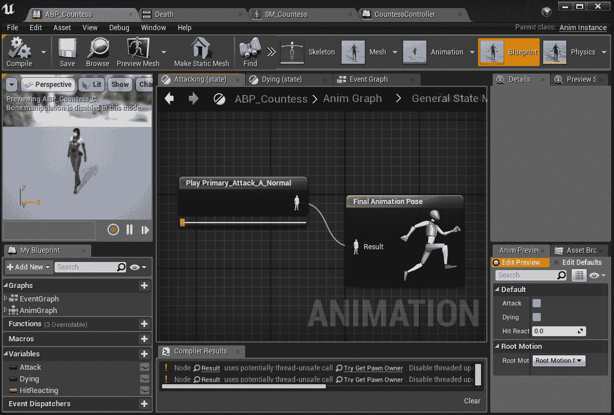

我们现在将使用一个事件来处理 Primary_Attack_A_Normal，使她的攻击不那么令人毛骨悚然。双击攻击动画节点，就像我们之前为尝试击中事件所做的那样，我们将在她的动画中稍早添加另一个事件：

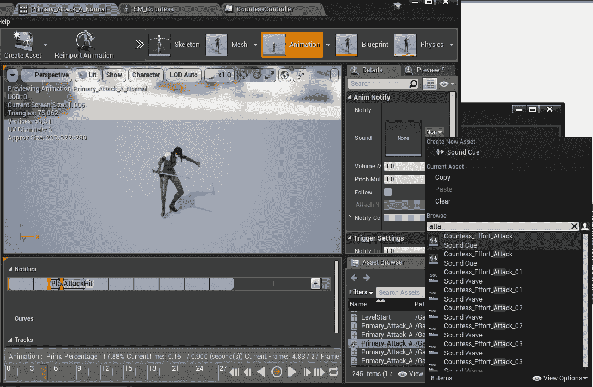

在时间轴底部，我们可以将小红条拖动到我们想要的位置，然后在“通知”时间轴中，右键单击并添加一个播放声音通知。然后，在右侧，过滤并选择我们喜欢的 Countess_Effort_Attack 声音。现在，有两个注意事项：为她设置的声音提示无效，因为项目没有游戏中的全部角色集，并且它们依赖于上一节中提到的对话玩家。所以它们不会播放任何声音。第二个注意事项：声音波对象当然可以单独工作，但如果我们想混合它们，我们可以像之前为攻击击中事件所做的那样，创建一个正常的动画通知，设置一些蓝图逻辑以随机选择一个声音波，并播放它。现在，我们选择了 attack_01，所以现在她在游戏中制造噪音，我们可以在我们的关卡中测试它。

对于跟随教程的人来说，在这个阶段项目有一些清理工作：重命名以更好地反映我们资产当前的状态，并将我们的一些其他类更新到最新。如果你现在正在同步，你可能会注意到《无尽之刃》武器现在有自己的投射物，看起来就像它们的实际武器，并赋予它们更多投掷武器的手感，有助于在未来的工作中进一步区分它们。

如果你好奇这些投射物的静态网格是如何制作的，打开我们制作的任何这些武器的骨骼网格演员，在主工具栏顶部有一个“制作静态网格”按钮。当你不想导入单独的模型或没有访问原始资产但需要静态网格版本时，这非常方便，就像这里一样。

如果你在这个时候玩游戏，你会注意到我们的伯爵夫人的攻击声音变得非常重复，而且整体感觉还是有点基础。鉴于这个角色包含的大量精彩资产，我们现在将随机化她的攻击，为每个攻击分配其自己的声音（我们也可以在每次播放相同的攻击时随机化声音），并且给她一些偶尔针对玩家的嘲讽对话。让我们从打开我们的 ABP_Countess 动画蓝图开始。在这里，在攻击状态中，我们将从播放单个动画改为通过随机序列播放器播放。如右图所示，你可以添加你喜欢的任意数量的动画序列，设置它们被选中的相对概率，开启随机模式，设置循环播放，等等：

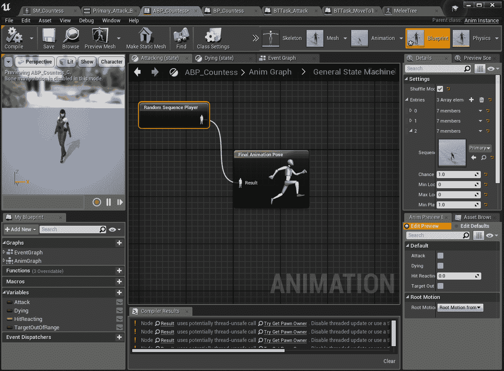

然而，一旦我们这样做，就不能再依赖特定动画的播放时间作为我们的退出过渡了，我们需要一种新的方式来从这个状态退出。我们需要在左下角添加一个新的变量：TargetOutOfRange。这个变量在这里用来让我们从持续攻击序列中退出，并移动去追逐玩家（或者如果我们花费的时间太长，就跑回家），就像正常一样：

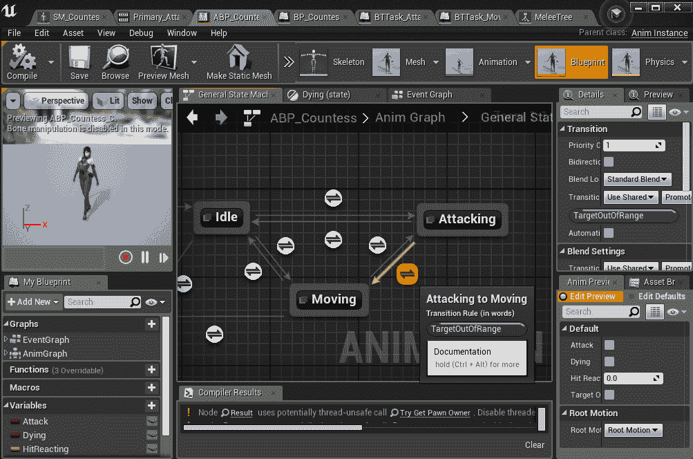

这需要我们修改攻击行为树任务，在 MoveTo 成功后添加此函数：

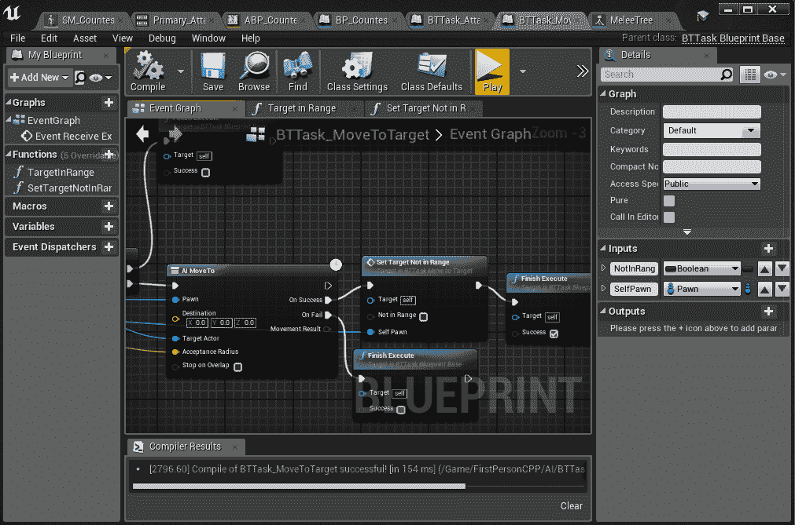

被调用的函数相当简单，所以这里省略了。它只是从 pawn 进行所有 case 处理，获取动画蓝图，然后将其超出范围变量设置为传入的值。正如 GitHub 项目中所见，每次我们进入移动到行为任务时，这个变量都会被标记为 true，所以只有在我们的 AI MoveTo 成功（除非玩家移出接受半径）的每次函数调用中才会将其设置为 false。作为额外的奖励，你可以在使用的三个动画序列中的最后一个看到，这里选择的声音提示有三个对话条目，并随机选择一个。所以，我们有三个随机攻击，每次使用时第三个攻击都会从三个随机声音中选择。这是我们选项的一个完美例子。

最后，我们将快速制作一个嘲讽，有部分概率会播放。注意，它可以连续播放多次，但有很多工具可以防止这种情况。为了让伯爵夫人有 10%的概率播放嘲讽，我们在攻击行为任务的末尾添加了这个对话设置（并且请注意，为我们的潜行角色添加了一个具有默认设置的 DialogVoice）：

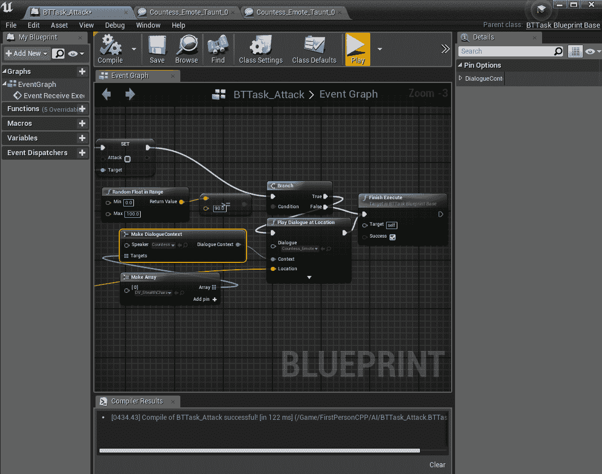

注意，无论选择哪个对话波形（在这种情况下是 Countess_Emote_Taunt_010_Dialogue），你都需要打开它，并确保说话者设置为正确的类型（我使用的是非 Vamp 版本），并添加潜行角色（在左下角的数组中指定）作为听众。就这样：随机的攻击，新的声音，随机的对话，和随机的嘲讽！

# 环境和声音

到目前为止，我们的声音对它们播放的位置或原因并不敏感。现在我们将迅速为几种我们的投射物可能击中的物体类型添加声音，以及一些玩家的脚步声，只是为了证明我们的物理材料方法正在起作用。与在 Unreal Marketplace 中免费提供的某些惊人的视觉资产相比，找到类似地免费共享的常见声音库要困难一些，但我们会充分利用我们所拥有的资源，并意识到在一个完整制作的游戏中，许多声音将由专门的声音设计师制作，或者至少希望有预算来购买现有的商业库。

# 击中不同的表面

使用我们的投射物击中物体是最容易快速设置的声音，但随后，我们需要在我们的投射物类中添加新的功能，以确保每个投射物在击中每种表面时都知道播放什么声音。随着表面类型（物理材料）和具有独特声音的投射物数量的增加，维护这项工作可能会变得相当繁重，但这也是一种细致入微的工作，它将商业成功的游戏与不那么专业的演示或独立游戏区分开来，后者没有花时间添加这些细节。

我们将从项目中需要解决的最基本的问题开始：设置材质类型。在这里的工作中，我们只将设置两种类型，但当然，你可以遵循这个模式，为每种类型创建尽可能多的类型。首先，打开项目设置，在 Engine/Physics 下，我们将添加雪和石头，如下所示：

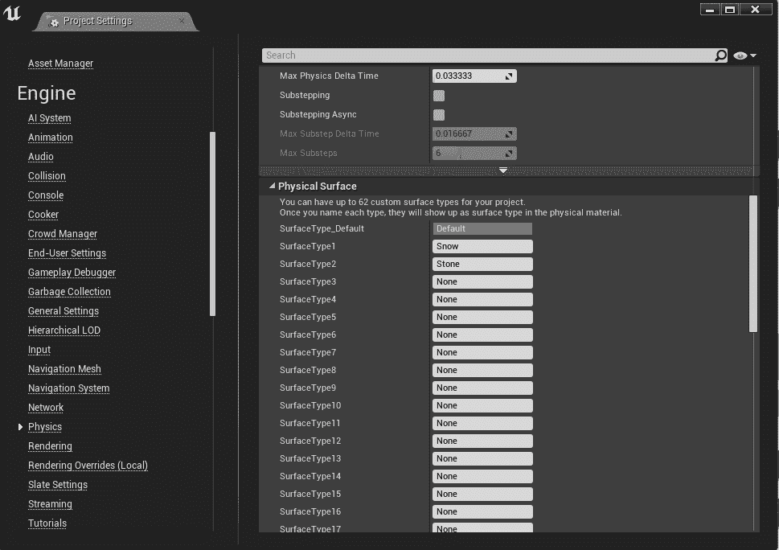

在 FirstPerson/Audio 部分，我添加了几个声音提示，但它们只是项目中已有的声音的 FX 修改版本，因为正如所注，在 Unreal Marketplace 中没有具体的明显免费下载：

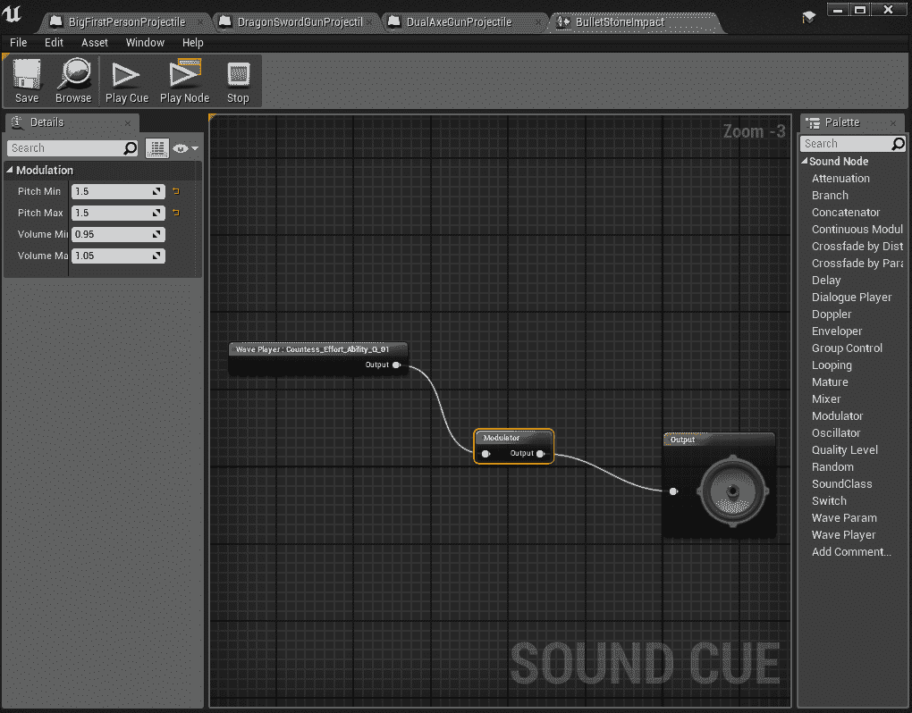

重要提示！如果在当前阶段（或任何未来的阶段）这些声音令人烦恼（它们对我而言就是这样！），请前往 GitHub，并从本章（将用于所有后续版本）中 cherry-pick 7ff24f7 次提交（其中包含本章中所有冲击的相对较好的打击声）。拥有合成器和引入一些.wav 样本是一个很大的优势，但请记住：在任何情况下，如果你不确定，你必须检查任何此类资产上的许可。即使是生成声音的硬件，如果直接使用，也可能在商业产品中包含一些许可！

接下来，对于投射物，我们需要一种方法来匹配材质类型和被击中的表面。目前，我们将在投射物头文件中创建一个结构体。我们将添加这两个属性：

```cpp
USTRUCT(BlueprintType)
struct FPhysSound
{
        GENERATED_USTRUCT_BODY()

        UPROPERTY(EditAnywhere, BlueprintReadWrite)
        TEnumAsByte<EPhysicalSurface> SurfaceType;

        UPROPERTY(EditAnywhere, BlueprintReadWrite)
        class USoundCue* SoundCue;
};
```

当然，我们的投射物还需要这些的数组：

```cpp
UPROPERTY(EditAnywhere, BlueprintReadWrite)
TArray<FPhysSound> ImpactSounds;
```

正如所述，当物理表面类型和投射物的复杂性越来越大时，维持这样一个系统可能会变得难以控制。即使在这里的小集合中，如果早期做出的决策意味着在进展过程中进行更改，而不是将更改反装到大量单个资产上，那么尽早做出这些决策总是更好的。目前的复杂度是可管理的，但如果它增加到显著更大的数量，即将要做的工作将会非常痛苦，错误的可能性也会增加。在这种情况下，我建议也许可以在 Unreal 中创建一个 DataTable，并在.csv 电子表格或类似文件中跟踪大型更改。关于这方面的更多信息可以在*进一步阅读*部分找到。不过，现在，让我们逐一查看我们的投射物，并开始设置默认表面为默认冲击噪音，抛射物体的雪变为抛射雪冲击，等等：

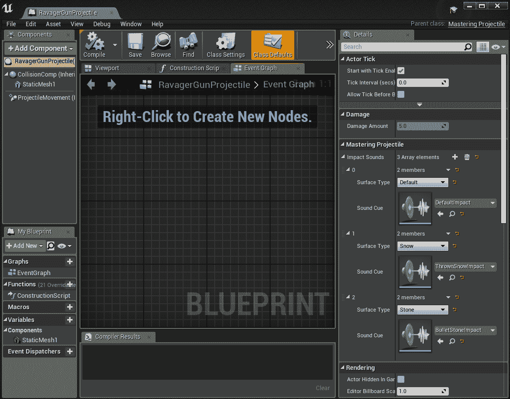

一旦所有这些都设置好了，那么就只是投射物`OnHit`函数中的一点代码问题：

```cpp
#include "Sound/SoundCue.h"
EPhysicalSurface surfType = SurfaceType_Default;
if (OtherComp->GetBodyInstance() != nullptr && OtherComp->GetBodyInstance()->GetSimplePhysicalMaterial() != nullptr)
{
        surfType = OtherComp->GetBodyInstance()->GetSimplePhysicalMaterial()->SurfaceType;
}

USoundCue* cueToPlay = nullptr;
for (auto physSound : ImpactSounds)
{
        if (physSound.SurfaceType == surfType)
        {
                cueToPlay = physSound.SoundCue;
                break;
        }
}

const float minVelocity = 400.0f;
if (cueToPlay != nullptr && GetVelocity().Size() > minVelocity)
{
        UGameplayStatics::PlaySoundAtLocation(this, cueToPlay, Hit.Location);
}
```

不幸的是，在我们的案例中，`FHitResult`就是投射物。此外，请注意硬编码的最小速度：这是为了防止在投射物速度/寿命的末尾向游戏中发送大量非常小的弹跳，但你当然可以用许多其他或更灵活的方式处理这个问题。如果你未来想要从那个角度播放声音，这里有一个很好的访问器，可以让你轻松获取表面类型：

```cpp
UGameplayStatics::GetSurfaceType(Hit);
```

默认地图中最明显的面对表面已被设置为石质类型，用于测试，现在可以展示不同的表面和不同的投射物，并改变它们的冲击声音！下一节将简要介绍我们新的（终于视觉高质量的）地图，用于脚步声和基于声音音量的混响设置。

# 玩家脚步声和环境音效

现在玩家终于得到了他们自己的脚步声。再次，我们将使用我们已有的，但我们可以希望找到几种类型来至少证明系统的可行性，这样在未来的工作中帮助队友应该会容易得多。脚步声的工作几乎可以与投射物碰撞的工作完全相同，但我们将在玩家的（尽管非常有限）移动动画中的特定时刻触发它。这些将简单地触发射线投射，我们将获取材质，一旦我们有了它，工作将使脚步声在我们所到之处都能工作。

首先，MasteringCharacter 需要与我们的 projectile 刚刚得到的相同的 struct。一般来说，假设更多的事情将使用这个共享功能，我会将 struct 和一些这种行为移动到 actor 组件中，但鉴于它对我们这里的课程不是特别有信息量，我们现在就原谅自己一点复制粘贴吧，首先从我们的.h 文件顶部开始：

```cpp
USTRUCT(BlueprintType)
struct FFootstepSounds
{
        GENERATED_USTRUCT_BODY()

        UPROPERTY(EditAnywhere, BlueprintReadWrite)
        TEnumAsByte<EPhysicalSurface> SurfaceType;

        UPROPERTY(EditAnywhere, BlueprintReadWrite)
        class USoundCue* SoundCue;
};
UPROPERTY(EditAnywhere, BlueprintReadWrite)
TArray<FFootstepSounds> FootstepSounds;
UFUNCTION(BlueprintCallable)
void PlayFootstepSound();
```

接下来，我们在.cpp 文件中这样做：

```cpp
#include "Sound/SoundCue.h"
#include "PhysicalMaterials/PhysicalMaterial.h"
```

代码片段

```cpp
void AMasteringCharacter::PlayFootstepSound()
{
        FVector startPos = GetActorLocation();
        FVector endPos = startPos - FVector(0.0f, 0.0f, 200.0f); // 2m down

        FCollisionQueryParams queryParams;
        queryParams.AddIgnoredActor(this);
        queryParams.bTraceComplex = true;
        queryParams.bReturnPhysicalMaterial = true;
        FHitResult hitOut;

        bool bHit = GetWorld()->LineTraceSingleByProfile(hitOut, startPos, endPos, TEXT("IgnoreOnlyPawn"));

        if (bHit)
        {
                EPhysicalSurface surfHit = SurfaceType_Default;

                if (hitOut.Component->GetBodyInstance() != nullptr && hitOut.Component->GetBodyInstance()->GetSimplePhysicalMaterial() != nullptr)
                {
                        surfHit = hitOut.Component->GetBodyInstance()->GetSimplePhysicalMaterial()->SurfaceType;
                }

                if (hitOut.PhysMaterial != nullptr)
                {
                        surfHit = hitOut.PhysMaterial->SurfaceType;
                }
                USoundCue* cueToPlay = nullptr;
                for (auto physSound : FootstepSounds)
                {
                        if (physSound.SurfaceType == surfHit)
                        {
                                cueToPlay = physSound.SoundCue;
                                break;
                        }
                }

                if (cueToPlay != nullptr)
                {
                        UGameplayStatics::PlaySoundAtLocation(this, cueToPlay, hitOut.Location);
                }
        }
}
```

注意，我们将自己进行光线追踪以查看我们下面的情况，并使用这些结果来确定在哪里和玩什么。注意，根据我的经验，即使我们在静态网格上与物理材质发生碰撞，我们仍然需要手动挖掘它，因为即使在查询中指定返回物理材质，碰撞结果总是返回`nullptr`。

要触发这些，我们需要在简约的第一人称跑步动画中添加一个新的事件：

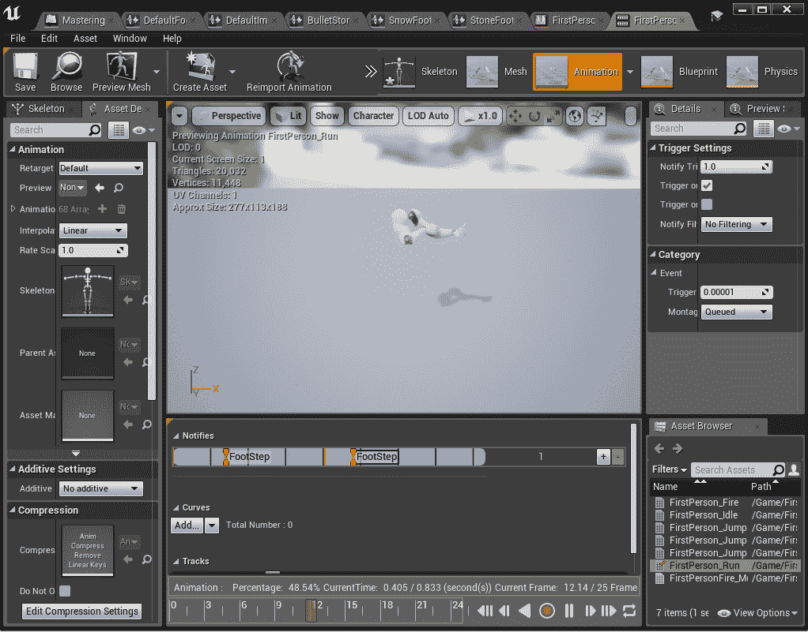

然后，我们将从 FirstPerson_AnimBP 中调用我们的 pawn 的新函数：

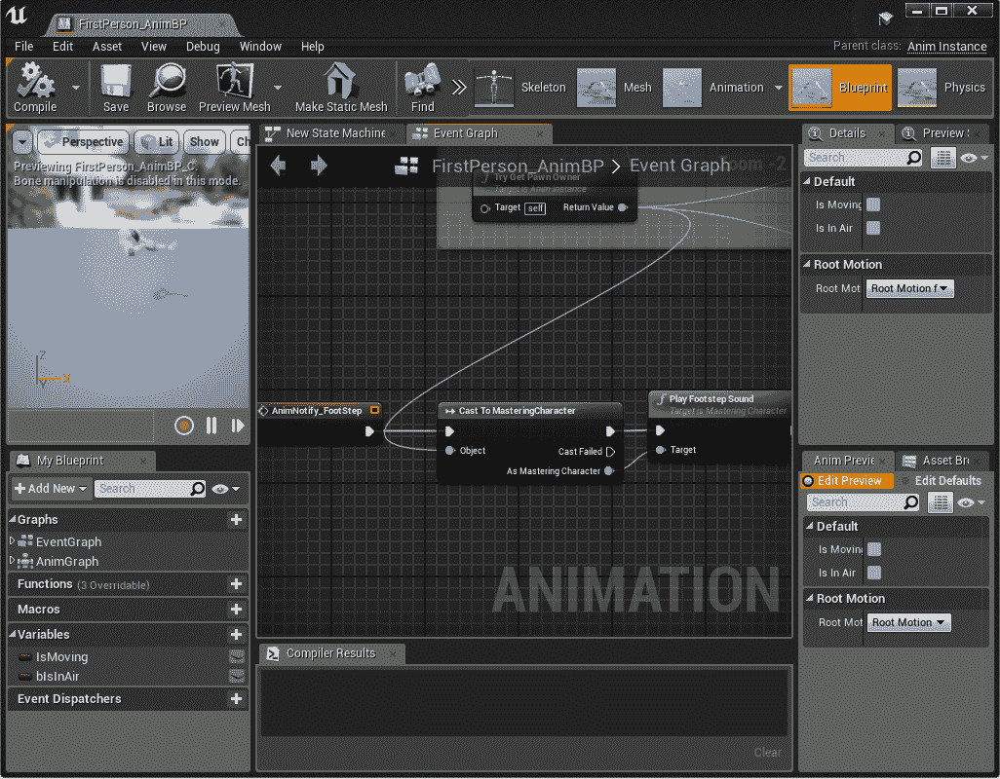

类似地，编辑器中添加了新的脚步声提示，并将其添加到我们的隐形角色数组中，就像武器一样。现在我们有一些奇怪的脚步声！

终于打开了 FrozenCove 关卡，我们将选择几个看起来像石头或冰的表面，你可以轻松地从那里跳到它们的材质。你还可以看到，在 InfinityBladeIceLands/Environments/SurfaceTypes 中下载的关卡中已经存在一个石头的物理材质。

点击那些静态网格的材质以打开它们，我们将设置它们的一些物理材质：

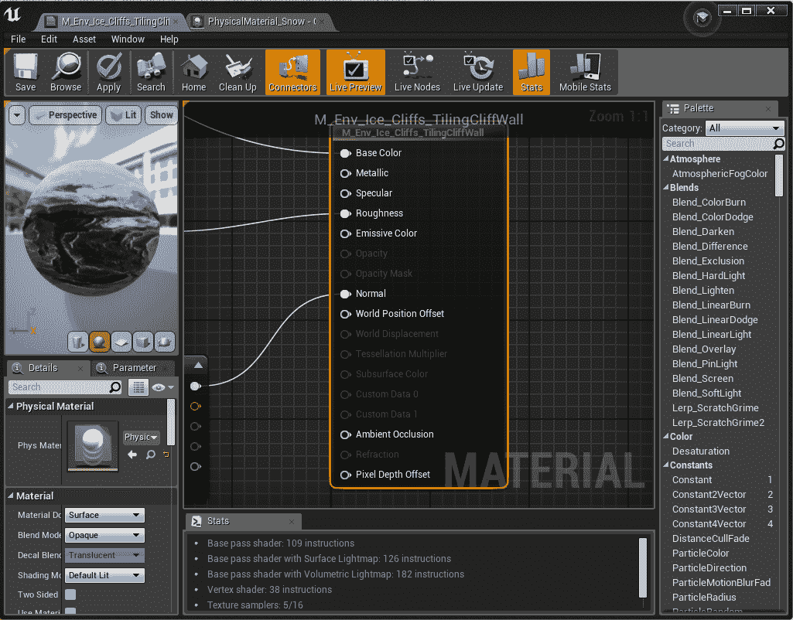

要完全做到这一点，我们将创建一个新的雪物理材质，复制石头材质（实际上设置为表面类型 2，但既然我们已经通过名称将其添加到我们的项目中，现在应该明确设置为石头），命名为 PhysicalMaterial_Snow，并在其属性中将其设置为雪表面类型。整个材质列表的变化可以在 GitHub 上看到，但一些例子是（所有在 InfinityBladeIceLands/Environments/Ice 下）Ice_Fortress/Materials/M_Ice_FortFloor_1_SnowPaint 和 Ice_Castle/Materials/M_IceT3_Fort_Floor_05。

最后，我们右键单击并在 InfinityBladeIceLands/Effects 中添加一个名为 WallReverb 的新 Sounds/Reverb 对象，并给它一些相当极端的参数，以便在使用时很明显。它是如何使用的？简单！在关卡中，在左侧的基本类型下，在 Volumes 中是 AudioVolume，在这种情况下，添加到从玩家开始的全长走廊的左侧：

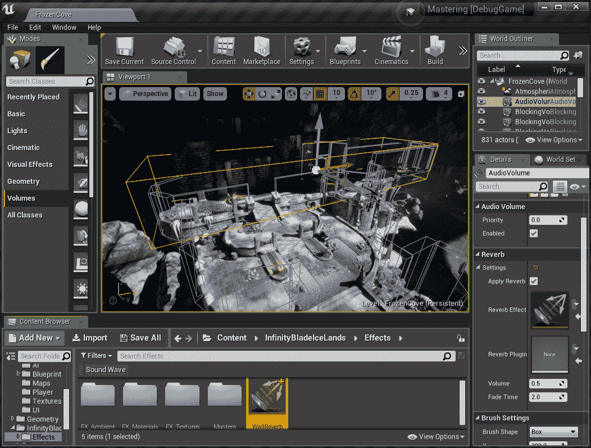

将其混响对象设置为刚刚创建的那个，当你进入那里并发出任何声音时，你一定能感觉到变化。这种类型的工作有大量的可能性可以探索，如果你立刻感到好奇，绝对可以允许整个类别的声音忽略效果（而且如果设置为 UI 类型，默认情况下已经这样做了）。

# 摘要

虽然音频通常被游戏视为事后考虑的事情，但这里所做的工作应该有望展示在 UE4 中可以做到多少，以及为什么它很重要。正确处理声音并能够告诉你的设计师和其他团队成员如何做这些事情（或者甚至表明这些事情是容易实现的！）对于许多试图制作类似游戏的、经验较少的团队来说是一个巨大的优势。不要在这方面被冷落：你的观众会感谢你的！

# 问题

1.  在游戏过程中快速播放声音的绝对最简单的方法是什么？

1.  对话系统的主要组成部分是什么？

1.  对话系统在哪些情况下足够使用，而在哪些情况下则需要在其之上再添加一个管理系统？

1.  我们如何从动画中播放一个简单的声音？

1.  播放更复杂和多样化的动画声音的推荐途径是什么？

1.  我们如何在碰撞中找到被击中的材质，以及为什么它永远不会像它看起来那么明显？

1.  表面类型在哪里定义，它们在游戏中是从哪里应用的？

1.  级别或声音设计师如何快速设置级别中的区域以区分那里的音频属性？

# 进一步阅读

Git LFS：

[`help.github.com/articles/installing-git-large-file-storage/`](https://help.github.com/articles/installing-git-large-file-storage/)

Unreal Dialog 系统：

[`docs.unrealengine.com/en-us/Engine/Audio/Dialogue`](https://docs.unrealengine.com/en-us/Engine/Audio/Dialogue)

环境声音：

[`docs.unrealengine.com/en-us/Engine/Audio/SoundActors`](https://docs.unrealengine.com/en-us/Engine/Audio/SoundActors)

通过.csv 驱动的 DataTable 维护：

[`docs.unrealengine.com/en-us/Gameplay/DataDriven`](https://docs.unrealengine.com/en-us/Gameplay/DataDriven)
