# 第八章：着色器编辑和优化技巧

# 简介

着色器（以及它们在 UE4 中构建的材质）负责游戏中我们看到的所有内容。有些非常简单，根本不需要用户输入（例如大多数 UI 工作），但最终，任何制作现代 3D 游戏的团队都可能需要一些定制解决方案，如果不是大量的话，超出了基本游戏和模板所包含的内容。了解如何创建和修改它们，如何在运行时高效地使用（和重用）它们，以及它们提供的一些强大功能，是非常重要的。幸运的是，UE4 通过其材质编辑器使这些操作比其他平台更容易，为团队节省了时间和资源，但当然这也带来了不当使用的风险，这可能会对性能造成灾难性的影响。在本章中，我们将提供一些防止这种情况发生的技巧，同时最大限度地利用系统和工具。记住，我们的目标不是成为每个主题的专家，而是要全面掌握 UE4 的主要系统，并拥有引导团队或项目达到最佳效果的信心的能力。材质和着色器的精通可以（并且确实！）填满整本书，但在这章之后，你应该有信心对 UE4 中材质的能力和限制给出有根据的回答。我们主要讨论的主题包括：

+   创建和编辑材质的基础

+   编辑材质网络和编辑时性能技巧

+   优化着色器的运行时技巧

+   在各种平台上适配着色器

# 技术要求

本章将使用以下 GitHub 链接中的项目。虽然这些课程可以应用于任何项目，但将给出使用游戏项目直接资产的具体示例，因此当然建议同步：

[`github.com/PacktPublishing/Mastering-Game-Development-with-Unreal-Engine-4-Second-Edition/tree/Chapter-8`](https://github.com/PacktPublishing/Mastering-Game-Development-with-Unreal-Engine-4-Second-Edition/tree/Chapter-8)

使用的引擎版本：4.19.2。

# 了解和构建材质

假设大多数读者都熟悉着色器的概念：在运行时发送到硬件的特定渲染代码，告诉硬件如何将给定项目绘制到屏幕上。新手可以从许多地方开始学习它们，但这里的假设是读者至少对着色器的工作原理有基本了解：编译、上传到 GPU 或软件渲染器，并在那里执行。由于这不是图形入门教程，我们将跳过这部分，直接进入 UE4 生成和跨平台传输着色器的通用方法：材质。

# 材料概述、材质实例创建和使用

在材料方面，没有一个完美的起点。然而，一个明显但并非每个人都知道的是，存在引擎材料。如果你打开编辑器并转到内容浏览器，你会在右下角看到一个视图选项的下拉菜单。选择显示引擎内容将在左侧的源浏览器中显示一个新文件夹，选择此文件夹，然后从过滤器下拉菜单中添加一个材料和材料实例的过滤器，就像这里一样，将显示一个现有的内置材料的大量列表：

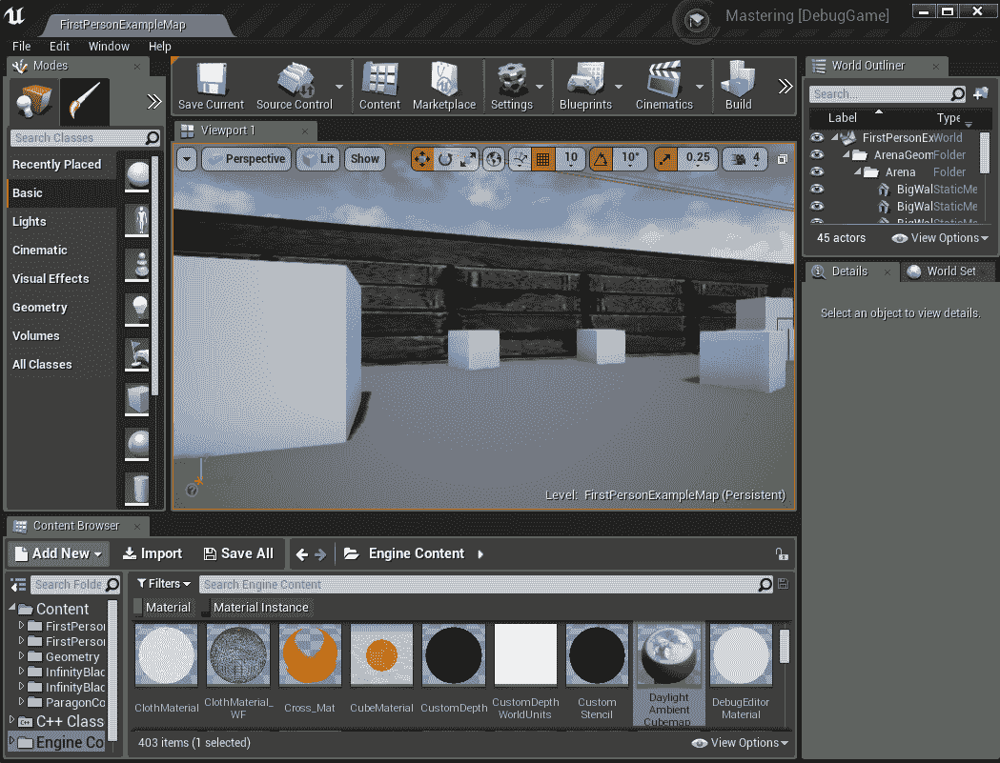

以日光环境立方体贴图作为快速示例，将打开材料编辑器并看起来像这样：

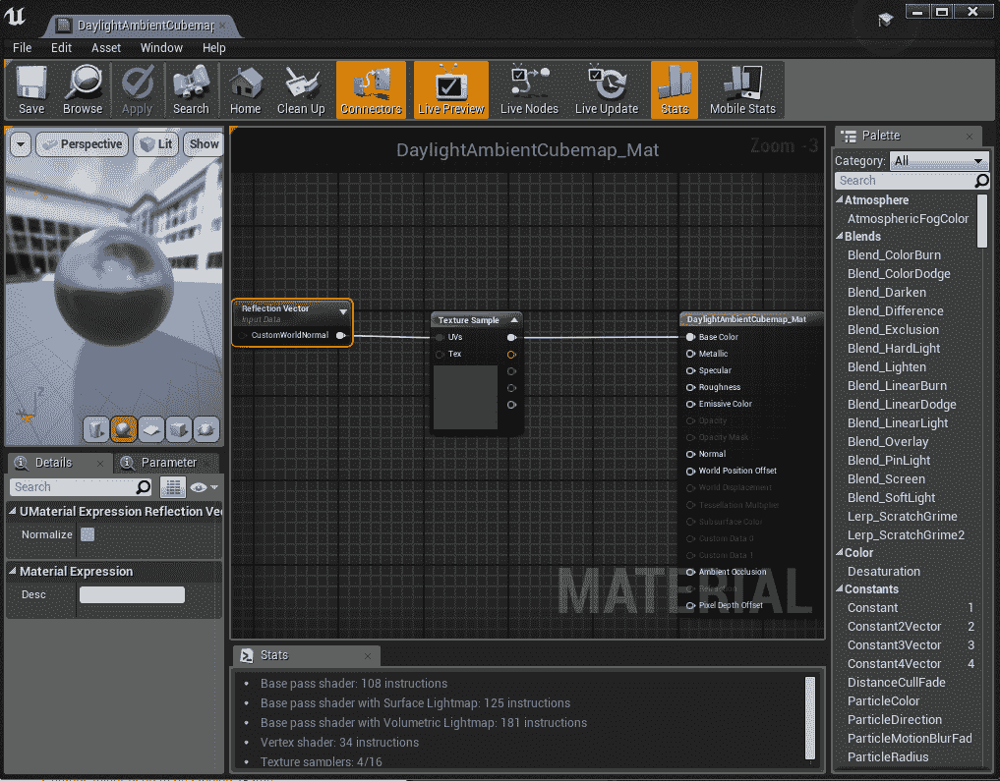

对于那些刚开始编辑材料的人来说，你可以看到它看起来非常像蓝图编辑器和 UE4 中的其他基于节点的编辑，这有助于在不同编辑器窗口之间提供熟悉感。简要描述这里显示的内容，左上角是材料的预览（始终映射到中间的球体上）。左下角是所选节点的详细信息。当然，中心是主要的编辑面板。底部是着色器复杂性的摘要（稍后会有更多介绍），右侧是可以放入的节点列表（与在主面板上右键单击相同）。浏览引擎材料时，你会看到许多是由编辑器本身使用的。你也会注意到（考虑到过滤器），有几个材料实例。它们有什么区别？动态材料实例有什么不同？让我们在这里快速列出一些，并继续一些更具体的例子：

+   材料是最基本类型，通常是材料实例的父类，当使用时，它由材料（和编译的着色器）将要执行的基本流程组成

+   通过添加参数节点（关于这一点很快也会有更多介绍），材料实例可以从父级主材料继承并赋予个别属性，因此整个材料不需要重做以更改，例如，输入纹理

+   动态材料实例是在运行时创建的材料实例，可以接受实时参数并在如演员蓝图等地方更改它们

我们将逐一介绍每个例子，在过程中创建我们自己的，并查看我们项目内容中已经构建的。但重要的是在开始工作之前考虑材料的用法。这是一个将以非常具体的方式使用且不需要派生子材料的材料吗？那么它可能只需保留并直接作为材料引用。意图是有几个基于一组核心着色器逻辑的变体吗？那么你可能会想要一个基础材料，以及一组材料实例子材料。你想要在运行时接受参数（类似于 C++中函数接受参数）并基于这些参数产生不同结果的东西吗？你将需要创建一个材料，一个或多个材料实例，然后在运行时创建一个动态材料实例（通常是在对象的蓝图构造函数中），并传递给它参数，要么在启动时，要么在整个对象的生命周期中。所以让我们在下一节中逐一考虑这些，看看每个案例涉及什么，并养成第一次就正确构建材料的好习惯。

# 在编辑器时间工作在材料网络和性能技巧

虽然我们可以轻松地从零开始创建一个材料（如果你不熟悉，强烈建议花些时间玩玩能做什么），但让我们从一个现有的材料开始，看看它做了什么，然后开始将其修改为在测试地图中更有用的内容。

为了快速举例说明我们如何更改材料实例并将其应用到世界中，让我们从 Content/InfinityBladeIceLands/Environments/Misc/Exo_Deco01/Materials 开始，我们将使用 M_Exo_Crate_Open 材料作为我们的起点。现在请随意选择它并在材料编辑器中打开它。

为了让演示开始运转，我们将快速对这个基础材料做一些操作。从发射颜色插针拖动并过滤时间或类似的内容，以放置 TimeWithSpeedVariable 节点在这里。从其速度拖动到左侧并添加一个常数。我们将确保这个常数默认为 0.0，因此不会改变在这个箱子材料中其他地方（在冰洞关卡中）的基础行为。最后，右键单击这个常数节点，选择转换为参数，并将其命名为 EmissiveSpeed，如图所示：

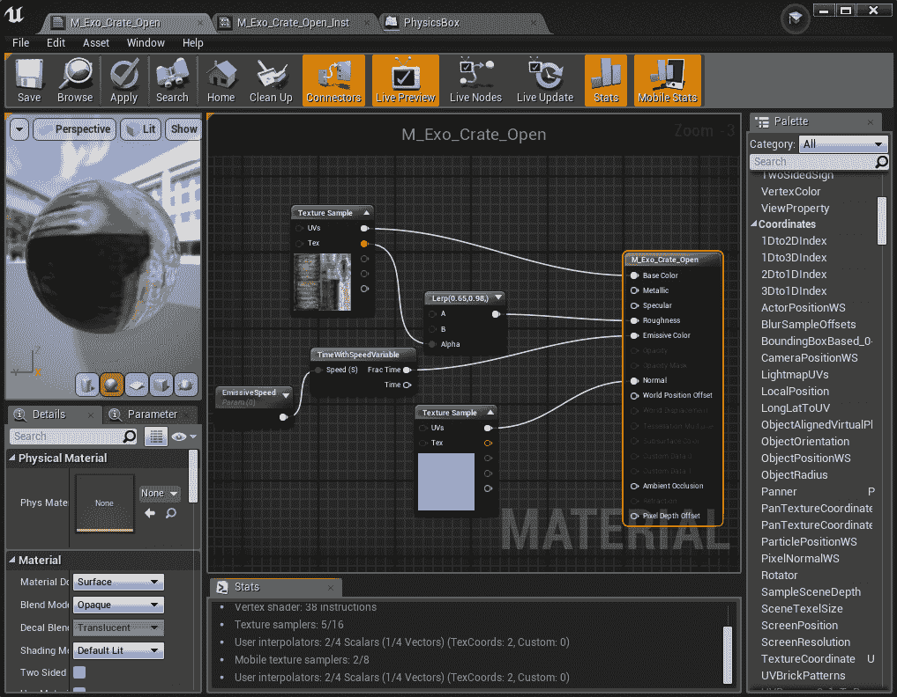

对于那些密切注意的人，你会注意到底部的移动纹理采样器目前是 2/8。一旦你保存材料，它的当前图就应用到材料资产以及关卡中的任何实例上，你会看到它从 2 跳到 6/8！诚然，在运行时将我们的纹理采样增加三倍并不好，但在移动平台上，那个神奇的 8 数字可以是一个非常显著的限制（关于这一点将在本章后面详细说明）。但请记住：*保存以完全应用更改！*

一切都完成后，回到内容浏览器中，右键单击箱子材料，在顶部是创建材料实例的选项。我们将使用它来激活实例中的发射色：

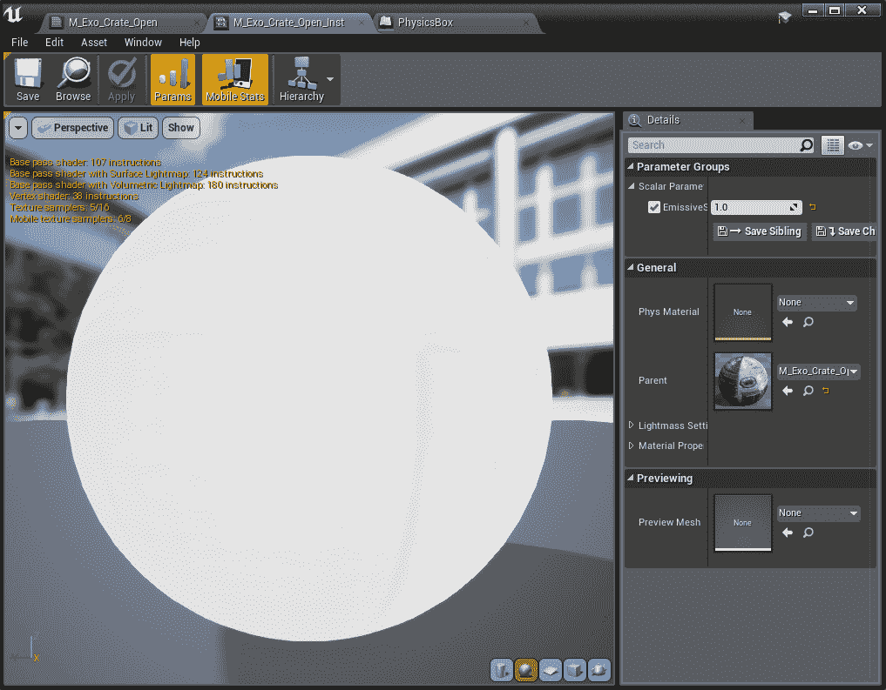

就像在基本材料中一样，始终在编辑器的顶部点击你需要的任何统计信息，这样你就可以立即看到材料的复杂性概述：基本和顶点指令以及纹理采样器。小的更改可以对这些数字产生*巨大*的影响，并且让艺术家以及任何与材料工作的人熟悉你平台上的合理数字是早期和始终执行的关键！

注意，在编辑材料实例时，着色器的逻辑消失了。你无法在实例中修改它，但你可以修改参数（这几乎是它们的主要目的！）。在右上角，勾选允许编辑 EmissiveSpeed 的框，并将其设置为 1.0。现在，请记住，这个纹理及其相应的法线贴图是为特定模型制作的，而不是这些立方体，但我们在这里演示的是概念，而不是制作即将发货的艺术品。我们现在可以将这个（内容浏览器中的实例图标）拖放到关卡中的一个立方体上并播放它。在这个屏幕截图中，我将方向光的强度降低到大约 0.6，并将天空光的颜色调整为深灰色，但你不必做这些。这只是为了使这种脉冲发射的光照独立性质更加明显：

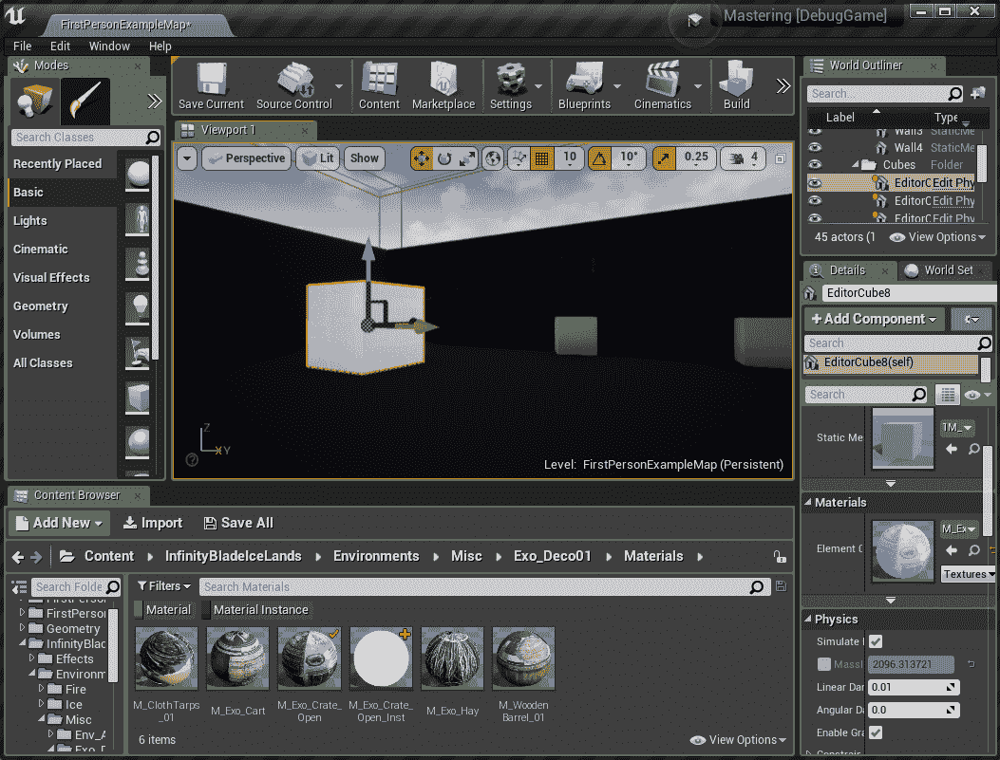

所以虽然它还不完美（我们稍后会改进它！）但你现在可以看到许多游戏用来突出玩家在游戏中应该捡起的项目的小技巧。它们通常有一个闪烁的光芒，使它们从附近的静态背景中脱颖而出，这样玩家就不会错过这些有价值的物品。要测试其脉冲，你可以从编辑器的播放按钮下拉菜单中选择模拟，尽管对于那些在 GitHub 项目中密切参与的人来说，你会注意到这暴露了我对玩家控制器类型的检查。所以，每当发现严重的错误时，你应立即检查并修复。但现在让我们查看那个框（无论是通过正常播放关卡，还是同步提交 ce0da7c，或者本地进行以下修复）：

```cpp
void AMasteringCharacter::InitializeInventoryHUD()
{
        APlayerController* player = Cast<APlayerController>(GetController());

        if (player != nullptr) // function is called with a non-player controller in simulation in editor
        {
                AMasteringHUD* HUD = Cast<AMasteringHUD>(player->GetHUD());

                if (HUD != nullptr)
                {
                        HUD->InitializeInventory(Inventory);
                }
        }
}
```

现在你可以看到对材料进行一些快速更改的结果。让我们快速改进一下，然后继续。首先，我们将使脉冲跟随正弦输出而不是线性输出，并对其幅度进行限制，默认设置为 0.5：

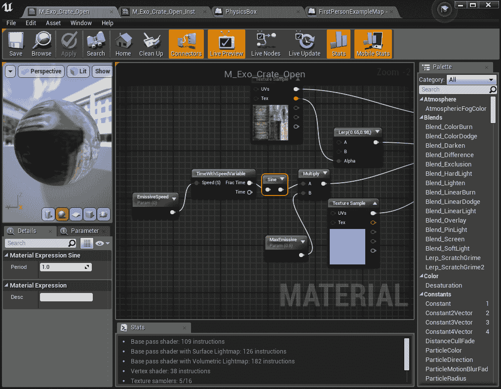

现在如果你转到材料实例。由于 MaxEmissive 现在也是一个参数，你可以看到它并将其设置为其他值（比如 0.25，使其更加微妙），然后查看我们的结果。

要创建一个动态材料实例，我们需要编辑测试级别中物理盒子对象的蓝图，选择其中的任何一个，然后在它的详细信息面板中，选择编辑蓝图并打开编辑器。在这里我们可以添加这样的逻辑，但请注意：这将改变级别中所有盒子的逻辑，甚至将覆盖（正如我们放在槽位 0 中）之前正在工作的盒子上的未修改材料实例。添加这个并查看结果：

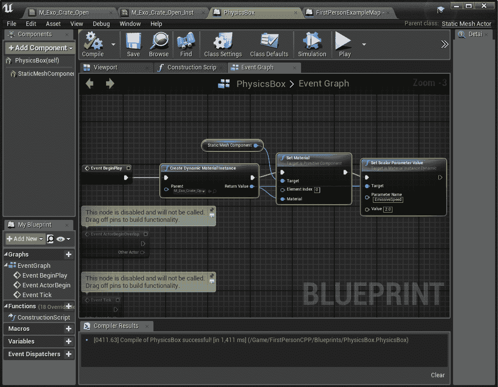

现在我们所有的盒子上都有一款真正快速脉冲的材料。如果你只想在少数几个盒子上使用，可以通过在层级蓝图中进行引用或者创建单独的盒子类型（而不是所有盒子都实例化的那个类型）来实现，但现在，希望创建具有可由蓝图事件在运行时设置的参数的动态实例的价值已经很明显了。你甚至可以在被击中时将材料改回默认的立方体材料。这里的灵活性非常强大！但请记住，如果你在运行时动态替换材料，会丢失一些特定的预计算可能性，但对于大多数游戏和项目来说，实时光照和效果是赋予动态材料实例的任何事物上的主要特性。

不要忘记静态网格（和其他网格）也可以有多个材料：只需看看地图“冰冻海湾”中的某些部件！所有这些材料在渲染演员时都会被应用。第一个材料通常是用于设置物理材料以及对象最基本/最基础的渲染的那个材料，但如果你选择一个静态网格对象（包括这个测试级别的 1M_Cube），你会看到它的材料只是一个没有硬性限制的数组（只有性能和管理方面的实际限制）。

# 运行时和各个平台上的材料

现在编辑材料已经变得熟悉，我们简要地提到了一个看似微小的变化如何极大地提高了材料的某个统计数据，现在是时候更深入地了解可用于运行时分析的工具体验了。有无数的工具可以用来分析场景的图形性能，其中一些内置在 UE4 中，还有一些是免费的，你可以去探索。NVIDIA 提供了一套出色的工具，对于 Android 开发者来说是一大救星，可以在附加阅读部分找到。现在，我们将首先关注我们可以在 Unreal 和编辑器内部做什么，以及我们的主要工具和早期测试点。

# 快速迭代着色器的运行时工具和技术

在你的工具库中，对于着色器性能来说，最直接有用的工具之一就是着色器复杂度视图模式。在任何编辑器中的视口窗口中，你可以通过点击灯光下拉菜单（位于视口左上角视角下拉菜单旁边）来找到它。在屏幕截图上，这些通常分别是“光照”和“视角”。在那里，在优化视图模式下是着色器复杂度（在 PC 上，快捷键是*Alt+8*，要回到光照模式，按*Alt+4*）。然而，在我们的测试级别中，没有什么可看的，所以让我们快速转到冻结海湾地图，那里有更多有趣的东西。在运行时，在启用了控制台的所有平台上（PC 上的*~*键，大多数移动设备上的四指轻触），你也可以通过显示 ShaderComplexity 命令来访问它，由于这里最有趣，让我们看看在冻结海湾开始时我们得到了什么：

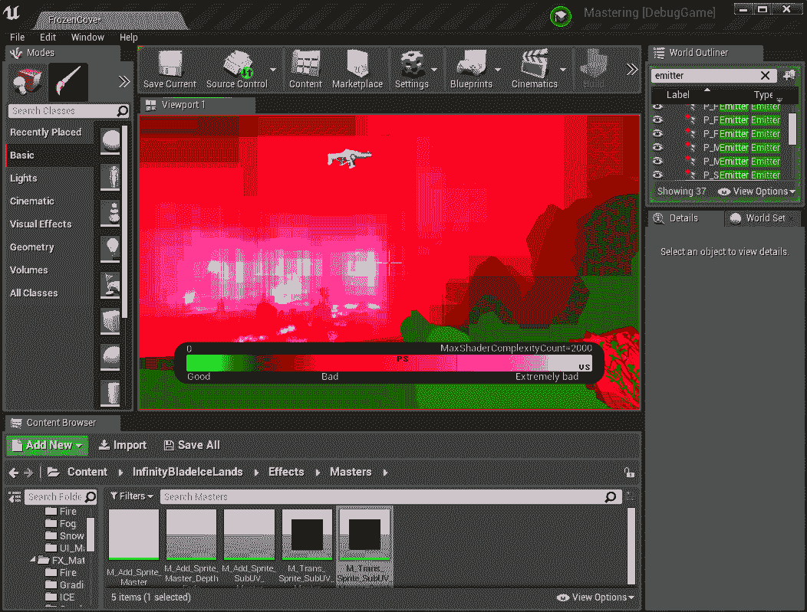

哇！从底部的颜色刻度可以看出，中间似乎有些严重的问题，当然，很明显是吹拂的雪花/云朵穿过地图的中心。你通常会在大多数平台上发现，从性能角度来看，你最讨厌的敌人是过度绘制。大多数开发者至少对这个词很熟悉，但这就是 GPU 被迫在屏幕上多次绘制和重绘相同像素的情况。半透明通常是最主要的过度绘制原因，这里也是一样。从渲染的角度来看，我们有一大堆巨大的粒子，所有这些粒子都具有 alpha 半透明，它们堆叠在一起（从我们的摄像机视角来看）。因此，为了将它们全部混合，那些重叠的像素被重新绘制了无数次，形成了那些明亮的白色着色器工作区域。在性能良好的 PC 上，这都没问题，即使是未优化的构建，这个级别的帧率也能达到 50+ fps，但在其他平台（尤其是移动设备）上，这很快就会变成一个噩梦场景，将在下一节中进一步讨论。

同时，由于我们在这本书中没有专门关于优化的章节，希望一个有用的工具概述和一些进一步阅读的链接就足够了。首先，了解你的 stat ... 命令行快捷方式。这些可以在游戏中提供大量的实时数据，并且熟悉其中的一些总是被推荐。话虽如此，我最推荐的是 stat CPU、stat GPU（在这里你可以轻松看到透明度的成本）、stat Game 和 stat FPS，后者在几乎每个非发布版本中可能默认开启。另外值得注意的是，stat Memory 也非常有帮助，但它是针对内存消耗，而不是直接性能。当然，找出你的游戏在哪里受限是了解如何优化以提高帧率的钥匙。再次强调，这可能是大多数开发者中相当普遍的知识；但这仅仅意味着：你的主线程、渲染线程或 GPU 在每一帧中成本最高。你的速度取决于这个群体中最慢的那个成员，Session Frontend 窗口中的 Profiler 在早期就被讨论过了。这是一个获取非常详细信息的良好工具，关于前两个（主/游戏线程和渲染线程）以查看你是否使用了过多的 CPU。检查`stat GPU`命令是检查这是否是你的瓶颈的最快方式，但为了获取如 Profiler 中的详细信息，你可以使用 stat startfile 和 stat stopfile 来生成详细的信息，并在前端窗口中打开它。在其他平台或从不同角度，再次，请参阅 NVIDIA 的工具（前面提到过）或探索每个平台通常提供给开发者的许多选项。关于 UE4 选项的更多细节，*进一步阅读*部分添加了一些链接。值得注意的是，即使在进行模拟或运行关卡时，你也可以开始编辑材质（并记得保存它们以传播更改！）并直接立即看到结果。那么现在让我们探索一些选项，以这些混合粒子作为示例。

# 了解你的平台以及如何调整着色器！

了解你正在为哪个平台开发显然是任何性能优化的关键，尤其是在图形和着色器部门。例如，假设我们旨在将中等性能的 Android 手机和平板电脑作为一个平台。测试在那里事物可能看起来如何的最快方法是转到主编辑菜单的设置下拉菜单，然后预览渲染级别，选择移动/HTML5，并选择 Android 预览。在这个时候，你可能看到这个：

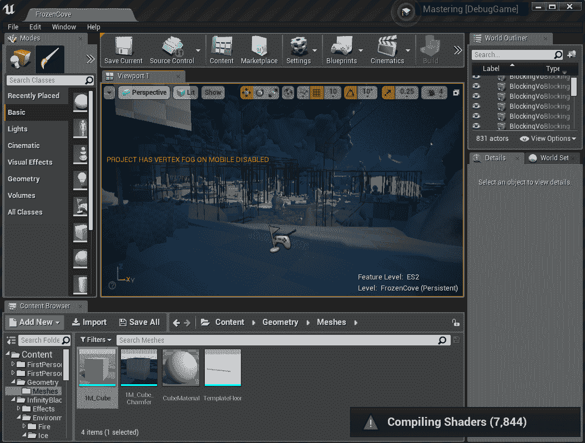

我们现在必须为这个新平台重建大约 8,000 多个着色器，但正如可能已经注意到的，这第一次在 PC 上打开这个级别时也发生了。这必须只做一次，然后较小的更改将导致较小的着色器重新编译，但最初，这可能会占用几分钟的严重 CPU 利用率，因为它正在构建所有这些着色器。只需知道，一旦它们为这种预览模式缓存，在这个级别中就不会再发生这种情况。

一旦完成，让我们再次开始并再次展示着色器复杂性，现在我们在视图中进行 OpenGL ES2 模拟时：

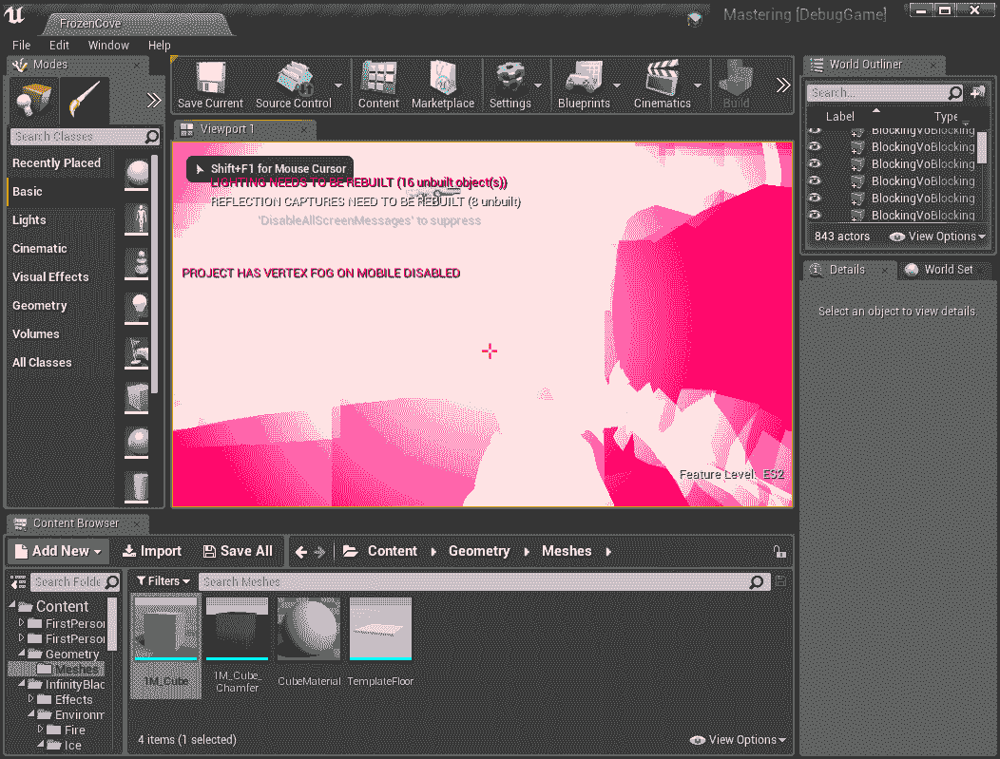

哎呀！现在过度绘制变得严重了。我们该怎么办？

好吧，最明显的方法是，这些只是外观上的功能（除了稍微影响可见性外，并不旨在影响游戏玩法），我们简单地告诉粒子发射器不要在特定质量级别上运行。这一节不是关于粒子特效（但稍后会有一个），所以我们只是简要测试这个理论，以证明我们的 ES2 过度绘制问题确实来自它们。在级别中搜索发射器，最终 P_Snow_BlowingLarge_particulates 脱颖而出，实际上就是罪魁祸首。打开它，我们可以点击带有大型旋转云粒子的发射器，将其详细模式设置为中等，如图所示：

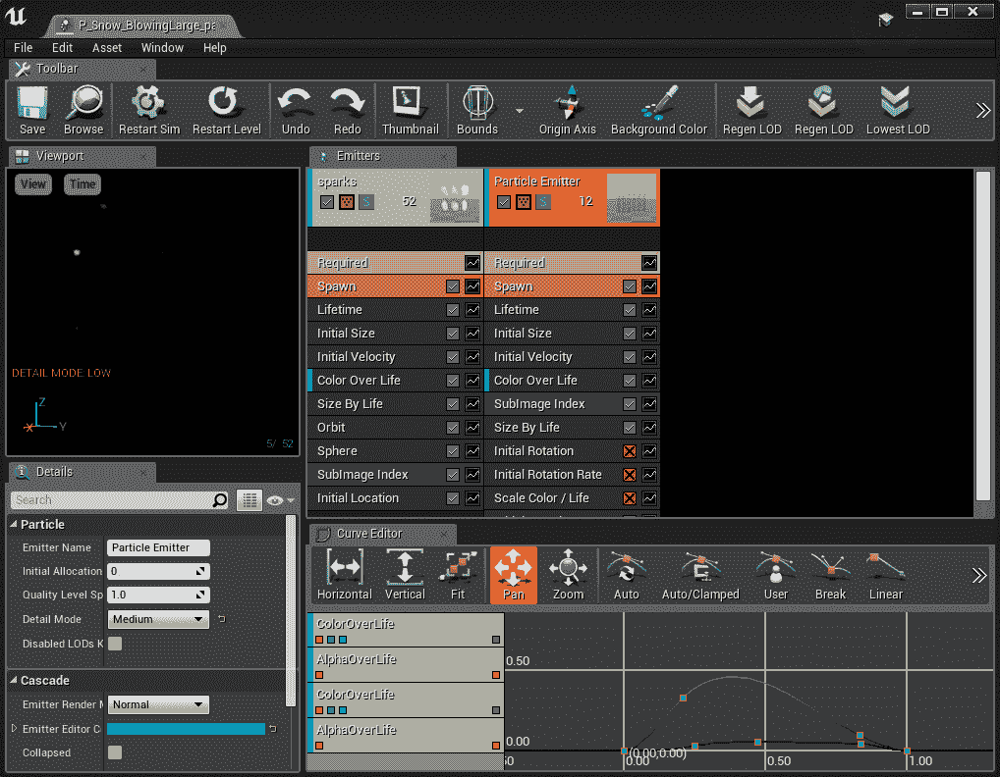

但是，当然，在我们的预览中，除非我们也更改可用的性能级别，否则没有任何变化。在这里，我们将想要修改我们用来在编辑器中预览的可扩展性设置：

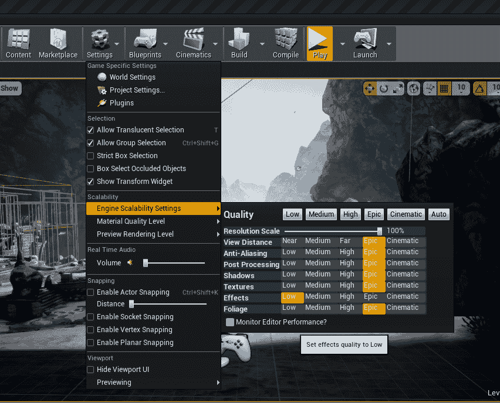

所以，如图所示，我们将把当前的特效级别设置为低，哇，不再有粒子导致我们最大的过度绘制性能打击：

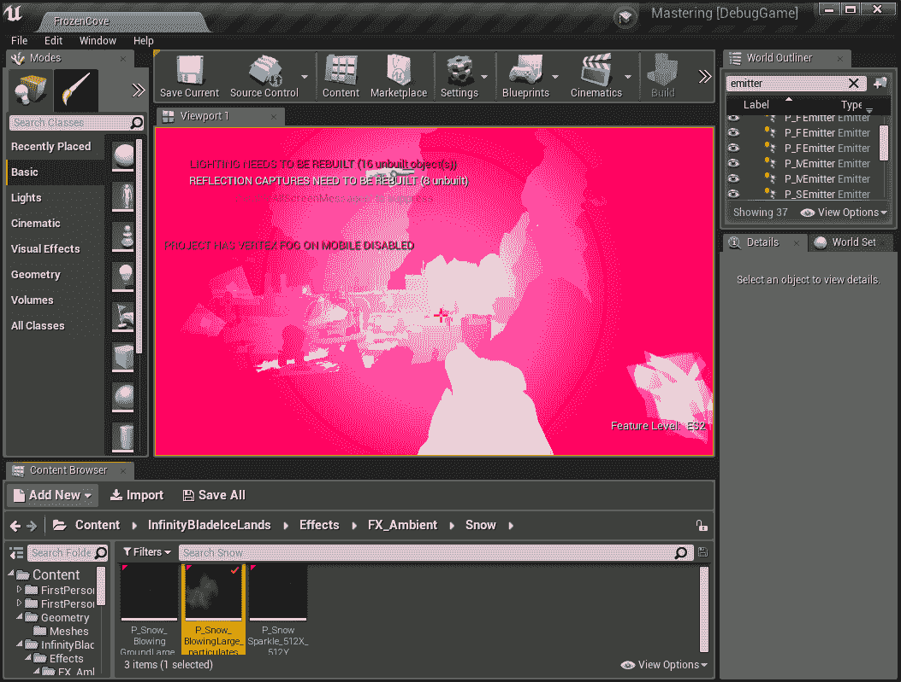

在游戏中不用担心光照重建警告，因为在 ES2 模拟下，你无法在编辑器中构建预计算的光照（你方便地可以看到它在右下角是开启的），它还指出这个级别使用的顶点雾在这个模式下根本无法工作。这是有用的信息，但*始终*在可能的情况下确保在实际设备上进行测试。模拟是快速迭代几个想法的好方法，但直到你实际上在一个适当的设备上测试这些更改，并且它的库和操作系统更新到适当的水平，并且它使用自己的驱动程序，你才能确信你的结果会与这里可能希望得到的最佳模拟相匹配。

虽然如果我们不在高端 Android 设备（使用 ES3+或其他渲染）上使用这个关卡，还有很多事情要担心，但最大的问题已经被移除了。但你可能会问，“*这一章不是关于修改材质以适应你的需求吗？*”是的，当然是的。让我们找到这些粒子中使用的材质。从发射器的属性中追踪，它是一个烟雾状的材质实例，其父级是不透明材质。从高端渲染到 ES2 OpenGL 或低端渲染的典型调整是将那些不透明材质转换为遮罩，而不是向透明度通道发送渐变 alpha，你只需发送一个 1 位的遮罩，就像这里在地图起点附近的草地材质中一样：

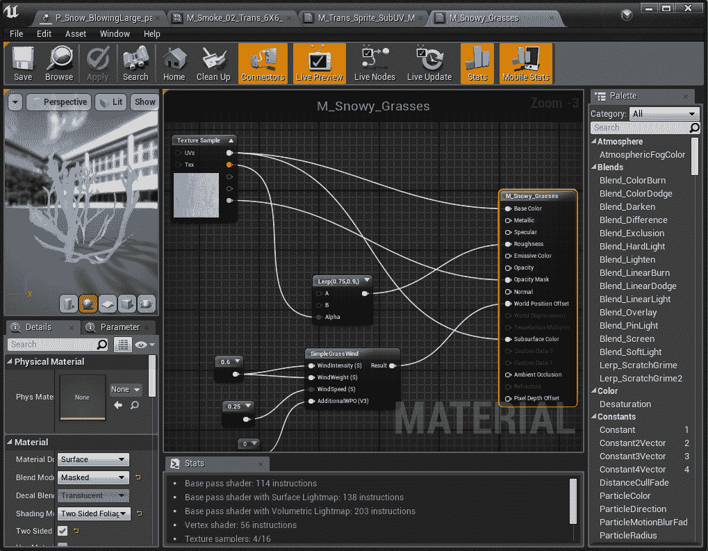

注意输入纹理的 alpha 通道连接到着色器的遮罩输入（风节点也很有趣，它在运行时用于移动草地，也请随意实验）。现在，当然，我们对此有一些优点和缺点。优点：在可以看到纹理的地方没有过度绘制，因为遮罩告诉渲染器一开始就不要绘制像素！缺点：遮罩处会有硬边，而不是平滑、微妙的渐变边缘。我们之前在游戏中都见过这种情况，但请看看预览窗口中的草地：

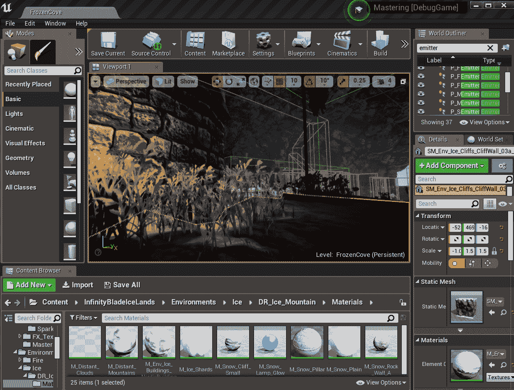

这对于植物或表面上的实际孔洞等东西来说效果不错，但对于像这里这样的雪云效果来说，最多看起来像业余水平。那么，我们可以通过材质做些什么来解决这个问题呢？让我们先熟悉一下到目前为止最有用的节点，即质量开关。以下是关卡附带的不透明材质：

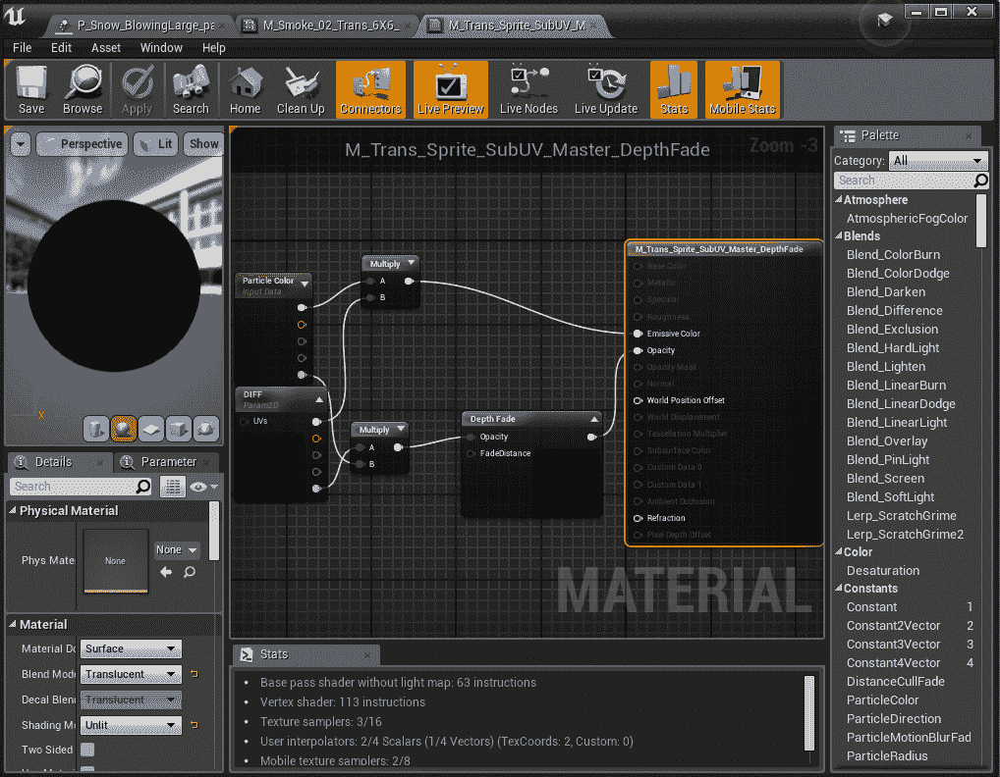

现在我们来看看如何插入质量节点，将低质量 FX 设置为在这些设备上不执行这种 alpha 混合操作：

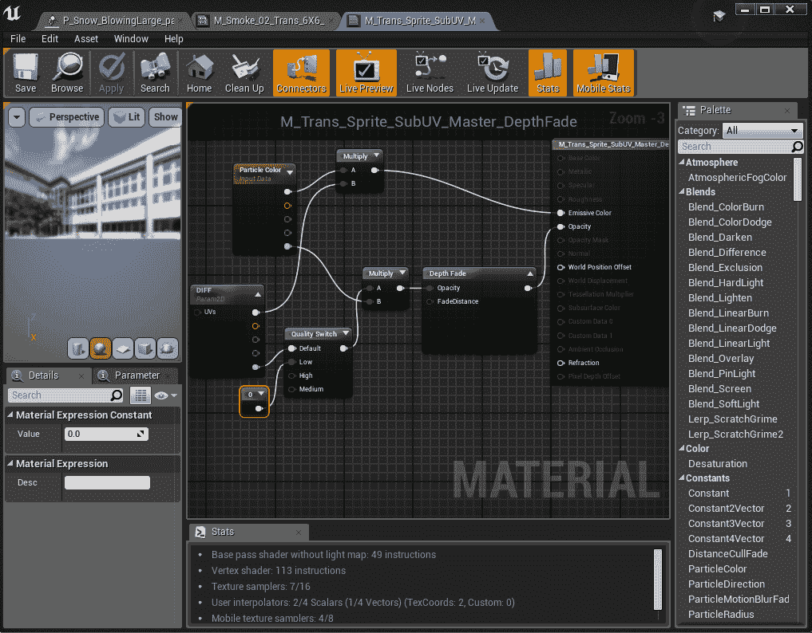

如果我们现在将粒子系统设置回 >= 低细节模式（使其始终尝试发射），但保持我们的编辑器效果缩放设置为低，粒子也将停止绘制，不再对我们的 GPU 性能造成拖累。这可以通过在保存更改之前播放关卡来实时展示（或者简单地将 DIFF 的 alpha 直接连接到乘法节点的 A 通道）。通过将其连接到质量开关，保存材质，然后：雪云的飘渺消失。

所以，这里还有一个最后要点。在编辑器中，这一切都很好，但这些设置是如何针对每个平台，甚至每个设备来设置的？配置（.ini）文件。记住，在项目的 Config 文件夹中，你可以为每个相关平台创建一个子文件夹（例如 Config/Android、Config/Windows、Config/iOS 等），并且对于基础文件夹中的每个 Default... .ini，你可以在其文件夹中创建一个特定平台的配置文件（例如，DefaultEngine.ini 在 Android 设备上被`Config/Android/AndroidEngine.ini`覆盖）。配置文件总是从最具体到最不具体地应用，所以如果某个属性在`AndroidEngine.ini`、游戏的`Config/DefaultEngine.ini`以及引擎的`Config/BaseEngine.ini`中，那么`AndroidEngine.ini`中的属性将是最后应用的，并在运行时使用。话虽如此，如果你正在处理大量设备，你可能会想在游戏的`Config/DefaultDeviceProfiles.ini`级别添加这些属性。以下是在那里可以做的事情的简要概述：

```cpp
[DeviceProfiles]
+DeviceProfileNameAndTypes=Android_Adreno4xx_High,Android
```

在这里，我们定义了一个特殊命名的设备和其类型（Android）。

```cpp
[/Script/AndroidDeviceProfileSelector.AndroidDeviceProfileMatchingRules]
+MatchProfile=(Profile="Android_Adreno4xx_High",Match=((SourceType=SRC_GpuFamily,CompareType=CMP_Regex,MatchString="Adreno \\(TM\\) 4[3-9][0-9]")))
```

这部分内容告诉引擎如何确定它启动的设备是否正在运行该设备类型（通过搜索 GPU 类型）：

```cpp
[Android DeviceProfile]
 +CVars=r.BloomQuality=1
 +CVars=r.Shadow.MaxResolution=1024
 +CVars=r.MaterialQualityLevel=2
```

这里我们为 Android 设备提供了一些默认值（除非有更具体的覆盖）：

```cpp
[Android_High DeviceProfile]
 +CVars=r.MaterialQualityLevel=1
 +CVars=r.MobileContentScaleFactor=2.0
 +CVars=r.ShadowQuality=5
 +CVars=r.DetailMode=2
```

这是一个用于高性能 Android 属性的配置文件：

```cpp
[Android_Adreno4xx_High DeviceProfile]
 DeviceType=Android
 BaseProfileName=Android_High
```

最后，我们只需将特定的 Adreno4xx_High 类型设置为 Android_High 类型，但在此点我们也可以将任何我们想要的属性设置为不同的级别。对于我们的材质，在配置文件中我们希望雪云不要显示，所以我们只需设置以下内容：

```cpp
+r.DetailMode=0
```

以更通用的方式，你可以将(Platform)Scalability.ini 的 sg.EffectsQuality 设置为 0，这在 Epic 在*进一步阅读*部分的扩展链接中有详细说明。

一个警告：在本章 GitHub 项目的末尾，由于一些非常大的资源，.uasset 文件类型被添加到 Git 的 LFS 系统中。跳回早期项目将任何后续更改的.uasset 指针转换回.uasset 数据对象，并可能使 LFS 困惑，这可能需要你通过执行硬重置到 LFS 更改之前（提交 c24d2db）来修复你的本地分支，然后如果你无法丢弃.uasset 更改因为它说它无法解析指针（认为它应该是一个 LFS 指针，而不是二进制.uasset），那么你可以执行硬重置到你想工作的更改列表或分支。所有未来的维护分支（第九章、master 和新的 In-Progress）都将设置为正确跟踪它们的.uassets。这仅当跳回时才是一个问题，但希望这些提示可以帮助任何遇到这个问题的人。

# 摘要

对于那些已经熟悉 UE4 材质系统的用户，希望这能是一个良好的复习，并且在过程中获得了一些新的信息或指导。对于那些之前没有经验的用户，现在你们应该有了坚实的基础，可以在此基础上推动团队和项目向前发展，并使用 UE4 提供的最常用的强大工具做出正确的决策。总有更多东西要学习，但在这种领域达到一定水平是能够将项目提升到更高层次并展示给团队管理这样一个复杂且强大的世界（UE4 的材质为每个项目提供）所需技能和知识所必需的。最后，正如承诺的那样，对于那些熟悉直接编写 HLSL 或 GLSL 的用户，并且想知道 UE4 中这看起来是什么样子，请查看引擎的 Shaders/Private 文件夹中的内容，例如 VolumetricFog.usf。对于那些想要开始这条道路或对 Unreal 自己编译着色器的方式新手的用户，*进一步阅读*部分中还有一个很好的链接。

# 问题

1.  材质和材质实例之间的区别是什么？

1.  材料实例只有在向材质添加一个非常具体的节点类型时才有意义。这是什么类型？

1.  从播放下拉菜单中模拟可以很有帮助。它在本章中揭示了哪些内容？

1.  动态材质实例的目的是什么，它们可以在哪里/什么时候创建？

1.  在地图区域中寻找导致 GPU 性能下降的着色器的关键工具是什么？

1.  哪些命令行选项对于分析任何和所有性能问题最有帮助？

1.  当尝试在各种平台上调整材质时，哪个节点是你的好朋友？

1.  如何设置几乎所有重要性能因素的平台特定设置？

# 进一步阅读

NVIDIA PerfKit（Android 和 PC）：

[`developer.nvidia.com/nvidia-perfkit`](https://developer.nvidia.com/nvidia-perfkit)

UE4 CPU 性能分析：

[`docs.unrealengine.com/en-us/Engine/Performance/CPU`](https://docs.unrealengine.com/en-us/Engine/Performance/CPU)

UE4 GPU 性能分析：

[`docs.unrealengine.com/en-US/Engine/Performance/GPU`](https://docs.unrealengine.com/en-US/Engine/Performance/GPU)

Unreal 可扩展性参考：

[`docs.unrealengine.com/en-us/Engine/Performance/Scalability/ScalabilityReference`](https://docs.unrealengine.com/en-us/Engine/Performance/Scalability/ScalabilityReference)

Unreal 着色器开发 (.usf，包括 HLSL/GLSL 交叉编译解释）：

[`docs.unrealengine.com/en-us/Programming/Rendering/ShaderDevelopment`](https://docs.unrealengine.com/en-us/Programming/Rendering/ShaderDevelopment)
