# 第九章：使用 Sequencer 添加游戏内过场动画

# 引言

许多使用 UE4 开发的游戏因其出色的引擎内和游戏内过场动画而闻名。传统上，这些动画是通过名为 Matinee 的工具/系统制作的。如今，Sequencer 是创建这些场景的新一代改进系统，并且正在被现代 UE4 游戏广泛采用。本章的最后部分将简要介绍 Matinee，即为什么它不再被使用。许多年前的游戏使用 Matinee 也做得很好，它仍然是一个可行的工具；但首先，让我们来了解 Sequencer 及其功能以及与之合作的一些情况。

+   Sequencer 基础

+   添加场景

+   轨迹编辑

+   Sequencer 的替代方案

+   对话系统，蓝图脚本

+   Matinee

# 技术要求

本章将使用 GitHub 项目过程中添加的特定资产。为了跟随实际示例，请从 `第九章` GitHub 分支开始：[`github.com/PacktPublishing/Mastering-Game-Development-with-Unreal-Engine-4-Second-Edition/tree/Chapter-9`](https://github.com/PacktPublishing/Mastering-Game-Development-with-Unreal-Engine-4-Second-Edition/tree/Chapter-9)。

使用的引擎版本：4.19.2。

# Sequencer – UE4 的最新过场动画工具

Sequencer 大约在 UE4 4.12 版本中推出，旨在取代（或者说，继承）Matinee，如果内容开发者或团队没有 Matinee 的经验，即使你有，这也是最佳的工作场所。它与任何其他基于关键帧轨道的工具的经验足够相似，以至于可以轻松使用，并且将是 Epic 将来使用和改进的技术。熟悉其功能对于任何希望将高质量过场动画融入游戏的游戏来说至关重要，无论是玩家可以被动观看的角色在关卡中的简单排列，还是用于传达叙事和故事的完全控制的电影级场景。因此，让我们看看它能够做什么。

# 为什么使用 Sequencer？

如前所述，Sequencer 是未来要使用的技术，并且为熟练用户提供了大量的选项和功能。由于这是为了帮助提供对引擎功能的整体了解，而不是内容创作专业课程，我们可能只会触及这个工具可能性的表面；但了解它能够做什么，以及它如何帮助你，对于在内容管道中做出早期决策以及向观众提供最佳体验至关重要。

顺便说一句，对于那些密切关注 GitHub 项目的人来说，你会在本章的开头注意到一些提交，这些提交使它能够为 HTML5 构建和运行（在 PC/Chrome 和 Mac/Safari 上进行了测试——后者似乎有一些稳定性问题，但现在可以进行测试）。在代码方面，这些大多数只是构建时没有作为 Windows 构建那样被捕获的标题，这在各种平台上相当常见，但像这样的事情：

```cpp
#include "Engine/World.h"
```

在 `MasteringInventory.cpp` 中对 Windows 构建无害，因为它已经在其他地方获取了头文件。但回到序列器。

虽然序列器添加的历史及其持续和未来的支持足以成为使用它的理由，但对其功能的快速概述也是必要的。它做什么？有没有它做不到的事情？让我们列出其一些更常见的功能和它们的用途：

+   **级别序列**：这些是序列器电影中大部分工作的地方，可以是单个端到端场景，也可以是子序列的层次结构（更多级别序列对象）。

+   **主序列**：通常用于管理组或动态级别序列和拍摄对象，但也可以作为独立级别序列的薄包装（添加一些选项）。

+   **拍摄轨道**：这是一个可以添加到序列中的轨道，但也可以作为一个独立的资产保存，这是最基本的轨道，通常控制相机、焦点等。

+   **拍摄对象**：在拍摄轨道中安排多个拍摄后，可以创建一个拍摄对象，即拍摄轨道的特定序列，拍摄对象可以相互交换，以便快速迭代拍摄的感受和流程。

+   **演员到序列器轨道**：这些用于将级别中的单个演员添加到序列中，这是如何在序列中移动和动画化世界中的事物的方式。

虽然有许多其他组件，但我们可以使用这些主要组件立即熟悉序列器的基本和最常用的功能。然而，首先我们还需要在我们的 FirstPersonExampleMap 中做一些背景更改以做准备。在 GitHub 项目中，您会注意到一些没有太多直接效果的改变：灯光再次变亮，除了特殊的一个盒子外，其他盒子都不使用它们的特殊闪烁（分散注意力）材料，并在我们的主地板下方添加了一个“后台”区域：

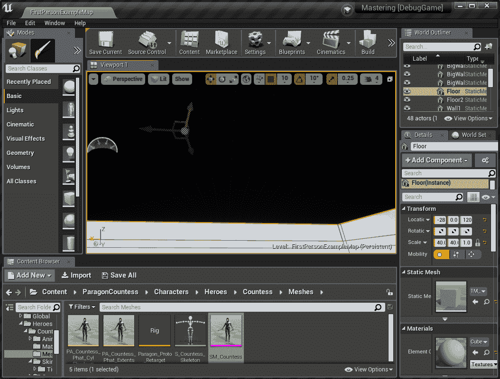

复制对象的一个超级方便的方法是在按住 *Alt* 键（Mac 上的 *command* 键）的同时将其变换拖动到某个方向；这将创建一个副本并将其移动到您想要的方向——在这种情况下，复制的地板直接位于我们现有的地板下方。

一旦我们有一个平面来放置场景中的演员，我们就可以添加一些新项目来使场景更有趣。首先，我们将前往内容浏览器的“添加新”按钮，在最上方是添加功能或内容包...的选项，我们将使用这个选项两次。请确保首先点击内容浏览器中的根目录，内容文件夹，以确保所有内容都放置在正确的层级；你可以根据你或你的团队的需要组织资产；但这样可以使它匹配 GitHub 中的内容；如果你足够聪明，可以节省 GitHub 下载时间（因为从获取引擎完整源代码开始，第一章，*制作第一人称射击游戏的 C++项目，*添加它只是从引擎的内容文件夹复制到你的项目中）。我们将从蓝图功能选项卡添加第三人称包，并从内容包选项卡添加起始内容：

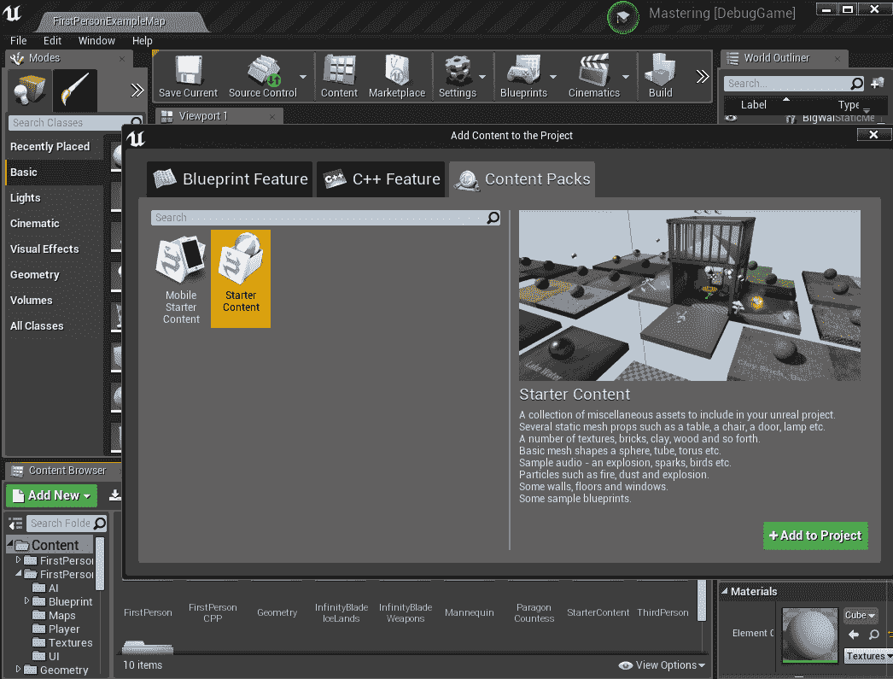

这些包含了一些我们可能不会使用的资产，这增加了 GitHub 的整体大小；但除非直接由另一个资产（或级别本身）引用或在强制烹饪列表中添加，否则不会增加游戏包的大小在平台上！这将在下一章中详细介绍！

因此现在我们可以将我们的新资产添加到后台区域。在制作这样的后台区域时，请记住两点：

+   玩家永远不应该能看到它或访问它

+   它应该有与放置演员的地方相似的照明，这样当它们在序列中添加到另一个区域时，照明就不会明显地“弹出”。

注意，你还可以让序列中的角色“根据提示”生成，这样它们就根本不可见（我们将演示这一点）；但这样你也在做的时候可能需要支付同步加载的成本（如果角色之前没有加载），所以请注意。我们的后台现在是这样的：

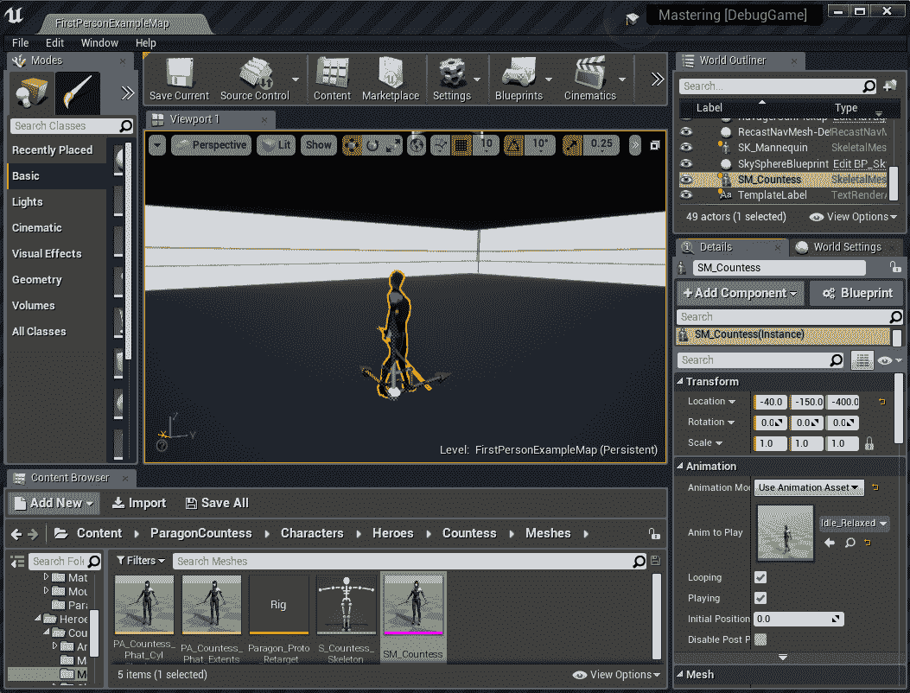

现在请注意，这是一个普通的骨骼网格，甚至不是一个 pawn，而且重要的是，它在其右侧使用的是“动画模式”：使用动画资产*而不是*使用我们在其他地方制作的动画蓝图，因为这会覆盖我们在序列中尝试做的动画。人偶角色，大多数读者可能都熟悉 Epic 的模板，也设置为不使用 AnimBP，以利于我们的序列。你还可以在这里看到，我们可以从顶部主菜单的“电影”按钮添加主级别序列。我更喜欢在包含地图的内容文件夹中添加这些，因为它们通常紧密相关；但当然可以创建一个单独的电影文件夹或类似的东西：

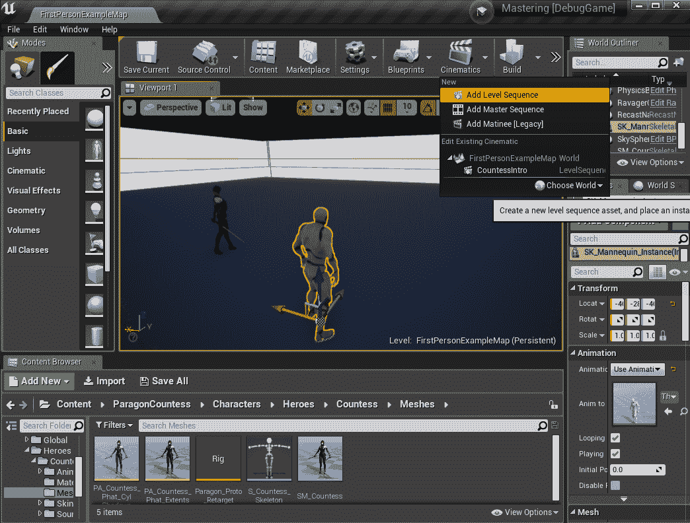

由于我在拍摄这个镜头时已经添加了场景，你可以在可编辑的电影中看到它，它被命名为 CountessIntro 并保存在 FirstPersonExampleMap 中。从这里，我们可以继续制作和触发一个剪辑场景的乐趣！

# 添加场景并触发它

现在我们已经在我们地图中添加了一个空的骨架级别序列，但我们如何使用它呢？让我们快速浏览一下触发方面的事情，然后我们可以开始制作一个相当基本的场景并观看它的播放。然后我们将提高质量并使用一些有趣选项来详细说明。然而，在处理此类场景时，首先要做的事情是为自己提供一个合适的视角来进行操作，因此，在视口下拉菜单中，选择这里看到的“双面板”布局：


确保在使用电影预览窗口时，您已选择电影摄像机，很容易忘记，但当然这是场景中将要使用的那个。

在左侧面板选择的情况下，将其（在左上角的相同下拉箭头中）设置为电影预览。现在有了专门的电影预览面板，就可以快速对场景本身进行工作了。但在我们开始之前，还有一步——我们需要一个可以使用并且可以触发体积的空间：

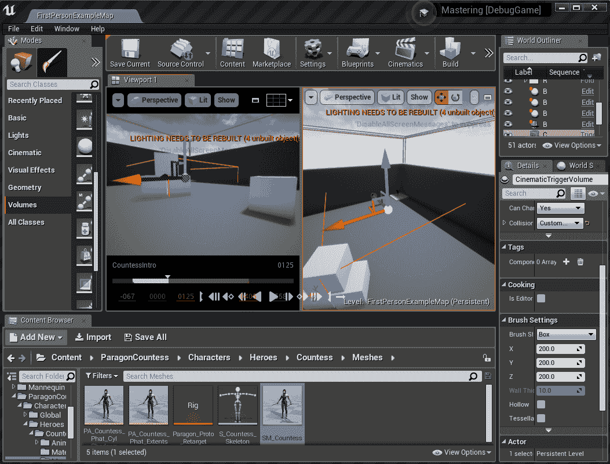

还要注意，在 GitHub 项目中，场景中开始于空中的平台只是我们级别中的一个平面缩放的盒子，并且在其属性中 Simulate Physics 和 Enable Gravity 都没有勾选。触发体积被设置为仅检测重叠的 pawns，并且在级别蓝图中所见，一旦被一个掌握角色触发，就会自我销毁：

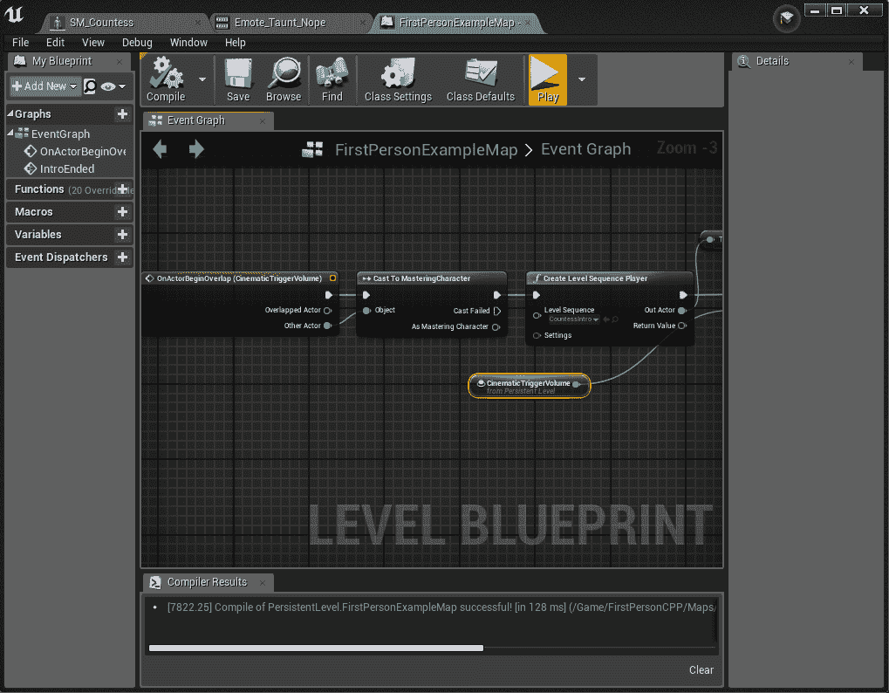

尽管为了表明这个蓝图需要分成两个镜头，但你可以看到触发体积随后立即被销毁，然后我们在场景结束时创建了一个级别序列播放器并做了一两个聪明的事情：

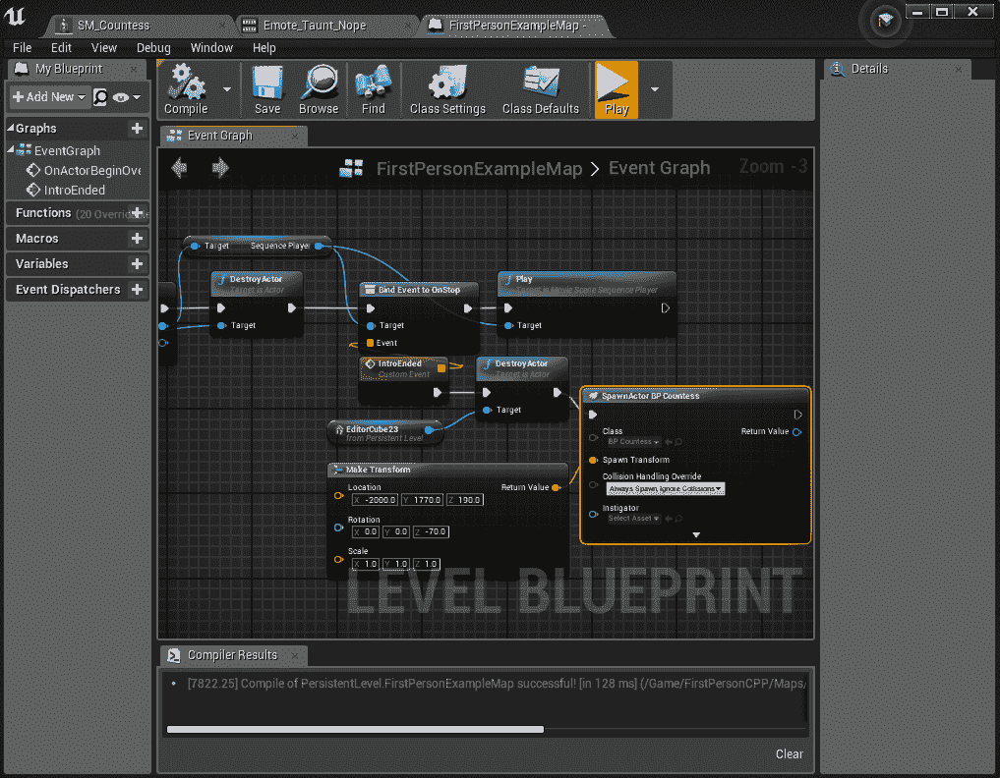

在这个阶段，我们的序列实际上已经开始播放，但直到我们让它执行某些操作之前，它应该只是立即结束并摧毁平台，然后生成 BP_Countess。所以在我们讨论场景的“如何”之前，让我们先跳到场景的“是什么”：当玩家走进这个角落时，伯爵夫人会骑在平台上降落到地面，播放她的原地转身动画以面向外侧，在底部暂停片刻后，然后在她面前播放嘲讽动画。这一切当然都是来自我们的后台骨骼网格伯爵夫人，所以这个角色不能受到伤害，也没有移动 AI。在序列的末尾（由我们绑定到该事件的标记），我们摧毁了她骑的平台，骨骼网格自动返回后台，并在相同的变换（由于我们在 BP_Countess 类的网格中设置了 90 度旋转）处替换为一个完全功能的 AI 版本。

接下来是基本序列本身：

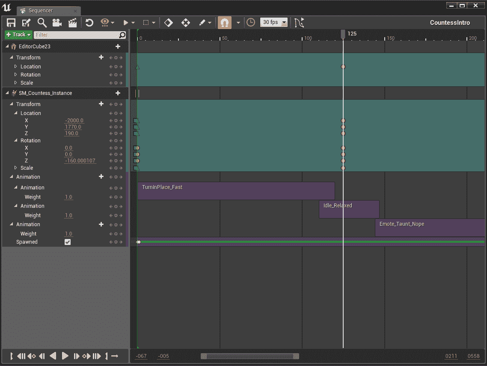

首先，我们需要将这个基本场景的两个演员添加到序列中，所以双击 CountessIntro 打开它，然后点击顶部附近的+Track 按钮。如果你已经在世界中选择了演员（在这个例子中是我们的平台和伯爵夫人骨骼网格实例），那么它们将出现在顶部以便添加，而不是搜索。一旦添加，最好在它们当前的位置添加一个变换关键帧（假设这是每个演员的期望起点）。你可以通过点击整个变换来实现，或者对于我们的平台来说，你实际上只需要选择它的位置。当轨道被选中，时间滑块（顶部红色凹槽处的线）在开始位置（点击底部的<||图标将其发送到那里）时，按*Enter*键，或者你可以点击轨道选择器部分中左右箭头之间的微小+图标来添加一个。大多数习惯于任何类型的关键帧界面（主要软件包中的动画、其他电影工具）的内容开发者应该很快就能掌握变换和关键帧的更改。

对于最简单的例子，选择这个平台，将时间滑块向前滑动到 125，将平台移动到地面水平，并在序列编辑器中添加另一个关键帧，现在你可以在这个序列中前后滑动，或者从开始播放，看到平台在关键帧之间移动。你会注意到默认情况下关键帧是一个橙色圆圈；在这种情况下，我右击了起始关键帧，将其插值设置为线性（绿色三角形），这样在从起始关键帧移动到结束关键帧的过程中就没有加速度。同样，对于伯爵夫人，你会在-1 单位标记处看到一个正方形，它会将她移动到平台上站立。此外，右击伯爵夫人实例名称/区域本身，将其设置为“转换为可生成”，这可以防止从地下到平台顶部的超快但可见的运动。对此有几种替代方案；但由于后台伯爵夫人总是在关卡开始时生成，因此对关键帧生成没有加载时间的影响。所以，在时间 0 时，取消勾选“已生成”框，并在“已生成”轨道上添加一个关键帧。在时间 1 时，勾选它，并添加另一个关键帧。当然，你也会看到在时间零时有一个常量类型的关键帧（蓝色框），代表她的平移和旋转（简单地将其设置为这些值）。现在她干净利落地出现在场景的开始处（你可以添加一个很好的效果，或者任何其他符合你设计逻辑的效果）。为了使平移与平台完全匹配，我实际上为它们添加了关键帧，选择它们的同时将它们的平移轨道设置为一起移动两个演员到地面，并在时间零设置第一个关键帧，然后滑动到 125，将他们两个都向下移动，并设置两个演员的第二关键帧（并且再次，都是线性运动）。然后我进行了一个曲线旋转，从面对地图内部，转向面对地图内部，但在那种情况下，我只选择了她的旋转轨道，因为我将初始旋转设置为 0，将其默认设置为立方（自动）转换类型，然后在时间 125 时，将她旋转到面对地图并设置第二个关键帧。

如果你把它当作现状来看待，你可以随意走动，一旦触发场景就会看到场景的播放，然后在完成之后与“正常”版本的伯爵夫人互动（这应该基于她的视觉感知，通常紧随玩家之后）。目前她没有动画，所以从她的实例的 Track+按钮（她的名字右侧，SM_Countess_Instance）添加，你会在截图和 GitHub 上注意到，你可以将多个动画添加到一个动画轨道上，或者多个动画轨道。在这里，每种都做了一次，选择她的转身动画直到她倒在地上，在她空闲动画上稍微重叠一点，以便在两者之间没有可见的突兀感，然后添加一个播放她挑衅的轨道，并调整其开始时间，直到它也稍微重叠空闲状态。在许多游戏中，这正是所需的“电影级”体验水平。我们将为这个场景添加一些音频，以增加真实感；这是一个相当传统的“游戏内”场景，而不是一个专门的“电影级”剪辑场景，后者通常会剥夺玩家的控制权并直接操纵摄像机。我们将使用上述音频快速处理这个问题。

当与 Sequencer 中的大多数轨道一起工作时，双击会将在你的编辑器窗口中调整该轨道的大小以匹配序列的长度，再次双击会将它恢复到通常更缩放的级别。当你想要查看整个序列时，这非常棒。

在 Content/FirstPersonCPP/Maps 下，向其中添加一个额外的 LevelSequence 对象（如果你在内容浏览器中右键单击，可以在动画下找到它）：IntroShot1。开篇镜头 1，它并不很有帮助，因为它没有“附加”到我们的序列中，但为了快速制作多个镜头，专注于不需要像我们那样进行关键帧动画的演员，这可以是一个非常有用的工具，使得许多关卡序列在单个序列中用作镜头。为了参考，我在实验这个场景时确实使用了几个镜头（而且，我们在这里是在学习技术和其功能，而不是证明艺术才能！），但最终发现使用单个镜头中的一些精选关键帧类型效果最好，所以这是唯一一个提交到 GitHub 的。然而，使用多个镜头，将它们组合成 Take，并快速在单个序列中切换这些镜头，Epic 在“进一步阅读”部分提供了一个非常方便的链接，供感兴趣的人参考。Sequencer 所能实现的功能深度和广度可能会让人感到不知所措，但再次强调：了解你项目的期望水平和你团队的能力，你将每次都成功，而其他团队则会失败。

现在，让我们继续完成我们的屏幕；在伯爵介绍序列中，使用顶部的+按钮添加一个轨道，并选择镜头轨道。使用+镜头按钮，添加我们的 IntroShot1。仅仅为了学习的目的，公平地说，我在导入之前，已经在关卡中为这条轨道布置了大部分的序列，但之后不得不进行一些调整，这在当时因为直接在视图中操作 CineCameraActor 而变得有些困难，尽管你总是可以专门为该相机演员分配一个视口来进行关键帧动画。观察镜头，你会看到随着伯爵下楼梯，线性关键帧，我使用一对恒定关键帧作为跳切（而不是交替镜头，但正如所提到的，这始终是一个选项），然后随着相机拉远，还有一些立方关键帧：

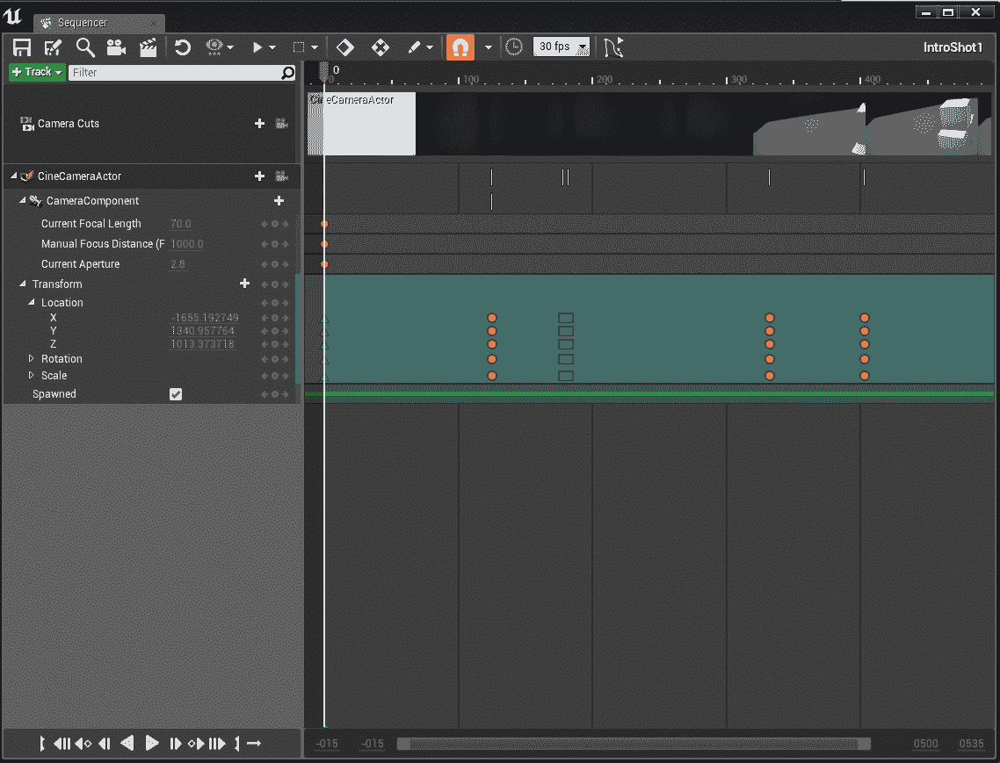

注意：你的子轨道只存在于它们在父序列中设置的时间范围内！在许多情况下，你可能需要将它们在父序列中的结束时间拖动，以使其与自身的结束对齐，以便在序列编辑器中编辑该子轨道。另一个方法是，你可以右键单击许多轨道，允许在电影播放后保持最终结果，这对于移动实体并在序列结束时精确地恢复游戏位置非常有用，例如。

回到介绍序列本身，接下来只需在合适的时间添加一个带有嘲讽音轨（当然，场景还需要更多的音轨）。最后，将模特添加到场景中，让玩家对自己的位置有一个视角上的感知，但请注意，这是一个固定位置，因为我们再次将骨骼网格实例化到过场动画中，因为玩家的第一人称角色看起来甚至更不吸引人。如果你将场景的第一个版本（玩家从自己的视角观看）与这个最终版本进行比较，差异应该非常明显——一旦意识到可用的工具，专业的内容创作者可以做到更加令人印象深刻的事情！

CineCamera Actors 本身非常强大。现在我们在这个场景中有一个，请随意探索它能做什么，并查看*进一步阅读*部分中 Epic 提供的链接，以获取更多信息。

当相机在场景中时，让我们进行最后的清理工作，隐藏我们的准星。通过触发和结束蓝图事件，我们隐藏整个 HUD，但这是游戏中唯一可见的部分：

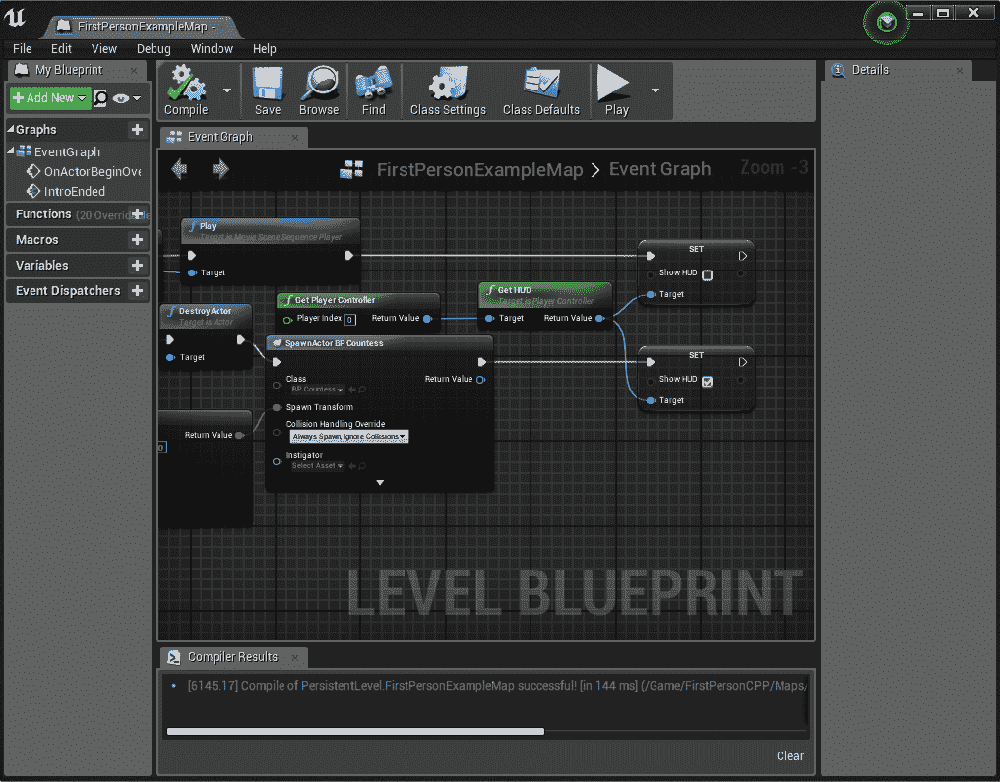

就这样！没有太多的痛苦，我们已经完成了过场动画的基本要素，并且可以通过更多的实验和投入的时间来构建所需的专业水平。

不要忘记，当与嵌入序列一起工作时，你将经常需要保存镜头、包含镜头的序列以及包含序列的水平。在创建工作流程时，请考虑水平更改的频率和版本控制。完全有可能创建一个副本水平，让电影艺术家在这里工作，而水平设计师则在“真实”的水平上工作，这样他们就不会与无法合并的二进制资产发生冲突；但当然，这也意味着需要额外的工作来确保他们各自的工作保持同步，因为他们都在发展自己的作品！

# 序列器的替代方案

本章的主要目标是使读者熟悉并建立对序列器的信心。话虽如此，如果一个团队没有时间（或需求！）来生成这样的电影级场景，还有什么其他选择呢？大多数游戏都需要一定程度的脚本场景来帮助玩家学习游戏（教程）或在某些时刻提供故事阐述、沉浸感和情感冲击。但鉴于 UE4 提供的所有功能和我们已经涉及到的这些内容，进一步深入研究以确保使用正确的工具来完成这项工作是非常有价值的。

# 快速且简单的游戏场景

在没有展示在上一节中的基于序列器的完整电影级场景的情况下，考虑游戏场景有几个重要方式。以下是一个快速选项列表和常见用途：

+   **对话系统**：这在第七章中已有详细讨论，即*在游戏中添加音频*，并提供额外的阅读材料以帮助那些正在使用它的人进一步了解。对话非常适合角色在游戏中与音频（以及潜在的动画）互动，具有定制的本地化文本和可调整的音频，这些音频可以在不同角色类型之间进行切换（例如，对男性角色的对话可以与女性角色的对话不同，或者场景中的朋友与敌人之间的对话）。尽管如此，对话的流程、播放的动画以及玩家的控制程度主要取决于设计这些交互的设计师，对话更多地是一个音频和流程控制工具，而不是一个完整的场景创建设备，因此我们的下一个可能性是。

+   **蓝图**：只要付出足够的努力，你几乎可以做到你想象中的任何事情（包括在第三章中提到的，*蓝图审查和何时使用 BP 脚本*，创建整个游戏），在蓝图里都可以实现。最终，这只是一个管理复杂性的问题；但移除玩家控制、设置特定的相机演员、触发沿样条曲线播放运动、延迟播放带有音频的动画和特殊效果，所有这些都可以通过蓝图实现。对于你想要了解更多信息的任何蓝图子部分，也有大量的信息，如果你遇到任何问题，社区支持也非常好。最大的缺点是，完全使用蓝图有一个陡峭的学习曲线，而且对于没有深入训练的团队成员来说，使用时存在巨大的错误风险，而且维护这些庞大的逻辑图可能会变得令人难以承受。不断地将重复使用的逻辑块减少到函数库，并由高度技术的人员进行监督（或创建内容）通常可以缓解这些问题，但在向不知情的艺术家推出之前要小心！

+   **简单序列**：我们上一节中的开场场景只需通过本课程就能在数小时内轻松完成，即使没有对序列器有任何熟悉度。如果只是定位演员、播放一些动画，或者加入一些酷炫效果，那么即使是技术和非技术类型的人也能通过最少量的培训来管理这些。

那么关于 Matinee 在顶部提到的内容是什么？继续阅读！

# 日场

到现在为止，可能已经反复强调过，基本上 Epic 之前保持的任何工具，出于遗留目的，序列器都可以做到。话虽如此，可能会出现某些情况，比如有人对 Matinee 有丰富的经验，或者可能有一个外包团队仍在使用它，他们希望快速将其应用于项目。除了已经提到的序列器是未来支持的工具这一原因外，没有特定的理由不能继续使用 Matinee。Matinee 因其能够在平滑的抛物线曲线中环绕建筑物的飞行汽车而成为经典。它是许多经典 UE3 和所有早期 UE4 游戏电影制作的主要支柱。刚刚完成序列器工作的任何人应该会立即认出 Matinee 编辑器中打开的许多熟悉主题：

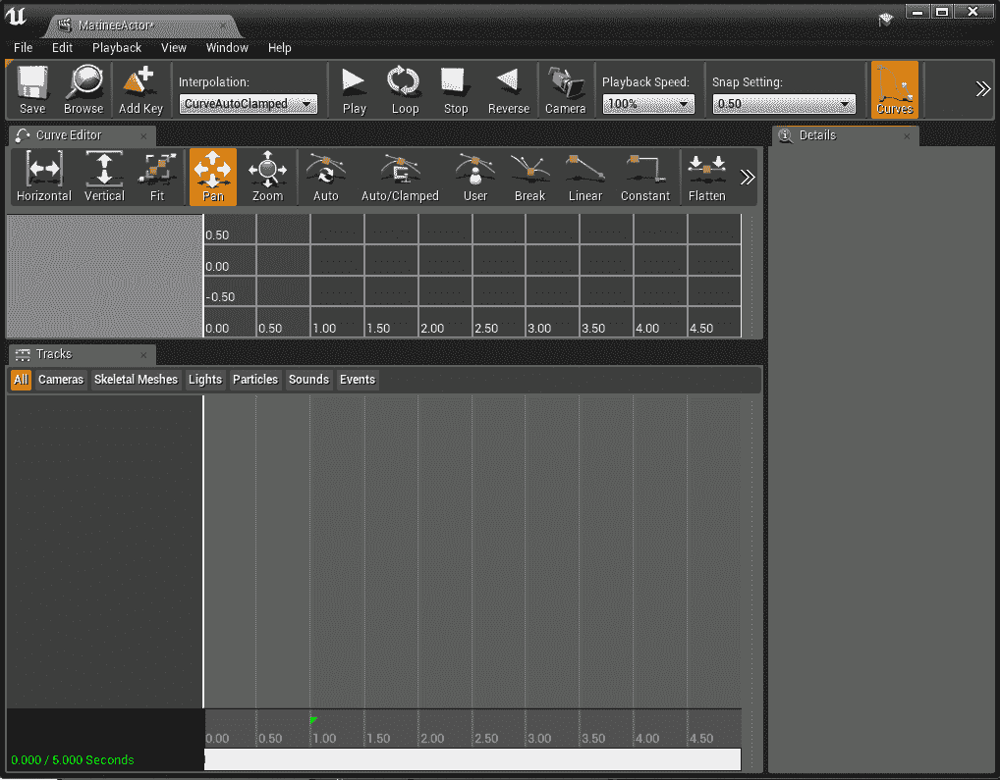

虽然主要的不同之处在于 Matinee 的前端曲线编辑工具，但不必担心，所有这些控件和一些新功能在序列器中也是可用的（查看序列器顶部的工具按钮，将其视为曲线，并选择一个带有关键帧的变换或其他轨道）：

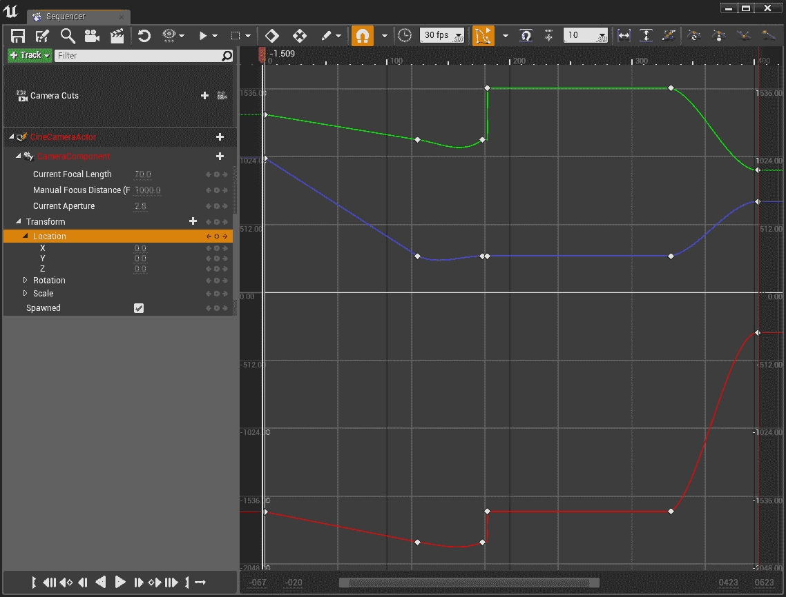

无论最终哪种方法最有效，了解可用的选项是使你的项目成功的关键，而且很可能会使用一些组合中的任何数量的选项；但到目前为止，至少风险和可能性应该从一开始就很清楚。

# 摘要

序列编辑器是一个惊人的工具，如今人们实际上正在使用 Epic 提供的技术实时制作电影级的电影，这是一件奇妙的事情。就像 UE4 的许多方面一样，这些都是深入的话题，每个话题都可能（并且很可能）有该领域的专家；但作为一个团队的技术领导者和推动者，能够舒适地使用它们，并了解它们如何以及如何相互作用，这一点被高度重视。序列编辑器和其他可用工具可以增强任何游戏，并将其推向渴望更多内容的玩家。说到这一点，我们下一章将介绍如何实际上*触及*那些玩家，并使用你的项目。

# 问题

1.  为什么熟悉序列编辑器并继续使用它是一个主要的原因？

1.  在序列编辑器中最常用的轨道有哪些？

1.  你如何将一个演员放入轨道中？

1.  为什么不在序列编辑器中直接使用带有动画蓝图的傀儡？

1.  使用关卡序列镜头的目的是什么？它有什么好处？它与轨道有何关联？

1.  在你的地图关卡中嵌入序列的主要风险是什么？

1.  如果蓝图脚本可以做到几乎任何序列可以做到的事情，那么使用它来制作过场动画有什么风险？

1.  你如何在序列编辑器中微调关键帧的曲线？

# 进一步阅读

多个镜头和拍摄：

[`docs.unrealengine.com/en-US/Engine/Sequencer/HowTo/TracksShot`](https://docs.unrealengine.com/en-US/Engine/Sequencer/HowTo/TracksShot)

电影摄像机演员：

[`docs.unrealengine.com/en-US/Engine/Sequencer/HowTo/CineCameraActors`](https://docs.unrealengine.com/en-US/Engine/Sequencer/HowTo/CineCameraActors)
