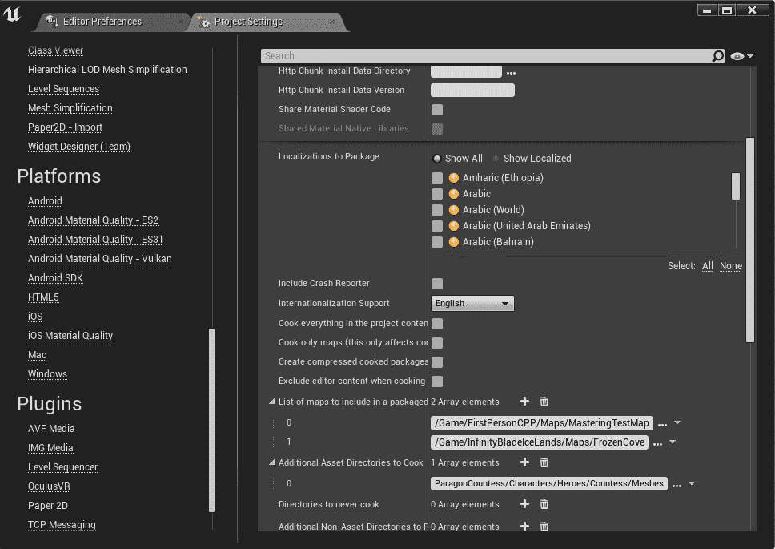
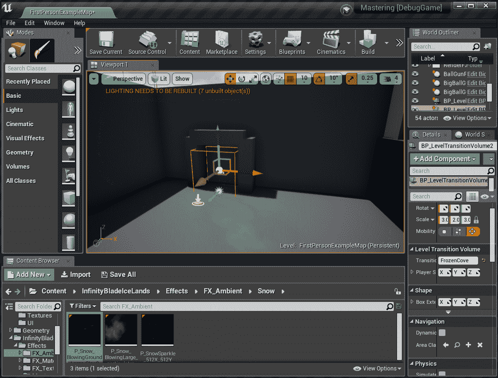
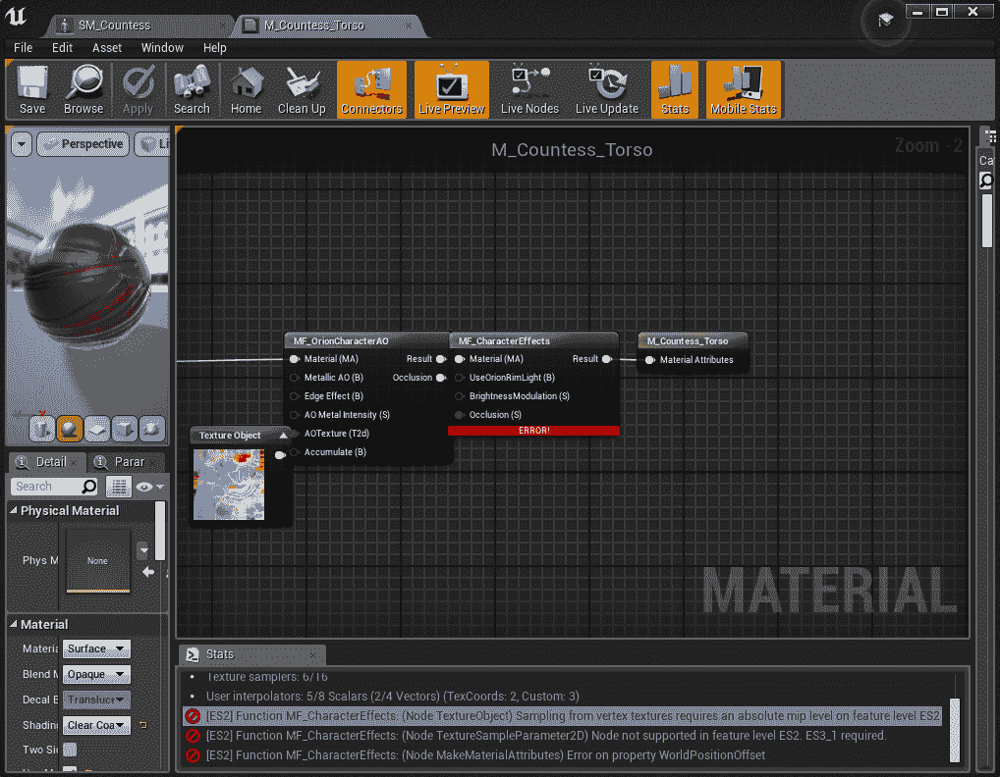
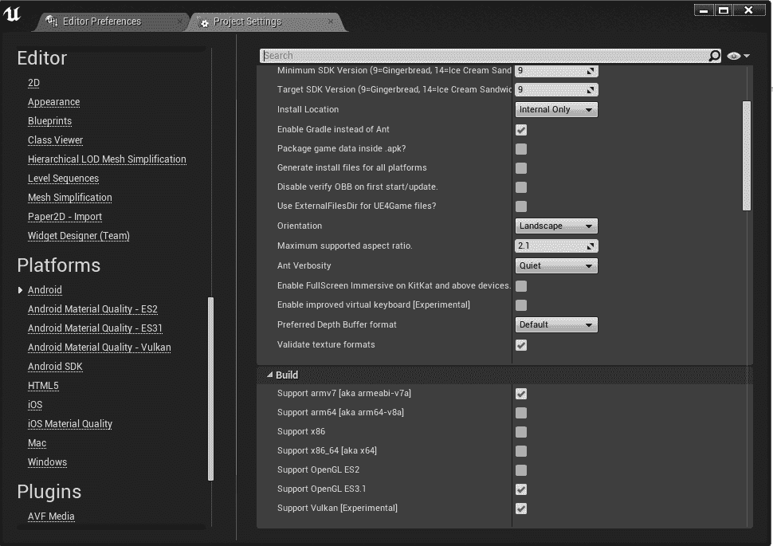
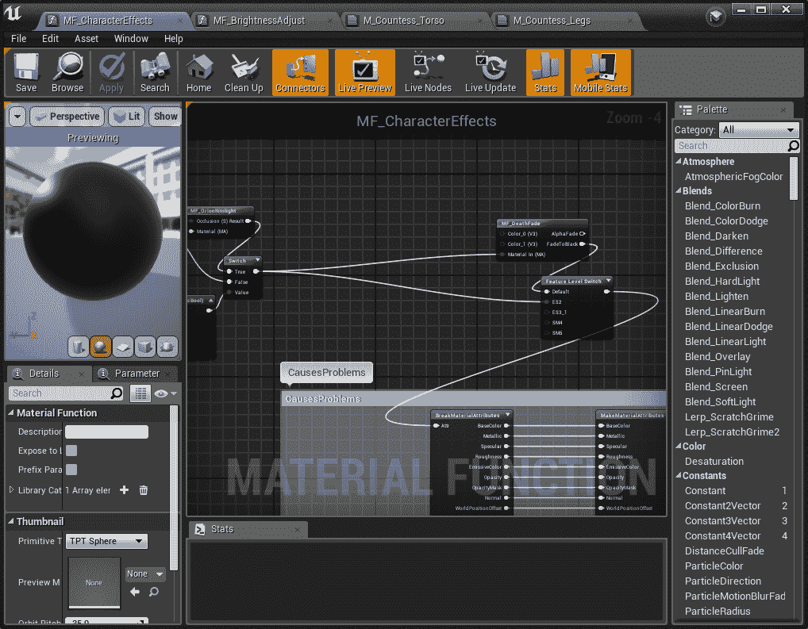
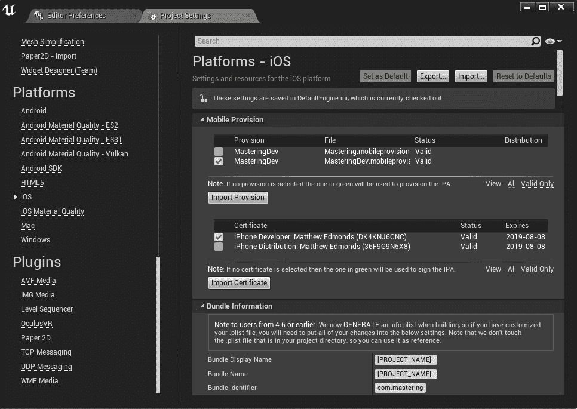

# 游戏打包（PC、移动）

# 简介

成功地将你的游戏推广给受众可能是 UE4 用户最被低估但绝对必要的技能。在本章中，我们将探讨几个这些途径。每个团队和每个项目都需要探索它们各自的平台，但过程在每个平台之间相当相似，当然，每个平台都有自己的特定之处。对于一些人来说，将游戏推广给受众可能比其他人更复杂，但希望到本章结束时，你将有一个很好的想法，了解将产品带到几乎所有市场的期望。在本章中，我们将涵盖：

+   为 PC 打包游戏

+   安卓和 iOS 设置

+   何时以及如何制作游戏的独立安装版本

+   在 Android 和 iOS 上构建和运行

+   比较 UE4 的播放与打包构建

+   避免构建中断的技巧

# 技术要求

将在 GitHub 分支第十章中提供具体示例和参考，并进行测试，但如往常一样，描述的原则和过程可以应用于任何项目。此外，游戏将构建并测试在至少两个设备上：安装了 Windows 和 Visual Studio 的 Samsung Galaxy Note 8 用于 Android，以及用于构建和安装 iPad Mini 3 的 macOS 和 Xcode。虽然这里的教学不需要这些设置或平台，但希望它们为那些需要的人提供有价值的见解和信息。最后，对于任何数量的免费浏览器（主要是 Mac 和 PC 上的 Chrome），将创建并部署 HTML5 构建：[`github.com/PacktPublishing/Mastering-Game-Development-with-Unreal-Engine-4-Second-Edition/tree/Chapter-10`](https://github.com/PacktPublishing/Mastering-Game-Development-with-Unreal-Engine-4-Second-Edition/tree/Chapter-10)。

引擎版本：4.19.2。

# 了解你的平台（们）

当然，在不同的平台上打包游戏是非常不同的。为 iOS 构建、提交和发布游戏与 PS4 或 PC（例如通过 Steam）是完全不同的体验和过程。显然，首先要问的问题是：“我们的目标受众是谁，我们将提供哪些平台？”UE4 的伟大之处在于，对于你可能会发布的任何平台，它都有一条路径，并且可以构建在该平台上运行的版本。虽然 Xbox 和 PS4 是不同的生物，因为它们需要它们的主机（分别是微软和索尼）的直接参与，但这里的平台通常限制较少。我们将在这里通过几个例子来讲解。

与有经验的人在项目部署的最后阶段合作总是好的。例如，微软为 Xbox 和其他领域设有开发者账户经理（DAMs），他们与中型和大型项目合作，这通常由工作室的生产团队负责建立联系并促进与开发团队的沟通。话虽如此，对于独立开发者来说，这可能听起来很显然，但如果你能与其他在平台上取得成功的独立开发者合作，那就更好了。这些领域的社区通常非常包容和支持。每个人有时都需要一点帮助，而参与并成为这些关系的一部分是游戏开发中另一个被忽视的优势。

# 设置可安装的 PC 版本和通用设置

对于 UE4 来说，最简单的打包平台可能是 PC（或 Mac）：你已经在上面运行了，而且你很可能在 PIE 中完成并测试的工作，在打包构建时在 PC 上“直接”就能工作。尽管如此，我们仍将探讨为最流行的移动平台 Android（可安装的`.APK`）和 iOS（类似的`.IPA`）制作版本所需准备的工作。请注意，对于后者（iOS），除非制作的是蓝图仅游戏，否则实际上构建和正确测试需要苹果开发者许可证，截至本文撰写时，一年的订阅费用约为 99 美元。如果你的目标平台之一是它，通常最好是尽早获取该许可证；但对于预算有限的爱好者和独立开发者，请注意，使用本项目在此展示的部署和测试 Android 和 HTML5 完全可行且免费。

对于特定平台用户，请注意，用于构建、测试和部署 Android 的是 Windows 10 PC 和 Visual Studio（Mac 无法使用），用于构建、测试和部署 iOS 的是配备 Xcode 的 MacBook Pro（没有 Mac 的某些类型，代码更改已经应用到我们的项目中，将无法在 PC 上工作）。理论上，可以在网络中用 Mac 从 PC 构建 iOS 构建，但这种情况通常在专业中型工作室和团队中，以及本书的家用开发中都会遇到问题。如果你发现这很容易且可靠，恭喜你，但设置这些步骤的说明将仅在*进一步阅读*部分中提供。

在深入 Android 构建之前，这里有一些关于本节中讨论的移动平台的通用注意事项。首先，对于那些好奇的人来说，下一节将具体说明在设备/平台组合的编辑器中使用播放按钮与本章其他部分讨论的打包之间的差异，所以如果在这个阶段看起来缺失，请耐心等待。以下是我们的项目在烹饪和打包所有平台时应设置的通用设置，让我们在这里查看项目/打包下的设置：

例如，由于 FrozenCove 在我们的默认地图的关卡过渡音量中仅以轻描淡写的方式提及名称。我们将它（以及类似地 MasteringTestMap）添加到上面始终包含的列表中：

此外，由于她可以在没有硬引用的情况下动态生成，我们在 Countess 的 Meshes 文件夹中处理（实际上它只是作为一个例子，说明当你有资产可能加载并使用但不在地图中直接硬引用时你可能需要做什么）。如果你在项目设置的“平台”部分下浏览每个平台的选项，你会注意到它们都有可以设置的启动画面纹理，许多都有分辨率或方向选项，你的团队可以（并且应该）根据需要设置。 

# Android 设置

处理完这些事情后，我们继续为 Android 构建。首先，前往你的引擎安装目录下的`/Extras/AndroidWorks/Win64`文件夹并启动可执行文件。这将自动引导你完成成功构建 UE4 Android 项目所需的所有步骤，以及 Visual Studio 的基本集成。在本地 Android 构建和发布到公共 Android 构建之间有几个差异，涉及到商店密钥（或上传密钥，我推荐使用），而有助于避免我简单地将所有这些 URL 复制到“进一步阅读”中的是，Epic 直接将链接集成到 Android 平台项目设置中所需的信息，请参见这里：

那些蓝色链接应带您到那些主题的最新 Android 页面。在那里，您可以阅读有关将构建提交到 Google Play 商店的各种方法的全部内容，以及一个注册密钥存储的链接。由于该过程是针对特定项目和团队选择的（链接提供了良好的背景，这里不需要重复），以下是一些快速的一般性说明，将引导到更技术性的下一个主题：对于那些还不知道的人来说，在 Play 商店中，您可以通过排除某些类型的硬件、特定手机或设备来限制您的标题，仅向具有特定 Android 版本的用户显示（这应该与您在这里 Epic 项目设置中设置的版本相匹配！），并且在其端有大量选项来决定您的游戏展示给用户的具体内容或限制内容。通常，项目经理或其他专注于此的团队成员将在项目的 Play 网络界面上设置这些具体细节，但从技术角度来看，了解这些选项的含义以及它们与您生成和上传的构建的兼容性是至关重要的。以下是一个明显的具体示例：

Android 最基本的配置之一是使用 OpenGL ES2 和 ETC2 压缩构建，前者在项目设置中（稍后会有更多介绍），后者在此处选择，其中一个选择是可调的多配置：

现在，ETC2 是 Android 上非常广泛分布和支持的纹理压缩，而 ES2 是在大量旧手机和平板电脑上使用的 OpenGL ES 的基础版本。如果你使用这两个设置构建，当尝试编译着色器时构建将失败。如果你简单地改为较新的压缩程序，ASTC，你会注意到构建成功，但 Countess 将显示默认的灰色格子纹理。在 ASTC 中，她的材质不会导致构建失败，但在 ES2 中也无法正确渲染。如果你检查这些材质中的一个，问题就很容易追踪：

在这里，ES2 并不是最佳选择，最明显的解决方案是将我们的 Android 构建改为 ES3.1，正如它所推荐的：

在这种情况下，我们的构建成功构建并打包，Countess 在这里使用的 Galaxy Note 8 上看起来很棒（但截至本文写作时，这是一款高端手机，相当昂贵）。那么，如果你的团队希望游戏在旧设备上运行会发生什么？嗯，这就是第八章中提到的质量开关发挥作用的地方，*着色器编辑和优化* *技巧*：

如果你双击该节点（MF_CharacterEffects），你会注意到我们只跳过材质的一个特定方面（死亡渐变）；但这通常是情况，如果你制作一个需要在大量设备和功能上工作的项目。ES2 构建会完全跳过有问题的功能，现在 ETC2/ES2 构建成功并运行良好，尽管这当然需要保存受影响的几个材质并重新构建大量着色器，因此要小心这些风险！注意，拥有可以交付到不同硬件集的独立“SKU”（想想产品型号）是完全可接受的，并且相当常见。一个游戏不需要为可能安装的所有可能的硬件组合制作，但如果你能这样做，特别是对于多人游戏来说，这是理想的。如果维护高端和低端潜在平台的这种兼容性变得不合理，为高端设置一个 SKU，为低端设置另一个 SKU，并且每次需要发布更新时都准备好加倍（或以其他方式乘以）你的构建及其测试时间。

最后一点，你会注意到 Android 有一个选项可以将资源打包到`.apk`文件中——对于一个非常小的项目来说，这可能可以接受，但对于大多数项目（包括这个小型项目）来说，建议不要使用这个选项。这将生成一个.obb 文件，Play 商店知道如何处理下载和安装，这在需要更改小`.apk`文件（如错误修复）而没有对项目资源进行更改时尤其方便。人们可以测试和运行，如果你不包含每个构建中数百 MB 或 1+GB 的资产，而只是使用典型的数十 MB 大小的`.apk`，你可以更快地提交构建。

# iOS 设置

与 Android 的 Play Store Key 类似，苹果有一个相当复杂但定义明确的流程来生成密钥并为其.ipa 包签名，以便部署到 iOS 设备进行测试。最终，你所使用的应该看起来像这样，到处都有“有效”的部分，包括开发签名配置文件和证书，以及各种 Ad-hoc 或其他生产配置文件/证书组合：

所有关于苹果公司这一步骤的链接都列在这里，因为 Epic 没有像 Android 那样直接提供链接。注意，你需要一个有效的苹果开发者账户才能访问这些链接中的大多数。

1.  首先，你需要一个 AppID，确保如果你使用类似于“com.mastering.*”这样的格式，在你的项目设置中不要将其设置为“com.mastering”，否则将无法找到，它需要是“com.mastering.dev”或其他格式，以便与配置文件匹配你的证书（更多关于这一点，请参考苹果公司的说明）：[`developer.apple.com/account/ios/identifier/bundle`](https://developer.apple.com/account/ios/identifier/bundle)

1.  至少设置一个设备（例如测试 iPad 或 iPhone）：[`developer.apple.com/account/ios/device/ipad`](https://developer.apple.com/account/ios/device/ipad)

1.  你需要熟悉制作开发（你只能获得一个）和 Ad-hoc/Store 分发证书。如果你是第一次使用苹果构建流程，建议从开发证书开始：[`developer.apple.com/account/ios/certificate/create`](https://developer.apple.com/account/ios/certificate/create)

1.  然后同样，你将想要熟悉制作配置文件——通常为你的团队制作一个单独的开发配置文件，然后为 Ad-hoc/Store 分发制作一个或多个：[`developer.apple.com/account/ios/profile/`](https://developer.apple.com/account/ios/profile/)

通过点击以下链接下载这些内容，并将它们导入 UE4。希望一切顺利，但就我所知，在多年的开发中，我从未见过有人第一次尝试这个过程就成功。幸运的是，有成千上万的其他人可能遇到过你将会遇到的相同问题，经过一番搜索，通常可以在网上找到解决任何阻止你在这里顺利、成功设置的问题的解决方案。

# 如何构建、测试和部署

现在所有设置都已完成，这一部分应该能让我们迅速通过在移动（或 HTML5 和 PC）平台上的正确设备测试。正如在*iOS*部分中提到的，如果事情没有立即正确工作，请不要沮丧，每个团队在最初设置和正确工作这些事情时都会遇到困难，但一旦完成，通常维护和修改这些构建设置和流程的过程会变得更加顺畅。所以，让我们开始吧！

# UE4 的播放选项与打包项目

好的，在我们实际进行一些构建并在目标平台上测试之前，还有一个最后的打扰：你可能想知道，“使用编辑器中的播放按钮直接将内容上传到我的设备，与这个打包业务相比，两者之间有什么区别？”嗯，非常粗略、非常简短地说：播放按钮会构建、编译并将内容部署到平台，并且做得相当不错，这对于快速测试非常有帮助。然而，当安装时，它可能将文件放在与你的独立构建不同的位置，并使用一些特定的设置。例如，可能需要能够从 Mac 上的 iOS 外部调试器“附加”到游戏。通常*必须*在你的设置中使用开发者证书/配置文件，当使用播放按钮时，并且特别不要/不能在您上传到苹果公司以部署给受众的产品上设置该权限设置。所以，再次强调，这里要运用常识：如果你只是进行快速修改并想在硬件上进行简单测试，如果播放按钮对你的项目和平台有效，请随意使用它。当你期望将内容实际交付给商店进行部署时，请创建独立构建并使用这些进行测试。

# 何时以及如何在设备上构建和测试

当你的团队觉得需要在各种平台上开始测试时，这实际上取决于你整个的开发哲学和流程。大多数主要工作室已经建立了这些流程，并且有特定的里程碑关卡需要通过，其中一些可能特别需要游戏将在其上运行的平台（或平台组合）上的独立构建，而其他阶段可能只需要展示游戏玩法和艺术资源，这不需要这样做。许多独立开发者可能只想尽可能缩短迭代时间，以验证基本概念（就像这本书到目前为止所做的那样），这在 PC 或 Mac 上使用 PIE 编辑器进行测试时是最简化的。然而，如果你在阅读这一节，这意味着你最终需要在设备上运行，并且这里最好的建议是，如果可能的话，从开发的第一天开始就使这些构建工作，并定期进行构建、部署和测试。这是开发中经常被忽视或长期处于休眠状态的一个方面，然后在最需要和最使用时，会引发不可预见的问题。当然，不花时间制作独立构建（甚至使用播放按钮）进行日常开发要容易得多；但一个团队不做这些的时间越长，当它们最终做的时候出现问题的风险就越大，这些问题通常是完全阻止发布的问题。所以，尽可能经常地进行构建、部署和测试！

# 制作独立构建并安装它们

Windows：由于实际上没有什么复杂的，制作 PC 包就像 文件 -> 包含项目 | Windows | Win32 （或 Win64）一样简单，对于 Mac 构建也是如此。这会给你一个可执行文件和你的构建资源文件夹，在这个阶段，上传到产品，如 Steam 进行交付应该非常简单。鉴于这一点，我们不会在这个问题上花费太多时间；但如果你只是想测试构建过程，这是最快、最简单、最简单的方法。如果你在项目设置 | 平台 | Windows 下检查，你也会注意到选项非常少，所以我们不再赘述，接下来我们将转向 Android 和 iOS 的打包。

Android：在“文件”|“包项目”|“Android”下选择你偏好的纹理压缩类型（参见设置部分下拉菜单的图片），这将生成一个.apk 文件，默认是一个.obb 文件，以及两个.bat 文件到你在点击开始构建时指定的文件夹。`.bat`文件标签非常清晰：一个用于卸载项目，另一个用于安装它（注意，后者将执行前者以确保每次都获得具有相同 AppID 的项目的干净安装）。假设你已经将设备设置为调试模式，如[`developer.android.com/studio/run/device`](https://developer.android.com/studio/run/device)所示，并且可以使用“adb devices”命令行测试它是否被识别，那么那个.bat 文件将自动直接安装到该设备（如果你只有一个设备，这通常是情况），

iOS：选择“文件”|“包项目”|“iOS”将在你指定的文件夹中为你生成一个.ipa 文件。通常，然后只需将其添加到 XCode 的设备窗口中，使用设备窗口中的+按钮即可。

HTML5 会将所有 JavaScript 以及它使用的其他内容打包成一个可以拖入浏览器中启动的包。你如何从网络分发角度向用户交付这个包取决于你，这里不再进一步探讨。

一旦这些构建在设备上，它们就可以像其他传统安装一样运行，通过从各自的商店下载。幸运的是，苹果和谷歌都提供了测试上传构建的临时区域，因此可以在提交/批准之前完全测试这些平台的整个流程。

# 避免在发布前附近的平台上的重建地狱

最后一点提醒是在考虑如何测试时要使用常识。你的更改是否可能影响不同平台上的图形（如材质编辑、复杂的新着色器更改或更改可能影响此类功能的项目设置）？那么请在代表设备上测试它们。你的更改是否仅限于游戏玩法（请注意，使用文件系统等事物在不同平台上可能会有问题，在 GitHub 项目的这个阶段，确实存在我希望能尽快解决的加载/保存设备上的错误，例如）？通常最好在开发平台上快速迭代这些更改；但最终完成时，至少要过夜，为实际平台构建，并确保没有意外。在一个大型项目中，每次你想测试任何小的更改时都花费一个小时来处理资产是愚蠢的，但忽视你实际的目标硬件平台则过于粗心。

请记住，现在有一些非常好的工具和技术可以自动化许多这些流程，并在单个高性能机器上集中构建和部署，这样整个团队都可以随时轻松访问和使用。例如，请参阅“进一步阅读”部分中的 Jenkins 和 HockeyApp。对于像 Jenkins 这样的构建自动化平台，设置通常可以简单到在通过 Unreal 编辑器打包时观察输出窗口，并将它使用的每条执行行复制到那里的步骤中。如果你有一个大型项目、大型团队或大量目标平台，这种自动化类型非常推荐。

# 摘要

虽然离游戏开发中最华丽或最激动人心的领域还远，但构建和部署对于任何希望触及除自己桌面之外受众的项目来说绝对是至关重要的。编写代码和构建着色器可能是游戏开发中更直接令人满意的部分，但如果你不能正确地构建和发布到平台，那么所有努力都将付诸东流。了解如何设置和维护这些流程是掌握 UE4 开发的绝对关键步骤。但接下来，我们将回到 UE4 提供的一些美丽视觉效果上！

# 问题

1.  为什么确定目标平台是任何项目的必要步骤？

1.  为什么将地图和内容文件夹添加到始终烹饪列表中是有原因的？

1.  添加它们可能存在哪些风险？

1.  从最低到最高的设置复杂度顺序是 iOS、PC 和 Android 吗？

1.  拥有一个单一“SKU”的产品有什么优势？拥有多个 SKU 解决了哪些问题？

1.  为了构建 iOS，需要哪些四个要素？

1.  在着色器中，对修复（如质量级别开关）的一些优缺点是什么？

1.  如何减轻大型项目的构建和迭代时间？

# 进一步阅读

在网络上的 Mac 上从 Windows 构建 iOS：

[`docs.unrealengine.com/en-us/Platforms/iOS/Windows`](https://docs.unrealengine.com/en-us/Platforms/iOS/Windows)

Jenkins 构建自动化平台：

[`jenkins.io/doc/`](https://jenkins.io/doc/)

HockeyApp 设备部署：

[`hockeyapp.net/`](https://hockeyapp.net/)
