# 场景视频和视觉效果

# 简介

UE4 有一些令人惊叹的游戏内视觉效果。媒体框架是一个非常酷的工具，用于向游戏中添加场景视频。Unreal 还有一些显著发展的，但尚未完全准备就绪的工具用于捕获实时视频。在本章中，我们将从游戏玩法中捕获一段视频，然后将其投影到表面上作为场景视频播放。Unreal 还提供了大量的视觉效果，为了使我们的武器冲击更加生动，我们将添加一些带有物理的冲击粒子，以作为这些选项的基础。本章将重点关注：

+   使用媒体框架创建游戏内视频播放器

    +   创建资产和材质，以便将其添加到地图中的任何演员

    +   触发并重复我们的视频

+   向游戏中添加基于物理的粒子

    +   为我们的投射物创建发射器并在击中事件上生成它

    +   定位和修改粒子以获得酷炫的运动/感觉

# 技术要求

本章将在 GitHub 上我们项目的`Chapter 12`分支中实现其组件：[`github.com/PacktPublishing/Mastering-Game-Development-with-Unreal-Engine-4-Second-Edition/tree/Chapter-12`](https://github.com/PacktPublishing/Mastering-Game-Development-with-Unreal-Engine-4-Second-Edition/tree/Chapter-12)。

我们使用了 4.19.2 版本的引擎。

# 使用媒体框架播放场景中的视频

媒体框架为在引擎中播放视频添加了几个有用的关键系统。然而，我们将重点关注的是通过我们的播放器触发“屏幕”上的音频播放的场景视频。这在许多游戏中是一个非常常见且受欢迎的功能，使用 Unreal 的渲染目标材质，你可以将地图其他区域的实时渲染放置在任何地方。一个经典的例子是安全摄像头显示其他区域。但为了重申，我们只是关注如何将电影放入游戏以证明可以做什么，以及了解将其添加到游戏中的涉及内容。首先，我们还需要一些新项目。

# 创建我们的资产

制作一个优秀的场景视频播放器需要几个组件，让我们快速列举一下：

+   当然是源视频！在 Epic 的文档中，他们列出了支持的文件格式，但一个简洁的版本是：如果有疑问，使用 MP4，因为它们在所有平台上都适用（具体内容稍后在此处介绍）。

+   一个文件媒体源对象，它引用了，嗯，这个源媒体（在我们的案例中，是我们的视频）。

+   一个在运行时执行工作的媒体播放器对象。

+   一个相关的媒体纹理资产。

+   使用此纹理的材料。

现在，关于 UE4 的巨大好消息是，很多操作都为你自动化了，所以不要被那个列表吓到，这个过程会出乎意料地快。

作为快速说明，我将简要描述这个特定视频的来源，因为实际的视频文件是这个概念的关键。当然，有几种方法可以捕获视频。虽然这本书并不是为了推荐任何特定的外部产品（除了承认所使用的开发工具和版本），但通过在互联网上搜索“Windows 屏幕捕获”是一个简单的解决方案。此外，使用移动设备上的某些游戏流媒体工具和应用程序也可以做到这一点：许多都有“游戏模式”，可以捕获视频并保存。

在编辑器中查看序列录制器（Windows | 序列录制器），因为这可能是你需要的。我过去在使用它时发现了一些问题；但是，像这样的系统一直在进行持续的工作，如果你能熟悉 UE4 内置的受支持系统，这将是最简单的方法。

你可以看到的已签入资产实际上只是我走进游戏中的 Countess 介绍场景，并将其捕获成 MP4 视频的过程，这个视频将与分支一起上传到 GitHub。所以，将这个视频文件添加到我们的内容文件夹后，我们可以回到编辑器，并在内容浏览器中制作项目：

如前所述，接下来我们需要的是一个文件媒体源：

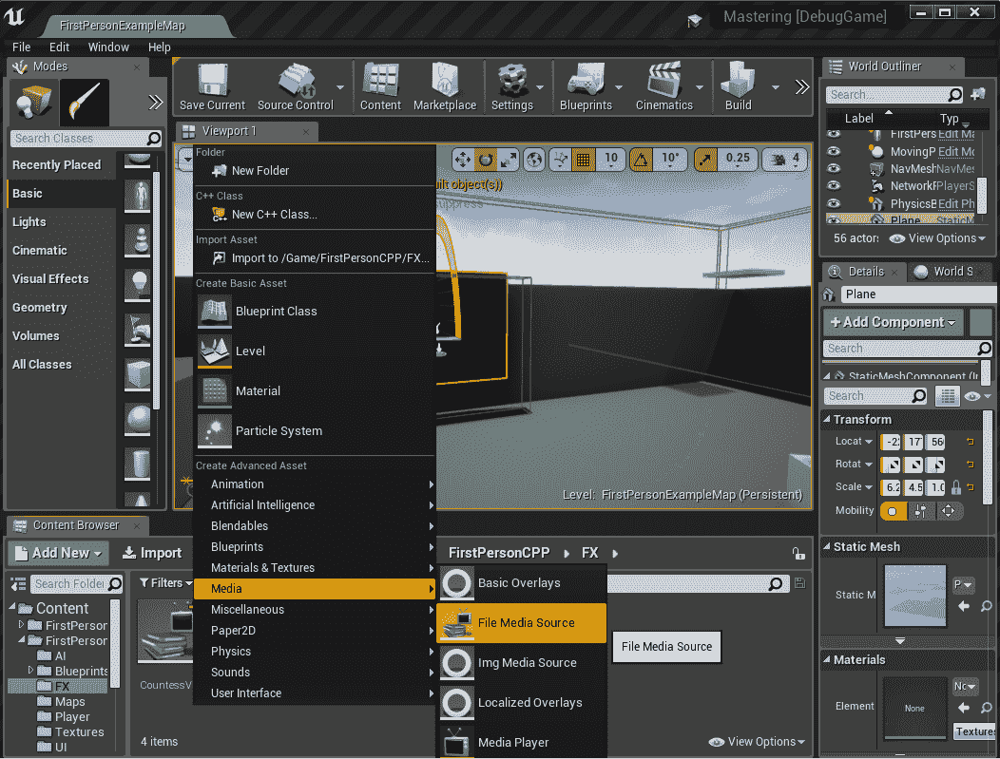

如你所见，这个特定对象实际上并没有什么复杂，只需将其指向源媒体，并注意有平台播放器覆盖选项：

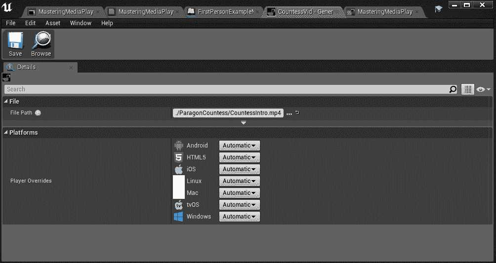

我们在这里要添加的最后一件事是我们的媒体播放器。请注意，在创建新的媒体播放器时，你会得到这个弹出窗口，并且绝对需要勾选这个框（因为它会自动为我们生成媒体纹理并将其连接起来）：

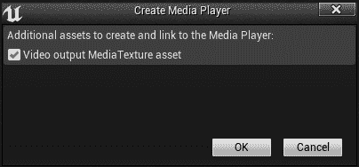

点击确定后，我们可以继续：

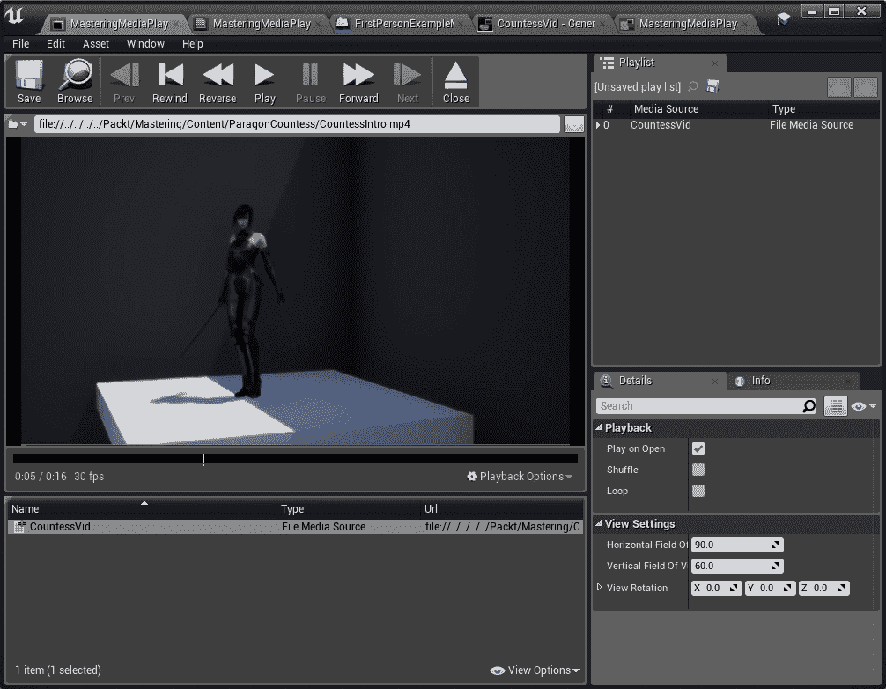

在这里，只需将我们刚刚制作的 CountessVid 资产简单地拖放到左下角的列表中，播放器就准备好了，默认设置已经完成。我们的纹理资产现在已自动创建并关联（再次强调，这是现代 UE4 的一个非常好的简化功能！）。现在我们需要的只是一个材质，我们可以通过将纹理拖放到一个演员上来生成它，所以让我们继续进行。

# 在场景中构建和播放视频

理论上，你现在可以在任何静态网格演员或多个表面上播放视频。通常情况下，这只是一个平面，可以从模式窗口直接拖动到级别中。我们将通过将媒体纹理直接拖放到我们想要使用的演员（在这种情况下是我们的平面）上来生成一个材质，然后你可以看到添加了一个非常简单的材质，并设置在表面上。所以完成所有这些后，如这里所见，还剩下一个小问题：如果我们在场景中的屏幕（平面）上不右键单击+添加组件，添加一个媒体声音组件，并将其媒体连接到播放器，音频将无法播放：

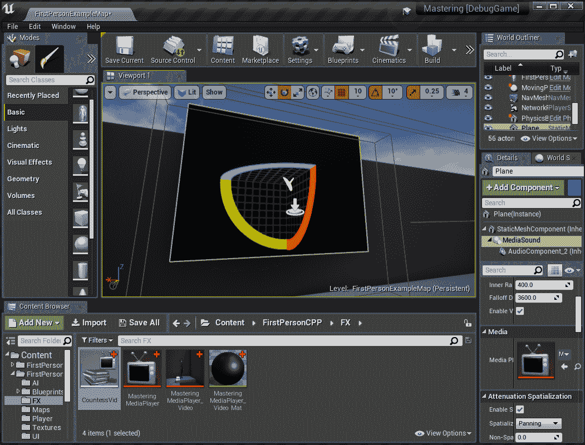

以这种方式手动连接音频是现在我对这个流程的唯一抱怨之一，所以现在我们几乎拥有了所有需要的东西，只需要触发视频并查看它：

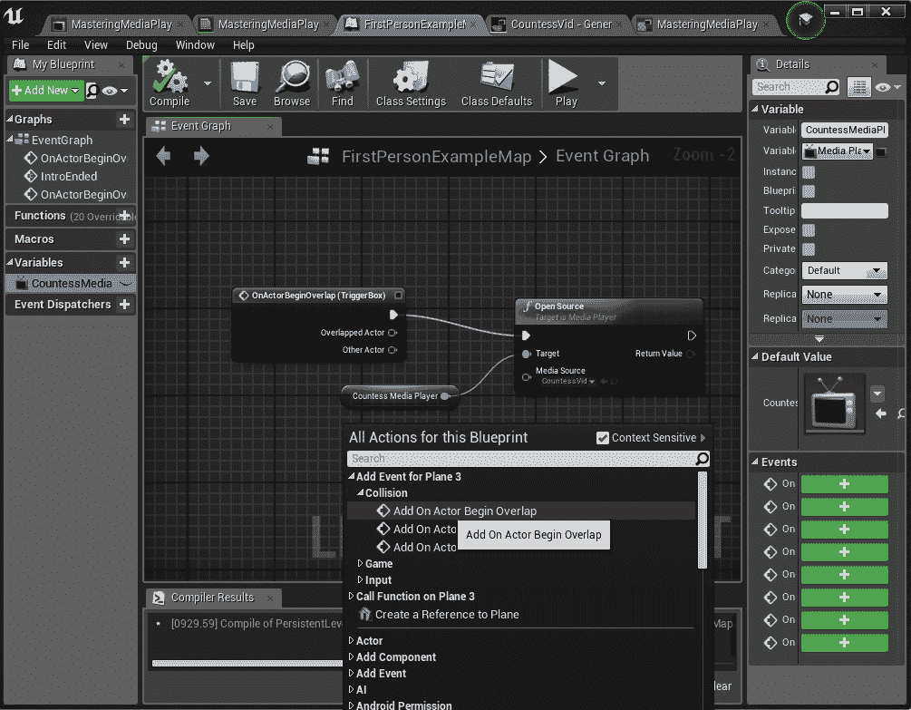

在这里，我们在屏幕前方添加了一个简单的触发体积，在关卡蓝图左侧添加了一个蓝图级别的变量（媒体播放器类型），选中体积后，在蓝图事件区域右键单击可以直接将它的 actor-overlap 事件拖入并触发一个开源节点，该节点也设置为指向我们新的资产。所以请注意，这个逻辑将触发任何使用我们媒体播放器的该材料实例，这可能很好，但也可能不是你想要的。这里有几个解决方案——最明显但不是最优雅的解决方案是，为每个需要单独播放的东西复制播放器。无论如何，现在我们可以走到屏幕前，像我们触发 MP4 视频那样多次观看和听到伯爵夫人的开场序列！

最后一点：当播放时，这个视频在场景中看起来相当暗：

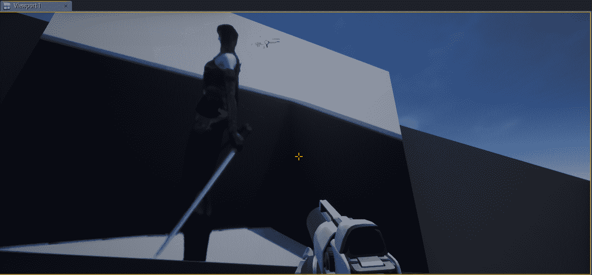

为了纠正这一点，我在材质中的颜色输出上进行了非常简单的乘法操作。再次强调，你可以用多种方法来处理这个问题；我总是从最简单的方法开始，如果它有效，就继续前进！你可以在这里检查这个变化，修改材质中的常量值，看看它对我们游戏中的输出有什么影响：

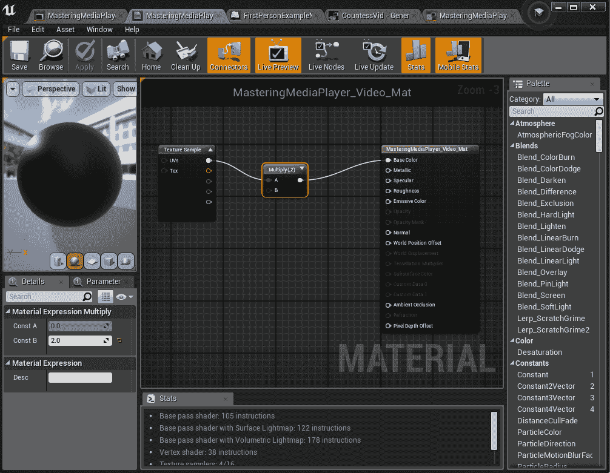

现在我们来看看一些使用 UE4 制作的更多优秀的视觉效果，因为我们还没有充分利用它们的粒子系统。

# 添加物理粒子

我们的目标将有两个部分：首先，在弹射物击中时添加一些火花，但随后要让这些火花在物理宇宙中弹跳，而不会完全杀死我们的帧率。一个好消息是，UE4 支持所有平台上的 GPU 粒子，通常你希望在这里做这类工作。如果你发现自己在一个因为复杂视觉效果（或平台硬件规格低）而受 GPU 限制的游戏中，这类事情通常是首先被放弃的；但现在我们不要担心这个，让我们先做一些漂亮的火花。

# 在弹射物击中创建初始发射器

因此，有些人可能还记得在书的开始处我们添加了起始内容包。现在，我们终于可以更充分地利用它了。在文件夹底部滚动，可以看到 StarterContent/Particles（或只需在搜索框中执行 P_Sparks 的通配符搜索）。这并不完全是我们想要的，但已经很接近了，这总是能节省时间。注意，它已经使用了一些火花和烟雾 GPU Sprite 发射器（另一个是闪光/爆发）。看起来很接近，所以为什么不从这里开始呢？同样，对于 C++ 类和游戏开发的各个方面，如果你可以开始使用至少部分已经完成你想要的工作的内容，始终利用它并从那里开始修改以提高效率。现在，让我们来看看这些火花：

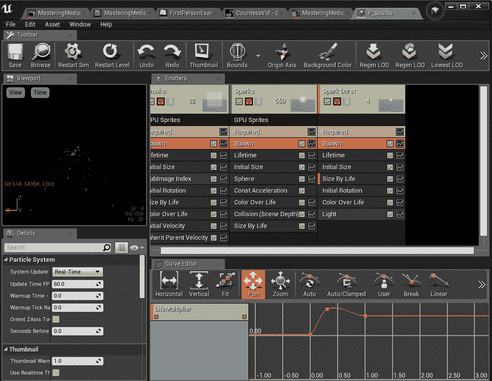

由于我们将对它们进行一些修改以使其行为略有不同，我只需将发射器（P_Sparks 资产）复制粘贴到 FirstPersonCPP/FX 中。我还将其重命名为 P_ImpactSparks 以避免在查找时产生混淆。现在我们有了自己的副本，可以开始修改它了。不过，首先，让我们退一步，让它们在投射物撞击时生成。我们需要在我们的 MasteringProjectile 类中添加一个新变量，并在生成撞击声音的附近生成它们：

首先，在我们的投射物头文件中添加：

```cpp
UPROPERTY(EditAnywhere, BlueprintReadWrite)
class UParticleSystem* ImpactParticles;
```

然后在 `.cpp` 文件底部的 `OnHit` 中添加：

```cpp
const float minVelocity = 1000.0f;
if (cueToPlay != nullptr && GetVelocity().Size() > minVelocity)
{
        UGameplayStatics::PlaySoundAtLocation(this, cueToPlay, Hit.Location);

        UGameplayStatics::SpawnEmitterAtLocation(GetWorld(), ImpactParticles, Hit.Location, GetActorRotation(), true);
}
```

就这样，我们在撞击位置生成了粒子。只需转到 `FirstPersonCPP/Blueprints/Weapons` 文件夹中的每个投射物，并将它们的 ImpactParticle 变量设置为使用新复制的 P_ImpactSparks 资产。对于那些按步骤进行的人，你们在这个阶段可能会注意到一些问题：

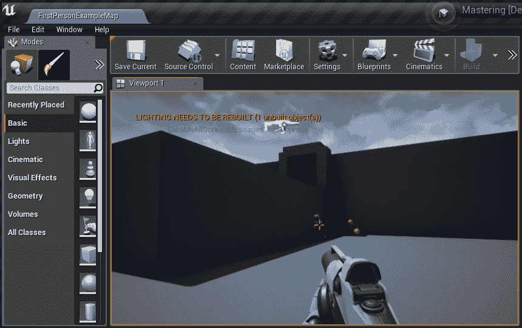

首先，我们的粒子系统（发射器）永远存在，其次，它们总是垂直向上和向下生成，没有任何速度感，就像静止的喷泉一样简单地流向地面。第一个问题很容易解决：在 Cascade 中打开 P_ImpactSparks（双击资产），你会在主窗口中看到三个发射器。点击每个的 Required 栏，并在 Details 菜单中向下滚动，你会看到所有三个都有一个循环计数设置为 0（无限循环）——将其设置为 1 以修复我们这里的无限系统：

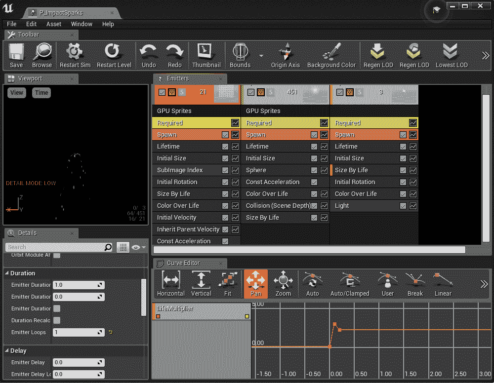

我并不是特别喜欢 Cascade 中的用户界面，但通过实践，我看到了一些熟练使用它的特效艺术家，他们可以非常快速地找到并修改系统。在这种情况下，我们可能希望增加火花的速度并减少发射器的寿命，但这些更多是外观上的事情。我们最后的任务是确保它们以正确的方式对准投射物撞击的表面，并确保我们可以在需要时调整火花的行为以优化性能。

那为什么不使用 Niagara，这个更新的粒子编辑器呢？说实话，在这个例子中，是我自己对 Cascade 的熟悉程度；但当然，任何人都可以使用 Niagara，我会在“进一步阅读”中添加一个链接（该链接从与 Cascade 的差异和相似之处开始）。类似于早期的 Matinee 与 Sequencer，两者都将继续存在并得到支持，但从长远来看，可能确实是一个好主意转向 Niagara。

# 对粒子物理进行定位和调整

仅让粒子系统降下看起来无聊的火花并不能满足这种效果，我们需要火花以符合弹道冲击的方式排列。这需要一点额外的代码工作和一点额外的 Cascade 工作量；但最终效果应该会很不错。

**注意：**如果你使用蓝图来生成各种效果，这将使你更容易将这些发射器和系统连接到外部因素。技术艺术家通常发现这一点非常有价值，可以快速迭代系统，直到它们看起来正确。只是要注意，一个有良好意图的内容创作者可能会意外地测试大量物理碰撞，所以这种实验可能会对性能造成危险！

首先，快速代码更改：

```cpp
FRotator rot =  GetVelocity().ToOrientationRotator();
UGameplayStatics::SpawnEmitterAttached(ImpactParticles, GetRootComponent(), NAME_None, FVector::ZeroVector, rot, EAttachLocation::SnapToTargetIncludingScale, true);
```

这里有很多选项，你可以使用 Hit.Normal/Hit.ImpactNormal 来代替速度来构建你的旋转，例如，如果需要的话，不附加粒子。我发现在这里，附加系统使粒子感觉像是被“拉扯”的，这产生了一种混乱的外观，我喜欢这种效果，同时沿着速度设置旋转。在 Cascade 中，目前只有烟雾系统被设置为继承父级的速度；我将火花也设置为这样做（在发射器的列区域右键单击，添加该字段，并选择它）。注意左侧的减少发射器持续时间调整值：

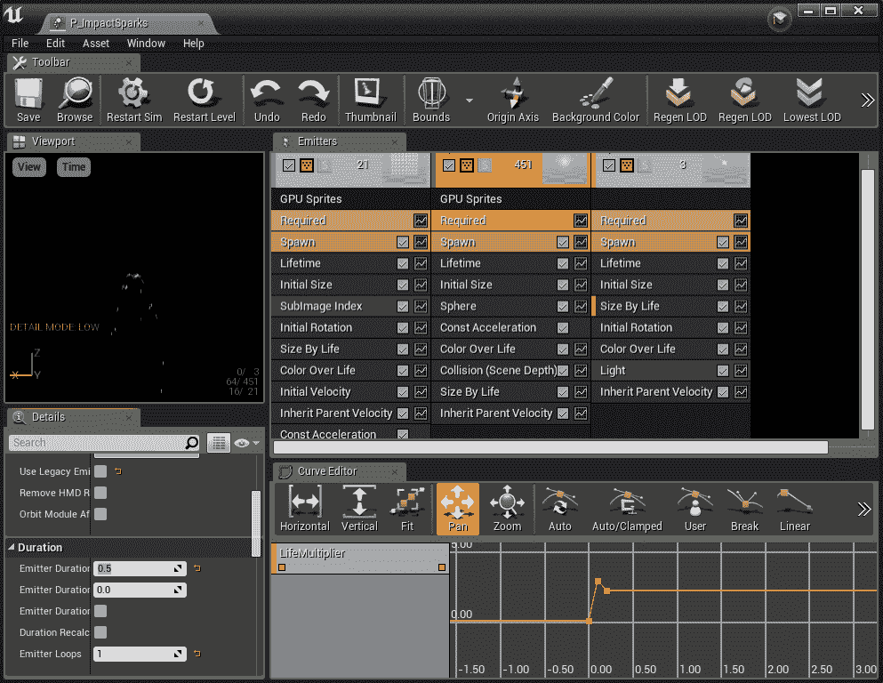

最终结果还不完全适合专业质量，了解自己的限制是随着团队成长的重要特质。不过，希望这段旅程有助于增强你对 Unreal 精彩视觉效果的信心。还有更多东西可以探索，但拥有推动项目前进的基础是这本书的主要内容。

# 摘要

我们已经触及了传统 UE4 提供的几乎所有主要系统。虽然还有一些更专业的系统，但在这个阶段，你应该能够舒适地在 UE4 中制作任何平台上的传统游戏。虚幻社区有大量的视觉特效可以免费下载，了解上述内容后，你应该有信心去探索其深层次选项！我们还没有真正探索的一个领域是；这是 UE4 中最新的之一，我们将在下一章中介绍：增强现实和虚拟现实，虚幻的增强现实和虚拟现实 API 和项目。这也是我们主要 GitHub 项目的更新结束：从它作为 FirstPersonCPP 模板的谦卑起源，到 FrozenCove 的雾和光照，到 Countess 和她的 AI，到加载和保存，以及效果和优化。我希望你发现这是一次启发性和有意义的旅程。现在，让我们进入增强现实和虚拟现实的新世界！

# 问题

1.  为什么 MP4 通常是 UE4 中视频的最佳选择？（提示：查看*进一步阅读*部分以获取一些详细信息）

1.  如果一个媒体播放器被多个演员引用，打开该媒体时会发生什么？

1.  有什么快速简单的方法可以获取你的视频纹理和视频素材？

1.  为什么在这里添加了颜色输出的常数乘数？

1.  我们在粒子发射器上使用了什么好的策略来节省时间，无论是在 C++还是在资产创建中？

1.  为什么我们应该将发射器附加到我们的弹道上，而不是让它像最初实现的那样在空间中保持静止？

1.  我们是如何将发射器与弹道方向对齐的？

1.  在什么情况下，让粒子在 GPU 上模拟（在 Cascade 中可以轻松更改）是不利的？

# 进一步阅读

媒体框架支持的视频类型：

[`docs.unrealengine.com/en-US/Engine/MediaFramework/TechReference`](https://docs.unrealengine.com/en-US/Engine/MediaFramework/TechReference)

尼亚加拉粒子编辑器：

[`docs.unrealengine.com/en-us/Engine/Niagara`](https://docs.unrealengine.com/en-us/Engine/Niagara)
