# 第十三章：UE4 中的虚拟现实和增强现实

# 简介

UE4 中最新且最激动人心的两个新增功能是其虚拟现实（VR）和**增强现实**（**AR**）集成。虽然 VR 已经存在了一段时间，但 AR 在 2018 年夏季 4.20 版本中首次完全功能化，无需合并自定义分支或使用实验性组件。尽管两者都有巨大的世界可以探索，但我们将专注于本书的主题，通过构建项目并对其中的实际应用进行一些添加，来建立对 Unreal 系统意识和信心的构建。所以，准备好探索 Unreal 世界中最新且可能是最酷的新平台！我们这里的最后一章涵盖了：

+   创建和修改 VR 项目

    +   准备部署到 Android GearVR 头戴式设备

    +   向项目中添加基于运动的新控制功能

+   创建和修改 AR 项目

    +   准备部署到 Android 手机

    +   将我们的弹丸从主项目移植到我们的新 AR 游戏中！

# 技术要求

为了专注于这些新平台的技术，它们都将创建为新的独立项目，如上所述。虽然将现有的 Mastering 项目移植以支持 VR 甚至 AR 是完全可能的，正如本书多次提到的：像这样的重大决策最好在项目开始时做出，以便最初进行验证，并在整个开发过程中维护。话虽如此，在 AR 项目中，我们将从先前的项目中移植一些工作，以了解这个过程，同时也对创建的工作的可移植性进行了一次良好的测试。这两个相应的项目位于 GitHub 的以下分支中：

VR：

[`github.com/PacktPublishing/Mastering-Game-Development-with-Unreal-Engine-4-Second-Edition/tree/Chapter-13-VR`](https://github.com/PacktPublishing/Mastering-Game-Development-with-Unreal-Engine-4-Second-Edition/tree/Chapter-13-VR)

AR：

[`github.com/PacktPublishing/Mastering-Game-Development-with-Unreal-Engine-4-Second-Edition/tree/Chapter-13-AR`](https://github.com/PacktPublishing/Mastering-Game-Development-with-Unreal-Engine-4-Second-Edition/tree/Chapter-13-AR)

此外，对于 AR 组件，鉴于使用的 GearVR 平台，还在我的 Galaxy Note 8 上安装了 Google 的 ARCore 应用，以便在不安装自定义 Google API 的情况下进行 Unreal 集成，避免了之前安装时的巨大头痛。在这个领域（AR），4.20 与之前的集成相比是一个梦想，尤其是在 iOS 和 Android 上，因此强烈建议（尽管不是具体要求）至少更新到 4.20 以适应本章内容。

使用的引擎版本：4.20.2。

注意：对于使用 Mac 和 iOS 平台的人来说，虽然在这里我没有特别涵盖这些平台，但这些主要是蓝图项目模板，过程不会有太大的变化，所以请随意浏览本章中的蓝图代码、代码迁移以及其他要点，同时将“Finder”替换为“资源管理器”，“XCode”替换为“Visual Studio”，“iPad/iPhone”替换为“Android”。唯一可能最困难的部分已经在第十章中介绍过了，即*打包游戏（PC、移动设备）。*

# 制作 VR 项目并添加新控制

如我肯定读者们在这个阶段已经非常清楚的那样，VR 涉及用户佩戴头戴式设备，游戏或应用向他们展示一个他们可以完全沉浸其中的 3D 世界。

# 制作初始 VR 项目

对于那些一直陪伴我完成这本书全程的读者，我们将从第一章制作一个第一人称射击游戏的 C++项目进行简要回顾。不过，内容不会太多；但对于那些想直接跳到这里的读者，我们不会跳过任何主要步骤。所以首先启动引擎，不要指定项目，正如第一章中提到的，这可以从您的引擎安装目录本身完成，或者希望这里已经有了为它创建的快捷方式。当 Unreal 项目浏览器出现时，点击“新建项目”标签：

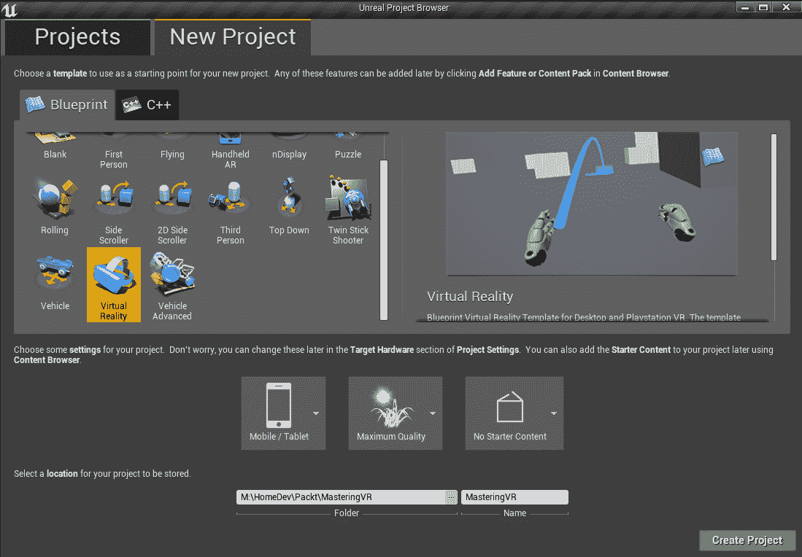

然后选择蓝图标签页的“VR 项目”模板，我们将内容级别设置为“移动/平板”，并移除“入门内容”（尽管我通常建议在原型设计时保留它，因为它提供了一些有趣的物体来玩耍，但确实会占用相当多的额外空间）。当然，你可以随意命名它，但为了与 GitHub 的文件匹配，使用上面的名称，MasteringVR。点击创建按钮后，它应该会自动在编辑器中打开，并且对于多个平台（PS4-VR、Oculus Rift 等，“有线”头戴式设备）来说，它已经准备好部署和测试了。

对于那些已经通读全书的人来说，你们也会知道我通常更喜欢用 C++ 来工作，因为这样可以提高速度和便于调试，然而，这些模板目前仅作为蓝图模板存在。现在，话虽如此，添加一个 C++ 类并开始自己编译项目还是相当容易的，就像在 AR 项目中将要做的那样。*但是*，请注意，这会增加你的构建迭代时间。以我的情况为例，每次在编辑器中使用启动按钮，大约需要 5-10 分钟*每次使用*，因为每次它都会重新编译并重新签名你的 `.apk`。对于那些仔细查看 GitHub 的人来说，你们会注意到我一度打算在 .cpp 文件中的一个 pawn 类中添加代码，但注意到这个问题后，又回到了完整的蓝图。如果你像我们在这个 VR 部分一样只坚持使用蓝图，那么迭代时间可以少于一分钟（总共！）所以在你决定在像这样的项目中使用 C++ 之前，请三思而后行。

请记住：第一次为平台构建和部署时，需要编译所有引擎着色器和烹饪你的内容。第一次构建之后，迭代时间将如我上面所述；但第一次启动将会慢一些，也比较痛苦。

# 为 GearVR 构建和部署

即使有了方便的 VR 项目模板，对于那些跟随我的脚步并使用三星 Android 设备的人来说，要在 GearVR 平台上运行仍然需要许多步骤。

我有很多原因喜欢这个平台。首先：没有线缆！有线耳机更强大，并带来一些额外的功能，但同时也让人感觉总是被连接到 PC 或 PS4，这让我觉得分心。第二：可访问性。虽然商店和平台是三星的，而不是像其他 Android 应用那样是谷歌的，但很多人拥有 S7 及以上型号的手机，我认为它们在 GearVR 应用中的表现都非常好。希望它能够流行起来，也许三星和谷歌将来会在某个时刻整合他们的商店；但对于任何有选择在这样设备上尝试这些项目的人来说，我取得了非常好的效果。

因此，首先，对于任何基于 Android 的应用，你需要转到项目设置 -> 平台 -> Android，然后点击顶部的“立即配置”按钮：

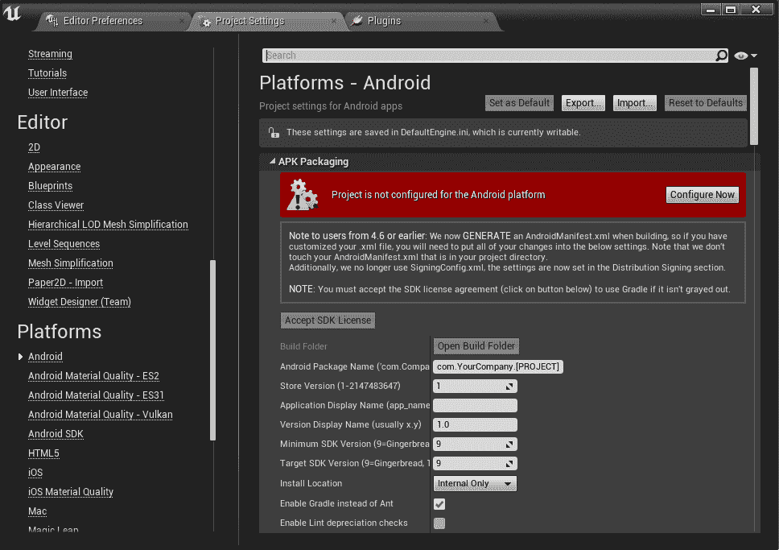

之后，在其设置中我们还需要设置一些其他内容：

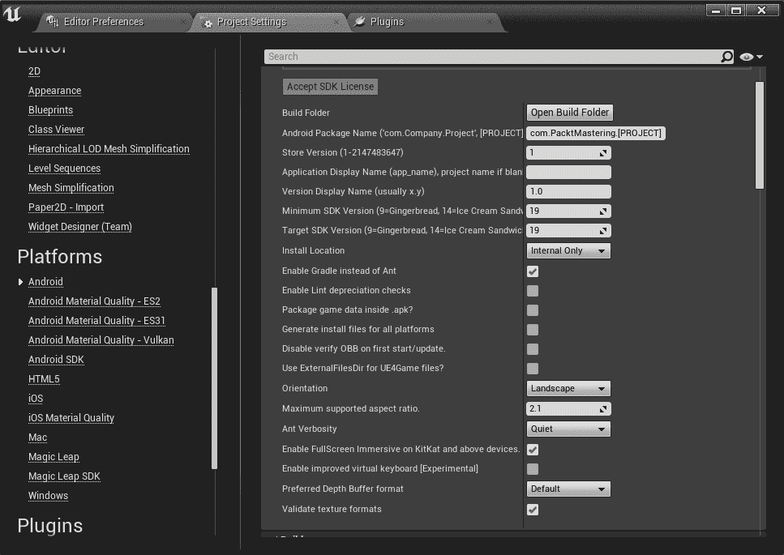

也就是说，我们需要将 SDK 版本设置为 19，Epic 建议将 KitKat+ 全屏沉浸式设置为 true（尽管我在测试中并没有发现这有必要）。

接下来，在同一部分向下滚动到高级 APK 设置，我们需要再勾选一个复选框：

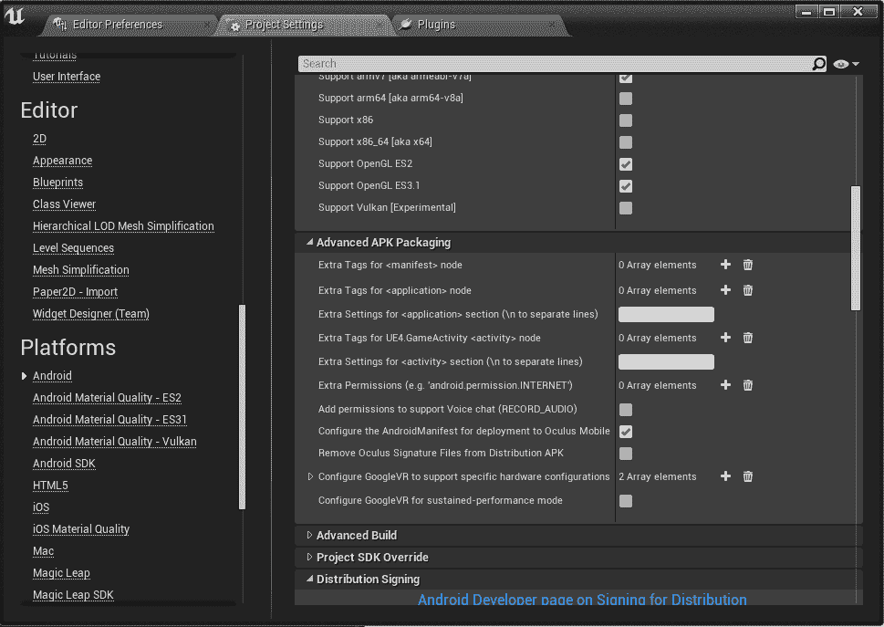

配置 AndroidManifest 以部署到 Oculus Mobile 是严格必要的，对于那些观察力敏锐的人，我提前打开了 OpenGL ES3.1，因为任何可以使用 GearVR 头显（Galaxy S6+）的设备都将支持它，而且没有理由限制你的着色器选项，也不必强迫自己在以后重新编译所有那些着色器。

注意，我也尝试启用 Vulkan，因为我喜欢它的硬件加速平台，但在这个基本项目中启动时出现了崩溃，所以，至少目前，为了避免麻烦，请将其保持未选中。

以下是两个最后的注意事项。首先，如果你打算像通常迭代时那样从编辑器启动，请将启动地图设置为 MotionControllerMap，就像这里所示，而不是默认的 StartupMap：

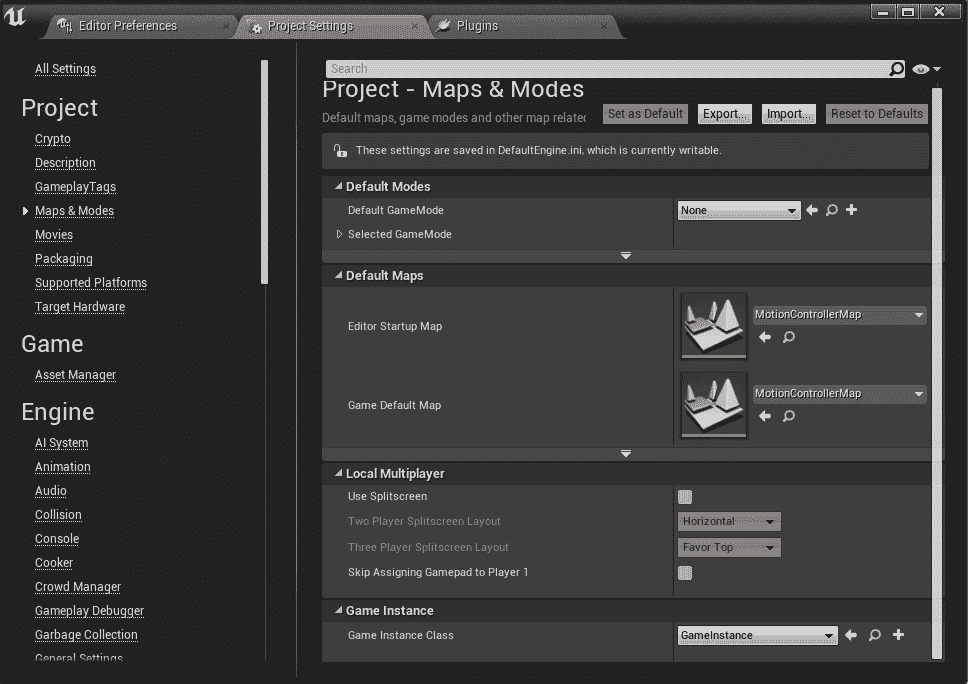

由于某种原因，GearVR 控制器在 StartupMap 中不会激活，但在 MotionControllerMap 中运行得很好（如果你制作一个独立的.apk 文件并安装运行，它本来就是默认的游戏地图）。注意，你可能需要点击摇杆几次，才能使事物正确显示，即使在这里也是如此。

最后，你需要按照这些说明从 Oculus 获取签名密钥，但这个过程比我们之前在构建和部署章节中提到的那些过程要简单得多：

[`dashboard.oculus.com/tools/osig-generator/`](https://dashboard.oculus.com/tools/osig-generator/)

如果你没有在指定的文件夹中找到该密钥，你的应用在启动时将因为未签名而崩溃。

现在，我们可以在 GearVR 头显上快速进行更改，并在不到一分钟内查看这些更改！

对于想要使用 HMD（头戴式显示器）手柄本身的人来说，Epic 在“进一步阅读”部分提供了一个很好的指南。

# 添加 HMD 控制

现在我们可以在该级别中游玩，并可以使用摇杆进行传送，如果你能靠近蓝色盒子，你可以抓住它们并使用控制器上的扳机将它们扔掉，那么在没有必须专门使用传送的情况下在级别中移动可能是个不错的选择。我们甚至可以通过根据你的头部方向进行运动来释放整个摇杆，使用 HMD（头戴式显示器）的方向本身作为传达输入的手段。

然而，这意味着玩家现在不能自由地上下看而不移动；但我们会为这个问题也添加一个修复方案。让我们首先使用基于相机方向的简单逻辑通过蓝图让玩家移动起来。为此，我们将在 MotionControllerPawn（在内容浏览器中的 Content/VirtualRealityBP/Blueprints 中找到）中做这项工作。然而，为了真正实现这一点，我们需要将这个兵种转换为角色。所以就像我们过去做的那样，打开蓝图，转到文件 | 重新父类蓝图，并选择角色。现在，默认角色有一个相当高的胶囊，我们之前的兵种期望其原点在地面，所以让我们只将其胶囊做得小一些，不需要太小，34cm，它原来的半径，对于高度来说似乎也合适：

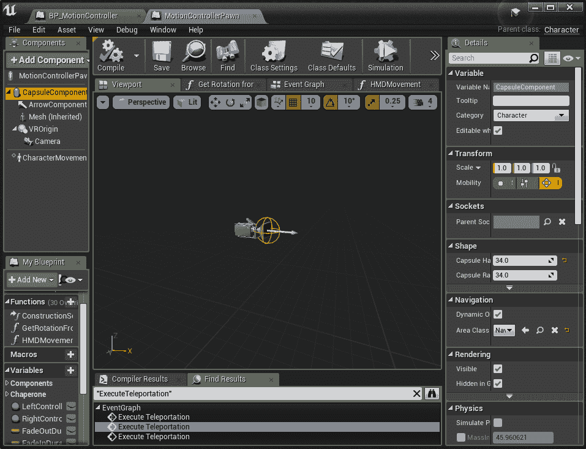

接下来我们将添加一个新的蓝图功能，并在事件计时中从序列节点拖出一个引脚来调用它：

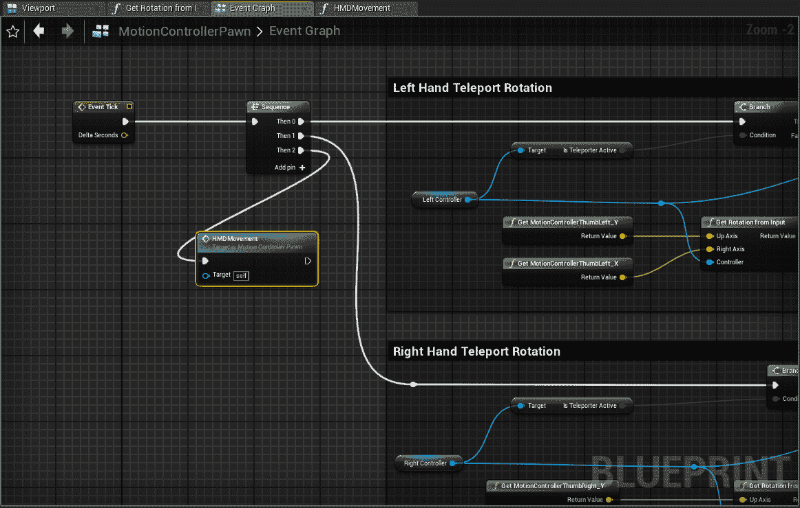

在那个函数中，我们将添加一些简单的逻辑，根据相机方向移动玩家。

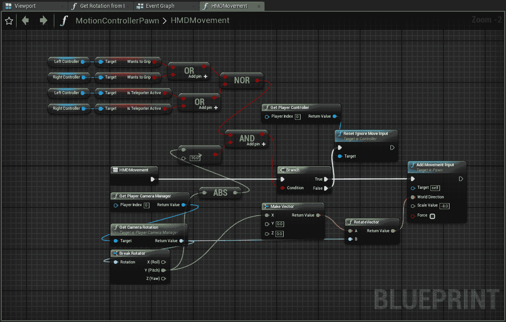

正如您在开始时看到的，我之前提到的可以禁用移动的部分，是在任何控制器试图抓取或传送（以及如果倾斜角度小于 10 度，我们也会停止）时完成的。这样玩家在执行这些动作时可以完全环顾四周，但如果不这样做，前后倾斜将使玩家前后移动，而转向当然会改变方向。如果需要，您可以通过使用相机的翻滚逻辑和侧向移动向量，轻松地添加左右侧滑。

加上这个功能后，我发现抓取那些箱子并扔来扔去比仅仅通过传送要容易得多！

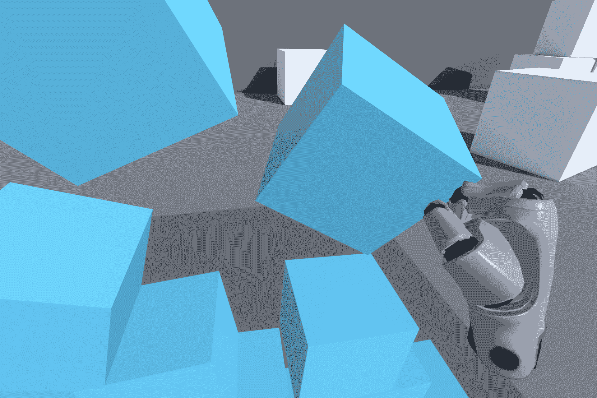

如果您对上面的截图（来自运行 VR 的设备）感到好奇，我只是在蓝图里添加了一个执行控制台命令的节点，当我在控制器上拉动扳机时触发，并执行了"HighResShot 1920x1280"（但当然，您可以将分辨率设置为任何您想要的）然后从：`\Phone\UE4Game\MasteringVR\Saved\Screenshots\Android`中检索它们。

# 制作一个 AR 项目并将我们的投射物移植过来

AR 在过去一年中已经成为一个非常受欢迎的领域，因此看到 UE4 最终拥有一个非常稳固和简单的集成路径和项目模板真是太好了。对于初学者来说，增强现实与 VR 有很大不同，因为它不会将用户从现实世界带到另一个世界，而是通过一个设备与真实世界结合，这个设备可以是像微软的 HoloLens 这样的可穿戴设备，或者是新宣布的 Magic Leap 眼镜，或者是像许多当前智能手机和平板电脑这样的手持设备。AR 将真实世界的环境整合到应用或游戏中，使用户能够将现实世界物体与游戏中的交互结合起来。我们将从这个新项目中开始，然后从之前的工作中拉取一些代码和资源到这个分支中，以展示这个过程。

# 创建初始 AR 项目

就像我们在第一章和 VR 部分直接上面所做的那样，这将会是一部分复习；但是，由于这是一个从头开始的项目，最好还是走完每一个步骤（所以准备好再次使用虚幻项目浏览器！）所以再次在没有项目的情况下启动引擎，我们来到了浏览器，在“新建项目”和“蓝图”标签下，你现在会找到一个名为“手持 AR”的模板，选择它，我们将内容设置为移动/平板电脑，并且不包含起始内容（除非你想要的话）。

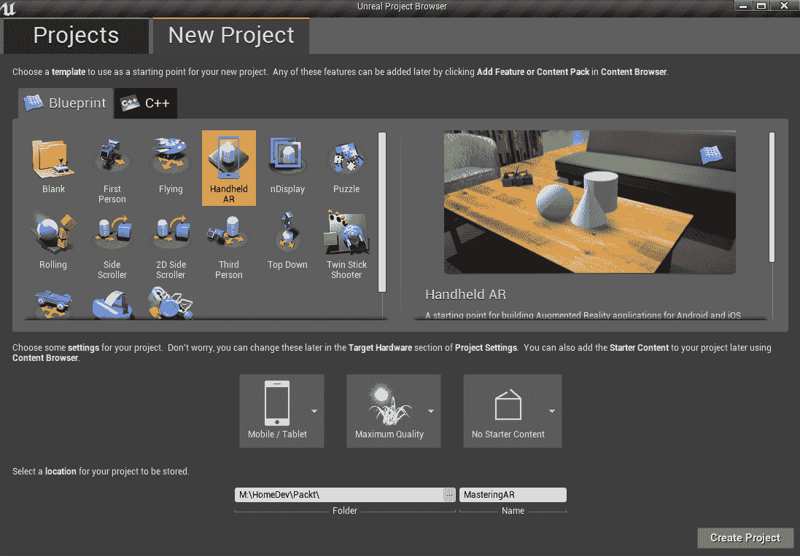

如同往常，现在应该在你的编辑器中打开它，这样我们就可以立即开始工作了！

# 安卓部署的具体细节

在这里要做的事情比 VR 部分要少得多，但必须开始同样的关键步骤，为安卓进行配置：

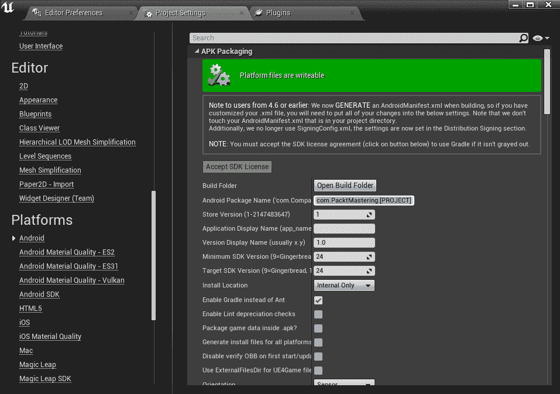

就像在 VR 中或者再次，任何安卓项目中，确保你前往“项目设置”|“平台”|“安卓”，并点击“立即配置”按钮。正如你下面可以看到的，在这个模板中，它已经为我们完成了之前为 VR 所做的其他工作，比如为你设置 APK 版本。

事实上，这就是在我设备上运行基本 AR 游戏所需的所有内容，从那里你可以点击添加一些形状到世界中，并使用调试菜单来感受 UE4 AR 正在做什么，以及可视化它做得有多好。

# 将我们的投射物移植到 AR 中并发射它们

现在我们将通过将我们的投射物从早期项目中拉入这个 AR 演示中，使事情变得更加有趣。首先，我们需要将源文件添加到正确的文件夹中，然后生成项目文件。为此，我在我的本地硬盘上创建了项目的两个副本（这使得 GitHub 处理起来有些棘手，因为它们都在同一个存储库中的分支）；但为了简化事情，我将在这个分支的副本上本地工作（简单地剪切并粘贴到一个新文件夹中）：

[`github.com/PacktPublishing/Mastering-Game-Development-with-Unreal-Engine-4-Second-Edition/tree/Chapter-13-AR`](https://github.com/PacktPublishing/Mastering-Game-Development-with-Unreal-Engine-4-Second-Edition/tree/Chapter-13-AR)

并且将`第十二章`的分支放在我的 GitHub 本地驱动器常规位置：

[`github.com/PacktPublishing/Mastering-Game-Development-with-Unreal-Engine-4-Second-Edition/tree/Chapter-12`](https://github.com/PacktPublishing/Mastering-Game-Development-with-Unreal-Engine-4-Second-Edition/tree/Chapter-12)

这样我就可以从`第十二章`中挑选项目到 AR 项目中。最后，这有点复杂，但完成时，我会简单地删除我的本地`第十二章`文件和文件夹，*除了* git 信息用的`.git`隐藏文件夹，然后将本地 AR 移动（或重命名）到那个位置，并切换分支回到 AR 项目，并提交那些特定的更改。在这种情况下，Git 可能会很棘手，但我们现在只是想在 AR 环境中找点乐子，看看我们能做什么，所以让我们开始吧！

如注释所示，复制源文件是第一步，只需简单地将`第十二章`的`MasteringProjectile.h`和`.cpp`文件移动到`MasteringAR/Source`文件夹中。完成之后，我们可以右键点击`MasteringAR.uproj`文件，并使用我们的 UE4 版本生成项目文件，或者像过去一样使用批处理文件来确保我们有 VS 2017 文件。现在我们可以像平常一样构建和运行编辑器，并部署项目。但请注意，作为一个 C++项目，运行时的迭代时间将在设备上显著增加，因为每次部署都会编译代码；但这是我们在这里需要做的，以确保我们的项目能够发射出我们在前几章中构建的所有代码。

完全坦白说：我实际上不得不从这里的 UE4 AR 项目中，将其命名为 Mastering.uproject，添加一个新的 C++类 MasteringProjectile（基于 Actor 类），然后将主项目中的代码复制粘贴到这个项目中，以便迁移的资产能够正确找到其父类。过去，上面的复制粘贴文件版本一直工作得很好，但以防万一有人遇到麻烦，请尝试这个作为最后的手段，就像我一样。

有点不幸的是，我们实际上需要启动`第十二章`项目，以便将资产从那里迁移到我们的 AR 项目中。所以，在编辑器中打开它，然后浏览到我们的蓝图的项目部分，右键点击其中一个。你会看到一个弹出窗口，在资产操作中是迁移。

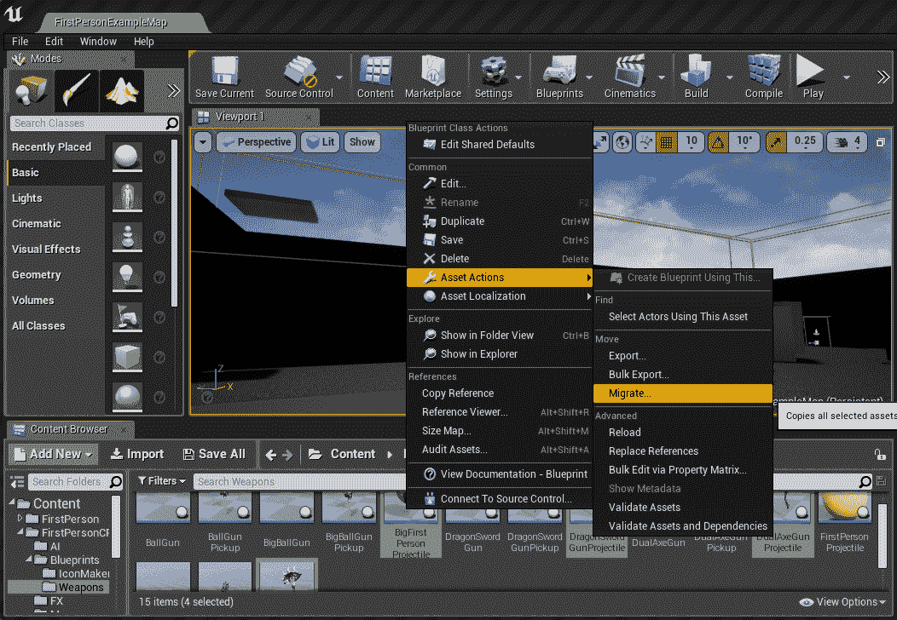

下一个弹出的是列表，基本上是 Unreal 告诉你要复制的所有依赖项，只需点击确定：

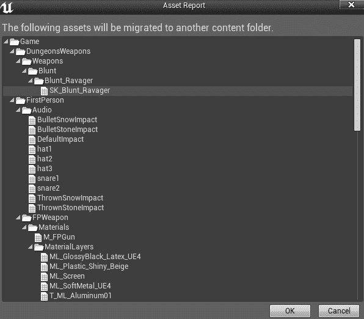

现在我们只需要将 AR 项目的 Content 文件夹中的内容文件夹指向我们的 Content 文件夹，那些弹射物以及它们所有的资产依赖（我们在第十二章，*场景视频和视觉效果*等所做的特殊 FX）都将随之而来。在共享这些资产的项目之间迁移资产可以节省大量时间，所以我很高兴终于有机会在这里分享它的使用。

完成这些后，我们就可以再次回到编辑器中的 AR 项目，创建我们的弹射物数组，并用它们代替项目开始时的测试几何形状：

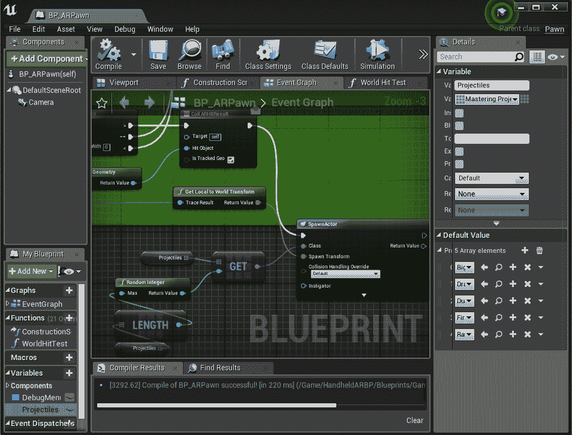

就这样，现在我们的核心项目的弹射物已经在 AR 世界中生成，带有特殊的 FX 效果！

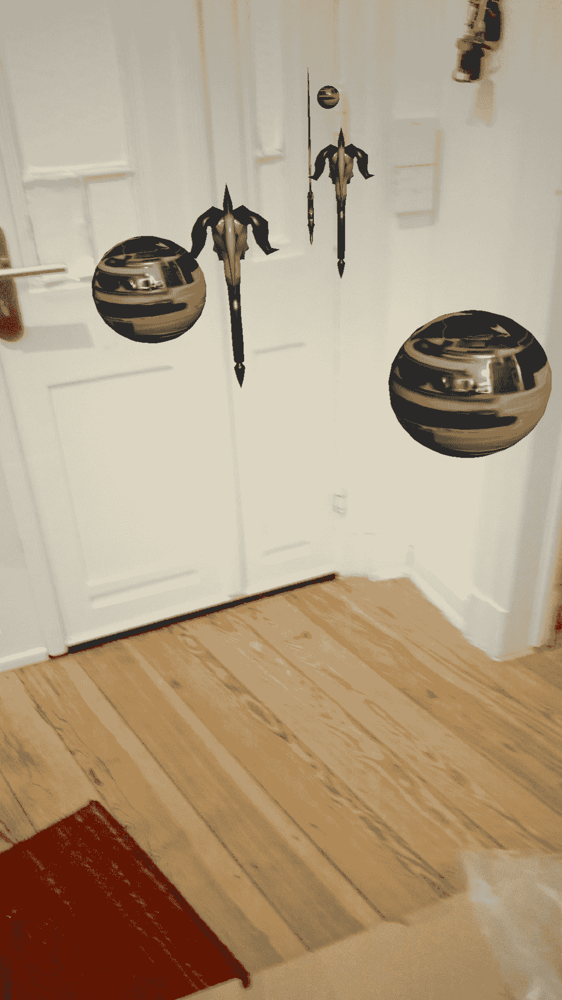

# 摘要

在这次旅程中，我们从 UE4 最基础的起点开始，到构建和修改其最新和最伟大的技术。没有什么比看到你在目标平台上的工作，并知道不久的将来全世界都能分享它，更令人满足的了。VR 和 AR 是令人兴奋的新领域，UE4 是它们发展的领导者，我们很幸运拥有它。拥有让这些技术运行起来的知识，以及它们带来的无数新项目和游戏，这使得这是一个非常激动人心的时刻，并使我们真正掌握 UE4 成为可能！

# 问题

1.  在新项目中包含起始内容有哪些优缺点？

1.  在制作 VR 或 AR 项目时，为什么尽可能长时间地保持仅蓝图是主要原因？

1.  要使每个 Android 项目都能构建和部署，必须采取哪一步？

1.  与当前的 PC/Console 版本相比，GearVR 平台有哪些优缺点？

1.  当通过 HMD 添加移动时，可能会给用户带来什么问题？它是如何缓解的？

1.  对于 AR 模板，哪些基本的 Android 设置已经设置好，我们不需要为 VR 模板设置？

1.  当从蓝图仅转换为 C++项目时，采取了哪两个步骤？

1.  如何将具有完整依赖关系的资产从一个项目迁移到另一个项目？

# 进一步阅读

UE4 中的 GearVR HMD 触摸板：

[`docs.unrealengine.com/en-us/Platforms/GearVR/HowTo/HMDTouchPad`](https://docs.unrealengine.com/en-us/Platforms/GearVR/HowTo/HMDTouchPad)

Google 支持的 Android AR 设备：

[`developers.google.com/ar/discover/supported-devices`](https://developers.google.com/ar/discover/supported-devices)
