# 什么是 Arduino

您是否曾看过一个小玩意儿并想知道它是如何工作的？您是否想创建自己的酷炫和令人兴奋的电子产品项目，但不知道如何开始？您决定开始阅读这本书是迈出的一个极好的第一步。

在这本书中，我们将教您所有开始使用 Arduino 所需的知识。从基本的电子和原型制作到设置 Arduino 开发环境以及编程，一切都会涵盖。这本书还有许多示例项目，向您展示如何使用这些知识进行实际应用。在我们到达所有这些有趣的内容之前，让我们先看看 Arduino 本身，并熟悉它。

在本章中，您将学习：

+   Arduino 板是什么

+   如何给 Arduino 板供电

+   Arduino 扩展板是什么

+   Arduino 板上引脚的功能

+   了解通用和兼容的 Arduino 板

Arduino 是一家公司，开发板，社区以及一种思维方式。正如您很快就会发现的，Arduino 也是意大利北部一家酒吧的名字。虽然我们可以从写几章关于 Arduino 这个名字代表的一切开始这本书，但这不是这本书的主题。这本书是关于教您如何使用 Arduino 开发板来构建有趣和令人兴奋的项目。除非另有说明，本书中任何地方提到 Arduino 时，我们都会指的是 Arduino 开发板。然而，我们确实认为要真正理解 Arduino 板，您至少应该对其历史有一个基本的了解；因此，我们将从向您简要介绍该板及其前身的历史开始。

# Arduino 的历史

2003 年，Hernando Barragan 开始在意大利的**互动设计学院 Ivrea**（**IDII**）攻读硕士学位时，开始了一个名为**Wiring**的项目。当时的学生使用一块价值 100 美元的微控制器板，需要额外的硬件和软件才能使用。Massimo Banzi 和 Casey Reas，因其在 Processing 语言上的工作而知名，是他的论文导师。项目的名字是*Wiring: Prototyping Physical Interaction Design*。

您可以在此处查看论文：[`people.interactionivrea.org/h.barragan/thesis/thesis_low_res.pdf`](http://people.interactionivrea.org/h.barragan/thesis/thesis_low_res.pdf)。

论文的目的在于创建一个低成本且易于使用的工具，以便非工程师能够创建数字项目。为了做到这一点，Hernando 希望抽象出电子的复杂细节，让用户专注于他们的项目。这意味着它必须通过简单地将其插入主机计算机来工作，并且有一个易于使用的界面来编程它。

第一版原型使用了**Parallax Javelin Stamp**微控制器，它使用 Java 编程语言的一个子集。这个解决方案需要 Parallax 专有工具来编译、链接并将项目上传到微控制器；因此，它不符合项目的需求，因为 Wiring 项目将是一个开源项目。

第二版原型使用了基于 Atmel ARM 的**91R40008 微控制器**。赫尔南多使用这个新微控制器获得了更好的结果；然而，他确定这个微控制器过于复杂，几乎不可能手工焊接在电路板上。

第三版原型使用了**Atmel ATmega128**微控制器和**MAVRIC**微控制器板。赫尔南多使用这个微控制器取得了巨大成功。他使用 Brian Dan 编写的一个工具**Avrdude**轻松地将新程序上传到板上。

Avrdude 至今仍在使用，可以在[`www.nongnu.org/avrdude/`](http://www.nongnu.org/avrdude/)找到。

由于 FTDI 的硬件在 Linux、Windows 和 macOS 平台上易于获取驱动程序，因此选择了它用于 USB 到串行通信。这使得 Wiring 项目能够与所有三个主要平台兼容。

2004 年，IDII 订购并支付了 25 块 Wiring 电路板。这些电路板由 SERP 制造，包括 ATmega128 微控制器、FTDI USB 到串行硬件、连接到引脚的板上 LED 以及串行 RX/TX LED。使用这些电路板进行了可用性测试，结果非常好。

2004 年以优异成绩毕业后，赫尔南多回到了他的祖国哥伦比亚，在 Universidad de Los Andes 教书，并继续在 Wiring 项目上工作。2005 年 5 月，赫尔南多订购了 200 块电路板，开始在 IDII 之外组装第一块 Wiring 电路板。他大约以 60 美元的价格出售了这些电路板。到 2005 年底，Wiring 已经在世界各地的许多地方使用。

此外，2005 年，第一块 Arduino 板被创建。Arduino 板使用了更便宜的 ATmega128 微控制器以降低成本。Arduino 团队分叉了 Wiring 代码，并添加了对这块板的支持。

初始 Arduino 核心团队由 Massimo Banzi、David Cuartielles、Tom Igoe、Gianluca Martino 和 David Mellis 组成。赫尔南多没有被邀请参与这个项目。有多个不同参与者的说法解释了为什么他没有被邀请。

我对这些故事哪些是真的哪些是假的没有任何第一手资料；因此，对于这本书，我将只保留已知的真相，即*赫尔南多没有被邀请参与 Arduino 项目*。

Arduino 团队坚信开源硬件和软件。他们认为，通过开放平台，更多的人将能够访问并参与其中。开放平台的原因之一是 IDII 已经用完了资金，即将关闭。通过开源平台，他们知道它将生存下来，不会被他人利用。

团队最初决定将板的价格定为 30 美元。他们认为这将使它对学生以及个人都容易获得。他们还决定将板做成蓝色，这与当时大多数其他绿色板不同。另一个有助于增加板受欢迎程度的设计决策是给它提供大量的输入和输出引脚。当时的大多数板都限制了 I/O 的数量以降低成本。

最初，团队订购了 300 块印刷电路板来进行可用性测试。他们把这些板分发给 IDII 的学生，并给出了三个简单的指示：在网上查找组装说明，组装你的板并使用它来创建一些东西。这次测试取得了巨大成功，因为学生们能够组装这些板，并使用它们创建了众多项目。

在这次测试不久之后，人们开始听说这块板，并想要一块属于自己的。项目开始起飞；然而，它仍然缺少一个名字。在讨论名字时，团队在当地一家由 Massimo Banzi 常去的酒吧喝酒。酒吧的名字是*Bar Di Re Arduino*，新的板因此被称为 Arduino。

# 什么是 Arduino？

Arduino 的核心是微控制器。微控制器是一个独立的、单芯片集成电路，其中包含 CPU、只读存储器、随机存取存储器和各种 I/O 总线。大多数 Arduino 板使用 Atmel 8 位 AVR 微控制器。

本书主要使用的 Arduino UNO R3 板使用 ATmega328 芯片。这个芯片是一个基于 8 位 RISC 的微控制器，具有 32KB 的读写能力闪存，1KB EEPROM，2KB SRAM，23 个通用 I/O 引脚和 32 个通用寄存器。如果您不理解所有这些规格，请不要过于担心，因为我们将通过 Arduino 板提供的接口与微控制器进行交互。当您开始开发更复杂的应用程序时，了解这些规格是有好处的，因为它们确实对我们能做什么有限制。

构成 Arduino 平台的全部硬件和软件都以开源形式分发，并受 GNU **较小通用公共许可证**（**LGPL**）或 GNU **通用公共许可证**（**GPL**）的许可。这允许任何人制造和分发 Arduino 板，并导致了众多**通用**、成本更低的 Arduino 兼容板的产生。

您可以在 Arduino 网站上找到有关许可证和 Arduino 板的更多信息：[`www.arduino.cc`](https://www.arduino.cc/).

# 探索 Arduino UNO R3

Arduino 是一个开源的硬件和软件平台，它功能强大且易于使用。您可以从 GitHub 上的任何 Arduino 仓库查看并下载代码：[`github.com/arduino`](https://github.com/arduino)。这个平台吸引了全世界的电子爱好者和创客社区的想象力。它使人们能够以低廉的成本进行电子原型实验，并看到他们的项目变为现实。这些项目可以从简单地使 LED 闪烁或记录温度到控制 3D 打印机或制作机器人。

虽然 Arduino 有多种型号，但在这本书中，我们将主要使用非常流行的 Arduino UNO R3 板。以下照片显示了 Arduino Uno 的板布局，其中标明了主要连接器：

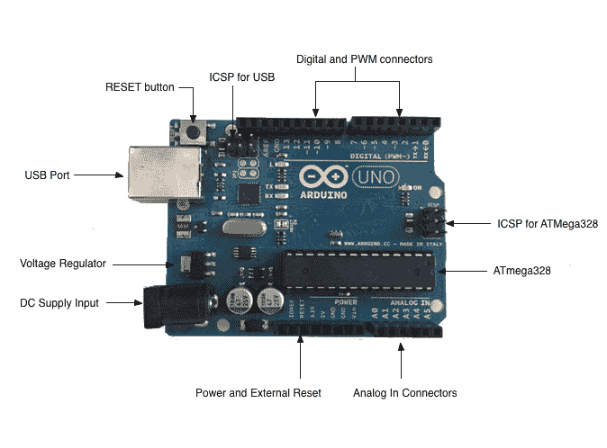

在本书中，当我们提到 Arduino Uno 板或 Uno 板时，我们指的是前面照片中展示的 Arduino Uno R3 板。

如我们所见，今天的 Arduino Uno 仍然使用原始 Arduino 设计者选择的蓝色，以帮助他们的电路板脱颖而出。以下列出了 Arduino Uno 的主要组件：

+   **直流电源输入**：直流电源输入可以使用交流转直流电源适配器或电池。电源可以通过 2.1 毫米中心正极插头连接。Arduino Uno 在 5 伏电压下运行，但最大输入电压为 20 伏；然而，建议不要使用超过 12V。

+   **电压调节器**：Arduino 使用线性调节器来控制进入电路板的电压。

+   **USB 端口**：USB 端口可用于供电和编程电路板。

+   **重置按钮**：按下此按钮将重置电路板。

+   **USB 的 ICSP**：电路板上的串行编程引脚用于在 USB 接口芯片上烧录固件。

+   **ATmega328 的 ICSP**：电路板上的串行编程引脚用于在 ATmega 微控制器上烧录固件。

+   **数字和 PWM 连接器**：这些标记为 0 到 13 的引脚可以用作数字输入或输出引脚。带有波浪线（~）标记的引脚也可以用于**脉冲宽度调制**（**PWM**）输出。

+   **模拟输入连接器**：标记为 A0 到 A5 的引脚可用于模拟输入。这些引脚可以用来读取模拟传感器的输出。

+   **电源和外部重置**：此引脚头中的引脚为外部设备和传感器提供来自 Arduino 的接地和电源。Arduino 也可以通过这些引脚供电。还有一个可以用来重置 Arduino 的重置引脚。

+   **ATmega328**：Arduino Uno 板的微控制器。

数字/PWM/模拟输入/电源/重置连接器统称为引脚头。这些头部的引脚允许 Arduino 与外部传感器和其他设备通信。让我们看看我们可以用哪些不同的方式为 Arduino 板供电。

# 为 Arduino 供电

Arduino 可以通过三种方式之一供电：通过 VIN/GND 引脚、直流电源输入端口或 USB 端口。

# 使用 VIN/GND 引脚为 Arduino 供电

电源和外部复位引脚中的 VIN 和 GND 引脚可以用来使用外部电池为 Arduino 供电。以这种方式为 Arduino 供电主要用于我们希望连接电池，串联，并通过开关来开启和关闭 Arduino 的电源。以下照片说明了这一点：

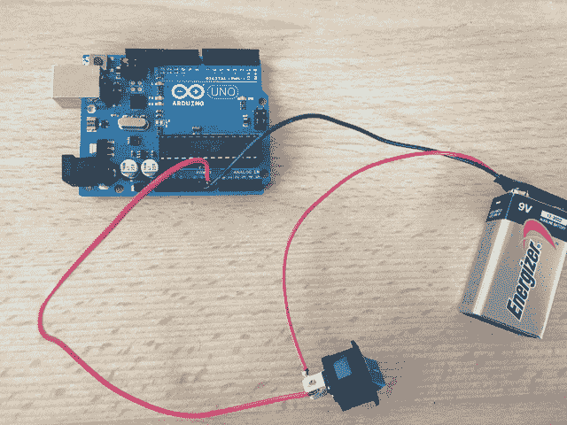

不建议我们以这种方式为 Arduino 供电，除非我们正在寻找最昂贵且寿命最短的方式来为 Arduino 供电。我们可以使用串联的六节 AA 电池，这将提供与前面照片中 9V 电池相同的电压，但容量大约是四倍。仍然不建议我们以这种方式为 Arduino 供电，因为它会相当昂贵。

除非有特定需要使用电池为 Arduino 供电，否则我会避免使用它们。

# 使用直流电源输入为 Arduino 供电

直流电源输入连接器可以与交流转直流电源适配器或电池一起使用，为 Arduino 供电。该连接器有一个 2.1 毫米中心正极的母座。虽然 Arduino 在 5 伏时运行，但可以使用最大 20 伏的输入；然而，正如之前所述，建议不要使用超过 12V。

我们可以使用类似以下照片中所示的交流转直流可调电源适配器，通过直流电源输入连接器为 Arduino 供电：

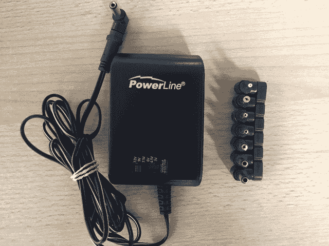

使用这个适配器，您可以调整输出电压到所需的电压。您可以在网上或大多数销售电子产品的商店找到类似的电源。

# 使用 USB 连接器为 Arduino 供电

使用 USB 连接器为 Arduino 供电是我通常使用的方法。这是迄今为止为 Arduino 供电最容易、最安全且最经济的方式。您可以直接从计算机的 USB 端口或从以下照片中所示的 USB 充电宝为 Arduino 供电：

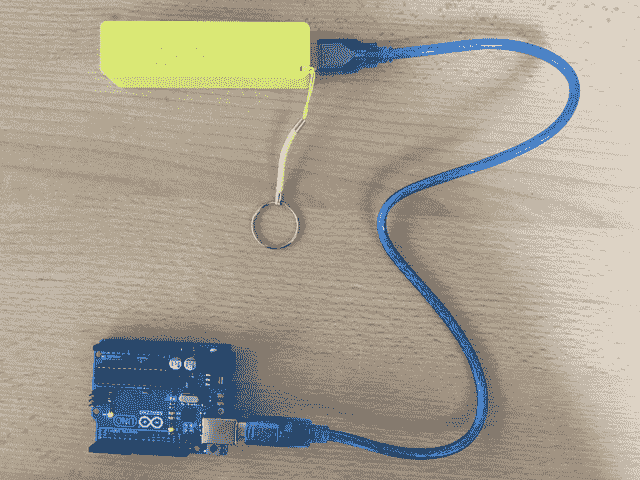

这是一种非常经济且简单的方法来为 Arduino 供电。它也可以用于需要移动性的机器人或类似项目；然而，当我们连接外壳或其他附件到 Arduino 时，我们需要小心确保 USB 连接器能够提供足够的电力。例如，在本书的后面部分，我们将探讨 MOVI 语音合成和语音识别外壳，该外壳消耗的电力过多，以至于在连接外壳时无法通过 USB 连接器为 Arduino 供电。

现在我们已经提到了 Arduino 外壳，让我们来看看它们是什么，以及它们可以提供哪些功能类型。

# Arduino 外壳

Arduino 保护罩是一个模块化电路板，可以直接插入 Arduino 板的引脚头。这些保护罩将为 Arduino 板添加额外的功能。如果我们想连接到互联网、进行语音识别、控制直流电机或为 Arduino 添加其他功能，可能有一个保护罩可以帮助我们。虽然我们不是必须使用保护罩，但它们确实使向我们的 Arduino 板添加额外功能变得非常容易。

以下照片展示了几个保护罩的示例。我们将在本书后面的某些示例项目中使用保护罩：

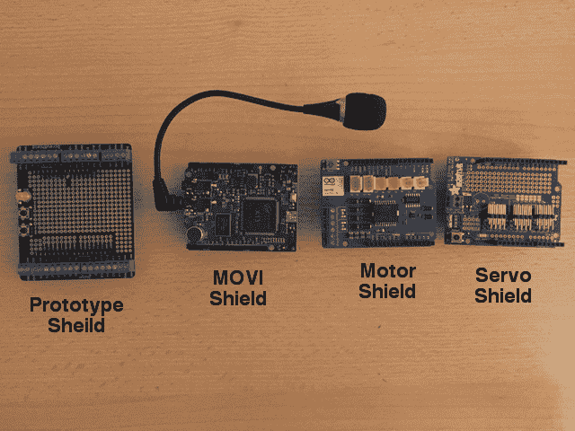

保护罩通过直接插入引脚头安装在 Arduino 之上。如果它们不使用相同的资源，我们还可以将一个保护罩堆叠在另一个保护罩之上。以下是 Arduino 上安装了两个保护罩的外观：

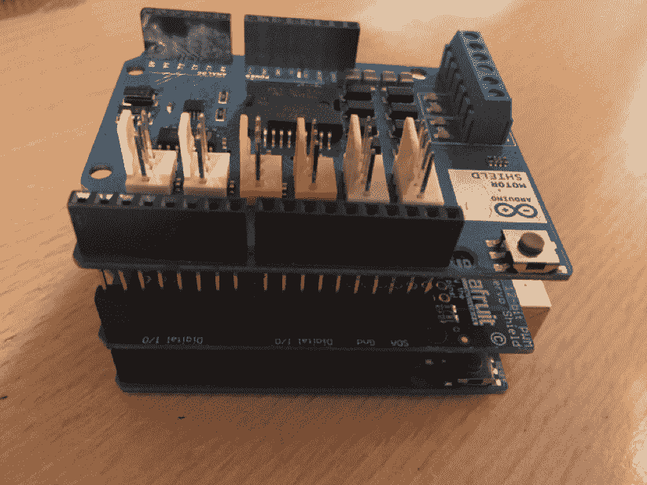

Arduino 保护罩使向 Arduino Uno 添加功能变得极其简单。大多数保护罩通常都有很好的文档，这使得编程它们也非常容易。保护罩的缺点是它们通常比购买组件并将它们用面包板连接到 Arduino 的成本要高。

一些保护罩，例如 MOVI 语音合成和语音识别保护罩以及 Sparkfun Xbee 无线电模块保护罩，增加了无法简单作为一个单独组件添加的功能。对于这种功能，需要一个保护罩或外部电路板。

让我们更仔细地看看 Arduino Uno R3 的引脚头。

# Arduino 引脚

Arduino Uno 引脚头总共有 31 个引脚。其中大部分可以配置为执行不同的功能。以下图表显示了各种引脚的用途：

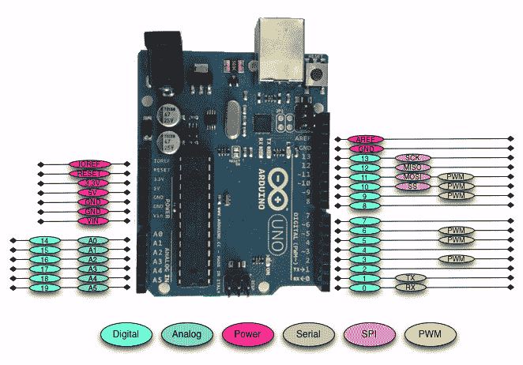

让我们看看不同的引脚有什么作用。

# 数字引脚

在连接外部传感器时，Arduino 的数字引脚是使用最多的。这些引脚可以配置为输入或输出。这些引脚默认为输入状态；因此，当我们使用引脚作为输入时，我们不需要明确声明它们为输入引脚；然而，这样做是一种良好的实践，因为它会使阅读我们代码的人更容易理解该引脚的用途。

数字引脚将有两个值之一：高（1），即 5V，或低（0），即 0V。一旦我们开始编程 Arduino，我们就会看到如何从这些引脚读取或写入。

# 模拟输入引脚

Arduino Uno 内置一个具有六个通道的**模拟-数字**（**ADC**）转换器，这为我们提供了六个模拟输入引脚。ADC 将模拟信号转换为数字值。虽然数字引脚有两个值，要么是高要么是低，但模拟输入引脚的值从 0 到 1023，相对于 Arduino 的参考值。Arduino Uno 的参考值为 5V。

模拟输入引脚用于读取模拟传感器，如测距仪和温度传感器。如果我们的项目中数字引脚不足，六个模拟引脚也可以配置为数字引脚。

# PWM 引脚

由于模拟输入引脚是为读取模拟传感器（输入）而设计的，PWM 引脚是为输出而设计的。PWM 是一种使用数字输出获得模拟结果的技术。

由于数字输出可以是开或关，为了获得模拟输出，数字输出会在高和低之间快速切换。信号处于高电平的时间百分比称为**占空比**。以下图表说明了这个概念：

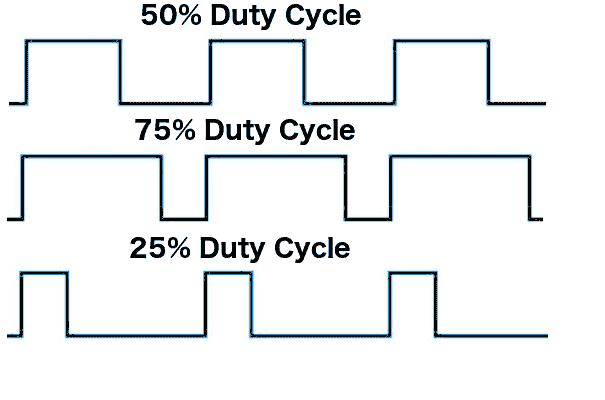

我们有能力设置信号在高低之间切换的频率。这个频率以赫兹为单位，并设置信号每秒可以切换多少次。例如，如果我们设置频率为 500 Hz，这意味着信号每秒可以切换 500 次。

我们将在本书的几个示例中使用 PWM 引脚，并在我们学习如何编程 Arduino 时对它们进行更深入的探讨。

# 电源引脚

Arduino 有几个电源引脚。它们如下：

+   **VIN**：当我们使用外部电源为 Arduino 板供电时使用此引脚。这是本章“使用 VIN/GND 引脚为 Arduino 供电”部分中使用的引脚。

+   **GND**：这些是地引脚。

+   **5V**：这是 5V 输出，用于为大多数传感器供电。

+   **3.3V**：这是 3.3V 输出，可用于为与 3.3V 兼容的传感器供电。一些兼容 3.3V 传感器的列表可以在此找到：[`www.dfrobot.com/wiki/index.php/3.3V_Compatible_Device_List`](https://www.dfrobot.com/wiki/index.php/3.3V_Compatible_Device_List)。

+   **复位**：此引脚可以通过外部源来重置 Arduino 板。

+   **ioref**：这是板的参考电压。对于 Arduino，这将是一个 5V。

# 串行引脚

这些引脚可用于串行通信。RX（数字引脚 0）用于接收，而 TX（数字引脚 1）用于传输。这些引脚直接连接到 USB 到 TTL 串行芯片。有一点需要注意，你不应该直接将这些引脚连接到 RS-232 串行端口，因为这会损坏你的板。

# SPI 引脚

**串行外设接口**（**SPI**）引脚用于微控制器与外围设备通信的同步串行数据协议。此协议始终有一个主设备和一个或多个从设备。引脚如下：

+   **MISO**：**主从输入输出**引脚用于从从设备向主设备发送数据。

+   **MOSI**：该引脚的**主从输出输入**用于从主设备向从设备发送数据。

+   **SCK**：**串行时钟**用于同步数据传输，并由主设备生成。

+   **SS**：**从机选择**引脚告诉从机激活或进入睡眠状态。这用于选择哪个从设备应该接收主机的传输。

现在我们已经快速地看了 Arduino Uno R3 上的引脚，让我们来看看一些不同的 Arduino 板。

# 不同的 Arduino 板

有许多不同的官方 Arduino 板和模块，可用于各种目的。要查看所有不同的板，你可以访问 Arduino 产品页面([`www.arduino.cc/en/Main/Products`](https://www.arduino.cc/en/Main/Products))，那里列出了所有官方 Arduino 板。

虽然 Arduino Uno R3 在创客社区中是最受欢迎的 Arduino 板，以下列出了一些其他流行的板：

# Arduino Micro

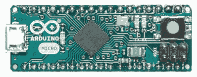

Arduino Micro 是 Arduino 家族中最小的板。它基于 ATmega32U4 微控制器。该板具有 20 个数字 I/O 引脚，其中 7 个可用于 PWM 输出，12 个可用于模拟输入。Micro 板和稍后我们将看到的 Nano 板可以用于 Arduino Uno 可能太大的项目。

# Arduino Mega 2560

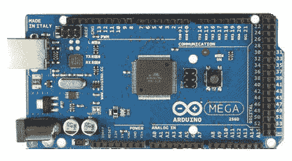

Arduino Mega 2560 是为最复杂的项目设计的。它具有 53 个数字 I/O 引脚、16 个模拟输入引脚和 15 个 PWM 输出引脚。它还拥有 4 个串行 UART 用于串行连接。如果你想创建一个像机器人这样的复杂项目，Mega 板是你想要开始的地方。

# Lilypad

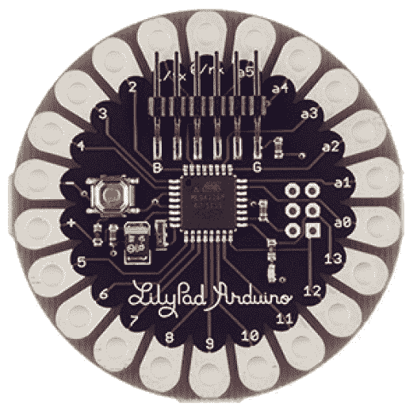

Arduino Lilypad 是为可穿戴项目设计的。它可以缝入织物中，并使用缝入织物中的电源和传感器。Lilypad 基于 ATmega168V 或 ATmega328V（低功耗版本）。该板具有 16 个数字 I/O、6 个模拟输入和 6 个 PWM 输出。

# Arduino Nano

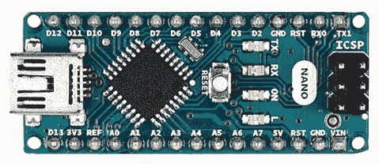

Nano 和 Micro 之间有很多相似之处。Micro 板是在 2012 年发布的，而 Nano 板是在 2008 年发布的。Nano 板具有 14 个数字 I/O 引脚、8 个模拟输入引脚和 6 个 PWM 输出引脚。根据这些规格，你可能认为你应该使用 Micro 板而不是 Nano 板，但是如果你查看像 Amazon 或 eBay 这样的大多数在线零售商，你可以以 Micro 板价格的一半左右购买到 Nano 板。

你会发现，Nano 板比 Micro 板更容易获得，因为市场上有很多通用的 Nano 板。我们在这本书的一些项目中也会使用 Nano 板。

# 通用的板

在本书的开头，我们提到 Arduino 是一个开源硬件和软件平台。所有原始硬件设计文件均在 Creative Commons Attribution Share-Alike 许可下发布。此许可允许个人和商业衍生品使用所有 Arduino 板，前提是它们要提及 Arduino 并在相同许可下发布其设计。这导致了许多价格较低的*通用*板的出现。

如果您在大多数在线零售商网站上搜索 Arduino 板，大多数板实际上并不是真正的 Arduino 板。如果您查看以下照片中的 Arduino Uno 板，您会注意到一个包含加号（+）和减号（-）的无限符号。那是官方 Arduino 标志，任何带有此标志的板都是正品 Arduino 板。

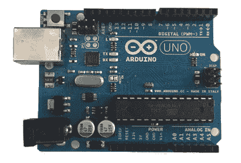

在本书中，我们将主要使用通用 Arduino 板，因为它们更便宜，通常也更容易获得。以下照片显示了某些通用 Arduino 板的外观。第一张照片显示了两个通用 Arduino Uno 板：

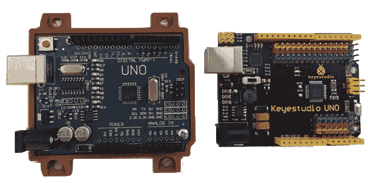

下一张照片显示了一个通用 Arduino Mega 2560 板：

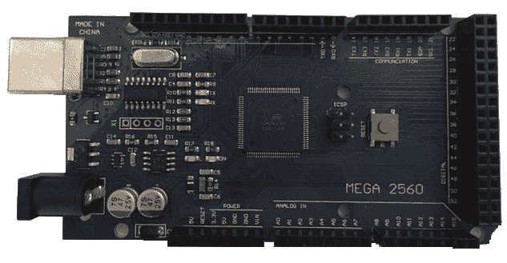

您会注意到这些通用板不包含 Arduino 标志；然而，它们仍然包含官方板的名称。虽然之前的通用板看起来与官方 Arduino 板非常相似，但这并不是必需的。一些制造商选择采用 Arduino 参考设计，并在其板上增加额外的功能。以下照片中的板就是这种类型的例子：

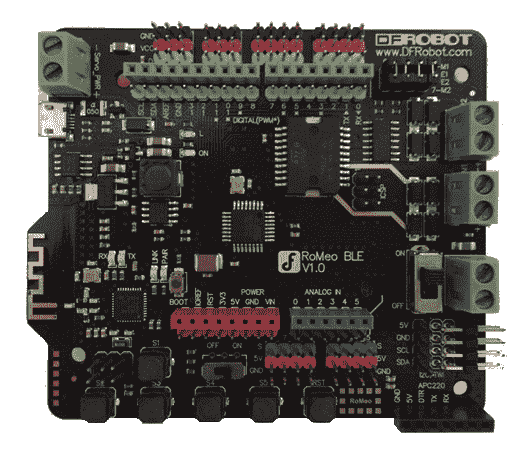

DFRobot RoMeo BLE 板是一款兼容 Arduino 的机器人控制板，具有蓝牙 LE 4.0 功能。该板采用了 Arduino Uno 的设计，并增加了许多额外功能，例如内置蓝牙和集成双向直流电机驱动器。

无论您的项目是什么，您可能都能找到符合您需求的正品 Arduino 板或通用/兼容板。

# 摘要

在本章中，我们简要介绍了 Arduino 的历史，包括它从一篇硕士论文到完整商业项目的发展历程。这包括参观了一些不同的 Arduino 板。我们还展示了 Arduino 板的不同供电方式，并对各种引脚类型进行了简要说明。

在下一章中，我们将为您简要介绍电子和常用组件。
