# 第二章：基本电子学

就像我所能记得的，我一直对电子学很着迷。当我七岁或八岁的时候，我记得拆开了一台手持式晶体管收音机，并挣扎了好几天才把它重新组装起来，而没有让我的父母知道我把它拆开了。尽管我会拆开小装置并重新组装它们，但我直到高中上了基础电子学课程才真正理解了基本的电子学。那门课给了我足够的知识，开始理解我一直在拆解的电子设备是如何工作的。它也为我后来所做的一切电子项目奠定了基础。

你在本章中将学到什么：

+   电子电路的四个基本模块是什么

+   什么是万用表

+   一些更受欢迎的基本电子元件有哪些

+   电的性质是什么

+   如何使用欧姆定律

+   如何计算功率

虽然 Arduino 板最初是为了抽象化电子的复杂细节，使用户能够专注于他们的项目而设计的，但我们仍然需要对电子和电有一个基本了解，以便将外部组件连接到 Arduino 板上，并确保我们不会因为那些组件而损坏板子。本章，连同第三章，*电路图*和第四章，*基本原型制作*，旨在为你提供一个关于电子、电和电路的基本理解，以便你可以构建自己的原型，并在此书后续章节的示例中工作。

本书涵盖的所有电子和电都是与**直流**（**DC**）相关的，这与来自电源插座**交流电**（**AC**）不同。直流电是电荷在一个方向上的流动，而交流电则周期性地改变方向。我们只在本书中涵盖直流电，因为它本质上比交流电更安全，Arduino 及其组件由直流电源供电。我们可以通过将电源适配器插入墙壁来为 Arduino 供电，正如我们在第一章，*Arduino*中看到的；然而，电源适配器将交流电源转换为直流电源。

让我们从查看任何电子项目的四个主要构建模块开始探索基本电子学。

# 电子构建模块

当我想构建一些东西时，无论是用 Arduino 进行原型设计，编写应用程序，还是建造通往后门的木阶，我通常会尝试将项目分解成单独的模块。这真的帮助我专注于设计的每个单独部分，而不是被整个设计所压倒。我们通常可以将电子项目分解成四个独立的模块。以下图表说明了这些模块是如何协同工作的：

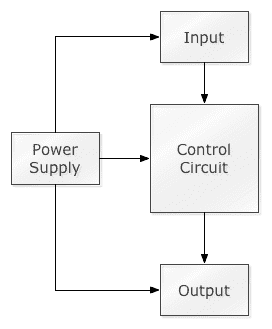

让我们逐一查看这些块，从电源开始。

# 电源

电源是项目的电力来源。对于本书中的大多数实验，电源将是一些低压直流电源，例如在第一章*电源 Arduino*部分中讨论的电源，*Arduino*。我们将在本书的后续章节中展示如何使用 12V 电池通过电机控制器板为直流电机供电。

# 输入

输入块将包含向控制电路提供信息的电子组件。这些组件使控制电路能够感知外界。输入组件的例子包括：

+   **按钮或开关**：按钮和开关可以用来开启或关闭电流的流动。当它们处于关闭状态时，电流不会通过电路；然而，当它们处于开启状态时，电流会通过电路。

+   **温度传感器**：温度传感器根据温度调整电路中的电阻量，导致电压随温度变化。通过读取输入的电压量，控制电路可以计算出当前温度。

+   **测距仪**：存在许多类型的测距传感器；然而，基本原理是传感器输出的电压根据物体与传感器的距离而变化。就像温度传感器一样，控制电路可以根据输入的电压来计算距离。

+   **接近传感器**：这是一种当某个物体进入一定距离范围内时被触发的传感器。接近传感器通常是开启状态（全电压）或关闭状态（无电压）。

# 输出

输出块将包含执行某些操作的电子组件。这些组件使电路能够与外界交互或执行某些操作。输出组件的例子包括：

+   **电机**：电机允许电路转动某些东西，如风扇或轮子。这种类型的组件将电能转化为做功的能源。

+   **LED 灯**：LED 可以用作指示器，向用户提供视觉反馈。这种类型的组件将电能转化为光。

+   **扬声器**：扬声器可以用来向用户提供音频反馈。这种类型的组件将电能转化为声音。

# 控制电路

控制电路块是接收来自输入组件的信息、处理这些信息并控制输出组件的电子组件。为了本书的目的，控制电路将是 Arduino，但请注意，我们并不强制使用 Arduino 作为控制电路。我们可以创建自己的控制电路或使用其他类型的微控制器板，如**树莓派**或**贝格尔 Bone Black**。

此块图为我们提供了 Arduino 项目的整体视图。我们需要首先理解的是，这些块以及块中的组件是如何相互连接的。为此，我们需要对电子和电力有一个基本的了解。让我们从查看一些工具和常见电子元件开始。我们将从查看我们工具箱中可能最重要的工具开始，以帮助我们进行电子项目：万用表。

# 万用表

万用表，也称为伏欧姆表，是一种电子测量仪器，通常用于测量电压、电流和电阻。有模拟万用表通过移动指针来显示测量值，但如今大多数万用表都是数字的，并带有 LCD 显示屏，用于精确显示测量值。

万用表的价格可以从低至 10 美元，到一款非常棒的 Fluke 87V 高达 400 美元。除非你打算将万用表用于专业用途，否则我建议购买像以下照片中展示的低成本万用表：

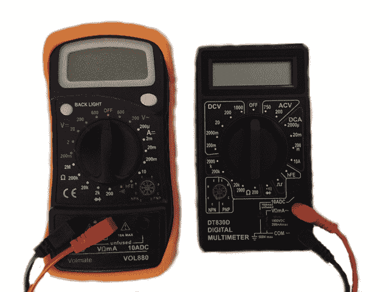

数字万用表有三个主要部分，分别是显示屏、选择旋钮和探头端口。

显示屏会显示测量值。一些高端万用表具有背光显示屏，以便在低光环境下更容易阅读。

选择旋钮用于选择我们想要测量的内容。大多数万用表可以读取电阻（欧姆）、电压（伏特）和电流（安培）。一些高端万用表还具有测量额外项目的能力，并具有额外功能。

探头插入探头端口，这些端口通常位于仪表的前面。黑色探头应插入标有 COM 的端口，红色探头将插入其他端口之一，具体取决于要测量的内容。实际上，红色和黑色探头之间没有太大区别；然而，良好的做法是将黑色探头和电线连接到公共/接地，将红色探头和电线连接到电源，因为这是标准做法。

数字万用表非常易于使用。我们首先使用选择旋钮选择我们想要测量的内容。然后将黑色探头连接到电路的一端，红色探头连接到另一端，万用表将显示测量值。以下照片显示了如何测量 9V 电池剩余的电压：

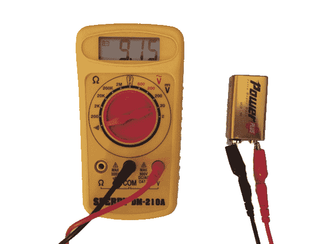

你会注意到选择旋钮被设置为 20V，因此，万用表将测量高达 20V。以下照片显示了如何测量电阻器的电阻：

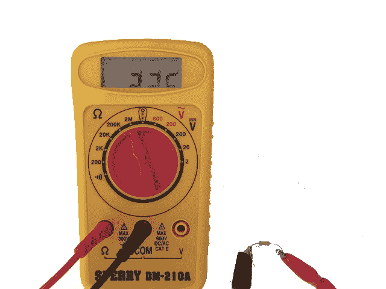

在这张照片中，我们正在测量一个 330K 欧姆的电阻。如果我们不小心将选择旋钮设置到低档，就会过载万用表，但几乎所有的万用表都有保护功能，因此，它们不会因为过载而损坏。当你过载一个万用表时，它们通常会在显示屏的最左边显示 1，如下面的照片所示：

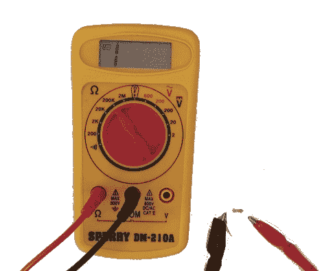

在前面的照片中，我们试图使用选择旋钮设置为最大 200K 欧姆来测量一个 330K 欧姆的电阻。如果你不习惯使用万用表，我建议你搜索“万用表视频教程”并观看一些关于如何使用它们的视频。

# 电子元件

我们将在项目中使用多种类型的电子元件。这些元件可以从许多在线零售商那里以相对较低的成本获得。熟悉一些更受欢迎的元件很重要，因为它们将用于我们创建的许多电路中。让我们从查看我们将几乎在所有电路中使用的元件开始，即电阻。

# 电阻

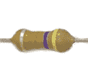

电阻将几乎用于我们创建的每一个电路。电阻是一种具有特定数量的电阻力且该阻力永远不会改变的电子元件。电阻限制电路中的电子流动。我们将在本章稍后看到电阻是如何工作的。

# 电位器

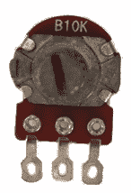

电位器，也称为“电位计”，是一种可变电阻。电位器允许用户创建一个电路，其中可以改变电阻。电位器有多种形状、尺寸和值，但它们都有三个连接器。两个外接器之间的电阻是固定的，是电位器的最大电阻。当用户转动旋钮时，中心连接器和任一外接器之间的电阻会变化。

电位器有很多用途，包括音频控制、伺服电机的运动控制和调节灯光亮度。

# 开关

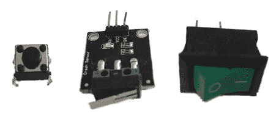

根据需要，可以使用几种类型的开关。前面的照片从左到右显示了按钮开关、微动开关和拨动开关。

**按钮开关**是按下按钮时被激活的开关。这些开关通常用于启动或停止某些动作。按钮开关的一些用途示例包括启动机器人运动、启动 LED 闪烁或从传感器捕获电流测量值。

**微动开关**是一种通过在开关的杠杆或按钮上施加光力来激活的开关。这些开关在许多家庭和工业应用中得到了广泛使用。微开关的一些用途示例包括 3D 打印机的限位开关、检测微波炉门是否关闭以及机器人的碰撞检测。

**拨动开关**通过移动杠杆到开或关位置来激活和去激活。拨动开关主要用于像开关灯一样打开和关闭物品。

# 晶体管

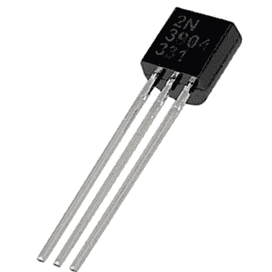

晶体管是可以通过电信号触发的微小开关。晶体管是我们今天所生活的数字世界的构建块。集成电路由许多微小的晶体管组成。晶体管提供了所有数字设备所依赖的数字开/关信号。

晶体管有三个连接器，分别称为集电极、基极和发射极。对于 NPN 晶体管，集电极是左侧的引脚，接着是基极和发射极。对于 PNP 晶体管，左侧的引脚是发射极，接着是基极和集电极。集电极应连接到输入电源。发射极应连接到电路中的公共地。当施加一定量的电压时，基极会触发电流通过晶体管。基极充当开关，用于打开或关闭电流的流动。

对于直流电路，就像我们在这本书中将要使用的那样，所有组件都需要连接到公共地。例如，如果你有一个为 Arduino 供电的电池和一个为直流电机供电的电池，那么地（负）端将需要连接在一起，这样所有组件都连接到相同的公共地。这被称为电路中的公共地。

# LED

**发光二极管**或简称**LED**，是一种两引脚半导体器件，当通过一定量的电流时发出光。使用 LED 时，我们需要非常小心，不要施加过多的电流，因为它很容易烧毁。对于大多数 LED，推荐的电压将是 5 伏。

大多数 LED 有两个不同尺寸的连接器。长连接器是阳极，应连接到电源。短连接器是阴极，应连接到公共地。

# 电容器

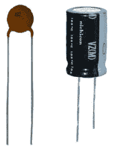

电容器有多种形状、尺寸和容量。前面的照片显示了两个小型电容器，它们可以用于低功耗电路，就像我们在这本书中将要使用的那样。

电容器存储和放电电能，类似于电池，但电容器的充电和放电速度很快，通常在几秒或几分之一秒内。电容器几乎用于所有电子设备，出于各种原因。电容器可用于平滑电流流动，过滤电流，只允许一定量的电流通过，或者用于像相机闪光灯那样的大电流快速爆发。

在处理电容器时，我们应该非常小心，确保在处理之前它们已经完全放电，以避免触电。

# 集成电路

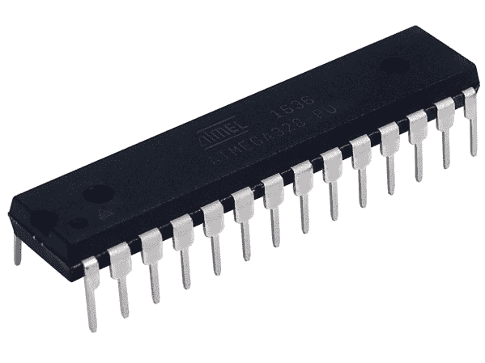

**集成电路**，简称**IC**，是一种包含数千或数百万个微小电阻器、晶体管和电容器的半导体晶圆，用于执行特定功能。有数百万种不同类型的 IC，例如 Arduino 中使用的 Atmel ATmega128 微控制器。几乎所有的电子产品都包含一些集成电路。

现在我们已经看到了将构成本书项目中的一些更流行的电子组件，让我们看看电是什么。

# 什么是电？

宇宙中的一切都是由原子组成的。原子由三个基本组成部分组成，即质子、中子和电子。质子和中子组成原子的核，而电子像月球绕地球运行一样绕核旋转。质子带正电，电子带负电。

电是由粒子带电而产生的。一些粒子带正电，而另一些粒子带负电。带相反电荷的粒子相互吸引，而带相同电荷的粒子相互排斥。

由于电子处于持续运动中，偶尔一个电子会从其原子中逃逸并加入另一个原子。电子逃逸的原子现在将带有净正电荷，而获得电子的原子将带有净负电荷。电就是这种电子的流动。

金属的导电性是通过电子从其原子中逃逸的难易程度来测量的。铜、银和金是一些最好的导电材料，因为它们只有一个价电子，或外层电子，它移动时阻力很小。

如果我们将一根铜线从电池的一端连接到另一端，如图所示，电子的流动将从负极流向正极。

实际上不要这样做，电线可能会变得非常热，电池也会很快耗尽。

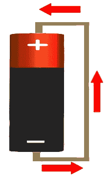

电流以这种方式流动的原因是相反电荷的粒子相互吸引，因此正电荷端吸引电子，使它们从负电荷端流向。想象电子流动的最简单方法之一是观察水通过管道的流动。现在让我们看看电的一些特性，从如何测量电子流动开始。

# 电流

在电子电路中，电流是带电粒子（电子）的流动。电流通过每秒通过电路被测点的带电粒子数量来测量。

电流以安培为单位测量，可以用大多数标准万用表测量。一安培等于每秒通过被测点的 6.241×10¹⁸个电子。

如果我们将电想象成通过管道流动的水，以下图表将帮助可视化电流：

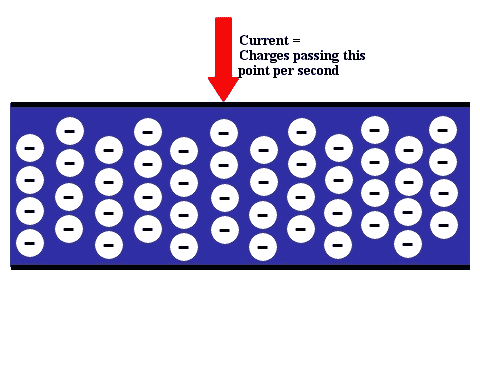

# 电压

电压是两点之间的势能差，其中一点比另一点有更多的带电粒子。这种电荷的差异称为电压。我们可以将电压视为电路内的压力，以推动带电粒子通过电路。电压以伏特为单位测量。

继续使用管道中的水类比，我们可以将电压视为管道内的水压，推动水通过。以下图表说明了这一点：

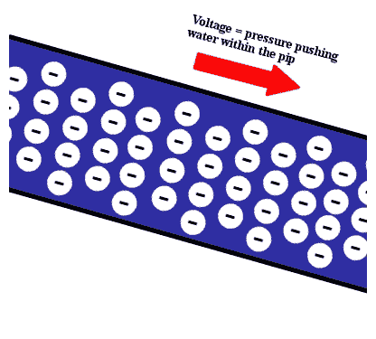

# 电阻

电阻是电流流动被减少或阻碍的程度。所有电路都有一些来自构成电路的导线和组件的电阻；然而，大多数电路包括电阻器，这些电阻器向电路添加额外的电阻。这些电阻器使我们能够限制电路中带电粒子的流动。电阻以欧姆为单位测量。

再次使用管道中的水类比，电阻是阻碍水流的最小管道部分。

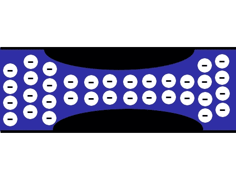

现在让我们通过考察欧姆定律来了解这三个属性是如何共同工作的。

# 欧姆定律

欧姆定律指出，通过电路的电流与施加到电路上的电压成正比。这意味着如果电路的电压增加，那么如果电阻保持不变，电流也会增加。

欧姆定律还指出，通过电路的电流与电路的电阻成反比。这意味着如果电路的电阻增加，那么如果电压保持不变，电流流动将减少。

欧姆定律的标准公式表明电流等于电压除以电阻：

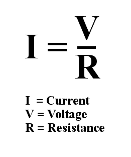

虽然前面的公式是通常介绍欧姆定律的方式，但它实际上由三个公式组成：

*I* = *V*/*R*

*R* = *V*/*I*

*V* = *I*³*R*

在这本书中，我们将最常使用 *R *= *V*/*I* 来计算限制电路电流所需的电阻。我们通过向电路中添加电阻来限制电路中的电流。

在处理电子元件时，我们还应该知道另一个公式。这个公式用于计算功率。

# 什么是功率？

功率是每秒将电能转化为另一种类型能量（热能、光能或功）的数量。功率是一个重要的概念，因为它允许我们的电路做事情。例如，如果我们创建了一个由电池和电阻组成的电路，电阻将把电能转化为热能（或热能）。所有电阻都有一个它们可以处理的最大功率额定值，因此为了确保我们不损坏电路中的电阻，我们需要知道如何计算功率。功率是通过乘以电压和电流来计算的，并且以瓦特为单位测量。

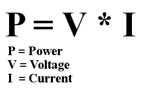

我们可以从在线零售商那里获得的低成本电阻大多数被评定为 1/4（或 0.25）瓦特，因此我们将假设本书项目中使用的电阻评定为那个 1/4 瓦特。现在假设在我们的项目中，我们正在一个 100 欧姆的电阻上施加 10 伏特的电压，你认为电阻能够承受吗？为了找出答案，我们首先需要做的是使用欧姆定律计算电流。我们将使用公式 *I *= *V*/*R* 来计算电流（*I *= 10V/100 欧姆），得到 0.1 安培的电流。现在我们可以使用公式 *P *= *V***I* 来计算功率（*P*=0.1A * 10V），这将等于 1 瓦特，是电阻额定值的四倍，因此电阻会变得非常热，甚至可能损坏。

# 电阻色码

电阻的值是通过其身体上的色环标记的。大多数电阻包含四个色环，但也有一些电阻有五个和六个色环。以下图片展示了四个色环的电阻外观：

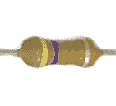

对于四色环电阻，从左到右的前两个色环表示电阻的值。第三个色环是倍数，第四个色环是公差。具有五个色环的电阻使用前三个色环来表示电阻的值，然后第四个色环是倍数，第五个色环是公差。以下表格显示了颜色值：

| **颜色** | **值** | **倍数** | **公差** |
| --- | --- | --- | --- |
| 黑色 | 0 | 1 |  |
| 棕色 | 1 | 10 |  |
| 红色 | 2 | 100 |  |
| 橙色 | 3 | 1K |  |
| 黄色 | 4 | 10K |  |
| 绿色 | 5 | 100K |  |
| 蓝色 | 6 | 1M |  |
| 紫色 | 7 | 10M |  |
| 灰色 | 8 | 100M |  |
| 白色 | 9 | 1G |  |
| 金色 |  | 0.1 | 5% |
| 银色 |  | 0.01 | 10% |

本节开头所示的电阻有四个颜色为黄-紫-橙-银的色带，这意味着该电阻是 47K 欧姆，公差为 10%。我们知道这一点是因为前两个色带（黄和紫）的值分别是 4 和 7。然后我们使用第三个色带（橙）作为乘数，其值为 1K。这给我们一个电阻值为 47 乘以 1K，即 47K。第四个色带（银）表示公差为 10%。

# 摘要

在本章中，我们简要介绍了电学以及本书后面将要使用的一些较受欢迎的电子元件。本章将为你提供足够的知识，帮助你开始构建非常基础的样机。建议一旦你开始进行更高级的项目，你应进一步阅读有关电学和电子元件的内容。

在下一章中，我们将探讨电路以及如何阅读电路图。
