# 电路图

当我还是个孩子的时候，我越拆手持式晶体管收音机和游戏，就越容易识别电路板上的各种部件。然而，要弄清楚所有部件是如何一起工作的，却要困难得多。虽然在不了解电路的基本原理的情况下拆解和重新组装电子设备是可能的，但无法弄清楚设备实际上是如何工作的。一旦我了解了电路的工作原理，我不仅能够开始理解电子设备是如何工作的，而且我还能自己构建简单的电路。

在本章中，你将学习：

+   什么是电路

+   开路、闭路和短路是什么

+   什么是 Fritzing 图

+   什么是原理图

+   串联电路和并联电路之间的区别是什么

在我们开始开发自己的电子项目之前，我们需要对电路是什么以及如何设计它们有一个基本了解。在本章中，我们将探讨我们开始设计和创建基本电路所需的知识。

# 什么是电路？

电路是电流流动的环形路径。在第二章《基础电子》中，我们描述电流为电子的流动。电路是这些电子流动的路径，为构成电路的组件提供动力。电子进入电路的点，电流开始的地方，被称为**电源**。电子离开电路的点被称为**回路**。在电源和回路之间，构成电路剩余部分的组件和电线被称为**负载**。

在闭路中，电流从电源到回路的完整路径允许电流通过电路。以下图示展示了闭路的情况，其中开关是闭合的，允许电流通过电路。在这个电路中，我们正在为灯泡供电。这使得灯泡成为负载：

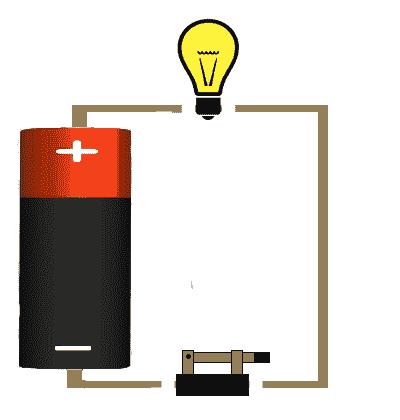

开路是指电路中存在断裂，阻止电流流动。以下图示展示了开路的情况，其中开关是打开的，从而阻止了电流流动：

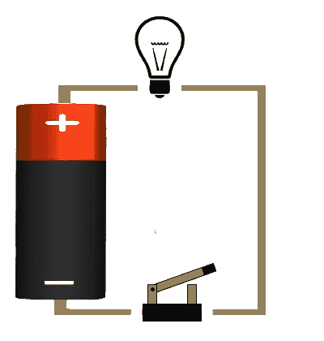

最后两个例子展示了你家里的典型灯开关是如何工作的。当你打开开关时，电路闭合，灯就会亮；然而，当你关闭开关时，电路就开路，灯就会熄灭。

大多数万用表都有一个用于测试是否有开路的通断模式。如果你的万用表有通断模式，你应该看到一个类似这样的符号：

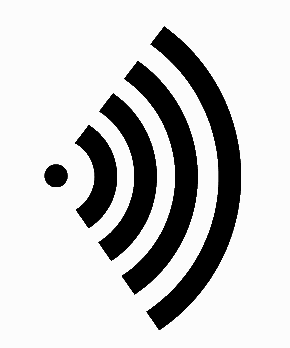

如果你将万用表设置为通断测试模式并将两个引脚接触在一起，万用表将发出声音。这个声音会让你知道你有一个闭合的电路。为了测试你的电路是闭合还是开路，将万用表置于通断测试模式，并将万用表的两个引脚放置在电路的不同位置，如果两点之间存在连接，万用表将发出声音。

最危险的电路是短路。短路是指电流几乎无阻力地流过电路。这通常是一个没有负载的电路。

你永远不应该创建这样的电路，因为这样有引发火灾的风险。

以下图表显示了短路的外观：

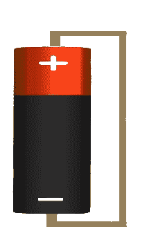

虽然前面的电路图看起来很漂亮，但用这样的电路图来展示复杂的电路几乎是不可能的。如果没有解释，其他人也很难理解这些电路图，因为这些电路图没有定义标准符号。表示电路的标准方式是使用原理图。

当提到电子电路时，原理图是一种包含电路中元素表示的图表。每种类型的电气元件在原理图上都有标准的符号。这些图表将显示每个组件是如何连接的，使阅读图表的任何人都能理解电路的工作原理。

本书中的所有电路图都将使用非常流行且免费的**Fritzing**应用程序创建，该应用程序可以在此处下载：[`fritzing.org/home/`](http://fritzing.org/home/)。在本书编写时，Fritzing 的最新版本是 0.9.3b，也是本书中所有电路图以及随下载代码一起提供的电路图的版本。在我们查看 Fritzing 可以生成哪些类型的电路图之前，让我们先看看 Fritzing 是什么。

# Fritzing

Fritzing 是一个开源项目，旨在开发用于设计电子硬件的软件。这款软件的设计灵感与 Arduino 类似，它抽象掉了电路图绘制的复杂性，因此用户可以专注于设计本身。本书中所有项目都将包含一个**Fritzing 草图**，这些草图是 Fritzing 应用程序中的一个项目，代表正在创建的电路。如果项目包含如 Arduino 这样的微控制器，这些项目可以包含电路图和代码。本书中我们将不会使用 Fritzing 的编码部分，而是使用标准的 Arduino IDE，但了解它的存在是很好的。

包含在可下载代码中的 Fritzing 绘图将允许您更仔细地检查每个项目的电路设计，并允许您在需要时调整设计。我们还将为每个项目在书中包含一个 Fritzing 图表或原理图，以展示如何创建电路。这两种类型的图表都将从 Fritzing 绘图中生成。

Fritzing 是一个非常强大的工具，建议您花些时间学习如何使用它来创建自己的图表。本章主要介绍如何阅读本书中包含的 Fritzing 和原理图。如果您想学习如何使用 Fritzing 软件，他们的网站有一个非常好的教程，您可以在以下链接找到：[`fritzing.org/learning/`](http://fritzing.org/learning/)。让我们从 Fritzing 图表开始。

# Fritzing 图表

Fritzing 图表是电路外观的图片表示，类似于本章之前展示的开放、关闭和短路图表；然而，Fritzing 图表有标准符号来表示每个部分，并且设计紧凑，使得设计更复杂的电路更加容易。以下 Fritzing 图表显示了 Arduino 连接到面包板上的 LED 和电阻器：

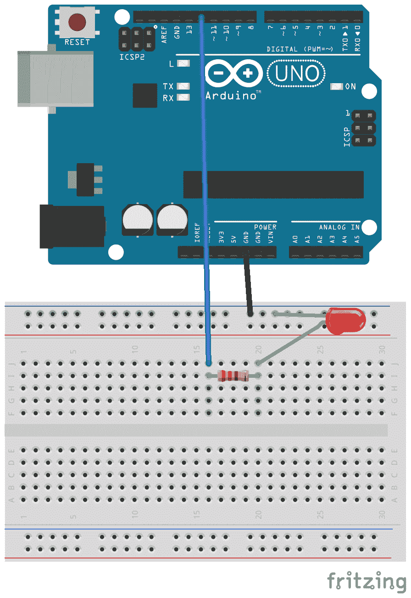

该图中的电路从 Arduino 的 GND 引脚开始，它连接到面包板的上轨。LED 的阴极连接器也连接到上轨，从而将其连接到 Arduino 的公共地。LED 的阳极连接器连接到一个 220 欧姆的电阻器，该电阻器连接到 Arduino 的数字 12 引脚。这是一个很容易理解的图表，因为图表看起来就像组件本身。Fritzing 图表在电子网站和博客上展示图表时使用得很多，因为它更容易让初学者理解如何连接电路。

现在我们来看一下原理图。

# 原理图

虽然 Fritzing 图表使用图像来表示电路，但原理图使用符号。这使得图表更加紧凑，更容易表示复杂的电路。以下图表显示了原理图中一些常见电子元件的符号：

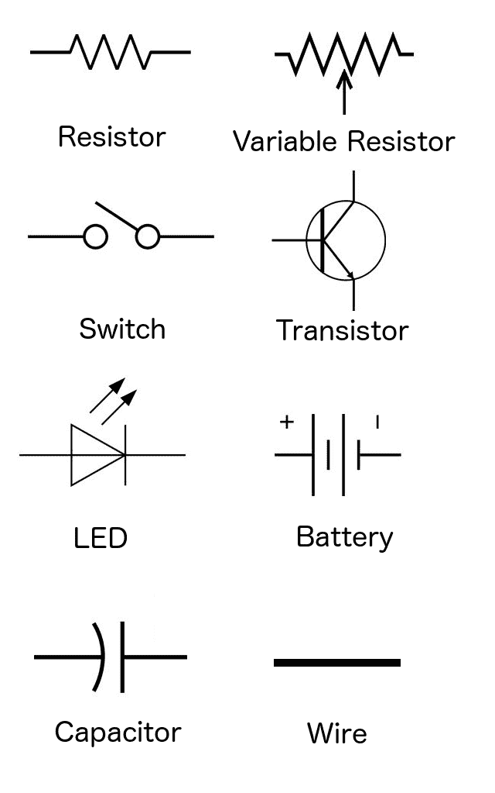

我们将使用这些符号来表示电路中的组件。为了看到原理图的样子，让我们创建一个包含电池、电阻器和 LED 的简单电路。这个电路的 Fritzing 图表将看起来像这样：

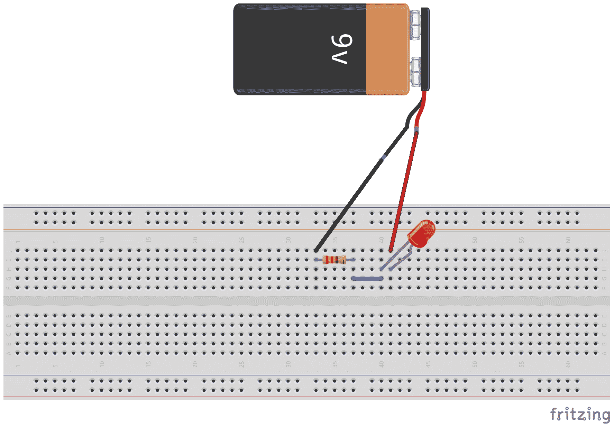

在这个图中，很容易看出需要哪些组件以及它们的连接方式；然而，在更复杂的电路中，可能更难看出所有组件的连接方式。Fritzing 图中的图像也没有显示组件的值。原理图提供了对电路的更清晰视图，如果图作者选择的话，还可以显示每个组件的值。以下图显示了相同的电路在原理图中的样子：

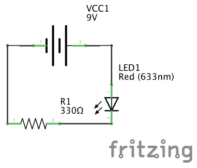

此图显示了组件的连接方式以及所有组件的值。在这本书中，我们将使用 Fritzing 图和原理图，这样我们就可以熟悉这两种类型。这两种类型的图都将从本书提供的可下载代码中的 Fritzing 草图生成。

# 并联和串联电路

我们可以创建两种电路类型。这些是并联和串联电路。串联电路是一种电流只有一条路径从电源流向回路的电路。并联电路是一种具有多个电流流动路径的电路。理解这两种电路类型很重要，因为它们的特性不同。让我们首先看看串联电路。

# 串联电路

下面的原理图显示了串联电路：

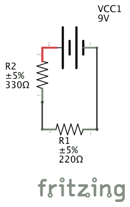

上述图显示了电流只有一条路径从电源流向回路的串联电路。在这个电路中，负载由两个电阻组成。一个电阻的值为 330 欧姆，另一个电阻的值为 220 欧姆。现在让我们看看串联电路的几个特性。

# 电阻

串联电路的总电阻是负载中每个组件电阻的总和。在示例电路中，负载由两个电阻组成，阻值分别为 220 欧姆和 330 欧姆。如果我们把这两个值加起来，我们得到总电阻为 550 欧姆。

# 电压

串联电路的总电压是串联连接的每个电源电压的总和。在示例电路中，只有一个电源，即 9 伏电池，因此总电压为 9 伏。如果我们使用 4 个 AA 电池（每个 1.5 伏）串联，而不是 9 伏电池，那么总电压将是 6 伏，因为 1.5V + 1.5V + 1.5V + 1.5V 等于 6 伏。

# 电流

在串联电路中，相同的电流流经电路的每一部分。这意味着我们可以在电路的任何一点测量电流，它将与电路中的其他任何点相同。

在示例电路中，我们知道总电压（9 伏）和总电阻（550 欧姆），因此我们可以使用欧姆定律计算电路的电流，其中*I*=*V*/*R*。这个公式将给我们 9 伏/550 欧姆或 0.0164 安培（16.4 毫安）的电流。

现在，让我们看看并联电路的特性。

# 并联电路

下面的电路图显示了并联电路：

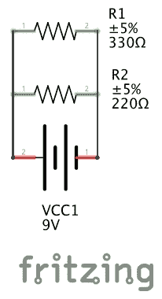

上述图示显示了一个并联电路，其中电流有多个返回路径。电流可以通过 220 欧姆电阻分支、330 欧姆电阻分支或两个分支。

在这个示例电路中，就像串联电路一样，负载由两个电阻组成，阻值分别为 330 欧姆和 220 欧姆，然而，这次电阻是并联连接而不是串联。并联电路的特性与串联电路的特性非常不同。让我们看看这些特性。

# 电阻

并联电路的总电阻总是小于电路中任何分支的总电阻，并且添加额外的分支总是会降低电路的总电阻。

要计算并联电路的总电阻，取电路中每个组件电阻的倒数之和，这等于总电阻的倒数。听起来很复杂？其实并不复杂。这里就是公式：

这个公式将适用于所需的任何电阻值。在示例电路中，有两个电阻，阻值分别为 220 欧姆和 330 欧姆。因此，为了计算电路的电阻，我们将取 1/220 + 1/330 的倒数，这将等于 132 欧姆。

而不是试图手动计算并联电路的电阻，有很多在线计算器可以使用。

# 电压

并联电路的每个分支都将具有相同的电压。如果我们测量样本电路中任一分支的电压，它将显示 9 伏特的电压。

# 电流

在并联电路中，每个分支的电流将不同。电路的总电流（来自电源的电流）将等于每个分支电流的总和。这意味着来自电源的电流将等于通过 220 欧姆电阻分支和 330 欧姆电阻分支的电流之和。

让我们用欧姆定律来看看这是如何工作的。根据欧姆定律计算电流，我们使用公式 *I*=*V*/*R*，这意味着电流等于电压除以电阻。在之前的电阻部分，我们计算出电路中的电阻为 132 欧姆，并且我们知道电压是 9 伏特，因此，总电流将等于 9 伏特/132 欧姆或 0.0682 安培（68.2 毫安）。

我们还可以使用欧姆定律来计算每个分支的电流，知道每个分支的电压将是相同的 9 伏特。包含 220 欧姆电阻的分支中的电流将是 9 伏特/220 欧姆或 0.0409 安培（40.9 毫安）。包含 330 欧姆电阻的分支中的电流将是 9 伏特/330 欧姆或 0.0273 安培（27.3 毫安）。

现在我们可以将包含 220 欧姆电阻的分支电流与包含 330 欧姆电阻的分支电流相加，以得到总电流 40.9 毫安+ 27.3 毫安，等于从电源输出的相同 68.2 毫安。

现在我们已经理解了并联和串联电路之间的区别，在我们开始构建东西之前，还有一个概念我们需要理解。这个概念就是电压降。

# 电压降

电压降是指电路中每个元件由于阻抗而损失的电压量。阻抗是电路和元件对电流流动的阻力量。我们将在下一节中看到电压降的重要性，那时我们将点亮一个 LED。

# 点亮 LED

现在我们已经讨论了电路的基本知识，让我们来构建我们的第一个电路。在这个电路中，我们将简单地点亮一个 LED。我们将从查看电路图开始，它将告诉我们如何构建电路：

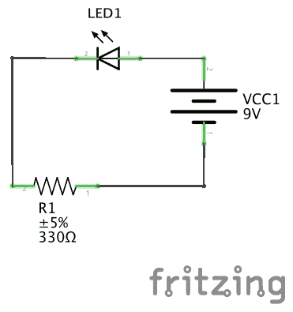

在这个图中，我们可以看到电路由一个 9 伏电源（9 伏电池）、一个 LED 和一个电阻组成。对于电路新手来说，第一个问题之一就是如何计算电阻的值。为了计算这个值，我们需要知道 LED 的正向电压以及它能够承受的最大电流。正向电压是 LED 导电所需的电压量以及将发生的电压降。如果你从一家好的电子产品店购买 LED，他们应该有一份数据表，上面会告诉你 LED 的正向电压和它能够承受的最大电流。

我建议将这些项目写下来，这样你以后忘记从哪里购买 LED 时，还可以找到。

我们使用正向电压和最大电流在以下公式中，以确定我们需要多大尺寸的电阻：

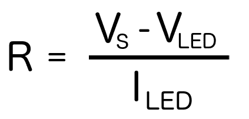

在这个公式中，标记为**S**的电压是电压源，在这个例子中是 9V。标记为**LED**的电压和电流分别是 LED 的正向电压和最大电流。我在这例子中使用的 LED 是 3.4 伏和 20 毫安。这给出了(9 - 3.4 伏)/20 毫安的值，即 280 欧姆。由于我没有 280 欧姆的电阻，所以我将其四舍五入到下一个最高的值，即 330 欧姆，如电路图所示。

以下照片展示了我是如何连接一切的：

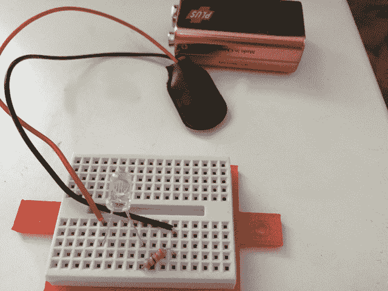

如果你正确连接了所有东西，当电池连接时，LED 将会点亮。

# 摘要

在本章中，我们介绍了电路是什么，并描述了闭合、开路和短路之间的区别。我们还展示了如何阅读 Fritzing 图和原理图。通过比较并联和串联的区别，我们完成了本章，并制作了我们第一个电路来点亮 LED。

在下一章中，我们将探讨如何原型化电路，以及我们需要哪些工具和技能。
