# 基本原型制作

原型制作是我们所有想法得以实现的地方。当我开始使用微控制器时，我非常想设计和构建整个项目，并看到它神奇地工作。我意识到我只是在让自己感到不知所措，并很快学会了如何将大型项目分解成更小的项目。然后我可以为这些较小的项目创建原型，以验证它们在整合到更大的项目之前是否工作正常。

在本章中，我们将学习：

+   在哪里设置工作区域

+   关于面包板的全部内容

+   杜邦（跳线）电缆是什么

+   如何进行项目原型制作

原型用于验证工作概念或过程的规格，而不是理论规格。在我们这本书中提到的原型，是一个用于测试概念或过程的模型。原型制作是创建和测试原型的过程。

当与 Arduino 和其他微控制器一起工作时，了解如何进行原型制作尤其重要，尤其是在处理大型项目时。这些大型项目通常可以被分解成多个较小的项目。然后我们可以为这些较小的项目各自进行原型制作，以确保它们按预期工作，然后再将它们整合到更大的项目中。在我们探讨如何进行原型制作之前，我们需要设置一个良好的工作区域来进行原型制作。

# 设置工作区域

当你刚开始使用 Arduino 构建项目时，找到一个好的工作区域很重要，不仅用于构建这些项目，还用于存放你创建的零件和原型。当我刚开始使用 Arduino 等微控制器时，我在看电视棒球比赛的同时，把客厅的桌子当作我的工作区域，很快意识到客厅并不是理想的工作场所，因为所有构建这些项目所需的工具和元件很快就会占据整个房间。在本节中，我们将探讨什么是一个好的工作区域。

在决定工作区域时，我们需要考虑的第一件事是静电。虽然静电问题没有很多人说的那么严重，但在设置原型制作区域时，我们仍需要考虑这一点。我个人在过去十五到二十年中从未因为静电而丢失任何电子元件；然而，我也不会在工作时穿蓬松的毛衣，抚摸我的狗，或者在地毯上摩擦我的脚。一般来说，我们应该尽量避免在厚地毯等容易产生静电的区域工作。

一些避免在处理 Arduino 或其他电子元件时产生静电的技巧：

+   在触摸电子元件之前，触摸金属物体以释放任何积累的静电。

+   如果可能的话，避免在工作区域放置地毯或穿着橡胶底鞋。

+   注意你的衣物材质。羊毛毛衣或袜子可能导致静电积累，因此选择棉质衣物。

+   在工作时避免抚摸任何毛茸茸的宠物。

+   如果你的工作区域干燥，可以使用加湿器向空气中增加湿度。

在选择工作区域时，另一个考虑因素是要有一个足够大的桌子或长凳，以便存放你的项目，并且最好是那种你可以长时间存放项目的。当我使用客厅桌子作为我的工作区域时，我很快意识到每晚都要清理是多么不方便。

你还想要确保你的工作区域有足够的光线。即使你的工作区域有足够的照明，我也建议投资一个可以夹在桌子边缘的夹式台灯，在你需要额外照明时使用。相信我，会有需要额外照明来使电子元件上的小字迹清晰可见的时候。

你还想要在你的工作区域中寻找充足的存储空间。你做的原型越多，你将获得的零件就越多，你将需要一个靠近的地方来存放它们。当我最初开始使用微控制器时，我把大部分小零件存放在几个小塑料工具箱里。一开始效果很好，但后来我长大了，工具箱不够用了，于是我为较小的元件买了几个小零件柜，为较大的元件买了大塑料储物箱。

在开始使用 Arduino 之前，花时间设置一个合适的工作区域是非常值得的。我一开始没有这样做，这使我的原型制作变得非常困难。现在让我们看看在原型设计时，除了微控制器之外，你将使用的两个最重要的物品。这两个物品是面包板和杜邦线。

# 使用无焊点面包板

避免将 LED、电阻和其他电子元件直接连接到 Arduino 上是个好主意，因为这样很容易损坏 Arduino 的引脚，电路也会很快变得杂乱无章。在原型设计时，使用无焊点面包板连接组件要容易得多。

无焊点面包板使我们能够不使用焊接将电子元件连接在一起。你可以以不到十美元的价格购买到好的无焊点 MB-102 面包板。它们也是可重复使用的，这使得它们非常适合创建原型和实验电路设计。

我建议不要在面包板上节省太多，因为你将非常频繁地使用它们。你可以找到一些非常便宜且小的面包板，就像下面照片中的那样；然而，使用这些较小的面包板组织电路设计要困难得多。我确实使用这些进行快速和小规模的原型设计，但我不建议将这些作为你的主要面包板。

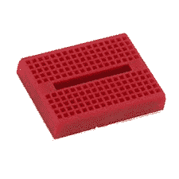

对于使用 Arduino 进行原型设计，也不必非得购买带有内置电源连接器的面包板，就像下面照片中展示的那样：

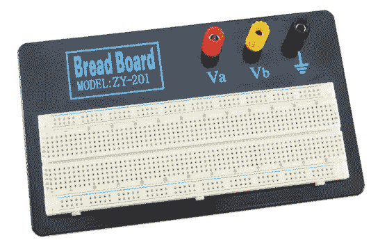

我会推荐购买一个像以下照片中显示的 MB 102 面包板：

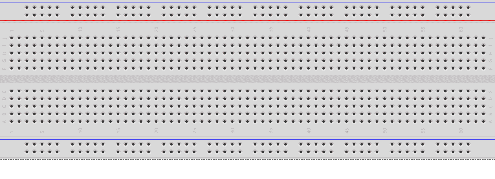

MB-102 面包板包含两个正电源轨和两个负电源轨，这使得将 Arduino 的电源和地引脚连接到原型所需的电子组件变得容易。在以下照片中，我们突出显示了四个电源轨，其中用红色突出显示的轨是正轨，用黑色突出显示的轨是负轨。正轨通常在面包板上用加号标记，负轨用减号标记：

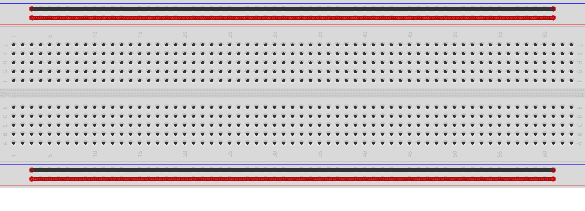

电源轨在面包板上水平运行，其中所有沿水平轨的连接器通常都是连接在一起的。这意味着，例如，如果我们把 Arduino 上的一个电压引脚连接到正轨上的任何一个引脚，那么该轨上的所有连接器都必须连接到 Arduino 上的电压引脚。

板中间的引脚是垂直连接的；然而，连接并没有穿过面包板的中心。以下照片显示了板中间的引脚是如何连接的：

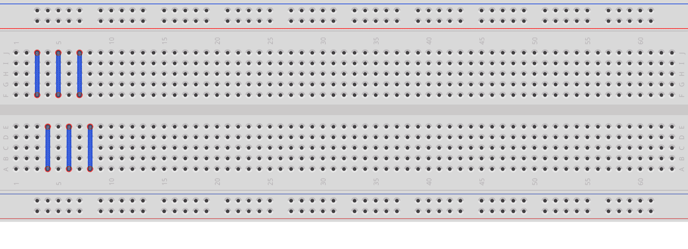

虽然前面的照片只显示了六列垂直行是如何连接的，但所有垂直行都是以这种方式连接的。需要注意的是，我们描述的 MB-102 面包板是如何配置的，大多数都是这样配置的；然而，并不是所有的都是这样配置的。

当你购买像面包板这样的组件时，一定要阅读规格说明，以确保你知道你购买的产品是否有任何不同之处。这可以为你节省数小时的问题排除。

如果我们撕掉面包板的背面，我们可以更好地看到引脚是如何连接的。以下照片显示了如果我们撕掉填充物，面包板的背面看起来是什么样子：

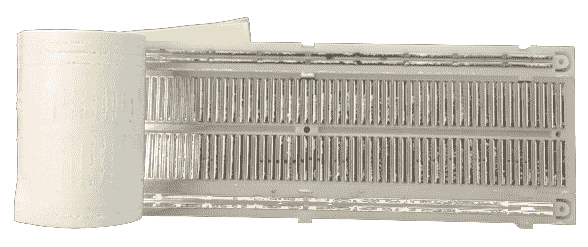

当与 Arduino 一起工作时，我们通常可以直接从 Arduino 将电源和地连接到面包板上的电源轨；然而，有时我们可能需要外部电源。在这种情况下，他们确实有外部电源适配器，可以直接连接到面包板，并使我们能够使用 USB、AC 适配器和其他电源为项目供电。以下照片显示了一个这样的适配器以及我们如何将这些电源适配器连接到面包板：

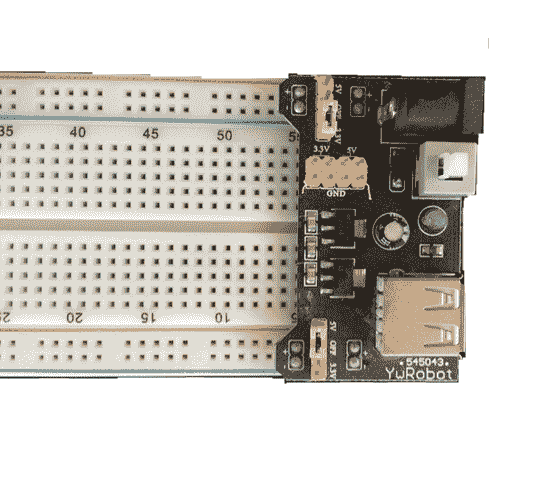

现在的问题是你是如何使用面包板将组件连接在一起，答案是杜邦（跳线）电缆。

# 杜邦（跳线）电缆

杜邦线，也称为跳线，用于在无焊面包板上连接组件。这些线有三种类型：公对公、公对母和母对母。当我们使用这些线与无焊面包板和 Arduino 一起使用时，我们通常使用两端都有公接头的线；然而，有些组件本身已经带有公接头，所以拥有一些公对母线也是值得的。以下照片显示了杜邦线末端的公接头样子：

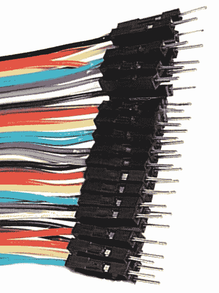

购买预制的杜邦线相当便宜，但如果你想要定制长度，你可以通过购买一个剥线钳和一些端子自己制作它们。这些线并不难制作，但我建议先从购买预制的开始。

# 原型设计

原型用于验证工作概念或过程的规格，而不是理论规格。在我们这本书中提到的原型，是一个用于测试概念或过程的模型。对于简单概念或过程，我们可能会为整个系统创建一个原型，但对于我复杂的系统，我们希望将系统分解成单个组件，并为每个组件创建一个原型。

使用 Arduino 的原型通常由一个 Arduino 微控制器和一个面包板组成，用于将组件连接到 Arduino。对于这些原型，我使用了我用 3D 打印机设计和打印的支架。以下照片显示了支架中包含 Arduino Uno、Nano 和一个面包板：

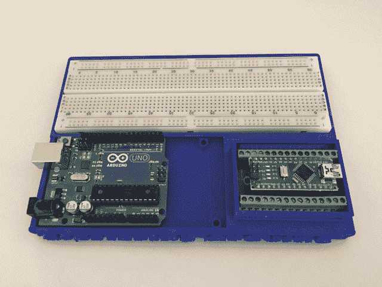

这个支架设计用来固定 MB-102 面包板、Arduino Nano 以及 Arduino Uno 或 Mega。如果你有 3D 打印机，我在这本书的可下载代码中包含了这个支架的 STL 文件，这样你可以自己打印一个。这种支架在我们需要移动原型时特别有用，因为它能将所有东西保持在一起并保持有序。

在我们开始构建原型之前，我们需要有一个关于我们想要构建什么的想法。这个想法可能像简单地闪烁一个 LED 灯那样简单，也可能像创建一个自主机器人那样复杂。在开始一个项目时，想法总是第一步。

第二步是将想法分解成第二章中讨论的不同构建块。在我们将项目分解成不同的块之后，我们就会绘制需要原型化的电路图。在电路图完成后，我们就可以开始构建原型了。让我们更详细地看看这些步骤，从电子电路的四个构建块开始。

# 电子项目的四个构建块

在第二章，“基础电子”中，我们讨论了电子项目的四个基本模块。以下图表显示了这四个模块：

将一个简单的原型，比如一个用于开关 LED 的电路，分解成单独的模块是非常容易的，但对于更复杂的项目来说，由于不同的组件，这会变得更加困难。

通过将组件分离成不同的模块，更容易看到如何将更大的项目分解成单独的原型。例如，如果我们想要创建一个自主机器人，我们可以看到其中一个输入是一个声纳测距仪，它将检测机器人前面的障碍物，而受测距仪输入影响的输出将是驱动机器人移动的电机。在这个例子中，如果我们希望测距仪检测到前面的障碍物，我们可能需要改变电机的方向。然后我们可以创建一个原型来测试这个特定系统的工作情况。

在这一步中，我们定义了输入和输出是什么，以及基于这些输入触发的输出是什么。这也是我们定义项目大部分逻辑的地方，因此我们可以设置原型。

当你刚开始构建这些项目时，你将想要为每个项目创建一个图。一旦你积累了经验，对于大多数小型到中型项目，你在这个步骤中可能不需要写下任何东西。这一步将变成只是在脑海中分解项目并确定输入和输出是什么。对于更大的项目，我们可能需要创建流程图甚至展示我们希望所有东西如何协同工作的图表。一旦我们进入这本书中的项目，我们将看到不同的方法来将组件分离成各自的模块，以及如何定义输入和输出的逻辑。

在我们将项目分解成具有单独输入和输出电路的各个原型之后，我们接下来就会想要为这些原型中的每一个创建电路图。

# 创建图表

一旦我们定义了电路的输入和输出以及项目的逻辑，下一步就是绘制电路图。我们想要确保我们绘制了所有创建的电路，即使是最基本的电路。这将帮助我们确定所需的电阻，并可视化我们想要如何组织和连接组件。

在创建电路图时，我建议使用在第三章，“电路图”中描述的 Fritzing 软件。现在让我们看看最后一步，构建原型。

# 构建原型

最后一步实际上是构建一个工作原型。这是前三个步骤中所有艰苦工作的集中体现，你将能够看到原型是否按预期工作。

我们都希望跳过前几个步骤，直接进入构建原型；然而，如果你花时间逐一完成这些步骤，你将更成功，损坏的部件也会更少。

现在我们来看看如何进行这些步骤并构建我们的第一个原型。你将想要跟随并自己构建这个原型，因为在我们学习编程 Arduino 的下一章中，我们将使用它。

# 第一个原型

我们将要构建的第一个原型相当简单，设计用于在接下来的几章中学习如何编程 Arduino。这个原型将包含一个按钮，用于打开或关闭 LED 灯，另一个可以打开或关闭的 LED 灯，以及一个 TMP36 温度传感器。

在这个原型中，我们将有两个输入（一个按钮和温度传感器）和两个输出（两个 LED 灯）。我们将使用 Arduino 的 5V 输出为组件供电。以下是这个原型的 Fritzing 图：

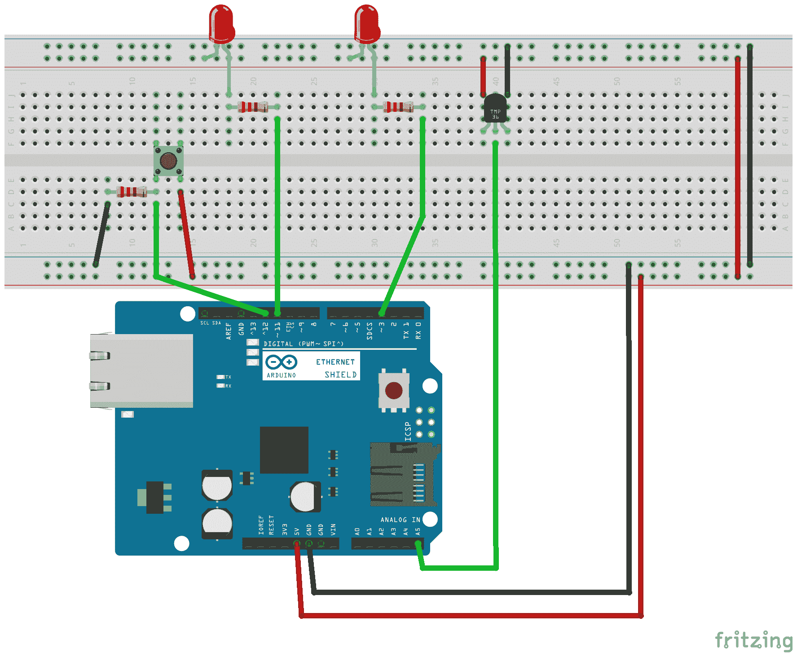

在这个图中，从左到右，我们有按钮、两个 LED 灯和 TMP36 温度传感器。每个 LED 都使用了与第三章中“电路图”相同的 330 欧姆电阻。由于 Arduino 的电源只有 5 伏，我们可以将电阻值降低到 100 欧姆，但 330 欧姆的电阻也可以正常工作。

我们用来连接按钮的电阻被称为下拉电阻，因为其一边连接到地线。数字逻辑电路实际上可以有三种状态：高、低和浮空。浮空状态发生在引脚既没有被拉高也没有被拉低，而是被留下浮空。在这种浮空状态下，微控制器可能会不可预测地将这种状态解释为高或低。为了解决这个问题，我们使用下拉电阻将浮空状态拉低。

如果电阻连接到电源而不是地线，它将被视为一个上拉电阻。上拉电阻的工作原理与下拉电阻相同，但上拉电阻将浮空状态拉高，而不是拉低。在这本书的几个项目中，我们将使用下拉和上拉电阻。

按钮连接到 Arduino 的 12 号引脚；因此，我们可以通过检查 12 号引脚的状态来读取按钮的状态。LED 灯连接到 11 号和 3 号引脚；因此，我们可以通过向这些引脚发送数字高电平来打开它们，或者通过发送数字低电平来关闭它们。最后，TMP36 温度传感器的输出引脚（中间引脚）连接到模拟 5 号引脚，因为传感器的输出是模拟的。TMP36 温度传感器的电压和地线引脚连接到面包板上的电压和地线轨。

Fritzing 图表让原型看起来非常整洁和有组织；然而，大多数原型并不像那样。以下是我为这本书构建原型时的样子：

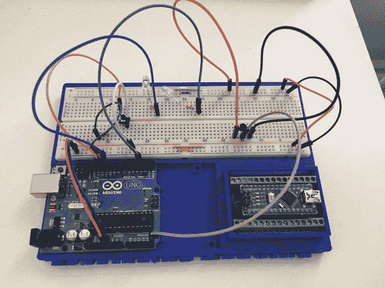

很好，让原型整洁且看起来不错，但只要你能工作，这并不是必要的。当你只有一两条杜邦（跳线）电缆时，让原型整洁尤其困难。

你也会注意到横跨电源轨的短电线。在这个面包板上，电源轨并没有完全水平连接。这是一个配置略有不同的面包板示例。你可以看出电源轨并没有完全横跨，因为面包板上的红色和蓝色线条在中途有一个间隙；因此，我们使用了小电缆将两侧连接起来。有时我们需要不同的电源，所以电源轨这样分开连接非常有帮助，但在这个原型中，因为我们为所有组件使用相同的电源，所以我们把电源轨连接在一起。

# 摘要

在本章中，我们探讨了原型制作的基础以及我们在创建原型时应采取的步骤。本章末尾我们做的示例原型相当基础，但我们仍然走过了每一个步骤，以确保一切正确。我们将在本书后面的项目章节中逐步讲解这些步骤。

现在我们已经创建了我们的第一个原型，我们需要学习如何编程 Arduino。接下来的三章将教授你如何编程 Arduino。我们将从向你展示如何下载和安装 Arduino IDE 开始。
