# 第五章：Arduino IDE

我已经作为爱好或专业程序员编程计算机超过 37 年。在这段时间里，我使用了许多不同的**集成开发环境**（**IDE**）和文本编辑器来编写代码。我在一个既没有 IDE 也没有文本编辑器的电传打字机上编写了我的第一个 Hello World 程序。当我买了我的第一台电脑，Commodore VIC-20 时，我使用编程模式中的 BASIC 编程语言来编写我的程序。在编程模式下，你逐行输入代码，每行在你输入时进入内存，没有好的编辑器或 IDE。直到我学会了在 IBM PCjr 上用 C 编程语言编程，我才使用了我的第一个真正的 IDE。现在我想知道我是如何用那个来写任何东西的。

在本章中，你将学习：

+   Arduino 草图的含义

+   Arduino IDE 的含义

+   Arduino Web 编辑器的含义

+   如何编写你的第一个草图

在我们查看 Arduino IDE 和 Web 编辑器之前，让我们看看 Arduino 草图的含义，以帮助我们理解为什么我们需要这些工具。

# Arduino 草图

当我们为 Arduino 编程时，代码被放入一个项目中。这些项目被称为**草图**，草图存储在**草图簿**中。草图的设计尽可能简单直接，通过使用预构建的函数来抽象出许多编程 Arduino 的技术方面。

用于编程 Arduino 的编程语言与 C 编程语言非常相似。我们将在第六章“编程 Arduino – 基础”和第七章“编程 Arduino – 超越基础”中探讨如何编程 Arduino。本章的目的是让你熟悉草图是什么，并查看我们可以使用的工具。

在草图上传到 Arduino 之前，Arduino IDE 或 Web 编辑器必须经过几个步骤来构建应用程序。构建草图的第一个步骤是进行一些预处理，这会将草图转换为一个 C++（见加加）程序，然后传递给编译器，将这个可读的 C++ 代码转换为机器可读的指令（目标文件）。然后，这些目标文件与提供 Arduino 基本功能的标准 Arduino 库进行链接。链接的结果是一个可以上传到 Arduino 并运行的单一十六进制文件。好事是，当我们将草图上传到 Arduino 板时，Arduino 工具会自动执行所有这些操作。

如果我们要对 Arduino 草图的定义进行说明，我们会说它是一个包含可构建并上传到 Arduino 的人可读代码的项目。现在让我们看看两个可以帮助我们编写和构建这些草图的工具，首先是 Arduino IDE。

# Arduino IDE

Arduino IDE 是一个集成开发环境，可以安装在 Windows、macOS 和基于 Linux 的计算机上。IDE 可以从以下 URL 的 Arduino 软件页面下载：[`www.arduino.cc/en/Main/Software`](https://www.arduino.cc/en/Main/Software)。在本书编写时，IDE 的最新稳定版本是 1.8.5。

以下图像显示了首次运行 IDE 时的样子：

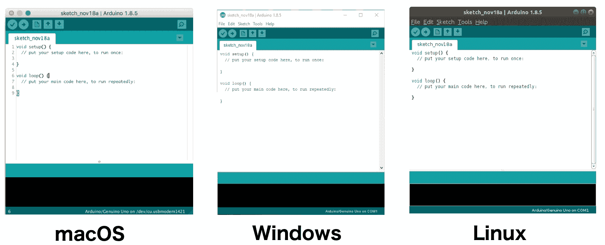

我们将在本章末尾开始使用 IDE，我们将构建我们的第一个草图。我们将在本书的其余部分广泛使用它以及 Web 编辑器。现在，让我们简要地探索 IDE，以便我们熟悉其一些基本功能。

# 探索 IDE

IDE 的主开发窗口由四个区域组成。以下截图显示了这四个区域：

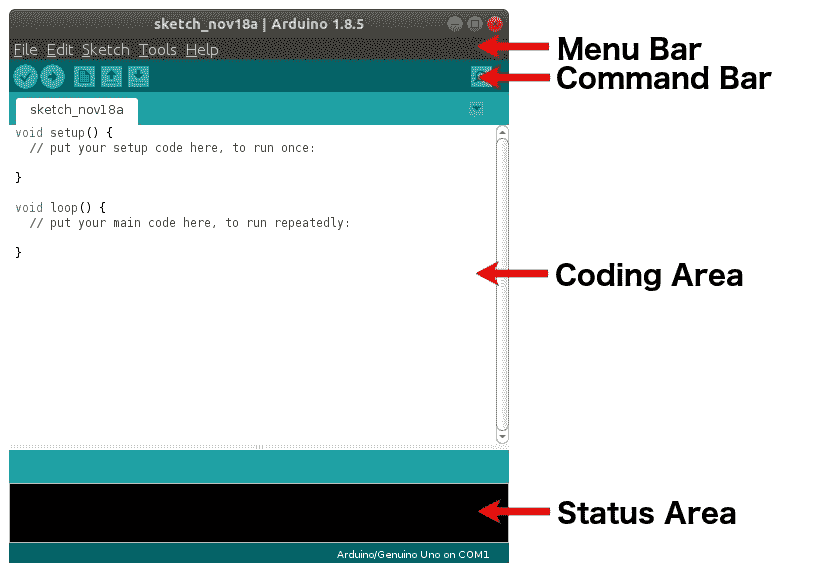

IDE 的**菜单栏**与其他应用程序中的菜单栏类似，您点击其中一个选项，就会出现一个包含更多选项的下拉菜单。随着我们阅读本书，我们将查看一些常用的菜单选项。

**命令栏**提供了对五个最常用命令的快速访问。这些命令从左到右依次是验证、上传、新建、打开和保存。验证命令将尝试编译草图以验证代码中没有任何错误。上传命令将尝试构建并将草图上传到连接的 Arduino。新建命令将创建一个新的草图。打开命令将打开一个草图。最后，保存命令将保存草图。

**注意**：为了上传草图，您必须将 Arduino 连接到您正在工作的计算机，并在 IDE 中配置它，否则您将收到错误。我们将在“在 IDE 中配置 Arduino”部分查看如何进行此操作。

**编码区域**是我们编写 Arduino 代码的地方。您会注意到，当我们开始一个新的草图时，主标签页会自动创建两个函数（setup 和 loop）。在这本书中，我们将大量使用这些函数。当我们在本章末尾创建我们的第一个草图时，我们将查看这两个函数的作用。

**状态区域**用于 IDE 让我们知道当 IDE 正在执行编译、上传或验证草图等活动时发生了什么。

为了将草图上传到 Arduino，我们需要使用 USB 线将 Arduino 连接到 IDE 运行的计算机，并在 IDE 中配置它。在 IDE 中配置 Arduino 需要我们告诉它我们使用的是哪种类型的 Arduino 以及它在哪个端口上。让我们看看如何操作。

# 在 IDE 中配置 Arduino

要将 Arduino 连接到 IDE，IDE 首先需要知道正在使用哪种类型的 Arduino。为此，我们点击菜单栏中的工具选项，然后选择板子选项，如图所示：

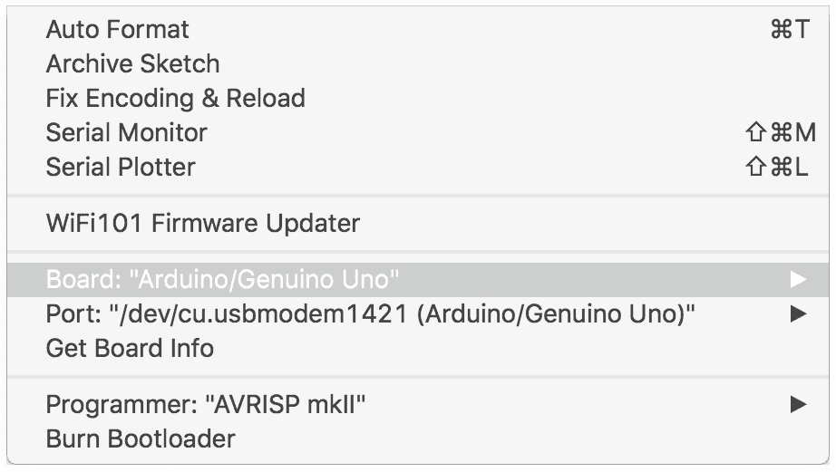

当选择板子选项时，IDE 显示一系列兼容的板子。这个列表看起来可能类似于以下截图：


从这个列表中，选择你为你的项目使用的板子。一旦选择了板子，IDE 接下来需要知道 Arduino 连接到哪个端口。要选择端口，点击菜单栏中的工具菜单选项，然后选择端口选项，如图所示：

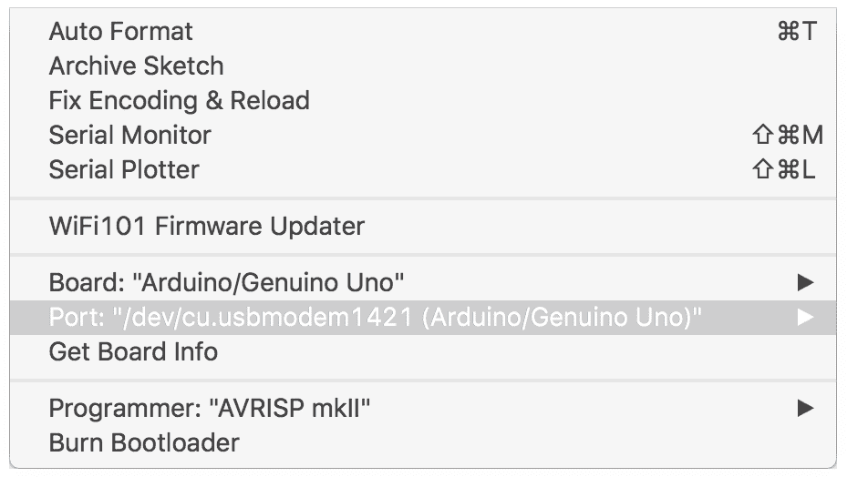

当从该菜单选择端口选项时，IDE 显示它所知道的端口的列表。这个列表应该看起来类似于以下截图：


你可能有一个不同的端口列表；然而，通常很明显应该选择哪个端口，因为如果它看到了板子，它会显示连接到端口的板子的名称。大多数时候，IDE 会自动为你选择正确的端口。

一旦选择了板子和端口，IDE 就准备好将编译好的草图上传到板子。

现在我们已经看到了如何使用 Arduino IDE，让我们看看如何设置和使用 Arduino Web 编辑器。

# Arduino web editor

Arduino Web 编辑器使我们能够在大多数网络浏览器中创建和上传草图。官方上，Web 编辑器通过安装插件支持 Chrome、Firefox、Safari 和 Edge 浏览器。

Web 编辑器是 Arduino Create 项目的一部分，可以从这里访问：[`create.arduino.cc`](https://create.arduino.cc)

在你能够安装插件并使用 Web 编辑器之前，你需要创建一个免费的 Arduino 账户。一旦我们登录到我们的账户，网站将引导你安装插件。一旦插件安装完成，你应该会看到一个类似的页面：

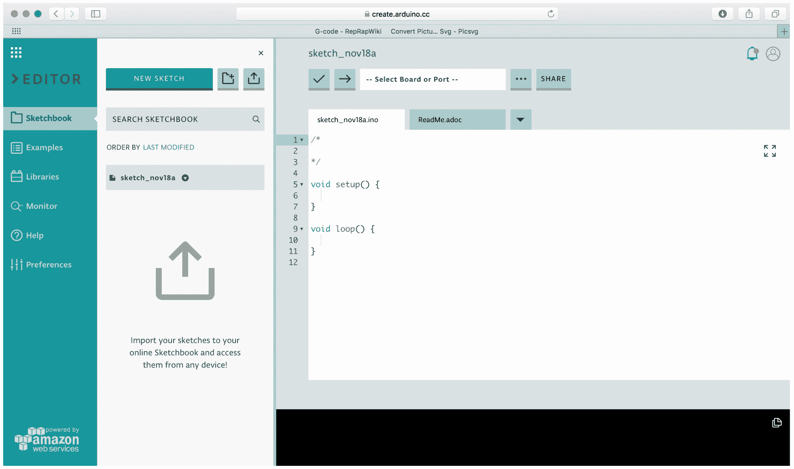

让我们探索 Web 编辑器，看看如何使用它。

# 探索

Web 编辑器的四个主要区域如图所示：

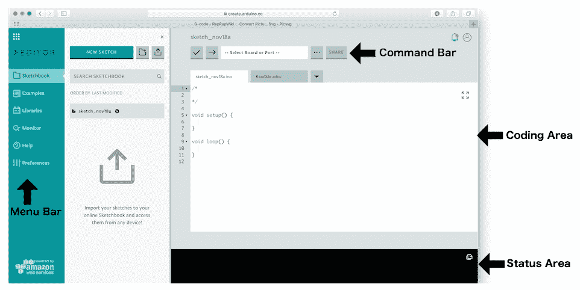

Web 编辑器的**菜单栏**使我们能够快速访问某些项目，如示例、库和串行监视器。我们将在本章后面讨论这些项目。

**命令栏**提供了对常用命令的快速访问，并使我们能够选择我们正在使用的板子。带有勾选标记的图标将验证草图，带有箭头的图标将编译并将草图上传到 Arduino。带有三个点的图标打开一个菜单，使我们能够保存、重命名、下载和删除当前草图。

**代码区域**是我们编写 Arduino 代码的地方。与 Arduino IDE 一样，你会注意到当开始一个新的草图时，`setup()`和`loop()`函数会自动创建。

**状态区域**被 IDE 用来告诉我们当 IDE 在进行诸如编译、上传或验证草图等操作时发生了什么。让我们看看如何在 Web 编辑器中配置 Arduino，以便我们可以将其草图上传到它。

# 在 IDE 中配置 Arduino

为了将草图上传到 Arduino，我们需要用 USB 线将 Arduino 连接到 Web 编辑器运行的计算机。Arduino 连接到计算机后，我们可以在 Web 编辑器中通过点击“选择板或端口”部分来选择 Arduino 和端口。如果 Web 编辑器识别到 Arduino 板，你应该在下拉菜单中看到 Arduino 板和端口的列表。列表看起来像以下截图：


如果你看到 Arduino，请选择它，然后你将能够上传编译后的草图。学习 Arduino IDE 或 Web 编辑器最好的方法是使用它们，我们将在整本书中广泛使用它们。

让我们来看看 Arduino IDE 和 Web 编辑器的一些功能，从包含的示例开始。

# 示例

Arduino IDE 和 Web 编辑器中包含了许多示例。这些示例是简单的草图，展示了 Arduino 命令及其使用方法。这些示例从演示如何读取和写入数字 I/O 的非常基础的草图到展示如何使用传感器的更高级的草图。虽然这些示例旨在演示 Arduino 命令，但它们也可以用作编写 Arduino 良好代码的示例。

要访问 Arduino IDE 中的示例，请点击菜单栏中的“文件”选项，然后转到“示例”选项。你会看到一个与以下截图类似的示例类别列表：


如果你进入任何一个类别，你会看到该类别的示例列表。如果你选择一个示例，比如在“基础”类别下的`DigitalReadSerial`示例，示例的代码将在新窗口中加载，草图看起来类似于以下截图：

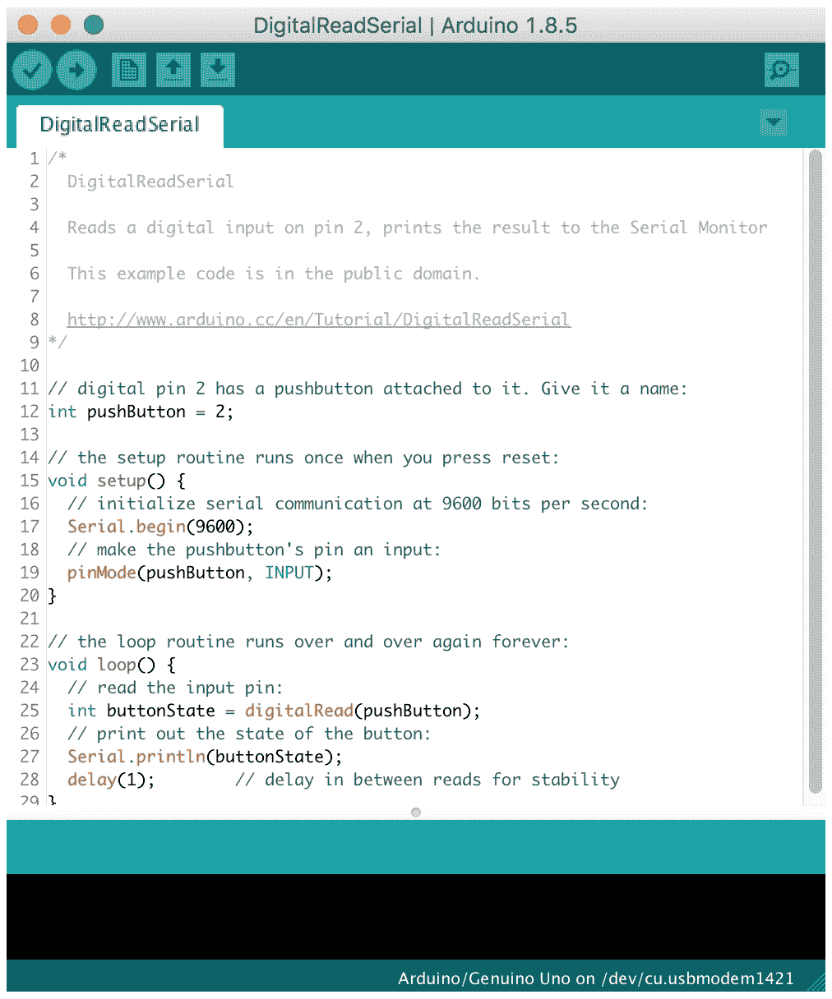

使用 Web 编辑器，要加载示例，请从菜单栏中选择“示例”选项。与 Arduino IDE 一样，我们将看到相同的示例类别列表。这个列表看起来类似于以下截图：

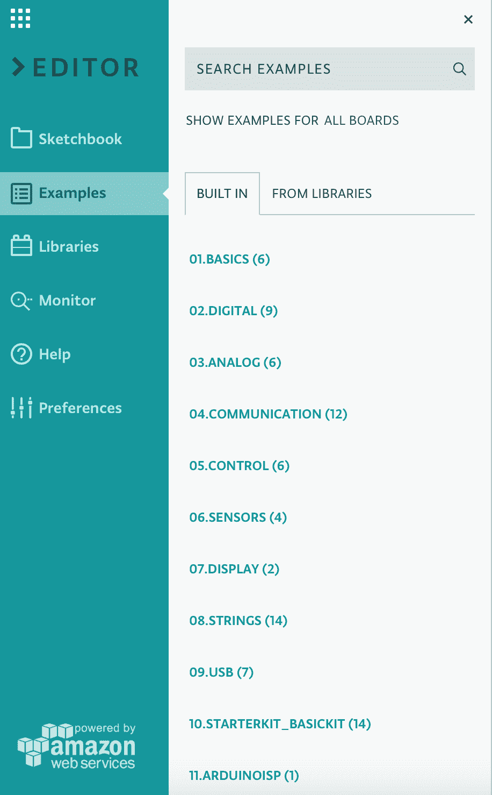

然后，我们可以选择任何类别以查看示例列表。Web Editor 中的示例与 Arduino IDE 中的示例的不同之处在于，Web Editor 中的大多数示例还包括布局（Fritzing）和电路图，显示如何创建可以与示例一起使用的电路。例如，如果我们选择与 Arduino IDE 中相同的`DigitalReadSerial`示例，我们不仅会看到草图代码，还会看到以下截图所示的布局：

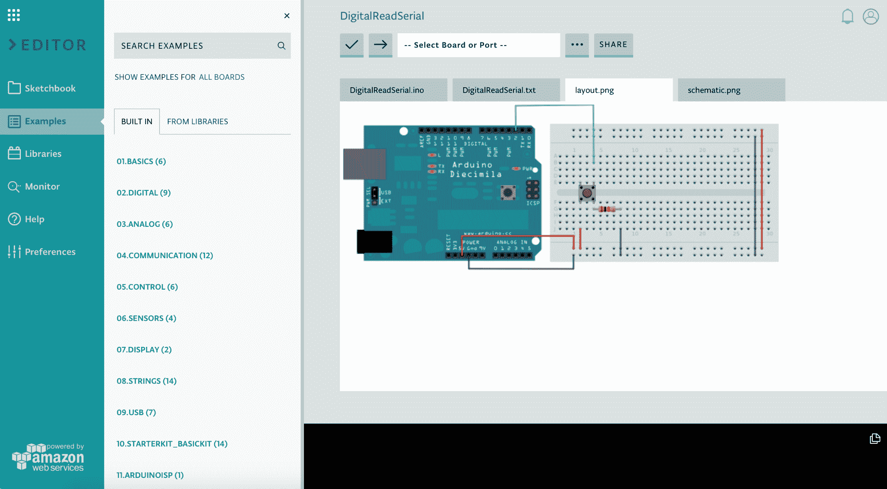

Web Editor 中包含的图表非常适合初学者，因为它们显示了如何构建电路，而无需完全理解示例的代码。

有许多外部库可以与 Arduino 一起使用。让我们看看什么是库。

# Arduino 库

与大多数开发平台一样，Arduino 环境可以通过库进行扩展。这些库提供了额外的功能，我们可以在我们的草图（sketch）中使用，例如提供对特定硬件的访问、操作数据和添加额外功能，如任务调度器（Arduino Cron Library）。IDE 和 Web Editor 中内置了许多库，但我们也可以下载其他库或构建自己的库。

要访问 Arduino IDE 中的库，我们从菜单栏中选择 Sketch 选项，然后选择 Include Library 选项。这将显示另一个菜单，允许您加载库或管理库。此菜单应类似于以下截图：

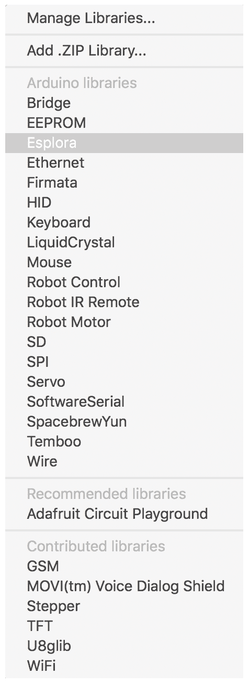

如果您选择任何内置库，头文件将自动包含在您的草图（sketch）中。我们将在第六章“编程 Arduino – 基础”和第七章“编程 Arduino – 超越基础”中了解更多关于头文件的信息。

选择 Manage Libraries 选项使我们能够下载和安装 Arduino IDE 标准安装中未包含的其他库。当一个库被下载并安装后，它将出现在 Arduino 库的快速列表中，并且可以像内置库一样使用。这些库中的许多也安装了示例代码，可以从 IDE 的示例部分访问。

要访问 Web Editor 中的库，从菜单栏中选择 Library 选项，菜单栏右侧将出现一个带有搜索栏的可用库列表。界面将类似于以下截图：


Web 编辑器中包含数百个库。这使得访问库比 Arduino IDE 更容易，因为我们不需要安装它们。Web 编辑器还使共享需要库的草图更容易。当共享使用 Arduino IDE 创建的草图时，接收草图的人需要安装所需库的正确版本。这有时可能会变得复杂和令人困惑。使用 Web 编辑器时，当我们共享草图时，Web 编辑器将确保在编译草图时使用正确的库。

要将库添加到草图，请在搜索栏中搜索库，当库出现在列表中时，将鼠标悬停在它上面，就会出现一个包含按钮，如下面的截图所示：


点击包含按钮，所需的头文件将出现在代码中，库将与草图一起包含。

在我们创建第一个草图之前，让我们看看串行监视器是什么。

# 串行监视器

串行监视器发送和/或接收文本，通常通过 USB 电缆。这使得我们能够在 Web 编辑器或 Arduino IDE 中接收调试消息或从键盘发送文本。我们将在本章末尾创建第一个草图时看到如何进行这两者。

要使用 Arduino IDE 或 Web 编辑器中的串行监视器，您必须首先将 Arduino 连接到计算机，并在 Arduino 和 IDE 或编辑器之间建立通信。

要在 Arduino IDE 中使用串行监视器，请点击 IDE 右上角的串行监视器图标。以下截图突出了串行监视器图标：

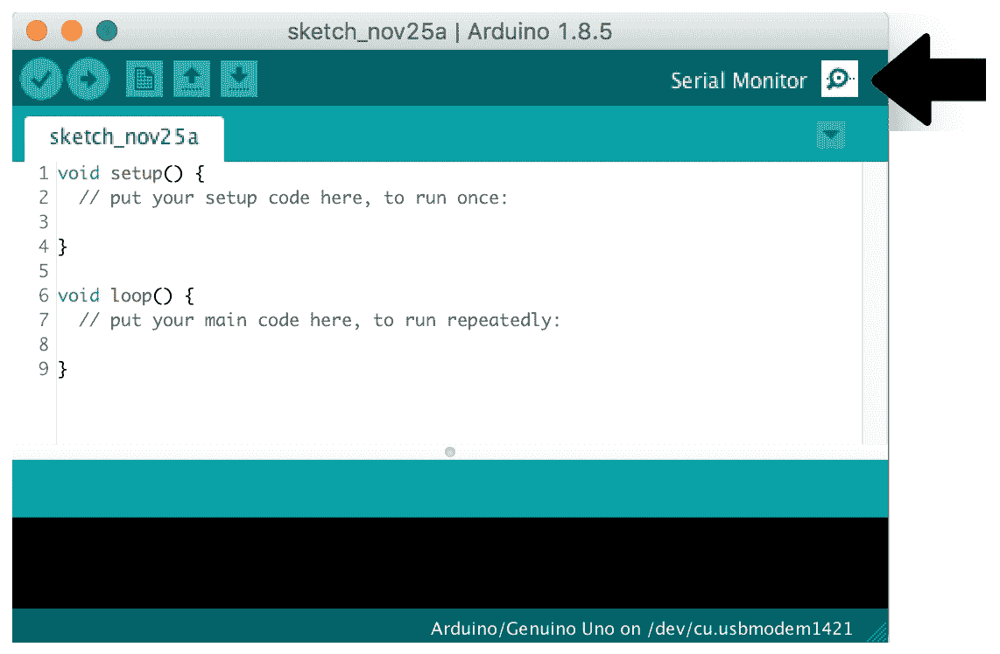

串行监视器将在单独的窗口中打开，如下面的截图所示：


输入部分使我们能够将文本发送到 Arduino。为此，请在输入框中输入文本，然后点击发送按钮或按回车键发送。Arduino 的文本将出现在输出部分。

要使用 Web 编辑器中的串行监视器，请点击菜单栏中的监视器选项，串行监视器将出现在菜单栏的右侧。以下截图显示了 Web 编辑器中的串行监视器：

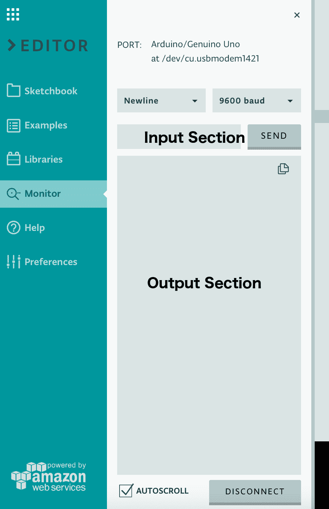

就像 Arduino IDE 中的串行监视器一样，要将文本发送到 Arduino，请在输入部分内的输入框中输入文本，然后点击发送按钮或按回车键发送。Arduino 的输出将出现在输出部分。

现在我们已经对 Arduino IDE 和 Web 编辑器的工作原理有了基本的了解，让我们创建一些草图。

# Hello World

对于我们的第一个 Sketch，我们将使用 Arduino 创建传统的*Hello World*应用程序。这个应用程序将把“Hello World”这几个字输出到串行监视器；然而，在我们创建这个应用程序之前，我们需要了解`setup()`和`loop()`函数的作用。

`setup()`函数在应用程序第一次启动时只运行一次。这个函数使我们能够在应用程序第一次启动时初始化任何变量或硬件。`setup()`函数完成后，`loop()`函数将被第一次调用。当`loop()`函数完成后，它将被再次调用，并继续循环，直到 Arduino 断电。

让我们演示这些函数是如何工作的。我们需要首先在 Arduino IDE 或 Web Editor 中创建一个新的 Sketch。要使用 Arduino IDE 创建一个新的 Sketch，我们可以使用命令栏上的新建图标，或者从菜单栏中选择文件 | 新建。要使用 Web IDE 创建一个新的 Sketch，点击菜单栏上的 Sketchbook 选项，然后点击 NEW SKETCH 按钮。

一旦创建了一个新的 Sketch，将以下代码添加到`setup()`函数中：

```cpp
Serial.begin(9600);
Serial.println("Hello World");
```

我们接下来需要将 Arduino 连接到计算机，并建立 Arduino 与 IDE 或 Web Editor 之间的连接，如本章前面所述。然后我们可以通过在 Arduino IDE 和 Web Editor 的命令栏上的上传按钮上传 Sketch 来运行 Sketch。一旦代码编译并上传到 Arduino，你应该会在串行监视器中看到一次输出`Hello World`。

现在，让我们从`setup()`函数中移除`Serial.println("Hello World");`这一行，并将其放入`loop()`函数中，使我们的代码看起来像这样：

```cpp
void setup() { 
 Serial.begin(9600);   
}
void loop() { 
  Serial.println("Hello World"); 
}
```

然后我们可以上传 Sketch，我们应该会看到`Hello World`这个词在串行监视器中反复打印。文本将持续打印，直到我们从计算机上拔掉 Arduino。

在最后两个示例中，我们使用了`Serial.println()`函数将文本输出到串行监视器。这个函数会在文本末尾添加一个换行符。我们也可以使用`Serial.print()`函数，它将输出文本，但不会在末尾添加换行符。

输出到串行监视器的输出应该类似于以下内容：


现在我们已经看到了如何从 Arduino 输出文本到串行控制台，让我们看看 Arduino 如何通过创建一个回显应用程序来接收来自串行监视器的文本。

# 回显

一个回显应用程序将读取来自串行监视器的文本，并将其回显出来。

文本将被输入到输入字段中，如下面的截图所示：

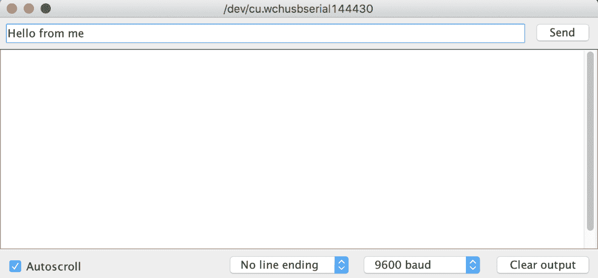

文本将被回显，如下面的截图所示：

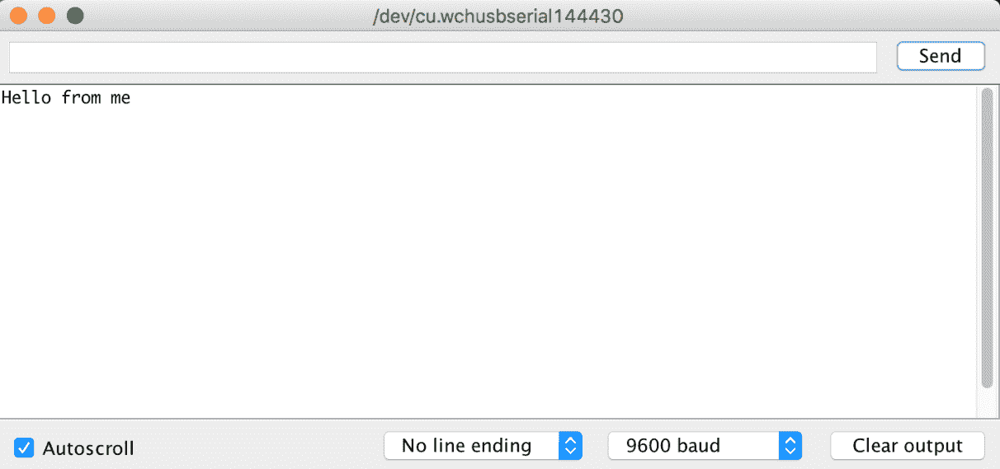

我们将首先创建一个新的 Sketch，并向其中添加以下代码：

```cpp
byte bytesIn;

void setup() { 
  Serial.begin(9600);   
}

void loop() { 
  if (Serial.available()) { 
    bytesIn = Serial.read(); 
    Serial.write(bytesIn); 
  }
}
```

在此代码中，我们首先定义一个名为 `bytesIn` 的字节类型变量。然后在 `setup()` 函数中，将串行数据传输的波特率设置为 9600 波特。

在 `loop()` 函数中，我们使用 `Serial.available()` 函数来查看串行队列中是否有任何数据存储。`Serial.available()` 函数返回串行接收缓冲区中可用于读取的字节数。如果有可读的字节，代码随后使用 `read()` 函数读取字节，然后使用 `write()` 函数将字节写回串行监视器。

在此代码中使用的 `write()` 函数与之前示例中使用的 `println()` 函数之间的区别是，`println()` 函数将数据以人类可读的 ASCII 文本形式打印，而 `write()` 函数将数据以字节形式写入。在此示例中，如果我们使用 `println()` 函数，我们将看到输入字符的 ASCII 等价字符，而不是字符本身。

# 摘要

在本章中，我们了解了如何设置 Arduino IDE 和 Web 编辑器，还学习了它们的基本功能。在本章末尾，我们看到了如何使用串行监视器向 Arduino 发送和接收数据。

在下一章中，我们将开始学习如何编程 Arduino。
