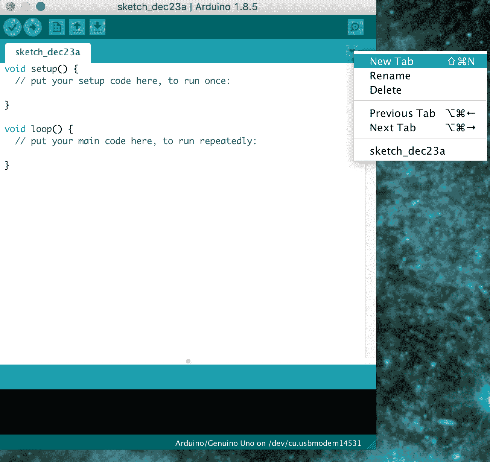
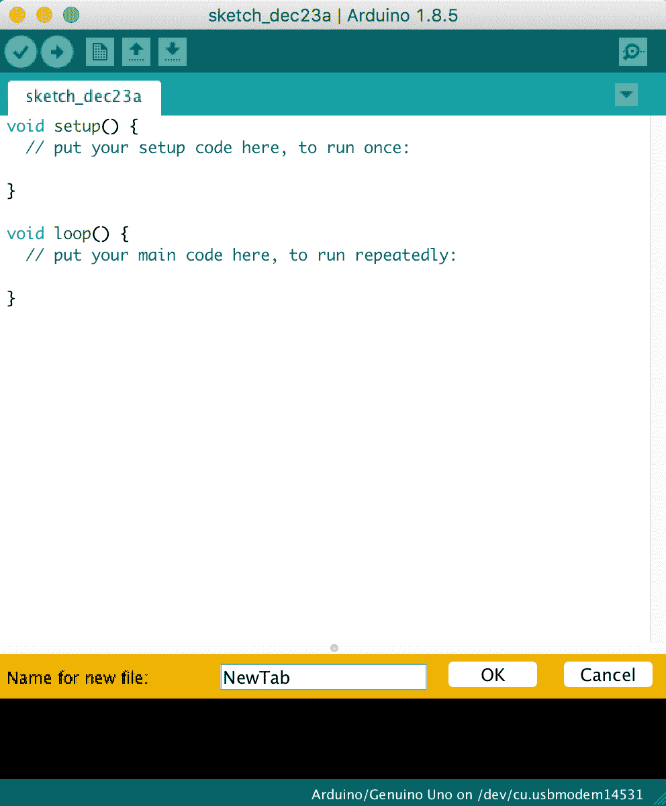
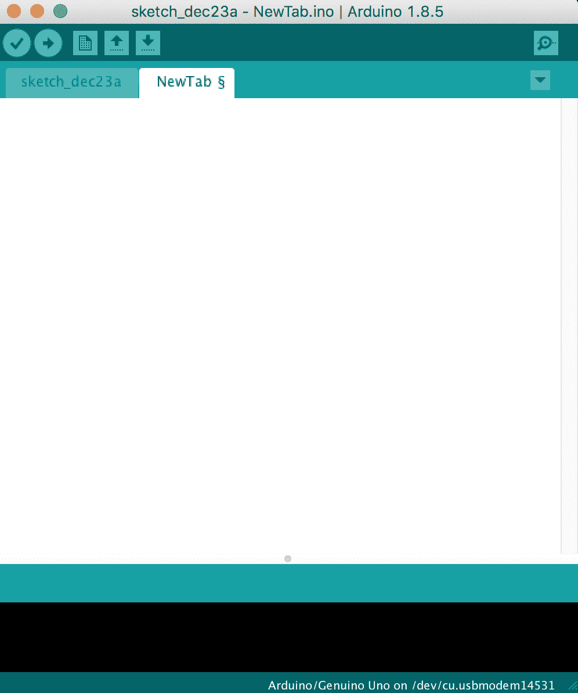

# 编程 Arduino - 超越基础

在我的开发生涯早期，我学到的其中一件事是，即使我只了解我使用的编程语言的基础知识，我也能编写一些相当惊人的应用程序；然而，这通常会使代码难以维护和阅读，同时也会给项目增加显著的开发时间。我总是告诉正在学习语言的人，在为严肃的项目使用它之前，花时间了解他们正在学习的语言的更高级功能。

在本章中，我们将学习：

+   如何设置 Arduino 数字引脚的引脚模式

+   如何获取和设置 Arduino 数字引脚的值

+   如何获取和设置 Arduino 模拟引脚的值

+   如何使用结构和联合

+   如何使用额外的标签页

+   如何使用类和对象

在上一章中，我们探讨了 Arduino 编程语言的基础知识。在本章中，我们将超越语言本身的基础。我们将从查看我们如何与 Arduino 上的数字引脚交互开始。

对于本章的示例，我们将使用在 第四章，*基本原型* 的末尾创建的原型。

# 设置数字引脚模式

在 第一章，*Arduino* 中，我们看到了 Arduino 有几个数字引脚，我们可以将外部传感器和其他设备连接到这些引脚上。在我们使用这些引脚之前，我们应该根据我们使用它们的目的来配置它们为输入或输出。为此，我们使用内置在 Arduino 编程语言中的 `pinMode()` 函数。通常对于较小的草图，我们在 `setup()` 函数中调用 `pinMode()` 函数；然而，这并不是必需的。以下代码展示了 `pinMode()` 函数的语法：

```cpp
pinMode(pin, mode);
```

这个函数使用两个参数调用。第一个是我们设置的引脚号，第二个是引脚的模式。引脚的模式可以是 `INPUT`，从引脚读取值（外部传感器将值写入引脚），或者 `OUTPUT`，为引脚设置值。以下代码展示了如何使用此命令设置两个引脚的引脚模式：

```cpp
pinMode( 11 , INPUT);
pinMode( 12 , OUTPUT);
```

在前面的代码中，我们将引脚 `11` 设置为输入，引脚 `12` 设置为输出。因此，我们将值写入引脚 11，并从引脚 12 读取值。

好的做法是永远不要像在最后一个例子中那样使用引脚号本身来访问 Arduino 上的引脚。而不是像这样使用引脚号，我们应该设置一个变量或常数，包含引脚的数字，然后在访问引脚时使用该变量或常数。这将防止我们在代码中输入错误的数字。

我的个人偏好是当引脚号不会改变时，使用 `#define` 来定义我使用的引脚号。这允许我将我的引脚定义与其他常数分开。

如果你希望使用常量而不是`#define`，这是完全可以接受的，有些人甚至会说这是首选的。

以下代码显示了如何在草图中使用`pinMode()`函数：

```cpp
#define BUTTON_ONE 12
#define LED_ONE 11

void setup() {
  pinMode(BUTTON_ONE, INPUT);
  pinMode(LED_ONE, OUTPUT);
}
```

在前面的代码中，我们定义了代表两个引脚的常量。第一行将`BUTTON_ONE`定义为数字（引脚）`12`，第二行将`LED_ONE`定义为数字（引脚）`11`。然后，我们在`setup()`函数中将`BUTTON_ONE`引脚设置为输入模式，将`LED_ONE`引脚设置为输出模式。

`pinMode()`函数也可以用来通过设置引脚的模式为`INPUT_PULLUP`来配置内部上拉电阻。这将改变引脚在输入模式下的行为。

这些数字引脚可能有两个值之一：`HIGH`或`LOW`。让我们看看我们如何设置数字引脚的值。

# 数字写入

在 Arduino 编程语言中设置数字引脚的值时，我们使用`digitalWrite()`函数。此函数的语法如下：

```cpp
digitalWrite(pin, value);
```

`digitalWrite()`函数接受两个参数，第一个是引脚号，第二个是要设置的值。在设置数字引脚的值时，我们应该使用`HIGH`或`LOW`。以下代码显示了如何进行此操作：

```cpp
digitalWrite(LED_ONE, HIGH);
delay(500);
digitalWrite(LED_ONE, LOW);  
delay(500);
```

在前面的代码中，我们将由`LED_ONE`常量定义的引脚设置为`HIGH`，然后暂停半秒钟。Arduino 编程语言中的`delay()`函数会暂停脚本的执行一段时间。这个函数的时间是以毫秒为单位的。在`delay()`函数之后，我们接着将`LED_ONE`常量定义的引脚设置为`LOW`，并在返回到开始之前再等待半秒钟。

之前的代码可以用在`loop()`函数中闪烁一个 LED；然而，在我们这样做之前，我们需要定义`LED_ONE`常量并设置引脚模式。让我们看看闪烁 LED 所需的完整草图。

```cpp
#define LED_ONE 11

void setup() {
  pinMode(LED_ONE, OUTPUT);
}

void loop() {
  digitalWrite(LED_ONE, HIGH);
  delay(500);
  digitalWrite(LED_ONE, LOW);
  delay(500);
}
```

此代码首先定义了`LED_ONE`常量并将其设置为`11`。然后，在`setup()`函数中设置了`LED_ONE`引脚的引脚模式。最后，将使 LED 闪烁的代码添加到`loop()`函数中。如果你连接了我们在第四章，“基本原型”中开发的原型，并运行此代码，你应该会看到其中一个 LED 闪烁。

现在我们已经知道了如何向数字引脚写入，让我们看看我们如何读取一个引脚的值。

# 数字读取

在 Arduino 编程语言中读取数字引脚的值时，我们使用`digitalRead()`函数。此函数的语法如下：

```cpp
digitalRead(pin);
```

`digitalRead()`函数接受一个参数，即要读取的数字引脚的编号，并将返回一个整数值。以下代码显示了如何使用`digitalRead()`函数读取 Arduino 上的一个数字引脚：

```cpp
int val = digitalRead(BUTTON_ONE);
```

使用此代码，`digitalRead()`函数将返回由`BUTTON_ONE`常量定义的引脚的值，并将该值放入名为`val`的变量中。`val`变量被定义为整数类型。然而，`digitalRead()`函数只会返回 0 或 1。我们可以使用我们在*数字写入*部分看到的相同的`HIGH`和`LOW`常量来查看引脚是高电平还是低电平。使用这些常量是首选的，并且可以使你的代码更易读。

现在我们来看看如何使用`digitalRead()`函数读取按钮的状态。以下代码将读取我们在第四章中构建的原型*基本原型制作*的按钮状态：

```cpp
#define BUTTON_ONE 12

void setup() {
  Serial.begin(9600);
  pinMode(BUTTON_ONE, INPUT);
} 

void loop() {
  int val = digitalRead(BUTTON_ONE);
  if (val == HIGH) {
    Serial.println("Button HIGH");
  } else {
    Serial.println("Button LOW");
  }
}
```

此代码首先定义了`BUTTON_ONE`常量并将其设置为`12`。串行监视器和按钮连接的引脚模式都在`setup()`函数中配置。在循环按钮中，使用`digitalRead()`函数读取引脚，并使用`if`语句比较返回的值与`HIGH`常量。如果它们相等，则将消息`Button HIGH`发送到串行监视器，否则发送消息`Button LOW`。

如果在第四章中创建的原理图上运行此代码，*基本原型制作*，那么你应该会看到两个消息之一被打印到串行监视器，具体取决于按钮是否被按下。

现在我们来看看如何向 Arduino 上的模拟引脚写入数据。

# 模拟写入

模拟值是通过 Arduino 的**脉冲宽度调制**（**PWM**）引脚写入的。在第一章中，*Arduino*，我们探讨了 PWM 是什么以及它们是如何工作的。在大多数 Arduino 板上，PWM 引脚被配置为引脚 3、5、6、9、10 和 11；然而，Arduino Mega 有更多可用的引脚用于 PWM 功能。

要执行模拟写入，我们使用`analogWrite()`函数，其语法如下：

```cpp
analogWrite(pin, value); 
```

`analogWrite()`函数接受两个参数，第一个是引脚号，第二个是要设置的值。`analogWrite()`函数的值可以从 0 到 255。

让我们看看一个示例草图，看看我们如何使用`analogWrite()`函数来使 LED 淡入淡出：

```cpp
#define LED_ONE 11

int val = 0;
int change = 5;

void setup()
{
  pinMode(LED_ONE, OUTPUT);
}

void loop()
{
  val += change;
  if (val > 250 || val < 5) {
    change *= -1;
  }
  analogWrite(LED_ONE, val);
  delay(100);
}
```

此代码首先定义了一个值为`11`的`LED_ONE`常量。这将是要连接 LED 的引脚。还定义了两个全局变量，都是整数类型，分别命名为`val`和`change`。`val`整数将存储模拟引脚的当前值，而`change`整数将存储每次循环`val`整数应更改的量。

在`setup()`函数中，由`LED_ONE`常量定义的引脚被设置为输出模式。这将使我们能够向引脚写入数据并改变连接到该引脚的 LED 的亮度。

`loop()`函数首先将`change`变量加到`val`变量上，并将结果存储在`val`变量中。如果`val`变量的值大于 250 或小于 5，我们将`change`变量乘以-1。这导致`change`变量在 5 和-5 之间旋转，从而使`val`变量在每次循环中增加或减少。最后，将`val`变量的值写入由`LED_ONE`常量定义的引脚，然后在循环回之前有一个短暂的延迟。

如果在第四章中创建的原型上运行此代码，*基本原型制作*，你应该会看到 LED 灯闪烁。现在让我们看看如何读取模拟引脚。

# 模拟读取

我们使用`analogRead()`函数从模拟引脚读取值。此函数将返回介于 0 到 1023 之间的值。这意味着如果传感器返回满电压 5V，那么`analogRead()`函数将返回 1023 的值，这导致每单位值为 0.0049V（我们将在示例代码中使用这个数字）。以下代码显示了`analogRead()`函数的语法：

```cpp
analogRead(pin);
```

`analogRead()`函数接受一个参数，即要读取的引脚。以下代码使用`analogRead()`函数和一个 tmp36 温度传感器来确定当前温度：

```cpp
#define TEMP_PIN 5

void setup() {
  Serial.begin(9600);
}

void loop() {
  int pinValue = analogRead(TEMP_PIN);
  double voltage = pinValue * 0.0049;
  double tempC = (voltage - .5) * 100.0;
  double tempF = (tempC * 1.8) + 32;
  Serial.print(tempC);
  Serial.print(" -  ");
  Serial.println(tempF);
  delay(2000);
}
```

上述代码首先定义了温度传感器连接的引脚，即模拟引脚 5。`setup()`函数配置串行监视器，以便应用程序可以将其打印到监视器上。

`loop()`函数首先读取模拟引脚并将值存储在`pinValue`变量中。要将此值转换为实际电压，我们将其乘以本节之前看到的 0.0049V 值。如果我们查看 tmp36 温度传感器的数据表，我们将确定`(电压 - .5) *100.0`是计算摄氏温度的正确公式。然后我们可以使用标准公式`(摄氏温度 *1.8) + 32`来确定华氏温度。最后，我们将这些值打印到串行监视器，并在开始下一次循环之前延迟两秒钟。

在这本书中，我们将大量使用`digitalRead()`、`digitalWrite()`、`analogRead()`和`analogWrite()`函数，因此你会熟悉它们。

现在让我们看看结构体。

# 结构体

结构体是一种用户定义的复合数据类型，用于将多个变量组合在一起。结构体中的变量可以是不同类型，使我们能够将不同类型的关联数据存储在一起。以下代码显示了定义结构体的语法：

```cpp
struct name {
  variable list
  .
  .
};
```

当定义结构体时，使用`struct`关键字后跟结构体的名称。然后定义变量列表，位于花括号之间。

让我们看看如何通过将之前使用 `analogRead()` 函数读取 TMP36 温度的草图改为使用结构来创建和使用结构。首先，我们需要定义一个结构来存储传感器的温度信息。我们将把这个结构命名为 `tmp36_reading`，它将包含三个双精度类型的变量。以下代码显示了如何定义这个结构：

```cpp
struct tmp36_reading {
  double voltage;
  double tempC;
  double tempF;
};
```

上述代码定义了一个名为 `tmp36_reading` 的结构，它包含三个双精度类型的变量。请注意，结构中的变量不必是同一类型，只是这个结构中的所有单个变量都是双精度类型。

以下代码显示了如何创建 `tmp36_reading` 类型的变量：

```cpp
struct tmp36_reading temp;
```

上述代码创建了一个名为 `temp` 的变量，其类型为 `tmp36_reading`。然后我们可以使用点语法来赋值或检索值，如下所示：

```cpp
temp.voltage = pinValue * 0.0049;
temp.tempC = (temp.voltage - .5) * 100.0;
temp.tempF = (temp.tempC * 1.8) + 32;
```

在前面的代码中，我们为 `tmp36_reading` 结构的 `voltage`、`tempC` 和 `tempF` 变量赋值。现在让我们看看如何将这段代码集成到一个读取 TMP36 温度传感器的草图中去。以下是新草图的完整代码：

```cpp
#define TEMP_PIN 5

struct tmp36_reading {
  double voltage;
  double tempC;
  double tempF;
};

void setup() {
  Serial.begin(9600);
}

void loop() {
  struct tmp36_reading temp;
  int pinValue = analogRead(TEMP_PIN);
  temp.voltage = pinValue * 0.0049;
  temp.tempC = (temp.voltage - .5) * 100.0;
  temp.tempF = (temp.tempC * 1.8) + 32;

  showTemp(temp);
  delay(2000);
}

void showTemp(struct tmp36_reading temp) {
  Serial.print(temp.tempC);
  Serial.print("  -  ");
  Serial.println(temp.tempF);
}
```

这个草图的功能与之前读取 TMP36 温度传感器的草图完全相同，但现在我们使用结构来存储传感器的值，而不是变量。

如果你有多组可以像这样组合在一起的价值，建议我们使用结构而不是变量，因为所有的值都组合在一个结构中。

现在，让我们看看另一种可能看起来与结构相似的特殊数据类型；然而，其功能有显著不同。

# 联合

联合是一种特殊的数据类型，它允许我们在单个定义中存储不同的数据类型，类似于结构；然而，在任何时候只能有一个成员包含数据。以下是如何定义联合的语法：

```cpp
union name {
  variable list
  .
  .
};
```

如果语法看起来很像结构的语法。实际上，它确实是相同的语法，只是 `struct`/`union` 关键字不同。

让我们看看如何使用联合。以下代码定义了一个新的联合：

```cpp
union some_data {
  int i;
  double d;
  char s[20];
};
```

上述代码定义了一个名为 `some_data` 的联合，它可以包含整数、双精度或字符字符串。最后一句中的关键字是 *或*。与可以存储多个不同值的结构不同，联合一次只能存储一个值。以下代码将演示这一点：

```cpp
union some_data {
  int i;
  double d;
  char s[20];
};

void setup() {
  Serial.begin(9600);
  union some_data myData;
  myData.i = 42;
  myData.d = 3.14;
  strcpy( myData.s, "Arduino");
  Serial.println(myData.s);
  Serial.println(myData.d);
  Serial.println(myData.i);
}
```

在前面的代码中，我们定义了一个名为`some_data`的联合体。然后在`setup()`函数中，我们创建了一个名为`myData`的`some_data`联合体类型的实例。然后我们为联合体类型的每个成员分配值。整数成员设置为`42`，双精度浮点数成员设置为`3.14`，字符字符串设置为`Arduino`。当运行此代码时，我们将看到`Arduino`字符字符串被正确地打印到串行监视器中；然而，当整数和双精度浮点数成员被打印到串行监视器时，信息是不正确的。

在前面的例子中，当`some_data.i`成员设置为`42`时，`some_data`联合体将包含整数 42。然后当我们设置`some_data.d`成员为`3.14`时，42 的整数值被覆盖，`some_data`联合体现在将包含 3.14。最后，当我们设置`some_data.s`成员为`Arduino`时，它覆盖了`some_data.d`成员，因此`some_data`联合体现在包含字符串`Arduino`。

在我们查看 Arduino 编程语言的更多功能之前，让我们看看 Arduino IDE 和 Web 编辑器的另一个功能。

# 添加标签页

当你开始处理更大、更复杂的项目时，迅速将代码分成单独的工作空间变得非常重要，因为这使你的代码更容易管理。为了做到这一点，在 Arduino IDE 和 Web 编辑器中，我们可以在草图中添加新的标签页。

要在 Arduino IDE 中添加一个新标签页，请点击位于 IDE 窗口右上角的倒三角形按钮，如下面的截图所示：



在弹出的窗口中，点击“新建标签页”选项，你将在 Arduino IDE 窗口的代码部分下方看到一个橙色条。在这个橙色条中，你可以命名新标签页，然后按“确定”按钮创建标签页。以下截图显示了如何命名新标签页：



一旦点击“确定”，就会创建一个新标签页，其名称如以下截图所示：



我们可以在 Web 编辑器中创建一个新标签页，就像在 Arduino IDE 中做的那样。在 Web 编辑器中，有一个类似的倒三角形按钮。当点击该按钮时，将出现一个菜单，你可以选择“新建标签页”选项。一旦你命名了新标签页，它就会出现在 Web 编辑器中。

在我们开始向我们的项目添加标签页之前，我们需要有一个计划，即我们想要如何分离代码。我发现对于大型项目来说，只将`setup()`和`loop()`函数放在主标签页上是一种好的做法。然后我为项目的每个功能区域创建一个标签页。例如，如果我制作了一个包含温度和雨量传感器的气象站，那么我的主标签页将包含`setup()`和`loop()`函数，然后会有两个额外的标签页；一个用于温度传感器功能，另一个用于雨量传感器功能。

除了使用额外的标签进行代码外，对于较大的项目和库，将定义需要在多个标签中使用的常量的标签也是良好的实践。这些常量通常放入头文件中。头文件应该以 `.h` 扩展名命名。现在让我们看看如何使用标签。

# 使用标签

在创建新标签时，我们需要决定标签将包含什么。例如，在本节中，我们将创建两个新的标签。一个将命名为 `led.h`，另一个 `led`。`led.h` 文件将包含常量定义，而 `led` 文件将包含代码。

当我们创建一个以 `.h` 扩展名结尾的标签时，我们正在创建 C 语言中所谓的头文件。头文件是一个包含声明和宏定义的文件。这些标签可以随后包含在正常的代码标签中。在下一节中，我们将看到另一种类型的标签，即 cpp 标签。

一旦创建了新的标签，请将以下代码添加到 `led.h` 标签中：

```cpp
#ifndef LED_H
#define LED_H

#define LED_ONE 3
#define LED_TWO 11
#endif
```

此代码将定义两个常量，它们是我们构建在 第四章 中，*基本原型*上的两个 LED 的引脚编号。`#ifndef` 和 `#endif` 确保头文件在任何标签中只导入一次。`#ifndef` 会检查 `LED_H` 常量是否已定义，如果没有，则包含 `#ifndef` 和 `#endif` 之间的代码。

现在，在 `led` 标签中添加以下代码：

```cpp
void blink_led(int led) {
  digitalWrite(led, HIGH);
  delay(500);
  digitalWrite(led, LOW);
  delay(500);
}
```

`blink_led()` 函数包含一个单一参数，它将是我们要闪烁的 LED 的引脚。该函数本身将 LED 打开 1/2 秒，然后关闭。

现在，在主标签中，我们将在标签顶部需要包含一个 `#include` 语句来包含 `led.h` 头文件。以下代码显示了如何做到这一点：

```cpp
#include "led.h"
```

`#include` 语句将头文件包含在标签中，使我们能够在代码中使用这些定义。如果我们试图在我们的代码中使用某个常量，但忘记了包含头文件，我们会收到一个错误，表明常量在此作用域中未声明，这意味着编译器无法找到常量的声明。

如果我们从正在工作的草图添加头文件，头文件的名称将被双引号包围。如果我们从单独的库中包含头文件，名称将被小于号和大于号包围。我们将在本书后面使用第三方库时看到这一点。

在 `loop()` 函数中，我们将想要从 `led` 标签中调用 `blink_led()` 函数。这里需要注意的是，我们只需要包含头文件的 `#include` 语句，而不是包含代码的标签。以下显示了主标签的代码：

```cpp
#include "led.h"
void setup() {
  // put your setup code here, to run once:
  pinMode(LED_ONE, OUTPUT);
  pinMode(LED_TWO, OUTPUT);
}

void loop() {
  // put your main code here, to run repeatedly:
  blink_led(LED_ONE);
  delay(1000);
  blink_led(LED_TWO);
}
```

现在如果您连接了我们在第四章，“基本原型”中创建的原型，应该会看到 LED 灯依次闪烁。

在处理大型项目时，将代码分布在单独的标签页中是一种很好的组织方式。这使得维护和组织代码变得容易得多。

在为 Arduino 创建库时通常使用类。虽然创建库超出了本书的范围，但了解类是什么以及如何使用它们是很好的，因为我们将在这本书的某些部分使用库。

# 面向对象编程

**面向对象编程**（**OOP**）是一种编程范式，它帮助我们通过类和对象将代码划分为可重用的组件。对象是为了模拟某物而设计的。例如，我们可以创建一个 LED 对象，该对象将包含我们想要用于 LED 的属性和功能；然而，在我们能够创建对象之前，我们需要为其创建一个蓝图。这个蓝图被称为**类**。让我们通过创建一个帮助我们控制 LED 的类来了解这是如何工作的。

我们将首先创建两个新的标签页，分别命名为`led.cpp`和`led.h`。`led.h`文件将包含类的定义，而`led.cpp`文件将包含代码。让我们首先将以下代码添加到`led.h`文件中：

```cpp
#ifndef LED_H
#define LED_H

#define LED_ONE 3
#define LED_TWO 11

class Led{
  int ledPin;
  long onTime;
  long offTime;
  public:
    Led(int pin, long on, long off);
    void blinkLed();
    void turnOn();
    void turnOff();
};

#endif
```

此代码与“使用标签页”部分中的`led.h`文件类似，除了添加了`Led`类定义。`Led`类定义定义了类的三个属性（变量）：`ledPin`、`onTime`和`offTime`。在此示例之前，我们使用的所有变量要么是全局变量，要么是在函数中定义的。类属性是在类中定义的变量，通常定义了关于对象的某些内容。在这个例子中，`ledPin`属性定义了 LED 连接到的引脚；`onTime`属性定义了保持 LED 开启的时间；`offTime`属性定义了保持 LED 关闭的时间。

在属性之后，定义了一个类的构造函数。构造函数用于创建类的实例，我们将在本节后面看到如何使用它。在构造函数之后，有三个类方法（函数）。类方法简单来说就是属于类的一部分的函数，通常定义了对象的功能。

在`led.h`标签页中包含`Led`类的定义，而`led.cpp`标签页包含类的代码。让我们将以下代码添加到`led.cpp`标签页中：

```cpp
#include "led.h"
#include "Arduino.h"

Led::Led(int pin, long on, long off) {
  ledPin = pin;
  pinMode(ledPin, OUTPUT);

  onTime = on;
  offTime = off;
}

void Led::turnOn() {
  digitalWrite(ledPin, HIGH); 
}

void Led::turnOff(){
  digitalWrite(ledPin, LOW);
}

void Led::blinkLed() {
  this->turnOn();
  delay(onTime);              
  this->turnOff();
  delay(offTime);
}
```

此代码首先导入两个头文件。第一个头文件是我们刚刚创建的`led.h`文件，第二个是`Arduino.h`头文件。`Arduino.h`头文件包含了所有自定义 Arduino 函数的定义。它自动添加到主标签页中；然而，如果您希望在其他标签页中使用 Arduino 自定义函数，就像这里需要的那样，我们需要导入此文件。

在导入之后是`led.h`标签页中定义的`Led`类的构造函数的实现。当我们实现一个类的构造函数或方法时，我们使用类名作为前缀，后跟两个冒号（::）。类的构造函数的名称必须与类名相同。因此，构造函数的实现是`Led::Led`。在构造函数中，我们设置类的属性和 LED 连接的引脚的模式。

接下来的两个类方法`Led::turnOn`和`Led::turnOff`使用`digitalWrite()`方法来打开或关闭 LED。注意这两个方法如何在`digitalWrite()`方法中使用`ledPin`属性。这个属性在创建类时在构造函数中设置。

最后，`Led::blinkLed()`方法的实现被定义。此方法使用之前定义的`Led::turnOn`和`Led::turnOff`方法来闪烁 LED。当我们调用一个类的成员方法时，我们使用连字符/大于号（`->`）一起使用，如`blinkLed()`方法所示。`this`关键字用于引用当前实例。

现在，让我们看看如何使用`Led`类。在主标签页中，我们首先需要做的是包含`led.h`文件。将以下行添加到标签页的顶部：

```cpp
#include "led.h"
```

接下来，我们需要创建一个全局的`Led`类实例，并给它命名为`led`。为此，我们使用为该类创建的构造函数。以下代码将创建一个`Led`类的实例：

```cpp
Led led(LED_ONE, 1000, 500);
```

在`Led`类中，构造函数定义如下：

```cpp
Led::Led(int pin, long on, long off)
```

注意到`Led`类的定义有三个参数（`pin`、`on`和`off`）。这三个参数与我们创建`Led`类实例时传递给构造函数的三个值相匹配。

我们现在可以使用这个类通过调用类的`blinkLed()`方法来使 LED 闪烁。以下代码展示了如何做到这一点：

```cpp
led.blinkLed();
```

以下代码展示了主标签页中将要使用`Led`类来闪烁 LED 的代码：

```cpp
#include "led.h"
Led led(LED_ONE, 1000, 500);
void setup() {
}
void loop() {
  led.blinkLed();
}
```

如果你在这第四章中创建的原型上运行此代码，*基本原型制作*，你会看到其中一个 LED 闪烁。

在本节中，我们只给出了一个非常简短的面向对象编程（OOP）介绍，使你能够理解大多数专业 Arduino 库是如何创建的以及如何使用它们。关于 OOP 有整本书的讨论，如果你希望为 Arduino 创建库，我建议阅读更多关于面向对象设计和 Arduino 的 OOP。

现在，让我们看看我们如何使用 Arduino 的内置 String 库。

# String 库

Arduino 核心库的一部分 String 库使我们能够更容易地使用和操作文本，并且比字符数组更复杂。使用 String 库比使用字符数组需要更多的内存，但使用 String 库更容易。

创建 `String` 类型实例的方法有很多。让我们在这里看看几个例子：

```cpp
String str1 = "Arduino";
String str2 = String("Arduino");
String str3 = String('B');
String str4 = String(str2 + " is Cool");
```

前两行创建了一个包含单词 `Arduino` 的简单字符串。在第三行中，从单个常量字符创建了一个新的 `String` 实例。在这一行中，请注意使用了单引号。最后一个例子将两个字符串连接起来。还有几个其他构造函数使我们能够从数字创建 `String` 类的实例。以下是一些例子：

```cpp
String strNum1 = String(42);
String strNum2 = String(42, HEX);
String strNum3 = String(42, BIN);
```

在前面的代码中，`strNum1` 字符串实例将包含文本 `42`，这是数字 42 的十进制版本。`strNum2` 字符串实例将包含文本 `2a`，这是数字 42 的十六进制版本。`strNum3` 字符串实例将包含文本 `101010`，这是数字 42 的二进制版本。

也可以在 `String` 类的实例中使用许多方法。其中一些方法包括：

+   `concat(string)`: 将一个字符串连接到原始字符串的末尾。

+   `endsWith(string)`: 如果原始字符串以另一个字符串的字符结尾，则返回 true。

+   `equals()`: 将比较两个字符串，如果字符串包含相同的文本，则返回 true。在比较字符串时，此方法区分大小写。

+   `equalsIgnoreCase()`: 将比较两个字符串，如果字符串包含相同的文本，则返回 true。在比较字符串时，此方法不区分大小写。

+   `length()`: 返回字符串的长度。长度不包括尾随的空字符。

+   `replace(substring1, substring2)`: 此方法将替换所有实例的一个子字符串为另一个子字符串。

+   `startsWith(string)`: 如果原始字符串以另一个字符串的字符开头，则返回 true。

+   `toLowerCase()`: 返回原始字符串的小写版本。

+   `toUpperCase()`: 返回原始字符串的大写版本。

字符串库可以用作字符数组的替代品；然而，你会发现互联网上大多数示例代码主要使用字符数组，因为它们占用的内存更少，并且执行速度比字符串库更快。

# 摘要

这就结束了 Arduino 编程语言的介绍。您可以参考 Arduino 快速参考页面以获取有关 Arduino 编程语言的更多信息。

您可以在这里找到参考页面：[`www.arduino.cc/reference/en/`](https://www.arduino.cc/reference/en/)。在这个页面上，您可以找到有关内置 Arduino 函数和变量的信息链接。还有关于运算符和其他 Arduino 语言元素的信息链接。

如果您现在感觉不舒服编写自己的 Arduino 程序，请不要担心，因为在这本书的剩余章节中我们将编写大量代码，到那时您应该能够轻松编写自己的 Arduino 应用程序。
