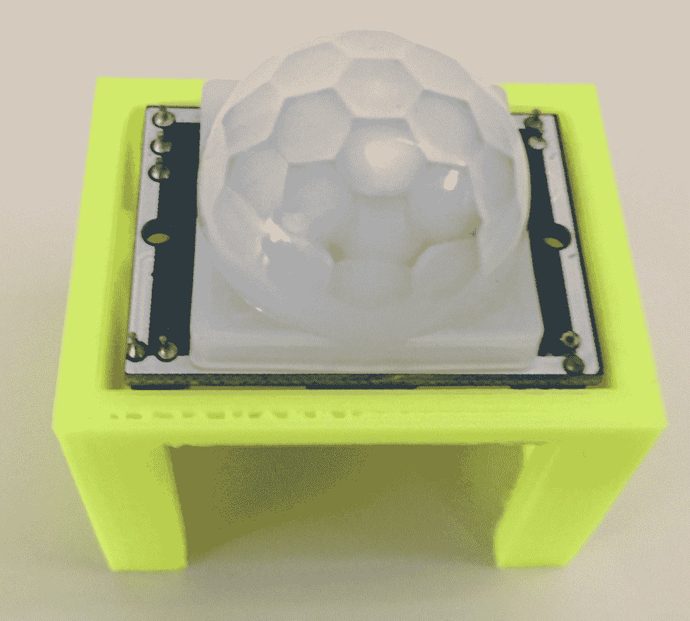
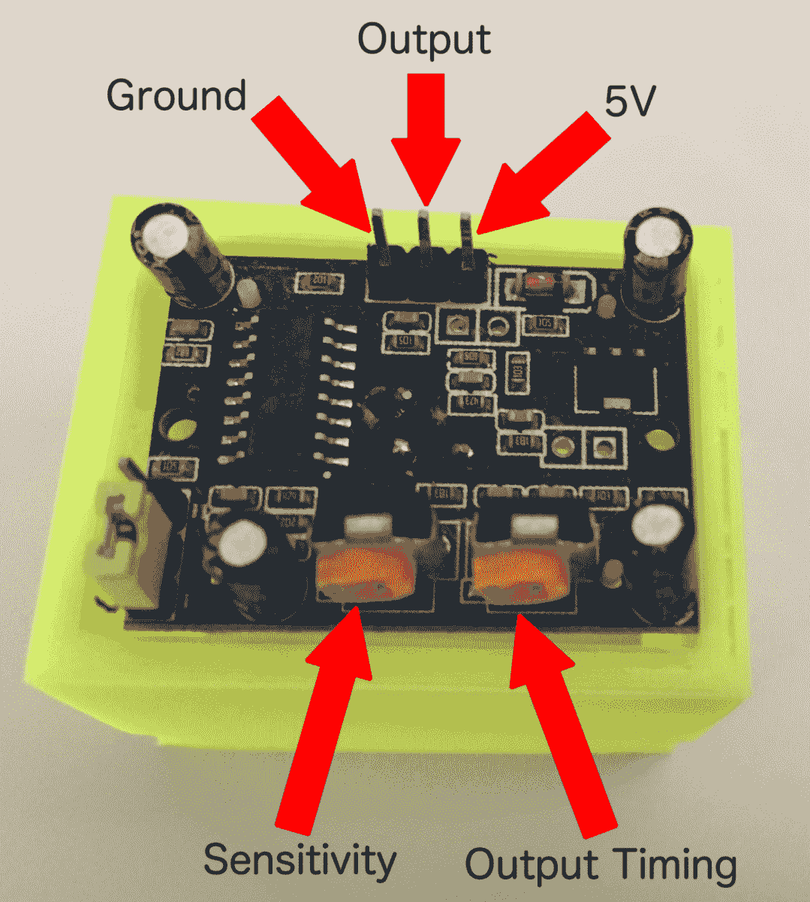
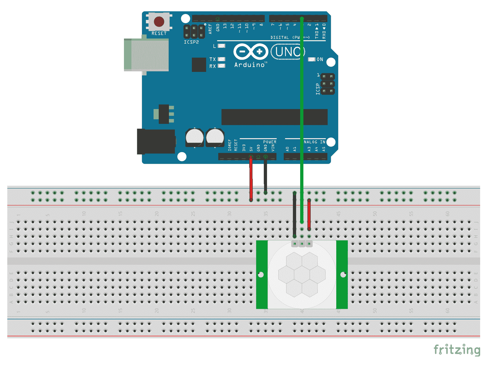
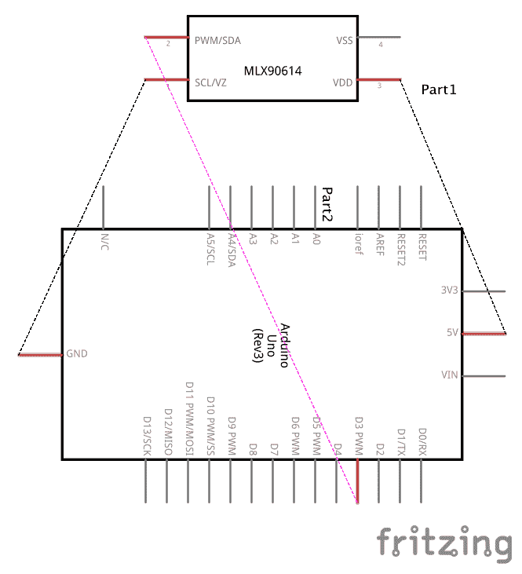
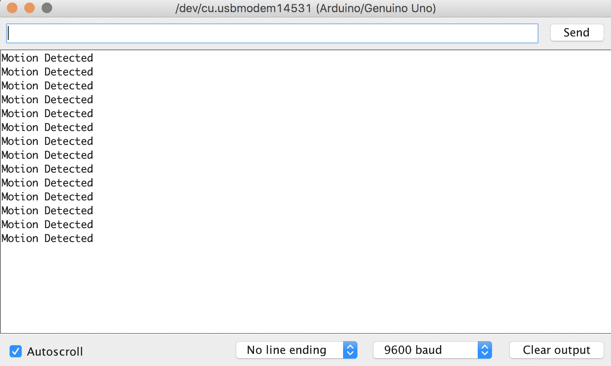

# 运动传感器

在本章中，我们将探讨如何使用 HC-SR501 运动传感器。这是一个非常容易连接到 Arduino 并编程的传感器，这也是为什么当人们开始使用微控制器时，它通常是他们实验的第一批传感器之一。它也非常便宜，通常包含大多数入门套件中。

在本章中，您将学习：

+   如何将 HC-SR501 运动传感器连接到 Arduino

+   如何读取 HC-SR501 运动传感器的输出

+   阅读运动传感器项目的 Fritzing 图

# 简介

**PIR 传感器**，也称为**被动红外传感器**，由微控制器用于检测运动，通常是人，但它们可以检测传感器范围内的任何运动。这些传感器体积小、价格低、功耗低且易于使用，这使得它们非常适合初学者进行实验，但工业版本的这些传感器也出现在许多消费和军事产品中。

PIR 传感器由热释电传感器组成，可以检测红外辐射水平。任何温度高于绝对零度的物体都会发出一些低水平红外辐射，热释电传感器可以检测到。名称中的“被动”部分意味着传感器不会产生或辐射其他设备可以检测到的能量。相反，它通过检测其他物体发出的红外辐射来工作。

运动传感器中的热释电传感器通常分为两侧，这使得运动传感器能够检测红外水平的改变。当传感器没有检测到任何运动时，两侧检测到相同数量的红外辐射并相互抵消。当传感器范围内有物体开始移动时，传感器的一半检测到的红外辐射比另一半多，导致传感器触发运动警报。

PIR 传感器有多种尺寸和强度。这些传感器用于众多商业产品中，如防盗报警器、自动灯光和节日装饰，当有人靠近时，它们会说话或发光。

在本章中，我们将使用 HC-SR501 运动传感器，如下照片所示，它配有一个我设计和打印的支架。本书提供的可下载代码包括一个`STL`文件，您可以使用它来打印自己的支架：



以下图片显示了 HC-SR501 运动传感器底部的连接器和调整螺丝：



**灵敏度**调整螺丝用于调整传感器的检测范围。检测范围可设置为 3 米至 7 米。顺时针旋转灵敏度螺丝会降低传感器的灵敏度。

**输出时间**调整螺钉设置检测到运动后输出保持高电平的时间。输出时间可以从 5 秒到 5 分钟不等。顺时针旋转输出时间调整螺钉将增加延迟时间。

**地**引脚应连接到面包板上的地轨或直接连接到 Arduino 的地引脚。**5V**引脚应连接到面包板上的电源轨或直接连接到 Arduino 的 5V 输出。最后，中间引脚是传感器的**输出**引脚。如果传感器检测到运动，此引脚将根据输出时间调整螺钉定义的时间变高。

**注意**：一些兼容的传感器可能具有与本书中显示的不同引脚配置；在进行任何布线之前，请验证您的传感器引脚配置。

在您查看本章电路图部分之前，考虑一下您会如何将 HC-SR5012 运动传感器连接到 Arduino。一个提示，您不需要除了运动传感器、Arduino 和跳线之外的东西。在这个特定项目中使用面包板是可选的。

现在让我们看看本章项目所需的组件。

# 需要的组件

为了完成本章的项目，我们需要以下组件：

+   一块 Arduino Uno 或兼容板

+   一块 HC-SR501 运动传感器

+   跳线

+   对于挑战，您需要一个 LED

+   一块面包板

面包板是可选的，因为您可以直接将 HC-SR501 运动传感器连接到 Arduino。要完成本章的挑战部分，您将需要一个面包板。

# 电路图

以下图显示了本项目 Fritzing 图：



通过图示，我们可以看到 HC-SR501 运动传感器的地引脚连接到面包板的地轨，运动传感器的 5V 输入连接到面包板的电源轨。面包板的电源和地轨连接到 Arduino 的 5V 电源和地引脚。

运动传感器的输出引脚是数字输出（要么是 HIGH，要么是 LOW），因此我们可以将其直接连接到 Arduino 的任何数字引脚上。在这种情况下，我们将传感器的输出引脚连接到 Arduino 的 3 号引脚。

这里是相同电路的原理图：



让我们看看本项目 Arduino 代码。

# 代码

要使用 HC-SR501 运动传感器，我们只需要读取传感器的数字输出。如果输出是 HIGH，则传感器检测到运动；如果是 LOW，则没有检测到运动。传感器的输出将保持 HIGH 状态，持续时间由输出时间调整螺钉定义。我通常将输出时间设置得较低，通常是一两秒钟。

对于这个项目，我们将把传感器的状态输出到串行控制台。在挑战部分，输出将变得更加复杂。

以下是如何读取 HC-SR501 运动传感器的代码：

```cpp
#define MOTION_SENSOR 3

void setup() {
 pinMode(MOTION_SENSOR, INPUT);
  Serial.begin(9600);
}

void loop() {
  int sensorValue = digitalRead(MOTION_SENSOR);
  if (sensorValue == HIGH) {
    Serial.println("Motion Detected");
  }
  delay(500);
}
```

此代码首先使用 `#define` 指令创建 `MOTION_SENSOR` 宏并将其设置为 `3`。在 `setup()` 函数中，我们将 3 号引脚的引脚模式设置为输入，因为我们将从运动传感器读取数字输出引脚。我们还在 `setup()` 函数中初始化串行控制台。

`loop()` 函数首先调用 `digitalRead()` 函数来读取运动传感器的输出并将其赋值给 `sensorValue` 变量。如果 `sensorValue` 变量等于 `HIGH`，我们将消息 `Motion Detected` 发送到串行控制台。如果没有检测到运动，我们不打印任何内容。在 `loop()` 函数的末尾，在循环回之前有一个半秒的延迟。

现在我们来上传并运行代码。

# 运行项目

当我们运行代码时，需要打开串行控制台以查看输出。

一旦代码上传并运行，将手在传感器附近挥动，你应该会看到控制台打印出 `Motion Detected` 消息，如下面的截图所示：



现在进入本章的挑战部分。

# 挑战

如果你选择接受这个挑战，就是给这个项目添加一个 LED 灯，当运动传感器检测到运动时，LED 灯会亮起。在前几章中，我们将提供代码或电路图，以便在项目初次构建时如果出现问题更容易进行故障排除。

对于这个挑战，我们将提供代码，并让你自己找出如何将 LED 连接到项目上。一个提示，不要忘记为 LED 添加电阻。

以下是在运动传感器检测到附近运动时，将连接到 Arduino 5 号引脚的 LED 灯点亮的代码：

```cpp
#define MOTION_SENSOR 3
#define LED 5

void setup() {
  pinMode(MOTION_SENSOR, INPUT);
  pinMode(LED, OUTPUT);

  digitalWrite(LED, LOW);
  Serial.begin(9600);
}

void loop() {
  int sensorValue = digitalRead(MOTION_SENSOR);
  if (sensorValue == HIGH) {
    Serial.println("Motion Detected");
  }

  digitalWrite(LED, sensorValue);
  delay(500);
}
```

现在轮到你来完成这个挑战了。

# 概述

在本章中，我们学习了 HC-SR501 运动传感器及其工作原理。我们看到了如何将其连接到 Arduino，Arduino 为传感器提供电源并读取传感器的输出引脚。

在下一章中，我们将看到我们如何感知周围的天气。
