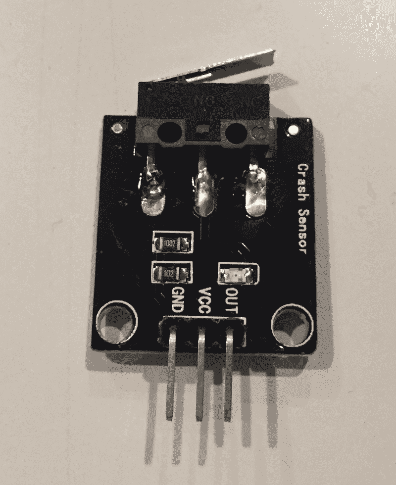
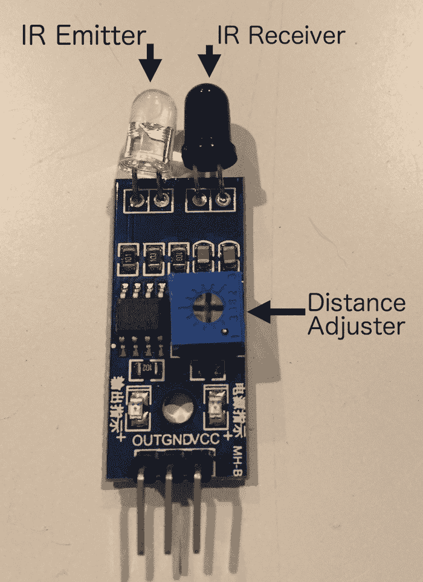
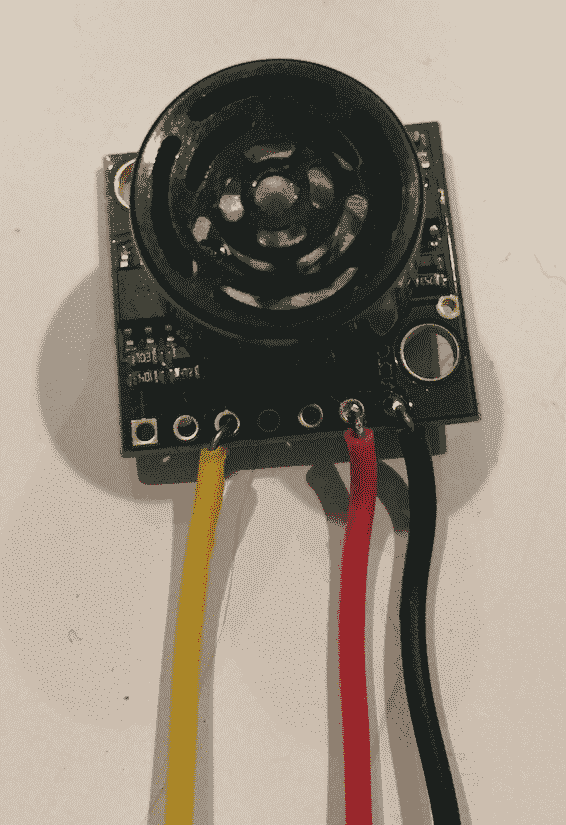
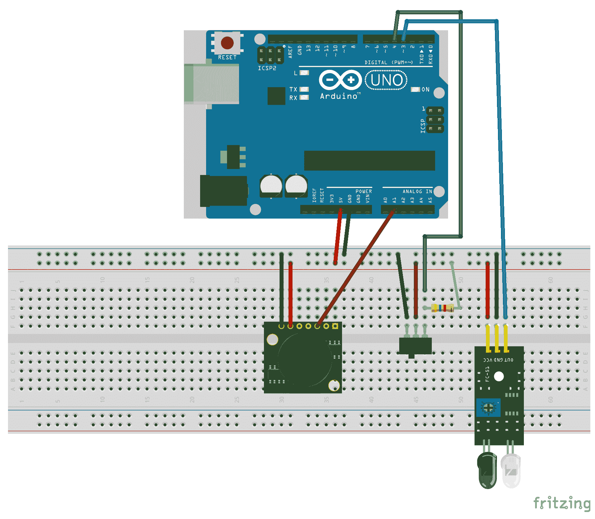
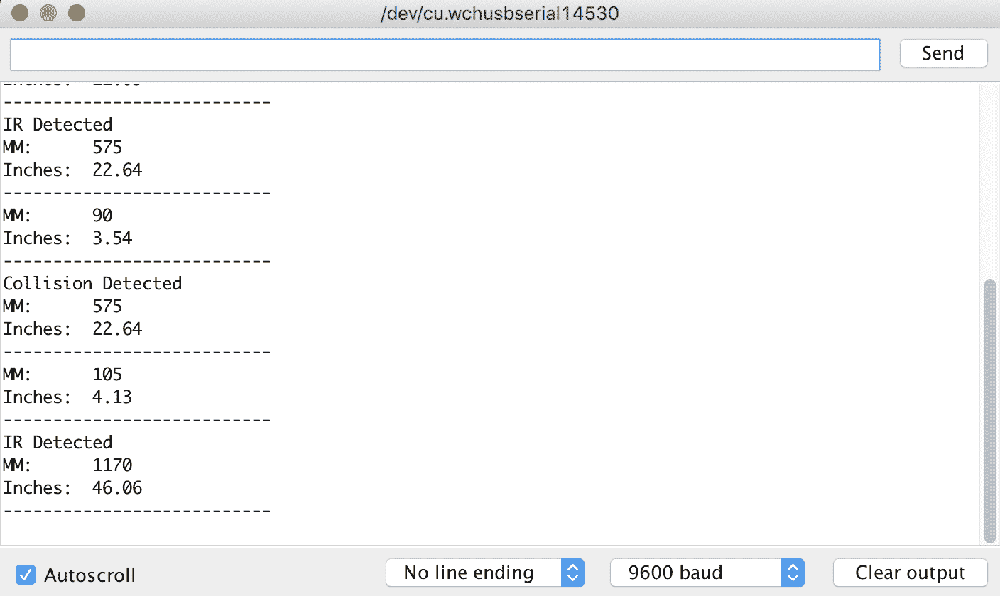

# 第十章：避障和碰撞检测

如果你正在制作一个需要避障的自主机器人、一个需要检测碰撞的遥控车，甚至是一个需要知道打印头是否到达打印区域极限的 3D 打印机，你需要在你的项目中包含某种避障或碰撞检测系统。在本章中，我们将探讨可用于避障和碰撞检测系统的几个传感器。

在本章中，你将学习：

+   如何使用碰撞传感器

+   如何使用红外避障传感器

+   如何使用超声波测距仪

# 简介

在本章中，我们将探讨三种我们可以用来为我们的项目添加避障和/或碰撞检测系统的传感器。这些传感器是：

+   **碰撞传感器**：用于检测碰撞，也用作 3D 打印机的限位开关

+   **红外避障传感器**：用于机器人的避障

+   **超声波测距仪**：用于机器人的避障，并有许多其他商业和军事用途

# 碰撞传感器

碰撞传感器基本上是一个简单的开关，上面有一些某种类型的延长器，使其能够检测到较大的碰撞区域。以下照片展示了基本碰撞传感器的外观：



前一张照片中展示的碰撞传感器将一个简单的机械开关（如 3D 打印机上使用的端点开关）连接到电路板的一端。这使得将其安装在机器人底盘或其他表面上变得容易。碰撞传感器背后的概念是当开关被触发时，传感器已经撞到了某个物体。

碰撞传感器有三个引脚，分别清晰标记为**GND**、**VCC**和**OUT**。GND 引脚连接到地轨，VCC 连接到面包板上的电源轨。OUT 引脚直接连接到 Arduino 的数字引脚，并带有 4.7K 的上拉电阻。

红外避障传感器由一个红外发射器、一个红外接收器和可调节传感器检测障碍物距离的电位器组成。以下照片展示了本章项目中使用的避障传感器。

# 避障传感器

红外避障传感器上的发射器发射红外辐射，如果传感器前方有障碍物，部分辐射会被反射并接收器接收。如果没有物体在传感器前方，辐射将消散，接收器将不会接收到任何东西。



传感器的引脚从左到右清晰标记为**OUT**、**GND**和**VCC**。GND 引脚连接到接地轨，VCC 引脚连接到面包板的电源轨。OUT 引脚直接连接到 Arduino 的数字引脚。如果 OUT 引脚的信号为 LOW，则表示检测到了物体。如果输出为 HIGH，则表示未检测到物体。

距离调整器会调整传感器检测物体的距离。如果调整器逆时针旋转，则距离会减小；如果您顺时针旋转，则距离会增加。传感器将检测从 2 到 30 厘米的物体。

# 超声波测距仪

我们将要使用的第三个传感器是**MaxSonar EZ1**超声波测距仪。这是我最喜欢的传感器之一。我几乎在构建的每个自主机器人中都使用了它来确定附近物体的距离。以下是 EZ1 超声波测距仪的图片：



对于本章的示例，我们将使用传感器的 3 号、6 号和 7 号引脚。3 号引脚用于模拟输出，6 号引脚用于 VCC，7 号引脚用于接地。4 号和 5 号引脚用于串行 RX/TX 连接，2 号引脚用于脉冲宽度输出，然而，在本章的示例中，我们不会使用这些输出。

超声波测距仪通过向特定方向发送超声波脉冲来工作。如果脉冲在反射回作为回声的形式时遇到物体，传感器通过测量回声返回所需的时间来确定到物体的距离。

EZ1 超声波传感器可以检测并测量从 0 到 6.45 米（254 英寸）的物体距离。该传感器几乎没有盲区，并将检测到传感器正面上的物体。

# 需要的组件

我们将需要以下组件来完成本章的项目：

+   一个 Arduino Uno 或兼容板

+   一个碰撞传感器

+   一个避障传感器

+   一个 EZ1 超声波传感器

+   一个 4.7K 欧姆电阻

+   跳线

+   一个面包板

# 电路图

以下图显示了本项目的 Fritzing 图：



图中显示的中间传感器代表碰撞传感器，因为 Fritzing 中没有碰撞传感器的部件。图中的开关具有与本章前面显示的碰撞传感器相同的引脚布局。

在图中，我们可以看到传感器上的所有接地引脚都连接到面包板的接地轨，而传感器上的所有 VCC 引脚都连接到面包板上的电源轨。

EZ1 超声波传感器上的模拟输出连接到 Arduino 的 A1 模拟引脚，碰撞传感器连接到数字引脚 3，红外传感器连接到数字引脚 2。碰撞传感器还带有一个 4.7K 的上拉电阻。现在我们已经将传感器连接到 Arduino，让我们看看这个项目的代码。

# 代码

我们将以三个宏开始代码，这些宏定义了三个传感器连接的引脚。这些宏将看起来像这样：

```cpp
#define COLLISION_SWITCH 4
#define IR_SENSOR 3
#define RANGE_SENSOR A1
```

这些宏显示碰撞传感器连接到数字引脚 4，红外传感器连接到数字引脚 3，超声波测距仪连接到模拟引脚 1。现在我们需要设置我们使用的两个数字引脚的模式，并初始化串行监视器。我们可以通过在`setup()`函数中添加以下代码来完成此操作：

```cpp
Serial.begin(9600);
pinMode(COLLISION_SWITCH, INPUT);
pinMode(IR_SENSOR, INPUT); 
```

这首先初始化串行监视器，然后配置碰撞和红外传感器引脚为输入，以便我们可以读取值。现在我们需要向`loop()`函数中添加代码以读取传感器。让我们首先看看如何读取和中断碰撞传感器：

```cpp
int collisionValue = digitalRead(COLLISION_SWITCH); 
if (isnan(collisionValue)) { 
  Serial.println(" Failed to read collision sensor"); 
  return; 
}
if (collisionValue == LOW) { 
  Serial.println("Collision Detected"); 
}
```

此代码首先使用`digitalRead()`函数读取碰撞传感器连接的引脚，然后使用`isnan()`函数验证`digitalRead()`函数返回了正确的值。如果函数返回的值无效（不是一个数字），则将错误消息打印到串行控制台，并调用`return`语句退出此循环。

如果`digitalRead()`函数返回的值有效，那么我们会检查该值是否为`LOW`，如果是，则表示检测到了障碍物，并将消息打印到串行控制台。现在让我们添加红外传感器的代码：

```cpp
int irValue = digitalRead(IR_SENSOR);
if (isnan(irValue)) {
 Serial.println(" Failed to read infrared sensor");
  return;
}
if (irValue == LOW) {
  Serial.println("IR Detected");
} 
```

此代码与碰撞传感器完全相同，只是我们读取了红外传感器引脚并检查了该值。现在让我们添加超声波测距仪的代码：

```cpp
int anVolt = analogRead(RANGE_SENSOR);
if (isnan(anVolt)) {
  Serial.println(" Failed to read range sensor");
  return;
}
int mm = anVolt*5;
float inch = mm/25.4;
Serial.println(mm);
Serial.print("MM:   ");
Serial.println(mm);
Serial.print("Inches: ");
Serial.println(inch);
Serial.println("---------------------------");
delay(1000);
```

此代码首先使用`analogRead()`函数读取超声波测距仪连接的引脚。然后我们使用`isnan()`函数验证返回了正确的值。

然后以毫米和英寸为单位计算到物体的距离。计算中使用的数字取决于传感器的数据表，可能因所使用的型号而异。现在我们将在`loop()`函数的末尾添加一个短暂的延迟以暂停执行。

现在让我们运行这个项目。

# 运行项目

当我们运行此项目时，输出应类似于以下截图：



这张截图显示了一个物体触发了红外传感器两次，其中`IR Detected`被打印到串行控制台，碰撞传感器一次，其中`Collision Detected`被打印到串行控制台。它还显示了测距仪返回的最近物体的距离。

# 挑战

这个挑战将与大多数挑战略有不同。实际上没有具体的项目要做；相反，这是一个思考挑战。挑战是思考这三个传感器如何协同工作以创建一个自主机器人。为此，思考这三个传感器的工作方式：

1.  **碰撞传感器**：当传感器碰到物体时被触发的数字传感器

1.  **红外传感器**：当物体靠近时被触发的数字传感器

1.  **超声波测距仪**：用于检测物体距离传感器的模拟传感器

这里是答案：

超声波测距仪是最昂贵的，所以我通常只使用两个这样的传感器，它们面向机器人的前方。这些传感器被用来帮助机器人绕过障碍物。有了能够告诉机器人某个物体距离前方有多远的能力，我们可以给机器人提供所需的逻辑来决定何时转弯，而且，使用两个超声波传感器，我们还可以提供决定转向方向的逻辑。我们还可以使用超声波传感器来绘制房间的地图。

红外传感器非常便宜，可以安装在机器人的侧面和后面，以确保机器人在转弯或倒车时不会撞到任何东西。由于它们比超声波传感器便宜得多，我们可以使用多个红外传感器来确保机器人周围的所有区域都被覆盖。我们还可以使用朝下的红外传感器来确保机器人不会从边缘驶出。

碰撞传感器也非常便宜，可以安装在机器人的各个部位，用来检测机器人是否撞到了超声波或红外传感器未能检测到的物体。超声波和红外传感器最大的问题是它们在机器人上的高度。如果它们太高，那么它们可能会错过靠近地面的障碍物。可以使用碰撞传感器来检测这些障碍物。

# 摘要

在本章中，我们看到了如何使用三种传感器来进行障碍物避让和碰撞检测。碰撞传感器是一个数字传感器，可以用来判断传感器是否撞到物体。红外障碍物避让传感器也是一个数字传感器，可以判断传感器是否在障碍物的一定距离内。超声波测距仪是一个模拟传感器，可以用来判断障碍物距离传感器的距离。

在下一章中，我们将探讨一些不同类型的 LED，并看看我们如何在项目中使用它们。
