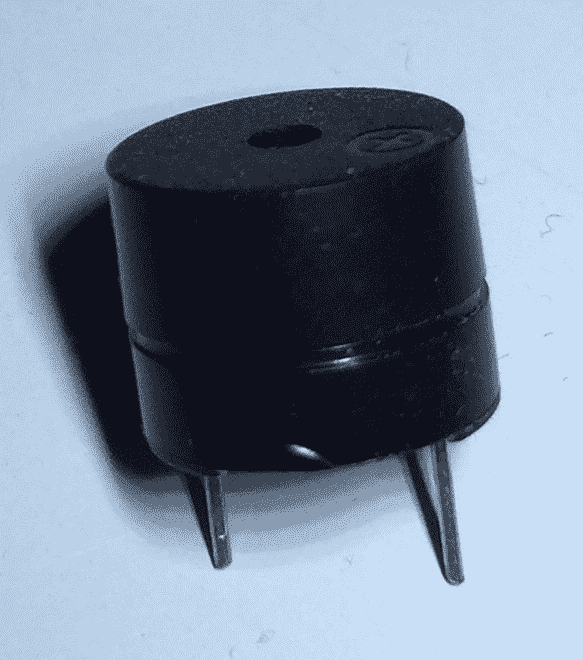
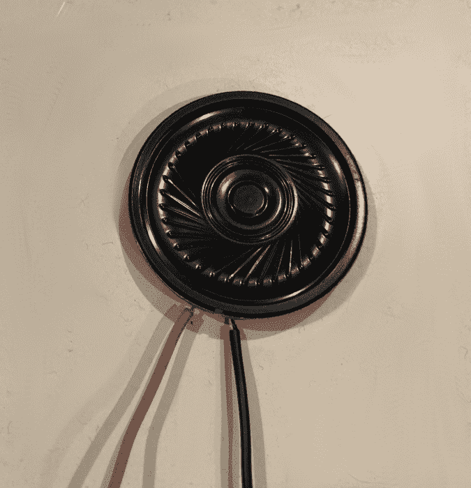
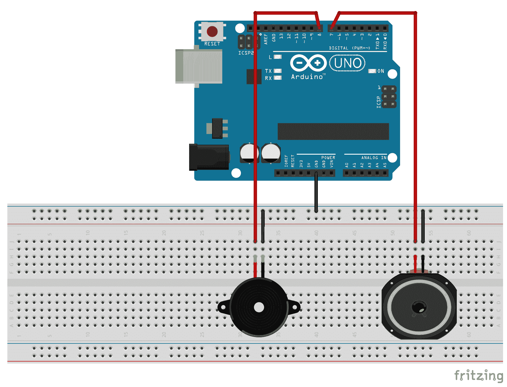
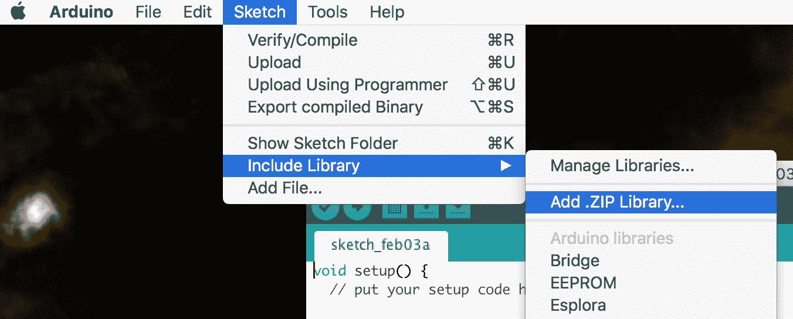
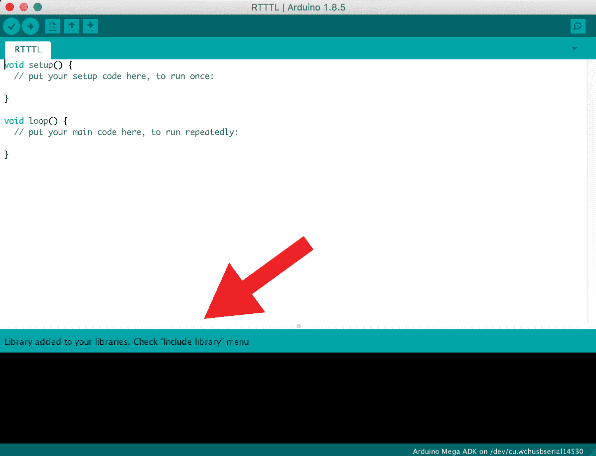

# 声音的乐趣

为你的机器人项目添加声音可能是好机器人与酷炫机器人之间的区别。想想看，如果电影《星球大战》中的 R2-D2 没有发出任何声音，它会有多可爱。我们可以使用声音不仅仅是机器人。例如，如果运动传感器检测到运动，我们可能想要添加一个响亮的警报，或者当外面的温度恰到好处时，我们可能只想播放一段旋律。

在本章中，你将学习：

+   如何将压电蜂鸣器连接到 Arduino

+   如何将扬声器连接到 Arduino

+   如何使用`tone()`函数生成声音

+   如何使用 Arduino 播放音乐

# 简介

在本章中，我们将进行几个可以使用**压电蜂鸣器**或小型 8 欧姆扬声器的项目。通过使用蜂鸣器和扬声器，你将能够听到两者之间的区别，以帮助确定哪个适合我们的项目。

压电蜂鸣器体积小、可靠且非常便宜。在大多数电子项目中，它们比普通扬声器更容易安装和使用。这些蜂鸣器可以发出从柔和的嗡嗡声到响亮警报的广泛声音。

压电蜂鸣器，有时也称为压电扬声器，其发声原理与普通扬声器略有不同。这些蜂鸣器的工作组件是一块薄的压电材料薄片，通常粘附在金属振膜上。当电压施加到压电材料上时，它会变形。这导致金属振膜向前或向后弯曲。这种变形发生得非常快，导致陶瓷/金属弯曲元件以施加电压的频率振动，从而产生可听的声音。

以下照片显示了压电蜂鸣器的样子：



较短的引脚应连接到地，而较长的引脚应连接到电源。

8 欧姆扬声器是一种典型的扬声器，它包含一个电磁铁，这是一个金属线圈，当通电时会产生磁场。通过反转线圈的方向，磁铁的极性会反转。这个电磁铁放置在一个普通磁铁的前面，磁铁的极性不能反转。施加到电磁铁上的电流方向会迅速改变，导致磁铁相互吸引和排斥，从而从连接到电磁铁的圆锥体产生声音。

以下图显示了 8 欧姆扬声器的样子：



现在让我们看看这个项目所需的组件。

# 需要的组件

我们将需要以下组件来完成本章的项目：

+   一个 Arduino Uno 或兼容板

+   一个压电蜂鸣器

+   一个 8 欧姆扬声器

+   跳线

+   一个面包板

# 电路图

这里是我们将在本章的所有代码示例中使用的电路图：



此图显示，扬声器上的接地引脚和压电蜂鸣器上的接地引脚都连接到面包板上的接地轨。压电蜂鸣器的电源引脚连接到 Arduino 的 8 号引脚，而扬声器的电源线连接到 Arduino 的 7 号引脚。

# 代码

让我们从使用`tone()`函数开始。

# 使用`tone`函数

在本章的前几个示例中，我们将使用 Arduino 的`tone()`函数。此函数有两种形式。第一种形式接受两个参数，第一个参数是蜂鸣器或扬声器连接的引脚号，第二个参数是在该频率（赫兹）下播放声音。函数看起来是这样的：

```cpp
tone(pinNumber, frequency);
```

当此函数仅使用两个参数时，声音将无限期播放。以下代码显示了如何使用此函数通过之前的电路图播放音符：

```cpp
#define PIEZOPIN 7
#define SPEAKERPIN 8

int soundPin = PIEZOPIN;

void setup() {
  tone(soundPin, 1000);
}
```

使用此代码，`tone()`函数在`setup()`函数中使用，以 1000 赫兹播放。我们可以将声音引脚设置为压电蜂鸣器或扬声器引脚，具体取决于您想播放哪种声音。如果我们想播放一个直到用户确认才停止的连续声音，我们会使用此版本的`tone()`函数。

此函数的第二种形式接受第三个参数，即播放声音的持续时间（毫秒）。此函数看起来是这样的：

```cpp
tone(pinNumber, frequency, duration);
```

此版本的`tone()`函数可以这样使用：

```cpp
#define PIEZOPIN 7
#define SPEAKERPIN 8

int soundPin = PIEZOPIN;

void setup() {
  tone(soundPin, 1000, 1000);
}
```

此代码与之前的代码完全相同，只是声音只播放一秒钟。如果我们想播放具有特定持续时间的短音符，我们会使用此版本的`tone`函数。例如，播放一首歌，我们将在下一个示例中看到。

在我们能够使用 Arduino 播放歌曲之前，我们需要定义不同音符的频率。频率列表相当长，可以与本书的可下载代码一起下载。包含频率的文件名为`pitches.h`，频率定义如下：

```cpp
#define NOTE_G6  1568
#define NOTE_GS6 1661
#define NOTE_A6  1760
#define NOTE_AS6 1865
#define NOTE_B6  1976
#define NOTE_C7  2093
```

现在让我们看看如何使用这些频率来播放一首歌。首先，我们需要创建一个名为`pitches.h`的标题头文件，其中将包含频率，然后使用以下行将其包含在主标签中：

```cpp
#include "pitches.h"
```

现在我们需要定义组成歌曲的音符或旋律。这些音符将被存储在一个名为`melody`的数组中：

```cpp
int melody[] = {
  NOTE_E5, NOTE_E5, NOTE_E5, NOTE_E5, NOTE_E5, NOTE_E5,
  NOTE_E5,
  NOTE_G5,
  NOTE_C5,
  NOTE_D5,
  NOTE_E5,
  NOTE_F5, NOTE_F5, NOTE_F5, NOTE_F5, NOTE_F5,
  NOTE_E5, NOTE_E5, NOTE_E5, NOTE_E5, NOTE_E5,
  NOTE_D5, NOTE_D5,
  NOTE_E5,
  NOTE_D5,
  NOTE_G5
};
```

歌曲中的每个音符都应该播放一定的时间。我们可以创建另一个包含每个音符持续时间的数组，我们将称之为`tempo`：

```cpp
int tempo[] = {
  4, 4, 2, 4, 4, 2,
  4,
  4,
  4,
  4,
  1,
  4, 4, 4, 4, 4,
  4, 4, 8, 8, 4,
  4, 4,
  4,
  2,
  2
};
```

我们将使用`tone()`函数来创建音符。使用此函数，我们不需要在`setup()`函数中设置任何内容。以下代码可以放入`loop()`函数中，以播放由`melody`和`tempo`数组定义的歌曲：

```cpp
// Get the number of notes in the song
int songSize = sizeof(melody) / sizeof(melody[0]);

//Loop through each note
for (int note = 0; note < songSize; note++) {

  //Calculate how long to play the note
  int noteDuration = 1000 / tempo[note];

  //Play the note
  tone(soundPin, melody[note], noteDuration);

  //Calculate how long to pause before playing next note
  int pauseBetweenNotes = noteDuration * 1.20;
  delay(pauseBetweenNotes);
}
delay(3000);
```

此代码首先通过将`melody`数组的大小除以数组中第一个元素的大小来计算`melody`数组中的音符数量。我们使用这种逻辑来计算数组中的元素数量，因为`sizeof(melody)`代码返回数组占用的字节数，而`sizeof(melody[0])`代码返回数组中第一个元素占用的字节数。存储单个整数需要两个字节，melody 数组中有 26 个音符。因此，`sizeof(melody)`代码将返回`52`，而`sizeof(melody[0])`代码将返回`2`。

使用`for`循环遍历`melody`和`temp`数组。在`for`循环内，通过将一秒除以音符类型（`tempo`数组中的元素）来计算音符时长，其中四分音符等于 1000 除以 4，八分音符等于 1000 除以 8。

使用`tone`函数来播放`melody`数组中的音符，并持续计算出的时长。`tone`函数在播放音符时不会使应用程序暂停。因此，我们需要自己创建暂停。我们还想暂停的时间略长于音符的时长，以便在音符之间有轻微的停顿。为此，我们将音符时长乘以 1.2，然后使用`delay()`函数。在`for`循环完成后，在重新开始之前会有一个三秒钟的延迟。

最后这个例子展示了我们可以如何使用`tone()`函数和两个数组来播放一首歌，一个数组用于音符，另一个数组用于节奏。现在让我们看看如何使用一个库，它将使我们能够播放**RTTTL**（**铃声文本传输语言**）格式的音乐。RTTTL 格式是由诺基亚开发的，用于将铃声传输到手机。

# 在 RTTTL 格式中播放铃声

目前 Arduino 库管理器没有我们可以下载来播放 RTTTL 文件的库。因此，我们需要下载并手动安装一个库。我们将使用 Arduino-rtttl-player，可以从这里下载：[`github.com/ponty/arduino-rtttl-player`](https://github.com/ponty/arduino-rtttl-player)。我们需要创建一个库的 ZIP 文件以将其加载到 IDE 中。如果您没有访问可以压缩文件的实用程序，本书提供的可下载代码中已经包含了已压缩的库。

当我们创建 ZIP 文件以加载到 Arduino IDE 时，我们不想将 GitHub 存储库中下载的所有内容都压缩起来，因为 Arduino IDE 不会将 ZIP 文件识别为库文件。我们只想压缩包含库代码的目录，在 Arduino-rtttl-player 库的情况下，就是`rtttl`文件夹。

在我们下载库并创建一个包含库中的`rtttl`文件夹的 ZIP 文件后，我们希望将库加载到 Arduino IDE 中。为此，我们需要从主菜单中选择 Sketch | Include Library | Add .ZIP Library...，如下面的截图所示：



在你选择添加 ZIP 库选项后，你将看到一个文件选择器，你可以浏览到你创建的 ZIP 文件的位置并选择它。如果库成功导入，你将在消息栏中看到一条消息，如下面的截图所示：



现在我们准备播放一个 RTTTL 旋律。我们首先需要做的是通过在草图中加入以下`include`语句来将库包含到项目中：

```cpp
#include <rtttl.h>
```

我们将想要包含蜂鸣器和扬声器，就像我们在早期项目中做的那样，以下代码：

```cpp
#define PIEZOPIN 7
#define SPEAKERPIN 8

int soundPin = PIEZOPIN; 
```

我们需要定义要播放的歌曲。互联网上有大量的 RTTTL 代码。要找到一些，搜索`rtttl songs`，你应该能看到大量各种歌曲的 RTTTL 代码。对于这个例子，我们将播放《星球大战》的主题。以下代码包含了这首歌曲的 RTTTL 代码：

```cpp
char *song = "Star Wars:d=8,o=5,b=180:f5,f5,f5,2a#5.,2f.,d#,d,c,2a#.,4f.,d#,d,c,2a#.,4f.,d#,d,d#,2c,4p,f5,f5,f5,2a#5.,2f.,d#,d,c,2a#.,4f.,d#,d,c,2a#.,4f.,d#,d,d#,2c";
```

要播放这首歌曲，请将以下代码添加到`setup()`函数中：

```cpp
Rtttl player;
player.begin(soundPin);
player.play(song, 0);
```

我们使用 Arduino-rtttl-player 库中的`begin`函数来初始化库，并定义扬声器连接的引脚，然后使用`play`函数来播放歌曲。`play`函数的第二个参数是音阶。音阶设置得越高，歌曲播放的音调就越高。我通常将其设置为 0。

当这段代码运行时，你应该能认出《星球大战》的主题。

# 挑战

对于这个挑战，我们将继续使用《星球大战》的主题。假设我们想要制作一个看起来像《星球大战》中的 R2-D2 的机器人。我们可能会加入的一个特性是让它发出像 R2-D2 的声音。你将如何让这个机器人发出像 R2-D2 的声音呢？

# 摘要

在本章中，我们学习了如何将扬声器和蜂鸣器连接到 Arduino。然后我们学习了如何使用`tone()`函数来创建声音并播放歌曲。我们还看到了如何安装和使用第三方库来播放 RTTTL 文件。

在下一章中，我们将探讨如何使用 LCD 显示屏来显示消息。
