# 使用 LCD 显示屏

有时候我们希望有能力将 Arduino 的数据显示给用户。为此，我们可以使用 LCD 显示屏。我们可以使用多种类型的 LCD 显示屏，其中最流行的是 1602 显示屏。由于它们非常流行，你可以在互联网上找到大量关于如何使用它们的教程。虽然这些显示屏易于使用，但你在使用它们时受到的限制。

在本章中，我们将探讨一个我们可以做更多事情的显示屏。这个显示屏是**诺基亚 5110 LCD 显示屏**。

在本章中，你将学习：

+   如何将诺基亚 5110 LCD 连接到 Arduino

+   如何将文本打印到 LCD 上

+   如何在 LCD 上绘制圆形

+   如何在 LCD 上绘制矩形

+   如何在 LCD 上绘制圆角矩形

# 简介

诺基亚 5110 LCD 显示屏是一种基本的单色图形 LCD 显示屏，可用于众多项目。诺基亚最初在 20 世纪 90 年代末为手机开发此显示屏。此显示屏使用**PCD8544 LCD 控制器/驱动器**。

拥有 LCD 显示屏可以极大地提升任何项目的用户界面，因为我们有能力直接向用户显示消息，让他们知道正在发生什么，或者在出现问题时提供特定的错误消息。5110 LCD 允许我们显示文本和图形。

5110 LCD 的显示区域大约为 4.2 厘米，有 84 × 48 个单独的像素。该显示屏价格低廉，使用 Adafruit 5110 LCD 库（本章将使用）非常容易。本章中我们将使用的 5110 LCD 看起来如下：

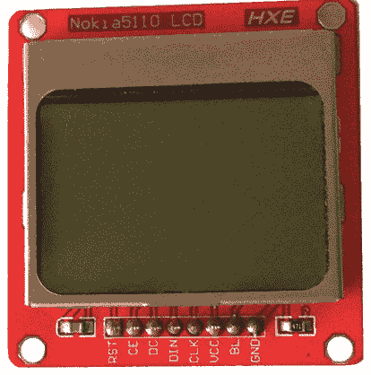

5110 LCD 显示屏安装在 PCB 板上，有八个引脚用于为显示屏供电并与之接口。这些引脚从左到右分别是：

1.  **RST**: 重置 – 低电平有效

1.  **CE**: 芯片选择 – 低电平有效

1.  **DC**: 模式（数据/指令）选择 – 选择命令模式（低）或数据模式（高）

1.  **DIN**: 串行数据线

1.  **CLK**: 串行时钟线

1.  **VCC**: 电源输入 3.3V

1.  **BL**: 背光 LED 控制 – 3.3V

1.  **GND**: 地

重置引脚将重置 5110 LCD 模块，其为低电平有效，意味着当引脚降至 0V 时将触发重置。当连接多个 SPI 外围设备时使用芯片选择引脚。该引脚也是低电平有效。

DC 引脚用于在数据模式或命令模式之间选择。当引脚为高时使用数据模式，当引脚为低时使用命令模式。

DIN 引脚是串行指令发送的输入引脚。

CLK 引脚是 SPI 模块共用的时钟引脚。时钟源连接到该引脚。

BL 引脚为背光显示屏供电。此引脚的电压不应超过 3.3V。如果引脚为低，则背光将关闭。

VCC 和 GND 分别是电源和地。电源的电压不应超过 3.3V。

让我们看看本章项目需要哪些部件。

# 需要的组件

+   一个 Arduino Uno 或兼容板

+   一个诺基亚 5110 LCD

+   四个 10K 欧姆电阻

+   一个 1K 欧姆电阻

+   跳线

+   一个面包板

# 电路图

以下图表显示了本章项目的电路图：

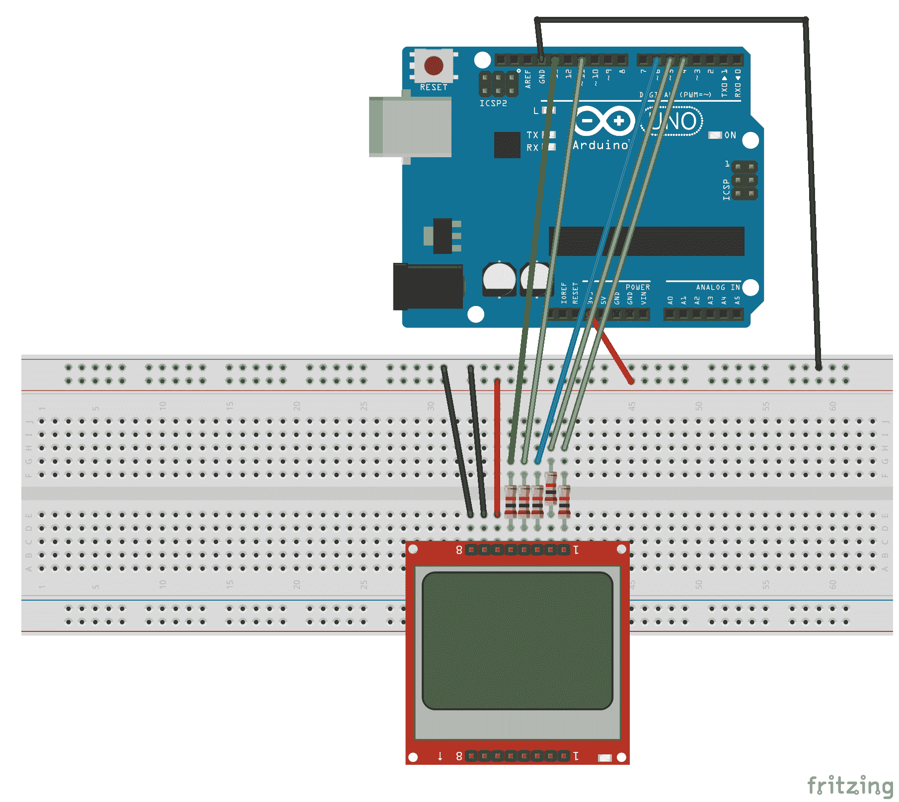

诺基亚 5110 LCD 应使用 Arduino 的 3.3V 电源输出，而不是我们在早期项目中使用的 5V。我们使用内联电阻来保护 LCD 上的 3.3V 输入线。CE 线使用 1K 欧姆电阻，其余使用 10K 欧姆电阻。

以下图表显示了 5110 LCD 模块上的哪些引脚连接到 Arduino 上的哪些引脚：

| **5110** | **Arduino** |
| --- | --- |
| RST | 3 |
| CE | 4 |
| DC | 5 |
| DIN | 11 |
| CLK | 13 |
| VCC | 3.3V out |
| BL | GND |
| GND | GND |

背光设置为接地以关闭。如果您想使用背光，可以将引脚连接到用于 VCC 引脚的 3.3V 电源输出。

现在我们来看看如何在 LCD 上显示项目。

# 代码

我们需要首先安装两个 Adafruit 库。这些是**Adafruit GFX 库**和**Adafruit PCD8544 诺基亚 5110 LCD 库**。这些库需要安装，因为我们需要包含它们和 SPI 库。我们可以通过在代码开头添加以下`include`语句来实现：

```cpp
#include <SPI.h>
#include <Adafruit_GFX.h>
#include <Adafruit_PCD8544.h>
```

我们不希望使用以下代码来初始化`Adafruit_PCD8544`类型的一个实例：

```cpp
Adafruit_PCD8544 display = Adafruit_PCD8544(13, 11, 5, 4, 3);
```

参数是 Arduino 引脚号，CLK、DIN、DC、CE 和 RST 引脚分别连接到这些引脚。

在`setup()`函数中，我们希望添加以下代码来设置`Adafruit_PCD8544`实例：

```cpp
Serial.begin(9600);

display.begin();
display.setContrast(40);
```

现在可以将其余的代码放入`setup()`函数中进行测试，或者放入`loop()`函数中。让我们首先看看如何点亮显示屏上的单个像素。这可以通过使用以下代码中的`drawPixel()`函数来实现：

```cpp
display.clearDisplay();
display.drawPixel(10, 10, BLACK);
display.display();
```

在我们在屏幕上绘制任何内容之前，我们希望清除显示屏和缓冲区。我们使用`clearDisplay()`函数来完成此操作。接下来，我们使用`drawPixel()`函数来点亮位于*X*坐标 10 和*Y*坐标 10 的单个像素。在 LCD 上显示任何内容之前，我们需要运行`display()`函数，如前述代码所示。重要的是要记住在向 LCD 绘制任何内容之前运行`clearDisplay()`函数，并在屏幕上绘制所有内容后运行`display()`函数以显示它们。

# 绘制一条线

我们可以将几个`drawPixel()`函数调用组合起来来绘制一条线，但使用以下代码中的`drawLine()`函数会更容易：

```cpp
// draw a line
display.drawLine(3,3,30,30, BLACK);
display.display();
```

`drawLine()` 函数接受五个参数。前两个参数是线的起始点的 *X*/*Y* 坐标。接下来的两个参数是线的结束点的 *X*/*Y* 坐标，最后一个参数是绘制线的颜色。由于诺基亚 5110 LCD 是单色显示屏，这里的选项只有 `BLACK` 或 `WHITE`。

如果我们运行此代码，显示屏上会出现一条线，如下照片所示：

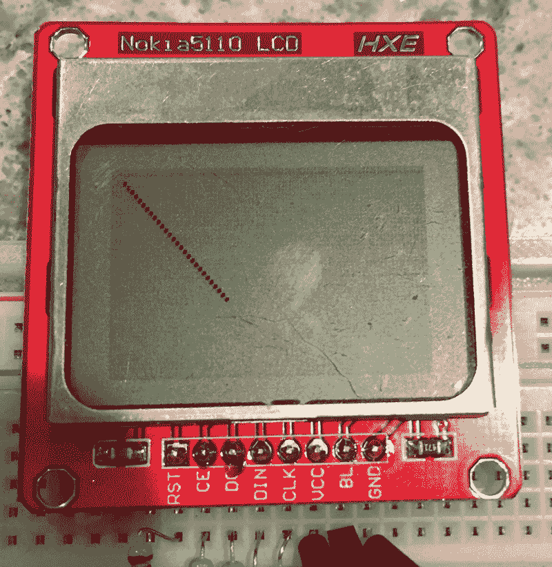

# 显示文本

Adafruit 库还使得在诺基亚 5110 LCD 上显示文本变得非常简单。以下代码展示了我们如何显示文本：

```cpp
// Display text
display.setTextSize(1);
display.setTextColor(BLACK);
display.setCursor(0,0);
display.println("Hello, world!");

// Display Reverse Text
display.setTextColor(WHITE, BLACK);
display.println(3.14);

// Display Larger Text
display.setTextSize(2);
display.setTextColor(BLACK);
display.print("This is larger text");
display.display();
```

`setTextSize()` 函数设置文本的大小。在第一个例子中，文本大小设置为 `1`。`setTextColor()` 函数将设置文本的颜色。同样，由于诺基亚 5110 LCD 是单色显示屏，这里的选项是 `BLACK` 或 `WHITE`。`setCursor()` 函数设置光标的位置，以便在屏幕上写入文本。在这种情况下，光标被设置为屏幕的左上角。最后，使用 `println()` 函数将 `Hello World!` 消息打印到屏幕上。

在下一个例子中，我们使用 `setTextColor()` 函数将前景色设置为 `WHITE`，背景色设置为 `BLACK` 以反转文本，然后使用 `println()` 函数将 PI 的值打印到屏幕上。由于我们没有调用 `setTextSize()` 函数，文本保持之前定义的大小，即 `1`。

在最后一个例子中，文本大小设置为 `2`，文本颜色恢复为黑色。以下图片展示了运行此代码后屏幕的显示效果：

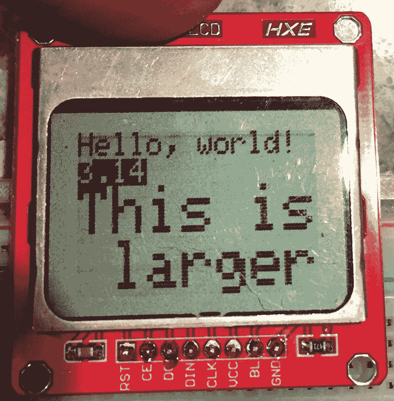

# 旋转文本

我们还可以旋转文本。以下代码展示了如何进行操作：

```cpp
display.setRotation(1);
display.setTextSize(1);
display.setTextColor(BLACK);
display.setCursor(0,0);
display.println("Hello, world!");
display.display();
```

`setRotation()` 函数将文本逆时针旋转。值为 1 将文本逆时针旋转 90 度。值 2 和 3 也可以用来将文本旋转 180 度和 270 度。以下照片展示了运行此代码后文本的显示效果：

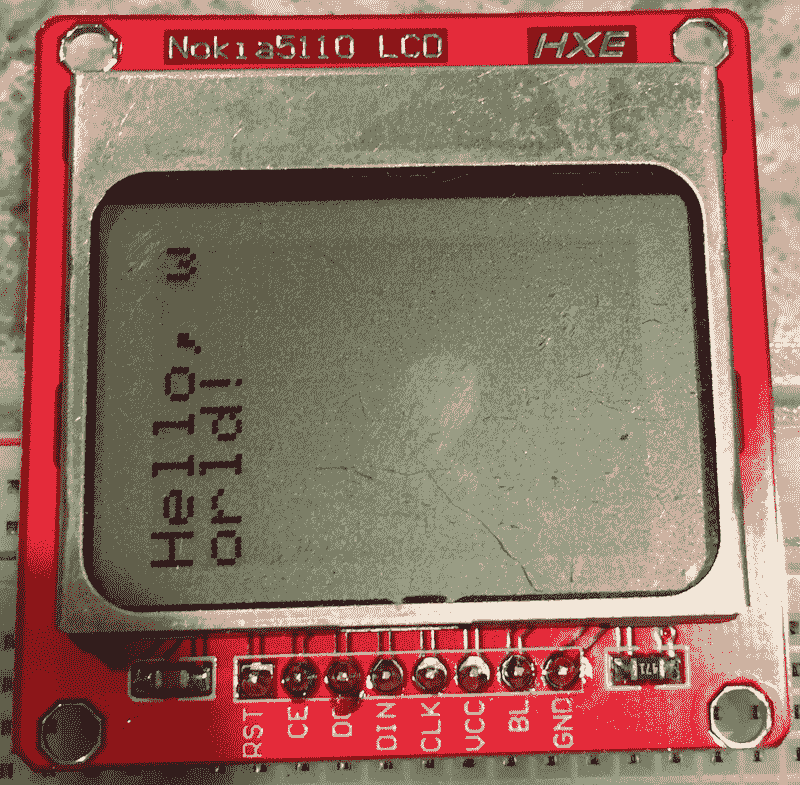

注意，如果文本长度超过单行可显示的长度，文本将自动换行。

# 基本形状

Adafruit 库还允许我们在 LCD 上创建基本形状。这些包括圆形、矩形和圆角矩形。还有一些函数可以用来创建这些形状并填充它们。以下代码和截图展示了如何使用圆形函数：

```cpp
display.drawCircle(display.width()/2, display.height()/2, 6, BLACK);
```

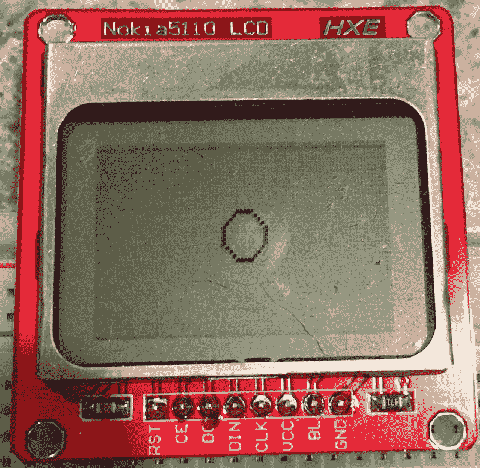

# 填充形状

```cpp
display.fillCircle(display.width()/2, display.height()/2, 6, BLACK);
```

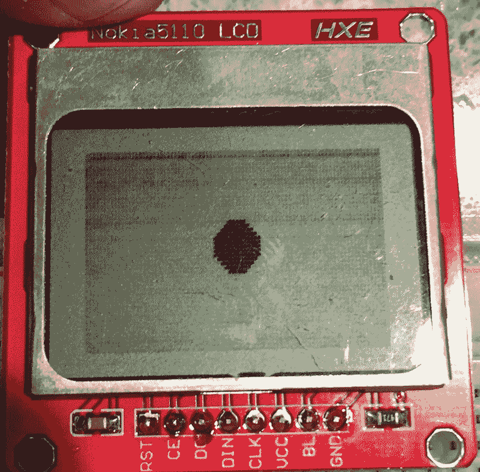

圆形函数需要四个参数。前两个参数是圆心的 X/Y 坐标。在这两个示例中，圆心的位置是屏幕的中心。第三个参数是圆的半径，最后一个参数是圆的颜色，以及在`fillCircle()`函数中填充圆的颜色。

# 矩形

下两个示例展示了如何绘制矩形和填充矩形：

```cpp
display.drawRect(15,15,30,15,BLACK);
```

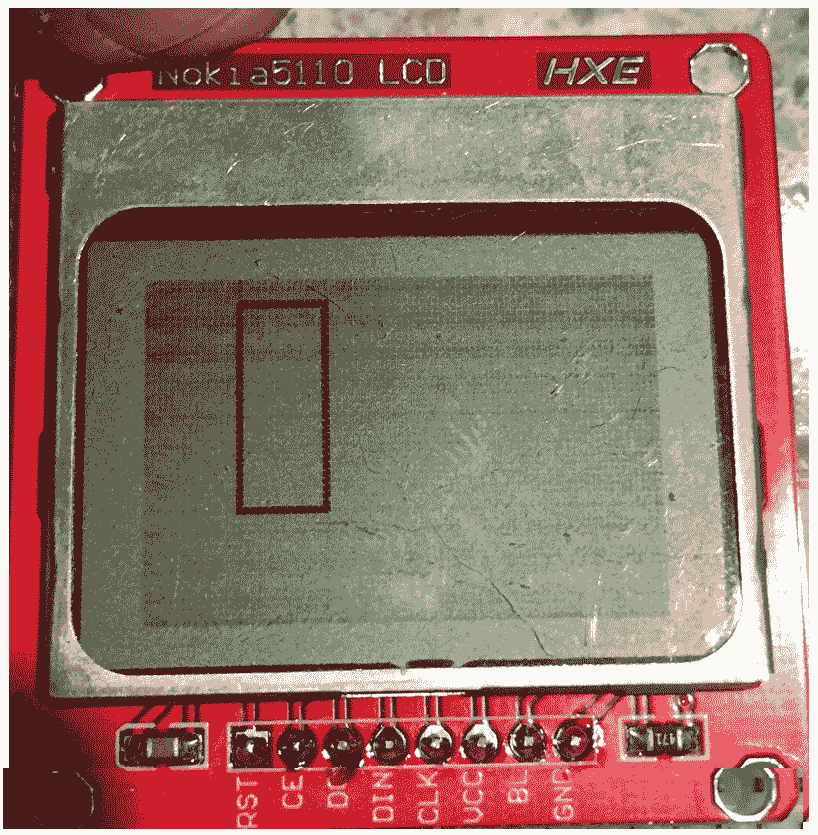

# 填充矩形

```cpp
display.fillRect(15,15,30,15,BLACK);
```

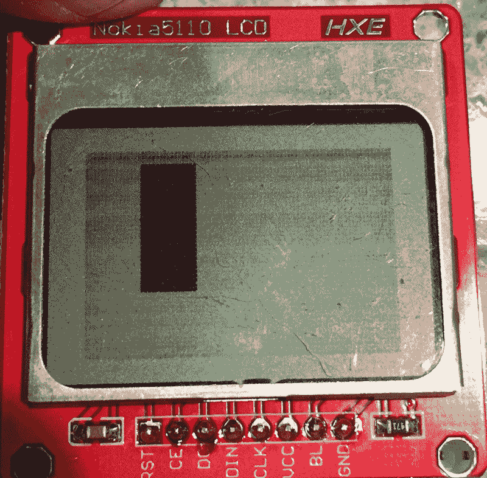

# 圆角矩形

矩形函数需要五个参数。前两个参数是矩形左上角的 X/Y 坐标。接下来的两个参数是矩形右下角的 X/Y 坐标，最后一个参数是绘制矩形的颜色以及`fillRect()`函数填充矩形的颜色。

下两个示例展示了如何使用 Adafruit 库绘制圆角矩形：

```cpp
display.drawRoundRect(15,15,30,15,4,BLACK);
```

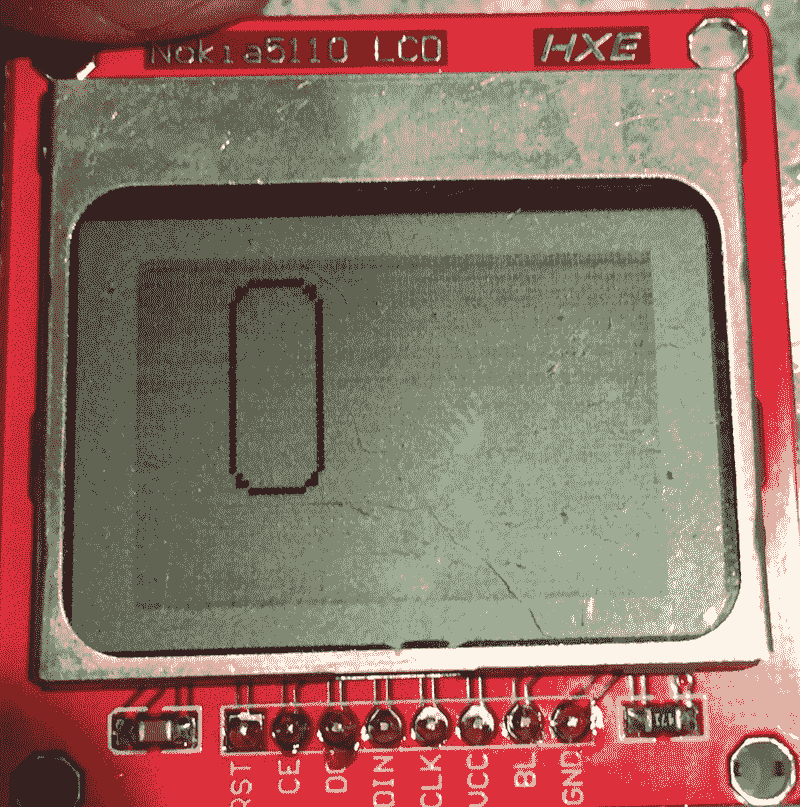

# 填充圆角矩形

```cpp
display.fillRoundRect(15,15,30,15,8,BLACK);
```

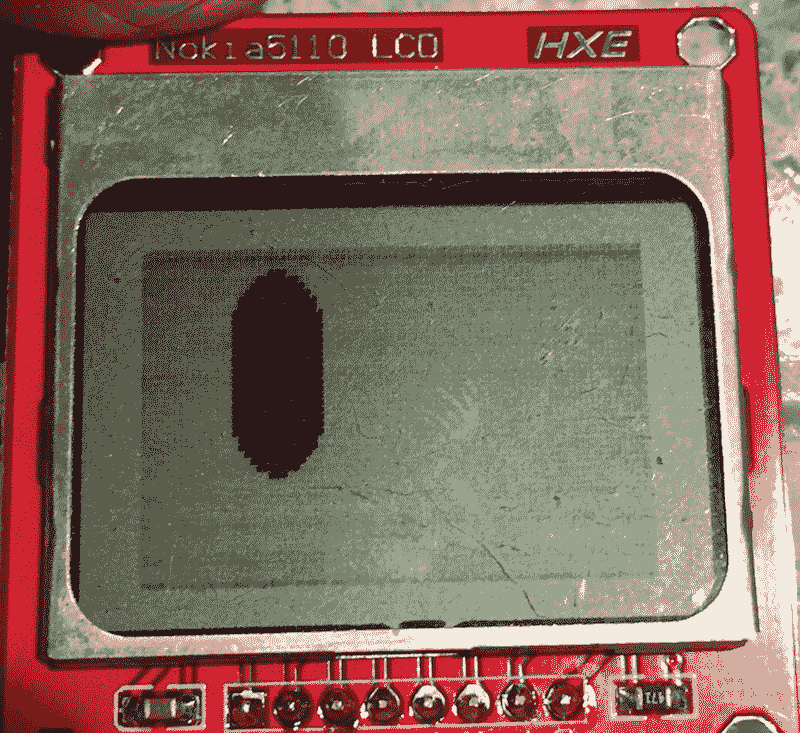

圆角矩形函数的前四个参数与常规矩形函数相同，即矩形左上角和右下角的坐标。下一个参数是圆角的大小，最后一个参数是绘制圆角矩形及其填充的颜色。

从本章的示例中我们可以看到，使用诺基亚 5110 LCD 显示屏，我们可以做很多不仅仅是文本的事情，Adafruit 库使得使用它变得非常简单。

# 挑战

对于挑战，选择本书中之前的任何项目，并添加诺基亚 5110 LCD 显示屏。然后，而不是将输出显示到串行控制台，将输出显示到 LCD 显示屏。一个例子是将 LCD 显示屏添加到第十章的测距仪项目，*避障和碰撞检测*，并使用 LCD 显示距离。

# 概述

在本章中，我们看到了如何将诺基亚 5110 LCD 单色显示屏添加到我们的项目中。这些显示屏可以极大地增强几乎所有项目的用户体验，因为我们能够告诉用户正在发生什么，如果出现问题，是什么问题。

在下一章中，我们将看到如何将语音合成器和语音识别添加到我们的项目中。
