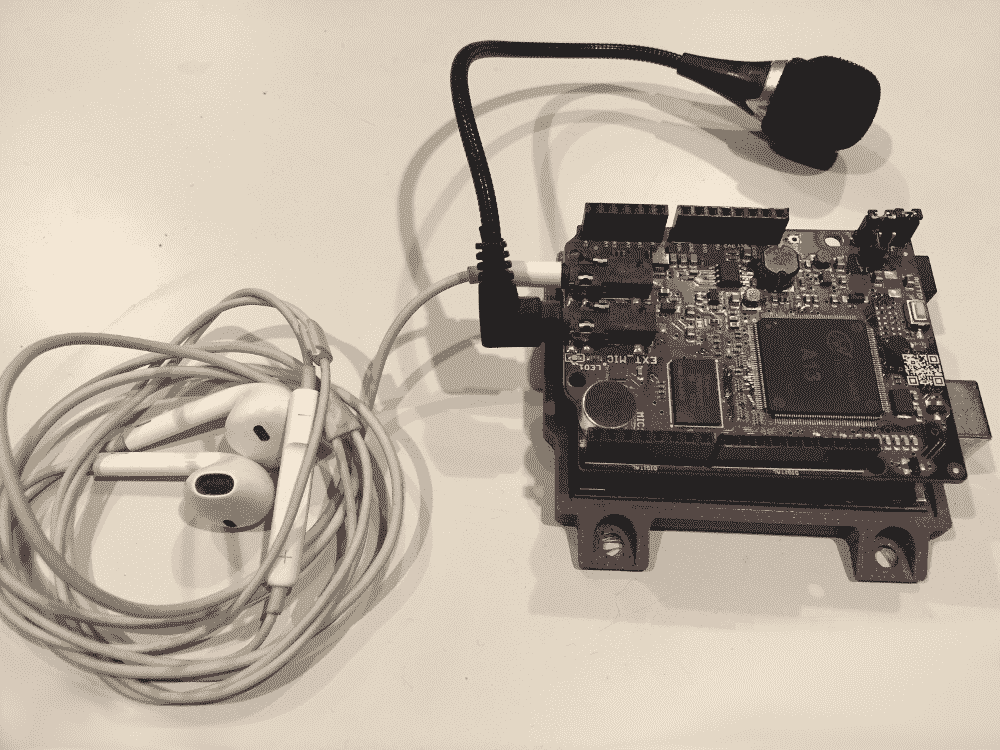
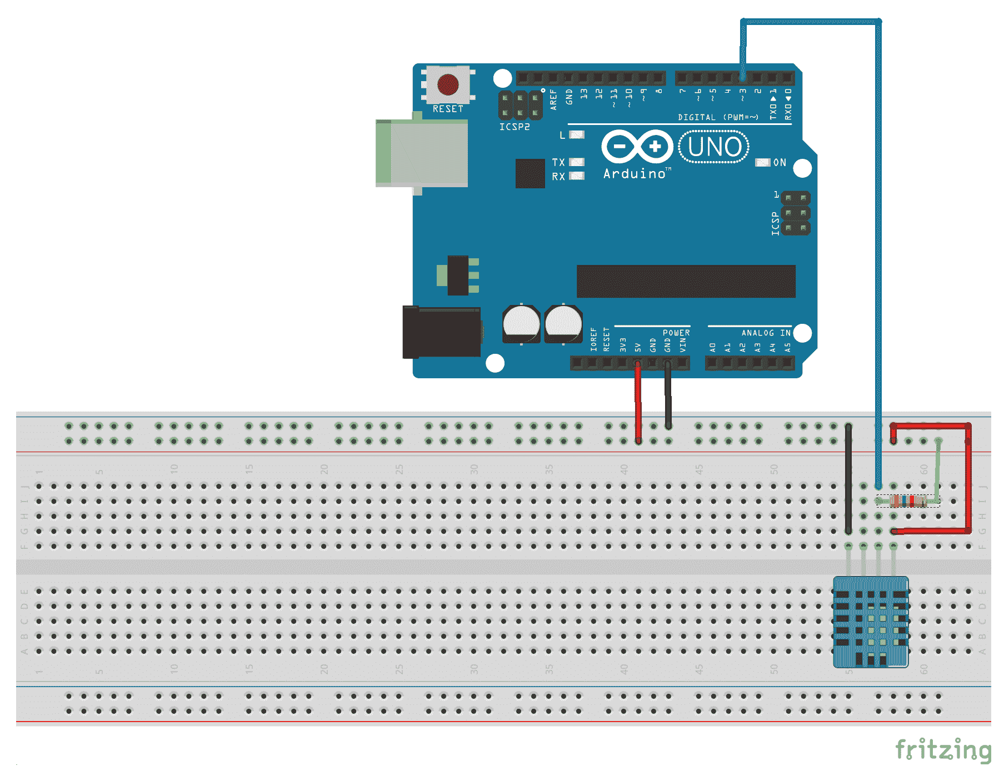

# 语音识别和语音合成

任何使用过亚马逊的 Echo、谷歌的 Home 扬声器或甚至苹果的 Siri 的人都知道语音识别和语音合成是多么强大和方便。现在想象一下，如果我们能以更小的规模将这些功能添加到我们的智能设备中？如果我们能，我们将能够直接对我们咖啡壶说话，并告诉它在早上开始煮咖啡，或者命令我们构建的机器人。

在本章中，我们将探讨如何使用 MOVI 盾牌将语音识别和语音合成添加到任何 Arduino 项目中。在本章的整个过程中，我们将学习：

+   如何使用 MOVI 盾牌进行语音识别

+   如何使用 MOVI 盾牌进行语音合成

+   如何创建一个语音激活的温度计

# 简介

**MOVI**这个名字代表**My Own Voice Interface**。Audeme 的 MOVI Arduino 盾牌是一个非常易于使用的语音识别和语音合成盾牌。这个盾牌可以直接与**Uno R3**、**Duemilanove**、**Mega 2560**或**Leonardo Arduinos**一起使用。然而，当 MOVI 盾牌连接时，你不应该通过 USB 连接器为板子供电。MOVI 盾牌需要至少 7V 的电压。因此，如果你尝试从 USB 连接中为其供电，可能会损坏 MOVI 和/或 Arduino。

你可以在此处了解 MOVI 盾牌并下载用户手册：[`www.audeme.com`](http://www.audeme.com/)。

当使用 MOVI 连接到 Arduino 进行供电和编程时，你将想要通过直流电源输入连接器使用 9V 的输入为 Arduino 供电。一旦板子供电启动，你就可以连接 Arduino 和你的电脑之间的 USB 线进行编程。由于板子最初是通过直流电源输入连接器供电的，它将继续从这个来源而不是 USB 连接中获取电力。

**非常重要：**当 MOVI 盾牌连接时，不要从 USB 连接器为 Arduino 供电。

在编程 MOVI 时，建议连接一个外部麦克风，以获得更好的语音识别，以及耳机，这样你可以听到 MOVI 的响应。以下照片显示了连接到 Arduino 的 MOVI，以及连接到 MOVI 的外部麦克风和耳机：



MOVI 盾牌上有一个内置麦克风，可以用来代替外部麦克风。然而，没有内置扬声器。为了接收音频反馈，包括错误和系统消息，你必须将耳机或外部扬声器连接到 MOVI 盾牌。扬声器的阻抗应该是 32 欧姆，这是耳机标准。你不应该将 4-或 8-欧姆的扬声器连接到外部扬声器插孔。

MOVI 可以用作按钮、遥控器或任何其他控制输入的替代品。正如我们在本章的示例项目中将看到的，我们可以使用 MOVI 发出 Arduino 可以响应的语音命令。

MOVI 盾板的一个最佳特性是不需要互联网连接。这减轻了与其他语音控制设备（如亚马逊 Echo 和谷歌 Home 扬声器）通常相关的任何隐私问题，因为这些设备不会将数据发送到外部服务器。

MOVI 盾板上有一个 LED 灯，它指示盾板的状态。以下列表显示了 MOVI 盾板可能处于的不同状态以及相应的 LED 状态：

+   **LED 关闭**：表示盾板已关闭或 MOVI 没有足够的电力运行

+   **LED 闪烁越来越快**：MOVI 正在启动

+   **LED 随机闪烁**：MOVI 正在向 SD 卡写入

+   **LED 以恒定频率闪烁**：可能有 SD 卡问题

+   **LED 亮起**：表示 MOVI 已开启并准备就绪

MOVI 盾板是你可以与 Arduino 一起使用的最有趣和最有意思的板之一。如果你对用它做的一些更高级的事情感兴趣，你应该查看 MOVI 库中提供的示例。

在本章中，我们将使用我们在第九章，“环境传感器”中使用的 DHT-11 温度传感器和 MOVI 盾板创建一个语音激活的温度计。为了将温度传感器和 MOVI 盾板连接到 Arduino，我们首先需要将 MOVI 盾板连接到 Arduino，然后将 DHT-11 温度传感器连接到 MOVI 盾板的引脚插座上。

让我们看看这个项目所需的组件。

# 需要的组件

在本章中，你需要以下组件。

+   一个 Arduino Uno 或兼容板

+   9V 电源，如电源插座适配器

+   一个 MOVI 盾板

+   一个 DHT-11 温度/湿度传感器

+   +   一个 4.7K 欧姆电阻

    +   跳线

    +   一个面包板

# 电路图

以下图示显示了如何连接 DHT-11 温度传感器进行此项目。记住在连接温度传感器之前将 MOVI 盾板连接到 Arduino。以下图示中的电阻是一个 4.7K 欧姆电阻：



现在，让我们看看我们的语音激活温度传感器的代码。

# 代码

你应该已经从第九章，“环境传感器”中的示例下载了 DHT-11 库，但你需要下载 MOVI 库。如果你进入库管理器并搜索`Movi`，你会找到几个与该术语匹配的库。寻找**Audeme LLC 的 MOVI 语音对话盾板库**并下载它。

我们将开始绘制草图，包括 MOVI 和 DHT 库。以下代码显示了如何包含这两个库：

```cpp
#include <DHT.h>
#include <MOVIShield.h>
```

接下来，我们将定义 DHT 引脚/类型，并创建一个 DHT 类型的实例，就像我们在第九章，“环境传感器”中所做的那样：

```cpp
#define DHT_PIN 3
#define DHT_TYPE DHT11
DHT dht(DHT_PIN, DHT_TYPE);
```

现在我们将想要创建一个 MOVI 类型的实例，如下面的代码行所示。布尔值`false`表示我们不希望开启串行调试：

```cpp
MOVI movi(false);
```

最后，我们需要一个字符数组，用于创建包含当前温度的句子，这样 MOVI 盾就可以在我们请求时告诉我们温度。

```cpp
char answer[21];
```

在`setup()`函数中，我们需要初始化 DHT 温度传感器和 MOVI 盾。以下代码展示了`setup()`函数：

```cpp
void setup() {
  dht.begin();
  movi.init();
  movi.callSign("buddy");
  movi.addSentence("temp");
  movi.train();
}
```

此函数首先通过调用`dht`类型的`begin()`函数初始化 DHT 温度传感器。接下来，我们通过调用`init()`函数初始化`movi`类型。此函数必须首先调用，以初始化`movi`类型。

大多数语音激活设备，如亚马逊 Echo，都是通过呼号激活的。对于亚马逊的设备，呼号是"Alexa"。在我们的例子中，MOVI 盾也将使用一个呼号来激活它。呼号可以通过`callSign()`方法设置，其中要使用的呼号作为字符串传入。在这个例子中，呼号将是"buddy"。

接下来，我们将想要添加 MOVI 可以匹配的句子或单词。我们使用`addSentence()`函数来完成这个操作。在这个例子中，我们将尝试匹配单词"temp."。我们确实有选择用完整的句子或单词来训练 MOVI 盾的选项。如果您希望 MOVI 盾能够识别一个句子，建议添加完整的句子，即使您需要添加相同句子的多个版本。通过添加完整的句子，MOVI 的算法可以用来识别句子，这提供了更高的准确性。还建议所有训练过的句子大小接近相同。如果说了很多单词，单个长句子将比很多更小的句子更受青睐。

最后，调用`train()`方法来告诉 MOVI 盾我们已经添加了所有句子和呼号。第一次添加句子或呼号时，MOVI 盾需要一些时间来训练，但如果呼号和句子在应用程序的构建之间保持不变，那么 MOVI 盾将启动得非常快。

现在已经完成了`setup()`函数，让我们看看`loop()`函数。以下代码展示了`loop()`函数：

```cpp
void loop() {
  signed int res=movi.poll();
  if (res == 1) {
    float fahreheit = dht.readTemperature(true);
    int tmp = (int)fahreheit;
    sprintf(answer, "The temperature is %02d", tmp);
    movi.say(answer);
  }
}
```

在第一行，我们使用`movi`实例的`poll()`函数。如果没有任何事件发生，此函数将返回零（`0`），如果匹配到一个句子，则返回一个正数。返回的数字是匹配到的句子编号。在我们的例子中，我们只有一个句子。因此，唯一可能的匹配是句子编号`1`。

如果找到与句子的匹配，则从 DHT-11 温度传感器读取当前温度，然后通过类型转换将其从浮点值转换为整数值。

为了构建我们希望 MOVI 盾牌说的字符串，我们使用了`sprintf()`函数。这个函数可以用来构建一个字符数组。在这个例子中，我们以句子`The temperature is`开始，然后使用`%02d`格式添加温度值。这告诉`sprintf()`函数向字符串添加一个两位整数。创建的字符数组存储在在草图开头创建的 answer 数组中。

我们使用`movi`实例中的`say()`函数，让 MOVI 盾牌通过连接的耳机或扬声器告诉我们当前的温度。

现在让我们运行这个项目。

# 运行项目

第一次运行项目时，需要一点时间来训练 MOVI 盾牌。等待盾牌说它已准备好，然后使用呼叫信号来激活它。一旦你说出呼叫信号，如果你 MOVI 盾牌识别到了，你会听到一个蜂鸣声。如果 MOVI 识别到了呼叫信号，说出句子"temp."。MOVI 盾牌应该通过告诉你通过 DHT-11 温度传感器读取的当前温度来回应。

这个例子仅触及了你可以用 MOVI 盾牌做什么的非常基础的部分，并为你提供了足够的开始。

# 挑战

有其他非常实用的函数可以与 MOVI 实例一起使用。以下是一些你可以尝试添加到项目中的附加函数：

+   **isReady()**: 如果 MOVI 准备就绪，将返回 true 的布尔值，如果不准备就绪，则返回 false。

+   **setVolume(int volume)**: 将 MOVI 的输出音量设置为 0（静音）到 100（全音量）。

+   **setVoiceGender(bool female)**: 将 MOVI 的声音性别设置为男或女。true 值将设置为女性声音，而 false 值将设置为男性声音。

+   **setThreshold(int threshold)**: 设置语音识别器的噪声阈值。值范围从 2 到 95。在嘈杂的环境中，15 是一个好的值，而在非常嘈杂的环境中，30 是一个好的值。

+   **welcomeMessage(bool on)**: 将 MOVI 的欢迎信息设置为开启或关闭。

+   **beeps(bool on)**: 开启或关闭识别蜂鸣声。

+   **ask() 和 ask(string question)**: 直接监听而不等待呼叫信号。如果传递了一个字符串，则 MOVI 将首先提出问题然后再进行监听。

挑战是尝试在示例项目中添加一些这些函数，并看看你还能用 MOVI 盾牌做什么。还要尝试添加 MOVI 可以监听的额外句子。

# 概述

在本章中，我们看到了如何使用 MOVI 盾牌进行语音识别和语音合成。我们使用语音识别来监听特定的命令，并使用语音合成来响应命令。

在下一章中，我们将探讨如何使用直流电机和电机控制器。
