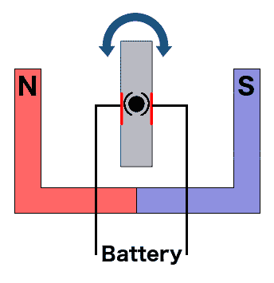
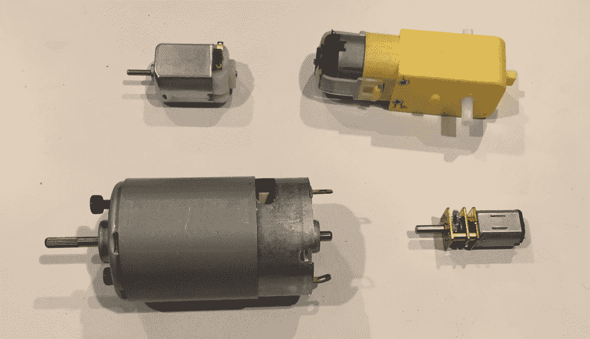
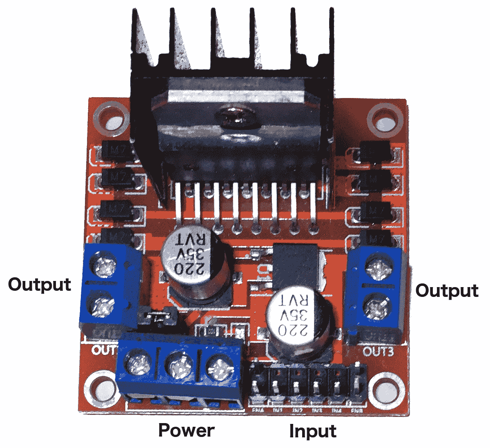
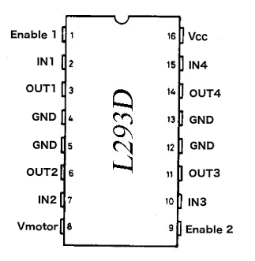
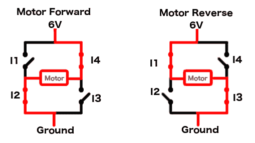
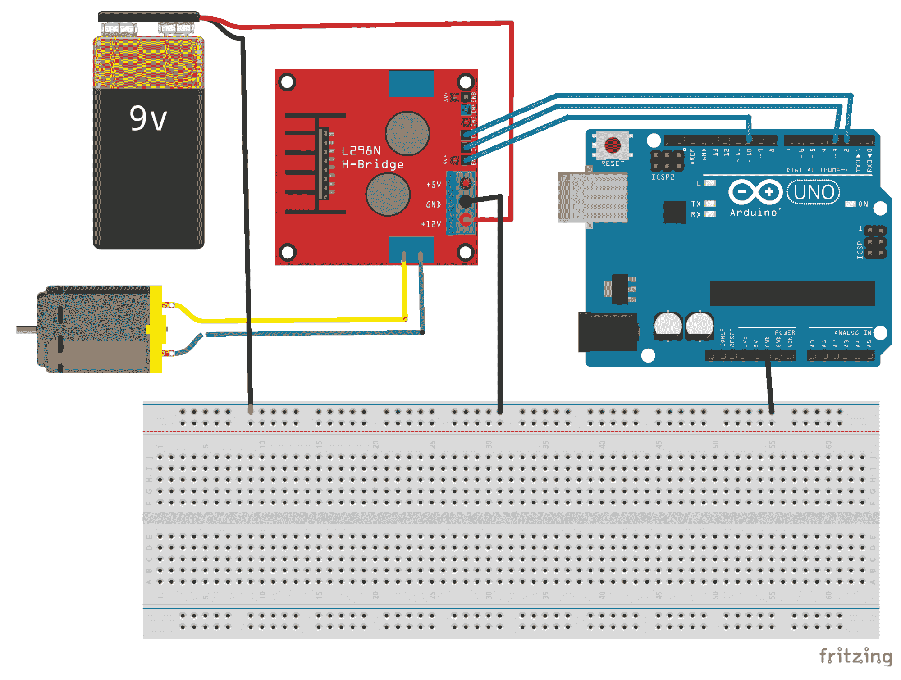
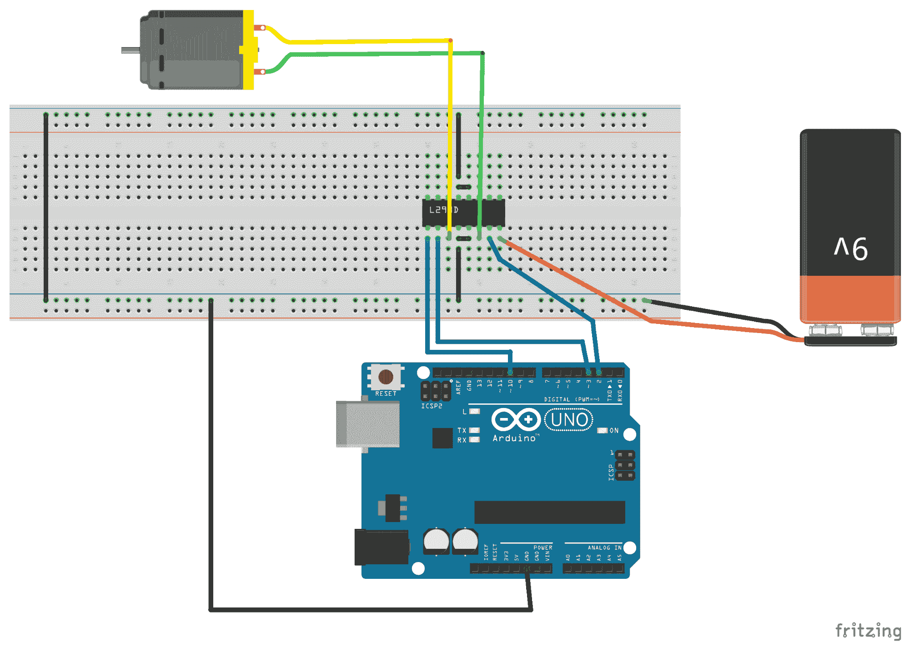

# 第十五章：直流电机和电机控制器

到目前为止，在这本书中，所有的项目都是固定项目。我所说的固定项目是指这些项目无法自行移动。在本章中，我们将探讨如何将直流电机添加到任何项目中，使其能够自行移动。在使用直流电机时，我建议使用电机控制器来控制它们。电机控制器使我们能够非常容易地将外部电源连接到电机，并控制电机的方向和速度。

在本章中，你将学习：

+   刷式直流电机的工作原理

+   H 桥的工作原理

+   如何使用 L298 和 L293D 电机控制器

# 简介

直流电机是一类将电能转换为物理运动的旋转电气设备。直流电机有多种类型；然而，在本章中，我们将探讨一种特定类型，即**刷式直流电机**。

刷式直流电机广泛应用于各种应用中，从玩具和机器人到电动窗户和电动工具。刷式直流电机的一些优点是它们的初始成本低、控制简单和低速扭矩。这些电机的缺点是维护成本高和在高强度环境中的使用寿命短。对于我们通常使用 Arduino 进行的原型设计和机器人项目，刷式直流电机的缺点通常不是问题。

刷式直流电机的中心是一个旋转的转子，其中包含一个电磁铁。在旋转的转子外部是一个永久的、静止的磁铁。当转子中的电磁铁通电时，会产生一个磁场，吸引和排斥永久的静止磁铁。这导致转子开始旋转。

为了使转子持续旋转，电磁铁的极性需要反转。为此，使用了一个称为**换向器**的分段铜套，它位于电机的轴上。随着电机的转动，电刷在换向器上滑动，接触换向器的不同部分，导致磁铁的极性切换。

以下图表说明了刷式直流电机的部件：



刷式直流电机有多种形状和尺寸。其中一些电机内置了变速箱，可以改变电机旋转时的扭矩和速度。以下照片展示了刷式直流电机的几个示例：



直接从 Arduino 为直流电机供电（除了演示目的之外），通常不是一个好主意，因为从引脚头提供的电压和电流相当有限。我们可以使用电机控制器从 Arduino 控制直流电机的方向和速度，同时仍然提供外部电源为其供电。在本章中，我们将探讨如何使用以下照片中所示的 L298 双 H-桥电机驱动器，以及如何使用 L293D 芯片：



L298 电机驱动器使我们能够控制两个电机的方向和速度。此驱动器允许我们控制从 5V 到 35V 的电机，最大电流为 2A。如果供电电压为 12V 或更低，我们还可以使用 5V 输出为 Arduino 供电。L298 电机驱动器有几个标记的输入、输出和电源连接器。这些从左到右的输入如下：

+   **ENA**：启用电机 A 并控制电机速度

+   **IN1 和 IN2**：控制电机 A 的方向

+   **IN3 和 IN4**：控制电机 B 的方向

+   **ENB**：启用电机 B 并控制电机速度

ENA 和 ENB 通常在引脚上跨接跳线。为了控制刷式直流电机，我们需要移除这些跳线并将引脚连接到 PWM 端口。输出如下：

+   **OUT1 和 OUT2**：输出功率到电机 A

+   **OUT3 和 OUT4**：电机 B 的输出功率

从左到右，电源输入如下：

+   **Vmotor**：用于为电机供电的外部电源

+   **GND**：地

+   **Vout**：5V 输出，可用于为 Arduino 供电

如果我们正在构建一个空间有限的项目，而不是使用 L298 双 H-桥电机驱动器这样的电机控制器，我们可以使用如 **L293D H-桥集成电路** 这样的集成芯片。L293D 芯片可以驱动两个电机，类似于 L298 电机驱动器，并且可以用 600mA 的稳定电流为电机供电，最大可达 1.2A。以下图示显示了 L293D IC 的引脚排列：



L298 电机控制器和 L293D 芯片都是 H-桥。让我们快速了解一下 H-桥的工作原理。H-桥是一种电路，允许我们对电机施加电压，使其可以正向或反向运行。H-桥这个术语来自电路的典型图形表示，看起来像一个大写的 H。以下图示显示了 H-桥的工作原理：



H-桥通常由四个固态开关组成。正如我们在前面的图像中看到的那样，当开关 1 和 3（**I1**和**I3**）打开，开关 2 和 4（**I2**和**I4**）关闭时，电机的右侧连接到电源，左侧连接到地，使电机向一个方向旋转。如果开关 1 和 3（**I1**和**I3**）关闭，开关 2 和 4（**I2**和**I4**）打开，那么电机的左侧连接到电源，右侧连接到地，使电机向另一个方向旋转。

让我们看看本章项目中我们将需要的部件。

# 需要的组件

在本章中，你需要以下组件。

+   一个 Arduino Uno 或兼容板

+   一个 L298 电机驱动器

+   一个 L293D H-桥芯片

+   两个刷式直流电机

+   一个外部 12V 电池（或其他外部直流电源，如 9V 电池）

+   跳线

+   一个面包板

# 电路图

在本章中，我们将创建两个项目。第一个项目将使用 L298 电机驱动器控制单个电机，第二个项目将使用 L293D 芯片控制单个电机。以下是 L298 电机驱动器项目的电路图：



在我们解释这个图之前，让我们也看看 L293D 芯片电路的电路图，因为这两个图之间有很多相似之处：



注意这两个图的第一点是电路包含一个公共地。这意味着 Arduino、电池和电机控制器（L298 和 L293D）上的地连接器都连接在一起。在这些包含多个电源的项目中，我们必须在所有设备和电源之间有一个公共地。

在这两个电路中，Arduino 上的 10 个引脚的 PWM 输出连接到电机控制器的使能引脚。同样，在这两个电路中，数字 2 和 3 引脚连接到电机控制器的 IN1 和 IN2 引脚。这使得我们可以为这两个项目使用相同的代码。

现在我们来看看这些项目的代码。

# 代码

控制电机的代码只需要使用 Arduino 标准库中的标准`digitalWrite()`和`analogWrite()`函数，因此不需要为这段代码使用外部库。因此，我们的代码将从定义连接到电机控制器的 Arduino 引脚开始。以下代码就是这样做的：

```cpp
#define MC_IN_1 3
#define MC_IN_2 2
#define MC_ENABLE 10
```

现在我们需要在`setup()`函数中配置输出引脚，如下代码所示：

```cpp
void setup() {
  pinMode(MC_ENABLE, OUTPUT);
  pinMode(MC_IN_1, OUTPUT);
  pinMode(MC_IN_2, OUTPUT);
}
```

现在我们已经准备好给电机供电了。让我们将以下代码放入`loop()`函数中：

```cpp
void loop() {
  digitalWrite(MC_IN_1, HIGH);
  digitalWrite(MC_IN_2, LOW);
  analogWrite(MC_ENABLE, 250);
  delay(2000);
  analogWrite(MC_ENABLE, 0);
  delay(1000);
  digitalWrite(MC_IN_1, LOW);
  digitalWrite(MC_IN_2, HIGH);
  analogWrite(MC_ENABLE, 125);
  delay(2000);
  analogWrite(MC_ENABLE, 0);
  delay(1000);
}
```

`loop()`函数一开始使用`digitalWrite()`函数将电机控制器上的输入`1`设置为`HIGH`，输入`2`设置为`LOW`。然后使用`analogWrite()`函数在电机控制器上的使能引脚上创建一个占空比为 250。记住 PWM 引脚的最大占空比为 255；因此，一旦执行`analogWrite()`函数，电机应该以接近全速开始旋转。

为了使直流有刷电机旋转，一个输入必须为`HIGH`，另一个必须为`LOW`。如果输入都是`HIGH`，都是`LOW`或者使能引脚上的占空比为 0，电机将不会旋转。以下图表显示了这一点：

| IN1 | IN2 | Enable Duty Cycle | Result |
| --- | --- | --- | --- |
| HIGH | LOW | >0 | Motor spins in the same direction |
| LOW | HIGH | >0 | The motor spins in the opposite direction |
| HIGH | HIGH |  | Motor stopped |
| LOW | LOW |  | Motor stopped |
|  |  | 0 | Motor stopped |

在调用`analogWrite()`函数之后，使用`delay()`函数暂停应用程序的执行两秒钟，以便电机运行。然后再次调用`analogWrite()`函数将占空比设置为 0，这将停止电机旋转，并延迟一秒钟，给电机一个停止的机会。

然后使用`digitalWrite()`函数将一个引脚设置为`LOW`，另一个引脚设置为`HIGH`，这与它们最初设置的方式相反，这将使电机以相反方向旋转。然后调用`analogWrite()`函数将占空比设置为 125，这将使电机以半速开始旋转。然后使用`delay()`函数暂停应用程序的执行两秒钟，然后再次停止电机。

# 运行项目

当运行此代码时，电机应在一个方向上旋转两秒钟，停止一秒钟，然后在另一个方向上旋转两秒钟，停止一秒钟，然后重新开始。

# 挑战

对于本章的挑战，尝试给两个项目都添加第二个电机，然后修改代码，使两个电机同时旋转。你也可以尝试将电机接线，以便在将 IN1 和 IN3 引脚设置为`HIGH`值，IN2 和 IN4 引脚设置为`LOW`值时，它们会以相同方向旋转。

# 摘要

在本章中，我们学习了直流有刷电机的基本工作原理以及如何使用 L298 电机驱动器和 L293D 芯片来控制直流有刷电机。我们还学习了 H 桥的工作原理。

在下一章中，我们将探讨另一种类型的直流电机。这种电机被称为伺服电机，用于需要精确定位的项目中，例如在机械臂上。
