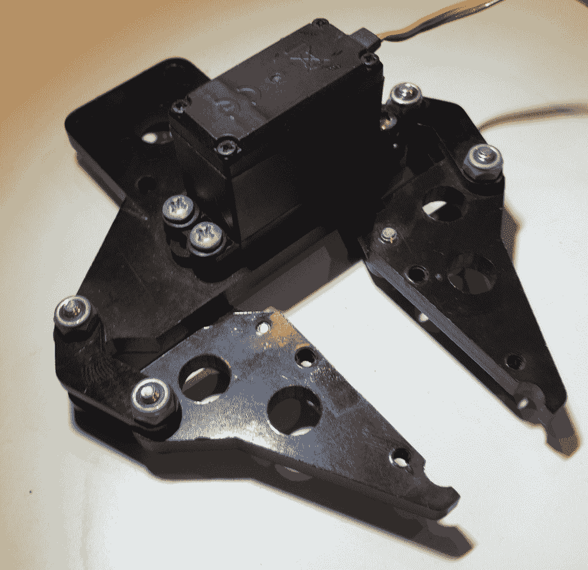
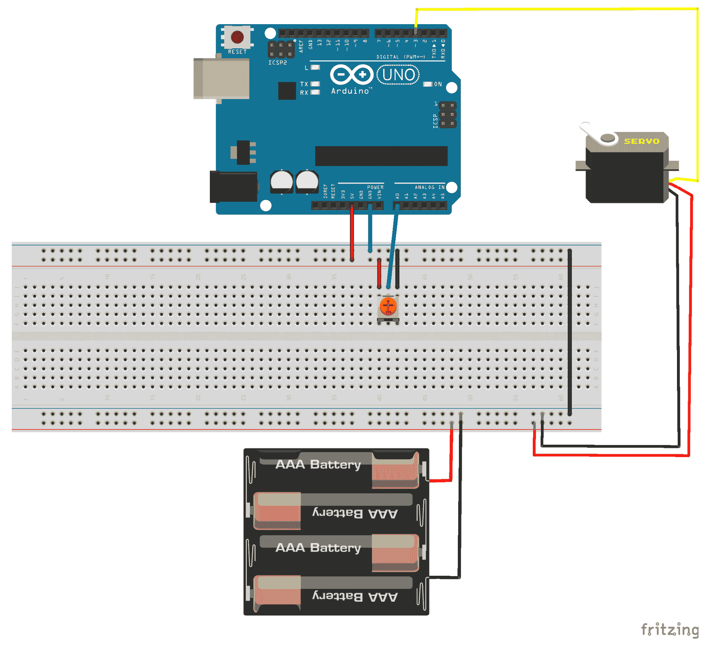
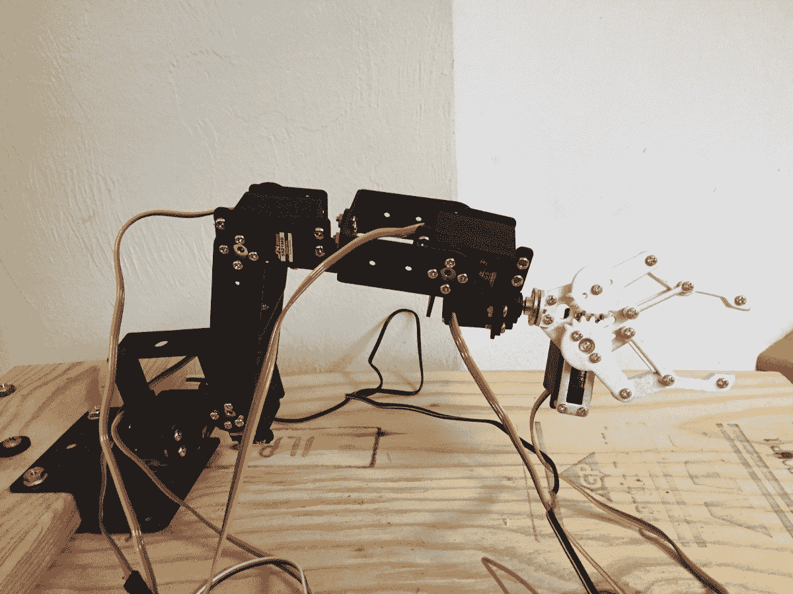

# 伺服电机

当给刷式直流电机供电时，它将开始连续旋转，直到切断电源。这使得刷式直流电机非常适合像机器人轮子或风扇叶片这样的物品。有时我们需要对电机旋转的精确度有更多的控制。例如，为了控制机器人臂，我们需要电机以精确的量旋转，以便将臂放置在所需的位置。对于此类应用，我们可以使用伺服电机。

在本章中，您将学习：

+   如何控制伺服电机

+   如何使用 Arduino 伺服库

+   如何为伺服电机供电

# 简介

我们将与 Arduino 一起使用的伺服电机类型相当小巧，但大多数都具有相当高的扭矩，并且非常节能。这使得我们可以将这些电机用于工业级应用，如机器人臂、输送带、相机中的自动对焦镜头，甚至是太阳能板的太阳能跟踪系统。

伺服电机由一个直流电机组成，它执行实际工作；一个电位计，用于控制电机接收的功率；控制电路，用于控制电机的运动和齿轮。以下照片显示了一个连接到机器人爪子的伺服电机：



伺服电机包含三根线，用于控制信号、电源和地线。信号线通常是橙色或黄色。电源通常是红色，地线通常是棕色或黑色。

一些较小的伺服电机可以使用 Arduino 上的 5V 输出；然而，在本章中，我将使用**MG996R 高扭矩电机**，它可以处理高达 7.2V 的电压，并且运行电流为 500mA 至 900mA。因此，我们将将其连接到一个包含 4 节 AA 电池的外部 6V 电池组。我建议您查阅您的伺服电机的数据表，以确定伺服电机的正确电源输入。

**注意**：虽然一些较小的电机可以通过 5V 输出供电，但我建议在为电机供电时始终使用外部电源。

地线应连接到与电池组和 Arduino 共用的公共地线。信号线应连接到 Arduino 的 PWM 输出引脚。

PWM 引脚的占空比决定了伺服轴的位置。当伺服电机的轴处于所需位置时，会切断对电机的供电。电机将旋转的速度与实际位置和所需位置之间的差异成正比，这意味着所需位置离实际位置越远，电机旋转的速度就越快。这使得伺服电机非常高效，因为它只工作到所需的程度。

不同的伺服电机有不同的最大转动半径。大多数伺服电机的转动半径要么是 120 度（每个方向 60 度）要么是 180 度（每个方向 90 度）。在本章中我将使用的 MG996R 伺服电机的最大转动半径为 120 度。一旦伺服电机旋转到所需的位置，它将尝试保持该位置，并抵抗任何将其推出位置的尝试。

让我们看看本章项目所需的组件。

# 需要的组件

在本章中，你需要以下组件：

+   一个 Arduino Uno 或兼容板

+   一个伺服电机（代码已在 MG996R 伺服电机上测试过。然而，任何标准伺服电机都应适用）

+   一个电位计

+   一个 4 AA 电池盒和电池，为伺服电机供电

+   跳线

+   一个面包板

# 电路图

下面的图示显示了如何将伺服电机连接到 Arduino：



在这个项目中，我们将使用电位计来控制伺服电机的位置。请注意，电位计使用 Arduino 的 5V 电源，而伺服电机使用来自电池的 6V（4 × 1.5V）；然而，这两个电源共享一个公共地。现在让我们看看控制伺服电机的代码。

# 代码

Arduino IDE 和 Web 编辑器都附带了一个伺服库，我们可以通过包含头文件来简单地使用它。以下代码将执行此操作：

```cpp
#include <Servo.h>
```

接下来，我们需要定义伺服电机和电位计连接到的引脚。以下代码将信号线连接到数字 `3` 引脚，将电位计连接到 Arduino 的模拟 `0` 引脚：

```cpp
#define SERVO0_POT 0
#define SERVO0_OUT 3 
```

现在我们需要定义一个 `Servo` 类型的实例，如下面的行所示：

```cpp
Servo servo0;
```

在 `setup()` 函数中，我们需要从 `servo` 实例调用 `attach()` 方法来初始化实例并告诉它伺服电机连接到哪个引脚。以下代码显示了这一点：

```cpp
void setup() {
  servo0.attach(SERVO0_OUT);
}
```

我们将想要定义一个函数，该函数将读取电位计并根据电位计旋转的程度设置伺服电机的位置。

```cpp
void setServo(int pot, Servo out) {
  int servo = analogRead(pot);   
  long int servo_val = map(servo, 0, 1023, 0, 120);
  out.write(servo_val);
}
```

此函数将接受一个整数，即电位计连接到的引脚。调用 `analogRead()` 函数来读取电位计连接到的引脚。我们使用 `map()` 函数将读取的模拟引脚值（0-1023 的值）映射到伺服电机可以移动的 120 度。然后使用伺服类型的 `write()` 函数将此值写入伺服电机，使伺服电机调整其位置。

然后从 `loop()` 函数中调用 `setServo()` 函数来读取电位计并设置伺服电机，如下面的代码所示：

```cpp
setServo(SERVO0_POT, servo0);
delay(15); 
```

我们创建`setServo()`函数而不是直接将其代码放入`loop()`函数中的原因，是这样做可以更容易地添加多个伺服电机。例如，如果我们想创建一个带有五个伺服电机的机械臂，我们可以非常容易地通过像第一个一样设置伺服电机，然后在`setup()`函数中使用以下代码：

```cpp
setServo(SERVO0_POT, servo0);
setServo(SERVO1_POT, servo1);
setServo(SERVO2_POT, servo2);
setServo(SERVO3_POT, servo3);
setServo(SERVO4_POT, servo4);
delay(15);
```

如果我们有像`setServo()`函数中的代码那样可能被多次使用的代码，将其放入一个单独的函数中总是一个好主意。

如果运行此项目，随着电位器的旋转，伺服电机的位置将发生变化。

# 挑战

在本章的挑战中，你需要一个 6 自由度（**DOF**）的机械臂。以下图片展示了 6 自由度机械臂的外观：



对于这个挑战，你需要想出如何将剩余的伺服电机连接到 Arduino 以及正确的电源配置。你可以从亚马逊或 eBay 订购 6 自由度机械臂套件。访问他们的网站，并搜索`6 自由度机械臂`。这些套件的价格因机械臂/爪的大小和功率而大不相同。你可以购买预组装的机械臂，或者作为需要自己组装的套件。

# 概述

在本章中，我们学习了伺服电机的工作原理以及如何使用 Arduino 来控制它们。我们还看到了组成伺服电机的组件。在下一章中，我们将看到如何使用继电器板。
