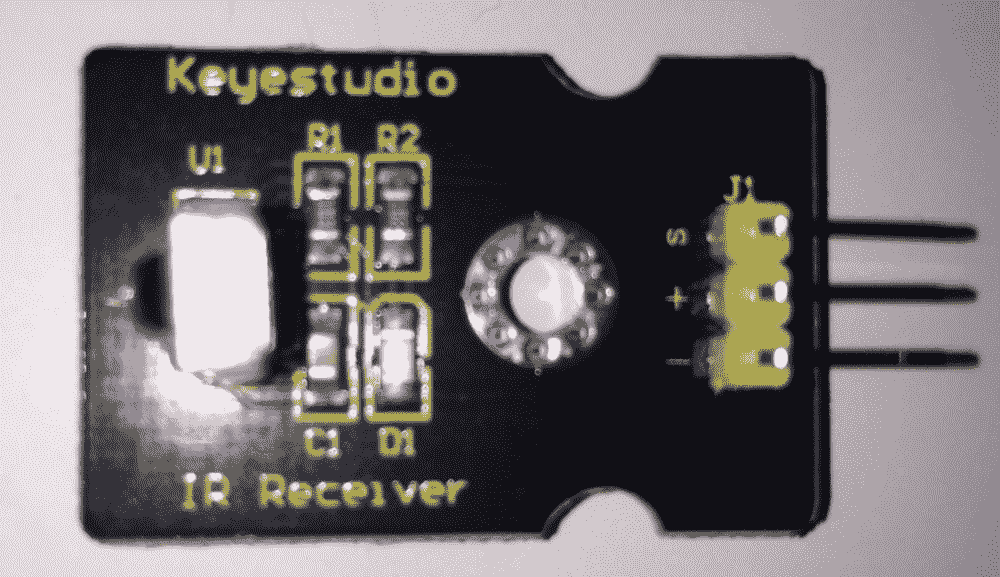
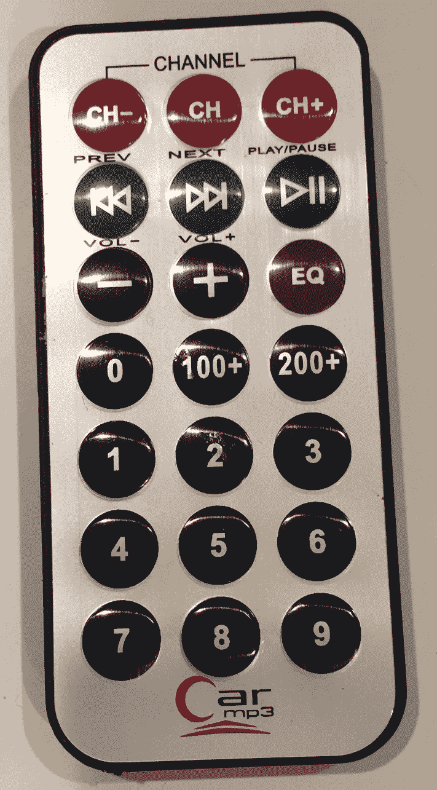
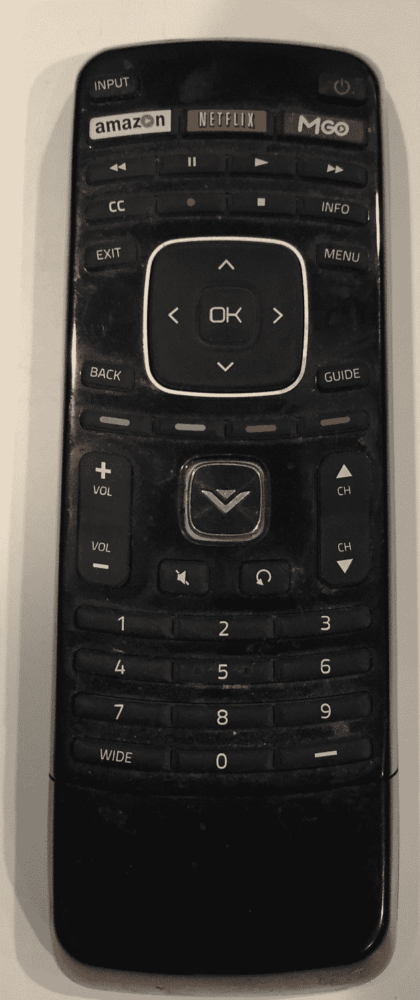
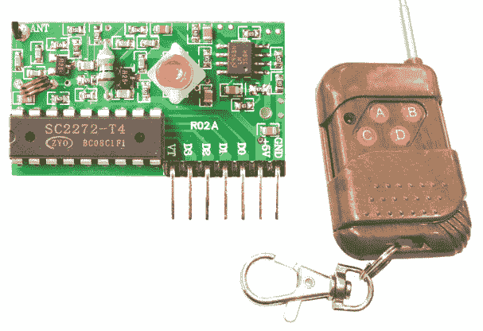
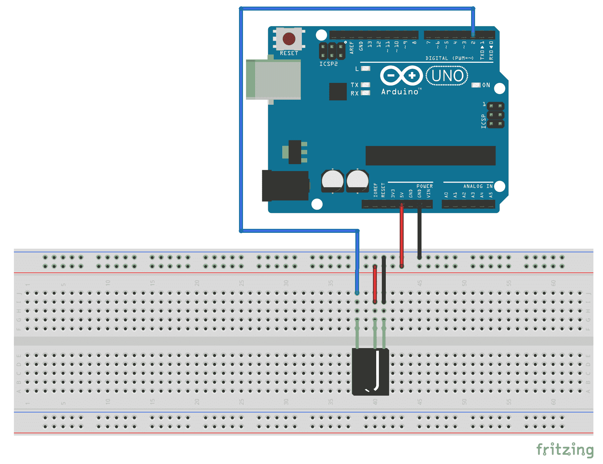
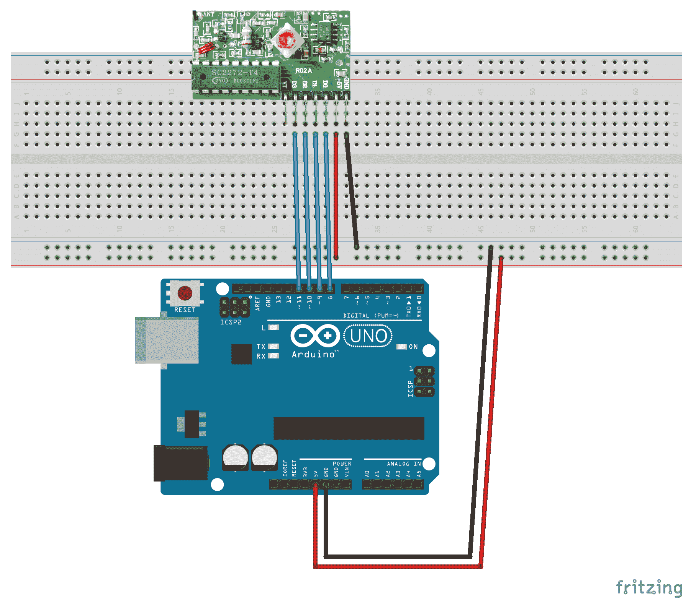
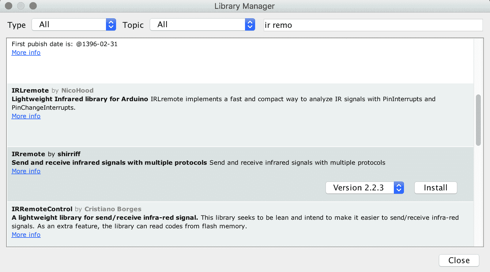
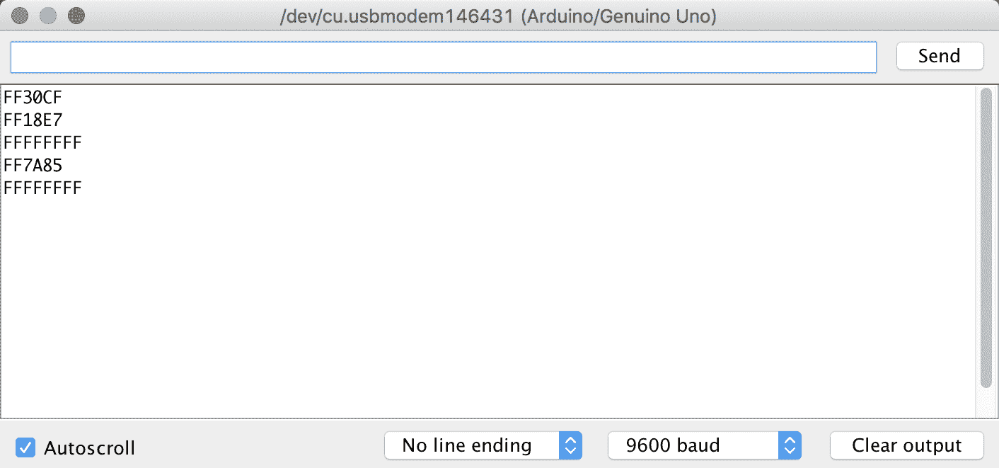

# 远程控制 Arduino

当我还是个孩子的时候，我的父母经常用我和我的妹妹作为电视机的遥控器，因为那时候，电视机并没有配备遥控器。幸运的是，Zenith 的一名工程师 Eugene Polley 提出了用遥控器控制电视的想法，从而让数百万的孩子免于为父母换频道。遥控器极大地增强了我们与电视机的互动方式，也可以为你的 Arduino 项目做到同样的事情。

在本章中，你将学习：

+   如何将射频遥控器连接到 Arduino

+   如何确定射频遥控器上按下了哪个按钮

+   如何将红外遥控器连接到 Arduino

+   如何确定红外遥控器上按下了哪个按钮

# 简介

在本章中，我们将探讨几种我们可以远程控制 Arduino 项目的方法。对于第一个项目，我们将使用 Keyestudio 红外（红外）接收器，它使用**HX1838 红外控制模块**。HX1838 红外控制模块被用于许多 Arduino 可用的红外接收器。因此，你不需要特别购买我们这里使用的 Keyestudio 型号。

红外发射器有一个 LED，它发射红外辐射，被红外接收器接收。当在遥控器上按下按钮时，发射器上的 LED 会非常快速地闪烁一秒钟的几分之一，接收器将读取闪烁模式并对其进行解释。

我们在本章中将使用的 Keyestudio 红外接收器看起来如下照片所示：



标有**S**的引脚是信号引脚，应该连接到 Arduino 的一个数字引脚上。标有**+**号的引脚应该连接到 5V，标有**-**号的引脚应该连接到地线。

使用红外接收器作为项目遥控器的一个真正不错的地方是，你可以使用几乎任何红外遥控器作为发射器。例如，我可以使用与我其中一个红外接收器一起来的这个遥控器：



或者，我可以用我多余的任何红外电视遥控器，如下面照片所示：



然而，有些遥控器不使用红外技术，例如使用蓝牙 4.0 的 Apple TV 遥控器。因此，它们不能与红外接收器一起使用。

红外遥控器确实有几个缺点，最大的缺点是它们必须与接收器有视线才能进行通信。这意味着发射器必须直接指向接收器；否则，接收器将无法读取传输。红外遥控器的另一个缺点是，它们只有在 30 英尺（10 米）以内才真正有用。

而不是使用红外发射器/接收器，我们可以使用**射频**（**RF**）发射器和接收器。在本章中，我们将探讨如何使用基本的四键遥控器 RF 发射器和接收器，如下面的照片所示：



使用 RF 发射器和接收器的两个最大优点是 RF 信号可以传播得更远，并且它们可以穿过普通墙壁，这意味着不需要视线对准。与几乎可以与任何红外发射器一起工作的红外接收器不同，如果 RF 发射器和接收器没有设计成一起工作，并且设置为相同的频率，它们将无法通信。如前照片所示，RF 发射器也比红外遥控器有更少的按钮。

让我们看看这些项目所需的部件。

# 需要的组件

对于这些项目，你需要以下物品：

+   一个 Arduino Uno 或兼容板

+   一个红外接收器

+   一个或多个红外发射器

+   一对 RF 发射器和接收器

+   跳线

+   面包板

# 电路图

以下图显示了我们将如何将红外接收器连接到 Arduino：



红外接收器的 5V 输入和地线引脚连接到面包板上的适当轨道。信号引脚连接到 Arduino 的数字 2 引脚。现在让我们看看我们将如何将射频接收器连接到 Arduino：



RF 接收器的 5V 输入和地线引脚连接到面包板上的适当轨道。接收器的四个输出引脚连接到 Arduino 的 8、9、10 和 11 数字引脚。当发射器上的按钮被按下时，接收器上的相应输出引脚会变为高电平。

现在让我们看看我们项目的代码。

# 代码

在我们开始编写读取红外接收器输入的代码之前，我们需要通过 shirriff 加载**IRremote 库**。以下截图显示了我们将要使用的库和版本：



一旦加载了库，我们首先需要导入 IRremote 库的头文件，并创建全局变量和指令。以下代码显示了如何进行：

```cpp
#include <IRremote.h>

#define IR_PIN 2
IRrecv ir(IR_PIN);
decode_results irCode;
```

在前面的代码中，我们首先将`IRremote.h`头文件包含到我们的项目中。然后我们定义红外接收器连接到 Arduino 的 2 号引脚。接下来，我们创建一个`IRrecv`类型的实例，用于读取 IR 接收器的输入。最后，我们创建一个`decode_results`类型的实例，用于存储 IR 接收器的值。

现在我们需要在`setup()`函数中添加初始化代码。以下代码显示了此示例的`setup()`函数：

```cpp
void setup()
{ 
  Serial.begin(9600);
  ir.enableIRIn();
}
```

在这个例子中，我们首先初始化串行监视器，以便我们可以打印出结果。然后，我们从`IRrecv`类型的实例中调用`enableIRIn()`函数，这将使 Arduino 准备好读取红外接收器的输入。

在`loop()`函数中，我们寻找来自红外接收器的输入，并打印出遥控器上按下的按钮的代码。以下代码显示了`loop()`函数将看起来像什么：

```cpp
void loop()
{
  if (ir.decode(&irCode))
  {
    Serial.println(irCode.value, HEX);
    ir.resume();
  }
  delay(100);
}
```

在`loop()`函数中，我们使用`decode()`函数，传递`decode_results`类型的实例，来读取被按下的按钮的代码。一旦收到代码，就使用`Serial.println()`函数将代码打印到串行控制台。我们延迟应用程序的执行 100 毫秒，以便在发送重复代码之前给用户一个释放按钮的机会。最后，调用`resume()`函数以再次开始监听结果。

代码的结果应该看起来像以下截图：



在本章前面展示的汽车 MP3 遥控器被用来获取前面截图中的结果。"FF30CF"是 1 号按钮的代码，"FF18E7"代码是 2 号按钮，而"ff7A85"代码是 3 号按钮。`FFFFFFFF`的结果意味着按钮被按住；因此，应该再次使用最后一个有效的代码。

你可能想把这个项目保存到某个地方，因为它对于获取遥控器上按钮的有效代码非常有用。一旦你有了这些代码，你就可以在你的其他项目中使用 IRremote 库，并根据接收器返回的代码执行所需的任何活动。

由于发射器上的每个按钮都有一个引脚，因此 RF 接收器的读取稍微容易一些，我们不需要外部库来读取它。当用户按下按钮时，接收器上相应的引脚将被拉高。

我们将开始定义 Arduino 上的哪些引脚连接到 RF 接收器的引脚上。如果你按照 Fritzing 图连接 RF 接收器，按钮的定义将如下所示：

```cpp
#define BUTTON_A 10
#define BUTTON_B 8
#define BUTTON_C 11
#define BUTTON_D 9
```

然后，我们需要在`setup()`函数中设置这些引脚为输入，并初始化串行监视器。以下代码显示了此项目的`setup()`函数：

```cpp
void setup() {
  pinMode(BUTTON_A, INPUT);
  pinMode(BUTTON_B, INPUT);
  pinMode(BUTTON_C, INPUT);
  pinMode(BUTTON_D, INPUT);
  Serial.begin(9600);
}
```

在`loop()`函数中，我们需要读取每个引脚，检查它是否为高电平，如果是，则在你的项目中执行所需的函数。对于这个项目，我们只是打印出该引脚被按下。以下显示了此项目的`loop()`函数：

```cpp
void loop() {
  int valA = digitalRead(BUTTON_A);
  if (valA == HIGH) {
    Serial.println("Button A");
  }

  int valB = digitalRead(BUTTON_B);
  if (valB == HIGH) {
    Serial.println("Button B");
  }

  int valC = digitalRead(BUTTON_C);
  if (valC == HIGH) {
    Serial.println("Button C");
  }

  int valD = digitalRead(BUTTON_D);
  if (valD == HIGH) {
    Serial.println("Button D");
  }
  delay(100);
}
```

当运行此代码时，你将在串行监视器中看到哪些按钮被按下。给你的项目添加遥控器可能看起来只是“锦上添花；”然而，它实际上可以增强项目的可用性，并让你免于不断起身与之互动。现在让我们看看本章的挑战。

# 挑战

在本章中，我们看到了两种类型的遥控设备。第一种是红外控制，它需要与投影设备有视线，并且可以有很多不同的按钮。射频遥控器在遥控器需要从设备更远距离工作或甚至在不同的房间工作时表现良好。

使用无线信号创建遥控器的方法有很多，例如**Zigbee**无线电或甚至 Wi-Fi；然而，对于这个挑战，我们希望你能跳出思维定势，开始拓展自己的视野。本章的挑战是思考如何在不使用无线信号的情况下远程控制你的设备。

你现在可能正在摇头，想知道我们所说的在不使用无线信号的情况下远程控制项目是什么意思。一个例子就是拍手器。拍手器是一种声音激活的电气开关。你拍一次手，开关就会打开，你再次拍手，开关就会关闭。另一个例子是控制你户外灯光的运动传感器。如果运动传感器检测到运动，它就会打开灯光。现在尝试跳出思维定势，想出其他不使用无线信号控制设备的方法。

# 概述

在本章中，我们看到了如何使用红外遥控器和射频遥控器与 Arduino 一起工作。你也被挑战跳出思维定势，思考其他不使用无线信号远程控制项目的方法。这个挑战之所以放在最后一个项目章节中，是为了让你在设计项目时开始跳出思维定势，因为跳出思维定势和创造新的、改进的方法去做某事是让人们对这些类型的项目感到兴奋的原因。如果你能够垄断你的项目，这也可能让你赚很多钱。

在下一章中，我们将讨论如何使用从前几章项目中学到的知识来创建一个简单的机器人。我们不会为你编写代码或设计电路。相反，我们将向你展示如何将书中学到的部件组合起来，这样你就可以设计自己的机器人或创建其他项目。
