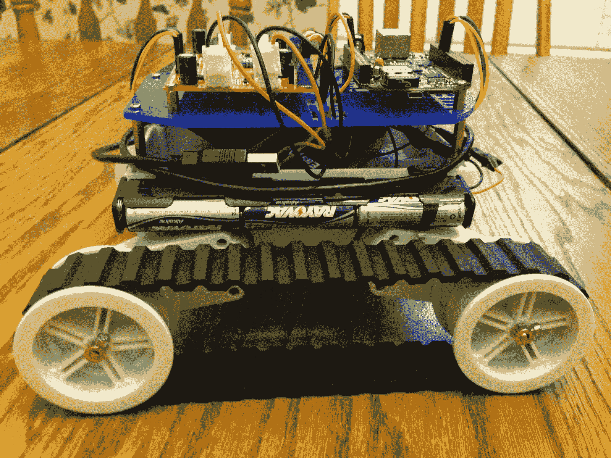
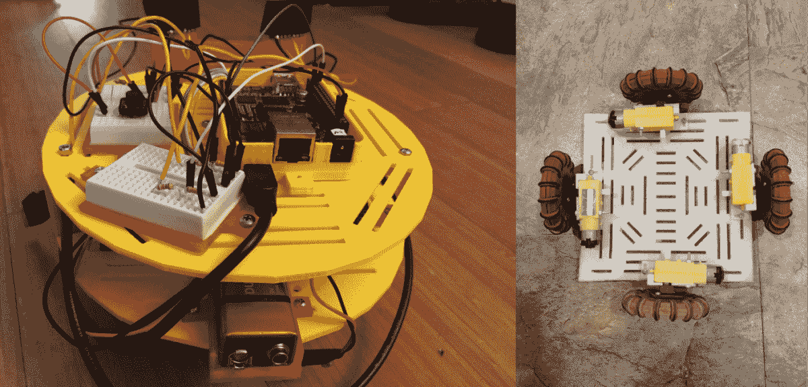
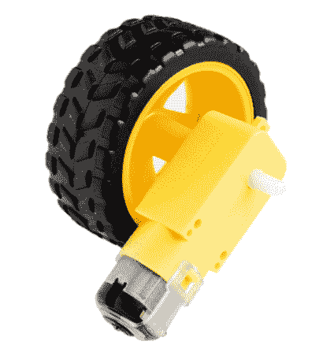
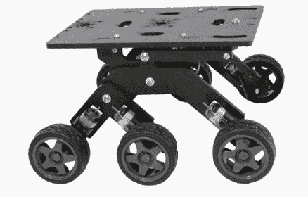
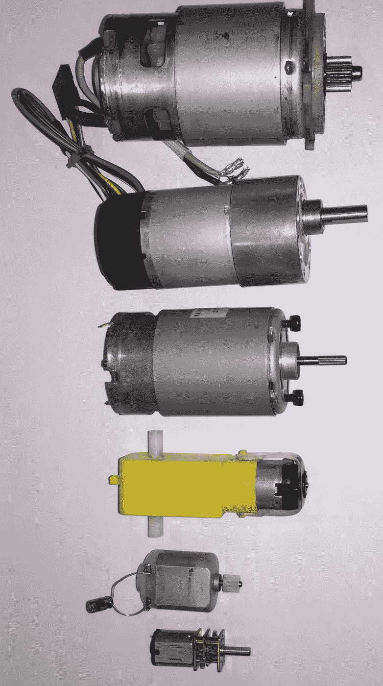
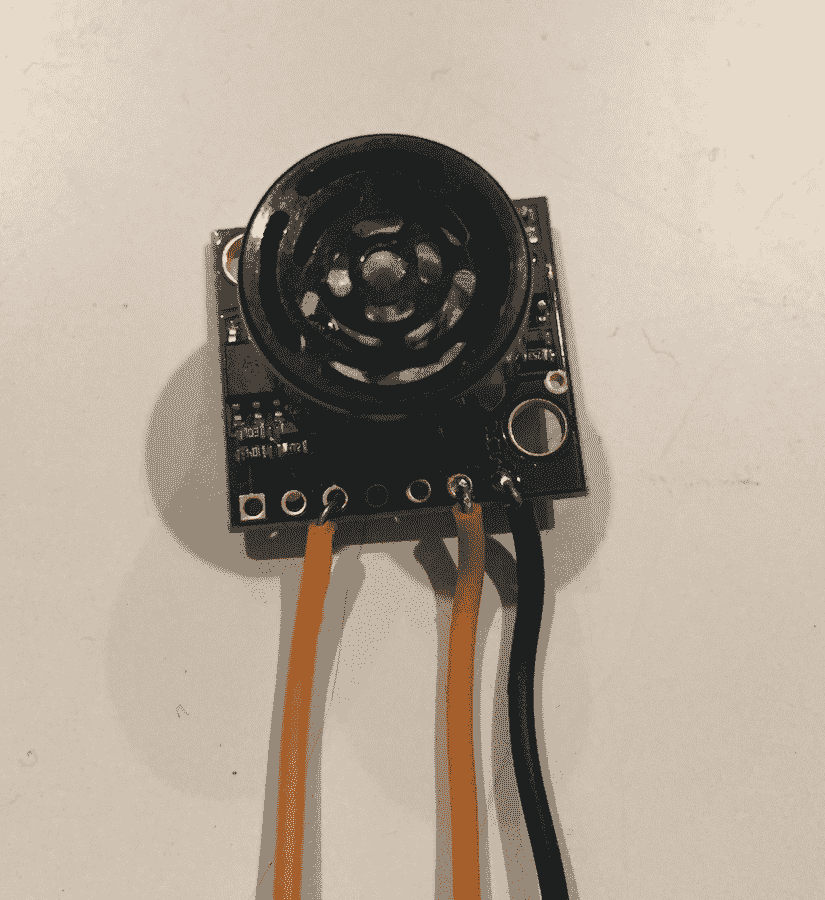
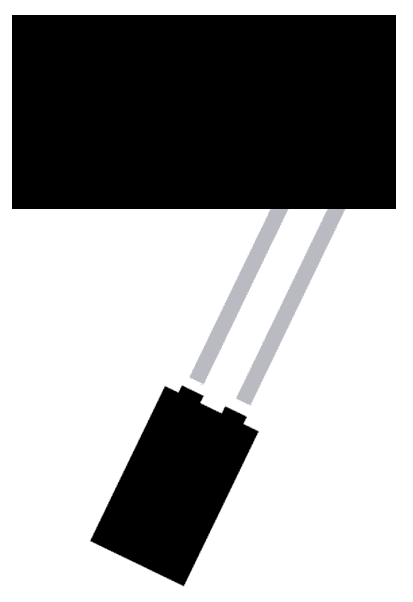
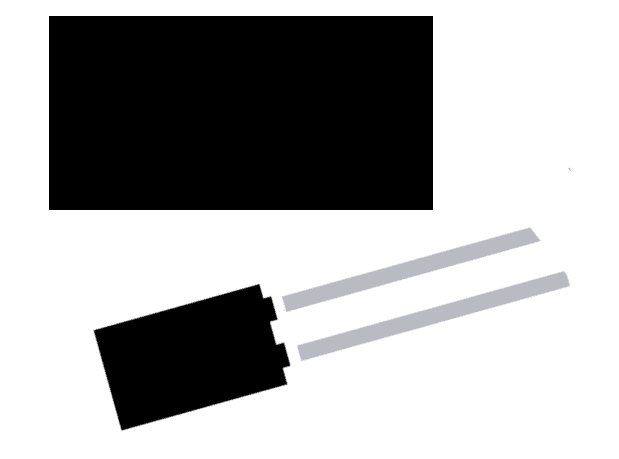

# 第十九章：创建一个机器人

当我最初开始使用像 Arduino 这样的开发板时，我的最初目标是构建一个机器人。然而，我并不知道从哪里开始。我有许多问题，机器人的好外形是什么？我应该使用什么电机？我如何给机器人供电？我需要为电机单独供电吗？避障是如何工作的？这一章是为了帮助您回答这些问题，并展示在阅读这本书的前几章之后，您现在已经有足够的知识来设计和构建自己的机器人。

在本章中，我们将讨论：

+   我们如何利用这本书中学到的知识来创建一个完全工作的机器人

+   一系列额外的提示和技巧，将帮助您在项目中

+   除了这本书之外，我们还能用 Arduino 构建哪些其他项目

我们将通过挑战你创建自己的项目并以它与我们分享来结束这一章。

# 简介

在本章中，与之前的项目章节不同，我们不会设计和构建一个特定的项目。相反，我们将向您展示如何利用您在前几章中获得的知识来设计自己的机器人。我们还将为您提供各种提示和技巧，以帮助您避免人们在最初开始构建机器人时犯的一些错误。

当我们开始设计我们的第一个机器人时，我们首先做的事情是决定机器人应该做什么，因为我们认为整个机器人的设计应该围绕机器人的目的展开。这是一个大错误，因为机器人要做的项目列表非常长。它将介于 R2-D2、Wall-E 和指挥官数据之间。它将成为有史以来最酷的机器人，然后，正如你可能猜到的，我们真的感到不知所措，不得不将一切缩减到最小。

在最初设计您的前几个机器人时，您应该从设计/购买机器人底盘（身体）或确定机器人应该如何移动开始。这里真的是一个“先有鸡还是先有蛋”的困境，因为您使用的底盘实际上定义了机器人将如何移动，但另一方面，机器人应该如何移动（甚至完全不移动）定义了您需要什么类型的底盘；因此，我通常在设计机器人时会考虑这两者。

# 底盘和移动

开始构建机器人的最简单方法之一是购买现成的坦克底盘。其中一些底盘甚至内置了电机和电机控制器，或者它们被设计成可以一起工作，这使得开始构建更加容易。我第一个构建的机器人使用了 Dagu Electronics 设计和制造的 Rover 5 坦克底盘和 Rover 5 电机控制器板。这是我第一个机器人的照片：

这个机器人的所有部件都购买了，包括连接电路板的顶板。购买所有这些部件会很快变得昂贵，尤其是当你开始向机器人添加额外的传感器和设备时。

如果你计划建造许多机器人，或者使用 Arduino 进行大量其他原型设计，购买 3D 打印机是值得的，因为与其购买底盘的预制部件，你还可以设计和打印自己的。例如，不久前我拿出了 Rover 5 底盘，并用它创建了一个名为 BuddyBot 的另一个机器人。它是使用我设计和打印的部件制作的，这使我能够为 BuddyBot 获得我想要的外观。以下照片展示了 BuddyBot 的前部：

如果你想的话，甚至可以打印整个底盘。以下照片展示了两个我使用 3D 打印机设计和打印的机器人底盘。左侧的底盘是我打印了整个底盘，右侧的是我正在设计的实验性底盘。我还为右侧的底盘打印了万向轮：

底盘有各种形状和大小。找到或设计一个完美的底盘通常是构建你的机器人最容易的部分之一。关键是确保你有一个可以扩展的底盘。如果你注意到，在前面的照片中，这些板上有长而窄的矩形凹槽。这些凹槽设计得可以很容易地移除和添加新部件。你也会注意到，在前面的照片中左侧的机器人上的小面包板可以很容易地拧下、移除或移动到机器人的其他部分。

通过以模块化方式设计机器人，我们可以非常快速地扩展其功能。你将想要避免那些扩展性有限的底盘，因为除非你正在为特定功能设计机器人，否则你总会想着要添加新的组件和功能。

我们已经讨论了很多关于底盘的内容，那么关于定义机器人如何移动的问题呢？我在本章前面展示的 Rover 5 底盘使用坦克履带移动。之前照片中的黄色机器人使用的是标准且非常便宜的 Arduino 汽车电机和轮子（如下照片所示），而实验性底盘使用的是我打印的万向轮。

使用坦克履带移动你的机器人使你能够在几乎任何地形上移动。然而，它们比标准轮子和电机更贵，底盘也必须为它们而设计。你通常还需要扭矩更高的电机，但我们将在下一节讨论电机。

使用 Arduino 汽车电机和轮子比履带便宜得多，但除非你有一个像以下照片中展示的 Bogie Runt Rover 这样的高端底盘，否则你的机器人将仅限于室内使用。

Bogie Runt Rover 是一个非常不错的底盘，但我会强烈建议你拥有一个 3D 打印机，这样你就可以为它打印自己的扩展部件。

全向轮是一种非常特殊的轮子，轮子周围有小的圆盘，这使得它们可以横向推动，因为小圆盘会旋转，从而减少摩擦。如果你询问使用过全向轮的人对它们的看法，你收到的答案将涵盖整个光谱，有些人绝对讨厌它们，认为它们毫无用处，而有些人则非常喜欢它们。

你也可以制作出会走路的机器人。这类机器人超出了像这样入门书籍的范围，我建议你的前几个机器人还是坚持使用履带或轮子的类型。

现在让我们来看看电机以及如何给它们供电。

# 电机和电源

决定使用哪种电机以及如何供电，在你开始搭建机器人时可能是你做出的最艰难的决定之一，因为可供选择太多。以下照片展示了我项目中用到的部分电机：

购买二手电机可以节省很多钱，而且有几种方式可以获取它们。我购买了许多二手遥控汽车和其他电子产品，如旧 DVD 播放器，并从中拆下了电机。这就是前面照片中显示的两个最小电机来源；然而，如果你需要更强大的电机，可以考虑从电钻中拆下电机。前面照片中最大的电机来自一个旧的 Ryobi 12V 电钻。

当你刚开始搭建机器人时，我建议从 Arduino 汽车电机开始。它们非常容易使用，并且是为供电机器人汽车而设计的。它们可以由多种电源供电，因为它们可以处理低至 3V 高至 12V 的电压。建议的电压范围是 6V 到 8V。然而，我经常使用一个最大电流为 1.3A 的 12V 电池来供电这些电机。当你购买电机时，请仔细阅读规格，以确保电机适合你在项目中使用的电源。

为了控制电机，你需要使用电机控制器。我们在第十五章，*直流电机和电机控制器*中展示的 L298 电机控制器是一个完美的起始电机控制器。它处理从 5V 到 46V 的广泛电压和高达 2A 的电流。你可以参考第十五章，*直流电机和电机控制器*，了解如何使用这个控制器。

为电机供电一开始可能会让人感到困惑，尤其是在购买电池时。首先，你不想从 Arduino 的 5V 电源为电机供电。对于小型机器人项目，你可以使用 AA 电池或 9V 电池。对于能够容纳更大电池的底盘，我建议购买一个小型 12V 电池，如以下照片中展示的 Duracell Ultra 12V 1.3Ah 电池。

选择电池时一个关键因素是电机的规格以及你将有多少个电机。当你通过电机控制器将电机连接到电池时，你将它们相互并联连接。如果你还记得第三章“电路图”中串联和并联电路的比较，你会记得在并联电路中，每个分支都将有电源输出的最大电压。然而，电流将在分支之间分配。这意味着如果我们的电池可以产生 12V 和 1.2A 的电流，而我们试图为 6 个电机供电，那么如果每个电机以相同的速度旋转，每个电机将会有 12V 电压，可以吸取 200mA（1.2A 除以 6）的电流。因此，之前展示的 Duracell Ultra 将足以为六个 Arduino 汽车电机供电，但如果你打算使用更大型的电机，你可能需要一个容量更大的电池。

你可能已经注意到 Duracell 电池的额定电压为 12V，容量为 1.3Ah。不要将 Ah 额定值与安培混淆。电池的额定值是根据容量来确定的，1.3Ah 意味着它可以连续供应 1.3A 电流 1 小时，然后你需要充电。

选择为你的机器人项目供电的电池时，一个好的规则是：拥有更多的电量总是比更少的电量好。除非你将这个规则推向极端，试图用一个 12V 电池为两个小型电机的小型遥控车供电，否则这个规则非常适用。

使用 L298 电机控制器，我们可以控制车轮的速度和方向，这使得我们能够操控带有车轮或履带的机器人。如果机器人一侧的车轮或履带旋转速度比另一侧快，机器人就会转向。两侧速度差越大，机器人转向越快。你还可以通过让机器人一侧的车轮或履带向前旋转，而另一侧的车轮或履带反向旋转，使机器人原地旋转。

# 自主机器人——避障和碰撞检测

如果你想要构建一个自主机器人，你需要有一种形式的障碍物避障和碰撞检测，以及告诉机器人如何绕过或避开检测到的物体的逻辑。我们在第十章障碍物避障和碰撞检测中展示了如何使用几种障碍物避障和碰撞检测传感器，但问题可能在于我们如何开发绕过或避开检测到的物体的逻辑。

在我们开始讨论障碍物避障逻辑之前，让我们再次看看 BuddyBot 机器人：

如果你仔细观察 BuddyBot 的“眼睛”，你可能认出它们是第十章障碍物避障和碰撞检测中讨论的 MaxSonar EZ1 超声波测距仪。为了刷新你的记忆，MaxSonar EZ1 通过向特定方向发送超声波脉冲来工作。如果脉冲路径上有物体，那么它将以回声的形式反射回来。传感器通过测量接收回声所需的时间来确定物体距离。以下照片显示了 MaxSonar EZ1 的外观：

BuddyBot 使用两个 MaxSonar 测距仪来帮助实现障碍物避障逻辑。让我们看看这是如何工作的。我们首先需要确定在什么距离开始障碍物避障逻辑。例如，如果我们正在构建一个在室内移动的小型机器人，我们可能不需要担心距离五英尺的障碍物。如果我们有一个在工厂内移动的大型机器人，那么五英尺可能是开始障碍物避障逻辑的合理距离。机器人将要移动的环境在设计障碍物避障逻辑中起着重要作用。

一旦确定了开始障碍物避障逻辑的正确距离，我们就可以开始构建这个逻辑。通过使用两个传感器，我们能够确定机器人以什么角度接近物体。接下来的图示显示了机器人以轻微的角度接近物体：

当机器人以这种角度接近物体时，我们可以比较两个测距仪报告的距离，并确定物体更靠近机器人的左侧。通过确定机器人的左侧更靠近物体，我们可以使用一些基本的逻辑来告诉机器人向右转，直到物体超出范围，如图所示：

一旦物体超出范围，我们就可以再次开始前进。这是一种非常基本的避障方法，确实需要不断轮询测距仪。作为一个更经济的选项，因为与其它传感器相比，MaxSonar 测距仪相当昂贵，我们可以使用在第十章，*避障和碰撞检测*中描述的红外避障传感器。我之所以更喜欢 MaxSonar 测距仪，是因为红外传感器发出的红外辐射束比 MaxSonar 测距仪发出的声波束要窄得多。有了测距仪的更宽的波束，我们不太可能错过稍微在传感器左/右或高/低位置的物体。

你还希望在机器人周围放置碰撞传感器；这些传感器可以用来检测机器人撞到东西的情况。这些传感器在机器人的后面工作得非常好，可以检测到机器人倒车时是否撞到东西。避障可能是一个非常复杂的话题，一个容易开始但可能变得非常复杂的话题，就像这里展示的那样。

现在我们来看看如何远程控制机器人。

# 远程控制机器人

我们在第十八章，*远程控制 Arduino*中看到的 RF 遥控器，相较于红外遥控器来说，是远程控制机器人的更好选择，因为 RF 遥控器不需要视线对准信号。RF 遥控器唯一的问题是通常没有足够的按钮来完成我们想让机器人做的所有事情。这种按钮不足的问题可以通过将机器人变成一个自主机器人来解决，这样它就可以通过避障来自己移动，但然后可以使用遥控器告诉机器人执行特定的任务。这些任务可以包括告诉机器人开始/停止移动，通过扬声器播放音乐，或者从冰箱里给你拿饮料。

在第十八章，*远程控制 Arduino*的结尾，你被挑战跳出思维定式，寻找除了无线信号之外远程控制项目的其他方法。思考你对这个挑战的回答，看看你是否可以用它们来控制机器人。

我最喜欢的控制机器人的一种方式是通过语音识别，使用我们在第十四章，*语音识别和语音合成*中看到的 MOVI 盾。有了 MOVI 盾，我们可以编程命令，如*向右转*，*向左转*，*停止*，或者你希望机器人做的任何其他事情。

我们还可以使用的一个传感器是声音传感器，我们可以在机器人周围以圆形或方形模式放置三个或四个，这样它就可以检测声音来自哪个方向，然后朝那个方向移动。我们也可以使用单个声音传感器，当我们拍手或制造其他响亮噪音时，来启动或停止机器人。

让我们看看我们如何向机器人用户提供反馈。

# 用户反馈

我们总是希望提供一种方式来提供反馈，以便我们知道机器人正在发生什么。当我们为了调试目的编程机器人时，这非常有用。如果你还记得本章前面提到的 BuddyBot 的图像，它的鼻子被多彩 LED 灯照亮。LED 灯的颜色表示机器人应该做什么，以及它是否检测到左右两侧的障碍物。通过观察 LED 灯的颜色，我知道机器人应该做什么，如果它没有这样做，我知道编程或硬件出了问题。

使用多彩 LED 灯是添加机器人反馈最容易和最快的方式之一。我们可以非常快速地设置不同的颜色来表示不同的活动。如果我们需要同时表示多个活动，我们可以添加多个 LED 灯，而不会花费太多。我更喜欢多彩 LED 灯而不是单色 LED 灯，因为我们可以用不同的颜色来表示不同的事物，而单色 LED 灯要么开要么关，因此它们只能表示一个项目。

提供反馈的另一种方式是使用声音。在第十二章，“声音的乐趣”中，我们看到了 Arduino 如何使用各种扬声器产生声音。如果你曾经使用过 Roomba 或另一个自主式机器人吸尘器，你会知道当吸尘器卡在某个地方时，它会发出声音来通知主人它卡住了。播放声音是向机器人添加反馈的另一种简单方法。

在第十二章，“使用 LCD 显示屏”中，我们说明了如何使用 LCD 显示屏来传达项目信息。添加 LCD 显示屏可以使你的项目向用户提供精确的信息。这些可以是文字或图像的形式。

用户反馈应该是你首先放入项目中的内容之一，因为它可以在你开发项目时帮助进行故障排除。现在让我们谈谈我们如何使事物旋转。

# 使事物旋转

在第十六章，*伺服电机*中，我们看到了如何使用伺服电机来打开和关闭一个机器人爪子；然而，伺服电机能做的远不止这些。正如我们在机器人爪子中看到的那样，我们可以将电机旋转到特定的角度。在过去，我将一个 MaxSonar 距离传感器连接到伺服电机上，并将传感器正对前方。然后当距离传感器检测到机器人前方有物体时，伺服电机就会将距离传感器转向不同的方向，以便确定最佳移动方向。这使得我能够仅使用一个距离传感器构建一个具有避障功能的自主机器人。

我们也可以将一个光源连接到伺服电机上，制作一个旋转的探照灯，这样你就能在黑暗中看到机器人所在的位置，或者它只是你机器人上一个非常酷的附加功能，实际上并没有什么功能性。

我推荐的一个基本建议是，当你刚开始制作机器人时，避免尝试将机器人臂连接到你的机器人上。机器人臂通常对大多数小型到中型机器人底盘来说太重了，而且需要大量的编程才能精确地移动到你想要的位置。我并不是说你不应该考虑在你的机器人上添加机器人臂。然而，这是一个非常高级的项目，需要花费大量时间来完善。

# 非机器人项目

如果你对机器人不感兴趣，还有很多其他的项目你可以用 Arduino 来做。让我们来看看其中的一些。

# 气象站

在第九章，*环境传感器*中，我们看到了如何使用多种环境传感器，如 DHT-11 温度/湿度传感器和雨传感器。我们可以使用这些传感器以及任何额外的传感器，比如风速传感器来开发一个气象站。只需记住，你需要将 Arduino 和其他电子部件放入一个防水容器中。

# 智能恒温器

在第九章，*环境传感器*中，我们看到了 Arduino 如何使用 DHT-11 温度/湿度传感器读取温度和湿度。如果我们把窗户或便携式空调或加湿器连接到继电器板上，如第十七章，*使用继电器*中所述，我们就可以自动调节空调和/或加湿器的开关。

实际上，使用继电器板，你可以根据各种传感器的读数几乎随时打开或关闭任何交流电源设备。例如，我们可以非常容易地通过将声音传感器连接到 Arduino，并使用 Arduino 在检测到大声响时打开或关闭继电器，来创建我们自己的拍手器克隆。

# 距离传感器

在第十章，*避障与碰撞检测*中，我们学习了如何使用 MaxSonar 测距仪。如果我们把测距仪连接到我们在第十六章，*伺服电机*中看到的伺服电机上，我们就可以创建一个可以旋转至 180 度以监控房间大部分区域的接近传感器。当接近传感器首次启动时，它需要运行一个初始周期来绘制物体位置图，然后开始监控初始运行后是否有任何变化。如果接近传感器检测到有物体比预期更近，它可以通过扬声器播放警报，正如在第十二章，*声音的乐趣*中描述的那样。

这些只是您可以用 Arduino 创建的一些项目。现在，让我们面对最后的挑战。

# 挑战

我开始学习如何使用原型板，如 Arduino，以便构建机器人。您可能想构建其他项目，比如使用温度、湿度和雨量传感器构建气象站，或者使用在第八章，*运动传感器*中描述的运动传感器构建安全系统。

无论您对什么感兴趣，我都挑战您用 Arduino 制作一些超级酷的项目。一旦完成，我很乐意看到您项目的图片和描述，我甚至会在我的博客上发布一些，并给予提交者项目认可。如果您在 YouTube 上有关于您项目的视频，我也很乐意看到。您可以发送您的图片和描述到：`mastering.arduino@gmail.com`。

# 摘要

在本书的第一部分，我们学习了 Arduino 和基本电子学。这些章节旨在向您，读者，提供一个关于 Arduino 如何工作以及如何安全地将电子组件连接到 Arduino 而不会伤害到自己或电子组件的基本理解。

接下来，我们学习了我们可以与 Arduino 一起使用的开发工具以及如何编程 Arduino。这些章节为您提供了对开发工具和 Arduino 编程语言的基本理解。

在上一章中，我们结合了书中早期学到的知识，展示了如何将各种不同的组件连接到 Arduino 上。这些章节旨在向您展示一系列不同方式的 Arduino 接口组件。这希望给您提供足够的多样性，当您为自己的项目购买各种传感器时，即使它们没有在本书中明确介绍，您也能理解它们如何与 Arduino 接口。

在接下来的两章中，我们将探讨蓝牙无线电，看看我们如何在项目中实现双向通信。
