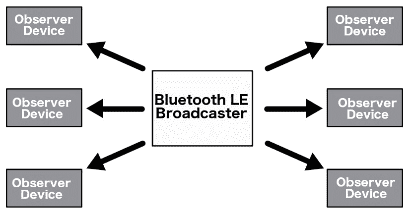
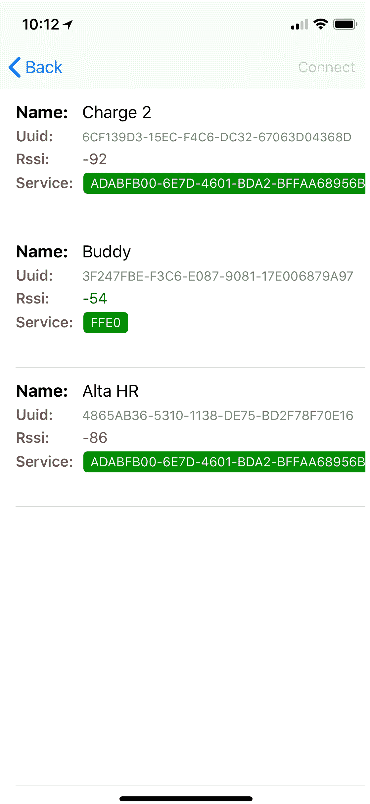

# 蓝牙 LE

在本书到目前为止的内容中，我们与 Arduino 项目之间的所有外部通信都是在封闭环境中进行的。所谓封闭环境，是指我们的项目仅仅接收来自遥控器的信息或指令，而没有从项目中传出任何信息。有许多用例需要将信息从我们的 Arduino 项目传输到外部设备，如智能手机或其他物联网设备。当有这种需求时，首先被提出的技术之一是 **蓝牙低功耗**，也称为 **蓝牙 LE** 或蓝牙智能。

在本章中，您将学习：

+   什么是蓝牙低功耗（Bluetooth LE）

+   蓝牙低功耗无线电的工作原理

+   什么是 GAP 配置文件

+   什么是 GATT 配置文件

+   如何使用 HM-10 蓝牙低功耗无线电模块与 Arduino 配合使用

# 简介

对于不熟悉这项技术的人来说，蓝牙 LE 最常见的误解之一是蓝牙 LE 是蓝牙经典的一个轻量级子集。这并不正确，因为蓝牙经典和蓝牙 LE 是两种基本不同的协议，具有不同的设计目标。

大多数无线技术，如 Wi-Fi 和蓝牙经典，都是为了满足广泛的用例而设计的；然而，蓝牙低功耗的设计略有不同。最初由诺基亚创建，被称为 **Wibree**，蓝牙低功耗的主要设计重点是创建一个具有可能最低功耗的无线电标准，并针对低成本、低复杂度和低带宽进行优化。

蓝牙低功耗规范于 2010 年 6 月作为蓝牙 4.0 核心规范的一部分发布。蓝牙核心规范由蓝牙 **特别兴趣小组**（**SIG**）监督和更新。

您可以从他们的网站 [`www.bluetooth.com`](https://www.bluetooth.com) 获取有关蓝牙的信息并下载规范；然而，由于超过 2500 页，我建议您阅读本章而不是蓝牙规范，除非您需要帮助治疗失眠。

蓝牙 LE 的采用率比大多数其他无线技术都要快。这其中的原因是移动行业采用了蓝牙 LE 标准，苹果和谷歌在 iOS 和 Android 操作系统中投入了大量精力，包括可靠的蓝牙 LE 堆栈，并为开发者开发了易于使用和理解的蓝牙 LE API。这使得开发者能够轻松创建和与具有蓝牙 LE 无线电的设备交互。

移动行业推动采用蓝牙 LE 的原因是，使用蓝牙 LE 连接的设备消耗的电量远低于其他无线技术，如蓝牙经典和 Wi-Fi，因此得名蓝牙低功耗。这导致他们的手机电池寿命更长，从而让客户更加满意。

蓝牙设备有三种类型，每种类型都支持蓝牙经典、蓝牙 LE 或两者兼而有之。以下图表显示了每种类型支持的内容：

| **设备类型** | **蓝牙经典支持** | **蓝牙 LE 支持** |
| --- | --- | --- |
| 预 4.0 蓝牙 | 是 | 否 |
| 单模 | 否 | 是 |
| 双模 | 是 | 是 |

虽然蓝牙 5.0 规格于 2016 年 6 月发布，但在本书撰写时，支持此新规范的 Arduino 蓝牙模块非常少。实际上，此时对蓝牙 4.1 或 4.2 规格的支持也非常有限；因此，在本书中，我们将专注于蓝牙 4.0 规格，并知道蓝牙 5.0、4.2 和 4.1 都与该标准向后兼容。

为了设计使用蓝牙 LE 的物联网设备，我们确实需要了解这项技术，以便我们知道何时实际使用它。因此，我们将比本书中其他技术更深入地探讨这项技术。我们将从查看无线电规格开始。

# 蓝牙 LE 无线电

由于本书中的所有项目都将使用蓝牙 LE 4.0，以下规格适用于此标准：

| **范围** | **最多 100 米** |
| --- | --- |
| 无线电频率 | 2.402 - 2.481 GHz |
| 无线电信道 | 40（37 个数据信道和 3 个广告信道） |
| 最大 OTA 数据速率 | 1 Mbit/s |
| 应用数据吞吐量 | 0.125 Mbit/s |
| 网络拓扑 | 点对点 |
| 网络标准 | IEEE 802.15.1 |

蓝牙 LE 的最大范围为 100 米，但这非常依赖于周围环境。当连接的设备在室内时，由于墙壁和其他障碍物，无线电信号需要穿过，范围将显著减小。通常，除非我们在开阔的田野中，否则我们不会看到接近 100 米的范围。即使如此，也很难达到 100 米的范围。

蓝牙 LE 无线电在超过 40 个信道上运行，频率范围从 2.402 GHz 到 2.481 GHz。在这些信道中，37 个用于数据，3 个用于广告。多个信道的原因是蓝牙 LE 使用跳频来减少干扰。三个广告信道用于设备的发现。一旦发现设备，就使用相同的信道来交换初始连接参数。一旦交换了连接参数，就使用常规数据信道进行通信。

下图显示了蓝牙 LE 使用的信道：


蓝牙低功耗（Bluetooth LE）的设计宗旨是在低功耗下运行，而避免使用电力的最佳方法就是尽可能频繁且尽可能长时间地关闭无线电。对于蓝牙低功耗来说，这是通过在特定频率下发送短数据包脉冲来实现的，而在这些无线电脉冲之间，无线电处于关闭状态。这通常被称为**空闲状态竞争**，因为无线电实际上是以尽可能快的速度发送信息，然后关闭一段时间。

我们为了蓝牙低功耗的低功耗使用而做出的最大牺牲是应用数据吞吐量。在之前的图表中，我们看到蓝牙低功耗无线电的最大空中数据速率是 1 兆比特/秒。然而，我们也列出了应用数据吞吐量为仅 0.125 兆比特/秒。这意味着无线电理论上每秒可以传输 1 兆比特；然而，由于对无线电施加的限制以节省电力，我们只有每秒 0.125 兆比特的最大传输速率。在实际应用中，我们实际上永远不会看到接近这个数据传输速率的任何东西。

让我们分析空闲状态竞争和蓝牙低功耗标准施加的限制，以了解为什么数据吞吐量如此低。首先，蓝牙低功耗规范定义了连接间隔，即两个连续连接事件（当两个设备交换数据时）之间的时间间隔，应在 7.5 毫秒到 4 秒之间。这意味着如果我们将连接间隔设置为可能的最短时间（7.5 毫秒），我们每秒将有 133 个连接事件。

无线电在每个连接事件中可以传输多达六个数据包，其中每个数据包可以包含最多 20 字节的用户数据。这意味着每个连接事件最多有 120 字节。

如果我们将所有这些信息综合起来，我们得到以下公式：


这表明最大数据吞吐量将是 0.125 兆比特/秒；然而，正如我们之前提到的，即使这个数字也永远不会达到，因为我们通常永远不会达到每包字节数的最大值或在一秒钟内有 133 个连接事件。设备本身还可以进一步限制连接间隔和数据包数量。在最佳情况下，我们通常每秒只能看到大约 5-10 千字节的数据吞吐量。这意味着我们通常只有在需要交换短数据脉冲时才使用蓝牙低功耗技术，而在需要交换大量数据或进行数据流传输时则避免使用。

现在我们来看看蓝牙低功耗连接的网络拓扑。

# 网络拓扑

蓝牙低功耗设备可以通过广播或已建立的连接与其他蓝牙低功耗设备进行通信。每种方法都有其自身的优缺点。我们将首先查看设备通过广播进行通信时的网络拓扑。对于本章的项目，我们将专注于通过已建立的连接交换数据，但了解如何通过广播交换数据也是有益的。因此，我们将在本介绍部分涵盖它。

# 蓝牙低功耗广播

下图展示了广播网络的网络拓扑：



在广播时定义了两个角色：

+   **广播者**：此设备在设定的时间间隔内向任何正在监听的设备发送非连接性广告数据包

+   **观察者**：此设备扫描广播频率以接收广播设备发送的非连接性广告数据包

广播数据是设备向多个设备发送数据的唯一方式。标准的广播数据包可以携带 31 字节的数据负载，通常用于描述广播者和其能力。然而，它也可以包含我们希望向其他设备广播的任何自定义信息。蓝牙低功耗还支持一个可选的第二广告负载，称为**扫描响应**，它可以包含额外的 31 字节数据。

如果我们希望向多个设备传输少量数据，广播既快又简单；然而，数据没有安全性和隐私性。通常，安全性是避免使用广播数据包的最大原因。然而，避免使用广播数据包的另一个重要原因是观察者没有能力向广播者发送任何数据。

现在让我们来看看蓝牙低功耗（LE）连接

# 蓝牙低功耗连接

下图展示了蓝牙连接的工作原理：


与蓝牙低功耗广播拓扑结构类似，连接拓扑也定义了两个角色：

+   **中心设备**：中心设备通常是一个如笔记本电脑、平板电脑或手机等设备。这些设备将扫描广告频道并监听可连接的广告数据包。当发现设备时，中心设备可能会尝试与该设备建立连接。连接建立后，中心设备管理时间并启动数据交换。中心设备可以连接多个外围设备。

+   **外围设备**：外围设备通常是一个如智能手表、气象站或医疗设备等设备。这些设备会定期发送可连接的广告数据包并接受传入的连接。一旦建立连接，外围设备通常会遵循中心设备的时间安排，并在中心设备请求时交换数据。外围设备只能连接到一个中心设备。

外设通常会在中央设备发现它并请求连接之前进行广播。一旦建立连接，外设将停止广播，然后两个设备可以交换数据。在这种拓扑结构中的数据交换是双向的，外设和中央设备都可以发送和接收数据。

当中央设备和外设建立连接时，传输和接收的数据是以称为**服务和特性**的单位组织的。我们将在本章稍后查看**通用属性配置文件**（**GATT**）时进一步探讨这一点。现在要理解的是，蓝牙低功耗外设可以拥有多个特性，这些特性用于发送和接收数据。这些特性被组织或分组到服务中。

建立蓝牙低功耗连接的最大优势是可以有多个特性来组织你的数据，并且每个特性都可能有自己的访问权限和描述性元数据。另一个优势是能够建立安全的加密连接。

在蓝牙 4.0 中，设备可以作为中央设备或外设，但不能同时作为两者。从蓝牙 4.1 开始，这种限制被取消，并且在新版本的蓝牙低功耗中，设备可以作为外设、中央设备或两者兼具。

现在，让我们看看蓝牙低功耗配置文件。

# 蓝牙低功耗配置文件

蓝牙低功耗（Bluetooth LE）定义了两种类型的配置文件。这些配置文件包括定义所有蓝牙低功耗设备所需的基本操作模式的配置文件（通用访问配置文件和 GATT）或用于特定用例的配置文件（健康设备配置文件和邻近配置文件）。在本章中，我们不会深入探讨这些配置文件的具体用例；然而，我们确实想看看**通用访问配置文件**（**GAP**）和通用属性配置文件（GATT）。我们将从查看 GAP 开始。

# 通用访问配置文件（GAP）

GAP 定义了设备如何相互交互以确保设备互操作性。它定义了蓝牙低功耗设备如何发现彼此、建立安全连接、终止连接、广播数据和设备配置。这是我们将在本章中涵盖的蓝牙低功耗堆栈的最低级别。

在本章的早期，我们看到了蓝牙低功耗设备可以处于两种状态之一。在广播拓扑中，设备可以是广播者（从设备）或观察者（主设备）。如果两个设备之间建立了连接，那么设备就变成了中央（主设备）或外设（从设备）。我们在这里引入了主设备和从设备这两个术语，以说明设备可能处于的状态。以下图表显示了不同的状态：


这两种类型的设备都是从空闲或待机状态开始的。这是设备重置时的初始状态。从机设备随后将成为广播者，它正在广播特定数据，让任何主设备知道它是一个可连接的设备以及它提供的服务。在空闲状态之后，主设备将开始扫描正在广播的从设备。当主设备收到广告时，它将向广播者发送扫描请求，从设备将回以扫描响应。这就是设备发现过程。

在设备发现过程之后，如果主设备想要连接到广播设备，它将发起一个连接。在发起连接时，主设备将指定连接参数。一旦连接建立，设备将扮演主从角色。在蓝牙低功耗（BLE）4.0 中，从机设备只能有一个主设备。此外，在蓝牙低功耗（BLE）4.0 中，设备可以充当主设备或从设备，但不能同时充当两者。在蓝牙规范的后续版本中，这些限制已被取消。我知道我们在这本书中已经提到过几次，但在开发您的设备时，这一点很重要。

我们提到过，在发起连接时，主设备指定连接参数的数量。其中一些参数包括：

+   **连接间隔**: 在蓝牙低功耗（BLE）中，使用跳频方案，通信的两个设备最清楚在哪个信道上传输/接收，何时切换信道以及何时建立连接。连接尝试之间的时间间隔称为连接间隔。

+   **从机延迟**: 从机延迟允许从机设备选择跳过一定数量的连接事件。从机设备不得跳过超过此参数定义的连接事件数量。

+   **监督超时**: 监督超时是两次成功连接事件之间的最大时间间隔。如果超过这个时间，设备将终止连接，从机设备将回到未连接状态。

在决定将这些参数设置为什么值时，有许多考虑因素。主要考虑因素是功耗和数据吞吐量。随着吞吐量的增加，设备将消耗更多电力。例如，如果我们降低连接间隔，从而增加每秒的连接尝试次数，设备的功耗将增加，因为无线电将在更多的时间内开启。通过减少从机延迟，无线电同样会开启更多。因此，它也会增加功耗。在处理蓝牙低功耗（BLE）无线电时，您需要平衡项目的功耗需求与数据吞吐量需求。没有适用于所有类型设备的神奇比例；这是您需要根据每个项目逐一考虑的事情。

在本章的示例项目中，我们将展示如何使用 AT 命令调整蓝牙低功耗模块的各种设置。现在让我们来看看 GATT 配置文件。

# 通用属性（GATT）配置文件

虽然 GAP 配置文件定义了蓝牙低功耗设备的低级（广播和连接）交互，但 GATT 配置文件定义了设备交换数据的细节。GATT 也是所有基于属性配置文件的参考框架，这些配置文件定义了特定的用例，例如心率血压配置文件。

与 GAP 配置文件一样，GATT 配置文件定义了两个角色。这些角色是客户端和服务器。当你查看这个工作原理的图示时，这些角色可能一开始看起来有点奇怪；然而，一旦我们了解了蓝牙低功耗设备如何交换数据，它就会更有意义。GATT 配置文件中的客户端角色对应于 GAP 配置文件中的主角色，而 GATT 配置文件中的服务器角色对应于从角色。以下图示说明了这一点：


在这个图中，我们可以看到一个客户端可以有多个服务器；然而，每个服务器只能有一个客户端。在 GATT 配置文件中，客户端（GAP 中的中心角色）从服务器（GAP 中的外围设备）请求信息。当我们展示 GATT 和 GAP 角色之间的关系时，值得注意的是，GATT 和 GAP 角色实际上是相互独立的，并且在蓝牙低功耗规范的后续版本中，一个设备可以同时充当中心和外围设备。

GATT 配置文件定义的最小数据实体是属性。属性是位于服务器上的可寻址信息块，客户端可以访问并可能修改它。每个属性都由一个**UUID**（**全球唯一标识符**）唯一标识，该标识符可以是 16 位或 128 位数字。这个标识符被称为句柄。

GATT 配置文件定义了一组与所有属性关联的权限。权限指定可以对每个属性执行哪些操作。这些权限包括：

+   **访问权限**：访问权限指定可以对属性执行哪些操作。每个属性都将具有以下权限之一：

    +   **无**：客户端无法读取或写入属性

    +   **可读**：客户端可以读取属性

    +   **可写**：客户端可以写入属性

    +   **可读和可写**：客户端可以读取和写入属性

+   **加密**：加密权限确定客户端访问属性所需的加密级别

    +   **无加密**（安全模式 1，级别 1）：不需要加密

    +   **未认证加密**（安全模式 1，级别 2）：连接必须加密；然而，加密密钥不需要进行认证

    +   **认证加密**（安全模式 2，级别 2）：连接必须加密，加密密钥必须经过认证

+   **授权**：授权权限决定用户是否需要授权才能访问属性

    +   **无需授权**：访问属性无需授权

    +   **需要授权**：访问属性需要授权

GATT 定义了一个严格的层次结构，用于组织属性。属性被分组到服务中，其中每个服务可以包含零个或多个特性。这些特性可以包括零个或多个描述符。服务、特性和描述符都是 GATT 服务器中的属性。

下图显示了层次结构：


服务用于将相关属性分组到一个公共实体中。每个服务都有一个唯一的 UUID，可以是 16 位用于官方采用的服务类型，也可以是 128 位用于自定义服务类型。

您可以在蓝牙 SIG 网站上查看官方采用的服务列表，请点击此处：[`www.bluetooth.com/api/silentlogin/login?return=http%3a%2f%2fwww.bluetooth.com%2fspecifications%2fgatt%2fservices`](https://www.bluetooth.com/api/silentlogin/login?return=http%3a%2f%2fwww.bluetooth.com%2fspecifications%2fgatt%2fservices).

如果您查看心率服务，您会看到该服务包含三个特性。

特性是数据的容器，其中每个特性封装一个单一的数据点。与服务类似，特性通过 16 位或 128 位 UUID 进行标识。特性是蓝牙 LE 客户端与服务器交互的主要入口点。

您可以在蓝牙 SIG 网站上找到官方采用的特性列表，请点击此处：[`www.bluetooth.com/specifications/gatt/characteristics`](https://www.bluetooth.com/specifications/gatt/characteristics).

每个特性的访问权限应该是只读或只写。具有读写权限的特性非常罕见。例如，如果我们想为我们的蓝牙 LE 设备创建一个简单的串行接口，我们会创建一个具有只读权限的 TX 特性来传输数据，以及一个具有只写权限的 RX 特性来接收数据。我们不会创建一个同时具有读写权限的单个特性，因为当客户端向其写入数据时，服务器可能会覆盖它。

描述符用于向客户端设备提供有关特性和其值的附加信息。

您可以在蓝牙 SIG 网站上找到官方采用的描述符列表，请点击此处：[`www.bluetooth.com/specifications/gatt/descriptors`](https://www.bluetooth.com/specifications/gatt/descriptors).

通常，服务器只是简单地响应客户端对特性的数据请求；然而，服务器也可以通过使用服务器发起的更新来启动通信。有两种类型的服务器发起的更新，它们是：

+   **通知**：当服务器配置为通知客户端特性值已更改，但不期望客户端确认通知时，使用特性值更改通知。在本章的所有项目中，通知都已被打开；然而，它仅在第一个和第三个项目中使用。

+   **指示**：当服务器配置为向客户端指示特性值已更改并期望客户端确认它已收到指示时，使用特性值更改指示。

现在我们对蓝牙低功耗及其工作原理有了非常基本的了解，让我们看看本章我们将使用的 HM-10 蓝牙模块。

# HM-10 蓝牙模块

HM-10 是一个基于 TI CC2530 或 CC2541 蓝牙 **SOC**（**片上系统**）的蓝牙 4.0 模块。HM-10 是 Arduino 非常流行的蓝牙 4 模块，这主要归功于其低廉的成本和易用性。HM-10 为蓝牙层提供标准串行连接。这允许一个非常直接的接口；然而，它也隐藏了实际的蓝牙低功耗层。

在 第二十一章 的 *蓝牙经典* 中，当我们查看 HC-05 蓝牙模块时，你会注意到 HC-05 和 HM-10 之间的接口使用相同的串行接口；然而，了解蓝牙低功耗和蓝牙经典技术之间的区别将有助于你决定在你的项目中使用哪种技术。

我们可以使用 AT 命令来控制该模块，我们将在本章的项目部分查看如何操作。以下照片显示了 HM-10 蓝牙模块的外观：


HM-10 模块有六个引脚。然而，我们只对中间的四个感兴趣，它们是：

+   **VCC**：连接到 Arduino 的 3.3V 电源输出

+   **GND**：连接到 Arduino 的地线

+   **TX**：发送引脚，连接到 Arduino 的一个数字引脚

+   **RX**：接收引脚，连接到 Arduino 的一个数字引脚

现在，让我们看看本章我们将要进行的项目的所有组件。

# 需要的组件

对于这些项目，你需要以下物品：

+   一块 Arduino Uno 或兼容板

+   一个 HM-10 蓝牙 4.0 模块

+   一个 DHT-11 温度传感器

+   一个 LED

+   一个 4.7K 欧姆电阻

+   一个 3.3K 欧姆电阻

+   一个 1.1K 欧姆电阻

+   一个 330k 欧姆电阻

+   跳线

+   面板

您需要在您的手机/平板电脑或电脑上安装一个蓝牙 LE 应用程序。我在手机上使用的是*BTCommander – Serial port HM10*应用程序([`itunes.apple.com/us/app/btcommander-serial-port-hm10/id1312640906?mt=8`](https://itunes.apple.com/us/app/btcommander-serial-port-hm10/id1312640906?mt=8))。还有许多其他应用程序，例如 Android 的*nRF connect*应用程序([`play.google.com/store/apps/details?id=no.nordicsemi.android.mcp&hl=en_US`](https://play.google.com/store/apps/details?id=no.nordicsemi.android.mcp&hl=en_US))和 iOS([`itunes.apple.com/us/app/nrf-connect/id1054362403?mt=8`](https://itunes.apple.com/us/app/nrf-connect/id1054362403?mt=8))。

# 电路图

在本章中，我们将进行三个项目。第一个项目将是一个简单的串行通信项目，通过蓝牙无线电将文本从 Arduino 发送到另一个设备，并从另一个设备发送回 Arduino。我们还将展示如何在第一个项目中配置蓝牙无线电。对于第二个项目，我们将展示如何远程切换 LED 的开关。对于最后一个项目，我们将构建一个迷你气象站，通过蓝牙无线电远程读取温度。每个项目都将包含其自身的接线图；然而，如果您希望一次性连接所有硬件，以下图示显示了所有连接方式：


与之前的图示相比，这个图示可能一开始看起来比较复杂；然而，如果我们将其分解为三个部分，它实际上并不复杂。第一部分是 DHT-11 温度传感器，位于面包板的右侧。第二部分是 LED，位于面包板的中心。第三和最后一部分是 HM-10 蓝牙模块，位于面包板的左侧。

我们已经在第九章“环境传感器”中介绍了 DHT-11 温度传感器的接线，以及在第四章“基本原型”中介绍了 LED 的接线。因此，这里我们将重复解释。

要将 HM-10 蓝牙模块连接到 Arduino，**VCC**引脚连接到面包板上的电源轨，该电源轨连接到 Arduino 的 5V 电源输出。蓝牙模块上的**GND**引脚连接到面包板上的地轨，该地轨连接到 Arduino 的地线引脚。蓝牙模块上的**RX**引脚直接连接到 Arduino 的数字**引脚 10**。

将蓝牙模块上的 **TX** 引脚连接到 Arduino 是有一点不同的。为此，我们想确保电压不超过 3.3V。因此，我们使用一个简单的分压器。分压器是一个简单的电路，可以将较大的电压转换为较小的电压。为此，我们使用两个电阻，一个 1.1K 和一个 3.3K。这两个电阻串联连接，其中 3.3K 电阻的一端连接到地，1.1K 电阻的一端连接到 Arduino 的数字 **引脚 11**。**TX** 引脚连接在这两个电阻之间。

# 项目 1 – 串行通信

对于这个第一个项目，我们只将使用 HM-10 蓝牙模块和 Arduino。您需要按照前面的电路图将蓝牙模块连接到 Arduino。以下图示显示了这一点：


现在我们需要编写代码来访问蓝牙模块。我们将使用 `SoftwareSerial` 库与 HM-10 蓝牙 LE 模块进行接口。这个库是为了允许在除了引脚 0 和 1 之外的其他数字引脚上进行串行通信而开发的。如果您使用的是 Uno 以外的板，这个库可能会有局限性。您可以参考文档（[`www.arduino.cc/en/Reference/softwareSerial`](https://www.arduino.cc/en/Reference/softwareSerial)）以查看您的板是否有任何限制。

代码需要从包含 `SoftwareSerial` 头文件开始，然后初始化 `SoftwareSerial` 类的一个实例。我们还想在从串行监视器发出新命令时添加新行。因此，我们将定义一个布尔变量，每当收到新命令时将其设置为 true（这将使在串行监视器中读取响应变得更容易）。以下代码将执行此操作：

```cpp
#include <SoftwareSerial.h>
SoftwareSerial HM10(10, 11); // RX | TX
bool addNewLine = false;
```

在创建 `SoftwareSerial` 类的实例时，您需要定义用于接收（**RX**）和发送（**TX**）数据的引脚。第一个值是 `RX` 引脚，第二个值是 `TX` 引脚。

接下来，我们需要初始化串行监视器和 `SoftwareSerial` 实例。我们将在 `setup()` 函数中这样做。我们还想让用户知道应用程序何时准备好接受命令或连接。以下代码显示了 `setup()` 函数的代码：

```cpp
void setup()
{
  Serial.begin(9600);
  HM10.begin(9600);
  Serial.println("Connected to HM-10\.  Try connecting from any device or 
  issue AT commands");
}
```

当我们启动串行监视器和 `SoftwareSerial` 接口时，我们需要定义波特率。HM-10 蓝牙模块和串行监视器都使用 9600 波特率进行通信。一旦一切启动，串行监视器上会显示一条消息，告知用户一切正常。

在 `loop()` 函数中，我们需要将用户输入到串行监视器中的任何内容写入蓝牙模块，并将从蓝牙模块接收到的任何内容写入串行监视器。以下代码显示了 `loop()` 函数：

```cpp
void loop() 
{ 
  if (Serial.available()) { 
    HM10.write(Serial.read()); 
    addNewLine = true; 
  } 

  if (HM10.available()) { 
    if (addNewLine) { 
      Serial.write("\r\n"); 
      addNewLine = false; 
    } 
    Serial.write(HM10.read()); 
  }  
}
```

在这个函数中，我们使用串行监视器和`SoftwareSerial`类型的实例上的`available()`函数来检查任一设备是否有可读数据。如果有，我们读取数据并将其写入另一个设备。在读取串行监视器并写入`SoftwareSerial`实例的部分，我们将`addNewLine`布尔变量设置为 true，这样下次我们写入串行监视器时，我们将写入一个回车符和新行。在从蓝牙模块读取并写入串行监视器的部分，我们检查`addNewLine`布尔变量是否为`true`，如果是，我们在将`addNewLine`变量设置为`false`之前，向串行监视器写入一个回车符和新行。

我们可以使用此应用程序的两种方式。第一种是将**AT**（**注意**）命令输入到串行监视器中，这使您能够获取/设置蓝牙模块的配置设置并控制模块。第二种是使用手机上的蓝牙 LE 应用程序读取和写入蓝牙模块的值。让我们首先看看 AT 命令。 

要向蓝牙 LE 模块发送 AT 命令，运行前面的代码块，然后打开串行监视器，它是 Arduino IDE 的一部分。一旦一切启动，你将在监视器中看到`已连接到 HM-10。尝试从任何设备连接或发出 AT 命令`的消息。这表明模块已准备好，一切已启动。一旦看到消息，在输入框中输入`at`，然后点击发送按钮或按*Enter*键。你应该从蓝牙模块看到`OK`响应。输出应该如下所示：


要发送 AT 命令，您将使用以下格式：

```cpp
Set item: AT+{command}{new setting}
Query item: AT+{command}?
```

要设置项目，你输入字母`AT`，然后是加号（`+`），命令和新的设置，中间没有空格。例如，要将蓝牙模块广播的名称设置为“Buddy”，我们会发出以下命令：

```cpp
at+nameBuddy
```

**注意**：AT 命令不区分大小写。

要查询项目，我们输入字母`AT`，然后是加号（`+`），命令，然后是问号（`?`）。例如，要查询蓝牙模块正在广播的名称，我们会使用以下命令：

```cpp
at+name?
```

我们可以使用我们刚刚编写的应用程序从串行监视器手动设置配置，或者我们可以通过使用`SoftwareSerial`库中的`print()`函数在应用程序内部设置配置，如下所示：

```cpp
HM10.print("AT+Name?\r\n");
```

让我们看看一些常用的命令。这些命令可以从串行监视器或代码中像我们刚才展示的那样使用。

# 测试命令

| **命令** | **响应** | **参数** | **描述** |
| --- | --- | --- | --- |
| `AT` | OK | 无 | 这是一个测试命令，可以用来测试与蓝牙模块的连接。 |

# 查询软件版本

| **命令** | **响应** | **参数** | **描述** |
| --- | --- | --- | --- |
| `AT+VERR` | 版本号 | 无 | 此命令将返回模块的固件版本号。 |

# 恢复出厂默认

| **命令** | **响应** | **参数** | **描述** |
| --- | --- | --- | --- |
| `AT+RENEW` | `OK+RENEW` | 无 | 恢复出厂默认设置。 |

# 重启模块

| **命令** | **响应** | **参数** | **描述** |
| --- | --- | --- | --- |
| `AT+RESET` | `OK+RESET` | 无 | 重启蓝牙模块。 |

# 查询 MAC（媒体访问控制）地址

| **命令** | **响应** | **参数** | **描述** |
| --- | --- | --- | --- |
| `AT+ADDR?` | `OK+ADDR:{MAC 地址}` | 无 | 此命令可用于查询蓝牙无线电的 MAC 地址。 |

# 设置名称

| **命令** | **响应** | **参数** | **描述** |
| --- | --- | --- | --- |
| `AT+NAME{参数}` | `OK+set{参数}` | 无 | 此命令将设置模块的名称。 |

# 查询名称

| **命令** | **响应** | **参数** | **描述** |
| --- | --- | --- | --- |
| `AT+NAME?` | `OK+NAME{参数}` | 无 | 此命令将返回模块的名称。 |

# 设置广告间隔

| **命令** | **响应** | **参数** | **描述** |
| --- | --- | --- | --- |
| `AT+ADVI{参数}` | `OK+Set:{参数}` | `0`: 100ms`1`: 152.5 ms`2`: 211.25 ms`3`: 318.75 ms`4`: 417.5 ms`5`: 546.25 ms`6`: 760 ms`7`: 852.5 ms`8`: 1022.5 ms`9`: 1285 ms`A`: 2000 ms`B`: 3000 ms`C`: 4000 ms`D`: 5000 ms`E`: 6000 ms`F`: 7000 ms | 此命令将设置蓝牙低功耗模块的广告间隔。参数应为 0-F。 |

# 查询广告间隔

| **命令** | **响应** | **参数** | **描述** |
| --- | --- | --- | --- |
| `AT+ADVI?` | `OK+get:{参数}` | 无 | 此命令将检索当前广告间隔，并将返回 0-f 的参数。 |

# 设置广告类型

| **命令** | **响应** | **参数** | **描述** |
| --- | --- | --- | --- |

| `AT+ADTY{参数}` | `OK+set:{参数}` | `0`: 广告扫描响应，可连接`1`: 仅允许在 1.28 秒内连接最后设备`2`: 仅允许广告和扫描响应`3`: 仅允许广告 | 此命令将设置广告类型。 |

广告类型。 |

# 查询广告类型

| **命令** | **响应** | **参数** | **描述** |
| --- | --- | --- | --- |
| `AT+ADTY?` | `OK+get:{参数}` | 无 | 此命令将检索当前广告类型，并将返回 0-3 的参数。 |

# 设置波特率

| **命令** | **响应** | **参数** | **描述** |
| --- | --- | --- | --- |
| `AT+BAUD{参数}` | `OK+set:{参数}` | `0`: 9600`1`: 19200`2`: 38400`3`: 57600`4`: 115200`5`: 4800`6`: 2400`7`: 1200`8`: 230400 | 此命令将设置蓝牙模块的串行接口波特率。 |

# 查询波特率

| **命令** | **响应** | **参数** | **描述** |
| --- | --- | --- | --- |
| `AT+BAUD?` | `OK+get:{参数}` | 无 | 此命令将检索当前波特率，并将返回 0-8 的参数。 |

# 设置特征 ID

| **命令** | **响应** | **参数** | **描述** |
| --- | --- | --- | --- |
| `AT+CHAR{参数}` | `OK+set:{参数}` | `0x0001` -> `0xFFFe` | 此命令将设置特征的 ID。 |

# 设置服务 ID

| **命令** | **响应** | **参数** | **描述** |
| --- | --- | --- | --- |
| `AT+UUID{参数}` | `OK+set:{参数}` | `0x0001` -> `0xFFFe` | 此命令将设置服务的 ID。 |

# 查询服务 ID

| **命令** | **响应** | **参数** | **描述** |
| --- | --- | --- | --- |
| `AT+UUID?` | `OK+get:{参数}` | None | 此命令将检索当前服务 ID。 |

# 设置角色

| **命令** | **响应** | **参数** | **描述** |
| --- | --- | --- | --- |
| `AT+ROLE{参数}` | `OK+set:{参数}` | `0`: 边缘设备`1`: 中心设备 | 此命令将设置蓝牙模块的角色。 |

# 查询角色

| **命令** | **响应** | **参数** | **描述** |
| --- | --- | --- | --- |
| `AT+ROLE?` | `OK+get:{参数}` | None | 此命令将返回蓝牙模块的角色。 |

# 清除最后连接设备

| **命令** | **响应** | **参数** | **描述** |
| --- | --- | --- | --- |
| `AT+CLEAR` | `OK+CLEAR` | None | 清除最后连接设备的地址。 |

**注意**：`at+clear`命令仅在设备处于中心模式时使用。

# 尝试连接到最后一次连接的设备

| **命令** | **响应** | **参数** | **描述** |
| --- | --- | --- | --- |
| `AT+CONNL` | `OK+CONN{参数}` | `L`: 连接中`E`: 连接错误`F`: 连接失败`N`: 无地址 | 此命令将尝试连接到最后一次成功连接的设备。 |

**注意**：`at+connl`命令仅在设备处于中心模式时使用。

# 尝试连接到地址

| **命令** | **响应** | **参数** | **描述** |
| --- | --- | --- | --- |
| `AT+CON{参数}` | `OK+CONN{参数}` | `A`: 连接`E`: 连接错误`F`: 连接失败 | 此命令将尝试连接到指定地址的设备。 |

**注意**：`at+con`命令仅在设备处于中心模式时使用。

# 设置 PIN 码

| **命令** | **响应** | **参数** | **描述** |
| --- | --- | --- | --- |
| `AT+PASS{参数}` | `OK+set:{参数}` | `000000` -> `999999` | 设置连接的 PIN 码。 |

# 查询 PIN 码

| **命令** | **响应** | **参数** | **描述** |
| --- | --- | --- | --- |
| `AT+PASS?` | `OK+get:{参数}` | None | 此命令将返回当前的 PIN 码。 |

# 设置模块功率

| **命令** | **响应** | **参数** | **描述** |
| --- | --- | --- | --- |
| `AT+POWE{参数}` | `OK+set:{参数}` | `0`: -23db`1`: -6db`2`: 0db`3`: 6db | 设置模块的功率。 |

# 查询模块功率

| **命令** | **响应** | **参数** | **描述** |
| --- | --- | --- | --- |
| `AT+POWE?` | `OK+get:{参数}` | None | 此命令将返回当前模块的功率。 |

# 设置配对模式

| **命令** | **响应** | **参数** | **描述** |
| --- | --- | --- | --- |
| `AT+TYPE{参数}` | `OK+set:{参数}` | `0`: 不需要 PIN 码`1`: 无 PIN 码认证`2`: 有 PIN 码认证`3`: 有 PIN 码配对 | 此命令设置连接到此设备所需的认证。 |

# 查询配对模式

| **命令** | **响应** | **参数** | **描述** |
| --- | --- | --- | --- |
| `AT+TYPE?` | `OK+get:{parameter}` | None | 此命令将返回连接到此设备所需的当前认证。 |

# 设置通知信息

| **命令** | **响应** | **参数** | **描述** |
| --- | --- | --- | --- |
| `AT+NOTI{parameter}` | `OK+set:{parameter}` | `0`: 不通知`1`: 通知 | 此命令启用或禁用设备连接或断开时的通知。 |

# 查询通知信息

| **命令** | **响应** | **参数** | **描述** |
| --- | --- | --- | --- |
| `AT+NOTI?` | `OK+get:{parameter}` | None | 此命令将返回设备在连接或断开时是否会发送通知。 |

当没有其他设备连接到蓝牙模块时，我们才能向蓝牙模块发出 AT 命令。一旦设备连接，我们编写的应用程序代码将接管，并且输入到串行控制台的数据将发送到连接的设备。让我们看看从另一个设备连接到蓝牙模块时会发生什么。我将使用*BTCommander – Serial Port HM10*应用程序来展示这是如何工作的。

在 Arduino 上运行应用程序后，在你的手机/平板电脑或电脑上启动蓝牙应用程序。*BTCommander*应用程序看起来如下所示：


要连接到设备，请按下位于应用程序右上角的蓝色连接按钮，它看起来像一个电源插座。按下按钮后，你应该会看到应用程序可以连接到的设备列表。此屏幕看起来如下所示：



此屏幕显示所有正在广播且足够接近以连接的设备。在本章早期，当我们运行`AT+nameBuddy`命令时，我们将我们的设备重命名为`Buddy`。因此，我们知道这是我们想要连接的设备。如果我们点击该设备，然后点击应用程序右上角的连接按钮，应用程序将尝试连接。如果连接尝试成功，并且蓝牙模块上的`AT+NOTI`设置启用了通知，我们应该在串行控制台中看到以下截图所示的`OK+CONN`：


连接成功后，应用程序将返回主屏幕。现在让我们在屏幕底部的输入框中输入一条消息。例如，在这里我们将输入一个简单的`hello`消息，如下所示：


输入消息后，按下看起来像纸飞机的输入框旁边的按钮以发送消息。如果消息成功发送，我们将在以下截图所示的串行控制台中看到它：


这里发生的情况是，在应用程序中输入的消息正从手机应用程序传递到 HM-10 蓝牙模块上的特征，因此我们的应用程序可以读取它。消息是逐个字符发送的。

要发送回消息，请在串行控制台输入框中输入消息并按发送按钮。如果消息发送成功，我们应该在以下截图所示的应用程序中看到它：


在此截图中，我们可以看到从应用程序发送了 `hello` 消息，并且从连接的设备接收到了 `Hello from Arduino`。当从 HM-10 蓝牙模块向手机应用程序发送消息时，应用程序将消息写入特征（一次一个字符），蓝牙模块使用通知来通知客户端（手机应用程序）有新数据。

如果我们在 *BTCommander* 应用程序中再次按下连接按钮以断开连接，并且将 `AT+NOTI` 配置设置为通知，我们将在串行控制台中看到如下截图所示的 `OK+LOST` 消息：


现在，让我们看看我们如何使用蓝牙模块从我们的手机控制一个 LED。

# 项目 2 – 控制 LED

在这个项目中，我们将根据手机输入打开或关闭连接到 Arduino 的 LED。我们首先需要做的是将 LED 添加到我们的电路中。以下图示显示了新的电路：


LED 通过一个 330 欧姆电阻连接到 Arduino 的数字 5 引脚。现在我们需要编写代码来控制 LED。我们将首先为蓝牙模块设置 `SoftwareSerial` 库并定义 LED 连接的引脚。以下代码将执行此操作：

```cpp
#include <SoftwareSerial.h>
#define LED_PIN 5
SoftwareSerial HM10(10, 11);
```

我们可以看到蓝牙模块连接到与上一个示例相同的引脚，LED 连接到 Arduino 的数字引脚 5。在 `setup()` 函数中，我们需要配置 `SoftwareSerial` 实例以及 LED 连接的引脚模式。以下代码显示了此示例的 `setup()` 函数：

```cpp
void setup()
{
  pinMode(LED_PIN, OUTPUT);
  digitalWrite(LED_PIN, LOW);
  Serial.begin(9600);
  HM10.begin(9600);
  Serial.println("Connected to HM-10");
}
```

此代码首先定义了 LED 连接的引脚模式。然后配置了串行监视器的串行端口和 `SoftweareSerial` 实例。最后，我们在串行控制台中打印一条消息，让用户知道一切已配置并准备就绪。

在我们的 `loop()` 函数中，我们需要检查 `SoftwareSerial` 实例，如果从连接的设备接收到 `1`，则 LED 会打开，如果接收到 `0`，则 LED 会关闭。如果没有接收到 `1` 或 `0`，则忽略输入。以下是 `loop()` 函数的代码：

```cpp
void loop()
{
  if (HM10.available()) {
    char val = HM10.read();
    if(val == '1') {
      digitalWrite(LED_PIN, HIGH);
    } else if(val == '0') {
      digitalWrite(LED_PIN, LOW);
    }
  }
}
```

在此代码中，我们检查蓝牙模块是否有可用值，如果有，我们读取设备以获取接收到的字符。如果字符等于`1`（字符 1，而不是数字 1），我们将连接 LED 的引脚拉高以打开 LED。如果字符等于`0`（字符 0，而不是数字 0），我们将连接 LED 的引脚拉低以关闭 LED。

现在让我们运行这个应用程序，并使用*BTCommander*应用程序来连接它。从*BTCommander*应用程序，如果我们发送`1`，LED 将点亮，如果我们发送`0`，LED 将熄灭。这种类型的示例可以用于我们希望手机应用程序控制连接到 Arduino 的某些设备，如 LED、直流电机或某些传感器。

现在让我们看看如何通过蓝牙低功耗从 DHT-11 传感器检索温度和湿度数据。

# 项目 3 - 环境传感器

在这个项目中，我们将从手机请求 Arduino 发送温度或湿度信息，具体取决于发送的字符。我们需要将 DHT-11 传感器添加到我们的电路中。以下图表显示了如何进行：


DHT-11 温度传感器连接到 Arduino 的方式与我们第九章中所述的*环境传感器*相同。如果您不确定如何将此传感器连接到 Arduino，请参阅该章节。现在我们需要编写代码，以便我们可以通过蓝牙低功耗服务访问传感器的数据。我们将首先为蓝牙模块和 DHT-11 温度传感器设置`SoftwareSerial`库。以下代码将执行此操作：

```cpp
#include <DHT.h>
#include <SoftwareSerial.h>

#define DHT_PIN 3
#define DHT_TYPE DHT11
DHT dht(DHT_PIN, DHT_TYPE);

SoftwareSerial HM10(10, 11); // RX | TX
```

此代码包括 DHT 温度传感器的库以及`SoftwareSerial`设备。然后它定义了连接到温度传感器的引脚和传感器的类型。最后，它创建了`DHT`和`SoftwareSerial`类型的实例。

在`setup()`函数中，我们需要配置`SoftwareSerial`实例和连接到 LED 的引脚的模式。以下代码显示了我们的示例的`setup()`函数：

```cpp
void setup()
{
  Serial.begin(9600);
  HM10.begin(9600);
  Serial.println("Connected to HM-10");
}
```

此函数配置`SoftwareSerial`实例，并在一切启动并准备就绪时向串行控制台打印一条消息。在`loop()`函数中，我们将想要从连接到服务的设备读取输入，然后使用适当的信息进行响应。

以下图表显示了输入以及应该返回的内容：

| **输入** | **返回属性** |
| --- | --- |
| `f` | 华氏度温度 |
| `c` | 摄氏度温度 |
| `h` | 湿度 |
| `F` | 华氏度热指数 |
| `C` | 摄氏度热指数 |

从图表中，我们可以看到我们将有五个输入，每个输入将返回不同的信息给远程设备。让我们看看读取输入并返回所需信息的代码：

```cpp
void loop()
{
  if (HM10.available()) {
    char val = HM10.read();
    if(val == 'f') {
      float fahreheit = dht.readTemperature(true);
      HM10.println(fahreheit);
    } else if(val == 'c') {
      float celsius = dht.readTemperature();
      HM10.println(celsius);
    } else if(val == 'h') {
      float humidity = dht.readHumidity();
      HM10.println(humidity);
    } else if(val == 'F') {
      float fahreheit = dht.readTemperature(true);
      float humidity = dht.readHumidity();
      float hif = dht.computeHeatIndex(fahreheit, humidity);
      HM10.println(hif);
    } else if(val == 'C') {
      float celsius = dht.readTemperature();
      float humidity = dht.readHumidity();
      float hic = dht.computeHeatIndex(celsius, humidity, false);
      HM10.println(hic);
    }
  }
}
```

此代码首先检查蓝牙适配器，看是否有可用输入，如果有，则读取字符。如果输入字符是之前图表中列出的字符之一，代码将从 DHT-11 传感器检索适当的值，并将该值返回给连接的设备。

在*BTCommander* iOS 应用中的代码输出将类似于以下内容：


我们在这里展示的所有内容都与蓝牙 LE 4.0 及以上版本兼容。截至本书编写时，市场上真正与新的蓝牙 LE 4.2 和 5.0 标准兼容的低成本蓝牙 LE 模块并不多，这就是为什么我们坚持使用 4.0。好消息是所有新的标准都与 4.0 标准向后兼容，因此，随着与较新标准兼容的新蓝牙模块的发布，本章中讨论的所有内容都将正常工作。让我们看看较新蓝牙标准提供了哪些特性。

# 蓝牙 4.1、4.2 和 5.0 的新特性是什么？

在本节中，我们将探讨蓝牙 4.1、4.2 和 5.0 的新特性。虽然这些特性与我们在本章中使用的蓝牙 LE 4.0 模块不兼容，但最终将会有与这些标准兼容的 Arduino 蓝牙模块发布；因此，了解它们提供的特性是很有帮助的。

# 蓝牙 4.1

蓝牙 4.1 主要提供可用性更新。其中最重要的更新是允许蓝牙 LE 和 LTE 无线电更好地共存。此更新允许无线电协调传输以减少干扰的机会。它还使数据传输更高效，并在连接丢失后允许更好的重新连接。

蓝牙 4.1 的非可用性重大变化允许设备同时作为外围设备和中心设备。

# 蓝牙 4.2

蓝牙 4.2 为物联网、安全性、更快速度和更大容量提供了众多新特性。

对于物联网，蓝牙 4.2 增加了**蓝牙智能互联网网关**，这使得蓝牙 4.2 设备能够连接到互联网。通过互联网网关，蓝牙 4.2 还增加了 IPv6/6LoWPAN，这使得通过蓝牙连接支持 IPv6。

蓝牙 4.2 还通过 LE 隐私 1.2 增加了额外的安全性。蓝牙 4.2 的加密标准符合**联邦信息处理标准**（**FIPS**），这是一项美国政府计算机安全标准。

传输数据包大小增加了十倍。这允许更快、更可靠的数据传输。

# 蓝牙 5.0

蓝牙提供了一系列增强功能，将范围扩大了四倍，速度提高了两倍。但问题是，如果设备制造商增加了设备的范围，速度就会下降；同样，如果速度提高了，范围也会下降。

# 蓝牙网状网络

在最新的蓝牙技术中，我认为最令人兴奋的是蓝牙网状网络。所有之前的蓝牙技术都依赖于一对一或一对多的连接，其中始终有一个主/中心设备。网状技术允许蓝牙设备建立多对多的连接，这可以实现不依赖于中心控制器的大规模设备网络。当我们撰写这本书时，蓝牙网状技术仍处于起步阶段。然而，我相信它是蓝牙的未来，并且是一项值得关注的科技。

需要注意的是，对于高于 4.0 的蓝牙标准，大多数新特性都是可选的，并不要求完全实现。例如，制造商可能会说他们的设备符合蓝牙 4.2 标准。然而，IPv6/6LoWPAN 可能并未在设备中实现。一个很好的例子是 iPhone。我的 iPhone X 支持蓝牙 5.0；然而，它无法运行蓝牙网状网络或 IPv6/6LoWPAN。

# 挑战

对于这个挑战，请使用我们在第十三章中使用的 Nokia 5110 液晶显示屏和本章第一个项目使用的串行通信代码，打印从手机应用发送到液晶显示屏的任何消息。这需要对本章中的代码进行一些修改，以便使用液晶屏幕而不是串行控制台。

# 摘要

在本章中，我们学习了关于蓝牙 LE 的很多知识，从对无线电工作原理和蓝牙 LE 连接的网络拓扑的简要介绍开始。我们学习了蓝牙 LE 设备如何使用 GAP 来发现和连接到其他设备。我们还看到了 GATT 如何使用属性（服务、特性和描述符）使两台蓝牙 LE 设备能够相互通信。最后，我们在本章末尾通过三个项目展示了蓝牙 LE 的工作原理。

当我们希望使用外部设备，如手机，来控制我们正在构建的设备时，蓝牙低功耗（LE）是最适合的技术，因为几乎所有的智能手机都内置了蓝牙 LE，并且该技术易于使用。它也是当我们希望从一台设备向另一台设备发送短数据包时使用的好技术。如果您希望构建一个独立的设备，如遥控器，来控制主设备或传输大量数据，那么我建议使用另一种名为蓝牙经典或遗留的蓝牙技术，我们将在下一章中看到。
