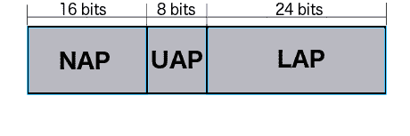
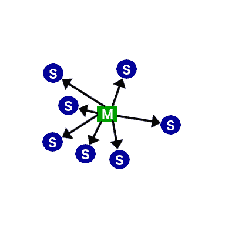
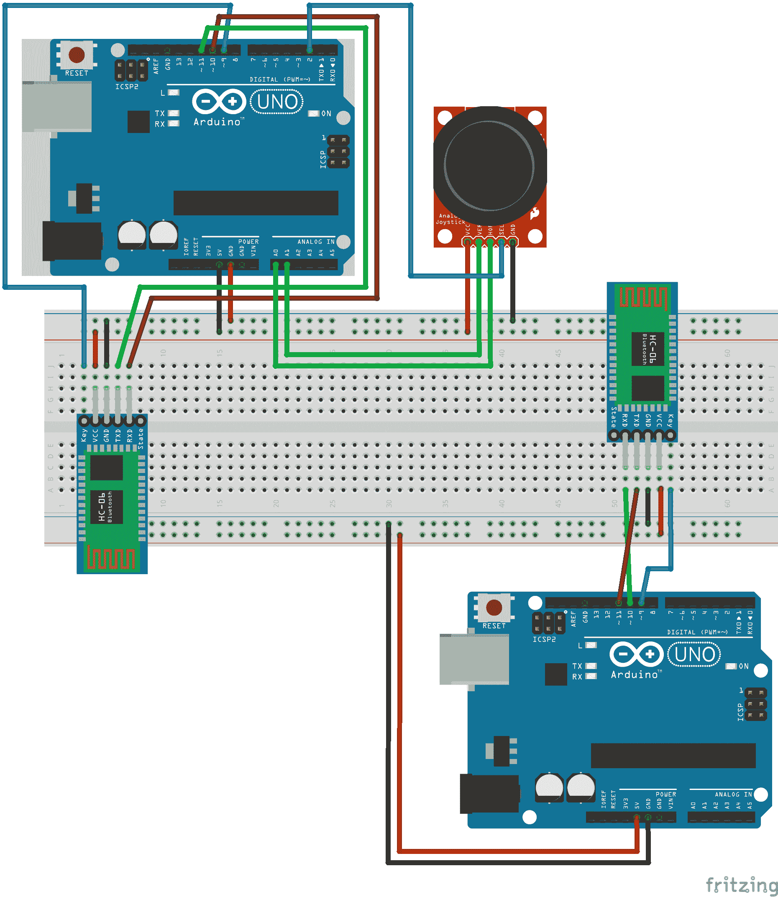
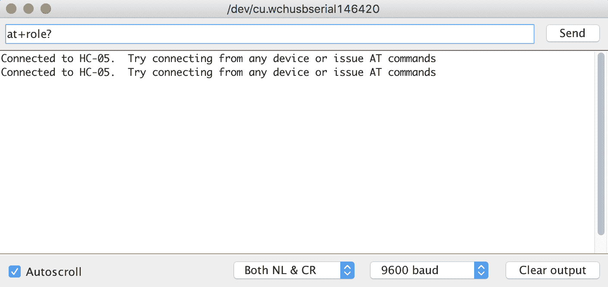
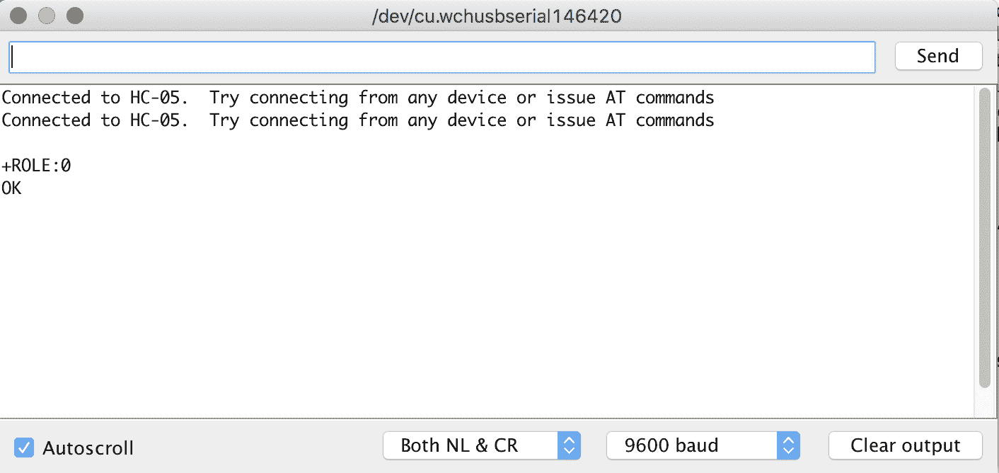
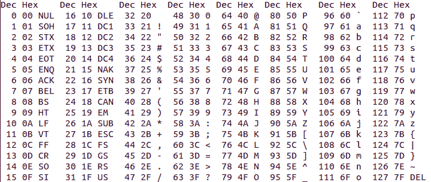
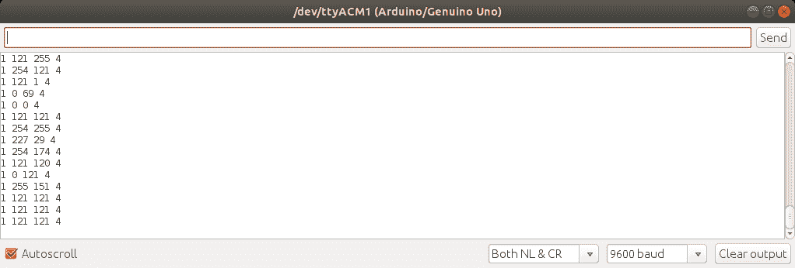

# 蓝牙经典

我们在第二十章中看到的蓝牙低功耗（*蓝牙低功耗*）是我们需要两个设备在短数据突发中无线通信且关注功耗时的一个优秀选择。随着蓝牙低功耗的 4.2 和 5.0 版本的出现，它发生了变化，这使得它对需要传输大量数据或甚至流式传输数据的设备更具吸引力。然而，还有一种蓝牙技术已经非常成功地做了很多年，这种技术被称为蓝牙经典。虽然名字可能意味着这项技术已经过时，但不要被名字所迷惑，因为蓝牙经典被用于许多蓝牙设备中，并且直到有更多支持一些新功能的 Arduino 蓝牙 5.0 模块可用，蓝牙经典在需要两个设备之间传输大量数据时仍将是一个优秀的选择。

在本章中，您将学习：

+   蓝牙经典版本号的意义

+   蓝牙无线电的工作原理

+   蓝牙网络的网络拓扑

+   如何使用 HC-05 蓝牙模块

# 简介

蓝牙是一种无线技术标准，两个设备使用 2.4GHz 无线连接在短距离内传输或接收数据。虽然蓝牙低功耗的设计目标是创建一个低功耗的无线协议，但蓝牙经典有不同的设计目标。蓝牙经典是由瑞典吕德的爱立信移动工程师创建的，作为一种无线替代串行（RS232）电缆。这意味着这个新协议将需要传输大量数据，甚至流式传输数据到短距离。

蓝牙经典规范由**蓝牙特殊兴趣集团**（**蓝牙 SIG**）管理，作为蓝牙核心规范的一部分。正如我们在第二十章中提到的*蓝牙低功耗*，您可以通过从蓝牙 SIG 网站[`www.bluetooth.com`](https://www.bluetooth.com)下载规范来找到有关蓝牙低功耗和蓝牙经典的信息。

起初，在介绍较新的技术（蓝牙低功耗 4.0）之前介绍较旧的技术（蓝牙经典）可能看起来有些奇怪。蓝牙低功耗首先被介绍的原因是您会发现它在您将使用 Arduino 创建的绝大多数项目中都是合适的，因为大多数项目都希望发送短数据突发，这正是蓝牙低功耗的设计目的。蓝牙低功耗也更容易与使用蓝牙低功耗的智能手机集成，因为每个智能手机操作系统都有一个易于使用且文档齐全的蓝牙低功耗 API，而蓝牙经典则不是这样。对于您想要在两个自定义设备之间流式传输数据或共享大量数据的情况，蓝牙经典可能更合适。

当你为项目购买蓝牙经典模块时，你将可以选择三种不同的蓝牙版本。这些版本是：

+   **蓝牙 2.0 + EDR**：该版本的核心理念于 2004 年发布。这次对蓝牙核心规格的更新包含了对蓝牙标准的多项小改进。唯一的重大改进是 **EDR**（**增强数据速率**），将数据传输速率从 1Mbits/sec 提高到 3Mbits/sec。该标准的名称为蓝牙 2.0 + EDR，这意味着 EDR 功能是可选的。我们将在本章中使用 HC-05 蓝牙模块，它是蓝牙 2.0 兼容的，这意味着它不包括 EDR 功能。对于你将用 Arduino 构建的绝大多数项目，蓝牙 2.0 兼容的模块将足够好，实际上更可取，因为我们能够避免蓝牙 2.1 中引入的安全配对功能。虽然新的配对功能可能被称为简单安全配对，但它通常需要人工交互来完成配对过程，而我们可能希望避免这种情况，因为许多 Arduino 项目没有进行这种输入的能力。

+   **蓝牙 2.1 + EDR**：该版本的核心理念于 2007 年发布。蓝牙核心规格的这次版本也对其前一个版本进行了多项改进，其中特色改进是引入了 **SSP**（**简单安全配对**）。SSP 对配对过程进行了彻底的改革，使其既简单又更安全。

+   **蓝牙 3.0 + HS**：该版本的核心理念于 2009 年发布。规格名称中的 HS 代表高速。蓝牙 3.0 + HS 的理论数据传输速度可达 24 Mbits/sec，然而数据不是通过蓝牙连接传输的。在高速模式下，数据实际上是通过 801.11（Wi-Fi）连接传输的。蓝牙链路仅用于协商和建立 Wi-Fi 连接。与蓝牙 2.X + EDR 规范一样，HS 功能是可选的，你将看到仅符合蓝牙 3.0 标准的设备。

与蓝牙 LE 一样，要真正理解何时使用蓝牙经典，我们需要了解这项技术本身，所以让我们更深入地探讨一下。

# 蓝牙无线电

蓝牙无线电的传输范围取决于类别。以下图表显示了不同类别蓝牙无线电的传输范围：

| **类别** | **功率（毫瓦）** | **功率（dBm）** | **范围（米）** |
| --- | --- | --- | --- |
| 1 | 100 | 20 | ~100 |
| 2 | 2.5 | 4 | ~10 |
| 3 | 1 | 0 | ~1 |

与任何无线电技术一样，无线电周围的环境对无线电的传输范围有重大影响。前一个图表中列出的范围是在理想条件下的理论最大范围。典型的范围通常小于这个理论最大范围。

在蓝牙 LE 无线电从 2,402 MHz 到 2,480 MHz 运行，每个信道间隔 2 MHz 的情况下，蓝牙经典无线电使用从 2,402 MHz 到 2,480 MHz 的 79 个信道，每个信道间隔 1 MHz。与蓝牙 LE 类似，蓝牙经典无线电使用跳频，无线电每秒改变信道 1,600 次，以减少干扰。

在蓝牙 LE 中，无线电持续关闭自身以减少功耗，蓝牙经典不这样做。这使得蓝牙 LE 无线电技术在低功耗的短数据突发方面表现更好，而蓝牙经典无线电在传输大量数据或数据流方面表现更好，因为无线电是持续开启的。

所有蓝牙设备都有一个独特的 48 位地址，由制造商分配给蓝牙无线电。地址的上半部分（最重要的 24 位）被称为**组织唯一标识符**，由两部分组成。这些部分是**非重要地址**（**NAP**）和**高地址部分**（**UAP**）。

NAP 是地址的前 16 位，用于跳频同步。UAP 是接下来的 8 位，由 IEEE 组织分配给无线电制造商。

地址的最后 24 位被称为**低地址部分**（**LAP**）。LAP 由制造商分配，以唯一标识无线电。以下图表显示了蓝牙地址的构成：



现在让我们看看蓝牙经典的网络拓扑。

# 网络拓扑

蓝牙经典 piconet 的拓扑结构与蓝牙 LE 网络的拓扑结构非常相似，其中一个设备充当主设备，其他设备充当主设备的从设备。在蓝牙经典 piconet 中，一个主设备可以有最多七个从设备，总共八个设备在 piconet 中。以下图表显示了蓝牙经典 piconet：



Piconets 可以与其他 piconets 交互，形成所谓的散射网。在散射网中，一个 piconet 的主设备在另一个 piconet 中充当从设备。这确实允许一个 piconet 中的设备与其他 piconet 中的设备共享数据；然而，这需要复杂的同步和带宽共享，使得这些网络更加复杂且效率较低。了解我们可以创建散射网是好的，但根据我的经验，这很少被使用。

蓝牙的内容远不止这里所描述的；然而，对于绝大多数用例，您将希望使用第二十章中描述的蓝牙低功耗（Bluetooth LE）。使用 Arduino 时，当我们想要连接两个设备并在它们之间传输数据时，我们会使用蓝牙经典。让我们看看我们如何通过三个项目来实现这一点。对于第一个项目，我们将配置蓝牙模块；在第二个项目中，我们将学习如何从蓝牙模块发送和接收数据；在第三个项目中，我们将看到如何从一个无线电流式传输数据到另一个无线电。我们将从查看这些项目所需的组件开始。

# 需要的组件

对于这些项目，您需要以下物品：

+   两个 Arduino Uno 或兼容板

+   两个 HC-05 蓝牙模块

+   一个用于 Arduino 的摇杆扩展模块

+   跳线

+   面包板

现在让我们看看我们项目的电路图。

# 电路图

在本章中，我们将为三个项目编写代码。在第一个项目中，我们将配置蓝牙模块；在第二个项目中，我们将创建一个应用程序，该应用程序将以字节格式从一台蓝牙无线电发送数据到另一台；在最后一个项目中，我们将把一个摇杆连接到一个 Arduino 上，并通过蓝牙连接将摇杆位置流式传输到另一个 Arduino。以下是我们项目的电路图：



这两个 Arduino 电路彼此完全隔离，因此它们不需要公共地线。两个 HC-06 蓝牙模块以相同的方式连接到 Arduino，其中 HC-06 蓝牙模块的 VCC 引脚连接到 5V 输出，GND 引脚连接到 Arduino 的地线输出。蓝牙模块的关键引脚连接到 Arduino 的数字 9 引脚，RX 引脚连接到数字 10 引脚，TX 引脚连接到数字 11 引脚。

我们希望将一个摇杆扩展模块连接到其中一个 Arduino 上。为此，我们需要将扩展板上的 VCC 引脚连接到 Arduino 的 5V 输出，并将 GND 引脚连接到 Arduino 的地线输出。我们将根据您的摇杆模块连接 SEK 或 SW 引脚到 Arduino 的数字 2 引脚。最后，我们将扩展板上的 HOR 或*x*轴引脚连接到 Arduino 的模拟 0 引脚，并将 VER 或*y*轴引脚连接到模拟 1 引脚。

现在，让我们开始我们的项目。

# 项目 1 – 配置蓝牙模块

要与 HC-05 蓝牙模块通信，我们将使用与第二十章中相同的 `SoftwareSerial` 库，即 *蓝牙低功耗*。用于通信的代码在 HM-10（蓝牙低功耗）和 HC-05（蓝牙经典）之间非常相似。这两款无线电如何传输和接收数据有很大不同，因此理解无线电的工作原理以及它们应该用于什么将决定何时使用不同的技术。

对于这个第一个项目，我们将编写一个应用程序，允许我们配置蓝牙模块。此代码将与我们之前使用的蓝牙低功耗代码完全一样，通过包含 `SoftwareSerial` 库并创建 `SoftwareSerial` 类型的实例。以下代码展示了如何做到这一点：

```cpp
#include <SoftwareSerial.h>
SoftwareSerial HC05(10, 11);
bool addNewLine = false;
```

第一行包含了 `SoftwareSerial` 库，第二行创建了这个类型的实例。最后一行的布尔变量将用于告诉应用程序何时在串行控制台中添加新行。

现在我们需要在 `setup()` 函数中添加代码来配置串行控制台和 `SoftwareSerial` 实例。以下代码展示了这个第一个项目的 `setup()` 函数：

```cpp
void setup()
{
  Serial.begin(9600);
  pinMode(9,OUTPUT);
  digitalWrite(9,HIGH);
  HC05.begin(38400);
  Serial.println("Connected to HC-05\.  Try connecting from any device or issue AT commands");
}
```

此代码首先使用波特率 `9600` 设置串行控制台，然后定义数字 9 脚将是一个输出脚并将其设置为高电平。数字 9 脚连接到 HC-05 的按键引脚。我们将此引脚拉高以启用蓝牙模块。然后我们使用波特率 `38400` 配置 `HC05` 类型的 `SoftwareSerial` 实例，并向串行控制台打印一条消息，告知用户一切已配置并准备就绪。

你会注意到，在这个第一个项目中，我们将 `SoftwareSerial` 实例的波特率设置为 `38400`，因为我们正在配置蓝牙模块。在接下来的两个项目中，我们将波特率设置为 `9600`，因为我们将在蓝牙模块之间发送和接收数据。

在 `loop()` 函数中，就像在蓝牙低功耗（BLE）代码中一样，我们将从蓝牙模块接收任何输入并将其打印到串行控制台，同时任何来自串行控制台的输入将通过蓝牙模块发送出去。以下代码将执行此操作：

```cpp
void loop()
{
  if (HC05.available())
  {
    if (addNewLine) {
      Serial.write("\r\n");
      addNewLine = false;
    }
    Serial.write(HC05.read());
  }

  if (Serial.available())
  {
    HC05.write(Serial.read());
    addNewLine = true;
  }
}
```

在这个函数中，我们首先使用 `available()` 函数检查是否有来自 `HC05` `SoftwareSerial` 实例（蓝牙模块）的数据可用。如果有数据可用，我们会检查是否需要向串行控制台添加新行，通过检查 `addNewLine` 布尔变量。如果需要添加新行，我们将回车和换行符写入串行控制台，并将 `addNewLine` 布尔变量设置为 `false`。然后我们将从蓝牙模块接收到的数据写入串行控制台。

接下来，我们检查串行控制台是否有任何可用数据，也使用`available()`函数，如果有，我们将该数据写入蓝牙模块，然后将其传输到连接的设备。我们还设置`addNewLine`布尔变量为 true，这样下次从连接的设备接收数据时，我们将在串行控制台添加回车符和换行符。

在我们将 Arduino 插入并运行此代码之前，我们需要将 HC-05 蓝牙模块设置为配置模式。为此，我们需要按住蓝牙模块上的按钮，然后将 Arduino 插入电脑，为蓝牙模块供电。只需几秒钟，蓝牙模块上的灯就会开始非常缓慢地闪烁；灯亮两秒钟，然后熄灭两秒钟。一旦灯开始闪烁，我们可以松开按钮，蓝牙模块就准备好配置了。

要配置蓝牙模块，我们将发出与蓝牙低功耗模块类似的 AT 命令。要发送 AT 命令，您将使用以下格式：

```cpp
Set item: AT+{command}{new setting}
Query item: AT+{command}?
```

要设置一个项目，您输入字母 AT，然后是加号，命令和新的设置，中间没有空格。例如，要将蓝牙模块的角色设置为从属角色，我们将发出以下命令：

```cpp
at+role0
```

**注意**：AT 命令不区分大小写。

要查询项目，我们将输入字母`at`，然后是加号，命令，然后是问号。例如，要查询蓝牙模块的角色，我们将使用以下命令：

```cpp
at+role?
```

要发出命令，我们将在串行控制台上的输入框中输入命令，然后按*Enter*键。我们需要将串行控制台设置为添加 NL（换行符）和 CR（回车符）。以下截图显示了如何发出 AT 命令：



在我们输入`at+role?`命令后，我们按*Enter*键或发送按钮来将命令发送到蓝牙模块。蓝牙模块将响应查询结果，如下面的截图所示：



在我们配置模块之前，让我们看看我们可以向 HC-05 蓝牙模块发出的某些命令。

# 测试命令

| **命令** | **响应** | **参数** | **描述** |
| --- | --- | --- | --- |
| `AT` | `OK` | 无 | 这是一个测试命令，可以用来测试与蓝牙模块的连接。 |

# 重置命令

| **命令** | **响应** | **参数** | **描述** |
| --- | --- | --- | --- |
| `AT+RESET` | `OK` | 无 | 此命令将重置蓝牙模块。 |

# 查询固件

| **命令** | **响应** | **参数** | **描述** |
| --- | --- | --- | --- |
| `AT+VERSION?` | `+VERSION:<Param>` | 无 | 返回 HC-05 蓝牙模块上的固件版本。 |

# 恢复出厂设置

| **命令** | **响应** | **参数** | **描述** |
| --- | --- | --- | --- |
| `AT+ORGL` | `OK` | 无 | 将 HC-05 蓝牙模块恢复到默认设置。 |

# 查询模块地址

| **命令** | **响应** | **参数** | **描述** |
| --- | --- | --- | --- |
| `AT+ADDR?` | `+ADDR:<Param>` | 无 | 返回 HC-05 蓝牙模块的地址。 |

# 设置/查询模块模式

| **命令** | **响应** | **参数** | **描述** |
| --- | --- | --- | --- |
| `AT+ROLE?` | `+ROLE:<Param>` | `0` 从机`1` 主机 | 查询 HC-05 蓝牙模块的角色。 |
| **命令** | **响应** | **参数** | **描述** |
| `AT+ROLE=<Param>` | `OK` | `0` 从机`1` 主机 | 设置 HC-05 蓝牙模块的角色。 |

# 设置/查询 UART 参数

| **命令** | **响应** | **参数** | **描述** |
| --- | --- | --- | --- |
| `AT+UART?` | `+UART:<Param1>, <Param2>, <Param3>` | `Param1` = 波特率`Param2` = 停止位`Param3` = 奇偶校验 | 查询 UART 参数。 |
| **命令** | **响应** | **参数** | **描述** |
| `AT+UART=<Param1>, <Param2>, <Param3>` | `OK` | `Param1` = 波特率`Param2` = 停止位`Param3` = 奇偶校验 | 设置 UART 参数。 |

# 设置/查询连接模式

| **命令** | **响应** | **参数** | **描述** |
| --- | --- | --- | --- |
| `AT+CMODE?` | `+UART:<Param>` | `0` 连接到固定地址`1` 连接到任何地址`2` 从机环回 | 查询 HC-05 蓝牙模块的连接模式。 |
| **命令** | **响应** | **参数** | **描述** |
| `AT+CMODE=<Param>` | `OK` | `0` 连接到固定地址`1` 连接到任何地址`2` 从机环回 | 设置 HC-05 蓝牙模块的连接模式。 |

# 设置/查询绑定地址

| **命令** | **响应** | **参数** | **描述** |
| --- | --- | --- | --- |
| `AT+BIND?` | `+BIND:<Param>` | 无 | 查询模块配置的绑定地址。 |
| **命令** | **响应** | **参数** | **描述** |
| `AT+BIND=<Param>` | `OK` | 固定地址 | 设置要绑定的地址。 |

现在我们已经看到了大多数 AT 命令，让我们配置两个蓝牙模块。我们需要将一个蓝牙模块配置为主机，另一个配置为从机。为了下一两个项目的目的，我将连接到摇杆的同一 Arduino 的蓝牙模块配置为从机。然而，这并非必要，任何模块都可以是主机或从机。

让我们从配置从设备开始。为此，将一个 Arduino 连接到计算机，运行本节开头编写的应用程序，然后运行下一几段中将要概述的命令。

我们首先想要做的是向蓝牙模块发送测试 `AT` 命令。模块应该返回一个 `OK` 消息。如果你没有收到任何响应，请检查串行控制台是否已配置为发送 NL 和 CR。如果你收到错误响应，请再次尝试发送 `AT` 命令。

现在我们确信串行监视器和蓝牙模块正在通信，我们想要查看此模块当前的 UART 设置。为此，发送`AT+UART?`命令。在本章的示例中，我们将假设 UART 设置为 9600 波特率，0 停止位，0 奇偶校验。如果您的模块不是这样配置的，请发出以下命令：

```cpp
AT+UART=9600,0,0
```

我们接下来想要做的是将设备的角色设置为从角色。为此，我们发出以下命令：

```cpp
AT+ROLE=0
```

最后，我们想要检索这个蓝牙模块的地址。以下命令将检索地址：

```cpp
AT+ADDR?
```

确保记下地址，因为我们将在配置主设备时使用它。

我们运行以配置从模块的命令如下：

| **命令** | **响应** |
| --- | --- |
| `AT` | `OK` |
| `AT+UART?` | `+UART:9600,0,0`（如果不是，设置为这个值） |
| `AT+ROLE=0` | `OK` |
| `AT+ADDR?` | `+ADDR:{address}` |

现在让我们配置主设备。为此，将另一个 Arduino 连接到计算机（记住在给模块供电时按住按钮），运行本节开头编写的代码，并发出下几段中将要讨论的命令。

就像从设备一样，我们首先想要做的是向蓝牙模块发出`AT`命令。模块应该返回一个`OK`消息。如果你没有收到任何响应，请检查确保串行控制台已配置为发送 NL 和 CR。如果你收到错误响应，请再次发出`AT`命令。

现在，我们想要查看模块的 UART 设置。为此，发送`AT+UART?`命令。在本章的示例中，我们将假设 UART 设置为 9600 波特率，0 停止位，0 奇偶校验。如果您的模块不是这样配置的，请发出以下命令：

```cpp
AT+UART=9600,0,0
```

我们接下来想要做的是将设备的角色设置为主角色。为此，我们发出以下命令：

```cpp
AT+ROLE=1
```

现在，我们将想要将连接模式设置为连接到固定地址（模式 0）。为此，发出以下命令：

```cpp
AT+CMODE=0
```

由于我们要告诉蓝牙模块连接到一个固定的地址，因此我们需要提供它需要连接的从设备地址。

要这样做，发出以下命令：

```cpp
AT+BIND=????,??,??????
```

问号是从设备的地址。当我们查询从设备的地址时，地址以冒号分隔返回，例如`98d3:31:300e42`。在`BIND`命令中输入地址时，地址需要以逗号分隔，例如`98d3,31,300e42`。

我们用来配置主设备的命令如下：

| **命令** | **响应** |
| --- | --- |
| `AT` | `OK` |
| `AT+UART?` | `+UART:9600,0,0`（如果不是，设置为这个值） |
| `AT+ROLE=1` | `OK` |
| `AT+CMODE=0` | `OK` |
| `AT+BIND=????,??,??????`（问号是从设备的地址） | `OK` |

现在如果我们通过重新供电来重置两个设备，两个蓝牙模块应该会连接。首先，在从设备上重新供电，你会看到 LED 快速闪烁。然后，在主设备上重新供电，一旦两个设备连接，两个设备上的 LED 都会快速闪烁两次，然后关闭两秒钟，然后重复。这个灯光序列表明两个设备已经连接。

如果设备没有连接，最常见的一个错误就是在`AT+BIND`命令中输入了错误的地址。我会首先通过运行`AT+BIND?`命令来检查，并验证地址是否正确。如果地址正确，那么通过运行`AT+CMODE?`和`AT+ROLE?`命令来验证`AT+CMODE`和`AT+ROLE`命令是否正确执行。现在我们已经将两个蓝牙模块连接起来，让我们继续进行项目二。

# 项目 2 – 串行连接，发送数据

对于这个项目，为了看到数据从一个设备传输到另一个设备，你需要两台计算机。一台连接到主设备，另一台连接到从设备。如果你没有两台计算机，仍然值得阅读这一部分，以了解我们正在创建的协议，因为我们将在第三个项目中使用相同的协议。

当我们在传输数据或发送大量可变长度的数据时，我们需要一种方式来告诉接收设备新消息的开始和结束位置。幸运的是，我们有内置的 ASCII 代码可以实现这一点。`0x01` **SOH**（**标题开始**）和`0x04` **EOT**（**传输结束**）代码可以用来告诉接收设备消息的开始和结束。

在这个项目和下一个项目中，我们将定义的协议是：当接收设备接收到`0x01` ASCII 字符时，它会知道一个新的消息已经开始。当它接收到`0x04` ASCII 字符时，它会知道消息已经结束，并且`0x01`和`0x04`字符之间的所有内容都是消息本身。

如果你不太熟悉 ASCII 代码，以下图表显示了 ASCII 表：



事实上，当我们通过两个蓝牙经典设备之间传输字符数据时，我们实际上是在发送 ASCII 代码。例如，如果我们发送单词“Dog”，我们实际上在发送三个字节数据，分别是`0x44`（D），`0x111`（o），和`0x67`（g）。根据我们定义的协议，如果我们发送单词 Dog，我们会发送五个字节数据，因为我们需要以`0x01`字符开始，以`0x04`字符结束。我们将发送的五个字节将是`0x01`，`0x44`，`0x111`，`0x67`和`0x04`。

现在我们来看一下在两个蓝牙模块之间发送和接收消息的代码。此代码将在主设备和从设备上运行。我们将首先在项目中包含`SoftwareSerial`库，并创建一个`SoftwareSerial`类型的实例。以下代码执行此操作：

```cpp
#include <SoftwareSerial.h>
SoftwareSerial HC05(10, 11);// RX | TX
bool newMessage = true;
```

第一行在项目中包含`SoftwareSerial`库，下一行创建一个`SoftwareSerial`类型的实例。第三行创建一个全局变量，用于定义何时开始新消息。

现在我们需要在`setup()`方法中配置串行控制台和`HC05` `SoftwareSerial`实例。以下代码将执行此操作：

```cpp
void setup()
{
  Serial.begin(9600);
  pinMode(9,OUTPUT);
  digitalWrite(9,HIGH);
  HC05.begin(9600);
  Serial.println("Connected to HC-05\. ");
}
```

在此代码中，我们首先配置串行控制台，波特率为 9600。然后定义数字 9 脚将作为输出脚，并将其设置为高电平。数字 9 脚连接到 HC-05 蓝牙模块的按键引脚。我们将此引脚拉高以启用它。我们使用波特率为 9600 配置`HC05`类型的`SoftwareSerial`实例，并在串行控制台上打印一条消息，告知用户一切已配置就绪，准备开始。

`loop()`函数需要监控串行控制台和`HC05` `SoftwareSerial`实例，以接收新数据。如果它从串行控制台接收到新数据，它需要通过蓝牙模块将其发送出去，如果它从蓝牙模块接收到新数据，它需要在串行控制台上显示这些数据。以下代码执行此操作：

```cpp
void loop()
{
  if (HC05.available())
  {
    byte val = HC05.read();
    Serial.write(val);
    if (val == 0x04)
    {
      Serial.write("\r\n");
    }
  }
  if (Serial.available())
  {
    if (newMessage)
    {
      HC05.write(0x01);
      newMessage = false;
    }
    char val = Serial.read();
    if (val == '~')
    {
      HC05.write(0x04);
      newMessage = true;
    }
    else
    {
      HC05.write(val);
    }
  }
}
```

在此函数中，我们检查`HC05` `SoftwareSerial`实例是否有任何可用数据，如果有，它将被读取到`val`变量中。然后将`val`变量写入串行控制台。然后我们检查`val`变量是否等于`0x04`，如果是，我们在串行控制台上写入一个回车符和换行符，因为这条特定的消息已经结束。

现在我们检查串行控制台是否有任何可用数据，如果有，我们检查是否开始了一个新消息，通过检查`newMessage`变量是否等于`true`。如果`newMessage`变量等于`true`，我们将一个`0x01`字符写入`HC05` `SoftwareSerial`实例，并将`newMessage`变量设置为`false`。然后我们从串行控制台读取字符，并检查它是否等于波浪号（`~`）字符。我们将使用波浪号字符来指定消息已结束，因此当用户输入波浪号时，我们将写入`0x04`字符到`HC05` `SoftwareSerial`实例，并将`newMessage`变量设置为`true`，因为这条特定的消息已经结束。如果字符不等于波浪号，我们将字符写入`SoftwareSerial`实例。

现在如果我们在这两个主从设备上运行此代码，无论我们在一个设备的串行控制台上输入什么，都会通过蓝牙模块传输到另一个设备。消息将继续打印在串行控制台的一行上，直到用户输入波浪号（~）表示消息的结束。

互相传输文本是好的，但正如我们在第二十章中看到的，我们可以使用蓝牙低功耗（Bluetooth LE）来做这件事，*蓝牙低功耗*。让我们通过将 Arduino 摇杆模块连接到其中一个设备并将摇杆位置流式传输到另一个设备来做一些更有用的事情。

# 项目 3 – 摇杆遥控

如果你还没有将摇杆扩展模块连接到 Arduino 之一，你需要在开始此项目之前完成连接。一旦摇杆扩展模块连接到 Arduino，我们将编写代码来读取摇杆的位置并将其通过 HC-05 蓝牙模块传输到另一个 Arduino；然而，在我们这样做之前，我们需要弄清楚我们将要使用的协议。

对于这个例子，我们将使用与上一个项目相同的协议，其中消息以`0x01`字节开始，以`0x04`字节结束，而中间的一切都是消息本身。消息本身将包含两个字节，一个表示摇杆的*x*位置，另一个表示*y*位置。因此，一个完整的传输将包含总共四个字节，如下所示：

```cpp
0x01 - Start of header
0xDD - X position (221 decimal)
0xDD - Y position (221 decimal)
0x04 - End of transmission
```

现在我们有了将摇杆位置从一块 Arduino 传输到另一块的协议，让我们开始编写将在连接摇杆扩展模块的 Arduino 上运行的代码。摇杆的位置是通过连接到它的两个模拟引脚读取的。我们还需要将连接到数字 2 引脚的 SEL 引脚设置为高电平。

在代码中，我们首先需要包含蓝牙模块的`SoftwareSerial`库，创建一个`SoftwareSerial`类型的实例，并定义摇杆模块连接到的引脚。以下代码将完成这项工作：

```cpp
#include <SoftwareSerial.h>
#define SW_PIN 2 // digital pin Joystick
#define BT_PIN 9 // digital pin Bluetooth
#define X_PIN 0  // analog pin
#define Y_PIN 1  // analog pin

SoftwareSerial HC05(10, 11);
```

在此代码中，我们定义摇杆的 SEL 引脚为数字 2 引脚，蓝牙模块上的按键引脚为数字 9 引脚，*x*和*y*轴为模拟 0 和 1 引脚。

在`setup()`函数中，我们需要将`SW_PIN`和`BT_PIN`都设置为高电平，并初始化串行控制台和`SoftwareSerial`实例。以下是`setup()`函数的代码：

```cpp
void setup()
{
  pinMode(BT_PIN,OUTPUT);
  digitalWrite(BT_PIN,HIGH);
  pinMode(SW_PIN,OUTPUT);
  digitalWrite(SW_PIN,HIGH);
  HC05.begin(9600);
  Serial.begin(9600);
  Serial.println("Connected to HC05.");
}
```

现在代码应该看起来很熟悉了。前四行初始化数字引脚并将它们拉高。接下来的两行初始化`SoftwareSerial`实例和串行控制台，波特率为 9600。最后，在串行控制台上打印一条消息，告知用户一切准备就绪。

在我们的`loop()`函数中，我们需要读取操纵杆的位置，然后将消息写入蓝牙模块。以下代码将执行此操作：

```cpp
void loop()
{
  int xpos = analogRead(X_PIN) / 4;
  int ypos = analogRead(Y_PIN) / 4;
  HC05.write(0x01);
  HC05.write(xpos);
  HC05.write(ypos);
  HC05.write(0x04);
  delay(500);
}
```

前两行读取操纵杆模块的*x*轴和*y*轴。当读取模拟引脚时，返回的值范围从 0 到 1024；然而，我们只想发送一个字节来表示操纵杆的位置。一个字节的范围可以从 0 到 255，因此我们将模拟读取的值除以`4`。

在我们获取操纵杆的*x*轴和*y*轴的值之后，我们需要将这些值通过蓝牙模块发送消息。接下来的四行代码写入`0x01`（SOH），*x*轴的值，*y*轴的值，最后是`0x04`（EOT）。消息发送后，我们暂停 500 毫秒，然后循环返回。

现在我们有了将在连接操纵杆的 Arduino 上运行的代码，我们需要编写将在接收数据的 Arduino 上运行的代码。此代码需要首先包含蓝牙模块的`SoftwareSerial`库，并创建一个`SoftwareSerial`类型的实例。我们还需要定义一个缓冲区，用于存储通过蓝牙模块传入的数据。以下代码将执行此操作：

```cpp
#include <SoftwareSerial.h>
#define MAXBUF 255
#define BT_PIN 9 // digital pin Bluetooth
SoftwareSerial HC05(10, 11);
byte buf[MAXBUF];
```

此代码首先包含`SoftwareSerial`库，然后定义输入缓冲区的最大大小，为`255`。虽然我们知道每条消息的大小为 4 个字节，但我们总是希望在缓冲区中留有额外空间，尤其是在无线通信中，以防消息在传输过程中出错。如果这是一个生产系统，我可能会将缓冲区的大小限制为 12 或 16 字节。

我们定义蓝牙模块上的按键引脚连接到 Arduino 的数字 9 号引脚。然后我们创建一个`SoftwareSerial`类型的实例和一个输入缓冲区的`byte`数组。

在`setup()`函数中，我们将初始化串行控制台和`SoftwareSerial`实例。我们还需要将蓝牙模块的按键引脚拉高。以下代码执行此操作：

```cpp
void setup()
{
  Serial.begin(9600);
  pinMode(BT_PIN,OUTPUT);
  digitalWrite(BT_PIN,HIGH);
  HC05.begin(9600);
  Serial.println("Connected to HC05");
}
```

现在在`loop()`函数中，我们希望持续读取蓝牙模块的输入，直到我们接收到 EOT（`0x04`）字节。当我们读取数据时，它将被存储在字节数组中，一旦读取到`0x04`字节，我们将打印出消息，然后循环返回。以下是`loop()`函数的代码：

```cpp
void loop()
{
  memset(buf, 0, MAXBUF);
  int counter = 0;
  while (counter < MAXBUF)
  {
    if (HC05.available())
    {
      byte val = HC05.read();
      buf[counter] = val;
      counter++;
      if (val == 0x04)
      {
        break;
      }
    }
  }
  for(int i=0; i<counter; i++)
  {
    Serial.print(buf[i]);
    Serial.print(" ");
  }
  Serial.println(" ");
}
```

此函数首先使用`memset()`函数将缓冲区初始化为零。然后我们创建一个整数变量，该变量将计算读取的字节数。

`while` 循环用于持续循环，直到读取到最大字节数。在 `while` 循环中，我们使用 `HC05` `SoftwareSerial` 实例的 `available()` 函数来查看蓝牙模块是否有可读取的值。如果有可读取的值，我们使用 `read()` 函数读取该值，将其存储在 `buf` 字节数组中，并增加计数器。然后我们检查读取的值是否等于 `0x04`，如果是，我们使用 `break` 语句跳出 `while` 循环。

最后，我们创建一个 `for` 循环，该循环将遍历缓冲区中的值并将它们打印到串行控制台。如果我们同时在两个 Arduino 上执行代码并移动摇杆，我们将看到类似于以下截图的输出：



如输出所示，每个消息都以 `0x01` 字节开始，以 `0x04` 字节结束。在这两个字节之间是摇杆在 *x* 轴和 *y* 轴上的位置。

我们知道数据包应该是四个字节长。在生产环境中，我们希望丢弃任何长度不是四个字节的消息，因为我们知道如果消息长度不是四个字节，那么消息在传输过程中可能已经损坏。

我们还可以使用校验和来确保消息被正确接收。校验和是使用发送的数据计算出的某个值。生成校验和的最简单方法之一是将所有数据字节相加，将值存储在一个字节中，当该值大于 255 时将导致值回绕。以下是一个生成校验和的函数示例：

```cpp
byte checksum(byte *bytes, int buf_size)
{
  byte checksum = 0;
  for (int i=0; i< buf_size; i++)
  {
    checksum += bytes[i];
  }
  return checksum;
}
```

此函数接受一个指向 `byte` 数组的指针和数组的大小作为参数。然后它遍历数组，将每个字节添加到校验和中，然后返回值。一个字节的最大值为 255，因此一旦值超过 255，值将回绕。例如，如果校验和字节值为 252，向其添加一个值为 10 的值，则校验和值将变为 7。然后我们可以在 `0x04` 值之前发送校验和，接收消息的设备可以通过在接收端计算校验和并验证两个值是否匹配来验证消息的完整性。

# 摘要

在本章中，我们学习了有关蓝牙经典的大量知识，从对无线电工作原理和蓝牙经典连接的网络拓扑的简要介绍开始。我们演示了如何配置蓝牙 HC-05 蓝牙模块作为从机和主机。我们还看到了如何配置蓝牙模块在启动时自动连接到彼此。最后，我们看到了如何使用蓝牙经典从一台设备向另一台设备传输数据。

在第二十章，“蓝牙低功耗”以及本章中，我们探讨了两种不同的蓝牙技术，但问题可能仍然在于何时使用哪一种。当我们有一个用例定义了我们需要一个设备定期向另一个设备请求信息，比如气象站时，我们通常希望使用蓝牙低功耗。当我们想要从一台设备向另一台设备传输数据而不需要等待接收设备请求时，我们通常希望使用蓝牙经典。

在这本书的整个过程中，我们从微控制器到传感器，从电机到无线通信模块，考察了许多不同的项目。我们的想法是让你接触到许多不同的项目，希望这能给你自己的项目带来灵感。关于 Arduino 最好的事情是，你做的项目只受限于你的想象力，所以开始想象你可以做哪些超级酷炫的项目，然后去创造它们。
