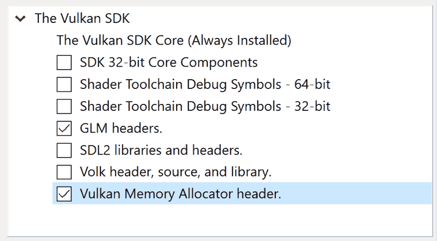

# 第一章：使用 Open Asset Import Library 进行工作

欢迎来到《精通 C++游戏动画》！你是一个那种看着电脑或控制台游戏中的动画模型，或者 3D 动画工具，并对自己提出问题的人吗？

> 这是怎么工作的？他们是怎么做到的？我自己也能做到吗？

如果是这样，这本书将指引你走向实现这一目标的方向。在接下来的 14 章中，你将学习如何创建自己的小游戏角色模型查看器。

本书从使用 Open Asset Import Library 加载文件开始，将导入库中的数据结构转换为更高效的渲染数据结构，并使用简单的 OpenGL 或 Vulkan 渲染器渲染角色模型。你还将学习如何通过将计算负载转移到 GPU 上的基于 GPU 的查找表和计算着色器来优化数据更新和渲染。

对于角色动画，你不仅将深入了解正常的动画混合，还将介绍基于状态的动画控制、添加动画混合以独立于身体其他部分移动头部，以及面部动画。你还将学习如何使用简化版的行为树来控制实例的行为，并在屏幕上的实例之间实现交互。

为了给游戏角色一个合适的家园，你将学习如何将游戏地图加载到应用程序中。在游戏地图中移动将通过添加碰撞检测、角色脚部的逆运动学以及简单的导航来增强，让实例能够在虚拟世界中完全自主地四处移动。

除了动画之外，还介绍了使用鼠标进行交互式选择、将配置保存到文件以允许在更大的虚拟世界中工作，以及处理虚拟世界中的不同摄像头等功能。此外，还将实现基于图形的、基于节点的配置，使你能够以非编程的方式更改实例的行为。

通过结合所有这些步骤，你虚拟世界中的虚拟角色将更接近真实的游戏角色。

加入我们的 Discord 社区


加入我们的社区 Discord 空间，与作者和其他读者进行讨论：[`packt.link/cppgameanimation`](https://packt.link/cppgameanimation)。

每一次旅程都始于第一步，所以欢迎来到第一章！本章将为动画应用程序奠定基础，因为你将了解如何将模型文件从你的电脑加载到程序中，在虚拟世界的浩瀚空虚中定位实例，并播放文件中包含的动画。到本章结束时，你的游戏角色模型将能够在屏幕上跳跃、奔跑或行走，可能周围围绕着非动画模型或其他静态对象。

在本章中，我们将涵盖以下主题：

+   游戏角色动画——入门

+   Open Asset Import Library 是什么？

+   加载模型文件

+   使用 Open File 对话框扩展 UI

+   动态添加和删除模型实例

由于本书将使用开源软件和平台无关的库，因此您应该能够在 Windows 和 Linux 上“即开即用”地编译和运行代码。您将在以下 *技术要求* 部分找到所需软件和库的详细列表，以及它们的安装说明。

# 技术要求

对于本章，您需要以下内容：

+   拥有 Windows 或 Linux 的 PC，以及本节后面列出的工具

+   Git 用于源代码管理

+   文本编辑器（如 Notepad++ 或 Kate）或完整的 IDE（如 Windows 的 Visual Studio 2022 或 Linux 的 Eclipse/KDevelop）

重要提示

编译代码需要最近版本的 C++ 编译器。在当前的 CMake 构建系统中，已配置为 C++17，但已知代码可以与更新的 C++ 标准兼容，包括但不限于 C++26（尽管编译器必须支持这些标准）。

现在，让我们获取这本书的源代码并开始解压代码。

## 获取源代码和基本工具

本书代码托管在 GitHub 上，您可以通过以下链接找到：

[`github.com/PacktPublishing/Mastering-Cpp-Game-Animation-Programming`](https://github.com/PacktPublishing/Mastering-Cpp-Game-Animation-Programming)

由于构建系统使用 Git 下载示例中使用的第三方项目，因此您需要安装 Git。

在 Linux 系统上，使用您的包管理器。对于 Ubuntu，以下行安装 Git：

```cpp
sudo apt install git 
```

在 Windows 上，您可以从这里下载 Git：[`git-scm.com/downloads`](https://git-scm.com/downloads)。

要解压代码，您可以使用以下两种方法中的任何一种。

### 使用 Git 获取代码

要获取书中的代码，您应该使用 Git。使用 Git 可以为您提供额外的功能，例如为您的更改创建本地分支，跟踪您的进度，并将您的更新与示例代码进行比较。此外，如果您在探索源代码或在实际章节末尾的实践环节中破坏了代码，您可以轻松地撤销更改。

您可以通过 Git GUI、在 Visual Studio 2022 中克隆存储库或在 CMD 中执行以下命令来在系统中的特定位置获取代码的本地签出：

```cpp
git clone https://github.com/PacktPublishing/Mastering-Cpp-Game-Animation-Programming 
```

请确保您使用没有空格或特殊字符（如重音符号）的路径，因为这可能会使某些编译器和开发环境产生混淆。

### 以 ZIP 文件形式获取代码

虽然推荐使用 Git，但您也可以从 GitHub 下载代码的 ZIP 文件。您需要将 ZIP 文件解压到系统上的某个位置。此外，请确保解压 ZIP 文件的路径中不包含空格或特殊字符。

在我们能够使用书中的代码之前，必须安装一些工具和库。我们将从 Windows 安装开始，然后是 Linux 安装。

## 安装 Windows 所需的工具和库

要在 Windows 机器上编译示例代码，我建议使用 Visual Studio 2022 作为 IDE，因为它包含了快速开始所需的所有内容。使用其他 IDE，如 Eclipse、Rider 或 KDevelop，也没有问题，因为构建由 CMake 管理，但您可能需要安装一个 C++ 编译器，如 MSYS2，以及编译器包作为附加依赖项。

### 在 Windows 上安装 Visual Studio 2022

如果您想使用 Visual Studio 处理示例文件但尚未安装，请从 [`visualstudio.microsoft.com/de/downloads/`](https://visualstudio.microsoft.com/de/downloads/) 下载免费的 Visual Studio 社区版。

然后，按照以下步骤操作：

1.  选择**使用 C++ 进行桌面开发**选项，以便将 C++ 编译器和其他所需工具安装到您的计算机上：


图 1.1：在 Visual Studio 2022 中安装 C++ 桌面开发

1.  然后，在**单独的组件**下，也勾选**C++ CMake 工具为 Windows**选项：


图 1.2：勾选 CMake 工具为 Windows 安装在 Visual Studio 2022 中的复选框

1.  完成 Visual Studio 的安装，启动它，并跳过初始项目选择屏幕。

### 在 Windows 上启用长路径名

当使用 Windows 10 或 11 的全新安装时，文件的路径最大长度为 260 个字符。根据包含本书代码的文件夹位置，Visual Studio 2022 可能会遇到由于临时构建文件夹路径超过 260 个字符限制而导致的错误。

要启用长路径名，需要调整**Windows 注册表**。一种简单的方法是创建一个具有 `.reg` 扩展名的文本文件，例如，`long-paths.reg`，并将以下内容复制到文件中：

```cpp
Windows Registry Editor Version 5.00
 [HKEY_LOCAL_MACHINE\SYSTEM\CurrentControlSet\Control\FileSystem]
 "LongPathsEnabled"=dword:00000001 
```

双击文件将自动启动**Windows 注册表编辑器**以将设置导入 Windows 注册表。通过单击**是**确认**UAC**对话框和以下警告对话框后，注册表编辑器将导入新设置。

现在，重新启动计算机以激活长路径名并继续安装。

### 下载 Open Asset Import Library

对于 Windows，Open Asset Import Library 必须从源文件构建和安装。如*图 1.3*所示，从 [`github.com/assimp/assimp`](https://github.com/assimp/assimp) 克隆仓库到一个新的 Visual Studio 2022 项目中：


图 1.3：在 Visual Studio 2022 中克隆资产导入 GitHub 仓库

作为替代，您可以从 Git Bash 或通过 Git GUI 创建克隆：

```cpp
git clone https://github.com/assimp/assimp 
```

### 配置构建

我们需要做一些调整来创建静态库而不是动态库。使用静态库使我们的构建过程更容易，因为我们不需要担心额外的 DLL 文件。

要更改 CMake 设置，在 `CMakeLists.txt` 文件上右键单击后选择以下选项：


图 1.4：更改资产导入器的 CMake 设置

在出现的 Visual Studio 2022 的 **配置** 选项卡中，将配置名称更改为 `x64-RelWithDebInfo`，并将配置类型更改为 `RelWithDebInfo`：


图 1.5：修改资产导入器的当前配置

使用 `RelWithDebInfo`，将创建一个带有调试信息的发布版本。编译器将优化生成的可执行文件，但文件仍然包含数据，以便在出现问题时允许调试程序。

接下来，在 CMake 设置中更改以下设置。您可以使用左下角的搜索字段，命名为 **Filter variables...**，来搜索指定的设置：

+   禁用构建共享库：


图 1.6：切换设置以创建静态库

+   更改 C 运行时的链接：


图 1.7：静态链接 C 运行时

+   移除库后缀以创建不带编译器版本的文件名：


图 1.8：移除创建的文件的后缀

接下来，在 `CMakeLists.txt` 文件的上下文菜单中选择 **Build** 和 **Install**。

安装完成后，将生成以下文件夹结构：


图 1.9：资产导入器库和包含文件

我们必须使本节中讨论的所有文件对书中的所有示例都可用。为此，有两种选择 - 将文件复制到固定路径或添加环境变量。

#### 复制 Assimp 文件

首先，在您的计算机上创建此文件夹：

```cpp
C:\Program Files\assimp 
```

然后，将两个文件夹 `lib` 和 `include` 复制进去：


图 1.10：两个文件夹已复制到 Program Files 文件夹

CMake 搜索脚本将尝试在此文件夹中查找 Assimp 的静态库和头文件。

#### 添加环境变量以帮助 CMake 查找文件

作为另一种解决方案，您可以在您的 PC 上创建一个文件夹，例如，到 `D:\assimp`。然后，将文件夹 `lib` 和 `include` 复制到该文件夹中，并将环境变量 **ASSIMP_ROOT** 设置为创建的文件夹位置：


图 1.11：环境变量 ASSIMP_ROOT 指向 PC 上的文件夹

*请记住，您必须在设置环境变量后重新启动 Visual Studio 2022。*

### 在 Windows 上安装 Vulkan SDK

对于 Vulkan 支持，你还需要安装 Vulkan SDK。在此处获取：[`vulkan.lunarg.com/sdk/home`](https://vulkan.lunarg.com/sdk/home)。

进行默认安装，并确保添加 **GLM 头文件** 和 **Vulkan 内存分配器头文件**，因为如果安装了 Vulkan SDK，CMake 搜索脚本将使用它们：



图 1.12：在 Vulkan SDK 安装过程中添加 GLM 和 VMA

在安装 Vulkan SDK 后，请确保重启 Visual Studio 2022，以便检测 Vulkan SDK 头文件和环境变量。

### 编译和启动示例代码

运行示例可以通过两种不同的方式完成：按照书中的示例逐个进行，或者一次性编译所有代码以浏览所有示例。

使用以下步骤编译代码：

1.  要打开示例项目，从 Visual Studio 2022 的启动屏幕中选择**打开本地文件夹**，或从 Visual Studio 2022 的**文件**菜单中选择**打开 CMake**，然后导航到要编译的示例代码所在的文件夹，或者如果您想一次性编译所有示例，则导航到示例代码的顶级文件夹。Visual Studio 将自动检测并为您配置所选文件夹中的 CMake。输出窗口的最后一行应如下所示：

    ```cpp
    1> CMake generation finished. 
    ```

1.  这确认了 CMake 文件生成的成功运行。

1.  现在，通过右键单击`CMakeLists.txt`文件设置启动项——这一步是构建和运行项目所必需的：


图 1.13：在 Visual Studio 2022 中配置启动项

1.  设置启动项后，我们可以构建当前项目。右键单击`CMakeLists.txt`文件并选择**构建**：


图 1.14：在 Visual Studio 2022 中构建项目

1.  编译成功后，使用未填充的绿色箭头以非调试构建启动程序：


图 1.15：在 Visual Studio 2022 中启动编译后的程序，不进行调试

如果你是一名 Linux 用户，你可以按照以下章节的解释将所有工具和库安装到你的系统上。

## 为 Linux 安装所需的工具和库

现代 Linux 发行版已经包含了编译本书示例代码所需的大部分工具。

### 下载 Open Asset Import Library

对于常见的 Linux 发行版，Assimp 应该可以从包管理器中获取。对于 Ubuntu，你需要安装 Assimp 开发包：

```cpp
sudo apt install libassimp-dev 
```

### 在 Linux 上安装 C++ 编译器和所需的库

如果你使用 Ubuntu Linux，所有必需的依赖项都可以通过集成包管理器安装。使用此命令安装基于 OpenGL 的示例的包：

```cpp
sudo apt install git gcc g++ cmake ninja-build
  libglew-dev libglm-dev libglfw3-dev zlib1g-dev 
```

要使用 Clang 作为编译器而不是 GCC，可以使用此命令：

```cpp
sudo apt install git llvm clang cmake ninja-build
  libglew-dev libglm-dev libglfw3-dev zlib1g-dev 
```

如果你计划构建 Vulkan 示例，则需要这些额外的包，并且应该安装它们以充分利用 Vulkan 代码：

```cpp
sudo apt install glslang-tools glslc libvulkan-dev vulkan-validationlayers 
```

如果您想使用最新的 Vulkan SDK 而不是 Ubuntu 版本，可以从 **LunarG** 网站下载该包：

[`vulkan.lunarg.com/sdk/home#linux`](https://vulkan.lunarg.com/sdk/home#linux)

对于其他 Linux 发行版，包管理器和包的名称可能不同。例如，在基于 Arch 的系统上，以下命令行将安装构建 OpenGL 示例所需的所有包：

```cpp
sudo pacman -S git cmake gcc ninja glew glm glfw assimp zlib 
```

对于 Vulkan 示例，在基于 Arch 的安装上还需要以下额外的包：

```cpp
sudo pacman –S vulkan-devel glslang 
```

### 在 Linux 上通过命令行编译示例

示例可以直接在命令行编译，无需使用 IDE 或编辑器。要构建单个示例，切换到包含克隆仓库的文件夹的章节和示例子文件夹，创建一个名为 `build` 的新子文件夹，并切换到新子文件夹：

```cpp
$ cd chapter01/01_assimp_opengl
$ mkdir build && cd build 
```

要一次性编译所有示例，请在示例代码的顶级文件夹中创建一个 `build` 文件夹，然后切换到新的子文件夹。

然后，运行 CMake 以创建使用 `ninja` 构建工具构建代码所需的文件：

```cpp
$ cmake -G Ninja .. 
```

末尾的两个点是需要保留的；CMake 需要指向 `CMakeLists.txt` 文件的路径。

如果构建单个示例，让 `ninja` 编译代码并运行生成的可执行文件：

```cpp
$ ninja && ./Main 
```

如果所有必需的工具和库都已安装且编译成功，应该会打开一个应用程序窗口。

一次性构建所有示例时，在顶级文件夹内将创建一个名为 `bin` 的新文件夹，其中包含每个章节的子文件夹，每个章节的文件夹中包含该章节的两个示例的子文件夹，类似于源代码结构。

如果出现构建错误，您需要再次检查需求。

如果您想使用 IDE，可以继续安装 Eclipse。

### 在 Linux 上安装 Eclipse

如果您想在 Linux 上的 Eclipse IDE 中编译示例代码，需要执行一些额外的步骤：

1.  从 [`www.eclipse.org/downloads/packages/`](https://www.eclipse.org/downloads/packages/) 下载并安装 **Eclipse IDE for C/C++ Developers**。

1.  安装 Eclipse 后，转到 **帮助** 下的市场：


图 1.16：访问 Eclipse 市场 place

1.  安装 **cmake4eclipse** 和 **CMake 编辑器** 包。第一个包在 Eclipse 中启用 CMake 支持，包含我们需要的所有功能，第二个包为 CMake 文件添加语法高亮。额外的颜色使得编辑文件更加方便：


图 1.17：安装 CMake 编辑器和 cmake4eclipse

编译和启动示例代码可以按照以下步骤进行：

1.  从 **文件** 菜单中选择 **从文件系统打开项目**。

1.  选择 **目录...** 并导航到包含源代码的文件夹：

    +   如果你想要一次性构建所有示例，请选择顶级源文件夹，按下**取消选择所有**，然后仅选择第一个项目。

    +   如果你只想构建单个示例，你可以要么在顶级文件夹中使用**取消选择所有**并仅选择你想要构建的示例，要么进入特定示例的文件夹。

1.  点击**完成**以打开项目。

1.  接下来，从项目文件夹的上下文中选择**构建项目**。

1.  你可能需要切换控制台输出以显示当前的构建消息。使用带有工具提示**显示所选控制台**的小箭头：


图 1.18：选择正确的输出以查看构建消息

1.  如果 Eclipse 在构建后没有刷新项目内容，请从项目文件夹的上下文菜单中选择**刷新**，或者按*F5*。

1.  选择**运行方式**，然后选择第二个选项，**本地 C/C++应用程序**。

1.  从窗口中选择**主**可执行文件以运行程序。


图 1.19：选择主可执行文件以运行编译的应用程序

作为准备工作的最后一步，我们来看看本书 GitHub 仓库中代码的组织结构。

## 本书中的代码组织

每一章的代码都存储在 GitHub 仓库中，在一个与相关章节编号对应的单独文件夹中。编号使用两位数字以确保正确的排序。在每个文件夹内部，可以找到一个或多个子文件夹。这些子文件夹包含该章节的代码，具体取决于该章节的进度。

对于所有章节，我们将`Main.cpp`类和 CMake 配置文件`CMakeLists.txt`放入项目根文件夹中。在`cmake`文件夹中，存储了 CMake 的辅助脚本。这些文件是查找额外的头文件和库文件所必需的。

所有 C++类都位于文件夹内部，收集我们创建的对象的类。`Window`类将被存储在`window`子文件夹中，以保存与该类本身相关的所有文件，工具也是如此——记录器、模型类和与渲染器相关的类。在你安装了所有必需的代码和工具之后，让我们来了解一下游戏角色动画是什么。

# 游戏角色动画入门

在一个拥有众多不同动画、可更换服装、其他角色和环境碰撞检测系统，甚至可能与其他角色互动的虚拟世界中移动游戏角色，当玩游戏时看起来既美观又简单。

但是，背后使游戏角色平滑动画的数学和技术是广泛且复杂的。角色的每一个动作、动画、行为或状态变化都涉及一段漫长的旅程，直到最终图像渲染到屏幕上。

首先让我们来看一下动画的高级解释。如果你已经了解了细节，你可以跳到下一节。

## 关于节点、骨骼、骨骼动画和蒙皮

动画三维角色模型的构建块是所谓的**节点**。节点可以比作角色虚拟身体中的关节，例如肩膀或臀部。

角色模型中的所有节点以虚拟骨骼的形式连接，形成模型的**骨骼**。通过将子节点附加到节点上，可以建模带有手和手指的臂部，或带有脚和脚趾的腿部——甚至整个类似人类的骨骼——这都不是问题。虚拟骨骼的起点是所谓的根节点。根节点没有父节点，并用作动画的起点。

通常，细节级别不会达到真实世界中骨骼的细节，因为许多真实骨骼在动画中是静态的或在肌肉或姿势变化中只起次要作用。

角色模型的虚拟骨骼可以通过围绕其中心点旋转节点来动画化——从而旋转骨骼，使其所有附加的子节点围绕此节点的中心点旋转。只需想象稍微抬起手臂：上臂将围绕肩膀关节旋转，而前臂、手和手指则跟随肩膀的旋转。这种动画称为**骨骼动画**。

角色需要在文件中以或多或少自然的姿势存储，这被称为参考姿势或**绑定姿势**。你会在大多数模型中发现**T-姿势**，其中双臂形成一条水平线，有时会看到**A-姿势**，其中骨骼手臂的位置类似于大写字母 A。

要动画化一个角色，需要在绑定姿势位置和动画姿势中期望的位置之间改变每个节点的变换。由于节点的变换需要在特定节点的局部坐标中进行计算，因此每个节点存在一个**逆绑定矩阵**，用于在局部坐标和世界坐标之间进行转换。

动画本身存储在动画**剪辑**中。一个动画剪辑不包含动画每个可能时间点的节点变换，而只包含特定时间点的变换。只有所谓的**关键帧**处的节点变换存储在动画剪辑数据中，从而减少了数据使用。两个关键帧之间的节点位置使用线性插值进行平移和缩放，以及球面线性插值（SLERP）进行旋转。

通过在两个关键帧之间进行插值，可以将骨骼带入两个存储姿势之间的任何虚拟姿势。通过在关键帧之间或不同动画剪辑的插值姿势之间进行插值，可以实现两种姿势之间的**混合**。混合可以用来改变模型的动画剪辑，而不会产生视觉扭曲，例如，在行走和跑步动画剪辑之间创建平滑过渡。

角色模型的虚拟皮肤被称为**网格**，在渲染管道的顶点着色器中将网格应用于骨骼称为**蒙皮**。为了使虚拟皮肤看起来自然，网格的每个顶点都使用**权重**来处理周围节点的影响。

这些权重被用作节点变换的因素：节点权重越高，该节点的变换应用到顶点的次数就越多，反之亦然。通过使用节点权重，可以以良好的精度模拟虚拟身体皮肤和下肌肉的膨胀和压缩效果。

在 glTF 文件格式中，每个顶点使用四个权重，但其他具有更多权重的文件格式也存在。

有一种特殊的动画称为**形变动画**。在形变动画中，网格的部分被替换，顶点位置可以在不同的网格之间进行插值。形变动画用于建模面部表情，仅更新角色模型面部的一部分而不是整个模型。通过仅替换网格的一部分但保持骨骼信息不变，可以轻松地将形变动画添加到骨骼动画中。

另一种动画形式被称为**加法动画**。加法动画是骨骼动画和形变动画之间的一种混合：通过将当前姿势与绑定姿势之间的差异添加到骨骼动画剪辑中，加法剪辑的动画是在骨骼动画之上建模的，但仅限于在加法动画剪辑中发生变化的节点。

加法动画用于仅独立移动角色的特定部分，而不依赖于主要的骨骼动画。例如，骨骼动画仅包含身体的行走或跑步部分，而加法动画剪辑仅改变头部或手部。现在，角色可以移动头部四处张望，而无需创建包含所有可能头部动作的行走和跑步动画。

骨骼、形变和加法动画的结合使我们能够为虚拟世界构建强大且自然的人物，使模型能够在我们身边行走或奔跑，用头部跟随我们的动作，并使用面部形变动画同时说话。

现在，让我们看看创建角色模型动画的一般工作流程。我们可以将动画工作流程分为两部分：准备和更新。虽然准备部分在加载模型时只需要一次，但更新通常用于每帧绘制到屏幕上的内容。

我们首先将深入了解模型的准备过程。

## 准备数据以实现高效使用

游戏角色模型存储在单个文件中，或作为一组文件，每个文件用于特定目的。例如，模型和纹理数据可以存储在单独的文件中，允许艺术家独立于模型顶点更改图像。

在模型数据文件可用于动画和渲染之前，必须在应用程序中完成以下步骤：

1.  在准备阶段的第一步，这些文件必须加载到计算机的内存中。根据游戏中的实现，可以实现部分加载，仅添加特定级别或虚拟世界特定部分所需的字符模型元素。

1.  然后，需要对数据进行预处理。磁盘上文件中的数据表示可能在节省空间方面进行了优化，但为了高效的操作和渲染，需要不同的优化方式。

例如，不同的渲染 API，如 OpenGL、Vulkan 和 DirectX，可能需要稍微不同的顶点或纹理数据表示，或者需要上传到 GPU 的着色器代码。而不是在模型文件中存储不同的版本，可以使用通用表示。所需的调整或转换将在加载后进行。

1.  作为最后一步，静态数据如顶点数据或纹理将被上传到 GPU，其他静态和变量数据部分存储在 C++类和对象中。

在这一点上，模型准备就绪可以使用。随着该角色在屏幕上的首次出现，需要持续运行的数据更新任务。这些每帧任务对于在运行时改变的状态，如位置或动画姿态，是必需的。

## 更新角色数据

由于角色的数据分布在主内存和 GPU 内存之间，游戏或动画程序必须为角色在屏幕上绘制的每一帧采样、提取、转换和上传数据。

例如，动画的关键帧数据需要根据要显示的动画片段和自上一帧以来经过的时间进行更新。

在每一帧中必须执行以下步骤以创建特定动画片段选定时间点的单个模型实例的像素：

1.  程序流程可能要求在不同动画片段之间进行混合，可能需要额外的动画部分，如头部或手部的加法混合，或面部动画以允许角色有面部表情。因此，我们从所有动画片段中提取指定回放时间点的所有节点的旋转、平移和缩放，并将每个片段的节点变换组合成每个节点的最终变换矩阵。

1.  在动画数据被采样和组合之后，需要调整角色的骨骼。根据动画数据，每个虚拟骨骼必须进行平移、旋转和缩放，以达到预期的目标位置。

1.  此外，角色的世界位置可能需要更新。世界位置的变化可能以不同的形式发生，如跑步、跳跃或跌倒。知道所有角色的确切位置是剩余步骤中的重要部分。

1.  一旦确定了骨骼位置和角色的世界位置，就可以运行碰撞检测。碰撞检测会检查角色是否与其它角色或环境对象（如地板和墙壁）相交，或者角色是否被投射物击中。作为对碰撞检测结果的反应，可能会触发对角色属性（如位置）或动画剪辑的调整。

1.  在手头有碰撞数据的情况下，可以运行逆运动学调整。调整角色骨骼数据可能是必要的，以避免角色肢体与墙壁或地板相交，或者为了在凹凸不平的地面上调整脚部位置。

1.  现在，角色更新的纯 CPU 部分几乎已经完成。作为 CPU 端的最后一步，更新的动画数据被上传到 GPU，并发出渲染命令。通过在 GPU 中存储动态角色数据，渲染本身可以运行而无需从 CPU 获得大量额外的工作负载。

1.  在 GPU 上，顶点着色器根据当前视图的属性（如距离或透视扭曲）转换传入的顶点数据。在可能的着色器阶段之后，片段着色器从 GPU 的栅格化阶段接收数据，并将像素绘制到输出帧缓冲区。

1.  在将所有层级数据、字符、HUD 以及可能的其他调试数据发送到 GPU 之后，可见和绘图缓冲区被交换——在这个时候，角色出现在屏幕上，位于我们期望看到的那个位置，并以我们期望的动画姿态出现。

在所有这些更新步骤之间，计算着色器可能会在 GPU 上运行以计算数据。运行计算着色器允许程序将多个角色的计算工作卸载，从而释放 CPU 来处理游戏的其它部分。

正如你所见，直到你在虚拟世界中看到游戏角色四处奔跑，还有很多工作要做。现在，让我们通过 Open Asset Import Library 的概述开始角色动画之旅。

# Open Asset Import Library 是什么？

**Open Asset Import Library**，简称**Assimp**，是一个跨平台库，用于导入和转换 3D 模型文件。不同的文件格式被转换为层次化数据结构，使程序员能够以单一、综合的方式支持更广泛范围的模型格式。

*图 1.20* 展示了关键元素及其关系：


图 1.20：Assimp 数据结构的简化版本

让我们更仔细地看看这些数据结构和它们的功能：

+   `aiScene`是 Assimp 数据结构的核心元素。根节点条目、关于多边形网格、材质和动画的所有信息都存储在`aiScene`元素中。

+   `aiScene` 的根节点指向一个名为 `aiNode` 的结构。在每一个 `aiNode` 中，存储了可能的子节点，最终创建了一个节点树。此外，`aiNode` 结构中还有一个变换矩阵，定义了相对于父节点的局部变换。这个矩阵被称为 TRS 矩阵，用于三种可能的变换：平移、旋转和缩放，顺序如下。通过将根节点到骨架中每个节点的 TRS 变换组合起来，可以仅使用根节点的世界位置和骨架层次结构中每个节点的局部变换来计算节点的最终世界位置。

+   节点名用于其他结构，如骨骼或动画，以引用此特定节点。对于节点的顶点，存储了 `aiScene` 中对应 `aiMesh` 结构的索引。

+   所有将在屏幕上绘制的数据都存储在 `aiMesh` 结构中。每个网格由所谓的面组成，通常是三角形。对于每个面的每个顶点，重要的数据如顶点、法线和纹理坐标都直接存储在 `aiMesh` 中。顶点的绘制顺序作为索引存储在其他结构中，这允许像节省空间地重用顶点这样的特性。

+   对于动画，模型“骨架”由骨骼组成，存储在 `aiBone` 结构中。在这里，偏移矩阵定义了网格空间中的位置与骨骼空间中的绑定姿态（在 glTF 文件格式中，这是“逆绑定矩阵”）之间的偏移。此外，每个顶点存储了几个值对，每个值对包含一个节点索引和一个权重值。在每一对中，权重值指定了应用于顶点的节点移动的分数。

+   `Assimp` 网格中每个顶点的位置可以绑定到最多四个骨骼上，并且可以通过介于 `0` 和 `1` 之间的权重值来控制这些四个骨骼对最终顶点位置的影响。权重用作指定骨骼变换的缩放因子——值为 `1` 表示顶点执行与骨骼相同的变换，而对于值为 `0`，顶点忽略骨骼的变换。

+   在 *图 1.20* 的右侧，显示了动画的数据。`aiAnimation` 结构包含骨骼和网格的动画通道、特定动画的总持续时间以及每秒的帧数。

+   作为动画的示例，我们将查看 `aiNodeAnim` 结构。这个结构由应用于特定节点的旋转、平移或缩放的关键帧组成。`aiNode` 结构中的节点名用于找到要动画化的对应骨骼。

目前，Assimp 已知超过 50 种不同的文件格式。以下是一些显著的例子：

+   Autodesk 3D Studio (`.3ds`)、AutoCAD (`.dxf`) 和 FBX (`.fbx`)

+   Collada (`.dae`) 和 glTF (`.gltf` 和 `.glb`), 由 Khronos Group 管理

+   Wavefront 顶点 (`.obj`) 加上材质 (`.mat`)

+   STL 文件，主要来自 3D 打印 (`.stl`)

+   游戏引擎格式，即来自 Quake (`.md3`/`.md5`) 或 Half-Life (`.mdl`)

尽管格式数量令人印象深刻，但需要指出的是，并非所有找到的模型都可以通过使用 `Assimp` 导入到应用程序中。

这些文件格式中的几个是从封闭源应用程序中逆向工程得到的，并且只有版本的一个子集可以工作。其他格式是开源的，如 Collada 或 glTF，但其中一些格式也在不断演变。此外，`Assimp` 中尚未实现所有新功能。因此，即使有像 `Assimp` 这样通用的资产导入库，你也可能遇到无法导入的模型，屏幕上产生“顶点垃圾”，或者丢失一些属性的情况。尽管如此，`Assimp` 目前是加载许多不同游戏和非游戏 3D 模型到您自己的应用程序中的最佳开源解决方案。

使用 `Assimp` 加载模型文件归结为导入文件的 `aiScene` 对象，检查其他数据类型的存在，并将该数据导入应用程序。在下一节中，我们将简要介绍使用 `Assimp` 加载模型文件的步骤。

应用程序的完整源代码可以在 `chapter01` 文件夹中找到，OpenGL 的子文件夹为 `01_opengl_assimp`，Vulkan 的子文件夹为 `02_vulkan_assimp`。

# 加载模型文件

要使用 Open Asset Import Library 加载模型文件，我们必须在 `model` 文件夹中 `AssimpModel` 模型加载类的实现文件中包含以下三个头文件：

```cpp
#include <assimp/scene.h>
#include <assimp/Importer.hpp>
#include <assimp/postprocess.h> 
```

接下来，我们在 `loadModel()` 方法中创建一个 `Assimp::Importer` 实例，并使用导入器从磁盘加载文件：

```cpp
 Assimp::Importer importer;
  const aiScene *scene = importer.ReadFile(modelFilename,
   aiProcess_Triangulate | aiProcess_GenNormals); 
```

我们传递要加载的资产文件的文件名，以及两个值 `aiProcess_Triangulate` 和 `aiProcess_GenNormals` 作为可选的后处理标志。

第一个标志 `aiProcess_Triangulate` 指示 `Assimp` 将文件中所有具有超过三个顶点的多边形进行三角化。由于我们的基本渲染器只理解三角形，具有超过三个顶点的多边形将导致图形错误。

使用 `aiProcess_GenNormals` 作为导入标志确保所有三角形都有法向量。只有在没有找到法向量的情况下，才会创建默认的法向量，指向三角形表面向上。现有的法向量不会被标志更改。

接下来，我们必须检查导入是否成功：

```cpp
 if(!scene || scene->mFlags & AI_SCENE_FLAGS_INCOMPLETE ||
      !scene->mRootNode) {
    return false;
  } 
```

如果场景指针本身是 `nullptr`，导入器将场景标记为不完整，或者场景没有定义根节点，我们假设导入失败。

模型文件成功加载后，我们将扫描模型以查找嵌入的纹理。

## 加载嵌入的纹理

一些模型格式可以将纹理嵌入到对象文件中。如果对`HasTextures()`函数的调用返回`true`，我们将遍历模型文件中的所有纹理。

```cpp
 if (scene->HasTextures()) {
    unsigned int numTextures = scene->mNumTextures;
    for (int i = 0; i < scene->mNumTextures; ++i) { 
```

在循环内部，我们提取纹理名称、高度和宽度，以及纹理的像素数据。纹理名称仅用于信息目的，因为数据已嵌入到模型文件中，但拥有名称在调试问题时很有帮助：

```cpp
 std::string texName =
        scene->mTextures[i]->mFilename.C_Str();
      int height = scene->mTextures[i]->mHeight;
      int width = scene->mTextures[i]->mWidth;
      aiTexel* data = scene->mTextures[i]->pcData; 
```

现在，我们创建一个共享指针并尝试导入纹理数据。如果导入因意外错误而失败，我们将停止加载模型：

```cpp
 std::shared_ptr<Texture> newTex =
        std::make_shared<Texture>();
      if (!newTex->loadTexture(texName, data,
          width, height)) {
        return false;
      } 
```

嵌入的纹理是格式为`*10`的引用——一个星号加上纹理的索引号。因此，我们创建内部名称并将共享指针插入到`std::unordered_map`中，将纹理名称映射到包含纹理数据的我们的数据对象：

```cpp
 std::string internalTexName = "*" + std::to_string(i);
      mTextures.insert({internalTexName, newTex});
  } 
```

除了任何嵌入的纹理外，还将添加一个占位符纹理：

```cpp
 mPlaceholderTexture = std::make_shared<Texture>();
  std::string placeholderTex = "textures/missing_tex.png";
  if (!mPlaceholderTexture->loadTexture(placeholderTex)) {
    return false;
  } 
```

在许多游戏引擎中，对象占位符纹理很常见，用于显示缺少纹理的对象，而不是一个黑色对象或 GPU 内存中的随机数据。

## 解析节点层次结构

在检查了嵌入的纹理之后，我们继续处理所有节点。由于具有层次结构，我们在这里采用递归方法。作为第一步，我们为根节点创建一个对象：

```cpp
 std::string rootNodeName = rootNode->mName.C_Str();
  mRootNode = AssimpNode::createNode(rootNodeName); 
```

`AssimpNode`对象包含有关虚拟世界中模型部分之一的定位、旋转和缩放的数据。这种转换数据还包括其父节点的位置、旋转和缩放，将所有节点移动到它们预期的位置。

然后，这个新的根节点将被用作收集所有子节点、孙子节点等的基础：

```cpp
 processNode(mRootNode, rootNode, scene, assetDirectory); 
```

在`processNode()`方法内部，对每个节点执行四个任务：

+   收集网格数据本身，如顶点位置、法线或纹理坐标

+   从材质中收集外部纹理

+   收集用于骨骼动画的骨骼

+   进入层次结构以处理此节点的子节点

我们首先遍历节点的所有网格：

```cpp
 unsigned int numMeshes = aNode->mNumMeshes;
    for (unsigned int i = 0; i < numMeshes; ++i) {
      aiMesh* modelMesh = scene->mMeshes[aNode->mMeshes[i]]; 
```

`AssimpMesh`类包含提取顶点数据、纹理和骨骼的逻辑。我们简单地创建一个本地的`mesh`实例，并让`processMesh()`方法为我们完成所有提取工作：

```cpp
 AssimpMesh mesh;
      mesh.processMesh(modelMesh, scene, assetDirectory); 
```

在处理完 Assimp 网格后，我们将转换后的网格数据、收集到的纹理和骨骼添加到模型本身的数据结构中：

```cpp
 mModelMeshes.emplace_back(mesh.getMesh());
      mTextures.merge(mesh.getTextures());
      std::vector<std::shared_ptr<AssimpBone>> flatBones =
        mesh.getBoneList();
      mBoneList.insert(mBoneList.end(),
        flatBones.begin(), flatBones.end());
    }
  } 
```

现在，我们将当前节点存储在节点映射和节点列表中：

```cpp
 mNodeMap.insert({nodeName, node});
  mNodeList.emplace_back(node); 
```

为了在程序的不同阶段加快访问速度，需要在两个不同的数据结构中保存相同的节点：

`mNodeMap`以`std::unordered_map`的形式包含节点，允许我们以常数时间通过节点名称访问任何节点。但一个巨大的缺点是`std::unordered_map`默认不保留插入顺序。使用`std::map`也不会有帮助，因为`std::map`的所有条目都将按键的升序排序。我们可以通过为映射使用自定义比较函数来解决排序问题，但由于我们也是根据索引位置访问节点，因此将使用第二个数据结构：`mNodeList`。

在`mNodeList`中，所有节点以平坦但层次化的顺序存储，这保证了我们可以在其子节点之前访问任何节点。这样，当需要对所有节点进行更新时，`mNodeList`运行速度快。我们可以简单地通过向量从开始到结束迭代。

在`processNode()`的末尾，我们检查子节点，并以递归方式处理找到的任何子节点：

```cpp
 unsigned int numChildren = aNode->mNumChildren;
  for (unsigned int i = 0; i < numChildren; ++i) {
    std::string childName =
      aNode->mChildren[i]->mName.C_Str();
    std::shared_ptr<AssimpNode> childNode =
      node->addChild(childName);
    processNode(childNode, aNod->mChildren[i],
      scene, assetDirectory);
  } 
```

在处理完层次结构中的所有节点后，我们从模型中收集了所有网格、纹理和骨骼数据。

## 为网格添加顶点缓冲区

在`loadModel()`方法中，我们为每个网格创建一个组合的顶点和索引缓冲区对象，上传提取的顶点数据，并将缓冲区存储在名为`mVertexBuffers`的`std::vector`中：

```cpp
 for (auto mesh : mModelMeshes) {
    VertexIndexBuffer buffer;
    buffer.init();
    buffer.uploadData(mesh.vertices, mesh.indices);
    mVertexBuffers.emplace_back(buffer);
  } 
```

要绘制导入的模型，我们现在可以简单地遍历`mModelMeshes`向量，并使用`VertexIndexBuffer`类的`drawIndirect()`调用，通过单个绘制命令绘制该特定网格的所有三角形。该方法被称为“间接”，因为 Assimp 将模型数据内部存储为顶点加索引，我们通过索引以间接模式绘制三角形。

此外，还有一个名为`drawIndirectInstanced()`的实例化绘制调用版本。实例化绘制允许我们在屏幕的不同位置绘制相同网格的多个实例，但创建额外三角形的负载由 GPU 而不是 CPU 完成。

## 导入动画

作为模型加载过程的最后一步，我们检查动画并遍历模型文件中动画的内部数据结构：

```cpp
 unsigned int numAnims = scene->mNumAnimations;
  for (unsigned int i = 0; i < numAnims; ++i) {
    const auto& animation = scene-> mAnimations[i]; 
```

对于我们找到的每个动画，我们创建一个`AssimpAnimClip`类的对象，并添加当前动画剪辑的所有通道：

```cpp
 std::shared_ptr<AssimpAnimClip> animClip =
      std::make_shared<AssimpAnimClip>();
    animClip->addChannels(animation); 
```

一些模型没有为动画剪辑指定名称，因此如果名称为空，我们将名称设置为剪辑的编号：

```cpp
 if (animClip->getClipName().empty()) {
      animClip->setClipName(std::to_string(i));
    } 
```

具有独特的剪辑名称是 UI 通过名称选择动画的要求。

最后，我们将剪辑存储在`mAnimClips`向量中：

```cpp
 mAnimClips.emplace_back(animClip);
  } 
```

到目前为止，模型的所有相关数据已经加载、提取和转换。正如在*什么是 Open Asset Import Library?*部分结束时所述，导入数据的质量取决于各种因素，尤其是与`Assimp`的兼容性。

## 检查代码以获取所有细节

您应该查看`model`文件夹中带有`Assimp`前缀的其他类的实现，以及这些类中提取方法的实现。一般来说，这些方法只是从`Assimp`中读取 C 风格的数据结构，构建自定义的 C++类。网格数据被转换为 GLM 类型，这使得我们可以简单地将其上传到 GPU，而不是在每次绘制时进行耗时的更改。

现在我们已经准备好了基本功能来打开模型文件，我们遇到了一个简单但基本的问题：*模型文件的文件名是硬编码的*。

而不是硬编码我们的模型文件路径以进行加载，让我们添加浏览文件的能力。将特定模型从文件加载到应用程序中的简单方法是通过“打开文件”对话框，允许我们选择要导入的文件。为了实现此类对话框与程序的无缝集成，我们将使用基于 ImGui 的解决方案，而不是使用原生操作系统对话框。

# 通过打开文件对话框扩展 UI

ImGui 可以用来创建简单的 UI，就像我们在动画应用程序中做的那样，但代码也可以扩展来构建不同类型的工具。对于我们的应用程序，一个用于在系统中选择文件的对话框有助于在运行时加载模型，使我们免于在代码中硬编码模型名称或在使用命令行参数启动应用程序时使用模型。

存在着各种基于 ImGui 的文件对话框；一个既好又易于集成的文件对话框可以在 Stephane Cuillerdier 的 GitHub 仓库[`github.com/aiekick/ImGuiFileDialog`](https://github.com/aiekick/ImGuiFileDialog)中找到。

对于文件对话框的简单集成，我们将使用 CMake 的`FetchContent`来下载和构建代码。

## 将文件对话框集成到 CMakeLists.txt 中

首先，我们在`CMakeLists.txt`文件中添加一个新的`FetchContent`块，位于 ImGui 获取的末尾下方：

```cpp
FetchContent_Declare(
  filedialog
  GIT_REPOSITORY https://github.com/aiekick/ImGuiFileDialog
  GIT_TAG        v0.6.7
  CONFIGURE_COMMAND ""
  BUILD_COMMAND ""
) 
```

我们在这里“简化”了配置和构建命令，因为我们只想让源代码可用，而不是构建一个独立的文件对话框版本。

不幸的是，初始配置仍然需要 ImGui 头文件的路径。由于`FetchContent`块不允许设置额外的编译选项，我们需要一个小技巧来在获取过程中更改 CMake 属性`COMPILE_OPTIONS`的值。

要做到这一点，我们将`COMPILE_OPTIONS`的当前状态保存在一个新的 CMake 变量`current_compile_options`中。然后，我们调整编译选项以将 ImGui 源文件夹中的头文件包含在搜索列表中：

```cpp
get_property(current_compile_options DIRECTORY
  PROPERTY COMPILE_OPTIONS)
set_property(DIRECTORY PROPERTY
  COMPILE_OPTIONS -I ${imgui_SOURCE_DIR}) 
```

现在，我们可以触发文件对话框源代码的下载和初始化：

```cpp
FetchContent_MakeAvailable(filedialog) 
```

为了避免在构建系统中造成进一步的混淆，我们将`COMPILE_OPTIONS`属性恢复到其保存的状态，并取消设置我们用来保存状态的变量：

```cpp
set_property(DIRECTORY PROPERTY
  COMPILE_OPTIONS ${current_compile_options})
unset(current_compile_options) 
```

在 Visual Studio 2022 中，新的 CMake 配置运行会自动触发。在 Eclipse 中，必须通过项目右键上下文菜单中的**构建项目**选项来手动触发 CMake 的新运行。

包含文件对话框的功能很简单；UI 类只需要扩展几行代码。

## 使用 ImGui 文件对话框

我们可以在`UserInterface`类在`UserInterface.cpp`文件中的`createFrame()`方法代码的任何位置放置对话框代码。首先，我们添加一个名为“导入模型”的`ImGui::Button`。此按钮将打开对话框的模态版本：

```cpp
 if (ImGui::Button("Import Model")) {
      IGFD::FileDialogConfig config;
      config.path = ".";
      config.countSelectionMax = 1;
      config.flags = ImGuiFileDialogFlags_Modal;
      ImGuiFileDialog::Instance()->OpenDialog(
        "ChooseModelFile", "Choose Model File", ".*",
        config);
    } 
```

此按钮配置文件对话框的特殊`FileDialogConfig`属性。`config.path`条目将打开路径设置为可执行文件启动的当前路径，而`countSelectionMax`告诉对话框只接受单个文件被选中。将`flags`设置为`ImGuiFileDialogFlags_Modal`将文件对话框显示在所有其他 ImGui 窗口之上。

当设置标志时，调用`OpenDialog()`以内部名称为第一个参数`"ChooseModelFile"`打开对话框实例；窗口标题为第二个参数`"选择模型文件"`；第三个参数为显示所有文件（无论文件扩展名）的过滤器；最后一个参数为配置属性。

在`Display()`调用中将对话框的内部名称设置为打开，允许我们根据特定情况下程序的需求定义多个打开文件对话框。

在按钮之后，文件对话框本身被定义：

```cpp
 if (ImGuiFileDialog::Instance()->Display(
        "ChooseModelFile")) {
      if (ImGuiFileDialog::Instance()->IsOk()) {
      ...
      }
      ImGuiFileDialog::Instance()->Close();
    } 
```

文件对话框的代码遵循 ImGui 编码风格。围绕`Display()`调用的第一个`if`语句返回`true`表示对话框被显示，即在上面的“导入模型”按钮被点击之后。然后，对话框代码通过在对话框的“确定”按钮被点击后设置`IsOk()`为`true`来做出反应，允许我们在选定的文件上插入要执行的操作。最后的`Close()`调用在选择了文件后关闭对话框。

在检查文件对话框的返回值之前，我们先看看文件扩展名过滤器。显示所有文件可能会使得找到我们想要加载的文件变得困难。

## 添加过滤器以仅显示支持的文件类型

文件对话框的`filter`字段允许相当复杂的配置，但我们将检查其中的三个：单个过滤器、一组扩展名和正则表达式风格的过滤器。

### 添加单个过滤器

在*使用 ImGui 文件对话框*部分中的代码已经展示了单个过滤器：

```cpp
".*" 
```

这个过滤器简单来说就是“文件名中最后一个点之后的所有内容”，所以你会看到当前文件夹中所有的可见文件。

你也可以在这里指定单个扩展名，并且只显示具有此扩展名的文件：

```cpp
".jpg" 
```

关于大小写敏感性的说明

在 Linux 中，过滤是大小写敏感的。

因此，`.jpg`过滤器将**不会**显示名为`IMAGE.JPG`的文件！

### 添加一组过滤器

通过用逗号分隔将文件扩展名分组到一个过滤器中：

```cpp
".jpg,.jpeg,.png" 
```

然而，这可能不会按预期工作——你仍然只能从组中选择一个扩展名，只显示当前文件夹中具有特定扩展名的文件。仅允许从组中选择一个文件扩展名可以用于**保存文件**对话框，强制用户从可用格式列表中选择一个特定文件格式。

### 添加正则表达式风格的过滤器

对于过滤器来说，最有用的变体是正则表达式风格：

```cpp
"Supported Types{.gltf,.glb,.obj,.fbx,.dae}" 
```

这里，字符串`"支持类型"`将作为对话框中的过滤器显示，并显示所有具有括号中命名的文件扩展名的文件。

你也可以添加多个正则表达式过滤器，用逗号分隔，以创建一个包含各种文件类型的下拉列表。这一行将允许你从几幅图片、文本和二进制 glTF 格式以及所有文件中进行选择：

```cpp
"Pictures{.jpg,.png},Models{.gltf,.glb},All Files{.*}" 
```

由于`OpenDialog()`调用的过滤器字段是一个指向字符数组的指针，过滤器列表甚至可以动态创建。根据程序的状态、用户想要选择的文件类型等因素，你可以展示各种过滤器选项。

当文件对话框打开，向用户展示（可能有限制的）文件类型时，让我们完成处理用户选择的文件的代码。

## 加载模型文件

如果选择了文件并按下了`OK`按钮，或者文件名被双击，可以通过调用`GetFilePathName()`获取所选文件的完整路径名：

```cpp
 std::string filePathName =
    ImGuiFileDialog::Instance()->GetFilePathName(); 
```

为了清晰地区分关注点，UI 代码本身不处理加载过程。相反，创建了一个基于 lambda 的简单回调，我们用模型名称调用这个回调：

```cpp
 if (modInstData.miModelAddCallbackFunction(
      filePathName)) {
    ...
  } 
```

添加新模型的回调函数定义在`model`文件夹中的`ModelAndInstanceData.h`文件里：

```cpp
using modelAddCallback = std::function<bool(std::string)>; 
```

在渲染器初始化期间，回调函数通过 lambda 绑定到渲染器类的`addModel()`方法：

```cpp
 mModelInstData.miModelAddCallbackFunction =
    this {
     return addModel(fileName);
   }; 
```

现在，当文件被选中时，渲染器正在做所有导入新模型的“脏活”，如果模型导入成功，则返回信号。

目前，回调函数的返回值仅调整模型列表中的位置。但它可以用来向用户反馈——如果模型文件无法打开，可以显示错误消息弹出窗口，或者相同的模型文件已经被加载。

## 将模型绘制到屏幕上

在渲染器中绘制模型的流程很简单：

+   获取指向`Assimp`模型的智能指针。

+   如果模型是动画的，更新动画，使用上一帧和当前帧之间的时间差，并收集新的骨骼矩阵。

+   如果模型不是动画的，只需获取实例的节点矩阵。

+   将矩阵数据上传到着色器上的着色器存储缓冲区。

+   向图形 API 发出绘制调用。

自定义类处理绘制模型所需的所有其他步骤，例如上传顶点数据或绑定正确的纹理以绘制下一个网格。

加载和绘制单个文件已经非常酷了。但为了充分利用 `Assimp` 的功能，我们将在程序运行时允许添加和删除不同的模型和模型实例。

# 动态添加和删除模型实例

通过在 `model` 文件夹中创建 `AssimpInstance` 类来支持来自多个模型的多实例。每个 `AssimpInstance` 包含一个智能指针以访问其基础模型，包括节点和骨骼。添加相同模型的多个实例需要处理节点和骨骼的两个选项之一：在每个实例中使用节点数据结构的副本，或者在整个实例之间共享模型的节点。

为了避免在每个实例中重复所有节点，我们将在计算每个最终节点位置时重用模型中的节点。

## 为了简化起见重用骨骼

在 `updateAnimation()` 方法中计算动画期间的节点，我们遍历剪辑的通道并使用模型的对应节点：

```cpp
 for (const auto& channel : animChannels) {
    std::string nodeNameToAnimate =
      channel->getTargetNodeName();
    std::shared_ptr<AssimpNode> node =
      mAssimpModel->getNodeMap().at(nodeNameToAnimate); 
```

每个节点的位置、旋转或缩放发生变化：

```cpp
 node->setRotation(channel->getRotation(
      mInstanceSettings.isAnimPlayTimePos));
    node->setScaling(channel->getScaling(
      mInstanceSettings.isAnimPlayTimePos));
    node->setTranslation(channel->getTranslation(
      mInstanceSettings.isAnimPlayTimePos));
  } 
```

对于根节点，实例的局部变换应用于模型的根变换矩阵：

```cpp
 mAssimpMode->getNodeMap().at(
      mAssimpModel→getBoneList().at(0)->getBoneName()
    ->setRootTransformMatrix(
    mLocalTransformMatrix *
    mAssimpModel->getRootTranformationMatrix()); 
```

然后，使用存储的对应骨骼的偏移矩阵和节点的局部变换矩阵，利用节点属性生成骨骼的最终位置。

首先，我们获取模型中对应骨骼的节点：

```cpp
 mBoneMatrices.clear();
  for (auto& bone : mAssimpModel->getBoneList()) {
    std::string nodeName = bone->getBoneName();
    std::shared_ptr<AssimpNode> node =
      mAssimpModel->getNodeMap().at(nodeName); 
```

接下来，我们更新包含节点平移、旋转和缩放属性的矩阵（因此名称中的三个字母 **TRS** 代表变换、旋转和缩放）：

```cpp
 node->updateTRSMatrix(); 
```

调用 `updateTRSMatrix()` 也会检索父节点的 TRS 矩阵，并将局部 TRS 矩阵与父节点的 TRS 矩阵相乘。将局部 TRS 矩阵与其父节点矩阵结合确保所有节点都会从模型骨架层次结构中的所有先前节点继承变换。

最后，我们将当前节点的 TRS 矩阵与节点的骨骼偏移矩阵相乘，以计算每个节点的最终世界位置：

```cpp
 if (mAssimpModel->getBoneOffsetMatrices().count(
        nodeName) > 0) {
      mBoneMatrices.emplace_back(
        mAssimpModel->getNodeMap().at(
        nodeName)->getTRSMatrix() *
        mAssimpModel
->getBoneOffsetMatrices().at(nodeName));
      }
  } 
```

除非你计划添加实例动画的并行（多线程）计算，否则重用模型节点是可行的：如果有多个线程同时访问模型的节点，至少有一个线程正在修改节点属性，而其他线程正在读取数据，因此可能会发生所谓的数据竞争，导致新旧数据的混淆。

因此，当使用代码的多线程版本时，需要一个节点的本地副本。可以通过简单遍历列表并按名称将节点添加到映射中来生成额外的节点映射。

## 存储实例特定的设置

剩余的每个实例设置存储在`InstanceSettings`结构体中，该结构体在`model`文件夹中的`InstanceSettings.h`文件中定义：

```cpp
struct InstanceSettings {
  glm::vec3 isWorldPosition = glm::vec3(0.0f);
  glm::vec3 isWorldRotation = glm::vec3(0.0f);
  float isScale = 1.0f;
  bool isSwapYZAxis = false;
  unsigned int isAnimClipNr = 0;
  float isAnimPlayTimePos = 0.0f;
  float isAnimSpeedFactor = 1.0f;
}; 
```

在前三个变量`isWorldPosition`、`isWorldRotation`和`isScale`中，存储了实例的旋转、平移和均匀缩放。这里的`is`前缀并不表示“它是”，而是结构体名称的缩写，以具有不同的变量名。

第四个变量`isSwapYZAxis`是为了使用不同坐标系统的工具而添加的。虽然我们使用 Y 轴作为垂直轴，但一些工具（以及仍在使用）使用一个坐标系统，其中 Z 轴是垂直的，而 Y 轴是水平轴之一。如果将`isSwapYZAxis`设置为`true`，则将应用一个简单的旋转矩阵来更改坐标系统。

剩余的三个变量`isAnimClipNr`、`isAnimPlayTimePos`和`isAnimSpeedFactor`也非常直观。这些变量用于控制实例的动画参数。

使用`AssimpModel`和`AsssimpInstance`类将帮助我们以简单的方式添加和删除模型和实例。

## 动态模型和实例管理

动态管理的第一个构建块是`ModelAndInstanceData`结构体，该结构体在`model`文件夹中的`ModelAndInstanceData.h`文件中定义。该结构体的一个变量由渲染器维护，在`draw()`调用期间使用，并且也传递给 UI：

```cpp
struct ModelAndInstanceData {
  std::vector<std::shared_ptr<AssimpModel>> miModelList{};
  int miSelectedModel = 0; 
```

第一个向量`miModelList`包含所有按添加顺序加载的模型。此列表在 UI 中以当前加载的模型列表的形式显示。通过使用`miSelectedModel`，我们跟踪 UI 中选定的模型。

接下来，我们维护两个独立的数据结构来存储实例：

```cpp
 std::vector<std::shared_ptr<AssimpInstance>>
    miAssimpInstances{};
  std::unordered_map<std::string,
    std::vector<std::shared_ptr<AssimpInstance>>>
  miAssimpInstancesPerModel{};
  int miSelectedInstance = 0; 
```

实例存储在两种不同的结构中，原因与节点图和节点列表相同——根据需求，访问一个或另一个数据结构中的实例将更快或更简单。

`miAssimpInstances`是一个普通的`std::vector`，其中存储了所有模型的全部实例。实例向量用于在 UI 中创建实例列表，保留添加顺序。如果删除实例或模型，实例向量将被清理，但仍保持剩余模型的顺序。

对于`miAssimpInstancesPerModel`，原因不同。当我们想在渲染器中绘制模型时，我们需要收集特定模型的全部实例的骨骼矩阵（对于动画模型）和普通节点矩阵（对于非动画模型）。在每次绘制调用中对`miAssimpInstances`向量进行排序或过滤在 CPU 端会相当昂贵，因此单独的结构体在这里帮助我们。

在`ModelAndInstanceData`结构体的末尾，定义了一些回调变量：

```cpp
 modelCheckCallback miModelCheckCallbackFunction;
  modelAddCallback miModelAddCallbackFunction;
  modelDeleteCallback miModelDeleteCallbackFunction;
  instanceAddCallback miInstanceAddCallbackFunction;
  instanceDeleteCallback miInstanceDeleteCallbackFunction;
}; 
```

这些回调用于将创建或删除模型和实例的工作从 UI 返回到渲染器。UI 不是调整模型和实例数据结构的正确地方，因此这些任务将被转发到渲染器。

回调本身是 C++ 风格的函数指针，使用 `std::function` 创建：

```cpp
using modelCheckCallback = std::function<bool(std::string)>;
using modelAddCallback = std::function<bool(std::string)>;
using modelDeleteCallback =
  std::function<void(std::string)>;
using instanceAddCallback =
 std::function<std::shared_ptr<
 AssimpInstance>(std::shared_ptr<AssimpModel>)>;
using instanceDeleteCallback =
  std::function<void(std::shared_ptr<AssimpInstance>)>; 
```

回到渲染器，我们查看在 *加载模型文件* 部分中提到的从 UI 调用的 `addModel()` 方法。

OpenGL 渲染器的 `addModel()` 方法看起来像这样：

```cpp
bool OGLRenderer::addModel(std::string modelFileName) {
  if (hasModel(modelFileName)) {
    return false;
  } 
```

首先，我们检查模型是否已经被加载。为了避免混淆，模型文件只能加载一次。将完全相同的模型文件加载两次（或更多次）几乎没有意义。

现在，我们尝试加载指定的模型文件：

```cpp
 std::shared_ptr<AssimpModel> model =
    std::make_shared<AssimpModel>();
  if (!model->loadModel(modelFileName)) {
    return false;
  } 
```

当加载失败时，模型也会将 `false` 返回给调用者，尽管当前没有使用返回值。

如果模型文件可以加载，它将被放置到模型的 `std::vector` 中：

```cpp
 mModelInstData.miModelList.emplace_back(model); 
```

从这个列表中，UI 生成当前加载的模型的组合框。

我们还添加了一个模型实例，并将成功加载的模型的信息返回给调用者：

```cpp
 addInstance(model);
  return true; 
```

为了使加载的模型有用，我们需要至少创建一个实例，这样我们就有东西可以在世界中渲染。我们使用已经实现的方式来创建第一个实例，而不是有一个单独的解决方案。

`addInstance()` 方法也只有几行长：

```cpp
std::shared_ptr<AssimpInstance>
  OGLRenderer::addInstance(std::shared_ptr<AssimpModel>
    model) { 
```

方法的签名显示，我们将创建的实例返回给调用者。尽管实例将被添加到内部数据结构中，但从方法中获取新实例可能很方便，即当实例需要进一步调整时。

首先，我们创建一个 `AssimpInstance` 对象的新智能指针：

```cpp
 std::shared_ptr<AssimpInstance> newInstance =
    std::make_shared<AssimpInstance>(model); 
```

在这里，基础模型作为唯一参数给出。`AssimpInstance` 类的构造函数有三个额外的参数，并设置了默认值：初始位置、旋转和缩放。设置这些参数可能在将来是有用的，但为了创建单个实例，它们可以被省略。

现在，新实例被插入到 `ModelAndInstanceData` 结构体的两个数据结构 `miAssimpInstances` 和 `miAssimpInstancesPerModel` 中：

```cpp
mModelInstData.miAssimpInstances.emplace_back(newInstance);
mModelInstData.miAssimpInstancesPerModel[
  model->getModelFileName()
  ].emplace_back(newInstance); 
```

作为最后几步，我们更新 UI 中显示的三角形计数，并返回新创建的实例

```cpp
 updateTriangleCount();
  return newInstance;
} 
```

删除模型和实例大致遵循相同的路径。UI 通过回调触发操作；渲染器搜索实例，或该模型的所有实例，并将它们从数据结构中删除。

## 绘制所有实例

绘制 `Assimp` 模型实例的过程没有太大变化。我们需要遍历所有模型实例，而不仅仅是单个模型。我们使用一种“实例化”类型的图形 API 调用，直接在 GPU 上绘制一个 `Assimp` 模型的所有实例：

1.  遍历 `miAssimpInstancesPerModel` 映射以找到特定模型的全部实例。

1.  如果模型是动画的，则使用上一帧和当前帧之间的时间差更新动画，并收集新的骨骼矩阵。

1.  如果模型不是动画的，则只需获取实例的节点矩阵。

1.  将矩阵数据上传到着色器上的着色器存储缓冲区。

1.  向图形 API 发出实例绘制调用。

对于列表中的*第 5 步*，必须尽快获得每个模型实例的确切数量。获取实例数量的最快方法是通过测量 `miAssimpInstancesPerModel` 映射中每个向量的大小。

如果我们使用未排序的 `miAssimpInstances` 向量来绘制实例而不是实例，则需要额外的工作来收集相同模型类型的所有实例。遍历 `miAssimpInstances` 向量以找到相同模型的实例并将这些实例添加到临时数据结构中会花费宝贵的时间。这种策略会降低我们能够达到的最大每秒帧数。为了使用实例绘制调用，我们需要按关联的模型分组处理实例。因此，我们使用 `miAssimpInstancesPerModel` 向量绘制所有实例。

*图 1.21* 显示了从 `assets` 文件夹加载示例模型并生成多个实例后的应用程序：


图 1.21：示例动画角色模型的多个实例

# 摘要

在本章中，我们通过使用**Open Asset Importer Library**，或 `Assimp`，迈出了掌握 C++ 游戏动画编程的第一步。`Assimp`使我们能够简化并加速动画和渲染模型实例的路径。

我们首先查看 `Assimp` 库的一般数据结构，如何解析文件的不同部分以及顺序。接下来，我们在代码中添加了一个基于 ImGui 的文件对话框，允许我们以交互式方式选择文件，而不是必须硬编码一个或多个我们希望打开的模型文件。在章节末尾，我们探讨了如何在运行时添加或删除模型和实例，使我们能够创建一个更“拥挤”的虚拟世界。

在*第二章*中，我们将计算模型矩阵的计算负载从 CPU 转移到 GPU，这样我们就可以保留更多的 CPU 力量来在我们的虚拟世界中完成令人惊叹的事情。

# 实践课程

你将在本书每一章的末尾看到这个部分。在这里，我将添加一些建议和练习，你可以使用 GitHub 上的代码尝试。

你可以尝试以下操作：

+   向动画添加更多控件，如播放方向、单次/循环播放，甚至乒乓回放，在所选动画的前进和后退播放之间交替。

+   添加一个动画滑块，让您可以选择显示动画中某个时间点的帧。

+   在互联网上搜索模型文件。尝试不同的模型，看看它们的效果如何。你不必将搜索范围仅限于游戏角色模型；也可以搜索兼容格式的游戏地图或 3D 打印对象。记得调整文件对话框过滤器以显示额外的文件格式。

# 其他资源

为了进一步阅读，请查看以下资源：

+   微软关于路径长度限制的信息：[`learn.microsoft.com/en-us/windows/win32/fileio/maximum-file-path-limitation?tabs=registry`](https://learn.microsoft.com/en-us/windows/win32/fileio/maximum-file-path-limitation?tabs=registry)

+   Assimp GitHub 仓库：[`github.com/assimp/assimp`](https://github.com/assimp/assimp)

+   Assimp 文档：[`assimp-docs.readthedocs.io/en/latest/`](https://assimp-docs.readthedocs.io/en/latest/)

+   Assimp 在 Learn OpenGL 中的部分：[`learnopengl.com/Model-Loading/Assimp`](https://learnopengl.com/Model-Loading/Assimp)

+   骨骼动画教程：[`www.ogldev.org/www/tutorial38/tutorial38.html`](https://www.ogldev.org/www/tutorial38/tutorial38.html)
