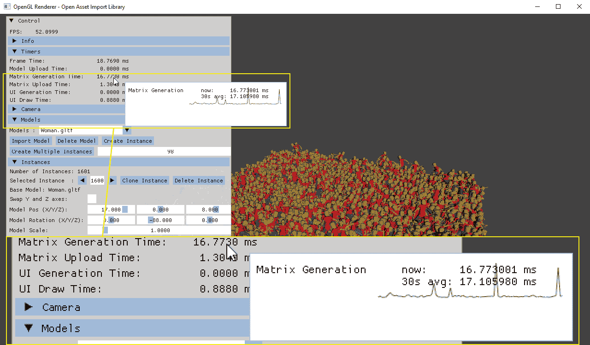
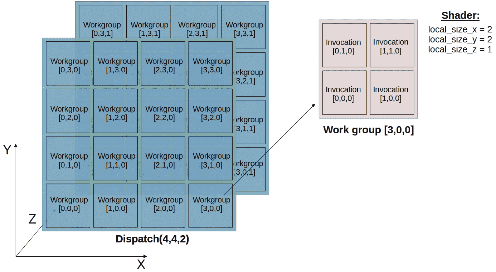
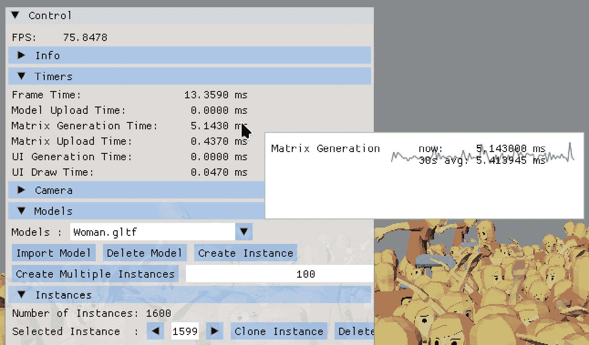
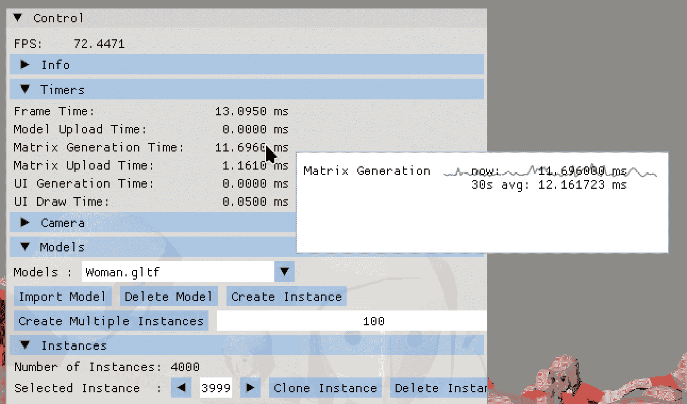

# 第二章：将动画计算从 CPU 迁移到 GPU

欢迎来到**第二章**！在前一章中，我们探讨了使用 Open Assimp 导入库（简称 Assimp）加载和动画 3D 模型的步骤。生成的应用程序可以渲染大量的模型实例。但是，根据你的处理器类型和速度，模型矩阵的计算部分很快就会变得占主导地位。结果，我们无法在应用程序中达到每秒 60 帧。

在本章中，我们将矩阵计算移动到计算着色器中，完全在 GPU 上运行。我们首先简要回顾一下独立于应用程序主代码进行计算的方法的历史，以及 CPU 和 GPU 中并行性的增长。接下来，我们考察当前矩阵计算的状态。然后，我们制定一个计划，说明我们应该将哪些内容移动到计算着色器中，以及这种迁移如何实现。最后一步，我们检查迁移的结果，并简要看看应用程序的其他哪些部分可能可以利用卸载计算密集型工作。

在本章中，我们将涵盖以下主题：

+   计算着色器是什么，为什么我们应该喜欢它们？

+   分析动画性能

+   将节点计算迁移到 GPU

+   通过扩展测试实现

+   如何调试计算着色器

# 技术要求

要使用计算着色器，需要一个至少支持 OpenGL 4.3 和/或 Vulkan 1.0 的 GPU。由于本书的源代码是为 OpenGL 4.6 和 Vulkan 1.1 编写的，所以我们在这里是安全的。

你可以在`chapter02`文件夹中找到示例代码，对于 OpenGL，在`01_opengl_computeshader`子文件夹中，对于 Vulkan，在`02_vulkan_computeshader`子文件夹中。

# 计算着色器是什么，为什么我们应该喜欢它们？

让我们简要回顾一下家用电脑的历史，看看并发是如何处理的。在服务器上，自 1960 年代中期以来，并发程序一直是常态，但对于家用电脑和游戏机来说，其发展轨迹略有不同。

## 著名的光栅中断

虽然中断的一般概念自计算机诞生以来就存在于计算机系统中，但家用电脑中的中断通常由操作系统用来响应外部事件（尽管在 1950 年代就引入了具有中断的第一台机器）。其中一种中断标志着向旧“阴极射线管”电视输出新图像的开始：光栅中断。

当阴极射线管重置到电视屏幕的左上角后，光栅中断就会触发。这个每秒发生 50 次（在欧洲；在美国为每秒 60 次）的稳定事件，很快就成了程序员的兴趣点。通过将中断处理程序重定向到自己的代码，机器可以完成需要按固定时间表执行的工作，比如播放音乐或屏幕上特定位置应发生的图形变化。这些程序甚至比机器的架构师所能想象的更能发挥家用电脑的能力，比如在屏幕上添加比机器可用的更多精灵，在屏幕边界内绘制精灵，甚至在 8 位 CPU 上实现简单形式的并行处理。

迄今为止，复古程序员甚至能在老式家用电脑上施展更多魔法。请参阅*附加资源*部分，获取演示链接以及关于如何随着时间的推移接受硬件限制的教程。

然后，很长一段时间内，没有发生什么特别的事情。8 位和 16 位家用电脑的时代结束了，x86 机器接管了市场。然而，总体系统布局保持不变——一个处理器核心通过中断的时间共享来呈现同时运行多个程序的感觉。

## 多核机器的兴起

到 2000 年初，常见的台式机已经能够处理多个 CPU 核心：推出了 Windows 2000（Linux 长期以来能够利用多个 CPU，但在 2000 年的台式机上是一个利基系统）。

五年后，第一个面向桌面用户的具有多个计算核心的处理器出现了：Pentium D 和 AMD 64 X2。这些新 CPU 被视为编程新时代的开始，因为可以同时运行多个进程。这也标志着程序员烦恼时代的开始——两个线程可以真正并行运行，需要新的同步思考。

目前，台式机的平均 CPU 核心数在 4 到 8 之间。考虑到现代 CPU 的并行多线程，许多台式机甚至可以并行处理 28 到 32 个线程。遗憾的是，程序员的烦恼和 20 年前一样——利用大量核心仍然是一个复杂且容易出错的流程。

在处理器核心升级的背后，另一种拥有更多核心数量的技术也在发展：图形处理器。

## 隐藏的多核冠军

在处理器核心升级的阴影下，显卡也增加了并行核心的数量。他们在这方面做得更大。从 2009 年和 2010 年只有几个着色器核心开始，数量的增长是惊人的：

NVIDIA GeForce RTX 4090 拥有 16,384 个着色器核心，而 AMD Radeon RX 7900 XTX 则有 6,144 个着色器核心。

由于这两款 GPU 之间的内部差异，这两个数字不能直接比较，但原始数字显示了一件事：如果我们能够使用一些着色器核心来计算动画帧的模型矩阵，计算将会快得多。同时，我们的 CPU 将需要做更少的工作，使我们能够在 GPU 计算模型矩阵的同时执行其他任务。

感谢图形 API 设计师和 GPU 供应商，使用这些着色器核心就像编写一个小型的 C 语言程序：一个计算着色器。

## 欢迎来到计算着色器的奇妙世界

直到 OpenGL 4.2，通过利用其他着色器类型（如顶点着色器和片段着色器）在 GPU 上进行计算已经是可能的。类似于通过纹理缓冲区对象将任意数据上传到 GPU，着色器可以用来进行大规模并行计算，将结果保存到纹理缓冲区。最终的纹理可以被读取回 CPU 可访问的内存——就这样：GPU 帮助我们做了昂贵的计算。

随着 OpenGL 4.3 的引入，这个过程通过正式添加计算着色器和**着色器存储缓冲区对象**（**SSBOs**）而简化。在 Vulkan 1.0 中，对计算着色器和 SSBOs 的支持已经是强制性的，使新的图形 API 与 OpenGL 4.3+相当。

SSBOs 的优势很大：着色器可以读写 SSBO，而不仅仅是只读的 uniform 缓冲区。对 SSBO 的通用访问也简化了，因为它没有硬性限制的最大大小。结合对`float`和`vec2`数据类型的轻微不同的填充，在 SSBO 中获取或设置一个值就像使用 C 风格的数组一样简单：

```cpp
layout (std430, binding = 0) readonly buffer Matrices {
  mat4 matrix[];
};
...
void main() {
  ...
  mat4 boneMat = matrix[index];
  ...
} 
```

另一方面，使用计算着色器，你可以完全控制你想要启动的着色器实例数量。着色器调用的总数取决于计算着色器中的设置和调度调用。

假设我们使用以下计算着色器设置：

```cpp
layout(local_size_x = 16, local_size_y = 32,
  local_size_z = 1) in; 
```

然后，运行这个 OpenGL 调度调用：

```cpp
glDispatchCompute(10, 10, 1); 
```

这意味着我们将向 GPU 驱动程序发送一个请求，启动 51,200 个着色器实例：

```cpp
16*32*1*10*10*1 = 51200 
```

关于计算着色器的更多详细信息，OpenGL 和 Vulkan 的教程链接可在**附加资源**部分找到。

虽然有一些额外的限制，比如为了简化内部管理而一起使用的着色器核心数量（在 AMD GPU 上称为 wave，在 NVIDIA GPU 上称为 warp），但调用次数显示了计算着色器的用户友好性。

你，作为程序员，不需要在代码中关心生成大量的线程或在程序结束时将它们连接起来。也没有必要创建互斥锁或原子变量来控制对数据的访问。所有这些步骤都深深地隐藏在图形驱动程序的深处。

虽然你仍有责任在身——你仍需确保只有一个着色器调用读取或写入单个缓冲区地址。但是，借助 GPU 设置的控制变量，如全局和局部调用 ID，这部分工作也很容易——相比在 CPU 上手动多线程，要容易得多。

那么，我们如何在程序中使用计算着色器的魔法？第一步是分析代码中的热点，并制定一个计划，以确定相同数据如何在 GPU 上进行计算。

# 性能分析动画性能

要测试系统上应用程序的性能，你可以将名为 `Woman.gltf` 的测试模型导入 `assets` 文件夹中的 `woman` 子文件夹，将 **创建多个实例**按钮旁边的滑块移动到 100，然后多次点击 **创建多个实例**按钮。每次点击都会添加 100 个模型的另一个实例，这些实例在虚拟世界中随机分布。

或者，你可以更改 `opengl` 文件夹中 `UserInterface` 类的 `createFrame()` 方法中实例滑块的代码。调整调用中的第四个参数，以控制滑块的最大值：

```cpp
ImGui::SliderInt("##MassInstanceCreation",
  &manyInstanceCreateNum, 1, **100**, "%d", flags); 
```

在添加了数百个实例后，你应该会看到一个类似于 *图 2.1* 的图像。用户界面的 **计时器**部分已经被放大，以显示生成模型矩阵所需的时间值：



图 2.1：在屏幕上有 1,601 个实例时的模型矩阵生成时间

在这里，1,601 个实例需要超过 20 毫秒来创建模型矩阵——如果我们计算原始数字，这仍然是一个较小的值。

每个模型有 41 个动画骨骼。对于每个骨骼，每帧都会读取每个 **平移、旋转和缩放**（**TRS**）的两个值。这些值通过线性插值混合在一起，用于平移和缩放，而 **球面线性插值**（**SLERP**）用于旋转：

```cpp
1601*41*3*2 = 393846 
```

在这些近 40 万次向量乘法之上，每个骨骼都需要创建的结果 TRS 矩阵，并将其与父矩阵相乘。每次矩阵乘法都包含 16 次浮点乘法，所以我们还有大约 10 万次乘法：

```cpp
1601*4*16 = 102464 
```

这对于 CPU 来说在每一帧中要完成的大量工作。这些数字也反映在 Windows 和 Linux 的性能分析输出中。

让我们验证关于 CPU 工作负载的假设。

## 定位代码中的热点

通过使用 Visual Studio 2022 的内置性能分析器，我们可以看到动画的函数调用以及单个函数内部花费最多执行时间的函数之间的矩阵乘法：


图 2.2：Visual Studio 2022 性能分析中的动画调用

在 Linux 上使用额外的标志 `-pg` 编译可执行文件，运行应用程序，并启动 `gprof` 后，结果类似：


图 2.3：Linux 中的动画调用

需要大量的 CPU 时间来计算每个节点的新的平移、旋转、缩放和模型矩阵。因此，让我们看看如何更改数据表示，以便允许简单地将数据上传到计算着色器。

## 分析当前的数据表示

在当前实现中，矩阵工作是在 `AssimpInstance` 类的 `updateAnimation()` 方法中完成的。对于渲染器绘制到屏幕上的每一帧，必须执行以下步骤：

1.  首先，我们遍历所有动画通道，获取模型的相应节点，并使用动画数据中的骨骼局部变换来更新每个节点的平移、缩放和旋转：

    ```cpp
     for (const auto& channel : animChannels) {
        std::string nodeNameToAnimate =
          channel->getTargetNodeName();
        std::shared_ptr<AssimpNode> node =
          mAssimpModel->getNodeMap().at(nodeNameToAnimate);
        node->setRotation(
          channel->getRotation(
          mInstanceSettings.isAnimPlayTimePos));
        node->setScaling(
          channel->getScaling(
          mInstanceSettings.isAnimPlayTimePos));
        node->setTranslation(
          channel->getTranslation(
          mInstanceSettings.isAnimPlayTimePos));
      } 
    ```

1.  然后，我们遍历所有骨骼，并更新每个节点的 TRS 矩阵，计算节点局部变换：

    ```cpp
     mBoneMatrices.clear();
      for (auto& bone : mAssimpModel->getBoneList()) {
        std::string nodeName = bone->getBoneName();
        std::shared_ptr<AssimpNode> node =
           mAssimpModel->getNodeMap().at(nodeName);
        node->updateTRSMatrix(); 
    ```

节点的 TRS 矩阵更新包括与父节点 TRS 矩阵的乘法。

1.  在这一点上，我们可以收集节点的最终 TRS 矩阵，并将其与相应的骨骼偏移节点相乘，生成包含每个节点的世界位置的 `mBoneMatrices` 向量：

    ```cpp
     if (mAssimpModel->getBoneOffsetMatrices().count(
          nodeName) > 0) {
          mBoneMatrices.emplace_back(
            mAssimpModel->getNodeMap().at(
            nodeName)->getTRSMatrix() *
          mAssimpModel->getBoneOffsetMatrices().at(nodeName));
        }
      } 
    ```

对骨骼偏移矩阵进行额外的 `.count()` 检查是为了避免访问无效的矩阵。骨骼偏移矩阵应该对动画中的每个节点都有效，但为了安全起见，最好是谨慎行事。

1.  然后，在我们的渲染器的 `draw()` 调用中，即 `OGLRenderer` 类中，为每个实例更新动画。在动画更新后，检索 `mBoneMatrices` 向量并将其添加到本地 `mBoneMatrices` 向量中：

    ```cpp
     for (unsigned int i = 0; i < numberOfInstances; ++i) {
            modelType.second.at(i)->updateAnimation(
              deltaTime);
            std::vector<glm::mat4> instanceBoneMatrices =
              modelType.second.at(i)->getBoneMatrices();
            mModelBoneMatrices.insert(
              mModelBoneMatrices.end(),
              instanceBoneMatrices.begin(),
              instanceBoneMatrices.end());
          } 
    ```

1.  作为下一步，将本地的 `mBoneMatrices` 向量上传到 SSBO 缓冲区：

    ```cpp
     mShaderBoneMatrixBuffer.uploadSsboData(
              mModelBoneMatrices, 1); 
    ```

在 `shader` 文件夹中的 `assimp_skinning.vert` 顶点着色器中，骨骼矩阵作为 `readonly` 缓冲区可见：

```cpp
layout (std430, binding = 1) readonly buffer BoneMatrices {
  mat4 boneMat[];
}; 
```

1.  我们使用每个顶点的骨骼编号作为索引，进入骨骼矩阵 SSBO，以计算名为 `skinMat` 的最终顶点皮肤矩阵：

    ```cpp
     mat4 skinMat =
        aBoneWeight.x * boneMat[int(aBoneNum.x) +
          gl_InstanceID * aModelStride] +
        aBoneWeight.y * boneMat[int(aBoneNum.y) +
          gl_InstanceID * aModelStride] +
        aBoneWeight.z * boneMat[int(aBoneNum.z) +
          gl_InstanceID * aModelStride] +
        aBoneWeight.w * boneMat[int(aBoneNum.w) +
          gl_InstanceID * aModelStride]; 
    ```

1.  作为最后一步，我们使用 `skinMat` 矩阵将顶点移动到特定动画帧的正确位置：

    ```cpp
     gl_Position = projection * view * skinMat *
        vec4(aPos, 1.0); 
    ```

如您所见，对于我们要渲染的动画的每一帧，都需要进行大量的计算。让我们将计算负载转移到显卡上。

## 调整数据模型

为了将计算移动到 GPU，我们在 `opengl` 文件夹中的 `OGLRenderData.h` 文件中创建一个新的结构体 `NodeTransformData`：

```cpp
struct NodeTransformData {
  glm::vec4 translation = glm::vec4(0.0f);
  glm::vec4 scale = glm::vec4(1.0f);
  glm::vec4 rotation = glm::vec4(1.0f, 0.0f, 0.0f, 0.0f);
} 
```

对于 Vulkan 渲染器，需要在 `vulkan` 文件夹中的 `VkRenderData.h` 文件中创建该结构体。

在这个新的 `struct` 中，我们将按节点保存变换值。我们使用 `glm::vec4`，这是一个包含四个 `float` 元素的向量类型，用于平移和缩放，以避免额外的填充值以实现正确的对齐，并简单地忽略最后一个元素在着色器中的使用。

GPU/CPU 内存对齐可能不同

由于 GPU 优化了快速内存访问，缓冲区中的数据必须在内存中对齐，在大多数情况下是对 16 字节的多倍数对齐。当将数据上传到 GPU 时，将自动创建这种对齐。在 CPU 端，可能使用不同的对齐方式，例如对于 3 元素向量类型，如`glm::vec3`，它长度为 12 字节。为了使用`glm::vec3`向量，需要一个额外的`float`作为填充以匹配 16 字节的对齐，因为上传未对齐的数据最终会导致图像扭曲和结果不正确。

我们还使用一个`glm::vec4`向量来表示旋转，这在`AssimpChannel`类中是一个`glm::quat`四元数。做出这个决定的原因很简单：**GLSL**（OpenGL 着色语言）不知道四元数是什么，也不知道如何处理四元数。我们将不得不在计算着色器中自行实现四元数函数。因此，我们利用普通的 4 元素向量来将旋转四元数的四个元素传输到着色器中。

现在，我们可以简化动画更新。首先，我们在类中添加一个局部`std::vector`，它包含我们新的`NodeTransformData`类型：

```cpp
 std::vector<NodeTransformData> mNodeTransformData{}; 
```

我们再次遍历所有通道，但这次不是修改模型的节点，而是将转换数据填充到一个局部的`NodeTransformData`变量中：

```cpp
 for (const auto& channel : animChannels) {
    NodeTransformData nodeTransform;
    nodeTransform.translation =
      channel->getTranslation(
      mInstanceSettings.isAnimPlayTimePos);
    nodeTransform.rotation =
      channel->getRotation(
      mInstanceSettings.isAnimPlayTimePos);
    nodeTransform.scale =
      channel->getScaling(
      mInstanceSettings.isAnimPlayTimePos); 
```

然后，在检查以避免访问无效骨骼之后，我们使用收集到的转换数据设置相应骨骼的节点转换：

```cpp
 int boneId = channel->getBoneId();
    if (boneId >= 0) {
      mNodeTransformData.at(boneId) = nodeTransform;
    }
  } 
```

在我们的渲染器的`draw()`调用期间，我们仍然需要以相同的方式更新动画：

```cpp
 for (unsigned int i = 0; i < numberOfInstances; ++i) {
    modelType.second.at(i)->updateAnimation(deltaTime); 
```

然后，我们从实例中获取节点转换，并将它们收集到一个局部数组中：

```cpp
 std::vector<NodeTransformData> instanceNodeTransform =
      modelType.second.at(i)->getNodeTransformData();
    std::copy(instanceNodeTransform.begin(),
      instanceNodeTransform.end(),
      mNodeTransFormData.begin() + i * numberOfBones);
  } 
```

作为最后一步，我们必须将节点转换上传到 SSBO：

```cpp
mNodeTransformBuffer.uploadSsboData(mNodeTransFormData, 0); 
```

`NodeTransformData`结构体的元素不是 4x4 矩阵，而每个节点只有三个`glm::vec4`元素。因此，在这一步中，我们需要上传 25%更少的数据到 SSBO。

在 GPU 上拥有节点转换是一个很酷的第一步。但是，如果我们进一步分析数据流，我们会发现我们需要在计算着色器中计算最终模型矩阵时需要更多的数据。让我们看看还需要什么来从骨骼局部转换数据计算世界空间位置。

## 添加计算着色器缺失的数据

最明显且首先缺失的数据部分是骨骼偏移矩阵的数组。在 CPU 实现中，我们每个节点将最终 TRS 矩阵与相同节点的骨骼偏移矩阵相乘：

```cpp
mBoneMatrices.emplace_back(
    mAssimpModel->getNodeMap().at(
    nodeName)->getTRSMatrix() *
    **mAssimpModel->****getBoneOffsetMatrices****().****at****(nodeName)**); 
```

由于骨骼偏移矩阵是基于每个模型的，我们可以在`AssimpModel`类中添加一个 SSBO（存储缓冲对象），并在模型加载期间上传数据。我们只需在`model`文件夹中的`AssimpModel.h`头文件中简单地添加一个 SSBO：

```cpp
 ShaderStorageBuffer mShaderBoneMatrixOffsetBuffer{}; 
```

然后，在`loadModel()`方法中，我们填充一个局部向量，包含偏移矩阵，并将数据上传到 SSBO：

```cpp
 std::vector<glm::mat4> boneOffsetMatricesList{};
  for (const auto& bone : mBoneList) {
    boneOffsetMatricesList.emplace_back(
      bone->getOffsetMatrix());
  }
  mShaderBoneMatrixOffsetBuffer.uploadSsboData(
    boneOffsetMatricesList); 
```

在我们为计算着色器准备数据之后，我们将包含骨骼偏移矩阵的 SSBO 绑定到我们在矩阵乘法计算着色器中配置的相同绑定点（`binding = 2`）：

```cpp
 modelType.second.at(0)->getModel()
      ->bindBoneMatrixOffsetBuffer(2); 
```

初看之下较为隐蔽的是需要父矩阵。在`AssimpNode`类的`updateTRSMatrix()`方法中，我们从父节点（如果有父节点）检索 TRS 矩阵。然后，我们使用父节点来计算节点的自身 TRS 矩阵：

```cpp
 if (std::shared_ptr<AssimpNode> parentNode =
      mParentNode.lock()) {
    mParentNodeMatrix = parentNode->getTRSMatrix();
  }
  mLocalTRSMatrix = mRootTransformMatrix *
    mParentNodeMatrix * mTranslationMatrix *
    mRotationMatrix * mScalingMatrix; 
```

在`AssimpInstance`类的`updateAnimation()`方法中，我们首先更新根节点的 TRS 矩阵，然后进入子节点，收集包含所有变换矩阵直到模型根节点的父矩阵节点。

对于计算着色器，我们需要不同的方法。由于所有着色器调用都是并行运行的，我们需要将调用次数减少到每个模型一个，以便在模型矩阵上实现已知的线性进展。为了使用更多的着色器调用，我们将创建一个包含每个位置父节点编号的`int`向量。这个“父节点向量”使我们能够在着色器中“向后行走”模型骨骼，沿途收集所有父节点矩阵。

我们在循环中创建父节点向量，并使用骨骼偏移矩阵。首先，我们获取当前骨骼的父节点，然后使用一个小 lambda 函数获取同一骨骼列表中父骨骼的位置：

```cpp
 std::string parentNodeName = mNodeMap.at(
      bone->getBoneName())->getParentNodeName();
    const auto boneIter = std::find_if(mBoneList.begin(),
      mBoneList.end(),
      parentNodeName
       { return bone->getBoneName() == parentNodeName; }); 
```

如果我们在骨骼列表中找不到父节点，我们就找到了模型的根节点。在这种情况下，我们添加一个`-1`来标识根节点。在所有其他情况下，我们添加父骨骼的索引编号：

```cpp
 if (boneIter == mBoneList.end()) {
      boneParentIndexList.emplace_back(-1);
    } else {
      boneParentIndexList.emplace_back(
        std::distance(mBoneList.begin(), boneIter));
    } 
```

`boneParentIndexList`现在包含模型中所有节点的父节点列表，对于根节点使用特殊父节点`-1`。通过重复查找父节点，我们可以从每个节点向上遍历骨骼树，直到我们到达具有特殊父节点编号`-1`的根节点。

为了使父骨骼列表在计算着色器中可用，我们在`AssimpModel`类中创建另一个 SSBO，并将`boneParentIndexList`上传到 GPU：

```cpp
mShaderBoneParentBuffer.uploadSsboData(boneParentIndexList); 
```

在渲染器中，父骨骼缓冲区将被绑定到计算着色器的绑定点上：

```cpp
 modelType.second.at(0)->getModel()
        ->bindBoneParentBuffer(1); 
```

我们还没有完成将工作量转换到 GPU 的工作。在使用计算着色器时，一些数据需要以不同的方式处理。

## 将数据重新定位到另一个着色器

现在的计算中还缺少实例世界位置。`updateAnimation()`方法包含以下行来设置模型根节点的变换矩阵：

```cpp
 mAssimpModel->getNodeMap().at(
    mAssimpModel->getBoneList().at(0)->getBoneName())
    ->setRootTransformMatrix(mLocalTransformMatrix *
    mAssimpModel->getRootTranformationMatrix()); 
```

模型的根变换矩阵包含将应用于整个模型的一般变换，例如模型的全球缩放。另一个矩阵`mLocalTransformMatrix`用于设置模型实例的用户可控参数。局部变换矩阵允许我们在虚拟世界中旋转和移动模型实例。

与骨骼偏移矩阵不同，根节点的变换将被移动到`assimp_skinning.vert`顶点着色器中，而不是计算着色器中。哪个着色器执行矩阵乘法并不重要，但将根节点变换移动到顶点着色器可能会稍微降低计算着色器的负载。此外，顶点着色器只对绘制到屏幕上的对象运行，而不是在渲染本身之前被剔除的实例或不可见的实例，这可能会降低 GPU 的整体计算负载。

## 进行最后的准备

最后，我们还可以决定需要多少个不同的计算着色器：

*我们至少需要两个计算着色器*。

为了计算节点的最终 TRS 矩阵，我们需要所有父级 TRS 矩阵都已完成，并且所有矩阵都从当前节点乘到模型根。由于我们只能控制启动着色器调用的数量，但不能控制其何时或运行多长时间，我们需要在节点 TRS 矩阵的计算和收集骨骼上的矩阵过程中设置某种类型的屏障。

在 CPU 端创建这样的屏障是唯一的方法。在提交计算着色器到图形 API 时，将添加一个屏障，告诉 GPU 在开始第二个批次之前等待第一个着色器完成。

因此，我们必须从节点变换开始，等待所有节点变换矩阵完成，然后开始计算最终节点矩阵。

理论部分完成后，我们可以开始着色器相关的实现。

# 将节点计算移动到 GPU

加载计算着色器的过程与顶点或片段着色器略有不同。对于 OpenGL，我们必须在`glCreateShader()`调用中设置着色器类型：

```cpp
glCreateShader(**GL_COMPUTE_SHADER**); 
```

对于 Vulkan，我们必须在创建`VkShaderModule`时设置正确的着色器阶段：

```cpp
VkPipelineShaderStageCreateInfo computeShaderStageInfo{};
computeShaderStageInfo.sType =
  VK_STRUCTURE_TYPE_PIPELINE_SHADER_STAGE_CREATE_INFO; computeShaderStageInfo.stage =
  **VK_SHADER_STAGE_COMPUTE_BIT**; 
```

加载着色器代码、链接或创建着色器模块的所有其他步骤保持不变。因为我们只有一个着色器文件，所以已经向`Shader`类中添加了额外的功能。现在可以通过调用`Shader`类的`loadComputeShader()`方法并传入着色器源文件的相对路径来在 OpenGL 中加载计算着色器：

```cpp
 if (!mAssimpTransformComputeShader.loadComputeShader(
      "shader/assimp_instance_transform.comp")) {
    return false;
  } 
```

Vulkan 使用**标准可移植中间表示**（**SPIR-V**）格式进行着色器。对于 Vulkan 渲染器，必须将预编译的着色器代码加载到`Shader`类中，而不是着色器源代码。

随着我们计算新的矩阵在计算着色器中，并且我们必须在不同着色器之间移动这些矩阵，因此需要两个额外的 SSBO。

## 添加更多的着色器存储缓冲区

第一个 SSBO 将存储我们从节点变换创建的 TRS 矩阵。这个 SSBO 是一个简单的缓冲区，定义在渲染器的头文件中：

```cpp
 ShaderStorageBuffer mShaderTRSMatrixBuffer{}; 
```

第二个 SSBO 将包含用于皮肤着色器的最终骨骼矩阵。骨骼矩阵缓冲区也被添加为渲染器头文件中的正常 SSBO 声明：

```cpp
 ShaderStorageBuffer mShaderBoneMatrixBuffer{}; 
```

使用 SSBO 在着色器中的一个重要步骤是设置正确的大小。如果 SSBO 太小，则不是所有数据都会存储在计算着色器中，实例或实例的部位可能会缺失。错误的缓冲区大小可能很难调试——你可能甚至不会收到一个警告，表明着色器写入了缓冲区末尾之外。我们必须根据骨骼数量、实例数量和 4x4 矩阵的大小来计算缓冲区大小，如下所示：

```cpp
 size_t trsMatrixSize = numberOfBones *
 numberOfInstances * sizeof(glm::mat4); 
```

然后，我们将两个 SSBO 的大小调整为最终矩阵大小：

```cpp
 mShaderBoneMatrixBuffer.checkForResize(trsMatrixSize);
  mShaderTRSMatrixBuffer.checkForResize(trsMatrixSize); 
```

当绘制多个模型时，两个缓冲区最终都会达到所有模型的最大大小。但这并不会造成任何伤害，因为缓冲区将被用于下一个模型，并且只填充到新模型实际使用的数据量。

## 在着色器中计算节点变换

对于第一个计算着色器，我们必须将节点变换数据上传到第一个计算着色器。我们将存储从节点变换创建的新 TRS 矩阵的 SSBO 绑定到计算着色器的正确绑定点：

```cpp
 mAssimpTransformComputeShader.use();
    mNodeTransformBuffer.uploadSsboData(
      mNodeTransFormData, 0);
    mShaderTRSMatrixBuffer.bind(1) 
```

计算着色器本身命名为`assimp_instance_transform.comp`，位于`shader`文件夹中。计算着色器的第一行是通常的版本定义；第二行定义了局部调用大小：

```cpp
#version 460 core
layout(local_size_x = 1, local_size_y = 32,
  local_size_z = 1) in; 
```

在这里，我们默认创建 32 个着色器调用。你可能需要尝试不同的局部大小以实现最佳性能。着色器以固定大小的组启动，以简化 GPU 内部管理。常见的值是 32（称为“warps”，针对 NVIDIA GPU）或 64（称为“waves”，针对 AMD GPU）。对于 NVIDIA 或 AMD GPU，将所有局部大小设置为 1 是有点无用的，因为剩余的 31 个 warps 或相应的 63 个 waves 将不会被使用。

接下来，我们必须添加与我们在`OGLRenderData.h`中声明类型时使用的相同数据类型的`NodeTransformData`：

```cpp
struct NodeTransformData {
  vec4 translation;
  vec4 scale;
  vec4 rotation;
}; 
```

提醒一下：`rotation`元素是一个四元数，伪装成`vec4`。

现在，我们定义两个 SSBO，使用与渲染器代码中相同的绑定点：

```cpp
layout (std430, binding = 0) readonly restrict
    buffer TransformData {
  NodeTransformData data[];
};
layout (std430, binding = 1) writeonly restrict
    buffer TRSMatrix {
  mat4 trsMat[];
}; 
```

我们将节点变换数据标记为`readonly`，将 TRS 矩阵标记为`writeonly`。这两个修饰符可以帮助着色器编译器优化缓冲区的访问，因为某些操作可以被省略。另一个修饰符`restrict`也有助于着色器编译器优化着色器代码。通过添加`restrict`，我们告诉着色器编译器我们不会从另一个变量中读取我们之前用变量写入的值。消除读后写依赖将使着色器编译器的生命变得更加轻松。

为了从`TransformData`缓冲区读取数据，已添加了三种方法。在这三个方法中，称为`getTranslationMatrix()`、`getScaleMatrix()`和`getRotationMatrix()`，我们读取缓冲区中的数据元素并创建相应的变换的 4x4 矩阵。

例如，查看`getTranslationMatrix()`方法的实现：

```cpp
mat4 getTranslationMatrix(uint index) {
  return mat4(1.0, 0.0, 0.0, 0.0,
              0.0, 1.0, 0.0, 0.0,
              0.0, 0.0, 1.0, 0.0,
              data[index].translation[0],
                   data[index].translation[1],
                        data[index].translation[2],
                            1.0);
} 
```

生成的 4x4 矩阵是一个单位矩阵，通过`TransformData`缓冲区中特定`index`的平移数据进行了丰富。`getScaleMatrix()`方法创建一个缩放矩阵，将主对角线的第一个三个元素设置为缩放值。最后，`getRotationMatrix()`方法类似于 GLM 中的`mat3_cast`算法的精神，将四元数转换为 4x4 旋转矩阵。

在第一个计算着色器的`main()`方法中，我们获取着色器调用的`x`和`y`维度：

```cpp
void main() {
  uint node = gl_GlobalInvocationID.x;
  uint instance = gl_GlobalInvocationID.y; 
```

我们将使用模型中的骨骼数量作为`x`维度，简化着色器代码的其余部分：

```cpp
 uint numberOfBones = gl_NumWorkGroups.x; 
```

通过组合骨骼数量、着色器实例（调用）和我们将要处理的节点来定位缓冲区中的正确索引：

```cpp
 uint index = node + numberOfBones * instance; 
```

计算着色器的主要逻辑按照 TRS 顺序乘以平移、旋转和缩放矩阵，并将结果保存在 TRS 矩阵的缓冲区中，与节点变换的相同`index`：

```cpp
 trsMat[index] = getTranslationMatrix(index) *
    getRotationMatrix(index) * getScaleMatrix(index);
} 
```

在 GLM 中，矩阵是从右到左相乘的，这一点一开始可能会让人困惑。因此，尽管矩阵的名称是“TRS”，但乘法是按照名称的反序进行的：首先应用模型缩放，然后是旋转，最后是平移。其他数学库或不同的矩阵打包可能使用不同的乘法顺序。在*附加资源*部分列出了两个广泛的矩阵教程。

将 TRS 矩阵保存在与节点变换相同的地点保留了模型中节点和所有模型实例中节点的顺序。

要触发着色器执行，我们为 OpenGL 渲染器调用`glDispatchCompute()`，并添加一个等待 SSBO 的内存屏障：

```cpp
 glDispatchCompute(numberOfBones,
      std::ceil(numberOfInstances / 32.0f), 1);
    glMemoryBarrier(GL_SHADER_STORAGE_BARRIER_BIT); 
```

内存屏障确保 CPU 等待 GPU 达到特定状态。在这种情况下，我们必须等待所有 SSBO 写入完成，因此我们设置了着色器存储缓冲区的位。对`glMemoryBarrier()`的调用简单地阻塞执行，只有在 GPU 达到所需状态后才会返回。

在我们继续之前，让我们看看当调用`glDispatchCompute()`或`vkCmdDispatch()`时计算着色器内部发生了什么。*图 2.4*显示了计算着色器调用的内部元素：



图 2.4：计算着色器的全局工作组和局部调用结构

当我们使用参数`4,4,2`调用调度命令时，总共将启动`4*4*2 = 32`个工作组，如图 2.4 左边的所示。工作组的总数是全球计算空间三个维度`X`、`Y`和`Z`的乘积。

在每个 32 个工作组中，总共运行了四个着色器调用，如*图 2.4*中间的工作组`[3,0,0]`所示。所谓的局部大小由三个着色器布局值`local_size_x`、`local_size_y`和`local_size_z`定义。工作组的局部大小是通过将`X`、`Y`和`Z`维度的三个值相乘来计算的：`2*2*1 = 4`。

如果着色器实例需要相互通信，那么将它们分离到工作组中是很重要的，因为通信只能在同一工作组内进行。来自不同工作组的着色器调用实际上是隔离的，无法通信。

如您所见，着色器调用的总数可以非常快地变得非常大，因为单个工作组的局部大小和总工作组的数量是相乘的。这种巨大的并行性是 GPU 原始功率的秘密所在。

因此，对于`x`维度，我们使用之前提到的`numberOfBones`。通过计算`numberOfInstances`除以 32 的`std::ceil`值作为`y`维度，我们确保以 32 个着色器调用为一组开始，一次计算多达 32 个实例的矩阵，正如在着色器代码中配置的局部`y`维度。如果我们有小于 32 的倍数的实例计数，额外的波或 warp 仍然在运行，但结果会被忽略。技术上，我们是在缓冲区边界之外进行读写，但 GPU 驱动程序应该处理这种情况，即通过丢弃写入。

对于 Vulkan，我们必须调用`VkCmdDispatch()`：

```cpp
 vkCmdDispatch(commandBuffer, numberOfBones,
      std::ceil(numberOfInstances / 32.0f), 1); 
```

Vulkan 中计算着色器的 Shader Storage Buffer Object 的大小也应该四舍五入，以容纳 32 的倍数个骨骼，以避免意外覆盖缓冲区数据：

```cpp
boneMatrixBufferSize +=
  numberOfBones * ((numberOfInstances - 1) / 32 + 1) * 32; 
```

在 Vulkan 中同步着色器的障碍必须设置为等待队列的结果。为了在计算着色器和顶点着色器之间进行同步，我们需要设置计算着色器写入和顶点着色器第一次读取操作之间的障碍，如下所示：

```cpp
VkMemoryBarrier memoryBarrier {}
  ...
 memoryBarrier.srcAccessMask = VK_ACCESS_SHADER_WRITE_BIT:
 memoryBarrier.dstAccessMask = VK_ACCESS_SHADER_READ_BIT;
vkCmdPipelineBarrier(...
  VK_PIPELINE_STAGE_COMPUTE_SHADER_BIT,
  VK_PIPELINE_STAGE_VERTEX_INPUT_BIT,
  1, &memoryBarrier, ...); 
```

现在，Vulkan 在开始顶点着色器中的绘制调用之前，会等待计算着色器完成所有计算。

TRS 矩阵缓冲区现在包含了每个节点的矩阵，但没有父节点、根节点变换矩阵或任何偏移矩阵。

## 创建最终的节点矩阵

在我们可以开始下一个计算着色器之前，我们必须绑定所有将在着色器运行期间使用的缓冲区。我们总共有四个 SSBO：

```cpp
 mAssimpMatrixComputeShader.use();
        mShaderTRSMatrixBuffer.bind(0);
        modelType.second.at(0)->getModel()
          ->bindBoneParentBuffer(1);
        modelType.second.at(0)->getModel()
          ->bindBoneMatrixOffsetBuffer(2);
        mShaderBoneMatrixBuffer.bind(3); 
```

由于所有数据已经驻留在 GPU 上，我们在这里不需要任何类型的上传。

第二个计算着色器本身被称为 `assimp_instance_matrix_mult.comp`，可以在 `shader` 文件夹中找到。着色器代码再次从版本和局部大小定义开始：

```cpp
#version 460 core
layout(local_size_x = 1, local_size_y = 32,
  local_size_z = 1) in; 
```

由于代码是在具有 NVIDIA GPU 的机器上开发的，因此使用了本地大小为 32。对于 AMD GPU，应使用本地大小为 64，如 *在着色器中计算节点变换* 部分所述。

与第一个计算着色器类似，接下来是 SSBOs：

```cpp
layout (std430, binding = 0) readonly restrict
    buffer TRSMatrix {
  mat4 trsMat[];
};
layout (std430, binding = 1) readonly restrict
    buffer ParentMatrixIndices {
  int parentIndex[];
};
layout (std430, binding = 2) readonly restrict
    buffer BoneOffsets {
  mat4 boneOffset[]
};
layout (std430, binding = 3) writeonly restrict
    buffer BoneMatrices {
  mat4 boneMat[];
}; 
```

第一个缓冲区 `TRSMatrix` 包含第一个计算着色器中的 TRS 矩阵。在 `ParentMatrixIndices` 缓冲区中，着色器可以找到包含每个节点的父节点的列表。每个节点的骨骼矩阵偏移量在第三个缓冲区 `BoneOffsets` 中提供，最终节点矩阵将存储在最后一个缓冲区 `BoneMatrices` 中。`readonly` 和 `writeonly` 修饰符根据缓冲区的使用情况设置。

由于我们使用与第一个计算着色器相同的设置，因此在第二个计算着色器的 `main()` 方法中几乎有相同的第一行代码应该不会让人感到惊讶：

```cpp
void main() {
  uint node = gl_GlobalInvocationID.x;
  uint instance = gl_GlobalInvocationID.y;
  uint numberOfBones = gl_NumWorkGroups.x;
  uint index = node + numberOfBones * instance; 
```

现在，我们获取我们将要工作的骨骼的 TRS 矩阵：

```cpp
 mat4 nodeMatrix = trsMat[index]; 
```

接下来，我们引入一个名为 `parent` 的变量，用于存储父节点的 `index`：

```cpp
 uint parent = 0; 
```

在遍历节点骨架到根节点时，我们需要 `parent` 节点索引来获取正确的父矩阵。

作为骨架遍历的第一步，我们获取我们正在工作的节点的父节点：

```cpp
 int parentNode = parentIndex[node]; 
```

在下面的 `while` 循环中，我们获取节点的父矩阵并相乘这两个矩阵。然后我们查找父节点的父节点，依此类推：

```cpp
 while (parentNode >= 0) {
    parent = parentNode + numberOfBones * instance;
    nodeMatrix = trsMat[parent] * nodeMatrix;
    parentNode = parentIndex[parentNode];
  } 
```

上述代码可能让你皱眉，因为我们显然违反了 GLSL 着色器代码的一个基本规则：循环的大小必须在编译时已知。幸运的是，这个规则不适用于 `while` 循环。我们可以在循环体内自由更改循环控制变量，创建各种长度的循环。

然而，这段代码可能会影响着色器性能，因为 GPU 优化了在每条线程上执行相同的指令。您可能需要在不同 GPU 上检查着色器代码，以确保您看到预期的加速。

还要注意，意外创建无限循环可能会导致系统锁定，因为着色器代码永远不会将波或变形返回到池中。确保 CPU 侧的 `while` 循环有一个有效的退出条件是个好主意，因为 GPU 锁定可能只能通过强制重启计算机来解决。

只要父节点列表中没有错误或循环，我们就会在每个节点的最后一个块结束：

```cpp
 if (parentNode == -1) {
    nodeMat[index] = nodeMatrix * boneOff[node];
  }
} 
```

在这里，我们将包含所有矩阵（直到根节点）的结果节点矩阵与节点的骨骼偏移矩阵相乘，并将结果存储在可写的 `NodeMatrices` 缓冲区中。

计算的启动方式与第一个着色器完全相同。对于 OpenGL，运行 `glDispatchCompute()`，然后是 `glMemoryBarrier()`：

```cpp
 glDispatchCompute(numberOfBones,
      std::ceil(numberOfInstances / 32.0f), 1);
    glMemoryBarrier(GL_SHADER_STORAGE_BARRIER_BIT); 
```

对于 Vulkan，使用`VkCmdDispatch()`：

```cpp
 vkCmdDispatch(commandBuffer, numberOfBones,
      std::ceil(numberOfInstances / 32.0f), 1); 
```

到目前为止，`NodeMatrices`缓冲区包含所有节点的 TRS 矩阵，接近于*第一章*中基于 CPU 的代码在`updateAnimation()`调用后的结果——除了实例的模型根矩阵。

## 完成计算重定位

因此，让我们将缺少的矩阵计算添加到顶点皮肤着色器中。首先，我们在遍历模型的所有实例时收集包含世界位置的矩阵：

```cpp
 mWorldPosMatrices.resize(numberOfInstances);
    for (unsigned int i = 0; i < numberOfInstances; ++i) {
      ...
      **mWorldPosMatrices.****at****(i) =**
      **  modelType.second.****at****(i)->****getWorldTransformMatrix****();**
    } 
```

然后，将世界位置矩阵上传到 SSBO，并绑定到顶点皮肤着色器：

```cpp
 mAssimpSkinningShader.use();
        mAssimpSkinningShader.setUniformValue(
          numberOfBones);
        mShaderBoneMatrixBuffer.bind(1);
        **mShaderModelRootMatrixBuffer.****uploadSsboData****(**
          **mWorldPosMatrices,** **2****);** 
```

在顶点皮肤着色器本身中，引入了新的缓冲区：

```cpp
layout (std430, binding = 2) readonly restrict
    buffer WorldPosMatrices {
  mat4 worldPos[];
}; 
```

最后，我们创建一个由世界位置和顶点皮肤矩阵组成的组合矩阵，并使用新的矩阵来计算顶点的位置和法线：

```cpp
 **mat4** **worldPosSkinMat = worldPos[****gl_InstanceID****] * skinMat;**
  gl_Position = projection * view * **worldPosSkinMat** *
    vec4(aPos.x, aPos.y, aPos.z, 1.0);
  ...
  normal = transpose(inverse(**worldPosSkinMat**)) *
    vec4(aNormal.x, aNormal.y, aNormal.z, 1.0); 
```

从*第二章*编译并运行示例应该会产生与*第一章*中的示例相同的功能。我们可以加载模型并创建大量实例，但我们仍然能够控制每个模型的每个实例的参数。主要区别应该是创建变换矩阵所需的时间——我们应该看到与基于 CPU 的版本相比有大幅下降，并且最终可能低于 10 毫秒。根据您的 CPU 和 GPU 类型，速度提升会有所不同。但在所有情况下，GPU 着色器应该比纯 CPU 计算明显更快。

让我们看看我们通过使用计算着色器所实现的加速效果。

# 通过扩展规模来测试实现

所有功能和用户界面都与*第一章*相同。但通过添加越来越多的实例，我们可以使我们的更改变得可见。如果你添加与*图 2.1*中相同的 1,600 个实例，你将看到更小的矩阵生成时间。数值可能类似于*图 2.5*：



图 2.5：具有 1,600 个实例的计算着色器版本

通过使用计算着色器，几乎相同的矩阵操作时间从 CPU 上的约 24 毫秒下降到不到 6 毫秒。我们在每一帧中赢得了大约 18 毫秒的 CPU 时间！

现在，让我们添加更多的模型——许多模型。比如说，我们添加了 4,000 个示例模型的实例。在您的机器上生成的矩阵时间可能与*图 2.6*中的数字相似：



图 2.6：具有 4,000 个实例的计算着色器版本

即使实例数量增加了 2.5 倍，计算着色器代码的平均矩阵生成时间仍然大约是 CPU 版本的二分之一。你甚至可能会看到更大的、非线性的性能提升，尤其是在更强大的 GPU 上。最近的 GPU 不仅拥有数千个并行工作的核心来处理矩阵乘法，而且下一个最大的型号几乎将核心数量翻倍，从而实现更多的并行化。

我们可以大幅增加实例的数量，或者处理更复杂的模型，同时仍然保持较低的矩阵生成时间。在某个任意的实例数量时，应用程序的帧率仍然会低于 60 FPS。根据你的系统，这可能会发生在达到*图 2.6*的 4,000 个实例之前，或者更晚。

如果你将分析器附加到应用程序上，你会注意到我们计算的新瓶颈：`AssimpAnimChannel`类中`getRotation()`方法末尾的四元数 SLERP：

```cpp
 glm::quat rotation =
    glm::normalize(glm::slerp(mRotations.at(timeIndex),
    mRotations.at(timeIndex + 1), interpolatedTime)); 
```

此外，`AssimpAnimChannel`类中`getTranslation()`和`getScale()`的两次`mix()`调用将是分析器的前几个发现之一。

在这一点上，你可以尝试将更多的操作移动到计算着色器中。但请注意，你的效果可能会有所不同。一些更改可能会增加 GPU 的计算负载，而 CPU 负载则会降低。这就是你应该拿起一本关于着色器编程的好书，或者观看一些会议演讲，如果你想继续你的计算着色器之旅的时候。进入 GPU 计算的最佳方式仍然是“实践学习”，并且如果着色器没有给出预期的结果，不要放弃。但警告：这里会有龙，吞噬你的时间...

在我们关闭这一章之前，让我们简要地谈谈计算着色器调试。

# 如何调试计算着色器

计算着色器很酷——至少，直到你遇到某种麻烦。

虽然你可以轻松地将调试器附加到 CPU 代码中查看发生了什么，但 GPU 端更难检查。片段着色器中的错误可能会导致图形扭曲，提供一些关于错误位置的线索，但在其他情况下，你可能会什么也看不到。除了撤销最新的更改外，你还可以始终附加调试工具如**RenderDoc**，并检查通常的着色器类型中出了什么问题。

但是，尽管 RenderDoc 对计算着色器调试有实验性支持，但这种支持仍然有限。因此，与其他着色器类型相比，计算着色器对我们来说主要是“黑盒”——一个接收和输出不透明数据的程序。

根据你的 GPU，你可能想尝试 NVIDIA Nsight（适用于 NVIDIA GPU）或 AMD Radeon GPU Profiler（适用于 AMD GPU）。所有三个工具的链接都可在*附加资源*部分找到。

然而，在许多情况下，计算着色器中的问题源于简单的错误。将错误或不完整的数据上传到 SSBO，步进或填充问题，元素顺序错误，意外地交换（非交换）矩阵乘法的顺序……这些简单但令人烦恼的错误可能需要花费很长时间才能找到。

通过读取 SSBO 的内容，可以很容易地看到计算着色器阶段做了什么。例如，对于 OpenGL，这些行将`buffer` SSBO 中的数据读取到名为`bufferVector`的`std::vector`中：

```cpp
 glBindBuffer(GL_SHADER_STORAGE_BUFFER, buffer);
  glGetBufferSubData(GL_SHADER_STORAGE_BUFFER, 0,
    buffer, bufferVector.data());
  glBindBuffer(GL_SHADER_STORAGE_BUFFER, 0) 
```

SSBO 的内容可以与在 CPU 上执行相同计算的结果进行比较。逐步逐缓冲区地缩小问题，直到找到错误。

从 SSBO 读取可能不是进行计算着色器调试的明显解决方案，但这里任何一点帮助都是受欢迎的。但是，根据着色器的复杂性，你可能需要手动遍历代码。此外，尝试使用简单的数据集以简化调试。

# 摘要

在本章中，我们将大量计算从 CPU 移动到 GPU 上的计算着色器。在简要回顾了并发代码执行的历史之后，我们制定了一个将节点变换计算移动到 GPU 的计划，并最终执行了该计划。在章节末尾，我们检查了实现的应用程序以确认我们获得的速度提升。

在下一章中，我们将探讨为模型视图应用程序添加视觉选择的方法。能够创建成千上万的模型实例是件好事，但在众多实例中找到特殊的一个几乎是不可能的。我们将讨论两种不同的方法并实现其中之一。

# 实践课程

你可以在代码中添加一些内容：

+   将“可编程顶点拉取”添加到代码中。

使用可编程顶点拉取，顶点数据将不再通过顶点缓冲区来推送。相反，顶点数据将被上传到 GPU 的 UBO 或 SSBO，并且顶点着色器用于从该缓冲区中提取每个顶点的所有数据。

+   将`mix()`和`slerp()`从`AssimpAnimChannel`移动到 GPU。

当从通道向量中提取了平移、旋转和缩放的时序数据值后，需要为平移和缩放进行线性插值，以及为旋转进行 SLERP。这两种插值类型每帧都称为数千项——也许 GPU 更快。

+   在计算着色器中混合两个动画。

这个任务与之前的实践课程类似。但是，不是在 GPU 上对单个动画剪辑的动画键进行插值，而是在两个不同的动画剪辑的变换同时进行插值。

额外难度：将两个任务结合起来，在计算着色器中对两个动画剪辑的节点变换的 4 个值进行插值。

+   使用 RenderDoc 查看缓冲区内容。

由于 RenderDoc 中显示的缓冲区数据类型是 RGB 值，你可能在缓冲区中看到一些有趣且重复的模式。

# 额外资源

+   C64 演示编码：[`codebase64.org/doku.php?id=base:start`](https://codebase64.org/doku.php?id=base:start)

+   Atari ST 演示场景：[`democyclopedia.wordpress.com`](https://democyclopedia.wordpress.com)

+   pouët.net 演示场景存档：[`www.pouet.net`](https://www.pouet.net)

+   LearnOpenGL 上的计算着色器教程：[`learnopengl.com/Guest-Articles/2022/Compute-Shaders/Introduction`](https://learnopengl.com/Guest-Articles/2022/Compute-Shaders/Introduction)

+   计算着色器的 Vulkan 教程：[`vulkan-tutorial.com/Compute_Shader`](https://vulkan-tutorial.com/Compute_Shader)

+   由 Kenwright 撰写的《*Vulkan Compute: High-Performance Compute Programming with Vulkan and Compute Shaders*》，作者自出版，ISBN：979-8345148280

+   GLSL 接口块限制：[`www.khronos.org/opengl/wiki/Interface_Block_(GLSL)`](https://www.khronos.org/opengl/wiki/Interface_Block_(GLSL))

+   矩阵乘法指南：[`blog.mecheye.net/2024/10/the-ultimate-guide-to-matrix-multiplication-and-ordering/`](https://blog.mecheye.net/2024/10/the-ultimate-guide-to-matrix-multiplication-and-ordering/%0D%0A)

+   不同矩阵乘法的教程：[`tomhultonharrop.com/mathematics/matrix/2022/12/26/column-row-major.html`](https://tomhultonharrop.com/mathematics/matrix/2022/12/26/column-row-major.html%0D%0A)

+   OpenGL 内存屏障：[`registry.khronos.org/OpenGL-Refpages/gl4/html/glMemoryBarrier.xhtml`](https://registry.khronos.org/OpenGL-Refpages/gl4/html/glMemoryBarrier.xhtml%0D%0A)

+   RenderDoc 主页：[`renderdoc.org`](https://renderdoc.org)

+   NVIDIA Nsight：[`developer.nvidia.com/tools-overview`](https://developer.nvidia.com/tools-overview)

+   AMD Radeon GPU 分析器：[`gpuopen.com/rgp/`](https://gpuopen.com/rgp/)
