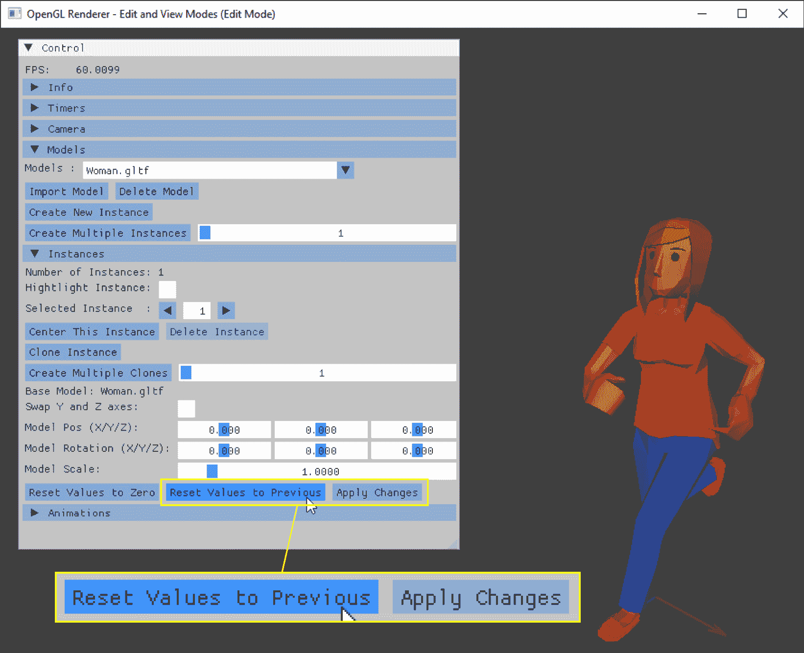

# 提高应用程序处理能力

欢迎来到**第四章**！在前一章中，我们添加了在可能的大量模型和实例中选择单个实例的能力。我们从简单的“移动到”功能开始，并在下一步添加了对当前实例的高亮显示。然后，我们通过使用鼠标实现了视觉选择。最后，我们创建了一个空对象，以允许选择没有任何实例。

在本章中，我们将重点关注编辑模式。首先，我们将通过创建一个单独的视图模式来添加关闭所有控制和菜单的能力。编辑和视图模式之间的分离将帮助我们后续章节在配置实例设置时停止所有自动操作。接下来，我们将实现撤销功能的简化版本，允许我们在应用更改后重置模型实例的设置。最后一步，我们将实现实例级别的设置撤销和重做。

在本章中，我们将涵盖以下主题：

+   在编辑和视图模式之间切换

+   在应用更改之前撤销更改

+   实现撤销和重做功能

# 技术要求

本章的示例源代码位于`chapter04`文件夹中，对于 OpenGL 位于`01_opengl_edit_view_mode`子文件夹，对于 Vulkan 位于`02_vulkan_edit_view_mode`。

在第三章中使实例选择变得容易之后，接下来要解决的问题是更改实例的设置。目前，屏幕上有一个控制菜单，如果指针放在 ImGui 窗口上，则会捕获鼠标输入。我们做出的任何更改都将保留在当前应用程序会话中。将任何意外的旋转或缩放撤销到与之前完全相同的确切值可能非常困难，因为我们必须记住之前的值来撤销更改。

我们现在将应用程序更改为切换到一个没有任何控制或选择模式的模式，并添加一个相当简单但实用的撤销和重做功能，以便将更改回滚到实例或向前推进。

# 在编辑和视图模式之间切换

如果我们启动当前版本的应用程序，我们会看到，每当我们要更改实例时，用户界面都会阻塞屏幕的大部分区域。

**图 4.1**显示了当所有标题都展开时用户界面窗口的外观：


图 4.1：用户界面遮挡屏幕部分

随着本书后面将添加越来越多的选项，用户界面可能会占用更多的可用窗口空间。此外，如果高亮显示处于活动状态，并且坐标箭头位于所选实例下方，则所选实例会闪烁。

要改变整体外观，我们必须检查在单独的视图模式中应该禁用哪些功能。

## 决定在视图模式下应该切换什么

我们本节的主要目标是移除 ImGui **控制**窗口，以便整个应用程序可以用于与模型实例交互。我们本可以简单地关闭用户界面的渲染，但如果我们不显示用户界面窗口，就没有必要进行任何计算，如计时器和 FPS 更新。因此，对于第一个决定，我们将跳过**查看模式**中的用户界面。

我们还必须添加一个快捷方式，以避免在用户界面不活跃时将鼠标按钮事件转发到 ImGui。ImGui 保存所有控制元素的位置，如果我们切换用户界面而鼠标指针位于 ImGui 窗口上方，我们仍然会得到不希望出现的副作用，例如无法移动相机。

即使没有用户界面，所有与实例选择相关的部分仍然处于活动状态。这意味着在查看模式下我们不需要实例选择，因为没有用户界面就无法调整实例参数。我们在这里的第二个决定是关闭与实例选择相关的一切。我们将禁用鼠标拾取，包括选择着色器、坐标箭头和高亮计算。

我们还将调整窗口标题，以反映应用程序当前的查看/编辑状态。从渲染器更改窗口属性需要一点回调“魔法”，但这有助于立即看到应用程序处于何种模式。

大多数查看和编辑模式的切换实现都很简单。我们只需要一个变量来保存当前状态，以及一些分支来为两种模式启用或禁用上述指定的操作。

## 添加状态变量及代码

作为第一步实现，我们在`opengl`文件夹中的`OGLRenderData.h`文件中创建一个新的`enum`类，命名为`appMode`：

```cpp
enum class appMode {
  edit = 0,
  view
}; 
```

对于 Vulkan 渲染器，`appMode` `enum`类将位于`vulkan`文件夹中的`VkRenderData.h`文件中。

此外，必须为 OpenGL 渲染器添加一个名为`rdApplicationMode`的变量到`OGLRenderData`结构体中，以及为 Vulkan 渲染器相应的`VkRenderData`结构体：

```cpp
 appMode rdApplicationMode = appMode::edit; 
```

我们将`rdApplicationMode`初始化为编辑模式的值，以避免在启动时对应用程序功能产生可见的变化。

根据模式，要启用或禁用渲染器中的功能，我们可以简单地检查`rdApplicationMode`变量的值：

```cpp
 if (mRenderData.rdApplicationMode == appMode::edit) {
    ...
  } 
```

例如，要在具有和没有选择支持的动画着色器之间切换，使用以下行：

```cpp
 if (mMousePick &&
          mRenderData.rdApplicationMode == appMode::edit) {
        mAssimpSkinningSelectionShader.use();
      } else {
        mAssimpSkinningShader.use();
      } 
```

要在查看模式下禁用用户界面的渲染，我们在渲染器中对用户界面的`render()`调用周围添加一个检查应用程序模式：

```cpp
 if (mRenderData.rdApplicationMode == appMode::edit) {
    mUIDrawTimer.start();
    mUserInterface.render();
    mRenderData.rdUIDrawTime = mUIDrawTimer.stop();
  } 
```

我们也在查看模式下禁用了计时器调用——没有屏幕上的用户界面，填充计时器值将是计算资源的浪费。

通过按热键从编辑模式切换到查看模式并返回。如果我们完全禁用用户界面，我们无法在这里使用 ImGui 按钮，因为我们需要按钮来切换回编辑模式。

## 在两种模式之间切换并更改标题

对于模式切换，在渲染器的`handleKeyEvents()`方法中执行了对`F10`键的简单检查：

```cpp
 if (glfwGetKey(mRenderData.rdWindow, GLFW_KEY_F10) ==
      GLFW_PRESS) {
    mRenderData.rdApplicationMode =
      mRenderData.rdApplicationMode == appMode::edit ?
      appMode::view : appMode::edit;
    setModeInWindowTitle();
  } 
```

任何其他未使用的键可以通过将相应的 GLFW 键名作为`glfwGetKey()`调用的第二个参数放置来实现。

对`setModeInWindowTitle()`的调用需要进一步解释，因为我们正在使用回调函数来更改应用程序窗口的标题字符串。函数调用本身简短且简单：

```cpp
void OGLRenderer::setModeInWindowTitle() {
  if (mRenderData.rdApplicationMode == appMode::edit) {
    setWindowTitle(mOrigWindowTitle + " (Edit Mode)");
  } else {
    setWindowTitle(mOrigWindowTitle + " (View Mode)");
  }
} 
```

我们在渲染器的`init()`方法中保存原始窗口标题，并将默认模式（**编辑模式**）追加到窗口标题中：

```cpp
 mOrigWindowTitle = getWindowTitle();
  setModeInWindowTitle(); 
```

由于窗口类初始化渲染器类，我们必须将窗口标题更改请求向后移动，从渲染器到应用程序窗口。

首先，在渲染器头文件`OGLRenderer.h`（用于 OpenGL）和`VkRenderer.h`（用于 Vulkan）中创建了两个`std::function`别名：

```cpp
using GetWindowTitleCallback =
  std::function<std::string(void)>;
using SetWindowTitleCallback =
  std::function<void(std::string)> 
```

我们还在渲染器的声明中添加了两个`public`方法：

```cpp
 SetWindowTitleCallback setWindowTitle;
    GetWindowTitleCallback getWindowTitle; 
```

使用别名使得处理对`std::function`的调用更加容易。

接下来，我们在`window`文件夹中的`Window`类头文件`window.h`中创建了两个与回调签名匹配的方法：

```cpp
 std::string getWindowTitle();
    void setWindowTitle(std::string newTitle); 
```

此外，还添加了一个名为`mWindowTitle`的`private`成员变量，用于存储窗口的当前标题：

```cpp
 std::string mWindowTitle; 
```

将窗口标题存储在变量中可能对调试日志打印很有用。

然后，在`Window`类的`init()`方法中初始化渲染器之后，使用了两个 lambda 函数将`Window`类函数调用转发给渲染器：

```cpp
 mRenderer->getWindowTitle = [this]()
    { return getWindowTitle(); };
  mRenderer->setWindowTitle = this { setWindowTitle(windowTitle); }; 
```

现在我们按`F10`时，渲染器将模式字符串追加到原始窗口标题中，并通过回调将创建的字符串转发给窗口类。这样，当前应用程序模式就显示在应用程序窗口的标题文本中。

在*图 4.2*中，用户界面和选择已被禁用。检查窗口标题以查看当前模式：


图 4.2：查看模式中没有用户界面

在查看模式下没有用户界面窗口时，整个应用程序窗口都可以用来在虚拟世界中飞行。通过按*F10*，我们可以回到编辑模式以调整模型实例的参数。

## 对未来变化的展望

对于本书后面添加的每个新功能，我们必须决定如何在编辑和查看模式下处理该功能。其中一些新功能仅在编辑模式下可行，例如在*第六章*中添加和配置不同的摄像机。另一方面，使用摄像机最好在查看模式下进行，因为我们只需要在我们创建的虚拟世界中漫游时在不同的摄像机之间切换。每次我们都要考虑新功能的用法。

在添加了单独的视图模式后，让我们回到基本的应用处理。每次我们选择一个实例并更改其中一个设置时，我们都会被新的值所困扰，没有适当的方法来将实例状态重置为“最后已知良好”的设置。在下一节中，我们将添加一个基本机制，至少将模型实例的最后更改撤销。

# 在应用更改之前撤销更改

当前模型查看器应用的主要目的是查看模型实例。但是，在纯模型查看旁边，调整实例属性和设置将在整本书中成为应用的一个更大部分。而更改设置可能会出错。一个预览更改的解决方案听起来像是一个很好的功能来添加。

## 基本思想

一个简单的回滚方法将允许我们接受实例设置的更改，或者将相同的设置撤销到之前的值。我们可以尝试实验值，尝试将实例移动到正确的目的地，或者调整其他参数以满足我们的需求。当我们对结果满意时，我们按下**应用**按钮，实例设置就被永久化了。相同的流程可以用于下一个实例，依此类推，直到我们将所有实例放置到我们想象中的位置。

## 添加代码和用户界面元素

首先，我们在`UserInterface`类的`UserInterface.h`头文件中添加了两个新的`private`成员：

```cpp
 std::shared_ptr<AssimpInstance> mCurrentInstance;
    InstanceSettings mSavedInstanceSettings{}; 
```

在`mCurrentInstance`智能指针中，我们存储当前选定的实例，而在`mSavedInstanceSettings`变量中，我们将保存当前选定实例的原始设置。

由于我们在用户界面中多次检索当前实例，我们可以在`CollapsingHeader`块内的所有其他地方简单地删除`currentInstance`声明。

读取当前选定实例的设置保持不变：

```cpp
 if (numberOfInstances > 0) {
      settings = modInstData.miAssimpInstances.at(
        modInstData.miSelectedInstance)
        ->getInstanceSettings(); 
```

此外，我们还要检查当前选定的实例是否与新的`mCurrentInstance`指针不同：

```cpp
 if (mCurrentInstance !=
          modInstData.miAssimpInstances.at(
          modInstData.miSelectedInstance)) {
        mSavedInstanceSettings = settings;
        mCurrentInstance =
          modInstData.miAssimpInstances.at(
          modInstData.miSelectedInstance);
      }
    } 
```

每当当前实例更改时，我们将新的选定实例存储在`mCurrentInstance`指针中，同时我们也将刚刚检索到的实例设置保存到`mSavedInstanceSettings`变量中。

`mSavedInstanceSetting`变量现在使我们能够撤销实例的设置，撤销任何更改。为了切换设置撤销，我们在现有的`Reset Values to Zero`按钮下方添加了一个名为`Reset Values to Previous`的新按钮：

```cpp
 ImGui::SameLine();
    if (ImGui::Button("Reset Values to Previous")) {
        settings = mSavedInstanceSettings;
    } 
```

要撤销任何更改，我们将保存的实例设置复制回当前设置变量。在`CollapsingHeader` **实例**的末尾，设置中的值被保存到当前选定的实例中。Et voilà，我们已经将设置撤销到了选择实例时的状态。

应用更改只是执行相反的复制操作：

```cpp
 ImGui::SameLine();
    if (ImGui::Button("Apply Changes")) {
      mSavedInstanceSettings = settings;
    } 
```

在这里，保存的设置被实例的当前设置覆盖，使得当前设置成为撤销操作的新默认值。

*图 4.3* 展示了两个新按钮的位置：



图 4.3：撤销实例设置或永久应用的按钮

通过使用**应用更改**按钮，将当前对模型实例的更改永久化。而使用**重置值到之前**按钮，我们可以将实例的任何更改撤销到我们按下**应用更改**之前的那个状态。

## 当前解决方案的缺点

使用两个按钮来应用或撤销每个实例设置更改既耗时又繁琐。一个自动应用更改且更频繁的版本将生成在编辑实例属性时的更好工作流程。本节的一般思想将保持不变；我们只是添加了一些更多的自动行为。

让我们创建一个真实的撤销和重做解决方案。

# 实现撤销和重做功能

几乎每个应用程序都有一种方法可以撤销一个或多个操作，许多应用程序还允许撤销已撤销的步骤。两种方式都可能发生意外；撤销不想要的撤销可以节省用户大量时间和压力。

## 我们需要什么来创建撤销和重做？

要能够撤销一个改变对象属性的简单操作，我们需要保存前一个值。然后可以通过将“旧”值应用到相同的对象上来撤销该更改，并恢复该对象在更改之前的状态。

对于更复杂的撤销操作，存储操作类型也是必需的。如果我们删除了某些内容，撤销步骤必须重新创建具有相同属性的对象，反之亦然——撤销创建新对象的操作将删除该对象。

还可以考虑其他选项。我们是否想要存储绝对的前一个值，还是只存储与新值之间的差异？通过存储相对值，在撤销操作之后重做更改可以使用调整后的值作为基础，而绝对值将覆盖中间的调整。并且我们是否存储该对象的完整设置，还是只存储更改的参数？其含义与之前的绝对值和相对值类似。

从技术角度来看，我们的实现将使用两个堆栈：一个用于可能的撤销操作，另一个用于可能的重做操作。每次配置更改都会将新的和旧的设置推送到撤销堆栈，通过应用旧的设置来允许撤销更改。

在执行撤销操作之后，将直接从撤销堆栈中取出完全相同的设置组合并将其推送到重做堆栈。如果我们现在对相同的操作进行重做，新设置将被应用，并且设置将移回撤销堆栈。

这个简单的流程将使我们几乎可以无限地撤销和重做，主要受限于计算机内存的容量。而且，由于设置很小，用这两个堆栈填满计算机内存将需要很长时间。

在撤销和重做的道路上迈出的第一步是创建一个存储容器类，该类封装了我们需要的所有信息，以便在任一方向上撤销设置。

## 创建设置存储类

新的类称为 `AssimpSettingsContainer`，其头文件和实现文件位于模型文件夹中。在头文件中，声明了一个结构体来存储我们为撤销和重做所需的所有设置：

```cpp
struct AssimpInstanceSettings {
  std::weak_ptr<AssimpInstance> aisInstance;
  InstanceSettings aisInstanceSettings{};
  InstanceSettings aisSavedInstanceSettings{};
}; 
```

`AssimpInstanceSettings` 结构体保存了实例的先前和当前设置，以及指向实例的弱指针。在这里使用 `std::weak_ptr` 而不是 `std::shared_ptr` 有两个重要原因：

+   弱指针打破了包含实例 `std::shared_ptr` 的 `miAssimpInstances` 向量与存储撤销/重做的设置之间的依赖关系，因为弱指针不会被添加到实例智能指针的引用计数器中。如果我们使用另一个共享指针来存储撤销/重做信息，那么删除实例的内存可能不会被释放，因为可能存在另一个活动引用存储在撤销或重做栈中的某个地方。

+   当使用 `lock()` 调用请求通过弱指针返回共享指针时，我们可以轻松地找到已删除的实例并移除保存的设置。如果共享指针不再可用，`lock()` 调用将返回 `nullptr`，我们只需在相应的栈上使用 `pop()` 调用来移除无效的设置。

如果我们想要保存实例的设置实例，我们调用 `AssimpSettingsContainer` 类的 `apply()` 方法。`apply()` 方法创建一个新的 `AssimpInstanceSettings` 对象，并将设置推送到撤销栈。

我们在通过 `apply()` 保存新设置的同时也清空重做栈。在我们撤销了几次更改并应用了最近更改之后，使用重做操作可能毫无意义，因为重做操作可能会与最新更改产生冲突，甚至覆盖最新更改。从重做栈中移除所有设置是避免最新更改应用后副作用的一种快速且安全的方法。

`undo()` 和 `redo()` 方法的实现简短且简单：

1.  通过从弱指针请求共享指针来检查任何已删除的实例，如果实例指针无效，则移除设置结构体。检查将在 `while()` 循环中完成，以找到所有已删除的实例。

1.  如果栈为空（即，因为所有为撤销或重做保存了设置的实例都已消失），我们立即从操作中返回。

1.  从栈中获取顶部条目，并在撤销操作的情况下应用保存的设置到实例，或者在重做操作的情况下应用新设置。

1.  将栈顶条目推送到相反的栈中，并移除栈顶条目。

现在，所有相关的实例更改都可以保存到撤销堆栈中。如果我们选择撤销对实例的更改，我们也可以立即重做完全相同的更改。在后台，包含旧的和新的设置以及实例指针的结构体只是在撤销和重做操作的两个堆栈之间移动。

将新操作添加到渲染器需要一些额外的工作。

## 将存储类连接到渲染器

渲染器将通过两个新方法扩展与撤销/重做相关代码，分别称为`undoLastOperation()`和`redoLastOperation()`。

在每种方法的开始，我们都在设置容器上调用相应的操作：

```cpp
 mModelInstData.miSettingsContainer->undo();
  assignInstanceIndices(); 
```

此外，还将发出对`assignInstanceIndices()`的调用。在撤销和重做操作之后枚举所有实例至关重要。从堆栈中取出的设置在删除其他实例后，`isInstanceIndexPosition`变量中的实例索引可能无效，导致访问`miAssimpInstance`向量之外的内容。

枚举的一个副作用是在`miAssimpInstances`向量中的位置变化。因此，我们不能仅仅使用新的`isInstanceIndexPosition`来选择被撤销或重做操作更改的实例。相反，我们从`AssimpInstanceSettings`中检索更改实例的实例指针，并使用`std::find_if`在`miAssimpInstance`向量中搜索匹配的指针。如果我们找不到正确的实例，将选择空实例，导致没有实例被选中。

## 定义撤销和重做的快捷键

要通过在键盘上使用已知的关键组合来使用撤销和重做功能，我们在渲染器中的`handleKeyEvents()`方法中添加了新键：

```cpp
 if (mRenderData.rdApplicationMode == appMode::edit) {
    if (glfwGetKey(mRenderData.rdWindow,
        GLFW_KEY_Z) == GLFW_PRESS &&
        (glfwGetKey(mRenderData.rdWindow,
        GLFW_KEY_LEFT_CONTROL) == GLFW_PRESS ||
        glfwGetKey(mRenderData.rdWindow,
        GLFW_KEY_RIGHT_CONTROL) == GLFW_PRESS)) {
      undoLastOperation();
    }
    ...
  } 
```

在这里，只展示了撤销部分，使用键盘组合`CTRL + Z`，就像许多其他应用程序一样。当按下`CTRL + Y`时，会调用重做功能，这也是一个众所周知的关键组合，用于重做更改。

撤销和重做功能仅在编辑模式下激活。我们无法在查看模式下调整实例设置，因此我们也不需要撤销或重做更改。

现在，我们可以通过键盘组合调用撤销和重做功能。然而，为了更方便地访问，通过菜单栏访问这两个操作会更好。

## 添加 ImGui 菜单以允许直接访问

幸运的是，可以通过几个 ImGui 调用来添加菜单栏：

```cpp
 if (ImGui::BeginMainMenuBar()) {
    if (ImGui::BeginMenu("Edit")) {
      if (ImGui::MenuItem("Undo", "CTRL+Z")) {
        modInstData.miUndoCallbackFunction();
      }
      if (ImGui::MenuItem("Redo", "CTRL+Y")) {
        modInstData.miRedoCallbackFunction();
      }
      ImGui::EndMenu();
    }
    ImGui::EndMainMenuBar();
  } 
```

就像其他 ImGui 小部件一样，主菜单栏本身以及菜单栏中的所有菜单都从`ImGui::Begin*()`行开始，并以`ImGui::End*()`行结束。与其他 ImGui 小部件一样，ImGui 菜单命令在激活时（即通过在菜单项上单击左鼠标按钮）返回一个布尔值`true`。

此外，我们再次在`ModelAndInstanceData`结构体中使用回调函数，将撤销和重做操作的工作负载从用户界面移动到渲染器。

在*图 4.4*中，显示了应用程序的新 ImGui 菜单栏：


图 4.4：主菜单栏，包含带有撤销和重做条目的编辑菜单

```cpp
Practical sessions section.
```

## 我们撤销/重做实现的限制和增强

当前撤销/重做实现的最大缺点是限制了对单个实例配置更改的反应。我们没有捕获其他功能，如加载或删除模型，或一次创建多个模型实例。

为多个实例添加撤销/重做支持需要对`AssimpSettingsContainer`类进行扩展，以在单个组中存储所有受影响的实例。在撤销或重做操作中，我们不想逐个实例进行操作，但所有实例应同时出现或消失。

包括对撤销/重做堆栈的模型更改需要重新设计设置容器类。现在，我们必须检查我们正在处理哪种类型的对象，并添加模型更改以及受影响的实例更改。删除一个模型也会删除该模型的所有实例；撤销操作需要恢复模型及其所有实例及其相应的设置。

将当前实现的撤销/重做功能扩展到支持多个实例和模型更改，可以在本章末尾的*实践课程*部分找到一个任务。但请注意，构建一个成熟的撤销/重做系统并非易事，并且需要大量的时间。

如您所见，保持一致的撤销/重做功能会增加应用程序的很多开销，但投入在良好的撤销和重做处理上的时间是值得的。任何应用程序的未来用户都会感谢程序员能够从不受欢迎的更改中恢复，比如意外的更改，甚至元素的删除。

# 概述

在本章中，我们添加了第二种应用程序模式，以禁用所有不适用于虚拟世界访问的功能。用户界面、选择以及属于这些主题的所有部分现在可以通过热键禁用。接下来，我们测试了实例设置更改的基本回滚操作和启用简单的撤销。最后，我们将回滚增强为实例级别任何设置更改的撤销/重做功能。

在下一章中，我们将实现将所有模型和实例的当前配置保存到文件中的功能，以及从保存的文件中恢复所有模型和实例。有了工作的保存和加载功能，我们可以在任何时候停止更改虚拟世界，并在稍后的时间点以完全相同的状态继续。

# 实践课程

您可以在代码中添加一些内容：

+   将**导入模型**按钮移动到菜单栏。

**导入模型**按钮可能从一开始就感觉有点放错位置，但现在我们有机会改变其功能。将按钮的功能移动到菜单栏的子菜单中，使其更容易理解如何将模型导入到应用程序中。

+   当应用程序关闭时添加一个确认对话框。

如果我们现在使用像 `ALT + F4` 这样的快捷键组合或点击图标来关闭窗口，应用程序会立即结束。添加一个简单的弹出对话框，包含是/否问题，允许用户停止另一个可能的事故性操作。由于我们现在有了菜单栏，你也可以创建一个 File->Exit（文件->退出）的条目，调用相同的逻辑在关闭应用程序前请求确认。哦，别忘了当请求应用程序退出时切换回编辑模式。一个隐藏的退出对话框几乎不可用。

+   增强难度：添加一个功能齐全的撤销/重做。

目前，我们只存储简单的设置更改。扩展`AssimpSettingContainer`类以存储实例的添加和删除事件。你可能需要一个`enum`来存储操作，因为在撤销和重做操作期间，你需要执行相反的操作。你可能需要调整两个栈以存储实例设置的向量。对实例进行大量添加应该可以通过单个撤销或重做调用在两个方向上回滚，而不是对每个组中的单个实例进行操作。

# 其他资源

+   用于撤销/重做操作的命令模式：[`gameprogrammingpatterns.com/command.html`](https://gameprogrammingpatterns.com/command.html)

+   《*C++游戏编程*》由*Sanjay Madhav*著，由*Pearson Addison-Wesley*出版，ISBN 978-0134597201
