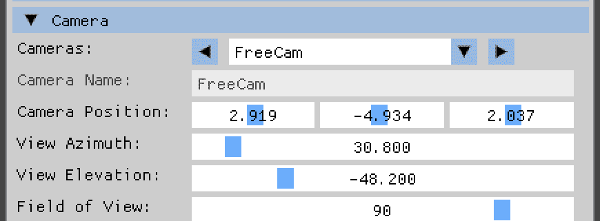
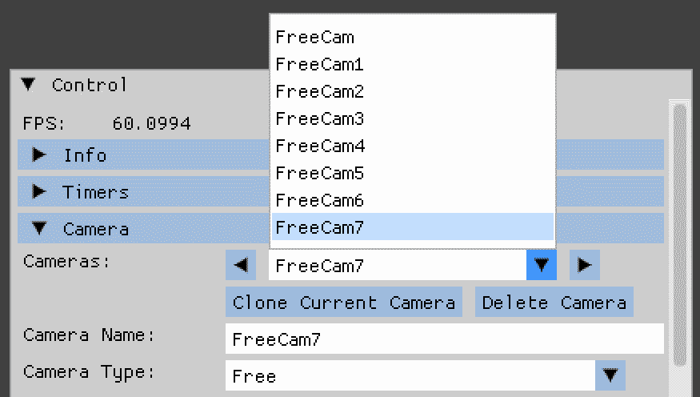
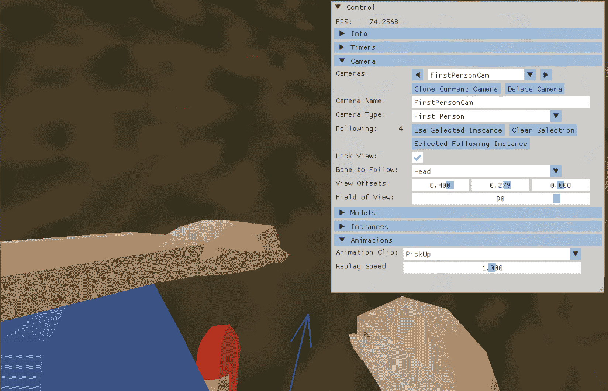
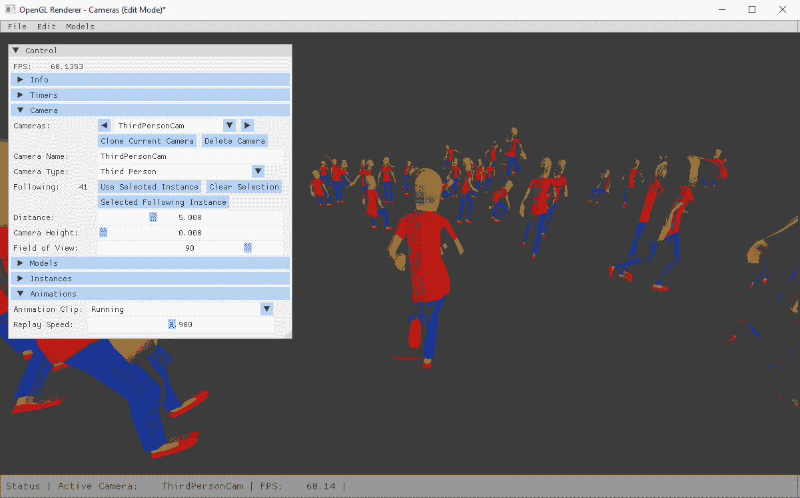
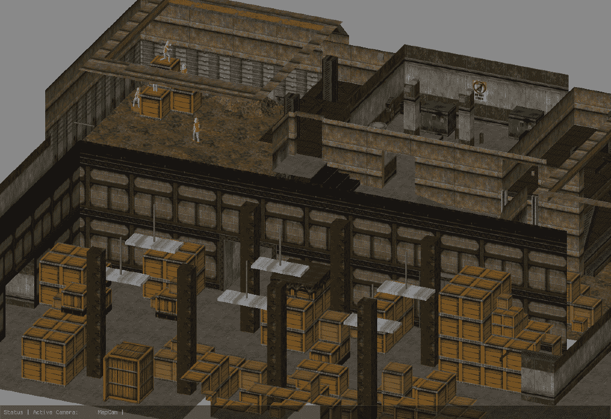

# 扩展相机处理

欢迎来到**第六章**！在*第五章*中，我们添加了保存和加载应用程序配置的功能。首先，我们探讨了数据类型、文件格式以及要保存到文件中的数据。然后，我们实现了一个解析类来以 YAML 文件格式编写和读取配置文件。在本章末尾，所有模型和实例以及全局设置都通过使用`yaml-cpp`库存储在一个 YAML 文件中，并且所有数据都可以被读取回应用程序，使我们能够继续构建虚拟世界。

在本章中，我们将增强相机配置。作为前两个步骤，我们将扩展应用程序以处理多个相机并添加多种相机类型。然后，我们将实现第一人称和第三人称视图的相机类型，就像在真实游戏中跟随所选实例一样。接下来，我们将添加固定相机，允许以监控风格的视图查看虚拟场景。作为最后一步，我们将添加一个热键来切换相机，以及正交投影和基于鼠标滚轮的视野调整。

在本章中，我们将涵盖以下主题：

+   添加多个相机

+   创建不同类型的相机

+   实现第一人称和第三人称相机

+   添加固定相机

+   在相机和配置之间切换

# 技术要求

示例代码位于`chapter06`文件夹中，在`01_opengl_cameras`子文件夹中为 OpenGL，在`02_vulkan_cameras`子文件夹中为 Vulkan。

# 添加多个相机

在*第三章*中，我们在用户界面中添加了一个按钮，可以跳转到任何实例。但我们仍然以相同的角度和距离选择每个实例，并且返回到地图上不同模型的精彩组合几乎是不可能的。你可能需要写下相机值或截图，但这远远不够完美。

能够向场景中添加几乎无限数量的相机，使我们能够创建令人惊叹的地图和模型组合，并且可以随时返回该视图。通过添加不同类型的相机，我们甚至可以更进一步——一个相机以第三人称追逐一个实例；另一个相机以等距视图展示整个地图；还有一个相机通过实例的虚拟眼睛观察虚拟世界——所有这些都可以通过按热键或选择菜单来实现。

所有这些点将在本章末尾实现。因此，让我们从第一步开始，向应用程序添加多个相机对象。

## 从单个相机到多个相机的阵列

目前，应用程序中只有一个相机，定义在 `tools` 文件夹中的 `Camera` 类中。这个相机提供了一个对虚拟世界的自由视图。我们可以沿所有三个轴移动，并围绕三个轴中的两个轴旋转。在这个阶段，对于模型和动画查看器应用程序来说，围绕指向屏幕内部的轴（翻滚）旋转对于模型和动画查看器应用来说不太有用，因为我们只会看到头部向一侧倾斜的效果。此外，在没有固定参考（如地平线）的情况下，在三维空间中导航相机可能相当困难。因此，我们只实现了上下（仰角）和围绕垂直轴（方位角）的旋转。升级相机旋转和添加鼠标或键盘控制以围绕第三个轴旋转留给你作为练习。

相机位置和两个旋转角度的值存储在 OpenGL 的 `OGLRenderData` 结构体中，以及 Vulkan 的 `VkRenderData` 结构体中：

```cpp
float rdViewAzimuth = 330.0f;
float rdViewElevation = -20.0f;
glm::vec3 rdCameraWorldPosition =
  glm::vec3(2.0f, 5.0f, 7.0f); 
```

为了支持多个相机，我们需要一个简单的 `std::vector` 来存储 `Camera` 类的元素和一个 `int` 值，表示当前选中的相机是哪一个。由于这些设置比渲染更接近模型和模型实例，我们将新的相机向量存储在 `ModelAndInstanceData` 结构体中。为了匹配新的内容，我们将 `ModelAndInstanceData` 结构体重命名为 `ModelInstanceCamData`：

```cpp
struct ModelInstanceCamData {
  ...
  std::vector<std::shared_ptr<Camera>> micCameras{};
  int micSelectedCamera = 0;
  ... 
```

通过使用 IDE 的重构功能，重命名 `ModelAndInstanceData` 结构体以及类和函数中的变量，只需几鼠标点击和一些文本编辑即可完成。

除了新的结构体名称外，我们还将文件从 `ModelAndInstanceData.h` 重命名为 `ModelInstanceCamData.h`，并将文件从 `model` 文件夹移动到 `opengl` 文件夹（对于 Vulkan 是 `vulkan` 文件夹）。最后，将头文件存储在包含渲染器的文件夹中是一个个人偏好的问题，但考虑到我们主要从渲染器访问结构体，这样做是有很多意义的。

在 `UserInterface` 类中，我们在 `ImGui::CollapsingHeader` 的定义中添加了一个包含可用相机名称的组合框，命名为 `Cameras`。组合框的代码可以从模型或动画剪辑选择中提取并调整。

## 提取相机设置

与实例设置类似，我们将主要相机设置提取到一个单独的结构体中，称为 `CameraSettings`。包含相机变量的单独结构体使得读取或一次性应用所有相机相关设置变得更加容易，而不是通过设置器和获取器访问所有设置。

`CameraSettings` 结构体位于 `tools` 文件夹中的头文件 `CameraSettings.h` 中：

```cpp
struct CameraSettings{
  std::string csCamName = "Camera";
  glm::vec3 csWorldPosition = glm::vec3(0.0f);
  float csViewAzimuth = 0.0f;
  float csViewElevation = 0.0f
}; 
```

在相机名称旁边，我们开始定义世界位置和相机的两个视角：方位角和仰角。

在`Camera`类中，必须包含新的`CameraSettings.h`头文件，并添加一个新的私有成员变量`mCamSettings`。可以移除包含位置、方位角和仰角的三个旧变量。所有访问这三个变量（位置和视图角度）的方法都必须更改为在新的`mCamSettings`变量中存储和检索值。

我们必须为新的`CameraSettings`添加一个获取器和设置器方法。获取器和设置器将允许我们像处理模型实例一样处理相机，通过简单的变量赋值来操作相机设置。

## 调整渲染器

由于渲染器需要更新相机的位置和视图，我们还需要升级一些方法以使用选定的相机。

第一步始终是获取当前相机的指针并读取`CameraSettings`，以便更容易访问和更改：

```cpp
 std::shared_ptr<Camera> cam =
    mModelInstCamData.micCameras.at(
      mModelInstCamData.micSelectedCamera);
  CameraSettings camSettings = cam->getCameraSettings(); 
```

如果我们更改了任何值，我们必须将设置存储回相机：

```cpp
 cam->setCameraSettings(camSettings); 
```

然后，在`handleMousePositionEvents()`方法中，我们将所有变量从旧的`mRenderData`变量更改为，如下面的代码所示：

```cpp
 **mRenderData.rdViewAzimuth** += mouseMoveRelX / 10.0; 
```

包含新相机设置的新`camSettings`变量看起来像这样：

```cpp
 **camSettings.csViewAzimuth** += mouseMoveRelX / 10.0f; 
```

在渲染器的`draw()`方法中也需要进行类似的更改。

首先，我们从渲染器类中移除私有的`mCamera`成员变量，因为我们永远不会再次使用单个相机。然后，我们获取相机的指针并读取当前的相机设置。

现在，相机的更新将不再使用旧的`mCamera`变量：

```cpp
 **mCamera.**updateCamera(mRenderData, deltaTime); 
```

相反，我们通过`cam`指针更新当前选定的相机：

```cpp
 **cam->**updateCamera(mRenderData, deltaTime); 
```

对于投影矩阵，我们使用新的`camSettings`变量来读取当前配置的视场。

```cpp
 mProjectionMatrix = glm::perspective(
    glm::radians(static_cast<float>(
      **camSettings.**csFieldOfView)),
    static_cast<float>(mRenderData.rdWidth) /
    static_cast<float>(mRenderData.rdHeight),
  0.01f, 500.0f); 
```

我们通过访问`cam`指针来读取更新的视图矩阵：

```cpp
 mViewMatrix = **cam->**getViewMatrix(); 
```

最后，在渲染器的`centerInstance()`方法中，对相机`moveCameraTo()`方法的调用也需要调整。我们不再使用旧的`mCamera`变量，如下面的代码所示：

```cpp
 **mCamera.**moveCameraTo(...); 
```

现在，我们直接在`micCameras`向量中访问当前相机：

```cpp
**mModelInstCamData.micCameras.****at****(**
 **mModelInstCamData.micSelectedCamera)->**moveCameraTo(...); 
```

在这里提取当前相机的指针没有意义，因为这只是在`camera`实例上的一次单一操作。

## 将自由相机定义为默认相机

就像空模型和空实例一样，我们应该确保在`micCameras`向量中始终至少有一个相机。避免空数组可以让我们摆脱很多边界检查，并且始终可用的自由相机在新配置或所有现有相机被移除后是一个很好的特性。

为了简化默认自由相机，将在渲染器类中添加一个名为`loadDefaultFreeCam()`的新方法：

```cpp
void OGLRenderer::loadDefaultFreeCam() {
  mModelInstCamData.micCameras.clear(); 
```

首先，我们清除包含所有相机的向量。然后，我们创建一个新的具有一些默认值的相机设置对象，将设置应用到相机上，并将相机作为第一个实例添加：

```cpp
 std::shared_ptr<Camera> freeCam =
    std::make_shared<Camera>();
  CameraSettings freeCamSettings{};
  freeCamSettings.csCamName = "FreeCam";
  freeCamSettings.csWorldPosition = glm::vec3(5.0f);
  freeCamSettings.csViewAzimuth = 310.0f;
  freeCamSettings.csViewElevation = -15.0f;
  freeCam->setCameraSettings(freeCamSettings);
  mModelInstCamData.micCameras.emplace_back(freeCam);
  mModelInstCamData.micSelectedCamera = 0;
} 
```

您可以根据需要调整默认自由相机的设置。前一个代码片段中显示的设置只是将世界原点居中，使加载的第一个模型出现在屏幕中央。

最后，我们将选定的相机设置为零，即我们新添加的相机的索引。

每当我们需要删除所有相机并添加默认相机（即创建新配置时），我们只需调用 `loadDefaultFreeCam()` 即可。

对于用户界面，当选择相机实例 0 时，我们应该通过在名称字段周围调用 `ImGui::BeginDisabled()` 和 `ImGui::EndDisabled()` 来禁用对默认自由相机名称的更改。

*图 6.1* 展示了相机部分的最终用户界面：



图 6.1：新的相机设置

在相机之间切换现在就像选择新的基础模型或新的动画剪辑一样简单。除了组合框外，还添加了两个箭头，允许我们直接选择上一个和下一个相机。

对于真正的相机管理，缺少两个函数：创建新相机和删除现有相机（默认相机除外）。

## 添加和删除相机

要创建相机，可以采取两种路径：

+   在原点添加相机，使用默认值

+   克隆当前选定的相机及其所有设置（除名称外）

强迫用户返回原点并将新相机移动到虚拟世界中的期望位置感觉有些不合适。一个更好的解决方案是能够克隆当前选定的相机，因为用户最可能希望使当前虚拟世界的视图保持不变。

克隆和删除功能都由新的回调函数处理，将检查和所有工作的负担从用户界面转移到渲染器。新的渲染方法，称为 `cloneCamera()` 和 `deleteCamera()`，简短且简单，因此这里省略了列表。

然而，处理相机名称需要一些额外的注意。组合框中的重复名称会令人困惑，因此我们必须找到在克隆相机时创建唯一名称的解决方案。创建新名称的一个简单方法是在名称后附加一个数字，并在进一步的克隆中递增该数字。

处理新名称的方法称为 `generateUniqueCameraName()`，定义在渲染类中。该方法只有一个参数，即相机基础名称。

首先，我们复制基础名称，因为如果相机名称已被使用，我们将在 `while` 循环中调整名称，并定义一个名为 `matches` 的字符串，包含从零到九的所有数字：

```cpp
 std::string camName = camBaseName;
  std::string matches("01234567890");
  while (checkCameraNameUsed(camName)) { 
```

在循环中，我们检查相机名称是否已有一个数字作为后缀。如果没有，我们简单地附加一个 1：

```cpp
 const auto iter = std::find_first_of(camName.begin(),
    camName.end(), matches.begin(), matches.end());
 if (iter == camName.end()) {
      camName.append("1");
    } else { 
```

如果我们找到一个数字，那么我们将不带尾随数字的相机名称保存到 `cameraNameString` 中，将现有的相机编号转换为 `int`，将数字增加一，将新数字转换回字符串，并将原始相机名称和新数字组合起来：

```cpp
 std::string cameraNameString = camName.substr(0,
        std::distance(camName.begin(), iter));
      std::string cameraNumString = camName.substr(
        std::distance(camName.begin(), iter));
      int cameraNumber = std::stoi(cameraNumString);
      camName = cameraNameString +
        std::to_string(++cameraNumber);
    }
  } 
```

这样，当我们克隆现有相机时，我们可以创建唯一但仍然可理解的相机名称。

`generateUniqueCameraName()` 中的 `while` 循环使用另一个新方法 `checkCameraNameUsed()`。通过遍历现有相机并比较相机名称与建议的新名称来检查相机名称是否已被使用：

```cpp
bool OGLRenderer::checkCameraNameUsed(std::string
    cameraName) {
  for (const auto& cam : mModelInstCamData.micCameras) {
    if (cam->getCameraSettings().csCamName == cameraName) {
      return true;
    }
  }
  return false;
} 
```

同样的 `checkCameraNameUsed()` 方法将在用户界面中用于检测重命名相机时的重复名称。与用户界面中的大多数地方一样，使用对渲染器的回调来进行名称检查，将工作移至渲染器类。

在 *图 6.2* 中，显示了用于克隆和删除相机的新的按钮，以及多次按下 **克隆当前相机** 按钮的结果：



图 6.2：新的克隆和删除按钮，以及一些新的相机

作为从单一相机过渡的最后一步，我们必须将基于 YAML 的配置文件更改为反映新的相机配置。

## 调整相机配置的加载和保存

为了加载和保存新的相机设置，我们必须更改 `tools` 文件夹中的 `YamlParser` 类中的 YAML 解析和输出。

解码 YAML 相机节点可以通过类似解码 `glm::vec3` 或 `InstanceSettings:` 的方式实现，通过在头文件 `YamlParserTypes.h` 中的新 `convert` 模板块中添加一个新的 `decode` 方法：

```cpp
Template<>
  struct convert<CameraSettings> {
  static bool decode(const Node& node,
      CameraSettings& rhs) {
    CameraSettings defaultSettings = CameraSettings{};
    rhs.csCamName =
        node["camera-name"].as<std::string>();
     try {
      rhs.csWorldPosition =
         node["position"].as<glm::vec3>();
    } catch (...) {
       rhs.csWorldPosition =
         defaultSettings.csWorldPosition;
    }
     try {
      rhs.csViewAzimuth =
          node["view-azimuth"].as<float>();
      } catch (...) {
        rhs.csViewAzimuth = defaultSettings.csViewAzimuth;
     }
    try {
        rhs.csViewElevation =
          node["view-elevation"].as<float>();
     } catch (...) {
        rhs.csViewElevation =
          defaultSettings.csViewElevation;
     } 
```

在解析节点时处理抛出的异常确保在出现格式错误或缺失键的情况下尽可能恢复相机配置。如果无法解析相机名称，则跳过整个相机以避免命名问题。

我们还添加了 `encode` 方法以实现模板的完整实现。有了 `decode` 函数，我们可以通过将 `CameraSettings` 类型传递给 `.as<>()` 调用来简单地读取包含相机设置的节点：

```cpp
... camNode.as<CameraSettings>(); 
```

为了将相机配置输出到保存文件，我们创建一个序列并为每个可用的相机添加一个映射：

```cpp
 ...
  mYamlEmit << YAML::BeginMap;
  mYamlEmit << YAML::Key << "cameras";
  mYamlEmit << YAML::Value;
  mYamlEmit << YAML::BeginSeq;
  for (const auto& cam : modInstCamData.micCameras) {
    CameraSettings settings = cam->getCameraSettings();
    mYamlEmit << YAML::BeginMap;
    mYamlEmit << YAML::Key << "camera-name";
    mYamlEmit << YAML::Value << settings.csCamName;
   ...
  }
  mYamlEmit << YAML::EndSeq;
  mYamlEmit << YAML::EndMap; 
```

在保存的 YAML 配置文件中，将为每个相机出现一个新的序列，将所有相机设置作为键/值对存储：

```cpp
cameras:
  - camera-name: FreeCam
    position: [2.9061296, 11.1587305, 64.1114578]
    view-azimuth: 289.300262
    view-elevation: -34.4999695 
```

由于我们对配置文件进行了重要更改，我们应该通过新的版本号来反映新的磁盘格式。

## 提高配置文件版本

在输出器中调整配置文件版本号很容易；我们只需将版本号字符串从 `1.0` 提高到类似 `1.1` 或 `2.0` 的值。从现在起，所有保存的配置文件都将具有新的版本号。

加载配置文件现在变得更加复杂。如果我们想支持旧文件格式，我们必须保留所有用于解析先前文件版本内容的方法。在读取要解析的文件版本号之后，我们必须决定是否要解析多相机的新的序列风格，或者获取单相机的设置并将这些设置应用到始终可用的默认`free`相机上。保存配置可以在新版本中完成，从而实现从旧版本到新版本的配置文件迁移。

通过支持读取旧版本来更新配置是*实践课程*部分的任务之一。

现在我们可以创建一些自由浮动的相机，将相机放置在我们的虚拟世界中，并通过用户界面在相机之间切换。这听起来还是有点无聊，不是吗？让我们通过添加不同的相机类型来增强应用程序。

# 创建不同的相机类型

在虚拟世界中能够添加多个相机是添加一些预定义相机设置的良好基础。不同的相机类型在视图移动和相机本身的移动方面表现不同。

我们在`Enums.h`文件中定义了一个名为`cameraType`的新`enum`类：

```cpp
enum class cameraType {
  free = 0,
  firstPerson,
  thirdPerson,
  stationary,
  stationaryFollowing
}; 
```

在`CameraSettings`结构体中，必须添加一个`cameraType`类型的新变量：

```cpp
 cameraType csCamType = cameraType::free; 
```

名称已经很好地说明了相机类型的目的。以下是所有类型的相关信息：

+   `free`相机在之前的代码示例中已经介绍过了。我们可以自由地在五个自由度内移动：三个方向和两个旋转。对于相机或视图，没有任何运动限制。

+   `firstPerson`相机做的是第一人称游戏中相机的功能：它允许你通过主角的眼睛看到虚拟世界。在我们的应用程序中，我们将相机附着到实例的头部，并像实例一样移动相机和视图。然而，将有一个选项解锁视图，以避免奇怪的视角或运动病。

+   `thirdPerson`相机像另一个人或无人机一样跟随选定的实例，显示与实例看到相同的虚拟世界角度，但来自实例身体的*外部*。可以进行一些视图调整，如与实例的距离，但相机的运动和视图都由实例控制。

+   `stationary`相机可以与固定式监控相机相比较。`stationary`相机可以放置在世界上的任何位置和任何角度，但一旦相机被锁定，除了视野之外，不可能进行任何移动或视图调整。视野设置保持解锁状态，以便可以进行缩放，就像普通监控相机一样。

+   最后，`stationaryFollowing` 相机是一种特殊的监控相机。虽然用户无法控制（再次，除视场设置外）移动和视图，但这种类型的相机将自动将选定的实例居中，无论实例是否直接可见。如果实例移动，相机将在虚拟世界中跟踪该实例。

根据相机类型，我们必须在渲染器中限制相机设置的一部分。每次我们无法更改特定的相机设置，如位置时，我们也将禁用相同设置的用户界面控制。

我们将从第一人称和第三人称相机开始，因为这两种相机类型在行为变化和数据检索方面有大量共同点。

# 实现第一人称和第三人称相机

对于第一人称相机，`tools` 文件夹中 `CameraSettings.h` 头文件中的 `CameraSettings` 结构体需要一些额外的变量：

```cpp
 bool csFirstPersonLockView = true;
  int csFirstPersonBoneToFollow = 0;
  std::vector<std::string> csFirstPersonBoneNames{};
  glm::mat4 csFirstPersonBoneMatrix = glm::mat4(1.0f);
  glm::vec3 csFirstPersonOffsets = glm::vec3(0.0f); 
```

新变量 `csFirstPersonLockView` 用于控制第一人称视角是否跟随实例骨骼的运动，或者放松该限制并启用自由视角，但仍然保持在固定位置。我们需要一个模型骨骼的骨骼来将相机连接到；变量 `csFirstPersonBoneToFollow` 允许我们设置我们将要跟随的骨骼。在用户界面中，`csFirstPersonBoneNames` 向量的内容用于显示包含所有骨骼名称的组合框，所选骨骼将被保存在 `csFirstPersonBoneToFollow` 中。最后一个变量 `csFirstPersonOffsets` 可以用来稍微移动相机位置，防止相机被放置在实例头部或其他奇怪的位置。

由于我们正在进行骨骼动画，我们需要访问包含相机虚拟连接的骨骼的平移、旋转和缩放矩阵。我们可以通过重新实现第一章中的动画代码来获取矩阵，或者我们可以在*第二章*的计算着色器完成计算最终矩阵数据后从着色器存储缓冲对象中提取骨骼矩阵。

对于实际应用，你应该使用分析器来检查两种版本的成本。在示例应用中，我们将使用计算着色器结果来避免再次进行相同的动画计算。

关于第一人称模型注意事项

对于许多第一人称风格的游戏，第一人称模型将与同一角色的第三人称模型不同。

有时，头部元素被移除或旋转掉。如果玩家在头部移除以避免干扰视图的同时看到手臂、手和腿，这会产生拥有虚拟身体的*感觉*。在其他游戏中，身体被完全移除，只绘制部分模型，如从肘部以下的下半臂或从肩部以上的手臂。这种视图给出了简单但仍然*足够好*的虚拟身体表示，对玩家来说。

在这里，我们为所有相机类型使用相同的模型，仅仅是因为在相机切换时动态交换模型将导致大量的额外开销。如果你对在第一人称视角中使用另一个模型所需的努力感兴趣，你被鼓励将切换模型的逻辑并行添加到相机类型中。

`CameraSettings` 结构体的另一个新增功能是跟踪实例的弱指针：

```cpp
 std::weak_ptr<AssimpInstance> csInstanceToFollow{}; 
```

与撤销/重做设置类似，我们使用 `std::weak_ptr` 而不是 `std::shared_ptr`，以避免如果跟踪的实例被移除时出现的问题。

通过添加一个按钮将当前所选实例存储在相机设置的 `csInstanceToFollow` 变量中，可以在用户界面中捕获实例。但请注意检查空实例，否则你将得到不希望的结果，并且相机将位于原点。

## 获取第一人称视图的骨骼矩阵

第一人称魔法的第一个部分是我们想要将相机附加到的骨骼的最终 TRS 的检索。在渲染器的 `draw()` 调用中，紧随第二个计算机着色器之后，我们从 `mShaderBoneMatrixBuffer` SSBO 中提取骨骼矩阵：

```cpp
glm::mat4 boneMatrix =
  mShaderBoneMatrixBuffer.getSsboDataMat4(
  selectedInstance * numberOfBones + selectedBone, 1).at(0); 
```

我们使用重载的 `getSsboDataMat4()` 方法来读取所选实例所选骨骼位置的单个 `glm::mat4`。为了能够从 SSBO 读取多个矩阵，`getSsboDataMat4()` 返回一个 `glm::mat4` 的 `std::vector`。但由于我们只需要一个矩阵，我们通过使用 `.at(0)` 提取向量的第一个矩阵。

相机偏移矩阵通过简单的 `glm::translate()` 调用计算：

```cpp
glm::mat4 offsetMatrix = glm::translate(glm::mat4(1.0f),
  camSettings.csFirstPersonOffsets); 
```

最后，使用一个稍微有些怪异的调用来计算骨骼的位置：

```cpp
cam->setBoneMatrix(
  mWorldPosMatrices.at(selectedInstance) *
  boneMatrix * offsetMatrix *
  glm::inverse(modelType.second.at(0)
    ->getModel()->getBoneList().at(selectedBone)
    ->getOffsetMatrix())); 
```

通过使用正确的矩阵乘法顺序（根据库的不同，GLM 使用从右到左），执行以下操作：

1.  从模型中获取所选骨骼的偏移矩阵并计算偏移矩阵的逆。骨骼的偏移矩阵包含该骨骼在皮肤位置和默认 **T-pose** 之间的偏移。

1.  将骨骼偏移矩阵的逆矩阵与相机位置偏移矩阵相乘，将相机稍微移离骨骼偏移。

1.  将最终的骨骼 TRS 矩阵乘以之前骨骼偏移和相机矩阵的乘积，将相机移动到相对于模型根的正确位置。

1.  将所选实例的世界位置偏移量乘以，将相机移动到所选实例所选的骨骼。

在计算完骨骼矩阵后，我们需要更新相机并重新上传视图和投影矩阵到 GPU：

```cpp
 cam->updateCamera(mRenderData, deltaTime);
      mViewMatrix = cam->getViewMatrix();
     std::vector<glm::mat4> matrixData;
     matrixData.emplace_back(mViewMatrix);
     matrixData.emplace_back(mProjectionMatrix);
     mUniformBuffer.uploadUboData(matrixData, 0); 
```

现在，接下来的魔法部分：计算位置、方位角和仰角。

## 计算第一人称相机参数

要从骨骼的旋转矩阵中获得世界位置和方位角以及仰角，需要一些技巧：

1.  首先，我们从矩阵中设置相机位置：

    ```cpp
    mCamSettings.csWorldPosition = mFirstPersonBoneMatrix[3]; 
    ```

在行主序旋转矩阵中，平移存储在最后一行的前三个列中。通过提取整个行并丢弃第四个值，我们立即得到骨骼的平移。

1.  对于仰角视图角度，我们通过将骨骼 TRS 矩阵与向上指的向量相乘来旋转：

    ```cpp
    glm::vec3 elevationVector =
      glm::mat3(mFirstPersonBoneMatrix) * mSideVector; 
    ```

矩阵-向量乘法通过骨骼 TRS 矩阵上存储的角度旋转参考向量 `mSideVector`。在理论上，我们可以使用任何向量作为参考；在这里，我们使用指向正 Z 轴的单位向量。

结果向量指向在动画计算过程中应用于所选骨骼的方向。

1.  接下来，我们计算仰角：

    ```cpp
    mCamSettings.csViewElevation =
      glm::degrees(std::atan2(glm::length(
      glm::cross(elevationVector, mWorldUpVector)),
      glm::dot(elevationVector, -mWorldUpVector))) - 90.0f 
    ```

通过使用双元素反正切，我们可以计算两个给定向量之间的角度。在这里，我们使用向上指的 `mWorldUpVector` 作为第二个参数，因为我们对相对于垂直轴的旋转角度感兴趣。反正切计算结合了两个角度之间的余弦和正弦角度计算。有关公式的详细信息，在 *附加资源* 部分有一个链接。

将结果角度从弧度转换为度后，我们减去 90 度以获得相对于地平线的角度（`mWorldUpVector` 指向上方）。与通常用于计算两个向量之间角度的余弦加点积方法相比，这种方法在接近参考向量的角度上数值上更稳定。

仰角限制

注意仰角的一个重要限制：仰角的总范围仅为 180 度（从-90 度到 90 度）。你不能比直接向上看更多，也不能比直接向下看更多。试图调整超出限制的仰角会导致围绕 `X` 轴旋转 180 度——方位角将进行调整，而仰角仍然在限制范围内。

在这一点上，相机具有与所选骨骼相同的上下角度。

我们可以以类似的方式计算方位角：

1.  首先，我们通过将骨骼 TRS 矩阵与向量相乘来旋转一个向量。我们再次使用指向正 Z 轴的向量 `mSideVector`：

    ```cpp
    glm::vec3 azimuthVector =
      glm::mat3(mFirstPersonBoneMatrix) * mSideVector; 
    ```

1.  然后，我们计算旋转后的向量与另一个单位向量之间的角度：

    ```cpp
    mCamSettings.csViewAzimuth =
      glm::degrees(
        glm::acos(
          glm::dot(
            glm::normalize(
              glm::vec3(
                azimuthVector.x, 0.0f, azimuthVector.z)),
              -mSideVector
            )
         )
      ); 
    ```

与仰角相比，这里需要两个主要差异：

+   点积不是从整个旋转角度计算的，而是通过将 `Y` 坐标设置为零将其映射到二维。这种映射的原因可能并不明显——当使用所有三个维度时，仰角部分（上下）可能小于方位角部分（围绕垂直轴旋转）并且点积计算了错误的角度。通过消除仰角部分，我们得到正确的结果。

+   我们计算与指向相反方向的向量的点积。这种符号变化是获取方位角正确值所必需的。或者，我们可以取点积结果的相反数以获得相同的效果。

1.  作为最后一步，我们检查最初计算的 `azimuthVector` 向量的 `x` 分量是否小于零，并相应地调整旋转角度：

    ```cpp
     if (azimuthVector.x < 0.0f) {
                mCamSettings.csViewAzimuth =
                  360.0f - mCamSettings.csViewAzimuth;
              } 
    ```

通常情况下，我们只从调用反余弦函数 `std::acos()` 获得介于 0 到 180 度之间的角度。通过考虑结果旋转向量的方向，我们可以修改计算以检索 0 到 360 度之间的完整角度。

如果我们现在从计算出的仰角和方位角值创建视图方向，相机将正好朝向选定的骨骼：

```cpp
 updateCameraView(renderData, deltaTime); 
```

*图 6.3* 展示了模型进行**拾取**动画的第一人称视角：



图 6.3：拾取动画期间的第一人称视角

你可以看到实例蹲下并试图从地上取东西，但你看到的是实例的眼睛直接看到的动画，而不是从外部看到的。请注意，相机可能最终位于模型内部某个位置，由于我们只绘制三角形的侧面，这可能导致图形伪影。对于第三人称视角，需要采用不同的方法。

## 在第三人称视角中移动相机

在第三人称视角中，我们不需要跟随模型的任何骨骼。我们只需要跟随模型的位置。位置可以通过实例的 `InstanceSettings` 获取。但有一个问题：我们必须将相机的位置设置在实例后面。

首先，我们必须通过使用实例的旋转来计算方位角：

```cpp
float rotationAngle = 180.0f -
  instSettings.isWorldRotation.y; 
```

由于实例和相机角度范围的不同，需要 180 度的偏移。虽然实例的范围是-180 到 180 度，但相机使用的是 0 到 360 度的范围。我们还反转了实例旋转的方向。

接下来，我们通过使用简单的三角学来计算相机与实例的偏移量：

```cpp
glm::vec3 offset = glm::vec3(
  -glm::sin(glm::radians(rotationAngle)),
   1.0f,
   glm::cos(glm::radians(rotationAngle))
) * mCamSettings.csThirdPersonDistance; 
```

使用正弦和余弦函数可以使相机围绕一个假想单位圆的中心旋转。单位圆的半径为 1，因此使用 `1.0f` 作为偏移量的 `Y` 轴会导致与地面相同的高度距离，与假想圆的半径相同。通过使用与 `csThirdPersonDistance` 变量一致的缩放，我们可以控制相机与实例的距离。并且通过 `csThirdPersonHeightOffset` 变量，我们可以单独调整相机的高度。

接下来，我们添加单独的相机高度偏移，并将相机的世界位置设置为实例世界位置加上偏移：

```cpp
offset.y += mCamSettings.csThirdPersonHeightOffset;
mCamSettings.csWorldPosition =
  instSettings.isWorldPosition + offset; 
```

现在，相机始终放置在实例后面，我们可以控制视图距离和额外的相机高度偏移。

对于视图的仰角，我们再次使用点积，这次是在从相机到实例的向量和向上指的 `mWorldUpVector` 之间：

```cpp
glm::vec3 viewDirection =
  instSettings.isWorldPosition -
  mCamSettings.csWorldPosition;
mCamSettings.csViewElevation = (90.0f -
  glm::degrees(
    glm::acos(
      glm::dot(
        glm::normalize(viewDirection), mWorldUpVector
      )
    )
  )) / 2.0f; 
```

因此，我们得到 `mWorldUpVector` 和视图方向之间角度的一半。相机略微向下指向实例的世界位置，但仍然向上足够，可以越过实例的肩膀。

*图 6.4* 展示了所选模型的第三人称视图：



图 6.4：第三人称视图

除了计算相机位置和视图角度之外，我们还应该禁用基于用户的相机移动。忽略控制相机的请求比在每一帧中明显重置相机变化给用户更好的反馈。

## 禁用手动相机移动

忽略更改相机角度的请求可以通过简单的添加来实现。我们只需要获取相机设置并围绕方块，在 `handleMouseButtonEvents()` 函数中将 `mMouseLock` 变量替换为以下条件：

```cpp
 if (!(camSettings.csCamType ==
      cameraType::thirdPerson ||
    (camSettings.csCamType == cameraType::firstPerson &&
    camSettings.csFirstPersonLockView)) &&
    camSettings.csInstanceToFollow.lock()) {
  ... 
```

这个复杂条件可以分解为以下规则：只有当以下条件都满足时，才允许锁定鼠标并手动移动相机：

+   相机类型不是第一人称或第三人称。

+   对于第一人称相机，视图是解锁的。

+   对于两种相机类型，都设置了要跟随的目标实例。

这意味着相机可以在自由相机类型上自由移动，只要没有实例被设置为第一人称和第三人称的目标，并且第一人称相机的视图没有被设置为锁定。

条件行可能看起来有点吓人，但通过使用相反的逻辑元素来创建相同的条件，以避免初始感叹号否定，可以创建出类似复杂性的布尔表达式。因此，我们可以高兴地坚持这个表达式。

由于我们没有实现 *翻滚* 旋转，即指向屏幕轴的旋转，这两个新相机可能会出现意外的行为。

## 当前第一人称和第三人称相机的限制

如果您在一个第一人称摄像头中围绕 `X` 和/或 `Z` 轴旋转当前锁定实例，视图将疯狂地旋转，只跟随所选骨骼的位置而不是旋转。这种行为可以通过向摄像头添加第三个旋转并在指向屏幕的轴上进行翻滚来修复。在添加第六个自由度后，所有计算都必须调整以包括新的角度。

此外，第三人称摄像头可能被放置在旋转角度不同的模型上，或者可能需要交换 `Z` 和 `Y` 轴的模型上。

虽然添加最后一个旋转是可能的，但在应用程序中的使用仅限于第一人称视图等案例，因为您可以通过反转翻滚旋转并旋转地图而不是模型来获得相同的结果。对于 *错误* 旋转的第三人称模型，可能需要额外的固定旋转复选框或更多的偏移旋转。

鼓励您扩展当前的代码库，并添加符合本节所述边缘情况的实例设置。

在直接添加与实例位置相关的摄像头后，让我们继续添加固定摄像头。

# 添加固定摄像头

固定摄像头可以在几种情况下使用。您制作了一个看起来很棒的字符模型和道具的构图。或者，您想查看您加载的整个游戏地图的俯视图，并看到每个角色的位置。也许您甚至想跟随在地图上四处游荡的某个实例。固定摄像头是一个完美的选择。

对于纯固定摄像头，配置很简单。只需将摄像头类型添加到渲染器的 `handleMouseButtonEvents()` 方法中 `mMouseLock` 布尔值的激活状态：

```cpp
... && camSettings.csCamType != cameraType::stationary ... 
```

在 `Camera` 类的 `updateCamera()` 方法中，在检查零 `deltaTime` 之后添加以下行：

```cpp
 if (mCamSettings.csCamType == cameraType::stationary) {
    return;
  } 
```

就这样！一旦您选择了一个固定摄像头，鼠标的右键点击将被忽略，并且摄像头也将永远不会接收任何更新。

如果一个固定摄像头应该跟随一个实例，则需要更多的代码。

## 创建固定跟随摄像头

创建固定实例跟随摄像头的第一步与纯固定摄像头相同——将摄像头类型添加到渲染器类的 `handleMouseButtonEvents()` 方法中：

```cpp
if (!((camSettings.csCamType ==
  cameraType::stationaryFollowing 
```

由于我们只想在已配置要跟随的实例时禁用摄像头手动移动，因此我们必须将摄像头类型添加到第一人称和第三人称类型检查的括号中。

对于摄像头位置和视图的更新，将创建一个结合第一人称和第三人称算法的混合。您将识别出来自上一节中的代码示例。

首先，我们获取实例并从摄像头到实例位置计算视图方向：

```cpp
std::shared_ptr<AssimpInstance> instance =
  mCamSettings.csInstanceToFollow.lock();
glm::vec3 viewDirection = instance->getWorldPosition() -
  mCamSettings.csWorldPosition; 
```

接下来，我们将视图的仰角设置为视图方向与向上指向的 `mWorldUpVector` 之间角度的余弦值：

```cpp
mCamSettings.csViewElevation = 90.0f -
  glm::degrees(
    glm::acos(
      glm::dot(
        glm::normalize(viewDirection), mWorldUpVector
      )
    )
  ); 
```

在第一人称和第三人称相机中，使用视图方向与向上指向的向量的点积已被非常相似地使用。

然后，我们将相同的视图方向向量映射到二维，并计算*展开*的视图方向向量与指向负 z 轴的向量之间的角度：

```cpp
float rotateAngle =
glm::degrees(
  glm::acos(
    glm::dot(
      glm::normalize(
        glm::vec3(viewDirection.x, 0.0f, viewDirection.z)),
      glm::vec3(0.0f, 0.0f, -1.0f)
    )
  )
); 
```

最后，我们将方位角扩展到完整的 360 度：

```cpp
if (viewDirection.x < 0.0f) {
  rotateAngle = 360.0f – rotateAngle;
}
mCamSettings.csViewAzimuth = rotateAngle 
```

2D 映射向量、点积以及将方位角扩展到 360 度而不是仅点积的 180 度，对于第一人称相机来说完全相同。

当我们现在使用`stationaryFollowing`类型为相机并选择一个实例作为目标时，相机视图将自动跟随实例，无论我们将其移动到何处。但手动移动相机和相机视图是被禁止的。

处理新的相机类型已经工作得很好，但仍有改进的空间。所以，让我们给应用程序添加一些更多功能。

# 在相机和配置之间切换

为了在`micCameras`向量中更快地在可用的相机之间移动，键盘快捷键很有用。

## 配置相机选择的快捷键

我们要做的只是向渲染器的`handleKeyEvents()`方法中添加一小段代码来添加键盘快捷键：

```cpp
 if (glfwGetKey(mRenderData.rdWindow,
      GLFW_KEY_LEFT_BRACKET) == GLFW_PRESS) {
    if (mModelInstCamData.micSelectedCamera > 0) {
      mModelInstCamData.micSelectedCamera--;
    }
  }
  if (glfwGetKey(mRenderData.rdWindow,
      GLFW_KEY_RIGHT_BRACKET) == GLFW_PRESS) {
    if (mModelInstCamData.micSelectedCamera <
        mModelInstCamData.micCameras.size() - 1) {
      mModelInstCamData.micSelectedCamera++;
    }
  } 
 the number keys *1* to *9*).
```

我们也没有将相机更改限制在编辑模式中，以允许在视图模式之间切换相机。

另一个酷炫的添加是正交投影。虽然透视投影试图模仿远离相机的物体尺寸缩小，但正交投影将保留物体的尺寸。

## 添加正交投影

你可能会在*图 6.5*中认出与图片相似的游戏：



图 6.5：正交投影的小型关卡

这个版本的《半条命》地图由用户 pancakesbassoondonut 在 Sketchfab 上创建。该地图可在[`skfb.ly/6ACOx`](https://skfb.ly/6ACOx)找到，并授权于 Creative Commons Attribution 许可 CC BY 4.0 ([`creativecommons.org/licenses/by/4.0/`](https://creativecommons.org/licenses/by/4.0/))。

早期的游戏仅出于美学原因使用了正交投影。在不缩放纹理或改变面角的情况下，创建看起来令人惊叹的游戏所需的计算能力非常有限。

为了支持正交投影，我们在`Enums.h`文件中创建了一个名为`cameraProjection`的新`enum`类：

```cpp
enum class cameraProjection {
  perspective = 0,
  orthogonal
}; 
```

在`CameraSettings`结构体中，我们添加了两个新变量，分别命名为`csCamProjection`和`csOrthoScale`：

```cpp
 cameraProjection csCamProjection =
    cameraProjection::perspective;
  float csOrthoScale = 20.0f; 
```

虽然`csCamProjection`用于在透视和正交投影之间切换，但`csOrthoScale`变量将定义正交投影的缩放级别样式设置，类似于透视投影的视野设置。

当前创建投影矩阵的代码将移动到对新投影设置的检查中：

```cpp
 if (camSettings.csCamProjection ==
    cameraProjection::perspective) {
 ...
  } else { 
```

如果选择了正交投影，我们将使用`glm::ortho()`而不是`glm::perspective()`来创建投影矩阵。首先，我们读取`csOrthoScale`并使用该值来缩放纵横比以及左右和远近平面的距离：

```cpp
 float orthoScaling = camSettings.csOrthoScale;
    float aspect = static_cast<float>(mRenderData.rdWidth)/
      static_cast<float>(mRenderData.rdHeight) *
      orthoScaling;
    float leftRight = 1.0f * orthoScaling;
    float nearFar = 75.0f * orthoScaling; 
```

`glm::ortho()`的调用创建正交投影矩阵，将虚拟世界的原点移动到屏幕的原点：

```cpp
 mProjectionMatrix = glm::ortho(-aspect, aspect,
      -leftRight, leftRight, -nearFar, nearFar); 
```

通过使用虚拟世界的中心作为投影矩阵的中心，我们在屏幕上得到了一个很好地缩放的结果。由于视图矩阵中的相机位置，我们甚至能够在正交绘制的虚拟世界中移动相机。

这里的唯一限制是向屏幕内部移动：当左右或上下移动相机时，视图会按预期调整，但向前或向后移动最初不会显示任何变化。这种对 z 轴方向相机移动的缺失反应是由正交投影的基本原理造成的。我们没有像透视投影那样的视锥体：投影矩阵创建了一个巨大的矩形盒，盒子内的每个三角形都会被绘制。

当相机到达一个点，其中一些三角形位于矩形盒子的远 z 平面之后时，我们需要将相机远离虚拟世界的原点移动。你可以自己尝试到达这样的点，但这将花费很多时间，即使使用更快的相机移动。

尽管正交投影看起来很酷，但请注意在这种情况下深度感知可能会很棘手。我们的大脑已经学会了，如果一个物体离我们越远，它的尺寸就会减小，并且具有相同视尺寸但距离不同的物体在现实生活中并不具有相同的尺寸。由于屏幕上所有实例的尺寸都相同，你可能会完全猜错哪些实例更靠近相机。

## 投影设置的用户界面控制

为了控制将使用哪种投影，我们在`UserInterface`类中添加了两个单选按钮。第一个单选按钮用于激活透视投影：

```cpp
 ImGui::Text("Projection:      ");
      ImGui::SameLine();
      if (ImGui::RadioButton("Perspective",
          settings.csCamProjection ==
          cameraProjection::perspective)) {
        settings.csCamProjection =
          cameraProjection::perspective;
      } 
```

第二个单选按钮激活正交投影：

```cpp
 ImGui::SameLine();
      if (ImGui::RadioButton("Orthogonal",
          settings.csCamProjection ==
          cameraProjection::orthogonal)) {
        settings.csCamProjection =
         cameraProjection::orthogonal;
     } 
```

在视场范围滑块下方，将创建一个用于正交缩放的滑块：

```cpp
 ImGui::Text("Ortho Scaling:   ");
      ImGui::SameLine();
      ImGui::SliderFloat("##CamOrthoScale",
        &settings.csOrthoScale, 1.0f, 50.0f, "%.3f", flags); 
```

复选框和滑块也被用于检查相机类型或冲突设置。禁用甚至隐藏可能会让用户困惑的控制比试图解释为什么更改设置不会得到预期的结果更好。

通过拥有多个相机和扩展的相机处理功能，探索虚拟世界和模型实例得到了提升。我们现在可以在世界的不同区域放置相机，并通过使用第一人称或第三人称相机，可以像在真实游戏中一样查看实例和实例动画。

关于相机和大型模型的注意事项

当处理大型模型或具有高缩放因子的模型时，由于模型的一些部分位于场景深度的近裁剪面和远裁剪面之外，不同类型的摄像机可能会出现裁剪问题。靠近摄像机位置的模型部分看起来有洞，而远离屏幕的模型部分可能会消失。在这些情况下，你需要调整模型的缩放或渲染器中投影矩阵的近裁剪面和远裁剪面的配置。

# 摘要

在本章中，实现了新的摄像机功能。首先，我们扩展了当前的摄像机处理以支持多个摄像机对象。接下来，定义并实现了几种摄像机类型，如第一人称和第三人称摄像机。最后，为处理摄像机添加了一些方便的功能。通过使用键盘快捷键在定义的摄像机列表之间切换，有助于简化访问，而正交投影为查看实例创造了有趣的结果。

在下一章中，我们将通过增强实例动画来为我们的虚拟世界增添更多活力。通过向实例的不同内部状态添加动画，如行走、跑步或跳跃，我们能够在虚拟世界中移动实例。并且通过在这些状态之间混合动画，不同状态之间的过渡将变得平滑。

# 实践课程

你可以在代码中添加一些内容：

+   扩展 YAML 加载器以迁移配置文件。

如在*提升配置文件版本*部分所述，添加功能以加载配置文件的旧版和新版。保存文件可以使用最新版本。

+   将振荡添加到静止的摄像机中。

就像现实生活中的监控摄像头一样，它可以有额外的能力自动左右移动，或者上下移动。可能的控制是移动的范围和速度。

+   在第三人称摄像机周围添加垂直轴的旋转。

除了只能从后面查看实例之外，添加另一个包含围绕垂直轴旋转的属性。通过将摄像机旋转 90 度，你可以创建一个三维侧滚动游戏，而通过将摄像机旋转 180 度，实例在行走或跑步时会面向你。

+   将翻滚旋转添加到摄像机中。

目前，摄像机仅支持仰角（向上和向下看）和方位角（围绕垂直轴旋转）。实现第三个旋转轴，以便摄像机可以移动到任何任意角度。

+   扩展第三人称摄像机以使其更具动作感。

你可以尝试为第三人称相机添加更多功能。比如，一个安装在弹簧上的相机，仅松散地跟随实例的运动？或者当向前移动时稍微放大一些，跟随旋转时有一定的延迟，甚至在向侧面走时稍微倾斜？或者你可以在碰撞时添加一些震动，比如实例撞到障碍物。此外，为这些不同类型设置预设也会很方便。

+   将相机实现改为四元数。

在上一个任务中添加第三维度很可能会导致旋转，从而产生万向节锁，因此再次失去一个自由度，因为一个轴旋转或接近另一个轴。将整个相机旋转改为使用四元数而不是欧拉角应该可以解决万向节锁问题。

+   添加基于样条的相机和目标路径。

要创建飞越场景，你可以添加相机位置的样条曲线，包括可配置的速度和乒乓运动。通过将样条作为目标，你可以创建虚拟世界的相机镜头。

+   在编辑模式下将相机显示为单独的对象。

与用于模型操作的箭头类似，你可以添加一个视锥体和一个小盒子来描绘虚拟世界中相机的位置和方向。不同的相机类型可以通过不同的线条颜色来显示。

+   使用鼠标使相机符号可选中。

在完成上一个任务后，你还可以将相机符号添加到选择纹理中。只需为相机保留一个专用的值范围，将盒子和/或视锥体线条绘制到选择纹理中，并根据从图形卡缓冲区返回的值在实例和相机之间切换。

+   高级难度：添加**画中画**窗口。

大多数游戏引擎都有在应用程序屏幕的小窗口中显示另一个相机最小化版本的能力。创建单独的相机显示需要向渲染器类添加一些低级功能，因为整个场景必须使用两个相机的视图和投影矩阵绘制两次。

**ImGui** 有能力将纹理绘制到屏幕上 - 你可以将第二个相机的视图渲染到纹理中，并在 ImGui 窗口中显示图像。将相机名称和类型等信息添加到窗口标题中可以进一步增强画中画模式。

为了避免在两种不同的相机类型都激活时产生混淆，将基于类型的限制仅限于编辑模式可能是一个好主意。

# 其他资源

+   3D 图形和游戏开发数学入门：[`gamemath.com/book/`](https://gamemath.com/book/)

+   如何计算三维空间中两个向量的角度：[`www.quora.com/How-do-I-calculate-the-angle-between-two-vectors-in-3D-space-using-atan2`](https://www.quora.com/How-do-I-calculate-the-angle-between-two-vectors-in-3D-space-using-atan2)
