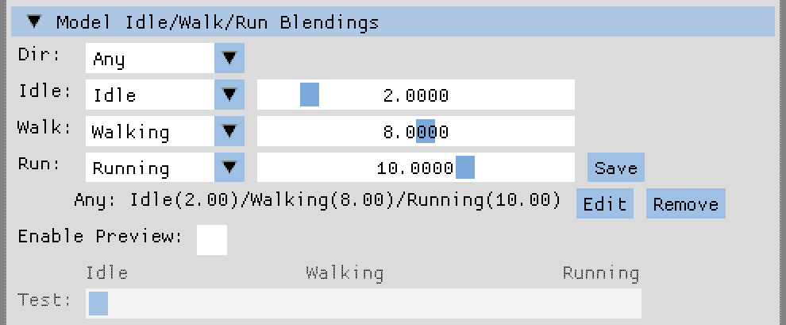
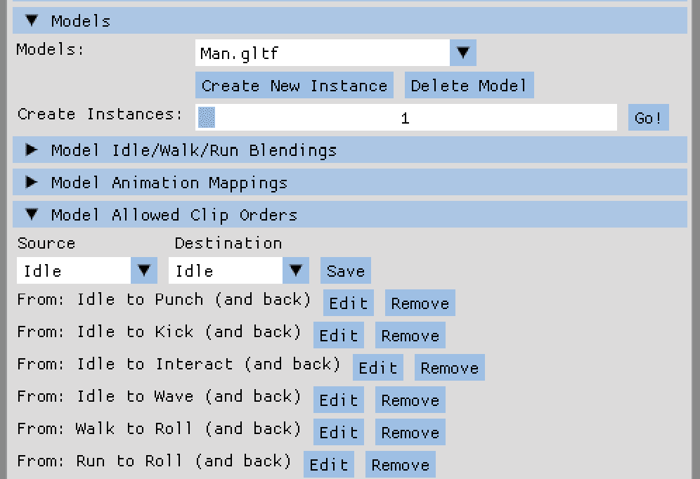
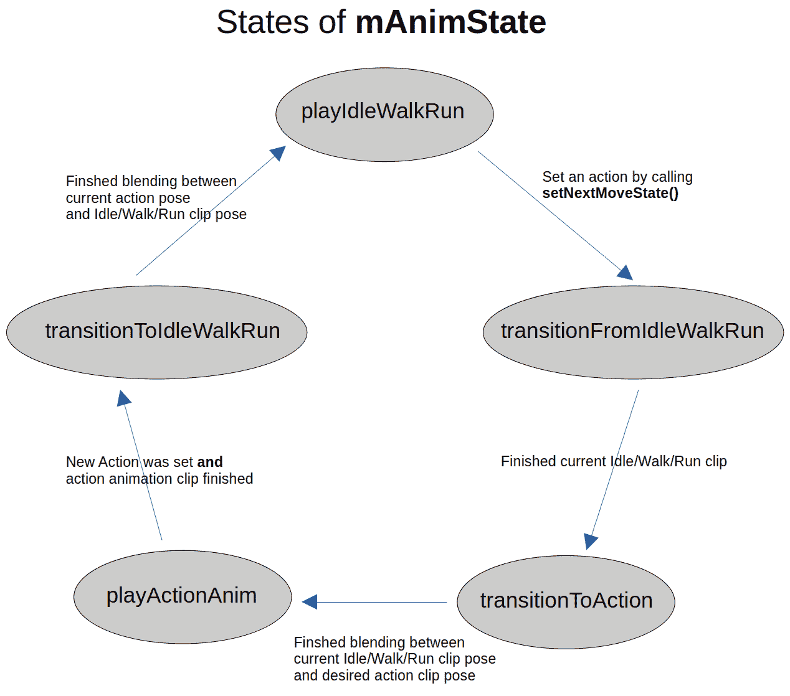

# 第七章：提升动画控制

欢迎来到**第七章**！在前一章中，我们添加了一些相机功能。我们首先实现了对多个相机对象的支持，并添加了新的相机类型。我们还设置了键盘快捷键，以便简单地选择现有的相机。作为最后一步，我们添加了一个正交相机配置，这使得我们能够创建模型实例和虚拟世界的完全不同的视图。

在本章中，我们将更新动画混合和控制到一个新的水平。首先，我们将在现有的变换计算着色器中实现两个动画之间的混合。此外，我们将每个节点的平移、缩放和旋转的计算移动到查找表上，并在 GPU 上执行。接下来，我们将向代码中添加新的实例状态，存储实例可能执行的动作类型，如行走、跑步和跳跃，以及移动方向。然后，我们将创建用户界面控件，使我们能够将现有的动画剪辑映射到实例动作。最后，我们将添加动画和动作之间的映射逻辑。

在本章中，我们将涵盖以下主题：

+   以风格混合动画

+   向代码中添加新状态

+   链接状态和动画

+   保存和加载状态

# 技术要求

在`chapter07`文件夹中的`01_opengl_animations`文件夹和`02_vulkan_animations`文件夹中的示例代码。

# 以风格混合动画

如果你解决了*第二章*中“实践环节”部分的第二个和第三个任务，并将动画混合的部分转移到 GPU 上，那么本节的部分内容可能对你来说很熟悉。但如果你跳过了这些任务，也不要担心，因为将变换数据移动到查找表并在 GPU 上进行插值计算的过程非常直接。

让我们从查找表数据开始。

## 查找表的力量

目前，动画关键帧和相应的节点变换的数据在模型加载时提取，并且所有数据都存储在`AssimpAnimChannel`对象内部的数组中。

对于每一帧中的每个节点，需要六次查找来提取前一个和当前关键帧时间的平移、缩放和旋转。然后，这些值成对插值以计算指定节点的最终变换。

然而，重复进行相同的计算是耗时的。更好的解决方案是在模型加载时生成所有插值变换，并且在播放动画时只进行最终变换值的查找。

这里的权衡很明显：GPU 内存与 CPU 计算能力。将查找表的大小设置得太小会导致可见的伪影，而将查找表数据的大小设置得太大则会浪费宝贵的 GPU 内存，而没有任何视觉上的好处。您可以尝试查找表的大小，但对于变换值来说，大约 1,000 个元素应该在视觉效果和内存大小之间达到良好的平衡。

一种替代的查找解决方案

通过为关键帧时间创建一个表并使用提取的数据作为原始变换数据的索引，可以创建一个更节省内存的查找表版本。如果您有很多节点和动画片段需要节省 GPU 内存，可以使用这种变体。或者，如果您每个动画只有少数关键帧，也可以使用这些稀疏的查找。然而，这种版本的缺点是需要再次计算每个关键帧之间的成对插值，这会增加 GPU 的计算负担。

除了新的变换数据存储之外，我们还将所有动画片段的时间长度进行缩放，使其具有相同的时间长度。无需缩放两个动画片段的长度，两个片段之间的混合变得更加简单。

## 创建查找表

作为查找表的准备，我们必须找到所有动画片段的最大长度。在将动画片段添加到`AssimpModel`类的`loadModel()`方法之前，我们遍历所有动画并将最大长度存储在一个新的`private`成员变量`mMaxClipDuration`中：

```cpp
 unsigned int numAnims = scene->mNumAnimations;
  for (unsigned int i = 0; i < numAnims; ++i) {
    const auto& animation = scene->Animations[i];
    mMaxClipDuration =
      std::max(mMaxClipDuration,
      static_cast<float>(animation->mDuration));
 } 
```

然后，最大值被用作`addChannels()`调用的附加参数：

```cpp
 for (unsigned int i = 0; i < numAnims; ++i) {
  ...
    animClip->addChannels(animation, mMaxClipDuration,
      mBoneList);
  ...
  } 
```

最后，在`addChannels()`方法内部，我们将最大持续时间传递给我们要提取的每个通道：

```cpp
for (unsigned int i = 0; i < animation->mNumChannels; ++i) {
  ...
  channel->loadChannelData(animation->Channels[i],
    maxClipDuration);
  ...
} 
```

创建查找表数据本身将通过以下代码片段展示，以创建平移数据作为示例。对于缩放和旋转，同样适用。

每个查找表的第一步是提取最小和最大关键帧时间：

```cpp
 mMinTranslateTime =
    static_cast<float>(nodeAnim->mPositionKeys[0].mTime);
  mMaxTranslateTime =
   static_cast<float>(
   nodeAnim->mPositionKeys[mNumTranslations - 1].mTime); 
```

然后，我们计算三个缩放因子：

```cpp
 float translateScaleFactor = maxClipDuration /
    mMaxTranslateTime;
  mTranslateTimeScaleFactor = maxClipDuration /
    static_cast<float>(LOOKUP_TABLE_WIDTH);
  mInvTranslateTimeScaleFactor = 1.0f /
    mTranslateTimeScaleFactor; 
```

这些包括：

+   第一个变量`translateScaleFactor`存储最大片段持续时间与最大关键帧时间的比率。在查找表数据创建中前进时间时，我们需要第一个缩放因子。

+   在`mTranslateTimeScaleFactor`中，我们计算最大片段持续时间与我们的查找表大小的比率。第二个缩放因子是查找表条目关键帧时间步宽度的简单值。

+   作为最后一个缩放因子，`mInvTranslateTimeScaleFactor`存储了`mTranslateTimeScaleFactor`值的倒数。我们将使用计算着色器中的第三个缩放因子来根据关键帧时间计算查找表中的正确索引位置。

接下来，我们将一个名为`timeIndex`的辅助变量设置为`0`，并遍历我们的查找表条目：

```cpp
 int timeIndex = 0;
  for (int i = 0; i < LOOKUP_TABLE_WIDTH; ++i) { 
```

对于每个查找表条目，我们从 `aNodeAnim` 对象的 `mPositionKeys` 数组中提取当前和下一个关键帧时间的平移数据到一个 `glm::vec4`：

```cpp
 glm::vec4 currentTranslate = glm::vec4(
      nodeAnim->mPositionKeys[timeIndex].mValue.x,
      nodeAnim->mPositionKeys[timeIndex].mValue.y,
      nodeAnim->mPositionKeys[timeIndex].mValue.z, 1.0f);
    glm::vec4 nextTranslate = glm::vec4(
      nodeAnim->mPositionKeys[timeIndex + 1].mValue.x,
      nodeAnim->mPositionKeys[timeIndex + 1].mValue.y,
      nodeAnim->mPositionKeys[timeIndex + 1].mValue.z,
      1.0f); 
```

尽管我们只需要平移的前三个值，但使用四元素向量是为了在着色器存储缓冲对象中正确对齐数据。

现在，我们提取当前和下一个关键帧的时间值，以及动画的当前时间：

```cpp
 float currentKey = static_cast<float>(
      nodeAnim->mPositionKeys[timeIndex].mTime);
    float nextKey = static_cast<float>(
      nodeAnim->mPositionKeys[timeIndex + 1].mTime);
    float currentTime = i * mTranslateTimeScaleFactor /
      translateScaleFactor; 
```

对于当前时间，使用两个缩放因子。

通过使用两个平移向量和时间值，我们可以在查找表条目的时间戳处创建两个平移的插值 `glm::vec4`：

```cpp
 mTranslations.emplace_back(glm::mix(
      currentTranslate,
      nextTranslate,
      (currentTime - currentKey) / (nextKey - currentKey))); 
```

最后，我们检查查找表条目的当前时间是否长于下一个关键帧的时间。如果是，我们增加我们的时间索引：

```cpp
 if (currentTime > nextKey) {
      if (timeIndex < mNumTranslations - 1) {
        ++timeIndex;
      }
    }
  } 
```

`mTranslations` 向量现在包含了动画剪辑每个时间点的插值平移值，步长由 `mTranslateTimeScaleFactor` 定义，通过使用倒数值 `mInvTranslateTimeScaleFactor`，如果我们知道剪辑的回放时间，我们可以访问相应的查找表条目。

## 将数据表上传到 GPU

一旦所有动画剪辑都转换为查找表，我们就可以将数组数据上传到 SSBO。缓冲区准备部分较长，因为我们必须确保所有节点都正确初始化，即使是非动画节点。在这里，我们只探讨平移步骤，因为缩放和旋转的逻辑大部分是相同的。最大的不同是，已经知道使用四元素向量来传输旋转的四元数数据到计算着色器。

作为第一步，我们创建一个 `std::vector` 的 `glm::vec4` 来存储所有节点变换的数据：

```cpp
 std::vector<glm::vec4> animLookupData{}; 
```

然后，我们定义查找表数据的大小：

```cpp
 const int LOOKUP_SIZE = 1023 + 1; 
```

在 `1023` 和 `1` 而不是数字 `1024` 的添加是一个暗示接下来会发生什么：

```cpp
 std::vector<glm::vec4> emptyTranslateVector(
      LOOKUP_SIZE, glm::vec4(0.0f));
    emptyTranslateVector.at(0) = glm::vec4(0.0f); 
```

我们创建一个长度为 `LOOKUP_SIZE` 的空向量，并用一个零值的四元素向量初始化该向量。使用零值进行平移确保非动画节点不会有平移变换。

在向量的第一个位置，我们为了文档目的再次显式地将值设置为零，因为我们将在每个查找表的第一个位置的 `x` 分量中存储 `mTranslateTimeScaleFactor`。在每个向量中存储倒数缩放因子可能看起来有点冗余，但因为我们直接将值集成到查找数据中，计算着色器将在一个地方找到所有数据。

在创建适当的空向量用于缩放和旋转之后，我们为骨骼列表中的每个骨骼创建一个平移、旋转和缩放的组合：

```cpp
 for (int i = 0; i < mBoneList.size() *
      mAnimClips.at(0)->getNumChannels(); ++i) {
      animLookupData.insert(animLookupData.end(),
        emptyTranslateVector.begin(),
        emptyTranslateVector.end());
      animLookupData.insert(animLookupData.end(),
        emptyRotateVector.begin(),
        emptyRotateVector.end());
      animLookupData.insert(animLookupData.end(),
        emptyScaleVector.begin(),
        emptyScaleVector.end());
    } 
```

通过使用数组中的全部骨骼数量，我们可能会浪费几个千字节，但不需要在计算着色器内部添加额外的逻辑来选择动画和非动画逻辑。

现在，我们遍历所有动画剪辑，并对每个剪辑的所有通道进行遍历。由于我们已使用默认值初始化了所有数据，我们只需上传动画骨骼的数据：

```cpp
 int boneId = channel->getBoneId();
        if (boneId >= 0) { 
```

`offset`值是通过使用骨骼列表大小和`LOOKUP_SIZE`来找到当前动画剪辑中通道骨骼的平移数据位置来计算的：

```cpp
 int offset = clipId * mBoneList.size() *
            LOOKUP_SIZE * 3 + boneId * LOOKUP_SIZE * 3; 
```

接下来，我们设置第一个位置`x`组件的通道的`mTranslateTimeScaleFactor`值，获取通道的平移数据，并将数据复制到查找数据向量中：

```cpp
 animLookupData.at(offset) =
            glm::vec4(channel->getInvTranslationScaling(),
            0.0f, 0.0f, 0.0f);
          const std::vector<glm::vec4>& translations =
            channel->getTranslationData();
          std::copy(translations.begin(),
            translations.end(),
            animLookupData.begin() + offset + 1); 
```

然后，将`offset`值推进到下一个查找数据位置，在存储下一个变换数据之前：

```cpp
 offset += LOOKUP_SIZE; 
```

在将所有平移、缩放和旋转数据存储在`animLookupData`向量之后，我们可以将数据上传到 SSBO：

```cpp
 mAnimLookupBuffer.uploadSsboData(animLookupData); 
```

现在，加载的模型的动画查找数据已可在 GPU 上使用。当我们需要在计算着色器中访问变换数据时，我们可以简单地绑定 SSBO。

## 调整渲染器代码和计算着色器

为了能够告诉计算着色器播放哪个动画以及/或混合，我们在`opengl`文件夹中的`OGLRenderData.h`文件中定义了一个新的`struct`，称为`PerInstanceAnimData`，用于 OpenGL：

```cpp
struct PerInstanceAnimData {
  uint32_t firstAnimClipNum;
  uint32_t secondAnimClipNum;
  float firstClipReplayTimestamp;
  float secondClipReplayTimestamp;
  float blendFactor;
}; 
```

对于 Vulkan，文件名为`VkRenderData.h`，位于`vulkan`文件夹中。

在这里，我们简单地存储第一个剪辑编号加上我们想要从第一个剪辑渲染的当前帧的时间戳。此外，还可以发送可能的第二个动画剪辑、第二个剪辑的时间戳以及两个剪辑之间的混合因子到计算着色器。

在渲染器中，我们定义了两个新的`private`数据成员：

```cpp
 std::vector<PerInstanceAnimData> mPerInstanceAnimData{};
    ShaderStorageBuffer mPerInstanceAnimDataBuffer{}; 
```

`mPerInstanceAnimData`变量存储每个实例的剪辑编号、时间戳和混合因子，而`mPerInstanceAnimDataBuffer`是动画数据 SSBO 的 CPU 端句柄。

然后，在渲染器的`draw()`调用中的实例循环中，我们使用实例的值更新每个实例的动画数据：

```cpp
 PerInstanceAnimData animData{};
          animData.firstAnimClipNum =
            instSettings.isFirstAnimClipNr;
          animData.secondAnimClipNum =
            instSettings.isSecondAnimClipNr;
          animData.firstClipReplayTimestamp =
            instSettings.isFirstClipAnimPlayTimePos;
          animData.secondClipReplayTimestamp =
            instSettings.isSecondClipAnimPlayTimePos;
          animData.blendFactor =
            instSettings.isAnimBlendFactor;
          mPerInstanceAnimData.at(i) = animData; 
```

当准备第一个计算着色器时，我们绑定动画查找数据并上传实例动画数据：

```cpp
 mAssimpTransformComputeShader.use();
        mUploadToUBOTimer.start();
        modelType.second.at(0->getModel()
          ->bindAnimLookupBuffer(0);
        mPerInstanceAnimDataBuffer.uploadSsboData(
          mPerInstanceAnimData, 1);
        mShaderTRSMatrixBuffer.bind(2); 
```

现在，我们为计算着色器所需的所有数据都已准备好进行计算。

在`assimp_instance_transform.comp`计算着色器中，在`shader`文件夹中，我们还需要定义`PerInstanceAnimData` `struct`以能够访问 SSBO：

```cpp
struct PerInstanceAnimData {
  uint firstAnimClipNum;
  uint secondAnimClipNum;
  float firstClipReplayTimestamp;
  float secondClipReplayTimestamp;
  float blendFactor;
}; 
```

并且我们使用与渲染器代码中相同的绑定点声明两个缓冲区绑定：

```cpp
layout (std430, binding = 0) readonly restrict
    buffer AnimLookup {
  vec4 lookupData[];
};
layout (std430, binding = 1) readonly restrict
    buffer InstanceAnimData {
  PerInstanceAnimData instAnimData[];
}; 
```

在计算着色器的`main()`方法中，我们定义与`AssimpModel`类中相同的查找表大小和偏移量计算：

```cpp
 **int** **lookupWidth =** **1023** **+** **1****;**
  uint node = gl_GlobalInvocationID.x;
  uint instance = gl_GlobalInvocationID.y;
  uint numberOfBones = gl_NumWorkGroups.x;
  **uint** **boneOffset = lookupWidth *** **3**;
  **uint** **clipOffset = numberOfBones * boneOffset**; 
```

现在，我们可以通过使用`instance`变量作为`InstanceAnimData` SSBO 中的索引来访问每个实例的所有动画设置：

```cpp
 uint firstClip = instAnimData[instance].firstAnimClipNum;
  uint secondClip =
    instAnimData[instance].secondAnimClipNum;
  float blendFactor = instAnimData[instance].blendFactor; 
```

例如，要获取平移数据的`mTranslateTimeScaleFactor`值，我们必须使用与 C++中相同的公式来访问剪辑的平移查找数据的第一个元素：

```cpp
 float firstTransInvScaleFactor = lookupData[firstClip *
    clipOffset + node * boneOffset].x; 
```

即使 C++和着色器公式或数据类型之间有细微的差异，也可能导致传输数据的不一致，因此我们需要在这里非常严格，确保执行完全相同的操作并使用相同的数据类型。

然后，我们使用逆时间缩放因子来计算在平移查找数据中的正确缩放索引：

```cpp
 int firstTransLookupIndex =
    int(instAnimData[instance].firstClipReplayTimestamp *
    transInvScaleFactor) + 1; 
```

第一和第二个动画剪辑的每个节点的平移数据也可以像在 C++中那样计算：

```cpp
 vec4 firstTranslation = lookupData[firstClip *
    clipOffset + node * boneOffset +
    firstTransLookupIndex];
  ...
  vec4 secondTanslation = lookupData[secondClip *
    clipOffset + node * boneOffset +
    secondTransLookupIndex]; 
```

现在，我们可以在两个动画剪辑的平移之间进行插值：

```cpp
 vec4 finalTranslation = mix(firstTanslation,
    secondTanslation, blendFactor); 
```

我们对缩放值进行相同的查找和插值。对于旋转，使用与 GLM 实现中 SLERP 相同的代码。

最后，所有三个变换矩阵的乘积存储在包含所有实例结果的 TRS 矩阵的 SSBO 中：

```cpp
 uint index = node + numberOfBones * instance;
  trsMat[index] =
    createTranslationMatrix(finalTranslation) *
    createRotationMatrix(finalRotation) *
    createScaleMatrix(finalScale); 
```

到目前为止，渲染器中的`mShaderTRSMatrixBuffer` SSBO 包含与我们使用基于 CPU 的变换计算时相同的数据。

但我们只需要上传到计算着色器的就是我们想要绘制的动画数据。因此，`AssimpInstance`类的`updateAnimation()`方法中的变换计算可以移除，留下以下三条在更新实例动画时执行的代码：

```cpp
 mInstanceSettings.isFirstClipAnimPlayTimePos +=
    deltaTime *
    mInstanceSettings.isAnimSpeedFactor * 1000.0f;
  mInstanceSettings.isAnimPlayTimePos =
    std::fmod(mInstanceSettings.isFirstClipAnimPlayTimePos,
    mAssimpMode->getMaxClipDuration());
  mModelRootMatrix = mLocalTransformMatrix *
    mAssimpModel->getRootTranformationMatrix(); 
```

我们简单地通过时间增量来推进剪辑时间，并更新实例根矩阵。

如果你现在编译并运行代码，唯一可见的差异是当实例数量增加时矩阵生成时间的显著降低。对于最新的计算机模型，达到 10,000 个甚至 20,000 个基本模型的动画实例应该没有问题。在虚拟世界中我们不需要这么多实例，但动画和动画混合的 CPU 使用率降低，这让我们在本书剩余章节中实现更多功能有了更多的自由度。

现在我们有了快速且易于使用的动画计算，我们可以实现一个基于状态的系统来组织每个实例的行为。通过定义不同的状态，如移动方向或实例将要执行的动作，我们迈出了通往可以像在简单游戏中一样控制实例的动画系统的第一步。

因此，让我们继续添加新的实例状态。

# 在代码中添加新状态

我们未来的游戏角色应该能够执行游戏角色典型的动作：等待玩家输入，向四个主要方向行走，向前奔跑，以及许多其他动作。根据可用的动画，我们可以添加跳跃或翻滚、出拳或挥手的动作状态。

为了获得最大的灵活性，我们将允许所有模型的角色执行所有配置的动作。然后我们可以使用 UI 将动画剪辑映射到我们想要为特定模型使用的每个动作。如果没有映射的动画剪辑，请求的动作将被简单地忽略。

## 使用位字段和平面枚举

我们将在`Enums.h`文件中添加两个不同的`enum` `class`定义。第一个名为`moveDirection`的`enum`是一个位字段：

```cpp
enum class moveDirection : uint8_t {
  none = 0x00,
  forward = 0x01,
  back = 0x02,
  right = 0x04,
  left = 0x08,
  any = 0xff
}; 
```

对于每个方向，可以在一个变量中设置一个不同的位。当多个值可以同时出现时，需要位字段。在我们的情况下，角色同时向前和向左跑是正常的。

两个额外的`enum`值`none`和`any`是特殊的占位符。如果角色只是闲置，强制为闲置状态设置方向会显得很奇怪，因为角色不能“向前闲置”或“向左闲置”。因此，为完全不移动设置单独的`enum`值`none`将有助于使代码更简单。值`any`可以用作通配符或回退值，用于行走状态。例如，我们可以为所有方向设置一个通用的行走动画，而不是为所有四个方向配置相同的动画剪辑，我们使用`any`方向来使用这个剪辑的所有行走动作。

为了能够在真正的位字段方式下使用`moveDirection` `enum`的值，我们必须为新的数据类型定义位运算符`OR`和`AND`。声明是简短且简单的，如下面的代码所示，这是两个移动方向之间的逻辑`AND`运算符：

```cpp
inline moveDirection operator | (moveDirection lhs,
     moveDirection rhs) {
  using T = std::underlying_type_t <moveDirection>;
  return static_cast<moveDirection>(static_cast<T>(lhs) |
    static_cast<T>(rhs));
} 
```

另一个名为`moveState`的`enum` `class`负责处理可能的角色动作：

```cpp
enum class moveState  {
  idle = 0,
  walk,
  run,
  hop,
  jump,
  ...
  wave,
  NUM
}; 
```

在这里，不需要位字段。我们可能能够同时`run`和`jump`，这些情况将在代码中处理。但大多数动作不能同时执行。

我们简单地列出所有可能的移动状态在`moveState` `enum` `class`中。最终的值`NUM`可以被用来在`for`循环中迭代所有的`enum`值，即从第一个动作（值为零的`idle`）开始，到最后一个有效的动作`wave`结束。

除了数字之外，对于移动方向和状态，在 UI 和调试消息中将变得很有用，所以我们向`ModelInstanceCamData.h`文件中的`ModelInstanceCamData`结构体添加了两个从`enum` `class`值到字符串的新映射：

```cpp
 std::unordered_map<moveDirection, std::string>
    micMoveDirectionMap{};
  std::unordered_map<moveState, std::string>
    micMoveStateMap{}; 
```

我们将在渲染器的`init()`方法中填充两个状态映射，使用适当的字符串值。接下来，我们必须扩展实例和模型的设置结构体。

## 扩展模型和实例设置

闲置、行走和跑步动画剪辑的特殊处理需要一个名为`IdleWalkRunBlending`的新`struct`，位于`model`文件夹中的新`ModelSettings.h`文件中：

```cpp
struct IdleWalkRunBlending {
  int iwrbIdleClipNr = 0;
  float iwrbIdleClipSpeed = 1.0f;
  int iwrbWalkClipNr = 0;
  float iwrbWalkClipSpeed = 1.0f;
  int iwrbRunClipNr = 0;
  float iwrbRunClipSpeed = 1.0f;
}; 
```

在这里，我们简单地存储三个动作的剪辑编号和回放速度。

新的`IdleWalkRunBlending`结构体将被添加到另一个新的`struct`中，称为`ModelSettings`，以及模型名称和文件名：

```cpp
struct ModelSettings {
  std::string msModelFilenamePath;
  std::string msModelFilename;
  std::map<moveDirection, IdleWalkRunBlending>
    msIWRBlendings;
}; 
```

`AssimpModel`类需要一个新类型的`private`数据成员`ModelSettings`：

```cpp
 ModelSettings mModelSettings; 
```

模型的文件名和名称将从`AssimpModel`类重新定位到新的`ModelSettings` `struct`，以便可以通过简单的 getter 和 setter 调用访问模型的“变量”部分，类似于实例。

在我们可以在实例中使用新的状态和动画功能之前，我们必须将两个新的`enum` `class`类型变量添加到`model`文件夹中`InstanceSettings.h`文件中的`InstanceSettings` `struct`中：

```cpp
 moveDirection isMoveDirection = moveDirection::none;
  moveState isMoveState = moveState::idle; 
```

此外，我们还必须调整动画剪辑的实例设置。由于我们可以有两个不同的动画加上动画混合，我们需要两个剪辑变量而不是一个，以及作为每个实例设置的混合因子：

```cpp
 unsigned int isFirstAnimClipNr = 0;
  unsigned int isSecondAnimClipNr = 0;
  float isAnimBlendFactor = 0.0f; 
```

我们还存储实例的速度和加速度值：

```cpp
 glm::vec3 isAccel = glm::vec3(0.0f);
  glm::vec3 isSpeed = glm::vec3(0.0f); 
```

特定实例的速度将用于选择正确的空闲、行走或跑步动画剪辑。通过使用基于加速度的运动，我们实现了角色实例更自然的外观。在现实生活中，我们在移动时也会加速和减速，而不是直接从空闲状态跳到跑步速度。

## 添加空闲/行走/跑步逻辑

空闲/行走/跑步动画剪辑的混合逻辑定义在`AssimpInstance`类中名为`playIdleWalkRunAnimation()`的方法中。

在对实例模型进行合理性检查之后，我们计算实例的绝对速度，读取包含混合设置的映射模型设置，并创建一个新的、空的`IdleWalkRunBlending`类型变量`blend`：

```cpp
 float instanceSpeed =
    glm::length(mInstanceSettings.isSpeed);
  ModelSettings modSettings =
    mAssimpMode->getModelSettings();
  IdleWalkRunBlending blend; 
```

接下来，我们检查是否已配置方向特定的动画剪辑：

```cpp
 if (modSettings.msIWRBlendings.count(
      mInstanceSettings.isMoveDirection) > 0 ) {
    blend = modSettings.msIWRBlendings[
      mInstanceSettings.isMoveDirection];
  } else if (modSettings.msIWRBlendings.count(
      moveDirection::any) > 0) {
    blend = modSettings.msIWRBlendings[moveDirection::any];
  } else if (modSettings.msIWRBlendings.count(
      moveDirection::none) > 0) {
    blend = modSettings.msIWRBlendings[moveDirection::none];
  } else {
    return;
  } 
```

如果找到了这样的方向剪辑，混合变量将填充适当的设置。如果没有找到特定方向剪辑，我们也检查特殊的`any`和`none`方向，尝试为所有方向使用通用动画。如果我们找不到通用动画剪辑，我们就从方法中返回。如果没有配置空闲/行走/跑步的剪辑，播放任何动画都没有意义。

通过使用`instanceSpeed`变量来控制是否在空闲和行走之间或行走和跑步动画之间进行混合：

```cpp
 if (instanceSpeed <= 1.0f) {
    mInstanceSettings.isFirstAnimClipNr =
      blend.iwrbIdleClipNr;
    mInstanceSettings.isSecondAnimClipNr =
      blend.iwrbWalkClipNr;
    mInstanceSettings.isAnimSpeedFactor = glm::mix(
      blend.iwrbIdleClipSpeed,
      blend.iwrbWalkClipSpeed, instanceSpeed);
    mInstanceSettings.isAnimBlendFactor = instanceSpeed;
  } else { 
```

在这里，我们根据`instanceSpeed`值缩放速度因子，并在空闲和行走动画之间进行混合。通过使用空闲的`0.0f`值和完整行走速度的`1.0f`（包括）值，动画将在实例静止不动和四处走动之间平滑混合。

要混合从行走到跑步的实例动画，我们使用一个`instanceSpeed`范围在`1.0f`（不包括）和`2.0f`之间。逻辑保持不变；我们只需从速度因子和行走与跑步剪辑之间的线性插值混合中减去`1.0f`：

```cpp
 mInstanceSettings.isFirstAnimClipNr =
      blend.iwrbWalkClipNr;
    mInstanceSettings.isSecondAnimClipNr =
      blend.iwrbRunClipNr;
    mInstanceSettings.isAnimSpeedFactor = glm::mix(
      blend.iwrbWalkClipSpeed,
      blend.iwrbRunClipSpeed, instanceSpeed – 1.0f);
    mInstanceSettings.isAnimBlendFactor =
      instanceSpeed – 1.0f;
  } 
```

选择行走速度的`1.0f`和跑步速度的`2.0f`的`instanceSpeed`值是因为它们在剪辑之间的线性插值中效果最佳。任何其他范围都是可能的；你只需相应地调整动画混合的缩放即可。

## 使用加速度和减速度

由于我们的实例应在虚拟世界中移动，我们需要控制我们所控制的实例的速度。但不是直接使用速度，我们将采用基于加速度的速度模型。使用单独的加速度值来加速或减速实例可以产生更自然的结果。像真实的物理物体一样，我们的虚拟世界中的模型实例具有惯性，这种惯性会抵抗速度变化。

首先，`AssimpInstance` 类需要三个新的 `private` `float` 变量，分别命名为 `MAX_ACCEL`、`MAX_ABS_SPEED` 和 `MIN_STOP_SPEED`：

```cpp
 const float MAX_ACCEL = 4.0f;
    const float MAX_ABS_SPEED = 1.0f;
    const float MIN_STOP_SPEED = 0.01f; 
```

在 `MAX_ACCEL` 中，我们存储模型可以达到的最大加速度，而 `MAX_ABS_SPEED` 限制了实例的速度。加速度和速度是三分量向量，向不同方向移动可能会产生更大的值。限制这两个值有助于防止实例在虚拟世界中移动得太快。

基于加速度的模型有一个主要缺点：停止实例可能变得困难。因为我们只从速度中添加和减去加速度值，达到精确的零值是困难的。为了实现完全停止，我们在 `MIN_STOP_SPEED` 变量中定义一个最小速度。如果实例的当前速度低于 `MIN_STOP_SPEED` 的值，我们将加速度和速度设置为零，最终停止实例。

实例加速度由 `AssimpInstance` 类的 `updateInstanceState()` 方法控制。基本上，我们检查移动方向并设置 `isAccel` 的相应 `x` 或 `z` 分量：

```cpp
 if (state == moveState::walk || state == moveState::run) {
    if ((dir & moveDirection::forward) ==
        moveDirection::forward) {
      mInstanceSettings.isMoveKeyPressed = true;
      mInstanceSettings.isAccel.x = 5.0f;
    }
    ... 
```

如果按下方向键，我们将 `isMoveKeyPressed` 设置为 true 并应用加速度。

当我们释放所有移动键时，实例的减速开始。减速逻辑发生在 `AssimpInstance` 类的 `updateInstanceSpeed()` 方法中：

```cpp
 float currentSpeed =
    glm::length(mInstanceSettings.isSpeed);
  static float maxSpeed = MAX_ABS_SPEED; 
```

我们还本地保存实例的最大速度。使用 `static` 变量有助于在步行和奔跑速度之间跟踪加速和减速实例。

首先，我们计算三分量 `isSpeed` 向量的长度。然后，使用这个结果长度来检查在未按下任何移动键时我们是否仍在移动：

```cpp
 if (!mInstanceSettings.isMoveKeyPressed) {
    if (currentSpeed > 0.0f) {
      if (mInstanceSettings.isSpeed.x > 0.0f) {
        mInstanceSettings.isAccel.x = -2.5f;
      }
      ... 
```

对于实例的可能移动方向，我们检查是否还有剩余速度，并使用与速度相反方向的加速度来减速实例。

如果我们的速度低于 `MIN_STOP_SPEED`，我们将强制将速度和加速度设置为零，移动状态设置为 `idle`，移动方向设置为 `none`：

```cpp
 if (currentSpeed < MIN_STOP_SPEED) {
      currentSpeed = 0.0f;
      mInstanceSettings.isAccel = glm::vec3(0.0f);
      mInstanceSettings.isSpeed = glm::vec3(0.0f);
      mInstanceSettings.isMoveState = moveState::idle;
      mInstanceSettings.isMoveDirection =
        moveDirection::none;
    }
  } 
```

限制速度和加速度到最大值是一个两步过程。如果我们超过最大值，我们将向量归一化：

```cpp
 float currentAccel =
    glm::length(mInstanceSettings.isAccel);
  if (currentAccel > MAX_ACCEL) {
    mInstanceSettings.isAccel =
      glm::normalize(mInstanceSettings.isAccel); 
```

现在 `isAccel` 向量的长度等于 `1.0f`。然后，我们将向量缩放到最大长度：

```cpp
 mInstanceSettings.isAccel *= MAX_ACCEL; 
```

在乘法之后，`isAccel` 的所有三个分量都缩放到结果长度 `MAX_ACCEL`。

更新实例速度是通过将 `isAccel` 中的加速度的 `deltaTime` 分数加到 `isSpeed` 上来完成的：

```cpp
 mInstanceSettings.isSpeed +=
    mInstanceSettings.isAccel * deltaTime; 
```

要达到跑步速度，我们将`maxSpeed`值加倍：

```cpp
 if (mInstanceSettings.isMoveState == moveState::run) {
    maxSpeed = MAX_ABS_SPEED * 2.0f;
  } 
```

如果我们不再跑步但超过`maxSpeed`，我们将减速到行走速度：

```cpp
 if (currentSpeed > maxSpeed) {
    if (mInstanceSettings.isMoveState != moveState::run) {
      maxSpeed -=
        glm::length(mInstanceSettings.isAccel) * deltaTime;
      if (maxSpeed <= MAX_ABS_SPEED) {
        maxSpeed = MAX_ABS_SPEED;
      }
    } 
```

示例代码使用简单的线性插值来达到所需的实例速度。您可能想尝试其他技术，如缓动/非缓动曲线或三次曲线，以调整不同实例速度之间的插值。

如果我们在加速到行走或跑步速度时比`maxSpeed`更快，我们将实例速度`isSpeed`限制为`maxSpeed`：

```cpp
 mInstanceSettings.isSpeed =
      glm::normalize(mInstanceSettings.isSpeed);
    mInstanceSettings.isSpeed *= maxSpeed; 
```

到目前为止，当前选定的实例将从空闲动画片段平滑地移动到行走动画片段，甚至如果我们切换到`run`状态，还可以加速到跑步动画。遗憾的是，我们目前什么也看不到，因为没有在运动状态、方向和动画片段之间建立映射。

因此，让我们将动画片段链接到现有状态。

# 链接状态和动画

我们从三个状态（空闲、行走和跑步）之间的连接开始，并将相应的模型动画片段映射到这三个状态。`IdleWalkRunBlending` `struct`和`ModelSettings` `struct`中的`msIWRBlendings`成员变量已经就位，所以我们只需要注意 UI。

## 空闲/行走/跑步动画映射

*图 7.1* 展示了**控制**窗口中三个状态（空闲、行走和跑步）的映射部分：



图 7.1：移动方向、移动状态和动画片段之间的映射

我们将从上到下逐步浏览控制元素，并探索`UserInterface`类中的`createSettingsWindow()`方法中的新代码：

+   **方向**组合框显示了`moveDirection` `enum` `class`的可用条目名称。组合框是通过使用`ModelInstanceCamData` `struct`中的`micMoveDirectionMap`映射来填充的。我们将选中的条目存储在一个`static` `moveDirection`类型变量中，以保留该值。

+   对于名为**空闲**、**行走**和**跑步**的三个组合框，我们从实例模型中提取动画片段，并将每个状态选中的片段存储在一个`static` `int`中。回放速度滑块允许我们为每个片段设置单独的回放速度。我们曾在（现已删除的）**控制**窗口的**动画**部分有相同的组合框/浮点滑块组合。

+   要存储当前的方向、片段和速度组合，请按**保存**按钮。`UserInterface`代码只是简单地创建或更新所选方向的`msIWRBlendings`条目。

+   在组合框下方，列出了所有已保存的映射。如果您按其中一个条目的**编辑**按钮，相应的行将被加载到组合框和速度滑块中。通过按**删除**，条目将被删除。

+   要启用当前映射的预览，请勾选**启用预览**复选框。在测试模式下，活动映射设置用于动画当前选定的实例并在三种状态之间混合。一旦找到了映射的良好设置，请确保禁用预览模式。

+   在**测试**滑块上方，显示了三种状态（空闲/行走/跑步）的三个动画剪辑的名称。如果您在任一组合框中选择不同的动画剪辑，您可以看到名称的变化。**测试**滑块允许您在**模型**部分启用测试模式时预览三个选定剪辑之间的动画混合。将滑块向左移动播放空闲动画剪辑；如果滑块位于中间位置，则显示行走动画剪辑；在右侧，播放跑步动画。在这三个滑块位置之间，生成并绘制空闲和行走之间以及行走和跑步之间的线性插值。

`UserInterface`代码中的一个有趣新增是使用`ImGui::PushID()`和`ImGui::PopID()`自动为每个映射创建按钮 ID：

```cpp
 ImGui::PushID(buttonId++);
        if (ImGui::Button("Edit##Blending")) {
          ...
        }
        ImGui::PopID(); 
```

ImGui 需要为每个控件元素提供一个唯一的标识符。未能提供唯一 ID 会导致不希望的结果，因为触发一个控件元素也会触发包含相同 ID 的其他元素。

通过使用递增的整数值作为标识符，每个映射行都将有唯一的**编辑**和**删除**按钮，并且按钮只会影响**它们**的映射行。

另一个 ImGui 的不错特性是能够从代码的另一部分关闭`CollapsingHeader`元素：

```cpp
 ImGui::GetStateStorage()->SetInt(
      ImGui::GetID("Model Animation Mappings"), 0); 
```

ImGui 的内部状态存储保存了当前 ImGui 窗口中元素的信息。通过`SetInt()`调用和`CollapsingHeader`名称，我们可以控制当前 ImGui 窗口中任何标题的打开/关闭状态。

这样，我们强制关闭了其他两个映射`CollapsingHeader`元素。我们在所有三个映射标题中更改动画剪辑设置，ImGui 多次应用这些设置，导致不希望的结果。

在设置完所有空闲/行走/跑步动画剪辑后，我们继续处理动作。

## 将动作映射到动画剪辑

在`moveState` `enum` `class`中，我们在实例旁边定义了几个动作，包括已经配置的`idle`、`walk`和`run`状态。根据模型文件中的动画，并非所有动作都适用于所有模型。但无需担心：代码会忽略未配置动画的动作。按下动作键将不会产生动画或动作。

所有配置的动作映射都保存到`ModelSettings.h`文件中的`ModelSettings` `struct`的新映射`msActionClipMappings`中：

```cpp
 std::map<moveState, ActionAnimation>
    msActionClipMappings; 
```

新的`ActionAnimation` `struct`包含剪辑编号和重放速度：

```cpp
struct ActionAnimation {
  int aaClipNr = 0;
  float aaClipSpeed = 1.0f;
}; 
```

我们将再次从 UI 部分开始。在*图 7.2*中，展示了动作映射的`CollapsingHeader`：


图 7.2：将运动状态映射到动画剪辑和速度

对于这种映射类型，`UserInterface`代码与空闲/行走/跑步映射类似，因为我们实际上执行的是同种类型的映射。我们有以下元素：

+   用于`moveState` `enum` `class`元素的组合框，填充了`micMoveStateMap`映射的值

+   第二个用于剪辑的组合框，由模型的动画剪辑生成

+   一个定义剪辑重放速度的速度滑块

+   一个**保存**按钮，用于将当前映射添加到`msActionClipMappings`映射中

+   一个保存的映射列表，并且每个映射行都有两个按钮来**编辑**或**删除**当前行

空闲/行走/跑步映射的说明也适用于此处。当**模型空闲/行走/跑步混合**部分中存在`none`移动方向的映射时，当前选定的剪辑*不会*播放。要预览动画剪辑，您需要暂时移除`none`方向。

要在空闲/行走/跑步状态之间以及`AssimpInstance`类中的任何动作之间进行混合，我们可以使用`msActionClipMappings`映射中的剪辑编号和重放速度，并将剪辑用作混合操作的目标剪辑：

```cpp
 mInstanceSettings.isSecondAnimClipNr =
    modSettings.msActionClipMappings[mActionMoveState]
    .aaClipNr;
  float animSpeed =
    modSettings.msActionClipMappings[mActionMoveState]
    .aaClipSpeed; 
```

如果我们想让我们的模型改变到一个动作，我们调用`AssimpInstance`类的`setNextInstanceState()`方法。渲染器在`handleMovementKeys()`方法中使用此调用来请求所选实例的状态变化：

```cpp
 moveState nextState = moveState::idle;
      ..
      if (glfwGetKey(mRenderData.rdWindow, GLFW_KEY_E) ==
          GLFW_PRESS) {
        nextState = moveState::punch;
      }
      ...
      currentInstance->setNextInstanceState(nextState); 
```

在我们深入研究动画混合逻辑之前，让我们通过查看如何设置允许的剪辑序列来完成 UI 部分。

## 定义允许的状态变化

在预览模型的不同的动画剪辑时，您会注意到有些剪辑只有在实例静止时才有效，而其他动画只有在实例行走或跑步时才可用。

为了防止剪辑之间出现不希望和不自然的过渡，例如，从空闲模型到全速跳跃动画，我们定义哪些动作状态变化是允许的。**目标**状态只能在**源**状态是当前活动状态时触发。

*图 7.3* 展示了一些允许的状态变化：



图 7.3：模型的允许状态变化

状态顺序被保存在使用包含`std::pair`元素的`moveState`条目的`std::set`的`ModelSettings` `struct`中：

```cpp
 std::set<std::pair<moveState, moveState>>
    msAllowedStateOrder; 
```

一个`std::map`在这里不起作用，因为我们需要为相同的源状态配置多个目标状态。

在所有状态都映射到动画剪辑并且配置了状态之间的依赖关系之后，我们将探讨模型动作如何连接起来以给出（主要是）平滑的混合和过渡效果。

## 使用有限状态机来控制动画流程

维护状态随时间的变化以及事件发生后从一个状态到另一个状态的转换，最佳方法是使用**有限状态机**。在 C++中，这样的状态机可以用简单的`switch`/`case`语句来建模。

在开始实现之前，让我们看看*图 7.4*中状态机的状态和转换：



图 7.4：`AssimpInstance`类中`mAnimState`变量的状态机

这五个状态以及状态之间的转换可以解释如下：

1.  我们从`playIdleWalkRun`状态机开始。在这里，默认的、基于实例速度的移动状态（空闲、行走和奔跑）之间的混合被播放。

1.  一旦请求了动作，我们检查源（当前状态）和目标（动作状态）是否在`msAllowedStateOrder`映射中。如果是，我们准备方向剪辑并切换到`transitionFromIdleWalkRun`状态。

1.  `transitionFromIdleWalkRun`状态是必要的，用于平滑地从空闲/行走/奔跑到请求的动作的过渡。大多数动画剪辑都是从身体、手臂和腿的类似姿势开始的。通过将当前的空闲、行走或奔跑动画与相同动画剪辑的起始点混合，实例被调整回其起始姿势。达到起始姿势后，我们进入`transitionToAction`状态。

1.  在`transitionToAction`中，我们从空闲、行走或奔跑动画剪辑的初始姿势混合到动作状态动画剪辑。这种转换只有几帧长，并为动作剪辑添加了平滑的混合。一旦动作剪辑的转换完成，我们就切换到`playActionAnim`。

1.  一旦我们处于`playActionAnim`状态，请求的动作状态动画将在配置的重放速度下播放，直到剪辑结束。当动作动画剪辑播放时，键盘请求切换到其他动画剪辑或返回到空闲/行走/奔跑循环将被忽略。一旦动作动画剪辑完成且没有发出新的动作请求，状态将更改为`transitionToIdleWalkRun`。

与`transitionToAction`类似，`transitionToIdleWalkRun`状态用于在动作剪辑和空闲/行走/奔跑剪辑之间混合。目标剪辑（空闲、行走或奔跑）通过实例速度选择。为了实现平滑的动画循环，身体、手臂和腿的位置与剪辑的开始和结束相同。通过将动作剪辑的结束与空闲/行走/奔跑剪辑的开始混合，我们实现了回到初始状态的平滑过渡。混合完成后，我们将状态改回`playIdleWalkRun`。

对于动画剪辑的过渡，我们在`Enums.h`文件中创建了一个新的`enum struct`，名为`animationState`，其中包含有限状态机的状态：

```cpp
enum class animationState : uint8_t {
  playIdleWalkRun = 0,
  transitionFromIdleWalkRun,
  transitionToAction,
  playActionAnim,
  transitionToIdleWalkRun
}; 
```

状态机在`AssimpInstance`类的`updateAimStateMachine()`方法中定义。状态是通过在*图 7.4*中概述的条件上的 switch/case 语句构建的：

```cpp
 switch (mAnimState) {
    case animationState::playIdleWalkRun:
      playIdleWalkRunAnimation();
      ...
      break;
    case animationState::transitionFromIdleWalkRun:
      blendIdleWalkRunAnimation(deltaTime);
      break;
    case animationState::transitionToAction:
      blendActionAnimation(deltaTime);
      break;
    case animationState::playActionAnim:
      playActionAnimation();
      ...
      break;
    case animationState::transitionToIdleWalkRun:
      blendActionAnimation(deltaTime, true);
      break;
  } 
```

你可以在`AssimpInstance`类的`updateAnimStateMachine()`方法中查看有限状态机的详细信息。代码简单直接：我们只是重放并混合各种动画片段。

在放置了混合代码和有限状态机之后，你可以通过按`F10`键切换到应用程序的视图模式。如果你在允许的源状态下按下一个动作键，动作片段将被播放。在动作片段之后，实例将回到之前的空闲/行走/跑步状态。

为了完成本章的功能，我们需要通过将`ModelSettings` `struct`的内容和所有相关自定义数据类型添加到配置文件中，使状态和剪辑映射永久化。

# 保存和加载状态

当保存和加载自定义数据类型的当前状态时，我们可以重用之前章节中创建的一些保存和加载代码。`moveState`和`moveDirection` `enum` `class`类型将被存储为整数值在应用程序的 YAML 配置文件中。三个新的`struct`类型，`IdleWalkRunBlending`、`ActionAnimation`和`ModelSettings`，在保存到配置文件时被分解为其元素，在读取值时重新组装。C++的 map 和 set 是通过使用已知的 YAML 序列和 YAML 映射的组合来创建的。

## 存储新的数据类型

对于`moveState`和`moveDirection` `struct`，我们在`tools`文件夹中的`YamlParserTypes.h`文件中创建了一个新的`convert`模板，它将简单地转换为`int`并返回：

```cpp
 template<>
  struct convert<moveState> {
    static Node encode(const moveState& rhs) {
      Node node;
      node = static_cast<int>(rhs);
      return node;
    }
    static bool decode(const Node& node, moveState& rhs) {
      rhs = static_cast<moveState>(node.as<int>());
      return true;
    }
  }; 
```

`tools`文件夹中的`YamlParser.cpp`文件中`moveState`和`moveDirection`的 YAML 发射器重载也将值转换为`int`：

```cpp
YAML::Emitter& operator<<(YAML::Emitter& out,
    const moveState& state) {
  out << YAML::Flow;
  out << static_cast<int>(state);
  return out;
} 
```

现在当我们在生成或解析 YAML 配置文件时，我们可以像处理其他类型一样读取和写入新的数据类型。

两种`struct`类型，`IdleWalkRunBlending`和`ActionAnimation`，只使用 int 和 float 值，所以这里的任务是找到好的 YAML 节点名称。例如，`ActionAnimation`值在 YAML 文件中存储为`clip`和`clip-speed`：

```cpp
static bool decode(const Node& node, ActionAnimation& rhs) {
  rhs.aaClipNr = node["clip"].as<int>();
  rhs.aaClipSpeed = node["clip-speed"].as<float>();
  return true;
} 
```

保存`ModelSettings` `struct`的内容也是简单的。我们只是输出所有值，并使用`for`循环遍历`msIWRBlendings`和`msActionClipMappings`映射以及`msAllowedStateOrder`集合：

```cpp
 ...
  if (settings.msActionClipMappings.size() > 0) {
    out << YAML::Key << "action-clips";
    out << YAML::Value;
    out << YAML::BeginSeq;;
    for (auto& setting : settings.msActionClipMappings) {
      out << YAML::BeginMap;
      out << YAML::Key << setting.first;
      out << YAML::Value << setting.second;
      out << YAML::EndMap;
    }
    out << YAML::EndSeq;
  }
  ... 
```

在`YamlParser`类的`getModelConfigs()`方法中读取`ModelSettings`。`getModelConfigs()`方法中的 YAML 解析与`InstanceSettings`或`CameraSettings` `struct`的解析相同。通过使用`convert`模板，我们只需指示`yaml-cpp`在填充临时的`modeSettings`向量时使用正确的数据类型：

```cpp
modSettings.emplace_back(modelsNode[i].
  as<ModelSettings>()); 
```

解析 C++的映射和集合有点棘手。我们需要遍历包含序列的节点，将每个条目作为`std::map`获取，并将映射添加到`ModelSettings`类型的相应映射中：

```cpp
 if (Node clipNode = node["idle-walk-run-clips"]) {
    for (size_t i = 0; i < clipNode.size(); ++i) {
      std::map<moveDirection, IdleWalkRunBlending> entry =
        clipNode[i].as<std::map<moveDirection,
        IdleWalkRunBlending>>();
      rhs.msIWRBlendings.insert(entry.begin(),
        entry.end());
    }
  } 
```

## 在渲染器中回读模型设置

保存模型设置完全由 YAML 发射器完成；不需要对渲染器的`saveConfigFile()`方法进行任何更改。要在`loadConfigFile()`方法中将模型设置恢复到应用程序中，我们使用 YAML 解析器的`getModelConfigs()`方法：

```cpp
 std::vector<ModelSettings> savedModelSettings =
    parser.getModelConfigs(); 
```

然后，我们遍历向量的内容，并尝试使用在加载的模型设置中找到的文件名和路径添加模型：

```cpp
 for (const auto& modSetting : savedModelSettings) {
    if (!addModel(modSetting.msModelFilenamePath,
        false, false)) {
      return false;
    } 
```

如果模型无法加载，我们停止加载过程。如果我们希望在出错时对文件处理更加宽松，我们可以存储加载失败的模型，跳过失败模型的实例，并在对话框中通知用户发生了错误。

接下来，我们再次通过文件名获取模型，并恢复模型设置：

```cpp
 std::shared_ptr<AssimpModel> model =
      getModel(modSetting.msModelFilenamePath);
    model->setModelSettings(modSetting); 
```

最后，我们恢复保存配置时选择的模型：

```cpp
 mModelInstCamData.micSelectedModel =
    parser.getSelectedModelNum(); 
```

现在，所有动画剪辑映射和状态序列都已恢复。应用程序用户可以在任何时候暂停创建虚拟世界而不会丢失进度。

通过本章的添加，我们可以使屏幕上的实例栩栩如生。根据模型文件中可用的动画，实例不仅可以行走和奔跑，还可以执行额外的动作，如跳跃、向前冲、滚动、击打目标、挥手或与环境交互。这些动画还会在不同的运动和动作之间混合，营造出类似游戏的感觉。

# 摘要

在本章中，我们提高了动画处理效率，并添加了类似游戏玩法控制，将动画剪辑映射到当前动画状态。我们首先将动画混合的计算工作从 CPU 移动到 GPU，并创建了查找表以减少 GPU 的工作量（以内存使用为代价）。然后，我们将不同的运动状态添加到代码中，包括基于 UI 的状态与动画剪辑之间的映射。最后一步，我们将新的映射添加到 YAML 配置文件中，使我们能够保存和恢复映射。

在下一章中，我们将更详细地探讨碰撞检测。在我们能够在虚拟世界中移动实例之后，我们需要避免只是*穿过*屏幕上的其他实例。作为第一步，我们将探讨碰撞检测的理论背景，并讨论简单实现中存在的问题。然后，我们将空间分区添加到虚拟世界中，并将实例简化以减少碰撞检测检查的复杂性。最后，我们将实现多级碰撞检测，以最小成本检测实例之间的碰撞。

# 实践环节

你可以在代码中添加一些内容：

+   使用根运动来控制实例的移动。

与在虚拟世界中移动实例的位置并以特定速率播放动画不同，所谓的**根运动**可以用来让动画片段控制角色的移动。在根运动中，模型的根骨骼的运动是由动画协调的，而不是由我们控制，这允许地面上的脚步有更好的同步。然而，根运动数据必须烘焙到模型动画中才能工作。更新动画超出了本书的范围。

+   添加空闲/行走/跑步映射的第二个方向。

目前，只能配置四个主要方向的动画（向前、向后、向左、向右）以及特殊的通配符`none`和`any`。当脚步没有与实例移动同步时，以对角线移动可能会显得有些笨拙。

+   添加对角运动的动画混合。

与上一个任务类似，而不是添加多个方向，当实例以对角方向移动时，你可以尝试在正向/反向和左/右动画片段之间进行混合。

+   添加对状态顺序配置的预览。

为了预览从**源**状态到**目标**状态的过渡，有限状态机需要通过某种测试模式进行调整。源状态必须设置并播放一段时间，即直到动画片段重新开始。然后，必须触发到目标状态的过渡。此外，我们需要禁止实例移动；所有过渡都必须在不改变实例世界位置的情况下发生。

+   允许动画片段以反向方向播放。

女性模型有一个包含**坐下**动画的片段。为了使实例再次站立，你可以添加一个布尔值来播放片段的正向或反向方向。

+   添加更多速度插值函数，并使它们可选择。

如同在*使用加速和减速*章节中提到的，不同速度之间的插值是通过简单的线性插值完成的。尝试在此处添加更多高级的插值变体，例如基于曲线的独立加速和减速函数。你还可以在模型设置中添加一个额外的字段来存储插值函数，并在 UI 中添加额外的字段来选择要使用的插值。

+   使用图形工具绘制节点和连接。

ImGuizmo（见*附加资源*章节中的链接）的**图形编辑器**向 ImGui 添加节点和连接。你可以更改映射配置，以便有状态和动画片段的节点，并使用连接来定义映射。

# 附加资源

ImGuizmo GitHub 仓库：[`github.com/CedricGuillemet/ImGuizmo`](https://github.com/CedricGuillemet/ImGuizmo)

# 加入我们的 Discord 社区

加入我们的社区 Discord 空间，与作者和其他读者进行讨论：[`packt.link/cppgameanimation`](https://packt.link/cppgameanimation)


