# 碰撞检测简介

欢迎来到**第八章**！在前一章中，我们扩展了实例动画系统。我们首先为动画转换添加了查找表，并将计算移动到 GPU 上。接下来，我们向应用程序中添加了运动状态和 UI 控件，以创建状态和动画片段之间的映射。最后一步，我们更新了 YAML 解析器以保存和恢复动画片段映射。

在本章中，我们将为实例实现双层碰撞检测。我们将从探索碰撞检测的复杂性以及如何通过根据实例的距离移除实例和简化实例表示来降低复杂性开始。然后，我们将讨论简化实例的方法，以最大限度地减少交点检查的数量。接下来，我们将实现四叉树以限制要检查的实例数量，最后，我们将向实例添加边界球体以创建碰撞检测的两层。

在本章中，我们将涵盖以下主题：

+   碰撞检测的复杂性

+   使用空间分区来降低复杂性

+   简化实例以加快碰撞检测

+   添加四叉树以存储附近的模型实例

+   实现边界球体

# 技术要求

示例代码位于`chapter08`文件夹中，子文件夹`01_opengl_collisions`用于 OpenGL，`02_vulkan_collisions`用于 Vulkan。

# 碰撞检测的复杂性

当决定如何实现视觉选择时，我们已经在*第三章*中讨论了找到碰撞的复杂性，无论是使用光线投射还是缓冲区绘制。我们选择将实例绘制到单独的缓冲区中，从而完全避免碰撞检测。

现在是回顾这个复杂主题并展示加速实例间碰撞查找解决方案的合适时机。

## 避免天真方法

如果我们在虚拟世界中检查每个实例的每个三角形与所有其他实例的所有三角形之间的碰撞，这将带来巨大的处理成本。这些简单、蛮力的碰撞检查将以指数级增长，使得在添加更多实例时保持合理的帧时间变得不可能。

在实现任何类型的碰撞检测之前，我们应该退一步思考可能的简化类型，而不是使用天真解决方案。

一个想法是减少我们必须检查的实例数量。为什么要在虚拟世界的遥远部分检查实例呢？即使我们的物体是某种子弹、火箭或其他飞行实体，我们可能击中的所有东西都需要在我们“一臂之长”以内。所有其他物体都可以安全忽略。

为了实现这种减少，我们可以将世界划分为不同的区域。突然之间，我们只需要检查我们所在的区域。也许我们还需要检查相邻的区域，这取决于我们使用的算法，但我们需要检查的实例总数可以大幅减少。

另一方面，我们可以通过减少需要测试的表面元素数量来降低碰撞检测的计算工作量，前提是我们接近实例中的任何三角形。任何简化方法都将变得方便；需要测试的交点越少，效果越好。

将实例表示为盒子或球体可能会产生许多错误结果，但如果与实例周围的盒子或球体的碰撞检查已经失败，我们就可以立即从这个可能发生碰撞的目标列表中排除这个实例。

结合两种想法——减少需要检查的实例数量和降低实例检查的复杂性——有助于在实时中进行碰撞检测，即使是有更多详细模型的情况。

让我们从虚拟世界的空间分区开始。

# 使用空间分区来降低复杂性

在本节中，我们将探讨一些方法来将我们的世界空间划分为不同的部分，降低每个部分中的实例数量。我们从二维或三维空间分区最简单的变体，即网格开始。

## 网格

在**网格**中，虚拟线将虚拟世界划分为等大小的正方形或矩形，或者等大小的立方体和长方体。

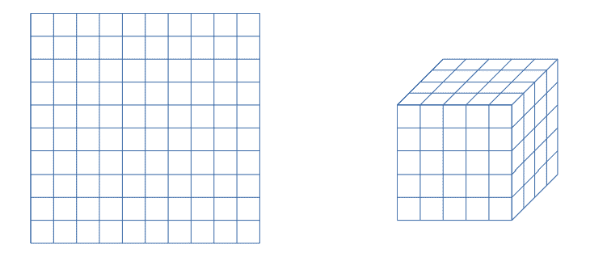

图 8.1：2D 和 3D 网格

虽然网格易于创建，但*图 8.1*已经显示了其中的一些问题。大于网格间距的对象必须放置在所有重叠的网格字段中，需要检查所有受影响的字段以确定其他实例。

虽然网格的大部分将保持空置，但虚拟世界内的“拥挤区域”可能导致单个网格字段内存在许多实例。许多实例意味着许多检查，实例的不均匀分布可能会导致由于计算数量增加而导致的减速。

四叉树是网格的一种继承形式。四叉树解决了网格的不均匀分布问题。

## 四叉树

**四叉树**的基本元素是一个单独的单元格，可以是正方形或矩形。我们将仅使用正方形单元格进行描述，但所有内容也适用于矩形形状的单元格。对象通过其位置和大小插入到根单元格中，通常使用一个二维边界框来覆盖对象的范围。

四叉树的神奇之处在于当每个单元格中对象的配置阈值被达到时开始。受影响的单元格被细分为四个大小相等的子单元格。任何重叠一个或多个子单元格的对象可以保留在父单元格中，或者根据实现方式添加到所有受影响的子单元格中。所有其他对象都移动到相应的子单元格中。参见*图 8.2*，了解四叉树的示例：

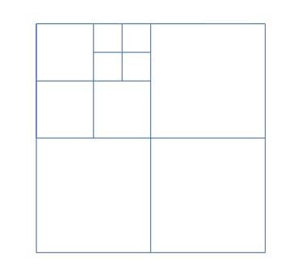

图 8.2：具有不同细分结构的四叉树

将正方形划分为四个子单元格，并将父单元格中的对象移动到子单元格中，可以减少每个单元格中的对象数量，使其低于配置的阈值，从而最小化需要测试碰撞的对象数量。

如果四个子单元格中所有对象的和低于阈值，则所有对象再次移动到父单元格中，现在为空的子单元格被删除。这种动态行为有助于保持每个单元格中对象的数量在零和阈值之间，独立于单元格的大小、父单元格的数量或位置。

四叉树只能存储关于对象位置和大小的二维信息。要将相同的逻辑扩展到三维，可以使用八叉树。

## Octree

四叉树和**八叉树**的基本功能相同。唯一的区别是树元素使用的维度数量。四叉树使用正方形或矩形作为单元格，而八叉树由立方体或长方体组成。在*图 8.3*中，显示了一个简单的八叉树：

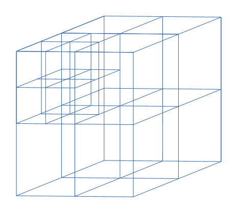

图 8.3：具有细分结构的八叉树

插入的对象内部以三维轴对齐的边界框形式维护，表示对象的范围。当达到阈值时，分割操作会导致创建八个子立方体作为子单元（或八个子长方体）。

八叉树是检查可能碰撞时有效移除三维空间大部分区域的方法。另一种处理二维和三维空间划分的数据结构是**二叉空间划分**（**BSP**）。

## 二叉空间划分

你可能听说过来自老游戏的三个字母 BSP。第一个使用 BSP 树来维护关卡数据的游戏是 1993 年由**Id Software**开发的**Doom**游戏。

尽管 Doom 中的关卡数据只有二维，但游戏引擎创造了一个完全三维游戏的错觉。

BSP 树是通过递归地使用线（2D）或平面（3D）作为超平面来划分世界空间创建的，创建前后两个面。前后面的划分会继续进行，直到剩余的分区满足某些退出条件；对于游戏来说，这个条件通常是分区完全填满或为空。

如果细分时遇到任何其他线或平面，这些线或平面将被分割成两部分，一部分位于前方，另一部分位于后方。

*图 8.4* 展示了空间的细分和由此产生的 BSP 树：

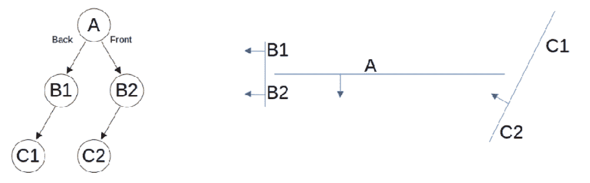

图 8.4：一个示例对象及其生成的 BSP 树

在*图 8.4*中，线 A 用作起点，前端向下。将空间分成两半也分割了线 B 和 C，从而产生了线 B1、B2、C1 和 C2。线 B1 位于 A 的后方，将被添加为 A 的左子节点，而 B2 位于 A 的后方，作为 A 的右子节点。线 C1 和 C2 都位于 B1 和 B2 的后方，因此它们被添加为 B1 和 B2 的左子节点。

解析 BSP 树以找到分区确实非常快，但生成相同的 BSP 树是一个耗时的任务。大多数情况下，树生成是在离线完成的，预计算的树与游戏或应用程序一起分发。检查所有线或平面与所有其他线或平面的过程与碰撞检测中遇到的问题相同。

BSP 树元素无法快速更改或更新的能力使得这种树仅适用于静态数据（即，用于游戏的关卡数据）。像门或玩家这样的动态游戏元素需要使用不同的数据结构，例如八叉树。

与 BSP 树类似，k-d 树在搜索元素时速度快，但在创建或更新时速度慢。

## K-d 树

**k-d 树**存储 k 维空间中对象的信息。与之前的树相比，该算法要复杂一些。在每次数据点插入时，剩余空间被分成两部分，分割后，受影响的维度会改变。

对于二维 k-d 树，分割维度在 X 轴和 Y 轴之间交替；对于三维 k-d 树，它按照 X、Y、Z 的顺序交替；依此类推。*图 8.5* 展示了二维和三维 k-d 树的外观：

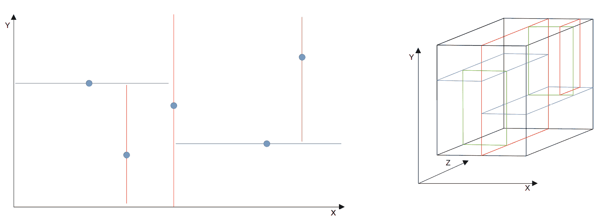

图 8.5：二维和三维 k-d 树

红线和相应的蓝线是二维中的分割维度：红色代表 X 分割，蓝色代表 Y 分割。在三维中，相同的模式适用，我们在连续分割时使用“下一个”维度。由于剩余空间的部分被移除，在 k-d 树中搜索元素是快速的。k-d 树的主要用途是点云和搜索给定点的最近邻。

空间分割的另一种方法是使用边界体积层次结构。

## 边界体积层次结构

与之前的树变体相比，**边界体积层次结构**可以通过不同类型的几何表示来实现。例如，我们使用二维边界圆，如*图 8.6*所示：

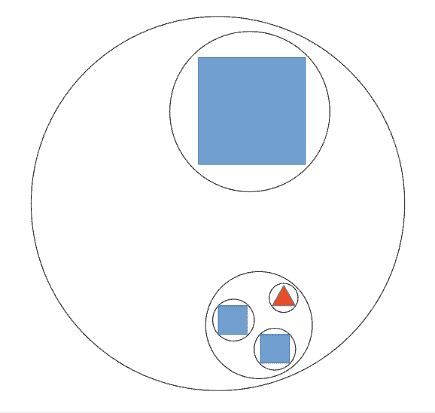

图 8.6：由圆组成的边界体积层次结构

通过将两个或多个边界圆包围在一个更大的边界圆中，可以降低碰撞测试的数量。如果可能发生碰撞的对象没有击中外部圆，则不需要检查任何内部圆以确定可能的碰撞。对于碰撞对象来说，内部圆是无法到达的。

只有当我们击中外部圆圈时，才需要进行更深入的检查。与其他树类似，边界体积层次结构可以移除世界空间中更大的一部分，从而减少进一步的碰撞检查。

在我们开始实现空间划分算法之前，我们需要探索加速碰撞检测的第二种方法：使用实例的简化表示以进行更快的检查。

# 简化实例以进行更快的碰撞检查

在减少整体数量后，我们不必检查实例的每个三角形，如果我们使用**模型抽象**，可以大大提高碰撞检查的性能。这些抽象仅由几个几何元素组成，如盒子、长方体或圆，它们包围着实例。如果这些抽象不相交，实例之间不可能发生碰撞，我们可以从我们的候选列表中移除该实例。

对象最快的抽象之一是轴对齐边界框。

## 轴对齐边界框

**轴对齐边界框**（**AABB**）是一个矩形或长方体，大小刚好足以包含对象，并且矩形的所有线或长方体的所有平面都与笛卡尔坐标系中的轴对齐。在实现四叉树时，我们将使用 AABB 的二维变体，即边界框。*图 8.7*展示了二维边界框：

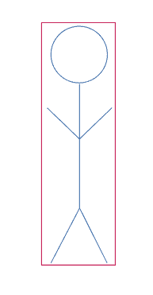

图 8.7：二维边界框

AABB 最适合形状接近正方形、矩形、立方体或长方体的对象。对于圆形对象，AABB 将在对象和箱体范围之间产生很多空间，导致在检查可能的碰撞时出现更多的“假阳性”。

检查 AABB 之间的交集是一个快速且简单的工作。由于所有四条线或六个侧面都与轴对齐，因此只需检查每条线或每个平面与第二个实例的对应线或平面的一个维度。

例如，实例一的底部平面和实例二的顶部平面可以通过仅比较 Y 值（如果 Y 轴向上）来检查。如果这个检查表明实例没有发生碰撞（即，第二个实例的顶部平面不在第一个实例的底部平面之上），则可以立即结束碰撞检查——这两个实例根本不可能相交。因此，我们可以通过使用 AABB 进行快速预检。

当我们旋转 AABB 与对象一起时，将创建一个**定向边界框**（**OBB**）。

## 定向边界框

仅旋转与对象一起的 AABB 可能很有吸引力，因为我们仍然保持了良好的对象数据与盒子额外空间之间的比率。*图 8.8*展示了示例：

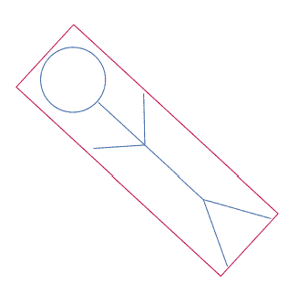

图 8.8：定向边界框

但请注意，OBBs（轴对齐边界框）并不只是 AABBs（轴对齐边界框）的伪装！旋转平面将不再允许我们进行简单的坐标检查，我们现在需要解决大量的平面方程或使用所谓的**分离轴定理**等高级方法来检查两个 OBBs 的侧面平面是否相交。此外，OBBs 的创建和旋转可能很复杂且模糊。因此，这里的建议是远离 OBBs；在大多数情况下，它们不值得额外的复杂性。

对于圆形（或近似圆形）对象，边界圆和球体是一种很好的简化类型。

## 边界圆和球体

在二维空间中，边界圆相对简单；在三维空间中，边界球也相当简单。我们只需要一个中心点和半径，任务就完成了。*图 8.9*显示了围绕一个对象的边界圆：

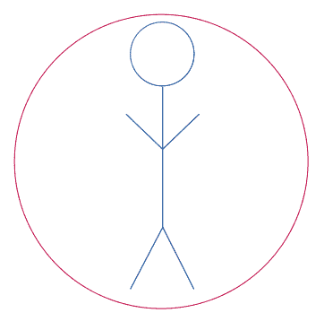

图 8.9：围绕一个对象的边界圆

与边界圆或球体进行碰撞检测也很快且简单。勾股定理帮助我们计算从世界中的任何点到球体中心的距离。只有当计算出的距离小于半径时，才会发生碰撞。

请记住，勾股定理包括计算平方根，如果你不使用现代**单指令多数据**（**SIMD**）CPU 扩展，如**流式 SIMD 扩展**（**SSE**）或**高级向量扩展**（**AVX**），这是一个相当昂贵的操作。这里的一种可能的优化是使用半径的平方，并在计算距离时跳过平方根。由于现在两个结果都是平方的，比较的结果与平方根版本相同。

边界圆或边界球的一个有趣的变化是胶囊。

## 胶囊

**胶囊**看起来是圆形或球体的拉伸版本，其中中间部分呈矩形或圆柱形。胶囊用于人体，因为胶囊的整体形状与球体或矩形边界框相比更接近人体形状。*图 8.10*显示了胶囊的示例：

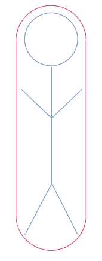

图 8.10：围绕简单角色的胶囊

当使用相同的值作为结束圆或球体的半径，以及中心矩形或圆柱体时，我们只需要存储胶囊的中心线和半径。计算可能的碰撞点的距离并不比计算边界圆或球体的距离更昂贵。

在碰撞检测的成本中，凸包位于高端。

## 凸包

**凸包**被定义为包含对象的**最小凸**体积。强调凸包的凸性是有意为之，因为这种属性在一定程度上允许算法优化。然而，复杂凸包的平面数量可能会很高，构建可能并不简单。参见*图 8.11*中的凸包：

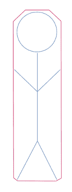

图 8.11：围绕对象的一个凸包

检查凸包的碰撞需要大量测试，这可能会降低我们通过模型简化想要实现的效果。只要你的模型没有很多三角形，凸包可能就不在考虑范围内。

另一方面，如果可以容忍小的碰撞错误，凸包可以用作高多边形模型的替代品，并且所有碰撞检查都可以仅针对凸包进行。

作为最后一种方法，可以使用边界体积层次结构。层次模型不仅适用于空间划分，也适用于模型简化。

## 边界体积层次结构

空间划分的**边界体积层次结构**的一般思想也适用于简化实例。但在这里，模型部分被包含在越来越大的体积中。*图 8.12*显示了围绕角色模型的边界体积层次结构的简化示例：

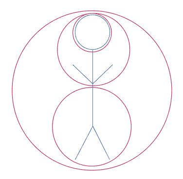

图 8.12：围绕对象的一组边界球体

对较大体积中的一个失败检查使我们能够完全丢弃体积内的身体部分。通过使用精心设计的配置，只需要少量测试就可以决定实例是否应该保留在列表中进行更深入的检查，或者是否可以忽略。

关于凸对象之间碰撞检查的详细信息，你可以查看**吉尔伯特-约翰逊-基尔蒂**（**GJK**）距离算法。GJK 算法通过使用所谓的 Minkowski 差来降低碰撞检测的复杂性。在*附加资源*部分有一个解释 GJK 算法原理的网页链接。

为了简化起见，由于更新速度快，以及基于对要检查的实例数量的限制，我们将实现一个四叉树到应用程序中，并为实例使用边界球体。四叉树将使我们能够比原始方法中所有模型之间的“蛮力”成对比较更快地完成碰撞检测的第一步。边界球体在碰撞检查的数量和由于球体与实例三角形之间的自由空间而产生的假阳性数量之间提供了很好的平衡。

接下来，让我们跳入四叉树的实现。

# 添加四叉树以存储附近的模型实例

正确编写复杂代码很难，因此使用四叉树的开源实现是一个可行的选择。我找到的最佳四叉树版本来自 **Pierre Vigier**，可以在 GitHub 上找到：[`github.com/pvigier/Quadtree`](https://github.com/pvigier/Quadtree)。

Pierre 的代码基于 C++ 模板，以在四叉树中存储的数据上具有极大的灵活性。此外，他使用自定义模板化的二维向量类型来存储位置和大小。

我们不需要这种灵活性，因为我们将在四叉树中仅存储一个包含实例索引位置的 `int`。由于我们在所有其他需要二维向量类型的情况下都使用 GLM，我们将更改边界框实现以使用 `glm::vec2` 来存储框的位置和大小。

## 调整边界框代码

作为新而闪亮的四叉树的第一步，我们需要调整边界框的代码。我们不再存储顶部和左边的位置以及宽度和高度作为单个值，而是使用 `vec2` 来存储位置和大小。将 GitHub 仓库 `include` 文件夹中的 `Box.h` 文件中的模板化 C++ 代码转换为四叉树相对容易，最终我们在新创建的 `quadtree` 文件夹中的 `BoundingBox2D.h` 和 `BoundingBox2D.cpp` 文件中得到了构造函数、几个获取器以及 `contains()` 和 `intersects()` 这两个方法。

最复杂的方法是 `intersects()`，用于检查两个边界框是否相交：

```cpp
bool BoundingBox2D::intersects(BoundingBox2D otherBox) {
  return !(
    mPosition.x >= otherBox.getRight() ||
    otherBox.getTopLeft().x >= getRight() ||
    mPosition.y >= otherBox.getBottom() ||
    otherBox.getTopLeft().y >= getBottom()
  );
} 
```

在 `AssimpInstance` 类中，将添加一个名为 `mBoundingBox` 的新 `private` 成员，用于存储实例的边界框：

```cpp
 BoundingBox2D mBoundingBox{}; 
```

我们不需要加载或保存边界框，因此它可以直接存储在 `AssimpClass` 中，在 `InstanceSettings` 结构体之外。

我们需要两个简单的 `public` 方法来存储和检索边界框：

```cpp
 BoundingBox2D getBoundingBox();
    void setBoundingBox(BoundingBox2D box); 
```

作为边界框实现的最后一步，我们必须在项目根文件夹中的 `CMakeLists.txt` 文件中添加新的 `quadtree` 文件夹，以便在其他类中使用边界框和四叉树。首先，将包含所有 `.cpp` 文件的文件夹添加到 `SOURCES` 文件搜索中：

```cpp
file(GLOB SOURCES
  ...
  **quadtree/*.cpp**
  ...
) 
```

然后，将 `quadtree` 文件夹追加到包含目录列表中：

```cpp
target_include_directories(${PROJECT_NAME} ... **quadtree**) 
```

在重新创建 CMake 文件后，这应该在保存 `CMakeLists.txt` 中的更改后由 Visual Studio 和其他 IDE 自动完成，我们可以继续进行四叉树的实现。

## 重写四叉树代码以适应我们的需求

我们将新的 `Quadtree` 类存储在 `quadtree` 文件夹中的 `Quadtree.h` 和 `Quadtree.cpp` 文件中。将四叉树的 C++ 模板转换为 C++ 类与边界框代码相比需要一些额外的步骤。

在翻译 C++ 模板代码时，我们需要进行以下调整：

+   将自定义的 `Vector2` 类型替换为 `glm::vec2`。

+   将自定义的 `Box` 类型替换为 `BoundingBox2D` 类型，并将参数更改为 `glm::vec2`。

+   将`assert()`检查替换为日志输出。

+   添加一个`clear()`方法来移除四叉树的所有内容。

+   添加代码以清理具有交换 ID 的碰撞实例对。

+   使用返回值作为结果，而不是输出参数。

+   使用回调函数而不是`GetBox`函数参数。

对于回调函数，我们在`Callbacks.h`文件中添加另一个回调，它只接受一个`int`参数并返回一个`BoundingBox2D`：

```cpp
using instanceGetBoundingBox2D =
   std::function<BoundingBox2D(int)>; 
```

四叉树将作为名为`mQuadtree`的`private`成员变量添加到渲染器中：

```cpp
 std::shared_ptr<QuadTree> mQuadtree = nullptr; 
```

在`initQuadTree()`方法的初始化过程中，我们将回调函数绑定到`getBoundingBox()`方法上，使用实例索引作为参数：

```cpp
 mQuadtree->instanceGetBoundingBox2DCallback =
    this {
     return mModelInstCamData.micAssimpInstances.at(
       instanceId)->getBoundingBox();
    }; 
```

在渲染器的`draw()`调用中，在遍历模型实例时填充四叉树。对于每个实例，我们创建边界框并将实例添加到四叉树中：

```cpp
 BoundingBox2D box{position, size};
    instances.at(i)->setBoundingBox(box);
    mQuadtree->add(instSettings.isInstanceIndexPosition); 
```

为每个实例创建边界框将在*计算实例边界框*这一节中处理。

对于四叉树的使用，还有一个重要问题：我们应该在每一帧更新树中的实例位置，还是应该清除整个四叉树并再次添加所有实例？

更新四叉树内的对象需要通过删除和重新添加来实现。因此，如果我们四叉树中大部分是静态对象，更新将是可行的。但鉴于我们的计划是要有多个实例在移动和/或播放动画，位置和/或边界框几乎在每一帧都会改变。在这种环境中，实例的删除和添加将比清除四叉树并使用新鲜数据添加所有实例更昂贵。

在渲染器的`draw()`调用中重新开始使用一个全新的四叉树很容易。在进入实例循环之前，清除四叉树的内容：

```cpp
 mQuadtree->clear(); 
```

四叉树准备就绪后，我们必须解决如何为实例生成边界框的问题。答案可能令人惊讶：我们需要在 GPU 和 CPU 之间分配工作。

## 计算实例边界框

当涉及到所有实例的大量计算时，第一个想法很可能是“我将使用计算着色器！”，尤其是在我们通过将工作卸载到 GPU 来解决了一些计算密集型问题之后。但在这个案例中，CPU 必须完成部分工作。

虽然计算着色器在以大规模并行方式计算独立结果方面很出色，但它们并不适合像创建边界框这样的简单任务。为了计算实例的边界框，我们需要存储虚拟世界中每个实例的所有节点的最小和最大坐标，结合中间结果以创建最终的边界框。在 CPU 上，我们可以轻松地从数据结构中逐个获取顶点位置，进行必要的计算，并将最终的 AABB 存储回内存中。

但如果我们想在着色器内部计算 AABB 坐标，我们可能会覆盖其他着色器调用的结果，如果 AABB 结果使用相同的缓冲区位置。或者我们将有一个巨大的坐标列表，之后必须对其进行排序。排序坐标也可以在另一个计算机着色器中完成，但并行排序算法通常很复杂，因为它们面临着相同的约束，即不能写入相同的缓冲区位置。

因此，我们不必担心计算着色器中的数据同步问题，我们使用它们来做它们能非常快速完成的事情：创建查找表。

### 添加三维边界框类

为了存储生成的查找数据，我们将添加一个用于三维 AABB 的 C++类。在这里使用 AABB 的优势是可以在渲染器中绘制调试线条，但第三组坐标只增加了很少的存储和生成时间开销。此外，升级到八叉树以在三个维度上快速进行碰撞检测将是简单的。

新的类称为`AABB`，并将位于`tools`文件夹中。除了构造函数外，还有一些`public`的获取器和设置器，以及两个`private`的浮点数`mMinPos`和`mMaxPos`，`AABB`类还有两个`public`方法，称为`create()`和`addPoint()`。

通过使用`create()`方法，我们在`glm::vec3`参数指定的位置添加一个点，作为边界框的最小和最大范围。使用`addPoint()`方法，我们可以扩展边界框以包含新点：

```cpp
void AABB::addPoint(glm::vec3 point) {
  mMinPos.x = std::min(mMinPos.x, point.x);
  mMinPos.y = std::min(mMinPos.y, point.y);
  mMinPos.z = std::min(mMinPos.z, point.z);
  mMaxPos.x = std::max(mMaxPos.x, point.x);
  mMaxPos.y = std::max(mMaxPos.y, point.y);
  mMaxPos.z = std::max(mMaxPos.z, point.z);
} 
```

如果新点在边界框内，则不会发生任何事情。但如果点在边界框外，则框将在一个、两个或三个维度上扩展以包含新点。最终，我们将有一个围绕我们添加的所有点的框，由三个维度的最小和最大值定义。

为了在渲染器中绘制调试线条，使用`public`方法`getAABBlines()`。在`getAABBLines()`中，我们创建`mMinPos`和`mMaxPos`的`x`、`y`和`z`元素的最小和最大位置之间可能的 8 种组合的 12 条线：

```cpp
 mAabbMesh->vertices.at(0) =
    {{mMinPos.x, mMinPos.y, mMinPos.z}, color};
  mAabbMesh->vertices.at(1) =
    {{mMaxPos.x, mMinPos.y, mMinPos.z}, color};
  ...
  mAabbMesh->vertices.at(22) =
    {{mMaxPos.x, mMaxPos.y, mMinPos.z}, color};
  mAabbMesh->vertices.at(23) =
    {{mMaxPos.x, mMaxPos.y, mMaxPos.z}, color}; 
```

### 创建 AABB 查找表

AABB 查找表的一般思想是为每个模型中每个动画剪辑的固定帧数预先计算 AABB。在查找表中拥有边界框允许我们在动画剪辑的帧中检索模型 AABB 的良好近似值。

通过在两个不同剪辑中同一帧号的 AABB 坐标之间进行混合，并根据模型的变换转换最终的 AABB，我们可以在低计算成本下计算出适合实例的 AABB，即使实例处于动画混合的中间。

创建查找表是计算着色器和 CPU 工作的混合，在渲染器的`createAABBLookup()`方法中完成。查找表在渲染器类中生成，有两个原因：

+   加载模型的主要方法放在渲染器中，我们还通过回调将模型加载方法暴露给用户界面。

+   渲染器已经加载了计算着色器。我们可以直接使用着色器，而不是在`AssimpModel`类中使用另一组相同的着色器。

对于计算着色器部分，我们可以重用我们在*第二章*中制作的渲染器`draw()`调用实例循环中的代码。

为了找到模型的最大范围，我们将使用节点。为了计算每个实例的节点数，可以使用两个计算着色器`assimp_instance_transform.comp`和`assimp_instance_matrix_mult.comp`。在包含节点平移、旋转和缩放的矩阵的计算部分，存储了每个节点的位置。这里唯一的区别是节点偏移矩阵。

虽然这些偏移矩阵对于顶点皮肤变形是必需的，但它们会对节点位置给出错误的结果。我们可以通过绑定一个充满单位矩阵的 SSBO 来从计算中移除偏移矩阵，这样我们只有节点的 TRS 矩阵。

通过提取每个实例的节点位置并从位置创建每个节点的 AABB，我们有一个简单的方法来计算我们需要的用于四叉树和调试显示的数据。对于 2D 边界框，我们只需提取 AABB 的`x`和`z`元素，生成 AABB 的“从上到下”视图。

AABB 计算是按动画剪辑和模型节点进行的。生成的`std::vector`将存储在我们刚刚加载的模型的`AssimpModel`数据中。为了检索动画剪辑中时间位置的正确 AABB 数据，我们使用我们已有的生成顶点皮肤变形矩阵的逻辑，并将缩放的时间位置作为查找数据的索引。如果我们混合两个动画，我们甚至可以在两个动画的 AABB 之间进行混合。

### 在模型和渲染器中使用 AABB

当在渲染器的`draw()`调用中遍历实例时，现在可以通过调用`getAABB()`来检索动画剪辑和时间位置的 AABB 数据：

```cpp
 AABB instanceAABB = model->getAABB(instSettings); 
```

在`getAABB()`内部，动画和实例平移、旋转和缩放的数据被用来创建适合实例的 AABB。具体来说，`getAABB()`将：

+   查找第一和第二个动画剪辑的 AABB

+   根据动画混合因子在两个 AABB 之间进行混合

+   将结果 AABB 按实例缩放因子缩放

+   如果模型激活了轴交换，则旋转 AABB

+   根据实例旋转（现在是一个 OBB）旋转 AABB

+   从旋转的 ABB 生成一个新的 AABB

+   将 AABB 平移到实例位置

到这一点，AABB 包围了实例。

由于混合和旋转仍然是昂贵的操作，可能会在具有许多实例的场景中损害性能，通过使用现代处理器的 SIMD 操作（如 SSE 或 AVX）并行化计算可以加快速度。但即使将 AABB 查找数据保留在 GPU 上也可能有益。使用计算着色器计算所有实例的边界框并将结果下载下来可能比纯 CPU 计算更快，尽管有额外的结果下载。

为了达到最佳性能，你可能想要实现 `getAABB()` 方法的不同版本，并使用各种场景大小和复杂度来分析应用程序。

在对实例的 AABB 进行调整后，我们计算四叉树中二维边界框的位置和大小：

```cpp
 glm::vec2 position =
    glm::vec2(instanceAABB.getMinPos().x,
    instanceAABB.getMinPos().z);
  glm::vec2 size =
    glm::vec2(std::fabs(instanceAABB.getMaxPos().x -
    instanceAABB.getMinPos().x),
    std::fabs(instanceAABB.getMaxPos().z -
    instanceAABB.getMinPos().z)); 
```

现在，我们有了所有数据来将实例插入到四叉树中：

```cpp
 BoundingBox2D box{position, size};
  instances.at(i)->setBoundingBox(box);
  mQuadtree->add(instSettings.isInstanceIndexPosition); 
```

为了确保我们创建了一个工作的四叉树，我们将添加一个新的 ImGui 窗口，包含四叉树及其所有子分区和实例。看到四叉树的实际运行情况对于发现任何实现错误非常有帮助。

### 创建一个窗口来显示四叉树及其内容

对于 ImGui 窗口，我们在 `UserInterface` 类中创建了一个名为 `createPositionsWindow()` 的新方法。在这个方法内部，我们使用 `ImGui::Begin()` 创建一个新的窗口。接下来，我们检索世界边界以获取原点、大小和中心点进行绘制。

然后，我们遍历所有实例，使用边界框的位置和大小在实例的二维世界位置处绘制 ImGui 矩形。我们还使用 `micInstanceCollisions` 变量的成对信息以不同颜色绘制非碰撞和碰撞实例。

最后，我们检索四叉树及其所有子分区的边界框。为了获取四叉树所有级别的边界框，我们在 `Quadtree` 类中添加了一对 `public` 和 `private` 方法，称为 `getTreeBoxes()`。`getTreeBoxes()` 方法递归遍历四叉树节点及其子节点，将边界框存储在 `std::vector` 的 `BoundingBox2D` 元素中。我们使用白色线条绘制所有四叉树框。

*图 8.13* 展示了四叉树窗口的一个示例：

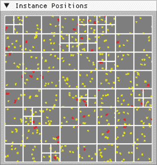

图 8.13：包含子分区、实例和检测到的碰撞的四叉树

在 *图 8.13* 中，四叉树及其所有子分区都以白色绘制。正常实例的边界框以黄色线条绘制，碰撞实例以红色线条绘制。

填充四叉树并在屏幕上绘制结果只是碰撞检测的第一步；我们还需要对虚拟世界中碰撞的实例信息进行处理。

### 获取碰撞实例并响应碰撞

从四叉树中获取所有碰撞实例的列表是通过调用 `mQuadtree` 对象的 `findAllIntersections()` 实现的：

```cpp
 mModelInstCamData.micInstanceCollisions =
    mQuadtree->findAllIntersections(); 
```

我们将结果存储在`ModelInstanceCamData`结构体中的新变量`micInstanceCollisions`中，以便其他部分的代码（即，用于调试绘制线条）可以使用实例碰撞。碰撞的实例以实例对的形式提供给我们。

要在屏幕上看到碰撞的结果，我们可以遍历实例的对，并旋转一个或两个实例：

```cpp
for (const auto& instPairs :
    mModelInstCamData.micInstanceCollisions) {
  instances.at(instPairs.first)->rotateInstance(6.5f);
  instances.at(instPairs.second)->rotateInstance(-5.3f);
} 
```

走进或跑进另一个实例现在应该旋转你的实例，或者你的实例和碰撞实例。尽管角度很小，但它将在检测到这些实例之间的碰撞的每一帧中增加。在正常的 60 或 75 FPS 帧率下，你会立刻看到自己远离其他实例，突然朝不同的方向跑去。

如果你不喜欢实例在碰撞时只是旋转，你可以尝试实现更复杂的碰撞反应。查看*实践课程*部分有关添加碰撞解决的任务，以及*附加资源*部分有关避免碰撞的资源链接。

### 绘制 AABB 调试线条

如果你的实例或另一个实例没有旋转，你仍然可以穿过其他实例，此时在屏幕上绘制 AABB 线条将变得很有帮助。

在渲染器中绘制调试线条，我们可以使用`micInstanceCollisions`中的配对，从受影响的实例中检索 AABB 线条，并将线条的顶点添加到名为`mAABBMesh`的`private`变量中。然后，我们将顶点数据上传到线条顶点缓冲区，并通过使用线条着色器，将 AABB 绘制到屏幕上：

```cpp
 mLineVertexBuffer.uploadData(*mAABBMesh);
  mLineShader.use();
  mLineVertexBuffer.bindAndDraw(GL_LINES, 0,
    mAABBMesh->vertices.size()); 
```

作为另一种解决方案，我们可以遍历所有实例，并使用`micInstanceCollisions`中对中的实例索引来切换 AABB 的绘制颜色。

为了对 AABB 线条有更多的控制，将在 ImGui **控制**窗口中创建一个单独的部分。结合名为`collisionDebugDraws`的新`enum`类和渲染器中`drawAABBs()`方法中的更多代码，你可以在三种不同的绘制模式之间切换：

+   没有 AABB

+   只有碰撞的 AABB 用红色表示

+   所有碰撞的 AABB 用红色表示，所有其他 AABB 用黄色表示

*图 8.14*展示了检测到的碰撞示例，使用黄色线条围绕非碰撞实例，红色线条围绕两个碰撞实例：

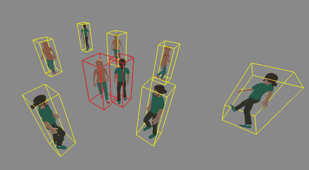

图 8.14：在非碰撞实例中的两个碰撞实例

如果一些实例的行为异常，例如不断围绕自身旋转，请不要惊慌。与其他实例和世界边界的碰撞反应仍然非常基础（只是旋转）。我们将在*第九章*中增强碰撞处理。

在四叉树工作并减少需要检查的实例数量到可配置的最小值后，我们将开始实施列表中列出的简化之一：通过利用游戏角色模型的节点作为锚点，边界球体在创建和检查复杂度之间有一个良好的权衡。

因此，让我们去给模型添加一些球体。

# 实现边界球体

边界球体作为更详细模型的抽象可以用不同的方式使用。一种可能的方式在*图 8.9*中显示，其中球体包围了整个模型。但是，正如*图 8.9*中所示，我们会在模型周围有大量的空空间，导致更多的错误肯定。此外，我们已经有了一种方法来进行更广泛的碰撞检查：边界框。

相反，我们将使用球体在更详细的级别上简化实例，通过向模型的节点添加可配置的边界球体。尽管我们现在需要检查几十个球体与另一个实例的球体，但我们仍然远远低于检查两个模型中每个三角形的计算能力。

错误肯定的数量也将保持在可接受的水平。正如在*简化实例以加快碰撞检查*部分中广泛陈述的那样，在更详细的简化与更多计算或更简单的抽象和更多错误肯定碰撞检测之间进行权衡是我们必须接受的，但我们可以战略性地做出决定。

## 创建边界球体的数据

要创建球体数据，我们使用与边界框计算相同的第一个步骤。我们使用计算着色器`assimp_instance_transform.comp`和`assimp_instance_matrix_mult.comp`，结合用单位矩阵替换骨骼偏移矩阵。这个着色器运行的结果是一个 SSBO，包含我们想要装备边界球体的所有实例的节点位置。

但是，与边界框不同，我们可以使用另一个计算着色器来计算节点的边界球体。第三个计算着色器，称为`assimp_instance_bounding_spheres.comp`，使用先前计算着色器创建的节点的 TRS 矩阵、实例的世界位置矩阵以及父节点索引来为每个实例的每个节点创建一个边界球体。

另一个名为`SphereAdjustment`的 SSBO 也被使用，每个节点包含一个`vec4`。这些球体调整可以通过一个 UI 扩展来设置，该扩展将模型的节点名称映射到一个`SliderFloat`和一个`SliderFloat3`，允许我们调整和移动由着色器创建的边界球体。通过仔细放置边界球体，我们可以确保模型周围尽可能少的空空间被检测为碰撞。

*图 8.15*显示了新的 UI 部分：


图 8.15：微调模型的边界球体

`SphereAdjustments` SSBO 由一个名为 `msBoundingSphereAdjustments` 的 `glm::vec4` 元素 `std::vector` 支持，放置在 `ModelSettings` 结构体中。在调整向量中，每个 `vec4` 被分割，使用前三个元素作为每个球体的位置，最后一个元素作为球体的半径。

由于在每次应用程序重启时都不必调整边界球体是一个好主意，因此将 `msBoundingSphereAdjustments` 缓冲区的内容添加到 `YamlParser` 类中，以便能够保存和恢复调整：

向用户界面和 YAML 解析器添加的功能更多或更少是平凡的，复制自已经存在的 ImGui 和 YAML 解析代码部分。您可以探索 `UserInterface` 和 `YamlParser` 类来检查代码更改：

我们的第三个计算着色器 `assimp_instance_bounding_spheres.comp` 也重用了其他着色器的一部分。`main()` 方法的顶部与矩阵乘法计算着色器相同：

```cpp
void main() {
  uint node = gl_GlobalInvocationID.x;
  uint instance = gl_GlobalInvocationID.y;
  uint numberOfBones = gl_NumWorkGroups.x;
  uint index = node + numberOfBones * instance; 
```

我们根据着色器的调用 ID 选择要处理的节点和实例，而模型中的节点数量来自我们在调度计算着色器时使用的组数的 X 维度：

接下来，我们通过从实例特定节点的 TRS 矩阵中提取平移部分并添加来自球体调整缓冲区的位置来获取节点位置：

```cpp
 vec3 nodePos =
   (worldPosMat[instance] * trsMat[index])[3].xyz;
  nodePos += sphereAdjustment[node].xyz;
  float radius = 1.0; 
```

我们还声明了球体半径，并用默认值初始化它：

然后，我们从父索引缓冲区中提取当前节点的父节点 ID：

```cpp
 int parentNode = parentIndex[node]; 
```

父节点用于在具有父节点和父节点或未连接的独立节点之间切换。如果我们找到一个有效的父节点，我们将计算父节点的世界位置，包括位置调整：

```cpp
 if (parentNode >= 0) {
    uint parentIndex = parentNode +
      numberOfBones * instance;
    vec3 parentPos =
     (worldPosMat[instance] * trsMat[parentIndex])[3].xyz;
    parentPos += sphereAdjustment[parentNode].xyz; 
```

通过使用节点和父节点位置，我们计算节点与其父节点之间的中点。我们计算球体的半径——同样，可以通过球体调整值进行调整：

```cpp
 vec3 center = mix(nodePos, parentPos, 0.5);
    radius = length(center - nodePos) *
      sphereAdjustment[node].w; 
```

对于根节点，我们将球体的半径设置为可调整的值：

```cpp
 } else {
    radius = sphereAdjustment[node].w;
  } 
```

在 `main()` 方法的末尾，我们添加了一个小的检查来禁用已经在着色器中的小球体：

```cpp
 if (radius < 0.05) {
    sphereData[index] = vec4(0.0);
  } else {
    sphereData[index] = vec4(nodePos, radius);
  }
} 
```

由于我们需要在渲染器代码的几个不同位置运行三个计算着色器，我们通过将填充和运行着色器的代码添加到名为 `runBoundingSphereComputeShaders` 的新方法中来简化我们的工作：

## 绘制边界球体

对于边界球体的计算着色器的第二次使用是调试显示，类似于 AABB。在运行计算着色器之后，我们可以使用另一对新的顶点和片段着色器来将球体绘制到屏幕上：

在名为 `sphere_instanced.vert` 的新球体绘制顶点着色器的 `main()` 方法中，我们提取球体的中心和半径：

```cpp
void main() {
  vec3 boneCenter = sphereData[gl_InstanceID].xyz;
  float radius = sphereData[gl_InstanceID].w; 
```

为了加快绘图速度，我们将使用渲染 API 的实例化绘图调用，这样我们就可以在这里使用特殊变量`gl_InstanceID`（在 Vulkan 中将变量`gl_InstanceID`重命名为`gl_InstanceIndex`）。OpenGL 和 Vulkan 在内部递增变量`gl_InstanceID`和`gl_InstanceIndex`的值，每增加一个实例，这样我们就可以从单个顶点集中绘制成千上万的边界球体。

通过在着色器中调用名为`createScaleMatrix()`的小 GLSL 函数来调整球体的大小到正确的半径，该函数实际上是在主对角线元素中创建一个具有`radius`值的缩放矩阵：

```cpp
 mat3 scaleMat = createScaleMatrix(radius); 
```

然后，我们将球体顶点的原始位置通过缩放矩阵进行缩放，添加球体调整，通过乘以`view`和`projection`矩阵创建最终的着色器矩阵，并设置线条颜色：

```cpp
 gl_Position = projection * view *
    vec4(scaleMat * aPos + boneCenter, 1.0);
  lineColor = vec4(aColor, 1.0);
} 
```

通过调用`Shader`类的实例化版本绘图命令来运行球体着色器：

```cpp
 mLineVertexBuffer.uploadData(mSphereMesh);
  mSphereShader.use();
  mBoundingSphereBuffer.bind(1);
  mLineVertexBuffer.bindAndDrawInstanced(GL_LINES, 0,
    mSphereMesh.vertices.size(), numberOfSpheres); 
```

对于 Vulkan 渲染器，使用等效的绘图调用（`vkCmdBindPipeline()`、`vkCmdBindVertexBuffers()`、`vkCmdBindDescriptorSets()`和`VkCmdDraw()`）。

由于用于碰撞检测的边界球体可能与我们想要在屏幕上绘制的边界球体不完全相同，因此我们使用单独的方法来绘制调试球体。我们调试绘图方法之间的主要区别是创建一个实例列表，以供计算着色器使用。

我们可以通过调用`drawSelectedBoundingSpheres()`仅绘制所选实例的边界球体，通过调用`drawCollidingBoundingSpheres()`显示发生碰撞的实例的边界框，或者通过调用`drawAllBoundingSpheres()`在屏幕上的所有实例周围创建“蓬松的白色雪球”，如图 8.16 所示。

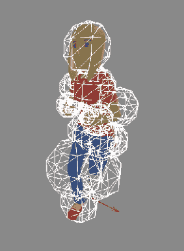

图 8.16：女性模型节点上的调整后的边界球体

现在我们能够计算和绘制模型边界球体，让我们将球体作为第二层添加到碰撞检测代码中。

## 使用边界球体进行碰撞检测

如在*检索碰撞实例并响应碰撞*部分所述，通过调用`findAllIntersections()`收集来自四叉树的碰撞实例，并保存到`micInstanceCollisions`中：

```cpp
 mModelInstCamData.micInstanceCollisions =
    mQuadtree->findAllIntersections(); 
```

为了使碰撞检测代码更容易维护，我们将交集提取调用移动到一个名为`checkForInstanceCollisions()`的新方法中。这个新方法将成为所有与碰撞检测和处理相关的代码的起点。

我们扩展碰撞检测的第一步是通过调用上述的`findAllIntersections()`方法来从四叉树中获取所有碰撞实例。然后，我们根据模型将这些实例分成单独的`int`集合。对每个模型使用单独的碰撞实例列表是必要的，因为不同的模型可能有不同数量的节点。

然后，对于每一组实例，我们使用边界球创建 SSBO，并将球体数据提取到`glm::ve4`向量的映射中。我们将使用实例索引位置作为映射的键，将 SSBO 分割成一个包含每个实例所有球体的映射值。

实际上，边界球的碰撞检查是通过比较一个碰撞实例的所有球体与第二个碰撞实例的所有球体来完成的。我们已经通过只保留由四叉树提供的实例对来大量减少了这些检查的数量。

即使检查球体碰撞是一个简单的任务，我们只需要比较两个球体中心的距离与两个球体半径之和，比较的数量也会使这个检查变得缓慢。

即使通过移除所有半径为零的球体并停止比较以检测到碰撞来简化操作，两个刚刚未发生碰撞的实例之间，每个模型有 30 个活动球体，也需要 900 次这样的比较。

使用计算着色器加快球体比较操作是可能的，但像每个实例对中每个实例的不同节点数这样的问题会增加计算着色器的复杂度并降低其效率。

虽然在 GPU 上的并行计算可能很快，但上传和下载数据以及为单个实例对运行着色器可能会增加显著的延迟，从而抵消了计算着色器的加速效果。

因此，我们继续使用基于 CPU 的解决方案来计算边界框之间的第二层碰撞。除非我们在一个非常小的虚拟世界中拥有数千个实例，或者在世界的某个小部分中有许多实例，否则碰撞检查的总数将保持较低。

*图 8.17*展示了通过边界框（用红色线条绘制）检测到的碰撞示例，以及任何边界球的附加碰撞（也用红色表示）：

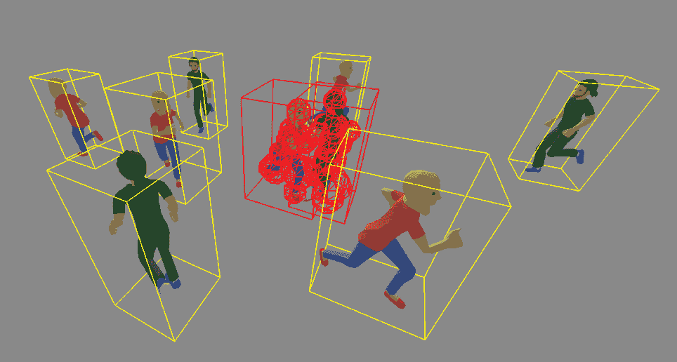

图 8.17：检测到实例的边界球发生了碰撞

处理碰撞与*检索碰撞实例并响应碰撞*部分中处理边界框碰撞的反应相同——我们只需在每一帧中围绕一个固定角度旋转碰撞实例。我们将在*第九章*和*第十二章*中增强对碰撞的反应。

碰撞检测是一个复杂的话题，有许多算法和选择，这些选择基于你应用程序的具体需求。我们需要知道我们需要检查哪些类型的对象来选择一个抽象的好形状，并且根据抽象的复杂性，我们可能需要调整在尝试找到碰撞时使用的算法（或算法）。我们甚至没有触及到碰撞解决部分，该部分在检测到交点后通过移动实例来解决问题。如果你想深入了解游戏物理、碰撞检测和碰撞解决的世界，请查看*附加资源*部分中的书籍。

# 摘要

在本章中，我们探讨了碰撞检测并为应用程序创建了两级碰撞检测。我们首先讨论了简单解决方案的不足，然后探讨了空间划分方法和模型简化以减少我们必须进行的检查次数，直到我们非常确定哪些实例确实发生了碰撞。最后，我们实现了带有边界框和边界球的四叉树以找出哪些实例发生了碰撞。

在下一章中，我们将创建“真实”的**非玩家角色**（NPCs）并通过添加可配置的行为让实例变得生动。我们将从探索行为树的本质及其与 NPC 决策的关系开始，并实现支持行为树代码以供我们的实例使用。作为最后一步，我们将研究模型之间的交互，将其视为一般行为的专用集合。

# 实践课程

这里是一些你可以添加到代码中的改进：

+   添加用于四叉树配置的用户界面控件。

目前，四叉树在渲染器`init()`调用期间静态初始化。添加用户界面控件和设置回调函数来调整在分割盒子之前实例的最大数量和树的最大深度。

+   添加用户界面控件来配置世界边界。

实例在虚拟世界中四处移动，如果一个实例达到在`mWorldBoundaries`中设置的虚拟边界，它将被旋转以保持在边界内。添加一些滑块和回调函数来控制虚拟世界的原点和大小，并确保**实例位置**窗口也会更新。

+   实现八叉树加上三维轴对齐包围盒（AABB）检查。

目前，我们只为实例使用二维边界框，就像实例是从上方看到的。将四叉树扩展为八叉树，并在实例的 AABB 之间添加三维交点检查。

+   加速边界球碰撞检测。

由于检查的复杂性——我们必须将第一个实例的每个球体与第二个实例的每个球体进行比较——碰撞检查相当慢。也许计算着色器可以在这里有所帮助。与边界框生成不同，我们只需要对每个实例给出一个是/否的答案来表示是否发生了碰撞。使用每个球体或实例的原子计数器可以帮助避免计算着色器工作完成后进行长时间的后处理工作。

+   添加一个简单的边界体积层次结构。

而不是检查两个实例的所有球体，你可以在模型中添加一些未使用的节点，并将更大的边界球体添加到这些节点上，包围一些较小的球体。从两个实例中最大的球体开始检查球体。如果这些大球体没有发生碰撞，那么大球体内部的球体永远不会发生碰撞，因此整个身体部分可以跳过下一次碰撞检查。

+   增加难度：在实例之间进行真正的三角形到三角形的检查。

这是碰撞检测的最终目标。通过检查实例的真实交点，而不仅仅是某些 AABB 或边界球体，可以实现自然的外观碰撞行为。同时，注意这种方法的好处，并看看额外的精度是否有利于运行时行为。

+   增加难度：添加碰撞解决。

当碰撞检查信号表示两个实例之间发生碰撞时，已经太晚了——实例已经部分相交。良好的碰撞检测伴随着碰撞解决，当发现碰撞时，实例会被分开。已经有许多关于碰撞检测和碰撞解决的书籍被撰写；请参阅“其他资源”部分中的一些知名标题。在“做得正确”的道路上仍然存在许多注意事项。

# 其他资源

+   分离轴定理：[`dyn4j.org/2010/01/sat/`](https://dyn4j.org/2010/01/sat/)

+   吉尔伯特-约翰逊-基尔蒂距离算法：[`cse442-17f.github.io/Gilbert-Johnson-Keerthi-Distance-Algorithm/`](https://cse442-17f.github.io/Gilbert-Johnson-Keerthi-Distance-Algorithm/)

+   基于模板的四叉树实现：[`github.com/pvigier/Quadtree`](https://github.com/pvigier/Quadtree)

+   交互式 3D 环境中的碰撞检测：ISBN 978-1558608016

+   实时碰撞检测：ISBN 978-1558607323

+   游戏物理引擎开发：ISBN 978-0123819765

+   游戏物理：ISBN 978-0123749031

+   碰撞避免：[`code.tutsplus.com/understanding-steering-behaviors-collision-avoidance--gamedev-7777t`](https://code.tutsplus.com/understanding-steering-behaviors-collision-avoidance--gamedev-7777t)

+   更多关于碰撞避免的内容：[`www.gameaipro.com/GameAIPro2/GameAIPro2_Chapter19_Guide_to_Anticipatory_Collision_Avoidance.pdf`](https://www.gameaipro.com/GameAIPro2/GameAIPro2_Chapter19_Guide_to_Anticipatory_Collision_Avoidance.pdf)
