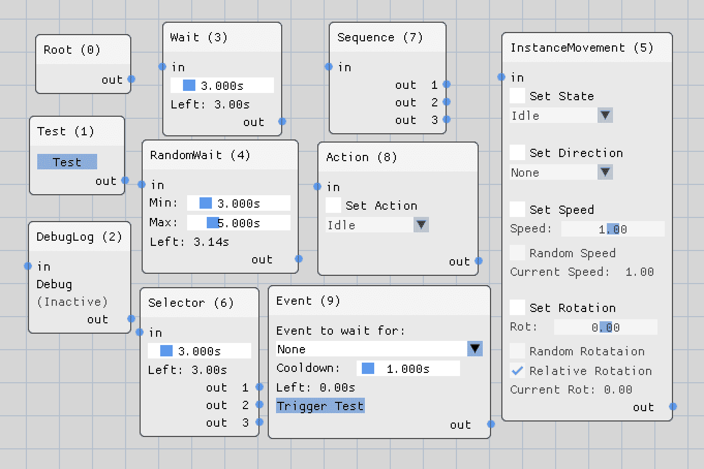

# 添加行为和交互

欢迎来到**第九章**！在前一章中，我们深入探讨了碰撞检测。在讨论了在虚拟世界中找到碰撞实例的复杂性之后，我们探索了通过添加世界分区和模型简化来加速碰撞搜索的方法。然后，我们实现了一个四叉树来将世界分割成更小的区域，并为实例添加了边界框和边界球。最后，我们使用四叉树和实例边界来检测实例之间的碰撞。

在本章中，我们将为实例添加一些“现实生活”的行为，使它们能够自己绕着虚拟世界行走，并对之前章节中添加的碰撞等事件做出反应。首先，我们将简要了解行为树和状态机以及它们是如何工作的。然后，我们将添加一个可视化编辑器来直观地表示实例自身的状态机。本章结束时，我们将扩展代码以执行从创建的节点树中产生的行为变化，并将交互添加为行为的一种附加形式。

在本章中，我们将涵盖以下主题：

+   控制实例行为的结构

+   添加可视化节点编辑器

+   扩展代码以支持行为变化

+   在实例之间添加交互

# 技术要求

示例代码可以在文件夹`chapter09`中找到，对于 OpenGL 在子文件夹`01_opengl_behavior`中，对于 Vulkan 在子文件夹`02_vulkan_behavior`中。

# 控制实例行为的结构

在计算机游戏初期，敌人和其他**非玩家角色**（**NPC**）的行为相当简单。基于仅游戏状态或几个属性，例如“玩家吃了一个大点，我必须远离他们！”（吃豆人）或“我看到玩家，所以我将攻击他们！”（许多第一人称射击游戏），计算机对手仅通过一小套规则行事。

之后，像“普通”状态机、分层状态机和行为树这样的控制结构在很大程度上改变了游戏中的**人工智能**（**AI**）。因为现在可以轻松地为敌人和 NPC 建模复杂任务。现在，不仅可以为行为选择创建更多替代方案，还可以让由计算机控制的世界居民表现得更加像智能生物。根据世界因素、它们自身的属性以及一点随机性，发现玩家可能导致 NPC 出现多种不同的结果。

行为树简化了 NPC 行为的创建，并有助于推理 NPC 在任何给定时间可能处于的状态。然而，行为树只是一个具有节点和节点之间链接的增强型有限状态机。行为子系统会记住树当前的状态，并根据节点中配置的因素，执行状态到树中后续节点的变化。行为树没有巨大的复杂性，易于实现，但在游戏中仍然非常强大。

创建行为树的一种常见方法是使用专用节点，例如：

+   选择器，从一组选项中选择一个

+   序列，按特定顺序执行任务

+   条件，使用先前节点的结果来选择下一个节点

+   循环，重复树的一部分，直到满足条件

+   动作，影响角色状态或执行动作，如攻击

+   世界感知，根据事件或世界属性改变行为

使用特殊节点在构建灵活的行为树中非常有帮助。敌人或 NPC 可以收集关于世界及其中的其他对象的信息，并在周围环境发生变化时，在下一次树执行中选择不同的路径，从而通过不重复相同的动作和行动，实现更反应灵敏、更可信、更少机械的行为。

*图 9.1*展示了 NPC 行为的简单想法：


图 9.1：简单的行为计划

尽管计划看起来很简单，但它封装了复杂的行为。在扫描计划以寻找所需行为时，考虑到敌人的距离和健康状况，应该会产生相当令人印象深刻的 NPC 行动。通过随机变化，在躲避和远程攻击之间切换，直接攻击接近的敌人，或者作为最后的手段尝试隐藏或逃跑，观看这些 NPC 群体对抗来犯敌人将会很有趣。

我们将为本章中的实例添加一个简单的状态机来控制行为。为了简化使用状态机创建和控制行为，我们还将添加一个创建节点和链接的工具。因此，让我们短暂偏离一下，为应用程序添加一个可视化的节点编辑器。

# 添加可视化节点编辑器

与前几章一样，我们将使用开源工具来构建我们的可视化节点编辑器，而不是手动构建自己的解决方案。有几个基于 ImGui 的节点编辑器可用。你可以在*附加资源*部分找到精选列表。

在本章中，我们将使用 Johann “Nelarius” Muszynski 扩展的**imnodes**。imnodes 的源代码可在 GitHub 上找到：

[`github.com/Nelarius/imnodes`](https://github.com/Nelarius/imnodes)

与前几章一样，我们将使用 CMake 为我们获取 imnodes。

## 通过使用 CMake 集成 imnodes

为了让 CMake 将 imnodes 作为一个依赖项管理，在项目根目录中的`CMakeLists.txt`文件中添加一个新的`FetchContent`块，位于`stbi`的`FetchContent`块和`WIN32`-only 区域之间：

```cpp
FetchContent_Declare(
  imnodes
  GIT_REPOSITORY https://github.com/Nelarius/imnodes
  GIT_TAG v0.5
) 
```

我们在这里将使用 Git 标签`v0.5`，以避免`master`分支上的新提交引入的问题，导致找不到 ImGui 源代码。

接下来，我们使 imnodes 代码可用，并让 CMake 填充源文件夹变量：

```cpp
FetchContent_MakeAvailable(imnodes)
FetchContent_GetProperties(imnodes)
if(NOT imnodes_POPULATED)
  FetchContent_Populate(imnodes)
  add_subdirectory(${imnodes_SOURCE_DIR} EXCLUDE_FROM_ALL)
endif() 
```

然后，我们将 imnodes 的源目录变量追加到已存在的外部源文件和包含目录列表中：

```cpp
file(GLOB SOURCES
  ...
  **${imnodes_SOURCE_DIR}****/imnodes.cpp**
)
...
**target_include_directories****(...** **${imnodes_SOURCE_DIR}****)** 
```

作为最后一步，我们在现有的`add_definitions`行中添加一个编译器定义：

```cpp
add_definitions(... -DIMGUI_DEFINE_MATH_OPERATORS) 
```

通过设置`IMGUI_DEFINE_MATH_OPERATORS`，ImGui 将一些内部数学运算暴露给外部模块，如 imnodes。

运行 CMake 之后，大多数 IDE 在保存`CMakeLists.txt`文件后都会自动执行此操作，imnodes 就可用，并可以包含在用户界面中。现在，让我们学习如何使用 imnodes。

## 使用 imnodes 创建 UI 元素

由于 imnodes 基于 ImGui，imnodes 函数调用类似于 ImGui 调用，其中 imnodes 充当一个容器，将 UI 元素封装在图形节点表示中。如图*图 9.2*中所示的图形节点，可以动态地添加和删除到节点编辑器窗口中，并且可以在输入和输出引脚之间创建链接。


图 9.2：简单 imnodes 等待节点的元素

节点的元素包括标题栏和任意数量的输入引脚、输出引脚和静态元素。在标题栏中，显示一个描述性名称以识别节点类型，如*图 9.2*中的单词**等待**。等待节点的输入引脚用于将父节点连接到这个特定的节点，而在输出引脚上，可以连接一个或多个子节点。所有用户控件都是使用静态元素构建的，例如等待时间的滑块，或者如果等待节点被激活，显示时间向 0 运行的文本字段。

但是 imnodes 只维护节点和链接。我们必须根据我们的需求实现节点编辑器背后的逻辑。为了更好地了解创建这样一个节点编辑器需要多少——或者多少的——努力，我们将逐步展示如何在屏幕上绘制类似于*图 9.2*中的节点。

### 创建 imnodes 上下文

与 ImGui 一样，imnodes 需要一个关于当前会话的基本数据集，即上下文。imnodes 上下文必须在 ImGui 上下文之后创建，因为 imnodes 依赖于 ImGui 的数据。因此，`UserInterface`类的`init()`方法将通过 imnodes 的`CreateContext()`调用进行扩展：

```cpp
 ImGui::CreateContext();
  **ImNodes::****CreateContext****();** 
```

imnodes 的上下文需要在 ImGui 的上下文之前被销毁。为此，我们在`UserInterface`类的`cleanup()`方法中调用 imnodes 的`DestroyContext()`，在 ImGui 的`DestroyContext()`之前：

```cpp
 **ImNodes::****DestroyContext****();**
  ImGui::DestroyContext(); 
```

在上下文准备就绪后，我们可以开始使用对 imnodes 的函数调用。类似于`ImGui`命名空间，`ImNodes`命名空间将用作前缀。

### 为 imnodes 设置默认值

选择全局颜色样式可以像在 ImGui 中一样进行。例如，要在`init()`方法中设置 ImGui 和 imnodes 的“light”颜色样式，使用以下行：

```cpp
 ImGui::StyleColorsLight();
  ImNodes::StyleColorsLight(); 
```

可以在`UserInterface`类的`init()`方法中再次调用，以设置用于从节点断开链接的修改键。默认情况下，imnodes 使用`Alt`键来断开链接。通过以下两行，我们可以将键绑定设置为使用`Control`键：

```cpp
 ImNodesIO& io = ImNodes::GetIO();
  io.LinkDetachWithModifierClick.Modifier =
    &ImGui::GetIO().KeyCtrl; 
```

在我们更改默认值（或未更改）之后，节点编辑器窗口本身将被创建。

### 创建节点编辑器

就像任何其他 ImGui 元素一样，节点编辑器必须在 ImGui 窗口内部创建。我们会在新的 ImGui 窗口开始后立即调用`BeginNodeEditor()`：

```cpp
ImGui::Begin("Node editor");
ImNodes::BeginNodeEditor(); 
```

现在，你应该会看到一个带有可见网格的窗口——节点编辑器。所有 imnodes 和 ImGui 调用都在此上下文中可用，尽管无法直接在节点编辑器上绘制 ImGui 元素，因为它们将覆盖节点编辑器元素。

要结束节点编辑器和 ImGui 窗口，我们在结束 ImGui 窗口之前调用`EndNodeEditor()`。如果我们想在窗口的左上角显示整个节点编辑器窗口的透明迷你图，我们可以在结束编辑器之前调用`MiniMap()`：

```cpp
ImNodes::MiniMap();
ImNodes::EndNodeEditor();
ImGui::End(); 
```

到这一点，节点编辑器窗口将看起来像*图 9.3*：


图 9.3：一个全新的节点编辑器窗口

在节点编辑器窗口内部，可以创建新的节点。作为一个简单的例子，我们将所有属性硬编码到节点中。在*扩展节点编辑器*部分，将添加一个上下文菜单，允许我们在运行时创建和删除节点。

### 添加一个简单的节点

可以通过调用`BeginNode()`来开始一个新的节点，使用一个`int`值作为节点的唯一标识：

```cpp
const int nodeId = 1;
ImNodes::BeginNode(nodeId);
ImGui::Text("Sample Node");
ImNodes::EndNode(); 
```

就像在 ImGui 本身中一样，所有 imnodes UI 元素都必须设置一个唯一的 ID，以便 ImGui 可以区分。内部，imnodes 使用`ImGui::PushID()`调用为包含节点数据的组设置 ID。我们只需要确保节点编辑器中的所有元素都设置了唯一的标识。

在节点内部，我们可以使用所有 ImGui 元素来创建控制元素。一些 ImGui 元素可能会出现意外的行为。例如，`ImGui::Separator()`调用会在节点编辑器的右端绘制一条线。但通常的元素，如文本、按钮或滑块，都按预期工作。调用`BeginDisable()`和`EndDisable()`也正常工作，允许我们使节点的一部分不可用。

在节点中禁用 ImGui 元素时要小心

虽然可能很有诱惑力，但通过在 `if` 语句中包围它们来完全删除节点中不需要的 ImGui 元素，但请注意，imnodes 从分配给属性的 ID 计算输入和输出引脚的位置。如果您想删除属性或 ImGui 元素，请确保保留属性和剩余可见元素相同的 ID，否则链接将连接到错误的位置。

*图 9.4* 显示了之前找到的代码行的结果：


图 9.4：示例节点

除了可以通过按住左鼠标按钮移动之外，我们的新节点并没有什么用处。因此，让我们向节点添加一些元素，在 imnodes 中称为“属性”。

### 在节点中创建 imnodes 属性和 ImGui 元素

节点的所有属性必须在 `BeginNode()` 和 `EndNode()` 之间定义。确保跳过 *添加简单节点* 部分的 `ImGui::Text()` 行，因为它将破坏节点的布局。

我们首先添加的第一个 imnodes 属性是一个节点标题，通过使用 `BeginNodeTitleBar()`：

```cpp
ImNodes::BeginNodeTitleBar();
ImGui::TextUnformatted("A cool node title");
ImNodes::EndNodeTitleBar(); 
```

节点的标题显示在节点顶部的独立区域，并显示它是否未选中、悬停或选中。

接下来，我们通过调用 `BeginInputAttribute()` 创建一个输入引脚：

```cpp
const int inputId = 2;
ImNodes::BeginInputAttribute(inputId);
ImGui::Text("in");
ImNodes::EndInputAttribute(); 
```

输入节点定义在节点的左侧创建一个“磁性”点，允许我们稍后连接链接。一个节点可以有从零到几乎无限的输入引脚，但最可能的情况是，只有少数引脚会被使用。

在输入引脚之后，我们使用 `BeginStaticAttribute()` 创建一个静态属性：

```cpp
const int staticId = 3;
static bool checkboxState = false;
ImNodes::BeginStaticAttribute(staticId);
ImGui::Checkbox("A fancy checkbox", &checkboxState);
ImNodes::EndStaticAttribute(); 
```

静态属性在节点的两侧没有输入或输出连接器。您可以使用静态属性就像在 ImGui 窗口中使用其他任何控件元素一样。

最后，我们使用 `BeginOutputAttribute()` 添加一个输出引脚：

```cpp
const int outId = 4;
ImNodes::BeginOutputAttribute(outId);
ImGui::Text("                 out");
ImNodes::EndOutputAttribute(); 
```

与输入引脚一样，输出引脚创建一个连接器以停靠链接。但对于输出引脚，这个连接器位于节点的右侧。

在 *图 9.5* 中，显示了本节中代码行创建的结果节点：


图 9.5：更新的示例节点

更新的节点看起来已经很好了。我们有一个标题、输入和输出引脚，以及由状态变量控制的复选框——所有这些都在大约二十行代码中完成。

使用链接连接节点也很简单，正如我们现在将看到的。

### 维护节点之间的链接

imnodes 中的链接有三个属性：一个唯一的链接 ID、一个起始引脚 ID 和一个结束引脚 ID。唯一的链接 ID 用于识别和绘制链接本身，而引脚 ID 来自父节点（或源节点）的输出引脚相对于子节点（或目标节点）的输入引脚。

通过结合这三个 ID，imnodes 中的链接最好作为链接 ID 映射中引脚 ID 的对来管理：

```cpp
std::map<int, std::pair<int, int>> links; 
```

内部的 `std::pair` 存储了链接的起始引脚（输出）和结束引脚（输入）的 ID，顺序如下。通过外部的 `std::map`，我们创建了一个连接，将链接 ID 与引脚 ID 对连接起来。

首先输出，然后输入

值得注意的是，imnodes 严格遵循此顺序。第一个报告的引脚始终是父节点的输出引脚，第二个引脚是子节点的输入引脚。遵循此规则使得使用节点和链接创建有限状态机变得容易，并通过一些简单的规则维护节点树的状态。

通过调用 `Link()` 并使用本节前面提到的确切三个链接属性来绘制现有节点：

```cpp
 for (const auto& link : links) {
    ImNodes::Link(link.first,
      link.second.first, link.second.second);
  } 
```

现在映射中的所有链接都绘制为两端带有曲线的线条，连接父节点（对的第一元素）的输出引脚和子节点（对的第二元素）的输入引脚。

新节点在通过调用 `EndNodeEditor()` 结束编辑器后由 imnodes 通知。然后，可以使用两个 imnodes 调用来创建或删除链接。

可以通过调用 `IsLinkCreated()` 来请求当前帧中编辑器是否创建了新的链接：

```cpp
 int startId, endId;
  if (ImNodes::IsLinkCreated(&startId, &endId)) {
    linkId = findNextFreeLinkId();
    links[linkId] = (std::make_pair(startId, endId));
  } 
```

如果 `IsLinkCreated()` 返回 true，则用户在两个节点之间创建了一个新的链接，并且我们可以将新的链接保存到映射中。`findNextFreeLinkId()` 如何搜索新的链接 ID 取决于应用程序的需求。您可以查看示例代码，这是一个简单的实现，它重新使用已删除链接的 ID。

如果一个现有的链接被断开然后删除，`IsLinkDestroyed()` 返回 true，并将删除的链接的 ID 作为输出参数返回：

```cpp
 int linkId;
  if (ImNodes::IsLinkDestroyed(&linkId)) {
    links.erase(linkId);
} 
```

imnodes 有一些其他函数可以启用自定义链接管理，但对我们节点的编辑器来说，`IsLinkCreated()` 和 `IsLinkDestroyed()` 将足够使用。

复制我们示例节点的代码（请记住为每个属性使用唯一的 ID），并在第一个节点的输出引脚 ID 和第二个节点的输入 ID 之间添加一个链接，将得到类似于 *图 9.6* 的结果：


图 9.6：通过链接连接的两个示例节点

由于所有新节点默认情况下都创建在相同的位置，因此您必须将节点分开。在创建节点时设置初始位置旁边，imnodes 允许我们使用 `SaveCurrentEditorStateToIniString()` 将当前编辑器会话中所有节点的位置存储起来。可以通过调用 `LoadCurrentEditorStateFromIniString()` 在以后恢复位置。

在重新打开编辑器时，将节点放在相同的位置有助于创建出色的用户体验。

现在我们已经探讨了如何使用 imnodes 管理节点编辑器的图形部分，我们需要创建一个类来存储状态信息和 imnodes 绘图调用。这些新类是驱动实例行为的有限状态机的构建块。

## 创建图节点类

节点树类的基本元素是一个名为 `GraphNodeBase` 的抽象类，位于新的文件夹 `graphnodes` 中。所有其他节点类都将从基类继承，为节点必须处理的特定任务添加属性和逻辑。

与功能齐全的行为树相比，我们的简化版本将在节点本身中存储节点状态。在代码的单独部分维护节点状态会使实现更加复杂且难以理解。使用集成状态的唯一缺点是，对于每个实例，都需要复制整个节点树，因为节点树本身用作有限状态机。但节点对象很小；每个实例添加几个节点在内存空间和计算时间上只会产生微不足道的开销。

在我们深入更多细节之前，这里是一个列表，列出了本章示例代码中创建的所有节点类型：

+   **根节点**

根节点是每个节点树的起点，默认创建。由于它是整个树的起点，因此无法删除根节点。在有限状态机的执行开始时，首先激活根节点。此外，当没有其他节点处于活动状态时，根节点会再次触发以重新开始。由于不需要其他节点触发根节点，因此根节点只有一个输出引脚而没有输入引脚。

+   **测试节点**

测试节点有助于开发和调试节点树。与根节点一样，只有一个输出引脚，还有一个按钮来激活输出引脚。

+   **调试日志节点**

这是一个帮助构建节点树的另一个节点。目前，附加到实例的节点树无法加载到编辑器中进行实时调试会话。在“实践会话”部分中有一个任务，是实现将现有节点树加载到编辑器窗口的能力。要观察特定操作，可以添加一个调试日志节点，当激活时，会在系统控制台打印一行。

+   **等待节点**

等待节点已在*图 9.2*中作为示例展示。该节点将通过可配置的时间延迟在两个其他节点之间延迟执行。

+   **随机等待节点**

这类似于等待节点，但可以设置延迟时间的上限和下限，从而实现更随机的行为。

+   **选择节点**

选择节点也有一个固定的延迟，延迟时间过后，会激活一个随机的输出引脚。

+   **顺序节点**

顺序节点依次激活输出引脚，从引脚编号一开始。作为一个额外功能，顺序节点将等待活动输出上的子节点完成。目前，等待子节点仅实现了两种等待节点类型；可以添加更多类型或与孙节点一起级联。有关想法，请参阅“实践会话”部分。

+   **动作节点**

我们在*第七章*中添加了动作。动作节点允许我们在使用键盘和鼠标控制实例的同时触发动作，就像我们在*第七章*中所做的那样，使实例不仅能够四处走动，还能根据节点树的状态跳跃、翻滚、出拳或挥手。

+   **事件节点**

事件节点由发送到实例的外部事件触发，例如，当发生碰撞时。事件节点还有一个冷却计时器，以忽略相同事件的一小段时间，避免由于在树的每次更新中重复执行相同动作而导致的异常行为。

+   **实例移动节点**

实例节点允许我们在节点树中控制移动状态和移动方向、实例速度和实例旋转。使用实例节点是改变主移动状态（如空闲、行走和跑步）所必需的。此外，速度和旋转可以在上限和下限内随机化，以实现更非确定性行为。

在 *图 9.7* 中，显示了所有这些节点：



图 9.7：示例代码创建的所有节点的概述

节点类型旁边的数字是数值节点 ID。在出现错误或使用 DebugLog 节点时，拥有节点 ID 可能会有所帮助。

现在让我们检查 `GraphNodeBase` 类最重要的部分。

### 探索图节点的基础类

为了确保派生节点类实现最小功能集，`GraphNodeBase` 类在 `graphnodes` 文件夹中的头文件 `GraphNodeBase.h` 中声明了几个纯虚方法：

```cpp
virtual void update(float deltaTime) = 0;
virtual void draw(ModelInstanceCamData modInstCamData) = 0;
virtual void activate() = 0;
virtual void deactivate(bool informParentNodes = true) = 0;
virtual bool isActive() = 0;
virtual std::shared_ptr<GraphNodeBase> clone() = 0;
virtual std::optional<std::map<std::string, std::string>>
  exportData() = 0;
virtual void importData(
  std::map<std::string, std::string> data) = 0; 
```

第一种方法，`update()`，用于根据两个帧之间的时间差来改变节点的内部状态。例如，所有具有延迟的节点都会减少内部计数器，一旦时间达到 0，就会触发输出引脚。

在 `draw()` 方法内部，设置节点的外观。我们创建了一个示例节点，从 *添加简单节点* 这一部分开始。`draw()` 调用包含所有针对特定节点类型视觉的所有命令。

当计时节点的内部计时器达到 0，或者当连接到当前节点输入引脚的节点完成其执行时，将触发 `activate()`。在这里，设置节点功能的主要逻辑。

当需要从实例中移除控制实例行为的节点树时，我们可以通过调用 `deactivate()` 确保停止所有节点。如果不停止当前实例的有限状态机，如果节点为速度或移动状态等属性设置了值，可能会导致有趣的副作用和不受欢迎的行为。参数 `informParentNodes` 用于区分节点的有序关闭，即通知父节点（类型为 Sequence）子节点已完成执行，以及*完全停止*，此时应避免所有进一步的操作。

通过使用 `isActive()`，有限状态机的控制代码可以检查是否至少有一个节点仍在积极地进行某些操作，例如等待计时器达到 0。一旦没有活跃的节点，根节点将被触发。

需要使用 `clone()` 方法来创建当前节点实例的副本，包含所有设置。由于我们正在使用继承，使用复制构造函数来实现相同的结果会很难，因为无法访问 `private` 成员。一个虚拟复制方法使我们的生活变得更加容易，从而实现 1:1 的复制。

最后，`exportData()` 和 `importData()` 用于获取和设置任何节点实例的当前状态，这些实例设置了值得保存和恢复的任何值。内部，节点类型的值存储在 `std::string` 映射中，避免了映射中超过一个数据类型。此外，在 YAML 解析器中使用简单的字符串可以消除与磁盘上的原始文本数据交互时的任何转换。图节点类型知道如何编码和解码数据，将节点特定的保存和加载逻辑从 YAML 解析器中移除。

除了纯虚拟方法之外，在 `GraphNodeBase.h` 头文件中还声明和定义了一些非纯虚拟函数。这些方法仅对节点类型的一个小子集有用。因此，强迫所有节点类型实现该功能是没有意义的。

前三个方法，`addOutputPin`、`delOutputPin` 和 `getNumOutputPins`，用于处理序列和选择节点上输出引脚的动态数量：

```cpp
virtual void addOutputPin() {};
virtual int delOutputPin() { return 0; };
virtual int getNumOutputPins() { return 0; }; 
```

所有三个方法名都一目了然。只有 `delOutputPin()` 的返回值可能需要解释：当从节点中删除输出引脚时，我们必须检查是否有任何链接连接到该引脚。通过返回刚删除的输出引脚的引脚 ID，可以通过搜索链接映射中的特定输出节点并删除所有受影响的链接来删除所有连接的链接。

其他三个虚拟方法，`childFinishedExecution`、`listensToEvent` 和 `handleEvent`，更是特别：

```cpp
virtual void childFinishedExecution() {};
virtual bool listensToEvent(nodeEvent event)
  { return false; };
virtual void handleEvent() { }; 
```

序列节点类型等待连接到其输出引脚的子节点报告它们已完成执行。`Wait` 和 `RandomWait` 节点将通过调用 `childFinishedExecution()` 来通知其父节点状态变化。

只有事件节点实现了最后两个方法，`listensToEvent()` 和 `handleEvent()`。这两个方法名应该很容易理解。如果需要在检查节点是否会处理事件和实际事件执行之间进行一些准备工作，将它们分成两个单独的方法可能很有用。

作为派生类的示例，我们将检查等待节点的某些实现细节。

### 创建等待节点

当构建一个新的等待节点时，会设置一些默认值：

```cpp
WaitNode::WaitNode(int nodeId, float waitTime) :
    GraphNodeBase(nodeId) {
  int id = nodeId * 1000;
  mInId = id;
  mStaticIdStart = id + 100;
  mOutId = id + 200;
  mWaitTime = waitTime;
  mCurrentTime = mWaitTime;
} 
```

我们在这里使用预定义的属性 ID 范围来简化进一步的编码并帮助调试问题。通过将节点 ID 乘以 `1000`，每个节点为每个节点创建最多 1000 个 ID 的空间，可用于输入和输出引脚，或静态元素，如滑块和按钮。每个树中的节点数量仅受 `int` 的存储容量的限制，我们还回收删除的节点 ID - 这对于节点和引脚来说已经足够多了，即使对于非常大的节点树也是如此。此外，通过简单地对任何引脚 ID 进行 1000 的整数除法，我们可以得到包含该特定引脚的节点 ID。这是在向引脚发送信号时识别节点的完美解决方案。

克隆等待节点只需要一行代码：

```cpp
std::shared_ptr<GraphNodeBase> WaitNode::clone() {
  return std::make_shared<WaitNode>(*this);
} 
```

这种虚拟克隆被广泛使用，并使我们能够精确复制该等待节点，包括所有节点特定的设置。

`draw()` 方法代码可以跳过，因为我们只是使用滑块作为控制元素，而不是复选框。大多数的 `draw()` 代码与 *添加简单节点* 和 *在节点中创建 imnodes 属性和 ImGui 元素* 部分的代码相同，因此我们在这里可以跳过细节。

调用 `activate()` 开始等待计时器。将 `private` 布尔成员变量 `mActive` 设置为 true，并将另一个名为 `mFired` 的 `private` 布尔设置为 false：

```cpp
void WaitNode::activate() {
  if (mActive) {
    return;
  }
  mActive = true;
  mFired = false;
} 
```

我们仅使用 `mFired` 来改变输出引脚的颜色，从白色变为绿色，在编辑器窗口中指示等待节点已通知连接到输出引脚的任何节点。

一旦将 `mAcive` 设置为 true，`update()` 方法开始递减 `mCurrentTime` 中的等待时间：

```cpp
void WaitNode::update(float deltaTime) {
  if (!mActive) {
    return;
  }
  mCurrentTime -= deltaTime; 
```

当等待时间低于 0 时，触发输入和输出引脚的信号被发送出去，等待时间被重置，节点被停用，输出引脚的颜色发生变化：

```cpp
if (mCurrentTime <= 0.0f)
    fireNodeOutputTriggerCallback(mOutId);
    fireNodeOutputTriggerCallback(mInId);
    mCurrentTime = mWaitTime;
    mActive = false;
    mFired = true;
  }
} 
```

在 *创建图节点类* 部分中讨论了触发输入引脚的原因：如果等待节点是序列节点的子节点，父序列节点需要知道等待节点不再活跃。

最后，通过 `exportData()` 和 `importData()` 这两个方法完成数据的导出和导入：

```cpp
std::optional<std::map<std::string, std::string>>
    WaitNode::exportData() {
  std::map<std::string, std::string> data{};
  data["wait-time"] = std::to_string(mWaitTime);
  return data;
}
void WaitNode::importData(
    std::map<std::string, std::string> data) {
  mWaitTime = std::stof(data["wait-time"]);
  mCurrentTime = mWaitTime;
} 
```

这两种方法都很直接。我们只是在导出时将 `float` 存储在 `std::string` 中，并在导入时读取 `float` 值。

所有其他专用节点都是以类似的方式创建的，实现所需的方法，并在需要时增强其他虚拟方法。

应用程序中另一个著名的编码风格是使用回调来调用其他类的函数。`GraphNodeBase` 使用两个回调来处理事件。

### 使用回调来传播变化

通过激活第一个回调，节点通知有限状态机它已完成其执行，并且控制权应交给连接到输出引脚（s）的节点：

```cpp
 fireNodeOutputCallback mNodeCallbackFunction; 
```

处理此回调的方法是管理节点状态进度的状态管理的主要部分。

真实的行为变化发生在第二个回调执行的方法中：

```cpp
 nodeActionCallback mNodeActionCallbackFunction; 
```

此回调由实例和动作节点类型使用，在经过相当长的回调级联之后，通知渲染器类操作拥有节点树的实例的单个属性。

这里发生所有的魔法，允许实例模式改变移动状态为行走或奔跑，或者开始跳跃或挥手等动作。

现在，我们将更详细地查看将使用两个回调的更多代码。

### 创建行为 `struct` 和实例存储类

为了存储节点、链接和动作回调，将使用新的 `struct` `BehaviorData`，它位于 `model` 文件夹中的 `BehaviorData.h` 文件中：

```cpp
struct BehaviorData {
  std::vector<std::shared_ptr<GraphNodeBase>>
    bdGraphNodes{};
  std::unordered_map<int, std::pair<int, int>>
    bdGraphLinks{};
  std::string bdEditorSettings;
  nodeActionCallback bdNodeActionCallbackFunction{};
}; 
```

节点和链接存储在基本的 STL 容器中，我们还在 `struct` 中存储编辑设置字符串，使我们能够在节点编辑器窗口中保存和恢复节点位置。`nodeActionCallback` 回调仅在中间形式下需要，以在节点中的回调和存储行为数据的 `struct` 类本身之间的回调之间创建链接链。

新的类 `SingleInstanceBehavior` 用于收集单个实例的行为控制的所有数据和方法。在这里，我们通过将 `BehaviorData` `struct` 的回调函数设置为本地方法 `nodeActionCallback()` 来创建 `nodeActionCallback` 回调的链：

```cpp
mBehaviorData->bdNodeActionCallbackFunction = [this]
    (graphNodeType nodeType, instanceUpdateType updateType,
    nodeCallbackVariant data, bool extraSetting) {
  nodeActionCallback(nodeType, updateType, data,
    extraSetting);
  }; 
```

当创建需要更改实例数据的类型节点时，将 `BehaviorData` `struct` 的 `nodeActionCallback` 设置在新的节点中：

```cpp
newNode->setNodeActionCallback(
  newBehavior.bdNodeActionCallbackFunction); 
```

最后，在 `nodeActionCallback()` 方法中，传入的数据被转换以包含实例 ID，并执行另一个回调函数：

```cpp
 mInstanceNodeActionCallback(mInstanceId, nodeType,
    updateType, data, extraSetting); 
```

回调链将内部实例和动画状态与其控制的状态机解耦。通过解耦状态，节点运动或动作类型的节点可以请求更改位于某个行为中的实例的属性，而无需了解该节点是哪个实例。

节点动作的其余部分将在 *扩展代码以支持行为变化* 的部分实现，完成从节点树中的单个节点到渲染器的链。

对于第二个回调函数，`SingleInstanceBehavior` 类中使用了一个 lambda 表达式来将状态更新请求连接到本地方法：

```cpp
 mFireNodeOutputCallback = this
  { updateNodeStatus(pinId); }; 
```

在 `updateNodeStatus()` 方法内部，一些简单的逻辑通过使用作为参数提供的 `pinId` 来改变节点的活动状态。遵循“先输出，后输入”的规则以及 imnodes 的链接 ID 和 pin ID 的整数除法，我们可以检测信号是否来自输入或输出引脚，甚至找到调用 `updateNodeStatus()` 的节点。

如果`updateNodeStatus()`方法接收到一个带有输出引脚 ID 的参数的调用，所有连接的子节点将被激活。如果在输出引脚上找不到连接的子节点，我们将通知父节点执行已完成。这种特殊处理目前只与序列节点相关，使我们能够跳过没有连接的输出引脚。

对于一个输入引脚作为参数，将通知连接到该输入引脚的相应节点。目前这仅适用于序列节点子节点的执行结束时，但该功能可以扩展到新的节点类型。

没有日志调用和注释，整个`updateNodeStatus()`方法大约只有四十行，但它仍然完成了整个行为树实现的主要工作。

为了简化新节点的创建，我们将使用工厂模式。节点工厂封装了创建指定类型新节点所需的所有逻辑。此外，我们还将通过上下文菜单和在不同节点树之间切换的能力来增强编辑器。

### 添加节点工厂

工厂模式是创建从单个基类派生出的对象的一个很好的解决方案，它将所有创建逻辑保持在单一位置。

`graphnodes`文件夹中的工厂类`GraphNodeFactory`小巧简单，类似于其他工厂类。在创建工厂对象时，适当的`fireNodeOutputCallback`被注入到构造函数中，帮助我们为所有新节点添加正确的回调目标。构造函数还添加了所有节点类型与节点标题区域中名称之间的映射。这种名称映射使我们免去了在节点创建时添加节点名称的需要；我们只需要节点类型和一个唯一的节点 ID 来构建一个新节点。

`makeNode()`方法通过根据给定的节点类型创建一个新的派生类来完成所有工作，添加回调、映射的节点名称和所选派生类的节点类型。像所有工厂一样，返回的智能指针是基类类型，允许我们将所有新节点存储在基类类型的 STL 容器中。

### 扩展节点编辑器

为了更好地处理节点，我们在编辑器中创建了一个上下文菜单。可以通过在节点编辑器窗口中按下鼠标右键来打开上下文菜单：

```cpp
 const bool openPopup = ImGui::IsWindowFocused(
    ImGuiFocusedFlags_RootAndChildWindows) &&
    ImNodes::IsEditorHovered() &&
    ImGui::IsMouseClicked(ImGuiMouseButton_Right); 
```

实际上，我们创建了两个不同的上下文菜单。显示哪个菜单取决于我们是否悬停在节点上：

```cpp
 if (openPopup) {
    if (ImNodes::IsNodeHovered(&mHoveredNodeId)) {
      ImGui::OpenPopup("change node");
    } else {
      ImGui::OpenPopup("add node")
    }
  } 
```

如果在按下鼠标右键时没有悬停在现有节点上，将创建一个 ImGui 弹出窗口以添加新节点，列出所有可用的节点类型（除了仅存在一次的根节点）。如果悬停在节点上，将显示不同的 ImGui 弹出窗口，其中包含可以对悬停节点执行的操作。

*图 9.8*显示了并排的两个上下文菜单：


图 9.8：编辑器的两个上下文菜单

**更改节点**菜单中显示哪些选项取决于节点类型。对于序列和选择节点，输出引脚的数量可以动态更改，因此这两个选项出现，而对于所有其他节点，只显示**停用**和**删除**。停用和删除节点的可用性基于节点的活动状态。例如，在等待时间到期之前，你不能删除一个活动等待节点。

要将现有的节点树编辑到现有的编辑器窗口中，我们添加了一个名为`loadData()`的新方法：

```cpp
 void loadData(std::shared_ptr<BehaviorData> data); 
```

在`loadData()`内部，创建了一个新的`SingleInstanceBehavior`和一个新的`GraphNodeFactory`对象，以便以相同的方式编辑节点树，就像一个全新的节点树一样。

编辑器还有一个`update()`方法，使其表现得像一个正在运行的节点树，根据节点的状态更新所有节点的属性：

```cpp
 void updateGraphNodes(float deltaTime); 
```

最后，我们添加了一个名为`mShowEditor`的标志来控制编辑器的可见性。当创建一个新的节点树或编辑现有的树时，窗口会出现在屏幕上。通过点击编辑器的关闭按钮，或者当当前编辑的节点树被删除时，我们隐藏编辑器窗口。

完成基于 imnodes 的视觉节点编辑器的实现最后一步是向`YamlParser`类添加所有必要的数据。我们不希望在每次应用程序启动时都从一个空编辑器开始。

## 保存和加载节点树

为新行为数据创建所需的模板和重载与我们在前面的章节中所做的大致相同。

要将行为数据添加到 YAML 文件中，需要在`YamlParser.cpp`文件中添加一个输出流操作符的重载。该文件位于`tools`文件夹中：

```cpp
YAML::Emitter& operator<<(YAML::Emitter& out,
 const BehaviorData& behavior) { 
```

大部分代码可以复制自之前定义的重载。通过`exportData()`创建的字符串映射使得保存节点的状态变得容易：

```cpp
 if (node->exportData().has_value()) {
        std::map<std::string, std::string> exportData =
          node->exportData().value();
        ...
      } 
```

通过在`exportData()`的返回值中使用`std::optional`，我们可以轻松地跳过 YAML 文件中没有任何状态要保存的整个部分。如果没有`optional`关键字，我们需要额外的检查来确定节点状态是否需要保存。

对于新行为数据的加载部分，我们必须在`YamlParserTypes.h`文件中添加一个新的`convert`模板：

```cpp
 template<>
  struct convert<ExtendedBehaviorData> {
    static Node encode(const ExtendedBehaviorData& rhs) {
      ...
    }
    static bool decode(const Node& node,
       ExtendedBehaviorData& rhs) {
      ... 
    }
  } 
```

我们使用`BehaviorData` `struct`的扩展版本，因为我们只存储节点类型，而 YAML 解析器不是创建新节点的正确地方：

```cpp
struct PerNodeImportData {
  int nodeId;
  graphNodeType nodeType;
  std::map<std::string, std::string> nodeProperties{};
};
struct ExtendedBehaviorData : BehaviorData {
  std::vector<PerNodeImportData> nodeImportData;
}; 
```

在加载保存的文件时，节点将在渲染器类中重新创建，就像创建模型、实例和相机一样。

大部分的`convert`代码可以来自之前实现的模板。但`decode()`方法有一个需要注意的地方。与节点数据的类型（字符串映射）不同，`yaml-cpp`库要求我们使用包含每行节点数据单个条目的向量映射。以下代码展示了如何进行解析：

```cpp
std::vector<std::map<std::string, std::string>> entry =
  nodeDataNode.as<std::vector<std::map<std::string,
    std::string>>>(); 
```

所有向量条目都将添加到中间`PerNodeImportData` `struct`的`nodeProperties`变量中：

```cpp
 if (entry.size() > 0) {
    for (const auto& mapEntry : entry) {
      nodeData.nodeProperties.insert(mapEntry.begin(),
        mapEntry.end());
    }
  } 
```

在渲染器中，我们通过创建一个新的`SingleInstanceBehavior`实例、一个新的`BehaviorData` `struct`以及保存类型和 ID 的新节点，以及重新加载保存的属性来恢复行为节点树。在重新创建链接并将链接和编辑设置导入新的`BehaviorData`之后，节点树的状态与保存时相同。

恢复顺序：行为在实例之前

在恢复实例之前，我们必须恢复行为节点树数据，因为如果在保存配置数据之前设置了行为，行为数据将被复制到实例中。

一旦节点编辑器本身准备就绪，我们需要连接节点树和实例。因此，让我们添加缺失的部分，让实例变得活跃起来。

# 扩展代码以支持行为变化

要完全支持在实例中实现计算机控制的行为，还有一些步骤要做。首先，我们需要每个实例中都有一个节点树的副本。

## 为每个实例创建节点树副本

我们不能只是复制节点，因为原始副本会访问共享指针后面的相同节点。对于多个实例重用相同的节点会导致混乱，因为所有实例的碰撞事件都会被触发，导致所有共享节点的实例执行相同的步骤。

要为实例之一创建节点树的副本，已经为`SingleInstanceBehavior`类创建了一个自定义的复制构造函数。复制构造函数设置了所需的回调，复制了链接，并通过遍历现有节点的向量来创建每个节点的克隆。对于改变实例行为的节点，将设置额外的节点操作回调。

接下来，必须完成到渲染器的回调链。目前，只有`SingleInstanceBehavior`类对象被告知一个节点想要向实例发送属性更改请求。

## 连接 SingleInstanceBehavior 和渲染器

实例行为的副本将由位于`model`文件夹中的新`BehaviorManager`类来管理。`BehaviorManager`类维护实例 ID 与其使用的节点树副本之间的映射。此外，我们还有一个新的回调来保持渲染器在循环中更新节点树的节点属性：

```cpp
 std::map<int, SingleInstanceBehavior>
    mInstanceToBehaviorMap{};
  instanceNodeActionCallback mInstanceNodeActionCallback; 
```

为了更新实例的所有节点树的状态，`BehaviorManager`类中存在一个`update()`方法：

```cpp
void BehaviorManager::update(float deltaTime) {
  for (auto& instance : mInstanceToBehaviorMap) {
    instance.second.update(deltaTime);
  }
} 
```

我们只是遍历所有实例并调用`SingleInstanceBehavior`对象的`update()`方法，该方法更新节点树的所有节点。

在渲染器中，在渲染器的`init()`方法中添加并初始化了一个名为`mBehaviorManager`的`private`成员：

```cpp
 mBehaviorManager = std::make_shared<BehaviorManager>();
  mInstanceNodeActionCallback = this {
   updateInstanceSettings(instanceId, nodeType, updateType,
     data, extraSetting);
  };
  mBehaviorManager->setNodeActionCallback(
    mInstanceNodeActionCallback); 
```

可以通过传递实例 ID 和节点树到`BehaviorManager`类的`addInstance()`方法来添加模型实例：

```cpp
 void addInstance(int instanceId,
    std::shared_ptr<SingleInstanceBehavior> behavior); 
```

在`addInstance()`方法中，我们复制树中的所有节点，将回调设置为渲染器，并将实例 ID 添加到`SingleInstanceBehavior`对象中。

现在，任何实例或动作节点都可以调用绑定到其`nodeActionCallback`成员的函数。请求沿着回调链向上传递，最终结束于渲染器的`updateInstanceSettings()`方法，其中包含所有用于渲染器更改实例属性的信息。

最后，我们必须定义所有我们想要发送到实例的事件，以及触发这些事件的代码放置位置。

## 添加事件

为了支持事件，在`opengl`文件夹（或 Vulkan 的`vulkan`文件夹）中的`Enums.h`文件中创建了一个新的`enum`类`nodeEvent`：

```cpp
enum class nodeEvent : uint8_t {
  none = 0,
  instanceToInstanceCollision,
  instanceToEdgeCollision,
  NUM
}; 
```

首先，我们定义两个值，称为`instanceToInstanceCollision`和`instanceToEdgeCollision`，用于通知实例发生了与其他实例或世界边界的碰撞。第一个值`none`用于忽略事件节点中的事件，而`NUM`值在`for`循环中需要遍历所有值。

在`ModelInstanceCamData`结构体中，添加了一个名为`micNodeUpdateMap`的映射，用于将`nodeEvent`值转换为可读的字符串，用于事件：

```cpp
 std::unordered_map<nodeEvent, std::string>
    micNodeUpdateMap{}; 
```

渲染器不仅会在`init()`方法中添加字符串，而且所有触发事件的调用都会从渲染器发送到节点树：

```cpp
 mModelInstCamData.micNodeEventCallbackFunction(
    instSettings.isInstanceIndexPosition,
    nodeEvent::instanceToEdgeCollision); 
```

这个新的`micNodeEventCallbackFunction`回调绑定到渲染器的`addBehaviorEvent()`方法，并在将请求链接到现有对象后，调用结束于`SingleInstanceBehavior`类。在那里，所有请求的事件都被添加到一个向量中：

```cpp
 std::vector<nodeEvent> mPendingNodeEvents; 
```

事件在`SingleInstanceBehavior`类的`update()`调用中处理，调用节点的`handleEvent()`方法。`handleEvent()`方法在*探索图节点基类*部分中引入。它只是激活指定实例图中所有监听此事件类型的节点事件。

包含事件的示例节点树如下所示：


图 9.9：女性模型的节点树概述

我们将节点树的这个图像分成了两部分，在*图 9.10 和图 9.11*中，以便更好地理解。

*图 9.10*显示了节点树中的默认路径，从根节点开始。


图 9.10：女性模型节点树中的默认路径

*图 9.11*显示了事件节点以及事件反应。


图 9.11：女性模型节点树中的事件

在*图 9.12*中，展示了*图 9.9*中女性模型的树形结构以及男性模型类似树形结构的结果行为：


图 9.12：生活在虚拟生活中的实例

默认情况下，模型正在四处走动，通过稍微旋转来响应与其他实例的碰撞。在与世界边界碰撞后，实例会转身。经过随机时间后，实例停止移动，并播放一个随机的动画片段。此时，正常执行结束，并再次触发根节点。

虽然节点编辑器看起来真的很酷，我们可以添加不同类型的节点，创建链接，并保存和加载状态，但应该注意当前实现的某些限制。

## 当前实现的限制

我们的基本实现缺少其他行为树的一些功能。

首先，状态直接存储在节点中。对于我们所创建的应用程序的使用案例，在节点中存储状态数据是足够的。但对于更大的树，单独的状态存储变得方便，主要是因为我们不再需要将节点数据复制到实例中。

此外，编辑会话中节点树的变化不会自动复制到实例中。您需要选择一个实例或模型，并在每次更改后应用当前状态。

由于只将编辑会话的原节点树数据保存到 YAML 文件中，而不是各个实例的节点树数据，因此重新启动应用程序或重新加载配置会将编辑状态应用到使用特定节点树的所有实例。

最后，节点无法访问其实例或其他虚拟世界的数据。对位置或旋转等属性做出反应，或查看您是否是碰撞的主要或次要候选者以调整旋转角度，是不可能的。

许多这些限制可以通过一些努力和额外的编码来消除。请参阅*实践课程*部分以获取想法。

在本章的最后部分，我们将使用到目前为止添加的代码来创建一个新功能：实例之间的交互。

# 在实例之间添加交互

我们已经有一个名为**Interaction**的动作，用于启动男性模型的交互动画片段（而对于女性模型，由于模型没有显示某种交互的动画片段，因此对女性模型没有可见的操作）。

这个**交互**动作将被扩展，向附近的实例发送一个事件，表示我们想要与该实例交互。对交互请求的可能反应可以是附近实例上男性模型 waving 动画片段的重放，从而在视觉上确认事件已被处理。

## 创建交互控制属性

渲染器需要一些变量和一些代码来支持交互。我们在`opengl`文件夹中的`OGLRenderData.h` `struct`中添加了这些新变量：

```cpp
 bool rdInteraction = false;
  float rdInteractionMaxRange = 10.0f;
  float rdInteractionMinRange = 1.5f;
  float rdInteractionFOV = 45.0f;
  std::set<int> rdInteractionCandidates{};
  int rdInteractWithInstanceId = 0; 
```

和往常一样，对于 Vulkan，变量必须添加到`VkRenderData` `struct`中，该`struct`位于`VkRenderData.h`文件中。

使用这些新变量，我们可以开启和关闭交互，以及为其他实例设置最小和最大扫描范围和一个对等实例需要在其中的视场角。视场角允许我们仅选择我们正在看的实例，以及朝向我们看的实例。

在`std::set`的`int`值中，我们存储所有在配置范围内的实例和正确的视角。最后，我们存储我们选择与之交互的实例。

交互候选者选择在渲染器的`findInteractionInstances()`中处理。像碰撞检测一样，我们通过缩小选择属性从所有实例钻取到单个实例。

使用一个简单的算法来找到适合交互的实例：

1.  使用最大尺寸的`BoundingBox2D`对象，并调用 quadtree 的`query()`方法。现在我们有了该区域的所有实例。

1.  所有在最小范围内的实例都被筛选出来，包括我们自己。

1.  通过使用我们自己的旋转角度与第 2 步中我们与剩余实例之间的距离向量的点积，移除所有朝向不正确的实例。

1.  在第 3 步中留下的所有实例与我们之间的距离按升序排序，最近的实例被设置为交互实例。

如果任何步骤没有返回有效的候选者，交互请求将被忽略。

## 扩展处理代码

多亏了我们的所有准备工作，添加新事件现在变得极其简单。首先，我们通过新的交互值扩展`nodeEvent` `enum`：

```cpp
enum class nodeEvent : uint8_t {
  ...
 **interaction,**
  NUM
}; 
```

然后，当按下交互键时，我们将交互事件发送到中央行为类，并且我们的模型播放交互动画片段：

```cpp
 if (glfwGetKey(mRenderData.rdWindow, GLFW_KEY_U) ==
      GLFW_PRESS) {
    if (mRenderData.rdInteractWithInstanceId > 0) {
      mBehaviorManager->addEvent(
        mRenderData.rdInteractWithInstanceId,
        nodeEvent::interaction);
    }
  } 
```

最后，我们在人的模型节点树中创建一个新的事件节点，设置波浪动作。新的波浪动作被两个其他动作包围，这两个动作设置实例的空闲状态，以便实现平滑的动画混合，以及两个等待节点，使我们能够完成动画（我们还没有从实例到节点树的反馈）。

节点树的结果部分可以在*图 9.13*中看到：


图 9.13：通过播放挥手动画对交互事件做出反应

那就结束了！切换到查看模式并按另一个人的实例附近的*U*键将指示该实例停止并挥手向我们。在挥手动画之后，节点树的这部分将结束，恢复正常行为。

## 绘制调试信息

与所有之前的添加一样，在没有适当的调试信息的情况下使新功能工作可能会非常耗时。对于交互，我们可以利用 AABB 绘制代码在实例候选者周围绘制边界框，并且我们可以使用线网格在地面绘制一个正方形，显示最小和最大搜索区域的尺寸。

*图 9.14*显示了调试线的示例，使用第一人称摄像机捕获：


图 9.14：用户与另一个实例的交互

在行为和交互到位后，虚拟世界看起来和感觉比以往任何时候都更加生动。实例独自四处走动，对碰撞做出反应，并在随机时间执行各种动作。我们甚至可以问候一些实例——它们也会向我们问候。在虚拟世界中飞翔，观看实例，非常有趣。

# 概述

在本章中，我们在虚拟世界中创建了一种简单的 NPC 形式。我们首先探索了行为树和状态机的基本性质，为了有一个创建控制行为的状态机的工具，我们添加了一个基于 ImGui 的可视节点编辑器。然后，我们添加了不同节点类型的类，并将这些新类集成到现有代码中，包括节点工厂和节点编辑器扩展。最后，我们添加了与其他虚拟世界实例的交互。

在下一章中，我们将回到动画方面：我们将添加形态动画形式的加法混合来创建面部动画。首先，我们将讨论什么是形态动画，以及我们必须注意哪些约束。然后，我们将导入 glTF 模型中的现有形态动画，并将动画工作卸载到 GPU 上，类似于其他动画。最后一步，我们将结合面部动画和交互，创建可以显示它们是否同意或不同意我们的实例。

# 实践课程

这里是一些你可以添加到代码中的改进：

+   将撤销/重做功能扩展到节点树。

+   除了现有的撤销/重做操作外，添加代码以支持在节点树中回滚和重新回滚任何操作。能够撤销意外更改，例如删除一个连接或节点，将会很有帮助。

+   创建一个**应用更改**按钮以更新实例。

实现一种更简单的方法来更新使用此树的所有实例中更改的节点树的副本。

+   从运行实例中加载节点树到编辑器中。

这对于调试目的来说是个好主意，但也许也很有趣，可以实时观察实例的节点树中发生了什么。

+   添加加载的节点树的实时调试可视化。

可视调试可以帮助理解节点树中发生了什么。你可以从突出显示所选实例的图中当前活动的节点开始（参见上一个任务），稍后也可以突出显示当前活动的输出引脚以及指向其他节点的输出连接。

+   对 imnodes 中创建的新链接做出反应。

而不是创建一个新的节点然后放置一个链接，当创建一个新链接但未连接时添加上下文菜单以创建节点。将悬空链接直接连接到新节点的输入或输出引脚。

+   让序列节点也等待孙子节点。

你可以添加关于整个子序列执行完成的通知级联，而不仅仅是等待和随机等待节点——也许可以添加一个额外的复选框来控制链中哪个子节点是最后一个等待的。

+   添加条件和循环节点。

增加更多控制。条件节点需要访问它应该对其做出反应的数据，无论是来自实例、世界还是来自其他节点。循环节点也必须等待子节点完成。

+   允许重命名和复制/粘贴整个节点树，或者在不同编辑器窗口之间进行。

通过添加重命名现有节点树的能力来扩展当前实现。创建整个节点树的副本可能有助于复制和调整现有行为，并且两个编辑器会话之间的节点或整个选择复制/粘贴操作将非常方便。

+   在编辑器窗口中显示多个树节点。

要么通过使用可停靠的 ImGui 窗口，要么只是打开更多的编辑器窗口，让用户能够同时处理多个节点树。

注意：如果显示多个窗口，则内部 ImGui IDs 必须在所有窗口的 UI 元素中是唯一的。

+   增强难度：集成完整的 C++ 行为树库。

而不是这个小型且手工制作的节点树版本，添加一个功能齐全的行为树库，并为树管理添加 imnodes 支持。

# 其他资源

+   行为树简介：[`robohub.org/introduction-to-behavior-trees/`](https://robohub.org/introduction-to-behavior-trees/)

+   行为树：打破误用的循环：[`takinginitiative.net/wp-content/uploads/2020/01/behaviortrees_breaking-the-cycle-of-misuse.pdf`](https://takinginitiative.net/wp-content/uploads/2020/01/behaviortrees_breaking-the-cycle-of-misuse.pdf)

+   一个简单的 C++ 行为树示例：[`lisyarus.github.io/blog/posts/behavior-trees.html`](https://lisyarus.github.io/blog/posts/behavior-trees.html)

+   带有 ImGui 的节点图编辑器：[`github.com/ocornut/imgui/issues/306`](https://github.com/ocornut/imgui/issues/306)

+   ImGui 的 imnodes 扩展：[`github.com/Nelarius/imnodes`](https://github.com/Nelarius/imnodes)

# 加入我们的 Discord 社区

加入我们社区的 Discord 空间，与作者和其他读者进行讨论：[`packt.link/cppgameanimation`](https://packt.link/cppgameanimation)


